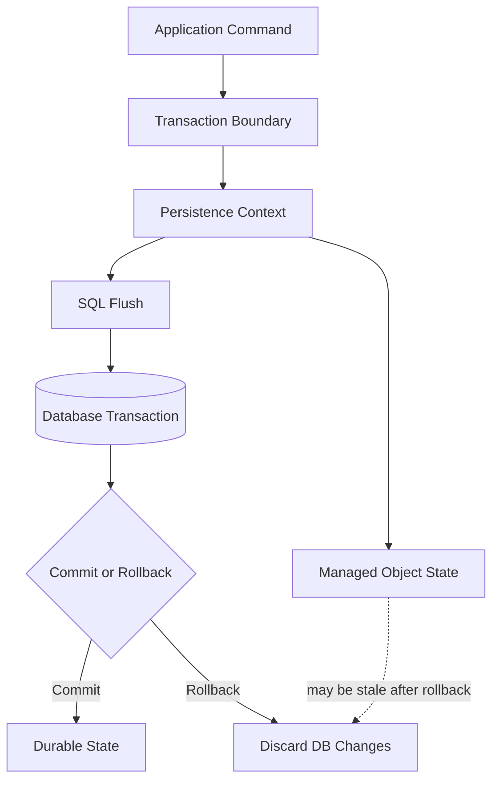
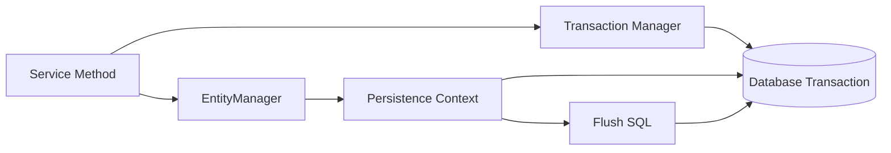
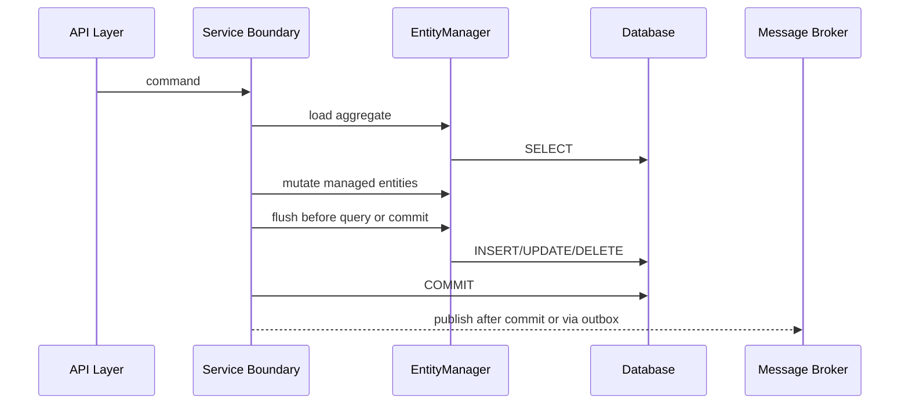
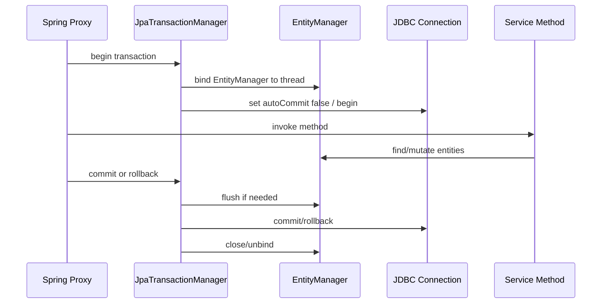
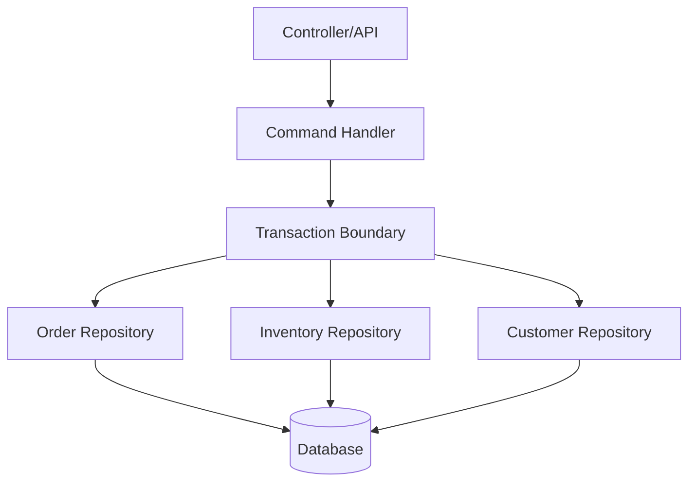
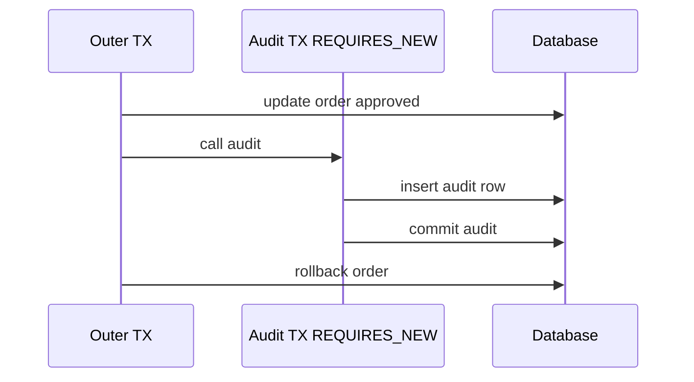
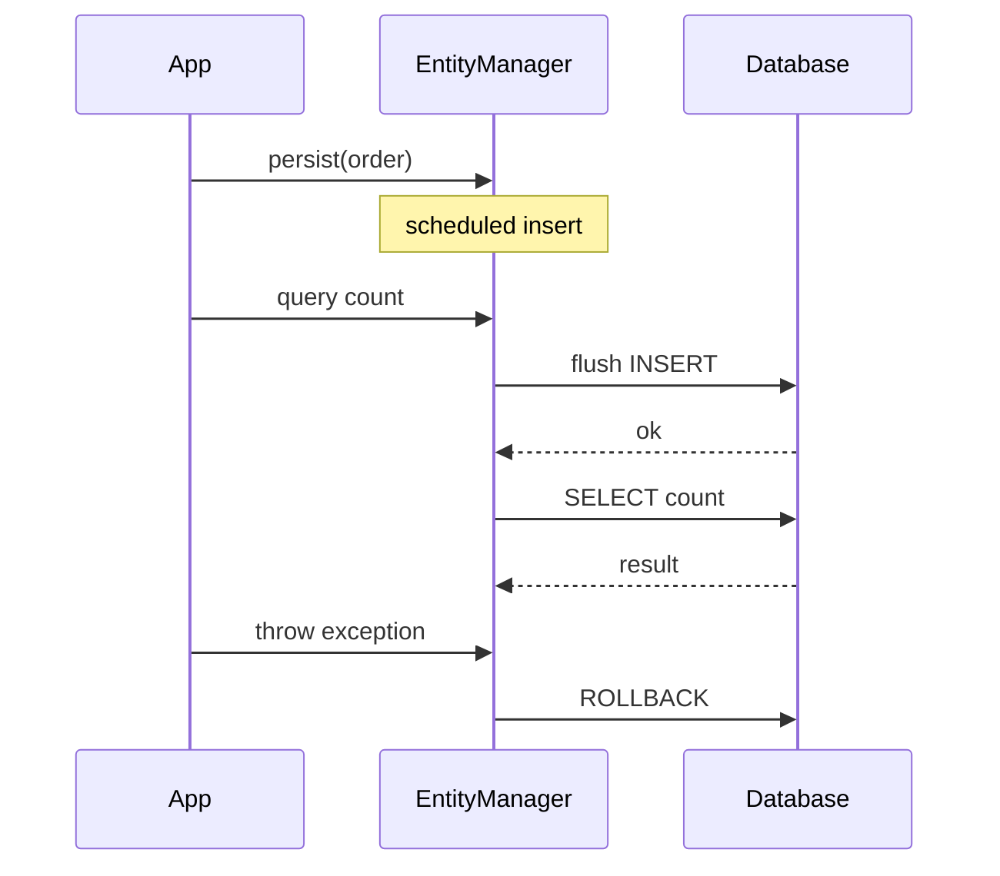
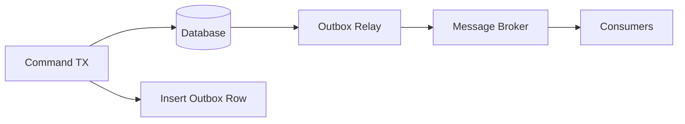
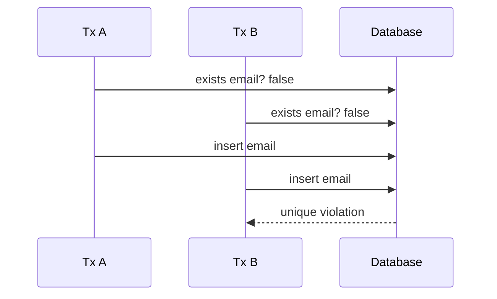
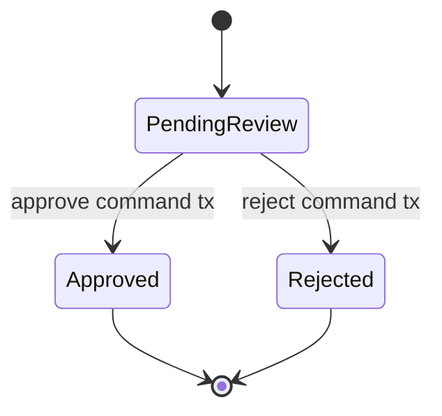

# Part 011 — Transaction Semantics in Java Persistence

## 1. Tujuan Part Ini

Part 010 menutup boundary schema dan migration. Sekarang kita masuk ke boundary yang lebih sering menimbulkan bug production: **transaction boundary**.

Di level basic, transaction sering direduksi menjadi:

```java
@Transactional
public void placeOrder(...) {
    ...
}
```

atau:

```java
entityManager.getTransaction().begin();
try {
    ...
    entityManager.getTransaction().commit();
} catch (Exception ex) {
    entityManager.getTransaction().rollback();
}
```

Itu belum cukup. Transaction bukan dekorator method. Transaction adalah **unit konsistensi**.

Target Part ini: Anda mampu menjawab dengan presisi:

- apa yang benar-benar dimulai ketika transaction dimulai;
- siapa pemilik transaction;
- kapan persistence context ikut transaction;
- kapan SQL boleh dikirim;
- kapan rollback terjadi;
- exception mana yang menyebabkan rollback;
- mengapa nested service call sering tidak membuat transaction baru;
- kapan harus memakai resource-local, JTA, atau Spring transaction;
- bagaimana mendesain transaction boundary untuk command, query, event, dan workflow;
- bagaimana menghindari dual-write, partial commit, dan hidden rollback.



Prinsip inti:

> Transaction boundary harus didesain dari invariant bisnis, bukan dari convenience annotation.

---

## 2. Kaufman Deconstruction: Pecah Skill Transaction

Agar cepat menjadi mahir, jangan belajar transaction sebagai satu topik besar. Pecah menjadi skill kecil:

| Skill | Pertanyaan yang Harus Bisa Dijawab |
|---|---|
| Transaction ownership | Siapa yang boleh membuka, commit, atau rollback transaction? |
| Physical vs logical transaction | Apakah method ini benar-benar membuka database transaction baru? |
| Persistence context participation | Apakah entity manager sedang bergabung dalam transaction aktif? |
| Flush timing | Apakah SQL sudah dikirim atau baru akan dikirim saat flush/commit? |
| Rollback semantics | Exception apa yang membuat rollback? |
| Propagation | Apa efek `REQUIRED`, `REQUIRES_NEW`, `MANDATORY`, `SUPPORTS`, `NESTED`? |
| Isolation awareness | Anomaly apa yang masih mungkin walau sudah transactional? |
| Failure modelling | Apa yang terjadi jika commit berhasil tapi event publish gagal? |
| Boundary design | Apakah transaction membungkus use case, repository, atau workflow panjang? |
| Observability | Bagaimana membuktikan transaction aktif, rollback terjadi, dan flush SQL benar? |

Praktik 20 jam untuk topik ini tidak boleh diisi membaca annotation saja. Latih skenario:

1. satu command berhasil commit;
2. exception runtime rollback;
3. checked exception tidak rollback secara default di Spring;
4. inner method `@Transactional` tidak aktif karena self-invocation;
5. `REQUIRES_NEW` commit walau outer transaction rollback;
6. query memicu flush sebelum commit;
7. rollback meninggalkan object Java dalam state yang tidak otomatis kembali;
8. outbox event tersimpan atomik dengan perubahan aggregate;
9. audit/log side-effect tidak sengaja ikut rollback;
10. long transaction menahan lock terlalu lama.

---

## 3. Transaction: Definisi Operasional

Secara database, transaction adalah sequence operasi yang diperlakukan sebagai satu unit atomic berdasarkan prinsip ACID:

| Prinsip | Makna Praktis |
|---|---|
| Atomicity | Semua perubahan commit bersama atau rollback bersama |
| Consistency | Constraint database dan invariant yang divalidasi tetap benar pada boundary commit |
| Isolation | Transaction concurrent tidak saling melihat intermediate state secara bebas |
| Durability | Setelah commit sukses, perubahan bertahan meski process aplikasi mati |

Dalam JPA, transaction memiliki dua lapisan:

1. **database transaction**: dikelola oleh JDBC connection atau transaction manager;
2. **persistence context transaction participation**: EntityManager ikut transaction untuk flush, dirty checking, dan synchronization.

Keduanya berhubungan, tetapi tidak identik.



Sebuah entity bisa managed dalam persistence context. Tetapi perubahan ke database hanya meaningful jika persistence context flush ke transaction database yang valid.

---

## 4. Mental Model: Transaction sebagai Consistency Envelope

Jangan bayangkan transaction sebagai “blok kode yang aman”. Bayangkan sebagai **envelope konsistensi**.

Di dalam envelope:

- beberapa entity boleh berubah;
- beberapa query boleh membaca state;
- persistence context boleh menyimpan perubahan sementara;
- SQL bisa dikirim bertahap melalui flush;
- constraint bisa gagal sebelum commit;
- side-effect eksternal harus dikontrol.

Di luar envelope:

- state durable sudah final;
- entity mungkin detached;
- lazy loading bisa gagal;
- retry harus dimulai dari command baru;
- event publik seharusnya merepresentasikan state committed.



Rule penting:

> Side-effect eksternal tidak boleh dianggap ikut rollback hanya karena terjadi di method `@Transactional`.

Mengirim email, memanggil API pembayaran, publish Kafka event, atau menghapus file object storage bukan bagian dari rollback database biasa.

---

## 5. Resource-Local vs JTA

Jakarta Persistence mengenal dua model utama transaction type:

| Transaction Type | Pemilik Physical Transaction | Umum Dipakai Di | Karakter |
|---|---|---|---|
| `RESOURCE_LOCAL` | Aplikasi / framework mengontrol transaction database lokal | Java SE, Spring Boot single database | Simple, satu resource utama |
| `JTA` | Container / JTA transaction manager | Jakarta EE, multi-resource XA, app server | Bisa koordinasi beberapa transactional resource |

### 5.1 Resource-Local

Dalam resource-local, aplikasi atau framework memanggil begin/commit/rollback pada transaction EntityManager atau abstraction transaction manager.

Contoh manual:

```java
EntityManager em = emf.createEntityManager();
EntityTransaction tx = em.getTransaction();

try {
    tx.begin();

    Order order = em.find(Order.class, orderId);
    order.approve();

    tx.commit();
} catch (RuntimeException ex) {
    if (tx.isActive()) {
        tx.rollback();
    }
    throw ex;
} finally {
    em.close();
}
```

Manual style ini berguna untuk memahami mechanics, tetapi di aplikasi enterprise biasanya transaction dibungkus framework.

Dalam Spring Boot dengan JPA single datasource, resource-local sering dikelola oleh `JpaTransactionManager`.

```java
@Service
public class OrderCommandService {

    @Transactional
    public void approveOrder(OrderId orderId) {
        Order order = orderRepository.getRequired(orderId);
        order.approve();
    }
}
```

Yang terjadi secara konseptual:



### 5.2 JTA

JTA cocok ketika transaction harus dikoordinasikan oleh container atau transaction manager eksternal.

Contoh kasus:

- Jakarta EE application server;
- transaction melibatkan beberapa datasource XA;
- transaction melibatkan JMS transactional resource;
- legacy enterprise system yang membutuhkan distributed transaction.

Namun JTA bukan silver bullet. XA transaction punya biaya, kompleksitas, timeout, heuristic failure, dan operational burden. Untuk microservice modern, sering lebih baik memakai:

- local transaction;
- transactional outbox;
- idempotent consumer;
- saga/process manager;
- compensating action.

Rule:

> Jangan memakai distributed transaction hanya untuk menghindari desain idempotency dan event reliability. Gunakan XA hanya jika boundary resource benar-benar harus atomic dan platform siap mengoperasikannya.

---

## 6. EntityManager dan Transaction Participation

EntityManager dapat berada dalam beberapa kondisi terkait transaction:

| Kondisi | Makna |
|---|---|
| EntityManager terbuka, tidak ada transaction | Bisa membaca dalam beberapa konfigurasi, tetapi write tidak boleh diasumsikan durable |
| Transaction aktif, EntityManager joined | Persistence context ikut flush/commit/rollback |
| Transaction aktif, EntityManager belum joined | Perlu join eksplisit/otomatis tergantung environment |
| Unsynchronized persistence context | Persistence context tidak otomatis ikut transaction sampai `joinTransaction()` |

Dalam aplikasi Spring umum, Anda jarang memanggil `joinTransaction()` manual karena EntityManager dikelola framework. Tetapi mental model ini penting saat:

- memakai extended persistence context;
- memakai manual EntityManager;
- menulis integration framework;
- debugging “no transaction is in progress”;
- debugging flush tidak terjadi;
- debugging lazy loading di luar transaction.

Contoh masalah:

```java
public void updateWithoutTransaction(Long id) {
    Order order = entityManager.find(Order.class, id);
    order.rename("New Name");
    // Tidak ada transaction boundary yang jelas.
    // Jangan asumsikan perubahan tersimpan.
}
```

Di banyak konfigurasi, write operation membutuhkan transaction. Bahkan jika provider melakukan sesuatu yang terlihat berhasil, desain ini tidak portable dan tidak production-grade.

---

## 7. Transaction Boundary Harus di Service/Command Layer

Anti-pattern umum:

```java
@Repository
public class OrderRepository {

    @Transactional
    public void save(Order order) {
        entityManager.persist(order);
    }
}
```

Lalu service memanggil beberapa repository:

```java
public void placeOrder(...) {
    orderRepository.save(order);
    paymentRepository.save(payment);
    inventoryRepository.reserve(...);
}
```

Jika masing-masing repository membuka transaction sendiri, invariant use case pecah.

Boundary yang benar biasanya:

```java
@Service
public class PlaceOrderHandler {

    @Transactional
    public PlaceOrderResult handle(PlaceOrderCommand command) {
        Customer customer = customerRepository.getRequired(command.customerId());
        Product product = productRepository.getRequired(command.productId());

        Order order = Order.place(customer, product, command.quantity());
        inventory.reserve(product.id(), command.quantity());

        orderRepository.add(order);

        return PlaceOrderResult.from(order);
    }
}
```

Repository tidak menjadi pemilik transaction. Repository menjadi cara mengakses persistence. Use case menjadi pemilik konsistensi.



Rule:

> Satu command bisnis yang harus konsisten harus berada dalam satu transaction boundary yang eksplisit.

---

## 8. Spring `@Transactional`: Yang Sering Disalahpahami

Spring `@Transactional` adalah declarative transaction via proxy/AOP. Artinya annotation hanya bekerja ketika method dipanggil melalui proxy yang dikelola Spring.

### 8.1 Public Method Boundary

Umumnya, letakkan `@Transactional` pada public service method.

```java
@Service
public class OrderService {

    @Transactional
    public void approve(Long orderId) {
        Order order = orderRepository.getRequired(orderId);
        order.approve();
    }
}
```

Hindari mengandalkan annotation pada private method:

```java
@Service
public class OrderService {

    public void approve(Long orderId) {
        approveInTransaction(orderId); // self-invocation
    }

    @Transactional
    private void approveInTransaction(Long orderId) {
        ...
    }
}
```

Private method tidak dipanggil lewat proxy. Bahkan public method dalam class yang sama yang dipanggil lewat `this.someTransactionalMethod()` juga tidak melewati proxy standar.

### 8.2 Self-Invocation Trap

```java
@Service
public class ImportService {

    public void importAll(List<Row> rows) {
        for (Row row : rows) {
            importOne(row); // self-invocation: @Transactional bisa tidak aktif
        }
    }

    @Transactional(propagation = Propagation.REQUIRES_NEW)
    public void importOne(Row row) {
        ...
    }
}
```

Developer berharap tiap row punya transaction baru. Tetapi karena call terjadi di object yang sama, proxy tidak terlibat.

Solusi yang lebih bersih:

```java
@Service
public class ImportService {
    private final ImportOneRowHandler importOneRowHandler;

    public void importAll(List<Row> rows) {
        for (Row row : rows) {
            importOneRowHandler.importOne(row);
        }
    }
}

@Service
public class ImportOneRowHandler {

    @Transactional(propagation = Propagation.REQUIRES_NEW)
    public void importOne(Row row) {
        ...
    }
}
```

### 8.3 Checked Exception Rollback Trap

Spring default rollback biasanya:

- rollback untuk `RuntimeException` dan `Error`;
- tidak rollback untuk checked exception, kecuali dikonfigurasi.

```java
@Transactional
public void approve(OrderId id) throws ApprovalException {
    Order order = orderRepository.getRequired(id);
    order.approve();

    if (riskEngine.rejects(order)) {
        throw new ApprovalException("Rejected"); // checked exception
    }
}
```

Jika `ApprovalException` adalah checked exception, default bisa commit kecuali Anda mengatur rollback rule.

```java
@Transactional(rollbackFor = ApprovalException.class)
public void approve(OrderId id) throws ApprovalException {
    ...
}
```

Namun jangan menjadikan `rollbackFor = Exception.class` sebagai reflex tanpa desain. Pahami exception taxonomy Anda.

Rekomendasi enterprise:

- business validation failure yang tidak mengubah state: validasi sebelum mutasi;
- command failure setelah mutasi: gunakan unchecked domain exception atau rollback rule eksplisit;
- integration failure: pisahkan apakah harus rollback command atau masuk retry/outbox;
- checked exception dari IO/library: bungkus menjadi application exception yang jelas rollback behavior-nya.

---

## 9. Propagation Semantics

Propagation menjawab: **jika method transactional dipanggil ketika sudah ada transaction aktif, apa yang terjadi?**

| Propagation | Behavior | Use Case | Risk |
|---|---|---|---|
| `REQUIRED` | Join transaction aktif atau buat baru | Default command service | Inner failure rollback outer |
| `REQUIRES_NEW` | Suspend transaction lama, buat baru | audit independen, per-item import | Partial commit, connection pressure |
| `MANDATORY` | Harus sudah ada transaction | repository/internal operation yang wajib dipanggil dari command | Error jika dipakai dari luar boundary |
| `SUPPORTS` | Ikut jika ada, non-transactional jika tidak ada | read helper tertentu | Behavior berubah tergantung caller |
| `NOT_SUPPORTED` | Suspend transaction | operasi non-transactional panjang | Read consistency melemah |
| `NEVER` | Error jika ada transaction | guard untuk operasi tertentu | Jarang dipakai |
| `NESTED` | Savepoint dalam physical transaction jika supported | partial rollback internal | Tidak sama dengan independent commit |

### 9.1 `REQUIRED`: Default yang Masuk Akal

```java
@Transactional
public void placeOrder(...) {
    orderService.create(...);       // join same tx
    inventoryService.reserve(...);  // join same tx
}
```

Jika `reserve()` gagal dengan runtime exception, seluruh transaction rollback.

### 9.2 `REQUIRES_NEW`: Bukan Nested, Melainkan Independent

```java
@Transactional
public void approveOrder(OrderId id) {
    Order order = orderRepository.getRequired(id);
    order.approve();

    auditService.record("ORDER_APPROVED", id); // REQUIRES_NEW

    throw new RuntimeException("later failure");
}
```

Jika `auditService.record()` memakai `REQUIRES_NEW`, audit bisa commit walaupun approval rollback.

Ini bisa benar atau salah tergantung invariant.

Benar jika audit berarti “attempted action”. Salah jika audit berarti “committed state”.



Rule:

> `REQUIRES_NEW` membuat sejarah durable yang bisa berbeda dari hasil akhir outer transaction.

### 9.3 `NESTED`: Savepoint, Bukan Commit Mandiri

`NESTED` biasanya menggunakan savepoint dalam physical transaction yang sama. Jika outer transaction rollback, nested changes juga hilang walau nested block terlihat sukses.

Gunakan untuk:

- mencoba sebagian operasi;
- rollback sebagian tanpa membatalkan semua;
- hanya jika transaction manager dan database mendukung savepoint.

Jangan gunakan untuk audit yang harus survive outer rollback.

---

## 10. Transaction Rollback-Only State

Salah satu bug membingungkan di Spring/JPA: inner operation gagal, exception ditangkap, tetapi outer commit tetap gagal karena transaction sudah ditandai rollback-only.

Contoh:

```java
@Transactional
public void process(OrderId id) {
    try {
        paymentService.charge(id); // REQUIRED, join same tx, throws RuntimeException
    } catch (RuntimeException ex) {
        log.warn("Payment failed, continue with manual review", ex);
    }

    reviewRepository.save(ManualReview.forOrder(id));
}
```

Developer berharap manual review tersimpan. Tetapi jika transaction sudah rollback-only, commit outer akan gagal.

Solusi tergantung intent:

### Intent A: semua gagal jika payment gagal

Jangan tangkap exception, atau tangkap lalu lempar domain exception.

```java
@Transactional
public void process(OrderId id) {
    paymentService.charge(id);
    reviewRepository.save(...);
}
```

### Intent B: payment gagal tapi manual review harus tersimpan

Pisahkan boundary:

```java
public void process(OrderId id) {
    try {
        paymentCommand.chargeInTransaction(id);
    } catch (PaymentFailedException ex) {
        manualReviewCommand.createInNewTransaction(id, ex.reason());
    }
}
```

Dengan dua command boundary eksplisit, behavior terlihat.

---

## 11. Read-Only Transaction

`@Transactional(readOnly = true)` sering dipahami salah sebagai “database pasti menolak write”. Tidak selalu.

Makna praktis tergantung framework/provider/database:

- memberi hint ke transaction manager;
- bisa mengatur flush mode agar tidak flush otomatis;
- bisa mengoptimalkan dirty checking;
- pada beberapa database bisa set transaction read-only;
- bukan pengganti authorization atau invariant guard.

Contoh read service:

```java
@Transactional(readOnly = true)
public OrderDetails getDetails(OrderId id) {
    return orderRepository.findDetails(id)
            .orElseThrow(() -> new OrderNotFoundException(id));
}
```

Jangan mutasi entity dalam read-only transaction:

```java
@Transactional(readOnly = true)
public OrderDetails getDetails(OrderId id) {
    Order order = orderRepository.getRequired(id);
    order.markViewed(); // ambiguous, dangerous
    return OrderDetails.from(order);
}
```

Rule:

> `readOnly = true` adalah kontrak intent. Perlakukan pelanggaran intent sebagai bug, walau provider tidak selalu memblokirnya.

---

## 12. Flush Bukan Commit

Ini salah satu mental model terpenting.

| Operasi | Makna |
|---|---|
| `persist()` | Entity menjadi managed dan dijadwalkan insert |
| dirty field assignment | Perubahan object terdeteksi nanti oleh dirty checking |
| `flush()` | SQL dikirim ke database dalam transaction aktif |
| `commit()` | Database transaction dibuat durable |
| `rollback()` | Database membatalkan perubahan dalam transaction |

Flush bisa terjadi sebelum commit:

- sebelum query tertentu;
- saat manual `entityManager.flush()`;
- sebelum transaction commit;
- tergantung flush mode/provider.

```java
@Transactional
public void example() {
    Order order = new Order(...);
    entityManager.persist(order);

    // Query ini dapat memicu flush sebelum dijalankan.
    long count = entityManager
        .createQuery("select count(o) from Order o", Long.class)
        .getSingleResult();

    // SQL INSERT bisa sudah dikirim, tapi belum commit.
}
```

Kenapa penting?

- constraint violation bisa muncul saat flush, bukan commit;
- trigger database bisa berjalan sebelum commit;
- row lock bisa diperoleh sebelum commit;
- query di transaction yang sama bisa melihat hasil flush;
- rollback masih bisa membatalkan hasil flush.



Rule:

> Flush membuktikan SQL valid dalam transaction. Commit membuatnya durable.

---

## 13. Rollback Tidak Memutar Balik Object Java

Rollback membatalkan database transaction. Rollback tidak otomatis mengembalikan semua object Java ke nilai lama secara aman untuk dipakai ulang.

Contoh:

```java
Order order = null;
try {
    tx.begin();
    order = em.find(Order.class, id);
    order.approve();
    tx.rollback();
} finally {
    em.close();
}

// object Java masih bisa punya status APPROVED di memory,
// walau database tidak berubah.
```

Implikasi:

- jangan lanjut memakai entity setelah rollback seolah-olah state-nya benar;
- tutup/clear persistence context setelah rollback;
- retry harus memuat ulang state dari database;
- jangan publish event berdasarkan object state setelah rollback.

Pattern retry yang benar:

```java
public void retryableApprove(OrderId id) {
    retryTemplate.execute(ctx -> {
        approveCommand.approveInNewTransaction(id);
        return null;
    });
}
```

Di setiap retry, buka transaction dan persistence context baru.

---

## 14. Transaction Length: Pendek, Tapi Tidak Terfragmentasi

Ada dua ekstrem:

### 14.1 Transaction Terlalu Panjang

```java
@Transactional
public void importFile(MultipartFile file) {
    List<Row> rows = parseLargeFile(file);          // lama
    ExternalPrice price = pricingApi.fetch(...);    // network call
    rows.forEach(this::saveRow);                    // banyak write
}
```

Masalah:

- connection database tertahan lama;
- lock bisa tertahan;
- transaction timeout;
- persistence context membesar;
- retry mahal;
- external API delay memperpanjang lock window.

### 14.2 Transaction Terlalu Terfragmentasi

```java
public void placeOrder(...) {
    createOrderTx(...);      // commit
    reserveInventoryTx(...); // commit/fail
    createPaymentTx(...);    // commit/fail
}
```

Masalah:

- partial commit;
- invariant cross-entity pecah;
- perlu compensation;
- user melihat state antara yang belum valid.

### 14.3 Boundary yang Lebih Baik

Pisahkan preparation non-transactional dari mutation transactional.

```java
public ImportResult importFile(MultipartFile file) {
    List<Row> rows = parser.parse(file); // no DB tx
    ImportPlan plan = validator.validate(rows); // no DB tx

    return importCommand.persistValidRows(plan); // transactional chunk
}
```

Untuk data besar, pakai chunk transaction:

```java
public void importRows(List<Row> rows) {
    for (List<Row> chunk : Lists.partition(rows, 500)) {
        importChunkHandler.importChunk(chunk); // each chunk has tx
    }
}

@Transactional
public void importChunk(List<Row> chunk) {
    for (Row row : chunk) {
        repository.save(row.toEntity());
    }
}
```

Rule:

> Transaction harus cukup besar untuk menjaga invariant, tetapi cukup kecil agar tidak menjadi operational liability.

---

## 15. Transaction dan External Side Effects

Database rollback tidak membatalkan:

- email terkirim;
- HTTP request ke service lain;
- Kafka message yang sudah publish;
- file yang sudah dihapus;
- cache invalidation yang sudah terjadi;
- payment charge yang sudah diproses.

Anti-pattern:

```java
@Transactional
public void approve(OrderId id) {
    Order order = orderRepository.getRequired(id);
    order.approve();

    emailClient.sendApprovalEmail(order.customerEmail());

    if (someLaterValidationFails()) {
        throw new RuntimeException("rollback db only");
    }
}
```

Email sudah terkirim, database rollback.

Better options:

### 15.1 After-Commit Hook

Gunakan callback after commit untuk side-effect yang boleh terjadi setelah commit.

```java
@Transactional
public void approve(OrderId id) {
    Order order = orderRepository.getRequired(id);
    order.approve();

    domainEvents.registerAfterCommit(new OrderApproved(id));
}
```

Tetapi after-commit hook juga punya risiko: process bisa mati setelah commit sebelum callback tereksekusi.

### 15.2 Transactional Outbox

Untuk event yang harus reliable:

```java
@Transactional
public void approve(OrderId id) {
    Order order = orderRepository.getRequired(id);
    order.approve();

    outboxRepository.add(OutboxMessage.of(
        "OrderApproved",
        order.id().value(),
        json.serialize(new OrderApproved(order.id()))
    ));
}
```

Perubahan order dan outbox message commit atomik di database yang sama. Relay terpisah mengirim event setelah commit.



Rule:

> Untuk event durable antar service, outbox lebih aman daripada publish langsung di dalam transaction.

Outbox akan dibahas detail di Part 030.

---

## 16. Transaction dan Lazy Loading

Lazy loading butuh persistence context yang masih terbuka. Transaction sering, tetapi tidak selalu, beririsan dengan lifecycle persistence context.

Anti-pattern umum:

```java
@GetMapping("/orders/{id}")
public OrderResponse get(@PathVariable Long id) {
    Order order = orderService.getOrder(id); // tx selesai di service
    return mapper.toResponse(order);         // lazy collection access di luar tx
}
```

Jika mapper mengakses `order.getLines()`, bisa muncul lazy initialization error.

Solusi bukan sekadar mengaktifkan Open Session in View. Solusi engineering:

- desain read model/projection eksplisit;
- fetch plan sesuai use case;
- mapping DTO di dalam transaction read-only;
- hindari mengembalikan entity ke API layer.

```java
@Transactional(readOnly = true)
public OrderResponse getOrderDetails(OrderId id) {
    Order order = orderRepository.getWithLines(id)
            .orElseThrow(() -> new OrderNotFoundException(id));

    return OrderResponse.from(order);
}
```

Rule:

> API boundary tidak boleh bergantung pada persistence context yang bocor keluar dari service.

---

## 17. Transaction dan Repository Design

Repository method sebaiknya tidak menyembunyikan transaction behavior yang mengejutkan.

### 17.1 Repository Method yang Aman

```java
public interface OrderRepository {
    Optional<Order> findById(OrderId id);
    Order getRequired(OrderId id);
    void add(Order order);
    void remove(Order order);
}
```

Repository ini tidak berjanji commit. Ia hanya beroperasi dalam persistence context yang disediakan caller.

### 17.2 Repository Method yang Berbahaya

```java
public interface OrderRepository {
    void saveAndCommit(Order order);
    void approveInNewTransaction(OrderId id);
}
```

Method seperti ini mencampur persistence access dengan use case boundary. Kadang perlu, tetapi beri nama eksplisit dan letakkan di command handler, bukan repository generik.

### 17.3 `save()` Tidak Selalu Perlu untuk Managed Entity

```java
@Transactional
public void approve(OrderId id) {
    Order order = orderRepository.getRequired(id);
    order.approve();
    orderRepository.save(order); // sering redundant untuk managed entity
}
```

Jika `order` managed, dirty checking akan flush perubahan. `save()` bisa membuat developer salah paham bahwa perubahan hanya tersimpan jika dipanggil `save()`.

Better:

```java
@Transactional
public void approve(OrderId id) {
    Order order = orderRepository.getRequired(id);
    order.approve();
}
```

Namun untuk entity baru, repository `add()` tetap masuk akal:

```java
@Transactional
public OrderId create(CreateOrderCommand command) {
    Order order = Order.create(...);
    orderRepository.add(order);
    return order.id();
}
```

---

## 18. Transaction dan Constraint Timing

Database constraint bisa gagal saat:

- flush;
- commit;
- statement execution;
- deferred constraint checking, tergantung database.

Contoh unique constraint:

```java
@Transactional
public void registerEmail(String email) {
    User user = User.register(email);
    entityManager.persist(user);

    // Exception bisa belum muncul di sini.
}
```

Exception mungkin muncul saat commit. Jika Anda perlu menangkap dan menerjemahkan error, boundary harus jelas.

```java
public RegisterResult register(String email) {
    try {
        return registerCommand.registerInTransaction(email);
    } catch (DuplicateEmailPersistenceException ex) {
        return RegisterResult.duplicateEmail(email);
    }
}
```

Tetapi jangan mengandalkan pre-check saja:

```java
if (userRepository.existsByEmail(email)) {
    throw new DuplicateEmailException(email);
}
userRepository.add(User.register(email));
```

Race condition:



Correct model:

- pre-check untuk user experience;
- database constraint untuk correctness;
- exception translation untuk clean domain response.

---

## 19. Transaction dan Lock Duration

Lock duration ditentukan oleh database dan isolation/locking behavior. Namun transaction length sangat memengaruhi dampaknya.

Contoh buruk:

```java
@Transactional
public void approveWithManualReview(OrderId id) {
    Order order = orderRepository.lockForUpdate(id);
    order.markUnderReview();

    humanWorkflow.waitForApproval(); // impossible/very bad inside tx

    order.approve();
}
```

Jangan pernah menahan transaction untuk workflow manusia atau call eksternal panjang.

Pattern yang benar:

1. transaction pendek: mark order `PENDING_REVIEW`;
2. commit;
3. workflow manusia berjalan di luar transaction;
4. command baru: approve/reject dengan optimistic locking/version check.



Rule:

> Workflow panjang harus dimodelkan sebagai state machine durable, bukan transaction panjang.

---

## 20. Transaction Timeout

Timeout adalah guardrail, bukan strategi desain.

Gunakan timeout untuk mencegah transaction runaway:

```java
@Transactional(timeout = 5)
public void approve(OrderId id) {
    ...
}
```

Tetapi jika timeout sering terjadi, akar masalah biasanya:

- query lambat;
- lock contention;
- transaction terlalu panjang;
- external call di dalam transaction;
- batch terlalu besar;
- missing index;
- deadlock/retry storm.

Observability yang perlu:

- transaction duration metric;
- slow SQL logs;
- lock wait metric;
- database wait events;
- application trace span untuk command;
- exception taxonomy untuk timeout vs deadlock vs constraint.

---

## 21. Transaction dan Isolation: Jangan Overclaim

`@Transactional` tidak otomatis berarti serializable correctness.

Pada isolation default banyak database, anomaly masih mungkin:

- non-repeatable read;
- phantom read;
- lost update jika tidak memakai locking/versioning;
- write skew;
- stale read;
- duplicate business decision.

Contoh write skew:

```text
Rule: at least one doctor must be on call.
Tx A sees Dr. A and Dr. B on call, turns Dr. A off.
Tx B sees Dr. A and Dr. B on call, turns Dr. B off.
Both commit.
No doctor remains on call.
```

Solusi bisa berupa:

- stronger isolation;
- pessimistic lock pada guard row;
- optimistic version pada aggregate/constraint owner;
- database constraint;
- serialized command processing;
- advisory lock;
- unique partial index, tergantung database.

Isolation akan dibahas khusus di Part 022.

---

## 22. Transaction Design by Use Case Type

### 22.1 Command Transaction

Command mengubah state. Biasanya butuh transaction.

```java
@Transactional
public void approveOrder(ApproveOrderCommand command) {
    Order order = orderRepository.getRequired(command.orderId());
    order.approve(command.approvedBy());
}
```

Checklist:

- satu command = satu consistency boundary;
- validasi invariant sebelum commit;
- lock/version sesuai concurrency risk;
- outbox untuk event;
- tidak ada network call panjang di dalam boundary.

### 22.2 Query Transaction

Query tidak mengubah state, tetapi read-only transaction tetap berguna untuk:

- consistent read;
- lazy fetch selama mapping DTO;
- provider optimization;
- repeatable behavior.

```java
@Transactional(readOnly = true)
public OrderDetails getDetails(OrderId id) {
    return orderReadRepository.getDetails(id);
}
```

### 22.3 Batch Transaction

Batch perlu chunk.

```java
public void processBatch(BatchId id) {
    while (true) {
        List<Item> items = claimNextChunk(id, 500);
        if (items.isEmpty()) return;
        processChunkCommand.process(items);
    }
}
```

### 22.4 Workflow Transaction

Workflow panjang bukan satu transaction.

Gunakan state transition:

```text
SUBMITTED -> VALIDATED -> WAITING_PAYMENT -> PAID -> FULFILLED
```

Setiap transition adalah command transaction pendek.

---

## 23. Common Failure Modes

### 23.1 Hidden Partial Commit

Penyebab:

- `REQUIRES_NEW` dipakai tanpa sadar;
- repository membuka transaction sendiri;
- event/audit side-effect tidak ikut rollback.

Deteksi:

- baca propagation semua service dependency;
- integration test rollback scenario;
- trace transaction boundary;
- review naming method.

### 23.2 Transaction Too Wide

Penyebab:

- parsing file di dalam transaction;
- external API di dalam transaction;
- loop besar tanpa chunk;
- mapping DTO berat setelah mutation.

Deteksi:

- transaction duration metric;
- connection pool starvation;
- lock wait;
- heap growth persistence context.

### 23.3 Transaction Too Narrow

Penyebab:

- `@Transactional` di repository CRUD;
- service non-transactional memanggil beberapa save;
- command dipecah karena “clean architecture” yang keliru.

Deteksi:

- invariant cross-entity pecah;
- data intermediate terlihat;
- recovery membutuhkan manual cleanup.

### 23.4 Rollback Rule Salah

Penyebab:

- checked exception commit;
- exception ditangkap lalu tidak mark rollback;
- async failure terjadi di luar transaction;
- reactive/async boundary tidak membawa transaction context.

### 23.5 Lazy Loading Leaks

Penyebab:

- entity keluar service;
- mapper berjalan setelah transaction;
- OSIV menyembunyikan query tambahan di view layer.

---

## 24. Production-Grade Transaction Checklist

Untuk setiap write use case, jawab:

1. Apa invariant yang harus benar saat commit?
2. Entity/table mana yang berada dalam consistency boundary?
3. Apakah semua perubahan berada dalam satu physical transaction?
4. Apakah ada side-effect eksternal di dalam boundary?
5. Jika ada event, apakah memakai outbox atau after-commit?
6. Exception mana yang rollback?
7. Apakah checked exception punya rollback rule yang benar?
8. Apakah ada inner `REQUIRES_NEW`?
9. Apakah transaction melakukan network call?
10. Apakah query di tengah command bisa memicu flush?
11. Apakah constraint violation ditangani di boundary yang tepat?
12. Apakah transaction terlalu lama?
13. Apakah lock duration bisa diterima?
14. Apakah retry membuka persistence context baru?
15. Apakah observability bisa membuktikan commit/rollback behavior?

---

## 25. Deliberate Practice

### Latihan 1 — Checked Exception Rollback

Buat service:

```java
@Transactional
public void createUser(String email) throws BusinessRuleException {
    userRepository.add(User.register(email));
    throw new BusinessRuleException("fail");
}
```

Eksperimen:

- apakah row commit?
- ubah exception menjadi runtime;
- tambah `rollbackFor`;
- tulis integration test untuk membuktikan behavior.

### Latihan 2 — Self Invocation

Buat `importAll()` yang memanggil `importOne()` dengan `REQUIRES_NEW` dalam class yang sama.

Buktikan:

- transaction baru tidak terjadi sesuai ekspektasi;
- pindahkan `importOne()` ke bean lain;
- bandingkan jumlah commit.

### Latihan 3 — Flush Before Query

Dalam satu transaction:

1. persist entity baru;
2. jalankan JPQL count;
3. lihat SQL log;
4. ubah flush mode;
5. amati hasil.

### Latihan 4 — Rollback Object State

Dalam transaction:

1. load order;
2. ubah status;
3. rollback;
4. inspect object Java;
5. reload order di transaction baru.

Tulis kesimpulan: rollback database bukan rollback object memory.

### Latihan 5 — Outbox vs Direct Publish

Simulasikan:

- update order;
- publish event langsung;
- lempar exception setelah publish.

Lalu ubah menjadi outbox row dalam transaction yang sama.

---

## 26. Review Question

Jawab tanpa melihat materi:

1. Apa bedanya flush dan commit?
2. Kenapa `@Transactional` pada private method tidak bisa diandalkan?
3. Apa risiko checked exception di Spring transaction?
4. Kapan `REQUIRES_NEW` benar-benar berguna?
5. Mengapa rollback tidak mengembalikan object Java ke state lama?
6. Mengapa external API call di dalam transaction sering buruk?
7. Bagaimana mendesain workflow approval manusia tanpa transaction panjang?
8. Mengapa repository sebaiknya tidak menjadi pemilik transaction use case?
9. Apa yang terjadi jika inner REQUIRED method gagal dan exception ditangkap outer method?
10. Kapan read-only transaction tetap berguna?

---

## 27. Engineering Heuristics

Gunakan heuristik ini saat review code:

- `@Transactional` di controller biasanya smell; letakkan di service/command layer.
- `@Transactional` di repository generik sering menyembunyikan boundary.
- `REQUIRES_NEW` wajib diberi alasan eksplisit.
- External call dalam transaction harus dicurigai.
- Long loop dalam transaction harus dicurigai.
- Entity keluar service boundary harus dicurigai.
- Catch exception dalam transaction harus dicek rollback-only behavior.
- Checked exception dari transactional method harus dicek rollback rule.
- Query di tengah mutation bisa menyebabkan flush lebih awal.
- Event publish langsung dalam transaction harus ditantang.
- Transaction timeout bukan pengganti query/index/lock tuning.
- Workflow panjang adalah state machine, bukan transaction panjang.

---

## 28. Mini Case Study: Enforcement Case Escalation

Misal domain regulatory enforcement:

- case bisa di-escalate;
- escalation harus membuat assignment baru;
- previous queue item harus ditutup;
- audit harus mencatat attempted escalation;
- notification dikirim ke officer;
- event `CaseEscalated` dikonsumsi oleh reporting system.

Naive implementation:

```java
@Transactional
public void escalate(CaseId id, OfficerId officerId) {
    EnforcementCase c = caseRepository.getRequired(id);
    c.escalateTo(officerId);

    queueRepository.closeCurrent(id);
    assignmentRepository.add(Assignment.forCase(id, officerId));

    auditService.record("CASE_ESCALATED", id);      // maybe REQUIRES_NEW?
    notificationClient.notifyOfficer(officerId);    // external side-effect
    eventPublisher.publish(new CaseEscalated(id));  // external side-effect
}
```

Problems:

- notification bisa terkirim lalu DB rollback;
- event bisa publish sebelum commit;
- audit semantics tidak jelas: attempted or committed?;
- if audit uses `REQUIRES_NEW`, audit may survive rollback;
- transaction mungkin lama karena notification call.

Better implementation:

```java
@Transactional
public void escalate(EscalateCaseCommand command) {
    EnforcementCase c = caseRepository.getRequired(command.caseId());
    c.escalateTo(command.officerId(), command.reason());

    queueRepository.closeCurrent(command.caseId());
    assignmentRepository.add(Assignment.forCase(command.caseId(), command.officerId()));

    auditRepository.add(AuditRecord.committedIntent(
        "CASE_ESCALATION_REQUESTED",
        command.caseId(),
        command.requestedBy()
    ));

    outboxRepository.add(OutboxMessage.of(
        "CaseEscalated",
        command.caseId().value(),
        CaseEscalatedPayload.from(command)
    ));
}
```

Notification worker consumes `CaseEscalated` after commit. Reporting gets event from outbox relay.

This design makes transaction boundary align with durable state.

---

## 29. Apa yang Tidak Dibahas Mendalam di Part Ini

Agar tidak mengulang seri SQL/JDBC dan agar fokus tetap tajam, Part ini tidak membahas detail:

- semua isolation level secara formal — lanjut Part 022;
- optimistic/pessimistic locking detail — lanjut Part 021;
- flush mode detail — lanjut Part 013;
- outbox/inbox implementation detail — lanjut Part 030;
- performance tuning transaction — lanjut Part 033;
- Spring Data repository detail — lanjut Part 024.

---

## 30. Ringkasan

Transaction dalam Java Persistence adalah boundary konsistensi, bukan sekadar annotation.

Yang harus Anda internalisasi:

- transaction harus dimiliki oleh service/command boundary;
- repository sebaiknya tidak menyembunyikan commit;
- resource-local cocok untuk single database application;
- JTA cocok untuk container/distributed transaction tertentu, tetapi tidak gratis;
- Spring `@Transactional` bekerja melalui proxy dan punya rollback rule yang harus dipahami;
- flush bukan commit;
- rollback tidak mengembalikan object Java secara aman;
- `REQUIRES_NEW` menciptakan partial durability;
- transaction panjang adalah operational risk;
- external side-effect harus dipisah dengan after-commit atau outbox;
- workflow panjang harus dimodelkan sebagai state machine durable.

Mental model akhir:

> Desain transaction dari invariant bisnis, batasi durasinya secara operasional, dan buat side-effect eksplisit terhadap commit boundary.

Part berikutnya akan membedah persistence context lebih dalam: first-level cache, identity map, dirty checking, snapshots, write-behind, dan ilusi managed state.

---

## Referensi

- Jakarta Persistence 3.2 Specification — transaction, EntityManager, persistence context, schema and provider semantics.
- Spring Framework Reference — declarative transaction management, `@Transactional`, rollback rules, propagation behavior.
- Hibernate ORM User Guide — Session/EntityManager, persistence context, flush behavior, dirty checking, transaction integration.
- Martin Fowler, Patterns of Enterprise Application Architecture — Unit of Work, Identity Map, Transaction Script, Repository.
