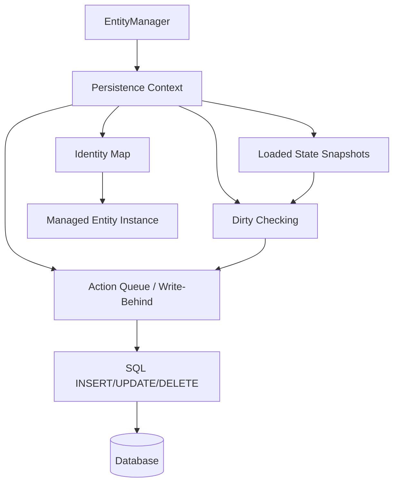
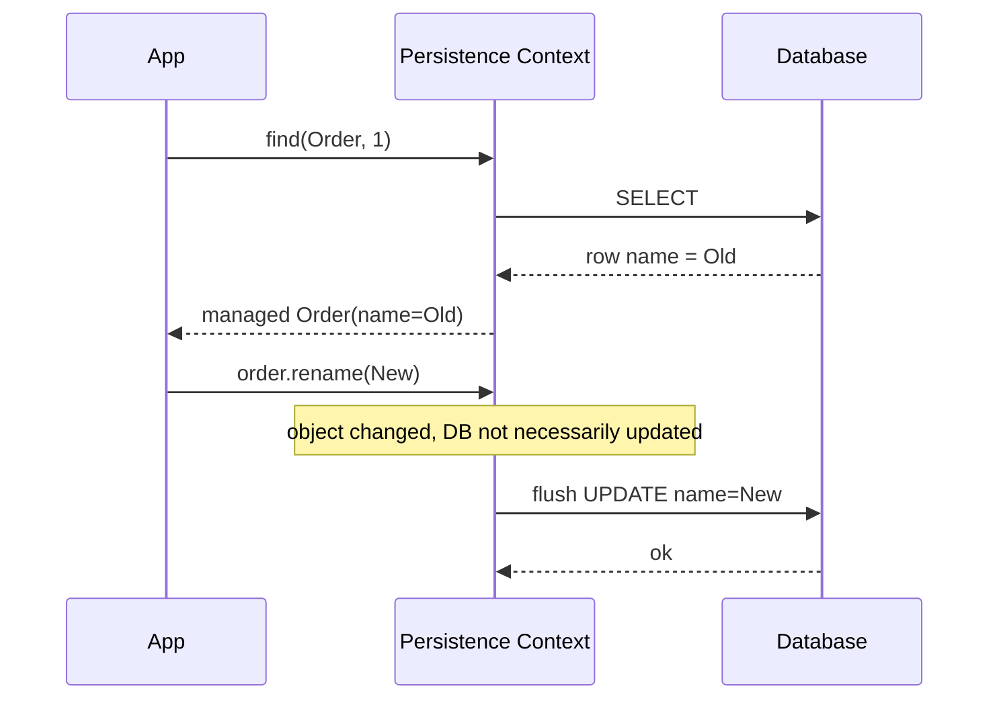
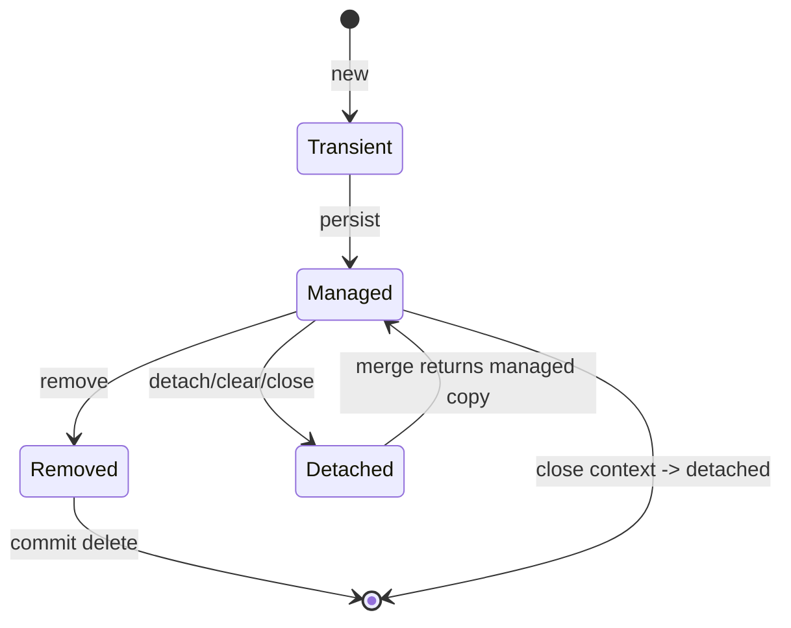
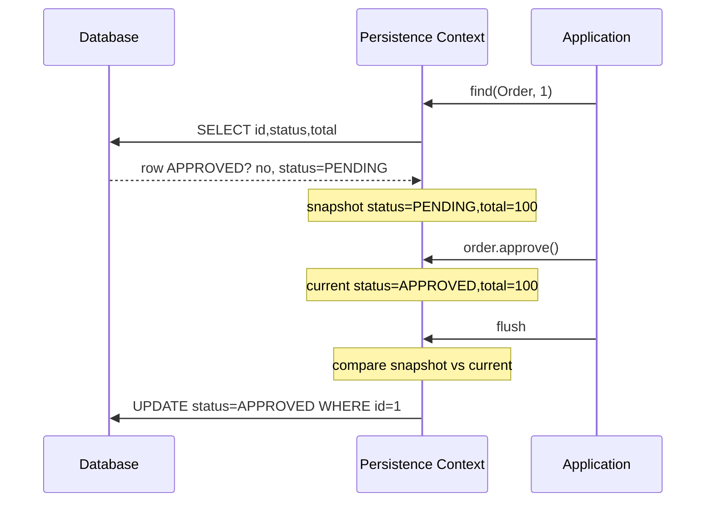
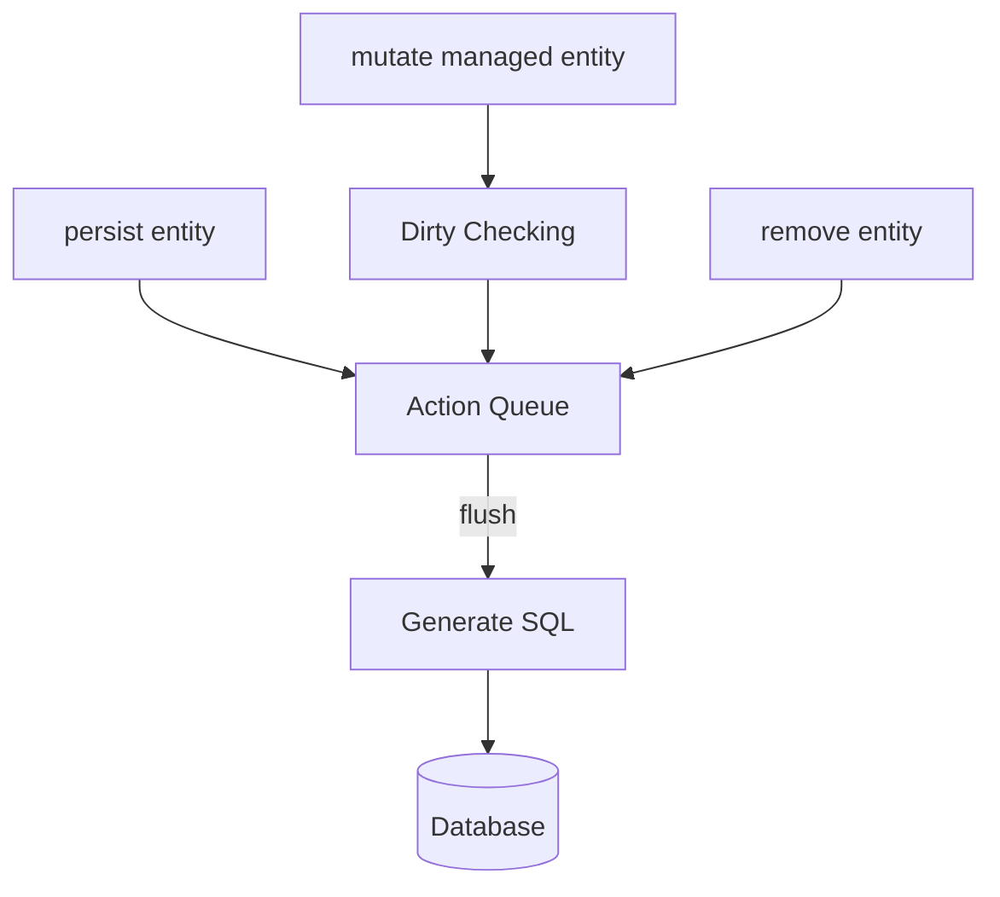
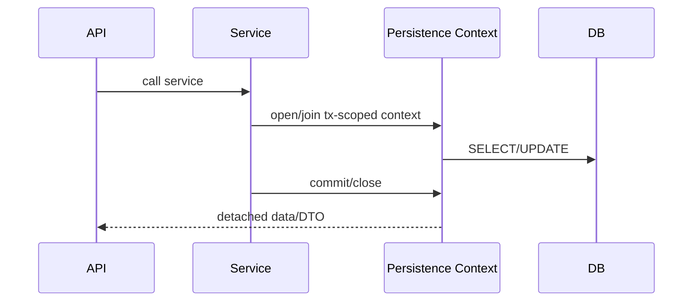
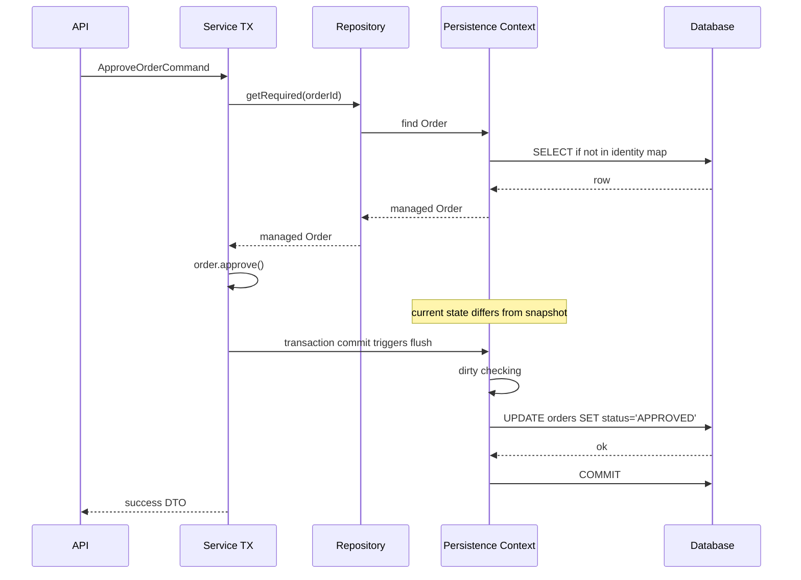

# Part 012 — Persistence Context Deep Dive

## 1. Tujuan Part Ini

Part 011 membahas transaction semantics. Sekarang kita masuk ke komponen yang membuat JPA terasa “magis”: **persistence context**.

Persistence context adalah alasan kenapa kode ini bisa menyimpan perubahan tanpa explicit update:

```java
@Transactional
public void approve(OrderId id) {
    Order order = entityManager.find(Order.class, id);
    order.approve();
    // no entityManager.update(order)
}
```

Tetapi persistence context juga alasan kenapa production bisa mengalami:

- query tidak terlihat memanggil database karena entity sudah ada di first-level cache;
- data tampak stale di dalam transaction;
- memory meledak saat batch processing;
- perubahan field otomatis tersimpan tanpa `save()`;
- `merge()` membuat object berbeda dari yang Anda kira;
- entity detached gagal lazy loading;
- rollback tidak mengembalikan object Java;
- dirty checking mahal;
- `clear()` tiba-tiba membuat perubahan hilang;
- duplicate entity instance menyebabkan exception.

Target Part ini: Anda mampu melihat persistence context sebagai **Unit of Work + Identity Map + Change Tracker**.



Prinsip inti:

> Persistence context bukan cache general-purpose. Ia adalah ruang kerja transactional untuk entity identity, lifecycle, dan synchronization.

---

## 2. Definisi Mental: Apa Itu Persistence Context?

Persistence context adalah set entity instance yang sedang dikelola oleh EntityManager.

Di dalam persistence context:

- setiap database identity direpresentasikan oleh satu object Java managed;
- entity punya lifecycle state;
- provider menyimpan snapshot state awal;
- perubahan dapat terdeteksi otomatis;
- SQL dapat ditunda sampai flush;
- operasi cascade dan orphan removal diproses;
- lazy proxy/collection dapat diinisialisasi selama context masih valid.

Cara paling berguna untuk memahaminya:

```text
Persistence Context = Identity Map + Unit of Work + Change Tracker
```

| Komponen | Peran |
|---|---|
| Identity Map | Menjamin satu entity identity hanya punya satu object managed dalam context |
| Unit of Work | Mengumpulkan perubahan sebelum flush |
| Change Tracker | Mendeteksi perubahan state entity |
| Write-Behind Queue | Menunda SQL sampai flush/commit |
| Association Manager | Mengelola relasi, cascade, collection dirty state |

---

## 3. Persistence Context vs Database

Kesalahan umum: menganggap object managed selalu sama dengan row database terbaru.

Tidak selalu.

| Layer | Isi | Kapan Berubah |
|---|---|---|
| Java object | Field entity di heap | Saat setter/method domain dipanggil |
| Persistence context snapshot | Loaded state untuk dirty checking | Saat entity diload/di-flush tergantung provider |
| Database transaction | Row yang sudah diubah dalam transaction | Saat SQL flush |
| Durable database | Row committed | Saat commit berhasil |

Contoh:

```java
@Transactional
public void example(Long id) {
    Order order = em.find(Order.class, id); // load from DB
    order.rename("New Name");              // Java object changed

    // DB may not have received UPDATE yet.
}
```

Perubahan `rename()` baru berada pada object managed. SQL `UPDATE` bisa dikirim saat flush.



Rule:

> Managed state adalah state kerja, bukan bukti durability.

---

## 4. First-Level Cache: Identity Map, Bukan Cache Produk

Persistence context sering disebut first-level cache. Tetapi istilah “cache” bisa menyesatkan.

First-level cache JPA/Hibernate adalah identity map dalam scope EntityManager.

Contoh:

```java
@Transactional
public void example(Long id) {
    Order a = em.find(Order.class, id);
    Order b = em.find(Order.class, id);

    assert a == b;
}
```

Jika `Order` dengan id yang sama sudah managed, `find()` berikutnya dapat mengembalikan instance yang sama tanpa SELECT baru.

Ini memberi invariant:

> Dalam satu persistence context, satu database identity = satu managed Java object instance.

### 4.1 Kenapa Identity Map Penting?

Tanpa identity map:

```java
Order a = loadOrder(1);
Order b = loadOrder(1);

a.approve();
b.cancel();
```

Provider harus menentukan object mana yang menang. Identity map menghindari konflik ini dengan memastikan `a` dan `b` adalah object yang sama.

### 4.2 Identity Map Tidak Sama dengan Second-Level Cache

| Aspek | First-Level Cache | Second-Level Cache |
|---|---|---|
| Scope | EntityManager / persistence context | EntityManagerFactory / SessionFactory |
| Mandatory | Konsep dasar persistence context | Optional/provider-specific |
| Consistency | Strong dalam context | Tergantung strategy invalidation |
| Isi | Managed entity instance | Cached state, bukan managed instance |
| Lifecycle | Hilang saat context close/clear | Bertahan lintas context |

Second-level cache akan dibahas di Part 023.

---

## 5. Entity State di Dalam dan Luar Context

State entity yang perlu dikuasai:

| State | Makna | Managed oleh PC? | SQL otomatis? |
|---|---|---:|---:|
| New/transient | Object baru, belum dikenal persistence context | Tidak | Tidak |
| Managed/persistent | Terdaftar dalam persistence context | Ya | Ya, saat flush jika dirty |
| Detached | Pernah persistent, context sudah tidak mengelola | Tidak | Tidak |
| Removed | Managed dan dijadwalkan delete | Ya sampai flush/commit | Ya |



Critical detail:

```java
Order detached = ...;
Order managed = em.merge(detached);

// managed != detached often
```

`merge()` tidak “reattach object yang sama” secara sederhana. Ia menyalin state dari detached object ke managed instance dan mengembalikan managed instance.

---

## 6. Managed State Illusion

Kode ini terlihat explicit:

```java
orderRepository.save(order);
```

Tetapi dalam JPA, jika entity sudah managed, perubahan bisa tersimpan tanpa `save()`.

Contoh:

```java
@Transactional
public void approve(Long id) {
    Order order = orderRepository.getRequired(id);
    order.approve();
}
```

Tidak ada `save()`. Tetap bisa menghasilkan:

```sql
update orders set status = 'APPROVED', version = version + 1 where id = ? and version = ?
```

Ini benar jika dipahami. Berbahaya jika tidak.

### 6.1 Bug: Accidental Mutation

```java
@Transactional
public OrderDetails getDetails(Long id) {
    Order order = orderRepository.getRequired(id);
    order.markViewed(); // accidental write in read method
    return mapper.toDetails(order);
}
```

Jika transaction bukan read-only atau provider tetap flush, `markViewed()` bisa tersimpan.

### 6.2 Better Pattern

Pisahkan command dan query:

```java
@Transactional(readOnly = true)
public OrderDetails getDetails(Long id) {
    return orderReadRepository.getDetails(id);
}

@Transactional
public void markViewed(Long id, UserId viewer) {
    Order order = orderRepository.getRequired(id);
    order.markViewedBy(viewer);
}
```

Rule:

> Semua method domain pada managed entity adalah potential write. Jangan panggil method mutating di query flow.

---

## 7. Dirty Checking: Cara Provider Tahu Ada Perubahan

Dirty checking adalah proses membandingkan state entity sekarang dengan state yang diketahui sebelumnya.

Konsep sederhana:

1. entity diload dari database;
2. provider menyimpan snapshot field persistent;
3. aplikasi memodifikasi object;
4. saat flush, provider membandingkan current state dengan snapshot;
5. jika berbeda, provider membuat SQL update.



Hibernate dapat mengoptimalkan dirty checking melalui bytecode enhancement dan mekanisme internal lain, tetapi mental model snapshot comparison tetap berguna.

### 7.1 Dirty Checking Cost

Dirty checking tidak gratis.

Biaya meningkat ketika:

- persistence context berisi banyak entity;
- entity punya banyak field;
- graph association besar;
- batch process tidak clear context;
- flush sering terjadi;
- collection dirty checking kompleks;
- read flow memuat entity managed padahal DTO cukup.

Contoh batch buruk:

```java
@Transactional
public void importRows(List<Row> rows) {
    for (Row row : rows) {
        em.persist(row.toEntity());
    }
}
```

Jika rows = 500_000, persistence context menahan banyak entity sampai transaction selesai.

Better:

```java
@Transactional
public void importRows(List<Row> rows) {
    int i = 0;
    for (Row row : rows) {
        em.persist(row.toEntity());

        if (++i % 500 == 0) {
            em.flush();
            em.clear();
        }
    }
}
```

Tetapi hati-hati: setelah `clear()`, semua entity menjadi detached. Jangan akses relasi lazy atau berharap perubahan berikutnya otomatis tersimpan.

---

## 8. Write-Behind: SQL Ditunda

Persistence context menerapkan write-behind: operasi Java dikumpulkan lalu SQL dikirim saat flush.

Contoh:

```java
@Transactional
public void createOrder(CreateOrderCommand command) {
    Order order = Order.create(command.customerId());
    order.addLine(command.productId(), command.quantity());

    em.persist(order);
}
```

Provider bisa menunda:

- insert order;
- insert order lines;
- update foreign key;
- update version;
- delete orphan;
- collection table changes.

Write-behind memungkinkan:

- batching;
- SQL ordering;
- dirty checking sebelum update;
- cascade processing;
- fewer round trips.

Tetapi juga berarti:

- error muncul terlambat;
- stacktrace bisa menunjuk commit bukan source mutation;
- constraint violation terjadi saat flush;
- SQL log tidak langsung muncul setelah method domain.



Rule:

> Dalam JPA, method entity mengubah memory; flush mengubah database transaction; commit mengubah durable state.

---

## 9. Flush Modes dan Persistence Context

Flush akan dibahas khusus di Part 013, tetapi persistence context tidak bisa dipahami tanpa gambaran awal.

JPA flush mode umum:

| Flush Mode | Makna Praktis |
|---|---|
| `AUTO` | Provider boleh flush sebelum query yang bisa terdampak perubahan pending dan saat commit |
| `COMMIT` | Flush terutama saat commit; query bisa melihat state database lama tergantung provider/behavior |

Contoh flush surprise:

```java
@Transactional
public void example() {
    User user = new User("duplicate@email.test");
    em.persist(user);

    // Query ini bisa memicu flush dan unique violation lebih awal.
    long count = em.createQuery("select count(u) from User u", Long.class)
        .getSingleResult();
}
```

Developer mengira query hanya read. Tetapi karena persistence context punya pending insert, provider dapat flush dulu agar query result konsisten.

---

## 10. `find()`, `getReference()`, dan Identity Semantics

### 10.1 `find()`

`find()` mengembalikan entity managed jika ada, atau load dari database jika belum ada.

```java
Order order = em.find(Order.class, id);
```

Jika entity sudah ada di first-level cache:

```java
Order a = em.find(Order.class, id);
Order b = em.find(Order.class, id);
assert a == b;
```

### 10.2 `getReference()`

`getReference()` dapat mengembalikan proxy/reference tanpa langsung query database.

```java
Customer customer = em.getReference(Customer.class, customerId);
Order order = Order.createFor(customer);
```

Berguna ketika hanya perlu foreign key reference.

Risiko:

- akses property non-id bisa trigger SELECT;
- entity tidak ada bisa gagal belakangan;
- proxy behavior memengaruhi equals/hashCode jika desain buruk;
- detached proxy bisa lazy initialization failure.

Rule:

> Gunakan `getReference()` untuk reference by identity, bukan untuk membaca data.

---

## 11. `persist()`, `merge()`, `detach()`, `clear()`, `remove()`

### 11.1 `persist()`

`persist()` membuat transient entity menjadi managed dan dijadwalkan insert.

```java
Order order = Order.create(...);
em.persist(order);
```

Setelah `persist()`, mutation pada object yang sama tracked.

```java
em.persist(order);
order.rename("new name"); // tracked
```

### 11.2 `merge()`

`merge()` sering disalahgunakan.

```java
Order detached = receiveFromApi();
Order managed = em.merge(detached);
```

Makna:

- cari managed instance dengan identity yang sama atau load/create;
- copy state dari detached ke managed;
- return managed instance;
- detached object tetap detached.

Anti-pattern:

```java
em.merge(order);
order.approve(); // order mungkin masih detached, perubahan ini tidak tracked
```

Better:

```java
Order managed = em.merge(order);
managed.approve();
```

Namun untuk command service yang baik, sering lebih aman load managed aggregate lalu apply command:

```java
@Transactional
public void changeAddress(ChangeAddressCommand command) {
    Customer customer = customerRepository.getRequired(command.customerId());
    customer.changeAddress(command.address());
}
```

Daripada merge object dari client:

```java
@Transactional
public void unsafeUpdate(Customer detachedFromRequest) {
    em.merge(detachedFromRequest); // can overwrite fields unintentionally
}
```

### 11.3 `detach()`

`detach(entity)` mengeluarkan entity dari persistence context.

```java
Order order = em.find(Order.class, id);
em.detach(order);
order.approve(); // not tracked
```

Gunakan dengan hati-hati untuk:

- menghindari accidental write;
- mengurangi memory;
- read-only processing;
- serialization boundary.

### 11.4 `clear()`

`clear()` detach semua managed entities.

```java
em.flush();
em.clear();
```

Umum dalam batch. Risiko:

- semua reference entity menjadi detached;
- pending changes yang belum flush bisa hilang;
- lazy loading setelah clear gagal;
- identity map reset.

Rule:

> Jika memakai `clear()`, pastikan semua perubahan penting sudah flush dan tidak ada object managed yang masih dipakai seolah managed.

### 11.5 `remove()`

`remove()` menandai managed entity untuk deletion.

```java
Order order = em.find(Order.class, id);
em.remove(order);
```

Jika entity detached, provider bisa menolak. Pattern aman:

```java
Order order = em.find(Order.class, id);
if (order != null) {
    em.remove(order);
}
```

Untuk aggregate, deletion harus memperhatikan cascade/orphan removal dan foreign key constraint.

---

## 12. Persistence Context Scope

### 12.1 Transaction-Scoped Persistence Context

Paling umum di Spring/Jakarta EE service:

- context dibuat/di-bind untuk transaction;
- entity managed selama transaction;
- setelah transaction selesai, context ditutup;
- entity menjadi detached.



Ini cocok untuk stateless service modern.

### 12.2 Extended Persistence Context

Extended persistence context bisa hidup lebih lama dari transaction, misalnya conversational state di Jakarta EE stateful component.

Keuntungan:

- entity tetap managed lintas beberapa interaction;
- cocok untuk conversation panjang tertentu.

Risiko:

- stale data;
- memory retention;
- conflict saat commit belakangan;
- sulit di-scale stateless;
- tidak cocok untuk kebanyakan REST service.

Rule:

> Untuk service stateless modern, transaction-scoped persistence context biasanya default terbaik.

### 12.3 Open Session in View

Open Session in View menjaga persistence context terbuka sampai view rendering/API serialization.

Kelebihan:

- lazy loading masih bisa terjadi di web layer;
- mengurangi lazy initialization error pada aplikasi sederhana.

Masalah:

- query bisa terjadi saat rendering;
- N+1 tersembunyi;
- transaction boundary kabur;
- API serialization memicu database access;
- performance sulit diprediksi.

Better enterprise approach:

- service read-only transaction;
- fetch plan eksplisit;
- DTO/projection;
- close persistence context sebelum API layer keluar.

---

## 13. Stale Data di Persistence Context

Jika entity sudah managed, `find()` berikutnya mengembalikan instance yang sama walau database berubah oleh transaction lain.

Contoh:

```java
@Transactional
public void example(Long id) {
    Order order = em.find(Order.class, id);

    // transaction lain update row order di database

    Order again = em.find(Order.class, id);
    assert order == again;
    // state may still be old in this context
}
```

Solusi tergantung kebutuhan:

### 13.1 `refresh()`

```java
em.refresh(order);
```

Mengambil ulang state dari database dan membuang perubahan in-memory yang belum flush pada entity tersebut.

Gunakan hati-hati.

### 13.2 `clear()` lalu reload

```java
em.clear();
Order fresh = em.find(Order.class, id);
```

Semua entity detach.

### 13.3 Query dengan Lock

Untuk concurrency-sensitive operation, gunakan optimistic/pessimistic lock sesuai kebutuhan. Detail di Part 021.

Rule:

> First-level cache memberi identity consistency dalam context, bukan guarantee data selalu terbaru terhadap dunia luar.

---

## 14. Duplicate Entity Instance Problem

Dalam satu persistence context, tidak boleh ada dua managed object berbeda dengan identity yang sama.

Contoh risk:

```java
Order detached1 = new Order(id);
Order detached2 = new Order(id);

em.merge(detached1);
em.persist(detached2); // conflict risk
```

Atau:

```java
Order managed = em.find(Order.class, id);
Order another = new Order(id);
em.persist(another); // identity conflict
```

Ini bisa memunculkan exception seperti “different object with the same identifier value was already associated with the session”.

Root cause biasanya:

- mapping DTO langsung ke entity dengan id existing;
- memakai `persist()` untuk existing entity;
- equals/hashCode buruk;
- collection berisi duplicate detached entity;
- merge graph yang tidak dikontrol.

Pattern aman:

- load managed root dari repository;
- apply command ke managed root;
- jangan menerima entity graph dari API sebagai source of truth;
- gunakan DTO/command object;
- gunakan id reference eksplisit.

---

## 15. Collection Dirty Checking

Collection persistent bukan collection Java biasa. Hibernate/JPA provider sering membungkus collection dengan implementation khusus untuk tracking.

Contoh:

```java
@OneToMany(mappedBy = "order", cascade = CascadeType.ALL, orphanRemoval = true)
private List<OrderLine> lines = new ArrayList<>();
```

Saat managed, `lines` bisa berupa persistent collection wrapper.

### 15.1 Mutasi Collection yang Benar

```java
public void addLine(Product product, int quantity) {
    OrderLine line = OrderLine.of(this, product, quantity);
    lines.add(line);
}

public void removeLine(OrderLine line) {
    lines.remove(line);
    line.detachFromOrder();
}
```

### 15.2 Replacing Collection Trap

```java
public void replaceLines(List<OrderLine> newLines) {
    this.lines = newLines; // dangerous with persistent collection
}
```

Masalah:

- provider wrapper hilang;
- orphan detection bisa kacau;
- delete/insert berlebihan;
- exception collection no longer referenced.

Better:

```java
public void replaceLines(List<OrderLine> newLines) {
    this.lines.clear();
    for (OrderLine line : newLines) {
        addLine(line.product(), line.quantity());
    }
}
```

Rule:

> Untuk managed collection, mutate isi collection; jangan sembarang mengganti object collection-nya.

---

## 16. Persistence Context dan Equals/HashCode

Equals/hashCode sudah dibahas di Part 005, tetapi persistence context membuat dampaknya lebih jelas.

Masalah umum:

```java
Set<OrderLine> lines = new HashSet<>();
OrderLine line = new OrderLine();
lines.add(line);

em.persist(line); // id generated

// hashCode berubah jika berdasarkan id generated
```

Jika hashCode berubah setelah masuk `HashSet`, collection behavior rusak.

Persistence context identity map memakai database identity internal, bukan semata `equals()`. Tetapi collection domain Anda tetap bisa rusak.

Guideline:

- gunakan immutable natural key jika benar-benar stabil;
- untuk generated id, jangan membuat hashCode berubah setelah persist;
- hati-hati dengan proxy class dalam equals;
- prefer identity semantics yang konsisten dan tested.

---

## 17. Query Result dan Persistence Context

JPQL query yang mengembalikan entity akan mengembalikan managed entity.

```java
List<Order> orders = em.createQuery(
    "select o from Order o where o.status = :status",
    Order.class
).setParameter("status", OrderStatus.PENDING)
 .getResultList();
```

Jika salah satu order sudah ada di persistence context, provider akan memakai managed instance yang sama.

### 17.1 Partial Projection Tidak Managed Entity

DTO projection bukan managed entity:

```java
List<OrderSummary> summaries = em.createQuery("""
    select new com.acme.OrderSummary(o.id, o.status, o.total)
    from Order o
""", OrderSummary.class).getResultList();
```

DTO tidak dirty checked. Ini sering lebih baik untuk read path.

### 17.2 Native Query Entity Mapping

Native query yang dimap ke entity juga dapat menghasilkan managed entity jika result mapping entity digunakan.

Risiko:

- column result harus cukup untuk membangun entity;
- persistence context bisa mengembalikan state existing;
- partial entity mapping bisa berbahaya;
- provider-specific behavior perlu dipahami.

Rule:

> Jika tujuan hanya membaca data untuk response, jangan otomatis pilih entity. Gunakan DTO/projection untuk menghindari context bloat dan accidental write.

---

## 18. Persistence Context Memory Management

Persistence context menahan reference ke managed entities dan snapshot. Karena itu, ia bisa menjadi sumber memory retention.

### 18.1 Batch Insert Risk

```java
@Transactional
public void importAll(List<Row> rows) {
    rows.forEach(row -> em.persist(row.toEntity()));
}
```

Semua entity tetap managed sampai transaction selesai.

### 18.2 Batch Read Risk

```java
@Transactional(readOnly = true)
public void scanAll() {
    List<Order> orders = em.createQuery("select o from Order o", Order.class)
        .getResultList();

    for (Order order : orders) {
        process(order);
    }
}
```

Memuat semua entity ke memory dan context.

Better options:

- pagination/keyset;
- streaming dengan clear berkala;
- DTO projection;
- stateless session/provider-specific untuk use case tertentu;
- chunk transaction.

```java
@Transactional
public void processChunk(List<Long> ids) {
    for (Long id : ids) {
        Order order = em.find(Order.class, id);
        order.recalculate();
    }
    em.flush();
    em.clear();
}
```

Rule:

> Persistence context harus punya lifecycle pendek dan ukuran terkendali.

---

## 19. Read-Only Loading dan Dirty Checking Avoidance

Untuk read-heavy use case, jangan selalu load entity managed penuh.

Options:

| Strategy | Kapan Dipakai |
|---|---|
| DTO projection | API/read model biasa |
| Interface projection | Spring Data simple read |
| Read-only transaction | Service read flow |
| Provider read-only hint | Query/entity tidak perlu dirty checking |
| Immutable entity | Reference data jarang berubah |
| Native query DTO | Reporting/query kompleks |

Contoh DTO projection:

```java
public record OrderListItem(
    Long id,
    String number,
    String status,
    BigDecimal total
) {}
```

```java
@Query("""
    select new com.acme.OrderListItem(o.id, o.number, o.status, o.total)
    from Order o
    where o.customer.id = :customerId
""")
List<OrderListItem> findListItems(Long customerId);
```

Keuntungan:

- tidak managed;
- tidak dirty checked;
- lebih kecil di memory;
- tidak lazy loading;
- API shape eksplisit.

---

## 20. Persistence Context dan Domain Events

Jika aggregate mengumpulkan domain events:

```java
public class Order {
    private final List<DomainEvent> events = new ArrayList<>();

    public void approve() {
        this.status = APPROVED;
        this.events.add(new OrderApproved(this.id));
    }
}
```

Pertanyaan penting:

- kapan events dikumpulkan?
- kapan events dibersihkan?
- apakah events ikut persisted?
- apakah publish terjadi sebelum atau setelah commit?
- apakah rollback membatalkan event publish?

Persistence context akan track perubahan entity, tetapi tidak otomatis memberi reliable event delivery.

Pattern umum:

```java
@Transactional
public void approve(OrderId id) {
    Order order = orderRepository.getRequired(id);
    order.approve();

    outboxRepository.addAll(outboxMapper.from(order.pullDomainEvents()));
}
```

Hati-hati:

```java
order.pullDomainEvents();
// jika transaction rollback setelah events dipull dan dibersihkan,
// object memory tidak otomatis kembali.
```

Better untuk safety:

- collect events di application service setelah mutation;
- map to outbox row dalam same transaction;
- clear domain event list hanya dalam lifecycle yang terkontrol;
- jangan publish langsung dari entity.

---

## 21. Persistence Context dan Database Trigger/Generated Columns

Jika database mengubah data melalui trigger, generated column, default value, atau computed column, persistence context mungkin tidak langsung tahu.

Contoh:

```sql
create trigger set_case_number before insert on enforcement_case ...
```

Java:

```java
Case c = new Case(...);
em.persist(c);
em.flush();

// c.caseNumber mungkin belum terisi di object jika provider tidak refresh/generated mapping
```

Options:

- mapping generated column sesuai provider;
- `refresh()` setelah flush;
- gunakan application-generated value;
- return value via insert support provider-specific;
- desain agar trigger tidak menjadi hidden domain logic.

Rule:

> Jika database menulis state, tentukan bagaimana persistence context mengetahui state tersebut.

---

## 22. Persistence Context dan Bulk Update/Delete

JPQL bulk update/delete bypass normal dirty checking entity managed.

Contoh:

```java
@Transactional
public int expireOldOrders(Instant cutoff) {
    return em.createQuery("""
        update Order o
        set o.status = :expired
        where o.createdAt < :cutoff
    """).setParameter("expired", OrderStatus.EXPIRED)
      .setParameter("cutoff", cutoff)
      .executeUpdate();
}
```

Masalah:

- managed entity dalam persistence context bisa stale;
- lifecycle callback tidak berjalan seperti entity mutation biasa;
- domain invariant bisa terlewati;
- versioning bisa perlu perhatian khusus;
- second-level cache invalidation harus dipahami.

Pattern aman:

```java
@Transactional
public int expireOldOrders(Instant cutoff) {
    int updated = em.createQuery(...).executeUpdate();
    em.clear();
    return updated;
}
```

Namun `clear()` detach semua entity. Jangan lakukan jika masih perlu managed changes pending.

Rule:

> Setelah bulk update/delete, anggap persistence context mungkin tidak sinkron. Clear atau pisahkan transaction.

---

## 23. Debugging Persistence Context

Saat melihat bug JPA, tanya:

1. Entity ini managed atau detached?
2. Persistence context scope-nya sampai mana?
3. Apakah object ini instance yang sama dengan yang diload sebelumnya?
4. Apakah perubahan sudah flush?
5. Apakah transaction sudah commit?
6. Apakah query mengembalikan data dari DB atau identity map?
7. Apakah `clear()`/`detach()` dipanggil?
8. Apakah `merge()` return value diabaikan?
9. Apakah collection wrapper diganti?
10. Apakah bulk update membuat context stale?

### 23.1 Logging yang Berguna

Aktifkan secara selektif di environment development/test:

```properties
logging.level.org.hibernate.SQL=DEBUG
logging.level.org.hibernate.orm.jdbc.bind=TRACE
logging.level.org.hibernate.engine.internal.StatefulPersistenceContext=DEBUG
```

Nama logger bisa berbeda antar versi Hibernate. Jangan aktifkan bind parameter TRACE di production tanpa kontrol karena bisa membocorkan data sensitif.

### 23.2 Assertion Helper

Dalam test, Anda bisa memakai:

```java
assertTrue(entityManager.contains(order));
```

Untuk mengecek apakah entity managed.

```java
entityManager.flush();
entityManager.clear();
```

Untuk memaksa test membaca ulang dari database, bukan dari first-level cache.

---

## 24. Testing Persistence Context Behavior

### 24.1 Test Accidental Dirty Checking

```java
@Test
void mutationOnManagedEntityIsFlushed() {
    Order order = tx.execute(status -> {
        Order managed = repository.getRequired(orderId);
        managed.approve();
        return managed;
    });

    tx.executeWithoutResult(status -> {
        Order reloaded = repository.getRequired(orderId);
        assertThat(reloaded.status()).isEqualTo(APPROVED);
    });
}
```

### 24.2 Test Detached Entity Not Tracked

```java
@Test
void detachedMutationIsNotFlushed() {
    Order detached = tx.execute(status -> repository.getRequired(orderId));

    detached.approve();

    tx.executeWithoutResult(status -> {
        Order reloaded = repository.getRequired(orderId);
        assertThat(reloaded.status()).isEqualTo(PENDING);
    });
}
```

### 24.3 Test Merge Return Value

```java
@Test
void mergeReturnsManagedCopy() {
    Order detached = tx.execute(status -> repository.getRequired(orderId));
    detached.rename("Detached Name");

    tx.executeWithoutResult(status -> {
        Order managed = entityManager.merge(detached);
        managed.approve();
    });

    tx.executeWithoutResult(status -> {
        Order reloaded = repository.getRequired(orderId);
        assertThat(reloaded.name()).isEqualTo("Detached Name");
        assertThat(reloaded.status()).isEqualTo(APPROVED);
    });
}
```

### 24.4 Test Clear Forces DB Reload

```java
@Test
void clearForcesReloadFromDatabase() {
    tx.executeWithoutResult(status -> {
        Order a = em.find(Order.class, orderId);
        Order b = em.find(Order.class, orderId);
        assertThat(a).isSameAs(b);

        em.clear();

        Order c = em.find(Order.class, orderId);
        assertThat(c).isNotSameAs(a);
    });
}
```

---

## 25. Common Anti-Patterns

### 25.1 Entity From Request Body

```java
@PutMapping("/customers/{id}")
public void update(@RequestBody Customer customer) {
    customerRepository.save(customer);
}
```

Masalah:

- detached graph dari client;
- overposting;
- null overwrite;
- association hijack;
- merge cascade tak terkendali;
- invariant domain terlewati.

Better:

```java
public record ChangeCustomerAddressRequest(AddressDto address) {}

@Transactional
public void changeAddress(CustomerId id, ChangeCustomerAddressRequest request) {
    Customer customer = customerRepository.getRequired(id);
    customer.changeAddress(request.address().toDomain());
}
```

### 25.2 Blind Merge

```java
repository.save(dto.toEntity());
```

Jika `save()` memilih merge untuk id non-null, semua field dalam detached entity bisa menimpa state database.

Better:

- load managed aggregate;
- apply command;
- validate invariant;
- flush.

### 25.3 Returning Managed Entity to API Layer

```java
@GetMapping("/orders/{id}")
public Order get(@PathVariable Long id) {
    return orderService.get(id);
}
```

Masalah:

- lazy loading during serialization;
- infinite recursion;
- leaking internal model;
- accidental data exposure;
- persistence context coupling.

Better DTO:

```java
@GetMapping("/orders/{id}")
public OrderResponse get(@PathVariable Long id) {
    return orderQueryService.getDetails(id);
}
```

### 25.4 Long-Lived EntityManager in Singleton

```java
@Component
public class BadRepository {
    private final EntityManager em = ...; // bad manual lifecycle
}
```

EntityManager is not meant to be shared as a long-lived mutable context across threads. Use container/framework-managed EntityManager injection/proxy.

### 25.5 Clear Without Flush

```java
order.approve();
em.clear();
```

Pending change can be lost because entity detached before flush.

---

## 26. Persistence Context Design Heuristics

Gunakan heuristik berikut:

- Treat persistence context as short-lived Unit of Work.
- Satu command transaction biasanya satu persistence context.
- Jangan membawa entity keluar service boundary.
- Jangan menerima entity dari API/client sebagai update model.
- Load managed aggregate lalu apply command.
- Jangan ignore return value `merge()`.
- Jangan replace persistent collection sembarangan.
- Flush and clear batch secara periodik.
- Setelah bulk update/delete, clear context atau pisahkan transaction.
- Gunakan DTO projection untuk read path.
- Gunakan `contains()` dalam test/debug untuk memastikan managed state.
- Setelah rollback, buang context dan reload untuk retry.
- Jangan gunakan first-level cache sebagai cache aplikasi.
- Waspadai stale data dalam transaction panjang.

---

## 27. Mini Case Study: Case Management Persistence Context

Domain regulatory case:

- `EnforcementCase` aggregate;
- `CaseAssignment` child entity;
- `CaseNote` child entity;
- `CaseStatusHistory` audit-like child;
- command: escalate case.

Good command flow:

```java
@Transactional
public void escalate(EscalateCaseCommand command) {
    EnforcementCase c = caseRepository.getRequired(command.caseId());

    c.escalateTo(command.targetUnit(), command.reason());
    c.addNote(CaseNote.system("Escalated due to " + command.reason()));

    outboxRepository.add(OutboxMessage.caseEscalated(c.id(), c.currentStatus()));
}
```

What persistence context does:

1. loads `EnforcementCase` into identity map;
2. lazy/explicit loads required children depending fetch plan;
3. tracks status mutation;
4. tracks new `CaseNote` if cascade is configured correctly;
5. tracks status history insertion;
6. stores outbox row;
7. flushes SQL in order;
8. commit makes state durable.

Bad flow:

```java
@Transactional
public void escalate(EscalateCaseRequest request) {
    EnforcementCase detached = request.toEntityGraph();
    entityManager.merge(detached);
}
```

Risks:

- overwrites fields not present in request;
- deletes/replaces children accidentally;
- bypasses domain method `escalateTo()`;
- allows illegal status transition;
- creates huge graph merge cost;
- hides which fields changed.

Enterprise rule:

> Command DTO should describe intent. Managed aggregate should enforce transition. Persistence context should track resulting state, not decide business meaning.

---

## 28. Mermaid Mental Model: End-to-End Entity Mutation



This is the core runtime story behind most JPA applications.

---

## 29. Deliberate Practice

### Latihan 1 — Identity Map

Dalam satu transaction:

```java
Order a = em.find(Order.class, id);
Order b = em.find(Order.class, id);
assertThat(a).isSameAs(b);
```

Lalu:

```java
em.clear();
Order c = em.find(Order.class, id);
assertThat(c).isNotSameAs(a);
```

Tuliskan kesimpulan.

### Latihan 2 — Dirty Checking Tanpa Save

Load entity, ubah field, jangan panggil save. Commit. Reload di transaction baru.

Buktikan update terjadi.

### Latihan 3 — Detached Mutation

Load entity dalam transaction. Kembalikan keluar transaction. Mutasi object. Buka transaction baru dan reload. Buktikan perubahan detached tidak tersimpan.

### Latihan 4 — Merge Return Value

Panggil `merge(detached)`, lalu mutasi detached object setelah merge. Buktikan mutation setelah merge pada object detached tidak tracked.

### Latihan 5 — Bulk Update Stale Context

Dalam transaction:

1. load order;
2. jalankan JPQL bulk update status;
3. inspect object yang sudah managed;
4. clear;
5. reload.

Tuliskan efeknya.

### Latihan 6 — Batch Memory

Import 50.000 row dengan satu transaction tanpa clear. Ukur memory. Ulangi dengan flush/clear per 500 row. Bandingkan.

---

## 30. Review Question

Jawab tanpa melihat materi:

1. Apa tiga komponen mental persistence context?
2. Kenapa first-level cache lebih tepat disebut identity map?
3. Apa bedanya managed dan detached?
4. Kenapa entity managed bisa tersimpan tanpa `save()`?
5. Apa risiko accidental mutation dalam query service?
6. Bagaimana dirty checking bekerja secara konseptual?
7. Kenapa batch besar perlu flush/clear?
8. Apa risiko `merge()` terhadap object dari request body?
9. Kenapa bulk update bisa membuat persistence context stale?
10. Kapan `refresh()` berguna dan berbahaya?
11. Apa risiko replacing collection pada managed entity?
12. Kenapa rollback tidak cukup untuk membuat object Java aman dipakai ulang?

---

## 31. Ringkasan

Persistence context adalah pusat runtime JPA.

Yang harus Anda kuasai:

- persistence context mengelola entity instance, bukan sekadar koneksi database;
- first-level cache adalah identity map scoped ke EntityManager;
- satu database identity hanya boleh punya satu managed instance dalam context;
- managed entity otomatis dirty checked;
- SQL bisa ditunda melalui write-behind;
- flush bukan commit;
- detached entity tidak otomatis tracked;
- `merge()` mengembalikan managed copy, bukan selalu reattach object yang sama;
- `clear()` detach semua entity dan bisa menghilangkan pending changes jika belum flush;
- bulk update/delete bisa membuat context stale;
- persistence context yang terlalu besar berdampak ke memory dan dirty checking cost;
- read path sering lebih baik memakai DTO projection;
- API boundary tidak boleh membocorkan entity managed.

Mental model akhir:

> Persistence context adalah ruang kerja transactional. Gunakan untuk menjaga identity dan track perubahan, tetapi jangan biarkan ia menjadi cache global, transport model, atau tempat workflow panjang hidup.

Part berikutnya akan fokus pada flushing dan commit behavior: kapan SQL benar-benar keluar, apa yang memicu flush, bagaimana constraint muncul lebih awal, dan bagaimana membaca SQL emission timing secara benar.

---

## Referensi

- Jakarta Persistence 3.2 Specification — persistence context, EntityManager, entity lifecycle, flush, managed/detached semantics.
- Hibernate ORM User Guide — Session as EntityManager, first-level cache, dirty checking, flush behavior, read-only optimization.
- Spring Framework Reference — transaction-scoped EntityManager integration and declarative transaction behavior.
- Martin Fowler, Patterns of Enterprise Application Architecture — Identity Map and Unit of Work patterns.
