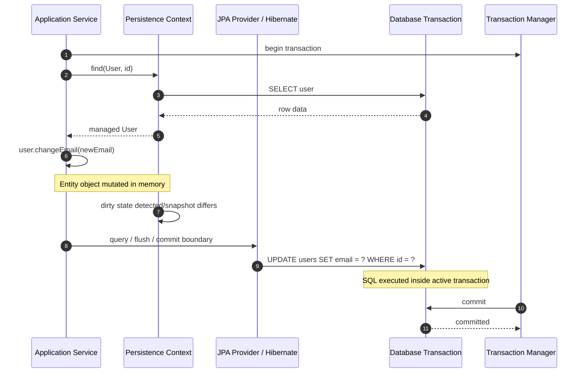
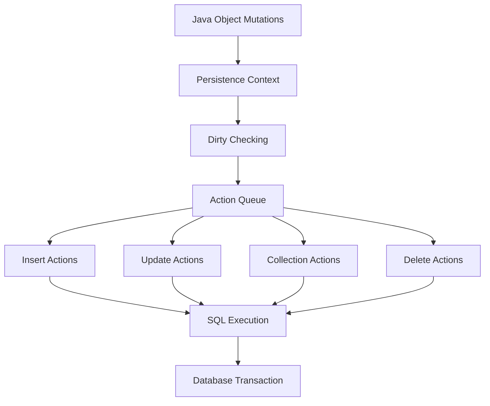

# Part 013 — Flushing, Commit, and SQL Emission Timing

Pada part sebelumnya kita membedah persistence context sebagai **identity map + unit of work + dirty checking engine**. Sekarang kita masuk ke titik yang sering membuat engineer salah diagnosis: **kapan perubahan entity benar-benar menjadi SQL?**

Pertanyaan ini terlihat sederhana, tetapi dampaknya besar:

- kenapa `UPDATE` muncul sebelum method selesai?
- kenapa query `SELECT` tiba-tiba memicu `INSERT`?
- kenapa constraint violation muncul di tengah service method, bukan saat commit?
- kenapa data terlihat sudah berubah di memory, tetapi belum ada di database?
- kenapa test lewat, tetapi production kena deadlock atau unique constraint?
- kenapa `save()` terasa berhasil padahal transaksi akhirnya rollback?

Jawabannya ada pada satu konsep: **flush**.

## 1. Target Skill Berdasarkan Kaufman

Di framework Kaufman, kita tidak mulai dari hafalan API. Kita pecah skill menjadi sub-skill yang bisa dilatih dan dikoreksi cepat.

Untuk part ini, targetnya adalah:

1. membedakan **entity state change**, **flush**, dan **commit**;
2. memahami kapan provider boleh/memutuskan mengirim SQL;
3. membaca urutan SQL sebagai efek dari persistence context;
4. mendesain service method yang tidak bergantung pada timing SQL yang salah;
5. mendeteksi bug akibat flush otomatis, constraint timing, dan bulk operation;
6. menggunakan explicit flush secara disiplin, bukan sebagai tambalan acak.

Mental model utama:

> Flush bukan commit. Flush adalah sinkronisasi pending changes dari persistence context ke database transaction. Commit adalah keputusan transaction manager untuk mengakhiri transaksi dan membuat perubahan durable.

## 2. Tiga Momen Berbeda yang Sering Dicampur

Dalam JPA, ada tiga lapisan waktu:

| Momen | Apa yang terjadi | Lokasi efek | Bisa rollback? |
|---|---|---|---|
| Entity state change | Field object berubah di memory | JVM / persistence context | Ya, dengan clear/rollback transaction |
| Flush | SQL dikirim ke database dalam transaksi aktif | Database transaction, belum committed | Ya, transaction rollback membatalkan |
| Commit | Database transaction diselesaikan | Durable state | Tidak, kecuali compensating action |

Contoh:

```java
@Transactional
public void changeEmail(Long userId, String newEmail) {
    User user = entityManager.find(User.class, userId);
    user.changeEmail(newEmail);       // state berubah di memory

    // belum tentu ada UPDATE di database

    entityManager.flush();            // UPDATE dikirim

    // UPDATE sudah dieksekusi dalam transaction,
    // tetapi belum committed
}
```

Jika method selesai normal, transaction manager commit. Jika exception memicu rollback, SQL yang sudah di-flush tetap dibatalkan oleh database transaction.

## 3. Diagram Runtime: Dari Field Mutation ke Commit



Yang perlu diingat:

- perubahan Java field tidak otomatis sama dengan SQL langsung;
- flush bisa terjadi sebelum commit;
- SQL yang sudah di-flush masih bisa rollback;
- commit biasanya melakukan flush lebih dulu;
- query tertentu dapat memicu flush supaya hasil query konsisten dengan perubahan pending.

## 4. Apa Itu Flush?

Flush adalah proses ketika provider:

1. memeriksa persistence context;
2. menentukan entity mana yang new, dirty, atau removed;
3. menghitung action queue: insert, update, delete, collection operation;
4. mengurutkan SQL agar foreign key dan constraint sebisa mungkin terpenuhi;
5. mengirim SQL ke database connection dalam transaksi aktif.

Dalam Hibernate, ini sering disebut mekanisme **write-behind**. Aplikasi bekerja pada object graph, provider menunda SQL sampai flush dibutuhkan.

Secara praktis:

```java
User user = entityManager.find(User.class, id);
user.rename("Alice");

// Tidak ada entityManager.update(user)
// Tidak ada repository.save(user) yang wajib
// Karena user managed, dirty checking akan menangkap perubahan saat flush.
```

Jika `user` managed, mutation cukup. Flush/commit yang akan mengubahnya menjadi SQL.

## 5. Flush Bukan Save

Banyak engineer yang berasal dari active record atau direct SQL cenderung berpikir:

```java
repository.save(user);
```

berarti SQL langsung dikirim. Itu tidak selalu benar.

Di Spring Data JPA, `save()` pada entity baru biasanya mendelegasikan ke `EntityManager.persist()`, dan pada entity existing/detached ke `EntityManager.merge()`. Namun keduanya tetap bekerja dalam persistence context. SQL dapat tertunda sampai flush.

Perbedaan penting:

| Operasi | Makna konseptual | SQL langsung? |
|---|---|---|
| `persist(entity)` | jadikan transient entity sebagai managed new entity | Belum tentu |
| `merge(entity)` | copy state detached ke managed instance | Bisa memicu SELECT, SQL update nanti saat flush |
| `remove(entity)` | tandai managed entity untuk deletion | Belum tentu |
| `flush()` | sinkronkan pending changes ke DB transaction | Ya |
| `commit()` | akhiri transaksi dan durable-kan perubahan | Biasanya flush dulu |

`save()` bukan boundary durability. Boundary durability adalah commit.

## 6. Kapan Flush Terjadi?

Secara umum, flush dapat terjadi pada:

1. sebelum transaction commit;
2. sebelum query dieksekusi, jika flush mode mengharuskannya;
3. ketika `entityManager.flush()` dipanggil eksplisit;
4. ketika provider perlu menjaga constraint/action ordering tertentu;
5. sebelum native query tertentu, tergantung provider dan synchronization metadata;
6. saat Spring Data JPA `saveAndFlush()` atau repository `flush()` dipanggil.

### 6.1 Flush Saat Commit

Kasus paling umum:

```java
@Transactional
public void activate(Long id) {
    Account account = entityManager.find(Account.class, id);
    account.activate();
}
```

Tidak ada `flush()` eksplisit. Saat transaksi commit, provider flush pending update.

Pola ini ideal untuk sebagian besar command sederhana.

### 6.2 Query-Triggered Flush

Contoh:

```java
@Transactional
public boolean emailAvailable(String email) {
    User user = new User(email);
    entityManager.persist(user);

    Long count = entityManager.createQuery("""
        select count(u)
        from User u
        where u.email = :email
    """, Long.class)
    .setParameter("email", email)
    .getSingleResult();

    return count == 0;
}
```

Secara mental, developer mungkin mengira query hanya membaca database lama. Namun dalam flush mode default, provider dapat flush pending insert sebelum query supaya query melihat perubahan yang sudah dijadwalkan dalam persistence context.

Akibatnya `count` dapat menjadi `1`.

Ini bukan bug. Ini konsekuensi consistency antara persistence context dan database query.

### 6.3 Explicit Flush

```java
entityManager.flush();
```

Gunakan explicit flush ketika Anda memang perlu:

- memvalidasi constraint lebih awal;
- mendapatkan database-generated side effect yang bergantung pada SQL execution;
- mengontrol batch window;
- memaksa SQL keluar sebelum operasi eksternal yang harus bergantung pada keberhasilan write;
- debugging atau test yang ingin memverifikasi SQL state di dalam transaksi.

Jangan gunakan explicit flush sebagai ritual.

## 7. Flush Mode

JPA mengenal flush mode di level `EntityManager` atau query.

Dua konsep utama:

| Flush Mode | Makna praktis |
|---|---|
| `AUTO` | Provider boleh flush sebelum query/commit agar hasil query konsisten |
| `COMMIT` | Flush terutama pada commit; query tidak selalu didahului flush |

Hibernate juga punya mode tambahan seperti `MANUAL`, tetapi itu provider-specific dan harus dipakai hati-hati.

### 7.1 `AUTO`: Default yang Aman untuk Correctness

`AUTO` mencoba menjaga query result tidak terlalu terpisah dari perubahan pending.

Contoh:

```java
entityManager.setFlushMode(FlushModeType.AUTO);
```

Jika Anda melakukan perubahan entity lalu menjalankan query yang mungkin terdampak, provider dapat flush lebih dulu.

Keuntungan:

- correctness lebih mudah;
- query tidak mengabaikan perubahan pending;
- cocok untuk aplikasi bisnis biasa.

Kerugian:

- SQL dapat muncul lebih awal dari perkiraan;
- query read dapat menjadi titik munculnya constraint violation;
- performance bisa tidak terduga jika service method mencampur banyak write dan read.

### 7.2 `COMMIT`: Mengurangi Query-Triggered Flush, Menambah Risiko Mental Model

```java
entityManager.setFlushMode(FlushModeType.COMMIT);
```

Dengan `COMMIT`, provider menunda flush sampai commit sejauh mungkin.

Ini berguna untuk kasus tertentu:

- query read tidak perlu melihat pending mutation;
- command besar ingin menghindari flush sebelum query tertentu;
- batch write ingin mengontrol flush eksplisit.

Tetapi risikonya:

- query dapat membaca database yang belum mencerminkan pending changes;
- business rule check bisa salah jika mengira query melihat state in-memory;
- behavior provider bisa berbeda untuk query/native query tertentu.

### 7.3 Query-Level Flush Mode

Lebih aman mengatur flush mode pada query tertentu daripada mengubah seluruh `EntityManager`.

```java
List<UserSummary> summaries = entityManager.createQuery("""
    select new com.example.UserSummary(u.id, u.email)
    from User u
    where u.status = :status
""", UserSummary.class)
.setParameter("status", Status.ACTIVE)
.setFlushMode(FlushModeType.COMMIT)
.getResultList();
```

Ini menyatakan: query ini tidak perlu memaksa flush pending changes.

## 8. SQL Emission Timing: Contoh Nyata

### 8.1 Managed Entity Update

```java
@Transactional
public void rename(Long id, String name) {
    Customer customer = entityManager.find(Customer.class, id);
    customer.rename(name);
}
```

Urutan umum:

```sql
select c.* from customers c where c.id = ?;
-- method ends
update customers set name = ?, version = ? where id = ? and version = ?;
commit;
```

Tidak ada `save()` yang diperlukan.

### 8.2 Persist Entity Baru

```java
@Transactional
public Long create(String email) {
    User user = new User(email);
    entityManager.persist(user);
    return user.getId();
}
```

Timing bergantung pada ID generation strategy.

| Strategy | Kemungkinan SQL timing |
|---|---|
| `IDENTITY` | Insert sering harus terjadi lebih awal untuk memperoleh generated id |
| `SEQUENCE` | Sequence value bisa diambil dulu, insert dapat ditunda |
| `TABLE` | Provider perlu akses table generator |
| Assigned id | Insert bisa ditunda sampai flush |
| UUID generated in JVM | Insert bisa ditunda sampai flush |

Ini penting untuk batching. `IDENTITY` sering membatasi kemampuan insert batching karena id baru diketahui setelah insert.

### 8.3 Remove Entity

```java
@Transactional
public void delete(Long id) {
    Order order = entityManager.find(Order.class, id);
    entityManager.remove(order);
}
```

SQL delete biasanya muncul saat flush:

```sql
select o.* from orders o where o.id = ?;
-- method ends
update order_lines set order_id = null where order_id = ?; -- if nullable and relationship modeled that way
-- or delete from order_lines where order_id = ?;             -- if orphan/cascade configured
-- or constraint violation if children still reference parent
delete from orders where id = ?;
commit;
```

Jika association/cascade salah, kegagalan bisa muncul saat flush/commit, bukan saat `remove()` dipanggil.

## 9. Action Queue dan Ordering

Provider tidak sekadar mengirim SQL sesuai urutan mutation Java. Ia membangun queue operasi.

Contoh:

```java
Order order = new Order(customer);
order.addLine(new OrderLine(productId, 2));
entityManager.persist(order);
```

Provider perlu mengurutkan:

1. insert `orders`;
2. insert `order_lines` dengan FK ke `orders`;
3. update join table jika ada;
4. update version jika collection versioning terlibat.

Secara konseptual:



Provider mencoba mengurutkan operasi agar constraint terpenuhi. Namun ia tidak bisa memperbaiki model yang kontradiktif.

Contoh model kontradiktif:

- parent punya child required;
- child punya FK non-null ke parent;
- lifecycle child tidak cascade persist;
- object graph dibuat hanya di inverse side;
- owning side tidak diset.

Hasilnya bisa berupa `TransientObjectException`, `ConstraintViolationException`, atau FK violation saat flush.

## 10. Flush dan Constraint Timing

Constraint database dievaluasi ketika SQL dieksekusi, bukan ketika field Java diubah.

Contoh:

```java
@Transactional
public void createUsers() {
    entityManager.persist(new User("same@example.com"));
    entityManager.persist(new User("same@example.com"));

    // Tidak error di sini jika belum flush
}
```

Jika ada unique constraint pada `email`, error muncul saat flush/commit:

```sql
insert into users (email) values ('same@example.com');
insert into users (email) values ('same@example.com'); -- unique violation
```

### 10.1 Kenapa Ini Penting?

Karena banyak service method seperti ini:

```java
@Transactional
public void register(RegisterCommand command) {
    userRepository.save(new User(command.email()));
    emailClient.sendWelcomeEmail(command.email());
}
```

Jika SQL belum flush dan unique constraint baru gagal saat commit, email bisa sudah terkirim untuk user yang gagal dibuat.

Pola lebih aman:

```java
@Transactional
public void register(RegisterCommand command) {
    userRepository.save(new User(command.email()));
    entityManager.flush(); // fail fast for DB constraints

    domainEventPublisher.publish(new UserRegistered(command.email()));
}
```

Namun lebih baik lagi untuk side effect eksternal: gunakan **transactional outbox** atau publish event after commit. Ini akan dibahas di Part 030.

## 11. Flush Tidak Membuat Data Terlihat Secara Global

Setelah flush, data sudah ada di database transaction, tetapi belum committed.

Transaction lain belum tentu bisa melihatnya. Visibility bergantung isolation level.

```java
@Transactional
public void createAndFlush() {
    entityManager.persist(new Invoice(...));
    entityManager.flush();

    // Transaction ini bisa membaca row tersebut.
    // Transaction lain belum tentu bisa.
}
```

Kesalahan umum:

> “Saya sudah flush, berarti service lain pasti bisa membaca datanya.”

Tidak. Service lain butuh commit. Bahkan setelah commit pun, jika service lain memakai read replica, masih ada replication lag.

## 12. Flush dan Read-Your-Writes

Di dalam transaction yang sama, setelah flush, query database akan melihat perubahan tersebut karena berada di transaction yang sama.

Namun sebelum flush, query JPQL dengan `AUTO` biasanya dapat memicu flush. Jadi read-your-writes sering tetap terjadi.

Tetapi jika flush mode `COMMIT` atau native query tidak synchronized, hasil bisa berbeda.

```java
@Transactional
public long countAfterPersist() {
    entityManager.persist(new Task("A"));

    return entityManager.createQuery("""
        select count(t)
        from Task t
    """, Long.class)
    .setFlushMode(FlushModeType.COMMIT)
    .getSingleResult();
}
```

Query ini bisa tidak menghitung `Task` baru, tergantung provider/timing.

## 13. Native Query dan Flush

Native query lebih sulit dianalisis provider karena SQL bebas dapat membaca/mengubah table apa pun.

Contoh:

```java
entityManager.createNativeQuery("select count(*) from users")
    .getSingleResult();
```

Provider tidak selalu tahu apakah query ini bergantung pada pending changes terhadap `User`, kecuali ada synchronization metadata atau provider memilih flush konservatif.

Prinsip engineering:

- jangan mencampur native query dan pending entity mutation tanpa sadar;
- flush eksplisit jika native query harus membaca hasil mutation;
- gunakan clear/refresh jika native query mengubah row yang juga managed;
- dokumentasikan query native yang mengandalkan state tertentu.

## 14. Bulk JPQL Update/Delete Bypasses Persistence Context

Bulk operation adalah jebakan besar.

```java
@Transactional
public void deactivateDormantUsers(Instant cutoff) {
    entityManager.createQuery("""
        update User u
        set u.status = :inactive
        where u.lastLoginAt < :cutoff
    """)
    .setParameter("inactive", Status.INACTIVE)
    .setParameter("cutoff", cutoff)
    .executeUpdate();
}
```

Bulk update/delete dieksekusi langsung ke database dan **tidak memperbarui managed entity yang sudah ada di persistence context**.

Contoh bug:

```java
User user = entityManager.find(User.class, id); // status ACTIVE

entityManager.createQuery("""
    update User u set u.status = :inactive where u.id = :id
""")
.setParameter("inactive", Status.INACTIVE)
.setParameter("id", id)
.executeUpdate();

user.getStatus(); // masih ACTIVE di memory
```

Solusi:

```java
entityManager.flush();
entityManager.clear();
```

atau hindari bulk operation dalam persistence context yang sama dengan entity yang sedang dikelola.

## 15. Flush dan Clear pada Batch Processing

Untuk batch insert/update besar, persistence context dapat membengkak.

Anti-pattern:

```java
@Transactional
public void importRows(List<Row> rows) {
    for (Row row : rows) {
        entityManager.persist(map(row));
    }
}
```

Jika `rows` berjumlah 500.000, semua managed entity bisa tertahan di persistence context sampai commit. Dampaknya:

- heap naik;
- dirty checking mahal;
- flush akhir sangat besar;
- failure terjadi terlambat;
- transaction terlalu lama;
- lock di database bertahan lama.

Pola lebih baik:

```java
@Transactional
public void importRows(List<Row> rows) {
    int batchSize = 50;

    for (int i = 0; i < rows.size(); i++) {
        entityManager.persist(map(rows.get(i)));

        if (i > 0 && i % batchSize == 0) {
            entityManager.flush();
            entityManager.clear();
        }
    }
}
```

Namun ini hanya benar jika tidak ada dependency terhadap managed objects lama setelah `clear()`.

### 15.1 Apa yang Terjadi Setelah Clear?

`clear()` membuat semua managed entity menjadi detached.

```java
User user = entityManager.find(User.class, id);
entityManager.clear();

user.rename("New Name");
// Tidak akan dirty-checked karena user detached.
```

Jadi batch pattern `flush + clear` harus dipakai di code yang memang tidak membutuhkan entity lama tetap managed.

## 16. SaveAndFlush: Kapan Berguna, Kapan Berbahaya

Spring Data JPA menyediakan `saveAndFlush()`.

Gunakan untuk:

- fail-fast constraint di titik tertentu;
- test yang perlu memaksa SQL execution;
- command yang harus mendapatkan efek database sebelum lanjut.

Jangan gunakan untuk:

- “biar aman” di semua repository call;
- mengira data langsung committed;
- menyelesaikan masalah visibility antar service;
- menghindari desain transaction boundary yang buruk.

Anti-pattern:

```java
orderRepository.saveAndFlush(order);
paymentGateway.charge(order.total());
```

Masalahnya: flush bukan commit. Jika charge berhasil lalu transaction rollback, sistem menjadi inkonsisten.

Solusi architecture-level:

- database transaction untuk state internal;
- external side effect via outbox atau after-commit hook;
- idempotency key untuk integrasi eksternal.

## 17. Flush dan Exception Handling

Constraint violation sering muncul saat flush.

```java
try {
    entityManager.persist(user);
    entityManager.flush();
} catch (PersistenceException ex) {
    // transaction likely needs rollback
}
```

Dalam banyak environment, setelah persistence exception saat flush, transaction sudah dianggap rollback-only atau persistence context berada dalam state tidak aman.

Prinsip:

- jangan lanjut menulis dalam transaction yang sudah gagal flush;
- rollback dan mulai transaction baru;
- jangan mencoba “memperbaiki” entity lalu flush ulang kecuali provider/transaction semantics benar-benar dipahami;
- terjemahkan exception di boundary aplikasi, bukan di tengah domain model.

## 18. Debugging SQL Emission Timing

Ketika debugging JPA, jangan hanya melihat code. Lihat timeline.

Template investigasi:

```text
1. Transaksi mulai di mana?
2. Entity mana yang managed?
3. Mutation terjadi di mana?
4. Query mana yang muncul setelah mutation?
5. Apakah query memicu flush?
6. SQL apa yang keluar?
7. Apakah error muncul saat flush atau commit?
8. Apakah ada bulk update/delete?
9. Apakah persistence context masih memegang state lama?
10. Apakah commit benar-benar terjadi?
```

### 18.1 Logging yang Berguna

Untuk development/test, aktifkan:

- SQL statement logging;
- bind parameter logging;
- transaction boundary logging;
- Hibernate statistics untuk query count;
- slow query log di database;
- test assertion untuk jumlah query pada critical path.

Namun di production, hati-hati dengan bind parameter logging karena bisa membocorkan data sensitif.

## 19. Flush Timing dan Deadlock

Flush timing juga memengaruhi deadlock.

Contoh dua transaksi:

```text
T1 updates Account A, then Account B
T2 updates Account B, then Account A
```

Jika flush terjadi di titik berbeda karena query-triggered flush, urutan lock bisa berubah dan deadlock muncul intermittent.

Pola mitigasi:

- update rows dalam urutan deterministic;
- flush pada boundary yang sadar;
- hindari query-triggered flush di tengah mutation graph besar;
- gunakan optimistic locking untuk konflik bisnis;
- gunakan pessimistic lock hanya ketika benar-benar perlu;
- kecilkan durasi transaksi.

## 20. Common Pitfalls

### 20.1 Mengira `flush()` Sama Dengan `commit()`

Salah:

```java
entityManager.flush();
notifyOtherService();
```

Masalah: other service mungkin membaca sebelum commit.

Lebih benar:

- publish event after commit;
- transactional outbox;
- idempotent consumer.

### 20.2 Query Read Tidak Disangka Memicu Write

Salah asumsi:

```java
user.rename("A");
long count = countUsers(); // dianggap read-only
```

Jika query memicu flush, `rename` bisa menjadi `UPDATE` sebelum `count`.

### 20.3 Constraint Exception Muncul Terlambat

Jika butuh fail-fast:

```java
repository.save(entity);
entityManager.flush();
```

Tetapi gunakan hanya jika ada alasan jelas.

### 20.4 Bulk Update Membuat Managed Entity Basi

Setelah bulk update/delete:

```java
entityManager.clear();
```

atau jangan gunakan entity managed yang sudah mungkin basi.

### 20.5 Flush dalam Loop Tanpa Clear

```java
for (...) {
    persist(...);
    entityManager.flush();
}
```

Ini buruk karena:

- menghancurkan batching;
- tetap menahan entity di persistence context;
- memperbanyak round trip.

Jika batch:

```java
if (i % batchSize == 0) {
    flush();
    clear();
}
```

## 21. Decision Matrix: Perlu Explicit Flush atau Tidak?

| Situasi | Explicit flush? | Alasan |
|---|---:|---|
| Command sederhana, tidak ada side effect eksternal | Tidak | Commit akan flush |
| Perlu fail-fast unique/FK constraint sebelum lanjut | Ya | Error muncul di titik yang bisa dikontrol |
| Batch import besar | Ya, periodik | Kontrol memory dan batch window |
| Sebelum native query yang harus membaca pending changes | Ya | Hindari stale result |
| Sebelum external API call | Biasanya tidak cukup | Flush bukan commit; gunakan outbox/after-commit |
| Test ingin memastikan SQL constraint terjadi | Ya | Memaksa database mengeksekusi SQL |
| Mengatasi lazy loading error | Tidak | Itu boundary/fetching problem, bukan flush problem |
| Mengatasi detached entity error | Tidak langsung | Perbaiki lifecycle/merge/transaction boundary |

## 22. Practice: Latihan 90 Menit

### Latihan 1 — Predict the SQL

Tulis test untuk skenario:

```java
@Transactional
void scenario() {
    User u = em.find(User.class, 1L);
    u.rename("New");
    em.createQuery("select count(u) from User u", Long.class).getSingleResult();
}
```

Prediksi:

1. apakah `UPDATE` keluar sebelum `SELECT count`?
2. apakah berubah jika query flush mode `COMMIT`?
3. apakah berubah jika mutation tidak menyentuh table yang query baca?

### Latihan 2 — Unique Constraint Fail Fast

Buat table `users(email unique)`.

Bandingkan:

```java
repository.save(new User("a@example.com"));
repository.save(new User("a@example.com"));
```

versus:

```java
repository.save(new User("a@example.com"));
entityManager.flush();
repository.save(new User("a@example.com"));
entityManager.flush();
```

Catat kapan exception muncul.

### Latihan 3 — Bulk Update Stale Entity

1. Load entity ke persistence context.
2. Jalankan bulk JPQL update untuk row yang sama.
3. Baca field entity.
4. Panggil `clear()` lalu load ulang.

Tujuan: membuktikan bahwa bulk update bypass persistence context.

### Latihan 4 — Batch Flush/Clear

Import 10.000 rows dengan dua versi:

1. tanpa flush/clear;
2. flush/clear setiap 50 rows.

Ukur:

- memory;
- waktu;
- jumlah SQL;
- failure timing.

## 23. Production Review Checklist

Gunakan checklist ini saat review service write path:

```text
[ ] Transaction boundary jelas.
[ ] Tidak mengandalkan flush sebagai commit.
[ ] Tidak ada external side effect sebelum commit tanpa outbox/after-commit.
[ ] Query di tengah write path sadar terhadap query-triggered flush.
[ ] Constraint yang harus fail-fast dipaksa dengan flush eksplisit.
[ ] Bulk update/delete diikuti clear atau isolation boundary.
[ ] Batch write memakai flush/clear periodik.
[ ] ID generation strategy tidak menghancurkan batching tanpa disadari.
[ ] Exception flush tidak ditangani dengan melanjutkan transaction yang sama.
[ ] SQL logging/test membuktikan urutan SQL sesuai ekspektasi.
```

## 24. Ringkasan Mental Model

Flush adalah jembatan antara object mutation dan database transaction.

Gunakan model berikut:

```text
Java object berubah
    ↓
Managed entity menjadi dirty
    ↓
Persistence context menahan pending change
    ↓
Flush mengubah pending change menjadi SQL
    ↓
SQL berjalan dalam database transaction
    ↓
Commit membuat perubahan durable
```

Prinsip top-level:

1. **flush is synchronization, not durability**;
2. **commit is durability boundary**;
3. **query can trigger write**;
4. **bulk operations bypass managed state**;
5. **constraint errors happen when SQL executes**;
6. **external side effects must not depend on flush alone**;
7. **explicit flush is a design tool, not a superstition**.

Di part berikutnya, kita akan masuk ke **JPQL, HQL, and the Object Query Model**: bagaimana query berbasis entity berbeda dari SQL, kenapa path navigation bisa menghasilkan join, kapan memakai JPQL vs Criteria vs native SQL, dan bagaimana mencegah query yang tampak bersih tetapi menghasilkan SQL buruk.
