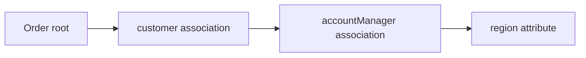

# Part 014 — JPQL, HQL, and the Object Query Model

JPQL sering terlihat seperti SQL yang diganti nama table menjadi nama entity. Itu pemahaman yang berbahaya.

JPQL bukan SQL. JPQL adalah query language terhadap **persistent object model**. Provider kemudian menerjemahkannya menjadi SQL sesuai mapping, inheritance strategy, association, discriminator, join table, fetch plan, dan dialect database.

HQL adalah query language Hibernate yang menjadi superset/varian lebih kaya di atas konsep yang sama. Banyak fitur HQL berguna, tetapi harus dibedakan dari JPQL standar agar arsitektur tidak diam-diam terkunci ke provider-specific feature.

Part ini menjawab:

- bagaimana berpikir dalam query entity, bukan query table;
- bagaimana path navigation berubah menjadi join;
- kapan memakai JPQL, HQL, Criteria, Spring Data query method, atau native SQL;
- kenapa query yang terlihat kecil bisa menghasilkan SQL mahal;
- bagaimana menulis query yang benar secara domain, aman secara parameter, dan predictable secara performa.

## 1. Target Skill Berdasarkan Kaufman

Sub-skill yang ingin kita kuasai:

1. membaca JPQL sebagai query terhadap object model;
2. membedakan entity selection, scalar selection, dan DTO projection;
3. memahami implicit join dan explicit join;
4. menghindari Cartesian product dan duplicate result;
5. memakai parameter binding dengan benar;
6. mendesain query berdasarkan use case, bukan berdasarkan repository template;
7. memilih antara JPQL, HQL, Criteria, native SQL, dan read model;
8. memprediksi SQL kasar yang akan dihasilkan.

Target bukan sekadar bisa menulis:

```java
@Query("select u from User u where u.email = :email")
```

Targetnya adalah bisa menjawab:

> Apa entity root-nya? Apa association yang disentuh? Join apa yang dibuat? Apakah query mengembalikan managed entity atau DTO? Apakah query bisa memicu flush? Apakah hasilnya stabil jika mapping berubah? Apakah pagination aman? Apakah index database mendukungnya?

## 2. JPQL vs SQL: Perbedaan Mental Model

SQL berbicara tentang table, column, row, join, group, index, dan database function.

JPQL berbicara tentang entity, field persistent, association, embeddable, enum, inheritance, dan constructor expression.

Contoh SQL:

```sql
select u.id, u.email
from users u
where u.status = 'ACTIVE';
```

Contoh JPQL:

```java
select u
from User u
where u.status = :status
```

Perhatikan:

- `User` adalah entity name, bukan table name;
- `u.status` adalah persistent attribute, bukan column langsung;
- `:status` adalah parameter;
- hasil `select u` adalah managed `User` entity jika query berjalan dalam persistence context;
- provider menerjemahkan ke SQL berdasarkan mapping.

## 3. Entity Name, Field Name, dan Mapping Name

JPQL memakai nama entity dan property Java, bukan nama table/column.

```java
@Entity
@Table(name = "app_users")
public class User {
    @Column(name = "email_address")
    private String email;
}
```

JPQL:

```java
select u
from User u
where u.email = :email
```

Bukan:

```sql
select u from app_users u where u.email_address = :email
```

Kesalahan ini umum ketika engineer mencampur SQL mental model ke JPQL.

## 4. Query Root

Setiap JPQL query memiliki root entity.

```java
select o
from Order o
where o.status = :status
```

`Order o` adalah root. Dari root ini, kita dapat menavigasi association:

```java
select o
from Order o
where o.customer.email = :email
```

`o.customer.email` terlihat seperti field access biasa, tetapi provider perlu menerjemahkan association `customer` menjadi join ke table customer.

## 5. Path Navigation

Path navigation adalah fitur yang membuat JPQL nyaman, sekaligus berbahaya.

Contoh:

```java
select o
from Order o
where o.customer.accountManager.region = :region
```

Secara konseptual:



SQL yang dihasilkan bisa melibatkan beberapa join:

```sql
select o.*
from orders o
join customers c on c.id = o.customer_id
join account_managers am on am.id = c.account_manager_id
where am.region = ?;
```

Semakin panjang path, semakin besar risiko:

- join tersembunyi;
- query plan mahal;
- null association mengubah hasil;
- sulit mengontrol join type;
- index yang diperlukan tidak jelas.

Prinsip:

> Path navigation pendek boleh. Untuk query penting, tulis join eksplisit agar intent dan join type jelas.

## 6. Implicit Join vs Explicit Join

### 6.1 Implicit Join

```java
select o
from Order o
where o.customer.email = :email
```

Lebih ringkas, tetapi join tersembunyi.

### 6.2 Explicit Join

```java
select o
from Order o
join o.customer c
where c.email = :email
```

Lebih jelas:

- association mana yang disentuh;
- alias tersedia;
- join bisa dikembangkan;
- reviewer lebih mudah membaca query cost.

Untuk production query, explicit join biasanya lebih baik.

## 7. Join Type

JPQL mendukung beberapa bentuk join:

```java
select o
from Order o
join o.customer c
```

```java
select o
from Order o
left join o.coupon coupon
```

```java
select o
from Order o
join fetch o.lines
```

Perbedaan:

| Join | Makna |
|---|---|
| `join` | inner join; hanya root yang punya match |
| `left join` | tetap ambil root meski association null/kosong |
| `join fetch` | join sekaligus initialize association |
| `left join fetch` | fetch association opsional/kosong |

Fetch join akan dibahas lebih dalam di Part 017, tetapi kita perlu mengenal konsepnya di sini.

## 8. Entity Query Mengembalikan Managed Entity

```java
List<User> users = entityManager.createQuery("""
    select u
    from User u
    where u.status = :status
""", User.class)
.setParameter("status", Status.ACTIVE)
.getResultList();
```

Jika query berjalan dalam persistence context, hasil `User` biasanya managed.

Konsekuensi:

```java
users.get(0).rename("Alice");
// Akan dirty-checked dan bisa menjadi UPDATE saat flush.
```

Ini powerful tetapi berbahaya untuk read-only path.

Untuk query read-only besar, pertimbangkan:

- DTO projection;
- read-only transaction;
- provider-specific read-only hint;
- stateless session untuk batch read provider-specific;
- native/read model jika query sangat kompleks.

## 9. Scalar Query

JPQL tidak harus mengembalikan entity.

```java
Long count = entityManager.createQuery("""
    select count(u)
    from User u
    where u.status = :status
""", Long.class)
.setParameter("status", Status.ACTIVE)
.getSingleResult();
```

Scalar query berguna untuk:

- count;
- aggregate;
- existence check;
- simple field extraction.

Contoh multi-scalar:

```java
List<Object[]> rows = entityManager.createQuery("""
    select u.status, count(u)
    from User u
    group by u.status
""", Object[].class)
.getResultList();
```

Namun `Object[]` rapuh. DTO projection biasanya lebih aman.

## 10. Constructor Expression / DTO Projection

```java
public record UserSummary(Long id, String email, Status status) {}
```

JPQL:

```java
List<UserSummary> summaries = entityManager.createQuery("""
    select new com.example.user.UserSummary(u.id, u.email, u.status)
    from User u
    where u.status = :status
    order by u.id asc
""", UserSummary.class)
.setParameter("status", Status.ACTIVE)
.getResultList();
```

Keuntungan:

- tidak membuat entity managed;
- mengurangi kolom yang dibaca;
- cocok untuk API/read model;
- menghindari lazy loading accidental di serialization layer;
- lebih jelas sebagai query read-only.

Trade-off:

- coupling ke constructor package/class name;
- tidak otomatis reusable untuk mutation;
- mapping perubahan field harus diupdate.

## 11. Parameter Binding

Selalu gunakan parameter binding.

Benar:

```java
select u
from User u
where u.email = :email
```

```java
query.setParameter("email", email);
```

Salah:

```java
String jpql = "select u from User u where u.email = '" + email + "'";
```

Risiko:

- injection;
- escaping error;
- query plan cache buruk;
- error saat karakter khusus;
- audit/security finding.

### 11.1 Collection Parameter

```java
select u
from User u
where u.id in :ids
```

```java
.setParameter("ids", ids)
```

Perhatikan:

- list kosong perlu ditangani eksplisit;
- `IN` dengan ribuan parameter bisa buruk;
- database punya limit parameter;
- untuk set besar, pertimbangkan temporary table, staging table, atau batch query.

## 12. Null Semantics

JPQL seperti SQL: `= null` bukan cara yang benar.

Benar:

```java
where u.deletedAt is null
```

Salah:

```java
where u.deletedAt = null
```

Untuk parameter nullable, jangan sembarangan:

```java
where (:email is null or u.email = :email)
```

Pola ini praktis tetapi bisa merusak index usage dan query plan. Untuk dynamic filtering kompleks, Criteria/Specification lebih baik karena hanya menambahkan predicate yang memang dipakai.

## 13. Boolean dan Enum

JPQL memungkinkan penggunaan enum sebagai parameter.

```java
where u.status = :status
```

```java
.setParameter("status", Status.ACTIVE)
```

Jangan hardcode ordinal atau string database kecuali native SQL.

```java
where u.status = 'ACTIVE'
```

Ini bisa berjalan pada provider tertentu, tetapi parameter lebih aman terhadap refactor dan type conversion.

## 14. Date/Time Query

Gunakan Java Time type yang sesuai mapping:

```java
where o.createdAt >= :from
  and o.createdAt < :to
```

```java
.setParameter("from", fromInstant)
.setParameter("to", toInstant)
```

Prinsip interval:

- gunakan half-open interval `[from, to)` untuk range waktu;
- hindari `between` untuk timestamp jika boundary inclusive tidak diinginkan;
- normalisasi timezone di boundary aplikasi;
- pastikan index mendukung kolom waktu.

## 15. `getSingleResult()` vs Optional Semantics

JPA `getSingleResult()` memiliki behavior khusus:

- jika tidak ada row: exception;
- jika lebih dari satu row: exception;
- jika tepat satu row: return.

Untuk repository API modern, sering lebih nyaman membungkus menjadi `Optional<T>`.

```java
public Optional<User> findByEmail(String email) {
    List<User> result = entityManager.createQuery("""
        select u
        from User u
        where u.email = :email
    """, User.class)
    .setParameter("email", email)
    .setMaxResults(1)
    .getResultList();

    return result.stream().findFirst();
}
```

Namun perhatikan: `setMaxResults(1)` menyembunyikan data anomaly jika seharusnya email unique. Untuk invariant uniqueness, lebih baik database unique constraint + exception handling + query yang mengharapkan uniqueness.

## 16. Ordering

Tanpa `order by`, hasil query tidak punya urutan stabil.

```java
select u
from User u
where u.status = :status
```

Jangan mengandalkan urutan default database.

Benar:

```java
select u
from User u
where u.status = :status
order by u.createdAt desc, u.id desc
```

Tambahkan tiebreaker deterministic seperti `id` agar pagination stabil.

## 17. Pagination Dasar

```java
List<UserSummary> page = entityManager.createQuery("""
    select new com.example.UserSummary(u.id, u.email)
    from User u
    where u.status = :status
    order by u.createdAt desc, u.id desc
""", UserSummary.class)
.setParameter("status", Status.ACTIVE)
.setFirstResult(pageNumber * pageSize)
.setMaxResults(pageSize)
.getResultList();
```

Offset pagination mudah, tetapi untuk page besar performanya bisa buruk. Keyset pagination akan dibahas di Part 019.

Yang penting di sini:

- pagination wajib punya `order by` deterministic;
- jangan pagination entity graph besar tanpa memahami fetch plan;
- count query sering menjadi bottleneck terpisah;
- fetch join collection + pagination adalah trap besar.

## 18. Join Fetch: Query atau Fetch Plan?

```java
select distinct o
from Order o
join fetch o.lines
where o.id = :id
```

`join fetch` bukan sekadar join untuk filter. Ia menginstruksikan provider untuk initialize association.

Perbedaan:

```java
select o
from Order o
join o.lines l
where l.productId = :productId
```

versus:

```java
select o
from Order o
join fetch o.lines l
where l.productId = :productId
```

Yang pertama join untuk filter. Yang kedua join untuk filter dan fetch association.

Pitfall:

- duplicate root entity;
- Cartesian explosion jika fetch multiple collections;
- pagination tidak aman;
- memory spike;
- query count turun tetapi row count naik drastis.

Fetch plan akan dibahas khusus di Part 017.

## 19. `distinct` di JPQL Tidak Selalu Sama Dengan SQL DISTINCT

Dalam entity query:

```java
select distinct o
from Order o
join fetch o.lines
```

`distinct` dapat berfungsi pada dua level:

1. SQL-level distinct;
2. de-duplication entity root di persistence context/provider result processing.

Engineer harus tetap melihat SQL dan row count. `distinct` bukan obat untuk query graph yang terlalu besar.

## 20. Aggregation dan Grouping

Contoh:

```java
select new com.example.StatusCount(u.status, count(u))
from User u
group by u.status
order by count(u) desc
```

Untuk analytics kompleks, JPQL mungkin tidak cukup.

Gunakan native SQL/read model ketika butuh:

- window function kompleks;
- CTE rekursif;
- database-specific optimization;
- materialized view;
- lateral join;
- query plan yang harus dikontrol presisi.

JPQL cocok untuk operational query berbasis domain model. Ia bukan pengganti semua SQL.

## 21. Subquery

JPQL mendukung subquery di beberapa konteks.

```java
select c
from Customer c
where exists (
    select o.id
    from Order o
    where o.customer = c
      and o.status = :status
)
```

Subquery berguna untuk existence condition.

Namun jangan otomatis menganggap subquery lebih baik dari join. Cek query plan.

## 22. Bulk Update dan Delete

Bulk JPQL:

```java
int updated = entityManager.createQuery("""
    update User u
    set u.status = :inactive
    where u.lastLoginAt < :cutoff
""")
.setParameter("inactive", Status.INACTIVE)
.setParameter("cutoff", cutoff)
.executeUpdate();
```

Bulk operation:

- langsung dieksekusi di database;
- bypass dirty checking;
- bypass entity lifecycle callback untuk tiap row;
- tidak menyinkronkan managed entity di persistence context;
- tidak otomatis menaikkan version entity kecuali query menyatakannya/provider-specific behavior digunakan;
- bisa membuat cache stale.

Setelah bulk update/delete, biasanya:

```java
entityManager.clear();
```

atau jalankan bulk operation di transaction terpisah.

## 23. JPQL Update Bukan Domain Operation

Bulk update terlihat efisien, tetapi bisa melompati invariant domain.

Contoh:

```java
update Account a
set a.status = :closed
where a.inactiveSince < :cutoff
```

Jika `Account.close()` seharusnya:

- menulis audit;
- menghasilkan domain event;
- memvalidasi balance;
- mengubah child records;

maka bulk update ini berbahaya.

Gunakan bulk update untuk state yang memang dapat diubah set-wise tanpa domain side effect per entity. Jika tidak, proses command per aggregate dengan batch strategy.

## 24. Named Query vs Inline Query

Named query:

```java
@NamedQuery(
    name = "User.findByEmail",
    query = "select u from User u where u.email = :email"
)
```

Inline query:

```java
entityManager.createQuery("""
    select u
    from User u
    where u.email = :email
""", User.class)
```

Trade-off:

| Approach | Keuntungan | Kerugian |
|---|---|---|
| Named query | Validasi lebih awal, reusable | Bisa mengotori entity, kurang fleksibel |
| Inline repository query | Dekat dengan use case | Validasi bisa lebih lambat, string tersebar |
| Spring Data `@Query` | Ringkas di repository | Bisa membuat repository terlalu gemuk |
| Criteria/Specification | Dynamic dan composable | Verbose, sulit dibaca jika tidak disiplin |

Untuk sistem besar, query harus berada dekat dengan boundary use case/read model, bukan acak di entity.

## 25. HQL: Kapan Provider-Specific Masuk Akal?

HQL Hibernate menyediakan kemampuan tambahan di luar JPQL standar. Provider-specific feature masuk akal ketika:

- performance/expressiveness JPQL tidak cukup;
- tim sengaja memilih Hibernate sebagai platform ORM, bukan sekadar provider interchangeable;
- keputusan didokumentasikan;
- ada test integrasi yang mengunci behavior;
- ada fallback/migration awareness.

Jangan menyebut semua query “JPQL” jika sebenarnya memakai HQL extension. Itu membuat portability risk tersembunyi.

Prinsip:

```text
Default: JPQL standard
Jika butuh dynamic query: Criteria / Specification
Jika butuh provider feature: HQL with explicit documentation
Jika butuh full database power: native SQL / read model
```

## 26. Native SQL: Kapan Harus Dipilih?

Native SQL bukan kegagalan memakai JPA. Native SQL adalah alat yang tepat untuk masalah tertentu.

Gunakan native SQL ketika:

- query sangat database-specific;
- butuh CTE/window/lateral/materialized view;
- query plan harus dikontrol presisi;
- data tidak cocok sebagai entity graph;
- reporting/read model lebih penting daripada persistence lifecycle;
- ingin memanfaatkan index/operator khusus database.

Namun jangan campur native mutation dengan managed entity tanpa sync strategy.

Checklist native SQL:

```text
[ ] Apakah query read-only atau mutation?
[ ] Apakah menyentuh table entity yang sedang managed?
[ ] Apakah perlu flush sebelum query?
[ ] Apakah perlu clear/refresh setelah mutation?
[ ] Apakah mapping result DTO jelas?
[ ] Apakah database-specific syntax diterima secara sadar?
[ ] Apakah query plan diuji?
```

## 27. Query Placement: Entity, Repository, Service, atau Read Model?

Query sebaiknya ditempatkan berdasarkan tanggung jawab.

| Lokasi | Cocok untuk | Hindari |
|---|---|---|
| Entity | Hampir tidak pernah untuk query database | Entity tahu persistence mechanism |
| Repository | Aggregate lookup, command-side query, simple read | Reporting kompleks, API-specific projection terlalu banyak |
| Read repository/query service | DTO/read model/API query | Mutation entity lifecycle |
| Specification | Dynamic filtering composable | Query performa kritis yang butuh kontrol SQL ketat |
| Native DAO/read model | Query kompleks/database-specific | Domain invariant mutation tersembunyi |

Repository bukan tempat semua query tinggal. Untuk aplikasi enterprise, pisahkan command-side repository dan read-side query service jika query mulai kompleks.

## 28. Query Correctness Checklist

Sebelum merge query baru, jawab:

```text
[ ] Query root jelas.
[ ] Selection type jelas: entity, scalar, DTO.
[ ] Jika entity dikembalikan, caller sadar entity managed.
[ ] Join eksplisit untuk association penting.
[ ] Tidak ada path navigation panjang tanpa review SQL.
[ ] Parameter binding dipakai, tidak ada string concatenation input user.
[ ] Nullable parameter ditangani tanpa merusak query plan tanpa sadar.
[ ] Ordering deterministic jika hasil lebih dari satu row.
[ ] Pagination tidak memakai collection fetch join.
[ ] Count query dievaluasi performanya.
[ ] Bulk update/delete tidak melanggar invariant domain.
[ ] Flush interaction diketahui jika query berada di tengah write path.
[ ] SQL dan query plan sudah dilihat untuk path kritis.
```

## 29. Example: Dari Requirement ke Query Design

Requirement:

> Tampilkan 50 order terbaru untuk customer tertentu, berisi order id, tanggal, status, total amount, dan jumlah line item. Jangan load semua line item.

### 29.1 Query Entity yang Buruk

```java
select o
from Order o
join fetch o.lines
where o.customer.id = :customerId
order by o.createdAt desc
```

Masalah:

- load entity penuh;
- fetch semua lines;
- pagination bermasalah jika ditambahkan;
- row explosion;
- caller hanya butuh summary.

### 29.2 Query DTO Lebih Tepat

```java
public record OrderSummary(
    Long id,
    Instant createdAt,
    OrderStatus status,
    BigDecimal totalAmount,
    long lineCount
) {}
```

```java
select new com.example.order.OrderSummary(
    o.id,
    o.createdAt,
    o.status,
    o.totalAmount,
    count(l)
)
from Order o
left join o.lines l
where o.customer.id = :customerId
group by o.id, o.createdAt, o.status, o.totalAmount
order by o.createdAt desc, o.id desc
```

Dengan pagination:

```java
.setFirstResult(offset)
.setMaxResults(50)
```

Masih perlu cek SQL plan, tetapi modelnya lebih sesuai requirement.

## 30. Example: Existence Check

Buruk:

```java
Optional<User> user = userRepository.findByEmail(email);
return user.isPresent();
```

Jika entity besar, ini load data yang tidak diperlukan.

Lebih baik:

```java
select count(u.id) > 0
from User u
where u.email = :email
```

Namun tidak semua JPQL/provider/database menangani boolean expression sama. Alternatif portable:

```java
select count(u)
from User u
where u.email = :email
```

lalu:

```java
return count > 0;
```

Untuk table besar dengan unique index, database bisa mengoptimalkan. Native `exists` bisa lebih ekspresif untuk beberapa database.

## 31. Query Performance Is a Contract

Query bukan sekadar implementation detail. Query adalah kontrak performa.

Untuk query production-critical, dokumentasikan:

```text
Use case: Customer order summary page
Expected max rows read: 50 order rows + aggregate line counts
Expected latency budget: < 100ms p95 under normal load
Required indexes:
- orders(customer_id, created_at desc, id desc)
- order_lines(order_id)
Fetch strategy: DTO projection, no entity graph
Pagination: offset for first pages, migrate to keyset if deep navigation needed
```

Ini gaya engineering handbook: query tidak dibiarkan sebagai string anonim.

## 32. Practice: Latihan 120 Menit

### Latihan 1 — Predict the Join

Diberikan mapping:

```java
class Order {
    @ManyToOne Customer customer;
}

class Customer {
    @ManyToOne Region region;
}
```

Tulis JPQL:

```java
select o from Order o where o.customer.region.code = :code
```

Lalu tulis ulang dengan explicit join. Bandingkan SQL.

### Latihan 2 — Entity vs DTO

Buat dua query untuk halaman user list:

1. `select u from User u`
2. `select new UserRow(u.id, u.email, u.status) from User u`

Bandingkan:

- kolom SQL;
- managed entity count;
- dirty checking risk;
- serialization risk.

### Latihan 3 — Bulk Update Staleness

Load `User`, jalankan bulk update status, lalu baca status dari object yang sama. Buktikan bahwa persistence context stale sampai clear/refresh.

### Latihan 4 — Query Review

Ambil satu query dari aplikasi nyata. Isi checklist:

```text
Root:
Selection:
Join:
Fetch:
Pagination:
Ordering:
Indexes:
Flush interaction:
Potential N+1:
Potential row explosion:
```

## 33. Common Anti-Patterns

### 33.1 JPQL Sebagai SQL Dengan Nama Entity

Gejala:

- query panjang seperti SQL tetapi memaksa lewat JPQL;
- sulit membaca mapping effect;
- tidak memakai kekuatan object model;
- tetap tidak mendapatkan kontrol penuh SQL.

Solusi: pilih JPQL untuk object query, native SQL untuk database query kompleks.

### 33.2 Returning Entity for Every Read

Gejala:

```java
List<Order> findOrdersForDashboard(...)
```

Dashboard hanya butuh 5 field, tetapi entity besar dikembalikan.

Dampak:

- lazy loading accidental;
- serialization loop;
- overfetching;
- dirty checking overhead;
- API coupling ke domain entity.

Solusi: DTO/read model.

### 33.3 Dynamic Query Dengan OR Nullable Parameter

```java
where (:status is null or u.status = :status)
  and (:email is null or u.email = :email)
```

Praktis, tetapi query plan bisa buruk. Untuk filter kompleks, generate predicate yang diperlukan saja.

### 33.4 Fetch Join Untuk Semua Masalah

Fetch join mengurangi N+1 tetapi bisa menciptakan Cartesian explosion. Gunakan fetch plan yang sesuai, bukan reflex.

### 33.5 Bulk Update Untuk Domain Transition

Bulk update tidak memanggil behavior domain per aggregate. Jangan gunakan untuk transition yang punya invariant/event/audit kompleks.

## 34. Ringkasan Mental Model

JPQL/HQL harus dibaca sebagai query terhadap object model.

```text
Entity root
    ↓
Path navigation / explicit join
    ↓
Provider translation based on mapping
    ↓
SQL with joins, predicates, projection
    ↓
Database query plan
    ↓
Managed entity / DTO / scalar result
```

Prinsip utama:

1. JPQL memakai entity dan attribute, bukan table dan column.
2. Path navigation dapat menyembunyikan join.
3. Entity result berarti managed state dan dirty checking risk.
4. DTO projection lebih tepat untuk banyak read use case.
5. Bulk update/delete bypass persistence context.
6. Fetch join adalah fetch strategy, bukan sekadar join biasa.
7. Native SQL adalah alat sah ketika query database lebih penting daripada object query.
8. Query production-critical harus direview seperti API contract.

Di part berikutnya, kita akan masuk ke **Criteria API and Type-Safe Dynamic Queries**: bagaimana membangun query dinamis tanpa string concatenation, bagaimana Specification pattern bekerja, dan bagaimana menjaga dynamic filtering tetap readable, testable, serta tidak menghancurkan query plan.
