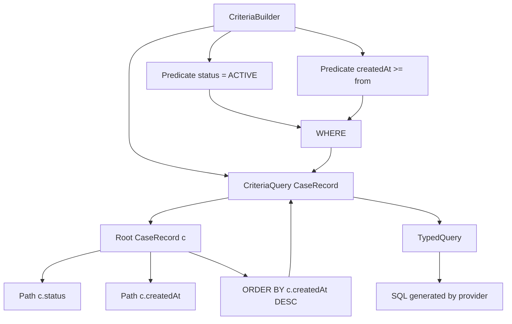
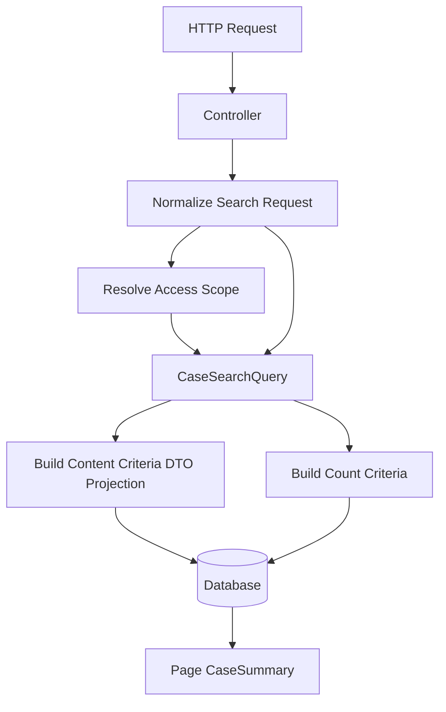

# Part 015 — Criteria API and Type-Safe Dynamic Queries

Criteria API sering dianggap sebagai "JPQL yang lebih panjang". Itu salah framing.

Criteria API adalah cara membangun **query tree** secara programmatic. Ia berguna ketika bentuk query tidak statis: filter opsional, kombinasi predicate, sorting dinamis, access-control predicate, tenant predicate, search form, dan reusable query fragments.

Namun Criteria API juga mudah disalahgunakan. Tanpa disiplin desain, ia berubah menjadi ratusan baris builder code yang lebih sulit dibaca daripada JPQL, lebih sulit diuji, dan lebih mudah menghasilkan join tersembunyi.

Part ini membahas:

- mental model Criteria sebagai abstract syntax tree query;
- komponen inti `CriteriaBuilder`, `CriteriaQuery`, `Root`, `Join`, `Path`, `Predicate`, `Expression`, dan `Selection`;
- kapan Criteria lebih tepat daripada JPQL;
- bagaimana membuat dynamic query yang composable;
- bagaimana Spring Data JPA `Specification` membungkus Criteria predicate;
- bagaimana menghindari anti-pattern seperti monster specification, fetch join pagination trap, dan OR explosion;
- bagaimana memisahkan filter semantics, fetch plan, projection, sorting, dan authorization predicate.

## 1. Target Skill Berdasarkan Kaufman

Sub-skill yang ingin kita kuasai:

1. membaca Criteria API sebagai query AST, bukan string concatenation;
2. menerjemahkan JPQL sederhana ke struktur Criteria;
3. membuat predicate opsional tanpa `if` chaos;
4. menyusun filter dinamis yang reusable;
5. mengelola join secara eksplisit dan predictable;
6. membuat count query yang benar untuk pagination;
7. membedakan predicate specification dari fetch plan;
8. mengenali kapan Criteria sudah bukan alat yang tepat;
9. menulis test untuk query semantics, bukan hanya test repository happy path.

Target akhirnya:

> Ketika melihat search screen dengan 20 filter opsional, kita bisa mendesain query layer yang tetap readable, testable, performant, dan tidak mencampur domain rule, security rule, pagination, fetch strategy, dan DTO projection secara sembarangan.

## 2. Kenapa Criteria API Ada?

JPQL bagus untuk query statis:

```java
select c
from CaseRecord c
where c.status = :status
  and c.createdAt >= :from
order by c.createdAt desc
```

Masalah muncul ketika filter bersifat opsional:

- `status` boleh kosong;
- `from` dan `to` boleh kosong;
- `assignedOfficerId` opsional;
- `tenantId` wajib untuk security;
- `keyword` bisa mencari beberapa field;
- `severity` bisa multiple value;
- sorting dipilih user;
- ada rule tambahan jika user bukan supervisor;
- query harus bisa dipakai untuk list screen dan export.

Pilihan buruk:

```java
String jpql = "select c from CaseRecord c where 1=1";

if (status != null) {
    jpql += " and c.status = '" + status + "'";
}
```

Masalahnya:

1. raw string concatenation rentan injection;
2. spasi dan alias mudah rusak;
3. predicate sulit diuji per bagian;
4. path property tidak checked saat compile;
5. refactoring field sering baru ketahuan saat runtime;
6. query menjadi procedural soup.

Criteria API menawarkan model yang lebih aman:

```java
CriteriaBuilder cb = entityManager.getCriteriaBuilder();
CriteriaQuery<CaseRecord> query = cb.createQuery(CaseRecord.class);
Root<CaseRecord> root = query.from(CaseRecord.class);

List<Predicate> predicates = new ArrayList<>();

if (status != null) {
    predicates.add(cb.equal(root.get("status"), status));
}

if (from != null) {
    predicates.add(cb.greaterThanOrEqualTo(root.get("createdAt"), from));
}

query.select(root)
     .where(predicates.toArray(Predicate[]::new))
     .orderBy(cb.desc(root.get("createdAt")));

List<CaseRecord> results = entityManager.createQuery(query).getResultList();
```

Ini belum ideal, tetapi sudah lebih aman daripada string concatenation.

## 3. Mental Model: Criteria sebagai Query Tree

Criteria bukan "builder SQL". Criteria membangun object graph yang merepresentasikan query.



Yang penting:

- `CriteriaQuery<T>` menentukan result type;
- `Root<X>` menentukan entity root di `FROM`;
- `Path<Y>` merepresentasikan access ke persistent attribute;
- `Predicate` merepresentasikan kondisi boolean;
- `Expression<T>` merepresentasikan expression yang punya type;
- `Selection<T>` menentukan apa yang dikembalikan;
- provider menerjemahkan tree ini menjadi SQL.

Di level mental model:

| JPQL Concept | Criteria API Concept |
|---|---|
| `select c` | `query.select(root)` |
| `from CaseRecord c` | `Root<CaseRecord> root = query.from(CaseRecord.class)` |
| `where c.status = :status` | `cb.equal(root.get("status"), status)` |
| `join c.assignee a` | `root.join("assignee")` |
| `order by c.createdAt desc` | `query.orderBy(cb.desc(root.get("createdAt")))` |
| `select new Dto(...)` | `cb.construct(Dto.class, ...)` |
| `count(c)` | `cb.count(root)` |
| `and`, `or`, `not` | `cb.and(...)`, `cb.or(...)`, `cb.not(...)` |

## 4. Core Objects

### 4.1 `CriteriaBuilder`

`CriteriaBuilder` adalah factory untuk:

- `CriteriaQuery`;
- `CriteriaUpdate`;
- `CriteriaDelete`;
- predicate;
- expression;
- aggregate function;
- ordering;
- constructor projection.

Biasanya diperoleh dari `EntityManager`:

```java
CriteriaBuilder cb = entityManager.getCriteriaBuilder();
```

Jangan treat `CriteriaBuilder` sebagai stateful service. Ia bukan tempat menyimpan filter. Ia hanya factory.

### 4.2 `CriteriaQuery<T>`

`CriteriaQuery<T>` mendefinisikan query top-level dan result type.

```java
CriteriaQuery<CaseRecord> query = cb.createQuery(CaseRecord.class);
```

Jika result-nya DTO:

```java
CriteriaQuery<CaseSummary> query = cb.createQuery(CaseSummary.class);
```

Jika result-nya scalar:

```java
CriteriaQuery<Long> query = cb.createQuery(Long.class);
```

Jika result-nya mixed:

```java
CriteriaQuery<Tuple> query = cb.createTupleQuery();
```

Rule penting:

> Result type harus dipikirkan dari use case. Jangan default mengembalikan entity jika screen hanya butuh lima column.

### 4.3 `Root<T>`

`Root<T>` adalah entity root dalam `FROM` clause.

```java
Root<CaseRecord> caseRoot = query.from(CaseRecord.class);
```

Untuk query sederhana, biasanya hanya ada satu root. Multiple root berarti cross join kecuali diberi predicate korelasi. Hati-hati.

Bad smell:

```java
Root<CaseRecord> c = query.from(CaseRecord.class);
Root<Officer> o = query.from(Officer.class);
query.where(cb.equal(c.get("assignee"), o));
```

Lebih baik gunakan association join jika relasinya memang ada:

```java
Root<CaseRecord> c = query.from(CaseRecord.class);
Join<CaseRecord, Officer> o = c.join("assignee");
```

### 4.4 `Path<T>`

`Path<T>` merepresentasikan field/property persistent.

```java
Path<CaseStatus> status = root.get("status");
Path<Instant> createdAt = root.get("createdAt");
```

Masalah string path:

```java
root.get("cretaedAt") // typo baru ketahuan runtime
```

Static metamodel mengurangi risiko:

```java
root.get(CaseRecord_.createdAt)
```

Namun static metamodel butuh annotation processing dan tidak selalu dipakai di semua codebase. Alternatifnya adalah query DSL library, tetapi di seri ini kita fokus ke JPA/Spring Data JPA built-in.

### 4.5 `Predicate`

`Predicate` adalah boolean expression.

```java
Predicate active = cb.equal(root.get("status"), CaseStatus.ACTIVE);
Predicate recent = cb.greaterThan(root.get("createdAt"), from);

query.where(cb.and(active, recent));
```

`Predicate` bisa dibuat composable, tetapi jangan lupa ia terikat ke:

- `CriteriaBuilder`;
- `Root`;
- `CriteriaQuery`;
- join yang dibuat.

Karena itu predicate object tidak reusable lintas query instance. Yang reusable adalah **function yang membangun predicate**.

### 4.6 `Join`

Join dibuat dari root atau join lain:

```java
Join<CaseRecord, Officer> officer = root.join("assignee", JoinType.LEFT);
```

Rule desain:

> Join harus eksplisit, diberi alasan, dan dikendalikan. Dynamic query yang membuat join di banyak fragment bisa menghasilkan duplicate join atau SQL membengkak.

### 4.7 `Selection`

Selection menentukan result.

Entity result:

```java
query.select(root);
```

Single scalar:

```java
query.select(root.get("id"));
```

DTO constructor:

```java
query.select(cb.construct(
    CaseSummary.class,
    root.get("id"),
    root.get("caseNumber"),
    root.get("status")
));
```

Tuple:

```java
query.multiselect(
    root.get("id").alias("id"),
    root.get("caseNumber").alias("caseNumber")
);
```

## 5. Basic Criteria Query

Domain contoh:

```java
@Entity
@Table(name = "case_record")
public class CaseRecord {
    @Id
    private UUID id;

    @Column(nullable = false, unique = true)
    private String caseNumber;

    @Enumerated(EnumType.STRING)
    @Column(nullable = false)
    private CaseStatus status;

    @ManyToOne(fetch = FetchType.LAZY)
    @JoinColumn(name = "assignee_id")
    private Officer assignee;

    @Column(nullable = false)
    private UUID tenantId;

    @Column(nullable = false)
    private Instant createdAt;

    @Version
    private long version;
}
```

Query: cari active cases milik tenant tertentu.

```java
public List<CaseRecord> findActiveCases(UUID tenantId) {
    CriteriaBuilder cb = entityManager.getCriteriaBuilder();
    CriteriaQuery<CaseRecord> query = cb.createQuery(CaseRecord.class);
    Root<CaseRecord> root = query.from(CaseRecord.class);

    query.select(root)
         .where(
             cb.equal(root.get("tenantId"), tenantId),
             cb.equal(root.get("status"), CaseStatus.ACTIVE)
         )
         .orderBy(cb.desc(root.get("createdAt")));

    return entityManager.createQuery(query)
            .setMaxResults(100)
            .getResultList();
}
```

SQL kira-kira:

```sql
select c.*
from case_record c
where c.tenant_id = ?
  and c.status = ?
order by c.created_at desc
limit ?
```

Yang harus ditanya:

1. Apakah index mendukung `(tenant_id, status, created_at)`?
2. Apakah result entity akan dimodifikasi?
3. Apakah screen butuh semua column?
4. Apakah `assignee` akan diakses setelah query?
5. Apakah pagination stabil jika banyak row punya `created_at` sama?

Criteria API tidak menghapus kebutuhan berpikir SQL.

## 6. Dynamic Filter Object

Mulai dari filter object yang eksplisit:

```java
public record CaseSearchFilter(
    UUID tenantId,
    Set<CaseStatus> statuses,
    UUID assigneeId,
    Instant createdFrom,
    Instant createdTo,
    String keyword,
    Boolean overdueOnly
) {}
```

Jangan oper raw request object langsung ke repository. Normalisasi dulu di service/application layer:

```java
public CaseSearchFilter normalize(CaseSearchRequest request, UUID tenantId) {
    return new CaseSearchFilter(
        tenantId,
        emptyToNull(request.statuses()),
        request.assigneeId(),
        request.createdFrom(),
        request.createdTo(),
        normalizeKeyword(request.keyword()),
        Boolean.TRUE.equals(request.overdueOnly())
    );
}
```

Kenapa?

- tenant/security context harus authoritative, bukan dari request;
- empty string harus jadi `null` atau normalized value;
- date range harus divalidasi;
- status list harus dibatasi;
- keyword harus dipotong length-nya;
- sorting harus whitelist.

## 7. Predicate Builder Pattern

Bentuk awal:

```java
public List<CaseRecord> search(CaseSearchFilter filter) {
    CriteriaBuilder cb = entityManager.getCriteriaBuilder();
    CriteriaQuery<CaseRecord> query = cb.createQuery(CaseRecord.class);
    Root<CaseRecord> root = query.from(CaseRecord.class);

    List<Predicate> predicates = new ArrayList<>();

    predicates.add(cb.equal(root.get("tenantId"), filter.tenantId()));

    if (filter.statuses() != null && !filter.statuses().isEmpty()) {
        predicates.add(root.get("status").in(filter.statuses()));
    }

    if (filter.assigneeId() != null) {
        predicates.add(cb.equal(root.get("assignee").get("id"), filter.assigneeId()));
    }

    if (filter.createdFrom() != null) {
        predicates.add(cb.greaterThanOrEqualTo(root.get("createdAt"), filter.createdFrom()));
    }

    if (filter.createdTo() != null) {
        predicates.add(cb.lessThan(root.get("createdAt"), filter.createdTo()));
    }

    query.select(root)
         .where(predicates.toArray(Predicate[]::new))
         .orderBy(cb.desc(root.get("createdAt")), cb.desc(root.get("id")));

    return entityManager.createQuery(query)
            .setMaxResults(100)
            .getResultList();
}
```

Ini acceptable untuk query kecil. Namun jika dipakai di banyak tempat, fragment predicate sebaiknya diekstrak.

Contoh helper:

```java
public final class CasePredicates {
    private CasePredicates() {}

    public static Optional<Predicate> hasStatuses(
            Set<CaseStatus> statuses,
            Root<CaseRecord> root
    ) {
        if (statuses == null || statuses.isEmpty()) {
            return Optional.empty();
        }
        return Optional.of(root.get("status").in(statuses));
    }

    public static Optional<Predicate> createdFrom(
            Instant from,
            CriteriaBuilder cb,
            Root<CaseRecord> root
    ) {
        if (from == null) {
            return Optional.empty();
        }
        return Optional.of(cb.greaterThanOrEqualTo(root.get("createdAt"), from));
    }
}
```

Usage:

```java
List<Predicate> predicates = new ArrayList<>();
predicates.add(cb.equal(root.get("tenantId"), filter.tenantId()));

CasePredicates.hasStatuses(filter.statuses(), root).ifPresent(predicates::add);
CasePredicates.createdFrom(filter.createdFrom(), cb, root).ifPresent(predicates::add);
```

Lebih penting dari syntax adalah separation:

- filter normalization di application layer;
- predicate construction di query layer;
- fetch plan di query method;
- authorization predicate harus eksplisit;
- pagination dan sorting tidak boleh terselip di arbitrary predicate fragment.

## 8. Null Discipline

Dynamic query sering rusak bukan karena Criteria API, tetapi karena semantics filter tidak jelas.

Contoh ambiguous:

```java
status == null
```

Apakah artinya:

1. jangan filter status?
2. cari row dengan `status is null`?
3. invalid request?
4. default ke active?

Buat semantics eksplisit.

```java
public sealed interface StatusFilter {
    record Any() implements StatusFilter {}
    record In(Set<CaseStatus> values) implements StatusFilter {}
    record IsNull() implements StatusFilter {}
}
```

Lalu query builder:

```java
public Predicate statusPredicate(
        StatusFilter filter,
        CriteriaBuilder cb,
        Root<CaseRecord> root
) {
    return switch (filter) {
        case StatusFilter.Any ignored -> cb.conjunction();
        case StatusFilter.In in -> root.get("status").in(in.values());
        case StatusFilter.IsNull ignored -> cb.isNull(root.get("status"));
    };
}
```

`cb.conjunction()` berarti predicate selalu true. Gunakan hati-hati. Jangan jadikan ia tempat menyembunyikan filter wajib yang hilang.

Bad:

```java
Predicate tenantPredicate = tenantId == null
    ? cb.conjunction()
    : cb.equal(root.get("tenantId"), tenantId);
```

Untuk tenant/security filter, `tenantId == null` harus error, bukan "no filter".

Good:

```java
if (tenantId == null) {
    throw new IllegalArgumentException("tenantId is required");
}

Predicate tenantPredicate = cb.equal(root.get("tenantId"), tenantId);
```

## 9. Keyword Search

Contoh keyword sederhana:

```java
if (filter.keyword() != null) {
    String like = "%" + filter.keyword().toLowerCase(Locale.ROOT) + "%";

    Predicate byCaseNumber = cb.like(cb.lower(root.get("caseNumber")), like);
    Predicate byTitle = cb.like(cb.lower(root.get("title")), like);

    predicates.add(cb.or(byCaseNumber, byTitle));
}
```

Masalah:

- `lower(column)` bisa menghambat index biasa;
- leading wildcard `%keyword` biasanya tidak memanfaatkan B-tree index;
- OR di banyak column bisa membuat query plan buruk;
- search semantics sering lebih cocok memakai full-text search.

Rule praktis:

| Kebutuhan | Pendekatan |
|---|---|
| Exact lookup | `=` dengan index |
| Prefix search | `like 'abc%'` dengan index yang sesuai |
| Contains search kecil | `like '%abc%'`, batasi dataset |
| Full-text multi-field | database full-text/search engine |
| Typo tolerance/ranking | search engine atau specialized index |

Criteria API tidak membuat search mahal menjadi murah.

## 10. Join dalam Criteria

### 10.1 Many-to-one join

```java
Join<CaseRecord, Officer> assignee = root.join("assignee", JoinType.LEFT);

if (filter.assigneeName() != null) {
    predicates.add(cb.like(
        cb.lower(assignee.get("name")),
        "%" + filter.assigneeName().toLowerCase(Locale.ROOT) + "%"
    ));
}
```

Gunakan join jika filter/sort/projection membutuhkan table terkait.

Jangan join hanya karena "mungkin nanti dipakai".

### 10.2 Join reuse

Masalah umum:

```java
Specification<CaseRecord> byOfficerName = (root, query, cb) -> {
    Join<CaseRecord, Officer> officer = root.join("assignee", JoinType.LEFT);
    return cb.like(officer.get("name"), "%andi%");
};

Specification<CaseRecord> byOfficerUnit = (root, query, cb) -> {
    Join<CaseRecord, Officer> officer = root.join("assignee", JoinType.LEFT);
    return cb.equal(officer.get("unit"), "ENFORCEMENT");
};
```

Jika digabung, provider bisa membuat dua join ke association yang sama. Kadang SQL masih benar, tapi bisa lebih berat dan membingungkan.

Solusi sederhana: centralize join creation pada query method atau gunakan helper join registry.

```java
@SuppressWarnings("unchecked")
private static <Z, X> Join<Z, X> getOrCreateJoin(
        From<Z, ?> from,
        String attribute,
        JoinType joinType
) {
    for (Join<Z, ?> join : from.getJoins()) {
        if (join.getAttribute().getName().equals(attribute)
                && join.getJoinType().equals(joinType)) {
            return (Join<Z, X>) join;
        }
    }
    return (Join<Z, X>) from.join(attribute, joinType);
}
```

Usage:

```java
Join<CaseRecord, Officer> officer = getOrCreateJoin(root, "assignee", JoinType.LEFT);
```

Trade-off: helper ini provider-independent secara konsep, tetapi tetap perlu diuji karena Criteria tree dapat berbeda tergantung provider.

## 11. Sorting Dinamis

Jangan langsung menerima field sort dari request dan memasukkannya ke `root.get(...)`.

Bad:

```java
query.orderBy(cb.asc(root.get(request.sortBy())));
```

Masalah:

- runtime error jika field tidak valid;
- user bisa men-trigger join/sort mahal;
- sort by non-indexed column bisa membunuh performa;
- sort semantics bisa tidak stabil.

Gunakan whitelist:

```java
public enum CaseSortKey {
    CREATED_AT,
    CASE_NUMBER,
    STATUS
}
```

Mapper:

```java
private Order toOrder(
        CaseSortKey key,
        SortDirection direction,
        CriteriaBuilder cb,
        Root<CaseRecord> root
) {
    Expression<?> expression = switch (key) {
        case CREATED_AT -> root.get("createdAt");
        case CASE_NUMBER -> root.get("caseNumber");
        case STATUS -> root.get("status");
    };

    return direction == SortDirection.ASC
        ? cb.asc(expression)
        : cb.desc(expression);
}
```

Tambahkan tie-breaker stabil:

```java
query.orderBy(
    toOrder(sort.key(), sort.direction(), cb, root),
    cb.desc(root.get("id"))
);
```

Kenapa tie-breaker penting?

Pagination dengan order tidak unik bisa menghasilkan row yang lompat/duplikat antar page ketika data berubah atau database memilih order internal berbeda.

## 12. Count Query untuk Pagination

Pagination butuh dua query:

1. content query;
2. count query.

Content query:

```java
CriteriaQuery<CaseSummary> contentQuery = cb.createQuery(CaseSummary.class);
Root<CaseRecord> root = contentQuery.from(CaseRecord.class);

contentQuery.select(cb.construct(
        CaseSummary.class,
        root.get("id"),
        root.get("caseNumber"),
        root.get("status"),
        root.get("createdAt")
    ))
    .where(predicates.toArray(Predicate[]::new))
    .orderBy(cb.desc(root.get("createdAt")), cb.desc(root.get("id")));
```

Count query:

```java
CriteriaQuery<Long> countQuery = cb.createQuery(Long.class);
Root<CaseRecord> countRoot = countQuery.from(CaseRecord.class);

List<Predicate> countPredicates = buildPredicates(filter, cb, countRoot);

countQuery.select(cb.count(countRoot))
          .where(countPredicates.toArray(Predicate[]::new));
```

Important:

> Jangan reuse `Predicate` object dari content query ke count query. Predicate terikat ke root/query asalnya.

Karena itu reusable unit harus berupa function:

```java
@FunctionalInterface
public interface CriteriaPredicateFactory<T> {
    Predicate toPredicate(Root<T> root, CriteriaQuery<?> query, CriteriaBuilder cb);
}
```

Lalu:

```java
private List<Predicate> buildPredicates(
        CaseSearchFilter filter,
        CriteriaBuilder cb,
        Root<CaseRecord> root
) {
    List<Predicate> predicates = new ArrayList<>();
    predicates.add(cb.equal(root.get("tenantId"), filter.tenantId()));
    // add optional predicates
    return predicates;
}
```

## 13. `distinct` Tidak Sama Dengan Query Murah

Saat join collection, result entity bisa duplicate:

```java
Root<CaseRecord> root = query.from(CaseRecord.class);
Join<CaseRecord, Violation> violations = root.join("violations");

query.select(root)
     .distinct(true)
     .where(cb.equal(violations.get("code"), "AML-001"));
```

`distinct(true)` bisa diperlukan secara semantics, tetapi ada konsekuensi:

- database mungkin melakukan sort/hash distinct;
- pagination dengan join collection bisa rumit;
- count query harus memakai `countDistinct` jika semantics memang distinct root;
- duplicate dapat muncul karena desain query/fetch plan yang salah.

Jangan pakai `distinct` sebagai obat umum.

Tanyakan:

1. Apakah join collection memang diperlukan?
2. Apakah bisa query id dulu lalu fetch detail?
3. Apakah filter bisa memakai `exists` subquery?
4. Apakah read model lebih tepat?

## 14. Subquery dan `exists`

Kadang lebih baik memakai subquery daripada join collection.

Contoh: cari case yang punya violation code tertentu.

```java
CriteriaQuery<CaseRecord> query = cb.createQuery(CaseRecord.class);
Root<CaseRecord> root = query.from(CaseRecord.class);

Subquery<UUID> subquery = query.subquery(UUID.class);
Root<Violation> violation = subquery.from(Violation.class);

subquery.select(violation.get("caseRecord").get("id"))
        .where(
            cb.equal(violation.get("caseRecord"), root),
            cb.equal(violation.get("code"), "AML-001")
        );

query.select(root)
     .where(cb.exists(subquery));
```

SQL kira-kira:

```sql
select c.*
from case_record c
where exists (
    select 1
    from violation v
    where v.case_record_id = c.id
      and v.code = ?
)
```

Keuntungan:

- menghindari duplicate root akibat join collection;
- semantics filter lebih jelas;
- sering lebih cocok untuk "has at least one child matching condition".

Namun performa tergantung database, index, dan optimizer. Selalu cek execution plan untuk query penting.

## 15. Criteria DTO Projection

DTO projection:

```java
public record CaseSummary(
    UUID id,
    String caseNumber,
    CaseStatus status,
    Instant createdAt
) {}
```

Criteria:

```java
CriteriaQuery<CaseSummary> query = cb.createQuery(CaseSummary.class);
Root<CaseRecord> root = query.from(CaseRecord.class);

query.select(cb.construct(
        CaseSummary.class,
        root.get("id"),
        root.get("caseNumber"),
        root.get("status"),
        root.get("createdAt")
    ))
    .where(cb.equal(root.get("tenantId"), tenantId));
```

Gunakan projection ketika:

- data hanya dibaca;
- screen butuh subset column;
- entity graph besar;
- result volume tinggi;
- tidak ingin managed entity dan dirty checking;
- API contract tidak sama dengan domain entity.

Projection akan dibahas lebih dalam di Part 016.

## 16. Criteria Bulk Update/Delete

Criteria API juga memiliki bulk update/delete:

```java
CriteriaUpdate<CaseRecord> update = cb.createCriteriaUpdate(CaseRecord.class);
Root<CaseRecord> root = update.from(CaseRecord.class);

update.set(root.get("status"), CaseStatus.ARCHIVED)
      .where(
          cb.equal(root.get("tenantId"), tenantId),
          cb.lessThan(root.get("createdAt"), cutoff)
      );

int affected = entityManager.createQuery(update).executeUpdate();
```

Bulk operation penting untuk maintenance dan batch, tetapi berbahaya karena:

- bypass entity lifecycle callback;
- bypass dirty checking;
- tidak otomatis sinkron dengan managed entities di persistence context;
- bisa membuat first-level/second-level cache stale;
- tidak cocok untuk domain operation yang butuh invariant per aggregate.

Rule:

> Setelah bulk update/delete, persistence context yang mungkin memuat entity terdampak harus dibersihkan atau tidak digunakan lagi untuk keputusan bisnis.

Praktis:

```java
int affected = entityManager.createQuery(update).executeUpdate();
entityManager.clear();
```

Di Spring Data JPA, `@Modifying(clearAutomatically = true)` sering dipakai untuk alasan serupa, tetapi tetap pahami konsekuensinya.

## 17. Spring Data JPA Specification

Spring Data JPA `Specification<T>` adalah wrapper kecil di sekitar Criteria predicate.

Konsep dasarnya:

```java
public interface Specification<T> {
    Predicate toPredicate(
        Root<T> root,
        CriteriaQuery<?> query,
        CriteriaBuilder criteriaBuilder
    );
}
```

Repository:

```java
public interface CaseRecordRepository
        extends JpaRepository<CaseRecord, UUID>,
                JpaSpecificationExecutor<CaseRecord> {
}
```

Specification:

```java
public final class CaseSpecifications {
    private CaseSpecifications() {}

    public static Specification<CaseRecord> belongsToTenant(UUID tenantId) {
        return (root, query, cb) -> cb.equal(root.get("tenantId"), tenantId);
    }

    public static Specification<CaseRecord> hasStatus(CaseStatus status) {
        return (root, query, cb) -> status == null
            ? cb.conjunction()
            : cb.equal(root.get("status"), status);
    }

    public static Specification<CaseRecord> createdAfter(Instant from) {
        return (root, query, cb) -> from == null
            ? cb.conjunction()
            : cb.greaterThanOrEqualTo(root.get("createdAt"), from);
    }
}
```

Usage:

```java
Specification<CaseRecord> spec = Specification
    .where(CaseSpecifications.belongsToTenant(tenantId))
    .and(CaseSpecifications.hasStatus(filter.status()))
    .and(CaseSpecifications.createdAfter(filter.createdFrom()));

Page<CaseRecord> page = repository.findAll(spec, pageable);
```

Ini terlihat bersih. Namun ada jebakan.

## 18. Specification: Apa yang Boleh dan Tidak Boleh

Specification sebaiknya merepresentasikan **predicate semantics**.

Good:

```java
belongsToTenant(tenantId)
hasStatus(status)
createdBetween(from, to)
assignedTo(officerId)
hasViolationCode(code)
```

Bad:

```java
fetchEverythingNeededByDashboard()
applyDefaultSort()
limitTo100Rows()
selectSummaryDto()
joinAllAssociations()
```

Kenapa?

`Specification` memang menerima `CriteriaQuery<?>`, sehingga secara teknis bisa memodifikasi query:

```java
return (root, query, cb) -> {
    root.fetch("assignee", JoinType.LEFT);
    query.distinct(true);
    return cb.equal(root.get("status"), status);
};
```

Tapi ini membuat fragment predicate punya side effect ke fetch plan dan distinct behavior. Jika spec dipakai untuk count query, pagination, export, atau endpoint lain, side effect ini bisa menyebabkan bug.

Rule:

> Treat Specification as predicate by default. Fetch plan dan projection harus diputuskan oleh query method/use case, bukan oleh arbitrary predicate fragment.

## 19. Specification Composition

Composable specification:

```java
public static Specification<CaseRecord> search(CaseSearchFilter filter) {
    return Specification
        .where(belongsToTenant(filter.tenantId()))
        .and(hasAnyStatus(filter.statuses()))
        .and(assignedTo(filter.assigneeId()))
        .and(createdFrom(filter.createdFrom()))
        .and(createdBefore(filter.createdTo()))
        .and(keyword(filter.keyword()));
}
```

Implementation:

```java
public static Specification<CaseRecord> hasAnyStatus(Set<CaseStatus> statuses) {
    return (root, query, cb) -> {
        if (statuses == null || statuses.isEmpty()) {
            return cb.conjunction();
        }
        return root.get("status").in(statuses);
    };
}

public static Specification<CaseRecord> assignedTo(UUID officerId) {
    return (root, query, cb) -> {
        if (officerId == null) {
            return cb.conjunction();
        }
        return cb.equal(root.get("assignee").get("id"), officerId);
    };
}
```

Untuk filter opsional, `cb.conjunction()` okay. Untuk filter wajib seperti tenant, jangan silent.

```java
public static Specification<CaseRecord> belongsToTenant(UUID tenantId) {
    if (tenantId == null) {
        throw new IllegalArgumentException("tenantId is required");
    }
    return (root, query, cb) -> cb.equal(root.get("tenantId"), tenantId);
}
```

## 20. Authorization Predicate

Pada sistem multi-tenant/regulatory, query predicate bukan hanya search filter. Ada juga authorization predicate.

Contoh:

```java
public record CaseAccessScope(
    UUID tenantId,
    UUID userId,
    boolean supervisor,
    Set<UUID> allowedUnitIds
) {}
```

Spec:

```java
public static Specification<CaseRecord> visibleTo(CaseAccessScope scope) {
    return (root, query, cb) -> {
        Predicate tenant = cb.equal(root.get("tenantId"), scope.tenantId());

        if (scope.supervisor()) {
            return tenant;
        }

        Predicate assignedToUser = cb.equal(root.get("assignee").get("id"), scope.userId());
        Predicate inAllowedUnit = root.get("unitId").in(scope.allowedUnitIds());

        return cb.and(tenant, cb.or(assignedToUser, inAllowedUnit));
    };
}
```

Jangan campur access scope dari request user mentah. Access scope harus berasal dari authenticated principal/authorization service.

Bad:

```java
visibleTo(request.tenantId(), request.userId())
```

Good:

```java
CaseAccessScope scope = accessScopeResolver.resolve(currentUser);
Specification<CaseRecord> spec = visibleTo(scope).and(search(filter));
```

## 21. Query Object Pattern

Jika query sudah kompleks, jangan paksakan semua ke repository method.

Buat query object/application query service:

```java
@Repository
public class CaseSearchQuery {
    private final EntityManager entityManager;

    public CaseSearchQuery(EntityManager entityManager) {
        this.entityManager = entityManager;
    }

    public Page<CaseSummary> search(CaseSearchFilter filter, PageRequest pageRequest) {
        CriteriaBuilder cb = entityManager.getCriteriaBuilder();
        List<CaseSummary> content = fetchContent(cb, filter, pageRequest);
        long total = count(cb, filter);
        return new PageImpl<>(content, pageRequest.toPageable(), total);
    }

    private List<CaseSummary> fetchContent(
            CriteriaBuilder cb,
            CaseSearchFilter filter,
            PageRequest pageRequest
    ) {
        // content query
    }

    private long count(CriteriaBuilder cb, CaseSearchFilter filter) {
        // count query
    }
}
```

Kapan memakai query object?

- projection kompleks;
- count query berbeda dari content query;
- perlu subquery/exists;
- perlu dynamic join registry;
- butuh query hint;
- repository interface mulai penuh method aneh;
- endpoint search menjadi domain penting.

Repository interface bagus untuk CRUD dan query sederhana. Untuk search/reporting kompleks, query object lebih maintainable.

## 22. Fetch Join di Specification: Trap

Contoh spec berbahaya:

```java
public static Specification<CaseRecord> withAssignee() {
    return (root, query, cb) -> {
        root.fetch("assignee", JoinType.LEFT);
        return cb.conjunction();
    };
}
```

Lalu:

```java
Page<CaseRecord> page = repository.findAll(
    search(filter).and(withAssignee()),
    pageable
);
```

Masalah:

1. Spring Data JPA biasanya membuat count query juga;
2. fetch join tidak meaningful untuk count query;
3. join collection + pagination bisa menghasilkan result salah/mahal;
4. spec punya side effect tersembunyi;
5. `distinct` sering ditambahkan tanpa memahami konsekuensi.

Lebih aman:

- pisahkan method untuk fetch plan;
- gunakan `@EntityGraph` untuk query tertentu;
- gunakan DTO projection untuk list screen;
- query id page dulu, lalu fetch detail by ids jika perlu.

Pattern dua tahap:

```java
Page<UUID> ids = caseIdSearchQuery.searchIds(filter, pageable);
List<CaseSummary> summaries = caseSummaryQuery.findByIdsPreservingOrder(ids.getContent());
```

Ini lebih verbose, tetapi sering lebih predictable untuk query besar.

## 23. Criteria vs Specification vs Query By Example vs JPQL

| Kebutuhan | Pilihan Umum |
|---|---|
| Query statis dan readable | JPQL / `@Query` |
| Dynamic predicate sederhana | Spring Data Specification |
| Dynamic query kompleks | Criteria in custom query object |
| Exact match dari contoh object sederhana | Query By Example |
| Read-only DTO list | JPQL constructor / Criteria construct / native projection |
| Vendor-specific SQL feature | Native SQL / jOOQ-style approach |
| Complex reporting | Read model / materialized view / database-specific query |

Rule:

> Jangan memilih Criteria karena terlihat enterprise. Pilih Criteria ketika query structure memang harus dibangun programmatically.

## 24. Anti-Pattern: Monster Specification

Bad:

```java
public static Specification<CaseRecord> everything(CaseSearchRequest request) {
    return (root, query, cb) -> {
        // 300 lines of if statements
        // joins created everywhere
        // fetches mixed with predicates
        // sorting modified here
        // security rule mixed with search rule
        // projection impossible
    };
}
```

Masalah:

- tidak bisa diuji per predicate;
- tidak reusable;
- count query bisa salah;
- filter semantics tersamar;
- join sulit dikontrol;
- developer takut mengubah;
- query plan bisa berubah karena perubahan kecil.

Refactor menjadi:

```java
Specification<CaseRecord> spec = Specification
    .where(visibleTo(scope))
    .and(matchesSearchFilter(filter))
    .and(notDeleted());
```

Dengan fragment kecil:

```java
matchesStatus(filter.statuses())
createdWithin(filter.createdFrom(), filter.createdTo())
assignedTo(filter.assigneeId())
hasKeyword(filter.keyword())
```

Dan jika tetap kompleks, pindah ke custom query object.

## 25. Anti-Pattern: Dynamic OR Explosion

Contoh:

```java
Predicate keywordPredicate = cb.or(
    cb.like(cb.lower(root.get("caseNumber")), like),
    cb.like(cb.lower(root.get("title")), like),
    cb.like(cb.lower(root.get("description")), like),
    cb.like(cb.lower(root.get("applicantName")), like),
    cb.like(cb.lower(root.get("officerNote")), like)
);
```

Ini mungkin masih okay untuk data kecil. Untuk tabel besar, ini bisa membunuh index dan CPU.

Mitigasi:

1. batasi field searchable;
2. batasi panjang keyword;
3. minimal keyword length;
4. gunakan exact/prefix search jika cukup;
5. buat search vector/full-text index;
6. pindahkan ke search engine jika butuh ranking/fuzzy;
7. ukur query plan dengan data representatif.

## 26. Anti-Pattern: Dynamic Sort Tanpa Index Budget

Sort bukan kosmetik. Sort adalah operasi database.

Jika UI mengizinkan sort by semua column, user bisa memaksa query mahal.

Desain sort:

```java
public enum CaseSortKey {
    CREATED_AT,
    UPDATED_AT,
    PRIORITY,
    CASE_NUMBER
}
```

Untuk setiap sort key, dokumentasikan:

| Sort Key | Indexed? | Stable tie-breaker | Allowed for large page? |
|---|---:|---|---:|
| `CREATED_AT` | yes | `id` | yes |
| `UPDATED_AT` | yes | `id` | yes |
| `PRIORITY` | partial | `createdAt`, `id` | yes with filter |
| `APPLICANT_NAME` | no | `id` | no |

Kualitas query layer enterprise terlihat dari hal-hal seperti ini.

## 27. Anti-Pattern: `root.get("association").get("id")` Tanpa Paham SQL

Kode ini:

```java
cb.equal(root.get("assignee").get("id"), assigneeId)
```

Sering diterjemahkan menjadi foreign key comparison tanpa join, tetapi tidak selalu untuk semua path/mapping. Jika butuh field milik associated entity selain id, join diperlukan.

Bandingkan:

```java
// filter by FK/id
cb.equal(root.get("assignee").get("id"), assigneeId)

// filter by officer name
Join<CaseRecord, Officer> officer = root.join("assignee", JoinType.LEFT);
cb.like(cb.lower(officer.get("name")), like)
```

Selalu lihat SQL generated untuk query penting.

## 28. Anti-Pattern: Specification Mengembalikan `null`

Beberapa contoh lama mengembalikan `null` dari `toPredicate` untuk no-op filter.

```java
return status == null ? null : cb.equal(root.get("status"), status);
```

Lebih eksplisit:

```java
return status == null
    ? cb.conjunction()
    : cb.equal(root.get("status"), status);
```

Atau composition helper yang hanya menambahkan spec jika value ada:

```java
Specification<CaseRecord> spec = Specification.where(belongsToTenant(tenantId));

if (status != null) {
    spec = spec.and(hasStatus(status));
}
```

Keduanya bisa diterima. Yang penting consistency.

## 29. Query Hints dan Read-Only Semantics

Criteria query tetap menghasilkan `TypedQuery`, sehingga bisa diberi hint:

```java
TypedQuery<CaseSummary> typedQuery = entityManager.createQuery(query);
typedQuery.setHint("org.hibernate.readOnly", true);
typedQuery.setHint("jakarta.persistence.query.timeout", 2_000);
```

Hati-hati:

- hint provider-specific harus dibungkus agar tidak tersebar;
- timeout bukan pengganti index;
- read-only hint tidak mengubah semantics domain;
- query hint perlu diuji di provider/database target.

Untuk Spring:

```java
@Transactional(readOnly = true)
public Page<CaseSummary> search(...) {
    // query
}
```

`readOnly = true` adalah signal penting, tetapi bukan lisensi untuk mengabaikan managed entity side effect. Untuk list screen besar, DTO projection tetap lebih aman.

## 30. Testing Criteria/Specification

Jangan hanya test bahwa repository method tidak throw.

Test semantics:

```java
@Test
void search_filters_by_tenant_and_status() {
    // given
    UUID tenantA = UUID.randomUUID();
    UUID tenantB = UUID.randomUUID();

    persistCase(tenantA, CaseStatus.ACTIVE);
    persistCase(tenantA, CaseStatus.CLOSED);
    persistCase(tenantB, CaseStatus.ACTIVE);

    // when
    var result = query.search(new CaseSearchFilter(
        tenantA,
        Set.of(CaseStatus.ACTIVE),
        null,
        null,
        null,
        null,
        false
    ));

    // then
    assertThat(result).hasSize(1);
    assertThat(result.getFirst().tenantId()).isEqualTo(tenantA);
    assertThat(result.getFirst().status()).isEqualTo(CaseStatus.ACTIVE);
}
```

Test boundary:

- empty status list;
- null optional filter;
- required tenant missing;
- from > to;
- keyword too short;
- unauthorized scope;
- pagination stable;
- sorting tie-breaker;
- count matches content semantics;
- join collection does not duplicate root unexpectedly.

Gunakan database realistis via Testcontainers untuk query penting. H2/in-memory sering tidak cukup untuk query plan, dialect function, JSON type, locking, dan pagination behavior.

## 31. Observability untuk Dynamic Query

Untuk query dinamis, observability wajib.

Checklist:

- log SQL di test/integration environment;
- log bind parameter secara aman;
- capture query count per request;
- buat budget query untuk endpoint search;
- catat page size dan filter combination;
- monitor slow query dari database;
- simpan explain plan untuk query kritikal;
- alert jika endpoint search melewati latency budget.

Jangan debug dynamic query hanya dari kode Criteria. Lihat SQL yang benar-benar keluar.

## 32. Performance Heuristics

| Pattern | Risiko | Mitigasi |
|---|---|---|
| Banyak optional filter | Query plan tidak stabil | Query budget, index strategy, representative tests |
| OR keyword multi-column | Full scan | Full-text index/search engine |
| Join collection | Duplicate root, pagination trap | Exists subquery, two-step id query |
| Dynamic sort semua field | Sort mahal | Whitelist sort key |
| Specification dengan fetch | Count query rusak | Pisahkan fetch plan |
| DTO constructor panjang | Fragile constructor order | Record DTO + test query |
| Count query kompleks | Latency tinggi | Approx count, slice, keyset, delayed count |
| Bulk update | Persistence context stale | Clear context, isolate transaction |

## 33. Design Checklist

Sebelum memilih Criteria/Specification, jawab:

1. Apakah query statis? Jika ya, JPQL mungkin lebih readable.
2. Apakah dynamic hanya optional filter sederhana? Specification cukup.
3. Apakah query butuh projection khusus? Pertimbangkan custom query object.
4. Apakah query butuh join collection? Cek duplicate/pagination risk.
5. Apakah sort berasal dari user? Whitelist.
6. Apakah filter mandatory untuk security? Jangan silent no-op.
7. Apakah count query sama mahalnya dengan content query? Pertimbangkan `Slice`/keyset.
8. Apakah result akan dimodifikasi? Jika tidak, DTO/read model.
9. Apakah query bergantung provider-specific function? Bungkus secara eksplisit.
10. Apakah test memakai data cukup realistis?

## 34. Mini Case Study: Case Search Endpoint

Requirement:

- tenant isolated;
- user biasa hanya melihat case assigned atau unit-nya;
- supervisor melihat semua case tenant;
- filter status, assignee, created range, keyword;
- sort hanya `createdAt`, `priority`, `caseNumber`;
- return DTO summary;
- pagination stable;
- count query harus benar;
- tidak boleh fetch entity graph penuh.

Desain:



DTO:

```java
public record CaseSummary(
    UUID id,
    String caseNumber,
    CaseStatus status,
    CasePriority priority,
    String assigneeName,
    Instant createdAt
) {}
```

Content query shape:

```java
CriteriaQuery<CaseSummary> query = cb.createQuery(CaseSummary.class);
Root<CaseRecord> root = query.from(CaseRecord.class);
Join<CaseRecord, Officer> assignee = root.join("assignee", JoinType.LEFT);

query.select(cb.construct(
        CaseSummary.class,
        root.get("id"),
        root.get("caseNumber"),
        root.get("status"),
        root.get("priority"),
        assignee.get("name"),
        root.get("createdAt")
    ))
    .where(buildPredicates(filter, scope, cb, root, query).toArray(Predicate[]::new))
    .orderBy(toOrders(pageRequest.sort(), cb, root));
```

Count query shape:

```java
CriteriaQuery<Long> countQuery = cb.createQuery(Long.class);
Root<CaseRecord> countRoot = countQuery.from(CaseRecord.class);

countQuery.select(cb.count(countRoot))
          .where(buildPredicates(filter, scope, cb, countRoot, countQuery).toArray(Predicate[]::new));
```

Key decision:

- content query memakai join ke `assignee` karena projection butuh `assigneeName`;
- count query tidak join `assignee` kecuali filter butuh field assignee;
- predicate builder harus bisa membuat join hanya ketika diperlukan;
- sort key whitelist;
- result DTO, bukan managed entity.

## 35. Deliberate Practice

Latihan 1 — JPQL ke Criteria:

Ubah query ini ke Criteria:

```java
select c
from CaseRecord c
where c.tenantId = :tenantId
  and c.status in :statuses
  and c.createdAt >= :from
order by c.createdAt desc, c.id desc
```

Latihan 2 — Specification fragments:

Buat specification:

- `belongsToTenant(UUID tenantId)`;
- `hasAnyStatus(Set<CaseStatus> statuses)`;
- `assignedTo(UUID officerId)`;
- `createdBetween(Instant from, Instant to)`;
- `keyword(String keyword)`.

Latihan 3 — Count query correctness:

Buat content query dengan join ke child collection, lalu buat count query yang tidak duplicate root.

Latihan 4 — Security predicate:

Tambahkan `visibleTo(CaseAccessScope scope)` dan pastikan tenant predicate selalu ada.

Latihan 5 — Query plan review:

Jalankan query dengan data minimal 100k rows. Bandingkan performa:

- exact status filter;
- keyword contains search;
- join collection filter;
- exists subquery filter;
- sort by indexed vs non-indexed field.

## 36. Summary

Criteria API berguna ketika query harus dibangun secara programmatic. Tetapi Criteria bukan pengganti desain query.

Prinsip utama:

1. Criteria adalah query tree builder;
2. Specification adalah predicate composition tool;
3. filter normalization harus terpisah dari query building;
4. security predicate wajib eksplisit;
5. fetch plan jangan disembunyikan di arbitrary specification;
6. dynamic sort harus whitelist;
7. count query harus dibangun ulang dengan root sendiri;
8. DTO projection sering lebih tepat untuk list screen;
9. join collection dan pagination adalah kombinasi berisiko;
10. SQL generated tetap harus dibaca dan diuji.

Part berikutnya membahas projection, DTO, dan read model secara lebih dalam: kapan entity adalah pilihan yang salah untuk read path, bagaimana membuat query result yang ringan, dan bagaimana menjaga API contract tidak bocor dari persistence model.
