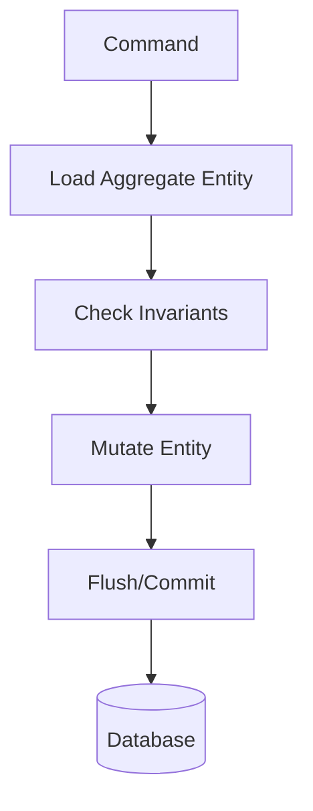
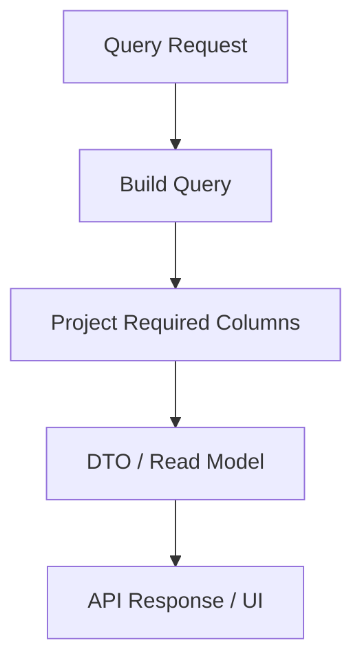
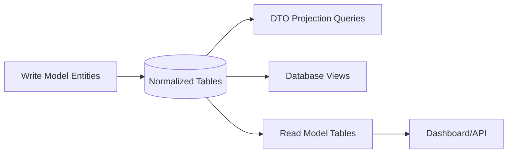

# Part 016 — Projections, DTOs, and Read Models

Salah satu kesalahan paling umum dalam aplikasi JPA adalah mengembalikan entity untuk semua use case.

Entity terlihat nyaman:

```java
List<CaseRecord> cases = caseRepository.findAll();
```

Tetapi entity bukan sekadar data bag. Entity yang managed membawa lifecycle, identity, lazy association, dirty checking, persistence context, cascade semantics, dan risiko accidental write.

Untuk read-heavy use case, terutama list screen, dashboard, export, search result, API response, dan reporting, entity sering bukan bentuk data yang tepat. Kita butuh projection, DTO, atau read model.

Part ini membahas:

- perbedaan entity result, scalar result, DTO projection, interface projection, dan read model;
- kapan projection lebih baik daripada entity;
- JPQL constructor expression;
- Criteria constructor projection;
- `Tuple` projection;
- Spring Data JPA interface/class/dynamic projection;
- native query projection;
- read/write separation;
- anti-pattern seperti entity-as-API, lazy loading serialization, dan DTO yang diam-diam menjadi domain model palsu.

## 1. Target Skill Berdasarkan Kaufman

Sub-skill yang ingin kita kuasai:

1. membedakan write model dan read model;
2. memilih result shape berdasarkan use case;
3. menghindari loading entity graph yang tidak diperlukan;
4. membuat DTO projection dengan JPQL dan Criteria;
5. memahami managed vs unmanaged result;
6. memakai Spring Data projection tanpa menganggapnya magic;
7. mendesain read model yang stabil untuk API;
8. menghindari leaking persistence entity ke boundary luar;
9. mengukur dampak projection terhadap query count, heap, dan latency.

Target akhirnya:

> Ketika mendesain endpoint atau screen, kita tidak otomatis mengambil entity. Kita menentukan data shape, mutability, lifecycle, consistency requirement, volume, dan performance budget terlebih dahulu.

## 2. Entity Bukan DTO

Entity JPA adalah object yang dipetakan ke database dan bisa managed oleh persistence context.

Ketika entity managed:

- perubahan field bisa dideteksi dirty checking;
- association lazy bisa memicu query tambahan;
- identity dijaga oleh persistence context;
- cascade bisa aktif saat flush;
- entity callback bisa berjalan;
- optimistic version bisa berubah;
- flush bisa mengirim SQL update.

DTO adalah data transfer object. DTO biasanya:

- tidak managed;
- tidak punya lazy association;
- tidak ikut dirty checking;
- tidak punya persistence identity;
- tidak otomatis disimpan;
- bisa immutable;
- bisa sesuai contract API/use case.

Perbandingan:

| Aspek | Entity | DTO / Projection |
|---|---|---|
| Managed by persistence context | Ya, jika query entity | Tidak |
| Dirty checking | Ya | Tidak |
| Lazy loading | Ya | Tidak, kecuali nested projection tertentu memicu join/loading |
| Cocok untuk write path | Ya | Tidak langsung |
| Cocok untuk list read path | Kadang, sering tidak |
| Cocok sebagai API response | Biasanya tidak | Ya |
| Field sesuai table/domain | Ya | Sesuai use case |
| Risiko accidental update | Ada | Rendah |
| Heap footprint | Bisa besar | Lebih kecil jika kolom terbatas |
| Contract stability | Terikat model persistence | Bisa distabilkan |

Rule:

> Entity adalah model persistence/domain write path. DTO/read model adalah contract query path.

## 3. Read Path vs Write Path

Write path membutuhkan invariant dan consistency:



Read path membutuhkan shape data yang efisien:



Jika query hanya menampilkan list:

```json
{
  "caseNumber": "CASE-2026-0001",
  "status": "ACTIVE",
  "priority": "HIGH",
  "assigneeName": "Ayu",
  "createdAt": "2026-06-30T08:00:00Z"
}
```

Tidak perlu load:

- semua column `case_record`;
- lazy collection `violations`;
- audit history;
- large text notes;
- internal risk score;
- version field;
- domain methods;
- cascade graph.

## 4. Taxonomy Result Shape

| Result Shape | Contoh | Cocok Untuk | Risiko |
|---|---|---|---|
| Entity | `CaseRecord` | Command/write, detail kecil | Lazy loading, over-fetch, accidental write |
| Scalar | `String`, `Long`, `UUID` | Count, existence, single field lookup | Context hilang jika terlalu banyak scalar |
| Object array | `Object[]` | Legacy/simple ad-hoc | Fragile, unreadable |
| Tuple | `Tuple` | Dynamic/mixed Criteria result | String alias/runtime access |
| DTO class | `new CaseSummary(...)` | Stable read result | Constructor order fragile |
| Java record DTO | `record CaseSummary(...)` | Immutable projection | Constructor signature harus match |
| Interface projection | `CaseSummaryView` | Spring Data simple projection | Proxy semantics, nested traps |
| Dynamic projection | `<T> List<T>` | Reuse repository method | Bisa membingungkan contract |
| Native projection | SQL result mapping | Vendor-specific/reporting | Portability turun |
| Materialized read model | Table/view khusus | Dashboard/report high-volume | Sync/refresh complexity |

## 5. Entity Result: Kapan Masih Tepat?

Entity result tepat ketika:

- use case akan memodifikasi aggregate;
- invariant domain harus dievaluasi pada object model;
- data volume kecil;
- transaction boundary jelas;
- fetch plan dipahami;
- entity tidak keluar sebagai API response mentah;
- lazy loading tidak terjadi di serialization layer.

Contoh write path:

```java
@Transactional
public void assignCase(UUID caseId, UUID officerId) {
    CaseRecord caseRecord = caseRepository.findById(caseId)
        .orElseThrow(() -> new CaseNotFoundException(caseId));

    Officer officer = officerRepository.getReferenceById(officerId);

    caseRecord.assignTo(officer);
}
```

Tidak ada explicit `save` yang wajib jika entity managed dan transaction commit melakukan flush. Ini cocok untuk entity.

Namun untuk list screen:

```java
@Transactional(readOnly = true)
public List<CaseRecord> listCases(UUID tenantId) {
    return caseRepository.findByTenantId(tenantId);
}
```

Ini bisa over-fetch. Jika controller mengembalikan entity langsung, serialization bisa memicu lazy loading atau recursive graph.

## 6. Scalar Projection

Scalar query:

```java
@Query("select c.caseNumber from CaseRecord c where c.id = :id")
Optional<String> findCaseNumberById(UUID id);
```

Cocok untuk:

- existence-like lookup;
- id lookup;
- count;
- status check;
- single field validation.

Contoh:

```java
@Query("select count(c) > 0 from CaseRecord c where c.tenantId = :tenantId and c.caseNumber = :caseNumber")
boolean existsCaseNumber(UUID tenantId, String caseNumber);
```

Catatan:

- return boolean dari count expression tergantung provider support dan dialect translation;
- Spring Data derived `existsBy...` sering lebih readable untuk case sederhana;
- untuk query high frequency, cek SQL generated.

## 7. Object Array: Hindari Jika Bisa

JPQL:

```java
@Query("""
    select c.id, c.caseNumber, c.status
    from CaseRecord c
    where c.tenantId = :tenantId
    """)
List<Object[]> findRawSummaries(UUID tenantId);
```

Usage:

```java
for (Object[] row : rows) {
    UUID id = (UUID) row[0];
    String caseNumber = (String) row[1];
    CaseStatus status = (CaseStatus) row[2];
}
```

Masalah:

- index-based access fragile;
- cast runtime;
- reorder select memecahkan mapping;
- readability buruk;
- test sering tidak menangkap semantic mismatch.

Gunakan hanya untuk ad-hoc internal atau legacy bridge. Untuk production query, prefer DTO/record/Tuple dengan alias.

## 8. Tuple Projection

Tuple memberi alias-based access.

Criteria:

```java
CriteriaBuilder cb = entityManager.getCriteriaBuilder();
CriteriaQuery<Tuple> query = cb.createTupleQuery();
Root<CaseRecord> root = query.from(CaseRecord.class);

query.multiselect(
    root.get("id").alias("id"),
    root.get("caseNumber").alias("caseNumber"),
    root.get("status").alias("status")
);

List<Tuple> rows = entityManager.createQuery(query).getResultList();
```

Usage:

```java
for (Tuple row : rows) {
    UUID id = row.get("id", UUID.class);
    String caseNumber = row.get("caseNumber", String.class);
    CaseStatus status = row.get("status", CaseStatus.class);
}
```

Lebih baik dari `Object[]`, tetapi tetap runtime alias. Cocok ketika shape benar-benar dynamic atau untuk internal query builder. Untuk public application return type, DTO lebih jelas.

## 9. JPQL Constructor Projection

DTO:

```java
package com.example.caseapp.query;

public record CaseSummary(
    UUID id,
    String caseNumber,
    CaseStatus status,
    CasePriority priority,
    Instant createdAt
) {}
```

JPQL:

```java
@Query("""
    select new com.example.caseapp.query.CaseSummary(
        c.id,
        c.caseNumber,
        c.status,
        c.priority,
        c.createdAt
    )
    from CaseRecord c
    where c.tenantId = :tenantId
    order by c.createdAt desc, c.id desc
    """)
List<CaseSummary> findSummaries(UUID tenantId);
```

Keuntungan:

- result tidak managed;
- hanya select column yang dibutuhkan;
- clear contract;
- immutable jika memakai record;
- tidak ada lazy loading dari DTO itu sendiri.

Risiko:

- JPQL butuh fully qualified class name;
- constructor order harus cocok;
- refactor package/class bisa memecahkan query;
- nested DTO bisa verbose;
- provider error biasanya runtime saat query diparse.

Mitigasi:

- integration test repository/query;
- DTO record kecil dan jelas;
- query dekat dengan use case;
- jangan membuat DTO constructor terlalu panjang.

## 10. Criteria Constructor Projection

Criteria equivalent:

```java
CriteriaBuilder cb = entityManager.getCriteriaBuilder();
CriteriaQuery<CaseSummary> query = cb.createQuery(CaseSummary.class);
Root<CaseRecord> root = query.from(CaseRecord.class);

query.select(cb.construct(
        CaseSummary.class,
        root.get("id"),
        root.get("caseNumber"),
        root.get("status"),
        root.get("priority"),
        root.get("createdAt")
    ))
    .where(cb.equal(root.get("tenantId"), tenantId))
    .orderBy(cb.desc(root.get("createdAt")), cb.desc(root.get("id")));

List<CaseSummary> result = entityManager.createQuery(query).getResultList();
```

Cocok untuk:

- projection dengan filter dinamis;
- query object custom;
- sorting/predicate yang dibangun programmatically.

Tetap hati-hati terhadap constructor order.

## 11. Projection dengan Join

DTO butuh assignee name:

```java
public record CaseSummary(
    UUID id,
    String caseNumber,
    CaseStatus status,
    String assigneeName,
    Instant createdAt
) {}
```

JPQL:

```java
@Query("""
    select new com.example.caseapp.query.CaseSummary(
        c.id,
        c.caseNumber,
        c.status,
        a.name,
        c.createdAt
    )
    from CaseRecord c
    left join c.assignee a
    where c.tenantId = :tenantId
    order by c.createdAt desc, c.id desc
    """)
List<CaseSummary> findSummaries(UUID tenantId);
```

Ini tidak sama dengan fetch join.

Projection join:

```java
left join c.assignee a
```

Fetch join:

```java
left join fetch c.assignee
```

Projection join mengambil field yang dibutuhkan. Fetch join menginisialisasi association pada entity result. Untuk DTO, fetch join biasanya tidak tepat.

## 12. Spring Data Interface Projection

Interface projection:

```java
public interface CaseSummaryView {
    UUID getId();
    String getCaseNumber();
    CaseStatus getStatus();
    Instant getCreatedAt();
}
```

Repository:

```java
public interface CaseRecordRepository extends JpaRepository<CaseRecord, UUID> {
    List<CaseSummaryView> findByTenantIdOrderByCreatedAtDesc(UUID tenantId);
}
```

Spring Data membuat projection berdasarkan accessor.

Keuntungan:

- simple;
- tidak perlu constructor expression untuk derived query;
- cocok untuk read-only simple projection;
- mengurangi boilerplate.

Risiko:

- proxy-based semantics;
- nested projection bisa memicu join/loading yang tidak disadari;
- open projection dengan expression bisa lebih mahal;
- tidak selalu cocok untuk query kompleks;
- interface projection menyamarkan SQL shape.

Rule:

> Interface projection bagus untuk query sederhana. Untuk query kompleks atau API contract penting, record/class DTO lebih eksplisit.

## 13. Closed vs Open Projection

Closed projection hanya accessor field:

```java
public interface CaseSummaryView {
    String getCaseNumber();
    CaseStatus getStatus();
}
```

Open projection memakai expression:

```java
public interface CaseDisplayView {
    String getCaseNumber();
    CaseStatus getStatus();

    @Value("#{target.caseNumber + ' - ' + target.status}")
    String getDisplayName();
}
```

Open projection terlihat nyaman, tetapi hati-hati:

- bisa membutuhkan target entity lebih lengkap;
- expression dievaluasi di application layer;
- performance/SQL select bisa tidak seoptimal closed projection;
- logic formatting pindah ke projection proxy.

Lebih baik hitung display field di DTO mapper atau query jika benar-benar database-side.

## 14. Class-Based Projection di Spring Data

DTO class/record:

```java
public record CaseSummary(
    UUID id,
    String caseNumber,
    CaseStatus status
) {}
```

Repository derived query dapat memakai return DTO pada beberapa pattern, tetapi untuk kontrol penuh gunakan JPQL constructor:

```java
@Query("""
    select new com.example.caseapp.query.CaseSummary(
        c.id,
        c.caseNumber,
        c.status
    )
    from CaseRecord c
    where c.tenantId = :tenantId
    """)
List<CaseSummary> findCaseSummaries(UUID tenantId);
```

Untuk native query/class mapping, support tergantung mekanisme Spring Data/JPA mapping yang dipakai. Jangan asumsikan semua DTO bisa otomatis dimap dari native query tanpa konfigurasi.

## 15. Dynamic Projection

Spring Data dapat mendukung dynamic projection pattern:

```java
<T> List<T> findByTenantId(UUID tenantId, Class<T> type);
```

Usage:

```java
List<CaseSummaryView> summaries = repository.findByTenantId(tenantId, CaseSummaryView.class);
List<CaseRecord> entities = repository.findByTenantId(tenantId, CaseRecord.class);
```

Kapan berguna:

- query predicate sama;
- result shape berbeda;
- repository kecil;
- team paham semantics-nya.

Risiko:

- method terlalu magical;
- caller bisa mengambil entity padahal read path harus DTO;
- security/fetch behavior sulit dikontrol;
- query performance berbeda tapi method sama.

Untuk sistem enterprise, dynamic projection harus dipakai hemat. Jangan jadikan generic escape hatch.

## 16. Native Query Projection

Native SQL berguna ketika:

- butuh database-specific function;
- window function kompleks;
- CTE;
- JSON/array operator;
- materialized view;
- reporting query;
- performance query yang harus eksplisit.

Contoh interface projection:

```java
public interface CaseBacklogRow {
    UUID getOfficerId();
    String getOfficerName();
    long getOpenCaseCount();
}
```

Repository:

```java
@Query(value = """
    select
        o.id as officerId,
        o.name as officerName,
        count(c.id) as openCaseCount
    from officer o
    left join case_record c on c.assignee_id = o.id
       and c.status = 'ACTIVE'
       and c.tenant_id = :tenantId
    where o.tenant_id = :tenantId
    group by o.id, o.name
    order by openCaseCount desc
    """, nativeQuery = true)
List<CaseBacklogRow> findBacklogByOfficer(UUID tenantId);
```

Kelebihan:

- SQL jelas;
- bisa pakai fitur database;
- mudah compare dengan explain plan;
- cocok untuk report.

Risiko:

- portability turun;
- mapping alias harus tepat;
- refactor entity field tidak otomatis refactor SQL;
- database dialect binding lebih kuat;
- test dengan database target wajib.

## 17. Read Model sebagai Object Khusus Query

DTO projection masih query langsung dari write tables. Untuk kebutuhan lebih berat, gunakan read model.

Read model bisa berupa:

- database view;
- materialized view;
- denormalized table;
- projection table yang di-update event/outbox;
- search index;
- reporting schema;
- cache table.

Contoh table read model:

```sql
create table case_dashboard_read_model (
    tenant_id uuid not null,
    case_id uuid not null,
    case_number varchar(64) not null,
    status varchar(32) not null,
    priority varchar(32) not null,
    assignee_name varchar(255),
    violation_count integer not null,
    last_activity_at timestamp not null,
    primary key (tenant_id, case_id)
);
```

Java DTO/entity read-only:

```java
@Entity
@Table(name = "case_dashboard_read_model")
@Immutable // Hibernate-specific
public class CaseDashboardReadModel {
    @EmbeddedId
    private CaseDashboardReadModelId id;

    private String caseNumber;
    private String status;
    private String priority;
    private String assigneeName;
    private int violationCount;
    private Instant lastActivityAt;
}
```

Atau tanpa entity, query native langsung ke DTO/interface.

Kapan read model layak?

- dashboard high-traffic;
- query join/agregasi terlalu mahal;
- API membutuhkan shape stabil yang jauh dari write model;
- search ranking/full-text;
- historical reporting;
- cross-aggregate view;
- consistency eventual acceptable.

## 18. CQRS Ringan, Bukan Dogma

CQRS tidak harus berarti microservices/event sourcing.

Level ringan:



Prinsipnya:

- write model optimized for invariants;
- read model optimized for query shape;
- tidak semua query butuh read model fisik;
- jangan menduplikasi data tanpa alasan;
- consistency requirement harus jelas.

Gunakan incremental approach:

1. entity query untuk simple detail;
2. DTO projection untuk list;
3. native query/view untuk reporting;
4. denormalized read table untuk high-volume/complex view;
5. search index untuk search use case.

## 19. API Response Jangan Entity

Bad:

```java
@GetMapping("/cases")
public List<CaseRecord> listCases() {
    return caseRepository.findAll();
}
```

Masalah:

- lazy loading saat serialization;
- recursive association;
- sensitive field bocor;
- persistence model menjadi API contract;
- perubahan mapping memecahkan client;
- accidental N+1;
- bidirectional relationship bisa infinite recursion;
- entity internal invariant exposed.

Good:

```java
@GetMapping("/cases")
public Page<CaseSummaryResponse> listCases(CaseSearchRequest request) {
    Page<CaseSummary> page = caseSearchService.search(request);
    return page.map(CaseSummaryResponse::from);
}
```

Response:

```java
public record CaseSummaryResponse(
    String id,
    String caseNumber,
    String status,
    String priority,
    String assigneeName,
    Instant createdAt
) {
    public static CaseSummaryResponse from(CaseSummary summary) {
        return new CaseSummaryResponse(
            summary.id().toString(),
            summary.caseNumber(),
            summary.status().name(),
            summary.priority().name(),
            summary.assigneeName(),
            summary.createdAt()
        );
    }
}
```

DTO internal query dan response DTO bisa berbeda. Jangan takut punya dua bentuk jika boundary berbeda.

## 20. Projection dan Lazy Loading

DTO projection tidak punya lazy loading sendiri. Namun cara query dibuat tetap penting.

Example:

```java
select new CaseSummary(c.id, c.caseNumber, c.assignee.name)
from CaseRecord c
```

Path `c.assignee.name` membuat provider perlu join atau access association sesuai translation. Ini bukan lazy load per row seperti entity getter, tetapi SQL query tetap punya join.

Entity result:

```java
List<CaseRecord> cases = repository.findByTenantId(tenantId);
for (CaseRecord c : cases) {
    System.out.println(c.getAssignee().getName());
}
```

Ini bisa N+1 jika `assignee` lazy dan belum fetched.

Projection result:

```java
select new CaseSummary(c.id, c.caseNumber, a.name)
from CaseRecord c
left join c.assignee a
```

Ini satu query dengan join.

## 21. Projection dan Persistence Context

DTO result tidak masuk persistence context.

```java
CaseSummary summary = query.getSingleResult();
// modifying summary does not update DB
```

Entity result masuk persistence context jika query entity dan transaction/persistence context aktif.

```java
CaseRecord c = repository.findById(id).orElseThrow();
c.changePriority(HIGH); // may flush update
```

Ini bedanya sangat penting:

- DTO aman untuk read-only display;
- entity diperlukan untuk domain mutation;
- jangan ubah DTO lalu berharap otomatis tersimpan;
- jangan map DTO ke detached entity lalu `merge` sembarangan.

## 22. Anti-Pattern: DTO to Entity Merge

Bad:

```java
@Transactional
public void updateCase(CaseUpdateDto dto) {
    CaseRecord detached = mapper.toEntity(dto);
    entityManager.merge(detached);
}
```

Masalah:

- field yang tidak ada di DTO bisa overwrite jadi null/default;
- invariant domain bypass;
- association bisa berubah tanpa rule;
- optimistic locking bisa salah dipahami;
- merge semantics kompleks;
- security field bisa dimanipulasi.

Good:

```java
@Transactional
public void updateCase(UUID caseId, CaseUpdateCommand command) {
    CaseRecord caseRecord = caseRepository.findById(caseId)
        .orElseThrow(() -> new CaseNotFoundException(caseId));

    caseRecord.changePriority(command.priority());
    caseRecord.updateDescription(command.description());
}
```

DTO/command menjadi input, entity tetap dimuat untuk menjalankan invariant.

## 23. Anti-Pattern: One DTO for Everything

Bad:

```java
public class CaseDto {
    UUID id;
    String caseNumber;
    String status;
    String priority;
    String description;
    List<ViolationDto> violations;
    List<AttachmentDto> attachments;
    List<CommentDto> comments;
    OfficerDto assignee;
    AuditDto audit;
}
```

Dipakai untuk:

- list;
- detail;
- create;
- update;
- export;
- dashboard;
- admin.

Masalah:

- over-fetch;
- field nullable tidak jelas;
- validation context kacau;
- API contract gemuk;
- security filtering sulit;
- change impact besar.

Good:

```java
CaseSummary
CaseDetail
CaseCreateCommand
CaseUpdateCommand
CaseExportRow
CaseDashboardRow
CaseAssignmentView
```

Banyak DTO kecil lebih maintainable daripada satu DTO raksasa.

## 24. Projection Naming

Nama DTO harus menyatakan use case.

Kurang baik:

```java
CaseDto
CaseData
CaseInfo
CaseView
```

Lebih baik:

```java
CaseSummary
CaseDetail
CaseBacklogRow
CaseDashboardCard
CaseExportRow
CaseAssignmentOption
CaseAuditTimelineItem
```

Naming yang jelas membantu developer memilih query yang tepat.

## 25. Pagination Projection

Projection list biasanya dipakai dengan pagination.

Spring Data:

```java
@Query("""
    select new com.example.caseapp.query.CaseSummary(
        c.id, c.caseNumber, c.status, c.createdAt
    )
    from CaseRecord c
    where c.tenantId = :tenantId
    order by c.createdAt desc, c.id desc
    """)
Page<CaseSummary> findSummaries(UUID tenantId, Pageable pageable);
```

Jika query join kompleks, count query default bisa mahal atau salah. Berikan explicit count query:

```java
@Query(
    value = """
        select new com.example.caseapp.query.CaseSummary(
            c.id, c.caseNumber, c.status, c.createdAt
        )
        from CaseRecord c
        where c.tenantId = :tenantId
        order by c.createdAt desc, c.id desc
        """,
    countQuery = """
        select count(c)
        from CaseRecord c
        where c.tenantId = :tenantId
        """
)
Page<CaseSummary> findSummaries(UUID tenantId, Pageable pageable);
```

Untuk high-volume infinite scroll, pertimbangkan `Slice` atau keyset pagination daripada `Page` dengan total count.

## 26. Keyset Projection

Offset pagination:

```sql
order by created_at desc, id desc
limit 50 offset 100000
```

Bisa mahal untuk page jauh.

Keyset pagination memakai cursor:

```java
@Query("""
    select new com.example.caseapp.query.CaseSummary(
        c.id, c.caseNumber, c.status, c.createdAt
    )
    from CaseRecord c
    where c.tenantId = :tenantId
      and (
          c.createdAt < :lastCreatedAt
          or (c.createdAt = :lastCreatedAt and c.id < :lastId)
      )
    order by c.createdAt desc, c.id desc
    """)
List<CaseSummary> findNextPage(
    UUID tenantId,
    Instant lastCreatedAt,
    UUID lastId,
    Pageable limitOnly
);
```

Projection cocok untuk keyset karena result shape kecil dan stable sort key jelas.

## 27. Aggregation Projection

Dashboard count:

```java
public record CaseStatusCount(
    CaseStatus status,
    long count
) {}
```

JPQL:

```java
@Query("""
    select new com.example.caseapp.query.CaseStatusCount(
        c.status,
        count(c)
    )
    from CaseRecord c
    where c.tenantId = :tenantId
    group by c.status
    """)
List<CaseStatusCount> countByStatus(UUID tenantId);
```

Aggregation projection bagus untuk small grouped result. Untuk dashboard kompleks dengan banyak aggregations, jangan paksa satu endpoint menjalankan 20 query berat tanpa budget.

Alternatif:

- precomputed read model;
- materialized view;
- caching dengan invalidation jelas;
- async dashboard refresh;
- separate analytics store.

## 28. Projection untuk Export

Export berbeda dari list screen.

List screen:

- page kecil;
- response cepat;
- column sedikit;
- user interactive.

Export:

- volume besar;
- streaming/chunking;
- timeout risk;
- memory risk;
- consistency snapshot penting;
- audit/access logging penting.

Jangan reuse endpoint list projection untuk export tanpa analisis.

Export row:

```java
public record CaseExportRow(
    String caseNumber,
    String status,
    String priority,
    String assigneeName,
    String applicantName,
    Instant createdAt,
    Instant closedAt
) {}
```

Query harus chunked:

```java
List<CaseExportRow> rows = query.fetchExportRows(filter, cursor, batchSize);
```

Rule:

- jangan load semua ke memory;
- gunakan keyset/chunk;
- batasi filter;
- log siapa export apa;
- consider async job untuk export besar.

## 29. Projection dan Security

DTO tidak otomatis aman. Query harus memilih field yang boleh keluar.

Bad:

```java
public record CaseDetail(
    UUID id,
    String caseNumber,
    String internalRiskScore,
    String investigatorNote,
    String applicantPersonalData
) {}
```

Jika endpoint publik memakai DTO ini, data bocor.

Pattern:

```java
PublicCaseSummary
OfficerCaseSummary
SupervisorCaseDetail
AuditCaseDetail
```

Atau field-level policy di mapping layer:

```java
CaseDetailResponse response = policy.canViewInvestigatorNote(user, caseId)
    ? CaseDetailResponse.withNotes(detail)
    : CaseDetailResponse.withoutNotes(detail);
```

Namun lebih aman jika query sejak awal tidak mengambil field yang tidak boleh dilihat.

## 30. Projection dan Versioning API

Entity berubah mengikuti persistence/domain. API harus lebih stabil.

Jika entity langsung dijadikan response, perubahan internal bisa menjadi breaking change.

DTO memberi boundary:

```java
public record CaseSummaryV1(
    String id,
    String caseNumber,
    String status
) {}

public record CaseSummaryV2(
    String id,
    String caseNumber,
    String status,
    String priority
) {}
```

Internal query DTO bisa berbeda dari public API DTO:

```java
CaseSummaryQueryRow -> CaseSummaryResponseV1
CaseSummaryQueryRow -> CaseSummaryResponseV2
```

Ini extra mapping, tapi menjaga contract.

## 31. Projection dan Domain Invariant

Projection tidak boleh menjadi tempat menegakkan invariant write path.

Bad:

```java
public record CaseDetail(
    UUID id,
    String status,
    String assigneeId
) {
    public boolean canClose() {
        return assigneeId != null && status.equals("ACTIVE");
    }
}
```

Ini mungkin okay sebagai UI hint, tetapi bukan domain rule authoritative.

Write path harus load entity/aggregate:

```java
caseRecord.close(currentUser, clock);
```

Read model boleh membantu UI, tetapi command tetap divalidasi di domain/application service.

## 32. Projection dengan MapStruct/Mapper

Kadang query entity lalu map ke DTO:

```java
List<CaseSummary> summaries = cases.stream()
    .map(caseMapper::toSummary)
    .toList();
```

Ini okay jika:

- data volume kecil;
- association sudah fetched dengan benar;
- mapper tidak memicu lazy loading tidak terkontrol;
- entity memang dibutuhkan untuk logic.

Namun untuk list besar, lebih baik query langsung DTO projection.

Mapper bukan pengganti query design.

Bad:

```java
@Mapper
public interface CaseMapper {
    @Mapping(target = "assigneeName", source = "assignee.name")
    CaseSummary toSummary(CaseRecord caseRecord);
}
```

Jika `assignee` lazy dan list berisi 100 case, mapper bisa memicu N+1.

## 33. Projection dan Memory Footprint

Entity load membawa overhead:

- entity instance;
- persistence context entry;
- snapshot untuk dirty checking;
- collection wrapper;
- proxy;
- associated entity jika fetched;
- second-level cache interaction jika aktif.

DTO projection membawa:

- DTO instance;
- selected scalar values.

Untuk 100 rows, bedanya mungkin kecil. Untuk 100k rows/export/report, bedanya besar.

Rule:

> Semakin besar result volume, semakin kuat alasan memakai projection/chunking/read model.

## 34. Projection dan `@EntityGraph`

`@EntityGraph` berguna untuk entity fetch plan:

```java
@EntityGraph(attributePaths = {"assignee"})
List<CaseRecord> findByTenantId(UUID tenantId);
```

Ini bukan projection. Ini tetap load entity, hanya fetch plan diubah.

Gunakan `@EntityGraph` ketika:

- entity tetap dibutuhkan;
- association tertentu harus diinisialisasi;
- ingin menghindari N+1 pada entity use case;
- result volume terkendali.

Jangan pakai `@EntityGraph` untuk list screen besar jika DTO projection cukup.

## 35. Native View as Read Model

Database view:

```sql
create view case_summary_view as
select
    c.tenant_id,
    c.id as case_id,
    c.case_number,
    c.status,
    c.priority,
    o.name as assignee_name,
    c.created_at
from case_record c
left join officer o on o.id = c.assignee_id;
```

Read-only entity:

```java
@Entity
@Table(name = "case_summary_view")
@Immutable
public class CaseSummaryViewEntity {
    @Id
    private UUID caseId;
    private UUID tenantId;
    private String caseNumber;
    private String status;
    private String priority;
    private String assigneeName;
    private Instant createdAt;
}
```

Trade-off:

| Benefit | Cost |
|---|---|
| Query simpler | View migration harus dikelola |
| Reusable across services/report | Database coupling meningkat |
| Bisa optimasi DB-level | Provider portability turun |
| Bisa expose read-only model | Refresh/materialization issue jika materialized |

## 36. Common Pitfalls

### 36.1 Entity-as-API

Symptom:

```java
return repository.findAll();
```

Failure:

- sensitive data leak;
- recursive JSON;
- lazy loading exception;
- API breaking karena mapping berubah.

Fix:

- response DTO;
- query projection;
- explicit mapping boundary.

### 36.2 Projection Terlalu Gemuk

Symptom:

```java
CaseEverythingDto
```

Failure:

- over-fetch;
- nullable chaos;
- weak contract;
- low cohesion.

Fix:

- use-case specific DTO.

### 36.3 Constructor Projection Fragile

Symptom:

```java
new CaseSummary(c.id, c.status, c.caseNumber)
```

But constructor:

```java
CaseSummary(UUID id, String caseNumber, CaseStatus status)
```

Failure runtime.

Fix:

- integration test;
- small record DTO;
- keep query close to DTO;
- consider interface projection for simple cases.

### 36.4 Mapper-Induced N+1

Symptom:

```java
cases.stream().map(mapper::toDto)
```

Mapper accesses lazy association.

Fix:

- DTO projection with join;
- fetch graph if entity needed;
- assert query count in tests.

### 36.5 Native Projection Alias Mismatch

Symptom:

```sql
select c.case_number from case_record c
```

Interface:

```java
String getCaseNumber();
```

Alias missing.

Fix:

```sql
select c.case_number as caseNumber
```

Test mapping.

### 36.6 Treating Read Model as Source of Truth

Read model may be eventually consistent. Do not execute critical command based only on stale read model.

Fix:

- command loads authoritative aggregate/write table;
- version/check invariant at write time;
- expose freshness if needed.

## 37. Production Design Checklist

For every read endpoint, answer:

1. Does this use case need entity or DTO?
2. Will result be modified in this transaction?
3. Which exact fields are needed?
4. Which associations are needed?
5. Is this list, detail, dashboard, export, or lookup?
6. What is max result size?
7. Is pagination offset, keyset, or streaming?
8. Is total count required?
9. Are fields authorized per role?
10. Is query portable JPQL or database-specific SQL?
11. Are there indexes supporting filter/sort?
12. Could mapper trigger lazy loading?
13. Is generated SQL inspected?
14. Does integration test validate projection mapping?
15. Does API response have stable versioning?

## 38. Mini Case Study: Case Backlog Dashboard

Requirement:

- show officers with active case count;
- tenant isolated;
- sort by active count desc;
- include officer name and unit;
- update within a few seconds acceptable;
- dashboard loaded often.

Option A — live aggregation query:

```java
public record OfficerBacklogRow(
    UUID officerId,
    String officerName,
    String unitName,
    long activeCaseCount
) {}
```

JPQL/native aggregation can work if data moderate and indexed.

Option B — read model table:

```sql
create table officer_backlog_read_model (
    tenant_id uuid not null,
    officer_id uuid not null,
    officer_name varchar(255) not null,
    unit_name varchar(255) not null,
    active_case_count bigint not null,
    last_refreshed_at timestamp not null,
    primary key (tenant_id, officer_id)
);
```

Trade-off:

| Criterion | Live Projection | Read Model |
|---|---|---|
| Freshness | Stronger | Possibly eventual |
| Complexity | Lower | Higher |
| Query latency | Could degrade | Predictable |
| Write overhead | None | Additional update/refresh |
| Dashboard scale | Limited | Better |

Decision:

- start with projection query;
- measure;
- add read model when latency/load exceeds budget or query becomes too complex.

## 39. Deliberate Practice

Latihan 1 — Entity vs DTO:

Ambil endpoint list cases. Buat dua versi:

1. return entity;
2. return DTO projection.

Bandingkan:

- SQL selected columns;
- query count;
- heap usage kasar;
- JSON output;
- risk of lazy loading.

Latihan 2 — Constructor projection:

Buat `CaseSummary` record dan JPQL constructor query. Tambahkan integration test yang gagal jika constructor order salah.

Latihan 3 — Interface projection:

Buat `CaseSummaryView` interface dan derived query Spring Data. Bandingkan SQL dengan constructor projection.

Latihan 4 — Aggregation projection:

Buat `CaseStatusCount` dan query `group by status`. Pastikan tenant predicate selalu ada.

Latihan 5 — Export projection:

Buat query chunked untuk `CaseExportRow` dengan keyset pagination. Jangan load semua row sekaligus.

Latihan 6 — Mapper N+1 detection:

Buat mapper yang access `assignee.name`. Jalankan pada list entity lazy dan hitung query. Refactor ke DTO projection.

## 40. Summary

Projection adalah cara mengontrol bentuk data read path.

Prinsip utama:

1. entity bukan DTO;
2. entity cocok untuk write path dan domain invariant;
3. DTO/read model cocok untuk read path;
4. constructor projection memberi result eksplisit dan unmanaged;
5. interface projection nyaman untuk query sederhana;
6. native projection berguna untuk query database-specific;
7. read model fisik berguna untuk dashboard/report berat;
8. API response jangan expose entity;
9. mapper bisa memicu N+1 jika mengambil lazy association;
10. query shape harus dipilih berdasarkan use case, bukan kebiasaan repository.

Part berikutnya membahas fetching strategies: lazy, eager, join fetch, entity graph, batch fetch, subselect fetch, dan bagaimana mendesain fetch plan yang eksplisit tanpa menghancurkan performa.
