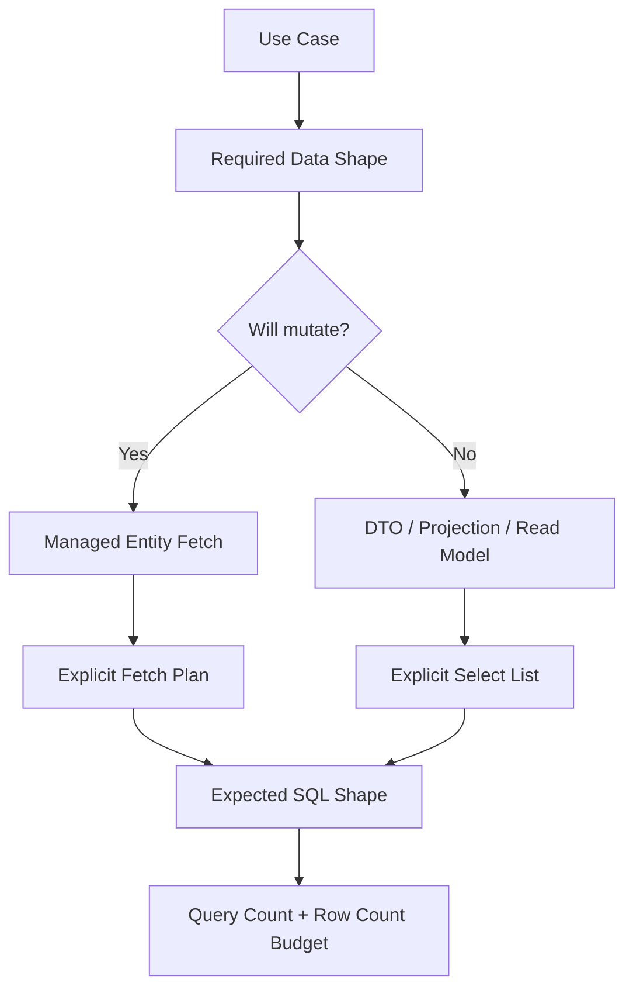
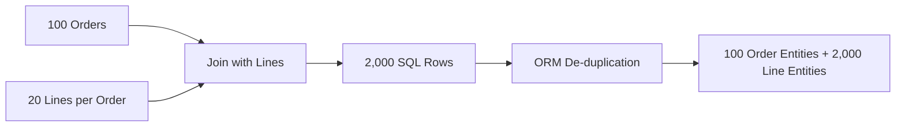

# Part 017 — Fetching Strategies: Lazy, Eager, Join Fetch, Entity Graph

Fetching adalah salah satu area JPA yang terlihat sederhana, tetapi sangat menentukan kualitas sistem production.

Kita sering melihat mapping seperti ini:

```java
@Entity
public class CaseRecord {
    @OneToMany(mappedBy = "caseRecord")
    private List<CaseNote> notes = new ArrayList<>();

    @ManyToOne
    private Officer assignedOfficer;
}
```

Lalu muncul pertanyaan:

- apakah `notes` langsung di-load?
- apakah `assignedOfficer` langsung di-load?
- kapan query tambahan terjadi?
- apakah serialization ke JSON akan memicu lazy loading?
- apakah screen list akan menghasilkan 1 query atau 501 query?
- apakah `join fetch` aman untuk pagination?
- apakah `@EntityGraph` mengganti kebutuhan DTO?

Fetching bukan sekadar `LAZY` vs `EAGER`.

Fetching adalah desain eksplisit tentang:

1. data apa yang diperlukan;
2. kapan data itu diambil;
3. dalam bentuk apa data itu dipakai;
4. apakah data itu akan dimodifikasi;
5. berapa volume datanya;
6. berapa query budget-nya;
7. apakah object graph boleh keluar dari transaction boundary.

Target part ini: kita mampu mendesain fetch plan secara sadar, bukan membiarkan annotation default menentukan performa sistem.

## 1. Target Skill Berdasarkan Kaufman

Sub-skill yang ingin kita kuasai:

1. membedakan mapping fetch plan dan query fetch plan;
2. memahami default fetch type JPA dan risikonya;
3. memakai lazy loading tanpa menciptakan `LazyInitializationException` atau N+1;
4. memakai eager loading tanpa membuat graph explosion;
5. memakai `join fetch` dengan tepat;
6. memakai entity graph sebagai fetch-plan override;
7. memahami batch fetching dan subselect fetching di Hibernate;
8. memilih antara entity fetch, DTO projection, dan read model;
9. membuat query count budget untuk setiap use case;
10. membaca SQL yang dihasilkan dari fetch strategy.

Kemampuan akhir:

> Sebelum menulis repository method, kita bisa menjelaskan fetch plan-nya: root entity, association yang diperlukan, cardinality setiap association, SQL shape yang diharapkan, query count maksimum, dan alasan kenapa entity/DTO/projection dipilih.

## 2. Mental Model: Fetch Plan Adalah Shape Contract

Fetch plan adalah kontrak tentang bentuk data yang akan masuk ke memory.

Bukan hanya:

```java
List<Order> orders = orderRepository.findAll();
```

Tetapi:

```text
For the order list screen:
- load 50 orders
- include customer name
- include total amount
- do not load order lines
- do not load payments
- do not expose managed entities to API layer
- maximum query count: 1
```

Itu adalah fetch plan yang sehat.

Sebaliknya, ini bukan fetch plan:

```text
Load Order entity and hope the ORM does the right thing.
```

JPA tidak tahu use case bisnis kita. JPA hanya menjalankan mapping, query, persistence context, dan provider behavior.

Diagram sederhananya:



Fetch plan yang baik dimulai dari use case, bukan dari entity mapping.

## 3. Dua Level Fetch Plan

Dalam JPA, fetch behavior muncul dari dua tempat:

1. **mapping-level fetch plan**;
2. **query-level fetch plan**.

### 3.1 Mapping-Level Fetch Plan

Mapping-level fetch plan ditulis di annotation entity:

```java
@ManyToOne(fetch = FetchType.LAZY)
private Customer customer;

@OneToMany(mappedBy = "order", fetch = FetchType.LAZY)
private List<OrderLine> lines = new ArrayList<>();
```

Ini adalah default behavior ketika association diakses tanpa override query.

Problemnya: mapping-level fetch plan bersifat global. Padahal kebutuhan fetch berbeda-beda.

Contoh:

- order detail screen butuh `Order`, `Customer`, `OrderLine`, `Product`;
- order list screen hanya butuh `Order.id`, `Order.status`, `Customer.name`, `totalAmount`;
- background reconciliation butuh `Order`, `Payment`, dan version;
- export job butuh streaming DTO, bukan entity graph.

Kalau kita memaksa satu mapping fetch untuk semua use case, salah satu akan rusak:

- terlalu sedikit data: lazy loading/N+1;
- terlalu banyak data: graph explosion;
- terlalu luas lifecycle: accidental dirty checking;
- terlalu berat heap: memory pressure.

### 3.2 Query-Level Fetch Plan

Query-level fetch plan ditentukan saat query dieksekusi:

```java
@Query("""
    select o
    from Order o
    join fetch o.customer
    where o.status = :status
""")
List<Order> findOpenOrdersWithCustomer(OrderStatus status);
```

Atau dengan entity graph:

```java
@EntityGraph(attributePaths = {"customer", "lines"})
Optional<Order> findById(Long id);
```

Query-level fetch plan lebih dekat dengan use case, karena method repository bisa merepresentasikan kebutuhan data spesifik.

Rule praktis:

> Mapping-level fetch should be conservative. Use case-specific fetching should live at query boundary.

## 4. Default Fetch Type JPA: Jangan Terjebak Default

Default fetch type JPA:

| Association | Default Fetch Type |
|---|---|
| `@ManyToOne` | `EAGER` |
| `@OneToOne` | `EAGER` |
| `@OneToMany` | `LAZY` |
| `@ManyToMany` | `LAZY` |
| `@ElementCollection` | `LAZY` |

Default ini sering mengejutkan engineer.

Banyak orang mengira semua association default-nya lazy. Tidak.

`@ManyToOne` dan `@OneToOne` default-nya eager. Ini berarti mapping berikut:

```java
@ManyToOne
private Customer customer;
```

sama seperti:

```java
@ManyToOne(fetch = FetchType.EAGER)
private Customer customer;
```

Untuk sistem enterprise, biasanya lebih aman menulis fetch type secara eksplisit:

```java
@ManyToOne(fetch = FetchType.LAZY, optional = false)
@JoinColumn(name = "customer_id", nullable = false)
private Customer customer;
```

Mengapa?

Karena eager to-one bisa membuat query diam-diam melebar.

Misalnya:

```java
List<Order> orders = orderRepository.findByStatus(OrderStatus.OPEN);
```

Dengan `customer`, `createdBy`, `approvedBy`, `branch`, dan `tenant` semua eager, query root yang terlihat sederhana dapat memicu join tambahan atau secondary select tambahan.

Yang lebih buruk: eager bersifat sulit dihindari. Kalau association eager di mapping, query tertentu tidak mudah mengatakan: “untuk use case ini, jangan ambil association itu.”

Rule praktis:

> Default JPA is not necessarily production default. Treat every fetch type as an explicit design decision.

## 5. LAZY: Bagus, Tapi Bukan Solusi Otomatis

`LAZY` berarti association tidak langsung diambil saat root entity di-load. Provider akan mengambilnya saat association diakses.

Contoh:

```java
@Transactional(readOnly = true)
public OrderDetail getOrderDetail(Long orderId) {
    Order order = orderRepository.findById(orderId)
        .orElseThrow();

    return new OrderDetail(
        order.getId(),
        order.getCustomer().getName(),
        order.getLines().stream()
            .map(line -> new OrderLineDetail(line.getSku(), line.getQuantity()))
            .toList()
    );
}
```

Jika `customer` dan `lines` lazy, maka kemungkinan query:

```sql
select * from orders where id = ?;
select * from customers where id = ?;
select * from order_lines where order_id = ?;
```

Untuk satu order detail, ini mungkin masih wajar.

Tetapi untuk list:

```java
@Transactional(readOnly = true)
public List<OrderSummary> listOpenOrders() {
    return orderRepository.findByStatus(OrderStatus.OPEN)
        .stream()
        .map(order -> new OrderSummary(
            order.getId(),
            order.getCustomer().getName()
        ))
        .toList();
}
```

Jika ada 100 orders, ini bisa menjadi:

```text
1 query for orders
100 queries for customers
```

Itulah N+1.

Jadi `LAZY` menyelesaikan masalah over-fetching, tetapi bisa menciptakan under-fetching.

Rule praktis:

> LAZY is a safe mapping default, not a complete fetch strategy.

## 6. EAGER: Mudah, Tapi Mahal Secara Arsitektural

`EAGER` berarti provider harus memuat association sebagai bagian dari fetch.

Contoh:

```java
@ManyToOne(fetch = FetchType.EAGER)
private Customer customer;
```

Sekilas nyaman:

```java
order.getCustomer().getName(); // no LazyInitializationException
```

Tetapi cost-nya tinggi:

1. query menjadi lebih berat walaupun association tidak dibutuhkan;
2. object graph melebar tanpa terlihat di service method;
3. sulit membuat query ringan;
4. serialization bisa mengambil data lebih banyak dari yang dimaksud;
5. heap usage meningkat;
6. test kecil terlihat baik, production list screen menjadi lambat.

Eager biasanya masuk akal hanya untuk data kecil dan benar-benar selalu dibutuhkan.

Contoh yang relatif aman:

```java
@Embedded
private Money totalAmount;
```

Tetapi ini bukan association; ini value object embedded.

Untuk association entity, gunakan eager dengan sangat hati-hati.

### 6.1 EAGER di To-One Tidak Selalu Join

Satu asumsi lemah: `EAGER` pasti berarti SQL join.

Tidak selalu.

Provider bisa memuat eager association dengan join atau secondary select, tergantung query, provider, dan konfigurasi.

Jadi jangan menilai fetch plan dari annotation saja. Lihat SQL aktual.

## 7. Lazy Proxy dan Persistence Context Boundary

Lazy to-one biasanya direpresentasikan sebagai proxy atau mekanisme bytecode enhancement provider.

Konsepnya:

```java
Order order = entityManager.find(Order.class, id);
Customer customer = order.getCustomer(); // may be proxy
String name = customer.getName();        // may trigger SQL
```

Lazy loading membutuhkan persistence context aktif.

Jika entity sudah detached:

```java
Order order = service.loadOrder(id); // transaction closed here
order.getCustomer().getName();      // may fail
```

maka bisa terjadi:

```text
LazyInitializationException
```

Kesalahan umum adalah “memperbaiki” ini dengan membuat semua association eager.

Itu memperbaiki symptom, bukan desain.

Solusi yang lebih sehat:

- buat query sesuai use case;
- mapping result ke DTO di dalam transaction;
- gunakan fetch join/entity graph untuk detail use case;
- jangan mengembalikan managed entity ke layer luar;
- hindari serialization entity langsung.

## 8. Join Fetch

`join fetch` adalah JPQL/HQL mechanism untuk mengambil association bersama root entity.

Contoh:

```java
@Query("""
    select o
    from Order o
    join fetch o.customer
    where o.id = :id
""")
Optional<Order> findByIdWithCustomer(Long id);
```

SQL shape kira-kira:

```sql
select o.*, c.*
from orders o
join customers c on c.id = o.customer_id
where o.id = ?;
```

`join fetch` cocok ketika:

- kita tetap ingin managed entity;
- association memang dibutuhkan segera;
- cardinality terkendali;
- result size tidak meledak;
- query boundary jelas.

### 8.1 Join Fetch To-One

Join fetch to-one biasanya aman:

```java
@Query("""
    select c
    from CaseRecord c
    join fetch c.assignedOfficer
    join fetch c.caseType
    where c.id = :id
""")
Optional<CaseRecord> findDetailHeader(Long id);
```

Karena satu root row biasanya tetap satu row setelah join ke to-one.

To-one fetch join baik untuk:

- customer;
- owner;
- status reference;
- branch;
- tenant;
- assigned user;
- category.

Tetapi tetap hati-hati jika to-one chain terlalu panjang:

```java
join fetch order.customer
join fetch order.customer.accountManager
join fetch order.customer.region
join fetch order.customer.segment
```

Semakin panjang chain, semakin query menjadi sulit dipahami.

### 8.2 Join Fetch Collection

Join fetch collection lebih berbahaya.

Contoh:

```java
@Query("""
    select o
    from Order o
    join fetch o.lines
    where o.id = :id
""")
Optional<Order> findByIdWithLines(Long id);
```

Untuk single aggregate detail, ini wajar.

Tetapi untuk list:

```java
@Query("""
    select distinct o
    from Order o
    join fetch o.lines
    where o.status = :status
""")
List<Order> findOpenOrdersWithLines(OrderStatus status);
```

Jika 100 orders masing-masing punya 20 lines, SQL menghasilkan 2.000 rows.

JPA mungkin mengembalikan 100 `Order`, tetapi database dan JDBC tetap mengirim 2.000 rows. Hibernate juga harus melakukan de-duplication object graph.

Ini disebut row multiplication.

Diagram:



Rule praktis:

> Fetch join collection hanya aman jika root cardinality dan child cardinality terkontrol.

## 9. `distinct` di JPQL Bukan Obat Ajaib

Kita sering melihat:

```java
select distinct o
from Order o
join fetch o.lines
```

`distinct` di JPQL membantu menghindari duplicate root entity di result list.

Tetapi `distinct` tidak mengubah fakta bahwa SQL join sudah menghasilkan banyak row.

Dengan kata lain:

```text
JPQL distinct may clean Java-level result shape.
It does not remove database/JDBC work already caused by join multiplication.
```

Jangan gunakan `distinct` sebagai pembenaran untuk fetch join collection tanpa budget.

## 10. Entity Graph

Entity graph adalah cara mendefinisikan fetch plan tanpa menulis `join fetch` langsung di JPQL.

Contoh named entity graph:

```java
@Entity
@NamedEntityGraph(
    name = "Order.detail",
    attributeNodes = {
        @NamedAttributeNode("customer"),
        @NamedAttributeNode(value = "lines", subgraph = "lines.product")
    },
    subgraphs = {
        @NamedSubgraph(
            name = "lines.product",
            attributeNodes = @NamedAttributeNode("product")
        )
    }
)
public class Order {
    @ManyToOne(fetch = FetchType.LAZY)
    private Customer customer;

    @OneToMany(mappedBy = "order")
    private List<OrderLine> lines = new ArrayList<>();
}
```

Repository:

```java
@EntityGraph(value = "Order.detail")
Optional<Order> findById(Long id);
```

Atau dynamic attribute paths di Spring Data JPA:

```java
@EntityGraph(attributePaths = {"customer", "lines", "lines.product"})
Optional<Order> findDetailedById(Long id);
```

Entity graph cocok ketika:

- query predicate sederhana;
- fetch plan ingin dipisahkan dari JPQL string;
- repository method butuh variasi graph untuk use case berbeda;
- kita ingin tetap mengambil entity managed.

Entity graph tidak otomatis menyelesaikan:

- row explosion;
- terlalu banyak collection;
- pagination dengan collection graph;
- API shape yang seharusnya DTO;
- query plan database yang buruk.

### 10.1 Entity Graph sebagai Use-Case Fetch Plan

Contoh:

```java
public interface CaseRecordRepository extends JpaRepository<CaseRecord, Long> {

    @EntityGraph(attributePaths = {"caseType", "assignedOfficer"})
    Page<CaseRecord> findByStatus(CaseStatus status, Pageable pageable);

    @EntityGraph(attributePaths = {"caseType", "assignedOfficer", "notes", "attachments"})
    Optional<CaseRecord> findDetailedById(Long id);
}
```

Secara desain, ini lebih baik daripada membuat semua association eager di entity.

Namun method name harus jujur.

Kurang baik:

```java
Optional<CaseRecord> findById(Long id);
```

Lebih baik:

```java
Optional<CaseRecord> findDetailedById(Long id);
Optional<CaseRecord> findHeaderById(Long id);
```

Repository method harus memberi clue tentang shape.

## 11. Fetch Graph vs Load Graph

Dalam praktik JPA modern, kita akan menemukan dua istilah:

1. **fetch graph**;
2. **load graph**.

Secara konseptual:

- fetch graph: attribute yang disebut di graph diperlakukan sebagai eager untuk query itu; attribute lain diperlakukan sesuai aturan graph/provider;
- load graph: attribute yang disebut di graph diperlakukan eager, attribute lain mengikuti mapping default.

Karena behavior detail bisa dipengaruhi provider dan versi, rule aman:

> Jangan hanya percaya istilah graph. Verifikasi SQL aktual dan query count.

Dalam Spring Data JPA, kita biasanya memakai:

```java
@EntityGraph(
    attributePaths = {"customer", "lines"},
    type = EntityGraph.EntityGraphType.LOAD
)
Optional<Order> findWithGraphById(Long id);
```

atau default type yang sesuai kebutuhan.

Untuk sistem besar, lebih penting memiliki test query count daripada menghafal asumsi provider.

## 12. Batch Fetching di Hibernate

Batch fetching adalah teknik Hibernate untuk mengurangi N+1 dengan mengambil beberapa lazy association sekaligus.

Misalnya:

```java
@Entity
public class Order {
    @ManyToOne(fetch = FetchType.LAZY)
    @BatchSize(size = 50)
    private Customer customer;
}
```

Atau konfigurasi global:

```properties
hibernate.default_batch_fetch_size=50
```

Scenario:

```java
List<Order> orders = orderRepository.findLatestOrders(); // 100 orders
for (Order order : orders) {
    order.getCustomer().getName();
}
```

Tanpa batch fetching:

```text
1 query orders
100 queries customers
```

Dengan batch size 50:

```text
1 query orders
2 queries customers using where id in (...)
```

Contoh SQL:

```sql
select * from customers where id in (?, ?, ?, ...);
```

Batch fetching berguna untuk:

- lazy to-one yang sering diakses setelah root query;
- collection lazy dengan cardinality moderat;
- mengurangi N+1 tanpa menulis fetch join untuk semua query;
- sistem legacy yang belum semua query-nya bisa diperbaiki.

Tetapi batch fetching bukan pengganti fetch plan.

Risiko:

- query count masih lebih dari 1;
- `IN` list bisa besar;
- ordering child tidak selalu sesuai harapan;
- memory tetap bisa besar jika terlalu banyak association diakses;
- behavior menjadi implicit.

Rule praktis:

> Batch fetching is a safety net, not a design license to ignore fetch plans.

## 13. Subselect Fetching di Hibernate

Subselect fetching mengambil collection untuk beberapa parent menggunakan subquery dari parent query sebelumnya.

Konsepnya:

```java
@OneToMany(mappedBy = "order")
@Fetch(FetchMode.SUBSELECT)
private List<OrderLine> lines = new ArrayList<>();
```

Scenario:

```java
List<Order> orders = orderRepository.findByStatus(OrderStatus.OPEN);
orders.forEach(order -> order.getLines().size());
```

Hibernate bisa menjalankan query collection seperti:

```sql
select l.*
from order_lines l
where l.order_id in (
    select o.id
    from orders o
    where o.status = ?
);
```

Subselect fetching cocok ketika:

- kita memuat satu page/set parent;
- lalu hampir selalu mengakses collection yang sama untuk semua parent;
- collection cardinality masih terkendali.

Risiko:

- subquery bisa berat;
- parent query kompleks bisa terbawa;
- pagination dan filtering harus dipahami;
- tidak selalu lebih baik dari batch fetching;
- bisa mengejutkan engineer yang membaca service method.

Gunakan dengan observability.

## 14. DTO Projection sebagai Fetch Strategy

Sering kali strategi fetch terbaik adalah tidak mengambil entity sama sekali.

Misalnya list screen:

```java
public record OrderRow(
    Long id,
    String orderNumber,
    String customerName,
    BigDecimal totalAmount,
    OrderStatus status
) {}
```

Repository:

```java
@Query("""
    select new com.acme.orders.OrderRow(
        o.id,
        o.orderNumber,
        c.name,
        o.totalAmount.amount,
        o.status
    )
    from Order o
    join o.customer c
    where o.status = :status
    order by o.createdAt desc
""")
Page<OrderRow> findRowsByStatus(OrderStatus status, Pageable pageable);
```

Untuk read-only list, ini lebih baik daripada:

```java
@EntityGraph(attributePaths = {"customer"})
Page<Order> findByStatus(OrderStatus status, Pageable pageable);
```

Mengapa?

Karena DTO projection:

- tidak managed;
- tidak dirty checked;
- tidak membawa lazy association;
- hanya mengambil kolom yang perlu;
- lebih stabil untuk API;
- lebih mudah dibatasi query count-nya;
- mengurangi heap footprint.

Entity fetch cocok untuk command/write use case.

DTO projection cocok untuk read use case.

## 15. Fetch Plan Berdasarkan Use Case

Mari gunakan domain regulatory case management.

### 15.1 Case List Screen

Kebutuhan:

- case id;
- case number;
- status;
- subject name;
- assigned officer name;
- opened date;
- SLA due date;
- risk level.

Tidak butuh:

- notes;
- attachments;
- event history;
- enforcement actions;
- full subject profile;
- documents.

Strategi:

```java
public record CaseListRow(
    Long id,
    String caseNumber,
    CaseStatus status,
    String subjectName,
    String assignedOfficerName,
    LocalDate openedDate,
    Instant slaDueAt,
    RiskLevel riskLevel
) {}
```

Query:

```java
@Query("""
    select new com.acme.caseapp.CaseListRow(
        c.id,
        c.caseNumber,
        c.status,
        s.displayName,
        o.displayName,
        c.openedDate,
        c.slaDueAt,
        c.riskLevel
    )
    from CaseRecord c
    join c.subject s
    left join c.assignedOfficer o
    where c.status = :status
    order by c.slaDueAt asc
""")
Page<CaseListRow> findCaseListRows(CaseStatus status, Pageable pageable);
```

Expected query count:

```text
1 content query
1 count query for Page, or no count query for Slice
```

### 15.2 Case Detail Header

Kebutuhan:

- case entity;
- subject;
- assigned officer;
- case type;
- current workflow state.

Strategi:

```java
@Query("""
    select c
    from CaseRecord c
    join fetch c.subject
    left join fetch c.assignedOfficer
    join fetch c.caseType
    join fetch c.currentWorkflowState
    where c.id = :id
""")
Optional<CaseRecord> findDetailHeaderById(Long id);
```

Expected query count:

```text
1 query
```

### 15.3 Case Detail With Notes

Kebutuhan:

- case header;
- notes page;
- author of each note.

Jangan memuat semua notes sebagai collection jika jumlahnya bisa ribuan.

Lebih baik:

```java
@Query("""
    select new com.acme.caseapp.CaseNoteRow(
        n.id,
        n.noteText,
        a.displayName,
        n.createdAt
    )
    from CaseNote n
    join n.author a
    where n.caseRecord.id = :caseId
    order by n.createdAt desc
""")
Page<CaseNoteRow> findNoteRows(Long caseId, Pageable pageable);
```

Header dan notes adalah dua fetch plan berbeda.

## 16. Jangan Campur Fetch Plan dengan Serialization Plan

Anti-pattern:

```java
@GetMapping("/orders/{id}")
public Order getOrder(@PathVariable Long id) {
    return orderRepository.findById(id).orElseThrow();
}
```

Masalah:

- JSON serializer bisa mengakses lazy association;
- bidirectional relation bisa infinite recursion;
- entity internal bocor ke API;
- field baru di entity bisa otomatis bocor;
- transaction boundary menjadi kabur;
- query count ditentukan serializer, bukan service.

Lebih sehat:

```java
@GetMapping("/orders/{id}")
public OrderDetailResponse getOrder(@PathVariable Long id) {
    return orderQueryService.getDetail(id);
}
```

Service:

```java
@Transactional(readOnly = true)
public OrderDetailResponse getDetail(Long id) {
    Order order = orderRepository.findDetailById(id).orElseThrow();
    return OrderDetailResponse.from(order);
}
```

Mapping ke response terjadi di dalam transaction, dengan fetch plan eksplisit.

## 17. Open Session in View Bukan Fetch Strategy

Open Session in View atau Open EntityManager in View membuat persistence context tetap terbuka sampai view rendering selesai.

Ini sering “menyelesaikan” `LazyInitializationException` karena lazy loading masih bisa terjadi saat serialization/view.

Tetapi cost-nya:

- query terjadi di layer web;
- query count sulit diprediksi;
- service method terlihat ringan padahal response lambat;
- serialization bisa memicu database access;
- transaction semantics menjadi kabur;
- observability lebih sulit.

Rule praktis:

> OSIV may hide lazy boundary errors. It does not design a fetch plan.

Untuk sistem enterprise, lebih sehat menutup persistence boundary di service/application layer dan mengembalikan DTO.

## 18. Fetch Plan Decision Matrix

| Use Case | Result Type | Recommended Strategy | Hindari |
|---|---|---|---|
| Single aggregate command | Entity | `findById`, optional fetch join for required invariants | DTO lalu merge sembarangan |
| Single detail read | Entity mapped to DTO | fetch join/entity graph | returning entity to API |
| List screen | DTO/Projection | select required columns | entity graph with collections |
| Export large dataset | Streaming DTO/chunk | keyset/chunk query | loading entity graph |
| Background update | Entity IDs + batch command | chunked entity load | giant persistence context |
| Report/dashboard | DTO/native/read model | aggregate query/materialized view | traversing entity graph |
| Workflow transition | Entity aggregate root | lock/version + explicit to-one fetch | loading all history |
| Search result | Projection | dedicated query/index | full entity hydration |

## 19. Fetch Plan Checklist

Sebelum merge repository method baru, tanyakan:

1. Apa use case-nya?
2. Apakah result akan dimodifikasi?
3. Apakah entity managed memang diperlukan?
4. Association apa yang pasti dibutuhkan?
5. Association mana yang hanya optional?
6. Ada collection? Berapa cardinality rata-rata dan maksimum?
7. Apakah method dipakai untuk pagination?
8. Berapa query count maksimum?
9. Berapa row count maksimum?
10. Apakah DTO lebih tepat?
11. Apakah SQL aktual sudah dicek?
12. Apakah test menangkap N+1?
13. Apakah method name mencerminkan shape?
14. Apakah graph bisa bocor ke API?
15. Apakah fetch strategy tetap aman saat data tumbuh 10x?

## 20. Contoh Naming Repository Method yang Jujur

Kurang baik:

```java
List<Order> findByStatus(OrderStatus status);
```

Lebih baik:

```java
List<Order> findEntitiesByStatus(OrderStatus status);
Page<OrderRow> findRowsByStatus(OrderStatus status, Pageable pageable);
Optional<Order> findDetailAggregateById(Long id);
Optional<Order> findHeaderOnlyById(Long id);
```

Nama method bukan sekadar style. Nama method membantu reviewer memahami fetch expectation.

## 21. Testing Fetch Strategy

Unit test tidak cukup. Kita perlu integration test yang benar-benar menjalankan SQL.

Contoh ide test:

```java
@Test
void caseListQueryShouldNotTriggerNPlusOne() {
    seedCasesWithSubjectsAndOfficers(50);

    QueryCounter.reset();

    Page<CaseListRow> rows = caseRepository.findCaseListRows(
        CaseStatus.OPEN,
        PageRequest.of(0, 50)
    );

    assertThat(rows.getContent()).hasSize(50);
    assertThat(QueryCounter.count()).isLessThanOrEqualTo(2);
}
```

Untuk `Page`, biasanya ada content query dan count query. Untuk `Slice`, bisa lebih sedikit.

Test seperti ini jauh lebih bernilai daripada hanya assert jumlah row.

## 22. Failure Mode yang Harus Diantisipasi

### 22.1 Fetch Plan Tidak Stabil

Method repository dipakai ulang untuk endpoint baru. Endpoint baru butuh association tambahan. Engineer menambahkan `@EntityGraph` ke method yang sama. Endpoint lama menjadi lebih berat.

Mitigasi:

- jangan reuse method jika shape berbeda;
- buat method baru dengan nama shape eksplisit;
- test query count untuk endpoint penting.

### 22.2 Entity Graph Terlalu Lebar

Graph detail makin lama makin besar:

```java
@EntityGraph(attributePaths = {
    "customer",
    "lines",
    "lines.product",
    "payments",
    "shipments",
    "auditEntries",
    "comments",
    "attachments"
})
```

Ini bukan fetch plan. Ini object graph vacuum cleaner.

Mitigasi:

- pisahkan detail screen menjadi sections;
- lazy-load section melalui endpoint/query terpisah;
- gunakan DTO page untuk collection besar;
- ukur row multiplication.

### 22.3 Join Fetch untuk Pagination

Collection fetch join dengan pagination sering menghasilkan behavior buruk karena pagination dilakukan terhadap row hasil join, bukan root entity secara intuitif.

Mitigasi:

- jangan fetch join collection untuk page root;
- page root IDs dulu, lalu fetch detail dalam query kedua;
- gunakan DTO projection;
- gunakan keyset pagination untuk list besar.

### 22.4 Fetch Plan Ditentukan Serializer

Entity dikembalikan langsung dari controller. Serializer mengakses fields. Lazy loading terjadi saat response dibuat.

Mitigasi:

- jangan return entity sebagai API response;
- map ke DTO di service;
- matikan OSIV jika tim sudah siap;
- test endpoint query count.

## 23. Two-Step Fetch untuk Page Detail

Kadang kita butuh page root plus beberapa to-one dan collection terbatas.

Pola aman:

Step 1: page IDs.

```java
@Query("""
    select o.id
    from Order o
    where o.status = :status
    order by o.createdAt desc
""")
List<Long> findPageIds(OrderStatus status, Pageable pageable);
```

Step 2: fetch graph by IDs.

```java
@Query("""
    select distinct o
    from Order o
    join fetch o.customer
    left join fetch o.lines
    where o.id in :ids
""")
List<Order> findWithCustomerAndLinesByIdIn(List<Long> ids);
```

Step 3: restore ordering in memory.

```java
Map<Long, Integer> orderIndex = new HashMap<>();
for (int i = 0; i < ids.size(); i++) {
    orderIndex.put(ids.get(i), i);
}

orders.sort(Comparator.comparingInt(o -> orderIndex.get(o.getId())));
```

Ini bukan selalu perlu, tetapi sering lebih aman daripada collection fetch join langsung dengan pagination.

## 24. Fetch Strategy dan Transaction Boundary

Fetch strategy harus sinkron dengan transaction boundary.

Kurang baik:

```java
public Order loadOrder(Long id) {
    return orderRepository.findById(id).orElseThrow();
}

public OrderResponse render(Long id) {
    Order order = loadOrder(id);
    return mapper.toResponse(order); // may access lazy outside transaction
}
```

Lebih baik:

```java
@Transactional(readOnly = true)
public OrderResponse getOrderDetail(Long id) {
    Order order = orderRepository.findDetailById(id).orElseThrow();
    return mapper.toResponse(order);
}
```

Atau projection langsung:

```java
@Transactional(readOnly = true)
public OrderResponse getOrderDetail(Long id) {
    return orderRepository.findDetailResponseById(id).orElseThrow();
}
```

Rule:

> Every lazy access should happen inside an intentional persistence boundary, not accidentally after it.

## 25. Practical Heuristics

### 25.1 Default Mapping

Untuk association entity:

```java
@ManyToOne(fetch = FetchType.LAZY)
@OneToOne(fetch = FetchType.LAZY)
@OneToMany(fetch = FetchType.LAZY)
@ManyToMany(fetch = FetchType.LAZY)
```

Tetapi ingat: lazy to-one support bisa dipengaruhi provider/enhancement. Test behavior aktual.

### 25.2 Query Design

- to-one required for detail: `join fetch` atau entity graph;
- collection small for single root: collection fetch join boleh;
- collection for many roots: hati-hati, biasanya jangan;
- list screen: DTO projection;
- export: streaming/chunked DTO;
- command: entity aggregate root;
- report: aggregate query/read model.

### 25.3 Performance Budget

Setiap critical query harus punya budget:

```text
Endpoint: GET /cases?status=OPEN&page=0&size=50
Result: Page<CaseListRow>
Expected SQL:
- 1 content query
- 1 count query
Max rows returned: 50 content rows + 1 count row
No lazy loading after repository call
```

Tanpa budget, optimasi menjadi reaktif.

## 26. Mini Case Study: Enforcement Case Detail

Kita punya aggregate:

```text
CaseRecord
├── Subject
├── CaseType
├── AssignedOfficer
├── WorkflowState
├── Notes
├── Attachments
├── EnforcementActions
└── AuditEvents
```

Naive design:

```java
@EntityGraph(attributePaths = {
    "subject",
    "caseType",
    "assignedOfficer",
    "workflowState",
    "notes",
    "attachments",
    "enforcementActions",
    "auditEvents"
})
Optional<CaseRecord> findById(Long id);
```

Ini terlihat convenient, tetapi buruk.

Better design:

```text
GET /cases/{id}/header       -> CaseHeaderDto, fetch to-one only
GET /cases/{id}/notes        -> Page<CaseNoteRow>
GET /cases/{id}/attachments  -> Page<AttachmentRow>
GET /cases/{id}/actions      -> List<ActionTimelineRow>
GET /cases/{id}/audit        -> restricted audit query
```

Masing-masing punya fetch plan sendiri.

Ini bukan micro-optimization. Ini boundary design.

## 27. Latihan Deliberate Practice

Gunakan entity berikut:

```text
Order
├── Customer
├── OrderLine
│   └── Product
├── Payment
└── Shipment
```

Buat 5 repository methods:

1. `findOrderHeaderById`
2. `findOrderDetailById`
3. `findOrderRowsByStatus`
4. `findOrderLineRowsByOrderId`
5. `findOrdersForPaymentReconciliation`

Untuk setiap method, tulis:

- result type;
- query/annotation;
- expected SQL count;
- expected row count;
- apakah managed;
- association yang boleh diakses;
- failure mode jika dipakai salah.

Kemudian jalankan integration test dengan data:

- 100 orders;
- 100 customers;
- 1.000 order lines;
- 200 payments;
- 50 shipments.

Tujuan latihan bukan membuat query paling cepat, tetapi membuat fetch behavior predictable.

## 28. Review Checklist untuk Pull Request

Saat review PR persistence, cari pertanyaan ini:

- Apakah endpoint list mengembalikan entity?
- Apakah ada `@ManyToOne` tanpa `fetch = LAZY`?
- Apakah ada `@EntityGraph` terlalu lebar?
- Apakah ada `join fetch` collection dengan pagination?
- Apakah DTO projection lebih tepat?
- Apakah method repository name menjelaskan shape?
- Apakah query count diuji?
- Apakah serializer bisa memicu lazy loading?
- Apakah OSIV menyembunyikan bug boundary?
- Apakah query masih aman jika data 10x lebih besar?

## 29. Ringkasan

Fetching adalah desain kontrak shape data.

Prinsip utama:

1. jangan mengandalkan default fetch type;
2. jadikan mapping lazy secara konservatif;
3. tentukan fetch plan di query/use case boundary;
4. gunakan join fetch untuk to-one dan single-root detail secara hati-hati;
5. waspadai fetch join collection karena row multiplication;
6. gunakan entity graph untuk fetch plan deklaratif;
7. gunakan batch/subselect fetching sebagai safety net, bukan desain utama;
8. gunakan DTO projection untuk read-heavy use case;
9. jangan return entity ke API;
10. test query count.

Part berikutnya akan membahas failure mode paling terkenal dari fetch strategy: **N+1 query problem** dan query plan failures.
