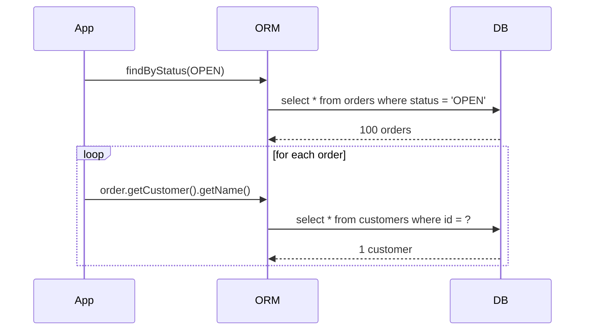
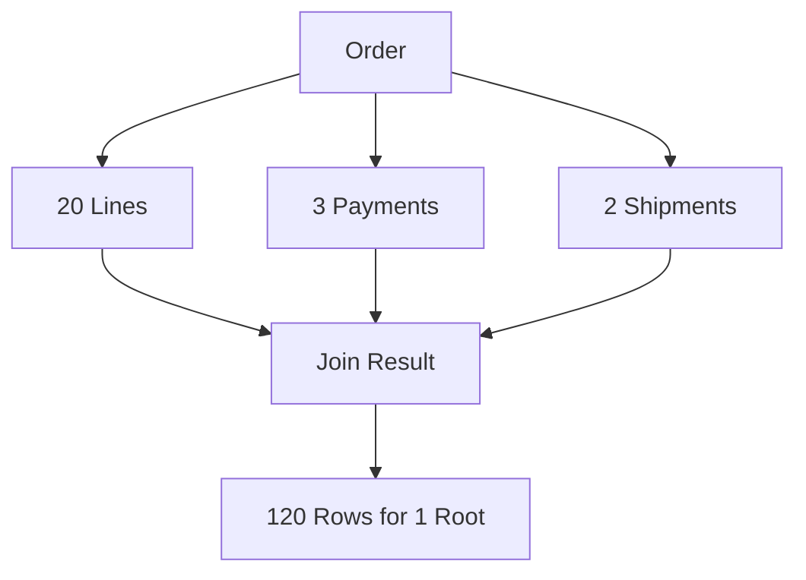
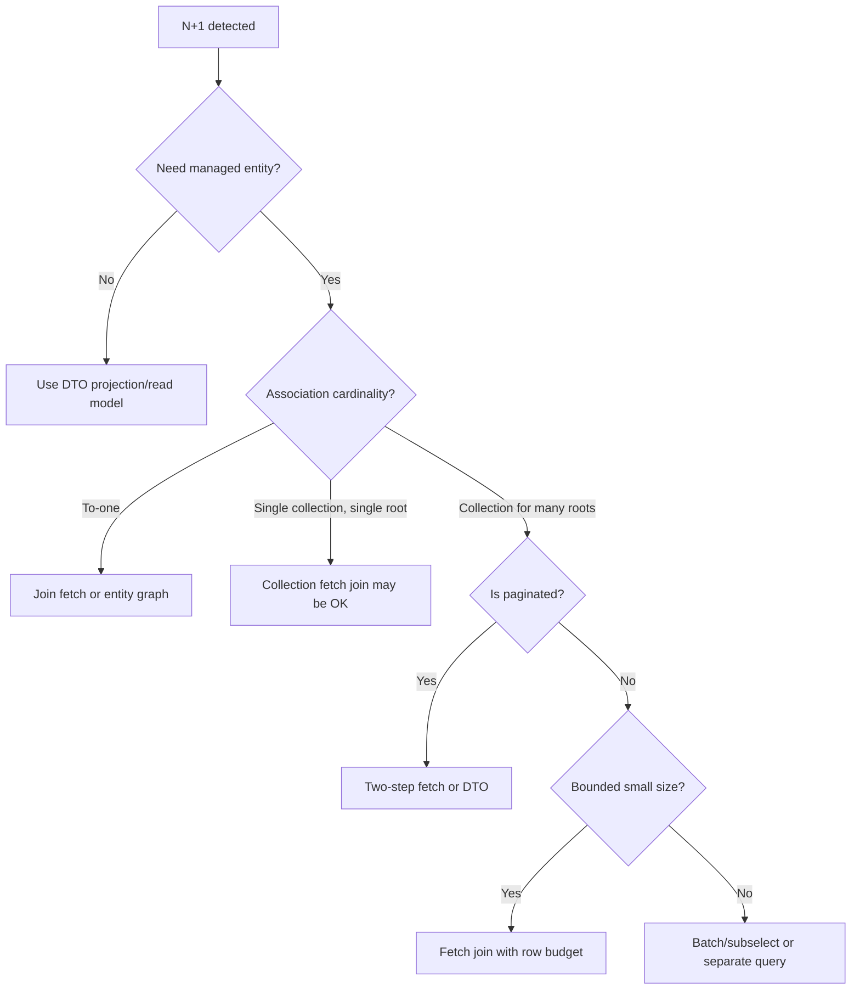

# Part 018 — N+1 and Query Plan Failures

N+1 adalah bug performa ORM yang paling populer, tetapi bukan satu-satunya failure mode.

Engineer sering memperbaiki N+1 dengan `join fetch`, lalu menciptakan masalah baru:

- row explosion;
- duplicate root;
- Cartesian product;
- pagination rusak;
- multiple collection fetch failure;
- heap meningkat;
- response lebih lambat walaupun query count turun;
- database query plan memburuk.

Jadi target part ini bukan hanya “cara menghilangkan N+1”. Targetnya lebih tinggi:

> Kita mampu mendesain, mendeteksi, mengukur, dan memperbaiki query plan failure pada JPA/Hibernate tanpa menukar satu masalah dengan masalah lain.

## 1. Target Skill Berdasarkan Kaufman

Sub-skill yang ingin kita kuasai:

1. mengenali N+1 dari code pattern dan SQL log;
2. membedakan N+1 to-one dan N+1 collection;
3. memahami kenapa lazy loading dalam loop berbahaya;
4. memperbaiki N+1 dengan fetch join, entity graph, batch fetch, atau DTO;
5. mengetahui kapan fetch join justru salah;
6. mendeteksi Cartesian product dari multi-collection join;
7. memahami duplicate root dan `distinct`;
8. menghindari collection fetch join dengan pagination;
9. membaca query count, row count, dan execution plan;
10. membuat performance regression test untuk persistence path.

Kita ingin sampai pada level:

> Setiap query penting punya expected query count, expected row shape, expected index usage, dan failure mode yang diketahui.

## 2. Apa Itu N+1?

N+1 terjadi ketika aplikasi menjalankan:

```text
1 query untuk mengambil N root rows
N query tambahan untuk mengambil association per root row
```

Contoh:

```java
List<Order> orders = orderRepository.findByStatus(OrderStatus.OPEN);

for (Order order : orders) {
    System.out.println(order.getCustomer().getName());
}
```

Jika `customer` lazy dan belum di-fetch:

```text
1 query  -> select orders
100 query -> select customer by id for each order
```

Total:

```text
101 queries
```

Diagram:



N+1 sering tidak kelihatan di code review karena code terlihat object-oriented dan bersih.

```java
order.getCustomer().getName()
```

Padahal itu bisa menjadi database round-trip.

## 3. N+1 Bukan Hanya Masalah Jumlah Query

N+1 buruk karena:

1. banyak network round trip;
2. latency bertambah linear terhadap jumlah row;
3. connection pool lebih lama terpakai;
4. database menerima query kecil berulang;
5. application thread menunggu I/O;
6. throughput turun;
7. p95/p99 latency memburuk;
8. sulit terlihat di unit test kecil.

Misalnya:

```text
1 root query: 20 ms
100 child queries: 3 ms each
Total DB time: 320 ms plus network/driver overhead
```

Di laptop, mungkin terasa cepat. Di production dengan jaringan, TLS, pool contention, dan load tinggi, ini bisa menjadi bottleneck.

## 4. Root Cause Pattern

### 4.1 Lazy Access dalam Loop

```java
for (CaseRecord c : cases) {
    row.add(c.getSubject().getDisplayName());
}
```

Jika `subject` belum di-fetch, ini N+1.

### 4.2 Mapper Mengakses Association

```java
public CaseRow toRow(CaseRecord c) {
    return new CaseRow(
        c.getId(),
        c.getSubject().getDisplayName(),
        c.getAssignedOfficer().getDisplayName()
    );
}
```

Mapper terlihat innocent, tetapi bisa memicu query.

Jika mapper dipanggil untuk 100 entities, problem muncul.

### 4.3 Serializer Mengakses Getter

```java
@GetMapping("/cases")
public List<CaseRecord> list() {
    return caseRepository.findAll();
}
```

JSON serializer dapat memanggil getter dan membuka lazy associations. Ini membuat query plan ditentukan oleh serialization library.

### 4.4 Template/View Rendering

Server-side template:

```html
<span th:text="${case.subject.displayName}"></span>
```

Bisa memicu lazy loading saat view rendering.

### 4.5 Entity Callback atau Domain Method

```java
public String displayLabel() {
    return caseNumber + " - " + subject.getDisplayName();
}
```

Method domain yang mengakses association bisa memicu query jika dipakai di list.

### 4.6 Logging dan `toString()`

```java
log.info("Loaded case {}", caseRecord);
```

Jika `toString()` mengakses association, logging bisa memicu query atau lazy exception.

Untuk entity, `toString()` harus sangat hati-hati.

## 5. N+1 To-One

Contoh:

```java
@Entity
public class Order {
    @ManyToOne(fetch = FetchType.LAZY)
    private Customer customer;
}
```

Query:

```java
List<Order> orders = orderRepository.findByStatus(OrderStatus.OPEN);

List<OrderRow> rows = orders.stream()
    .map(o -> new OrderRow(o.getId(), o.getCustomer().getName()))
    .toList();
```

N+1 to-one biasanya bisa diperbaiki dengan:

### 5.1 Join Fetch To-One

```java
@Query("""
    select o
    from Order o
    join fetch o.customer
    where o.status = :status
""")
List<Order> findByStatusWithCustomer(OrderStatus status);
```

Karena `customer` adalah to-one, row multiplication biasanya tidak terjadi.

### 5.2 Entity Graph

```java
@EntityGraph(attributePaths = "customer")
List<Order> findByStatus(OrderStatus status);
```

### 5.3 DTO Projection

```java
@Query("""
    select new com.acme.OrderRow(o.id, c.name)
    from Order o
    join o.customer c
    where o.status = :status
""")
List<OrderRow> findRowsByStatus(OrderStatus status);
```

Untuk list read-only, DTO sering lebih baik.

### 5.4 Batch Fetch

```properties
hibernate.default_batch_fetch_size=50
```

Atau:

```java
@BatchSize(size = 50)
@ManyToOne(fetch = FetchType.LAZY)
private Customer customer;
```

Batch fetch mengurangi 100 query menjadi beberapa query `where id in (...)`.

Ini berguna sebagai safety net, tetapi tidak sejelas DTO/fetch join.

## 6. N+1 Collection

Contoh:

```java
List<Order> orders = orderRepository.findByStatus(OrderStatus.OPEN);

for (Order order : orders) {
    int lineCount = order.getLines().size();
}
```

Jika `lines` lazy:

```text
1 query orders
N queries order_lines per order
```

Cara memperbaiki lebih tricky karena collection punya cardinality banyak.

### 6.1 Collection Fetch Join untuk Single Root

Aman untuk detail single aggregate:

```java
@Query("""
    select o
    from Order o
    left join fetch o.lines
    where o.id = :id
""")
Optional<Order> findByIdWithLines(Long id);
```

Jika satu order punya 20 lines, SQL mengembalikan 20 rows. Itu masih wajar.

### 6.2 Collection Fetch Join untuk Banyak Root

Berbahaya:

```java
@Query("""
    select distinct o
    from Order o
    left join fetch o.lines
    where o.status = :status
""")
List<Order> findByStatusWithLines(OrderStatus status);
```

Jika 100 orders x 20 lines:

```text
2,000 SQL rows
```

Jika ditambah payments:

```text
100 orders x 20 lines x 3 payments = 6,000 SQL rows
```

Jika ditambah shipments:

```text
100 x 20 x 3 x 2 = 12,000 SQL rows
```

Query count turun menjadi 1, tetapi row count meledak.

Itu bukan optimasi. Itu memindahkan bottleneck.

## 7. Cartesian Product Failure

Cartesian product terjadi ketika kita join beberapa collection pada root yang sama.

Contoh:

```java
@Query("""
    select distinct o
    from Order o
    left join fetch o.lines
    left join fetch o.payments
    left join fetch o.shipments
    where o.id = :id
""")
Optional<Order> findFullGraph(Long id);
```

Jika:

- 20 lines;
- 3 payments;
- 2 shipments;

maka result set menjadi:

```text
20 x 3 x 2 = 120 rows for 1 order
```

Untuk satu order masih mungkin. Untuk 100 orders, rusak.

Diagram:



Masalahnya bukan hanya jumlah row. ORM harus melakukan de-duplication dan membangun object graph dari result set yang terduplikasi.

## 8. Multiple Bag Fetch di Hibernate

Hibernate memiliki konsep bag untuk collection `List` tanpa order column yang unik sebagai index.

Contoh:

```java
@OneToMany(mappedBy = "order")
private List<OrderLine> lines = new ArrayList<>();

@OneToMany(mappedBy = "order")
private List<Payment> payments = new ArrayList<>();
```

Jika kita fetch join dua bag sekaligus, Hibernate bisa menolak dengan error semacam multiple bag fetch.

Ini bukan Hibernate “rewel”. Ini karena hasil join tidak bisa direkonstruksi dengan aman tanpa ambiguity/duplication untuk beberapa bag.

Solusi desain:

1. jangan fetch beberapa collection sekaligus;
2. ubah salah satu collection menjadi `Set` jika secara domain memang set;
3. gunakan `@OrderColumn` jika list order adalah bagian dari domain;
4. fetch collection dalam query terpisah;
5. gunakan DTO/read model;
6. gunakan batch/subselect fetching dengan hati-hati.

Jangan mengubah `List` menjadi `Set` hanya untuk menghindari error jika domain sebenarnya membutuhkan duplicate/order semantics.

## 9. Duplicate Root Problem

Query:

```java
select o
from Order o
join fetch o.lines
where o.status = :status
```

Jika order punya 3 lines, root `Order` muncul 3 kali di SQL row.

JPA provider biasanya menjaga identity object yang sama di persistence context, tetapi result list bisa memiliki duplicate root jika tidak memakai `distinct`.

Karena itu kita sering menulis:

```java
select distinct o
from Order o
join fetch o.lines
where o.status = :status
```

Tetapi ingat:

```text
distinct fixes result list duplication.
distinct does not fix row multiplication cost.
```

Jika database tetap mengirim 10.000 rows, Java-level distinct tidak membuat query murah.

## 10. Pagination + Collection Fetch Join Trap

Ini salah satu bug paling mahal.

```java
@Query("""
    select distinct o
    from Order o
    left join fetch o.lines
    where o.status = :status
    order by o.createdAt desc
""")
Page<Order> findPageWithLines(OrderStatus status, Pageable pageable);
```

Masalah:

- SQL row adalah hasil join, bukan root order murni;
- satu order bisa muncul berkali-kali karena lines;
- applying offset/limit pada joined rows bisa memotong child rows atau membuat page root tidak stabil;
- provider bisa melakukan pagination in memory;
- count query bisa salah/mahal;
- latency dan memory bisa naik drastis.

Pola sehat:

### 10.1 DTO Projection untuk Page

```java
@Query("""
    select new com.acme.OrderRow(
        o.id,
        o.orderNumber,
        c.name,
        o.totalAmount.amount,
        o.createdAt
    )
    from Order o
    join o.customer c
    where o.status = :status
    order by o.createdAt desc
""")
Page<OrderRow> findOrderRows(OrderStatus status, Pageable pageable);
```

### 10.2 Two-Step Fetch

Step 1: fetch IDs.

```java
@Query("""
    select o.id
    from Order o
    where o.status = :status
    order by o.createdAt desc
""")
List<Long> findPageIds(OrderStatus status, Pageable pageable);
```

Step 2: fetch graph by IDs.

```java
@Query("""
    select distinct o
    from Order o
    left join fetch o.lines
    where o.id in :ids
""")
List<Order> findWithLinesByIdIn(List<Long> ids);
```

Step 3: restore ordering.

```java
public List<Order> restoreOrder(List<Long> ids, List<Order> orders) {
    Map<Long, Integer> index = new HashMap<>();
    for (int i = 0; i < ids.size(); i++) {
        index.put(ids.get(i), i);
    }

    return orders.stream()
        .sorted(Comparator.comparingInt(o -> index.get(o.getId())))
        .toList();
}
```

Ini 2 query, tetapi predictable.

## 11. Count Query Failure

Spring Data `Page<T>` biasanya membutuhkan count query.

Untuk query sederhana:

```java
Page<OrderRow> findByStatus(OrderStatus status, Pageable pageable);
```

ada dua query:

```sql
select ... from orders where status = ? order by created_at desc limit ? offset ?;
select count(*) from orders where status = ?;
```

Tetapi untuk query kompleks dengan join, count query bisa:

- mahal;
- salah jika duplicate join tidak ditangani;
- membutuhkan `count(distinct root.id)`;
- tidak memakai index optimal;
- mengunci/membaca terlalu banyak data di database tertentu.

Jika total count tidak selalu diperlukan, gunakan `Slice`.

```java
Slice<OrderRow> findSliceByStatus(OrderStatus status, Pageable pageable);
```

`Slice` cukup tahu apakah ada next page, tidak perlu total row count lengkap.

## 12. Query Plan Failure: Query Count Rendah Tapi Tetap Lambat

Kadang kita sudah menghapus N+1. Query count menjadi 1. Tetapi endpoint tetap lambat.

Penyebab:

1. join terlalu banyak table;
2. result set terlalu lebar;
3. row multiplication;
4. missing index;
5. predicate tidak sargable;
6. sort menggunakan disk;
7. count query mahal;
8. database memilih plan buruk;
9. statistics database stale;
10. network transfer besar;
11. ORM hydration cost tinggi;
12. heap allocation tinggi.

Maka metric yang perlu dilihat bukan hanya query count.

Minimal:

```text
- query count
- row count
- selected column count
- execution time
- execution plan
- index usage
- heap allocation
- connection hold time
```

## 13. SQL Width dan Hydration Cost

Entity fetch mengambil kolom entity.

Jika entity besar:

```java
@Entity
public class CaseRecord {
    private Long id;
    private String caseNumber;
    private String status;
    private String description;
    private String internalMemo;
    private String legalSummary;
    private String externalReference;
    private Instant createdAt;
    private Instant updatedAt;
    // many more fields
}
```

List screen mungkin hanya butuh:

```text
id, caseNumber, status, createdAt
```

Tetapi entity query mengambil semua mapped columns root entity.

DTO projection mengurangi width:

```java
select new CaseRow(c.id, c.caseNumber, c.status, c.createdAt)
from CaseRecord c
```

Hydration cost juga berbeda:

- entity: instantiate entity, register in persistence context, snapshot for dirty checking, manage identity;
- DTO: instantiate DTO/record only.

Untuk list besar, perbedaan ini signifikan.

## 14. Database Execution Plan Basics untuk JPA Engineer

JPA engineer top-tier tidak harus menjadi DBA penuh, tetapi harus bisa membaca tanda bahaya execution plan.

Cari:

| Signal | Arti Umum |
|---|---|
| Sequential scan pada table besar | predicate/index mungkin buruk |
| Nested loop dengan outer row besar | join strategy mungkin mahal |
| Sort besar | index order tidak membantu |
| Hash aggregate besar | grouping/count mahal |
| Many rows removed by filter | predicate tidak selektif |
| Bitmap heap scan besar | mungkin wajar, tapi cek row estimate |
| Row estimate jauh salah | statistics mungkin stale atau predicate correlated |
| Temporary disk spill | memory/sort/work_mem issue |

Gunakan tool database:

```sql
explain analyze
select ...;
```

Untuk production, gunakan hati-hati. Jangan sembarang `analyze` query berat di jam sibuk tanpa prosedur.

## 15. Index dan Fetch Plan

Fetch strategy yang benar tetap bisa lambat jika index buruk.

Contoh query:

```sql
select o.*
from orders o
where o.status = ?
order by o.created_at desc
limit 50;
```

Index yang mungkin membantu:

```sql
create index idx_orders_status_created_at
on orders(status, created_at desc);
```

Jika query join customer:

```sql
select o.*, c.*
from orders o
join customers c on c.id = o.customer_id
where o.status = ?
order by o.created_at desc
limit 50;
```

Butuh:

- index filtering/sorting di `orders`;
- primary key/index di `customers.id`;
- foreign key index di `orders.customer_id` untuk query reverse access.

JPA mapping tidak otomatis membuat semua index yang optimal. Migration harus eksplisit.

## 16. Detection: SQL Logging

Aktifkan SQL logging saat development/test, bukan sembarangan di production.

Untuk Hibernate, biasanya kita ingin melihat:

- SQL statement;
- bind parameters;
- query time;
- query count per request/test;
- slow query threshold.

Contoh log yang menunjukkan N+1:

```text
select o.id, o.customer_id, o.status from orders o where o.status=?
select c.id, c.name from customers c where c.id=?
select c.id, c.name from customers c where c.id=?
select c.id, c.name from customers c where c.id=?
select c.id, c.name from customers c where c.id=?
...
```

Pattern-nya lebih penting daripada satu query individual.

## 17. Detection: Query Counter Test

Untuk endpoint atau repository penting, buat test query count.

Pseudo helper:

```java
public final class QueryCounter {
    private static final ThreadLocal<Integer> COUNT = ThreadLocal.withInitial(() -> 0);

    public static void increment() {
        COUNT.set(COUNT.get() + 1);
    }

    public static int count() {
        return COUNT.get();
    }

    public static void reset() {
        COUNT.set(0);
    }
}
```

Dalam praktik, pakai interceptor/datasource proxy agar setiap JDBC statement dihitung.

Test:

```java
@Test
void orderRowsShouldNotHaveNPlusOne() {
    seedOrders(100);

    QueryCounter.reset();

    Page<OrderRow> rows = orderRepository.findOrderRows(
        OrderStatus.OPEN,
        PageRequest.of(0, 50)
    );

    assertThat(rows.getContent()).hasSize(50);
    assertThat(QueryCounter.count()).isLessThanOrEqualTo(2);
}
```

Kenapa `2`? Karena `Page` bisa menjalankan content query dan count query.

## 18. Detection: Data Volume Test

N+1 sering tidak terlihat dengan 2 rows.

Test dengan data yang cukup:

```text
100 orders
100 customers
1,000 order lines
200 payments
50 shipments
```

Bandingkan query count:

| Data Size | Healthy Query Count | N+1 Query Count |
|---:|---:|---:|
| 1 order | 1–3 | 2–4 |
| 10 orders | 1–3 | 11–31 |
| 100 orders | 1–3 | 101–301 |
| 1,000 orders | 1–3/chunked | 1,001+ |

Test kecil menyembunyikan slope.

Masalah performa sering bukan intercept, tetapi slope.

## 19. Remediation Playbook

Saat menemukan N+1, jangan langsung `join fetch`.

Ikuti decision flow:



## 20. Fix Option 1: DTO Projection

Best for read-only list.

Before:

```java
List<Order> orders = orderRepository.findByStatus(status);
return orders.stream()
    .map(o -> new OrderRow(o.getId(), o.getCustomer().getName()))
    .toList();
```

After:

```java
@Query("""
    select new com.acme.OrderRow(o.id, c.name)
    from Order o
    join o.customer c
    where o.status = :status
""")
List<OrderRow> findRowsByStatus(OrderStatus status);
```

Advantages:

- one query;
- minimal columns;
- no managed entity;
- no lazy loading;
- stable API shape.

Trade-off:

- not suitable for write use case;
- DTO query must be maintained;
- complex DTO can become report query.

## 21. Fix Option 2: Join Fetch

Best for entity result with required association.

```java
@Query("""
    select o
    from Order o
    join fetch o.customer
    where o.status = :status
""")
List<Order> findByStatusWithCustomer(OrderStatus status);
```

Good for to-one.

For collection:

```java
@Query("""
    select distinct o
    from Order o
    left join fetch o.lines
    where o.id = :id
""")
Optional<Order> findByIdWithLines(Long id);
```

Good for single aggregate detail.

Bad for large page of roots.

## 22. Fix Option 3: Entity Graph

```java
@EntityGraph(attributePaths = {"customer", "assignedOfficer"})
List<CaseRecord> findByStatus(CaseStatus status);
```

Good when:

- predicate/query simple;
- fetch plan can be declarative;
- entity result is needed.

But always validate SQL. Entity graph still can produce joins/secondary queries depending provider and association.

## 23. Fix Option 4: Batch Fetching

```properties
hibernate.default_batch_fetch_size=50
```

Or:

```java
@BatchSize(size = 50)
@OneToMany(mappedBy = "order")
private List<OrderLine> lines = new ArrayList<>();
```

Good as system-wide guardrail.

But not enough for critical endpoint if exact shape matters.

Use it when:

- legacy code has many lazy traversals;
- associations are often accessed in groups;
- you want to reduce worst-case N+1;
- you still plan to improve query boundaries.

## 24. Fix Option 5: Separate Query Per Section

Instead of one giant graph:

```text
Order Detail Page
├── Header query
├── Lines query
├── Payments query
└── Shipment query
```

This can be better than one huge multi-join.

Example:

```java
OrderHeader header = orderRepository.findHeader(orderId);
List<OrderLineRow> lines = orderLineRepository.findRowsByOrderId(orderId);
List<PaymentRow> payments = paymentRepository.findRowsByOrderId(orderId);
```

Query count is 3, but each query is simple, indexed, and bounded.

Lower query count is not always better.

Predictable query shape is better.

## 25. Fix Option 6: Precomputed Read Model

For expensive dashboard/report:

```text
CaseRecord + Subject + Officer + SLA + Events + Risk + Actions
```

A runtime ORM graph may be the wrong abstraction.

Use:

- materialized view;
- denormalized read table;
- search index;
- event-updated projection;
- reporting schema.

JPA entity graph should not become reporting engine.

## 26. Anti-Pattern: Solving All N+1 with `FetchType.EAGER`

Bad fix:

```java
@ManyToOne(fetch = FetchType.EAGER)
private Customer customer;

@OneToMany(fetch = FetchType.EAGER)
private List<OrderLine> lines;
```

This makes every query heavy, even when association is not needed.

It also makes performance less controllable because global mapping tries to serve every use case.

Better:

- mapping lazy;
- query-level fetch plan;
- DTO projection;
- query count tests.

## 27. Anti-Pattern: Repository Method Reuse Across Shapes

Bad:

```java
List<CaseRecord> findByStatus(CaseStatus status);
```

Used by:

- list screen;
- export;
- dashboard;
- escalation job;
- notification job.

Someone adds entity graph for notification job, list screen becomes slower.

Better:

```java
Page<CaseListRow> findCaseListRows(...);
List<CaseEscalationCandidate> findEscalationCandidates(...);
Stream<CaseExportRow> streamExportRows(...);
List<CaseNotificationTarget> findNotificationTargets(...);
```

Separate query shape per use case.

## 28. Anti-Pattern: Measuring Only Query Count

Before:

```text
101 queries
300 ms
```

After join fetch:

```text
1 query
900 ms
```

Why?

- result set exploded;
- database sorted large joined rows;
- ORM hydrated thousands of duplicates;
- memory pressure increased;
- GC kicked in.

Correct evaluation:

| Metric | Before | After |
|---|---:|---:|
| Query count | 101 | 1 |
| SQL rows | 100 + 100 | 20,000 |
| Columns per row | small | wide |
| DB time | medium | high |
| Hydration cost | medium | very high |
| Heap | medium | high |
| p95 latency | bad | worse |

Optimasi harus multi-metric.

## 29. Production Diagnostics

Saat endpoint lambat:

1. cari trace/span database;
2. lihat query count per request;
3. lihat query paling lambat;
4. lihat repeated query pattern;
5. lihat bind parameter pattern;
6. capture SQL;
7. jalankan explain plan di environment aman;
8. cek index;
9. cek row estimate vs actual;
10. cek result size;
11. cek heap allocation;
12. cek connection pool wait time.

Jangan langsung menambahkan index atau join fetch tanpa diagnosis.

## 30. Observability Signals

Metric yang berguna:

```text
persistence.query.count
persistence.query.duration
persistence.query.rows_returned
persistence.slow_query.count
persistence.connection.checkout.duration
persistence.transaction.duration
persistence.entity.load.count
persistence.collection.fetch.count
persistence.flush.count
```

Hibernate statistics dapat membantu di test/dev. Untuk production, hati-hati dengan overhead dan gunakan telemetry yang sesuai.

Yang paling penting: hubungkan query dengan request/use case.

Query lambat tanpa konteks request sulit ditindaklanjuti.

## 31. Code Review Smells

Cari pattern ini:

```java
entities.stream().map(mapper::toDto)
```

Lihat mapper.

```java
entity.getAssociation().getSomething()
```

Lihat fetch plan.

```java
@JsonIgnore
```

Kadang ini menutupi entity-as-API smell.

```java
@Transactional(readOnly = true)
public List<Entity> list() { ... }
```

Kenapa return entity?

```java
@Query("select distinct x from X x join fetch x.a join fetch x.b")
```

Apakah `a` dan `b` collection?

```java
Page<Entity> find... with @EntityGraph(collection)
```

Pagination trap.

```java
@ManyToOne
private Something something;
```

Default eager. Apakah disengaja?

## 32. Mini Case Study: Case Queue Endpoint

Endpoint:

```text
GET /cases/queue?status=OPEN&page=0&size=50
```

Naive implementation:

```java
@Transactional(readOnly = true)
public Page<CaseQueueRow> getQueue(Pageable pageable) {
    return caseRepository.findByStatus(CaseStatus.OPEN, pageable)
        .map(c -> new CaseQueueRow(
            c.getId(),
            c.getCaseNumber(),
            c.getSubject().getDisplayName(),
            c.getAssignedOfficer().getDisplayName(),
            c.getCurrentWorkflowState().getName()
        ));
}
```

SQL pattern:

```text
1 query cases
1 count query
50 subject queries
50 officer queries
50 workflow state queries
```

Total: 152 queries.

Fix with DTO:

```java
@Query("""
    select new com.acme.caseapp.CaseQueueRow(
        c.id,
        c.caseNumber,
        s.displayName,
        o.displayName,
        ws.name,
        c.slaDueAt
    )
    from CaseRecord c
    join c.subject s
    left join c.assignedOfficer o
    join c.currentWorkflowState ws
    where c.status = :status
    order by c.slaDueAt asc
""")
Page<CaseQueueRow> findQueueRows(CaseStatus status, Pageable pageable);
```

Expected:

```text
1 content query
1 count query
```

This is the correct shape for a queue list.

## 33. Mini Case Study: Case Detail Timeline

Naive:

```java
@EntityGraph(attributePaths = {
    "subject",
    "assignedOfficer",
    "notes",
    "attachments",
    "actions",
    "auditEvents"
})
Optional<CaseRecord> findById(Long id);
```

Problem:

- notes x attachments x actions x audit events can multiply rows;
- some sections need pagination/security filtering;
- audit may require special access control;
- attachments may require metadata only;
- timeline may need union-like ordering.

Better:

```text
Header query: one entity/DTO
Notes query: paged DTO
Actions query: timeline DTO
Attachments query: metadata DTO
Audit query: secured separate endpoint
```

This uses more than one query, but each query has a clear shape.

## 34. Query Budget Template

Gunakan template ini di design doc atau PR description:

```text
Use case:
Endpoint/job:
Result type:
Managed entity needed: yes/no
Root cardinality:
Association cardinality:
Pagination: yes/no
Expected query count:
Expected max SQL rows:
Expected selected columns:
Indexes used:
Count query required: yes/no
Lazy loading after repository: allowed/not allowed
Failure mode:
Test coverage:
```

Contoh:

```text
Use case: Case queue list
Endpoint: GET /cases/queue
Result type: Page<CaseQueueRow>
Managed entity needed: no
Root cardinality: 50 per page
Association cardinality: to-one only
Pagination: yes
Expected query count: 2
Expected max SQL rows: 50 + count
Expected selected columns: 6
Indexes used: case(status, sla_due_at), FK indexes
Count query required: yes
Lazy loading after repository: not allowed
Failure mode: mapper-level N+1 if entity result is used
Test coverage: query count integration test
```

## 35. Deliberate Practice

Ambil domain berikut:

```text
Inspection
├── Facility
├── Inspector
├── Violations
│   └── RegulationClause
├── EvidenceFiles
├── FollowUpActions
└── AuditEvents
```

Buat 6 query:

1. inspection queue page;
2. inspection detail header;
3. violations page;
4. evidence metadata page;
5. follow-up action timeline;
6. audit event page.

Untuk setiap query:

- pilih entity/DTO;
- tulis JPQL atau repository method;
- tentukan expected query count;
- tentukan max row count;
- sebutkan index yang diperlukan;
- sebutkan failure mode jika salah fetch;
- buat query count test.

Kemudian sengaja buat versi N+1, ukur perbedaan pada 10, 100, dan 1.000 rows.

Kaufman-style deliberate practice bukan membaca pattern, tetapi melihat slope failure dengan data yang tumbuh.

## 36. Ringkasan

N+1 adalah gejala bahwa fetch plan tidak sesuai use case.

Tetapi memperbaiki N+1 secara buta bisa menciptakan query plan failure yang lebih buruk.

Prinsip utama:

1. lazy loading dalam loop adalah smell;
2. mapper dan serializer bisa memicu query;
3. to-one N+1 biasanya aman diperbaiki dengan join fetch/entity graph/DTO;
4. collection N+1 harus memperhitungkan cardinality;
5. multiple collection join bisa menghasilkan Cartesian product;
6. `distinct` tidak menghapus row multiplication cost;
7. collection fetch join dengan pagination adalah trap;
8. query count rendah tidak selalu berarti performa baik;
9. ukur query count, row count, width, plan, dan hydration cost;
10. gunakan DTO/read model untuk list/report;
11. gunakan integration test dengan volume data realistis;
12. buat query budget untuk endpoint penting.

Part berikutnya akan masuk ke **pagination, sorting, dan windowed access**, termasuk offset pagination, keyset pagination, chunk processing, dan streaming read path.
