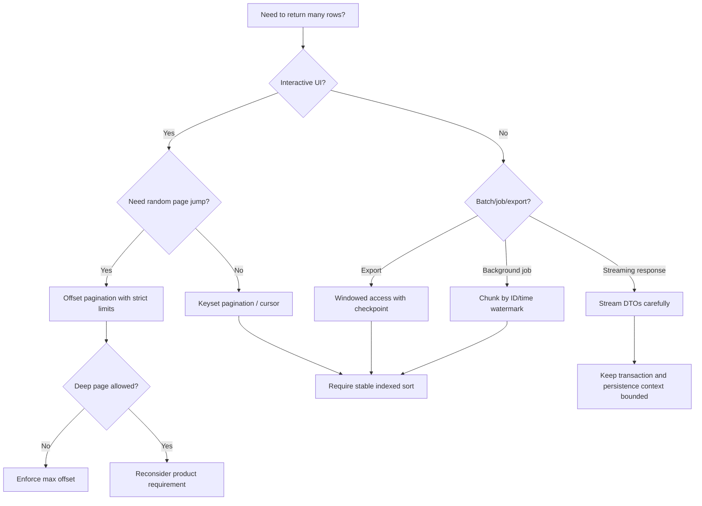
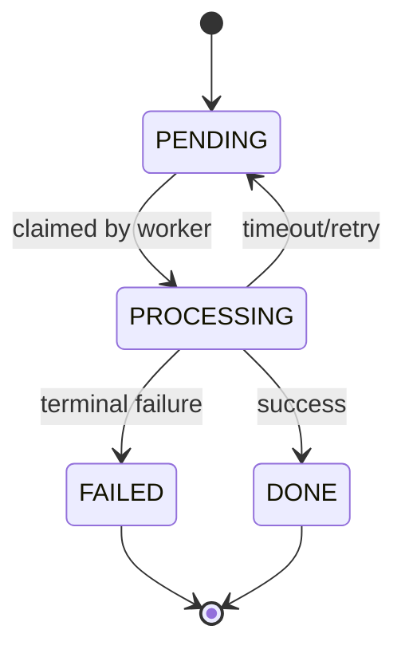
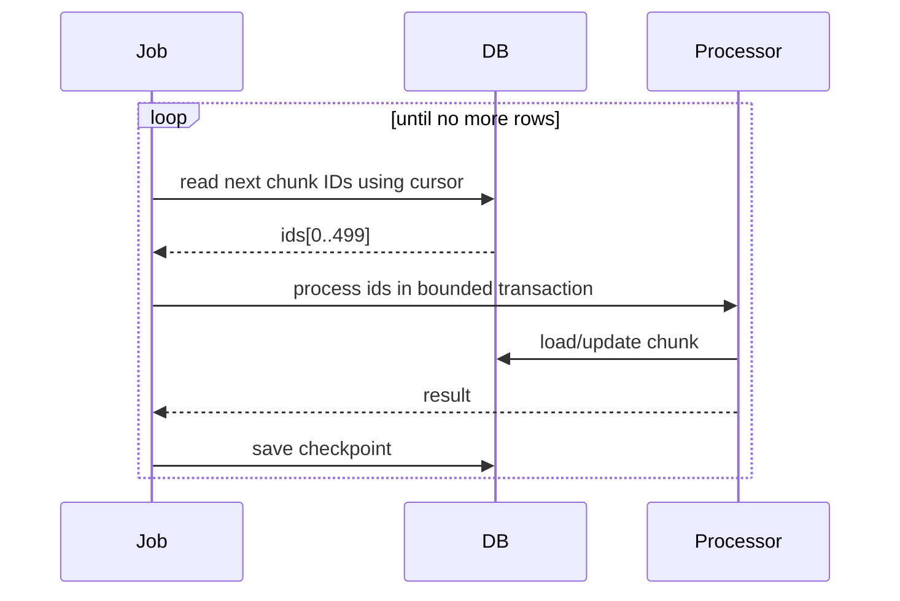

# Part 019 — Pagination, Sorting, and Windowed Access

Pagination is often treated as a UI feature. In production persistence engineering, that is too shallow.

Pagination is a **contract for deterministic, bounded, resumable access to an ordered result set**.

That contract becomes fragile when:

- the order is not stable,
- the data changes while the user is paging,
- the query joins to collections,
- offset grows into the millions,
- the result is exported or processed in the background,
- the query engine cannot use an index for the requested order,
- the application pretends that `Page<T>` is always cheap.

This part focuses on the mental model and engineering discipline behind pagination, sorting, scrolling, keyset pagination, and chunked reads in Java persistence systems.

We are not learning pagination as a framework feature. We are learning how to traverse large relational datasets without lying to the database, the user, or ourselves.

---

## 1. Kaufman Skill Slice

Following Josh Kaufman's method, we deconstruct this topic into small skills that can be practiced deliberately.

### 1.1 Target capability

After this part, you should be able to design a read traversal strategy by answering:

1. Is the user navigating pages, or is the system processing a large dataset?
2. Does the caller need total count?
3. Is ordering deterministic?
4. Can the query use an index for filter + sort?
5. Can rows be inserted or deleted while traversal is happening?
6. Is offset pagination acceptable, or do we need keyset/windowed access?
7. Are we returning entities, DTOs, scalar values, or IDs for follow-up loading?
8. Is the query joining to collections?
9. Is the traversal interactive, export-like, job-like, or stream-like?
10. What invariant prevents duplicates, missing rows, or memory blow-up?

### 1.2 Subskills

| Subskill | Why it matters |
|---|---|
| Stable ordering | Prevents duplicate/missing rows across pages |
| Offset pagination | Good for small interactive pages, bad for deep traversal |
| Keyset pagination | Efficient for forward/backward traversal when order is indexed |
| Windowed access | Allows bounded, resumable processing without loading everything |
| Count-query design | Avoids expensive `COUNT(*)` surprises |
| Fetch-plan control | Prevents pagination + join-fetch corruption |
| DTO projection | Reduces persistence-context and heap pressure |
| Chunk processing | Keeps transactions, memory, and locks bounded |
| Cursor design | Turns page navigation into a domain/API contract |
| Failure modelling | Detects drift, unstable sort, concurrent mutation, and index mismatch |

### 1.3 Practice objective

You are ready for production when you can look at any endpoint like this:

```http
GET /cases?status=OPEN&sort=priority,DESC&sort=createdAt,ASC&page=8000&size=50
```

and immediately ask:

- Is this endpoint allowed to page that deep?
- Does the sort contain a unique tie-breaker?
- Is there a supporting composite index?
- Does this endpoint need total count?
- Is it safe under concurrent inserts?
- Should this be offset pagination, keyset pagination, or an export job?

---

## 2. Core Mental Model

A relational result set is not inherently ordered unless the query has an explicit `ORDER BY`.

A page is not "rows 101 to 150" in any durable sense unless the ordering is stable.

A stable page requires:

```text
filter + deterministic order + bounded limit + known traversal position
```

The position may be:

- an offset number,
- a page number,
- a keyset cursor,
- a timestamp watermark,
- a primary-key high-water mark,
- a database cursor,
- a job checkpoint.

Different positions imply different correctness and performance properties.

---

## 3. The Pagination Decision Tree

Use this decision tree before choosing a framework API.



The wrong question is:

> Should I use `Pageable`?

The better question is:

> What traversal contract does this use case require?

---

## 4. Offset Pagination

Offset pagination means:

```sql
SELECT ...
FROM cases
WHERE status = 'OPEN'
ORDER BY created_at DESC, id DESC
OFFSET 1000
LIMIT 50;
```

In JPA, this is usually expressed with:

```java
TypedQuery<CaseSummary> query = entityManager.createQuery("""
    select new com.acme.caseapp.CaseSummary(
        c.id,
        c.referenceNo,
        c.status,
        c.priority,
        c.createdAt
    )
    from CaseFile c
    where c.status = :status
    order by c.createdAt desc, c.id desc
    """, CaseSummary.class);

query.setParameter("status", CaseStatus.OPEN);
query.setFirstResult(page * size);
query.setMaxResults(size);

List<CaseSummary> rows = query.getResultList();
```

Jakarta Persistence exposes offset-style result bounding through `setFirstResult(int)` and `setMaxResults(int)` on `Query` / `TypedQuery`.

### 4.1 When offset pagination is acceptable

Offset pagination is acceptable when:

- page depth is low,
- result set is not huge,
- user needs random access to page numbers,
- total count is meaningful,
- data drift is acceptable,
- query has a deterministic `ORDER BY`,
- database can satisfy filter + sort efficiently.

Examples:

- admin screen with first 10 pages,
- product search result with practical page cap,
- support queue list with refreshed state,
- internal lookup table with small data size.

### 4.2 When offset pagination is dangerous

Offset pagination is dangerous when:

- users can request very deep pages,
- rows are frequently inserted/deleted,
- ordering is not unique,
- query has expensive joins,
- query has collection fetch joins,
- caller uses it for full-table export,
- API clients loop through pages as a batch job,
- total count is expensive.

The classic failure:

```http
GET /transactions?page=100000&size=100
```

The database still needs to walk, sort, or discard a large number of rows before returning the final small slice.

### 4.3 Offset pagination performance shape

Offset cost often grows with offset depth:

```text
page 1      -> skip 0 rows, return 50
page 10     -> skip 450 rows, return 50
page 10,000 -> skip 499,950 rows, return 50
```

Even when the database uses an index, deep offset can still require scanning many index entries that the caller will not receive.

This is not a JPA problem. JPA just exposes the database reality.

---

## 5. Stable Sorting

A sort is stable for pagination when it defines a deterministic total order.

This is unstable:

```sql
ORDER BY created_at DESC
```

Why? Multiple rows may have the same `created_at`.

This is better:

```sql
ORDER BY created_at DESC, id DESC
```

The primary key breaks ties.

### 5.1 The stable-sort invariant

For paginated queries:

```text
The final ORDER BY expression must be unique for the result set.
```

Usually that means appending the primary key:

```sql
ORDER BY business_priority DESC, created_at ASC, id ASC
```

### 5.2 Sorting by non-unique columns

Bad:

```java
Sort sort = Sort.by(Sort.Direction.DESC, "priority");
```

Better:

```java
Sort sort = Sort.by(
    Sort.Order.desc("priority"),
    Sort.Order.asc("createdAt"),
    Sort.Order.asc("id")
);
```

### 5.3 Sorting and nulls

Nullable sort columns complicate deterministic ordering.

For example:

```sql
ORDER BY due_date ASC, id ASC
```

If `due_date` can be null, database-specific null ordering matters:

- some databases place nulls first,
- some place nulls last,
- some allow explicit `NULLS FIRST` / `NULLS LAST`,
- JPQL support may differ depending on provider and dialect.

For critical APIs, avoid ambiguous null sort behavior. Either:

- make sort column non-null,
- normalize null into a separate deterministic expression,
- use native query for explicit database behavior,
- define API semantics clearly.

### 5.4 Sorting by derived values

Sorting by derived expressions can defeat indexes:

```sql
ORDER BY lower(customer_name)
```

or:

```sql
ORDER BY coalesce(last_activity_at, created_at)
```

This may be valid, but it must be deliberate. For high-traffic endpoints, consider:

- generated columns,
- functional indexes,
- materialized read models,
- denormalized sortable fields,
- search engine projection.

---

## 6. Page, Slice, Window, Stream

Frameworks expose several shapes. They are not interchangeable.

| Shape | Meaning | Pros | Risks |
|---|---|---|---|
| `Page<T>` | Content + total count + page metadata | UI-friendly | Count query can be expensive |
| `Slice<T>` | Content + has-next indicator | Avoids total count | Still offset-based unless query strategy changes |
| `Window<T>` | Scrollable window based on offset/keyset position | Better for traversal | Requires stable sort/cursor discipline |
| `Stream<T>` | Lazy result processing | Memory-efficient if used correctly | Transaction/resource lifetime risk |
| `List<T>` with limit | Simple bounded result | Simple | No traversal contract |

### 6.1 `Page<T>` is not free

A page usually implies two queries:

```sql
SELECT ... FROM ... WHERE ... ORDER BY ... LIMIT ... OFFSET ...;
SELECT COUNT(*) FROM ... WHERE ...;
```

The count query may be more expensive than the content query.

This is especially true when:

- filters are complex,
- joins are involved,
- predicates use functions,
- table statistics are poor,
- count cannot use a narrow covering index,
- result set is huge.

Use `Page<T>` when the UI genuinely needs total pages.

Use `Slice<T>` or cursor/window when the UI only needs "load more".

### 6.2 `Slice<T>` for load-more UI

A slice can fetch `size + 1` rows to determine if there is a next slice.

Conceptually:

```java
List<CaseSummary> rows = query
    .setMaxResults(size + 1)
    .getResultList();

boolean hasNext = rows.size() > size;
List<CaseSummary> content = rows.subList(0, Math.min(size, rows.size()));
```

This avoids total count.

Use it for:

- notification feeds,
- activity logs,
- infinite scroll,
- operational queues,
- event timelines.

---

## 7. Keyset Pagination

Keyset pagination uses the last row of the previous page as the starting point for the next page.

Instead of:

```sql
OFFSET 100000 LIMIT 50
```

it uses:

```sql
WHERE (created_at, id) < (:lastCreatedAt, :lastId)
ORDER BY created_at DESC, id DESC
LIMIT 50
```

For databases without tuple comparison or for portability, express it as:

```sql
WHERE created_at < :lastCreatedAt
   OR (created_at = :lastCreatedAt AND id < :lastId)
ORDER BY created_at DESC, id DESC
LIMIT 50
```

### 7.1 Keyset invariant

Keyset pagination requires:

```text
The cursor must contain all ordered columns needed to resume after the last row.
```

For:

```sql
ORDER BY priority DESC, created_at ASC, id ASC
```

cursor must include:

```json
{
  "priority": "HIGH",
  "createdAt": "2026-06-30T09:00:00Z",
  "id": 12345
}
```

### 7.2 Keyset with JPQL

Example:

```java
public List<CaseSummary> nextOpenCases(
        Instant lastCreatedAt,
        Long lastId,
        int size
) {
    return entityManager.createQuery("""
        select new com.acme.caseapp.CaseSummary(
            c.id,
            c.referenceNo,
            c.status,
            c.priority,
            c.createdAt
        )
        from CaseFile c
        where c.status = :status
          and (
              :lastCreatedAt is null
              or c.createdAt < :lastCreatedAt
              or (c.createdAt = :lastCreatedAt and c.id < :lastId)
          )
        order by c.createdAt desc, c.id desc
        """, CaseSummary.class)
        .setParameter("status", CaseStatus.OPEN)
        .setParameter("lastCreatedAt", lastCreatedAt)
        .setParameter("lastId", lastId)
        .setMaxResults(size)
        .getResultList();
}
```

The first page passes `null` cursor values.

A cleaner implementation often branches:

```java
if (cursor == null) {
    return firstPage(size);
}
return after(cursor, size);
```

That avoids awkward null predicates and helps the optimizer.

### 7.3 Keyset cursor object

```java
public record CaseCursor(
    Instant createdAt,
    Long id
) {}
```

For an API, do not expose this directly unless the contract is internal.

Prefer an encoded cursor:

```java
public record CursorToken(String value) {}
```

A cursor token can encode:

```json
{
  "sort": "createdAt:DESC,id:DESC",
  "createdAt": "2026-06-30T09:00:00Z",
  "id": 12345
}
```

For public APIs, sign the cursor to prevent tampering.

### 7.4 Keyset strengths

Keyset pagination is strong when:

- users navigate forward/backward,
- deep page numbers are not required,
- ordered columns are indexed,
- data is frequently inserted,
- result set is large,
- API clients process results sequentially,
- query needs consistent performance across depth.

### 7.5 Keyset limitations

Keyset pagination is not ideal when:

- user needs random page jump,
- sort order is arbitrary or user-defined across many columns,
- sort expression is not index-friendly,
- ordered columns are nullable or non-unique without tie-breaker,
- result order depends on joined/aggregated values,
- cursor schema changes frequently.

---

## 8. Cursor Contract Design

A cursor is not just an implementation detail. It becomes an API contract.

### 8.1 Cursor contents

A robust cursor contains:

- sort version,
- sort direction,
- last seen ordered values,
- primary-key tie-breaker,
- optional filter hash,
- optional tenant id,
- optional expiry,
- optional signature.

Example payload before encoding:

```json
{
  "v": 1,
  "filterHash": "sha256:...",
  "sort": [
    { "field": "createdAt", "direction": "DESC" },
    { "field": "id", "direction": "DESC" }
  ],
  "last": {
    "createdAt": "2026-06-30T09:00:00Z",
    "id": 12345
  }
}
```

### 8.2 Why include filter hash?

Imagine this call:

```http
GET /cases?status=OPEN&cursor=abc
```

Then the client accidentally changes the filter:

```http
GET /cases?status=CLOSED&cursor=abc
```

The cursor no longer belongs to the query.

A filter hash lets you reject invalid continuation:

```http
400 Bad Request
{
  "code": "CURSOR_FILTER_MISMATCH",
  "message": "Cursor does not belong to the supplied filter set."
}
```

### 8.3 Do not leak raw database details casually

For internal systems, exposing `lastId` may be acceptable.

For external APIs, prefer opaque cursors:

```json
{
  "items": [...],
  "nextCursor": "eyJ2IjoxLCJzb3J0Ijpb..."
}
```

Opaque does not mean magical. It means the server owns the structure.

---

## 9. Index Design for Pagination

Pagination performance is mostly index design.

For this query:

```sql
SELECT id, reference_no, status, created_at
FROM case_file
WHERE tenant_id = ?
  AND status = ?
ORDER BY created_at DESC, id DESC
LIMIT 50;
```

A useful index may be:

```sql
CREATE INDEX idx_case_file_tenant_status_created_id
ON case_file (tenant_id, status, created_at DESC, id DESC);
```

### 9.1 Filter columns before sort columns

Common pattern:

```text
equality filters -> range filters -> sort columns -> tie-breaker
```

Example:

```sql
WHERE tenant_id = ?
  AND status = ?
  AND created_at >= ?
ORDER BY created_at DESC, id DESC
```

Index candidate:

```sql
(tenant_id, status, created_at DESC, id DESC)
```

### 9.2 Covering index consideration

If the query returns only:

```sql
id, reference_no, status, created_at
```

an index that includes those columns may allow index-only retrieval depending on the database.

Do not blindly create wide indexes. Evaluate:

- write overhead,
- index size,
- cache pressure,
- maintenance cost,
- query frequency,
- latency target.

### 9.3 Sorting by joined columns

This is harder:

```sql
SELECT c.*
FROM case_file c
JOIN customer cu ON cu.id = c.customer_id
WHERE c.status = 'OPEN'
ORDER BY cu.name ASC, c.id ASC
LIMIT 50;
```

If this query is central to the product, consider:

- denormalizing sortable `customer_name` into `case_file_read_model`,
- materialized view,
- search index,
- dedicated read model,
- limiting allowed sorts.

The top 1% engineer does not let arbitrary sorting become an unbounded database liability.

---

## 10. Pagination with Collection Fetch Joins

This is a common trap.

Bad:

```java
@Query("""
    select c
    from CaseFile c
    left join fetch c.events
    where c.status = :status
    order by c.createdAt desc
    """)
Page<CaseFile> findOpenCasesWithEvents(CaseStatus status, Pageable pageable);
```

Why is this dangerous?

A case with 10 events appears as 10 SQL rows before ORM de-duplication.

Pagination happens at the SQL row level, while you think in root entities.

```text
Database rows:
Case 1 - Event A
Case 1 - Event B
Case 1 - Event C
Case 2 - Event D
Case 3 - Event E

Page size 3 gives:
Case 1 only, after ORM de-duplication
```

This breaks the mental model of "3 cases per page".

### 10.1 Safer two-step pagination

Step 1: page root IDs only.

```java
List<Long> ids = entityManager.createQuery("""
    select c.id
    from CaseFile c
    where c.status = :status
    order by c.createdAt desc, c.id desc
    """, Long.class)
    .setParameter("status", CaseStatus.OPEN)
    .setFirstResult(offset)
    .setMaxResults(size)
    .getResultList();
```

Step 2: fetch graph by IDs.

```java
List<CaseFile> cases = entityManager.createQuery("""
    select distinct c
    from CaseFile c
    left join fetch c.events
    where c.id in :ids
    """, CaseFile.class)
    .setParameter("ids", ids)
    .getResultList();
```

Step 3: restore original order in memory.

```java
Map<Long, Integer> position = new HashMap<>();
for (int i = 0; i < ids.size(); i++) {
    position.put(ids.get(i), i);
}

cases.sort(Comparator.comparingInt(c -> position.get(c.getId())));
```

This protects root pagination semantics.

### 10.2 Prefer DTO read models for paginated screens

Most paginated screens do not need full aggregate graphs.

Instead of:

```java
Page<CaseFile> page = repository.findOpenCasesWithEverything(pageable);
```

prefer:

```java
Page<CaseRow> page = repository.findOpenCaseRows(pageable);
```

where:

```java
public record CaseRow(
    Long id,
    String referenceNo,
    CaseStatus status,
    Priority priority,
    Instant createdAt,
    String assigneeName,
    long openTaskCount
) {}
```

The read model can be designed for the screen.

The entity model should not be abused as a UI projection.

---

## 11. Sorting API Boundary

Do not let external clients sort by arbitrary entity paths.

Bad:

```http
GET /cases?sort=customer.address.country.region.name,asc
```

This leaks persistence internals and may generate pathological joins.

Better:

```java
public enum CaseSortKey {
    CREATED_AT,
    PRIORITY,
    DUE_DATE,
    REFERENCE_NO
}
```

Map allowed sort keys explicitly:

```java
public Sort toSort(CaseSortKey key, Sort.Direction direction) {
    return switch (key) {
        case CREATED_AT -> Sort.by(
            new Sort.Order(direction, "createdAt"),
            new Sort.Order(direction, "id")
        );
        case PRIORITY -> Sort.by(
            Sort.Order.desc("priorityRank"),
            Sort.Order.asc("createdAt"),
            Sort.Order.asc("id")
        );
        case DUE_DATE -> Sort.by(
            new Sort.Order(direction, "dueDate"),
            Sort.Order.asc("id")
        );
        case REFERENCE_NO -> Sort.by(
            new Sort.Order(direction, "referenceNo"),
            Sort.Order.asc("id")
        );
    };
}
```

### 11.1 Public sort key principle

Public sort keys should describe product behavior, not entity structure.

Good:

```text
sort=oldestOpen
sort=highestPriority
sort=nearestDeadline
```

Risky:

```text
sort=caseFile.currentAssignment.user.organization.name
```

---

## 12. Windowed Access for Batch Processing

A batch job should not use UI pagination blindly.

Bad:

```java
for (int page = 0; ; page++) {
    Page<CaseFile> cases = repository.findByStatus(OPEN, PageRequest.of(page, 100));
    if (cases.isEmpty()) break;
    cases.forEach(this::process);
}
```

Problems:

- offset grows,
- concurrent updates can shift rows,
- count query may run repeatedly,
- entities accumulate if transaction is too large,
- rows can be skipped or processed twice.

### 12.1 High-water mark traversal

For immutable or append-only IDs:

```java
long lastSeenId = checkpoint.lastSeenId();

while (true) {
    List<Long> ids = entityManager.createQuery("""
        select c.id
        from CaseFile c
        where c.id > :lastSeenId
        order by c.id asc
        """, Long.class)
        .setParameter("lastSeenId", lastSeenId)
        .setMaxResults(500)
        .getResultList();

    if (ids.isEmpty()) {
        break;
    }

    processChunk(ids);
    lastSeenId = ids.get(ids.size() - 1);
    checkpoint.save(lastSeenId);
}
```

This is simple, resumable, and index-friendly.

### 12.2 Time-window traversal

For event-like records:

```sql
WHERE occurred_at >= :from
  AND occurred_at < :to
ORDER BY occurred_at ASC, id ASC
LIMIT :chunkSize
```

Use timestamp + ID cursor:

```java
public record EventCursor(Instant occurredAt, Long id) {}
```

### 12.3 Processing mutable rows

If processing changes the same predicate being scanned, beware.

Example:

```sql
WHERE status = 'PENDING'
```

Processor changes status to `DONE`.

Offset pagination can skip rows because the result set shrinks as you process.

Better:

- claim rows first,
- process claimed rows,
- use `FOR UPDATE SKIP LOCKED` where appropriate,
- move IDs into a work table,
- use a queue/outbox model,
- use idempotent processors.

---

## 13. Claim-and-Process Pattern

For concurrent workers, the traversal problem becomes a coordination problem.

A simple claim model:

```text
PENDING -> PROCESSING -> DONE / FAILED
```



Native SQL example for databases that support skip-locked semantics:

```sql
SELECT id
FROM outbox_message
WHERE status = 'PENDING'
ORDER BY id ASC
LIMIT 100
FOR UPDATE SKIP LOCKED;
```

Then update claimed rows inside the same transaction.

JPA does not standardize every database-specific work-queue feature. For critical job pipelines, native SQL is often the right tool.

---

## 14. Streaming Reads

JPA providers and Spring Data can expose streaming result access, but streaming is not magic.

A stream usually keeps resources open:

- database connection,
- JDBC result set,
- persistence context,
- transaction boundary.

Bad:

```java
public Stream<CaseFile> streamOpenCases() {
    return repository.streamByStatus(CaseStatus.OPEN);
}
```

If the caller consumes outside the transaction, the stream may fail or leak resources.

Better:

```java
@Transactional(readOnly = true)
public void exportOpenCases(CaseExportWriter writer) {
    try (Stream<CaseExportRow> rows = repository.streamOpenCaseRows()) {
        rows.forEach(writer::write);
    }
}
```

### 14.1 Streaming entities is risky

Streaming entities can still fill the persistence context if not cleared.

For large exports, prefer DTO/scalar streaming.

If entities are required, periodically clear:

```java
int[] count = {0};
try (Stream<CaseFile> stream = repository.streamByStatus(CaseStatus.OPEN)) {
    stream.forEach(c -> {
        export(c);
        if (++count[0] % 500 == 0) {
            entityManager.clear();
        }
    });
}
```

But clearing inside stream processing can surprise lazy associations. Be explicit about projections.

### 14.2 Streaming and transaction duration

A long streaming transaction can:

- hold database resources,
- hold old row versions under MVCC,
- delay vacuum/cleanup in some databases,
- increase lock conflict risk if writes are involved,
- expose stale snapshots.

For huge exports, prefer chunked reads with short transactions.

---

## 15. Chunk Processing with Short Transactions

A robust large traversal often looks like this:



Example structure:

```java
public void runJob() {
    JobCheckpoint checkpoint = checkpointRepository.load("case-reindex");

    while (true) {
        List<Long> ids = caseReader.nextIdsAfter(checkpoint.lastId(), 500);
        if (ids.isEmpty()) {
            return;
        }

        caseChunkProcessor.process(ids); // separate @Transactional method
        checkpointRepository.save("case-reindex", ids.get(ids.size() - 1));
    }
}
```

Processor:

```java
@Transactional
public void process(List<Long> ids) {
    List<CaseFile> cases = caseRepository.findAllById(ids);
    for (CaseFile c : cases) {
        searchIndexer.index(c);
    }
}
```

But beware: if `searchIndexer.index(c)` calls external infrastructure, that should not be inside the database transaction unless it is intentionally designed.

A better design may build an outbox event instead.

---

## 16. Pagination and Transaction Isolation

Pagination across multiple requests is not one transaction.

Request 1:

```http
GET /cases?page=0&size=50
```

Request 2:

```http
GET /cases?page=1&size=50
```

Between requests:

- new rows can be inserted,
- rows can be deleted,
- sort values can change,
- user permissions can change,
- status filters can change.

### 16.1 Offset drift

Suppose ordering is newest first.

At time T1:

```text
A B C D E F
```

Page 1 returns:

```text
A B C
```

Then new row `X` is inserted at the front:

```text
X A B C D E F
```

Page 2 with offset 3 returns:

```text
C D E
```

Row `C` appears twice.

### 16.2 Keyset drift behavior

With keyset after `C`, next page says:

```text
Give me rows after C in the sort order.
```

It returns:

```text
D E F
```

New row `X` is not included, but you avoid duplicate `C`.

This is usually better for timeline/feed traversal.

---

## 17. Count Query Engineering

Count queries deserve design attention.

### 17.1 Avoid count when not needed

If UI says:

```text
Showing 1-50 of many results
```

instead of:

```text
Page 1 of 98472
```

then you may not need total count.

### 17.2 Use approximate count when acceptable

Some product experiences can tolerate approximate counts:

```text
10,000+ results
```

This may come from:

- cached aggregate,
- search engine estimate,
- materialized statistics table,
- database approximate metadata,
- asynchronous counter.

Do not fake precision if the value is approximate.

### 17.3 Custom count query

Spring Data JPA allows custom count queries for paginated queries. Use this when automatic count generation is wrong or too expensive.

Conceptual example:

```java
@Query(
    value = """
        select new com.acme.CaseRow(c.id, c.referenceNo, c.createdAt)
        from CaseFile c
        join c.customer cu
        where c.status = :status
          and cu.riskLevel = :riskLevel
        order by c.createdAt desc, c.id desc
    """,
    countQuery = """
        select count(c.id)
        from CaseFile c
        join c.customer cu
        where c.status = :status
          and cu.riskLevel = :riskLevel
    """
)
Page<CaseRow> findRows(
    CaseStatus status,
    RiskLevel riskLevel,
    Pageable pageable
);
```

The count query should avoid unnecessary fetches and ordering.

---

## 18. `Pageable` Is an Input, Not a Design

`Pageable` is convenient, but it can hide dangerous degrees of freedom.

Bad service boundary:

```java
public Page<CaseFile> search(CaseSearchCriteria criteria, Pageable pageable) {
    return repository.search(criteria, pageable);
}
```

This lets external callers control:

- page size,
- offset depth,
- sort field,
- sort direction,
- potentially unsafe properties.

Better:

```java
public CaseSearchResult search(CaseSearchRequest request) {
    PageRequest page = PageRequest.of(
        Math.min(request.page(), 100),
        Math.min(request.size(), 50),
        caseSortMapper.toSort(request.sortKey())
    );

    return repository.search(request.criteria(), page);
}
```

Even better for cursor-based traversal:

```java
public CaseWindow search(CaseWindowRequest request) {
    Cursor cursor = cursorCodec.decode(request.cursor());
    List<CaseRow> rows = repository.findAfter(
        request.criteria(),
        cursor,
        request.limit().bounded(1, 100)
    );
    return CaseWindow.from(rows, cursorCodec);
}
```

---

## 19. API Response Shapes

### 19.1 Offset response

```json
{
  "content": [
    { "id": 101, "referenceNo": "CASE-101" }
  ],
  "page": 0,
  "size": 50,
  "totalElements": 1234,
  "totalPages": 25
}
```

Use when:

- random access matters,
- total count matters,
- page depth is bounded.

### 19.2 Slice response

```json
{
  "content": [
    { "id": 101, "referenceNo": "CASE-101" }
  ],
  "hasNext": true
}
```

Use when:

- load-more UI,
- total count unnecessary,
- offset is still acceptable.

### 19.3 Cursor response

```json
{
  "content": [
    { "id": 101, "referenceNo": "CASE-101" }
  ],
  "nextCursor": "opaque-token",
  "hasNext": true
}
```

Use when:

- large traversal,
- stable sequential navigation,
- frequent inserts/deletes,
- external clients should not request arbitrary offsets.

---

## 20. Multi-Tenant Pagination

In multi-tenant systems, tenant scoping must be part of the pagination invariant.

Always include tenant filter:

```sql
WHERE tenant_id = :tenantId
```

And include tenant in indexes:

```sql
CREATE INDEX idx_case_tenant_status_created_id
ON case_file (tenant_id, status, created_at DESC, id DESC);
```

Cursor should be bound to tenant:

```json
{
  "tenantId": "tenant-123",
  "filterHash": "...",
  "last": {
    "createdAt": "2026-06-30T09:00:00Z",
    "id": 12345
  }
}
```

If tenant is not included or validated, a cursor token may leak traversal position across tenant boundaries.

---

## 21. Authorization Drift

Pagination is not only about data. It is also about permissions.

A user may have access to rows on page 1 but lose access before requesting page 2.

Therefore:

- never trust cursor alone,
- re-apply authorization filters on every request,
- include authorization-relevant filters in cursor hash when appropriate,
- do not encode raw accessible ID lists into long-lived cursors unless necessary.

For regulatory/case-management systems, this matters. Access rules are often dynamic:

- assigned investigator,
- team membership,
- case sensitivity level,
- legal hold,
- conflict-of-interest wall,
- regional jurisdiction,
- delegation/acting authority.

The query must represent current access rules.

---

## 22. Case Management Example

Suppose we need an investigator queue:

```http
GET /investigator-queue?sort=highestRisk&cursor=...
```

Product behavior:

- show open cases assigned to investigator's unit,
- highest risk first,
- oldest high-risk case first,
- stable continuation,
- no total count required,
- must handle concurrent case creation.

Sort:

```sql
ORDER BY risk_score DESC, created_at ASC, id ASC
```

Cursor:

```java
public record InvestigatorQueueCursor(
    int riskScore,
    Instant createdAt,
    Long id
) {}
```

JPQL predicate for next page:

```java
and (
    c.riskScore < :riskScore
    or (c.riskScore = :riskScore and c.createdAt > :createdAt)
    or (c.riskScore = :riskScore and c.createdAt = :createdAt and c.id > :id)
)
```

Note the direction changes per sort column:

- `riskScore DESC` -> next rows have lower risk score,
- `createdAt ASC` -> next rows have later createdAt,
- `id ASC` -> next rows have greater id.

This is where keyset pagination becomes easy to get subtly wrong.

---

## 23. Generic Keyset Predicate Builder

For complex dynamic sorting, consider a dedicated abstraction.

Conceptual interface:

```java
public interface KeysetPredicateBuilder<T> {
    Predicate after(
        CriteriaBuilder cb,
        Root<T> root,
        List<SortField<T, ?>> sortFields,
        KeysetCursor cursor
    );
}
```

But do not overbuild too early.

A hand-written query for critical queues is often more readable and safer than a generic keyset engine with hidden bugs.

### 23.1 Keyset predicate pattern

For sort fields:

```text
A asc, B asc, C asc
```

The next-page predicate is:

```text
A > a
OR (A = a AND B > b)
OR (A = a AND B = b AND C > c)
```

For descending fields, flip comparison direction.

For mixed directions, each level uses its own direction.

---

## 24. Pagination Test Cases

A pagination implementation should be tested with adversarial data.

### 24.1 Stable ordering test

Insert rows with identical sort value:

```text
created_at = same timestamp for 100 rows
```

Then verify:

- no duplicates across pages,
- no missing rows,
- deterministic order across repeated queries.

### 24.2 Concurrent insert simulation

Page 1:

```text
A B C
```

Insert new row before `A`.

Fetch next page.

Expected behavior differs:

| Strategy | Expected |
|---|---|
| Offset | May duplicate or skip depending on mutation |
| Keyset | Continues after cursor; new row usually not included |
| Snapshot export | Consistent with snapshot/watermark |

Document the expected behavior.

### 24.3 Deep offset guard test

Verify API rejects excessive offset:

```java
assertThatThrownBy(() -> search(page = 10_000, size = 100))
    .isInstanceOf(PageDepthExceededException.class);
```

### 24.4 Sort whitelist test

Verify unknown sort fields are rejected:

```http
GET /cases?sort=customer.passwordHash,asc
```

Expected:

```http
400 Bad Request
```

---

## 25. Common Anti-Patterns

### 25.1 Unbounded page size

Bad:

```http
GET /cases?size=100000
```

Fix:

```java
int size = Math.clamp(requestedSize, 1, 100);
```

or in Java without `Math.clamp`:

```java
int size = Math.max(1, Math.min(requestedSize, 100));
```

### 25.2 Sorting without tie-breaker

Bad:

```sql
ORDER BY created_at DESC
```

Fix:

```sql
ORDER BY created_at DESC, id DESC
```

### 25.3 Entity page for read-only screen

Bad:

```java
Page<CaseFile> page = repository.findByStatus(OPEN, pageable);
```

Better:

```java
Page<CaseRow> page = repository.findOpenRows(pageable);
```

### 25.4 Join fetch collection with pagination

Bad:

```java
select c from CaseFile c join fetch c.events
```

with `Pageable`.

Better:

- page IDs first,
- fetch graph second,
- or use DTO read model.

### 25.5 Batch job using page number

Bad:

```java
for (int page = 0; ; page++) { ... }
```

Better:

```java
while (true) {
    List<Long> ids = nextAfter(lastSeenId, chunkSize);
    ...
}
```

### 25.6 Exposing entity property paths as public sort API

Bad:

```http
sort=customer.primaryAddress.country.name
```

Better:

```http
sort=customerCountry
```

mapped explicitly to a controlled query.

---

## 26. Production Checklist

Before approving a paginated query, ask:

1. Does it have an explicit `ORDER BY`?
2. Is the order deterministic and unique?
3. Is there a primary-key tie-breaker?
4. Is the sort whitelist controlled?
5. Is page size bounded?
6. Is maximum offset bounded?
7. Is total count required?
8. Is the count query optimized?
9. Does the query join-fetch collections?
10. Is the return type entity or DTO?
11. Is the filter + sort backed by an index?
12. Does multi-tenancy appear in filter and index?
13. Is authorization re-applied on every page/window?
14. Is cursor bound to filter/sort/tenant where needed?
15. Are concurrent inserts/deletes acceptable under the chosen strategy?
16. Is this really UI pagination, or is it a batch/export workload?
17. Are tests covering duplicate sort values?
18. Are query plans reviewed for the top endpoints?

---

## 27. Practical Design Rules

Use these defaults unless you have evidence otherwise.

### 27.1 UI table

Use:

- `Page<T>` only if total count matters,
- `Slice<T>` if only next/previous matters,
- DTO projection,
- strict sort whitelist,
- bounded page size,
- bounded max page.

### 27.2 Infinite feed

Use:

- keyset cursor,
- stable order,
- opaque signed cursor,
- DTO projection,
- no total count.

### 27.3 Export

Use:

- chunked traversal,
- DTO/scalar reads,
- short transactions,
- checkpoint,
- no large persistence context.

### 27.4 Background processing

Use:

- claim-and-process,
- status transition,
- idempotency,
- checkpoint,
- native SQL if database-specific locking is required.

### 27.5 Regulatory queue

Use:

- deterministic product sort,
- keyset cursor,
- authorization filters reapplied every request,
- stable tie-breaker,
- tenant/jurisdiction-aware index,
- explicit drift semantics.

---

## 28. Mini Implementation: Cursor-Based Queue

### 28.1 DTO

```java
public record CaseQueueRow(
    Long id,
    String referenceNo,
    int riskScore,
    Instant createdAt,
    String assigneeName
) {}
```

### 28.2 Cursor

```java
public record CaseQueueCursor(
    int riskScore,
    Instant createdAt,
    Long id
) {}
```

### 28.3 Window result

```java
public record CaseQueueWindow(
    List<CaseQueueRow> content,
    String nextCursor,
    boolean hasNext
) {}
```

### 28.4 Repository method

```java
public List<CaseQueueRow> firstWindow(Long tenantId, int limit) {
    return entityManager.createQuery("""
        select new com.acme.caseapp.CaseQueueRow(
            c.id,
            c.referenceNo,
            c.riskScore,
            c.createdAt,
            a.displayName
        )
        from CaseFile c
        left join c.assignee a
        where c.tenantId = :tenantId
          and c.status = :status
        order by c.riskScore desc, c.createdAt asc, c.id asc
        """, CaseQueueRow.class)
        .setParameter("tenantId", tenantId)
        .setParameter("status", CaseStatus.OPEN)
        .setMaxResults(limit)
        .getResultList();
}
```

### 28.5 Next window

```java
public List<CaseQueueRow> nextWindow(
        Long tenantId,
        CaseQueueCursor cursor,
        int limit
) {
    return entityManager.createQuery("""
        select new com.acme.caseapp.CaseQueueRow(
            c.id,
            c.referenceNo,
            c.riskScore,
            c.createdAt,
            a.displayName
        )
        from CaseFile c
        left join c.assignee a
        where c.tenantId = :tenantId
          and c.status = :status
          and (
                c.riskScore < :riskScore
             or (c.riskScore = :riskScore and c.createdAt > :createdAt)
             or (c.riskScore = :riskScore and c.createdAt = :createdAt and c.id > :id)
          )
        order by c.riskScore desc, c.createdAt asc, c.id asc
        """, CaseQueueRow.class)
        .setParameter("tenantId", tenantId)
        .setParameter("status", CaseStatus.OPEN)
        .setParameter("riskScore", cursor.riskScore())
        .setParameter("createdAt", cursor.createdAt())
        .setParameter("id", cursor.id())
        .setMaxResults(limit)
        .getResultList();
}
```

### 28.6 Service boundary

```java
@Transactional(readOnly = true)
public CaseQueueWindow getQueue(Long tenantId, String cursorToken, int requestedLimit) {
    int limit = Math.max(1, Math.min(requestedLimit, 100));

    CaseQueueCursor cursor = cursorToken == null
        ? null
        : cursorCodec.decode(cursorToken);

    List<CaseQueueRow> rows = cursor == null
        ? repository.firstWindow(tenantId, limit + 1)
        : repository.nextWindow(tenantId, cursor, limit + 1);

    boolean hasNext = rows.size() > limit;
    List<CaseQueueRow> content = hasNext ? rows.subList(0, limit) : rows;

    String nextCursor = null;
    if (hasNext) {
        CaseQueueRow last = content.get(content.size() - 1);
        nextCursor = cursorCodec.encode(new CaseQueueCursor(
            last.riskScore(),
            last.createdAt(),
            last.id()
        ));
    }

    return new CaseQueueWindow(content, nextCursor, hasNext);
}
```

This is more code than `Pageable`, but the contract is explicit and scalable.

---

## 29. Key Takeaways

1. Pagination is a traversal contract, not merely a UI feature.
2. Every paginated query needs deterministic ordering.
3. Offset pagination is fine for shallow, bounded UI use cases.
4. Offset pagination is poor for deep traversal and mutable result sets.
5. Keyset pagination trades random page jump for stable, efficient sequential traversal.
6. `Page<T>` implies count; count may be expensive.
7. `Slice<T>` avoids count but does not automatically fix deep offset.
8. Cursor tokens must include enough sort state to resume correctly.
9. Paginating collection fetch joins breaks root-entity page semantics.
10. Batch jobs should use chunked/windowed traversal, not UI pages.
11. Public sort keys should be whitelisted and mapped explicitly.
12. Query performance depends on filter + sort index design.
13. Multi-tenant and authorization filters must be part of pagination design.
14. For production systems, pagination must be tested with duplicate sort values and concurrent mutation.

---

## 30. Deliberate Practice

### Exercise 1 — Fix unstable sorting

Given:

```sql
SELECT *
FROM case_file
WHERE status = 'OPEN'
ORDER BY priority DESC;
```

Make it stable. Explain which index you would consider.

### Exercise 2 — Replace deep offset

Given an endpoint:

```http
GET /events?page=50000&size=100
```

Redesign it using cursor-based traversal.

### Exercise 3 — Detect fetch join pagination bug

Given:

```java
@Query("""
    select c
    from Customer c
    left join fetch c.orders
    order by c.createdAt desc
    """)
Page<Customer> findCustomers(Pageable pageable);
```

Explain why it is unsafe and implement a two-step solution.

### Exercise 4 — Design regulatory queue cursor

Design a keyset cursor for:

```text
ORDER BY severity DESC, dueDate ASC, createdAt ASC, id ASC
```

Write the next-page predicate.

### Exercise 5 — Batch reindex job

Implement a chunked job that reindexes all case records using `id > lastSeenId`, persists checkpoint, and avoids long transactions.

---

## 31. References

- Jakarta Persistence 3.2 `Query` API: `setFirstResult` and `setMaxResults`
- Spring Data JPA reference: paging, sorting, scrolling, and keyset/offset window concepts
- Hibernate ORM User Guide: fetching, batching, query execution, persistence context behavior

---

## 32. What Comes Next

Part 020 moves from the read traversal problem to the write path:

- insert/update/delete behavior,
- batching,
- generated ID strategy,
- flush ordering,
- bulk updates,
- persistence-context synchronization,
- write amplification,
- production-grade write path design.
