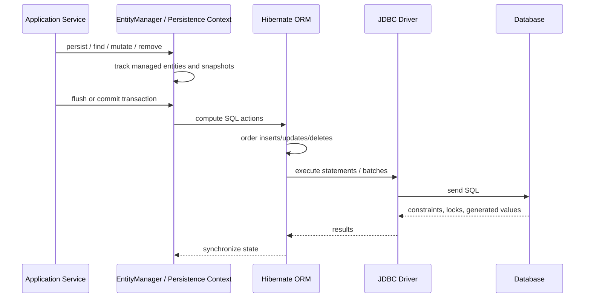
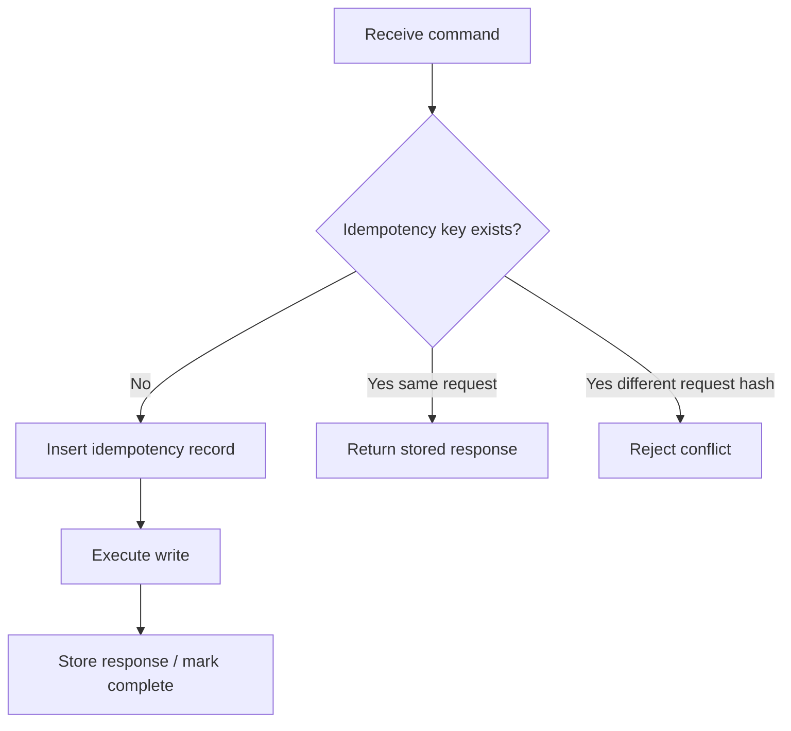
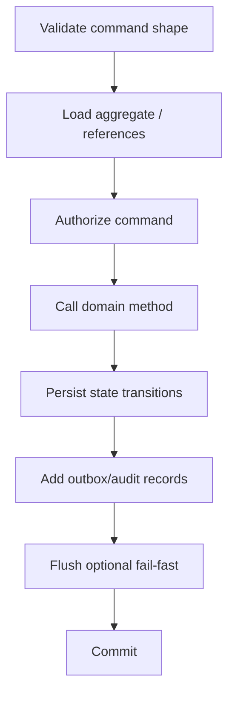
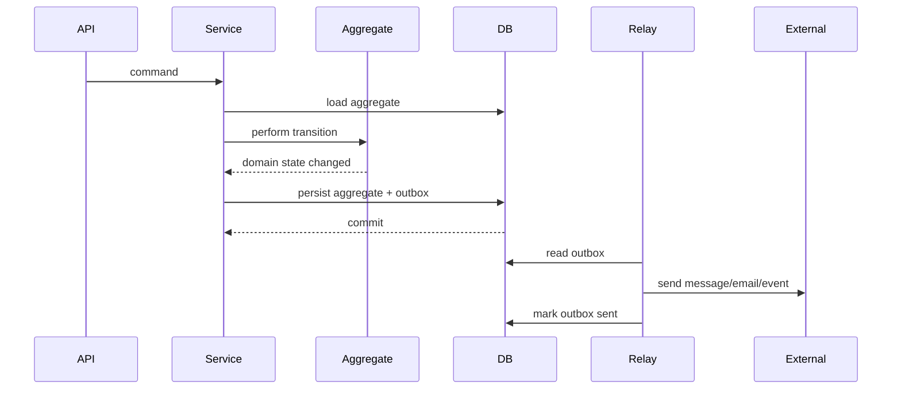

# Part 020 — Write Path Engineering

Most JPA tutorials teach writes as three operations:

```java
entityManager.persist(entity);
entity.setName("new name");
entityManager.remove(entity);
```

That is only the surface.

Production write path engineering asks deeper questions:

- How many SQL statements are emitted?
- When are they emitted?
- In what order?
- Are they batched?
- What constraints can fail at flush time?
- What identifier strategy blocks batching?
- Is the persistence context growing without bound?
- Does a bulk update desynchronize managed entities?
- Does the command enforce aggregate invariants?
- Does the transaction include external side effects?
- Can the operation be retried safely?
- What happens under concurrent writes?

A write path is not just "save this entity". It is a controlled transition from application intent to durable database state.

---

## 1. Kaufman Skill Slice

Following the Kaufman model, we break write path engineering into deliberate subskills.

### 1.1 Target capability

You should be able to look at a service method like this:

```java
@Transactional
public void closeCase(Long caseId, CloseCaseCommand command) {
    CaseFile caseFile = caseRepository.findById(caseId).orElseThrow();
    caseFile.close(command.reason(), command.closedBy());
    notificationService.notifyCaseClosed(caseFile);
}
```

and ask:

1. What SQL will be emitted?
2. When will SQL be emitted?
3. Is the aggregate fully loaded?
4. Are invariants enforced in memory, database, or both?
5. Does notification happen before durable commit?
6. Can this be retried safely?
7. What if another transaction updates the same case?
8. What if flush fails after notification was sent?
9. Does the write path scale for bulk operations?
10. Does the method hide write amplification?

### 1.2 Subskills

| Subskill | Why it matters |
|---|---|
| Insert path design | Prevents excessive round trips and ID strategy bottlenecks |
| Update path design | Avoids unnecessary updates and lost invariants |
| Delete path design | Prevents accidental cascade explosions and constraint failures |
| Flush ordering | Explains why SQL appears later and sometimes in surprising order |
| JDBC batching | Reduces database round trips for repetitive writes |
| Persistence-context sizing | Prevents memory blow-up during large writes |
| Bulk operations | Enables set-based updates without loading entities |
| Synchronization discipline | Prevents stale managed entities after bulk SQL |
| Command modelling | Keeps writes intention-revealing and invariant-safe |
| Retry/idempotency | Makes write paths robust under transient failures |

---

## 2. Write Path Mental Model

JPA writes go through the persistence context.



The important point:

```text
Mutating a managed entity is not the same moment as executing SQL.
```

JPA can delay SQL until flush.

That delay enables batching, dirty checking, and ordering. It also means failure can happen later than the line of code that caused it.

---

## 3. The Three Write Modes

There are three broad ways to write data with JPA/Hibernate.

| Write mode | Mechanism | Best for | Main risk |
|---|---|---|---|
| Entity state transition | Load entity, mutate object, flush | Aggregate invariants | N+1/write amplification |
| Bulk JPQL/SQL | `update/delete` query | Set-based operations | Persistence context desync |
| Native/database-specific operation | Native SQL, stored proc, upsert | Performance/special semantics | Portability and mapping bypass |

A mature system uses all three intentionally.

A weak system tries to force every write through `repository.save()`.

---

## 4. Insert Path Engineering

### 4.1 Simple insert

```java
@Transactional
public Long createCase(OpenCaseCommand command) {
    CaseFile caseFile = CaseFile.open(
        command.referenceNo(),
        command.subjectId(),
        command.createdBy()
    );

    entityManager.persist(caseFile);

    return caseFile.getId();
}
```

Depending on ID strategy, `caseFile.getId()` may or may not be available immediately.

### 4.2 Identifier strategy matters

Common ID strategies:

| Strategy | Behavior | Write path consequence |
|---|---|---|
| `IDENTITY` | DB generates ID during insert | Insert often must execute immediately; batching may be limited |
| `SEQUENCE` | ORM obtains value from database sequence | Better batching potential with allocation/pooling |
| UUID generated in app | ID available before insert | Good for distributed creation, larger index cost |
| Assigned natural key | App supplies ID | Requires strong uniqueness discipline |

The ID strategy is not just modelling preference. It affects batching, ordering, and round trips.

### 4.3 `IDENTITY` and batching

With identity columns, the database generates the ID when the row is inserted. Hibernate may need to execute the insert immediately to know the identifier.

This can reduce insert batching opportunities.

If high-throughput insert batching matters, sequence-based or application-generated IDs are often easier to optimize.

### 4.4 Sequence allocation

A sequence generator can allocate IDs in blocks.

Example:

```java
@Id
@GeneratedValue(strategy = GenerationType.SEQUENCE, generator = "case_file_seq")
@SequenceGenerator(
    name = "case_file_seq",
    sequenceName = "case_file_seq",
    allocationSize = 50
)
private Long id;
```

With allocation, the provider can reduce sequence round trips.

Trade-off:

- IDs may have gaps,
- allocation behavior must match database sequence increment expectations,
- operational teams must understand gap tolerance.

Gap-free IDs are rarely worth the scalability cost. For legal or business numbers, use a separate business sequence with explicit rules, not the primary key.

---

## 5. Insert Batching

Batching reduces round trips.

Without batching:

```text
INSERT row 1 -> round trip
INSERT row 2 -> round trip
INSERT row 3 -> round trip
...
```

With batching:

```text
prepare statement once
send many parameter sets in fewer round trips
```

Hibernate batching is typically configured with:

```properties
hibernate.jdbc.batch_size=50
hibernate.order_inserts=true
hibernate.order_updates=true
```

Exact names and behavior depend on provider/version, but the engineering point remains: batching must be enabled and verified.

### 5.1 Naive bulk insert

Bad:

```java
@Transactional
public void importCases(List<OpenCaseCommand> commands) {
    for (OpenCaseCommand command : commands) {
        CaseFile caseFile = CaseFile.open(
            command.referenceNo(),
            command.subjectId(),
            command.createdBy()
        );
        entityManager.persist(caseFile);
    }
}
```

Problems:

- persistence context grows with every entity,
- flush may emit huge SQL burst,
- memory grows,
- transaction gets long,
- rollback becomes expensive,
- lock/resource retention increases.

### 5.2 Bounded batch insert

Better:

```java
@Transactional
public void importCases(List<OpenCaseCommand> commands) {
    int batchSize = 50;

    for (int i = 0; i < commands.size(); i++) {
        OpenCaseCommand command = commands.get(i);
        CaseFile caseFile = CaseFile.open(
            command.referenceNo(),
            command.subjectId(),
            command.createdBy()
        );
        entityManager.persist(caseFile);

        if (i > 0 && i % batchSize == 0) {
            entityManager.flush();
            entityManager.clear();
        }
    }
}
```

This bounds persistence-context size.

But this still uses one transaction. For very large imports, use chunk-level transactions.

### 5.3 Chunk-level transaction

```java
public void importFile(ImportFile file) {
    for (List<OpenCaseCommand> chunk : file.chunks(500)) {
        caseImportChunkService.importChunk(chunk);
    }
}
```

```java
@Transactional
public void importChunk(List<OpenCaseCommand> commands) {
    for (OpenCaseCommand command : commands) {
        entityManager.persist(CaseFile.open(
            command.referenceNo(),
            command.subjectId(),
            command.createdBy()
        ));
    }
}
```

Chunk-level transactions are easier to retry and monitor.

### 5.4 Batch verification

Do not assume batching works because you set a property.

Verify:

- SQL logs show batching behavior,
- Hibernate statistics if enabled,
- JDBC driver supports batching for target database,
- ID strategy does not disable batching,
- statement shapes are identical enough to batch,
- flush/clear boundaries match batch size,
- benchmark confirms improvement.

---

## 6. Update Path Engineering

### 6.1 Managed entity update

```java
@Transactional
public void changePriority(Long caseId, Priority newPriority, UserId actor) {
    CaseFile caseFile = entityManager.find(CaseFile.class, caseId);
    caseFile.changePriority(newPriority, actor);
}
```

No explicit `save()` is required for a managed entity.

Dirty checking detects changes and emits SQL during flush.

### 6.2 Dirty checking is powerful and dangerous

Powerful:

```java
caseFile.changePriority(HIGH, actor);
```

The domain method communicates intent.

Dangerous:

```java
caseFile.getInternalNotes().clear();
```

This may delete or update many rows depending on mapping and orphan rules.

The line of code can look small while the SQL impact is large.

### 6.3 Update only when state changes

Domain methods should be idempotent where sensible:

```java
public void changePriority(Priority newPriority, UserId actor) {
    requireOpen();

    if (this.priority == newPriority) {
        return;
    }

    this.priority = newPriority;
    this.addEvent(CaseEvent.priorityChanged(id, newPriority, actor));
}
```

This avoids unnecessary updates and duplicate domain events.

### 6.4 Dynamic update

Some providers support updating only changed columns. Hibernate has `@DynamicUpdate`.

Use carefully.

Potential benefits:

- narrower SQL update,
- less write pressure on unchanged columns,
- fewer trigger/replication side effects in some systems.

Potential costs:

- more SQL statement shapes,
- less batching potential,
- provider-specific behavior,
- plan cache variability.

Do not turn it on globally without evidence.

---

## 7. Merge Is Not Save

This is one of the most common JPA misunderstandings.

Bad mental model:

```text
merge(detachedEntity) saves my object
```

Better mental model:

```text
merge copies state from a detached object into a managed instance and returns the managed instance
```

Example:

```java
CaseFile detached = request.toEntity();
entityManager.merge(detached);
```

This is risky because:

- detached object may not contain all fields,
- missing associations can overwrite state,
- stale client data can replace newer data,
- invariants can be bypassed,
- security-sensitive fields may be updated accidentally.

### 7.1 Safer command update

Prefer:

```java
@Transactional
public void updateCase(Long caseId, UpdateCaseCommand command) {
    CaseFile caseFile = entityManager.find(CaseFile.class, caseId);

    caseFile.rename(command.title(), command.actor());
    caseFile.changeDueDate(command.dueDate(), command.actor());
}
```

This loads the authoritative aggregate and applies explicit commands.

### 7.2 `save()` ambiguity in repositories

Repository `save()` often hides whether it is doing persist or merge.

For command methods, prefer explicit intent:

```java
caseRepository.add(caseFile);
```

or:

```java
caseFile.changePriority(...);
```

not:

```java
caseRepository.save(caseFileFromRequest);
```

---

## 8. Delete Path Engineering

Delete is not simple in relational systems.

### 8.1 Entity remove

```java
@Transactional
public void deleteCase(Long id) {
    CaseFile caseFile = entityManager.find(CaseFile.class, id);
    entityManager.remove(caseFile);
}
```

This schedules removal. SQL is emitted on flush.

### 8.2 Cascading delete danger

Mapping:

```java
@OneToMany(mappedBy = "caseFile", cascade = CascadeType.REMOVE)
private List<CaseEvent> events = new ArrayList<>();
```

Deleting one case may delete many events.

That may be correct for child rows owned by the aggregate.

It is catastrophic if applied across shared references.

Never cascade remove across aggregate boundaries.

### 8.3 Database cascade vs ORM cascade

Database cascade:

```sql
FOREIGN KEY (case_id) REFERENCES case_file(id) ON DELETE CASCADE
```

ORM cascade:

```java
@OneToMany(cascade = CascadeType.REMOVE)
```

They are not the same.

| Aspect | ORM cascade | DB cascade |
|---|---|---|
| Executed by | ORM | Database |
| Visible to persistence context | Yes, mostly | Not necessarily |
| Can trigger entity callbacks | Yes | No ORM callback |
| Performance | May issue many deletes | Often efficient |
| Portability | JPA-level | Database-level |

Use deliberately.

### 8.4 Soft delete

Many business systems do not physically delete important records.

Soft delete:

```java
public void archive(UserId actor) {
    if (this.archived) {
        return;
    }
    this.archived = true;
    this.archivedAt = Instant.now();
    this.archivedBy = actor;
}
```

Soft delete introduces query discipline:

```sql
WHERE archived = false
```

It also affects:

- unique constraints,
- indexes,
- reporting,
- data retention,
- legal hold,
- restore flows,
- authorization.

Soft delete is not free. It moves complexity from delete time to every read path.

---

## 9. Flush Ordering

Hibernate internally tracks actions such as:

- entity inserts,
- entity updates,
- collection deletes,
- collection inserts,
- entity deletes.

It may reorder SQL to satisfy constraints and improve batching.

You should not assume SQL order exactly follows Java line order.

Example:

```java
Order order = new Order(customer);
entityManager.persist(order);

OrderLine line = new OrderLine(order, product, 2);
entityManager.persist(line);
```

SQL likely needs:

```sql
INSERT INTO orders ...
INSERT INTO order_line ...
```

because `order_line` references `orders`.

### 9.1 Flush can fail late

Code:

```java
caseFile.changeReferenceNo("CASE-001");
auditLog.record(...);
```

Unique constraint violation may happen later:

```java
entityManager.flush();
```

or at transaction commit.

Therefore:

- do not send external messages before commit,
- expect constraint violations at flush/commit,
- use transaction synchronization/outbox for after-commit effects,
- keep command methods side-effect disciplined.

### 9.2 Explicit flush

Sometimes useful:

```java
entityManager.flush();
```

Use cases:

- fail early before expensive follow-up work,
- force constraint validation before returning response,
- detect DB-generated values,
- split SQL emission points for diagnostics.

Anti-pattern:

```java
entityManager.flush();
```

sprinkled everywhere because the developer does not understand persistence context behavior.

---

## 10. Write Amplification

Write amplification means a small logical command produces many physical database writes.

Example command:

```text
Close case
```

Physical writes:

```text
update case_file
insert case_event
update assignment
insert notification_outbox
update search_projection
insert audit_log
```

This may be correct. But it must be known.

### 10.1 Hidden amplification through collections

Bad:

```java
caseFile.setTags(newTags);
```

If implemented as:

```java
this.tags.clear();
this.tags.addAll(newTags);
```

Hibernate may delete and reinsert join table rows even when most tags did not change.

Better:

```java
public void replaceTags(Set<Tag> desiredTags) {
    this.tags.removeIf(existing -> !desiredTags.contains(existing));

    for (Tag desired : desiredTags) {
        if (!this.tags.contains(desired)) {
            this.tags.add(desired);
        }
    }
}
```

This expresses delta instead of wholesale replacement.

### 10.2 Write amplification review

For every command, estimate:

| Command | Expected SQL |
|---|---|
| Create case | 1 insert case, 1 insert event, 1 insert outbox |
| Assign case | 1 update case, 1 insert assignment event, 1 insert outbox |
| Replace 20 tags | delta deletes/inserts only |
| Close case | 1 update case, 1 insert closure event, 1 insert outbox |

If actual SQL differs greatly, investigate.

---

## 11. Bulk Operations

Sometimes loading entities is the wrong tool.

Example requirement:

```text
Expire all pending invitations older than 30 days.
```

Entity loop:

```java
List<Invitation> invitations = repository.findExpiredPending(cutoff);
for (Invitation invitation : invitations) {
    invitation.expire();
}
```

This may be correct if each expiration emits domain events or checks invariants.

But if it is a simple set transition, use bulk update:

```java
int updated = entityManager.createQuery("""
    update Invitation i
    set i.status = :expired,
        i.expiredAt = :now
    where i.status = :pending
      and i.createdAt < :cutoff
    """)
    .setParameter("expired", InvitationStatus.EXPIRED)
    .setParameter("now", now)
    .setParameter("pending", InvitationStatus.PENDING)
    .setParameter("cutoff", cutoff)
    .executeUpdate();
```

### 11.1 Bulk update bypasses entity lifecycle

Bulk JPQL updates generally bypass:

- dirty checking,
- entity callbacks,
- per-entity domain methods,
- loaded aggregate invariants,
- automatic in-memory synchronization.

They operate directly in the database.

That is why they are fast.

That is also why they are dangerous.

### 11.2 Persistence context desynchronization

Example:

```java
Invitation invitation = entityManager.find(Invitation.class, id);

entityManager.createQuery("""
    update Invitation i
    set i.status = :expired
    where i.id = :id
    """)
    .setParameter("expired", InvitationStatus.EXPIRED)
    .setParameter("id", id)
    .executeUpdate();

System.out.println(invitation.getStatus()); // may still show old value
```

The managed entity may be stale.

Fix options:

```java
entityManager.clear();
```

or:

```java
entityManager.refresh(invitation);
```

or structure the transaction to avoid mixing managed entities and bulk updates.

### 11.3 Spring Data `@Modifying`

Spring Data JPA supports modifying queries:

```java
@Modifying(clearAutomatically = true, flushAutomatically = true)
@Query("""
    update Invitation i
    set i.status = :expired
    where i.status = :pending
      and i.createdAt < :cutoff
    """)
int expireOldInvitations(
    InvitationStatus expired,
    InvitationStatus pending,
    Instant cutoff
);
```

Use automatic clear/flush carefully. Clearing the persistence context detaches all managed entities.

That may be correct in a repository method dedicated to bulk operations.

It may surprise a service method that has already loaded aggregates.

---

## 12. Bulk Delete

Bulk delete:

```java
int deleted = entityManager.createQuery("""
    delete from ImportStagingRow r
    where r.importId = :importId
    """)
    .setParameter("importId", importId)
    .executeUpdate();
```

Good for:

- staging tables,
- temporary data,
- expired tokens,
- transient logs with retention policy.

Dangerous for:

- aggregate roots with child rows,
- audited records,
- domain events,
- tables with complex foreign keys,
- legal/regulatory data.

Bulk delete bypasses ORM cascade semantics. Database constraints still apply.

---

## 13. Upsert and Conflict Handling

JPA does not give a fully portable, high-level upsert abstraction for every database.

Database-specific forms include:

- PostgreSQL `INSERT ... ON CONFLICT`,
- MySQL `INSERT ... ON DUPLICATE KEY UPDATE`,
- SQL Server `MERGE` / alternatives,
- Oracle `MERGE`.

For true upsert semantics, native SQL is often clearer.

Example conceptual native SQL:

```java
entityManager.createNativeQuery("""
    insert into idempotency_record (key, request_hash, created_at)
    values (:key, :requestHash, :createdAt)
    on conflict (key) do nothing
    """)
    .setParameter("key", key)
    .setParameter("requestHash", requestHash)
    .setParameter("createdAt", createdAt)
    .executeUpdate();
```

Use native SQL when the database has the exact concurrency primitive you need.

Do not simulate atomic upsert with:

```java
if (!exists(key)) {
    insert(key);
}
```

That is a race condition unless protected by a unique constraint and proper exception handling.

---

## 14. Idempotent Write Design

Distributed systems retry.

Users double-click.

HTTP clients timeout after the server committed.

Job workers crash after partial progress.

Therefore important writes need idempotency.

### 14.1 Idempotency key

```java
public record SubmitCaseCommand(
    String idempotencyKey,
    String referenceNo,
    SubjectId subjectId,
    UserId submittedBy
) {}
```

Database table:

```sql
CREATE TABLE idempotency_record (
    idempotency_key varchar(100) PRIMARY KEY,
    request_hash varchar(100) NOT NULL,
    response_body jsonb,
    status varchar(30) NOT NULL,
    created_at timestamp NOT NULL
);
```

Flow:



### 14.2 Unique constraint as correctness primitive

Application checks are not enough.

Bad:

```java
if (!repository.existsByReferenceNo(referenceNo)) {
    repository.save(caseFile);
}
```

Correct foundation:

```sql
ALTER TABLE case_file
ADD CONSTRAINT uk_case_reference_no UNIQUE (reference_no);
```

Then handle duplicate key failure as part of command behavior.

---

## 15. Optimistic Write Path

Optimistic locking will be covered deeper in Part 021, but write path design must prepare for it.

Entity:

```java
@Version
private long version;
```

Command:

```java
public record ChangePriorityCommand(
    Long caseId,
    long expectedVersion,
    Priority newPriority,
    UserId actor
) {}
```

Service:

```java
@Transactional
public void changePriority(ChangePriorityCommand command) {
    CaseFile caseFile = entityManager.find(CaseFile.class, command.caseId());

    if (caseFile.getVersion() != command.expectedVersion()) {
        throw new StaleCaseVersionException(command.caseId());
    }

    caseFile.changePriority(command.newPriority(), command.actor());
}
```

At flush, the update includes version semantics.

The application-level expected version gives a better user-facing error before or alongside database-level optimistic lock failure.

---

## 16. External Side Effects and Write Path

Bad:

```java
@Transactional
public void closeCase(Long caseId) {
    CaseFile caseFile = repository.getRequired(caseId);
    caseFile.close();

    emailClient.sendCaseClosedEmail(caseFile.getOwnerEmail());
}
```

Failure scenarios:

1. Email sent, commit fails.
2. Commit succeeds, email fails.
3. Transaction retries, email sent twice.
4. Email service latency holds DB transaction open.

Better:

```java
@Transactional
public void closeCase(Long caseId) {
    CaseFile caseFile = repository.getRequired(caseId);
    caseFile.close();

    outboxRepository.add(OutboxMessage.caseClosed(caseFile.getId()));
}
```

A separate relay sends the email after commit.

This is the transactional outbox pattern, covered deeper in Part 030.

---

## 17. Command Handler Shape

A production write command handler should have a clear shape:



Example:

```java
@Transactional
public CloseCaseResult closeCase(CloseCaseCommand command) {
    CaseFile caseFile = caseRepository.getRequired(command.caseId());

    authorizationService.assertCanClose(command.actor(), caseFile);

    caseFile.close(command.reason(), command.actor());

    auditRepository.add(AuditEntry.caseClosed(
        caseFile.getId(),
        command.actor(),
        command.reason()
    ));

    outboxRepository.add(OutboxMessage.caseClosed(caseFile.getId()));

    return CloseCaseResult.from(caseFile);
}
```

Notice:

- external side effects are not executed directly,
- domain method owns invariant transition,
- audit/outbox are part of same transaction,
- result is built from managed state.

---

## 18. Insert/Update Ordering and Constraints

### 18.1 Unique constraints

Unique constraint failure may happen at flush/commit.

Handle it at service/API boundary:

```java
try {
    commandService.createCase(command);
} catch (DuplicateReferenceNoException ex) {
    return conflict(...);
}
```

Do not parse SQL error strings deep inside domain methods.

Use exception translation at infrastructure boundary where possible.

### 18.2 Foreign-key constraints

If you set a reference by ID without loading the target:

```java
Customer customerRef = entityManager.getReference(Customer.class, customerId);
CaseFile caseFile = CaseFile.open(customerRef, command);
entityManager.persist(caseFile);
```

If customer does not exist, failure may happen at flush.

This can be acceptable when:

- foreign key enforces correctness,
- you map DB constraint violation to domain error,
- you do not need customer data for authorization/invariant.

If you need to verify customer status, load it explicitly.

---

## 19. `getReference` Write Optimization

`getReference` returns a proxy/reference without immediately loading the entity.

Useful when only FK assignment is needed:

```java
Customer customer = entityManager.getReference(Customer.class, customerId);
CaseFile caseFile = CaseFile.open(customer, command.referenceNo(), actor);
entityManager.persist(caseFile);
```

Avoid when:

- you need target fields,
- existence must be checked early,
- authorization depends on target state,
- error semantics require `404` before write.

`getReference` is an optimization. It is not a substitute for domain validation.

---

## 20. Large Update Scenario: Reassignment

Requirement:

```text
Reassign all open cases from investigator A to investigator B.
```

Option 1: Entity loop.

```java
@Transactional
public void reassignOpenCases(UserId from, UserId to, UserId actor) {
    List<CaseFile> cases = repository.findOpenCasesAssignedTo(from);

    for (CaseFile caseFile : cases) {
        caseFile.reassign(to, actor);
        outboxRepository.add(OutboxMessage.caseReassigned(caseFile.getId(), from, to));
    }
}
```

Use when:

- each reassignment needs domain event,
- per-case authorization/invariant differs,
- audit trail must be per aggregate,
- number of cases is bounded.

Option 2: Bulk update.

```java
@Transactional
public int bulkReassignOpenCases(UserId from, UserId to) {
    return entityManager.createQuery("""
        update CaseFile c
        set c.assigneeId = :to
        where c.assigneeId = :from
          and c.status = :open
        """)
        .setParameter("to", to.value())
        .setParameter("from", from.value())
        .setParameter("open", CaseStatus.OPEN)
        .executeUpdate();
}
```

Use when:

- operation is set-based,
- no per-case domain event is required,
- audit can be represented as one bulk operation record,
- persistence context is cleared after operation.

Option 3: Work queue.

Use when:

- thousands/millions of cases,
- per-case side effects required,
- operation must be resumable,
- failures must be isolated.

---

## 21. Write Path for Aggregates

Aggregate write path rule:

```text
Load one aggregate, execute one command, commit one invariant-preserving transition.
```

Good:

```java
caseFile.addEvidence(evidence, actor);
```

Bad:

```java
caseFile.getEvidenceItems().add(evidence);
```

The second bypasses language of the domain.

### 21.1 Collection helper methods

```java
public void addEvidence(Evidence evidence, UserId actor) {
    requireOpen();
    requireCanAccept(evidence);

    evidence.attachTo(this);
    this.evidenceItems.add(evidence);
    this.events.add(CaseEvent.evidenceAdded(this.id, evidence.getId(), actor));
}
```

Bidirectional consistency:

```java
public class Evidence {
    public void attachTo(CaseFile caseFile) {
        this.caseFile = Objects.requireNonNull(caseFile);
    }
}
```

Do not let application services manipulate both sides of associations manually everywhere.

---

## 22. Write Path and Validation Layering

Validation should be layered.

| Layer | Example |
|---|---|
| API/request validation | required fields, string length, format |
| Application validation | actor can perform command |
| Domain validation | case must be open before close |
| Database validation | unique constraints, FK, NOT NULL, check constraints |
| Integration validation | outbox consumer schema, downstream contract |

Do not rely on only one layer.

Example:

```java
public void close(CloseReason reason, UserId actor) {
    if (status == CaseStatus.CLOSED) {
        return;
    }

    if (!status.canClose()) {
        throw new InvalidCaseTransitionException(status, CaseStatus.CLOSED);
    }

    this.status = CaseStatus.CLOSED;
    this.closedAt = Instant.now();
    this.closedBy = actor;
    this.closeReason = reason;
}
```

Database also enforces:

```sql
ALTER TABLE case_file
ADD CONSTRAINT chk_closed_fields
CHECK (
    status <> 'CLOSED'
    OR (closed_at IS NOT NULL AND closed_by IS NOT NULL)
);
```

The database check protects against bugs and non-JPA writers.

---

## 23. Observing the Write Path

Enable SQL visibility in lower environments.

You want to know:

- number of inserts,
- number of updates,
- number of deletes,
- batch count,
- flush count,
- transaction duration,
- constraint failure rate,
- deadlock/lock timeout rate,
- optimistic lock failure rate.

### 23.1 Write path log checklist

For a command, capture:

```text
command=CloseCase
caseId=123
transactionMs=42
flushCount=1
entityInsertCount=2
entityUpdateCount=1
entityDeleteCount=0
collectionUpdateCount=0
outboxInserted=true
```

Do not log sensitive data.

### 23.2 Test SQL count

For critical commands, test expected SQL count.

Pseudo-test:

```java
@Test
void closingCaseShouldHaveBoundedWriteCount() {
    sqlRecorder.clear();

    closeCaseService.closeCase(command);

    assertThat(sqlRecorder.countInsertsInto("outbox_message")).isEqualTo(1);
    assertThat(sqlRecorder.countUpdatesOf("case_file")).isEqualTo(1);
}
```

Exact SQL-count tests can be brittle. Use them for high-value invariants, not every method.

---

## 24. Retry Strategy

Transient write failures happen:

- deadlock,
- lock timeout,
- network glitch,
- serialization failure,
- optimistic conflict,
- connection failover.

Not every operation can be retried blindly.

### 24.1 Retry-safe requirements

A retry-safe write should have:

- idempotency key,
- no direct external side effect inside transaction,
- unique constraints for duplicate detection,
- deterministic command behavior,
- bounded transaction scope,
- clear exception classification.

### 24.2 Do not retry semantic failures

Do not retry:

- validation failure,
- authorization failure,
- duplicate business key unless idempotent,
- invariant violation,
- malformed command.

Retry only transient infrastructure/concurrency failures with a controlled policy.

---

## 25. Write Path Anti-Patterns

### 25.1 `save()` everywhere

Bad:

```java
repository.save(entity);
```

used for every create/update without understanding managed state.

Fix:

- use `persist` semantics for new aggregate,
- load-and-mutate for updates,
- use bulk queries for set operations,
- use explicit command handlers.

### 25.2 DTO-to-entity merge

Bad:

```java
CaseFile caseFile = mapper.toEntity(request);
repository.save(caseFile);
```

Fix:

```java
CaseFile caseFile = repository.getRequired(id);
caseFile.apply(command);
```

### 25.3 One huge transaction

Bad:

```java
@Transactional
public void importMillionRows(...) { ... }
```

Fix:

- chunk transactions,
- checkpoint progress,
- idempotent chunks,
- staging table.

### 25.4 External API call inside transaction

Bad:

```java
paymentClient.charge(...);
entityManager.persist(...);
```

or:

```java
entityManager.persist(...);
emailClient.send(...);
```

Fix:

- outbox,
- saga/process manager,
- after-commit event with retry discipline.

### 25.5 Bulk update with managed entities still in context

Bad:

```java
CaseFile c = repository.getRequired(id);
repository.bulkClose(...);
return c.getStatus();
```

Fix:

- do not mix,
- flush/clear,
- refresh,
- isolate bulk operation.

### 25.6 Cascading remove across aggregate boundary

Bad:

```java
@ManyToOne(cascade = CascadeType.REMOVE)
private Customer customer;
```

Deleting a case should not delete the customer.

Fix:

- cascade only from aggregate root to owned children,
- never to shared parent/reference data.

### 25.7 Replacing collections wholesale

Bad:

```java
this.children = newChildren;
```

Fix:

- mutate existing collection,
- compute delta,
- maintain both sides,
- consider orphan removal semantics.

---

## 26. Design Pattern: Command + Aggregate + Outbox

This is a strong default for complex business writes.



This pattern keeps the database transaction focused on durable state.

---

## 27. Write Path Review Template

For every important command, write a short design note.

```md
## Command: Close Case

### Intent
Close an open case with reason and actor.

### Aggregate
CaseFile.

### Transaction boundary
Single transaction around load, transition, audit insert, outbox insert.

### Expected SQL
- select case_file by id
- update case_file status/version/closed fields
- insert case_event
- insert audit_log
- insert outbox_message

### Invariants
- case must be closeable
- actor must be authorized
- close reason required
- closed fields must be set together

### Constraints
- FK closed_by -> user
- check closed fields when status CLOSED
- optimistic version update

### Side effects
Outbox only. No direct email/message inside transaction.

### Retry behavior
Retry optimistic conflicts only after re-read/user confirmation.
Infrastructure retry only with idempotency key.
```

This kind of design note is short, but it prevents entire classes of production bugs.

---

## 28. Capstone Example: Case Assignment Write Path

### 28.1 Command

```java
public record AssignCaseCommand(
    Long caseId,
    Long assigneeId,
    UserId actor,
    long expectedVersion,
    String idempotencyKey
) {}
```

### 28.2 Service

```java
@Transactional
public AssignCaseResult assign(AssignCaseCommand command) {
    idempotencyService.registerOrReturn(command.idempotencyKey(), command);

    CaseFile caseFile = caseRepository.getRequired(command.caseId());

    if (caseFile.getVersion() != command.expectedVersion()) {
        throw new StaleCaseVersionException(command.caseId());
    }

    Investigator assignee = investigatorRepository.getRequired(command.assigneeId());

    authorizationService.assertCanAssign(command.actor(), caseFile, assignee);

    caseFile.assignTo(assignee, command.actor());

    auditRepository.add(AuditEntry.caseAssigned(
        caseFile.getId(),
        assignee.getId(),
        command.actor()
    ));

    outboxRepository.add(OutboxMessage.caseAssigned(
        caseFile.getId(),
        assignee.getId()
    ));

    entityManager.flush(); // optional fail-fast for constraints/version

    AssignCaseResult result = AssignCaseResult.from(caseFile);
    idempotencyService.complete(command.idempotencyKey(), result);

    return result;
}
```

### 28.3 Expected SQL shape

```text
select idempotency_record by key
insert idempotency_record
select case_file by id
select investigator by id
update case_file set assignee_id=?, version=? where id=? and version=?
insert case_event ...
insert audit_log ...
insert outbox_message ...
update idempotency_record set response=?, status='COMPLETED'
```

If actual SQL includes dozens of unexpected selects, inspect lazy loading and domain method access.

---

## 29. Production Checklist

Before approving a write path, ask:

1. Is this an entity-state write, bulk write, or native/database-specific write?
2. Is the transaction boundary explicit?
3. Are external side effects outside the DB transaction?
4. Is the aggregate loaded intentionally?
5. Are invariants enforced through domain methods?
6. Are database constraints backing critical invariants?
7. Is ID generation compatible with batching needs?
8. Is persistence-context size bounded for large writes?
9. Are flush points understood?
10. Can flush/commit fail after application logic appears successful?
11. Are bulk operations isolated from managed entities?
12. Is cascade remove limited to owned children?
13. Are collection changes delta-based?
14. Is SQL count/write amplification understood?
15. Are retries safe and classified?
16. Is idempotency needed?
17. Are optimistic conflicts handled?
18. Is audit/outbox written in the same transaction as state change?
19. Are command results built from committed durable intent, not external side effects?
20. Is performance verified with realistic data volume?

---

## 30. Key Takeaways

1. A JPA write is a state transition tracked by the persistence context and synchronized at flush.
2. SQL emission is delayed; errors can happen at flush/commit, not where the field changed.
3. ID generation strategy affects batching and insert timing.
4. Batching must be configured, bounded, and verified.
5. Dirty checking is a strength when domain methods express intent.
6. `merge` is not a safe general-purpose update strategy for request DTOs.
7. Delete semantics require cascade and constraint discipline.
8. Bulk operations are powerful but bypass entity lifecycle and can desynchronize managed state.
9. External side effects should not run inside database transactions.
10. Idempotency and unique constraints are fundamental for retry-safe writes.
11. Aggregate write paths should be command-oriented and invariant-preserving.
12. Production write paths need observability: SQL count, batch count, flush count, duration, lock failures.
13. The right write mechanism depends on intent: aggregate transition, set operation, or database primitive.

---

## 31. Deliberate Practice

### Exercise 1 — Predict SQL

Given:

```java
@Transactional
public void renameCase(Long id, String title) {
    CaseFile c = entityManager.find(CaseFile.class, id);
    c.rename(title);
}
```

Predict:

- when select happens,
- when update happens,
- what can fail at flush,
- whether `save()` is needed.

### Exercise 2 — Fix DTO merge

Refactor:

```java
public void update(Long id, UpdateCaseRequest request) {
    CaseFile detached = mapper.toEntity(request);
    detached.setId(id);
    repository.save(detached);
}
```

into a load-and-command update.

### Exercise 3 — Design batch import

Design a 1-million-row case import with:

- chunk transaction,
- flush/clear strategy,
- ID strategy consideration,
- duplicate reference handling,
- import progress checkpoint.

### Exercise 4 — Bulk update safety

Write a bulk update for expiring old records. Then explain how you will handle persistence-context synchronization.

### Exercise 5 — Side-effect failure

Analyze this method:

```java
@Transactional
public void approvePayment(Long id) {
    Payment p = repository.getRequired(id);
    p.approve();
    paymentGateway.capture(p.getGatewayRef());
}
```

List failure modes and redesign it.

---

## 32. References

- Jakarta Persistence 3.2 API and specification: entity lifecycle, queries, transactions, flush behavior
- Hibernate ORM User Guide: persistence context, flushing, batching, generated identifiers, bulk operations
- Spring Data JPA Reference: repository save semantics, modifying queries, transaction integration

---

## 33. What Comes Next

Part 021 goes deeper into concurrency control:

- optimistic locking,
- pessimistic locking,
- version columns,
- stale writes,
- lost update prevention,
- lock timeout,
- retry strategy,
- user-facing conflict resolution.
