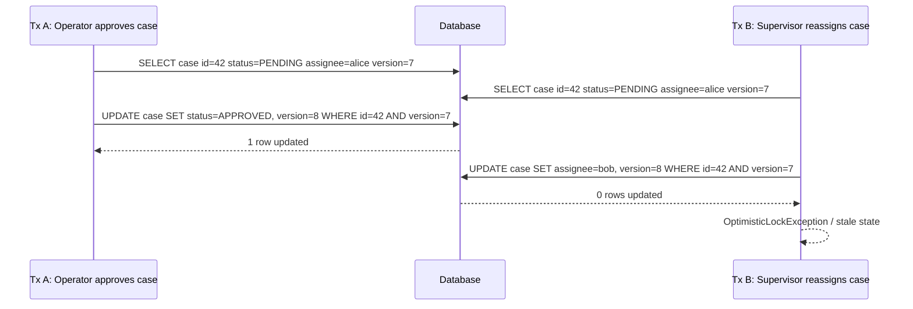
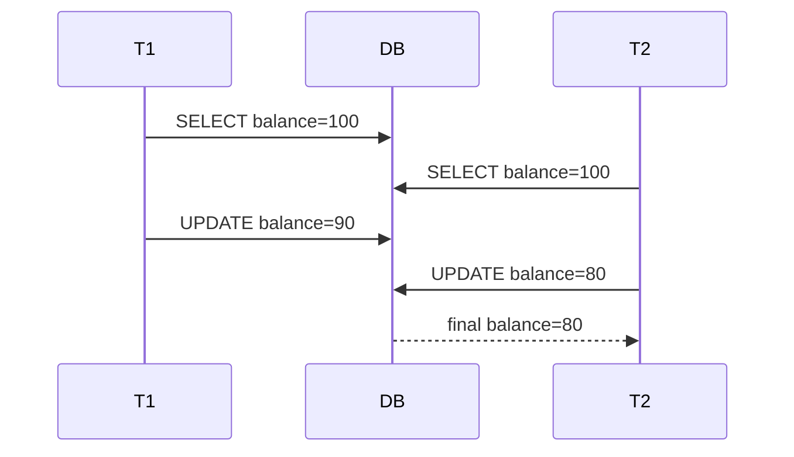
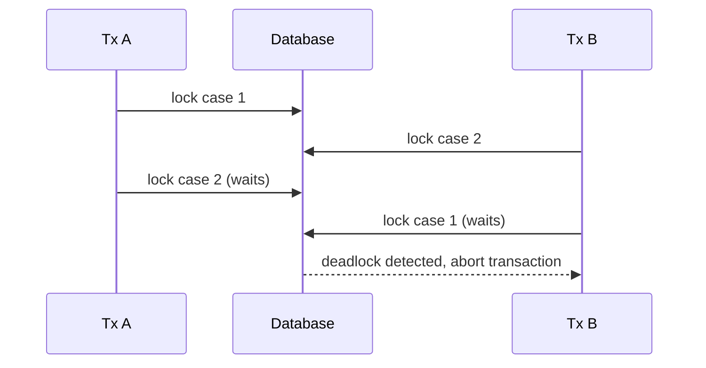

# Part 021 — Locking and Concurrency Control

Locking is where persistence engineering stops being a mapping exercise and becomes a correctness exercise.

At small scale, an application often appears correct because only one user touches a row at a time. At production scale, the real system is closer to this:

- two operators open the same enforcement case;
- one user approves while another rejects;
- a scheduler allocates a workload while a supervisor manually reassigns it;
- a retry worker consumes an event while the request thread is still committing;
- two transactions both see capacity available and both reserve it;
- a background reconciliation job updates rows that a user is editing;
- a read-modify-write command is retried after a timeout without idempotency.

JPA does not remove those problems. JPA gives you mechanisms to express some of the concurrency contract. The database still enforces the final truth.

This part focuses on **row-level concurrency control through JPA/Hibernate**:

1. optimistic locking;
2. pessimistic locking;
3. version columns;
4. lost update prevention;
5. stale write handling;
6. retry semantics;
7. lock timeouts;
8. production failure modelling.

The next part, Part 022, goes deeper into **transaction isolation and anomaly modelling**: dirty reads, non-repeatable reads, phantom reads, write skew, snapshot isolation, and serializability.

---

## 1. Kaufman Framing: Deconstruct the Skill

Josh Kaufman's method starts by decomposing a skill into smaller subskills. For persistence concurrency, the subskills are not “memorize lock modes”. The real skill is the ability to answer these questions quickly:

| Question | Why It Matters |
|---|---|
| What state can be concurrently modified? | Defines the conflict domain. |
| Is the conflict row-based or predicate-based? | Determines whether `@Version` is enough. |
| Is stale data acceptable, rejectable, or mergeable? | Determines UX and retry model. |
| Does the command have external side effects? | Determines whether automatic retry is safe. |
| Should contention be rare or expected? | Determines optimistic vs pessimistic strategy. |
| How long is the transaction? | Determines lock duration and deadlock risk. |
| Can the invariant be represented as a database constraint? | Stronger than application-only checks. |
| Can the operation be idempotent? | Makes retry safe after timeout. |

A top-tier engineer does not ask, “Should I use optimistic or pessimistic locking?” in isolation.

They ask:

> What invariant am I protecting, where is it stored, who can violate it, and what failure should the caller observe when the invariant is contested?

---

## 2. Mental Model: Concurrency Is About Interleavings

A single transaction is easy to reason about.

Two transactions interleaving their reads and writes is where bugs live.



The important part is not the exception type. The important part is the **conflict detection predicate**:

```sql
WHERE id = ?
  AND version = ?
```

Without the version predicate, the second update can silently overwrite part of the first transaction's decision.

---

## 3. The Three Levels of Concurrency Control

In JPA-based systems, concurrency control exists at three levels.

| Level | Mechanism | Example | Strength |
|---|---|---|---|
| Application/domain | State machine guard, command precondition | `case.status == PENDING` | Expressive, but not enough alone |
| JPA/provider | `@Version`, `LockModeType`, flush behavior | optimistic/pessimistic lock | Integrates with entity lifecycle |
| Database | isolation level, row lock, unique constraint, FK, check constraint | `SELECT ... FOR UPDATE`, unique key | Final authority |

Correct systems usually combine all three.

Example:

```java
@Transactional
public void approve(CaseId id, UserId actor) {
    EnforcementCase c = repository.getForUpdateIntent(id);

    c.approve(actor); // domain invariant: only PENDING can be approved

    // flush/commit uses @Version to prevent stale update
}
```

The domain method prevents illegal state transition in memory. The JPA version check prevents stale writes. The database transaction makes the write atomic.

---

## 4. Core Failure: Lost Update

A **lost update** happens when two transactions read the same state, both compute a new state, and the later write overwrites the earlier write without detecting conflict.

### 4.1 No Version Column



The `90` update is lost.

For a regulatory case system, replace `balance` with:

- `status`;
- `assignee_id`;
- `priority`;
- `risk_score`;
- `current_stage`;
- `decision_outcome`.

A silent overwrite can become a compliance defect.

### 4.2 With Version Column

```sql
UPDATE enforcement_case
SET status = 'APPROVED', version = version + 1
WHERE id = 42
  AND version = 7;
```

If another transaction has already changed version `7` to `8`, this update affects zero rows. Hibernate interprets that as a stale update.

---

## 5. Optimistic Locking

Optimistic locking assumes conflicts are possible but not constant. It lets transactions proceed without holding database locks during the whole read-think-write cycle. At write time, it verifies that the entity was not changed since it was read.

In JPA, this is usually implemented with `@Version`.

```java
@Entity
@Table(name = "enforcement_case")
public class EnforcementCase {

    @Id
    private UUID id;

    @Version
    private long version;

    @Enumerated(EnumType.STRING)
    @Column(nullable = false)
    private CaseStatus status;

    @Column(nullable = false)
    private UUID assigneeId;

    protected EnforcementCase() {
    }

    public void approve(UUID actorId) {
        if (status != CaseStatus.PENDING_REVIEW) {
            throw new IllegalStateException("Only pending review cases can be approved");
        }
        this.status = CaseStatus.APPROVED;
    }
}
```

### 5.1 What `@Version` Protects

`@Version` protects a single entity row from stale updates.

It is good for:

- editing a case summary;
- approving a document version;
- updating a task status;
- changing an assignment row;
- modifying a workflow instance row;
- preventing stale detached DTO updates;
- detecting two users editing the same aggregate root.

It is not enough for every invariant.

It does **not** automatically protect:

- “no more than 10 active cases assigned to one reviewer”;
- “only one active approval task exists per case”;
- “sum of all reservations must not exceed capacity”;
- “no overlapping time window for the same resource”;
- “at least one supervisor remains active in each unit”.

Those are predicate or set-level invariants. They need constraints, locks, serializable isolation, advisory locking, or a different model.

---

## 6. Version Column Design

Use a numeric version column for most systems.

```java
@Version
@Column(nullable = false)
private long version;
```

Recommended database column:

```sql
ALTER TABLE enforcement_case
ADD COLUMN version bigint NOT NULL DEFAULT 0;
```

### 6.1 Numeric Version vs Timestamp Version

| Type | Recommendation | Reason |
|---|---|---|
| `long` / `Long` | Prefer | Simple, monotonic, no clock dependency |
| `int` / `Integer` | Acceptable | Usually enough, but `long` avoids anxiety |
| `Instant` / timestamp | Avoid as default | Clock precision and provider behavior can be surprising |

For distributed systems, numeric versions are easier to reason about than timestamps.

The version is not a business timestamp. It is a concurrency token.

### 6.2 Do Not Let Clients Set Version Arbitrarily

A REST update command may include the version as a precondition:

```json
{
  "caseId": "b6ec10b6-0a04-4d21-9dd4-69c3f1e639b2",
  "expectedVersion": 7,
  "decision": "APPROVE"
}
```

But the application should compare it against the loaded entity or rely on JPA's version check. The client should not be allowed to assign the next version.

Bad:

```java
entity.setVersion(command.nextVersion()); // never do this
```

Good:

```java
if (entity.version() != command.expectedVersion()) {
    throw new StaleCommandException(entity.id(), command.expectedVersion(), entity.version());
}
entity.approve(command.actorId());
```

The database/provider increments the version during flush.

---

## 7. Optimistic Lock Exception Flow

When a stale update is detected, JPA may throw `OptimisticLockException`. Hibernate may expose provider-specific stale object exceptions depending on where the failure appears, usually wrapped by Spring as a data access exception in Spring applications.

Do not design only around the exact exception class. Design around the semantic:

> The command was based on an older version of state than the current committed state.

### 7.1 Service-Level Handling

```java
@Transactional
public void updatePriority(UpdatePriorityCommand command) {
    EnforcementCase c = caseRepository.findById(command.caseId())
        .orElseThrow(() -> new CaseNotFoundException(command.caseId()));

    if (c.version() != command.expectedVersion()) {
        throw new StaleCommandException(command.caseId(), command.expectedVersion(), c.version());
    }

    c.changePriority(command.newPriority(), command.actorId());
}
```

This gives a cleaner business error before flush.

But it is not a substitute for `@Version`. Another transaction can still change the row after this check but before commit.

You need both:

1. early version check for user-friendly error;
2. database update version predicate for final correctness.

---

## 8. Retry Is Not Always Correct

A common mistake is to treat optimistic locking as something to retry blindly.

```java
@Retryable(OptimisticLockException.class)
public void approveCase(...) {
    // dangerous if approval sends external message or records decision side effect
}
```

Automatic retry is safe only when the command is:

- idempotent;
- deterministic against fresh state;
- free from non-repeatable external side effects;
- semantically acceptable if recomputed.

### 8.1 Retry Decision Matrix

| Operation | Retry Automatically? | Reason |
|---|---:|---|
| Increment view counter | Usually yes | Commutative, low business risk |
| Add idempotent tag with unique key | Maybe | Safe if duplicate prevented |
| Approve enforcement case | Usually no | Human decision should see latest state |
| Reserve scarce capacity | Carefully | Must re-evaluate availability |
| Publish external event | No, unless outbox/idempotent | Risk of duplicate side effect |
| Recalculate derived score | Usually yes | Derived, recomputable |

A stale write is often not an infrastructure error. It is a business conflict.

---

## 9. Optimistic Locking in REST/API Design

For APIs, optimistic locking maps naturally to conditional update.

Common approaches:

1. explicit `expectedVersion` field in command payload;
2. HTTP `ETag` and `If-Match`;
3. hidden form version field in server-rendered UI;
4. message version in event-driven command.

Example response:

```http
HTTP/1.1 200 OK
ETag: "case-42-v7"
Content-Type: application/json
```

Update:

```http
PATCH /cases/42
If-Match: "case-42-v7"
Content-Type: application/json
```

If current version is already `8`, return:

```http
HTTP/1.1 412 Precondition Failed
Content-Type: application/json
```

```json
{
  "code": "STALE_RESOURCE",
  "message": "The case was modified by another transaction.",
  "expectedVersion": 7,
  "currentVersion": 8
}
```

For business applications, `409 Conflict` is also common. The important thing is that the API communicates stale state explicitly.

---

## 10. `LockModeType` Overview

JPA exposes lock modes through `LockModeType`.

Important modes:

| Lock Mode | Category | Meaning |
|---|---|---|
| `OPTIMISTIC` | Optimistic | Ensure version check occurs for versioned entity |
| `OPTIMISTIC_FORCE_INCREMENT` | Optimistic | Version check and force version increment |
| `PESSIMISTIC_READ` | Pessimistic | Shared/read lock where supported |
| `PESSIMISTIC_WRITE` | Pessimistic | Exclusive/write lock where supported |
| `PESSIMISTIC_FORCE_INCREMENT` | Pessimistic + version | Acquire pessimistic lock and increment version for versioned entity |
| `NONE` | None | No explicit lock mode |

Legacy aliases exist:

- `READ` usually maps to `OPTIMISTIC`;
- `WRITE` usually maps to `OPTIMISTIC_FORCE_INCREMENT`.

Prefer the explicit optimistic names in new code.

---

## 11. Where Locks Are Requested

JPA lets you request locks from several places.

### 11.1 `find` with Lock Mode

```java
EnforcementCase c = entityManager.find(
    EnforcementCase.class,
    caseId,
    LockModeType.PESSIMISTIC_WRITE
);
```

### 11.2 `lock` Managed Entity

```java
EnforcementCase c = entityManager.find(EnforcementCase.class, caseId);
entityManager.lock(c, LockModeType.OPTIMISTIC_FORCE_INCREMENT);
```

The entity must be managed.

### 11.3 Query Lock Mode

```java
TypedQuery<EnforcementCase> query = entityManager.createQuery("""
    select c
    from EnforcementCase c
    where c.id = :id
    """, EnforcementCase.class);

query.setParameter("id", caseId);
query.setLockMode(LockModeType.PESSIMISTIC_WRITE);

EnforcementCase c = query.getSingleResult();
```

### 11.4 Spring Data JPA `@Lock`

```java
public interface CaseRepository extends JpaRepository<EnforcementCase, UUID> {

    @Lock(LockModeType.PESSIMISTIC_WRITE)
    @Query("select c from EnforcementCase c where c.id = :id")
    Optional<EnforcementCase> findByIdForUpdate(@Param("id") UUID id);
}
```

Repository methods can express lock intent, but the service still owns the transaction boundary.

---

## 12. Pessimistic Locking

Pessimistic locking assumes contention is likely or the cost of conflict is high. It asks the database to lock rows so that conflicting transactions wait, fail, or skip depending on database and configuration.

A typical SQL shape is:

```sql
SELECT *
FROM enforcement_case
WHERE id = ?
FOR UPDATE;
```

JPA abstracts this through `PESSIMISTIC_WRITE`.

### 12.1 When Pessimistic Locking Makes Sense

Use pessimistic locking when:

- conflict is common;
- retry is expensive;
- user action must reserve state while processing;
- only one worker should claim a task;
- stock/capacity is scarce;
- state transition must serialize on a specific row;
- external side effects depend on exclusive ownership.

Examples:

- claim next pending work item;
- reserve a limited license slot;
- assign a case to exactly one active reviewer;
- generate a sequence-like business number;
- process a payment authorization record;
- transition a saga instance step.

### 12.2 When Pessimistic Locking Is Dangerous

Pessimistic locking is dangerous when:

- transaction is long;
- user interaction happens inside the transaction;
- remote calls happen while the lock is held;
- many rows are locked without deterministic order;
- index is missing, causing more rows to be locked/scanned than expected;
- timeout is not configured;
- deadlock handling is absent.

Never hold a database lock while waiting for a human.

Bad:

```java
@Transactional
public ApprovalForm openApprovalScreen(UUID caseId) {
    EnforcementCase c = repository.findByIdForUpdate(caseId).orElseThrow();
    return formMapper.toForm(c); // user may take 10 minutes after this
}
```

The transaction usually ends when the method returns, so this exact example may not hold the lock after response. But the conceptual anti-pattern is important: do not design workflows that require keeping DB locks across user think time. Use optimistic version tokens instead.

---

## 13. Pessimistic Read vs Write

`PESSIMISTIC_READ` is intended for shared locking: prevent dirty/non-repeatable changes while allowing other readers.

`PESSIMISTIC_WRITE` is intended for exclusive locking: prevent other transactions from updating or locking the row incompatibly.

Reality depends on database dialect. Some databases do not have a distinct shared row lock mode that maps neatly to JPA. Hibernate may translate lock modes differently per dialect.

Practical rule:

- use `PESSIMISTIC_WRITE` for command paths that will modify the row;
- avoid relying on `PESSIMISTIC_READ` semantics unless you have verified generated SQL and database behavior;
- test lock behavior with real database integration tests, not H2-only tests.

---

## 14. Lock Timeout

Locks without timeouts can turn contention into thread pool exhaustion.

JPA supports lock timeout hints, though provider/database support varies.

```java
Map<String, Object> hints = Map.of(
    "jakarta.persistence.lock.timeout", 2_000
);

EnforcementCase c = entityManager.find(
    EnforcementCase.class,
    caseId,
    LockModeType.PESSIMISTIC_WRITE,
    hints
);
```

Spring Data JPA example:

```java
public interface CaseRepository extends JpaRepository<EnforcementCase, UUID> {

    @Lock(LockModeType.PESSIMISTIC_WRITE)
    @QueryHints({
        @QueryHint(name = "jakarta.persistence.lock.timeout", value = "2000")
    })
    @Query("select c from EnforcementCase c where c.id = :id")
    Optional<EnforcementCase> findByIdForUpdate(@Param("id") UUID id);
}
```

Design the failure response deliberately:

| Situation | Suggested Response |
|---|---|
| User command lock timeout | `409 Conflict` or `423 Locked` style domain error |
| Worker claim timeout | skip/retry later |
| Internal batch lock timeout | retry with backoff and observability |
| Payment-like command | reconcile with idempotency key before retry |

---

## 15. Deadlocks

Deadlock happens when two transactions wait on each other.



Deadlocks are not always a sign that the database is broken. They are often a sign that the application locks resources in inconsistent order.

### 15.1 Deadlock Prevention Rules

1. Lock rows in deterministic order.
2. Keep transactions short.
3. Do not perform remote calls inside lock-holding transactions.
4. Ensure queries use indexes.
5. Avoid locking broad predicates unless necessary.
6. Use bounded timeouts.
7. Treat deadlock victim errors as retryable only if command is safe to retry.

Example deterministic locking:

```java
@Transactional
public void mergeCases(UUID firstCaseId, UUID secondCaseId) {
    List<UUID> orderedIds = Stream.of(firstCaseId, secondCaseId)
        .sorted()
        .toList();

    List<EnforcementCase> cases = repository.findAllByIdForUpdate(orderedIds);

    // perform merge after locks are acquired in stable order
}
```

Repository:

```java
@Lock(LockModeType.PESSIMISTIC_WRITE)
@Query("""
    select c
    from EnforcementCase c
    where c.id in :ids
    order by c.id
    """)
List<EnforcementCase> findAllByIdForUpdate(@Param("ids") List<UUID> ids);
```

---

## 16. Force Increment Lock Modes

`OPTIMISTIC_FORCE_INCREMENT` and `PESSIMISTIC_FORCE_INCREMENT` are useful when you need to signal that an aggregate root changed even if only a child or related decision changed.

Example:

```java
@Transactional
public void addComment(UUID caseId, String text, UUID actorId) {
    EnforcementCase c = entityManager.find(
        EnforcementCase.class,
        caseId,
        LockModeType.OPTIMISTIC_FORCE_INCREMENT
    );

    c.addComment(text, actorId);
}
```

Why force increment?

- A case detail screen may show case version.
- Adding a comment changes the perceived aggregate state.
- A user editing the case from an older version should be warned.

Without force increment, a child insert may not update the root version depending on mapping and provider behavior.

Use it intentionally. Do not force version increments everywhere.

---

## 17. Aggregate Root Versioning

A common domain-driven design question:

> Should each child entity have its own `@Version`, or should the aggregate root version represent the whole aggregate?

Answer: it depends on the conflict model.

### 17.1 Root Version Only

Good when the aggregate is edited as one consistency boundary.

```java
@Entity
public class EnforcementCase {
    @Id
    private UUID id;

    @Version
    private long version;

    @OneToMany(mappedBy = "caseRef", cascade = CascadeType.ALL, orphanRemoval = true)
    private List<CaseNote> notes = new ArrayList<>();
}
```

Pros:

- simple stale edit detection;
- aligns with aggregate boundary;
- easier API version token.

Cons:

- unrelated child edits conflict;
- high-contention aggregate may become bottleneck.

### 17.2 Child Versions

Good when child records are independently edited.

```java
@Entity
public class CaseTask {
    @Id
    private UUID id;

    @Version
    private long version;

    @ManyToOne(fetch = FetchType.LAZY, optional = false)
    private EnforcementCase caseRef;
}
```

Pros:

- finer conflict granularity;
- better for large collaborative graphs.

Cons:

- aggregate-level invariant needs additional protection;
- UI/API must track multiple versions;
- conflict semantics become more complex.

### 17.3 Practical Rule

Use root version when the aggregate is small and commands are aggregate-scoped.

Use child versions when child lifecycle is independent and high-concurrency.

Use database constraints or locks for invariants that cross rows.

---

## 18. The `merge()` Concurrency Trap

`EntityManager.merge()` copies detached state into a managed entity. It is not a magical safe update operation.

Bad update flow:

```java
@Transactional
public void update(CaseDto dto) {
    EnforcementCase detached = mapper.toEntity(dto);
    entityManager.merge(detached);
}
```

Problems:

- DTO may not include all fields;
- nulls may overwrite managed state;
- stale version handling may happen late;
- associations may be replaced accidentally;
- client controls too much entity shape;
- business invariants are bypassed.

Prefer command methods on a loaded aggregate:

```java
@Transactional
public void changePriority(ChangePriorityCommand command) {
    EnforcementCase c = repository.findById(command.caseId())
        .orElseThrow();

    if (c.version() != command.expectedVersion()) {
        throw new StaleCommandException(command.caseId());
    }

    c.changePriority(command.priority(), command.actorId());
}
```

This preserves invariants and lets JPA dirty checking update only the modified managed entity.

---

## 19. Contention Strategy Selection

### 19.1 Optimistic First

Use optimistic locking by default for typical human workflows:

- case edits;
- approval decisions;
- document metadata updates;
- task status changes;
- profile edits;
- configuration changes.

Why?

- transactions stay short;
- no long lock waits;
- conflict is visible to user;
- scales better for mostly independent edits.

### 19.2 Pessimistic for Claims and Scarcity

Use pessimistic locking when the operation is a claim/reservation:

- claim next task;
- reserve inventory;
- allocate capacity;
- process unhandled event;
- transition singleton workflow state.

Example worker claim:

```java
@Transactional
public Optional<WorkItem> claimNext(UUID workerId) {
    return workItemRepository.findNextPendingForUpdate()
        .map(item -> {
            item.claim(workerId);
            return item;
        });
}
```

But many systems are better served by database-specific `SKIP LOCKED` for work queues. JPA standard does not model every queue-locking feature cleanly. For high-throughput worker queues, native SQL may be clearer.

---

## 20. Case Assignment Example

Suppose an enforcement platform requires:

> A case can be assigned to exactly one active reviewer. Two supervisors may attempt reassignment concurrently.

Entity:

```java
@Entity
@Table(name = "enforcement_case")
public class EnforcementCase {
    @Id
    private UUID id;

    @Version
    private long version;

    @Column(nullable = false)
    private UUID assigneeId;

    @Enumerated(EnumType.STRING)
    @Column(nullable = false)
    private CaseStatus status;

    public void reassign(UUID newAssigneeId, UUID actorId) {
        if (status.isClosed()) {
            throw new IllegalStateException("Closed cases cannot be reassigned");
        }
        this.assigneeId = newAssigneeId;
    }
}
```

Service:

```java
@Transactional
public void reassign(ReassignCaseCommand command) {
    EnforcementCase c = repository.findById(command.caseId())
        .orElseThrow();

    if (c.version() != command.expectedVersion()) {
        throw new StaleCommandException(command.caseId());
    }

    c.reassign(command.newAssigneeId(), command.actorId());
}
```

This is optimistic locking. It is appropriate if concurrent reassignment is rare and the loser can reload.

If supervisors frequently race on the same case, use pessimistic locking:

```java
@Transactional
public void reassignWithLock(ReassignCaseCommand command) {
    EnforcementCase c = repository.findByIdForUpdate(command.caseId())
        .orElseThrow();

    c.reassign(command.newAssigneeId(), command.actorId());
}
```

But do not hold the lock while asking the supervisor to choose a reviewer. Lock only during the final command.

---

## 21. Inventory Reservation Example

Inventory reservation is harder than single-row case editing.

Bad naive flow:

```java
@Transactional
public void reserve(UUID skuId, int quantity) {
    Inventory inv = repository.findBySkuId(skuId).orElseThrow();

    if (inv.available() < quantity) {
        throw new InsufficientInventoryException(skuId);
    }

    inv.reserve(quantity);
}
```

With `@Version`, concurrent updates to the same inventory row are detected. That may be enough if all availability is stored on one row.

But if availability is computed from many reservation rows:

```sql
SELECT capacity - SUM(quantity)
FROM reservation
WHERE sku_id = ?
  AND status = 'ACTIVE';
```

Then `@Version` on one reservation row does not protect the set-level invariant. You need a stronger strategy:

1. lock a parent inventory row;
2. use a constraint/exclusion constraint where available;
3. serialize through a single aggregate row;
4. use serializable isolation with retry;
5. use an atomic conditional update.

Example atomic update:

```sql
UPDATE inventory
SET reserved = reserved + :quantity
WHERE sku_id = :skuId
  AND capacity - reserved >= :quantity;
```

If updated row count is zero, reservation fails.

This is often better than loading an entity and doing a read-modify-write in Java.

---

## 22. Approval Workflow Example

Consider invariant:

> A case can have at most one final decision.

Optimistic locking on `case` works if final decision is stored on the case row:

```java
case.approve(actorId);
```

But if decisions are inserted into a separate table:

```sql
case_decision(id, case_id, decision_type, final_flag)
```

Two transactions may both see no final decision and insert one.

Add a database constraint:

```sql
CREATE UNIQUE INDEX uq_one_final_decision_per_case
ON case_decision(case_id)
WHERE final_flag = true;
```

Then handle unique violation as a business conflict.

JPA locking should not replace database constraints for invariants that the database can express exactly.

---

## 23. Locking and Flush Timing

Lock behavior interacts with flush.

Example:

```java
@Transactional
public void process(UUID caseId) {
    EnforcementCase c = repository.findById(caseId).orElseThrow();
    c.markProcessing();

    List<CaseTask> tasks = taskRepository.findOpenTasks(caseId);

    // query may trigger flush before this line depending on flush mode
}
```

A query may trigger flush before it executes. That means updates may hit the database earlier than you expect.

This matters because:

- optimistic lock failure may happen before commit;
- constraint violation may happen during a read query;
- pessimistic lock acquisition may happen after pending updates flush;
- deadlock order may be changed by flush order.

When debugging locking issues, always inspect generated SQL order.

---

## 24. Locking and Open Session in View

Open Session in View can keep persistence context open beyond service boundary. It should not be used as a concurrency strategy.

Problems:

- lazy loading from view hides query boundaries;
- stale data can be rendered without explicit version thinking;
- accidental entity mutation outside intended command path becomes easier;
- transaction and persistence context lifetime become conceptually blurred.

For write paths, prefer:

1. load aggregate inside transaction;
2. check command precondition/version;
3. apply domain method;
4. commit;
5. return DTO with new version.

---

## 25. Locking and Event Publication

Do not publish external events before the transaction commits.

Bad:

```java
@Transactional
public void approve(UUID caseId) {
    EnforcementCase c = repository.findById(caseId).orElseThrow();
    c.approve();

    kafka.send("case-approved", new CaseApproved(caseId)); // dangerous
}
```

If commit later fails due to optimistic locking, the event was already sent.

Use transactional outbox:

```java
@Transactional
public void approve(UUID caseId) {
    EnforcementCase c = repository.findById(caseId).orElseThrow();
    c.approve();

    outboxRepository.save(OutboxEvent.caseApproved(caseId));
}
```

The outbox event is committed or rolled back with the entity state.

Part 030 covers this in depth.

---

## 26. Locking in Batch Jobs

Batch jobs often create hidden concurrency bugs because they touch many rows.

Bad:

```java
@Transactional
public void expireAllOldCases() {
    List<EnforcementCase> cases = repository.findOldCases();
    cases.forEach(EnforcementCase::expire);
}
```

Problems:

- huge persistence context;
- long transaction;
- many locks held until commit;
- high deadlock risk;
- hard rollback;
- version conflicts late in the job.

Better:

```java
public void expireOldCases() {
    ScrollPosition position = ScrollPosition.offset();

    while (true) {
        List<UUID> ids = repository.findOldCaseIds(position, 500);
        if (ids.isEmpty()) {
            return;
        }

        transactionTemplate.executeWithoutResult(tx -> expireChunk(ids));
        position = position.advanceBy(ids.size());
    }
}

private void expireChunk(List<UUID> ids) {
    List<EnforcementCase> cases = repository.findAllById(ids);
    cases.forEach(EnforcementCase::expireIfStillEligible);
}
```

For pure set-based changes, bulk SQL may be better, but remember bulk updates bypass the persistence context and may bypass entity lifecycle logic.

---

## 27. Testing Lock Behavior

Do not rely on unit tests for concurrency correctness. Use integration tests against the real database engine.

### 27.1 Optimistic Lock Test Shape

```java
@Test
void staleUpdateFails() {
    UUID id = seedCase();

    TransactionTemplate tx1 = new TransactionTemplate(txManager);
    TransactionTemplate tx2 = new TransactionTemplate(txManager);

    EnforcementCase stale = tx1.execute(status ->
        entityManager.find(EnforcementCase.class, id)
    );

    tx2.executeWithoutResult(status -> {
        EnforcementCase fresh = entityManager.find(EnforcementCase.class, id);
        fresh.changePriority(Priority.HIGH, actorId);
    });

    assertThatThrownBy(() -> tx1.executeWithoutResult(status -> {
        EnforcementCase managed = entityManager.merge(stale);
        managed.changePriority(Priority.LOW, actorId);
    })).isInstanceOf(Exception.class);
}
```

The exact exception may depend on framework wrapping. Assert semantics when possible.

### 27.2 Pessimistic Lock Test Shape

Use two transactions and a latch:

```java
@Test
void secondTransactionTimesOutWhenRowLocked() throws Exception {
    CountDownLatch locked = new CountDownLatch(1);
    CountDownLatch release = new CountDownLatch(1);

    Future<?> first = executor.submit(() -> txTemplate.executeWithoutResult(tx -> {
        repository.findByIdForUpdate(caseId).orElseThrow();
        locked.countDown();
        await(release);
    }));

    locked.await();

    assertThatThrownBy(() -> txTemplate.executeWithoutResult(tx -> {
        repository.findByIdForUpdateWithTimeout(caseId).orElseThrow();
    })).isInstanceOf(Exception.class);

    release.countDown();
    first.get();
}
```

These tests are slow but valuable for critical paths.

---

## 28. Common Anti-Patterns

### 28.1 No `@Version` on Mutable Entities

Mutable command-side entities without `@Version` are unsafe by default.

Exception: append-only immutable rows where updates never occur.

### 28.2 Blind `save(dto.toEntity())`

This converts stale DTOs into overwrites.

Prefer loading the managed entity and applying command methods.

### 28.3 Retrying Business Conflicts Automatically

Optimistic lock conflict may require user re-evaluation, not automatic retry.

### 28.4 Pessimistic Lock Around Remote Calls

Never do this:

```java
@Transactional
public void approveAndNotify(UUID caseId) {
    Case c = repository.findByIdForUpdate(caseId).orElseThrow();
    c.approve();
    externalNotificationClient.send(...); // lock held during remote call
}
```

Use outbox.

### 28.5 Locking Without Indexes

A pessimistic lock query without a proper index may scan and lock more than expected.

Always review execution plan.

### 28.6 Assuming H2 Lock Behavior Equals Production

H2 is not PostgreSQL, Oracle, MySQL, or SQL Server. Locking tests must run on the production-class database engine.

### 28.7 Using `CascadeType.ALL` as Concurrency Strategy

Cascade controls lifecycle propagation. It does not solve concurrent modification correctness.

### 28.8 Using `synchronized` for Database State

Java locks protect one JVM process. They do not protect multiple app instances or database clients.

---

## 29. Observability for Locking

Locking bugs are hard to diagnose without telemetry.

Track:

- optimistic lock failure count by entity/command;
- pessimistic lock wait time;
- lock timeout count;
- deadlock victim count;
- transaction duration;
- SQL statement duration;
- retry attempts;
- command idempotency key;
- DB connection pool wait time.

Example metrics:

```text
persistence.optimistic_lock.conflicts{entity="EnforcementCase",command="ApproveCase"}
persistence.pessimistic_lock.timeout{entity="WorkItem",command="ClaimNext"}
persistence.transaction.duration{command="ReassignCase"}
persistence.deadlock.victim{database="postgresql"}
```

A rising optimistic conflict rate may mean:

- expected contention increased;
- UI allows stale tabs for too long;
- aggregate boundary is too coarse;
- batch job competes with online traffic;
- business process changed.

---

## 30. Decision Checklist

Before choosing a concurrency strategy, answer:

1. What exact invariant is protected?
2. Is it row-level, aggregate-level, or set-level?
3. Is conflict rare or common?
4. Can loser safely retry automatically?
5. Does command perform external side effects?
6. Is user expected to re-evaluate latest state?
7. How long is the transaction?
8. What lock timeout is acceptable?
9. What exception maps to what API response?
10. Do tests verify behavior on the real database?

---

## 31. Minimal Production Defaults

For most enterprise JPA applications:

1. Put `@Version` on all mutable aggregate roots.
2. Do not expose entities directly to API clients.
3. Use expected version or ETag on user-facing updates.
4. Handle stale state as a first-class business conflict.
5. Use pessimistic locks only for short claim/reservation sections.
6. Use lock timeouts.
7. Use deterministic lock order for multi-row operations.
8. Do not call external services inside lock-holding transactions.
9. Use database constraints for invariants the database can express.
10. Test critical concurrency behavior with Testcontainers or equivalent real database tests.

---

## 32. What to Remember

Locking is not about being pessimistic or optimistic. It is about modelling conflict.

`@Version` is the baseline for mutable entities, but it only protects stale updates to versioned rows.

Pessimistic locks are powerful but dangerous. They serialize access by making transactions wait, which means they can also create deadlocks, timeouts, and throughput collapse.

The strongest systems combine:

- domain preconditions;
- version checks;
- database constraints;
- short transactions;
- explicit retry policy;
- idempotency;
- observability.

The real engineering question is always:

> What should happen when two valid actors try to change the same truth at the same time?

If you can answer that clearly, JPA gives you enough tools to implement the answer safely.

---

## References

- Jakarta Persistence 3.2 Specification — Locking, entity lifecycle, persistence context, and `LockModeType` semantics.
- Hibernate ORM User Guide — Locking, optimistic versioning, pessimistic locking, flush, and concurrency behavior.
- Spring Data JPA Reference Documentation — Repository locking with `@Lock` and query method integration.
- Spring Framework Reference Documentation — Declarative transaction semantics and propagation behavior.
