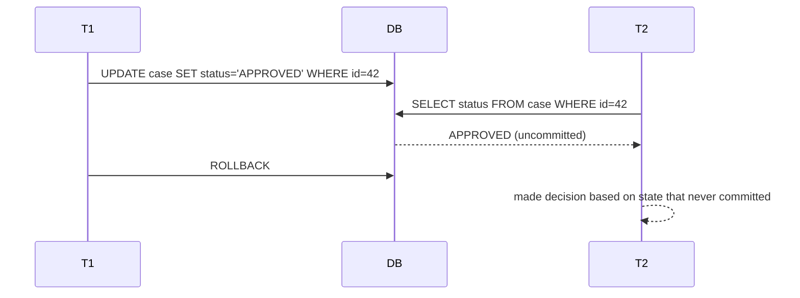
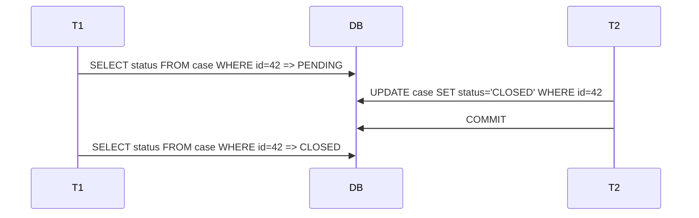
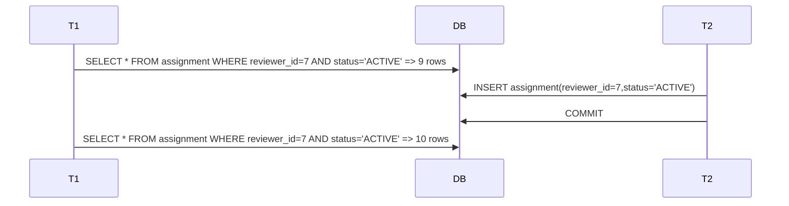
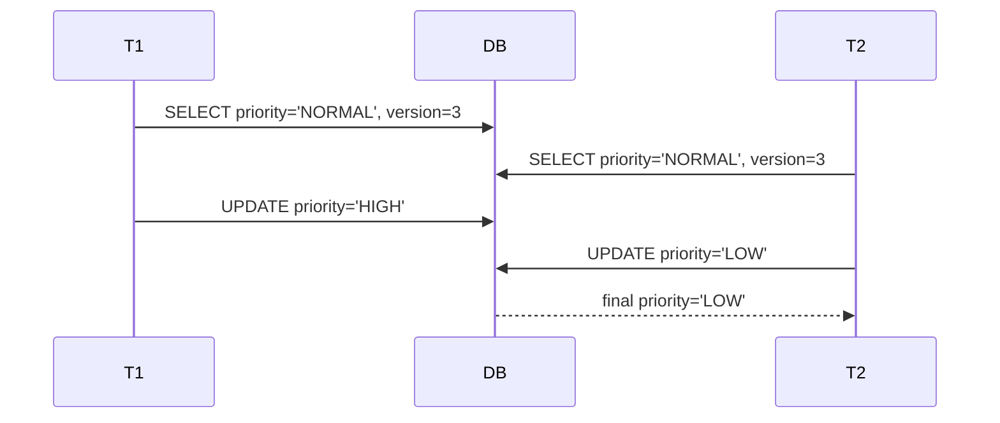
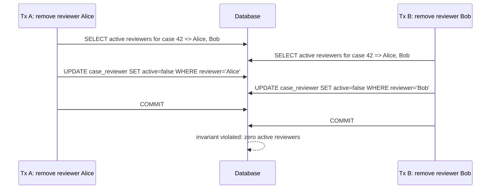
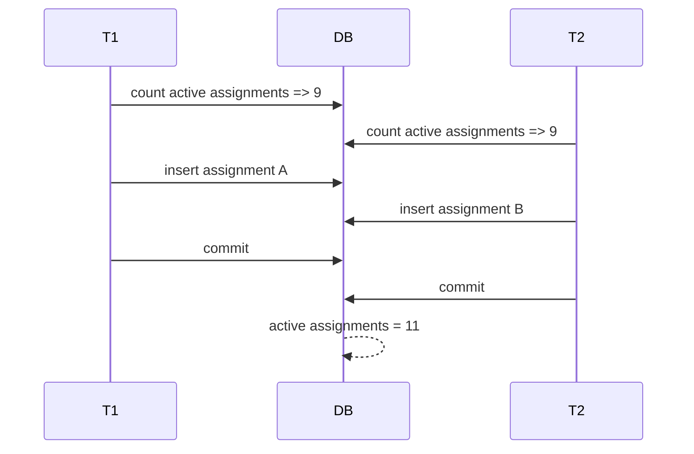

# Part 022 — Isolation Levels and Anomaly Modelling

Part 021 focused on row-level locking through JPA: `@Version`, optimistic locking, pessimistic locking, lock timeout, and stale write handling.

This part goes one level deeper.

Transaction isolation is not an annotation trivia topic. It is a contract about which interleavings of concurrent transactions are allowed.

Most persistence bugs at senior level are not caused by forgetting `@Transactional`. They are caused by assuming the transaction protects more than it actually protects.

Examples:

- “I checked no active approval exists, then inserted one.”
- “I counted reviewer workload, then assigned a case.”
- “I checked capacity, then reserved it.”
- “I loaded a case with tasks, then decided based on the task set.”
- “I assumed repeatable read means serializable.”
- “I thought optimistic locking prevents all race conditions.”

Those assumptions are often false.

This part teaches you to model anomalies deliberately.

---

## 1. Kaufman Framing: Learn Enough to Self-Correct

Kaufman's “learn enough to self-correct” is critical here. You do not need to memorize every database engine's MVCC implementation to be effective. You need enough mental models to detect when your persistence code is making an unsafe assumption.

The skill is the ability to classify a transaction as one of these:

| Transaction Shape | Risk |
|---|---|
| Single-row update with `@Version` | Usually safe from lost update |
| Insert with unique constraint | Safe if invariant maps to constraint |
| Read predicate, then insert/update | Risk of phantom/write skew |
| Count rows, then decide | Risk under weaker isolation |
| Read multiple rows, then update one row | Risk of stale set decision |
| Check absence, then create | Needs unique constraint or serializable/lock |
| Long read transaction with later write | Higher conflict/staleness risk |
| Bulk update bypassing persistence context | ORM state and version risk |

If you can classify transaction shape, you can choose the right protection.

---

## 2. Isolation Is a Database Contract, Not a JPA Feature

JPA participates in transactions, but the database implements isolation.

Spring can request an isolation level:

```java
@Transactional(isolation = Isolation.SERIALIZABLE)
public void assignCase(...) {
    // ...
}
```

But the actual behavior depends on:

- database engine;
- database configuration;
- JDBC driver;
- transaction manager;
- connection pool;
- whether the method starts a new transaction or joins an existing one;
- whether the SQL shape actually triggers the anomaly risk;
- whether indexes support the predicates being protected.

A JPA application cannot be considered correct without understanding the database's isolation semantics.

---

## 3. Core Terminology

### 3.1 Transaction

A transaction groups operations into an atomic unit:

```text
begin
  read rows
  make decision
  write rows
commit or rollback
```

### 3.2 Schedule

A schedule is the interleaving of operations from multiple transactions.

```text
T1: read A
T2: read A
T1: write A
T2: write A
T1: commit
T2: commit
```

### 3.3 Anomaly

An anomaly is a schedule that produces a result that violates the consistency expectation of the application.

The database may allow the schedule under a given isolation level.

### 3.4 Serializability

A serializable schedule behaves as if transactions executed one at a time in some order.

This does not mean the database literally runs them one at a time. It means the result is equivalent to a serial order.

---

## 4. Isolation Levels: High-Level View

The common SQL isolation names are:

| Isolation Level | General Idea |
|---|---|
| Read Uncommitted | May allow dirty reads in theory; many MVCC databases still prevent them |
| Read Committed | Each statement sees committed data as of statement start |
| Repeatable Read | Re-reading the same data in a transaction is stable in many DBs |
| Serializable | Result should be equivalent to some serial execution |

Do not assume every database implements these names identically.

For example, PostgreSQL's `Read Uncommitted` behaves like `Read Committed`, and PostgreSQL's `Repeatable Read` is snapshot-based and stronger than the minimum SQL standard in some ways. MySQL/InnoDB, Oracle, SQL Server, and PostgreSQL have different details.

Engineering rule:

> Isolation level names are portable vocabulary, not portable behavior.

---

## 5. Why ORM Makes Isolation Feel Safer Than It Is

JPA gives you a persistence context. It can make object reads look stable because the same entity identity returns the same Java instance inside one persistence context.

```java
Case a = entityManager.find(Case.class, id);
Case b = entityManager.find(Case.class, id);
assert a == b;
```

This identity stability is not the same as database serializability.

The persistence context can hide some changes from your Java code, but it cannot protect arbitrary database predicates.

Example:

```java
long activeCount = repository.countActiveAssignments(reviewerId);

if (activeCount < 10) {
    repository.save(new Assignment(reviewerId, caseId));
}
```

Even if your loaded entities are stable, another transaction can insert a new assignment matching the same predicate.

---

## 6. Dirty Read

A dirty read happens when a transaction reads data written by another transaction that has not committed.



Most production-grade relational databases prevent dirty reads under their default isolation levels. But the concept is still useful because it teaches the boundary:

> A transaction should not make decisions based on state that might disappear.

In Java persistence systems, dirty read is less common than lost update, phantom, and write skew.

---

## 7. Non-Repeatable Read

A non-repeatable read happens when a transaction reads the same row twice and sees different committed values because another transaction committed between the reads.



Under `READ_COMMITTED`, this is often allowed because each statement sees a fresh committed snapshot.

In JPA, the first-level cache can complicate observation:

```java
Case c1 = entityManager.find(Case.class, id);
Case c2 = entityManager.find(Case.class, id);
```

You may still see the same Java object because it is already managed. But a JPQL query, refresh, clear, native SQL, or separate transaction can expose database changes.

Do not confuse persistence context identity with database repeatable read.

---

## 8. Phantom Read

A phantom read happens when a transaction repeats a predicate query and sees a different set of rows because another transaction inserted, deleted, or updated matching rows.



Phantom reads matter for rules based on absence, count, range, or membership:

- no overlapping booking;
- max 10 active assignments;
- no active approval task exists;
- all required checks are complete;
- no sanctions are pending;
- total reservation does not exceed capacity.

`@Version` on one row does not automatically protect a predicate.

---

## 9. Lost Update

Lost update was covered in Part 021, but it belongs in isolation discussions too.



In JPA, `@Version` is the default solution for stale row updates.

```sql
UPDATE enforcement_case
SET priority = ?, version = version + 1
WHERE id = ?
  AND version = ?;
```

But if your update is bulk JPQL or native SQL, version behavior may not be automatic unless you explicitly handle it.

Bad:

```java
@Modifying
@Query("""
    update EnforcementCase c
    set c.priority = :priority
    where c.status = 'PENDING_REVIEW'
    """)
int bulkChangePriority(Priority priority);
```

This bypasses normal entity dirty checking and can bypass version increment semantics depending on query and provider behavior.

For critical command-side updates, prefer entity update or explicit version predicate.

---

## 10. Write Skew

Write skew is the anomaly many engineers miss.

It happens when two transactions read overlapping data, both observe an invariant as satisfied, then update different rows in a way that jointly violates the invariant.

Classic shape:

```text
Invariant: at least one supervisor must remain on duty.

T1 reads: Alice on duty, Bob on duty
T2 reads: Alice on duty, Bob on duty
T1 sets Alice off duty
T2 sets Bob off duty
Both commit
Result: no supervisor on duty
```

No single row was concurrently updated. `@Version` on each supervisor row may not conflict, because T1 updates Alice and T2 updates Bob.

### 10.1 Workflow Example

Invariant:

> A case must always have at least one active reviewer while it is open.

Transactions:



Each transaction updated a different row. Row-level optimistic locking does not catch it.

### 10.2 Solutions

Possible solutions:

1. model the invariant on a single aggregate root row and version that row;
2. lock the parent case row before changing reviewer membership;
3. use a database constraint/trigger if expressible;
4. use serializable isolation and retry serialization failures;
5. redesign command flow to serialize changes through one queue/actor.

Example parent-row lock:

```java
@Transactional
public void removeReviewer(UUID caseId, UUID reviewerId) {
    EnforcementCase c = caseRepository.findByIdForUpdate(caseId)
        .orElseThrow();

    List<CaseReviewer> active = reviewerRepository.findActiveByCaseId(caseId);

    if (active.size() <= 1) {
        throw new CannotRemoveLastReviewerException(caseId);
    }

    reviewerRepository.deactivate(caseId, reviewerId);
}
```

The parent lock serializes all reviewer membership changes for that case.

---

## 11. Read Committed

`READ_COMMITTED` is a common default isolation level.

Mental model:

> Each statement sees data committed before that statement begins.

Consequences:

- dirty reads are generally prevented;
- non-repeatable reads may happen;
- phantoms may happen;
- predicate-based checks can race;
- lost update may still need `@Version` or atomic update patterns;
- write skew is possible unless additional protection exists.

### 11.1 Good Uses

`READ_COMMITTED` is often fine for:

- simple CRUD with `@Version`;
- append-only inserts with unique constraints;
- read-only screens that tolerate slight movement;
- command paths protected by row-level versioning;
- operations where conflict failure is explicit and acceptable.

### 11.2 Dangerous Uses

Be careful with:

```java
if (repository.countActiveAssignments(reviewerId) < 10) {
    repository.save(new Assignment(reviewerId, caseId));
}
```

Two transactions can both count `9`, then both insert, ending at `11`.

Solutions:

- lock a reviewer workload row;
- maintain counter on one versioned row;
- use atomic conditional update;
- use serializable isolation and retry;
- enforce with database constraint if possible.

---

## 12. Repeatable Read

`REPEATABLE_READ` aims to make reads more stable within a transaction. But behavior varies by database.

In MVCC databases, repeatable read often means a transaction sees a snapshot as of transaction start. That prevents many non-repeatable read effects.

However, repeatable read is not automatically a complete invariant-protection mechanism across all databases and all transaction shapes.

### 12.1 Snapshot Trap

Snapshot isolation can make each transaction see a stable world, but two stable worlds can still lead to write skew.

```text
T1 snapshot: Alice and Bob are on duty
T2 snapshot: Alice and Bob are on duty
T1 turns Alice off
T2 turns Bob off
Both commit under snapshot isolation in systems that allow write skew
```

Each transaction's reads were repeatable. The combined outcome still violates the invariant.

---

## 13. Serializable

`SERIALIZABLE` is the isolation level intended to make concurrent transactions behave like some serial order.

This is the strongest general-purpose isolation contract, but it has costs:

- more blocking or aborts;
- possible serialization failures;
- need for retry logic;
- greater sensitivity to query shape and indexes;
- potential throughput reduction under contention.

A serializable transaction can fail at commit even if application code looked correct.

That failure is not a bug. It is the database refusing a non-serializable interleaving.

### 13.1 Retry Requirement

Serializable isolation often requires retry.

```java
public <T> T runSerializableWithRetry(Supplier<T> operation) {
    int attempts = 0;

    while (true) {
        attempts++;
        try {
            return transactionTemplate.execute(status -> operation.get());
        } catch (CannotSerializeTransactionException ex) {
            if (attempts >= 3) {
                throw ex;
            }
            sleepBackoff(attempts);
        }
    }
}
```

Retry is safe only if the operation is idempotent or has no external side effects before commit.

For command handlers with outbox, place side effects in the same transaction as outbox rows, then retry can be safer.

---

## 14. Spring Transaction Isolation

Spring exposes isolation settings on `@Transactional`:

```java
@Transactional(isolation = Isolation.READ_COMMITTED)
public void command() {
}
```

Common values:

| Spring Isolation | Meaning |
|---|---|
| `DEFAULT` | Use database default |
| `READ_UNCOMMITTED` | Request read uncommitted if supported |
| `READ_COMMITTED` | Request read committed |
| `REPEATABLE_READ` | Request repeatable read |
| `SERIALIZABLE` | Request serializable |

Important trap: if a method joins an existing transaction, the inner method's isolation declaration may not take effect the way you expect. The outer transaction already owns the connection and isolation.

Bad assumption:

```java
@Transactional
public void outer() {
    service.innerSerializable(); // may join outer transaction
}

@Transactional(isolation = Isolation.SERIALIZABLE)
public void innerSerializable() {
}
```

If both use default propagation `REQUIRED`, the inner method participates in the outer transaction. It does not necessarily create a new serializable transaction.

If isolation boundary matters, design it explicitly.

---

## 15. Propagation and Isolation Interaction

`REQUIRES_NEW` creates a separate transaction.

```java
@Transactional(propagation = Propagation.REQUIRES_NEW,
               isolation = Isolation.SERIALIZABLE)
public void allocateCapacity(...) {
}
```

But `REQUIRES_NEW` has trade-offs:

- suspends outer transaction;
- uses another database connection;
- can commit independently of outer transaction;
- can create consistency surprises if misused;
- may exhaust connection pool under nested usage.

Do not use `REQUIRES_NEW` merely to force isolation without understanding atomicity consequences.

---

## 16. Pattern: Single-Row Invariant Carrier

Many set-level invariants become easier if represented on one row.

Instead of deriving active assignment count every time:

```sql
SELECT count(*)
FROM assignment
WHERE reviewer_id = ? AND status = 'ACTIVE';
```

Maintain a reviewer workload row:

```sql
reviewer_workload(
  reviewer_id uuid primary key,
  active_count int not null,
  max_count int not null,
  version bigint not null
)
```

Then reserve with optimistic version or atomic conditional update:

```sql
UPDATE reviewer_workload
SET active_count = active_count + 1,
    version = version + 1
WHERE reviewer_id = :reviewerId
  AND active_count < max_count;
```

If updated row count is zero, capacity is unavailable.

This converts a predicate invariant into a row invariant.

---

## 17. Pattern: Unique Constraint for Absence Check

Bad:

```java
if (!repository.existsActiveApproval(caseId)) {
    repository.save(new ApprovalTask(caseId));
}
```

Two transactions can both see absence.

Better:

```sql
CREATE UNIQUE INDEX uq_active_approval_task
ON approval_task(case_id)
WHERE status = 'ACTIVE';
```

Then insertion becomes safe:

```java
try {
    repository.save(new ApprovalTask(caseId));
} catch (DataIntegrityViolationException ex) {
    throw new ActiveApprovalAlreadyExistsException(caseId, ex);
}
```

This is usually stronger and cheaper than high isolation.

---

## 18. Pattern: Parent Row Lock for Child Set Invariant

When the invariant is “membership of child rows for one parent”, lock the parent.

Example:

```java
@Transactional
public void addReviewer(UUID caseId, UUID reviewerId) {
    EnforcementCase c = caseRepository.findByIdForUpdate(caseId)
        .orElseThrow();

    if (reviewerRepository.countActiveByCaseId(caseId) >= c.maxReviewers()) {
        throw new TooManyReviewersException(caseId);
    }

    reviewerRepository.save(CaseReviewer.active(caseId, reviewerId));
}
```

Every command that changes reviewer membership must follow the same parent-lock protocol.

A lock protocol only works if all writers obey it.

---

## 19. Pattern: Atomic Conditional Update

Atomic SQL can be better than ORM read-modify-write.

Example: reserve capacity.

```java
@Modifying
@Query(value = """
    update capacity_bucket
    set reserved = reserved + :amount
    where id = :bucketId
      and reserved + :amount <= capacity
    """, nativeQuery = true)
int tryReserve(@Param("bucketId") UUID bucketId,
               @Param("amount") int amount);
```

Service:

```java
@Transactional
public void reserve(UUID bucketId, int amount) {
    int updated = capacityRepository.tryReserve(bucketId, amount);

    if (updated == 0) {
        throw new InsufficientCapacityException(bucketId);
    }
}
```

This collapses check-and-update into one database operation.

It is not “less object-oriented”. It is the right abstraction when the invariant is naturally relational and atomic.

---

## 20. Pattern: Serializable Section

Use serializable isolation for a small, critical section when:

- invariant is predicate-based;
- constraint cannot express it easily;
- lock protocol would be too complex;
- contention is moderate;
- retry is acceptable.

Example:

```java
@Transactional(isolation = Isolation.SERIALIZABLE)
public void scheduleInspection(UUID inspectorId, TimeRange range) {
    boolean overlaps = inspectionRepository.existsOverlapping(inspectorId, range);

    if (overlaps) {
        throw new OverlappingInspectionException(inspectorId, range);
    }

    inspectionRepository.save(new Inspection(inspectorId, range));
}
```

Still add a database exclusion/unique constraint if your database supports the invariant directly. Serializable is not a replacement for a good constraint.

---

## 21. ORM-Level Trap: First-Level Cache Illusion

Inside one persistence context:

```java
Case c1 = em.find(Case.class, id);
Case c2 = em.find(Case.class, id);
```

`c1 == c2`.

This can create the feeling of stable data. But it only applies to managed entity identity in that persistence context.

It does not mean:

- predicate query result sets are stable;
- child collections are automatically refreshed;
- aggregate invariants are protected;
- native SQL sees the same state;
- other transactions cannot commit conflicting inserts.

Use `refresh`, `clear`, separate transactions, and database-level tests to understand actual behavior.

---

## 22. ORM-Level Trap: Lazy Collection as Decision Source

Bad:

```java
@Transactional
public void closeCase(UUID caseId) {
    EnforcementCase c = repository.findById(caseId).orElseThrow();

    if (c.getOpenTasks().isEmpty()) {
        c.close();
    }
}
```

This decision is based on a collection snapshot. Another transaction may insert an open task concurrently.

Better options:

1. database constraint/state model prevents task insert after close;
2. lock parent case row before checking and closing;
3. make task creation also lock/check parent status;
4. perform conditional update:

```sql
UPDATE enforcement_case c
SET status = 'CLOSED'
WHERE c.id = :caseId
  AND NOT EXISTS (
      SELECT 1
      FROM case_task t
      WHERE t.case_id = c.id
        AND t.status = 'OPEN'
  );
```

Then check affected row count.

---

## 23. ORM-Level Trap: Bulk Updates

Bulk JPQL updates operate directly in the database. They do not update already-managed entities in the persistence context.

```java
@Modifying(clearAutomatically = true)
@Query("""
    update EnforcementCase c
    set c.status = 'EXPIRED'
    where c.deadline < :now
      and c.status = 'PENDING'
    """)
int expirePending(@Param("now") Instant now);
```

Be careful:

- managed entities may become stale;
- entity callbacks may not run;
- version fields may not increment unless explicitly handled;
- domain methods are bypassed;
- audit fields may not update automatically;
- cache invalidation must be considered.

Bulk updates are powerful but should be treated as database operations, not entity operations.

---

## 24. Anomaly Modelling Workflow

Before implementing a command, write down:

1. What rows are read?
2. What predicates are evaluated?
3. What rows are written?
4. What invariant is assumed between read and write?
5. Can another transaction change the answer by updating a different row?
6. Can another transaction change the answer by inserting a matching row?
7. Is the invariant represented as a database constraint?
8. Is the command idempotent if retried?
9. What happens under `READ_COMMITTED`?
10. What test would reproduce the race?

This is more effective than arguing abstractly about isolation levels.

---

## 25. Example: Reviewer Assignment Limit

Requirement:

> A reviewer cannot have more than 10 active cases.

Naive implementation:

```java
@Transactional
public void assign(UUID caseId, UUID reviewerId) {
    long active = assignmentRepository.countActive(reviewerId);

    if (active >= 10) {
        throw new ReviewerAtCapacityException(reviewerId);
    }

    assignmentRepository.save(Assignment.active(caseId, reviewerId));
}
```

Race:



### 25.1 Safer Design A: Workload Counter Row

```sql
UPDATE reviewer_workload
SET active_count = active_count + 1
WHERE reviewer_id = :reviewerId
  AND active_count < 10;
```

Then insert assignment only if update succeeds.

### 25.2 Safer Design B: Pessimistic Lock Reviewer Row

```java
@Transactional
public void assign(UUID caseId, UUID reviewerId) {
    Reviewer reviewer = reviewerRepository.findByIdForUpdate(reviewerId)
        .orElseThrow();

    if (assignmentRepository.countActive(reviewerId) >= reviewer.maxActiveCases()) {
        throw new ReviewerAtCapacityException(reviewerId);
    }

    assignmentRepository.save(Assignment.active(caseId, reviewerId));
}
```

All assignment writers must lock the reviewer row.

### 25.3 Safer Design C: Serializable Transaction

```java
@Transactional(isolation = Isolation.SERIALIZABLE)
public void assign(UUID caseId, UUID reviewerId) {
    long active = assignmentRepository.countActive(reviewerId);
    if (active >= 10) {
        throw new ReviewerAtCapacityException(reviewerId);
    }
    assignmentRepository.save(Assignment.active(caseId, reviewerId));
}
```

Requires retry handling for serialization failures.

---

## 26. Example: No Overlapping Inspection Schedule

Requirement:

> An inspector cannot have overlapping inspections.

Naive implementation:

```java
@Transactional
public void schedule(UUID inspectorId, Instant start, Instant end) {
    boolean overlaps = repository.existsOverlap(inspectorId, start, end);

    if (overlaps) {
        throw new ScheduleConflictException();
    }

    repository.save(new Inspection(inspectorId, start, end));
}
```

Two transactions can both see no overlap and insert overlapping ranges.

Better options:

- exclusion constraint if database supports range constraints;
- serializable transaction with retry;
- lock inspector row before schedule check;
- maintain schedule through a single serialized command handler.

The best choice depends on database capability and write contention.

---

## 27. Example: Close Case If No Open Tasks

Requirement:

> A case may be closed only when it has no open tasks.

Naive JPA collection approach:

```java
@Transactional
public void close(UUID caseId) {
    EnforcementCase c = repository.findById(caseId).orElseThrow();

    if (c.openTasks().isEmpty()) {
        c.close();
    }
}
```

Race:

- T1 sees no open tasks;
- T2 creates an open task;
- T1 closes the case;
- final state: closed case with open task.

Safer approach: lock parent case row and require task creation to also lock/check parent.

```java
@Transactional
public void close(UUID caseId) {
    EnforcementCase c = caseRepository.findByIdForUpdate(caseId).orElseThrow();

    if (taskRepository.existsOpenTask(caseId)) {
        throw new OpenTasksExistException(caseId);
    }

    c.close();
}

@Transactional
public void createTask(UUID caseId, String title) {
    EnforcementCase c = caseRepository.findByIdForUpdate(caseId).orElseThrow();

    if (c.isClosed()) {
        throw new CaseClosedException(caseId);
    }

    taskRepository.save(CaseTask.open(caseId, title));
}
```

The invariant is protected because both close and task creation serialize on the same parent row.

---

## 28. Choosing Isolation vs Lock vs Constraint

| Problem | Preferred Tool |
|---|---|
| Prevent stale edit of one row | `@Version` |
| Ensure only one active row exists | Unique partial index/constraint |
| Prevent over-capacity counter | Atomic conditional update or locked counter row |
| Protect child set membership for one parent | Parent row lock protocol |
| Avoid overlapping time ranges | Exclusion/range constraint or serializable |
| Claim work item | Pessimistic lock / native `SKIP LOCKED` |
| Complex predicate invariant not constraint-friendly | Serializable transaction with retry |
| High-volume derived status update | Bulk SQL with explicit correctness model |

The best persistence designs often reduce the problem to something the database can enforce cheaply.

---

## 29. Testing Isolation Anomalies

You cannot prove isolation correctness with ordinary single-threaded repository tests.

Use two real transactions.

### 29.1 Test Structure

```java
@Test
void reviewerCapacityCanRaceUnderReadCommitted() throws Exception {
    UUID reviewerId = seedReviewerWithActiveAssignments(9);

    CyclicBarrier barrier = new CyclicBarrier(2);

    Callable<Result> tx = () -> transactionTemplate.execute(status -> {
        long active = assignmentRepository.countActive(reviewerId);
        await(barrier);

        if (active < 10) {
            assignmentRepository.save(Assignment.active(UUID.randomUUID(), reviewerId));
            return Result.ASSIGNED;
        }
        return Result.REJECTED;
    });

    Future<Result> a = executor.submit(tx);
    Future<Result> b = executor.submit(tx);

    assertThat(List.of(a.get(), b.get()))
        .containsExactlyInAnyOrder(Result.ASSIGNED, Result.ASSIGNED);

    assertThat(assignmentRepository.countActive(reviewerId)).isEqualTo(11);
}
```

This test demonstrates the bug. Then write a second test demonstrating the chosen fix.

### 29.2 Do Not Hide Race Tests

Concurrency tests are more complex, but they are valuable for:

- capacity allocation;
- financial ledgers;
- case workflow transitions;
- task claiming;
- scheduling;
- regulatory decision state;
- exactly-once-like processing.

Do not test every CRUD method this way. Test invariants that can be violated by interleavings.

---

## 30. Isolation and Performance

Higher isolation is not automatically “better”. It is a trade-off.

| Choice | Correctness | Throughput | Operational Cost |
|---|---|---|---|
| Read committed + constraints | Strong for expressible invariants | High | Low/medium |
| Read committed + `@Version` | Strong for row stale updates | High | Low |
| Pessimistic locking | Strong for locked rows | Medium/low under contention | Medium |
| Serializable | Strong general contract | Can be lower under contention | Medium/high due to retry |
| Application-only check | Weak | Looks high until broken | High incident cost |

Defaulting everything to serializable may not be practical. Defaulting everything to read committed without modelling anomalies is careless.

The senior move is to select the cheapest mechanism that actually protects the invariant.

---

## 31. Production Observability for Isolation Failures

Track:

- serialization failure count;
- deadlock count;
- optimistic conflict count;
- unique constraint conflict count by business operation;
- lock timeout count;
- transaction duration;
- retry count and success rate;
- invariant violation detection after the fact;
- queue claim collision rate;
- conditional update zero-row count.

A zero-row conditional update is not always an error. It may be the expected signal that capacity is unavailable.

Expose it as business telemetry, not only exception telemetry.

---

## 32. Common Anti-Patterns

### 32.1 “We Use Transactions, So It Is Safe”

Transactions give atomicity. Isolation determines which concurrent interleavings are allowed.

A transaction can be atomic and still participate in a write skew anomaly.

### 32.2 “`@Version` Solves Concurrency”

`@Version` solves stale updates to a versioned row. It does not solve all predicate-based invariants.

### 32.3 “Repeatable Read Means Serializable”

Not portable. Understand your database.

### 32.4 “Check Then Insert” Without Constraint

Absence checks race unless backed by a constraint, lock protocol, or serializable transaction.

### 32.5 “Set Isolation on Inner Method”

If the method joins an existing transaction, the isolation may not change.

### 32.6 “Use H2 for Isolation Tests”

Isolation behavior must be tested on the database engine you operate.

### 32.7 “Retry Everything”

Retries can duplicate external side effects or repeat business decisions incorrectly.

### 32.8 “Lock Rows After Reading Predicate”

If the predicate decision was already made before lock acquisition, the race may already have happened. Lock the invariant carrier before the decision.

---

## 33. Review Checklist for Transaction Anomalies

During code review, ask:

1. Does this command read a set and then write based on that set?
2. Does it check absence before insert?
3. Does it count before assigning/reserving?
4. Does it update a different row from the row it used for decision?
5. Is the invariant represented in the database?
6. Would two transactions updating different rows violate the invariant?
7. Is `@Version` present on mutable rows?
8. Are bulk updates bypassing version/domain logic?
9. Is isolation declaration actually applied to the real transaction?
10. Is retry safe and bounded?
11. Are lock/serialization failures observable?
12. Is there an integration test that reproduces the race?

---

## 34. What to Remember

Transaction isolation is about allowed interleavings.

JPA gives you object persistence. It does not eliminate relational concurrency theory.

The most dangerous bugs are not always simultaneous updates to the same row. They are often predicate bugs:

- count then insert;
- check absence then create;
- read set then update one member;
- independently update rows that jointly preserve an invariant.

Use the right tool:

- `@Version` for stale row updates;
- constraints for expressible invariants;
- parent row locks for child set coordination;
- atomic conditional SQL for capacity/counter changes;
- serializable isolation with retry for complex predicate invariants;
- outbox/idempotency for side-effect-safe retry.

The engineering goal is not maximum isolation. The goal is explicit, testable, observable correctness.

---

## References

- Jakarta Persistence 3.2 Specification — transaction integration, locking, persistence context, and entity versioning semantics.
- Hibernate ORM User Guide — optimistic locking, pessimistic locking, flushing, and persistence context behavior.
- PostgreSQL Documentation — transaction isolation, MVCC behavior, repeatable read, and serializable isolation.
- Spring Framework Reference Documentation — declarative transaction isolation and propagation behavior.
