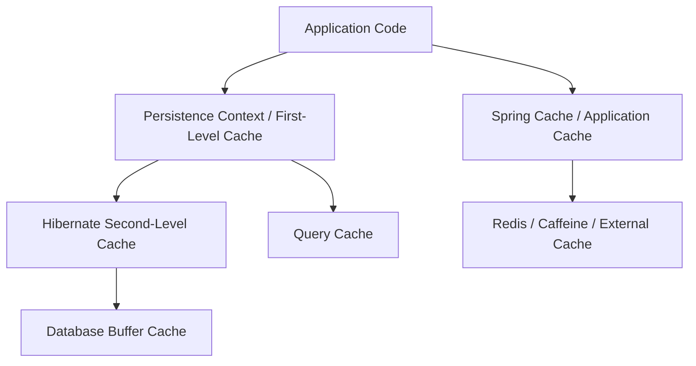
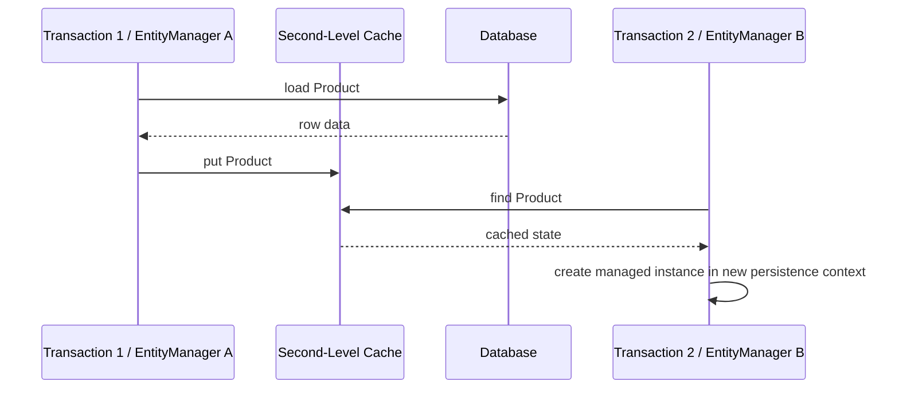
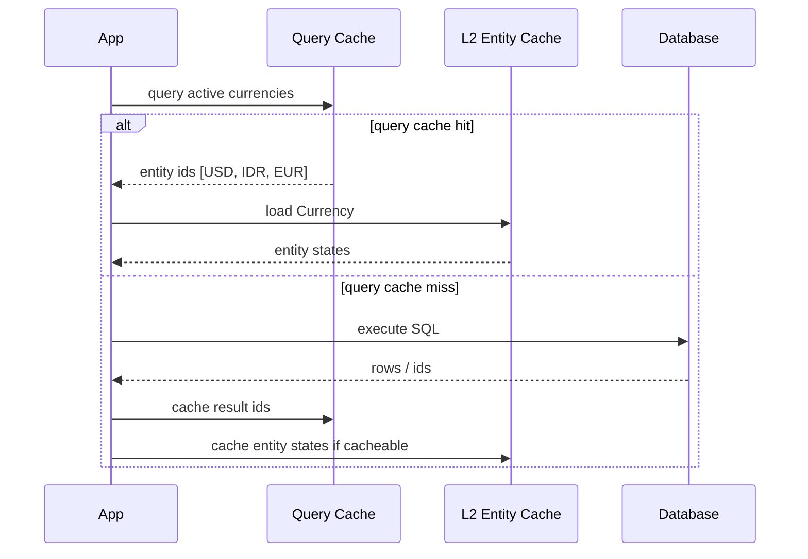
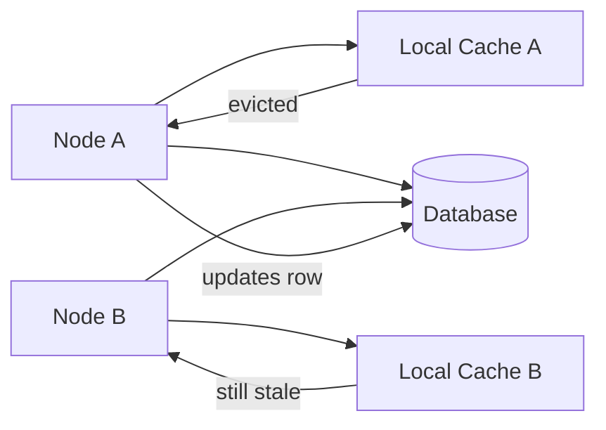
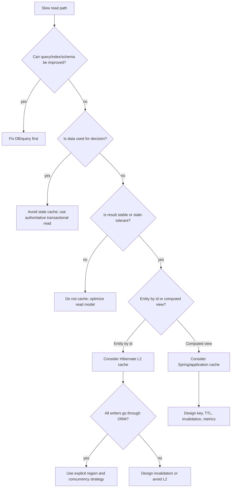

# Part 023 — Caching Strategy: First-Level, Second-Level, Query Cache

Part 022 covered isolation and anomaly modelling: what can go wrong when concurrent transactions interleave.

This part moves to another form of hidden state: cache.

Caching is one of the most misunderstood areas in Java Persistence. Many engineers enable it because a dashboard is slow. Then, months later, the system has stale reads, inconsistent screens, mysterious bugs after bulk updates, or memory pressure that is harder to debug than the original query.

A senior persistence engineer treats cache as a **consistency boundary**, not only a performance feature.

The question is not:

> “How do I cache this entity?”

The better question is:

> “Which data can safely be reused, for which caller, under which invalidation rule, and what is the correctness cost if it is stale?”

---

## 1. Kaufman Framing: Learn Enough to Self-Correct

Kaufman's method asks us to deconstruct the skill and identify the smallest useful feedback loop.

For persistence caching, the real skill is not memorizing cache annotations. The skill is being able to answer these questions before enabling any cache:

| Question | Why It Matters |
|---|---|
| Is this value immutable, rarely changing, or frequently changing? | Mutation frequency drives invalidation cost. |
| Is stale data acceptable? | Some screens tolerate stale data; enforcement decisions usually do not. |
| Who writes this data? | Hibernate-only writes are easier to track than writes from ETL, SQL jobs, another service, or database triggers. |
| Is the cache local or clustered? | Local cache may diverge across nodes. |
| Is the cached result an entity, query result, DTO, or computed view? | Each has different invalidation semantics. |
| Is this read path inside a transaction that must make a decision? | Decision reads need stronger consistency than display reads. |
| Can you measure hit ratio, eviction, stale read risk, and memory footprint? | Unobserved cache is a production liability. |

A useful rule:

> Cache only data whose correctness model you can explain without hand-waving.

---

## 2. The Three Cache Layers You Must Separate

Java persistence applications commonly have at least three cache-like layers:



These layers are not equivalent.

| Layer | Scope | Stores | Enabled By Default | Main Purpose |
|---|---|---|---|---|
| Persistence context / first-level cache | One `EntityManager` / Hibernate `Session` | Managed entity instances | Yes | Identity, unit of work, dirty checking |
| Second-level cache | Shared across sessions in same app/cluster depending provider | Entity state, collections, natural-id data | No | Reuse entity data across transactions |
| Query cache | Shared across sessions if enabled | Query result identifiers / scalar result metadata | No | Reuse query result sets |
| Spring Cache / application cache | Application-defined | DTOs, computed results, remote calls | No | Business-level caching outside ORM semantics |
| Database buffer cache | Database engine | Pages/blocks | Database-managed | Reduce physical I/O |

The important mental model:

> The first-level cache is required for JPA semantics. The second-level cache and query cache are optional optimization layers. Spring Cache is a different abstraction altogether.

---

## 3. First-Level Cache Recap: Identity, Not Performance Decoration

Part 012 already covered persistence context deeply, so this section is intentionally focused on caching strategy.

The first-level cache exists because JPA needs identity stability inside one persistence context.

```java
Order a = entityManager.find(Order.class, orderId);
Order b = entityManager.find(Order.class, orderId);

assert a == b;
```

Within one persistence context, the same database row maps to the same managed Java object.

This is not optional.

It supports:

- identity map semantics
- dirty checking
- cascading operations
- write-behind
- repeatable object reference inside the same persistence context
- relationship consistency within the managed graph

But first-level cache can also mislead engineers.

Example:

```java
Order order = entityManager.find(Order.class, id);

jdbcTemplate.update(
    "update orders set status = 'CANCELLED' where id = ?",
    id
);

Order again = entityManager.find(Order.class, id);

// still the managed object already in the persistence context
System.out.println(again.getStatus());
```

Depending on state and refresh behavior, the second `find()` may not observe the direct SQL update. The persistence context is not a real-time database mirror.

When mixing ORM and direct SQL, the engineer must control synchronization explicitly:

```java
entityManager.flush();
entityManager.clear();
```

or:

```java
entityManager.refresh(order);
```

### Practical Invariant

> Inside a persistence context, JPA prioritizes identity and unit-of-work semantics over repeatedly re-reading the database.

This is desirable for write path correctness, but dangerous if you expect every read to hit the database.

---

## 4. Second-Level Cache: Shared Entity State Across Persistence Contexts

The second-level cache is different from the first-level cache.

It is not bound to one `EntityManager`. It is shared across persistence contexts, and depending on the cache provider/configuration, possibly across application nodes.



The second-level cache typically stores **entity state**, not live managed object instances.

A later transaction can load entity state from L2 and create a managed instance in its own persistence context.

### What L2 Cache Is Good For

Good candidates:

- country/currency/reference tables
- product catalog data that changes through controlled paths
- workflow definitions or static configuration
- authorization metadata with explicit invalidation
- rarely changing lookup entities
- data read frequently by primary key

Poor candidates:

- frequently updated counters
- queue-like tables
- audit/event tables
- financial balances used for decisions
- approval state with strict freshness requirements
- rows modified by multiple systems outside Hibernate
- user sessions or rapidly changing operational state

### The Key Risk

The second-level cache is useful only if invalidation is trustworthy.

If another service, SQL script, trigger, ETL job, or admin tool updates the same rows without notifying the cache, the cache can serve stale state.

That is not a Hibernate bug. That is a consistency design bug.

---

## 5. Cacheability Is a Domain Decision

Do not decide cacheability based only on table size.

A small table can be unsafe to cache if it controls high-risk decisions.

A large table can be safe to cache partially if the cached subset is immutable.

A better classification:

| Data Class | Example | Cache Suitability |
|---|---|---|
| Immutable reference data | ISO currency, country code | Excellent |
| Append-only immutable facts | historical audit event | Usually not entity-cache candidate; maybe query/read-model cache |
| Rarely changed configuration | SLA policy, product type | Good with explicit invalidation/versioning |
| Mutable operational state | case status, reservation quantity | Risky |
| Financial/regulatory decision state | balance, enforcement eligibility | Usually avoid unless design is very explicit |
| User-specific derived view | dashboard count | Cache DTO/result with TTL, not entity state |
| External service lookup | geocoding, risk score result | Spring/application cache may be better |

### Engineering Rule

> Entity cache is best for stable identity-addressable state. Application cache is better for computed views. Database indexes/query tuning are better for most dynamic query performance problems.

---

## 6. Hibernate L2 Cache Regions

Hibernate organizes second-level cache entries into regions.

Typical region categories:

- entity regions
- collection regions
- natural-id regions
- query result regions
- timestamp/update tracking regions

Region design matters because eviction, TTL, memory size, and consistency policies are often configured by region.

Example conceptual configuration:

```properties
hibernate.cache.use_second_level_cache=true
hibernate.cache.region.factory_class=jcache
hibernate.javax.cache.provider=org.ehcache.jsr107.EhcacheCachingProvider
```

Example entity cache annotation:

```java
@Entity
@Cacheable
@org.hibernate.annotations.Cache(
    usage = CacheConcurrencyStrategy.READ_WRITE,
    region = "reference.currency"
)
public class Currency {

    @Id
    private String code;

    private String displayName;

    private int minorUnit;
}
```

`@Cacheable` is the JPA-level signal. Hibernate-specific `@Cache` gives finer control.

### Region Naming Convention

A production system should avoid default region chaos.

Use explicit regions:

```text
reference.country
reference.currency
reference.workflow-definition
catalog.product-summary
auth.permission
```

Avoid region names like:

```text
com.example.domain.Currency
com.example.domain.Product
```

Class names leak implementation structure. Region names should express operational policy.

---

## 7. Cache Concurrency Strategies

Hibernate cache concurrency strategy defines how cached data coordinates with updates.

Common strategies:

| Strategy | Use Case | Risk |
|---|---|---|
| `READ_ONLY` | Immutable data | Breaks if data changes |
| `NONSTRICT_READ_WRITE` | Rare updates, stale reads acceptable | Stale window possible |
| `READ_WRITE` | Mutable data needing stronger consistency | More overhead; provider support matters |
| `TRANSACTIONAL` | JTA/transactional cache provider | Complex; provider/environment dependent |

### `READ_ONLY`

Use for truly immutable data.

```java
@Entity
@Cacheable
@org.hibernate.annotations.Cache(
    usage = CacheConcurrencyStrategy.READ_ONLY,
    region = "reference.country"
)
public class Country {
    @Id
    private String code;
    private String name;
}
```

If the application attempts to update a read-only cached entity, that is a modelling error.

### `NONSTRICT_READ_WRITE`

Use when stale reads are acceptable for a short period.

Example:

- marketing category label
- product description not used for fulfillment decision
- UI display metadata

Do not use it for:

- inventory
- workflow state
- enforcement decision
- authorization boundary unless invalidation is explicit and reliable

### `READ_WRITE`

Use when mutable cached state is updated through Hibernate and the cache provider supports safe coordination.

This is still not magic. It does not protect against external writers bypassing Hibernate.

### `TRANSACTIONAL`

Use only when you really understand the cache provider, JTA setup, and cluster semantics.

In most Spring Boot service applications, `READ_ONLY`, selective `READ_WRITE`, or no entity L2 cache is usually simpler.

---

## 8. Query Cache: More Dangerous Than It Looks

The query cache is not the same thing as the second-level cache.

A query cache stores query result information, often identifiers of matching entities plus metadata. If the entities themselves are not in L2 cache, Hibernate may still need to load them.



### When Query Cache Helps

Query cache may help when:

- query result set is stable
- query is executed frequently with same parameters
- underlying tables change rarely
- result entities are also cached
- stale result risk is acceptable or invalidation is reliable

Good example:

```java
@Query("""
    select c
    from Currency c
    where c.enabled = true
    order by c.code
""")
@QueryHints({
    @QueryHint(name = "org.hibernate.cacheable", value = "true"),
    @QueryHint(name = "org.hibernate.cacheRegion", value = "query.reference.enabled-currencies")
})
List<Currency> findEnabledCurrencies();
```

### When Query Cache Hurts

Query cache can hurt when:

- tables change frequently
- many parameter combinations create low hit ratio
- query cache invalidates too often
- result set is large
- query result is user-specific
- query is already cheap because of indexes
- stale result would break correctness

Bad candidate:

```java
List<Case> findByAssigneeIdAndStatusAndPriorityAndCreatedAtBetween(...);
```

This likely has high cardinality parameter combinations and operationally fresh data. Indexing and query design are usually better.

---

## 9. Cache Invalidation: The Hard Problem

Cache invalidation is where persistence caching becomes architecture.

There are only a few broad strategies:

| Strategy | Description | Fit |
|---|---|---|
| Write-through ORM invalidation | Hibernate updates/evicts cache when it writes | Good if Hibernate is the only writer |
| TTL | Cached value expires after time | Good for stale-tolerant reads |
| Explicit eviction | Application evicts known regions/keys | Good for admin/config updates |
| Versioned configuration | New version published; readers use version key | Good for policy/workflow definitions |
| Event-driven invalidation | Data-change event evicts cache across nodes | Good but operationally complex |
| Avoid cache | Use DB/index/materialized view | Best when correctness risk dominates |

### External Writers Break Assumptions

Assume this entity is cached:

```java
@Entity
@Cacheable
public class WorkflowDefinition {
    @Id
    private UUID id;
    private String stateMachineJson;
    private boolean active;
}
```

If an admin SQL script runs:

```sql
update workflow_definition
set active = false
where id = '...';
```

Hibernate does not automatically know this update happened. Existing L2 cache entries may remain stale.

Possible fixes:

- disallow direct SQL writes
- route admin writes through application service
- evict affected cache region after SQL update
- include versioned effective date model
- avoid entity cache and use DB read
- move config to external configuration store with versioning

The right choice depends on operational control.

---

## 10. Bulk Updates and Cache Consistency

Bulk JPQL/SQL operations are a common cache hazard.

```java
@Modifying
@Query("""
    update Case c
    set c.status = :newStatus
    where c.status = :oldStatus
""")
int bulkTransition(
    @Param("oldStatus") CaseStatus oldStatus,
    @Param("newStatus") CaseStatus newStatus
);
```

Bulk operations bypass normal entity dirty checking. They can also leave persistence context state stale.

After bulk update/delete:

```java
entityManager.flush();
entityManager.clear();
```

For second-level cache, consider region eviction:

```java
entityManagerFactory.getCache().evict(Case.class);
```

With Hibernate native API:

```java
sessionFactory.getCache().evictEntityData(Case.class);
sessionFactory.getCache().evictCollectionData(Case.class.getName() + ".tasks");
```

### Production Rule

> Any bulk operation should have an explicit cache and persistence-context synchronization plan.

Do not hide bulk updates in repository methods without documenting the side effects.

---

## 11. Collection Cache: Be Very Selective

Hibernate can cache collection associations.

Example:

```java
@Entity
public class Role {

    @Id
    private UUID id;

    @ManyToMany
    @org.hibernate.annotations.Cache(
        usage = CacheConcurrencyStrategy.READ_WRITE,
        region = "auth.role-permissions"
    )
    private Set<Permission> permissions = new HashSet<>();
}
```

Collection cache is useful when:

- the collection changes rarely
- membership is small or bounded
- stale membership is acceptable or invalidated explicitly
- loading the collection is frequent and expensive

Dangerous when:

- collection is large
- collection changes frequently
- collection is used for critical authorization or eligibility decisions
- many-to-many membership is updated externally
- collection order/filters vary per query

Collection cache stores association membership, not arbitrary filtered subsets.

If you frequently ask:

```text
permissions for role X where permission is active and scope = Y
```

that may not fit simple collection caching.

---

## 12. Natural ID Cache

Some entities are frequently looked up by natural key.

Example:

```java
@Entity
@NaturalIdCache
@Cacheable
@org.hibernate.annotations.Cache(
    usage = CacheConcurrencyStrategy.READ_WRITE,
    region = "reference.currency"
)
public class Currency {

    @Id
    @GeneratedValue
    private Long id;

    @NaturalId
    @Column(nullable = false, unique = true, updatable = false)
    private String code;
}
```

Lookup:

```java
Currency currency = session.byNaturalId(Currency.class)
    .using("code", "IDR")
    .load();
```

Natural-id cache is useful when:

- natural key is stable
- lookup by natural key is frequent
- natural key is unique and immutable

Avoid mutable natural ids unless you have a strong reason. Mutable business keys complicate cache invalidation and equality semantics.

---

## 13. Spring Cache vs Hibernate Cache

Do not confuse these two abstractions.

### Hibernate L2 Cache

Caches persistence-layer entity state.

```java
@Entity
@Cacheable
public class ProductCategory { ... }
```

It participates in ORM loading.

### Spring Cache

Caches method return values.

```java
@Cacheable(cacheNames = "dashboard.case-counts", key = "#assigneeId")
public CaseDashboardSummary loadDashboard(UUID assigneeId) {
    return repository.loadDashboard(assigneeId);
}
```

It does not know entity lifecycle unless you design that integration.

### Which One Should You Use?

| Need | Prefer |
|---|---|
| Reuse stable entity by primary key | Hibernate L2 cache |
| Cache computed DTO/report summary | Spring Cache |
| Cache external API result | Spring Cache |
| Avoid repeated query for reference data | Hibernate L2 or Spring Cache depending access pattern |
| Cache user-specific dashboard | Spring Cache with TTL/key design |
| Cache mutable decision state | Usually avoid both; tune DB/query/isolation |

A common high-quality design:

- keep entities mostly uncached except reference/config data
- use DTO/read-model cache for expensive display screens
- use explicit TTL/invalidation for application cache
- use database constraints/isolation for decision correctness

---

## 14. Cache Key Design for Application Cache

When using Spring Cache or Redis, key design becomes correctness design.

Bad key:

```java
@Cacheable("case-search")
public Page<CaseSummary> search(CaseSearchRequest request, Pageable pageable) { ... }
```

Why bad?

- request may not have stable `equals/hashCode`
- pageable sort may be ignored accidentally
- tenant/security scope may be missing
- stale results after updates may be unacceptable
- high cardinality can destroy hit ratio

Better key:

```java
@Cacheable(
    cacheNames = "case-dashboard-summary",
    key = "T(java.lang.String).format('%s:%s:%s', #tenantId, #assigneeId, #asOfDate)"
)
public CaseDashboardSummary loadDashboard(
    UUID tenantId,
    UUID assigneeId,
    LocalDate asOfDate
) {
    return repository.loadDashboard(tenantId, assigneeId, asOfDate);
}
```

Even better for serious systems: build a typed key.

```java
public record CaseDashboardCacheKey(
    UUID tenantId,
    UUID assigneeId,
    LocalDate asOfDate,
    String schemaVersion
) {}
```

Include:

- tenant
- user or role scope when relevant
- locale if output is localized
- currency/time zone if output depends on them
- filter parameters
- pagination/sort parameters
- data version/schema version
- authorization scope when output differs by permission

### Key Invariant

> If two callers can see different correct answers, they must not share the same cache key.

---

## 15. TTL Is Not a Correctness Strategy by Itself

TTL means stale data eventually disappears.

It does not mean stale data is safe.

TTL is acceptable when:

- data is used for display only
- stale value does not trigger irreversible action
- stale window is explicit
- user experience can tolerate it
- metrics expose stale/hit behavior

TTL is not enough when:

- approving, rejecting, charging, allocating, reserving, or enforcing
- authorization or permission boundary changes
- legal/regulatory deadline decisions are made
- external side effects depend on the value

For high-risk decisions, do not rely on cached reads. Re-read under the right transaction/isolation/lock or encode invariant as a database constraint.

---

## 16. Decision Read vs Display Read

This distinction is crucial.

A display read answers:

> “What should the UI show?”

A decision read answers:

> “Am I allowed to perform this state transition?”

Example:

```java
public CaseSummaryView showCase(UUID caseId) {
    return cache.get(caseId); // maybe acceptable
}
```

But:

```java
@Transactional
public void approveCase(UUID caseId, UUID reviewerId) {
    Case c = repository.findForDecision(caseId);
    c.approveBy(reviewerId);
}
```

The decision path should not depend on stale cached view data.

### Rule

> Cache views aggressively only when commands revalidate invariants against authoritative state.

This is the same principle used in high-scale systems: read models can be stale, command models must enforce correctness.

---

## 17. Cache and Transaction Boundaries

Caching inside transactions can be subtle.

Consider:

```java
@Transactional
public ProductView updateProductName(UUID id, String newName) {
    Product product = productRepository.findById(id).orElseThrow();
    product.rename(newName);
    return productViewCache.get(id);
}
```

The cache read may return stale view before commit.

Another common issue:

```java
@Transactional
@CacheEvict(cacheNames = "product-view", key = "#id")
public void updateProduct(UUID id, ProductPatch patch) {
    Product product = repository.findById(id).orElseThrow();
    product.apply(patch);
}
```

Depending on cache abstraction behavior, eviction may happen before transaction commit. If the transaction rolls back, cache was still evicted. That is usually safe but can be inefficient. Worse is populating cache before commit with data that later rolls back.

For critical flows, use after-commit hooks.

```java
@Transactional
public void updatePolicy(UUID id, PolicyPatch patch) {
    Policy policy = repository.findById(id).orElseThrow();
    policy.apply(patch);

    TransactionSynchronizationManager.registerSynchronization(
        new TransactionSynchronization() {
            @Override
            public void afterCommit() {
                policyCache.evict(id);
            }
        }
    );
}
```

### Rule

> Publish cache invalidations after commit when external observers could act on them.

This mirrors the transactional outbox mindset from later Part 030.

---

## 18. Multi-Node Cache Consistency

A local cache per node is easy but can diverge.



If Node A updates a cached row and only Node A evicts its local cache, Node B may keep stale state.

Options:

| Option | Trade-Off |
|---|---|
| No local cache for mutable data | Simpler correctness |
| Short TTL | Limits stale window, does not remove it |
| Distributed cache | More operational complexity |
| Pub/sub invalidation | Requires reliable event delivery |
| Versioned keys | Avoids direct invalidation but increases storage/cardinality |
| Database-backed read | Often best for critical mutable state |

### Cluster Rule

> A local cache is a per-node truth approximation, not a system-wide truth.

Use it accordingly.

---

## 19. Cache Stampede and Thundering Herd

Caching can create a new failure mode: many requests miss at once and hit the database.

Examples:

- cache entry expires during traffic spike
- deployment clears all local caches
- Redis restart empties hot keys
- query cache invalidates after mass update

Mitigation:

- stagger TTL with jitter
- use request coalescing/single-flight
- prewarm known reference data
- use stale-while-revalidate for display-only data
- rate-limit expensive recomputation
- cap concurrent cache rebuilds

Example single-flight style concept:

```java
public ProductCatalogView getCatalog(UUID tenantId) {
    return cache.getOrLoad(
        key(tenantId),
        () -> catalogLoadLocks.withLock(tenantId, () -> repository.loadCatalog(tenantId))
    );
}
```

Do not let cache misses become a coordinated database attack.

---

## 20. Memory Footprint and Object Graph Risk

L2 cache entries consume memory somewhere.

Application cache entries consume memory somewhere.

Large object graphs are especially dangerous.

Bad idea:

```java
@Cacheable("case-detail")
public CaseDetailView loadCaseDetail(UUID caseId) {
    return repository.loadHugeCaseGraph(caseId);
}
```

If `CaseDetailView` contains:

- hundreds of tasks
- attachments metadata
- comments
- audit trail
- dynamic permissions
- computed SLA state

then caching it may create memory pressure and invalidation complexity.

Better:

- split view into smaller fragments
- cache stable subcomponents only
- use pagination for child collections
- use materialized summary table
- cache small DTO summary, not the full graph

### Size Rule

> Cache entries should be bounded, understandable, and measurable.

If you cannot estimate entry size and cardinality, you do not yet have a cache design.

---

## 21. Cache Observability

Every production cache needs metrics.

At minimum:

| Metric | Why |
|---|---|
| hit count / hit ratio | Is cache actually helping? |
| miss count | Is load path expensive? |
| eviction count | Are entries churned too quickly? |
| put count | Are writes excessive? |
| entry count | Memory/cardinality risk |
| load time | Cost of cache miss |
| stale incident count | Correctness risk |
| invalidation event lag | Multi-node consistency risk |
| top keys/regions | Hotspot diagnosis |

For Hibernate:

- enable statistics in non-production/perf env carefully
- inspect second-level cache region stats
- inspect query cache hit/miss/put stats
- correlate with DB query count and latency

Conceptual diagnostic:

```java
Statistics stats = sessionFactory.getStatistics();

SecondLevelCacheStatistics region =
    stats.getSecondLevelCacheStatistics("reference.currency");

System.out.println(region.getHitCount());
System.out.println(region.getMissCount());
System.out.println(region.getPutCount());
```

Exact API names may differ by Hibernate version, but the concept remains: observe per-region behavior.

### Observability Rule

> No cache should be considered production-ready until you can prove hit ratio, miss cost, eviction behavior, and memory footprint.

---

## 22. Testing Cache Behavior

Unit tests rarely catch caching bugs.

You need integration tests that use multiple persistence contexts.

### Test L2 Cache Hit Across Transactions

```java
@Test
void loadsReferenceDataFromSecondLevelCache() {
    Currency first;
    Currency second;

    tx.executeWithoutResult(status -> {
        first = entityManager.find(Currency.class, "IDR");
    });

    tx.executeWithoutResult(status -> {
        second = entityManager.find(Currency.class, "IDR");
    });

    // Assert Hibernate statistics or SQL count.
}
```

Do not test L2 cache by loading twice in the same transaction. That only proves first-level cache behavior.

### Test Stale Risk Explicitly

```java
@Test
void directSqlUpdateRequiresCacheEviction() {
    tx.executeWithoutResult(s -> {
        repository.findById(currencyId).orElseThrow();
    });

    jdbcTemplate.update(
        "update currency set display_name = ? where code = ?",
        "Rupiah Baru",
        "IDR"
    );

    tx.executeWithoutResult(s -> {
        Currency cached = repository.findById(currencyId).orElseThrow();
        // This test should document expected behavior:
        // stale until eviction, or fresh because cache is disabled/evicted.
    });
}
```

A good persistence test does not only assert happy path. It documents consistency assumptions.

---

## 23. Cache Decision Framework

Use this decision tree before enabling cache.



This tree intentionally starts with database/query improvement. Caching should not hide bad query shape unless caching is part of the intended architecture.

---

## 24. Anti-Patterns

### Anti-Pattern 1: Enabling L2 Cache Globally

```properties
hibernate.cache.use_second_level_cache=true
```

Then annotating many entities because performance is bad.

Problem:

- unclear consistency model
- memory growth
- stale data risk
- hidden region behavior
- unpredictable cache churn

Better:

- enable selectively
- region by region
- one use case at a time
- measure before/after

---

### Anti-Pattern 2: Query Cache for Highly Dynamic Search

```java
@QueryHints(@QueryHint(name = "org.hibernate.cacheable", value = "true"))
Page<Case> search(...many filters...);
```

Problem:

- low hit ratio
- high cardinality
- frequent invalidation
- stale results
- memory churn

Better:

- indexes
- keyset pagination
- DTO projection
- search engine/read model if needed

---

### Anti-Pattern 3: Caching Command Decisions

```java
if (cachedEligibilityService.isEligible(caseId)) {
    approve(caseId);
}
```

Problem:

- stale eligibility can approve invalid transition
- cache TTL does not guarantee correctness

Better:

```java
@Transactional
public void approve(UUID caseId) {
    Case c = repository.findForUpdateOrVersionCheck(caseId);
    c.assertEligibleForApproval();
    c.approve();
}
```

Cache the UI hint, not the command invariant.

---

### Anti-Pattern 4: Missing Tenant/Security Dimension in Cache Key

```java
@Cacheable("case-summary")
public CaseSummary summary(UUID caseId) { ... }
```

If two users see different fields based on permission, this leaks data.

Better:

```java
@Cacheable(
    cacheNames = "case-summary",
    key = "#tenantId + ':' + #viewerId + ':' + #caseId + ':' + #permissionVersion"
)
public CaseSummary summary(UUID tenantId, UUID viewerId, UUID caseId, long permissionVersion) { ... }
```

Or avoid caching permission-shaped output.

---

### Anti-Pattern 5: Cache Without Eviction Ownership

A team enables cache but no team owns invalidation.

Symptoms:

- “works after restart” bugs
- inconsistent nodes
- stale reference data
- manual Redis deletion during incidents

Better:

- document cache ownership
- document writers
- document invalidation triggers
- expose admin eviction endpoint with audit
- version keys for high-risk reference data

---

## 25. Production Cache Review Checklist

Before shipping a persistence cache, answer these:

### Correctness

- What is the authoritative source?
- Is stale data acceptable?
- Which use cases consume cached data?
- Are any command decisions based on cached data?
- Are all writers known?
- What happens after direct SQL/bulk updates?
- What happens across multiple application nodes?

### Design

- What is cached: entity, collection, query result, DTO, computed result?
- What is the cache key?
- Does key include tenant/security/filter/version dimensions?
- What is the TTL?
- What is the invalidation trigger?
- Is region naming explicit?
- Is entry cardinality bounded?

### Operations

- How do you inspect hit/miss ratio?
- How do you evict one key/region safely?
- How do you detect stale-read incidents?
- What is the memory budget?
- What happens after deploy/restart/cache loss?
- What happens if cache provider is down?

### Testing

- Is cache behavior tested across transactions?
- Is direct SQL/bulk update behavior tested?
- Is multi-tenant key separation tested?
- Is authorization-shaped output tested?
- Is cache stampede behavior considered?

---

## 26. Practical Recommended Defaults

For most enterprise Java systems:

1. Keep first-level cache as normal JPA behavior.
2. Do not enable L2 cache globally for all entities.
3. Cache only reference/config entities with explicit regions.
4. Prefer `READ_ONLY` for immutable reference data.
5. Use `READ_WRITE` only when all writers are controlled and provider behavior is understood.
6. Avoid query cache until you have measured repeated identical query patterns.
7. Prefer DTO/application cache for expensive display summaries.
8. Never use stale cache as the authority for commands.
9. Treat direct SQL and bulk updates as cache invalidation events.
10. Monitor hit ratio, miss cost, evictions, and memory.

---

## 27. Example: Reference Data Cache Done Well

```java
@Entity
@Table(name = "currency")
@Cacheable
@org.hibernate.annotations.Cache(
    usage = CacheConcurrencyStrategy.READ_ONLY,
    region = "reference.currency"
)
public class Currency {

    @Id
    @Column(length = 3)
    private String code;

    @Column(nullable = false)
    private String displayName;

    @Column(nullable = false)
    private int minorUnit;

    protected Currency() {
    }

    public String code() {
        return code;
    }

    public int minorUnit() {
        return minorUnit;
    }
}
```

Repository:

```java
public interface CurrencyRepository extends JpaRepository<Currency, String> {

    @Query("""
        select c
        from Currency c
        order by c.code
    """)
    @QueryHints({
        @QueryHint(name = "org.hibernate.cacheable", value = "true"),
        @QueryHint(name = "org.hibernate.cacheRegion", value = "query.reference.all-currencies")
    })
    List<Currency> findAllOrdered();
}
```

Operational policy:

```text
Region: reference.currency
Strategy: READ_ONLY
Writers: migration only
Invalidation: application restart after migration, or explicit region eviction in admin maintenance
Stale tolerance: acceptable only between deployment and migration? No runtime mutation expected
Owner: Platform data team
Metrics: L2 hit/miss, query cache hit/miss
```

This is a real cache design because it includes ownership and mutation policy.

---

## 28. Example: Dashboard Cache Done Outside ORM

```java
public record CaseDashboardSummary(
    UUID assigneeId,
    long openCases,
    long overdueCases,
    long escalatedCases,
    Instant generatedAt
) {}
```

```java
@Service
public class CaseDashboardService {

    private final CaseDashboardRepository repository;

    public CaseDashboardService(CaseDashboardRepository repository) {
        this.repository = repository;
    }

    @Cacheable(
        cacheNames = "dashboard.case-summary",
        key = "#tenantId + ':' + #assigneeId + ':' + #date"
    )
    @Transactional(readOnly = true)
    public CaseDashboardSummary loadSummary(
        UUID tenantId,
        UUID assigneeId,
        LocalDate date
    ) {
        return repository.loadSummary(tenantId, assigneeId, date);
    }
}
```

Why this is better than entity cache:

- result is a DTO
- data is display-only
- key includes tenant/user/date
- stale tolerance can be defined
- no managed entity leakage
- invalidation can be TTL-based or event-based

Command path still revalidates:

```java
@Transactional
public void escalateCase(UUID caseId, UUID actorId) {
    Case c = caseRepository.findById(caseId).orElseThrow();
    c.escalate(actorId, clock.instant());
}
```

The cached dashboard is not the source of truth.

---

## 29. Failure Mode Table

| Symptom | Likely Cause | Fix |
|---|---|---|
| User sees old reference label | L2 cache not evicted after admin update | Route writes through app or evict region |
| Cache hit ratio near zero | High-cardinality query cache | Remove query cache; tune query/index |
| Memory grows after enabling cache | Unbounded keys/large graphs | Bound cache, split entries, measure size |
| Different nodes show different value | Local cache invalidation missing | Distributed invalidation or avoid local mutable cache |
| Command approves invalid state | Decision read used stale cache | Revalidate inside transaction |
| “Works after restart” | Stale L2/application cache | Add explicit invalidation and observability |
| Bulk update not reflected | Persistence context/L2 cache stale | Flush/clear and evict affected regions |
| Cache miss storm after deploy | Cold cache stampede | Prewarm, jitter, request coalescing |

---

## 30. Key Takeaways

- The first-level cache is part of JPA's identity and unit-of-work model.
- The second-level cache is optional shared entity-state caching.
- The query cache caches query results, not necessarily entity state.
- Spring Cache is application-level method-result caching, not ORM lifecycle caching.
- Cache correctness depends on invalidation, writer ownership, and stale-read tolerance.
- Do not use cached display data as command authority.
- Cache stable reference/config data first; avoid caching highly mutable operational state.
- Bulk updates and external writers must have explicit cache synchronization plans.
- Multi-node local caches can diverge without distributed invalidation.
- A cache without metrics is not an engineering feature; it is an unobserved bet.

---

## 31. Practice Drill

Pick one entity from your current system and classify it:

```text
Entity:
Mutation frequency:
All writers:
Used for display, decision, or both:
Stale tolerance:
Cache candidate: yes/no
Cache type: L2 / query cache / Spring cache / none
Invalidation rule:
Metrics:
Failure mode if stale:
```

Then force yourself to write the sentence:

> “It is safe to cache this because ...”

If the sentence is vague, do not enable the cache yet.

---

## 32. Where This Leads Next

Caching often appears inside repository methods and service calls. That means the next design boundary is the repository layer itself.

Part 024 moves into Spring Data JPA repositories:

- what repositories should own
- what they should not own
- derived query limits
- `@Query` and `@Modifying`
- projections and specifications
- repository leak prevention
- custom repository implementations
- transaction and service boundary interaction
