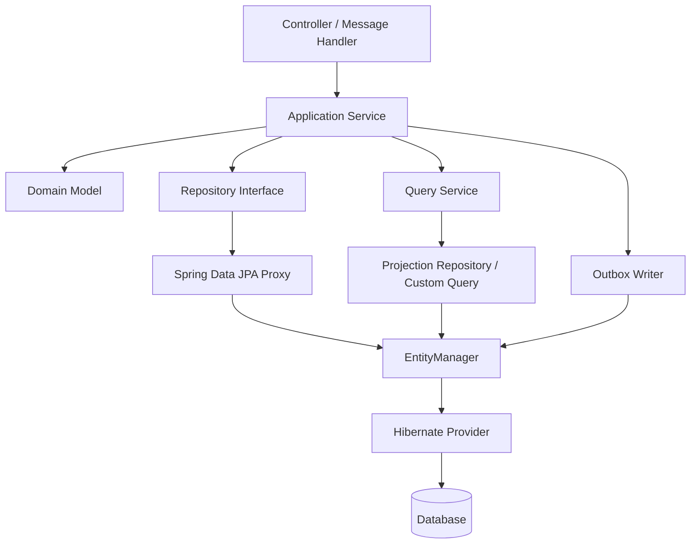

# Part 024 — Spring Data JPA Repository Layer

Part 023 covered cache strategy: when and how persisted state can be reused without corrupting correctness.

This part moves into the most common persistence abstraction used in Spring applications: **Spring Data JPA repositories**.

Spring Data JPA is powerful because it removes repetitive repository boilerplate. It is dangerous because it can make persistence look simpler than it is.

A repository method can hide:

- transaction assumptions
- fetch plan decisions
- locking decisions
- projection shape
- pagination limits
- bulk update side effects
- persistence-context synchronization
- provider-specific hints
- data access policy
- domain boundary leakage

The repository layer is not just a collection of database methods. In a serious system, it is a **persistence boundary**.

---

## 1. Kaufman Framing: Use Abstraction Without Losing Feedback

Kaufman's method says: learn enough to self-correct.

With Spring Data JPA, self-correction means you can look at a repository method and predict:

- what SQL shape it likely emits
- whether it returns managed entities or DTOs
- whether it participates in an existing transaction
- whether it can produce N+1
- whether it can paginate safely
- whether it can update stale data
- whether it leaks domain internals to callers
- whether it should be a repository method at all

The core skill:

> Use Spring Data JPA to reduce mechanical code, not to hide persistence semantics from yourself.

---

## 2. Repository Is Not DAO Rebranded

A low-level DAO often means:

> “Object with SQL methods.”

A domain-oriented repository means:

> “Boundary for retrieving and persisting aggregate state according to domain use cases.”

Spring Data JPA can support either style. The team chooses the discipline.

### Weak Repository Design

```java
public interface CaseRepository extends JpaRepository<Case, UUID> {

    List<Case> findByStatus(CaseStatus status);

    List<Case> findByPriority(Priority priority);

    List<Case> findByAssigneeId(UUID assigneeId);

    List<Case> findByStatusAndPriorityAndAssigneeIdAndCreatedAtBetween(
        CaseStatus status,
        Priority priority,
        UUID assigneeId,
        Instant from,
        Instant to
    );
}
```

This repository becomes a query dumping ground.

### Stronger Repository Design

```java
public interface CaseRepository extends JpaRepository<Case, UUID>, CaseRepositoryCustom {

    @Lock(LockModeType.OPTIMISTIC)
    @Query("""
        select c
        from Case c
        where c.id = :id
    """)
    Optional<Case> findForDecision(@Param("id") UUID id);

    @EntityGraph(attributePaths = {"assignee", "workflowState"})
    @Query("""
        select c
        from Case c
        where c.id = :id
    """)
    Optional<Case> findDetailForRead(@Param("id") UUID id);
}
```

The methods describe use-case intent:

- `findForDecision`
- `findDetailForRead`
- `searchForBackoffice`
- `findOverdueForEscalation`

Good repository names encode persistence semantics.

---

## 3. Spring Data Repository Types

Common repository interfaces:

| Interface | Purpose |
|---|---|
| `Repository<T, ID>` | Marker/root abstraction |
| `CrudRepository<T, ID>` | Basic CRUD operations |
| `PagingAndSortingRepository<T, ID>` | Pagination and sorting support |
| `JpaRepository<T, ID>` | JPA-specific repository with flush/batch helpers |
| Custom repository interface | Complex query/write path or provider-specific behavior |

Most Spring JPA applications extend `JpaRepository` by default:

```java
public interface OrderRepository extends JpaRepository<Order, UUID> {
}
```

But exposing `JpaRepository` everywhere means callers can access methods like:

- `findAll()`
- `deleteAll()`
- `flush()`
- `saveAndFlush()`
- `getReferenceById()`

These methods are not always safe at domain boundary.

### Restricting the Base Interface

For stricter systems, define a narrow base repository:

```java
@NoRepositoryBean
public interface AggregateRepository<T, ID> extends Repository<T, ID> {

    Optional<T> findById(ID id);

    T save(T aggregate);
}
```

Then:

```java
public interface CaseRepository extends AggregateRepository<Case, UUID> {

    Optional<Case> findForDecision(UUID id);
}
```

This prevents accidental `findAll()` or mass deletes from becoming available by default.

### Practical Rule

> Extend `JpaRepository` when convenience is worth it. Use a narrower base repository when domain safety matters more than convenience.

---

## 4. The `save()` Method Is Often Misunderstood

`save()` does not always mean SQL `INSERT` or `UPDATE` immediately.

Spring Data JPA delegates to JPA semantics:

- new entity usually goes through `persist`
- detached/existing entity may go through `merge`
- SQL may be emitted on flush/commit, not at method call

Bad mental model:

```java
repository.save(order); // database updated now
```

Better mental model:

```java
repository.save(order); // entity scheduled/managed according to JPA lifecycle; SQL later
```

Inside a transaction, this is often unnecessary:

```java
@Transactional
public void renameOrder(UUID id, String label) {
    Order order = repository.findById(id).orElseThrow();
    order.rename(label);

    // repository.save(order) usually unnecessary for managed entity
}
```

Dirty checking flushes managed changes.

### When `save()` Is Useful

- persisting a new aggregate
- reattaching/merging detached state deliberately
- repository API consistency
- explicit lifecycle transition in application service

### When `save()` Is a Smell

```java
@Transactional
public void approve(UUID id) {
    Case c = repository.findById(id).orElseThrow();
    c.approve();
    repository.save(c); // often noise
}
```

This line may reveal the engineer does not trust or understand managed state.

---

## 5. Derived Query Methods

Derived query methods are convenient:

```java
List<Order> findByCustomerIdAndStatus(UUID customerId, OrderStatus status);
```

They are best for simple constraints.

Good candidates:

```java
Optional<User> findByEmail(String email);

boolean existsByTenantIdAndCode(UUID tenantId, String code);

List<Currency> findByEnabledTrueOrderByCodeAsc();
```

Bad candidates:

```java
List<Case> findByTenantIdAndStatusInAndPriorityInAndAssigneeDepartmentIdAndCreatedAtBetweenAndDeletedFalseOrderBySlaDeadlineAsc(...);
```

Long derived method names are a design smell.

### Derived Query Strengths

- low boilerplate
- readable for simple lookup
- easy to refactor with property names
- supports common predicates

### Derived Query Weaknesses

- query shape is implicit
- complex names become unreadable
- fetch plan is not obvious
- joins may surprise you
- difficult to add hints/entity graphs/locks cleanly
- not ideal for complex business queries

### Rule

> Use derived queries for simple lookup. Use explicit `@Query`, Specification, Querydsl, or custom repository when query intent matters.

---

## 6. `@Query`: Make Intent Explicit

JPQL query:

```java
@Query("""
    select c
    from Case c
    where c.tenantId = :tenantId
      and c.status = :status
      and c.deleted = false
    order by c.slaDeadline asc
""")
List<Case> findOpenCasesForTenant(
    @Param("tenantId") UUID tenantId,
    @Param("status") CaseStatus status
);
```

Advantages:

- explicit query shape
- easier review
- easier to add join fetch or projection
- clearer parameter binding
- can express domain-specific query names

Native query:

```java
@Query(
    value = """
        select c.id, c.reference_no, c.status, c.sla_deadline
        from cases c
        where c.tenant_id = :tenantId
          and c.status = 'OPEN'
        order by c.sla_deadline asc
        limit :limit
    """,
    nativeQuery = true
)
List<CaseQueueRow> findQueueRowsNative(
    @Param("tenantId") UUID tenantId,
    @Param("limit") int limit
);
```

Native query is appropriate when:

- database-specific feature is required
- JPQL cannot express query efficiently
- query is read-model/report oriented
- SQL plan must be precise
- window functions, CTEs, JSON operators, or vendor-specific syntax are needed

### Rule

> Native SQL in a repository is not a failure. Unreviewed native SQL hidden behind vague method names is the failure.

---

## 7. Return Type Is a Contract

Repository return type communicates semantics.

| Return Type | Meaning |
|---|---|
| `Optional<Entity>` | Zero or one entity expected |
| `Entity` | Must exist; absence exceptional or framework-thrown |
| `List<Entity>` | Bounded result expected |
| `Page<T>` | Need content plus total count |
| `Slice<T>` | Need page-like traversal without total count |
| `Stream<T>` | Large read, must close transaction/resource |
| DTO/record | Read model, not managed state |
| `boolean exists...` | Existence check, must consider race if used for decision |
| `long count...` | Count, can be expensive and stale immediately |

### Avoid Ambiguous Lists

```java
List<Case> findByStatus(CaseStatus status);
```

Can this return 5 rows or 5 million?

Better:

```java
Page<CaseSummary> findBackofficeQueue(..., Pageable pageable);

List<Case> findTop100ByStatusOrderByCreatedAtAsc(CaseStatus status);

Stream<Case> streamByStatus(CaseStatus status);
```

Make cardinality explicit.

---

## 8. Entity Return vs Projection Return

Returning entities means returning managed state when inside a persistence context.

```java
Optional<Case> findById(UUID id);
```

Use entity return for:

- command/update path
- aggregate mutation
- invariant enforcement
- lifecycle operations

Use projection return for:

- list screens
- reports
- API read endpoints
- dashboards
- search results

Example record projection:

```java
public record CaseQueueItem(
    UUID id,
    String referenceNo,
    CaseStatus status,
    Instant slaDeadline
) {}
```

```java
@Query("""
    select new com.example.caseapp.CaseQueueItem(
        c.id,
        c.referenceNo,
        c.status,
        c.slaDeadline
    )
    from Case c
    where c.assignee.id = :assigneeId
      and c.status = com.example.caseapp.CaseStatus.OPEN
    order by c.slaDeadline asc
""")
Page<CaseQueueItem> findQueueItems(
    @Param("assigneeId") UUID assigneeId,
    Pageable pageable
);
```

### Rule

> Commands load aggregates. Queries return projections unless the caller truly needs entity behavior.

This is one of the simplest ways to prevent accidental graph loading and API/entity coupling.

---

## 9. Pagination in Repositories

Spring Data makes pagination easy:

```java
Page<CaseQueueItem> findByAssigneeId(UUID assigneeId, Pageable pageable);
```

But `Page` requires a count query.

For large datasets, the count may be expensive.

Use `Slice` when you only need “has next”:

```java
Slice<CaseQueueItem> findByAssigneeId(UUID assigneeId, Pageable pageable);
```

Use keyset/windowed access when offset becomes too expensive. Spring Data supports scroll-style access in modern versions, but the underlying rule remains:

> Stable ordering is mandatory for reliable pagination.

Bad:

```java
PageRequest.of(0, 50)
```

No explicit sort means unstable order.

Better:

```java
PageRequest.of(
    0,
    50,
    Sort.by(
        Sort.Order.asc("slaDeadline"),
        Sort.Order.asc("id")
    )
);
```

Always include a deterministic tie-breaker such as `id`.

---

## 10. Fetch Plans in Repository Methods

Repository methods must own fetch plans for their use case.

### `@EntityGraph`

```java
@EntityGraph(attributePaths = {"assignee", "workflowState"})
Optional<Case> findDetailById(UUID id);
```

Good for:

- simple graph loading
- avoiding N+1
- keeping query concise

Be careful:

- graph can become too wide
- collection loading can multiply rows
- it can hide performance decisions if overused

### Join Fetch in `@Query`

```java
@Query("""
    select c
    from Case c
    join fetch c.assignee
    left join fetch c.workflowState
    where c.id = :id
""")
Optional<Case> findDetail(@Param("id") UUID id);
```

Good when fetch shape is important and should be visible in code review.

### DTO Projection

```java
@Query("""
    select new com.example.CaseHeader(c.id, c.referenceNo, a.displayName)
    from Case c
    join c.assignee a
    where c.id = :id
""")
Optional<CaseHeader> findHeader(@Param("id") UUID id);
```

Often better for read endpoints.

### Rule

> A repository method that returns entities should make its fetch plan obvious or deliberately minimal.

---

## 11. Locking in Repository Methods

Spring Data supports JPA locks through `@Lock`.

```java
@Lock(LockModeType.OPTIMISTIC)
@Query("""
    select c
    from Case c
    where c.id = :id
""")
Optional<Case> findForOptimisticDecision(@Param("id") UUID id);
```

Pessimistic example:

```java
@Lock(LockModeType.PESSIMISTIC_WRITE)
@QueryHints({
    @QueryHint(name = "jakarta.persistence.lock.timeout", value = "1000")
})
@Query("""
    select r
    from Reservation r
    where r.id = :id
""")
Optional<Reservation> findForUpdate(@Param("id") UUID id);
```

Use lock-specific method names:

```java
findForUpdate
findForDecision
findLockedById
```

Avoid hiding locks behind normal lookup methods.

Bad:

```java
Optional<Reservation> findById(UUID id); // secretly pessimistic via redeclaration
```

Locks are operationally meaningful. Make them visible.

---

## 12. `@Modifying` Queries

Bulk update/delete methods require `@Modifying`.

```java
@Modifying(clearAutomatically = true, flushAutomatically = true)
@Query("""
    update Case c
    set c.status = :newStatus
    where c.status = :oldStatus
""")
int transitionAll(
    @Param("oldStatus") CaseStatus oldStatus,
    @Param("newStatus") CaseStatus newStatus
);
```

Risks:

- bypasses entity lifecycle callbacks
- bypasses dirty checking
- may bypass version checks depending query
- persistence context may become stale
- L2 cache/query cache may need eviction
- domain invariants can be skipped

Use bulk updates for administrative/maintenance paths or carefully designed write paths, not as a shortcut around domain logic.

### Safer Naming

```java
int bulkExpireOverdueCases(Instant cutoff);
```

Include `bulk` in the method name to signal special semantics.

---

## 13. Transaction Boundaries: Repository vs Service

Typical recommendation:

- service/application layer owns transaction boundary
- repository performs persistence operations
- repository methods may have read-only hints, but should not define business transaction orchestration

Example:

```java
@Service
public class CaseApprovalService {

    private final CaseRepository caseRepository;

    @Transactional
    public void approve(UUID caseId, UUID reviewerId) {
        Case c = caseRepository.findForDecision(caseId)
            .orElseThrow(CaseNotFoundException::new);

        c.approve(reviewerId);
    }
}
```

Repository:

```java
public interface CaseRepository extends JpaRepository<Case, UUID> {

    @Lock(LockModeType.OPTIMISTIC)
    @Query("select c from Case c where c.id = :id")
    Optional<Case> findForDecision(@Param("id") UUID id);
}
```

### Why Service Owns Transaction

Because a use case may involve:

- loading multiple aggregates
- validating permissions
- writing domain events
- calling outbox writer
- updating audit metadata
- coordinating idempotency

A repository does not know the whole use case.

### Repository-Level `@Transactional`

Spring Data repositories have transactional behavior by default for many methods. But relying on repository methods as the transaction boundary can fragment a use case.

Bad:

```java
public void approve(UUID caseId) {
    Case c = repository.findById(caseId).orElseThrow(); // transaction A maybe
    c.approve();
    repository.save(c); // transaction B maybe
}
```

Better:

```java
@Transactional
public void approve(UUID caseId) {
    Case c = repository.findById(caseId).orElseThrow();
    c.approve();
}
```

---

## 14. Read-Only Transactions

Use read-only transactions for query paths:

```java
@Transactional(readOnly = true)
public Page<CaseQueueItem> loadQueue(UUID assigneeId, Pageable pageable) {
    return repository.findQueueItems(assigneeId, pageable);
}
```

Benefits may include:

- communicates intent
- avoids accidental writes by convention
- may allow provider/framework optimizations
- helps code review

But read-only is not a security boundary. Do not assume it makes writes impossible in every environment/provider combination.

### Rule

> `readOnly = true` is a semantic signal and possible optimization, not a replacement for good design.

---

## 15. Specifications in Repository Layer

From Part 015, Specification is useful for dynamic filtering.

```java
public interface CaseRepository
    extends JpaRepository<Case, UUID>, JpaSpecificationExecutor<Case> {
}
```

Specification example:

```java
public final class CaseSpecifications {

    public static Specification<Case> tenant(UUID tenantId) {
        return (root, query, cb) -> cb.equal(root.get("tenantId"), tenantId);
    }

    public static Specification<Case> statusIn(Collection<CaseStatus> statuses) {
        return (root, query, cb) -> root.get("status").in(statuses);
    }

    public static Specification<Case> slaBefore(Instant cutoff) {
        return (root, query, cb) -> cb.lessThan(root.get("slaDeadline"), cutoff);
    }
}
```

Usage:

```java
Specification<Case> spec = Specification
    .where(CaseSpecifications.tenant(tenantId))
    .and(CaseSpecifications.statusIn(statuses))
    .and(CaseSpecifications.slaBefore(cutoff));

Page<Case> result = repository.findAll(spec, pageable);
```

Risks:

- returning entities for dynamic search can trigger N+1
- count query may become expensive
- fetch joins inside specifications can break pagination/count
- predicate composition can hide query complexity

### Recommendation

Use Specification for moderate dynamic filters. For complex read models, implement custom repository with explicit query/projection.

---

## 16. Query By Example

Query By Example can be useful for simple exploratory matching.

```java
Case probe = new Case();
probe.setStatus(CaseStatus.OPEN);

ExampleMatcher matcher = ExampleMatcher.matching()
    .withIgnoreNullValues();

List<Case> cases = repository.findAll(Example.of(probe, matcher));
```

Use it for:

- admin screens with simple equality filters
- prototypes
- simple user directory matching

Avoid it for:

- complex joins
- range queries
- advanced boolean logic
- production-critical query plans
- performance-sensitive screens

Query By Example is not a replacement for deliberate query design.

---

## 17. Custom Repository Implementations

When repository methods become complex, use a custom repository implementation.

Interface:

```java
public interface CaseSearchRepository {

    Page<CaseQueueItem> searchQueue(CaseQueueFilter filter, Pageable pageable);
}
```

Main repository:

```java
public interface CaseRepository
    extends JpaRepository<Case, UUID>, CaseSearchRepository {
}
```

Implementation:

```java
@Repository
public class CaseSearchRepositoryImpl implements CaseSearchRepository {

    private final EntityManager entityManager;

    public CaseSearchRepositoryImpl(EntityManager entityManager) {
        this.entityManager = entityManager;
    }

    @Override
    public Page<CaseQueueItem> searchQueue(CaseQueueFilter filter, Pageable pageable) {
        // Criteria API, JPQL, Querydsl, or native SQL here.
        throw new UnsupportedOperationException("example");
    }
}
```

Custom implementation is appropriate when:

- query has many optional filters
- projection is non-trivial
- query needs vendor-specific SQL
- keyset pagination is needed
- fetch plan must be explicit
- query must be tested independently

### Rule

> When repository interface methods become unreadable, move complexity into a named custom query component.

---

## 18. Repository Method Naming Taxonomy

A naming taxonomy makes code review easier.

| Prefix | Intended Semantics |
|---|---|
| `findBy...` | Simple lookup, usually no special fetch/lock |
| `findDetail...` | Entity/detail graph for read use case |
| `findForDecision...` | Command path requiring fresh enough state/invariant check |
| `findForUpdate...` | Pessimistic lock or write-intent load |
| `search...` | Dynamic filter or user-driven query |
| `load...View` | DTO/read model |
| `exists...` | Existence check; race-prone if used alone for command |
| `bulk...` | Bulk update/delete bypassing entity lifecycle |
| `stream...` | Resource-bound large result traversal |
| `count...` | Aggregation/count query; may be expensive |

Bad:

```java
Optional<Case> getCase(UUID id);
```

Better:

```java
Optional<Case> findForDecision(UUID id);
Optional<CaseDetailView> loadDetailView(UUID id);
Optional<Case> findForUpdate(UUID id);
```

Names should reduce ambiguity.

---

## 19. Avoid Entity Leakage to API Layer

Bad architecture:

```java
@RestController
class CaseController {

    @GetMapping("/cases/{id}")
    public Case get(@PathVariable UUID id) {
        return repository.findById(id).orElseThrow();
    }
}
```

Problems:

- exposes persistence model
- lazy loading during serialization
- infinite recursion risk
- overfetching/underfetching
- accidental mutation path
- API contract tied to entity mapping

Better:

```java
@GetMapping("/cases/{id}")
public CaseDetailResponse get(@PathVariable UUID id) {
    return queryService.getCaseDetail(id);
}
```

Query service:

```java
@Transactional(readOnly = true)
public CaseDetailResponse getCaseDetail(UUID id) {
    CaseDetailView view = repository.loadDetailView(id)
        .orElseThrow(CaseNotFoundException::new);

    return mapper.toResponse(view);
}
```

Entity is not the API contract.

---

## 20. Repository and Aggregate Boundaries

A repository should usually be per aggregate root.

Example:

```text
CaseRepository        -> Case aggregate root
CustomerRepository    -> Customer aggregate root
InvoiceRepository     -> Invoice aggregate root
```

Avoid repositories for internal child entities unless they have independent lifecycle.

Potential smell:

```java
TaskRepository extends JpaRepository<CaseTask, UUID>
```

If `CaseTask` is owned by `Case`, direct task repository updates may bypass `Case` invariants.

Better:

```java
@Transactional
public void completeTask(UUID caseId, UUID taskId, UUID actorId) {
    Case c = caseRepository.findForDecision(caseId).orElseThrow();
    c.completeTask(taskId, actorId);
}
```

The aggregate root enforces consistency.

### Rule

> If a child cannot be validly changed without its parent invariant, do not expose a general repository for the child.

---

## 21. `getReferenceById()` and Lazy References

`JpaRepository#getReferenceById()` returns a reference/proxy without necessarily hitting the database immediately.

Useful for setting associations when you know the target exists:

```java
Customer customerRef = customerRepository.getReferenceById(customerId);
Order order = Order.create(customerRef, lines);
orderRepository.save(order);
```

Risks:

- entity may not exist; failure delayed
- accessing proxy outside transaction may fail
- proxy equality/class issues
- hides existence validation

Use when:

- foreign key existence is guaranteed by prior validation or database constraint
- you only need a reference
- delayed failure is acceptable or handled

Avoid when:

- you need to validate target state
- you need authorization based on target fields
- target may not exist and error must be clear

---

## 22. Existence Checks and Race Conditions

```java
if (!repository.existsByTenantIdAndCode(tenantId, code)) {
    repository.save(new Policy(tenantId, code));
}
```

This is race-prone.

Two transactions can both observe absence, then both insert.

Correct protection:

- unique constraint on `(tenant_id, code)`
- handle duplicate key exception
- or use serializable/pessimistic strategy if invariant cannot be expressed as constraint

Repository method still useful:

```java
boolean existsByTenantIdAndCode(UUID tenantId, String code);
```

But only as user feedback/precheck, not final correctness authority.

### Rule

> `exists...` can improve UX. It does not replace database constraints for uniqueness invariants.

---

## 23. Delete Methods

Spring Data gives many delete options:

```java
deleteById(id);
delete(entity);
deleteAll();
deleteAllInBatch();
```

Deletion is not trivial.

Before exposing delete methods, decide:

- hard delete or soft delete?
- cascade delete allowed?
- orphan removal expected?
- audit record required?
- foreign key constraints?
- regulatory retention?
- domain event/outbox needed?

Dangerous:

```java
repository.deleteById(caseId);
```

Better:

```java
@Transactional
public void closeCase(UUID caseId, UUID actorId) {
    Case c = repository.findForDecision(caseId).orElseThrow();
    c.close(actorId, clock.instant());
}
```

For regulatory systems, deletion is usually a domain transition, not a technical operation.

---

## 24. Repository Exceptions and Error Translation

Spring translates many persistence exceptions into `DataAccessException` hierarchy.

However, domain code should not leak raw database errors to API consumers.

Example:

```java
try {
    repository.save(policy);
} catch (DataIntegrityViolationException ex) {
    throw new DuplicatePolicyCodeException(policy.code(), ex);
}
```

Use exception translation to map infrastructure failure to domain/application error.

Common cases:

| Persistence Failure | Application Meaning |
|---|---|
| unique constraint violation | duplicate business key |
| FK violation | referenced object missing or invalid transition |
| optimistic lock exception | stale command/conflict |
| lock timeout | contention/retryable failure |
| deadlock | retryable transaction failure |
| query timeout | degraded dependency/performance incident |

Do not bury all persistence exceptions as `RuntimeException("database error")`.

---

## 25. Repository Testing Strategy

Repository tests should prove actual persistence behavior.

Use:

- real database via Testcontainers when possible
- migration scripts, not auto-generated schema
- SQL count/assertions for fetch behavior
- transaction boundaries that match production use
- tests for constraints and locking

### `@DataJpaTest`

`@DataJpaTest` is useful for focused repository tests, but beware:

- default rollback can hide commit-time failures
- in-memory DB can differ from production DB
- lazy loading may work accidentally inside test transaction
- schema auto-generation may hide migration mismatch

Better for serious persistence:

```java
@DataJpaTest
@Testcontainers
class CaseRepositoryTest {

    @Container
    static PostgreSQLContainer<?> postgres = new PostgreSQLContainer<>("postgres:16");

    @Test
    void findQueueItemsDoesNotLoadEntities() {
        // assert projection query shape or SQL count
    }
}
```

### Test What Matters

| Repository Feature | Test |
|---|---|
| projection | columns/shape and mapping |
| pagination | deterministic order and count behavior |
| entity graph | query count / no N+1 |
| locking | concurrent transaction test |
| bulk update | persistence context clear and affected rows |
| unique invariant | duplicate insert fails |
| soft delete | deleted rows excluded consistently |
| tenant filter | cross-tenant data not returned |

---

## 26. Multi-Tenant Repository Methods

Every tenant-owned query must include tenant scope.

Bad:

```java
Optional<Case> findById(UUID id);
```

If case IDs are globally unique, this may be technically safe, but still often weak as a policy boundary.

Better:

```java
Optional<Case> findByTenantIdAndId(UUID tenantId, UUID id);
```

For projections:

```java
@Query("""
    select new com.example.CaseSummary(c.id, c.referenceNo, c.status)
    from Case c
    where c.tenantId = :tenantId
      and c.id = :id
""")
Optional<CaseSummary> loadSummary(
    @Param("tenantId") UUID tenantId,
    @Param("id") UUID id
);
```

### Rule

> Repository methods should make tenant scope visible unless tenant isolation is enforced below the application layer and tested thoroughly.

Part 029 will go deeper into multitenancy.

---

## 27. Security-Aware Repository Design

Repository should not usually decide user permissions. But it must support safe filtering.

Example:

```java
@Query("""
    select c
    from Case c
    join c.assignments a
    where c.tenantId = :tenantId
      and a.userId = :viewerId
      and c.id = :caseId
""")
Optional<Case> findVisibleCase(
    @Param("tenantId") UUID tenantId,
    @Param("viewerId") UUID viewerId,
    @Param("caseId") UUID caseId
);
```

This is useful for query-side visibility.

But command authorization should usually be explicit in service/domain layer:

```java
@Transactional
public void approve(UUID tenantId, UUID caseId, UUID actorId) {
    Case c = repository.findByTenantIdAndId(tenantId, caseId).orElseThrow();
    authorization.assertCanApprove(actorId, c);
    c.approve(actorId);
}
```

Do not hide complex authorization inside vague repository queries unless the naming makes it clear.

---

## 28. Repository Layer Diagram



The repository sits below application use cases but above raw JPA provider mechanics.

It should not become:

- controller helper
- business rule engine
- generic SQL bag
- transaction orchestrator
- API response factory

---

## 29. Repository Anti-Patterns

### Anti-Pattern 1: Entity Repository Used Directly by Controller

```java
@GetMapping("/orders")
public List<Order> list() {
    return orderRepository.findAll();
}
```

Problems:

- unbounded read
- entity leakage
- serialization/lazy loading risk
- no use-case boundary

Better:

```java
@GetMapping("/orders")
public Page<OrderSummaryResponse> list(Pageable pageable) {
    return orderQueryService.listOrders(pageable);
}
```

---

### Anti-Pattern 2: `findAll()` in Production Path

```java
List<Case> cases = repository.findAll();
```

This is almost always wrong for growing tables.

Better:

- pagination
- streaming/chunking
- bounded query
- batch processing with cursor/keyset

---

### Anti-Pattern 3: Repository as Business Logic Container

```java
@Query("""
    select c
    from Case c
    where c.status = 'OPEN'
      and c.slaDeadline < current_timestamp
      and c.escalationCount < 3
      and c.region.riskScore > 80
      and c.assignee.active = true
""")
List<Case> findCasesThatShouldBeEscalated();
```

Some filtering belongs in query. But policy logic should be named and tested as domain/application logic.

Better:

```java
List<Case> findEscalationCandidates(Instant cutoff);
```

Then:

```java
for (Case c : candidates) {
    if (escalationPolicy.shouldEscalate(c, now)) {
        c.escalate(systemActor, now);
    }
}
```

Balance query efficiency with policy clarity.

---

### Anti-Pattern 4: Giant Derived Queries

```java
findByAAndBOrCAndDAndEInAndFBetweenAndGIsNullAndHNot(...)
```

Hard to review, hard to modify, easy to misread.

Better:

- explicit `@Query`
- Specification
- custom repository
- named query object

---

### Anti-Pattern 5: Blind `save()` After Every Change

```java
entity.changeSomething();
repository.save(entity);
```

If entity is managed, this is unnecessary. If entity is detached, it may trigger merge semantics you did not intend.

Better:

- understand managed state
- use save for new aggregate or deliberate merge
- avoid detached mutation in web/API layer

---

### Anti-Pattern 6: Bulk Delete Without Domain/Audit Awareness

```java
repository.deleteAllByStatus(CLOSED);
```

This may violate retention, audit, reporting, or FK constraints.

Better:

- model archival/retention explicitly
- use migration/maintenance job with audit
- document bulk semantics

---

## 30. Production Repository Review Checklist

For each repository method, ask:

### Semantics

- Is this command-side or query-side?
- Does the method name reveal intent?
- Does it return entity or projection deliberately?
- Is cardinality bounded?
- Does it need tenant/security scope?

### Query Shape

- Is the generated SQL predictable?
- Does it join/fetch intentionally?
- Can it cause N+1?
- Does pagination have stable sorting?
- Is count query acceptable?

### Transaction/Concurrency

- Who owns transaction boundary?
- Does this need optimistic/pessimistic locking?
- Does it rely on `exists`/`count` for invariant?
- Are stale reads acceptable?

### Write Path

- Does this method mutate through entity lifecycle or bulk operation?
- Are callbacks/domain events expected?
- Is persistence context cleared after bulk update?
- Is L2/application cache invalidated?

### Operations

- Can this query be observed in logs/traces?
- Is there a performance test for high-cardinality data?
- Are DB indexes aligned with predicates/order?
- Does it behave correctly on production database dialect?

---

## 31. Recommended Repository Style Guide

A strong team style guide might say:

1. Controllers must not return JPA entities.
2. Repositories are per aggregate root by default.
3. Command methods load aggregates by explicit intent: `findForDecision`, `findForUpdate`.
4. Query/list screens return DTO projections, not entities.
5. Every pageable query must have deterministic sort.
6. `findAll()` is forbidden in production paths unless table is bounded/reference data.
7. Derived queries are limited to simple lookup.
8. Complex queries use `@Query`, Specification, Querydsl, or custom repository.
9. Bulk methods must be prefixed with `bulk` and document cache/persistence-context behavior.
10. Tenant scope must be explicit or enforced by tested infrastructure.
11. Repository tests must run against the production database family.
12. `save()` after modifying a managed entity should be challenged in code review.

---

## 32. Example: Production-Grade Repository Slice

Entity:

```java
@Entity
@Table(
    name = "cases",
    indexes = {
        @Index(name = "idx_case_queue", columnList = "tenant_id, assignee_id, status, sla_deadline, id")
    }
)
public class Case {

    @Id
    private UUID id;

    @Column(name = "tenant_id", nullable = false)
    private UUID tenantId;

    @Version
    private long version;

    @Enumerated(EnumType.STRING)
    private CaseStatus status;

    private Instant slaDeadline;

    protected Case() {
    }

    public void approve(UUID reviewerId) {
        if (status != CaseStatus.IN_REVIEW) {
            throw new InvalidCaseTransitionException(id, status, CaseStatus.APPROVED);
        }
        this.status = CaseStatus.APPROVED;
    }
}
```

Projection:

```java
public record CaseQueueItem(
    UUID id,
    String referenceNo,
    CaseStatus status,
    Instant slaDeadline
) {}
```

Repository:

```java
public interface CaseRepository extends JpaRepository<Case, UUID>, CaseSearchRepository {

    @Lock(LockModeType.OPTIMISTIC)
    @Query("""
        select c
        from Case c
        where c.tenantId = :tenantId
          and c.id = :id
    """)
    Optional<Case> findForDecision(
        @Param("tenantId") UUID tenantId,
        @Param("id") UUID id
    );

    @Query("""
        select new com.example.caseapp.CaseQueueItem(
            c.id,
            c.referenceNo,
            c.status,
            c.slaDeadline
        )
        from Case c
        where c.tenantId = :tenantId
          and c.assignee.id = :assigneeId
          and c.status = com.example.caseapp.CaseStatus.OPEN
        order by c.slaDeadline asc, c.id asc
    """)
    Page<CaseQueueItem> findQueueItems(
        @Param("tenantId") UUID tenantId,
        @Param("assigneeId") UUID assigneeId,
        Pageable pageable
    );

    @Modifying(clearAutomatically = true, flushAutomatically = true)
    @Query("""
        update Case c
        set c.status = com.example.caseapp.CaseStatus.EXPIRED
        where c.tenantId = :tenantId
          and c.status = com.example.caseapp.CaseStatus.OPEN
          and c.slaDeadline < :cutoff
    """)
    int bulkExpireOpenCases(
        @Param("tenantId") UUID tenantId,
        @Param("cutoff") Instant cutoff
    );
}
```

Service:

```java
@Service
public class CaseCommandService {

    private final CaseRepository repository;

    public CaseCommandService(CaseRepository repository) {
        this.repository = repository;
    }

    @Transactional
    public void approve(UUID tenantId, UUID caseId, UUID reviewerId) {
        Case c = repository.findForDecision(tenantId, caseId)
            .orElseThrow(CaseNotFoundException::new);

        c.approve(reviewerId);
    }
}
```

This design makes the following explicit:

- tenant scope
- command vs query path
- projection for list screen
- optimistic locking for decision
- stable pagination order
- bulk operation naming
- service-owned transaction boundary

---

## 33. Key Takeaways

- Spring Data JPA removes boilerplate, not persistence semantics.
- Repository methods should express use-case intent, not just property filters.
- `save()` is not immediate SQL and is often unnecessary for managed entities.
- Derived queries are excellent for simple lookup and poor for complex business queries.
- Return type is a contract: entity for command path, projection for read path.
- Pagination must be deterministic and count cost must be considered.
- Locks, entity graphs, query hints, and bulk operations should be visible in method naming or annotations.
- Service/application layer should usually own transaction boundaries.
- Repositories should respect aggregate, tenant, and security boundaries.
- Repository tests must prove real database behavior, not just mock interactions.

---

## 34. Where This Leads Next

Part 025 moves from repository mechanics into **transactional service boundaries**:

- where `@Transactional` belongs
- command handler patterns
- read-only transaction design
- Open Session in View
- domain event timing
- side effects and after-commit behavior
- preventing transaction leakage across layers
