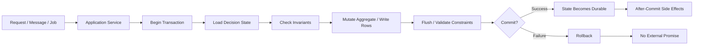
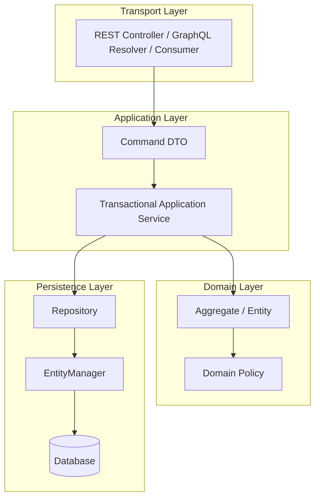
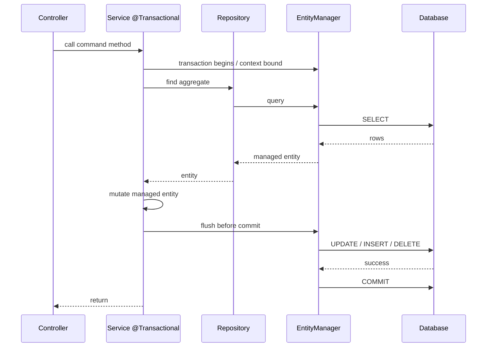
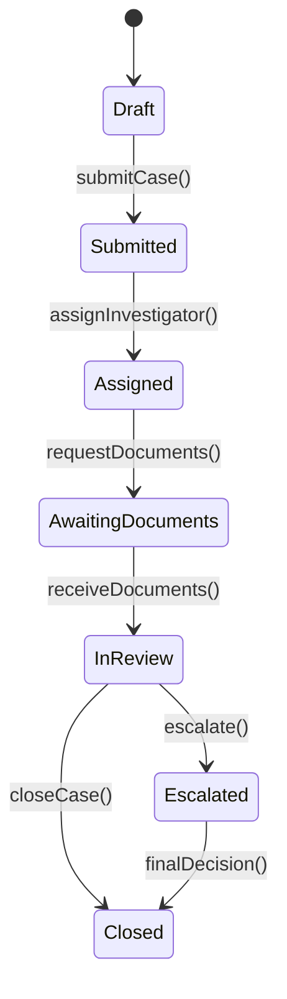
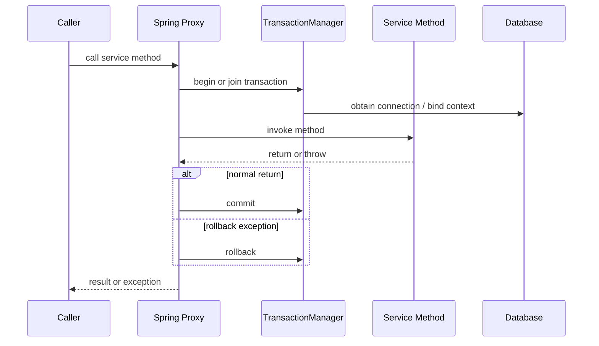

# Part 025 — Transactional Service Boundaries

Part 024 covered the repository layer: how Spring Data JPA can help expose persistence operations without turning the database into a hidden global dependency.

This part moves one level above repositories: **transactional service boundaries**.

This is where many enterprise systems succeed or fail.

A persistence module can have correct mappings, efficient queries, and good repositories, but still be unreliable if transaction boundaries are vague. Bugs usually show up as:

- partially applied business commands
- events published for changes that later rolled back
- lazy-loading failures in controllers
- repository methods accidentally opening independent transactions
- checked exceptions committing data unexpectedly
- nested service calls hiding propagation behavior
- stale reads caused by misplaced read-only assumptions
- outbox records missing when external side effects succeed
- long transactions holding locks across remote calls

The goal of this part is to make transactions explicit as an architectural design tool, not merely a framework annotation.

---

## 1. The Core Mental Model

A transaction is not “a database session”.

A transaction is a **consistency envelope** around one unit of business change.

Inside the envelope:

- loaded state must represent a valid decision basis
- mutations must be part of the same atomic change
- database constraints must be satisfied
- optimistic/pessimistic locks must protect relevant invariants
- persistence-context changes must flush consistently
- side effects must not escape before commit

Outside the envelope:

- the command is either visible as committed state
- or it never happened

That is the engineering promise.



A strong transactional boundary answers four questions:

1. **What business command is protected?**
2. **Which data must change atomically?**
3. **Which invariants must be checked before commit?**
4. **Which side effects are allowed only after commit?**

If a method cannot answer these questions, it should probably not own a transaction boundary.

---

## 2. Kaufman Deconstruction: What Skill Are We Practicing?

Following Josh Kaufman’s approach, we deconstruct “transactional service design” into sub-skills.

| Sub-skill | What You Need to Recognize | Practice Target |
|---|---|---|
| Command boundary design | One business action vs many accidental repository calls | Design one transaction per command |
| State loading | Which rows must be read before deciding | Load minimal decision state |
| Invariant placement | Application invariant vs database constraint vs lock | Put each invariant in the correct layer |
| Propagation reasoning | What happens when transactional methods call each other | Predict actual transaction participation |
| Rollback semantics | Which exceptions rollback or commit | Make failure behavior explicit |
| Flush timing | When SQL is sent before commit | Catch constraint/query-triggered failures early |
| Side-effect timing | When to publish events, send email, call APIs | Never publish irreversible side effects before commit |
| Read boundary design | Entity graph vs DTO vs read-only transaction | Avoid leaking managed entities outside transaction |
| Long transaction control | Locks, remote calls, user waits, batch jobs | Keep transactions short and bounded |

The performance target is simple:

> Given any application service method, you should be able to explain exactly what transaction it joins or starts, when it commits, what can rollback it, what side effects can escape, and what database invariants remain protected under concurrency.

---

## 3. Where Transaction Boundaries Belong

In most layered Java applications, the best default is:

> **Transactions are owned by application services or command handlers, not controllers and not repositories.**

Controllers are transport adapters. Repositories are persistence adapters. The application service is where the business command becomes explicit.



### Good default

```java
@Service
public class CaseAssignmentService {

    private final CaseRepository caseRepository;
    private final OfficerRepository officerRepository;

    @Transactional
    public void assignCase(AssignCaseCommand command) {
        EnforcementCase caze = caseRepository.findForAssignment(command.caseId())
            .orElseThrow(() -> new CaseNotFoundException(command.caseId()));

        Officer officer = officerRepository.findById(command.officerId())
            .orElseThrow(() -> new OfficerNotFoundException(command.officerId()));

        caze.assignTo(officer, command.reason());
    }
}
```

The application service owns the command:

- it decides what must be loaded
- it checks cross-aggregate or policy rules
- it calls domain behavior
- it relies on dirty checking or explicit repository save
- it commits exactly once

### Weak default

```java
@RestController
public class CaseController {

    @Transactional
    @PostMapping("/cases/{id}/assignment")
    public void assign(@PathVariable Long id, @RequestBody AssignCaseRequest request) {
        // transport, validation, persistence, and business mutation mixed together
    }
}
```

This works technically, but it couples transaction ownership to HTTP. The command becomes hard to reuse from a batch job, message consumer, workflow engine, scheduler, or CLI repair tool.

### Also weak

```java
@Repository
public class CaseRepository {

    @Transactional
    public void assignCase(Long caseId, Long officerId) {
        // business transaction hidden inside persistence adapter
    }
}
```

A repository transaction is acceptable for very small CRUD utilities, but dangerous for business commands. The repository cannot usually know the full business invariant or side-effect boundary.

---

## 4. Transaction Boundary vs Persistence Context Boundary

With JPA, a transaction and a persistence context are related, but not identical concepts.

In a typical Spring application with transaction-scoped `EntityManager`:

- transaction starts
- persistence context is associated with the transaction
- entity loads become managed
- dirty checking tracks changes
- flush occurs before commit or earlier when required
- commit succeeds or rollback discards changes
- persistence context closes or detaches entities



The entity is safe to mutate only while you understand its management state.

After the transaction ends, returning managed entities to outer layers creates ambiguity:

- is lazy loading still possible?
- will mutation be persisted?
- is the object a DTO or a persistence object?
- will serialization trigger queries?
- does the response depend on an open session?

A production-grade boundary avoids that ambiguity.

---

## 5. Command Methods Should Be Verb-Based

A transaction should normally protect a **business command**, not a data-access operation.

Prefer:

```java
@Transactional
public void approveCase(ApproveCaseCommand command) { ... }

@Transactional
public void assignInvestigator(AssignInvestigatorCommand command) { ... }

@Transactional
public void closeCase(CloseCaseCommand command) { ... }
```

Be cautious with:

```java
@Transactional
public Case save(Case caze) { ... }

@Transactional
public Case update(Long id, CaseUpdateRequest request) { ... }
```

The second style often hides the real invariant. “Update” is not a business operation. It is a transport-level or CRUD-level word.

A high-quality service method usually has this shape:

```java
@Transactional
public ApprovalResult approveCase(ApproveCaseCommand command) {
    EnforcementCase caze = caseRepository.findForApproval(command.caseId())
        .orElseThrow(() -> new CaseNotFoundException(command.caseId()));

    ApprovalPolicy policy = approvalPolicyRepository.currentPolicyFor(caze.type());

    caze.approve(command.approverId(), command.reason(), policy);

    return ApprovalResult.accepted(caze.id(), caze.status());
}
```

Notice what is not happening:

- no HTTP request object inside domain logic
- no lazy entity returned to controller
- no external API call inside the transaction
- no event published before commit
- no generic “save anything” command

---

## 6. Transaction Boundary Patterns

### Pattern 1: One command, one transaction

Use for normal write operations.

```java
@Transactional
public void changeCustomerEmail(ChangeEmailCommand command) {
    Customer customer = customerRepository.getById(command.customerId());
    customer.changeEmail(command.newEmail());
}
```

This is the default.

Properties:

- simple atomicity
- easy rollback reasoning
- good fit for dirty checking
- easy to attach domain events or outbox writes

### Pattern 2: Read-only query transaction

Use for read methods that need a stable persistence context or lazy-safe DTO assembly.

```java
@Transactional(readOnly = true)
public CaseDetailsView getCaseDetails(CaseId id) {
    EnforcementCase caze = caseRepository.findDetailsById(id)
        .orElseThrow(() -> new CaseNotFoundException(id));

    return CaseDetailsView.from(caze);
}
```

Read-only transaction does not mean “no database transaction exists”. It means the framework/provider can optimize and the developer communicates intent.

Good uses:

- DTO assembly within a bounded persistence context
- repeatable fetch-plan behavior
- repository query methods requiring managed state
- avoiding lazy-loading outside the service

Bad uses:

- wrapping entire HTTP request just to avoid lazy exception
- assuming it prevents all writes at the database level
- doing complex write operations because “it seems to work”

### Pattern 3: Command transaction plus after-commit side effect

Use when a business command must publish an event, send notification, or trigger integration after data commits.

```java
@Transactional
public void approveCase(ApproveCaseCommand command) {
    EnforcementCase caze = caseRepository.getForApproval(command.caseId());
    caze.approve(command.approverId(), command.reason());

    domainEvents.record(new CaseApproved(caze.id()));
}
```

Then dispatch only after commit.

In Spring, common choices include:

- `@TransactionalEventListener(phase = AFTER_COMMIT)`
- transactional outbox table
- explicit transaction synchronization

For critical cross-service integration, prefer outbox. `AFTER_COMMIT` listeners are convenient, but they do not automatically provide durable retry.

### Pattern 4: Short transaction, external call outside

Bad:

```java
@Transactional
public void approveAndNotify(ApproveCaseCommand command) {
    EnforcementCase caze = caseRepository.getForApproval(command.caseId());
    caze.approve(command.approverId(), command.reason());

    emailClient.sendApprovalEmail(caze.assigneeEmail()); // remote call inside transaction
}
```

Better:

```java
@Transactional
public void approveCase(ApproveCaseCommand command) {
    EnforcementCase caze = caseRepository.getForApproval(command.caseId());
    caze.approve(command.approverId(), command.reason());
    outboxRepository.append(CaseApprovedEvent.from(caze));
}
```

Then a relay sends the email later.

Why?

Remote calls inside transactions create several failures:

- database locks are held while waiting for network
- remote system can succeed while local commit fails
- retry can duplicate external side effects
- transaction timeout can occur after the remote call already happened
- throughput collapses under slow dependency latency

### Pattern 5: Saga or workflow boundary

Do not force one database transaction to represent a long business process.

Example:

- submit case
- assign investigator
- request documents
- wait for response
- escalate
- final decision

This is not one transaction. It is a workflow with many durable state transitions.

Each transition should have its own transaction.



Each arrow is a command boundary.

---

## 7. Spring `@Transactional`: What It Actually Means

In Spring, `@Transactional` is usually implemented through AOP proxies.

At a high level:

1. caller invokes a proxied bean method
2. transaction interceptor checks metadata
3. transaction manager starts or joins a transaction
4. method executes
5. on normal return, transaction commits
6. on configured exception, transaction rolls back



This creates several important rules.

### Rule 1: Proxy invocation matters

A method calling another method on the same object may bypass the proxy.

```java
@Service
public class CaseService {

    public void outer() {
        inner(); // self-invocation; transactional advice may not apply
    }

    @Transactional
    public void inner() {
        // may not run transactionally if called through self-invocation
    }
}
```

Fixes:

- put transactional method on a separate bean
- make the outer method transactional
- use programmatic transaction management intentionally
- avoid designing service internals around proxy tricks

### Rule 2: The transaction is not magic around private helper methods

Private methods are implementation details. Put the transaction on the public application boundary.

Good:

```java
@Transactional
public void approveCase(ApproveCaseCommand command) {
    EnforcementCase caze = loadCase(command.caseId());
    applyApproval(command, caze);
}
```

Bad mental model:

```java
public void approveCase(ApproveCaseCommand command) {
    doApprove(command); // assuming private method opens transaction
}

@Transactional
private void doApprove(ApproveCaseCommand command) { ... }
```

### Rule 3: Checked exceptions may not rollback by default

By default, Spring rolls back for unchecked exceptions and errors. Checked exceptions need explicit rollback rules unless your transaction configuration changes this behavior.

Dangerous:

```java
@Transactional
public void importCases(Path file) throws IOException {
    CaseImportBatch batch = batchRepository.create();
    parseFile(file); // throws IOException
    batch.markComplete();
}
```

If the checked exception does not trigger rollback, partial database changes may commit.

Better:

```java
@Transactional(rollbackFor = IOException.class)
public void importCases(Path file) throws IOException {
    CaseImportBatch batch = batchRepository.create();
    parseFile(file);
    batch.markComplete();
}
```

Or convert checked infrastructure failures into domain/application runtime exceptions where appropriate.

### Rule 4: `@Transactional` on repository does not replace service boundary

Spring Data repositories often have transactional behavior for repository methods. That is useful. It does not mean business commands should be distributed across multiple repository transactions.

Bad:

```java
public void approveCase(Long id) {
    caseRepository.markApproved(id);      // transaction 1
    auditRepository.appendApproval(id);   // transaction 2
    eventRepository.appendCaseApproved(id); // transaction 3
}
```

Good:

```java
@Transactional
public void approveCase(Long id) {
    caseRepository.markApproved(id);
    auditRepository.appendApproval(id);
    eventRepository.appendCaseApproved(id);
}
```

The application command decides atomicity.

---

## 8. Propagation: The Hidden Contract Between Services

Transaction propagation defines what happens when a transactional method is called while another transaction may already exist.

| Propagation | Meaning | Typical Use |
|---|---|---|
| `REQUIRED` | Join existing transaction or create one | Default for command methods |
| `REQUIRES_NEW` | Suspend current transaction and create independent one | Rare: audit attempt, outbox relay checkpoint, independent log |
| `MANDATORY` | Must already have a transaction | Internal collaborator that must not be called standalone |
| `SUPPORTS` | Join transaction if present, otherwise run without | Read helpers; use carefully |
| `NOT_SUPPORTED` | Suspend transaction and run without | Long-running non-DB work that must not hold locks |
| `NEVER` | Fail if transaction exists | Guard against accidental transaction participation |
| `NESTED` | Nested transaction via savepoint where supported | Partial rollback inside one physical transaction |

### Default: `REQUIRED`

```java
@Transactional
public void submitCase(SubmitCaseCommand command) { ... }
```

`REQUIRED` is the default because most command methods should join a transaction if the caller already created one, otherwise start one.

### `REQUIRES_NEW`: useful but dangerous

```java
@Transactional(propagation = Propagation.REQUIRES_NEW)
public void recordAuditAttempt(AuditAttempt attempt) {
    auditRepository.save(attempt);
}
```

This commits independently from the caller.

Use it only when independence is intended.

Risk:

```java
@Transactional
public void approveCase(ApproveCaseCommand command) {
    caze.approve();
    auditService.recordAuditAttempt(...); // commits independently
    throw new RuntimeException("approval failed later");
}
```

The audit attempt commits, but approval rolls back. That may be desired for “attempt logs”. It is not desired for “state change audit”.

### `MANDATORY`: good for enforcing architecture

```java
@Transactional(propagation = Propagation.MANDATORY)
public void appendOutboxMessage(DomainEvent event) {
    outboxRepository.save(OutboxMessage.from(event));
}
```

This says: do not append outbox messages outside a command transaction.

### `NOT_SUPPORTED`: avoid accidental long transactions

```java
@Transactional(propagation = Propagation.NOT_SUPPORTED)
public EnrichmentData fetchExternalEnrichment(CaseId id) {
    return externalClient.fetch(id);
}
```

Use when you explicitly want to suspend transactional work before slow external calls.

But do not use it to hide lazy-loading or data consistency problems.

---

## 9. Rollback Rules and Exception Taxonomy

Transaction design requires exception design.

A practical taxonomy:

| Exception Type | Meaning | Rollback? | Example |
|---|---|---:|---|
| Programming bug | Code invariant broken | Yes | `NullPointerException`, illegal state |
| Domain rejection | Business command invalid before mutation | Usually no mutation; rollback harmless | cannot approve closed case |
| Optimistic conflict | Concurrent update detected | Yes; caller may retry or show conflict | `OptimisticLockException` |
| Infrastructure failure | DB/network/storage failed | Yes | timeout, deadlock, connection loss |
| External dependency failure | Remote call failed | Avoid inside transaction | notification API failed |
| Validation exception | Input invalid | Usually no mutation | malformed command |
| Checked import/read failure | File parsing or IO failure | Usually yes if DB writes happened | `IOException` during import |

The worst state is not “rollback”. The worst state is **unclear commit behavior**.

### Anti-pattern: swallowing exceptions inside a transaction

```java
@Transactional
public void approveCase(ApproveCaseCommand command) {
    try {
        caze.approve();
        outboxRepository.save(...);
    } catch (Exception ex) {
        log.warn("Failed", ex);
    }
}
```

This method may commit partial state unless the transaction was marked rollback-only.

Better:

```java
@Transactional
public void approveCase(ApproveCaseCommand command) {
    try {
        caze.approve();
        outboxRepository.save(...);
    } catch (RuntimeException ex) {
        throw ex;
    } catch (Exception ex) {
        throw new ApprovalFailedException(command.caseId(), ex);
    }
}
```

### Anti-pattern: catch and continue after persistence error

Once the persistence provider or database reports a serious transaction error, the current transaction may be effectively unusable.

Bad:

```java
@Transactional
public void processBatch(List<Command> commands) {
    for (Command command : commands) {
        try {
            processOne(command);
        } catch (Exception ex) {
            log.warn("Skipping", ex);
        }
    }
}
```

If `processOne` caused a constraint violation during flush, the transaction may be marked rollback-only. Continuing gives a false sense of progress.

Better designs:

- process each command in its own transaction
- use chunk transactions
- use `REQUIRES_NEW` intentionally for each item if independence is desired
- record failures outside the failed transaction

---

## 10. Read-Only Transaction Boundaries

A read-only transaction is useful for query services.

```java
@Transactional(readOnly = true)
public CaseSummaryPage searchCases(CaseSearchCriteria criteria, Pageable pageable) {
    return caseQueryRepository.search(criteria, pageable);
}
```

Benefits:

- documents intent
- can reduce flush overhead
- gives a bounded persistence context for DTO assembly
- avoids accidental write path mixing
- helps reviewers identify side effects

But read-only is not a substitute for a read model.

Bad:

```java
@Transactional(readOnly = true)
public EnforcementCase getCase(Long id) {
    return caseRepository.findById(id).orElseThrow();
}
```

Then controller serializes the entity.

Better:

```java
@Transactional(readOnly = true)
public CaseDetailsView getCase(Long id) {
    EnforcementCase caze = caseRepository.findDetailsById(id).orElseThrow();
    return CaseDetailsView.from(caze);
}
```

The service returns a stable view, not a managed persistence object.

---

## 11. Open Session in View: Understand the Trade-Off

Open Session in View (OSIV) keeps the persistence context open beyond the service layer, often until the web response is rendered.

It can reduce `LazyInitializationException`, but at the cost of boundary clarity.

### What OSIV makes easier

- template rendering that navigates lazy associations
- quick CRUD screens
- small internal tools
- prototypes

### What OSIV makes worse

- accidental queries during JSON serialization
- unpredictable response latency
- N+1 outside service methods
- persistence concerns leaking into controllers/views
- hidden coupling between API shape and entity graph
- harder query budgeting
- harder transaction mental model

High-discipline systems usually prefer:

- disable OSIV for APIs
- assemble DTO/read models inside service transaction
- explicitly define fetch plans
- fail fast when lazy access escapes boundary

The key principle:

> A controller should not need a live persistence context to produce a response.

---

## 12. Lazy Loading and DTO Assembly Boundary

Lazy loading is not bad. Uncontrolled lazy loading is bad.

A good read service uses a bounded transaction and explicit fetch plan.

```java
@Transactional(readOnly = true)
public CaseDetailsView getCaseDetails(CaseId id) {
    EnforcementCase caze = caseRepository.findDetailsGraph(id)
        .orElseThrow(() -> new CaseNotFoundException(id));

    return new CaseDetailsView(
        caze.id().value(),
        caze.referenceNumber(),
        caze.status().name(),
        caze.assignee().displayName(),
        caze.violations().stream()
            .map(v -> new ViolationView(v.code(), v.description()))
            .toList()
    );
}
```

This makes query behavior reviewable.

Bad:

```java
@GetMapping("/cases/{id}")
public EnforcementCase get(@PathVariable Long id) {
    return caseService.getEntity(id);
}
```

This pushes fetch plan decisions into serialization.

Serialization should not be the query planner.

---

## 13. Domain Events and Transaction Timing

Domain events are often produced inside aggregates.

```java
public class EnforcementCase {
    private final List<DomainEvent> events = new ArrayList<>();

    public void approve(UserId approverId, String reason) {
        if (!status.canApprove()) {
            throw new InvalidCaseStateException(id, status);
        }
        this.status = CaseStatus.APPROVED;
        this.approvedBy = approverId;
        this.approvedAt = Instant.now();
        this.events.add(new CaseApproved(id, approverId));
    }

    public List<DomainEvent> pullEvents() {
        List<DomainEvent> copy = List.copyOf(events);
        events.clear();
        return copy;
    }
}
```

But producing an event object is not the same as publishing it externally.

### Three event timings

| Timing | Meaning | Safe For |
|---|---|---|
| Before commit | Event handled inside same transaction | updating local projections, invariant side effects |
| After commit | Event handled after DB commit succeeds | non-critical notifications, cache eviction |
| Durable outbox | Event stored in same transaction and relayed later | cross-service integration, critical messaging |

### Bad: publishing to broker inside transaction

```java
@Transactional
public void approveCase(ApproveCaseCommand command) {
    caze.approve(...);
    kafkaTemplate.send("case-approved", event); // not atomic with DB commit
}
```

Failure matrix:

| DB Commit | Broker Send | Result |
|---|---|---|
| Success | Success | OK |
| Rollback | Success | External systems believe false state |
| Success | Failure | State changed but no event |
| Unknown | Unknown | Operational nightmare |

### Better: outbox append inside transaction

```java
@Transactional
public void approveCase(ApproveCaseCommand command) {
    EnforcementCase caze = caseRepository.getForApproval(command.caseId());
    caze.approve(command.approverId(), command.reason());

    for (DomainEvent event : caze.pullEvents()) {
        outboxRepository.append(OutboxMessage.from(event));
    }
}
```

The relay publishes after commit.

This gives at-least-once delivery semantics. Consumers must be idempotent.

---

## 14. Transactional Event Listener: Convenient but Not Durable

Spring provides transaction-aware event listeners.

Example:

```java
@Component
public class CaseEventListener {

    @TransactionalEventListener(phase = TransactionPhase.AFTER_COMMIT)
    public void on(CaseApproved event) {
        notificationService.notifyApproval(event.caseId());
    }
}
```

This is useful when:

- losing the event is acceptable or recoverable
- the side effect is local or non-critical
- retry can be handled separately
- the listener does not represent cross-service truth

It is not enough when:

- the event is the integration contract
- consumers must not miss it
- retry must survive process restart
- operations need dead-letter handling

Use outbox for critical integration.

---

## 15. Long Transactions: The Silent Scalability Killer

A transaction should be short.

Long transactions create:

- lock contention
- connection pool exhaustion
- deadlock probability
- stale decision state
- transaction timeout
- larger persistence context memory
- more expensive rollback
- worse tail latency

Avoid doing these inside transactions:

- HTTP calls
- file upload/download
- user think time
- large report generation
- sleep/retry loops
- message broker round trips
- large unbounded loops
- blocking on external systems

### Bad

```java
@Transactional
public void enrichAndApprove(CaseId id) {
    EnforcementCase caze = caseRepository.getById(id);
    Enrichment enrichment = externalRiskClient.fetch(caze.subjectId());
    caze.approveWithRisk(enrichment.score());
}
```

### Better

```java
public void enrichAndApprove(CaseId id) {
    Enrichment enrichment = externalRiskClient.fetch(subjectIdFor(id));
    approveWithEnrichment(new ApproveWithEnrichmentCommand(id, enrichment.score()));
}

@Transactional
public void approveWithEnrichment(ApproveWithEnrichmentCommand command) {
    EnforcementCase caze = caseRepository.getForApproval(command.caseId());
    caze.approveWithRisk(command.score());
}
```

But this introduces a new concern: the subject data used for enrichment may have changed between calls. If that matters, model it explicitly with version/checksum/decision timestamp.

---

## 16. Transaction Boundary and Concurrency Invariants

A transaction boundary is not enough by itself. It must include the right concurrency control.

Example: assign officer to case, but officer cannot exceed 20 active cases.

Naive:

```java
@Transactional
public void assignCase(AssignCaseCommand command) {
    int activeCount = caseRepository.countActiveByOfficer(command.officerId());
    if (activeCount >= 20) {
        throw new OfficerCapacityExceededException(command.officerId());
    }

    EnforcementCase caze = caseRepository.getById(command.caseId());
    caze.assignTo(command.officerId());
}
```

This can fail under concurrency. Two transactions can both see 19 and assign simultaneously.

Better options:

1. lock officer quota row pessimistically
2. use a counter row with optimistic version
3. use serializable isolation for that command
4. enforce capacity with a database constraint if modelled as slots
5. accept eventual consistency and run compensating workflow, if business allows

Example with quota row:

```java
@Transactional
public void assignCase(AssignCaseCommand command) {
    OfficerCapacity capacity = officerCapacityRepository.lockByOfficerId(command.officerId());
    capacity.reserveSlot();

    EnforcementCase caze = caseRepository.getForAssignment(command.caseId());
    caze.assignTo(command.officerId());
}
```

The transaction boundary must contain the decision state and the mutation that depends on it.

---

## 17. Programmatic Transactions

Most application code should prefer declarative `@Transactional`.

Programmatic transaction management is useful when:

- boundaries are dynamic
- each item in a loop needs its own transaction
- you need explicit transaction naming/timeout/isolation
- you need to separate DB work from external work in one method
- framework proxy boundaries are inconvenient

Example with `TransactionTemplate`:

```java
public ImportResult importCases(List<ImportRow> rows) {
    ImportResult result = new ImportResult();

    for (ImportRow row : rows) {
        try {
            transactionTemplate.executeWithoutResult(status -> {
                importOne(row);
            });
            result.recordSuccess(row.id());
        } catch (Exception ex) {
            result.recordFailure(row.id(), ex.getMessage());
        }
    }

    return result;
}
```

This makes each row independent.

Do not use programmatic transactions to bypass good design. Use it when the transaction boundary is truly algorithmic.

---

## 18. Batch and Chunk Transaction Boundaries

For batch processing, one transaction for all items may be wrong.

Bad for large jobs:

```java
@Transactional
public void processAllPendingCases() {
    List<CaseId> ids = caseRepository.findAllPendingIds();
    for (CaseId id : ids) {
        processOne(id);
    }
}
```

Problems:

- huge persistence context
- long locks
- rollback loses all progress
- one bad record poisons the whole batch
- difficult restart

Better:

```java
public void processAllPendingCases() {
    while (true) {
        List<CaseId> ids = caseRepository.findNextPendingIds(100);
        if (ids.isEmpty()) {
            return;
        }
        processChunk(ids);
    }
}

@Transactional
public void processChunk(List<CaseId> ids) {
    for (CaseId id : ids) {
        processOneInsideChunk(id);
    }
}
```

Or one transaction per item when isolation is more important than throughput.

Chunk size is a business and operational decision:

- how much rollback is acceptable?
- how much lock time is acceptable?
- how much memory does the persistence context hold?
- how often should progress be checkpointed?
- how costly is commit overhead?

---

## 19. Transaction Timeout and Isolation as Part of API Design

`@Transactional` supports more than “on/off”.

```java
@Transactional(
    readOnly = true,
    timeout = 5,
    isolation = Isolation.READ_COMMITTED
)
public CaseDashboard dashboard(UserId userId) {
    return dashboardRepository.load(userId);
}
```

Timeout is useful for:

- preventing runaway queries
- protecting connection pool
- bounding service latency
- failing fast under lock contention

Isolation is useful when:

- default database isolation is insufficient
- a command needs stronger anomaly prevention
- a report must be consistent

But avoid setting isolation casually. Isolation semantics vary by database, and stronger isolation can reduce concurrency.

A good service method documents why a non-default isolation level exists.

```java
@Transactional(isolation = Isolation.SERIALIZABLE)
public void reserveUniqueDailySlot(ReserveSlotCommand command) {
    // Required because availability is a predicate over a date range.
    // Optimistic locking on one row is insufficient to prevent write skew.
}
```

---

## 20. Idempotency and Transaction Boundaries

Distributed systems retry.

If a command can be retried, the transaction boundary should handle idempotency.

Example:

```java
@Transactional
public PaymentResult recordPayment(PaymentWebhook webhook) {
    if (processedMessageRepository.existsByMessageId(webhook.messageId())) {
        return PaymentResult.alreadyProcessed();
    }

    processedMessageRepository.save(new ProcessedMessage(webhook.messageId()));

    Invoice invoice = invoiceRepository.getByPaymentReference(webhook.paymentReference());
    invoice.markPaid(webhook.amount(), webhook.paidAt());

    return PaymentResult.recorded(invoice.id());
}
```

The idempotency record and domain mutation must commit atomically.

Otherwise, retry can duplicate the mutation or suppress a needed retry.

---

## 21. Transaction Boundary Review Checklist

Use this in code review.

### Boundary clarity

- [ ] Is this method a real business command/query?
- [ ] Is transaction ownership at application service/command handler level?
- [ ] Is the method name business-specific, not generic CRUD?
- [ ] Does the transaction include all state required for the decision?
- [ ] Does it avoid unrelated state changes?

### JPA correctness

- [ ] Are entities mutated while managed?
- [ ] Are DTOs assembled inside the read transaction?
- [ ] Are lazy associations initialized intentionally?
- [ ] Is OSIV not required for response rendering?
- [ ] Is flush behavior understood before external side effects?

### Rollback and exceptions

- [ ] Are checked exceptions handled intentionally?
- [ ] Are exceptions not swallowed inside transaction?
- [ ] Are domain rejections distinguishable from infrastructure failures?
- [ ] Are retryable exceptions classified clearly?
- [ ] Is rollback-only state not ignored?

### Propagation

- [ ] Is default `REQUIRED` sufficient?
- [ ] Is every `REQUIRES_NEW` justified?
- [ ] Are `MANDATORY` collaborators used where transaction participation is required?
- [ ] Are nested/service-to-service calls understandable?

### Side effects

- [ ] Are remote calls outside transaction?
- [ ] Are broker publishes after commit or via outbox?
- [ ] Are emails/notifications not sent before commit?
- [ ] Are after-commit listeners acceptable for the reliability requirement?

### Concurrency

- [ ] Does the transaction protect the invariant under concurrent execution?
- [ ] Is optimistic locking enough?
- [ ] Is pessimistic locking or stronger isolation needed?
- [ ] Are retries idempotent?

---

## 22. Common Anti-Patterns

### Anti-pattern 1: Transaction on every method

```java
@Transactional
public void helper() { ... }
```

This hides the real boundary.

Prefer one transaction on the command method.

### Anti-pattern 2: Transaction on controller

This couples business atomicity to HTTP.

Move it to application service.

### Anti-pattern 3: Returning entities from service

This leaks persistence context assumptions.

Return DTO/read model/application result.

### Anti-pattern 4: `REQUIRES_NEW` audit everywhere

Independent audit is not always correct. State-change audit should usually commit atomically with the state change.

### Anti-pattern 5: Remote call inside transaction

This creates dual-write and lock-duration failures.

Use outbox or split the workflow.

### Anti-pattern 6: One giant transaction for a workflow

A workflow is not one transaction. Model durable states.

### Anti-pattern 7: Catching exceptions and returning success

If persistence failed, do not pretend the command succeeded.

### Anti-pattern 8: Using OSIV as architecture

OSIV can hide lazy loading problems but makes query behavior unpredictable.

---

## 23. Worked Example: Approval Command

### Requirements

- A case can be approved only when status is `IN_REVIEW`.
- Approver must have permission.
- Approval must record audit metadata.
- A `CaseApproved` integration event must be emitted reliably.
- Notification email may be sent after commit.

### Entity behavior

```java
@Entity
public class EnforcementCase {

    @Id
    private Long id;

    @Version
    private long version;

    @Enumerated(EnumType.STRING)
    private CaseStatus status;

    private Long approvedBy;
    private Instant approvedAt;
    private String approvalReason;

    public void approve(UserId approverId, String reason, Clock clock) {
        if (status != CaseStatus.IN_REVIEW) {
            throw new InvalidCaseStateException(id, status);
        }
        this.status = CaseStatus.APPROVED;
        this.approvedBy = approverId.value();
        this.approvedAt = Instant.now(clock);
        this.approvalReason = reason;
    }
}
```

### Application service

```java
@Service
public class CaseApprovalService {

    private final CaseRepository caseRepository;
    private final PermissionService permissionService;
    private final AuditRepository auditRepository;
    private final OutboxRepository outboxRepository;
    private final Clock clock;

    @Transactional
    public ApproveCaseResult approve(ApproveCaseCommand command) {
        EnforcementCase caze = caseRepository.findForApproval(command.caseId())
            .orElseThrow(() -> new CaseNotFoundException(command.caseId()));

        permissionService.assertCanApprove(command.approverId(), caze);

        caze.approve(command.approverId(), command.reason(), clock);

        auditRepository.append(AuditEntry.caseApproved(
            caze.id(),
            command.approverId(),
            command.reason(),
            Instant.now(clock)
        ));

        outboxRepository.append(OutboxMessage.caseApproved(
            caze.id(),
            caze.version()
        ));

        return new ApproveCaseResult(caze.id(), caze.status(), caze.version());
    }
}
```

Properties:

- one business command
- one transaction
- audit entry commits with state change
- outbox commits with state change
- external notification is not sent inside transaction
- optimistic locking detects concurrent approval/update
- result is a stable DTO, not entity

---

## 24. Practice Exercises

### Exercise 1: Identify the transaction boundary

Given this flow:

1. user uploads evidence
2. system stores file in object storage
3. system creates evidence row
4. system updates case status
5. system sends notification

Decide:

- what runs inside DB transaction?
- what runs outside?
- what needs compensation?
- what should be represented as outbox event?
- what happens if object storage succeeds but DB fails?

### Exercise 2: Fix rollback ambiguity

Given:

```java
@Transactional
public void importFile(Path file) throws IOException {
    Batch batch = batchRepository.save(Batch.started(file));
    List<Row> rows = parser.parse(file);
    rows.forEach(rowRepository::save);
    batch.complete();
}
```

Make rollback behavior explicit.

### Exercise 3: Remove OSIV dependency

Given a controller returning an entity graph, refactor to:

- query service
- explicit fetch plan
- DTO projection
- read-only transaction

### Exercise 4: Model side-effect timing

For each side effect, choose before commit, after commit, or outbox:

- cache eviction
- Kafka integration event
- local search index update
- email notification
- audit trail row
- metrics counter
- webhook call

---

## 25. Summary

Transactional service boundaries are the architecture of persistence correctness.

A strong boundary is not defined by where `@Transactional` happens to be placed. It is defined by:

- one business command
- one consistency envelope
- explicit decision state
- explicit mutation state
- clear rollback behavior
- bounded persistence context
- no accidental lazy loading outside service
- no remote side effects before commit
- correct concurrency control
- durable integration strategy when needed

The most important rule:

> Put the transaction around the business decision, not around random database calls.

Part 026 continues with **auditing, soft delete, and temporal data**: how to preserve accountability, history, deletion semantics, and evidence-grade data change records.

---

## References

- Spring Framework Reference — Declarative transaction management and `@Transactional`: https://docs.spring.io/spring-framework/reference/data-access/transaction/declarative/annotations.html
- Spring Framework Reference — Rolling back declarative transactions: https://docs.spring.io/spring-framework/reference/data-access/transaction/declarative/rolling-back.html
- Spring Framework Javadoc — `@Transactional`: https://docs.spring.io/spring-framework/docs/current/javadoc-api/org/springframework/transaction/annotation/Transactional.html
- Jakarta Persistence 3.2 Specification: https://jakarta.ee/specifications/persistence/3.2/jakarta-persistence-spec-3.2
- Hibernate ORM User Guide: https://docs.hibernate.org/stable/orm/userguide/html_single/
