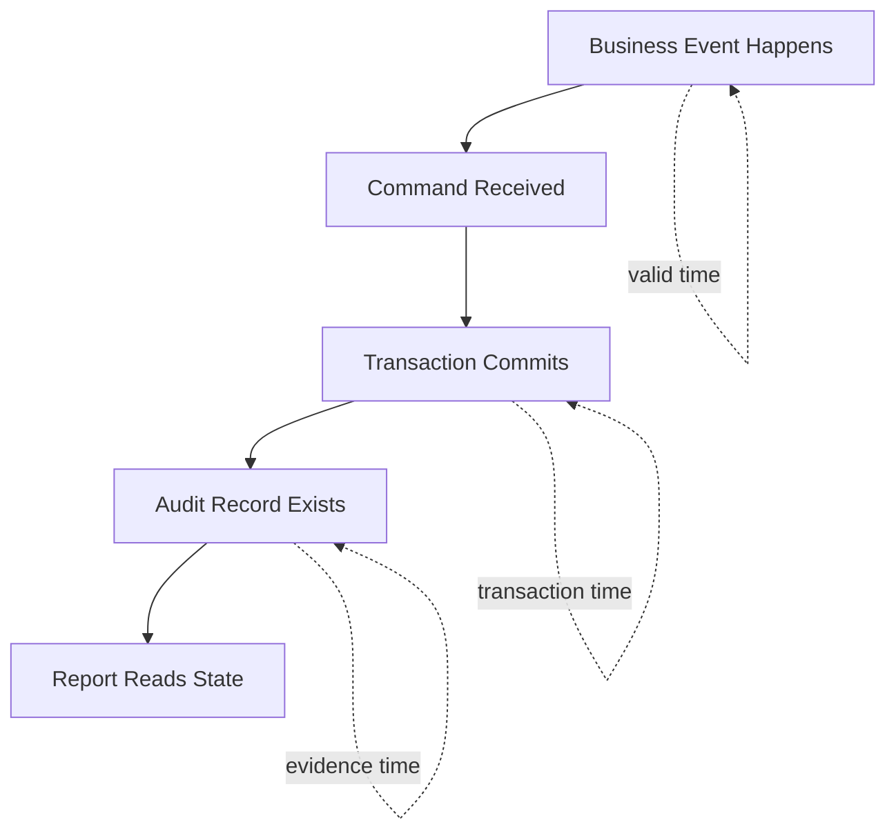
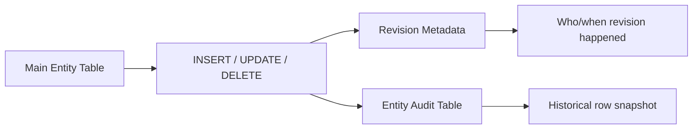
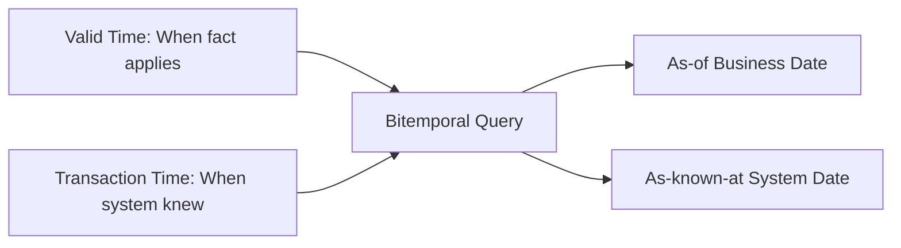
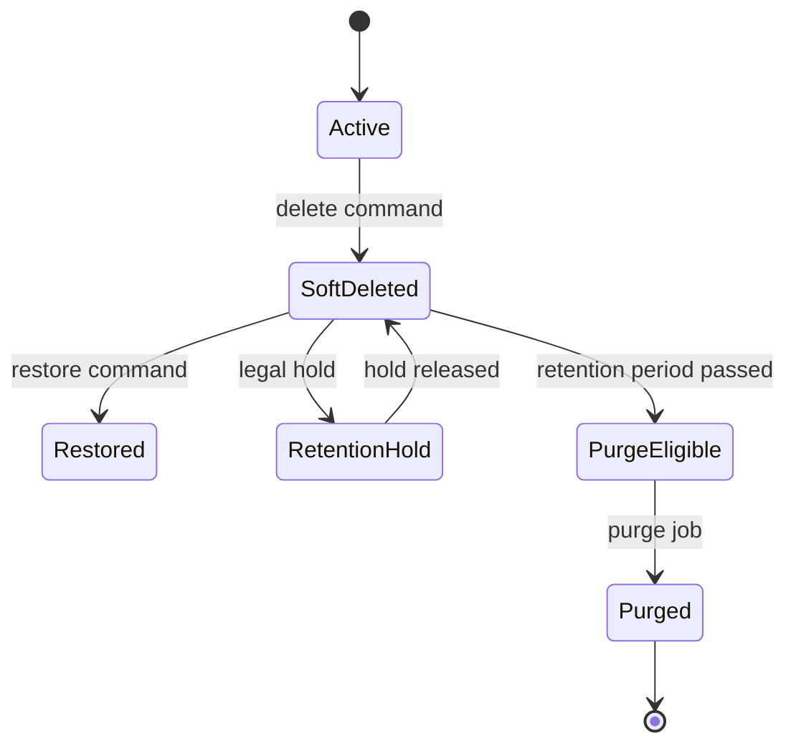

# Part 026 — Auditing, Soft Delete, and Temporal Data

Part 025 covered transactional service boundaries: where a business command starts, commits, rolls back, and publishes side effects.

This part focuses on a different kind of production requirement:

> After data changes, can the system explain what happened, when it happened, who caused it, why it happened, and what the state looked like before and after?

That is the purpose of auditing, soft delete, and temporal data.

These features are often treated as small annotations:

```java
@CreatedDate
private Instant createdAt;
```

or:

```java
@SoftDelete
private boolean deleted;
```

But in serious systems, they are architectural concerns. They affect:

- regulatory defensibility
- incident investigation
- customer support
- forensic reconstruction
- retention policy
- data subject requests
- uniqueness constraints
- foreign keys
- query semantics
- cache invalidation
- reporting accuracy
- event replay
- operational repair

The goal is not just “keep history”. The goal is to preserve **explainable state change**.

---

## 1. Three Different Problems Often Confused

Auditing, soft delete, and temporal data are related, but not the same.

| Concern | Question Answered | Typical Shape |
|---|---|---|
| Metadata auditing | Who created/changed this row and when? | `created_at`, `created_by`, `updated_at`, `updated_by` |
| Change history auditing | What changed over time? | audit tables, revision records, event log |
| Soft delete | Is this record logically deleted but physically retained? | `deleted_at`, `deleted_by`, `deleted_reason`, active flag |
| Temporal validity | When was this fact true in the business world? | `valid_from`, `valid_to` |
| Transaction time | When did the database/system know this fact? | revision timestamp, system period |
| Retention/governance | How long may/must we keep this data? | archive/delete/anonymize policy |

A top-tier engineer does not implement all of them with one `updated_at` column.

---

## 2. The Core Mental Model: Data Has a Timeline

Every persisted fact may have multiple timelines.



Example:

- A violation occurred on **2026-06-01**.
- The case officer recorded it on **2026-06-05**.
- A correction was made on **2026-06-10**.
- A report was generated on **2026-06-30**.

Which date matters?

It depends on the question:

- “When did the violation happen?” → valid time
- “When did the system know?” → transaction time
- “When did the officer change the record?” → audit time
- “What did the report show on June 7?” → historical snapshot

If your model collapses all of these into `updated_at`, it cannot answer serious questions later.

---

## 3. Kaufman Deconstruction: What Skill Are We Practicing?

Auditing and temporal modelling can be decomposed into concrete engineering skills.

| Sub-skill | What You Learn to See | Practice Target |
|---|---|---|
| Metadata audit design | Basic who/when fields | Add reliable created/updated metadata |
| Actor resolution | System user, human user, batch job, integration client | Preserve accountable actor identity |
| Change history | Field-level or snapshot-level history | Reconstruct past state |
| Soft-delete semantics | Hide vs preserve vs restore vs purge | Define deletion lifecycle explicitly |
| Temporal modelling | Valid time vs transaction time | Answer time-based business questions |
| Constraint design | Unique active rows, FK behavior | Avoid ghost rows and duplicate active state |
| Query discipline | Active-only vs include-deleted vs historical | Make query semantics explicit |
| Compliance design | Retention, legal hold, anonymization | Keep evidence without over-retaining |
| Operational repair | Corrections without destroying history | Support defensible fixes |

The target skill:

> Given a persistence requirement, you can decide whether it needs metadata auditing, revision history, soft delete, temporal validity, immutable events, archive tables, or hard delete — and you can explain the trade-offs.

---

## 4. Basic Metadata Auditing

The simplest useful audit fields are:

```java
@CreatedDate
private Instant createdAt;

@LastModifiedDate
private Instant updatedAt;

@CreatedBy
private String createdBy;

@LastModifiedBy
private String updatedBy;
```

In Spring Data JPA, auditing support can populate these fields automatically when auditing is enabled and an auditor provider exists.

### Example base class

```java
@MappedSuperclass
@EntityListeners(AuditingEntityListener.class)
public abstract class AuditedEntity {

    @CreatedDate
    @Column(name = "created_at", nullable = false, updatable = false)
    private Instant createdAt;

    @LastModifiedDate
    @Column(name = "updated_at", nullable = false)
    private Instant updatedAt;

    @CreatedBy
    @Column(name = "created_by", nullable = false, updatable = false, length = 100)
    private String createdBy;

    @LastModifiedBy
    @Column(name = "updated_by", nullable = false, length = 100)
    private String updatedBy;
}
```

Enable auditing:

```java
@Configuration
@EnableJpaAuditing(auditorAwareRef = "auditorAware")
public class JpaAuditingConfig {

    @Bean
    AuditorAware<String> auditorAware() {
        return new SecurityContextAuditorAware();
    }
}
```

Auditor provider:

```java
public class SecurityContextAuditorAware implements AuditorAware<String> {

    @Override
    public Optional<String> getCurrentAuditor() {
        Authentication authentication = SecurityContextHolder.getContext().getAuthentication();

        if (authentication == null || !authentication.isAuthenticated()) {
            return Optional.of("system");
        }

        return Optional.of(authentication.getName());
    }
}
```

This is useful, but it is not full audit history.

It answers:

- who created this row?
- when was it created?
- who last changed it?
- when was it last changed?

It does not answer:

- what changed?
- what was the previous value?
- why was it changed?
- what command caused it?
- what did the whole object look like last week?

---

## 5. Audit Metadata Is Not Enough for Regulated Systems

Consider this row:

| id | status | updated_at | updated_by |
|---:|---|---|---|
| 1001 | CLOSED | 2026-06-30T08:10:00Z | officer-42 |

Can you answer:

- Was the case previously escalated?
- Who assigned the investigator?
- What reason was entered for closure?
- Did anyone reopen the case?
- Did the officer change the risk score?
- What did the user see when they approved it?

No.

Metadata columns tell you the last touch. They do not tell you the story.

For that, you need change history.

---

## 6. Change History Strategies

Common approaches:

| Strategy | Description | Strength | Weakness |
|---|---|---|---|
| Audit columns only | Store created/updated metadata on main table | Simple and cheap | No history |
| Audit table snapshots | Store row snapshot per revision | Reconstruct state | More storage, complex query |
| Field-level audit log | Store changed fields only | Compact, good diff | Harder full reconstruction |
| Domain event log | Store business events | Explains intent | May not reconstruct every field unless designed |
| Database triggers | DB captures changes | Hard to bypass | Logic outside app, harder actor context |
| Hibernate Envers | ORM-level audit tables and revisions | Integrated with JPA/Hibernate | Provider-specific, storage/query trade-offs |
| Temporal tables | DB-managed history | Strong DB semantics | Database-specific |

There is no universally best option.

Choose based on what questions the system must answer.

---

## 7. Hibernate Envers Mental Model

Hibernate Envers is an auditing module that can track changes to audited entities through revision tables.

Basic usage:

```java
@Entity
@Audited
public class EnforcementCase {

    @Id
    private Long id;

    private String referenceNumber;

    @Enumerated(EnumType.STRING)
    private CaseStatus status;
}
```

Envers creates audit data that can be queried by revision.

Conceptually:



Typical tables:

```sql
create table enforcement_case (
    id bigint primary key,
    reference_number varchar(50) not null,
    status varchar(30) not null
);

create table revinfo (
    rev integer primary key,
    revtstmp bigint not null
);

create table enforcement_case_aud (
    id bigint not null,
    rev integer not null,
    revtype smallint,
    reference_number varchar(50),
    status varchar(30),
    primary key (id, rev)
);
```

Envers is useful when:

- you use Hibernate as provider
- entity-level history is required
- snapshot reconstruction matters
- audit is close to persistence model
- you can accept provider-specific behavior

Be cautious when:

- audit semantics must be independent of ORM
- history must be event-intent based
- high-write volume makes audit tables very large
- schema changes must preserve old audit interpretation
- you need cross-service audit correlation

---

## 8. Revision Metadata: Actor, Correlation, Reason

Default revision timestamp is not enough.

For serious systems, revision metadata should include:

- revision id
- timestamp
- actor id
- actor type: human, system, integration, batch
- tenant id
- correlation id
- request id
- command type
- reason code or business justification

Example custom revision entity:

```java
@Entity
@RevisionEntity(SecurityRevisionListener.class)
public class AuditRevisionEntity {

    @Id
    @GeneratedValue
    @RevisionNumber
    private int id;

    @RevisionTimestamp
    private long timestamp;

    private String actorId;
    private String actorType;
    private String tenantId;
    private String correlationId;
    private String commandType;
}
```

Revision listener:

```java
public class SecurityRevisionListener implements RevisionListener {

    @Override
    public void newRevision(Object revisionEntity) {
        AuditRevisionEntity revision = (AuditRevisionEntity) revisionEntity;
        AuditContext context = AuditContextHolder.current();

        revision.setActorId(context.actorId());
        revision.setActorType(context.actorType());
        revision.setTenantId(context.tenantId());
        revision.setCorrelationId(context.correlationId());
        revision.setCommandType(context.commandType());
    }
}
```

This turns audit history from “some row changed” into “this command by this actor changed this state”.

---

## 9. Domain Audit vs Technical Audit

Do not confuse technical audit with domain audit.

Technical audit:

- row changed
- column changed
- revision number
- timestamp
- database operation type

Domain audit:

- officer assigned case
- supervisor approved escalation
- document requested from party
- case closed due to insufficient evidence
- penalty recalculated due to corrected input

Both are useful.

Example domain audit entry:

```java
@Entity
@Table(name = "case_activity")
public class CaseActivity {

    @Id
    private UUID id;

    private Long caseId;

    @Enumerated(EnumType.STRING)
    private ActivityType type;

    private String actorId;
    private Instant occurredAt;
    private String reason;

    @JdbcTypeCode(SqlTypes.JSON)
    private Map<String, Object> details;
}
```

Domain audit is often what users, regulators, and support teams need.

Technical audit is often what engineers need for reconstruction and forensic analysis.

A strong system may use both.

---

## 10. Soft Delete: What It Really Means

Soft delete means a record is no longer active, but it remains physically stored.

Basic shape:

```sql
alter table enforcement_case
add column deleted_at timestamp null,
add column deleted_by varchar(100) null,
add column delete_reason varchar(500) null;
```

Entity fields:

```java
private Instant deletedAt;
private String deletedBy;
private String deleteReason;

public boolean isDeleted() {
    return deletedAt != null;
}
```

Soft delete is not just “add boolean deleted”. It changes semantics:

- normal queries should usually exclude deleted rows
- admin queries may include deleted rows
- restore may or may not be allowed
- unique constraints need active-row semantics
- foreign keys still point to deleted rows
- cascades need explicit rules
- retention policy still applies
- cache must not serve deleted rows as active

---

## 11. Hibernate `@SoftDelete`

Hibernate ORM has built-in soft delete support through `@SoftDelete` in modern versions. It maps deletion to an indicator column and automatically applies soft-delete restrictions for normal entity loading/query behavior.

Conceptually:

```java
@Entity
@SoftDelete
public class EnforcementCase {

    @Id
    private Long id;

    private String referenceNumber;
}
```

This can be useful when:

- you accept Hibernate-specific mapping
- boolean/indicator-based soft delete is enough
- automatic filtering is desired
- restore/admin queries are carefully designed

But be cautious:

- soft delete is provider-specific, not standard JPA
- retrieving deleted rows may require special handling
- business delete metadata may need more than an indicator
- legal retention may require purge/anonymization later
- query behavior can surprise developers if not documented

In many enterprise domains, an explicit `deleted_at` model plus repository/query discipline is easier to reason about than magical deletion behavior.

---

## 12. Soft Delete with Explicit Domain Method

Prefer a domain operation over arbitrary field setting.

```java
@Entity
public class EnforcementCase extends AuditedEntity {

    @Id
    private Long id;

    private Instant deletedAt;
    private String deletedBy;
    private String deleteReason;

    public void softDelete(UserId actor, String reason, Clock clock) {
        if (deletedAt != null) {
            return; // idempotent delete
        }
        if (!canBeDeleted()) {
            throw new CaseCannotBeDeletedException(id);
        }
        this.deletedAt = Instant.now(clock);
        this.deletedBy = actor.value();
        this.deleteReason = reason;
    }

    public void restore(UserId actor, String reason) {
        if (deletedAt == null) {
            return;
        }
        if (!canBeRestored()) {
            throw new CaseCannotBeRestoredException(id);
        }
        this.deletedAt = null;
        this.deletedBy = null;
        this.deleteReason = null;
    }
}
```

Application service:

```java
@Transactional
public void deleteCase(DeleteCaseCommand command) {
    EnforcementCase caze = caseRepository.findActiveById(command.caseId())
        .orElseThrow(() -> new CaseNotFoundException(command.caseId()));

    caze.softDelete(command.actorId(), command.reason(), clock);

    auditRepository.append(CaseActivity.deleted(
        caze.id(),
        command.actorId(),
        command.reason(),
        Instant.now(clock)
    ));
}
```

This preserves business meaning.

---

## 13. Query Semantics: Active, Deleted, Historical

Soft delete requires explicit query language in your application.

Avoid ambiguous repository methods:

```java
Optional<Case> findById(Long id);
```

What does it mean?

- active only?
- include deleted?
- admin view?
- historical view?

Prefer semantic methods:

```java
Optional<EnforcementCase> findActiveById(CaseId id);
Optional<EnforcementCase> findAnyByIdIncludingDeleted(CaseId id);
Page<EnforcementCase> findDeletedCases(DeletedCaseSearch search, Pageable pageable);
```

Query example:

```java
@Query("""
    select c
    from EnforcementCase c
    where c.id = :id
      and c.deletedAt is null
""")
Optional<EnforcementCase> findActiveById(@Param("id") Long id);
```

The method name should carry deletion semantics.

---

## 14. Soft Delete and Unique Constraints

Soft delete breaks naive uniqueness.

Example requirement:

- active case reference number must be unique
- deleted cases are retained
- a new case may reuse a reference only if old case is deleted? Maybe yes, maybe no.

Naive constraint:

```sql
alter table enforcement_case
add constraint uq_case_ref unique (reference_number);
```

This prevents reuse forever.

If business allows reuse only among active rows, use a partial/filtered unique index where supported:

```sql
create unique index uq_case_ref_active
on enforcement_case(reference_number)
where deleted_at is null;
```

If your database does not support partial unique indexes, alternatives include:

- include `deleted_at` or `active_flag` in uniqueness design carefully
- use generated columns
- avoid reuse entirely
- move deleted records to archive table
- model lifecycle status instead of soft delete

Be careful: a nullable column in a composite unique constraint behaves differently across databases.

---

## 15. Soft Delete and Foreign Keys

Foreign keys still reference soft-deleted rows.

Example:

```text
case_document.case_id -> enforcement_case.id
```

If a case is soft-deleted:

- should documents remain visible to admin?
- should normal document queries hide them?
- should documents also be soft-deleted?
- can a document be restored independently?
- should hard purge fail while documents exist?

Define cascade semantics explicitly.

### Option A: Parent-only soft delete

The parent is deleted; children remain physically unchanged.

Good for:

- preserving evidence
- admin recovery
- audit reconstruction

Risk:

- child queries may leak deleted parent data unless filtered

### Option B: Cascading soft delete

Parent and children are marked deleted in one transaction.

Good for:

- aggregate-owned children
- normal UI hiding

Risk:

- restore is complex
- shared children are dangerous
- cascade explosion can update many rows

### Option C: Status lifecycle instead of delete

For cases, “closed”, “withdrawn”, “voided”, or “archived” may be more accurate than “deleted”.

Do not use soft delete to model every terminal state.

---

## 16. Soft Delete vs Status

A common mistake is using soft delete for business lifecycle.

Bad:

```java
case.deleted = true; // means closed? rejected? withdrawn? hidden? duplicate?
```

Better:

```java
public enum CaseStatus {
    DRAFT,
    SUBMITTED,
    IN_REVIEW,
    ESCALATED,
    CLOSED,
    WITHDRAWN,
    VOIDED,
    ARCHIVED
}
```

Use soft delete when the record should be removed from normal active use.

Use status when the record is still part of the business lifecycle.

Often you need both:

- `status = CLOSED`: legitimate terminal business state
- `deleted_at != null`: hidden/removed due to administrative action

---

## 17. Temporal Validity

Temporal validity models when a fact is true in the business domain.

Example: penalty rate changes over time.

```java
@Entity
@Table(name = "penalty_rate")
public class PenaltyRate {

    @Id
    private Long id;

    private String violationCode;
    private BigDecimal rate;
    private LocalDate validFrom;
    private LocalDate validTo;

    public boolean appliesOn(LocalDate date) {
        return !date.isBefore(validFrom)
            && (validTo == null || date.isBefore(validTo));
    }
}
```

Query:

```java
@Query("""
    select r
    from PenaltyRate r
    where r.violationCode = :code
      and r.validFrom <= :date
      and (r.validTo is null or r.validTo > :date)
""")
Optional<PenaltyRate> findEffectiveRate(
    @Param("code") String code,
    @Param("date") LocalDate date
);
```

This answers:

> Which rate was valid on the violation date?

It does not answer:

> What did the system believe the rate was before a correction was entered?

For that, you need transaction-time history or revision audit.

---

## 18. Bitemporal Thinking

Bitemporal data tracks two timelines:

1. **Valid time** — when the fact is true in the real/business world
2. **Transaction time** — when the system recorded that fact

Example:

| violation_code | rate | valid_from | valid_to | recorded_at |
|---|---:|---|---|---|
| A1 | 100 | 2026-01-01 | 2026-06-01 | 2026-01-01T00:00Z |
| A1 | 125 | 2026-06-01 | null | 2026-06-15T10:00Z |

This says:

- The new rate is valid from June 1.
- The system only recorded it on June 15.

Questions:

- For a violation on June 10, should rate be 125?
- For a report generated on June 10, should rate have been 100 because the system did not know yet?
- For a corrected report generated today, should rate be 125?

These are business semantics, not technical details.



---

## 19. Temporal Tables and Archive Tables

Some databases provide temporal table features. Others require manual modelling.

Common approaches:

| Approach | Description | Good For |
|---|---|---|
| Current table + history table | Current row in main table, old rows in history | Most custom systems |
| Append-only table | Every state as new row | Strong history, event-like facts |
| Audit framework | ORM-managed audit tables | Entity revision history |
| Database temporal table | DB tracks system-versioned rows | DB-native historical queries |
| Archive table | Move old records out of hot path | Performance and retention |

Do not pick based on elegance. Pick based on questions, volume, compliance, and query needs.

---

## 20. Designing an Audit Trail Table

A practical domain audit table:

```sql
create table case_activity (
    id uuid primary key,
    case_id bigint not null,
    activity_type varchar(50) not null,
    actor_id varchar(100) not null,
    actor_type varchar(30) not null,
    occurred_at timestamp not null,
    reason varchar(1000),
    correlation_id varchar(100),
    details jsonb
);
```

Entity:

```java
@Entity
@Table(name = "case_activity")
public class CaseActivity {

    @Id
    private UUID id;

    private Long caseId;

    @Enumerated(EnumType.STRING)
    private CaseActivityType activityType;

    private String actorId;

    @Enumerated(EnumType.STRING)
    private ActorType actorType;

    private Instant occurredAt;
    private String reason;
    private String correlationId;

    @JdbcTypeCode(SqlTypes.JSON)
    private Map<String, Object> details;

    protected CaseActivity() {
    }

    public static CaseActivity caseApproved(
        Long caseId,
        UserId actor,
        String reason,
        String correlationId,
        Instant now
    ) {
        CaseActivity activity = new CaseActivity();
        activity.id = UUID.randomUUID();
        activity.caseId = caseId;
        activity.activityType = CaseActivityType.CASE_APPROVED;
        activity.actorId = actor.value();
        activity.actorType = ActorType.HUMAN;
        activity.reason = reason;
        activity.correlationId = correlationId;
        activity.occurredAt = now;
        activity.details = Map.of();
        return activity;
    }
}
```

Use this for business-facing history.

Do not rely only on technical revision tables when business users need understandable activity timelines.

---

## 21. Audit Logs Must Be Written in the Same Transaction When They Explain State

If an audit record explains a state change, it should commit atomically with that state change.

Good:

```java
@Transactional
public void approveCase(ApproveCaseCommand command) {
    EnforcementCase caze = caseRepository.getForApproval(command.caseId());
    caze.approve(command.actorId(), command.reason(), clock);

    activityRepository.save(CaseActivity.caseApproved(
        caze.id(),
        command.actorId(),
        command.reason(),
        command.correlationId(),
        Instant.now(clock)
    ));
}
```

Bad:

```java
@Transactional
public void approveCase(ApproveCaseCommand command) {
    caze.approve(...);
}

@Async
public void auditApproval(...) {
    activityRepository.save(...);
}
```

If approval commits but async audit fails, the system loses accountability.

Exception: separate “attempt logs” may intentionally commit independently, but call them attempt logs, not state-change audit.

---

## 22. Actor Identity Is Not Always a User ID

Actor could be:

- authenticated human user
- service account
- scheduled job
- migration script
- integration client
- support impersonation session
- automated rule engine
- workflow engine
- data repair operation

Represent actor type explicitly.

```java
public record AuditActor(
    String id,
    ActorType type,
    Optional<String> impersonatedBy,
    Optional<String> sourceSystem
) {
}
```

Avoid storing only `username` if the system has non-human operations.

For support impersonation, preserve both:

- subject user
- support/admin actor

Otherwise, accountability is misleading.

---

## 23. Clock Discipline

Time fields are deceptively hard.

Recommendations:

- use `Instant` for machine timestamps
- use database timezone consistently, usually UTC
- inject `Clock` for testable application timestamps
- distinguish business dates from technical timestamps
- avoid using local server timezone implicitly
- avoid updating `updated_at` for pure read operations
- be careful with bulk updates bypassing entity listeners

Example:

```java
@Configuration
public class TimeConfig {

    @Bean
    Clock clock() {
        return Clock.systemUTC();
    }
}
```

Entity method:

```java
public void close(UserId actor, String reason, Clock clock) {
    this.status = CaseStatus.CLOSED;
    this.closedAt = Instant.now(clock);
    this.closedBy = actor.value();
    this.closeReason = reason;
}
```

This makes tests deterministic.

---

## 24. Bulk Updates Can Bypass Audit Logic

JPA bulk update/delete operates directly against the database and does not update managed entity state in the normal way.

Example:

```java
@Modifying
@Query("""
    update EnforcementCase c
    set c.status = 'ARCHIVED'
    where c.closedAt < :cutoff
""")
int archiveOldCases(@Param("cutoff") Instant cutoff);
```

Risks:

- entity listeners may not run as expected
- audit fields may not update
- Envers may not capture changes depending on path/provider behavior
- persistence context can become stale
- domain methods are bypassed
- business audit trail is skipped

For production bulk changes:

- decide whether audit history is required
- explicitly update audit columns
- write a domain audit batch record
- clear persistence context after execution
- run in controlled chunks if needed
- record operator, reason, and correlation id

Example:

```java
@Modifying(clearAutomatically = true, flushAutomatically = true)
@Query("""
    update EnforcementCase c
    set c.status = :archived,
        c.updatedAt = :now,
        c.updatedBy = :actor
    where c.status = :closed
      and c.closedAt < :cutoff
""")
int archiveOldClosedCases(
    @Param("closed") CaseStatus closed,
    @Param("archived") CaseStatus archived,
    @Param("cutoff") Instant cutoff,
    @Param("now") Instant now,
    @Param("actor") String actor
);
```

Still, this does not call domain methods. Use it only when that is acceptable.

---

## 25. Delete Semantics Decision Matrix

Before implementing delete, answer this matrix.

| Question | Hard Delete | Soft Delete | Archive | Anonymize |
|---|---:|---:|---:|---:|
| Normal users should not see it | Yes | Yes | Yes | Maybe |
| Storage must be physically removed | Yes | No | No | No/partial |
| Restore possible | No | Yes | Maybe | No |
| Foreign keys remain easy | Maybe | Yes | More complex | Yes |
| Audit reconstruction possible | Poor unless separate audit | Good | Good | Limited |
| Legal retention supported | No if removed too early | Yes | Yes | Yes |
| Privacy erasure supported | Yes | No | No | Better |

Soft delete is not a privacy erasure mechanism.

If the requirement is “forget personal data”, soft delete is usually insufficient. You may need anonymization, token deletion, encryption key destruction, or hard purge depending on law and policy.

---

## 26. Retention and Purge Workflow

Soft-deleted rows should not live forever by accident.

A mature lifecycle:



Purge job must consider:

- retention period
- legal hold
- foreign keys
- audit preservation
- anonymization requirements
- backups
- search index deletion
- cache eviction
- external replicas

A delete feature without retention policy is incomplete.

---

## 27. Admin Restore Is a Business Operation

Restore is not just setting `deleted_at = null`.

Questions:

- Is the original unique value still available?
- Are child records restored too?
- Was the parent deleted because of a legal reason?
- Are related workflows still valid?
- Does restored data need re-indexing?
- Should an event be emitted?
- Who approved the restore?

Example:

```java
@Transactional
public void restoreCase(RestoreCaseCommand command) {
    EnforcementCase caze = caseRepository.findDeletedById(command.caseId())
        .orElseThrow(() -> new DeletedCaseNotFoundException(command.caseId()));

    restorePolicy.assertCanRestore(caze, command.actorId());

    caze.restore(command.actorId(), command.reason());

    activityRepository.save(CaseActivity.restored(
        caze.id(),
        command.actorId(),
        command.reason(),
        Instant.now(clock)
    ));

    outboxRepository.append(OutboxMessage.caseRestored(caze.id()));
}
```

Restore is a command with audit, policy, event, and transaction boundary.

---

## 28. Indexing Audit and Temporal Tables

Audit and temporal tables get large.

Plan indexes based on access patterns.

Common queries:

- activity timeline by case id
- changes by actor
- changes in date range
- revisions for entity id
- active records only
- deleted records by deletion date
- effective rate on date
- purge candidates by retention date

Example indexes:

```sql
create index ix_case_activity_case_time
on case_activity(case_id, occurred_at desc);

create index ix_case_activity_actor_time
on case_activity(actor_id, occurred_at desc);

create index ix_case_deleted_at
on enforcement_case(deleted_at)
where deleted_at is not null;

create index ix_penalty_rate_effective
on penalty_rate(violation_code, valid_from, valid_to);
```

Audit is not free. Design for query and storage from the beginning.

---

## 29. Cache Interaction

Soft delete and audit changes interact with caching.

Risks:

- second-level cache returns entity deleted by another transaction
- query cache returns stale active-list result
- application cache ignores deletion marker
- search index still contains deleted document
- CDN/API cache exposes deleted data

Rules:

- evict cache on soft delete and restore
- cache only active query results if invalidation is reliable
- include deletion/version metadata in cache keys when appropriate
- do not cache admin include-deleted views casually
- update search indexes through outbox/event relay

Deletion is a state transition. Treat it like any other important write.

---

## 30. Security and Compliance Considerations

Audit systems contain sensitive data.

They often include:

- user identifiers
- IP addresses
- before/after values
- personal data
- case details
- reasons and comments
- security context

Protect audit data:

- restrict access
- avoid logging secrets
- avoid storing full tokens/API keys
- consider field-level redaction
- encrypt sensitive audit payloads if needed
- define retention period
- support legal hold
- separate operational logs from audit records
- monitor audit table access

Audit data is not automatically safe just because it supports compliance.

---

## 31. Tamper Evidence

For high-integrity systems, audit records should be hard to alter silently.

Options:

- append-only audit tables
- database permissions preventing update/delete
- hash chain between audit records
- write-once storage export
- separate audit database/account
- periodic signed snapshots
- immutable event stream

Simple hash chain concept:

```text
record_hash = SHA256(previous_hash + canonical_payload)
```

Schema sketch:

```sql
create table audit_event (
    id uuid primary key,
    occurred_at timestamp not null,
    aggregate_type varchar(100) not null,
    aggregate_id varchar(100) not null,
    event_type varchar(100) not null,
    payload jsonb not null,
    previous_hash varchar(128),
    record_hash varchar(128) not null
);
```

This does not prevent all tampering, but it makes tampering detectable if hashes are verified and anchored properly.

---

## 32. Testing Audit, Soft Delete, and Temporal Logic

Do not test only “field is not null”.

Test behavior.

### Metadata audit test

```java
@Test
void createsAuditMetadata() {
    EnforcementCase caze = repository.save(new EnforcementCase("CASE-1"));
    entityManager.flush();

    assertThat(caze.getCreatedAt()).isNotNull();
    assertThat(caze.getUpdatedAt()).isNotNull();
    assertThat(caze.getCreatedBy()).isEqualTo("test-user");
}
```

### Soft delete visibility test

```java
@Test
void deletedCaseIsHiddenFromActiveQueries() {
    EnforcementCase caze = givenActiveCase();

    service.deleteCase(new DeleteCaseCommand(caze.id(), userId, "duplicate"));

    assertThat(repository.findActiveById(caze.id())).isEmpty();
    assertThat(repository.findAnyByIdIncludingDeleted(caze.id())).isPresent();
}
```

### Unique active constraint test

```java
@Test
void duplicateActiveReferenceIsRejected() {
    repository.save(new EnforcementCase("CASE-1"));

    assertThatThrownBy(() -> repository.saveAndFlush(new EnforcementCase("CASE-1")))
        .isInstanceOf(DataIntegrityViolationException.class);
}
```

### Temporal query test

```java
@Test
void findsRateEffectiveOnBusinessDate() {
    rateRepository.save(rate("A1", "100.00", LocalDate.parse("2026-01-01"), LocalDate.parse("2026-06-01")));
    rateRepository.save(rate("A1", "125.00", LocalDate.parse("2026-06-01"), null));

    PenaltyRate rate = rateRepository.findEffectiveRate("A1", LocalDate.parse("2026-06-10"))
        .orElseThrow();

    assertThat(rate.amount()).isEqualByComparingTo("125.00");
}
```

---

## 33. Failure Modes

| Failure | Cause | Prevention |
|---|---|---|
| Audit row missing | Audit written async/outside transaction | Write state-change audit inside same transaction |
| Wrong actor | AuditorAware only handles human user | Model actor type/source explicitly |
| Bulk update bypasses audit | JPQL bulk update skips domain method | Use controlled bulk path with explicit audit |
| Deleted row visible | Query forgot active predicate | Semantic repository methods; filters; tests |
| Cannot create duplicate after delete | Unique constraint ignores deletion | Partial unique index or business no-reuse rule |
| Restore corrupts state | Restore ignores uniqueness/child state | Restore policy and transaction boundary |
| Audit table explodes | No retention/partitioning/indexing | Storage lifecycle and access-pattern indexes |
| Privacy violation | Soft delete used instead of erasure | Anonymization/purge policy |
| Historical report wrong | Only current state stored | Revision/temporal modelling |
| Cache exposes deleted data | Cache not evicted | Event-driven invalidation and tests |

---

## 34. Design Checklist

### Audit metadata

- [ ] Does every important entity have created/updated timestamps?
- [ ] Is actor identity reliable for human, system, batch, and integration operations?
- [ ] Is `Clock` injectable for tests?
- [ ] Are bulk updates handled explicitly?

### Change history

- [ ] Do we need full snapshots, field diffs, or domain events?
- [ ] Can we reconstruct past state if required?
- [ ] Is revision metadata rich enough?
- [ ] Is audit data protected from unauthorized access?

### Soft delete

- [ ] Is soft delete actually the right lifecycle concept?
- [ ] Are active vs include-deleted queries explicit?
- [ ] Are unique constraints compatible with deleted rows?
- [ ] Are foreign-key and child semantics defined?
- [ ] Is restore a real business command?
- [ ] Is purge/retention defined?

### Temporal data

- [ ] Do we distinguish valid time from transaction time?
- [ ] Can reports answer “as of business date” questions?
- [ ] Can reports answer “as known at system date” questions if needed?
- [ ] Are temporal indexes aligned with query patterns?

### Compliance

- [ ] Are audit logs immutable enough for the risk level?
- [ ] Are sensitive values redacted/encrypted?
- [ ] Are retention and legal hold rules represented?
- [ ] Are backups/search indexes/replicas included in deletion policy?

---

## 35. Summary

Auditing, soft delete, and temporal data are not decoration. They define how the system explains itself over time.

Key rules:

- audit metadata answers only who/when last touched the row
- revision history answers what changed
- domain audit answers why a business transition happened
- soft delete is a lifecycle state, not privacy erasure
- restore and purge are business operations
- temporal validity is different from transaction time
- bulk updates must not bypass accountability accidentally
- cache, indexes, constraints, and foreign keys must all understand deletion/history semantics

The deeper principle:

> Persisted data is not just current state. It is evidence of decisions over time.

Part 027 continues with **validation and invariant enforcement**: how to decide which rules belong in the domain model, Bean Validation, database constraints, service policies, and transactional checks.

---

## References

- Spring Data JPA Reference — Auditing: https://docs.spring.io/spring-data/jpa/reference/auditing.html
- Spring Data Commons Reference — Auditing: https://docs.spring.io/spring-data/commons/reference/auditing.html
- Hibernate Envers Project: https://hibernate.org/orm/envers/
- Hibernate ORM User Guide — Envers: https://docs.hibernate.org/stable/orm/userguide/html_single/Hibernate_User_Guide.html#envers
- Hibernate ORM Javadoc — `@SoftDelete`: https://docs.hibernate.org/orm/7.1/javadocs/org/hibernate/annotations/SoftDelete.html
- Jakarta Persistence 3.2 Specification: https://jakarta.ee/specifications/persistence/3.2/jakarta-persistence-spec-3.2
