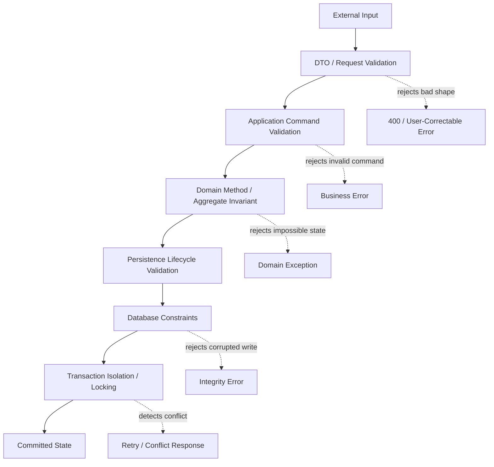
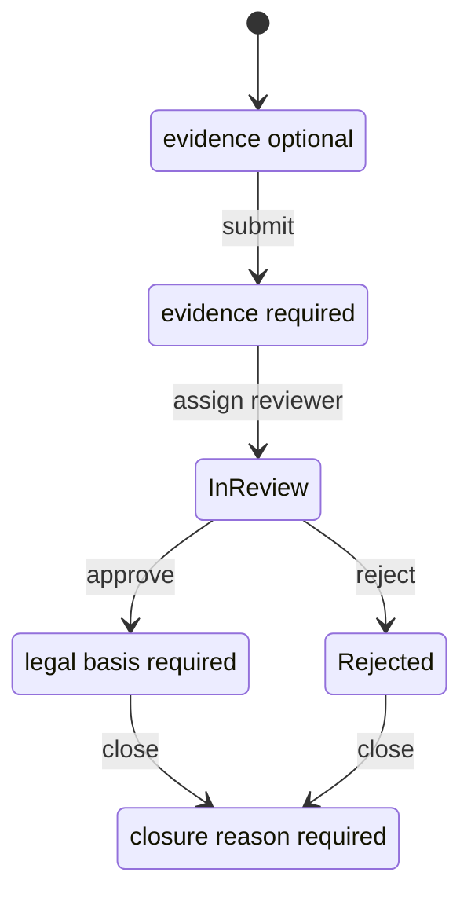
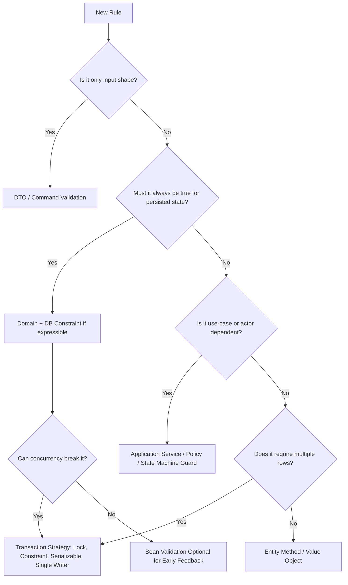
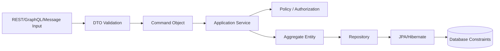

# Part 027 — Validation and Invariant Enforcement

Part 026 covered auditing, soft delete, and temporal data: how persistent state remains explainable after it changes.

This part focuses on a deeper question:

> Before state is persisted, who is responsible for proving that the state is valid?

In small applications, validation often means annotations like this:

```java
@NotBlank
private String name;
```

In serious persistence systems, validation is not one mechanism. It is a **layered enforcement strategy** across:

- input boundary validation
- command validation
- domain invariant enforcement
- aggregate consistency rules
- persistence lifecycle validation
- database constraints
- transaction-time checks
- concurrency control
- migration-time data quality checks
- operational repair rules

A top-tier engineer does not ask, “Should I put validation in the entity or service?”

A better question is:

> What kind of rule is this, when can it be known, who owns it, and what failure mode must be impossible?

---

## 1. The Mental Model: Validation Is Not the Same as Invariant Enforcement

The words are often used interchangeably, but they are not the same.

| Concept | Meaning | Example | Failure Severity |
|---|---|---|---|
| Syntactic validation | Shape is acceptable | email field is not blank | low to medium |
| Semantic validation | value makes sense | due date must be in the future | medium |
| Domain invariant | state must always be true | approved case must have approver | high |
| Cross-aggregate rule | rule spans many rows/entities | cannot assign more than N active cases to officer | high |
| Referential integrity | referenced data exists | `customer_id` points to existing customer | high |
| Transactional invariant | rule must survive concurrency | quota cannot be exceeded under parallel requests | very high |
| Regulatory invariant | rule must be defensible later | enforcement decision must store legal basis | critical |

Validation often rejects bad input.

Invariant enforcement prevents impossible state.

That difference changes where the rule belongs.

---

## 2. The Layered Enforcement Stack

A persistence system has multiple places to enforce correctness.



No single layer is enough.

Input validation cannot protect against race conditions.

Database constraints cannot express every business rule clearly.

Entity annotations cannot know the full command intent.

Service-layer checks can be invalidated by concurrent transactions.

The system is correct when the layers are assigned intentionally.

---

## 3. Kaufman Deconstruction: What You Must Be Able to Do

For this topic, the skill decomposes into seven subskills.

| Subskill | You Are Competent When You Can... |
|---|---|
| Classify rules | distinguish format rules, domain invariants, DB constraints, and transactional rules |
| Place rules | decide whether a rule belongs in DTO, domain object, service, database, or transaction mechanism |
| Use Bean Validation | apply standard constraints, custom constraints, validation groups, cascaded validation, and method validation |
| Design database constraints | use `NOT NULL`, `UNIQUE`, `CHECK`, FK, exclusion-like constraints, partial indexes where supported |
| Model lifecycle validation | understand when JPA validation/callbacks run and what they can/cannot safely do |
| Handle failure | map validation/integrity/concurrency failures into correct API/application errors |
| Test invariants | prove impossible states remain impossible under normal and concurrent execution |

The goal is not memorizing annotations.

The goal is knowing **where truth lives**.

---

## 4. Rule Classification Framework

Before implementing validation, classify the rule.

### 4.1 Shape Rule

A shape rule says the value has acceptable structure.

Examples:

```java
@NotBlank
@Size(max = 120)
private String displayName;

@Email
private String email;
```

Good places:

- request DTO
- command DTO
- entity if always true for persisted state

Bad places:

- deep service logic only
- database only, unless it must protect final state too

### 4.2 Persistence Integrity Rule

A persistence integrity rule protects stored data.

Examples:

- column must not be null
- foreign key must exist
- external id must be unique
- status column must be one of known values
- amount must be non-negative

Good places:

- database constraint as final guard
- entity mapping as documentation and early failure
- migration test

### 4.3 Domain Invariant

A domain invariant is something that should always be true for a valid domain object.

Examples:

- a submitted case must have a submitter
- a closed investigation must have a closure reason
- an approved enforcement action must have approving authority
- a payment allocation cannot exceed the invoice outstanding amount

Good places:

- aggregate method
- constructor/factory
- domain service if it spans multiple aggregate roots
- database constraint if expressible

### 4.4 Command Rule

A command rule depends on intent.

Example:

```text
A case may be escalated only by a supervisor.
```

This is not just a property of `CaseEntity`. It depends on:

- actor
- current state
- command type
- organization policy
- timestamp
- authorization context

Good places:

- application service
- command handler
- policy object
- workflow/state-machine guard

Not enough:

- Bean Validation on entity fields

### 4.5 Transactional Rule

A transactional rule can be broken by concurrency.

Example:

```text
An officer may have at most 20 active assigned cases.
```

A naive service check is unsafe:

```java
int active = assignmentRepository.countActiveByOfficer(officerId);

if (active >= 20) {
    throw new CapacityExceededException();
}

assignmentRepository.save(new Assignment(officerId, caseId));
```

Two transactions can both see `19` and both insert, producing `21`.

This requires:

- unique/partial constraints if expressible
- pessimistic lock on quota row
- serializable isolation
- advisory lock
- single-writer command queue
- atomic database operation

---

## 5. Bean Validation in the Persistence Stack

Jakarta Validation provides object-level constraints via annotations and validation APIs. Hibernate Validator is the common reference implementation used in many Java stacks.

### 5.1 Basic Entity Validation

```java
@Entity
@Table(name = "customers")
public class CustomerEntity {

    @Id
    @GeneratedValue(strategy = GenerationType.IDENTITY)
    private Long id;

    @NotBlank
    @Size(max = 120)
    @Column(name = "display_name", nullable = false, length = 120)
    private String displayName;

    @Email
    @Size(max = 254)
    @Column(name = "email", length = 254)
    private String email;

    protected CustomerEntity() {
    }

    public CustomerEntity(String displayName, String email) {
        this.displayName = displayName;
        this.email = email;
    }
}
```

This gives two layers:

| Layer | Mechanism | Role |
|---|---|---|
| Bean Validation | `@NotBlank`, `@Size`, `@Email` | early object-level failure |
| Database | `nullable = false`, column length | final persistence-level guard |

But be careful:

```java
@Column(nullable = false)
```

is mapping metadata. It may influence schema generation, but it is not a replacement for a real database `NOT NULL` constraint in production migration scripts.

---

## 6. Entity Validation Is Not Full Domain Validation

Entity validation works well for local field rules.

It is weaker for rules that depend on:

- current actor
- authorization
- external service response
- previous state
- aggregate-wide state
- database query result
- current workflow transition
- time-sensitive policy
- concurrency behavior

Bad example:

```java
@Entity
public class EnforcementCaseEntity {

    @AssertTrue(message = "Closed case must have closure reason")
    public boolean isClosureReasonValid() {
        return status != CaseStatus.CLOSED || closureReason != null;
    }
}
```

This may be acceptable for a simple invariant, but it becomes problematic if closure depends on:

- closure type
- supervisor approval
- latest inspection result
- appeal window
- legal jurisdiction
- effective policy version

A better design is explicit transition logic:

```java
public void close(CloseCaseCommand command, Officer officer, Clock clock) {
    requireStatus(CaseStatus.IN_REVIEW);
    requireSupervisor(officer);
    requireNonBlank(command.reason());

    this.status = CaseStatus.CLOSED;
    this.closureReason = command.reason();
    this.closedBy = officer.id();
    this.closedAt = Instant.now(clock);
}
```

The entity method represents a business transition, not just setter mutation.

---

## 7. DTO Validation vs Entity Validation

Request DTO validation protects the application boundary.

```java
public record CreateCustomerRequest(
    @NotBlank
    @Size(max = 120)
    String displayName,

    @Email
    @Size(max = 254)
    String email
) {
}
```

Entity validation protects persisted state.

```java
@Entity
public class CustomerEntity {
    @NotBlank
    @Column(nullable = false)
    private String displayName;
}
```

They overlap, but they are not equivalent.

| DTO Validation | Entity Validation |
|---|---|
| validates input command shape | validates persistent object state |
| can vary per endpoint/use case | should reflect durable state rules |
| may include UX-friendly messages | should be stable and domain-oriented |
| can accept partial updates | should not make entity partially valid by accident |

### 7.1 Partial Update Trap

Consider PATCH:

```java
public record PatchCustomerRequest(
    @Size(max = 120)
    String displayName,

    @Email
    String email
) {
}
```

`displayName` may be null because it means “not provided”.

But entity `displayName` must not be null.

Do not reuse the entity as the request body.

Bad:

```java
@PatchMapping("/customers/{id}")
public void patch(@RequestBody @Valid CustomerEntity entity) {
    repository.save(entity);
}
```

Problems:

- exposes persistence model as API
- allows client-controlled id/version fields
- creates detached merge risk
- confuses absent vs null
- weakens invariant clarity

Better:

```java
@Transactional
public void patchCustomer(CustomerId id, PatchCustomerRequest request) {
    CustomerEntity customer = customerRepository.getRequired(id);

    if (request.displayName() != null) {
        customer.rename(request.displayName());
    }

    if (request.email() != null) {
        customer.changeEmail(request.email());
    }
}
```

---

## 8. Validation Groups

Validation groups let different rules apply in different contexts.

```java
public interface OnCreate {}
public interface OnUpdate {}
```

```java
public record CustomerCommand(
    @Null(groups = OnCreate.class)
    @NotNull(groups = OnUpdate.class)
    Long id,

    @NotBlank(groups = {OnCreate.class, OnUpdate.class})
    String displayName
) {
}
```

Usage:

```java
validator.validate(command, OnCreate.class);
```

JPA providers can also validate entities during lifecycle events. However, do not overuse validation groups to encode complex workflow rules.

Bad smell:

```java
OnDraft
OnSubmitted
OnReviewed
OnEscalated
OnClosed
OnReopened
OnAppealed
OnArchived
```

At that point, you are not modelling validation. You are hiding a state machine inside validation metadata.

Use a real state transition model.

---

## 9. Cascaded Validation

Bean Validation can validate nested objects with `@Valid`.

```java
public record CreateOrderRequest(
    @NotNull CustomerRef customer,

    @Valid
    @NotEmpty
    List<CreateOrderLineRequest> lines
) {
}

public record CreateOrderLineRequest(
    @NotNull ProductId productId,
    @Positive int quantity
) {
}
```

For entity graphs:

```java
@OneToMany(mappedBy = "order", cascade = CascadeType.ALL, orphanRemoval = true)
@Valid
private List<OrderLineEntity> lines = new ArrayList<>();
```

Use with caution.

Cascaded validation on large object graphs can become expensive and surprising. It may validate entities you did not intend to validate during flush.

Practical rule:

> Use cascaded validation for true aggregate-owned children. Avoid it across broad many-to-one or shared references.

---

## 10. Method Validation

Method validation is useful at service boundaries.

```java
@Service
@Validated
public class CustomerApplicationService {

    @Transactional
    public CustomerId create(@Valid CreateCustomerRequest request) {
        // command handling
    }
}
```

It helps enforce input contracts before transaction work starts.

But method validation should not replace domain logic.

```java
public void approve(@NotNull CaseId caseId, @NotNull OfficerId officerId) {
    // @NotNull is not enough.
    // You still need to check whether officer may approve this case.
}
```

---

## 11. Custom Bean Validation Constraint

For reusable local rules, create a custom constraint.

Example: normalized business code.

```java
@Target({ ElementType.FIELD, ElementType.PARAMETER })
@Retention(RetentionPolicy.RUNTIME)
@Constraint(validatedBy = BusinessCodeValidator.class)
public @interface BusinessCode {
    String message() default "invalid business code";
    Class<?>[] groups() default {};
    Class<? extends Payload>[] payload() default {};
}
```

```java
public class BusinessCodeValidator implements ConstraintValidator<BusinessCode, String> {

    private static final Pattern PATTERN = Pattern.compile("[A-Z]{3}-[0-9]{6}");

    @Override
    public boolean isValid(String value, ConstraintValidatorContext context) {
        return value == null || PATTERN.matcher(value).matches();
    }
}
```

Use it where the rule is purely local.

```java
@BusinessCode
@Column(name = "business_code", length = 10)
private String businessCode;
```

Do not use custom validators to perform database queries casually.

Bad:

```java
@UniqueEmail
private String email;
```

This looks convenient, but uniqueness is a database/transactional concern. A validator query can race.

Better:

- validate email format early
- create a unique database constraint
- catch unique violation and map to business error

---

## 12. Database Constraints Are Not Optional

Application validation improves user feedback. Database constraints protect truth.

For persistent invariants, the database should be the final authority when the rule is expressible.

```sql
ALTER TABLE customers
    ALTER COLUMN display_name SET NOT NULL;

ALTER TABLE customers
    ADD CONSTRAINT uk_customers_email UNIQUE (email);

ALTER TABLE invoices
    ADD CONSTRAINT ck_invoices_total_non_negative CHECK (total_amount >= 0);
```

Entity annotations can mirror these rules:

```java
@Entity
@Table(
    name = "customers",
    uniqueConstraints = {
        @UniqueConstraint(name = "uk_customers_email", columnNames = "email")
    }
)
public class CustomerEntity {

    @NotBlank
    @Column(name = "display_name", nullable = false, length = 120)
    private String displayName;

    @Email
    @Column(name = "email", unique = true, length = 254)
    private String email;
}
```

But production schema should be managed by migration, not by trusting annotation auto-generation.

---

## 13. Constraint Naming Matters

Name constraints intentionally.

Bad:

```sql
ALTER TABLE customers ADD UNIQUE (email);
```

The database may generate a name like:

```text
customers_email_key
SYS_C008123
UK_1r4nxyzabc
```

Better:

```sql
ALTER TABLE customers
    ADD CONSTRAINT uk_customer_email UNIQUE (email);
```

Why it matters:

- easier incident debugging
- stable error mapping
- safer migrations
- clearer logs
- better DBA collaboration
- meaningful alerts

Application mapping example:

```java
public RuntimeException translate(DataIntegrityViolationException ex) {
    if (hasConstraint(ex, "uk_customer_email")) {
        return new DuplicateEmailException();
    }
    return ex;
}
```

---

## 14. Database Constraint vs Bean Validation Matrix

| Rule | Bean Validation | DB Constraint | Domain Method | Service Rule |
|---|---:|---:|---:|---:|
| name not blank | yes | maybe check/not null | yes | no |
| email format | yes | weak or no | maybe | no |
| email unique | no, except preflight UX | yes | no | catch/map |
| amount non-negative | yes | yes | yes | maybe |
| closed case has reason | maybe | yes if simple | yes | maybe |
| actor may approve case | no | no | maybe | yes |
| max active assignment under concurrency | no | maybe | no | yes + lock/isolation |
| FK exists | no | yes | no | maybe preload |
| valid state transition | no | maybe | yes | yes |
| soft-deleted row cannot be active | maybe | yes if expressible | yes | yes |

Use duplication intentionally.

The same rule can exist in multiple layers for different reasons:

- DTO: friendly feedback
- domain: impossible object state
- database: final guard
- service: use-case orchestration

That is not always duplication. Sometimes it is defense in depth.

---

## 15. Entity Callbacks

JPA entity callbacks can run around lifecycle events.

```java
@Entity
public class InvoiceEntity {

    @PrePersist
    @PreUpdate
    void validate() {
        if (totalAmount.signum() < 0) {
            throw new IllegalStateException("total amount must be non-negative");
        }
    }
}
```

Common callbacks:

```java
@PrePersist
@PostPersist
@PreUpdate
@PostUpdate
@PreRemove
@PostRemove
@PostLoad
```

Use callbacks for local, deterministic concerns:

- initialize timestamps if not handled elsewhere
- normalize fields
- enforce simple local invariants
- derive denormalized local fields

Avoid callbacks for:

- repository calls
- remote service calls
- publishing events directly
- authorization checks
- complex workflow transitions
- cross-aggregate queries

### 15.1 Callback Hidden Mutation Trap

Bad:

```java
@PreUpdate
void beforeUpdate() {
    this.status = recomputeStatusFromDatabase();
}
```

Problems:

- callbacks are hidden from command flow
- repository/service dependencies inside entity are unnatural
- behavior may differ between tests and runtime
- hard to reason about transaction ordering

Prefer explicit application/domain logic.

---

## 16. Normalization Before Validation

Validation should usually happen after deterministic normalization.

Example:

```java
public EmailAddress(String value) {
    String normalized = value == null ? null : value.trim().toLowerCase(Locale.ROOT);

    if (normalized == null || normalized.isBlank()) {
        throw new IllegalArgumentException("email is required");
    }

    this.value = normalized;
}
```

If you validate before trimming, this passes incorrectly or fails inconsistently:

```text
" alice@example.com "
```

### 16.1 Where to Normalize

| Data | Normalize Where? |
|---|---|
| user-entered whitespace | request mapper/value object |
| email lower-casing | value object/domain constructor, if business semantics allow |
| phone number | specialized parser/value object |
| monetary scale | value object or database numeric definition |
| enum-like code | converter/value object |
| legal names | be careful; do not over-normalize |
| audit notes | preserve original unless policy says otherwise |

Normalization is domain-sensitive.

Do not blindly trim, lowercase, or canonicalize regulated text if the original value matters for evidence.

---

## 17. Value Objects as Validation Boundaries

A strong persistence model often uses value objects to prevent invalid primitives.

```java
@Embeddable
public class Money {

    @NotNull
    @Column(name = "amount", nullable = false, precision = 19, scale = 4)
    private BigDecimal amount;

    @NotNull
    @Column(name = "currency", nullable = false, length = 3)
    private String currency;

    protected Money() {
    }

    public Money(BigDecimal amount, String currency) {
        if (amount == null) {
            throw new IllegalArgumentException("amount is required");
        }
        if (currency == null || !currency.matches("[A-Z]{3}")) {
            throw new IllegalArgumentException("currency must be ISO-like code");
        }
        this.amount = amount.setScale(4, RoundingMode.UNNECESSARY);
        this.currency = currency;
    }
}
```

This prevents the common primitive obsession problem:

```java
BigDecimal amount;
String currency;
```

where every caller must remember the rules.

### 17.1 Entity Setter Anti-Pattern

Bad:

```java
public void setAmount(BigDecimal amount) {
    this.amount = amount;
}

public void setCurrency(String currency) {
    this.currency = currency;
}
```

This allows invalid intermediate states:

```java
invoice.setAmount(new BigDecimal("100.00"));
invoice.setCurrency(null);
```

Better:

```java
public void changeTotal(Money total) {
    if (total.isNegative()) {
        throw new IllegalArgumentException("invoice total cannot be negative");
    }
    this.total = total;
}
```

---

## 18. Invariants and State Machines

Many persistence invariants are state-dependent.

Example:

```text
A case in DRAFT may have missing evidence.
A case in SUBMITTED must have at least one evidence item.
A case in APPROVED must have reviewer, legal basis, and approval timestamp.
A case in CLOSED must have closure reason.
```

Do not model this only with nullable columns and scattered `if` statements.



A good entity exposes transitions:

```java
public void submit(SubmitCaseCommand command, Clock clock) {
    requireStatus(CaseStatus.DRAFT);
    requireAtLeastOneEvidence();

    this.status = CaseStatus.SUBMITTED;
    this.submittedAt = Instant.now(clock);
    this.submittedBy = command.actorId();
}
```

Do not expose generic setters for state machine fields.

Bad:

```java
caseEntity.setStatus(CaseStatus.APPROVED);
caseEntity.setApprovedBy(userId);
caseEntity.setApprovedAt(now);
```

Better:

```java
caseEntity.approve(new ApprovalDecision(userId, legalBasis, now));
```

---

## 19. Cross-Entity Invariants

Some invariants require multiple rows/entities.

Example:

```text
An invoice is payable only when all required approvals exist.
```

You can enforce this at command time:

```java
@Transactional
public void markPayable(InvoiceId invoiceId) {
    InvoiceEntity invoice = invoiceRepository.getRequired(invoiceId);

    boolean complete = approvalRepository.existsRequiredApprovalSet(invoiceId);
    if (!complete) {
        throw new MissingApprovalException(invoiceId);
    }

    invoice.markPayable();
}
```

But this is not enough if concurrent operations can remove/revoke approvals.

You need to reason about:

- whether approvals are immutable after creation
- whether revocation is possible
- whether invoice and approval rows are locked together
- whether `markPayable` should record a snapshot
- whether database constraints can enforce the rule

Top-tier persistence design always asks:

> Could another transaction make my validation result false before I commit?

---

## 20. Uniqueness Validation Race Condition

A common bad pattern:

```java
if (customerRepository.existsByEmail(email)) {
    throw new DuplicateEmailException();
}

customerRepository.save(new CustomerEntity(email));
```

This is useful for a friendly preflight message, but it is not correctness.

Two transactions can pass `existsByEmail == false` and both insert.

Correct strategy:

```sql
ALTER TABLE customers
    ADD CONSTRAINT uk_customer_email UNIQUE (email);
```

Application:

```java
@Transactional
public CustomerId register(RegisterCustomerCommand command) {
    try {
        CustomerEntity customer = CustomerEntity.register(command.email());
        customerRepository.save(customer);
        return new CustomerId(customer.getId());
    } catch (DataIntegrityViolationException ex) {
        if (hasConstraint(ex, "uk_customer_email")) {
            throw new DuplicateEmailException(command.email());
        }
        throw ex;
    }
}
```

Optionally still run preflight validation for UX, but never depend on it.

---

## 21. Soft Delete and Uniqueness

Soft delete complicates uniqueness.

Business rule:

```text
Active customer email must be unique, but deleted customers may preserve historical email.
```

Naive unique constraint:

```sql
UNIQUE (email)
```

prevents reusing the email after soft delete.

Possible solutions:

### 21.1 Partial Unique Index

In PostgreSQL:

```sql
CREATE UNIQUE INDEX uk_customer_email_active
    ON customers (lower(email))
    WHERE deleted_at IS NULL;
```

Entity annotation alone is not enough for this portable mapping.

The migration owns it.

### 21.2 Composite Unique Constraint

```sql
UNIQUE (email, deleted_at)
```

This often does not work as expected because `NULL` semantics vary and multiple nulls may be allowed depending on database behavior.

### 21.3 Business Key Versioning

Store active rows in one table and historical/deleted records separately.

This is heavier but sometimes cleaner for regulated systems.

---

## 22. Validation and Optimistic Locking

Validation and locking solve different problems.

```java
@Version
private long version;
```

Optimistic locking detects concurrent modification of the same row.

It does not automatically enforce aggregate-wide or predicate-wide invariants.

Example:

```text
A department can have at most one active primary reviewer.
```

Two transactions insert different rows:

```text
Reviewer A: department=42, primary=true
Reviewer B: department=42, primary=true
```

No single existing row version is updated.

`@Version` may not help.

Possible solutions:

- unique partial index on `(department_id)` where `primary = true`
- lock department row before assignment
- serializable transaction
- single-writer workflow

---

## 23. Error Taxonomy

Your application should distinguish validation failures.

| Failure | Example | Recommended Response |
|---|---|---|
| DTO validation failure | blank name | 400 / validation error |
| domain invariant failure | invalid transition | 409 or business-specific error |
| authorization failure | actor cannot approve | 403 |
| uniqueness conflict | duplicate email | 409 |
| FK violation | referenced row missing | 400 or 409 depending on command |
| optimistic lock conflict | stale version | 409 / retryable conflict |
| deadlock/serialization failure | concurrent transaction conflict | retry if safe |
| unexpected integrity failure | unknown constraint | 500 + alert |

Do not collapse all failures into:

```json
{ "message": "Bad request" }
```

That hides system behavior and makes operational diagnosis harder.

---

## 24. Mapping Constraint Violations to Domain Errors

Spring typically wraps database integrity failures in `DataIntegrityViolationException`.

A practical translator:

```java
@Component
public class PersistenceExceptionTranslator {

    public RuntimeException translate(RuntimeException ex) {
        if (ex instanceof DataIntegrityViolationException dive) {
            String constraint = extractConstraintName(dive);

            return switch (constraint) {
                case "uk_customer_email" -> new DuplicateEmailException();
                case "fk_order_customer" -> new CustomerNotFoundOrDeletedException();
                case "ck_invoice_total_non_negative" -> new InvalidInvoiceTotalException();
                default -> dive;
            };
        }

        return ex;
    }
}
```

Do not parse only error message text if the JDBC driver exposes structured constraint name.

Message formats vary by database, driver, and localization.

---

## 25. Validation and Dirty Checking

JPA dirty checking means changes can be flushed later than the line of code that caused them.

```java
@Transactional
public void updateName(CustomerId id, String name) {
    CustomerEntity customer = repository.getRequired(id);
    customer.rename(name);

    // SQL may not execute here.
    // Constraint violation may happen at flush or commit.
}
```

If you need to fail before doing subsequent work:

```java
customer.rename(name);
entityManager.flush();

// only do this after database constraints have accepted the write
externalAuditBuffer.record(...);
```

But be careful: `flush()` is not commit. The transaction can still roll back.

Never publish irreversible external side effects merely because flush succeeded.

---

## 26. Validation and Bulk Updates

Bulk JPQL updates bypass normal entity lifecycle expectations.

```java
@Modifying
@Query("""
    update CustomerEntity c
    set c.status = 'INACTIVE'
    where c.lastLoginAt < :cutoff
""")
int deactivateInactiveCustomers(Instant cutoff);
```

Risks:

- entity callbacks may not run as expected for each entity
- in-memory persistence context can become stale
- domain methods are bypassed
- audit fields may not be updated unless included
- invariants can be violated if query is too broad

Safer bulk update design:

```java
@Modifying(clearAutomatically = true, flushAutomatically = true)
@Query("""
    update CustomerEntity c
    set c.status = :inactive,
        c.updatedAt = :now,
        c.updatedBy = :actor
    where c.status = :active
      and c.lastLoginAt < :cutoff
""")
int deactivateInactiveCustomers(
    CustomerStatus active,
    CustomerStatus inactive,
    Instant cutoff,
    Instant now,
    String actor
);
```

For critical state transitions, prefer loading entities and invoking domain methods unless scale requires bulk operations.

---

## 27. Validation and Entity Merge

`merge()` can accidentally overwrite valid managed state with stale or partial detached state.

Bad:

```java
@Transactional
public void update(CustomerEntity detachedFromRequest) {
    entityManager.merge(detachedFromRequest);
}
```

Problems:

- detached object may contain null fields from missing JSON properties
- stale fields may overwrite current DB state
- entity validation may catch some issues too late
- unauthorized fields may be modified
- invariants may be bypassed by setters/deserialization

Better:

```java
@Transactional
public void updateCustomer(CustomerId id, UpdateCustomerRequest request) {
    CustomerEntity customer = customerRepository.getRequired(id);
    customer.rename(request.displayName());
    customer.changeEmail(request.email());
}
```

The command determines what is allowed to change.

---

## 28. Database CHECK Constraints

Use `CHECK` constraints for simple, durable invariants.

```sql
ALTER TABLE invoices
    ADD CONSTRAINT ck_invoice_amount_non_negative
    CHECK (total_amount >= 0);
```

```sql
ALTER TABLE cases
    ADD CONSTRAINT ck_case_closed_has_reason
    CHECK (
        status <> 'CLOSED'
        OR closure_reason IS NOT NULL
    );
```

Good candidates:

- non-negative amount
- valid range
- required column based on status
- boolean implication
- date ordering, e.g. `valid_from < valid_to`

Poor candidates:

- rules requiring remote service
- rules requiring complex permission model
- rules requiring many-row aggregate calculation
- rules likely to change often based on policy configuration

Even when not sufficient, CHECK constraints are valuable final guards.

---

## 29. Temporal Invariant Example

Business rule:

```text
A price period must have start time before end time.
```

Entity:

```java
@Embeddable
public class ValidityPeriod {

    @NotNull
    private Instant validFrom;

    @NotNull
    private Instant validTo;

    protected ValidityPeriod() {
    }

    public ValidityPeriod(Instant validFrom, Instant validTo) {
        if (validFrom == null || validTo == null) {
            throw new IllegalArgumentException("validity period is required");
        }
        if (!validFrom.isBefore(validTo)) {
            throw new IllegalArgumentException("validFrom must be before validTo");
        }
        this.validFrom = validFrom;
        this.validTo = validTo;
    }
}
```

Database:

```sql
ALTER TABLE product_prices
    ADD CONSTRAINT ck_product_price_valid_period
    CHECK (valid_from < valid_to);
```

But preventing overlapping periods for the same product may require database-specific constraints or locking.

PostgreSQL can express this with exclusion constraints. Other databases may require different strategies.

---

## 30. Invariant Placement Decision Tree



Use this tree before adding another annotation.

---

## 31. Validation in Hexagonal Architecture

A clean application often has these validation layers:



Responsibilities:

| Layer | Responsibility |
|---|---|
| API DTO | user-correctable input shape |
| Command | application-level required fields |
| Policy | actor/context/tenant permission |
| Aggregate | invariant-preserving state transitions |
| Repository | persistence access, not business rule dumping ground |
| ORM | mapping, lifecycle validation, dirty checking |
| Database | final integrity guard |

Do not let repositories become validators for every business rule.

---

## 32. Validation and Multitenancy

Multitenant systems require tenant-aware invariants.

Bad uniqueness:

```sql
UNIQUE (email)
```

This prevents two tenants from having the same email.

Better if uniqueness is tenant-scoped:

```sql
ALTER TABLE users
    ADD CONSTRAINT uk_user_tenant_email UNIQUE (tenant_id, email);
```

Application-level lookup must also include tenant:

```java
Optional<UserEntity> findByTenantIdAndEmail(TenantId tenantId, String email);
```

Never validate uniqueness without tenant scope unless global uniqueness is the actual business rule.

---

## 33. Validation and Soft-Deleted References

Foreign keys only prove the referenced row exists. They do not prove it is active.

Example:

```text
An order must reference an active customer.
```

Database FK:

```sql
FOREIGN KEY (customer_id) REFERENCES customers(id)
```

This allows referencing a soft-deleted customer.

Options:

1. prevent soft delete while active references exist
2. cascade soft delete intentionally
3. validate active status in command service
4. use database triggers or advanced constraints if policy requires
5. model active customer in a separate table/view

Application service example:

```java
@Transactional
public OrderId createOrder(CreateOrderCommand command) {
    CustomerEntity customer = customerRepository
        .findActiveById(command.customerId())
        .orElseThrow(CustomerNotActiveException::new);

    OrderEntity order = OrderEntity.create(customer, command.lines());
    orderRepository.save(order);
    return new OrderId(order.getId());
}
```

---

## 34. Testing Validation Correctly

Test each enforcement layer separately.

### 34.1 DTO Validation Test

```java
@Test
void createRequest_requiresDisplayName() {
    var request = new CreateCustomerRequest("", "alice@example.com");

    Set<ConstraintViolation<CreateCustomerRequest>> violations = validator.validate(request);

    assertThat(violations)
        .extracting(ConstraintViolation::getPropertyPath)
        .map(Object::toString)
        .contains("displayName");
}
```

### 34.2 Domain Invariant Test

```java
@Test
void submittedCaseRequiresEvidence() {
    EnforcementCaseEntity entity = EnforcementCaseEntity.draft(caseId);

    assertThatThrownBy(() -> entity.submit(actorId, clock))
        .isInstanceOf(MissingEvidenceException.class);
}
```

### 34.3 Database Constraint Test

Use migration-backed integration tests.

```java
@Test
void databaseRejectsDuplicateEmail() {
    repository.saveAndFlush(CustomerEntity.register("alice@example.com"));

    assertThatThrownBy(() ->
        repository.saveAndFlush(CustomerEntity.register("alice@example.com"))
    ).isInstanceOf(DataIntegrityViolationException.class);
}
```

Do not trust H2-only tests for all constraints if production is PostgreSQL, Oracle, SQL Server, or MySQL. Constraint semantics and type behavior can differ.

### 34.4 Concurrency Test

```java
@Test
void concurrentAssignmentCannotExceedCapacity() throws Exception {
    // Use Testcontainers + real database.
    // Start two transactions concurrently.
    // Assert one succeeds and one fails/retries.
}
```

Concurrency invariants need real transaction behavior.

---

## 35. Anti-Patterns

### 35.1 Entity as API Contract

```java
@PostMapping("/customers")
void create(@RequestBody @Valid CustomerEntity entity) {
    repository.save(entity);
}
```

Why it is bad:

- exposes persistence internals
- enables mass assignment
- confuses detached and managed state
- makes validation context ambiguous
- couples API evolution to schema evolution

### 35.2 Validation Only in Frontend

Frontend validation improves UX. It provides no persistence guarantee.

Every invariant that matters must be enforced server-side and/or database-side.

### 35.3 Bean Validation for Race-Sensitive Rules

```java
@UniqueEmail
private String email;
```

This may be fine as a preflight check. It is not correctness.

Use database uniqueness.

### 35.4 Overusing `@AssertTrue`

```java
@AssertTrue
public boolean isValid() {
    return complexWorkflowPolicy();
}
```

This hides business logic inside validation metadata.

Use domain methods and policy objects.

### 35.5 Only Testing Happy Path Validation

If you do not test invalid states, you do not know whether the invariant exists.

Test:

- DTO invalid input
- domain invalid transition
- database constraint violation
- concurrent conflict
- bulk update bypass
- merge overwrite

---

## 36. Production Checklist

Before shipping persistence validation, ask:

- Is every persistent invariant classified?
- Is every critical rule protected by the database where expressible?
- Are unique constraints named and mapped to stable domain errors?
- Are DTOs separate from entities?
- Are partial updates modelled explicitly?
- Are state transitions represented as methods, not setters?
- Are cross-row invariants safe under concurrency?
- Are validation groups used sparingly?
- Are entity callbacks deterministic and local?
- Are bulk updates reviewed for invariant bypass?
- Are merge operations avoided for request-driven updates?
- Are constraint violations tested against the production database engine?
- Are error responses differentiated between validation, conflict, authorization, and integrity failure?
- Are validation messages user-safe and not leaking schema internals?

---

## 37. Deliberate Practice

### Exercise 1 — Rule Classification

Take an existing module and classify 20 rules into:

- DTO validation
- domain invariant
- database constraint
- transaction-time rule
- authorization/policy rule

For each rule, write why it belongs there.

### Exercise 2 — Replace Setters with Transitions

Find an entity with public setters for status fields.

Refactor:

```java
setStatus(APPROVED)
```

into:

```java
approve(ApprovalDecision decision)
```

Make invalid transitions impossible.

### Exercise 3 — Add Constraint Translation

Pick three database constraints and map them into domain/application errors.

Example:

- `uk_customer_email` -> `DuplicateEmailException`
- `fk_order_customer` -> `CustomerNotFoundException`
- `ck_invoice_total_non_negative` -> `InvalidInvoiceTotalException`

### Exercise 4 — Prove a Race

Write a test that demonstrates why `existsByEmail()` before insert is unsafe.

Then fix it with a unique constraint.

### Exercise 5 — Audit Bulk Update Safety

Find one bulk update query and answer:

- Does it bypass entity methods?
- Does it update audit fields?
- Does it respect soft delete?
- Does it clear stale persistence context?
- Does it violate any state transition rule?

---

## 38. Summary

Validation in persistence systems is not about adding annotations everywhere.

The advanced model is:

- DTO validation protects input boundary.
- Value objects prevent invalid primitives.
- Domain methods preserve aggregate invariants.
- Application services enforce command, actor, and policy rules.
- Bean Validation provides reusable object-level constraints.
- Entity callbacks can enforce local deterministic lifecycle concerns.
- Database constraints are the final guard for durable truth.
- Locking/isolation strategies protect invariants under concurrency.
- Tests must prove both normal validation and failure behavior.

A persistence system is mature when impossible state is not merely discouraged.

It is structurally difficult, observable when attempted, and rejected at the correct layer.

Part 028 moves from validation to another advanced persistence topic: database-specific types and custom mapping. We will examine JSON columns, UUIDs, native enums, arrays, custom converters, Hibernate type extensions, and the trade-off between portability and database power.
