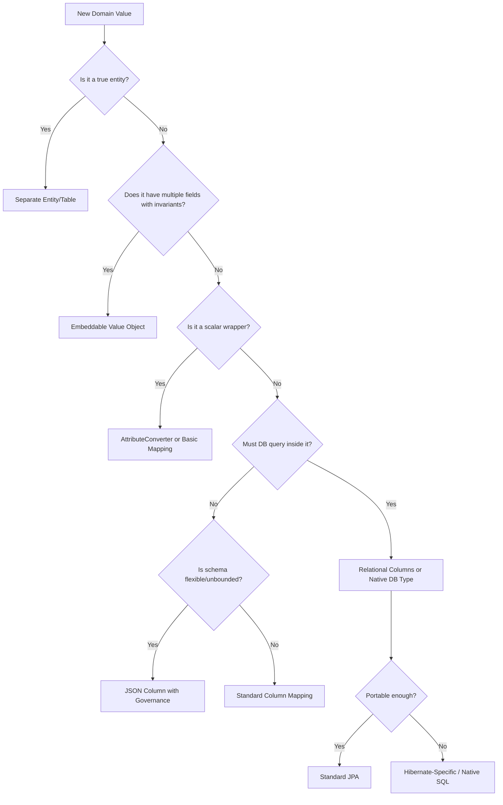
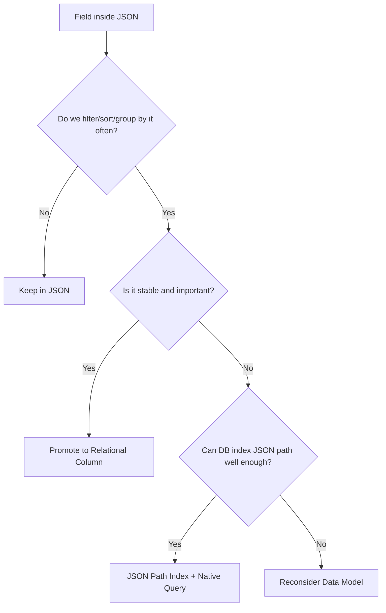

# Part 028 — Database-Specific Types and Custom Mapping

Part 027 covered validation and invariant enforcement: where rules belong and how to prevent impossible persistent state.

This part focuses on custom mapping and database-specific types.

Most JPA tutorials teach a narrow set of types:

```java
String
Long
Integer
BigDecimal
LocalDate
Instant
Enum
```

Real systems need more:

- UUID identifiers
- JSON payloads
- native database enum types
- arrays
- encrypted fields
- value objects
- monetary types
- IP addresses
- ranges/periods
- tenant ids
- external ids
- custom code types
- database-generated columns
- domain-specific scalar wrappers

The engineering question is not merely “Can Hibernate map this?”

The better question is:

> Should this value be modelled as a relational structure, a scalar column, a provider-specific type, or an application-level value object?

---

## 1. The Core Trade-Off: Portability vs Power

JPA gives portability across relational databases. But production databases provide powerful non-portable features.

| Choice | Benefit | Cost |
|---|---|---|
| Standard JPA mapping | portable, familiar, simple | may underuse database capabilities |
| `AttributeConverter` | clean value object mapping | limited query/type control |
| Hibernate-specific mapping | powerful, practical | provider lock-in |
| Native SQL/type | full database capability | less portable, more migration burden |
| Separate relational table | queryable, constrained, normalized | more joins and mapping complexity |
| JSON/blob-like column | flexible schema, easy ingestion | weaker constraints and harder indexing |

A top-tier engineer does not blindly chase portability.

Portability matters when:

- product must support multiple DB vendors
- library/framework code is reused externally
- migration between vendors is plausible
- infrastructure policy mandates portability

Database power matters when:

- performance depends on native indexes/operators
- domain requires strong database constraints
- query patterns are database-specific
- JSON/range/array/search features reduce complexity
- operational tooling is built around one DB engine

The correct answer depends on the product boundary.

---

## 2. Mapping Decision Framework



Use this before introducing JSON or custom types.

---

## 3. Standard Basic Types Are Still the Default

Most values should remain boring.

```java
@Column(name = "display_name", nullable = false, length = 120)
private String displayName;

@Column(name = "amount", nullable = false, precision = 19, scale = 4)
private BigDecimal amount;

@Column(name = "created_at", nullable = false)
private Instant createdAt;
```

Boring types are good when:

- query patterns are simple
- constraints are standard
- indexing is straightforward
- migrations are predictable
- cross-database behavior matters

Do not introduce custom mapping for novelty.

---

## 4. UUID Mapping

UUIDs are common for public identifiers, distributed creation, and cross-system references.

```java
@Entity
@Table(name = "cases")
public class CaseEntity {

    @Id
    @Column(name = "id", nullable = false, updatable = false)
    private UUID id;

    protected CaseEntity() {
    }

    public CaseEntity(UUID id) {
        this.id = Objects.requireNonNull(id);
    }
}
```

### 4.1 UUID as Primary Key

Pros:

- can be generated before insert
- safe to expose compared with sequential ids
- useful across services
- avoids central id allocation

Cons:

- larger index than integer/bigint
- random UUID can harm index locality
- sorting by id does not imply creation order
- human debugging can be harder

### 4.2 Recommended Split: Internal ID and Public ID

For many systems:

```java
@Id
@GeneratedValue(strategy = GenerationType.IDENTITY)
private Long id;

@Column(name = "public_id", nullable = false, updatable = false, unique = true)
private UUID publicId;
```

Internal id:

- compact FK
- efficient joins
- database-local identity

Public id:

- API-safe
- globally unique
- stable across integration boundaries

This split is often better than forcing UUID everywhere.

### 4.3 UUID Generation Site

Options:

| Generator | When Useful | Risk |
|---|---|---|
| Application generated | id needed before persist | app must ensure version/quality |
| Database generated | central DB control | app may not know id until insert |
| Hibernate generated | convenient ORM integration | provider-specific semantics |
| External id service | distributed consistency | operational dependency |

For event/outbox systems, application-generated ids are useful because you can create aggregate id and event id before flush.

---

## 5. Enum Mapping

The common beginner mistake:

```java
@Enumerated(EnumType.ORDINAL)
private CaseStatus status;
```

This stores ordinal numbers.

Bad:

```text
DRAFT = 0
SUBMITTED = 1
APPROVED = 2
```

If enum order changes, persisted meaning can break.

Prefer:

```java
@Enumerated(EnumType.STRING)
@Column(name = "status", nullable = false, length = 32)
private CaseStatus status;
```

### 5.1 Enum String Still Has Trade-Offs

Pros:

- readable
- safer than ordinal
- works with standard JPA
- easy to debug

Cons:

- renaming enum constants requires migration
- values are coupled to Java names
- database may not enforce allowed values unless CHECK/native enum exists

### 5.2 Stable Code Enum Pattern

Use explicit stable codes:

```java
public enum CaseStatus {
    DRAFT("DRAFT"),
    SUBMITTED("SUBMITTED"),
    IN_REVIEW("IN_REVIEW"),
    APPROVED("APPROVED"),
    CLOSED("CLOSED");

    private final String code;

    CaseStatus(String code) {
        this.code = code;
    }

    public String code() {
        return code;
    }

    public static CaseStatus fromCode(String code) {
        return Arrays.stream(values())
            .filter(status -> status.code.equals(code))
            .findFirst()
            .orElseThrow(() -> new IllegalArgumentException("Unknown case status: " + code));
    }
}
```

Converter:

```java
@Converter(autoApply = true)
public class CaseStatusConverter implements AttributeConverter<CaseStatus, String> {

    @Override
    public String convertToDatabaseColumn(CaseStatus attribute) {
        return attribute == null ? null : attribute.code();
    }

    @Override
    public CaseStatus convertToEntityAttribute(String dbData) {
        return dbData == null ? null : CaseStatus.fromCode(dbData);
    }
}
```

Now Java enum names can change independently from database codes if you keep the code stable.

### 5.3 Database Constraint for Enum Codes

```sql
ALTER TABLE cases
    ADD CONSTRAINT ck_case_status
    CHECK (status IN ('DRAFT', 'SUBMITTED', 'IN_REVIEW', 'APPROVED', 'CLOSED'));
```

The converter makes Java mapping clean. The database constraint protects truth.

---

## 6. AttributeConverter: The Standard Custom Mapping Tool

`AttributeConverter<X, Y>` maps between a domain type `X` and database column type `Y`.

Example: `TenantId` as a wrapper around UUID.

```java
public record TenantId(UUID value) {
    public TenantId {
        Objects.requireNonNull(value, "tenant id is required");
    }
}
```

```java
@Converter(autoApply = true)
public class TenantIdConverter implements AttributeConverter<TenantId, UUID> {

    @Override
    public UUID convertToDatabaseColumn(TenantId attribute) {
        return attribute == null ? null : attribute.value();
    }

    @Override
    public TenantId convertToEntityAttribute(UUID dbData) {
        return dbData == null ? null : new TenantId(dbData);
    }
}
```

Entity:

```java
@Column(name = "tenant_id", nullable = false)
private TenantId tenantId;
```

### 6.1 Good Uses

Attribute converters are good for:

- strongly typed ids
- enum code mapping
- normalized string wrappers
- simple encrypted/decrypted values
- small immutable scalar values
- value objects stored in one column

### 6.2 Poor Uses

They are weak for:

- multi-column value objects
- values requiring SQL operators
- database-native JSON query
- array containment queries
- range operators
- custom indexing semantics
- complex object graphs

Why?

A converter hides the value behind one JDBC-ish column representation. JPA query engines may not understand the internal structure.

---

## 7. Strongly Typed IDs

Primitive ids are easy to mix up.

```java
void assignOfficer(Long caseId, Long officerId) {
    // easy to swap accidentally
}
```

Strong ids reduce accidental misuse:

```java
public record CaseId(UUID value) {}
public record OfficerId(UUID value) {}
```

Service:

```java
void assignOfficer(CaseId caseId, OfficerId officerId) {
    // type-safe
}
```

Persistence options:

### 7.1 Use Strong IDs Outside Entity Only

```java
@Id
@Column(name = "id")
private UUID id;

public CaseId caseId() {
    return new CaseId(id);
}
```

Simple and JPA-friendly.

### 7.2 Use Converter Inside Entity

```java
@Id
@Column(name = "id")
private CaseId id;
```

This is cleaner, but provider support and id generation behavior must be tested carefully.

For critical systems, prefer explicit mapping and integration tests over assuming every converter combination works identically.

---

## 8. Money Mapping

Money is not just `BigDecimal`.

A robust money value often includes:

- amount
- currency
- scale rules
- rounding rules
- arithmetic invariants

Embeddable:

```java
@Embeddable
public class Money {

    @Column(name = "amount", nullable = false, precision = 19, scale = 4)
    private BigDecimal amount;

    @Column(name = "currency", nullable = false, length = 3)
    private String currency;

    protected Money() {
    }

    public Money(BigDecimal amount, String currency) {
        if (amount == null) throw new IllegalArgumentException("amount required");
        if (currency == null || !currency.matches("[A-Z]{3}")) {
            throw new IllegalArgumentException("invalid currency");
        }
        this.amount = amount.setScale(4, RoundingMode.UNNECESSARY);
        this.currency = currency;
    }
}
```

Entity:

```java
@Embedded
@AttributeOverrides({
    @AttributeOverride(name = "amount", column = @Column(name = "total_amount", precision = 19, scale = 4)),
    @AttributeOverride(name = "currency", column = @Column(name = "total_currency", length = 3))
})
private Money total;
```

Do not map money as a single string unless you never need numeric queries.

Bad for reporting:

```text
"USD 100.00"
```

Good for queryability:

```text
total_amount = 100.0000
total_currency = 'USD'
```

---

## 9. JSON Column Mapping

JSON columns are powerful but frequently abused.

Good use cases:

- externally supplied payload snapshot
- sparse optional metadata
- provider-specific configuration
- audit/event payload
- immutable captured evidence
- low-query dynamic attributes

Bad use cases:

- core relational relationships
- fields frequently filtered/sorted/joined
- data requiring many constraints
- values that need FK integrity
- high-volume reporting dimensions

### 9.1 JSON as Raw String

Portable but weak:

```java
@Column(name = "payload_json", columnDefinition = "jsonb")
private String payloadJson;
```

Pros:

- simple
- explicit serialization controlled by app
- easy to store exact original payload

Cons:

- no type safety
- no automatic object mapping
- query support is manual/native

### 9.2 JSON as Map/Object with Hibernate

Hibernate 6 supports mapping JSON more directly via JDBC type annotations.

Example shape:

```java
@JdbcTypeCode(SqlTypes.JSON)
@Column(name = "metadata", columnDefinition = "jsonb")
private Map<String, Object> metadata = new HashMap<>();
```

This is provider-specific. It may be exactly right if your application standardizes on Hibernate and PostgreSQL/MySQL JSON features.

### 9.3 JSON as Typed Value Object

```java
public record CaseMetadata(
    String sourceSystem,
    String importBatch,
    Map<String, String> labels
) {
}
```

```java
@JdbcTypeCode(SqlTypes.JSON)
@Column(name = "metadata", columnDefinition = "jsonb")
private CaseMetadata metadata;
```

This gives better application-level type safety.

But still ask:

- Do I need to query `sourceSystem` often?
- Should it be a relational column?
- Do I need a database constraint?
- Does the JSON shape need versioning?
- Can old JSON still deserialize after code changes?

---

## 10. JSON Governance

JSON columns need governance.

Without governance, they become a schema graveyard.

Minimum rules:

- document JSON schema/version
- keep payload compatibility tests
- avoid storing arbitrary business-critical fields only in JSON
- index only known query paths
- migrate JSON shape deliberately
- decide null vs missing semantics
- avoid leaking API DTOs directly into JSON column
- protect against unbounded payload size

Example versioned JSON:

```json
{
  "schemaVersion": 2,
  "sourceSystem": "PORTAL",
  "labels": {
    "risk": "HIGH",
    "channel": "SELF_SERVICE"
  }
}
```

Mapping:

```java
public record CaseMetadata(
    int schemaVersion,
    String sourceSystem,
    Map<String, String> labels
) {
}
```

Deserializer should handle older versions explicitly.

---

## 11. JSON Queryability Decision



Rule of thumb:

> If a JSON field appears in core business queries, dashboards, or authorization rules, it probably wants to be a column.

---

## 12. Array Mapping

Some databases support array columns.

Use cases:

- tags
- simple labels
- denormalized search hints
- compact sets of small scalar values

But arrays can hide relational structure.

Bad use:

```text
order.product_ids = [1, 2, 3]
```

This loses:

- FK constraints
- quantity per product
- ordering semantics
- join ability
- per-line audit

Better:

```text
order_lines(order_id, product_id, quantity)
```

Array columns are acceptable for values that are not entities and do not require relational integrity.

Hibernate-specific mapping may use array support depending on dialect and type system. Always test against the production database.

---

## 13. Native Database Enum Types

PostgreSQL supports native enum types. Other databases have different mechanisms.

Example:

```sql
CREATE TYPE case_status AS ENUM (
    'DRAFT',
    'SUBMITTED',
    'IN_REVIEW',
    'APPROVED',
    'CLOSED'
);
```

Pros:

- database enforces valid values
- compact and explicit
- readable schema

Cons:

- altering enum values may require special migration handling
- less portable
- renaming/removing values is harder
- provider mapping may be database-specific

Alternative:

```sql
status varchar(32) NOT NULL,
CONSTRAINT ck_case_status CHECK (...)
```

This is more portable and often easier to evolve.

### 13.1 Enum Evolution Rule

Before adding a new enum value, answer:

- Can old application nodes read it?
- Can old batch jobs process it?
- Does API serialization handle it?
- Does reporting classify it?
- Are state transition rules updated?
- Are database constraints migrated before application writes it?

Enum changes are workflow changes, not just type changes.

---

## 14. Encrypted Field Mapping

Some fields must be encrypted at rest at application level.

Possible converter:

```java
@Converter
public class EncryptedStringConverter implements AttributeConverter<EncryptedString, String> {

    private final CryptoService cryptoService;

    public EncryptedStringConverter(CryptoService cryptoService) {
        this.cryptoService = cryptoService;
    }

    @Override
    public String convertToDatabaseColumn(EncryptedString attribute) {
        return attribute == null ? null : cryptoService.encrypt(attribute.value());
    }

    @Override
    public EncryptedString convertToEntityAttribute(String dbData) {
        return dbData == null ? null : new EncryptedString(cryptoService.decrypt(dbData));
    }
}
```

But encryption mapping has serious implications:

- deterministic vs randomized encryption
- queryability
- indexing
- key rotation
- audit logging safety
- memory exposure after decryption
- dirty checking behavior
- equality comparison
- migration/backfill

Do not treat encryption as a normal converter unless the operational model is clear.

### 14.1 Queryability Trade-Off

| Encryption Type | Query Equality? | Safer Against Pattern Leakage? |
|---|---:|---:|
| randomized | no | yes |
| deterministic | yes | weaker |
| hashed lookup column | equality only | depends on salt/key design |

Common pattern:

```text
email_ciphertext
email_lookup_hash
```

Use hash for lookup, ciphertext for recovery/display.

---

## 15. IP Address Mapping

Options:

| Representation | Pros | Cons |
|---|---|---|
| string | simple, portable | weak validation, poor range queries |
| binary | compact | harder debugging |
| database native type | powerful operators | non-portable |
| value object + converter | domain-safe | query limitations |

Value object:

```java
public record IpAddress(String value) {
    public IpAddress {
        if (value == null || value.isBlank()) {
            throw new IllegalArgumentException("IP address required");
        }
        // Use a real parser in production.
    }
}
```

Converter:

```java
@Converter(autoApply = true)
public class IpAddressConverter implements AttributeConverter<IpAddress, String> {
    public String convertToDatabaseColumn(IpAddress attribute) {
        return attribute == null ? null : attribute.value();
    }

    public IpAddress convertToEntityAttribute(String dbData) {
        return dbData == null ? null : new IpAddress(dbData);
    }
}
```

If IP range queries matter, use database-native capabilities or normalized numeric representation.

---

## 16. Temporal Range Mapping

A validity range can be represented portably as two columns:

```java
@Embeddable
public class ValidityPeriod {

    @Column(name = "valid_from", nullable = false)
    private Instant from;

    @Column(name = "valid_to", nullable = false)
    private Instant to;
}
```

Database:

```sql
ALTER TABLE price_rules
    ADD CONSTRAINT ck_price_rule_validity
    CHECK (valid_from < valid_to);
```

This is portable.

Some databases offer native range types and exclusion constraints. They can elegantly prevent overlaps but are non-portable.

Portable overlap check:

```sql
WHERE product_id = :productId
  AND valid_from < :newValidTo
  AND valid_to > :newValidFrom
```

But correctness under concurrency requires locking/isolation strategy.

---

## 17. Generated Columns and Derived Values

Some databases support generated/computed columns.

Example:

```sql
ALTER TABLE customers
    ADD COLUMN email_normalized text GENERATED ALWAYS AS (lower(email)) STORED;

CREATE UNIQUE INDEX uk_customers_email_normalized
    ON customers(email_normalized);
```

Entity mapping:

```java
@Column(name = "email_normalized", insertable = false, updatable = false)
private String emailNormalized;
```

Use generated columns when:

- derived value must be consistent database-side
- query/index needs normalized expression
- application should not own recomputation

Be careful with:

- provider refresh behavior
- stale in-memory state after insert/update
- migration support per database

You may need:

```java
entityManager.flush();
entityManager.refresh(customer);
```

if the application needs generated value immediately.

---

## 18. Read-Only Formula Mapping

Hibernate supports formula-like derived attributes.

Conceptual example:

```java
@Formula("(select count(*) from order_lines ol where ol.order_id = id)")
private int lineCount;
```

This is useful for read-only derived values.

Risks:

- provider-specific
- can cause hidden subqueries
- may harm performance in list screens
- not updated in memory like normal fields
- hard to index unless backed by generated column/materialized view

Prefer DTO queries for screen-specific derived values.

Use formula for stable, low-risk derived attributes.

---

## 19. Custom Hibernate Basic Type

When `AttributeConverter` is not enough, Hibernate allows deeper type customization.

Use custom type mapping when you need:

- database-specific JDBC handling
- custom SQL type code
- special literal rendering
- JSON/range/network types
- advanced query operators
- non-standard binding/extraction

But custom types increase maintenance cost.

Before writing one, ask:

- Does Hibernate already support this type?
- Can `@JdbcTypeCode` solve it?
- Can an `AttributeConverter` solve it?
- Would a normalized table be better?
- Are queries portable?
- Can the team maintain this across Hibernate upgrades?

Do not write custom types casually.

---

## 20. `AttributeConverter` vs Hibernate Type

| Concern | AttributeConverter | Hibernate Type / JDBC Type |
|---|---|---|
| Standard JPA | yes | no |
| Simple scalar conversion | excellent | possible but heavier |
| Multi-column mapping | no | advanced/provider-specific |
| SQL operator support | limited | better |
| JSON native handling | limited | better |
| Query literal/bind control | limited | better |
| Portability | high | lower |
| Maintenance burden | low | medium/high |

Default to `AttributeConverter` for simple domain wrappers.

Use provider-specific type mapping when database behavior matters.

---

## 21. Column Definition Trap

Developers often write:

```java
@Column(columnDefinition = "jsonb")
private String payload;
```

This may work, but it has implications:

- non-portable DDL hint
- may not affect existing schema when migrations own DDL
- can break tests on different DB
- couples entity to a specific database dialect

In production systems with Flyway/Liquibase, `columnDefinition` is documentation/hint at most. The migration is the source of truth.

Prefer:

```sql
ALTER TABLE events ADD COLUMN payload jsonb NOT NULL;
```

and keep entity mapping aligned.

---

## 22. Native Query Boundary

Some custom types require native queries.

Example JSON path query in PostgreSQL-style systems:

```java
@Query(value = """
    select *
    from cases c
    where c.metadata ->> 'sourceSystem' = :sourceSystem
""", nativeQuery = true)
List<CaseEntity> findBySourceSystem(String sourceSystem);
```

Native queries are acceptable when intentional.

Rules:

- isolate them in repository/custom query adapter
- cover with integration tests
- document database dependency
- avoid returning managed entities from complex joins unless identity semantics are clear
- prefer DTO projection for reporting queries
- review query plan and indexes

Do not let native SQL become an unstructured escape hatch.

---

## 23. Querying Converted Attributes

With `AttributeConverter`, JPQL usually sees the entity attribute type.

```java
@Query("""
    select c
    from CustomerEntity c
    where c.tenantId = :tenantId
""")
List<CustomerEntity> findByTenantId(TenantId tenantId);
```

This is clean if provider handles binding as expected.

But be careful with:

- criteria parameters
- id attributes
- collection membership
- native queries
- converter auto-apply scope
- null handling
- custom equality semantics

Test repository methods using converted attributes.

---

## 24. Auto-Apply Converter Risk

```java
@Converter(autoApply = true)
public class EmailAddressConverter implements AttributeConverter<EmailAddress, String> {
    // ...
}
```

Auto-apply is convenient. It applies wherever the entity attribute type appears.

Risks:

- unintended conversion in embedded objects
- ambiguous converters for similar types
- surprising behavior across modules
- difficult local override

Use auto-apply for stable ubiquitous value types.

Avoid auto-apply for context-sensitive values.

---

## 25. Null Handling in Converters

Always handle null explicitly.

```java
@Override
public String convertToDatabaseColumn(EmailAddress attribute) {
    return attribute == null ? null : attribute.value();
}

@Override
public EmailAddress convertToEntityAttribute(String dbData) {
    return dbData == null ? null : new EmailAddress(dbData);
}
```

Do not let converter NPE obscure the real issue.

The database `NOT NULL` constraint and Bean Validation should decide whether null is allowed.

---

## 26. Converter Exceptions

If conversion fails on read:

```java
public CaseStatus convertToEntityAttribute(String dbData) {
    return CaseStatus.fromCode(dbData);
}
```

and the database contains unknown code, loading the entity fails.

This is usually correct: persisted data is corrupt relative to application expectations.

But for forward-compatible rolling deployments, think carefully.

Example scenario:

1. version B writes new status `ESCALATED`
2. version A still running tries to read it
3. version A converter throws `Unknown status`

Deployment-safe enum evolution requires:

- expand readers before writers
- tolerate unknown values where appropriate
- migrate constraints before writes
- coordinate rolling deployment

---

## 27. Versioned Value Objects

Some custom values evolve.

Example old JSON:

```json
{ "risk": "HIGH" }
```

New JSON:

```json
{ "schemaVersion": 2, "risk": "HIGH", "score": 87 }
```

The mapper must support both.

```java
public CaseMetadata read(JsonNode node) {
    int version = node.path("schemaVersion").asInt(1);

    return switch (version) {
        case 1 -> readV1(node);
        case 2 -> readV2(node);
        default -> throw new UnknownMetadataVersionException(version);
    };
}
```

Do not assume JSON data evolves automatically with Java records.

---

## 28. Custom Mapping and Dirty Checking

Mutable custom values can break dirty checking expectations.

Example:

```java
@JdbcTypeCode(SqlTypes.JSON)
private Map<String, Object> metadata;
```

Mutation:

```java
entity.getMetadata().put("risk", "HIGH");
```

Will Hibernate detect the change reliably?

It depends on mutability plan/type handling/provider behavior.

Safer pattern:

```java
public void updateMetadata(CaseMetadata newMetadata) {
    this.metadata = Objects.requireNonNull(newMetadata);
}
```

Prefer immutable value objects for custom mapped values.

---

## 29. Custom Mapping and Equality

Value objects must implement stable equality.

Java record helps:

```java
public record EmailAddress(String value) {
    public EmailAddress {
        value = normalize(value);
    }
}
```

But be careful:

```java
new BigDecimal("1.0").equals(new BigDecimal("1.00")) // false
```

For money, normalize scale or implement equality intentionally.

Dirty checking, Set membership, and cache keys can all be affected by equality semantics.

---

## 30. Indexing Custom Types

Mapping is only half the work. Indexing determines whether the system survives production load.

| Type | Index Strategy |
|---|---|
| UUID FK | normal B-tree index |
| enum string | B-tree, maybe partial by status |
| JSON path | expression/GIN/index depending on database |
| array tags | database-specific containment index |
| lower-cased email | generated column or expression index |
| validity period | compound index or range/exclusion index |
| encrypted hash lookup | index hash column |

Every custom type used in a query needs an index review.

---

## 31. Migration Strategy for Type Changes

Changing a column type is risky.

Example: `status varchar` to native enum.

Safe migration plan:

1. create new type/column if needed
2. backfill values
3. add dual-write or generated mapping if required
4. deploy reader compatible with both
5. deploy writer using new representation
6. validate data consistency
7. remove old representation
8. add final constraints

For large tables, avoid blocking rewrites if the database performs full table rewrite.

Test migrations on production-sized data.

---

## 32. Portability Markers

When using provider/database-specific mapping, mark it in code.

```java
/**
 * Hibernate/PostgreSQL-specific JSONB mapping.
 * Migration source of truth: V042__add_case_metadata_jsonb.sql
 * Query index: ix_cases_metadata_source_system
 */
@JdbcTypeCode(SqlTypes.JSON)
@Column(name = "metadata", columnDefinition = "jsonb")
private CaseMetadata metadata;
```

This helps future maintainers understand the trade-off.

---

## 33. Repository Design for Custom Types

Do not leak database-specific details everywhere.

Bad:

```java
caseRepository.findByMetadataJsonPath("$.risk", "HIGH");
```

Better:

```java
caseRepository.findHighRiskImportedCases();
```

Custom implementation hides native SQL:

```java
public interface CaseSearchRepository {
    List<CaseSummary> findHighRiskImportedCases();
}
```

The application expresses intent. The repository adapter owns database mechanics.

---

## 34. Testing Custom Mapping

For every custom mapping, test:

- write entity, flush, clear, read back
- query by mapped attribute
- null handling
- invalid database value behavior
- migration-generated schema compatibility
- equality/dirty checking behavior
- cache serialization if L2 cache is enabled
- native query projection if used
- production database dialect behavior

Example:

```java
@Test
void mapsTenantIdRoundTrip() {
    TenantId tenantId = new TenantId(UUID.randomUUID());
    CustomerEntity customer = CustomerEntity.create(tenantId, "Alice");

    repository.saveAndFlush(customer);
    entityManager.clear();

    CustomerEntity reloaded = repository.getReferenceById(customer.getId());

    assertThat(reloaded.tenantId()).isEqualTo(tenantId);
}
```

For JSON:

```java
@Test
void mapsCaseMetadataRoundTrip() {
    CaseMetadata metadata = new CaseMetadata(2, "PORTAL", Map.of("risk", "HIGH"));

    CaseEntity entity = CaseEntity.open(caseId, metadata);
    repository.saveAndFlush(entity);
    entityManager.clear();

    CaseEntity reloaded = repository.findById(caseId).orElseThrow();

    assertThat(reloaded.metadata()).isEqualTo(metadata);
}
```

---

## 35. Anti-Patterns

### 35.1 JSON as a Garbage Drawer

Bad:

```json
{
  "customerId": 123,
  "status": "APPROVED",
  "amount": 100,
  "currency": "USD",
  "assignedOfficerId": 77
}
```

If these are core domain fields, use columns/tables.

### 35.2 Ordinal Enum Mapping

```java
@Enumerated(EnumType.ORDINAL)
private Status status;
```

Avoid unless the ordinal is a stable domain protocol, which is rare.

### 35.3 Converter Doing Too Much

Bad converter responsibilities:

- call remote service
- query repository
- perform authorization
- publish event
- use request context
- depend on tenant context implicitly

Converters should be deterministic transformations.

### 35.4 Hiding Important Query Fields in Encrypted/JSON Columns

If the business needs to filter by a field constantly, do not bury it without an index/query strategy.

### 35.5 Database-Specific Mapping Without Tests

If mapping depends on PostgreSQL JSONB, Oracle object type, SQL Server computed column, or MySQL generated column, test it against that engine.

H2 is not enough.

---

## 36. Review Checklist

Before adding a custom mapping, ask:

- Is the value an entity, embeddable, scalar, or document?
- Does the database need to query inside it?
- Does the database need to constrain it?
- Is portability a real requirement or theoretical preference?
- Does Hibernate already support this mapping?
- Would `AttributeConverter` be sufficient?
- Are null semantics clear?
- Is equality stable?
- Is dirty checking safe?
- Is the migration the source of truth?
- Are indexes defined for query paths?
- Are old values forward/backward compatible?
- Is provider/database specificity documented?
- Are round-trip and query tests written against production DB?
- Will future engineers understand why this mapping exists?

---

## 37. Deliberate Practice

### Exercise 1 — Replace Primitive ID Leakage

Pick a module with multiple `UUID` or `Long` ids.

Introduce value objects:

```java
record CaseId(UUID value) {}
record OfficerId(UUID value) {}
```

Keep persistence simple first. Use strong ids at service/domain boundary before forcing them into entity id fields.

### Exercise 2 — Fix Enum Mapping

Find one `EnumType.ORDINAL` mapping.

Refactor to:

- stable string/code mapping
- database CHECK constraint
- migration script
- integration test

### Exercise 3 — JSON Promotion Analysis

Pick one JSON column.

Classify each field:

- never queried
- occasionally queried
- frequently filtered
- used in authorization
- used in reporting
- needs constraint

Promote fields that should not remain hidden in JSON.

### Exercise 4 — Converter Round Trip

Create an `AttributeConverter` for a value object.

Test:

- null handling
- persist/read round trip
- JPQL query by value
- invalid DB value behavior

### Exercise 5 — Native Type Review

Pick one provider/database-specific annotation.

Document:

- why standard JPA is insufficient
- what database feature is required
- what migration creates it
- what tests protect it
- what portability is sacrificed

---

## 38. Summary

Custom mapping is not just type conversion. It is a persistence design decision.

The advanced model is:

- keep standard basic mappings unless there is a real reason not to
- use embeddables for multi-column value objects
- use `AttributeConverter` for simple scalar wrappers and stable code mappings
- use Hibernate/database-specific types when native behavior matters
- treat JSON as governed schema, not a dumping ground
- avoid ordinal enum mapping
- test custom mappings against the real database
- design indexes for every custom type used in queries
- document provider-specific trade-offs explicitly
- plan migrations carefully when storage representation changes

A top-tier persistence engineer does not ask, “How do I make this Java type persist?”

They ask:

> What representation preserves correctness, queryability, evolvability, and operational clarity over the lifetime of the system?

Part 029 continues into multitenancy and data partitioning: tenant isolation, schema/database-per-tenant trade-offs, discriminator filters, routing datasources, tenant leak prevention, and operational consequences.
