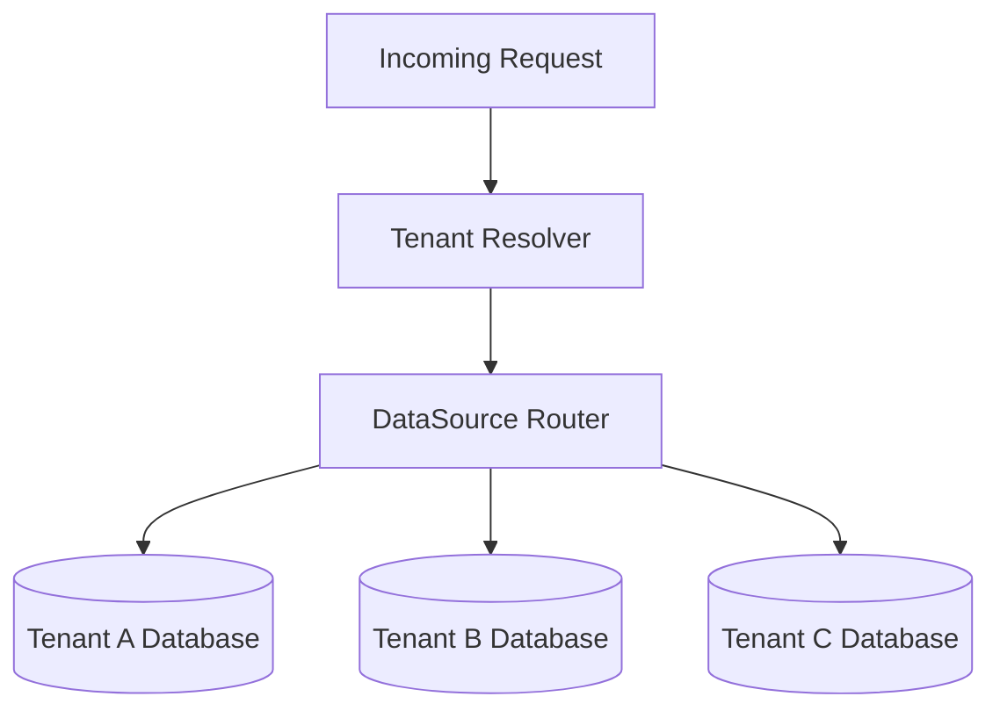
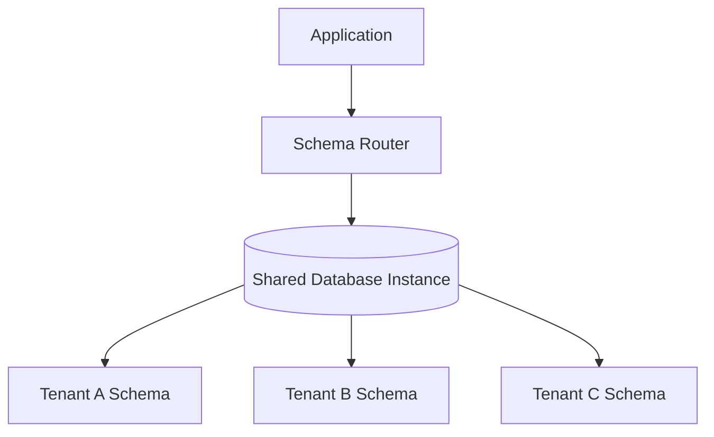
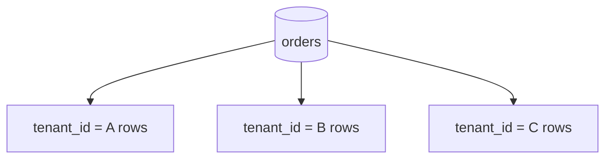
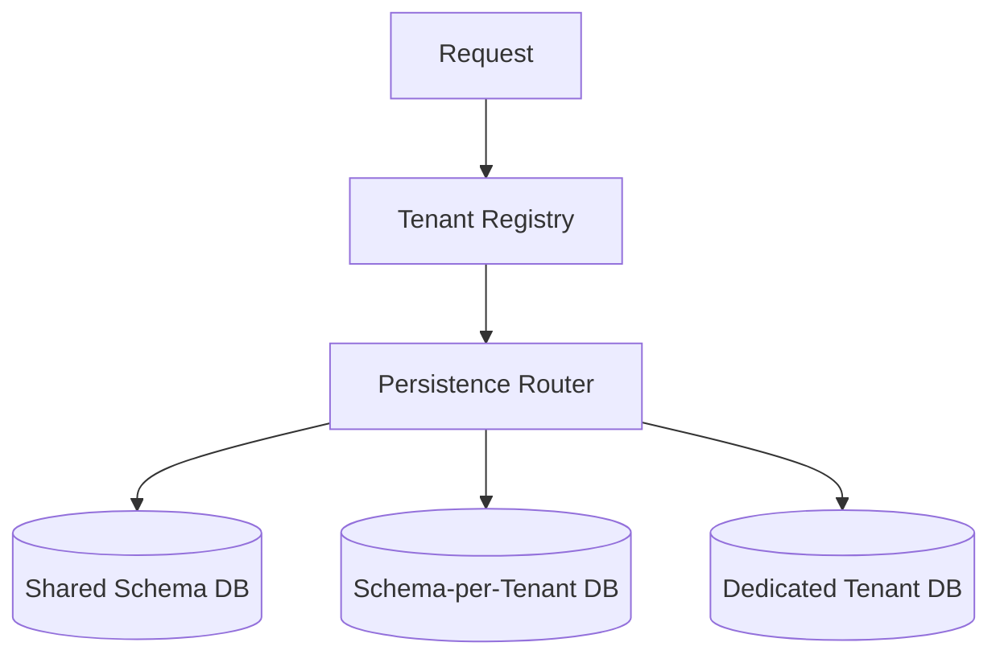
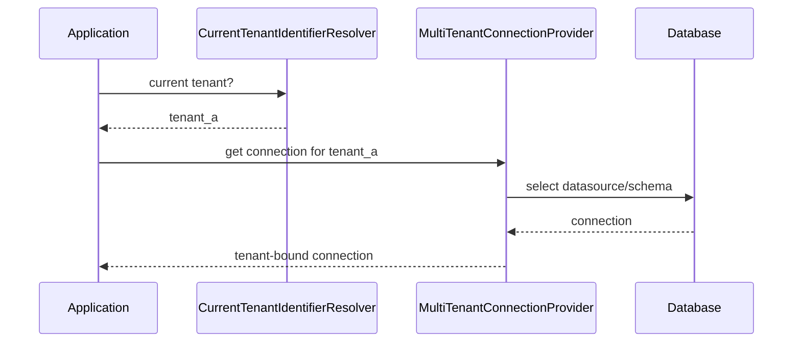
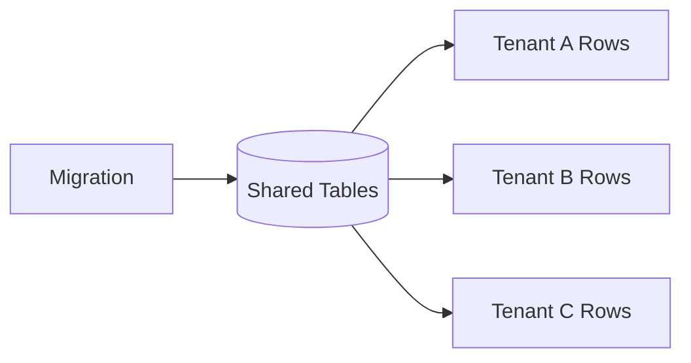
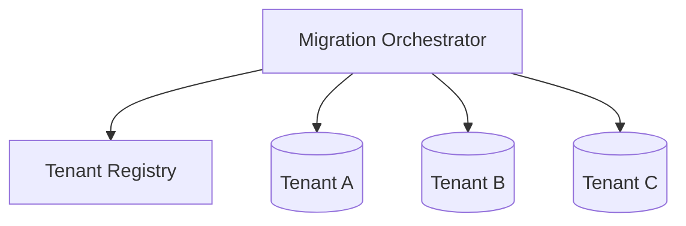
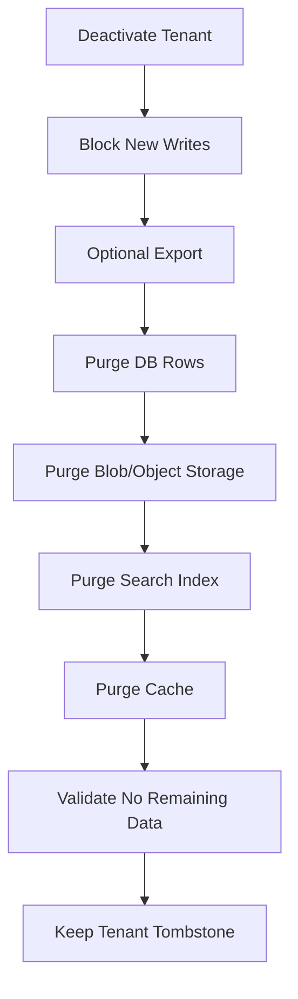

# Part 029 — Multitenancy and Data Partitioning

Multitenancy is not a feature you add with a `tenant_id` column. It is a **data isolation model**.

A senior engineer treats multitenancy as a combination of:

1. **identity boundary** — who is the tenant?
2. **authorization boundary** — may this actor access this tenant?
3. **routing boundary** — which database/schema/partition should serve this request?
4. **query boundary** — can every query prove it is tenant-scoped?
5. **migration boundary** — can schema/data changes be rolled out safely per tenant?
6. **operational boundary** — can one tenant be backed up, restored, throttled, migrated, or debugged without harming others?

The dangerous misconception is this:

> “Multitenancy means adding `tenant_id` to every table.”

That is only one implementation strategy. The real design question is:

> “What blast radius do we accept when tenant data, traffic, migration, failure, or breach happens?”

This part focuses on production-grade multitenancy in Java persistence with JPA/Hibernate/Spring Data JPA.

---

## 1. Kaufman Deconstruction: What Skill Are We Practicing?

Using Kaufman's skill acquisition lens, multitenancy should be deconstructed into small subskills.

| Subskill | What You Must Be Able To Do |
|---|---|
| Tenant model design | Define tenant, account, organization, workspace, region, subscription, and legal entity correctly |
| Isolation strategy selection | Choose database-per-tenant, schema-per-tenant, shared-schema, or hybrid partitioning |
| Tenant context propagation | Carry tenant identity safely across HTTP, async, scheduler, messaging, and transaction boundaries |
| Query enforcement | Prevent cross-tenant reads/writes by construction, not by developer discipline |
| Migration strategy | Run schema and data migrations safely for one, many, or all tenants |
| Performance engineering | Prevent hot tenants, noisy neighbors, bad partition keys, and global index bottlenecks |
| Security modelling | Detect tenant spoofing, confused deputy, IDOR, and tenant-leak failure modes |
| Testing discipline | Prove tenant isolation with integration, mutation, and adversarial tests |

The target performance level:

> Given a Java service with persistence requirements, you can design a multitenancy model, choose an isolation strategy, implement tenant-safe data access, test leakage scenarios, and operate the model during migration and incident response.

---

## 2. Core Mental Model

Multitenancy is a **scoping invariant**.

Every persisted fact must answer:

```text
Who owns this data?
Who may observe it?
Who may mutate it?
Where is it physically stored?
How is access scoped by default?
What happens if scoping fails?
```

A tenant-safe persistence system must make the safe path the default path.

Bad design:

```java
repository.findById(id); // hope the caller checks tenant elsewhere
```

Better design:

```java
repository.findByTenantIdAndId(tenantId, id);
```

Stronger design:

```java
TenantScopedEntityManager.forCurrentTenant()
    .find(Order.class, orderId);
```

Strongest design depends on your model, but the principle is stable:

> Tenant scoping should be enforced at the lowest reliable boundary, then repeated at higher boundaries for defense in depth.

---

## 3. Tenancy Is Not Always Customer Tenancy

Before choosing database layout, define what a tenant means.

| Term | Possible Meaning | Persistence Consequence |
|---|---|---|
| Tenant | Paying customer, organization, workspace, government agency, legal entity | Primary data isolation boundary |
| Account | Billing/subscription owner | May own multiple tenants/workspaces |
| User | Human/principal | Usually belongs to one or more tenants |
| Role | Authorization within tenant | Must be scoped by tenant |
| Region | Data residency or deployment region | Can force separate storage/routing |
| Environment | prod/sandbox/test tenant | May require separate lifecycle/purge policy |
| Partition | Physical distribution unit | May not equal tenant |

Common mistake:

```text
user_id == tenant_id
```

This breaks as soon as:

- one user belongs to multiple organizations,
- one organization has multiple workspaces,
- one parent company owns multiple subsidiaries,
- one legal entity requires regional data isolation,
- an admin needs delegated access,
- background jobs run without a human user.

A robust model separates:

```text
Principal identity
Authorization scope
Tenant ownership
Storage routing
```

---

## 4. Multitenancy Strategy Matrix

There are four common strategies.

| Strategy | Isolation | Cost | Operational Complexity | Best For |
|---|---:|---:|---:|---|
| Database per tenant | Very high | High | High | Regulated customers, large tenants, strong isolation |
| Schema per tenant | High | Medium-high | Medium-high | Moderate tenant count, stronger isolation than shared schema |
| Shared schema + tenant discriminator | Lower | Low | Medium | Many small tenants, SaaS scale, simpler ops |
| Hybrid | Variable | Variable | High | Real systems with mixed tenant sizes/risk profiles |

There is no universal best choice.

The correct strategy depends on:

- legal isolation requirements,
- customer size distribution,
- migration frequency,
- number of tenants,
- noisy neighbor tolerance,
- backup/restore requirement,
- operational tooling maturity,
- reporting/analytics model,
- regional/data residency requirements,
- cost envelope.

---

## 5. Strategy 1: Database Per Tenant

Each tenant has its own database.



### 5.1 Advantages

| Advantage | Why It Matters |
|---|---|
| Strong blast-radius isolation | Bad query, corruption, or breach can be limited to one tenant DB |
| Easier tenant backup/restore | Restore one tenant without filtering shared rows |
| Per-tenant scaling | Large tenant can get stronger hardware, read replica, partitioning |
| Compliance fit | Easier to prove separation for high-regulation customers |
| Custom retention | Tenant-specific purge and archival are easier |

### 5.2 Disadvantages

| Disadvantage | Consequence |
|---|---|
| Many connection pools | JVM memory and DB connection pressure increase quickly |
| Migration fan-out | Every migration must run across many databases |
| Operational inventory | Need tenant registry, health, version, backup state |
| Cross-tenant analytics harder | Requires ETL/data warehouse aggregation |
| Onboarding overhead | Provisioning must be automated |

### 5.3 When It Makes Sense

Use database-per-tenant when:

- tenants are few or medium count,
- tenants are high value,
- data isolation is contractually important,
- tenants require custom backup/restore,
- tenant data size differs dramatically,
- regional/legal boundaries matter,
- one tenant failure must not impact others.

Avoid it when:

- you expect hundreds of thousands of tiny tenants,
- your operations team cannot automate migration/provisioning,
- your database license/cost model does not scale per database,
- your application cannot manage dynamic datasource routing safely.

---

## 6. Strategy 2: Schema Per Tenant

All tenants share a database instance, but each tenant has a separate schema.



### 6.1 Advantages

| Advantage | Why It Matters |
|---|---|
| Better isolation than shared schema | Table names/indexes are separated per tenant schema |
| Lower cost than database-per-tenant | One database instance can host many schemas |
| Easier per-tenant migration than row filtering | Schema version can be tracked per tenant |
| Backup may be possible per schema | Depends heavily on database vendor/tooling |

### 6.2 Disadvantages

| Disadvantage | Consequence |
|---|---|
| Schema count limits | Some DBs/tools degrade with very many schemas |
| Migration complexity | Need per-schema migration orchestration |
| Connection/session state risk | `SET search_path`/current schema must be reset correctly |
| Shared resource contention | CPU, IO, memory still shared |

### 6.3 Failure Mode: Leaked Schema State

A classic bug:

```text
Request A sets schema = tenant_a
Connection returned to pool
Request B gets same connection
Schema is still tenant_a
Request B reads tenant A data
```

Any schema routing strategy must guarantee:

```text
before use: set tenant schema
finally: reset/validate schema
on error: discard unsafe connection if state unknown
```

---

## 7. Strategy 3: Shared Schema with Tenant Discriminator

All tenants share tables. Each tenant-owned row has a tenant discriminator column such as `tenant_id`.



Example:

```sql
create table orders (
    tenant_id uuid not null,
    id uuid not null,
    order_number varchar(64) not null,
    status varchar(32) not null,
    created_at timestamptz not null,
    primary key (tenant_id, id),
    unique (tenant_id, order_number)
);
```

Notice the composite primary key.

A less strict design often does this:

```sql
primary key (id),
unique (order_number)
```

That is usually wrong for shared-schema multitenancy because uniqueness becomes global when it should be tenant-local.

Better:

```sql
primary key (tenant_id, id),
unique (tenant_id, order_number)
```

### 7.1 Advantages

| Advantage | Why It Matters |
|---|---|
| Lowest infrastructure cost | One schema/table set for many tenants |
| Easy onboarding | Insert tenant row, no database provisioning |
| Simple global migrations | One schema migration updates all tenants |
| Better connection efficiency | One pool can serve all tenants |
| Simple shared analytics | Rows already co-located |

### 7.2 Disadvantages

| Disadvantage | Consequence |
|---|---|
| Tenant leak risk | A missing predicate can expose another tenant's data |
| Noisy neighbor risk | Large tenant can affect shared indexes/tables |
| Harder tenant restore | Need row-level restore/filtering |
| Harder deletion | Must delete all tenant-owned rows across tables safely |
| Hot indexes | Global indexes may become large and skewed |

Shared schema is cheap operationally but expensive intellectually. It requires intense discipline.

---

## 8. Strategy 4: Hybrid Tenancy

Most real SaaS systems eventually become hybrid.

Example:

```text
Small tenants     -> shared schema
Medium tenants    -> schema per tenant
Enterprise tenant -> database per tenant
Regulated tenant  -> region-specific database
```



Hybrid is powerful but requires a tenant registry.

Tenant registry fields often include:

```text
tenant_id
legal_name
status
plan
region
isolation_mode
datasource_key
schema_name
migration_version
encryption_key_ref
created_at
suspended_at
```

The registry becomes critical infrastructure. If it is wrong, routing is wrong.

---

## 9. Tenant Context Propagation

A tenant context is the application-level representation of current tenant scope.

Example:

```java
public record TenantContext(
    UUID tenantId,
    UUID principalId,
    Set<String> roles,
    String region,
    String correlationId
) {}
```

Avoid global mutable static state.

This is tempting:

```java
public final class CurrentTenant {
    private static final ThreadLocal<UUID> TENANT = new ThreadLocal<>();

    public static void set(UUID tenantId) {
        TENANT.set(tenantId);
    }

    public static UUID get() {
        return TENANT.get();
    }

    public static void clear() {
        TENANT.remove();
    }
}
```

`ThreadLocal` can work in servlet-style request handling, but it is dangerous unless cleared reliably.

The minimal safe wrapper:

```java
public final class TenantContextHolder {
    private static final ThreadLocal<TenantContext> HOLDER = new ThreadLocal<>();

    public static TenantContext require() {
        TenantContext context = HOLDER.get();
        if (context == null) {
            throw new MissingTenantContextException();
        }
        return context;
    }

    public static void set(TenantContext context) {
        if (context == null) {
            throw new IllegalArgumentException("tenant context must not be null");
        }
        HOLDER.set(context);
    }

    public static void clear() {
        HOLDER.remove();
    }

    private TenantContextHolder() {}
}
```

HTTP filter:

```java
public final class TenantContextFilter extends OncePerRequestFilter {
    private final TenantResolver tenantResolver;

    public TenantContextFilter(TenantResolver tenantResolver) {
        this.tenantResolver = tenantResolver;
    }

    @Override
    protected void doFilterInternal(
        HttpServletRequest request,
        HttpServletResponse response,
        FilterChain filterChain
    ) throws ServletException, IOException {
        try {
            TenantContext context = tenantResolver.resolve(request);
            TenantContextHolder.set(context);
            filterChain.doFilter(request, response);
        } finally {
            TenantContextHolder.clear();
        }
    }
}
```

Key invariant:

> Every entry point that touches tenant-owned data must either set tenant context or explicitly prove that it is tenant-independent.

Entry points include:

- HTTP controllers,
- GraphQL resolvers,
- gRPC handlers,
- message consumers,
- scheduled jobs,
- batch processors,
- admin tools,
- migration runners,
- CLI scripts,
- tests.

---

## 10. Tenant Context Is Not Authorization

Do not trust tenant ID from request headers blindly.

Bad:

```http
X-Tenant-Id: 3b2a...
```

Then:

```java
UUID tenantId = UUID.fromString(request.getHeader("X-Tenant-Id"));
```

This allows tenant spoofing unless the header is protected and validated.

Better:

```text
Authenticate principal
Load memberships/claims
Resolve requested tenant
Verify principal may act in tenant
Build tenant context
```

```java
public TenantContext resolve(HttpServletRequest request) {
    Principal principal = authenticationService.requirePrincipal();
    UUID requestedTenantId = extractRequestedTenant(request);

    TenantMembership membership = membershipRepository
        .findActiveMembership(principal.id(), requestedTenantId)
        .orElseThrow(ForbiddenTenantAccessException::new);

    return new TenantContext(
        requestedTenantId,
        principal.id(),
        membership.roles(),
        membership.region(),
        correlationIdProvider.current()
    );
}
```

A tenant context should be derived from trusted identity and authorization state, not merely copied from untrusted input.

---

## 11. Shared-Schema Modelling Rules

For shared-schema multitenancy, table design matters more than annotation convenience.

### 11.1 Tenant-Owned Tables Must Have `tenant_id`

```sql
create table cases (
    tenant_id uuid not null,
    id uuid not null,
    case_number varchar(64) not null,
    status varchar(32) not null,
    primary key (tenant_id, id),
    unique (tenant_id, case_number)
);
```

### 11.2 Foreign Keys Should Include Tenant Boundary

Bad:

```sql
create table case_events (
    tenant_id uuid not null,
    id uuid primary key,
    case_id uuid not null references cases(id)
);
```

This can allow cross-tenant references if `cases.id` is globally unique by accident but not enforced by tenant boundary.

Better:

```sql
create table case_events (
    tenant_id uuid not null,
    id uuid not null,
    case_id uuid not null,
    event_type varchar(64) not null,
    occurred_at timestamptz not null,
    primary key (tenant_id, id),
    foreign key (tenant_id, case_id) references cases(tenant_id, id)
);
```

This encodes tenant isolation into the database.

### 11.3 Unique Constraints Must Be Tenant-Aware

Bad:

```sql
unique (email)
```

Maybe correct for global login identity, but wrong for tenant-local employee records.

Better for tenant-local identity:

```sql
unique (tenant_id, email)
```

### 11.4 Indexes Must Match Tenant-Scoped Queries

Common query:

```sql
select *
from cases
where tenant_id = ?
  and status = ?
order by created_at desc
limit 50;
```

Useful index:

```sql
create index idx_cases_tenant_status_created
on cases (tenant_id, status, created_at desc);
```

A global index on only `status` is usually weak in shared-schema SaaS because `status` has low selectivity and ignores the tenant boundary.

---

## 12. JPA Mapping for Shared-Schema Tenancy

A basic tenant-scoped entity:

```java
@MappedSuperclass
public abstract class TenantScopedEntity {

    @Column(name = "tenant_id", nullable = false, updatable = false)
    private UUID tenantId;

    protected TenantScopedEntity() {
    }

    protected TenantScopedEntity(UUID tenantId) {
        this.tenantId = Objects.requireNonNull(tenantId);
    }

    public UUID tenantId() {
        return tenantId;
    }
}
```

Entity:

```java
@Entity
@Table(
    name = "cases",
    uniqueConstraints = {
        @UniqueConstraint(
            name = "uk_cases_tenant_case_number",
            columnNames = {"tenant_id", "case_number"}
        )
    }
)
public class CaseEntity extends TenantScopedEntity {

    @EmbeddedId
    private CaseEntityId id;

    @Column(name = "case_number", nullable = false, length = 64)
    private String caseNumber;

    @Enumerated(EnumType.STRING)
    @Column(name = "status", nullable = false, length = 32)
    private CaseStatus status;

    protected CaseEntity() {
    }

    public CaseEntity(UUID tenantId, UUID caseId, String caseNumber) {
        super(tenantId);
        this.id = new CaseEntityId(tenantId, caseId);
        this.caseNumber = requireNonBlank(caseNumber);
        this.status = CaseStatus.DRAFT;
    }
}
```

Composite key:

```java
@Embeddable
public record CaseEntityId(
    @Column(name = "tenant_id") UUID tenantId,
    @Column(name = "id") UUID id
) implements Serializable {}
```

This is verbose, but it expresses a valuable invariant:

> A case ID without tenant ID is not enough to identify a row in shared-schema tenancy.

---

## 13. Surrogate ID vs Composite Tenant Key

There are two common models.

### 13.1 Global Surrogate ID + Tenant Column

```sql
id uuid primary key,
tenant_id uuid not null
```

Pros:

- simple JPA mapping,
- simple URLs,
- simple references,
- easier integration with frameworks.

Cons:

- database may not prevent cross-tenant FK mistakes,
- repository methods can accidentally find by `id` only,
- tenant scoping becomes convention-heavy,
- uniqueness constraints must be explicitly tenant-aware.

### 13.2 Composite Key: `(tenant_id, id)`

Pros:

- tenant boundary encoded in primary key,
- foreign keys can enforce same-tenant relation,
- safer for shared-schema systems,
- query plans often start with tenant partition naturally.

Cons:

- more verbose mapping,
- more verbose repository signatures,
- DTOs and URLs need both identifiers,
- some frameworks expect simple `id`.

For high-risk shared-schema systems, composite tenant keys are often worth the friction.

A compromise is:

```sql
id uuid primary key,
tenant_id uuid not null,
unique (tenant_id, id)
```

Then all child FKs reference `(tenant_id, id)` instead of only `id`.

---

## 14. Repository Design: Tenant-Scoped by Construction

Bad:

```java
public interface CaseRepository extends JpaRepository<CaseEntity, UUID> {
    Optional<CaseEntity> findById(UUID id);
}
```

This API invites tenant leaks.

Better:

```java
public interface CaseRepository extends Repository<CaseEntity, CaseEntityId> {

    Optional<CaseEntity> findById(CaseEntityId id);

    @Query("""
        select c
        from CaseEntity c
        where c.id.tenantId = :tenantId
          and c.status = :status
        order by c.createdAt desc
    """)
    List<CaseEntity> findRecentByStatus(
        @Param("tenantId") UUID tenantId,
        @Param("status") CaseStatus status,
        Pageable pageable
    );
}
```

Even better for service use:

```java
public final class TenantScopedCaseRepository {
    private final CaseRepository delegate;

    public Optional<CaseEntity> findById(UUID caseId) {
        UUID tenantId = TenantContextHolder.require().tenantId();
        return delegate.findById(new CaseEntityId(tenantId, caseId));
    }
}
```

The application service should not repeatedly extract tenant ID manually in every method if a safer abstraction can do it consistently.

---

## 15. Hibernate Multitenancy Concepts

Hibernate supports multitenancy at provider level for strategies such as separate database and separate schema. The core SPI concepts are:

| Concept | Role |
|---|---|
| `CurrentTenantIdentifierResolver` | Resolves the current tenant identifier |
| `MultiTenantConnectionProvider` | Supplies connections for the target tenant |
| Tenant identifier | The runtime routing key used by Hibernate |
| Session/EntityManager | Bound to one tenant context for its lifecycle |

Conceptual flow:



A simplified resolver:

```java
public final class CurrentTenantResolver
    implements CurrentTenantIdentifierResolver<String> {

    @Override
    public String resolveCurrentTenantIdentifier() {
        return TenantContextHolder.require().tenantId().toString();
    }

    @Override
    public boolean validateExistingCurrentSessions() {
        return true;
    }
}
```

A provider for database-per-tenant:

```java
public final class TenantDataSourceConnectionProvider
    implements MultiTenantConnectionProvider<String> {

    private final TenantDataSourceRegistry registry;

    public TenantDataSourceConnectionProvider(TenantDataSourceRegistry registry) {
        this.registry = registry;
    }

    @Override
    public Connection getConnection(String tenantIdentifier) throws SQLException {
        return registry.requireDataSource(tenantIdentifier).getConnection();
    }

    @Override
    public void releaseConnection(String tenantIdentifier, Connection connection)
        throws SQLException {
        connection.close();
    }

    @Override
    public Connection getAnyConnection() throws SQLException {
        return registry.defaultDataSource().getConnection();
    }

    @Override
    public void releaseAnyConnection(Connection connection) throws SQLException {
        connection.close();
    }

    @Override
    public boolean supportsAggressiveRelease() {
        return false;
    }

    @Override
    public boolean isUnwrappableAs(Class<?> unwrapType) {
        return unwrapType.isAssignableFrom(getClass());
    }

    @Override
    public <T> T unwrap(Class<T> unwrapType) {
        if (isUnwrappableAs(unwrapType)) {
            return unwrapType.cast(this);
        }
        throw new IllegalArgumentException("Unsupported unwrap type: " + unwrapType);
    }
}
```

The exact API shape can differ by Hibernate version, but the conceptual contract is stable: resolve tenant, acquire tenant-bound connection, ensure the session cannot silently cross tenants.

---

## 16. Spring `AbstractRoutingDataSource`

For database-per-tenant outside Hibernate's multitenancy SPI, Spring's `AbstractRoutingDataSource` is common.

```java
public final class TenantRoutingDataSource extends AbstractRoutingDataSource {
    @Override
    protected Object determineCurrentLookupKey() {
        return TenantContextHolder.require().tenantId();
    }
}
```

This works when:

- datasource map is known or dynamically managed,
- tenant context is set before transaction begins,
- connection acquisition happens after tenant context resolution,
- no transaction reuses a connection from a previous tenant,
- scheduled/message consumers set tenant context explicitly.

Critical rule:

> Set tenant context before entering `@Transactional`, not inside it after the connection may already be acquired.

Bad:

```java
@Transactional
public void handle(Request request) {
    TenantContextHolder.set(resolveTenant(request)); // too late if connection already acquired
    repository.save(...);
}
```

Better:

```java
public void handle(Request request) {
    TenantContextHolder.set(resolveTenant(request));
    try {
        transactionalHandler.handle(request);
    } finally {
        TenantContextHolder.clear();
    }
}
```

Where `transactionalHandler.handle()` is the `@Transactional` boundary.

---

## 17. Row-Level Security as Defense in Depth

Some databases support row-level security policies. In shared-schema multitenancy, RLS can enforce tenant filtering in the database.

Conceptual example:

```sql
alter table cases enable row level security;

create policy tenant_isolation_on_cases
on cases
using (tenant_id = current_setting('app.tenant_id')::uuid);
```

Then the application sets tenant context in the database session:

```sql
set app.tenant_id = '...';
```

RLS is powerful, but it does not remove the need for application-level checks.

Risks:

- connection pool session state must be reset,
- migrations/admin jobs may bypass policy accidentally,
- query plans can be harder to reason about,
- local tests may not match production DB policy,
- vendor portability decreases.

Good model:

```text
Application authorization
+ tenant-scoped repository/query
+ database constraints/FKs
+ optional row-level security
= defense in depth
```

---

## 18. Tenant Leak Failure Modes

### 18.1 Missing Predicate

```java
@Query("select c from CaseEntity c where c.status = :status")
List<CaseEntity> findByStatus(CaseStatus status);
```

Leak: returns all tenants.

Fix:

```java
@Query("""
    select c
    from CaseEntity c
    where c.tenantId = :tenantId
      and c.status = :status
""")
List<CaseEntity> findByTenantAndStatus(UUID tenantId, CaseStatus status);
```

### 18.2 Cross-Tenant Association

```sql
case_event.tenant_id = tenant_a
case_event.case_id points to tenant_b case
```

Fix: composite FK including tenant ID.

### 18.3 Admin Endpoint Bypass

Admin tools often bypass normal user flows.

Bad:

```java
@GetMapping("/admin/cases/{id}")
CaseDto getCase(@PathVariable UUID id) {
    return mapper.toDto(caseRepository.findById(id).orElseThrow());
}
```

Fix: admin still needs explicit scope.

```java
@GetMapping("/admin/tenants/{tenantId}/cases/{caseId}")
CaseDto getCase(
    @PathVariable UUID tenantId,
    @PathVariable UUID caseId
) {
    return adminCaseService.getCase(tenantId, caseId);
}
```

### 18.4 Background Job Without Tenant Context

Bad:

```java
@Scheduled(fixedDelay = 60_000)
void expireCases() {
    caseRepository.expireOldCases(); // Which tenant?
}
```

Better:

```java
@Scheduled(fixedDelay = 60_000)
void expireCases() {
    for (Tenant tenant : tenantRegistry.activeTenants()) {
        TenantContextHolder.set(tenant.toContext());
        try {
            caseExpirationService.expireForCurrentTenant();
        } finally {
            TenantContextHolder.clear();
        }
    }
}
```

### 18.5 Caching Without Tenant Key

Bad cache key:

```text
case:{caseId}
```

Better:

```text
tenant:{tenantId}:case:{caseId}
```

If tenant is not part of the cache key, cache becomes a tenant leak vector.

---

## 19. Tenant-Aware Domain Events

Every tenant-owned event should carry tenant identity.

```java
public record CaseAssignedEvent(
    UUID tenantId,
    UUID caseId,
    UUID assigneeId,
    Instant occurredAt
) {}
```

Outbox table:

```sql
create table outbox_events (
    tenant_id uuid not null,
    id uuid not null,
    aggregate_type varchar(100) not null,
    aggregate_id uuid not null,
    event_type varchar(200) not null,
    payload jsonb not null,
    status varchar(32) not null,
    created_at timestamptz not null,
    published_at timestamptz,
    primary key (tenant_id, id)
);
```

Message headers:

```text
X-Tenant-Id: ...
X-Correlation-Id: ...
X-Event-Id: ...
```

Consumer rule:

> A message consumer must resolve tenant context from trusted message metadata before touching tenant-owned persistence.

---

## 20. Tenant Migration Patterns

### 20.1 Shared Schema Migration

One schema migration affects all tenants.



Pros:

- simple version tracking,
- one migration run,
- less operational fan-out.

Risk:

- migration failure impacts every tenant,
- long locks affect all tenants,
- backfill can create global load spike.

### 20.2 Schema/Database Per Tenant Migration



Need metadata:

```sql
create table tenant_schema_version (
    tenant_id uuid primary key,
    current_version varchar(64) not null,
    last_migrated_at timestamptz not null,
    last_error text
);
```

Operational concerns:

- run migrations in waves,
- pause on error,
- support retry,
- track per-tenant version,
- prevent app from routing to incompatible tenant schema,
- support tenant-specific maintenance windows.

### 20.3 Expand-Contract for Tenanted Data

Same pattern as normal schema migration, but tenant-aware.

```text
1. Expand: add nullable column/table/index
2. Deploy app that writes both old and new shape
3. Backfill per tenant, throttled
4. Validate per tenant
5. Switch reads
6. Contract old shape after all tenants are safe
```

For many tenants, backfill must be resumable:

```sql
create table tenant_backfill_progress (
    tenant_id uuid not null,
    job_name varchar(128) not null,
    last_processed_id uuid,
    status varchar(32) not null,
    updated_at timestamptz not null,
    primary key (tenant_id, job_name)
);
```

---

## 21. Data Partitioning Is Not Always Multitenancy

Partitioning is physical data distribution.

Tenancy is logical ownership/isolation.

They can align, but they do not have to.

| Model | Meaning |
|---|---|
| Tenant partitioning | Partition key is tenant ID |
| Time partitioning | Partition key is date/time |
| Region partitioning | Partition key is geographic/data residency region |
| Hash partitioning | Partition key is hash of ID/tenant |
| Lifecycle partitioning | Active vs archived data separated |

For tenant-heavy systems, common partition keys:

```text
tenant_id
region + tenant_id
tenant_id + created_month
hash(tenant_id)
```

Mistake:

```text
Partition by tenant_id when one tenant owns 80% of rows.
```

That creates a hot partition.

Better might be:

```text
large tenant -> dedicated database/table partition
small tenants -> shared hash partitions
```

---

## 22. Noisy Neighbor Control

A noisy neighbor is one tenant consuming disproportionate shared resources.

Symptoms:

- one tenant causes slow queries for others,
- global table/index bloat,
- lock contention,
- cache eviction of other tenant data,
- queue backlog dominated by one tenant,
- connection pool exhaustion.

Controls:

| Control | Example |
|---|---|
| Query budget | Max rows/time per tenant query |
| Rate limit | Tenant-specific request quotas |
| Worker fairness | Per-tenant queue partitioning |
| Connection limit | Dedicated pool or semaphore for large tenant |
| Cache partitioning | Per-tenant cache key/region sizing |
| Storage isolation | Move large tenant to dedicated DB |
| Backfill throttling | Process tenant data in small batches |

A senior persistence design should include tenant-level SLOs:

```text
tenant_id
p50/p95/p99 latency
slow query count
row count
index size
connection usage
lock wait time
queue lag
error rate
```

---

## 23. Tenant Deletion and Retention

Deleting a tenant is hard.

Questions:

```text
Is deletion physical or logical?
What retention rules apply?
Is tenant data under legal hold?
Are audit records retained?
Are backups purged?
Are outbox/inbox records purged?
Are search indexes purged?
Are caches invalidated?
Are object storage files removed?
Are derived analytics records removed?
```

For shared schema, deletion should be orchestrated.



A tenant tombstone is useful:

```sql
create table deleted_tenants (
    tenant_id uuid primary key,
    deleted_at timestamptz not null,
    deletion_reason varchar(200),
    purge_batch_id uuid not null
);
```

This prevents accidental tenant ID reuse and helps audits.

---

## 24. Tenant-Aware Observability

Every persistence signal should be attributable by tenant, but carefully.

Good tags:

```text
tenant_tier = enterprise|standard|trial
isolation_mode = shared|schema|database
region = eu|us|apac
operation = case.search
```

Dangerous high-cardinality tag:

```text
tenant_id = every tenant UUID
```

High-cardinality labels can break metrics systems. Use tenant ID selectively in logs/traces, not always in metrics.

Recommended approach:

| Signal | Tenant Tagging Approach |
|---|---|
| Logs | Include tenant ID, correlation ID, request ID |
| Traces | Include tenant ID when sampling/secure storage allows |
| Metrics | Prefer tier/region/isolation mode; tenant ID only for top-N or controlled systems |
| Audit logs | Include tenant ID always |
| Security events | Include tenant ID always |

---

## 25. Testing Tenant Isolation

### 25.1 Basic Isolation Test

```java
@Test
void tenantCannotReadOtherTenantCase() {
    UUID tenantA = UUID.randomUUID();
    UUID tenantB = UUID.randomUUID();

    UUID caseId = createCaseForTenant(tenantA);

    runAsTenant(tenantB, () -> {
        Optional<CaseDto> result = caseService.findCase(caseId);
        assertThat(result).isEmpty();
    });
}
```

### 25.2 Query Mutation Test

The test intentionally creates same business identifier in two tenants.

```java
@Test
void caseNumberUniquenessIsTenantScoped() {
    createCase(tenantA, "CASE-001");
    createCase(tenantB, "CASE-001");

    runAsTenant(tenantA, () -> {
        CaseDto result = caseService.findByCaseNumber("CASE-001");
        assertThat(result.tenantId()).isEqualTo(tenantA);
    });
}
```

### 25.3 Cache Isolation Test

```java
@Test
void cacheKeyMustIncludeTenant() {
    UUID sharedCaseId = UUID.randomUUID();

    createCase(tenantA, sharedCaseId, "A data");
    createCase(tenantB, sharedCaseId, "B data");

    runAsTenant(tenantA, () -> assertThat(service.get(sharedCaseId).title()).isEqualTo("A data"));
    runAsTenant(tenantB, () -> assertThat(service.get(sharedCaseId).title()).isEqualTo("B data"));
}
```

### 25.4 Background Job Test

```java
@Test
void scheduledJobProcessesEachTenantWithinOwnContext() {
    createExpiredCase(tenantA);
    createExpiredCase(tenantB);

    expirationJob.runOnce();

    runAsTenant(tenantA, () -> assertExpiredCount(1));
    runAsTenant(tenantB, () -> assertExpiredCount(1));
}
```

### 25.5 Negative Repository Test

Search codebase for unsafe repository methods:

```text
findById(UUID id)
findAll()
deleteAll()
@Query without tenant predicate
native query without tenant predicate
cacheable method without tenant in key
```

This can be enforced with ArchUnit or custom static checks.

---

## 26. Common Anti-Patterns

### 26.1 Tenant ID Only in Controller

Bad:

```java
@GetMapping("/cases/{id}")
CaseDto get(@RequestHeader("X-Tenant-Id") UUID tenantId, @PathVariable UUID id) {
    return service.get(tenantId, id);
}
```

The controller is not enough. Tenant must survive service/repository/background boundaries.

### 26.2 Global `findById`

Bad:

```java
repository.findById(id)
```

This is one of the most common tenant leak APIs.

### 26.3 Tenant-Agnostic Cache

Bad:

```java
@Cacheable(cacheNames = "case", key = "#caseId")
CaseDto get(UUID caseId) { ... }
```

Better:

```java
@Cacheable(
    cacheNames = "case",
    key = "T(com.acme.TenantContextHolder).require().tenantId() + ':' + #caseId"
)
CaseDto get(UUID caseId) { ... }
```

### 26.4 Tenant Context Not Cleared

Bad:

```java
TenantContextHolder.set(context);
filterChain.doFilter(request, response);
```

If exception occurs, context leaks to reused thread.

Fix: always clear in `finally`.

### 26.5 Shared Admin Superuser Without Explicit Scope

A global admin must still choose scope.

Bad:

```text
admin can query all tenant rows by default
```

Better:

```text
admin must choose tenant, reason, ticket/reference, and access is audited
```

### 26.6 Cross-Tenant Reporting From OLTP Tables

Bad:

```sql
select tenant_id, count(*) from huge_table group by tenant_id;
```

This can harm online traffic.

Better:

```text
replica / warehouse / materialized rollup / async metrics pipeline
```

---

## 27. Practical Design Checklist

Before approving multitenant persistence design, answer these:

### Tenant Model

- What exactly is a tenant?
- Can one user belong to multiple tenants?
- Can one tenant belong to multiple regions?
- Can tenant ownership change?
- Can tenants merge/split?

### Isolation Strategy

- Why this isolation model?
- What is the accepted blast radius?
- How many tenants are expected in 1, 3, 5 years?
- What is the largest expected tenant size?
- What is the backup/restore requirement?

### Query Safety

- Can any repository query omit tenant scope?
- Are native queries reviewed for tenant predicates?
- Are unique constraints tenant-aware?
- Are foreign keys tenant-aware?
- Are cache keys tenant-aware?

### Operations

- Can one tenant be suspended?
- Can one tenant be migrated?
- Can one tenant be restored?
- Can one tenant be moved to dedicated storage?
- Can one tenant be purged?

### Observability

- Can we identify noisy tenants?
- Can we detect tenant leak attempts?
- Can we audit admin cross-tenant access?
- Can we correlate slow queries by tenant tier/isolation mode?

---

## 28. Practice Drill

Design a multitenant case management module.

Requirements:

```text
- Many small tenants.
- Some large enterprise tenants.
- Users can belong to multiple tenants.
- Cases have tenant-local case numbers.
- Case comments, attachments, and audit records must never cross tenants.
- Enterprise tenants may require dedicated database later.
- Tenant deletion must support legal hold.
- Background jobs expire stale cases per tenant.
```

Deliverables:

1. Choose initial isolation strategy.
2. Define tenant registry model.
3. Define table constraints for `cases`, `case_comments`, `case_assignments`.
4. Define repository method rules.
5. Define cache key pattern.
6. Define migration/backfill strategy.
7. Define tests that prove no tenant leak.
8. Define escape hatch for moving one tenant to dedicated database.

Good answer shape:

```text
Shared schema for standard tenants, hybrid-ready tenant registry.
Tenant-aware composite unique constraints and FKs.
Tenant context resolved after authentication and before transaction.
Repositories do not expose tenant-agnostic findById.
Outbox/inbox records include tenant_id.
Large tenants can be rehomed by registry route + data copy + cutover.
```

---

## 29. Key Takeaways

- Multitenancy is a data isolation model, not just a `tenant_id` column.
- Tenant context must be derived from trusted authentication and authorization state.
- Shared-schema tenancy is cheap but leak-prone; enforce tenant boundary in queries, FKs, unique constraints, and cache keys.
- Database-per-tenant gives strong isolation but increases migration and operational complexity.
- Schema-per-tenant sits between both extremes but requires careful connection/session state control.
- Hybrid tenancy is common in mature SaaS systems.
- Tenant-aware persistence must cover HTTP, async, messaging, scheduler, admin, migration, and tests.
- The safest design prevents tenant leaks by construction rather than relying on developer memory.

---

## 30. Bridge to Next Part

Multitenancy defines **where tenant-owned data lives** and **how access is scoped**.

The next problem is distributed consistency:

> What happens when a transaction updates the database and must also publish an event, call another service, or trigger downstream processing?

That is the dual-write problem.

Part 030 covers:

- transactional outbox,
- inbox deduplication,
- idempotent consumers,
- event relay,
- polling vs CDC,
- failure recovery,
- ordering,
- poison messages,
- distributed persistence design.
