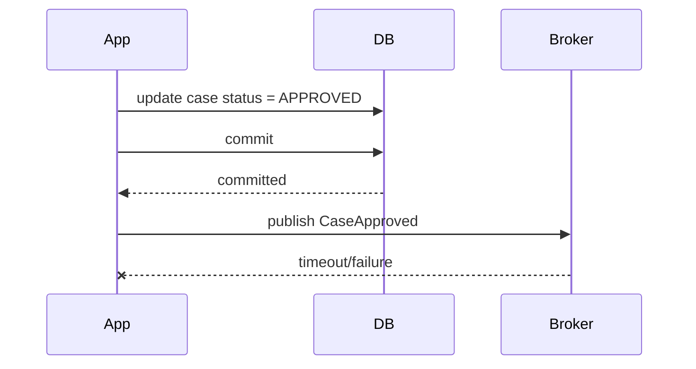
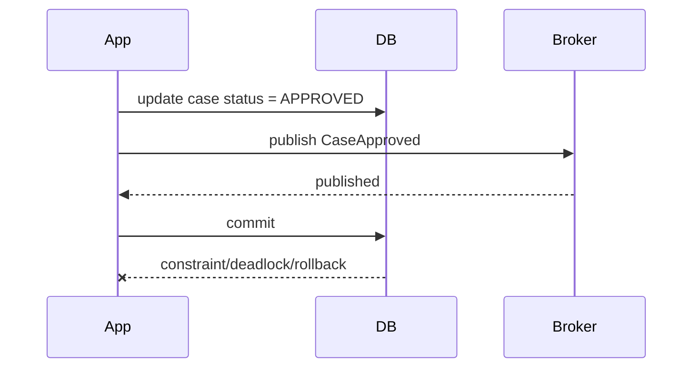
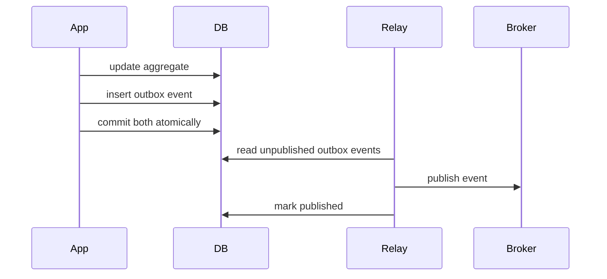
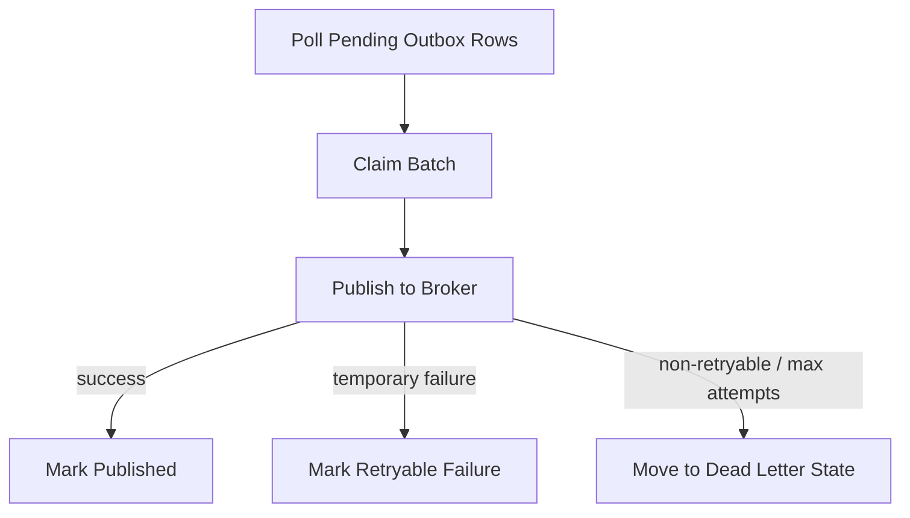
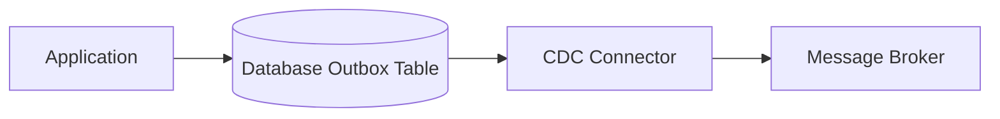
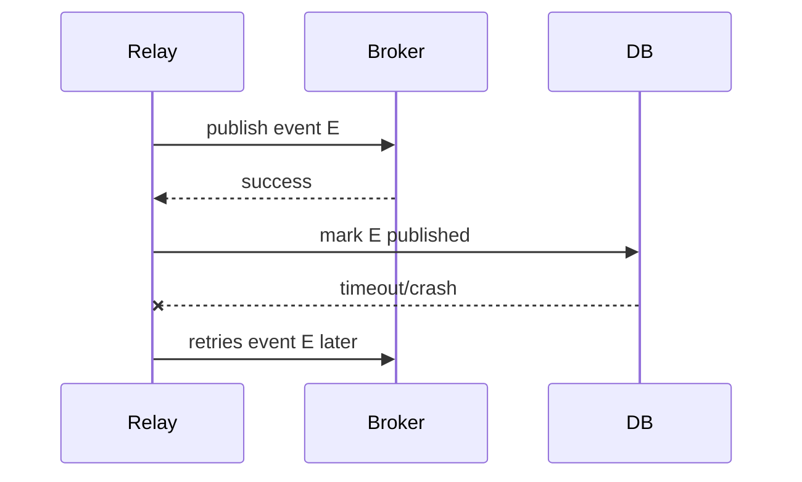
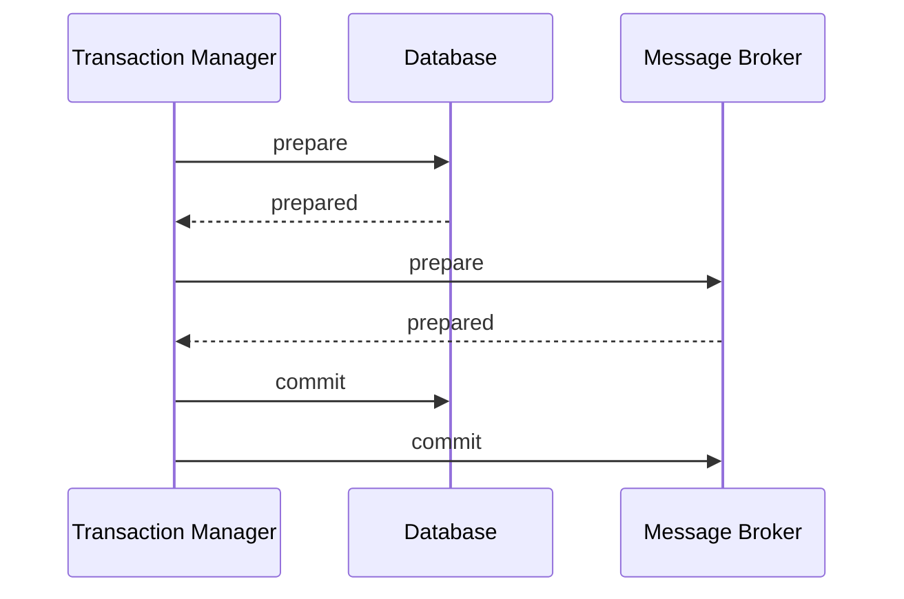
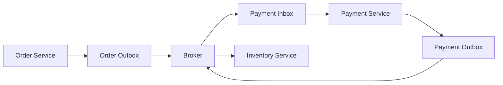
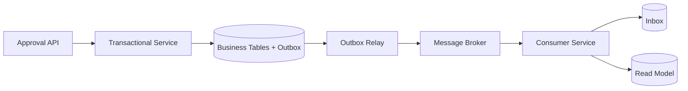

# Part 030 — Outbox, Inbox, and Distributed Persistence

A database transaction is local. A business process is often distributed.

That gap creates one of the most common failure modes in enterprise Java systems:

```text
Update database successfully.
Fail to publish message.
```

Or the reverse:

```text
Publish message successfully.
Fail to commit database transaction.
```

This is the **dual-write problem**.

The transactional outbox pattern exists because a normal JPA transaction cannot atomically commit to both:

1. your relational database, and
2. a message broker, email service, search index, external API, or another microservice.

This part is about designing reliable distributed persistence around JPA without pretending distributed systems are local method calls.

---

## 1. Kaufman Deconstruction: What Skill Are We Practicing?

Distributed persistence is not “add Kafka/RabbitMQ”. It is the skill of preserving business consistency when state crosses process boundaries.

| Subskill | What You Must Be Able To Do |
|---|---|
| Identify dual writes | Detect when code mutates DB and external system in one use case |
| Choose consistency model | Decide between strong local transaction, eventual consistency, saga, compensation, or sync call |
| Design outbox | Store event/message intent in same DB transaction as business change |
| Build relay | Publish outbox records reliably, with retry and idempotency |
| Build inbox | Deduplicate incoming messages before applying effects |
| Model ordering | Understand per-aggregate ordering vs global ordering |
| Handle failure | Recover from partial publish, duplicate delivery, poison messages, broker outage, relay crash |
| Test reliability | Prove behavior under crash/retry/concurrency, not only happy path |

Target performance level:

> Given a Java/JPA service that must coordinate database changes and asynchronous effects, you can design an outbox/inbox mechanism, make producers and consumers idempotent, reason about ordering, and operate the system under retry, crash, and duplicate delivery.

---

## 2. The Dual-Write Problem

Bad implementation:

```java
@Transactional
public void approveCase(UUID caseId) {
    CaseEntity entity = caseRepository.findById(caseId).orElseThrow();
    entity.approve();

    caseApprovedPublisher.publish(new CaseApprovedEvent(caseId));
}
```

This looks clean but is unsafe.

### Failure 1: DB Commit Succeeds, Publish Fails



Result:

```text
Database says case approved.
No downstream system knows.
```

### Failure 2: Publish Succeeds, DB Commit Fails



Result:

```text
Downstream systems receive approval event.
Database says case is not approved.
```

### Failure 3: Publish Inside Transaction, Consumer Reads Before Commit

Even if publish happens before commit and commit later succeeds, consumers may observe inconsistent state.

```text
Event says approved.
Consumer queries producer service/database.
Producer transaction has not committed yet.
Consumer sees old state.
```

The core rule:

> Do not publish irreversible external side effects directly inside a database transaction.

---

## 3. Transactional Outbox Pattern

The outbox pattern stores the message to be published as a row in the same database transaction as the business mutation.



The local transaction becomes:

```text
business row change + outbox row insert
```

Not:

```text
business row change + broker publish
```

That is the entire shift.

---

## 4. Outbox Table Design

A practical outbox table:

```sql
create table outbox_events (
    id uuid primary key,
    tenant_id uuid,
    aggregate_type varchar(100) not null,
    aggregate_id uuid not null,
    aggregate_version bigint,
    event_type varchar(200) not null,
    event_version int not null,
    payload jsonb not null,
    headers jsonb not null,
    status varchar(32) not null,
    attempts int not null default 0,
    next_attempt_at timestamptz not null,
    created_at timestamptz not null,
    locked_by varchar(100),
    locked_until timestamptz,
    published_at timestamptz,
    last_error text
);
```

Useful indexes:

```sql
create index idx_outbox_pending
on outbox_events (status, next_attempt_at, created_at)
where status in ('PENDING', 'FAILED_RETRYABLE');

create index idx_outbox_aggregate_order
on outbox_events (aggregate_type, aggregate_id, aggregate_version);

create index idx_outbox_tenant_pending
on outbox_events (tenant_id, status, next_attempt_at)
where tenant_id is not null;
```

### 4.1 Column Meaning

| Column | Purpose |
|---|---|
| `id` | Event/message identity; also used for idempotency |
| `tenant_id` | Required for tenant-owned events |
| `aggregate_type` | Logical aggregate name, e.g. `Case`, `Order`, `Payment` |
| `aggregate_id` | Aggregate instance identity |
| `aggregate_version` | Helps per-aggregate ordering and consumer stale-event detection |
| `event_type` | Semantic event type |
| `event_version` | Payload schema version |
| `payload` | Serialized event body |
| `headers` | Correlation ID, causation ID, trace ID, actor, tenant |
| `status` | Relay lifecycle state |
| `attempts` | Retry count |
| `next_attempt_at` | Backoff scheduling |
| `locked_by`, `locked_until` | Safe multi-relay claiming |
| `published_at` | Audit/retention marker |
| `last_error` | Diagnostics for failed publish |

---

## 5. Outbox Entity Mapping

```java
@Entity
@Table(name = "outbox_events")
public class OutboxEventEntity {

    @Id
    @Column(name = "id", nullable = false)
    private UUID id;

    @Column(name = "tenant_id")
    private UUID tenantId;

    @Column(name = "aggregate_type", nullable = false, length = 100)
    private String aggregateType;

    @Column(name = "aggregate_id", nullable = false)
    private UUID aggregateId;

    @Column(name = "aggregate_version")
    private Long aggregateVersion;

    @Column(name = "event_type", nullable = false, length = 200)
    private String eventType;

    @Column(name = "event_version", nullable = false)
    private int eventVersion;

    @JdbcTypeCode(SqlTypes.JSON)
    @Column(name = "payload", nullable = false, columnDefinition = "jsonb")
    private Map<String, Object> payload;

    @JdbcTypeCode(SqlTypes.JSON)
    @Column(name = "headers", nullable = false, columnDefinition = "jsonb")
    private Map<String, Object> headers;

    @Enumerated(EnumType.STRING)
    @Column(name = "status", nullable = false, length = 32)
    private OutboxStatus status;

    @Column(name = "attempts", nullable = false)
    private int attempts;

    @Column(name = "next_attempt_at", nullable = false)
    private Instant nextAttemptAt;

    @Column(name = "created_at", nullable = false)
    private Instant createdAt;

    @Column(name = "locked_by", length = 100)
    private String lockedBy;

    @Column(name = "locked_until")
    private Instant lockedUntil;

    @Column(name = "published_at")
    private Instant publishedAt;

    @Column(name = "last_error")
    private String lastError;

    protected OutboxEventEntity() {
    }

    public static OutboxEventEntity pending(
        UUID id,
        UUID tenantId,
        String aggregateType,
        UUID aggregateId,
        Long aggregateVersion,
        String eventType,
        int eventVersion,
        Map<String, Object> payload,
        Map<String, Object> headers,
        Instant now
    ) {
        OutboxEventEntity entity = new OutboxEventEntity();
        entity.id = Objects.requireNonNull(id);
        entity.tenantId = tenantId;
        entity.aggregateType = requireNonBlank(aggregateType);
        entity.aggregateId = Objects.requireNonNull(aggregateId);
        entity.aggregateVersion = aggregateVersion;
        entity.eventType = requireNonBlank(eventType);
        entity.eventVersion = eventVersion;
        entity.payload = Map.copyOf(payload);
        entity.headers = Map.copyOf(headers);
        entity.status = OutboxStatus.PENDING;
        entity.attempts = 0;
        entity.nextAttemptAt = now;
        entity.createdAt = now;
        return entity;
    }

    public void markPublished(Instant now) {
        this.status = OutboxStatus.PUBLISHED;
        this.publishedAt = now;
        this.lockedBy = null;
        this.lockedUntil = null;
        this.lastError = null;
    }

    public void markRetryableFailure(String error, Instant nextAttemptAt) {
        this.status = OutboxStatus.FAILED_RETRYABLE;
        this.attempts++;
        this.nextAttemptAt = Objects.requireNonNull(nextAttemptAt);
        this.lockedBy = null;
        this.lockedUntil = null;
        this.lastError = truncate(error, 4_000);
    }

    public void markDead(String error) {
        this.status = OutboxStatus.DEAD;
        this.attempts++;
        this.lockedBy = null;
        this.lockedUntil = null;
        this.lastError = truncate(error, 4_000);
    }
}
```

Status enum:

```java
public enum OutboxStatus {
    PENDING,
    PROCESSING,
    FAILED_RETRYABLE,
    PUBLISHED,
    DEAD
}
```

---

## 6. Writing Business State and Outbox Event Together

Application service:

```java
@Service
public class CaseApprovalService {
    private final CaseRepository caseRepository;
    private final OutboxEventRepository outboxRepository;
    private final EventPayloadMapper payloadMapper;
    private final Clock clock;

    @Transactional
    public void approve(UUID caseId, UUID approverId) {
        TenantContext tenant = TenantContextHolder.require();
        Instant now = clock.instant();

        CaseEntity entity = caseRepository
            .findByTenantIdAndId(tenant.tenantId(), caseId)
            .orElseThrow(CaseNotFoundException::new);

        entity.approve(approverId, now);

        CaseApprovedEvent event = new CaseApprovedEvent(
            UUID.randomUUID(),
            tenant.tenantId(),
            entity.id(),
            entity.version(),
            approverId,
            now
        );

        outboxRepository.save(OutboxEventEntity.pending(
            event.eventId(),
            event.tenantId(),
            "Case",
            event.caseId(),
            event.aggregateVersion(),
            "case.approved",
            1,
            payloadMapper.toPayload(event),
            standardHeaders(event.eventId(), tenant, now),
            now
        ));
    }
}
```

Important property:

```text
If transaction rolls back:
  case update rolls back
  outbox row rolls back

If transaction commits:
  case update commits
  outbox row commits
```

The relay can fail later without losing the intent to publish.

---

## 7. Transactional Domain Event Capture

You may not want application services to manually create outbox rows everywhere.

An aggregate can collect domain events:

```java
@Entity
@Table(name = "cases")
public class CaseEntity {

    @Transient
    private final List<DomainEvent> domainEvents = new ArrayList<>();

    public void approve(UUID approverId, Instant now) {
        if (status != CaseStatus.READY_FOR_APPROVAL) {
            throw new InvalidCaseTransitionException(status, CaseStatus.APPROVED);
        }
        this.status = CaseStatus.APPROVED;
        this.approvedBy = approverId;
        this.approvedAt = now;

        domainEvents.add(new CaseApprovedDomainEvent(id, version, approverId, now));
    }

    public List<DomainEvent> pullDomainEvents() {
        List<DomainEvent> copy = List.copyOf(domainEvents);
        domainEvents.clear();
        return copy;
    }
}
```

Then the application service persists outbox events after mutation but before commit:

```java
@Transactional
public void approve(UUID caseId, UUID approverId) {
    CaseEntity entity = repository.getForUpdate(caseId);
    entity.approve(approverId, clock.instant());

    for (DomainEvent event : entity.pullDomainEvents()) {
        outboxWriter.write(event);
    }
}
```

This is explicit and safe.

Avoid magical event publishing that hides transaction timing.

---

## 8. Spring Transactional Event Listeners: Useful but Dangerous

Spring provides transaction synchronization mechanisms and transactional event listeners. They are useful, but you must understand timing.

A common pattern:

```java
@Component
public class DomainEventOutboxListener {

    private final OutboxWriter outboxWriter;

    @TransactionalEventListener(phase = TransactionPhase.BEFORE_COMMIT)
    public void on(DomainEvent event) {
        outboxWriter.write(event);
    }
}
```

Potential issue:

- if listener is not invoked in the same persistence context as expected,
- if event publishing is async,
- if listener opens a new transaction unintentionally,
- if listener fails after entity changes but before commit,
- if listener writes outbox with wrong tenant context,
- if developers think `AFTER_COMMIT` can still participate in the original transaction.

Safer rule:

> If the outbox record must commit atomically with business data, write it before commit in the same transaction.

`AFTER_COMMIT` is suitable for non-critical side effects that can tolerate losing the original transaction context, but not for creating the durable outbox row for the committed business change.

---

## 9. Event Relay Design

The relay reads outbox rows and publishes them.



Basic relay:

```java
@Component
public class OutboxRelay {
    private final OutboxEventRepository repository;
    private final MessagePublisher publisher;
    private final Clock clock;
    private final String workerId;

    @Scheduled(fixedDelayString = "${outbox.relay.delay-ms:1000}")
    public void publishBatch() {
        List<OutboxEventEntity> events = repository.claimBatch(
            workerId,
            clock.instant(),
            Duration.ofMinutes(2),
            100
        );

        for (OutboxEventEntity event : events) {
            publishOne(event.id());
        }
    }

    @Transactional(propagation = Propagation.REQUIRES_NEW)
    public void publishOne(UUID eventId) {
        OutboxEventEntity event = repository.findByIdForUpdate(eventId)
            .orElseThrow();

        try {
            publisher.publish(toMessage(event));
            event.markPublished(clock.instant());
        } catch (TransientPublishException ex) {
            event.markRetryableFailure(
                ex.getMessage(),
                RetryBackoff.nextAttempt(event.attempts(), clock.instant())
            );
        } catch (Exception ex) {
            if (event.attempts() >= 10) {
                event.markDead(ex.getMessage());
            } else {
                event.markRetryableFailure(
                    ex.getMessage(),
                    RetryBackoff.nextAttempt(event.attempts(), clock.instant())
                );
            }
        }
    }
}
```

Note the transaction boundary per event. A failure in one event should not roll back the entire batch.

---

## 10. Claiming Outbox Rows Safely

Multiple relay workers require safe claiming.

PostgreSQL-style query:

```sql
select id
from outbox_events
where status in ('PENDING', 'FAILED_RETRYABLE')
  and next_attempt_at <= now()
  and (locked_until is null or locked_until < now())
order by created_at
limit 100
for update skip locked;
```

Then update claim:

```sql
update outbox_events
set status = 'PROCESSING',
    locked_by = ?,
    locked_until = now() + interval '2 minutes'
where id in (...);
```

With JPA native query:

```java
public interface OutboxEventRepository extends JpaRepository<OutboxEventEntity, UUID> {

    @Query(value = """
        select id
        from outbox_events
        where status in ('PENDING', 'FAILED_RETRYABLE')
          and next_attempt_at <= now()
          and (locked_until is null or locked_until < now())
        order by created_at
        limit :limit
        for update skip locked
    """, nativeQuery = true)
    List<UUID> findClaimableIds(@Param("limit") int limit);
}
```

Because claim semantics are database-specific, many production systems use native SQL for this part.

Alternative strategies:

| Strategy | Trade-off |
|---|---|
| `for update skip locked` | Efficient multi-worker DB polling, vendor-specific |
| optimistic update claim | Portable but can have more contention |
| partitioned polling | Good for scale and ordering by aggregate/tenant |
| CDC relay | Lower polling load, more infrastructure |

---

## 11. Polling Publisher vs CDC Publisher

### 11.1 Polling Publisher

The application or a sidecar periodically queries outbox rows.

Pros:

- simple to understand,
- no CDC infrastructure,
- works with ordinary application deployment,
- easy to control retry and status.

Cons:

- polling load,
- latency depends on interval,
- careful locking required,
- relay writes status updates.

### 11.2 CDC Publisher

Change Data Capture observes database log changes and publishes outbox rows.



Pros:

- low application polling burden,
- near-real-time,
- can scale event extraction separately,
- often good for high-throughput systems.

Cons:

- more infrastructure,
- operationally complex,
- schema changes affect CDC pipeline,
- retry/dead-letter semantics move outside app,
- local development/testing more complex.

Choose polling first unless throughput/latency/operational context justifies CDC.

---

## 12. Delivery Guarantees

Outbox usually gives:

```text
At-least-once publication
```

Not exactly-once business effects.

Why duplicates can happen:



The broker may receive event E twice.

Therefore:

> Consumers must be idempotent.

Exactly-once is usually achieved at the business effect level through idempotent processing, deduplication, and transactional consumers, not by assuming the transport never duplicates.

---

## 13. Inbox Pattern

The inbox pattern records consumed message IDs before or while applying effects.

```sql
create table inbox_messages (
    message_id uuid not null,
    consumer_name varchar(100) not null,
    tenant_id uuid,
    received_at timestamptz not null,
    processed_at timestamptz,
    status varchar(32) not null,
    last_error text,
    primary key (message_id, consumer_name)
);
```

Consumer:

```java
@Component
public class CaseApprovedConsumer {
    private final InboxRepository inboxRepository;
    private final CaseProjectionRepository projectionRepository;
    private final Clock clock;

    @Transactional
    public void handle(Message<CaseApprovedEvent> message) {
        UUID messageId = message.headers().eventId();
        String consumerName = "case-projection-updater";

        boolean firstTime = inboxRepository.tryStart(
            messageId,
            consumerName,
            message.payload().tenantId(),
            clock.instant()
        );

        if (!firstTime) {
            return;
        }

        try {
            CaseApprovedEvent event = message.payload();
            projectionRepository.markApproved(
                event.tenantId(),
                event.caseId(),
                event.approvedAt()
            );
            inboxRepository.markProcessed(messageId, consumerName, clock.instant());
        } catch (Exception ex) {
            inboxRepository.markFailed(messageId, consumerName, ex.getMessage());
            throw ex;
        }
    }
}
```

`tryStart` can be implemented by inserting into a table with a unique key.

```sql
insert into inbox_messages (
    message_id,
    consumer_name,
    tenant_id,
    received_at,
    status
) values (?, ?, ?, ?, 'PROCESSING')
on conflict (message_id, consumer_name) do nothing;
```

If insert count is zero, the message was already seen.

---

## 14. Idempotent Consumer Design

There are two levels of idempotency.

### 14.1 Message-Level Idempotency

Avoid processing the same message twice.

```text
message_id + consumer_name unique constraint
```

### 14.2 Business-Level Idempotency

Avoid applying the same business effect twice even if message IDs differ.

Example:

```sql
create table payment_allocations (
    tenant_id uuid not null,
    payment_id uuid not null,
    invoice_id uuid not null,
    amount numeric(19, 4) not null,
    allocation_reason varchar(100) not null,
    primary key (tenant_id, payment_id, invoice_id)
);
```

If duplicate event tries to allocate the same payment to the same invoice, the database constraint prevents double allocation.

A top 1% engineer asks:

> If this consumer runs twice, what invariant prevents duplicate business impact?

Not merely:

> Does Kafka/Rabbit/SQS promise not to duplicate?

---

## 15. Ordering Semantics

Ordering is expensive. Define exactly what needs ordering.

| Ordering Type | Meaning | Cost |
|---|---|---:|
| No ordering | Events can be processed in any order | Low |
| Per aggregate | Events for same aggregate are ordered | Medium |
| Per tenant | Events for same tenant are ordered | High |
| Global | All events ordered globally | Very high |

Most business systems need per-aggregate ordering, not global ordering.

Example:

```text
CaseCreated(caseId=1, version=1)
CaseAssigned(caseId=1, version=2)
CaseApproved(caseId=1, version=3)
```

Consumer can reject stale events:

```java
public void apply(CaseEvent event) {
    CaseProjection projection = repository.find(event.tenantId(), event.caseId());

    if (event.aggregateVersion() <= projection.lastAppliedVersion()) {
        return;
    }

    if (event.aggregateVersion() != projection.lastAppliedVersion() + 1) {
        throw new OutOfOrderEventException(event.caseId(), event.aggregateVersion());
    }

    projection.apply(event);
}
```

This requires event payload to carry aggregate version.

---

## 16. Aggregate Version and JPA `@Version`

You can use entity version for event ordering, but be careful.

```java
@Version
@Column(name = "version", nullable = false)
private long version;
```

Caveats:

- JPA version may be incremented at flush time,
- version value before flush may not represent committed version,
- bulk updates bypass normal entity versioning unless handled explicitly,
- different provider behavior/timing must be tested.

Safe approach:

```java
entity.approve(...);
entityManager.flush();
long committedLikeVersion = entity.version();
outboxWriter.write(new CaseApprovedEvent(..., committedLikeVersion));
```

But flushing manually has side effects. Another approach is domain-managed sequence/version.

```java
public void approve(...) {
    this.domainVersion = this.domainVersion + 1;
    this.status = APPROVED;
    events.add(new CaseApprovedEvent(id, domainVersion, ...));
}
```

This gives explicit aggregate event ordering independent of provider version timing.

---

## 17. Relay Ordering Strategies

### 17.1 Simple Created-Time Ordering

```sql
order by created_at
```

Simple, but not enough if timestamps collide or multiple transactions commit out of order.

### 17.2 Monotonic Outbox Sequence

```sql
create sequence outbox_sequence;

sequence_no bigint not null default nextval('outbox_sequence')
```

Then:

```sql
order by sequence_no
```

Good for local database ordering, but can become bottleneck or not map to global distributed ordering.

### 17.3 Per-Aggregate Ordering

Publish using aggregate ID as message key/partition key.

```text
message key = aggregate_type + aggregate_id
```

This helps brokers that preserve order per key/partition.

### 17.4 Tenant-Aware Ordering

For tenant-heavy systems:

```text
message key = tenant_id + aggregate_id
```

This prevents events for the same aggregate crossing tenant boundaries and keeps load distributed.

---

## 18. Poison Messages

A poison message is an event that repeatedly fails processing.

Causes:

- invalid payload,
- unknown schema version,
- missing referenced data,
- consumer bug,
- downstream permanent rejection,
- incompatible deployment version.

Outbox relay handling:

```java
if (isRetryable(ex) && attempts < maxAttempts) {
    event.markRetryableFailure(ex.getMessage(), nextBackoff());
} else {
    event.markDead(ex.getMessage());
    alerting.notifyOutboxDeadLetter(event.id(), ex);
}
```

Inbox consumer handling:

```text
retry transient failures
reject unknown schema versions
dead-letter permanent poison messages
alert with message ID, event type, tenant, aggregate ID, payload version
```

Never allow one poison message to block all events forever unless strict ordering requires it and the business accepts that trade-off.

---

## 19. Event Schema Evolution

Outbox events are contracts.

Do not treat them as internal Java objects.

Bad payload:

```json
{
  "class": "com.acme.case.CaseApprovedEvent",
  "caseEntity": { "...": "entire JPA entity graph" }
}
```

Better payload:

```json
{
  "eventId": "0b7a...",
  "eventType": "case.approved",
  "eventVersion": 1,
  "tenantId": "a83f...",
  "caseId": "c91e...",
  "aggregateVersion": 17,
  "approvedBy": "51d2...",
  "approvedAt": "2026-06-30T10:15:30Z"
}
```

Rules:

- include `eventType`,
- include `eventVersion`,
- include stable IDs,
- include tenant ID when tenant-owned,
- avoid serializing JPA entities,
- avoid leaking lazy-loaded graphs,
- design additive changes first,
- keep consumers backward compatible during deployment overlap.

---

## 20. Outbox Payload Mapper

Do not let Jackson serialize entities directly.

Use explicit mapper:

```java
public final class CaseApprovedEventMapper {

    public Map<String, Object> toPayload(CaseApprovedEvent event) {
        return Map.of(
            "eventId", event.eventId().toString(),
            "eventType", "case.approved",
            "eventVersion", 1,
            "tenantId", event.tenantId().toString(),
            "caseId", event.caseId().toString(),
            "aggregateVersion", event.aggregateVersion(),
            "approvedBy", event.approvedBy().toString(),
            "approvedAt", event.approvedAt().toString()
        );
    }
}
```

This prevents accidental payload expansion when entity fields change.

---

## 21. Distributed Transactions and 2PC

Two-phase commit can coordinate multiple transactional resources, but it is often avoided in microservice/cloud architectures due to operational complexity, blocking behavior, and coupling.

A simplified 2PC flow:



Trade-offs:

| Approach | Pros | Cons |
|---|---|---|
| 2PC/XA | Strong atomicity across resources | Operational complexity, blocking, resource support required |
| Outbox | Simple local transaction, reliable eventual publish | At-least-once delivery, consumers must be idempotent |
| Saga | Explicit long-running workflow | Compensation complexity |
| Event sourcing | Event log as source of truth | Major architectural shift |

For most JPA microservices, transactional outbox is the practical default.

---

## 22. Saga Relationship

Outbox is not the same as saga.

| Pattern | Purpose |
|---|---|
| Outbox | Reliably publish a message/event after local DB transaction |
| Inbox | Reliably consume/deduplicate incoming message |
| Saga | Coordinate multi-step business transaction across services |

A saga often uses outbox/inbox internally.



The saga is the process.

Outbox/inbox are reliability mechanisms.

---

## 23. Command vs Event

Outbox can store commands or events.

| Type | Meaning | Example |
|---|---|---|
| Event | Something happened | `CaseApproved` |
| Command | Please do something | `SendApprovalEmail` |

Events should be past tense and factual.

```text
CaseApproved
PaymentCaptured
DocumentUploaded
```

Commands are imperative.

```text
SendCaseApprovedEmail
CreateSearchIndexRecord
RecalculateRiskScore
```

Mixing them causes confusion.

Guideline:

- publish domain events to other systems,
- use commands for internal async workers if there is a specific task,
- name outbox records clearly.

---

## 24. Email, Search Index, and External API Side Effects

Outbox is not only for brokers.

### Email

Instead of sending email inside transaction:

```java
emailClient.send(...);
```

Write command:

```text
SendCaseApprovalEmail
```

Then worker sends email idempotently.

### Search Index

Instead of updating Elasticsearch/OpenSearch directly in the transaction:

```text
IndexCaseDocument
```

Worker reads committed DB state and updates index.

### External API

Instead of calling external API inside DB transaction:

```text
NotifyExternalRegulator
```

Worker retries with idempotency key.

---

## 25. Idempotency Keys for External Calls

When calling external systems, send an idempotency key if supported.

```text
Idempotency-Key: outbox_event_id
```

If the worker retries after timeout, the external system can avoid duplicate effect.

If external system does not support idempotency, you need your own reconciliation mechanism.

Example external call log:

```sql
create table external_call_attempts (
    outbox_event_id uuid not null,
    endpoint varchar(200) not null,
    request_hash varchar(128) not null,
    attempt_no int not null,
    status varchar(32) not null,
    response_code int,
    response_body text,
    created_at timestamptz not null,
    primary key (outbox_event_id, attempt_no)
);
```

---

## 26. Transaction Boundaries for Relay

Avoid one giant transaction for the whole batch.

Bad:

```java
@Transactional
public void publishBatch() {
    List<OutboxEventEntity> events = repository.findPending(1000);
    for (OutboxEventEntity event : events) {
        publisher.publish(event);
        event.markPublished(now);
    }
}
```

Problems:

- long transaction,
- locks held too long,
- one failure rolls back all mark-published updates,
- broker publish happens while DB transaction is open,
- retry behavior unclear.

Better:

```text
claim small batch
process each event in independent transaction
commit status after each event
limit concurrency per aggregate/tenant when needed
```

---

## 27. Relay Crash Recovery

Scenario:

```text
Event status = PROCESSING
Relay crashes
No one marks it published or failed
```

Use lease-based locks:

```sql
locked_by varchar(100),
locked_until timestamptz
```

Claim rule:

```sql
where locked_until is null or locked_until < now()
```

If relay dies, another worker can reclaim after timeout.

Choose lock timeout longer than normal publish duration but short enough for recovery.

---

## 28. Multitenant Outbox

For tenant-owned events, outbox must be tenant-aware.

```sql
tenant_id uuid not null
```

Why:

- message headers need tenant ID,
- consumers must set tenant context,
- tenant deletion must purge/retain outbox correctly,
- relay metrics can detect noisy tenants,
- per-tenant ordering/throttling may be required.

Tenant-aware relay can process fairly:

```text
for each active tenant:
  claim up to N pending events
```

Or use query ordering that avoids one tenant monopolizing the batch.

Bad:

```sql
order by created_at limit 1000
```

If tenant A creates millions of events, tenant B may starve.

Better:

```text
partition relay by tenant tier/region
or fair scheduler per tenant
or weighted queues
```

---

## 29. Backpressure and Load Shedding

Outbox backlog is a signal.

Metrics:

```text
outbox.pending.count
outbox.oldest.pending.age
outbox.publish.success.rate
outbox.publish.failure.rate
outbox.dead.count
outbox.retry.count
outbox.publish.latency
outbox.claim.duration
```

Alert examples:

```text
oldest pending age > 5 minutes for critical events
pending count grows for 15 minutes
dead events > 0
publish failure rate > 5%
relay worker unavailable
```

Backpressure options:

| Symptom | Control |
|---|---|
| Broker outage | Stop accepting low-priority commands or degrade features |
| Tenant backlog | Rate-limit tenant or dedicate relay capacity |
| Poison message | Dead-letter and alert |
| Slow consumer | Scale consumer or reduce producer rate |
| DB polling load | Increase interval, reduce batch, move to CDC |

Outbox is not free. It shifts failure into a durable backlog that must be operated.

---

## 30. Testing Outbox Reliability

### 30.1 Commit Writes Business and Outbox Together

```java
@Test
void approvingCaseCreatesOutboxEventInSameTransaction() {
    caseApprovalService.approve(caseId, approverId);

    assertThat(caseRepository.find(caseId).status()).isEqualTo(APPROVED);
    assertThat(outboxRepository.findByAggregateId(caseId))
        .singleElement()
        .extracting(OutboxEventEntity::eventType)
        .isEqualTo("case.approved");
}
```

### 30.2 Rollback Removes Outbox Event

```java
@Test
void rollbackDoesNotLeaveOutboxEvent() {
    assertThatThrownBy(() -> service.approveAndFail(caseId))
        .isInstanceOf(TestFailureException.class);

    assertThat(outboxRepository.findByAggregateId(caseId)).isEmpty();
}
```

### 30.3 Relay Retries Publish Failure

```java
@Test
void relayMarksRetryableFailureWhenBrokerFails() {
    OutboxEventEntity event = givenPendingOutboxEvent();
    publisher.failNextPublish(new TransientPublishException("broker unavailable"));

    relay.publishOne(event.id());

    OutboxEventEntity reloaded = outboxRepository.findById(event.id()).orElseThrow();
    assertThat(reloaded.status()).isEqualTo(FAILED_RETRYABLE);
    assertThat(reloaded.attempts()).isEqualTo(1);
}
```

### 30.4 Relay Can Duplicate Publish

Test the uncomfortable case:

```text
publish succeeds
mark-published fails
relay retries
consumer receives duplicate
```

Consumer must still be safe.

```java
@Test
void consumerIgnoresDuplicateMessage() {
    CaseApprovedEvent event = givenCaseApprovedEvent();

    consumer.handle(message(event));
    consumer.handle(message(event));

    assertThat(projectionRepository.find(event.caseId()).approvalAppliedCount())
        .isEqualTo(1);
}
```

### 30.5 Inbox Deduplicates Concurrent Delivery

```java
@Test
void inboxDeduplicatesConcurrentMessages() throws Exception {
    CaseApprovedEvent event = givenCaseApprovedEvent();

    runConcurrently(10, () -> consumer.handle(message(event)));

    assertThat(inboxRepository.countProcessed(event.eventId(), "case-projection-updater"))
        .isEqualTo(1);
}
```

---

## 31. Common Anti-Patterns

### 31.1 Publishing Directly Inside Transaction

```java
@Transactional
void approve() {
    entity.approve();
    kafkaTemplate.send(...);
}
```

Unsafe because broker publish and DB commit are not atomic.

### 31.2 Outbox Row Written After Commit

```java
@TransactionalEventListener(phase = AFTER_COMMIT)
void writeOutbox(Event event) {
    outboxRepository.save(...);
}
```

If outbox write fails, business state already committed and event intent is lost.

### 31.3 No Idempotency in Consumer

```java
void consume(Event event) {
    account.credit(event.amount());
}
```

If duplicate arrives, account is credited twice.

### 31.4 Serializing Entity Graphs as Event Payload

```java
payload = objectMapper.writeValueAsString(caseEntity);
```

Problems:

- lazy loading surprises,
- circular references,
- sensitive data leak,
- unstable contract,
- huge payload.

### 31.5 One Event Blocks Entire Relay

Bad relay design processes all events in one transaction/order and stops forever on one poison message.

### 31.6 No Retention Policy

Outbox table grows forever.

Define retention:

```text
PUBLISHED events retained 7/30/90 days depending audit requirement
DEAD events retained until resolved
payload archived/redacted if sensitive
```

### 31.7 Ignoring Tenant Fairness

One tenant's backlog starves all others.

---

## 32. Retention and Cleanup

Outbox cleanup:

```sql
create index idx_outbox_published_cleanup
on outbox_events (published_at)
where status = 'PUBLISHED';
```

Cleanup job:

```sql
delete from outbox_events
where status = 'PUBLISHED'
  and published_at < now() - interval '30 days'
limit 1000;
```

For databases that do not support `limit` in delete, use ID subquery.

Important:

- do not delete `DEAD` events before investigation,
- do not delete events required for audit/legal retention,
- consider archiving payload before deletion,
- delete in chunks to avoid table bloat/locks,
- monitor table/index size.

Inbox cleanup:

```text
Keep dedup records at least as long as broker redelivery window + replay window.
```

If you allow replay from last 30 days, inbox dedup records must survive at least 30 days or consumers may reapply old effects.

---

## 33. Observability Checklist

Logs should include:

```text
event_id
correlation_id
causation_id
tenant_id
aggregate_type
aggregate_id
event_type
event_version
attempt
relay_worker
status
error_class
```

Metrics should include:

```text
outbox_pending_count
outbox_oldest_pending_age_seconds
outbox_published_total
outbox_failed_total
outbox_dead_total
outbox_publish_duration_seconds
inbox_duplicate_total
inbox_failed_total
consumer_lag_seconds
```

Dashboards:

- pending events over time,
- oldest pending event age,
- dead-letter events,
- retry rate by event type,
- backlog by tenant tier/region,
- relay worker health,
- publish latency percentile,
- consumer duplicate rate.

Operational runbook:

```text
1. Identify event type and tenant impact.
2. Inspect oldest pending event.
3. Check broker connectivity.
4. Check dead-letter events.
5. Verify relay worker deployment/version.
6. Replay retryable events after fix.
7. Manually resolve poison messages with audit trail.
```

---

## 34. Review Checklist

Before approving distributed persistence code:

### Producer

- Does business mutation and outbox insert happen in same DB transaction?
- Is event payload explicit and versioned?
- Does event include tenant ID when applicable?
- Does event include correlation/causation IDs?
- Is entity graph serialization avoided?
- Are outbox inserts tested on rollback?

### Relay

- Can multiple workers claim safely?
- Are retries bounded and backoff-based?
- Are poison messages dead-lettered?
- Is publish duplicate tolerated?
- Is relay crash recoverable?
- Are metrics and alerts present?

### Consumer

- Is processing idempotent?
- Is inbox dedup transactional with side effect?
- Is tenant context resolved before DB access?
- Are stale/out-of-order events handled?
- Are schema versions handled?
- Are retries/dead letters observable?

### Operations

- Is there a retention policy?
- Can events be replayed safely?
- Can a tenant backlog be inspected?
- Can poison messages be repaired?
- Can broker outage be survived?

---

## 35. Practice Drill

Build a reliable case approval outbox.

Requirements:

```text
- Case approval updates case status.
- Approval must publish CaseApproved event.
- Event must include tenant ID, case ID, aggregate version, approver ID, timestamp.
- Broker may be down for 10 minutes.
- Relay may crash after publish before marking event published.
- Consumer may receive duplicate event.
- Consumer updates a read model.
- Events must be ordered per case.
```

Deliverables:

1. Table design for `cases`, `outbox_events`, `inbox_messages`, `case_read_model`.
2. JPA entity for outbox.
3. Transactional service method.
4. Relay claiming query.
5. Retry/dead-letter strategy.
6. Consumer idempotency design.
7. Test cases for rollback, duplicate delivery, relay crash, out-of-order event.
8. Metrics and alert definitions.

Expected architecture:



---

## 36. Key Takeaways

- A JPA transaction cannot atomically commit to both database and message broker.
- Publishing directly inside `@Transactional` creates dual-write failure risk.
- Transactional outbox stores publish intent in the same transaction as business data.
- Outbox gives durable at-least-once publication, not magic exactly-once effects.
- Consumers must be idempotent, usually with inbox deduplication and business constraints.
- Ordering should be scoped deliberately, usually per aggregate rather than global.
- Relay workers need safe claiming, retry, dead-letter, crash recovery, and observability.
- Event payloads are contracts and must be explicit, stable, versioned, and tenant-aware.
- Outbox/inbox are reliability mechanisms; saga is a broader business process coordination pattern.

---

## 37. Bridge to Next Part

Outbox and inbox make distributed persistence safer, but they also make testing more important.

The next part moves from design to proof:

> How do we test JPA persistence correctly without being fooled by mocks, rollback illusions, in-memory databases, or missing migrations?

Part 031 covers:

- Testcontainers,
- migration-backed persistence tests,
- repository integration tests,
- transaction rollback illusion,
- SQL/query count assertions,
- concurrency tests,
- production-like data fixtures,
- persistence test pyramid.
