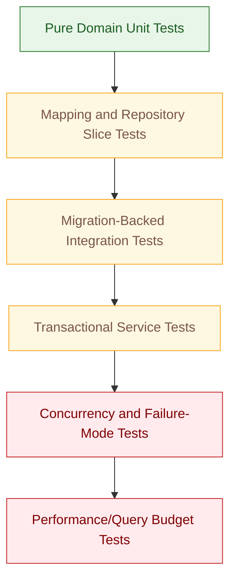
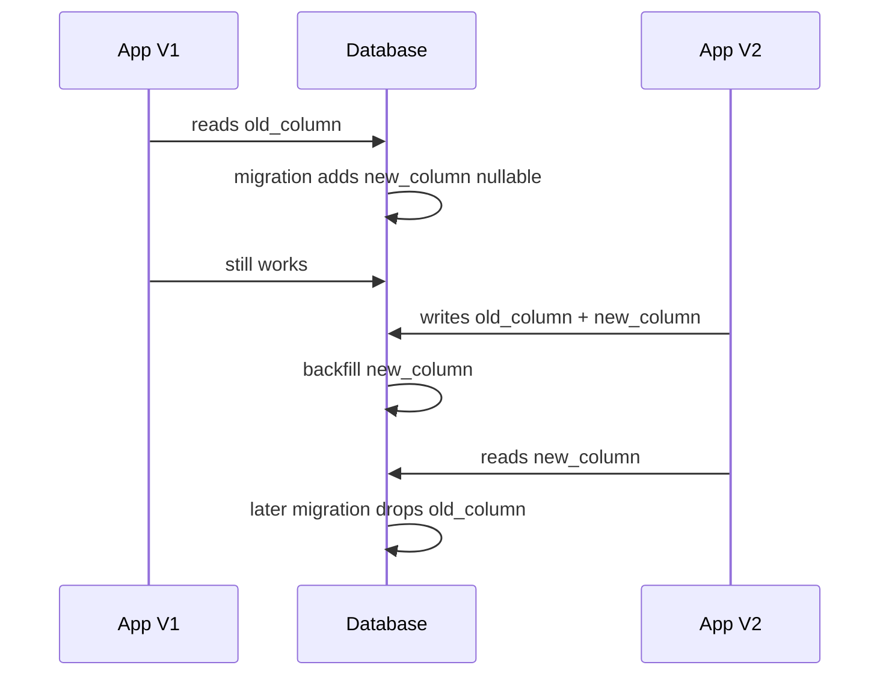
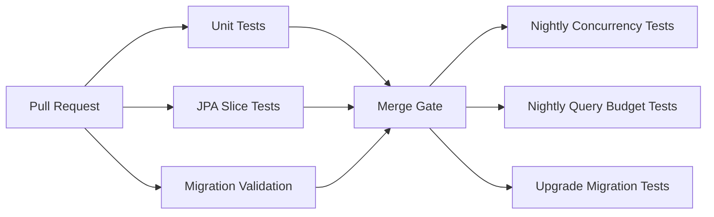

# Part 031 — Testing Persistence Correctly

Persistence tests are not about proving that Spring Data JPA can call `save()`.

Persistence tests prove that your application can safely translate business state into durable relational state under the same constraints, migrations, transaction rules, provider behavior, and database behavior that production will use.

The mistake most teams make is testing the wrong thing:

```text
Mock repository.
Mock EntityManager.
Use H2.
Assert save() was called.
Ship code.
Discover production bug in PostgreSQL/MySQL/Oracle.
```

That is not persistence testing. That is testing an illusion.

A top-tier engineer treats persistence tests as **contract tests between four models**:

1. the domain model,
2. the JPA mapping model,
3. the relational schema model,
4. the transaction and database runtime model.

If any one of those four models is fake, the test may still pass while production fails.

---

## 1. Kaufman Skill Target

Following Kaufman's learning model, this part is designed to remove a major practice barrier: **you cannot learn JPA deeply if your feedback loop hides the real database**.

By the end of this part, you should be able to:

- choose the correct persistence test level;
- decide when mocking a repository is useful and when it is actively harmful;
- run JPA tests against a real database using Testcontainers;
- verify Flyway/Liquibase migrations as part of tests;
- expose flush-time, commit-time, locking, and constraint failures;
- write deterministic concurrency tests;
- assert query count and fetch behavior;
- prevent H2/test-profile behavior from drifting away from production;
- design persistence tests that catch production failure modes early.

The target is not “100% repository coverage”.

The target is this:

> Every important persistence invariant has a fast, deterministic, production-representative test.

---

## 2. Why Persistence Testing Is Different

A normal unit test usually validates pure logic:

```java
assertThat(policy.canApprove(command)).isTrue();
```

A persistence test validates a runtime contract:

```text
Java object state
  -> JPA provider interpretation
  -> SQL generation
  -> database constraints
  -> transaction isolation
  -> committed durable state
  -> later read behavior
```

That means persistence bugs often appear in places unit tests cannot see:

| Bug Type | Hidden Until |
|---|---|
| wrong column name | application startup or first query |
| missing constraint | invalid production data appears |
| bad cascade | flush/commit |
| wrong owning side | update silently not persisted |
| lazy loading failure | view/service boundary |
| N+1 query | realistic list size |
| optimistic lock failure | concurrent write |
| unique violation race | concurrent insert |
| wrong isolation assumption | two transactions overlap |
| migration ordering bug | clean database bootstrap |
| provider-specific SQL issue | real database dialect |

Persistence testing is therefore less about isolated methods and more about **observable state transitions**.

---

## 3. The Persistence Test Pyramid

A healthy Java persistence test strategy does not make every test expensive. It uses different test types for different risk areas.



Use the cheapest test that can catch the failure.

| Test Level | What It Should Catch | What It Should Not Pretend To Catch |
|---|---|---|
| pure domain unit test | business rules independent from database | mapping, flush, constraint, query behavior |
| repository slice test | mapping, query, projection, basic persistence | end-to-end workflow side effects |
| migration-backed integration test | schema compatibility, constraints, DDL correctness | high-volume performance by default |
| service transaction test | transaction boundary, rollback, event/outbox timing | database engine internals |
| concurrency test | lost update, optimistic conflict, lock timeout, race | general repository correctness |
| performance/query test | query count, N+1, batch behavior, plan regression | business correctness only |

The pyramid is not about number of tests only. It is about **risk placement**.

---

## 4. The Main Testing Principle

For persistence tests, this rule is non-negotiable:

> Test against the same database engine family as production unless you are intentionally testing provider-independent behavior.

If production is PostgreSQL, use PostgreSQL in tests.

If production is MySQL, use MySQL in tests.

If production is Oracle, test critical behavior on Oracle-compatible infrastructure.

Why? Because database semantics differ in ways that matter:

- SQL dialect;
- identifier quoting;
- JSON support;
- generated ID behavior;
- sequence behavior;
- locking behavior;
- isolation behavior;
- timestamp precision;
- enum handling;
- index behavior;
- constraint timing;
- `NULL` ordering;
- pagination implementation;
- execution plans;
- transaction anomalies.

An in-memory database can be useful for very narrow feedback loops, but it must not be treated as proof that persistence is production-safe.

---

## 5. The H2 Trap

H2 is useful. H2 is also dangerous.

The danger is not that H2 is “bad”. The danger is assuming H2 behaves like your production database.

Example differences that often matter:

| Area | Typical Production Risk |
|---|---|
| SQL dialect | query passes in H2 but fails in PostgreSQL/MySQL |
| constraints | constraint timing differs |
| locking | pessimistic lock behavior differs |
| JSON | JSON query/index behavior differs |
| enum/native type | mapping differs |
| generated IDs | identity/sequence behavior differs |
| migrations | vendor-specific DDL not exercised |
| indexes | query plan not representative |
| isolation | concurrency tests are misleading |

Use H2 only when the tested invariant is truly database-neutral.

For example:

```text
Good H2 use:
- very fast smoke test of application context;
- simple repository wiring when production database is unavailable;
- learning demos.

Bad H2 use:
- production migration validation;
- lock behavior tests;
- JSON column tests;
- N+1/performance tests;
- custom dialect tests;
- schema compatibility tests.
```

A top-tier team does not argue “H2 is faster”. It asks:

> Faster feedback for what truth?

---

## 6. Testcontainers as the Default Integration Test Boundary

Testcontainers gives Java tests disposable real services: databases, message brokers, caches, object stores, and other infrastructure.

For persistence, this changes the test contract:

```text
Before:
  fake database + fake behavior + fast false confidence

After:
  real database + real migrations + real dialect + acceptable speed
```

A typical Spring Boot + PostgreSQL test looks like this:

```java
@Testcontainers
@SpringBootTest
class OrderPersistenceIT {

    @Container
    @ServiceConnection
    static PostgreSQLContainer<?> postgres = new PostgreSQLContainer<>("postgres:16-alpine");

    @Autowired
    OrderRepository orders;

    @Autowired
    EntityManager em;

    @Test
    void persistsOrderWithLines() {
        Order order = Order.open("customer-001");
        order.addLine("sku-001", 2);

        orders.save(order);
        em.flush();
        em.clear();

        Order reloaded = orders.findById(order.id()).orElseThrow();

        assertThat(reloaded.lines()).hasSize(1);
    }
}
```

The important part is not the annotation combination. The important part is the test shape:

```text
Arrange domain state.
Persist through real application boundary.
Flush.
Clear persistence context.
Reload from database.
Assert durable state.
```

Without `flush()` and `clear()`, many tests accidentally assert managed memory state, not database state.

---

## 7. The Flush-Clear-Reload Rule

When testing persistence correctness, use this pattern frequently:

```java
repository.save(entity);
entityManager.flush();
entityManager.clear();

Entity reloaded = repository.findById(entity.getId()).orElseThrow();
assertThat(reloaded).satisfies(...);
```

Why?

| Step | Purpose |
|---|---|
| `save()` | registers state change |
| `flush()` | forces SQL execution and database constraints |
| `clear()` | removes managed objects from first-level cache |
| reload | proves durable database state, not memory state |

Without `clear()`, this test is weak:

```java
Order order = repository.save(Order.open("C001"));
order.rename("new name");

Order again = repository.findById(order.getId()).orElseThrow();
assertThat(again.name()).isEqualTo("new name");
```

That may pass even if the update was never flushed to the database, because `again` may be the same managed instance.

Better:

```java
Order order = repository.save(Order.open("C001"));
order.rename("new name");

entityManager.flush();
entityManager.clear();

Order again = repository.findById(order.getId()).orElseThrow();
assertThat(again.name()).isEqualTo("new name");
```

Testing persistence without clearing the persistence context is like testing a distributed cache by reading only your local variable.

---

## 8. Repository Tests: What to Test

Do not test every inherited Spring Data method.

This is usually wasteful:

```java
@Test
void saveWorks() {
    Customer c = repository.save(new Customer("A"));
    assertThat(c.getId()).isNotNull();
}
```

Spring Data and Hibernate already test their framework behavior.

You should test your contracts:

| Repository Feature | Worth Testing? | Why |
|---|---:|---|
| custom JPQL query | yes | query semantics are yours |
| native query | yes | SQL/dialect risk |
| projection | yes | constructor/alias/type risk |
| derived method with complex name | yes | generated query may surprise you |
| `@EntityGraph` fetch plan | yes | performance/shape contract |
| lock query | yes | concurrency contract |
| bulk update/delete | yes | bypasses persistence context |
| simple `findById` | usually no | framework behavior |
| simple `save` | usually no | framework behavior unless mapping/cascade is complex |

Repository tests should answer:

```text
Does this repository method express the exact persistence contract the application depends on?
```

---

## 9. Repository Slice Test Example

A `@DataJpaTest` is useful when you want a focused JPA slice:

```java
@DataJpaTest
@Testcontainers
class InvoiceRepositoryTest {

    @Container
    @ServiceConnection
    static PostgreSQLContainer<?> postgres = new PostgreSQLContainer<>("postgres:16-alpine");

    @Autowired
    InvoiceRepository invoices;

    @Autowired
    TestEntityManager em;

    @Test
    void findsUnpaidInvoicesDueBeforeDate() {
        invoices.save(Invoice.due("C001", LocalDate.parse("2026-06-01")));
        invoices.save(Invoice.paid("C002", LocalDate.parse("2026-06-01")));
        invoices.save(Invoice.due("C003", LocalDate.parse("2026-07-01")));

        em.flush();
        em.clear();

        List<InvoiceSummary> result = invoices.findUnpaidDueBefore(
            LocalDate.parse("2026-06-30")
        );

        assertThat(result)
            .extracting(InvoiceSummary::customerId)
            .containsExactly("C001");
    }
}
```

This test verifies:

- query predicate;
- projection mapping;
- database date semantics;
- migration/schema compatibility;
- JPA mapping.

It does not verify service-level transaction orchestration. That belongs in a service integration test.

---

## 10. Migration-Backed Tests

Persistence tests should run against the same migration mechanism used in production.

Bad:

```properties
spring.jpa.hibernate.ddl-auto=create-drop
```

For serious integration tests, prefer:

```properties
spring.jpa.hibernate.ddl-auto=validate
spring.flyway.enabled=true
```

or the Liquibase equivalent.

Why?

Because production runs migrations, not Hibernate schema auto-generation.

A migration-backed test catches:

- missing table;
- missing column;
- wrong nullability;
- wrong precision;
- missing index required by query plan;
- broken sequence;
- constraint name drift;
- incompatible enum/type definition;
- migration ordering failure;
- provider mapping mismatch.

Recommended mode:

```text
Clean test database.
Apply migrations.
Start application context.
Hibernate validates schema.
Run tests.
Drop disposable database.
```

This is how you test the real contract.

---

## 11. Schema Validation Test

Add a dedicated smoke test that does almost nothing:

```java
@SpringBootTest
@Testcontainers
class SchemaValidationIT {

    @Container
    @ServiceConnection
    static PostgreSQLContainer<?> postgres = new PostgreSQLContainer<>("postgres:16-alpine");

    @Test
    void contextStartsWithMigrationBackedSchema() {
        // If application context starts, Flyway migrations ran and Hibernate validation passed.
    }
}
```

This test catches surprisingly many failures:

- renamed entity field without migration;
- migration added wrong type;
- changed sequence allocation;
- missing join table;
- wrong column length;
- wrong enum representation.

It is not enough by itself, but it is a cheap safety net.

---

## 12. Test Data Strategy

Persistence tests often fail because data setup becomes unreadable.

Avoid these extremes:

```text
Too much SQL:
  precise but hard to maintain as domain changes.

Too much object factory magic:
  readable but hides important persisted state.
```

Use different builders for different purposes.

### 12.1 Domain Builder

Use when testing domain behavior plus persistence:

```java
Order order = anOrder()
    .forCustomer("C001")
    .withLine("SKU-1", 2)
    .withLine("SKU-2", 1)
    .build();
```

### 12.2 SQL Fixture

Use when testing query behavior:

```sql
insert into invoice(id, customer_id, status, due_date)
values
  ('00000000-0000-0000-0000-000000000001', 'C001', 'DUE', '2026-06-01'),
  ('00000000-0000-0000-0000-000000000002', 'C002', 'PAID', '2026-06-01');
```

### 12.3 Fixture API

Use for repeated integration scenarios:

```java
fixture.customer("C001");
fixture.order("O001", "C001", order -> order
    .line("SKU-1", 2)
    .approved());
```

Good fixtures obey three rules:

1. make important state visible;
2. hide irrelevant boilerplate;
3. avoid random data unless randomness is the point.

---

## 13. Avoid Random Test Data by Default

Random test data often creates false confidence and bad debugging.

Bad:

```java
Customer c = easyRandom.nextObject(Customer.class);
```

This can produce:

- invalid domain state;
- irrelevant values;
- non-reproducible failures;
- accidental reliance on random defaults;
- unreadable assertions.

Prefer explicit data:

```java
Customer customer = Customer.registered(
    CustomerId.of("C001"),
    EmailAddress.of("ops@example.test"),
    CustomerStatus.ACTIVE
);
```

Randomized/property-based testing has value, but use it deliberately for invariant exploration, not as a replacement for readable examples.

---

## 14. Transaction Rollback Illusion in Tests

Spring test methods often run inside a transaction and roll it back after the test.

This is convenient, but it can hide bugs.

Example:

```java
@DataJpaTest
class OrderRepositoryTest {

    @Test
    void testSomething() {
        repository.save(order);
        // test ends, transaction rolls back
    }
}
```

Possible hidden issues:

- commit-time constraint not observed;
- transaction synchronization not triggered like production;
- outbox relay not tested;
- `REQUIRES_NEW` behavior hidden;
- database triggers only visible after commit not checked;
- isolation behavior impossible because one test transaction owns everything.

When commit behavior matters, force it.

With Spring:

```java
@Test
void commitsAndThenReadsFromNewTransaction() {
    service.performCommand(command);

    await().untilAsserted(() -> {
        assertThat(readModelRepository.findById(command.id())).isPresent();
    });
}
```

Or use `TransactionTemplate`:

```java
transactionTemplate.executeWithoutResult(tx -> {
    service.performCommand(command);
});

transactionTemplate.executeWithoutResult(tx -> {
    Order reloaded = repository.findById(command.orderId()).orElseThrow();
    assertThat(reloaded.status()).isEqualTo(APPROVED);
});
```

The key is separate transaction scopes when testing commit-visible behavior.

---

## 15. Testing Flush-Time Failures

Many JPA failures happen only at flush.

Example:

```java
@Test
void rejectsDuplicateEmail() {
    customers.save(Customer.register("a@example.test"));
    customers.save(Customer.register("a@example.test"));

    assertThatThrownBy(() -> entityManager.flush())
        .isInstanceOf(DataIntegrityViolationException.class);
}
```

Without `flush()`, the test may pass because SQL has not been sent yet.

Flush-time failures include:

- unique constraint violation;
- foreign key violation;
- not-null violation;
- check constraint violation;
- optimistic lock update count mismatch;
- invalid enum/type conversion;
- oversized column value;
- batch statement failure.

If a test expects database enforcement, it should flush.

---

## 16. Testing Cascades and Orphan Removal

Cascade tests should prove lifecycle ownership.

Example:

```java
@Test
void deletingOrderDeletesOwnedLines() {
    Order order = Order.open("C001");
    order.addLine("SKU-1", 2);

    orders.save(order);
    em.flush();
    em.clear();

    orders.deleteById(order.id());
    em.flush();
    em.clear();

    assertThat(jdbc.queryForObject(
        "select count(*) from order_line where order_id = ?",
        Integer.class,
        order.id()
    )).isZero();
}
```

Do not only assert the Java collection:

```java
order.removeLine(line);
assertThat(order.lines()).isEmpty();
```

That is a domain assertion, not a persistence assertion.

For cascade/orphan behavior, assert database state after flush/clear.

---

## 17. Testing Owning Side Synchronization

Bidirectional relationship bugs are common.

Suppose this is your model:

```java
@Entity
class Order {
    @OneToMany(mappedBy = "order", cascade = CascadeType.ALL, orphanRemoval = true)
    private List<OrderLine> lines = new ArrayList<>();

    public void addLine(String sku, int quantity) {
        OrderLine line = new OrderLine(sku, quantity);
        lines.add(line);
        // BUG: line.setOrder(this) missing
    }
}
```

A test should catch it:

```java
@Test
void addLineMaintainsOwningSide() {
    Order order = Order.open("C001");
    order.addLine("SKU-1", 2);

    orders.save(order);

    assertThatThrownBy(() -> em.flush())
        .isInstanceOf(DataIntegrityViolationException.class);
}
```

Or, if nullable foreign key accidentally allows it:

```java
em.flush();
em.clear();

Order reloaded = orders.findById(order.id()).orElseThrow();
assertThat(reloaded.lines()).hasSize(1);
```

If the owning side was not set, this will fail.

---

## 18. Testing Lazy Loading Boundaries

Lazy loading is not bad. Accidental lazy loading is bad.

Test service boundaries like this:

```java
@Test
void orderDetailsQueryReturnsEverythingNeededByApi() {
    OrderDetails details = orderQueryService.getDetails(orderId);

    assertThat(details.lines()).hasSize(2);
    assertThat(details.customerName()).isEqualTo("Acme Ltd");
}
```

But also assert query shape when necessary.

If API serialization touches lazy entities after transaction close, you may get:

```text
LazyInitializationException
```

A good architecture avoids returning managed entities from API boundaries. Testing should enforce that:

```java
@Test
void apiQueryDoesNotExposeManagedEntity() {
    Object result = orderQueryService.getDetails(orderId);

    assertThat(result).isInstanceOf(OrderDetails.class);
    assertThat(result).isNotInstanceOf(Order.class);
}
```

This is simple but valuable.

---

## 19. SQL Count Assertions

Some persistence contracts are performance contracts.

Example:

```text
Loading order details should execute at most 2 SQL statements.
```

You can enforce this with tools such as datasource-proxy, Hibernate statistics, or custom test interceptors.

Conceptually:

```java
@Test
void orderDetailsDoesNotUseNPlusOneQueries() {
    sqlCounter.reset();

    orderQueryService.getDetails(orderId);

    assertThat(sqlCounter.selectCount()).isLessThanOrEqualTo(2);
}
```

The test is not asserting a micro-optimization. It is asserting a contract:

> This use case must not scale SQL count linearly with child count.

Good candidates for query count assertions:

- list pages;
- dashboard queries;
- export queries;
- approval inbox screens;
- high-volume scheduled jobs;
- frequently called APIs.

Avoid query count tests for implementation details that change often. Use them for stable performance-sensitive use cases.

---

## 20. Testing N+1 Failure Explicitly

Create enough data to expose the problem.

Bad:

```java
one order with one line
```

This cannot reveal N+1.

Better:

```java
10 orders, each with 3 lines
```

Then assert query count:

```java
@Test
void listOrdersDoesNotExecuteOneQueryPerOrder() {
    fixture.createOrders(10, each -> each.withLines(3));
    em.flush();
    em.clear();

    sqlCounter.reset();

    List<OrderListItem> result = orderQueryService.listOpenOrders();

    assertThat(result).hasSize(10);
    assertThat(sqlCounter.selectCount()).isLessThanOrEqualTo(2);
}
```

The goal is not exact SQL perfection. The goal is preventing algorithmic query growth.

---

## 21. Testing Bulk Updates and Persistence Context Synchronization

Bulk JPQL updates bypass the persistence context.

Example:

```java
@Modifying(clearAutomatically = true, flushAutomatically = true)
@Query("update Invoice i set i.status = 'OVERDUE' where i.dueDate < :today and i.status = 'DUE'")
int markOverdue(LocalDate today);
```

Test it carefully:

```java
@Test
void bulkMarkOverdueUpdatesDurableState() {
    Invoice invoice = invoices.save(Invoice.due("C001", LocalDate.parse("2026-06-01")));
    em.flush();
    em.clear();

    int updated = invoices.markOverdue(LocalDate.parse("2026-06-30"));

    assertThat(updated).isEqualTo(1);

    em.clear();
    Invoice reloaded = invoices.findById(invoice.id()).orElseThrow();
    assertThat(reloaded.status()).isEqualTo(OVERDUE);
}
```

Also test that in-memory managed entities do not lie:

```java
@Test
void bulkUpdateDoesNotLeaveStaleManagedStateInServicePath() {
    Invoice managed = invoices.findById(invoiceId).orElseThrow();

    invoices.markOverdue(today);

    // Depending on clearAutomatically, this may be stale or detached.
    // The service must not continue relying on stale managed state.
}
```

Bulk operations are excellent tools, but tests must enforce their boundary.

---

## 22. Testing Optimistic Locking

Optimistic locking requires two independent persistence contexts.

Do not test it with one transaction and one `EntityManager`.

Use two transaction scopes:

```java
@Test
void concurrentUpdateFailsWithOptimisticLock() {
    UUID id = transactionTemplate.execute(tx -> {
        Order order = orders.save(Order.open("C001"));
        return order.id();
    });

    OrderSnapshot first = transactionTemplate.execute(tx ->
        orderService.loadForEdit(id)
    );

    OrderSnapshot second = transactionTemplate.execute(tx ->
        orderService.loadForEdit(id)
    );

    transactionTemplate.executeWithoutResult(tx ->
        orderService.rename(first.id(), first.version(), "Name A")
    );

    assertThatThrownBy(() ->
        transactionTemplate.executeWithoutResult(tx ->
            orderService.rename(second.id(), second.version(), "Name B")
        )
    ).isInstanceOf(OptimisticLockingFailureException.class);
}
```

The important invariant:

```text
A command based on stale version must not overwrite newer committed state.
```

This is better than asserting provider exception classes only.

---

## 23. Testing Pessimistic Locking

Pessimistic locking tests need real concurrency.

Use latches to coordinate two threads:

```java
@Test
void secondTransactionCannotAcquireLockedRow() throws Exception {
    CountDownLatch lockAcquired = new CountDownLatch(1);
    CountDownLatch releaseLock = new CountDownLatch(1);

    Future<?> tx1 = executor.submit(() -> {
        transactionTemplate.executeWithoutResult(tx -> {
            repository.findByIdForUpdate(orderId).orElseThrow();
            lockAcquired.countDown();
            await(releaseLock);
        });
    });

    lockAcquired.await(5, TimeUnit.SECONDS);

    Future<?> tx2 = executor.submit(() -> {
        transactionTemplate.executeWithoutResult(tx -> {
            repository.findByIdForUpdateWithTimeout(orderId).orElseThrow();
        });
    });

    assertThatThrownBy(() -> tx2.get(5, TimeUnit.SECONDS))
        .hasCauseInstanceOf(PessimisticLockingFailureException.class);

    releaseLock.countDown();
    tx1.get(5, TimeUnit.SECONDS);
}
```

This kind of test must be used sparingly. It is slower and more fragile than normal repository tests.

Use it for critical invariants:

- inventory reservation;
- quota enforcement;
- case assignment;
- payment capture;
- workflow transition exclusivity;
- sequence/gap-sensitive operations.

---

## 24. Testing Unique Constraint Races

Application-level uniqueness checks are not enough.

Bad service logic:

```java
if (repository.existsByEmail(email)) {
    throw new DuplicateEmailException(email);
}
repository.save(new Customer(email));
```

Two transactions can both pass `existsByEmail`.

The real invariant must be enforced by the database.

Test it:

```java
@Test
void duplicateEmailRaceIsRejectedByDatabaseConstraint() throws Exception {
    String email = "same@example.test";

    Callable<Throwable> task = () -> {
        try {
            transactionTemplate.executeWithoutResult(tx ->
                customerService.register(email)
            );
            return null;
        } catch (Throwable t) {
            return t;
        }
    };

    List<Future<Throwable>> futures = executor.invokeAll(List.of(task, task));

    List<Throwable> failures = futures.stream()
        .map(this::getUnchecked)
        .filter(Objects::nonNull)
        .toList();

    assertThat(customers.countByEmail(email)).isEqualTo(1);
    assertThat(failures).hasSize(1);
}
```

This test proves the invariant survives concurrency.

---

## 25. Testing Isolation-Level Assumptions

Do not assume isolation behavior. Test critical assumptions.

Example invariant:

```text
At most 5 active cases may be assigned to one investigator.
```

This can suffer write skew:

```text
Tx A reads active count = 4.
Tx B reads active count = 4.
Tx A inserts assignment #5.
Tx B inserts assignment #6.
Both commit.
Invariant broken.
```

A test should attempt the race.

Possible fixes:

- serializable transaction;
- pessimistic lock on investigator row;
- materialized counter row with version;
- database exclusion/constraint strategy;
- advisory lock;
- queue/actor serialization.

The test should validate the chosen design, not just the happy path.

---

## 26. Testing Outbox Persistence

Outbox tests should prove atomic persistence.

```java
@Test
void commandStoresBusinessChangeAndOutboxEventAtomically() {
    UUID orderId = orderService.approve(command);

    em.flush();
    em.clear();

    Order order = orders.findById(orderId).orElseThrow();
    List<OutboxMessage> messages = outbox.findUnpublished();

    assertThat(order.status()).isEqualTo(APPROVED);
    assertThat(messages)
        .extracting(OutboxMessage::type)
        .containsExactly("OrderApproved");
}
```

Also test rollback:

```java
@Test
void failedCommandDoesNotStoreOutboxMessage() {
    assertThatThrownBy(() -> orderService.approve(invalidCommand))
        .isInstanceOf(BusinessRuleViolation.class);

    assertThat(outbox.findUnpublished()).isEmpty();
}
```

The invariant:

```text
No business state change without event record.
No event record without business state change.
```

---

## 27. Testing Migration Compatibility

A migration is production code.

Test migrations explicitly when the domain is critical.

### 27.1 Clean Migration Test

```text
Start empty database.
Run all migrations.
Start application.
Validate schema.
```

### 27.2 Upgrade Migration Test

```text
Start database at previous version.
Insert realistic old data.
Run new migrations.
Start new application.
Assert old data still works.
```

### 27.3 Roll-Forward Compatibility Test

For zero-downtime deployments:

```text
Old application can run against expand-phase schema.
New application can run against expand-phase schema.
Contract phase runs only after old version is gone.
```

This matters when migration strategy uses expand/contract:



A migration test should verify the deployment choreography, not only the final schema.

---

## 28. Testing Database Constraints as Domain Backstops

A mature persistence layer uses database constraints as backstops for invariants.

Examples:

| Invariant | Database Backstop |
|---|---|
| email unique | unique index |
| amount non-negative | check constraint |
| child must belong to parent | foreign key |
| status value valid | enum/check/reference table |
| one active assignment per case | partial unique index |
| no overlapping validity period | exclusion constraint or trigger |

Test constraints where they protect critical state:

```java
@Test
void databaseRejectsNegativeAmount() {
    jdbc.update("insert into payment(id, amount) values (?, ?)", id, -100);

    assertThatThrownBy(() -> jdbc.execute("commit"));
}
```

In Spring tests, better use transaction boundaries or `JdbcTemplate` plus `flush()` depending on setup.

The point is not to duplicate every database constraint in Java tests. The point is to verify business-critical constraints are actually present and aligned with the domain.

---

## 29. Testing Mapping Portability and Provider-Specific Features

If you use Hibernate-specific mapping, test it as provider-specific behavior.

Examples:

- JSON column mapping;
- native enum type;
- custom `UserType`;
- `@SoftDelete`;
- `@Where` / filters;
- `@BatchSize`;
- second-level cache behavior;
- generated columns;
- database functions in HQL;
- array mapping.

A test should make the dependency explicit:

```java
@Test
void jsonMetadataCanBePersistedAndQueriedWithPostgresJsonb() {
    Document doc = documents.save(Document.withMetadata(Map.of("risk", "high")));
    em.flush();
    em.clear();

    List<Document> result = documents.findByMetadataRisk("high");

    assertThat(result)
        .extracting(Document::id)
        .containsExactly(doc.id());
}
```

This is not portable JPA. That is fine if the decision is intentional and tested.

---

## 30. Testing Batch Jobs

Batch persistence tests need different assertions.

For a job that processes 50,000 rows, do not only test:

```text
one row becomes processed
```

Test:

- chunk size behavior;
- memory stability;
- idempotency;
- retry after partial failure;
- lock/claim strategy;
- ordering;
- skip policy;
- SQL count/batch count;
- restartability.

Example:

```java
@Test
void jobCanResumeAfterPartialFailure() {
    fixture.createPendingInvoices(100);

    job.run(new JobOptions().failAfter(40));

    assertThat(invoices.countProcessed()).isEqualTo(40);
    assertThat(invoices.countPending()).isEqualTo(60);

    job.run(new JobOptions());

    assertThat(invoices.countProcessed()).isEqualTo(100);
    assertThat(invoices.countPending()).isZero();
}
```

For persistence batch jobs, correctness includes restart behavior.

---

## 31. Testing Read-Only Transactions

Read-only transactions are often misunderstood.

A test can enforce service intent:

```java
@Transactional(readOnly = true)
public OrderDetails getDetails(UUID id) {
    return repository.findDetails(id).orElseThrow();
}
```

Test at design level:

```java
@Test
void queryServiceDoesNotReturnManagedEntity() {
    OrderDetails details = queryService.getDetails(orderId);

    assertThat(details).isNotNull();
}
```

Test at SQL level if necessary:

```java
@Test
void queryServiceDoesNotExecuteWrites() {
    sqlCounter.reset();

    queryService.getDetails(orderId);

    assertThat(sqlCounter.insertCount()).isZero();
    assertThat(sqlCounter.updateCount()).isZero();
    assertThat(sqlCounter.deleteCount()).isZero();
}
```

Do not overuse this. It is valuable for high-risk query services where accidental dirty checking could write data.

---

## 32. Testing Transaction Propagation

Transaction propagation bugs are subtle.

Example:

```java
@Transactional
public void approveCase(CaseId id) {
    caseRepository.approve(id);
    auditService.recordApproval(id); // maybe REQUIRES_NEW
    throw new RuntimeException("boom");
}
```

What should happen to audit?

Possible answers:

| Audit Transaction | Result After Failure |
|---|---|
| same transaction | approval and audit roll back |
| `REQUIRES_NEW` | approval rolls back, audit commits |
| outbox only | outbox rolls back with command |

Test it explicitly:

```java
@Test
void auditTransactionBehaviorIsExplicit() {
    assertThatThrownBy(() -> service.approveAndFail(caseId))
        .isInstanceOf(RuntimeException.class);

    assertThat(cases.findById(caseId).orElseThrow().status()).isEqualTo(PENDING);
    assertThat(audit.findByCaseId(caseId)).hasSize(1); // if REQUIRES_NEW is intended
}
```

The test documents a business decision.

---

## 33. Test Naming for Persistence

Weak test name:

```java
saveOrderTest()
```

Strong test name:

```java
persistingOrderStoresOwnedLinesAndReloadsAggregate()
```

Even better when testing a failure:

```java
staleVersionCommandCannotOverwriteCommittedOrderChange()
```

A good persistence test name includes:

1. the scenario;
2. the persistence boundary;
3. the invariant or failure protected.

Examples:

```java
findOpenCasesUsesSingleQueryForAssigneeSummary()
softDeletedCustomerIsExcludedFromDefaultSearchButRemainsAuditable()
bulkExpirationClearsPersistenceContextBeforeReturning()
caseAssignmentRaceCannotExceedInvestigatorCapacity()
```

---

## 34. Persistence Test Anti-Patterns

### 34.1 Mocking Repository in Service Tests Too Much

Bad:

```java
verify(repository).save(order);
```

This proves an interaction, not durable correctness.

Better for business logic only:

```java
assertThat(order.status()).isEqualTo(APPROVED);
```

Better for persistence contract:

```java
service.approve(orderId);
em.flush();
em.clear();
assertThat(repository.findById(orderId).orElseThrow().status()).isEqualTo(APPROVED);
```

### 34.2 Asserting Managed State Only

Bad:

```java
order.addLine("SKU", 1);
assertThat(order.lines()).hasSize(1);
```

This does not prove persistence.

### 34.3 Using `ddl-auto=create` as Production-Like Test

This tests Hibernate's generated schema, not your migration scripts.

### 34.4 One Giant Integration Test

Bad:

```text
create customer -> create order -> approve -> invoice -> pay -> report
```

This may be useful as a smoke test but poor as diagnostic coverage.

Prefer targeted tests for specific persistence invariants.

### 34.5 Ignoring Query Count

Correct results can still fail production due to query explosion.

### 34.6 Testing With Unrealistic Cardinality

One parent with one child hides N+1, pagination, ordering, and duplicate-root bugs.

### 34.7 Depending on Test Order

Persistence tests must not depend on shared mutable database state across tests unless deliberately testing migration/upgrade scenarios.

---

## 35. Test Design Matrix

Use this matrix when deciding what to write.

| Concern | Best Test Type | Must Use Real DB? | Flush/Clear? |
|---|---|---:|---:|
| pure business rule | unit test | no | no |
| entity mapping | JPA slice | yes | yes |
| repository JPQL | JPA slice | yes | yes |
| DTO projection | JPA slice | yes | usually |
| cascade/orphan | JPA slice | yes | yes |
| migration | integration | yes | startup/validate |
| service transaction | integration | yes | often |
| rollback | integration | yes | commit boundary |
| optimistic lock | concurrency integration | yes | separate tx |
| pessimistic lock | concurrency integration | yes | separate tx |
| N+1 | query budget test | yes | yes |
| batch job | integration/performance | yes | chunk-specific |
| outbox atomicity | integration | yes | yes |
| provider-specific type | integration | yes | yes |

---

## 36. Recommended Test Suite Shape

For one bounded context/module:

```text
src/test/java
  domain/
    OrderPolicyTest.java
    OrderStateMachineTest.java

  persistence/
    SchemaValidationIT.java
    OrderRepositoryTest.java
    OrderMappingTest.java
    OrderQueryPlanTest.java

  application/
    ApproveOrderTransactionIT.java
    OrderOutboxIT.java

  concurrency/
    OrderOptimisticLockIT.java
    InventoryReservationRaceIT.java

  migration/
    OrderSchemaMigrationIT.java
```

Not every module needs all of these. Critical modules do.

Use naming conventions:

| Suffix | Meaning |
|---|---|
| `Test` | fast unit or slice test |
| `IT` | integration test with real infrastructure |
| `RaceIT` | concurrency/failure-mode integration |
| `MigrationIT` | schema upgrade validation |
| `QueryPlanIT` | query count/plan/performance-sensitive test |

---

## 37. CI Strategy

A practical CI split:



Recommended gating:

| Test Type | PR Gate? | Nightly? |
|---|---:|---:|
| domain unit | yes | yes |
| repository slice | yes | yes |
| schema validation | yes | yes |
| core transaction integration | yes | yes |
| expensive race tests | selected | yes |
| query budget tests | selected | yes |
| migration upgrade tests | selected | yes |
| large batch tests | no | yes |

Do not put every slow test on every small PR if it destroys developer flow.

But do not remove critical tests from merge gates just because they expose real problems.

---

## 38. Minimum Persistence Testing Standard

For a serious JPA module, the minimum standard should be:

1. tests use the production database family through Testcontainers or equivalent;
2. migrations run before tests;
3. Hibernate validates schema instead of generating production-like schema;
4. repository queries with business logic are tested;
5. mapping with cascade/orphan behavior is tested;
6. critical service commands are tested through real transaction boundaries;
7. concurrency-sensitive invariants have race tests;
8. query-sensitive screens/jobs have query count or plan tests;
9. tests flush/clear/reload when asserting durable state;
10. test data is explicit and readable.

This is enough to move from “CRUD works locally” to “persistence behavior is governed.”

---

## 39. Practice Drills

### Drill 1 — Flush/Clear Audit

Pick five existing repository tests.

For each one, ask:

```text
Would this test still pass if nothing was written to the database?
```

If yes, add `flush()`, `clear()`, and reload.

### Drill 2 — Replace H2 for One Critical Module

Move one module's JPA tests from H2 to Testcontainers with the production database.

Track failures. Classify them:

- schema mismatch;
- dialect mismatch;
- constraint issue;
- migration bug;
- query behavior difference;
- timing/isolation difference.

### Drill 3 — N+1 Guard

Choose one list endpoint.

Create 10 parent records, each with 3 children.

Assert the query count is bounded.

### Drill 4 — Optimistic Lock Race

Add `@Version` to one aggregate that should reject stale writes.

Write a test with two transaction scopes and prove stale update fails.

### Drill 5 — Migration Upgrade Test

Create a database at migration version `N-1`.

Insert realistic old data.

Run migration `N`.

Start current app and prove old data remains readable and writable.

---

## 40. Part 031 Review Checklist

You have understood this part if you can explain:

- why mocking repositories is not enough for persistence correctness;
- why in-memory databases can produce false confidence;
- why `flush()` and `clear()` matter;
- why migrations must be tested, not bypassed;
- why query count can be a correctness concern;
- how to test optimistic locking with separate persistence contexts;
- how to test a uniqueness race;
- how to decide between unit, slice, integration, race, and performance tests;
- how to structure CI so real persistence feedback remains practical.

Persistence testing is not bureaucracy.

It is how you turn hidden runtime behavior into visible, reviewable engineering evidence.

---

## References

- Jakarta Persistence 3.2 Specification and API documentation.
- Hibernate ORM User Guide 6.x.
- Spring Data JPA Reference Documentation.
- Spring Boot Testing and Testcontainers Reference Documentation.
- Testcontainers for Java Documentation.
- Flyway and Liquibase migration documentation.
- PostgreSQL, MySQL, Oracle, and SQL Server database documentation for database-specific isolation, locking, and DDL semantics.
