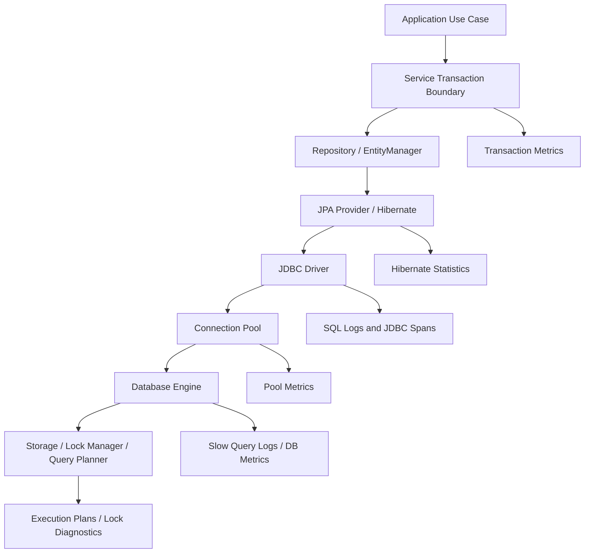
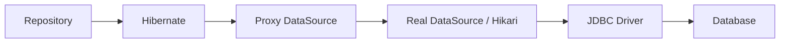
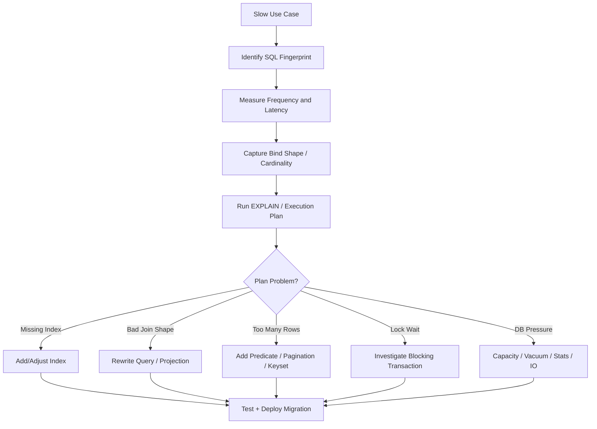

# Part 032 — Observability and Diagnostics for Persistence

A persistence layer you cannot observe is a liability.

JPA hides SQL behind an object model. That is useful for productivity, but dangerous when the abstraction becomes opaque.

A senior engineer does not ask only:

```text
Does the repository method return the right data?
```

A senior engineer also asks:

```text
How many SQL statements were executed?
Which SQL?
With what bind parameters?
How long did each statement take?
How many rows were touched?
Was a flush triggered unexpectedly?
Was the connection pool exhausted?
Was the transaction waiting on locks?
Was cache helping or hiding stale data?
Can we diagnose this in production without exposing secrets?
```

This part is about building that visibility.

---

## 1. Kaufman Skill Target

Following Kaufman's model, observability is part of **learning enough to self-correct**.

You cannot improve persistence behavior if your system cannot show you what it is doing.

By the end of this part, you should be able to:

- configure SQL logging safely for local and test environments;
- inspect bind parameters without leaking secrets in production;
- use Hibernate statistics to understand entity load, flush, cache, and query behavior;
- instrument connection pool health;
- expose JDBC/database metrics through Micrometer/Spring Boot Actuator;
- trace repository/service/database latency across a request;
- diagnose N+1, deadlocks, lock waits, connection leaks, stale cache, and migration failures;
- design dashboards and alerts around persistence failure modes;
- decide what to log in local, staging, and production.

The goal is not “turn on all logs”.

The goal is this:

> Make persistence behavior visible at the right level, with the right cost, in the right environment.

---

## 2. The Persistence Observability Model

Persistence observability has several layers.



Each layer answers a different question.

| Layer | Question |
|---|---|
| service | which use case caused the database work? |
| transaction | how long was consistency held? |
| repository | which query or command was invoked? |
| Hibernate | what entities/collections/flushes/caches were involved? |
| JDBC | what SQL was sent and how long did it take? |
| pool | were connections available? |
| database | what plan/locks/io did the engine use? |
| storage | was latency caused by disk, network, checkpoint, replication? |

Do not collapse these into one vague metric called “database slow”.

---

## 3. Local Debugging vs Production Observability

The settings you use locally are not the settings you use in production.

| Environment | Goal | Acceptable Cost |
|---|---|---|
| local | understand generated SQL and bind values | high |
| tests | assert query count, detect N+1, detect unexpected writes | medium |
| staging | catch realistic latency and migration issues | medium-low |
| production | detect incidents safely, cheaply, without leaking data | low |

Bad production idea:

```properties
spring.jpa.show-sql=true
logging.level.org.hibernate.orm.jdbc.bind=TRACE
```

This may leak PII/secrets and generate huge logs.

Better production strategy:

```text
Metrics always on.
Tracing sampled.
Slow queries captured.
Bind values redacted or disabled.
Detailed SQL logging enabled only temporarily and narrowly.
```

Observability must be sustainable.

---

## 4. SQL Logging Basics

The fastest way to understand JPA behavior locally is to see SQL.

Avoid relying on:

```properties
spring.jpa.show-sql=true
```

It writes SQL to standard output and is usually less flexible than logging categories.

Prefer logger configuration.

For Hibernate 6.x, common categories include:

```properties
logging.level.org.hibernate.SQL=DEBUG
logging.level.org.hibernate.orm.jdbc.bind=TRACE
```

Typical local output:

```sql
select
    o1_0.id,
    o1_0.customer_id,
    o1_0.status,
    o1_0.version
from
    orders o1_0
where
    o1_0.id=?
```

With bind parameters:

```text
binding parameter [1] as [UUID] - [63b7e3da-6cd7-4a46-a7d4-08e4210fb15d]
```

Use this locally and in focused tests. Be careful in production.

---

## 5. SQL Formatting and Comments

Useful local settings:

```properties
spring.jpa.properties.hibernate.format_sql=true
spring.jpa.properties.hibernate.highlight_sql=true
spring.jpa.properties.hibernate.use_sql_comments=true
```

SQL comments can help connect generated SQL to a JPQL/HQL query:

```sql
/* select o from Order o where o.status = :status */
select
    o1_0.id,
    o1_0.status
from
    orders o1_0
where
    o1_0.status=?
```

But comments may increase log noise and can expose query details.

Use them intentionally.

---

## 6. Bind Parameter Logging and Data Sensitivity

Bind parameter logging is powerful and risky.

It can reveal:

- emails;
- phone numbers;
- names;
- national IDs;
- tokens;
- payment references;
- addresses;
- free-text investigation notes;
- internal case narratives.

Production-safe approach:

| Need | Safer Option |
|---|---|
| debug local query | full bind logging locally |
| debug staging issue | restricted bind logging with sanitized data |
| debug production latency | SQL fingerprint + duration + row count |
| debug production data issue | targeted temporary logging with approval/redaction |

A good rule:

> SQL text is often operational data. Bind values are often customer data.

Treat them differently.

---

## 7. SQL Fingerprints

In production, a raw SQL statement with literal values is usually too detailed. A fingerprint is safer.

Example raw SQL:

```sql
select * from orders where customer_id = 'C001' and status = 'OPEN'
```

Fingerprint:

```sql
select * from orders where customer_id = ? and status = ?
```

Record:

```text
fingerprint: select * from orders where customer_id = ? and status = ?
duration: 182ms
rows: 25
service: OrderQueryService.listOpenOrders
traceId: 9c34...
```

This supports production diagnostics without logging sensitive values.

---

## 8. Hibernate Statistics

Hibernate statistics can reveal provider-level behavior:

- entity load count;
- entity fetch count;
- collection load/fetch count;
- query execution count;
- flush count;
- second-level cache hits/misses;
- query cache hits/misses;
- transaction count;
- optimistic failure count.

Enable carefully:

```properties
spring.jpa.properties.hibernate.generate_statistics=true
```

Programmatic access:

```java
@Autowired
EntityManagerFactory emf;

public Statistics statistics() {
    return emf.unwrap(SessionFactory.class).getStatistics();
}
```

Example test usage:

```java
@Test
void orderListDoesNotFetchCollectionsOneByOne() {
    Statistics stats = sessionFactory.getStatistics();
    stats.clear();

    orderQueryService.listOpenOrders();

    assertThat(stats.getCollectionFetchCount()).isZero();
    assertThat(stats.getQueryExecutionCount()).isLessThanOrEqualTo(2);
}
```

Do not confuse statistics with business metrics. They are diagnostic signals.

---

## 9. Interpreting Hibernate Statistics

Common interpretations:

| Statistic | Possible Meaning |
|---|---|
| high entity load count | large object graph or missing projection |
| high collection fetch count | N+1 collection access |
| high query execution count | chatty repository or lazy loading |
| high flush count | transaction boundary or manual flush misuse |
| high L2 cache miss count | ineffective cache region or wrong access pattern |
| high optimistic failure count | real contention or stale UI command pattern |
| high natural-id cache misses | wrong cache usage or low hit ratio |

Be careful: one number rarely proves a diagnosis.

Example:

```text
High query count + high collection fetch count + list endpoint = likely N+1.
```

But:

```text
High query count + batch job + chunk size = may be expected.
```

Always interpret metrics in use-case context.

---

## 10. StatementInspector

Hibernate's `StatementInspector` can inspect or modify SQL before execution.

A diagnostic inspector can tag SQL with contextual comments or collect fingerprints:

```java
public final class ContextualStatementInspector implements StatementInspector {
    @Override
    public String inspect(String sql) {
        String useCase = PersistenceContextInfo.currentUseCase().orElse("unknown");
        return "/* useCase=" + sanitize(useCase) + " */ " + sql;
    }
}
```

Register:

```properties
spring.jpa.properties.hibernate.session_factory.statement_inspector=com.example.ContextualStatementInspector
```

Use with caution.

Do not inject untrusted input into SQL comments. Comments can still affect logs, monitoring, and sometimes database parsing behavior.

---

## 11. Datasource Proxy and SQL Interception

A datasource proxy sits below JPA and observes JDBC calls.

Useful capabilities:

- count SQL statements in tests;
- log SQL duration;
- classify select/insert/update/delete;
- attach trace IDs;
- record batch statements;
- detect slow queries;
- redact values.

Conceptual pipeline:



This is often better than parsing Hibernate logs in tests.

Example test concept:

```java
sqlRecorder.clear();

orderQueryService.listOpenOrders();

assertThat(sqlRecorder.selects()).hasSizeLessThanOrEqualTo(2);
```

The exact library is less important than the principle:

> Put query-budget assertions where SQL actually leaves the application.

---

## 12. Connection Pool Metrics

Many “database is slow” incidents are actually pool incidents.

If using HikariCP, important signals include:

| Metric | Meaning |
|---|---|
| active connections | currently borrowed connections |
| idle connections | available connections |
| pending threads | threads waiting for a connection |
| connection timeout count | requests failed waiting for pool |
| connection acquisition time | time to borrow connection |
| connection usage time | how long connection is held |
| max pool size | configured upper bound |

A typical failure mode:

```text
Slow external API call inside @Transactional method
  -> connection held while waiting on network
  -> active connections rise
  -> pending threads rise
  -> request latency spikes
  -> database blamed incorrectly
```

The fix is not “increase pool size” by default.

The fix is often:

- shorten transaction boundary;
- move external I/O outside transaction;
- use outbox;
- tune query latency;
- fix leak;
- right-size pool after understanding database capacity.

---

## 13. Transaction Observability

Transaction duration matters because it defines how long your application holds consistency resources.

Observe:

- transaction count;
- transaction duration;
- rollback count;
- rollback reason;
- lock wait inside transaction;
- connection hold duration;
- number of SQL statements per transaction;
- external I/O inside transaction;
- nested transaction usage;
- `REQUIRES_NEW` frequency.

A useful trace annotation:

```text
useCase=ApproveCase
transaction.duration=420ms
sql.count=7
flush.count=1
rollback=false
outbox.messages=1
```

Transaction observability turns hidden boundary design into measurable behavior.

---

## 14. Micrometer and Spring Boot Actuator

Spring Boot Actuator integrates with Micrometer to expose application metrics to monitoring systems such as Prometheus, OTLP, Datadog, and others.

For persistence, useful metric families include:

- JVM memory/GC metrics;
- HTTP/server request metrics;
- datasource/pool metrics;
- transaction metrics if instrumented;
- Hibernate metrics if configured;
- custom repository/use-case metrics;
- error counters for lock/constraint/timeout failures.

A minimal direction:

```properties
management.endpoints.web.exposure.include=health,metrics,prometheus
management.metrics.tags.application=case-management-service
```

Expose enough to operate the service, not everything by default.

---

## 15. Persistence Metrics That Matter

Track metrics around failure modes, not just infrastructure.

| Metric | Why It Matters |
|---|---|
| SQL latency by use case | identifies slow business operations |
| SQL count per request | exposes N+1 and chatty flows |
| rows fetched per request | detects graph explosion |
| transaction duration | detects long consistency windows |
| rollback count by cause | separates business rejects from system failures |
| optimistic lock conflicts | detects contention/stale writes |
| pessimistic lock timeout | detects blocking design issues |
| deadlock count | detects write ordering/index problems |
| pool pending threads | detects saturation |
| connection acquisition time | detects pool pressure |
| L2 cache hit ratio | validates cache usefulness |
| migration duration/failure | detects deployment risk |

Do not collect metrics only because a tool exposes them. Collect metrics that support decisions.

---

## 16. Suggested Dashboard Panels

For a JPA-backed service, a practical persistence dashboard contains:

```text
1. Request latency by endpoint/use case
2. Transaction duration percentiles
3. SQL execution duration percentiles
4. SQL count per request/use case
5. Connection pool active/idle/pending
6. Connection acquisition time
7. Slow query fingerprints
8. Error rate by SQL/transaction exception category
9. Optimistic/pessimistic lock failure count
10. Deadlock/lock timeout count
11. Hibernate entity/collection fetch counts
12. Cache hit/miss/put ratio if L2 cache is enabled
13. Migration status and duration on startup/deploy
```

A mature dashboard helps answer:

```text
Is the system slow because of more traffic, slower queries, more queries per request, lock waits, pool exhaustion, or database engine pressure?
```

---

## 17. Trace Design: Connect Use Case to SQL

A trace should show the path:

```text
HTTP request
  -> application service
  -> transaction
  -> repository method
  -> Hibernate query
  -> JDBC statement
  -> database
```

Example span structure:

```text
POST /cases/{id}/approve
  CaseApprovalService.approve
    transaction CaseApprovalService.approve
      CaseRepository.findByIdForUpdate
        SQL select case ... for update
      CaseRepository.save
        SQL update case ...
      OutboxRepository.save
        SQL insert outbox_message ...
```

This lets you see:

- which use case produced the SQL;
- where time was spent;
- whether transaction scope is too large;
- whether multiple repository calls should be consolidated;
- whether a lazy load happens outside expected query path.

---

## 18. SQL Comments With Trace Context

Some teams add trace IDs or use-case names to SQL comments.

Example:

```sql
/* trace=9c34 useCase=ApproveCase */
update regulatory_case
set status=?, version=?
where id=? and version=?
```

Benefits:

- database logs can be correlated to application traces;
- slow query logs point back to use case;
- DBA and application teams share a common identifier.

Risks:

- comment cardinality may affect database plan cache depending on database/driver behavior;
- comments may leak sensitive operational context;
- too much tagging increases log volume.

Use stable, low-cardinality context where possible.

---

## 19. Slow Query Diagnostics

A slow query investigation should follow a structured path.



Do not start by guessing indexes.

Start by finding the exact SQL fingerprint and context.

---

## 20. Query Plan Review Checklist

When reviewing a plan, inspect:

- expected vs actual row counts;
- index usage;
- sequential scans on large tables;
- nested loop explosion;
- hash join memory pressure;
- sort operations;
- temporary files;
- filter selectivity;
- join cardinality;
- parameter sensitivity;
- stale statistics;
- lock waits;
- row width;
- fetched columns;
- unnecessary joins;
- pagination strategy.

ORM-generated SQL can be valid and still have a bad plan.

A JPA engineer must be able to cross the abstraction boundary.

---

## 21. Diagnosing N+1

Symptoms:

```text
Endpoint latency grows with number of rows.
SQL logs show one query for parent list and one query per parent/child.
Hibernate collection fetch count is high.
```

Example log shape:

```sql
select * from orders where status = ?;
select * from order_line where order_id = ?;
select * from order_line where order_id = ?;
select * from order_line where order_id = ?;
...
```

Diagnosis path:

1. identify endpoint/use case;
2. enable SQL count in local/test;
3. create realistic parent/child cardinality;
4. inspect fetch plan;
5. choose fix:
   - DTO projection;
   - join fetch;
   - entity graph;
   - batch fetch;
   - split query;
   - denormalized read model;
6. add query-count regression test.

Do not blindly change all associations to `EAGER`. That usually creates a larger problem.

---

## 22. Diagnosing Cartesian Product Fetch Explosions

Symptoms:

- one SQL query returns huge row count;
- duplicate root entities;
- memory spike;
- response slow despite low query count;
- multiple `join fetch` collections in one query.

Example:

```jpql
select o
from Order o
join fetch o.lines
join fetch o.payments
join fetch o.auditEvents
where o.id = :id
```

If order has:

```text
10 lines
4 payments
20 audit events
```

The result can multiply toward:

```text
10 × 4 × 20 = 800 joined rows
```

One query is not always better than multiple queries.

Diagnostics:

- log row count;
- inspect execution plan;
- inspect returned result size vs root entity count;
- split collections into separate queries;
- use DTO/read model;
- avoid loading audit history into transactional aggregate screens.

---

## 23. Diagnosing Unexpected Flushes

Symptoms:

- query unexpectedly triggers inserts/updates before expected point;
- constraint violation appears during read query;
- performance issue due to repeated flush;
- state written earlier than intended.

Causes:

- `FlushMode.AUTO` before query;
- dirty managed entity in persistence context;
- overly large transaction;
- accidental setter mutation;
- entity callback side effect;
- collection mutation;
- bulk operation interaction.

Diagnostics:

1. enable SQL logging locally;
2. identify SQL before the query;
3. inspect managed entity mutations;
4. check transaction boundary;
5. check flush mode;
6. add test for unexpected writes if critical.

A useful local question:

```text
What managed object became dirty before this SELECT?
```

---

## 24. Diagnosing LazyInitializationException

Symptoms:

```text
org.hibernate.LazyInitializationException: could not initialize proxy - no Session
```

Root cause:

```text
Application tried to traverse lazy association after persistence context was closed.
```

Common bad fixes:

- make association `EAGER`;
- enable Open Session in View without understanding trade-offs;
- add random `@Transactional` to controller;
- serialize managed entities directly.

Better fixes:

- create DTO/read model query;
- fetch needed associations explicitly;
- keep transaction boundary in service/query layer;
- avoid exposing entities across API boundary;
- use entity graph/fetch join for specific use case.

Diagnostic checklist:

| Question | Meaning |
|---|---|
| where is transaction closed? | boundary issue |
| which association is lazy? | fetch plan issue |
| should API need this association? | DTO design issue |
| is entity returned outside service? | architectural leak |

---

## 25. Diagnosing Connection Pool Exhaustion

Symptoms:

- request latency spikes;
- threads waiting for connection;
- `SQLTransientConnectionException` or pool timeout;
- database CPU may be low;
- active connections at max;
- pending connection requests rising.

Common causes:

- long transactions;
- external API calls inside transaction;
- unclosed manual JDBC resources;
- slow queries;
- too small pool;
- too large pool causing DB saturation;
- deadlocked or blocked transactions;
- streaming result not closed;
- batch job monopolizing pool.

Diagnostic order:

1. inspect active/idle/pending metrics;
2. inspect connection acquisition time;
3. inspect transaction duration;
4. find long-running requests;
5. inspect slow queries and lock waits;
6. check for connection leaks;
7. review pool size only after workload is understood.

A pool is not a queue you can enlarge forever. It is a concurrency control boundary for the database.

---

## 26. Diagnosing Deadlocks

Symptoms:

- database deadlock errors;
- transaction rollback;
- sporadic failures under concurrent load;
- retry may succeed.

Common causes:

- inconsistent update order;
- missing indexes on foreign keys/predicates;
- wide transaction scopes;
- batch updates touching rows in varying order;
- mixed pessimistic locks;
- cascading deletes;
- long-running reads blocking writes depending on database.

Diagnosis:

1. capture database deadlock report;
2. identify transactions and SQL statements involved;
3. compare lock acquisition order;
4. inspect indexes;
5. reduce transaction scope;
6. enforce deterministic update ordering;
7. add retry only after fixing avoidable design issue.

Retry is a mitigation, not root-cause analysis.

---

## 27. Diagnosing Lock Waits and Timeouts

Symptoms:

- SQL duration high but query plan looks fine;
- database shows wait events/blocked sessions;
- pessimistic lock timeout;
- high transaction duration;
- low CPU but high latency.

Questions:

```text
Who is blocking whom?
Which row/table/index is locked?
How long is the blocker transaction open?
What code path opened it?
Was external I/O done inside the transaction?
```

Application metrics alone may not answer this. You need database lock diagnostics.

Useful application-side tags:

- use case;
- transaction name;
- repository method;
- SQL fingerprint;
- trace ID;
- tenant ID where safe;
- command ID/correlation ID.

---

## 28. Diagnosing Optimistic Lock Failures

Optimistic lock failures are not always bad.

They may mean the system is correctly rejecting stale writes.

Classify them:

| Pattern | Meaning | Response |
|---|---|---|
| rare stale UI submit | expected conflict | return 409/reload message |
| frequent same aggregate conflict | hotspot | redesign command/aggregate |
| batch job conflict | competing writer | schedule/claim/partition |
| retry storm | bad automatic retry | backoff or redesign |
| hidden merge conflict | detached entity misuse | command DTO + version check |

Metric to collect:

```text
optimistic_lock_failures_total{aggregate="Case",command="AssignCase"}
```

This helps distinguish healthy contention handling from system design pressure.

---

## 29. Diagnosing Constraint Violations

Constraint violations should be translated into meaningful application errors.

Examples:

| Database Error | Application Meaning |
|---|---|
| unique constraint `uk_customer_email` | duplicate email |
| foreign key `fk_order_customer` | missing/deleted customer |
| check `amount_non_negative` | invalid amount |
| not null `case.status` | application mapping bug |

Log enough to diagnose without leaking data:

```text
constraint=uk_customer_email
entity=Customer
operation=RegisterCustomer
traceId=...
```

Do not expose raw SQL exception text directly to external API consumers.

A good exception translation layer maps technical cause to domain-safe error.

---

## 30. Diagnosing Second-Level Cache Issues

Second-level cache can improve performance or hide stale data problems.

Observe:

- hit count;
- miss count;
- put count;
- eviction count;
- stale read incidents;
- invalidation latency;
- cache region size;
- update frequency of cached entities.

Bad signs:

```text
High cache put + low hit = cache churn.
High hit + stale data = consistency issue.
High invalidation traffic = wrong entity cached.
Cache enabled for write-heavy table = likely bad fit.
```

Diagnostic questions:

1. is this data read-mostly?
2. is staleness acceptable?
3. are updates local or multi-node?
4. is invalidation reliable?
5. is query cache invalidated too broadly?
6. is the same data better served by application-level read model?

Cache is an optimization with a consistency model. Observe both.

---

## 31. Diagnosing Query Cache Issues

Hibernate query cache does not cache entities as plain result objects. It commonly caches query result identifiers and interacts with entity/collection cache regions.

Failure modes:

- low hit ratio;
- broad invalidation after table changes;
- stale expectations;
- memory pressure;
- caching high-cardinality queries;
- caching user-specific queries;
- confusing query cache with database result cache.

Good candidates:

- small reference-data queries;
- stable lookup lists;
- low-cardinality filters;
- read-mostly admin metadata.

Bad candidates:

- per-user dashboards;
- high-frequency write tables;
- large paginated search results;
- highly parameterized queries;
- volatile workflow inboxes.

Instrumentation should validate the cache decision.

---

## 32. Diagnosing Migration Failures

Migration failures are deployment incidents.

Observe:

- migration version;
- migration duration;
- failed statement;
- database lock wait during migration;
- application startup failure;
- schema validation failure;
- backward/forward compatibility failure.

Common causes:

- long-running table rewrite;
- missing lock timeout;
- invalid old data;
- non-null column added without default/backfill plan;
- index build blocking writes;
- application starts before migration completes;
- multiple app instances run migrations concurrently;
- migration assumes empty table.

Production-safe migration observability includes:

```text
migration.version
migration.description
migration.duration
migration.status
schema.validation.status
application.version
```

Schema changes deserve the same operational care as code deploys.

---

## 33. Diagnosing Batch Persistence Problems

Batch jobs create distinctive observability needs.

Track:

- rows scanned;
- rows claimed;
- rows processed;
- rows failed;
- rows skipped;
- chunk duration;
- commit duration;
- retry count;
- dead letter count;
- memory usage;
- SQL batch size;
- lock wait;
- last processed cursor;
- restart point.

Example job log:

```text
job=ExpireInvoices chunk=42 claimed=500 processed=497 failed=3 duration=2.4s cursor=2026-06-30T10:15:00Z
```

Avoid only logging:

```text
Job completed.
```

That is not operationally useful.

---

## 34. Error Taxonomy for Persistence

A production-grade system classifies persistence errors.

| Category | Examples | Typical Response |
|---|---|---|
| validation/domain reject | invalid amount, illegal transition | 400/422/domain error |
| uniqueness conflict | duplicate key | 409 or domain-specific conflict |
| optimistic conflict | stale version | 409/retry UI |
| lock timeout | resource busy | retry/backoff or 409/503 |
| deadlock | transaction victim | safe retry if idempotent |
| connection pool timeout | saturation | 503 + alert |
| database unavailable | network/failover | retry/circuit breaker |
| migration failure | startup/deploy issue | stop rollout |
| mapping bug | wrong column/type | fail fast, rollback deploy |
| data corruption | impossible state | quarantine/escalate |

Do not treat all persistence errors as `500 Internal Server Error` with a stack trace.

The error category drives response, retry, alerting, and user message.

---

## 35. Production Logging Pattern

A good persistence error log includes:

```text
level=ERROR
event=persistence.command_failed
service=case-service
useCase=AssignCase
aggregate=RegulatoryCase
aggregateId=case-123
transaction=AssignCaseCommandHandler.assign
errorCategory=optimistic_lock_conflict
sqlFingerprint=update regulatory_case set assignee=?, version=? where id=? and version=?
traceId=...
correlationId=...
tenantId=tenant-a
```

But be careful with:

- personal data;
- free-text notes;
- payment data;
- credentials;
- tokens;
- raw bind values;
- excessive stack traces on expected conflicts.

Expected conflicts should be visible, not noisy.

---

## 36. Alerting Strategy

Alert on symptoms that require action.

Good alerts:

| Alert | Why |
|---|---|
| pool pending threads sustained | request starvation risk |
| connection acquisition timeout | service cannot reach DB capacity |
| deadlock spike | write path regression |
| lock timeout spike | contention or long transaction |
| migration failure | deployment blocked/broken |
| SQL p95/p99 latency spike | user-facing degradation |
| transaction duration spike | consistency boundary problem |
| rollback system-error spike | reliability regression |
| replication lag beyond threshold | stale reads/failover risk |

Weak alerts:

```text
Any single slow query > 100ms
Any optimistic lock exception
Any SQL logged
Any cache miss
```

Alert fatigue destroys operational response.

Use burn-rate style or sustained-threshold alerts where possible.

---

## 37. Production Debugging Runbooks

For each major persistence failure, maintain a short runbook.

### 37.1 Slow Endpoint Runbook

```text
1. Identify endpoint/use case.
2. Check request latency and throughput.
3. Check SQL count per request.
4. Check SQL latency fingerprints.
5. Check connection pool pending/acquisition.
6. Check database CPU/IO/locks.
7. Capture execution plan for top SQL.
8. Decide: query fix, index, transaction reduction, capacity, rollback.
```

### 37.2 Pool Exhaustion Runbook

```text
1. Check active/idle/pending.
2. Identify long connection holders.
3. Check transaction duration.
4. Check slow queries and lock waits.
5. Check external I/O inside transactions.
6. Mitigate: scale carefully, disable job, reduce traffic, rollback.
7. Fix root cause.
```

### 37.3 Deadlock Runbook

```text
1. Capture database deadlock graph/report.
2. Identify involved SQL fingerprints.
3. Map SQL to use cases/traces.
4. Compare row access order.
5. Check indexes.
6. Add deterministic ordering or reduce lock scope.
7. Add bounded retry if safe.
```

Runbooks turn panic into procedure.

---

## 38. Observability in Tests

Do not reserve observability for production.

Use diagnostics in tests to create guardrails:

- query count assertions;
- no-write assertions for read services;
- Hibernate statistics assertions;
- SQL snapshot/fingerprint tests for critical native queries;
- migration validation tests;
- transaction boundary tests;
- cache behavior tests;
- lock conflict tests.

Example:

```java
@Test
void dashboardQueryExecutesBoundedSql() {
    fixture.createCases(20, each -> each.withViolations(3));
    em.flush();
    em.clear();

    sqlRecorder.clear();

    dashboardService.loadInvestigatorDashboard("u001");

    assertThat(sqlRecorder.selectCount()).isLessThanOrEqualTo(3);
}
```

This converts observability into regression prevention.

---

## 39. Observability Anti-Patterns

### 39.1 Turning on Everything in Production

This creates log cost, privacy risk, and noise.

### 39.2 Only Observing HTTP Latency

HTTP latency tells you the request is slow. It does not tell you why.

### 39.3 No Use-Case Context in SQL

SQL without service/trace context is hard to map back to code.

### 39.4 Ignoring Row Counts

A query can be fast in staging with 100 rows and disastrous in production with 100 million rows.

### 39.5 No Query Count in Tests

N+1 becomes a production incident instead of a test failure.

### 39.6 Treating Optimistic Lock Exceptions as Errors Only

Some conflicts are expected business concurrency. Classify them.

### 39.7 Logging Sensitive Bind Values

This can create compliance and privacy incidents.

### 39.8 Relying on ORM Logs Alone

Some issues live in the database engine: locks, plans, IO, statistics, replication lag.

---

## 40. Minimum Persistence Observability Standard

For a serious JPA service, minimum standard:

1. local SQL logging with bind values available;
2. production-safe SQL fingerprint/duration visibility;
3. connection pool metrics;
4. transaction duration visibility;
5. slow query diagnostics path;
6. query count guardrails for critical use cases;
7. persistence exception taxonomy;
8. migration status visibility;
9. lock/deadlock monitoring;
10. cache metrics if cache is enabled;
11. trace correlation from request to SQL;
12. redaction policy for bind values and logs.

Without these, the persistence layer may work, but it is not operable.

---

## 41. Practice Drills

### Drill 1 — SQL Visibility

Enable SQL and bind logging locally.

Run one list endpoint.

Write down:

- number of SQL statements;
- generated SQL;
- bind values;
- which associations were loaded;
- whether any unexpected flush occurred.

### Drill 2 — Query Count Guard

Pick one endpoint that returns parent/child data.

Create a test with 10 parents and 3 children each.

Assert bounded query count.

### Drill 3 — Pool Pressure Simulation

Create a test or local scenario where a transaction sleeps while holding a connection.

Observe:

- active connections;
- pending threads;
- connection acquisition latency.

Then move the sleep outside the transaction and compare.

### Drill 4 — Slow Query Plan Review

Find one slow query fingerprint.

Run `EXPLAIN` / execution plan on realistic data.

Identify whether the issue is:

- missing index;
- bad predicate;
- too many rows;
- join explosion;
- sort;
- lock wait;
- stale stats.

### Drill 5 — Error Taxonomy

Collect five persistence exceptions from logs/tests.

Classify them into:

- conflict;
- validation;
- transient infrastructure;
- mapping bug;
- data corruption;
- concurrency contention.

Define user response and retry policy for each.

---

## 42. Part 032 Review Checklist

You have understood this part if you can explain:

- why SQL visibility is mandatory for serious JPA engineering;
- why local logging and production observability need different settings;
- why bind values are sensitive;
- how Hibernate statistics help diagnose N+1 and cache behavior;
- how connection pool metrics differ from database latency;
- how to connect a slow SQL statement back to a business use case;
- why query count belongs in tests for critical screens;
- how to diagnose deadlocks, lock waits, pool exhaustion, and lazy loading failures;
- what metrics and alerts a production JPA service should expose.

The persistence layer is not done when the code compiles.

It is done when its behavior is explainable under load, failure, concurrency, and production data volume.

---

## References

- Hibernate ORM User Guide 6.x.
- Hibernate ORM Javadocs for statistics and diagnostics APIs.
- Spring Boot Actuator and Micrometer Reference Documentation.
- Spring Framework transaction reference documentation.
- Spring Data JPA Reference Documentation.
- Datasource/JDBC observation and proxy instrumentation documentation.
- Database vendor documentation for slow query logs, execution plans, locks, wait events, and isolation behavior.
