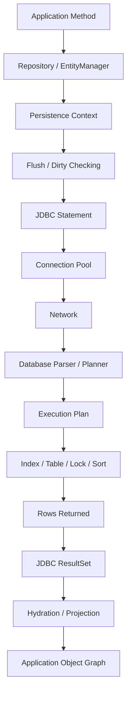
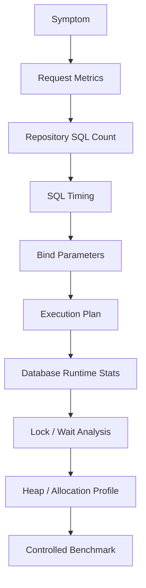
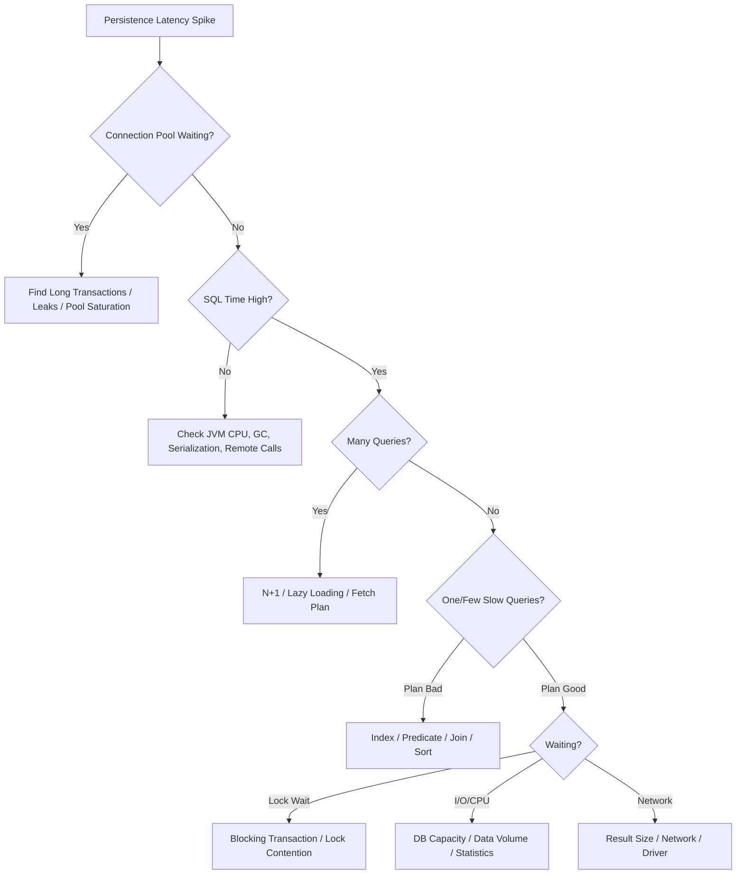

# Part 033 — Persistence Performance Engineering Playbook

Performance engineering is not the act of adding random indexes, changing fetch types, or tuning Hibernate flags until the graph looks better.

Performance engineering is a feedback loop:

```text
Workload → Measurement → Bottleneck Hypothesis → Minimal Change → Verification → Guardrail
```

In Java persistence systems, most performance failures come from one of these gaps:

- the code hides SQL emission;
- the SQL hides row volume;
- the transaction hides lock time;
- the persistence context hides memory growth;
- the connection pool hides queueing;
- the cache hides stale data risk;
- the benchmark hides production shape.

A top-tier engineer does not ask only:

```text
Can we make this repository faster?
```

They ask:

```text
What workload is this path serving?
What is the latency budget?
How many database round trips are allowed?
How many rows are acceptable to scan, sort, lock, hydrate, and return?
What is the concurrency shape?
Which invariant must remain true while we optimize?
How do we prevent this from regressing?
```

This part gives you a production playbook.

---

## 1. Kaufman Skill Target

Following Kaufman's model, this part belongs to **deliberate practice**.

You already know entities, transactions, fetching, locking, caching, testing, and observability. Now the skill is to combine them under pressure.

By the end of this part, you should be able to:

- define performance budgets for persistence paths;
- classify workloads before tuning them;
- measure SQL count, SQL latency, row volume, lock waits, connection waits, heap impact, and cache behavior;
- diagnose whether a bottleneck is in JPA, Hibernate, JDBC, connection pool, database execution plan, network, lock contention, or application memory;
- choose between entity loading, DTO projection, native SQL, batch write, bulk DML, cache, or denormalized read model;
- benchmark persistence code without fooling yourself;
- design regression guardrails for production-grade systems.

The skill target is this:

> Given a slow or risky persistence path, identify the dominant cost, apply the smallest safe correction, and prove the improvement without weakening correctness.

---

## 2. Performance Is a Budget, Not a Feeling

A persistence path must have explicit budgets.

Bad review comment:

```text
This query seems fine.
```

Better review comment:

```text
This endpoint has a 150 ms p95 budget.
It executes 1 count query + 1 page query.
The page query returns 50 rows and uses index customer_case_status_created_at_idx.
It does not initialize lazy collections.
SQL count is asserted in integration test.
```

Performance budgets should include:

| Budget | Why It Matters |
|---|---|
| Request p95/p99 latency | User-visible behavior and service SLO |
| Database round trips | Dominant cost in many ORM failures |
| Rows scanned | Predicts database CPU and I/O |
| Rows returned | Predicts network and hydration cost |
| Entities hydrated | Predicts persistence context and heap cost |
| Collections initialized | Predicts N+1 and graph explosion |
| Flush count | Predicts write amplification and constraint timing |
| Transaction duration | Predicts lock hold time and pool occupancy |
| Lock wait | Predicts contention and incident risk |
| Connection wait | Predicts pool saturation |
| Heap allocation | Predicts GC pressure |

A budget does not have to be perfect. It must be explicit enough that regressions are visible.

---

## 3. The Persistence Cost Model

Every persistence operation has several cost layers.



A slow endpoint can be slow because:

- the repository made too many queries;
- one query scanned too many rows;
- a query waited for locks;
- the transaction held locks too long;
- the connection pool queued the request;
- the persistence context contained too many managed entities;
- dirty checking examined a large object graph;
- the code hydrated entities when it needed only DTOs;
- the database sorted or joined without useful indexes;
- a cache caused expensive invalidation or stale-read fallback;
- the service performed external I/O inside the transaction.

Do not tune until you know which layer dominates.

---

## 4. Workload Classification Before Optimization

The same JPA technique can be excellent in one workload and terrible in another.

### 4.1 OLTP Command Path

Example:

```text
Approve enforcement case
Assign investigator
Reserve inventory
Submit payment instruction
Update customer profile
```

Characteristics:

- small number of rows;
- strong consistency requirements;
- transaction boundary matters;
- optimistic/pessimistic locking may matter;
- business invariant is more important than raw throughput.

Preferred techniques:

- managed entities for aggregate mutation;
- `@Version` for conflict detection;
- narrow transaction boundary;
- explicit lock when needed;
- outbox for side effects;
- minimal fetch graph.

Avoid:

- loading large read-only graphs;
- merging detached objects from API payloads;
- long conversations inside one database transaction;
- external HTTP calls inside transaction.

### 4.2 Query-Heavy Read Path

Example:

```text
Search cases
List customer orders
View dashboard
Filter audit entries
Export report preview
```

Characteristics:

- many filters;
- sorting and pagination;
- often needs only a subset of columns;
- query plan stability matters;
- entity lifecycle usually does not matter.

Preferred techniques:

- DTO projection;
- keyset pagination for deep traversal;
- specialized indexes;
- read model table/materialized view when justified;
- native SQL for complex reporting.

Avoid:

- entity graphs for every screen;
- returning entities to API;
- joining multiple collections;
- offset pagination over huge result sets without analysis.

### 4.3 Batch Write Path

Example:

```text
Import 1 million records
Recalculate settlement status
Expire stale cases
Backfill derived column
Sync external identifiers
```

Characteristics:

- high row volume;
- memory pressure risk;
- transaction size matters;
- batching matters;
- failure recovery matters.

Preferred techniques:

- chunking;
- JDBC batch insert/update;
- Hibernate batching with flush/clear;
- bulk DML where lifecycle callbacks are not required;
- idempotent job design;
- checkpointing.

Avoid:

- one huge transaction;
- retaining all managed entities;
- per-row query lookups;
- cascade-heavy writes;
- entity listener side effects hidden in batch.

### 4.4 Analytical / Reporting Path

Example:

```text
Monthly compliance report
Risk dashboard
Historical trend analysis
Aggregated SLA breach report
```

Characteristics:

- large scans;
- aggregation;
- read-only;
- not usually entity-oriented;
- may need replica or warehouse.

Preferred techniques:

- native SQL;
- database views;
- read replicas;
- materialized views;
- denormalized tables;
- streaming export.

Avoid:

- mapping report rows as entities;
- loading aggregates into object graphs;
- running heavy reporting queries on primary OLTP database without capacity planning.

---

## 5. Measurement Ladder

Use the cheapest measurement that can prove or disprove the hypothesis.



### 5.1 Request Metrics

Start from:

- endpoint latency;
- error rate;
- throughput;
- request volume;
- p50/p95/p99;
- service instance CPU/memory;
- database CPU/I/O;
- pool active/idle/pending.

A slow database query is not always the root cause. Sometimes the service is waiting for connections because transactions are too long.

### 5.2 SQL Count

SQL count detects ORM explosions.

Useful questions:

```text
How many SELECT statements does this endpoint execute?
How many INSERT/UPDATE/DELETE statements?
Does count grow with page size?
Does count grow with number of children per parent?
Does count change after adding a field to API response?
```

A stable list endpoint might have:

```text
1 count query
1 page query
0 lazy collection queries
```

A broken endpoint might have:

```text
1 page query
50 child queries
50 actor queries
50 status history queries
```

That is not a database tuning problem. That is a fetch-plan design problem.

### 5.3 SQL Timing

SQL count alone is insufficient.

One query can be worse than fifty if it scans millions of rows.

Track:

- total SQL time per request;
- slowest query;
- rows returned;
- rows scanned if available;
- lock wait;
- plan hash if available;
- bind parameter shape.

### 5.4 Execution Plan

Execution plan answers:

```text
Did the database use the intended index?
How many rows did it estimate?
How many rows did it actually process?
Did it sort in memory or spill?
Did it hash join, nested-loop, or sequential scan?
Was the predicate selective?
Did parameter values change the plan?
```

You cannot fix query-plan problems from Java alone. Sometimes the Java code is fine and the index is wrong. Sometimes the index is fine but the ORM-generated SQL shape is wrong.

### 5.5 Heap and Allocation Profile

ORM performance is not only database time.

Large entity hydration causes:

- object allocation;
- proxy allocation;
- collection wrapper allocation;
- snapshot storage;
- persistence context growth;
- dirty checking overhead;
- garbage collection pressure.

A DTO projection can be faster not because SQL is faster, but because Java allocates less and tracks less.

---

## 6. Query Count Budgeting

Every important endpoint should have a query-count expectation.

Example budgets:

| Use Case | Expected SQL Shape |
|---|---|
| Get case by id with owner | 1 query using join fetch or entity graph |
| List cases page | 1 count query + 1 page query |
| List cases with latest note summary | 1 page query using projection/subquery or 2-step query |
| Approve case | 1 load + 1 update + optional outbox insert |
| Bulk expire cases | 1 bulk update or chunked update |
| Export audit entries | streaming read with bounded memory |

A budget should be tested.

Pseudo-test:

```java
@Test
void listCases_doesNotExecuteNPlusOneQueries() {
    seedCasesWithOwnersAndStatuses(50);

    sqlCounter.reset();

    service.searchCases(new CaseSearchCriteria("OPEN"), PageRequest.of(0, 50));

    assertThat(sqlCounter.selectCount()).isLessThanOrEqualTo(2);
}
```

This test is not about exact implementation. It protects the access pattern.

---

## 7. Rows Beat Queries

A common junior mistake:

```text
We reduced 20 queries to 1 query, therefore performance improved.
```

Maybe.

But one query can multiply rows.

Example:

```text
Case has 20 tasks.
Case has 10 notes.
Case has 5 attachments.
```

A naive multi-collection join can produce:

```text
20 × 10 × 5 = 1,000 rows for one case
```

For 50 cases:

```text
50,000 joined rows
```

The database sends many duplicate root columns. Hibernate deduplicates entities in memory. The query count looks good, but CPU, memory, and network suffer.

Rule:

> Optimize total work, not only query count.

Track both:

```text
round trips + rows scanned + rows returned + objects hydrated
```

---

## 8. Entity Loading vs DTO Projection

### 8.1 Use Entity Loading When

Use managed entities when:

- you intend to change aggregate state;
- dirty checking is valuable;
- lifecycle/cascade rules are needed;
- optimistic locking is needed;
- invariant methods live on the aggregate.

Example:

```java
@Transactional
public void approve(CaseId id, UserId actor) {
    EnforcementCase c = caseRepository.findForUpdate(id)
            .orElseThrow(CaseNotFoundException::new);

    c.approve(actor, clock.instant());
    outbox.add(CaseApprovedEvent.from(c));
}
```

This path benefits from managed state.

### 8.2 Use DTO Projection When

Use DTO projection when:

- the screen is read-only;
- you need only selected columns;
- the query joins multiple aggregate roots;
- pagination stability matters;
- object graph identity is irrelevant;
- the result is API/view oriented.

Example:

```java
public record CaseListItem(
        UUID id,
        String referenceNumber,
        String subjectName,
        String status,
        Instant createdAt,
        String assignedOfficerName
) {}
```

Repository query:

```java
@Query("""
    select new com.acme.caseapp.CaseListItem(
        c.id,
        c.referenceNumber,
        s.name,
        c.status,
        c.createdAt,
        o.displayName
    )
    from EnforcementCase c
    join c.subject s
    left join c.assignedOfficer o
    where c.status = :status
    order by c.createdAt desc, c.id desc
""")
Page<CaseListItem> findListItems(@Param("status") CaseStatus status, Pageable pageable);
```

DTO projection reduces:

- persistence context size;
- dirty checking work;
- lazy-loading risk;
- serialization graph risk;
- memory allocation.

### 8.3 Use Native SQL When

Use native SQL when:

- the query uses database-specific features;
- window functions are central;
- CTE readability is important;
- query plan needs precise control;
- reporting workload is not entity-centric;
- JPQL becomes unreadable or inefficient.

Do not treat native SQL as failure. Treat it as a boundary choice.

The failure is hiding complex SQL behind a repository method name that nobody can reason about.

---

## 9. Fetch Plan Engineering

Fetching performance is a design problem.

A default fetch plan is rarely correct for all use cases.

### 9.1 The Fetch Plan Decision Table

| Use Case | Recommended Fetch Shape |
|---|---|
| Mutate one aggregate root | Entity load with minimal required relationships |
| Display detail page | Entity graph or DTO detail projection |
| Display list page | DTO projection, usually not entity graph |
| Export large dataset | Streaming projection or native query |
| Process batch commands | Chunked entity load with flush/clear |
| Load reference data | Cacheable read-only query |

### 9.2 Avoid Global EAGER as Performance Fix

`EAGER` often moves the problem elsewhere.

It can cause:

- unnecessary joins;
- hidden secondary selects;
- impossible-to-shrink fetch plan;
- large object graphs;
- serialization cycles;
- memory pressure;
- query plan instability.

Prefer default `LAZY` where possible, then define fetch plan per use case.

### 9.3 Join Fetch Carefully

Join fetch is useful when:

- relationship cardinality is bounded;
- row multiplication is acceptable;
- pagination is not broken;
- you fetch at most one collection carefully;
- you can validate row volume.

Join fetch is risky when:

- multiple collections are fetched;
- cardinality is unbounded;
- page size is large;
- children have additional children;
- count query generation becomes incorrect.

### 9.4 Entity Graph Carefully

Entity graph is useful when:

- you need a reusable named fetch plan;
- the same entity is loaded differently in different flows;
- you want fetch behavior separated from query predicate.

But entity graph is not magic.

It can still:

- over-fetch;
- multiply rows;
- cause multiple SQL statements;
- break mental ownership of fetch behavior if overused.

---

## 10. Query Plan Review Checklist

For every critical query, inspect the plan.

Checklist:

```text
[ ] Is the WHERE predicate selective?
[ ] Are join columns indexed?
[ ] Does ORDER BY match an index where useful?
[ ] Does pagination require sorting a huge intermediate set?
[ ] Are functions applied to indexed columns?
[ ] Are casts preventing index usage?
[ ] Are nullable predicates changing selectivity?
[ ] Are OR conditions causing broad scans?
[ ] Are statistics up to date?
[ ] Are estimated rows close to actual rows?
[ ] Is the query plan stable under real parameter values?
[ ] Does the query return duplicate root rows?
[ ] Does the query use nested-loop joins over large sets?
[ ] Does it spill sort/hash to disk?
```

Anti-pattern:

```sql
where lower(email) = lower(?);
```

Potential issue:

- function on column may prevent normal index usage unless function-based index exists.

Better options:

- normalize email before storing;
- use case-insensitive column type where supported;
- create matching functional index;
- avoid wrapping indexed column at runtime.

---

## 11. Index Design From Application Access Patterns

Indexes should be driven by access patterns, not by column popularity.

Example query:

```sql
select *
from enforcement_case
where tenant_id = ?
  and status = ?
  and deleted = false
order by created_at desc, id desc
limit 50;
```

A useful composite index may follow:

```sql
create index idx_case_tenant_status_deleted_created_id
on enforcement_case (tenant_id, status, deleted, created_at desc, id desc);
```

But do not cargo-cult this.

Index order depends on:

- equality predicates;
- range predicates;
- sort order;
- selectivity;
- database engine behavior;
- table size;
- update cost;
- write volume.

Every index has a write cost.

Indexes speed reads but slow writes and consume storage. In write-heavy systems, too many indexes can become the bottleneck.

---

## 12. Flush Cost Engineering

Flush is where ORM intent becomes SQL.

Costs include:

- dirty checking;
- SQL generation;
- statement ordering;
- JDBC execution;
- constraint checks;
- optimistic lock checks;
- database triggers;
- index maintenance;
- lock acquisition.

A flush can happen:

- before commit;
- before query execution under auto flush mode;
- explicitly via `flush()`;
- indirectly through framework behavior.

Performance smell:

```java
@Transactional
public List<CaseSummary> assignThenSearch(...) {
    caseEntity.assignTo(officer);

    return repository.searchOpenCases(...); // may trigger flush before query
}
```

If the search does not need the assignment to be visible, you may have mixed command and query responsibilities in one transaction.

Better design:

```text
Command path: assign case
Query path: search cases
```

Separate them unless there is a strong consistency reason not to.

---

## 13. Persistence Context Size

The persistence context is useful because it provides identity, dirty checking, and write-behind.

It becomes expensive when it grows without bounds.

Symptoms:

- memory growth during batch job;
- slow flush;
- unexpected updates;
- dirty checking overhead;
- duplicate object retention;
- GC pressure;
- stale managed state.

Bad batch:

```java
@Transactional
public void importRows(List<Row> rows) {
    for (Row row : rows) {
        repository.save(map(row));
    }
}
```

If `rows` contains 500,000 items, the persistence context may retain many managed entities until transaction end.

Better chunking:

```java
@Transactional
public void importChunk(List<Row> rows) {
    int i = 0;
    for (Row row : rows) {
        entityManager.persist(map(row));

        if (++i % 500 == 0) {
            entityManager.flush();
            entityManager.clear();
        }
    }
}
```

Even better:

- process chunks in separate transactions;
- make job restartable;
- record checkpoint;
- avoid loading unnecessary entities;
- use bulk load mechanism if available.

---

## 14. Dirty Checking Cost

Dirty checking is not free.

Hibernate needs to know which managed entities changed. Depending on enhancement and configuration, this can involve snapshots, field interception, or comparisons.

Dirty checking cost grows with:

- number of managed entities;
- number of persistent fields;
- mutable value types;
- large collections;
- complex custom types;
- long transaction duration.

Practical rules:

- keep transactions short;
- keep persistence context bounded;
- use DTO projection for read-only screens;
- mark read-only transactions where applicable;
- avoid loading entities just to read summaries;
- avoid mutating collections accidentally.

Example read-only service:

```java
@Transactional(readOnly = true)
public Page<CaseListItem> search(CaseSearchCriteria criteria, Pageable pageable) {
    return caseReadRepository.search(criteria, pageable);
}
```

`readOnly = true` is not a magic database optimization in all cases, but it documents intent and can allow framework/provider optimizations depending on setup.

---

## 15. Write Path Throughput

Write throughput depends on:

- ID generation strategy;
- batch size;
- flush frequency;
- insert/update ordering;
- index maintenance;
- lock contention;
- transaction size;
- network round trips;
- generated columns/triggers;
- cascade graph size.

### 15.1 ID Strategy

Some ID strategies batch better than others.

Potential issues:

| Strategy | Performance Consideration |
|---|---|
| Identity/auto-increment | May require immediate insert to obtain id, reducing batching opportunities |
| Sequence | Can batch well with allocation/pooling |
| UUID generated in app | Avoids DB round trip for id but affects index locality depending on version/type |
| Natural id | Useful for lookup but risky as primary key if mutable or large |

Do not choose ID strategy only based on taste. Choose based on write path, replication, sharding, ordering, and operational constraints.

### 15.2 JDBC Batching

Batching reduces round trips.

But batching can be defeated by:

- identity key generation;
- interleaved entity types;
- flush after each save;
- constraint dependencies;
- versioned updates without proper provider support;
- statement shape differences.

Batching must be verified in logs/metrics.

Do not assume `saveAll()` means one batch.

### 15.3 Bulk DML

Bulk update/delete can be much faster:

```java
@Modifying(clearAutomatically = true, flushAutomatically = true)
@Query("""
    update EnforcementCase c
    set c.status = :expired
    where c.status = :open
      and c.dueAt < :now
""")
int expireCases(CaseStatus open, CaseStatus expired, Instant now);
```

But bulk DML bypasses normal entity lifecycle behavior.

Risks:

- persistence context becomes stale;
- entity listeners may not run;
- audit behavior may be bypassed;
- optimistic version may not update unless explicit;
- cache invalidation must be considered;
- business invariants in entity methods are bypassed.

Use bulk DML for set-based operations when these trade-offs are intentional.

---

## 16. Transaction Performance

A transaction consumes resources while open.

It may hold:

- database connection;
- row locks;
- predicate/range locks;
- persistence context memory;
- application thread;
- cache entries;
- retry responsibility.

Bad pattern:

```java
@Transactional
public void approveAndNotify(UUID caseId) {
    EnforcementCase c = repository.findById(caseId).orElseThrow();
    c.approve();

    externalNotificationClient.sendApprovalEmail(c.getSubjectEmail());
}
```

Problem:

- transaction remains open during external I/O;
- locks may be held longer;
- connection is occupied;
- failure semantics are unclear;
- email may be sent even if commit later fails.

Better:

```java
@Transactional
public void approve(UUID caseId) {
    EnforcementCase c = repository.findById(caseId).orElseThrow();
    c.approve();
    outboxRepository.add(CaseApprovedMessage.from(c));
}
```

Then relay publishes after commit.

Performance and correctness align.

---

## 17. Connection Pool Engineering

A connection pool is not just a configuration detail.

It is a concurrency control mechanism.

If your pool has 20 connections, at most 20 database operations can actively hold connections per service instance.

Symptoms of pool problems:

- high request latency but database CPU low;
- threads waiting for connection;
- pool active count pegged at max;
- slow leak detection warnings;
- long transactions;
- external I/O inside transaction;
- connection not released due to streaming result not closed.

Do not blindly increase pool size.

Increasing pool size can:

- overload database;
- increase lock contention;
- increase memory on DB server;
- hide long transaction problems;
- make incident blast radius larger.

Pool sizing depends on:

```text
service instances × pool size <= database concurrency capacity
```

If 20 service instances each have a pool of 30:

```text
600 potential DB connections
```

That may be far beyond what the database can efficiently handle.

---

## 18. Lock Contention Performance

Lock contention often appears as “slow query”.

The query plan may be fine. The query is waiting.

Common causes:

- hot row counters;
- sequence/table generator bottleneck;
- status transition on same aggregate;
- pessimistic lock over too broad a set;
- batch job updating active OLTP rows;
- missing index causing update/delete to lock more rows than expected;
- long transaction holding locks while doing unrelated work.

Diagnosis:

- database lock wait views;
- deadlock logs;
- transaction age;
- blocked/blocking query pairs;
- application trace showing transaction duration;
- correlation with batch jobs.

Fixes:

- shorten transaction;
- narrow update predicate;
- add supporting index;
- use optimistic concurrency;
- shard hot counter;
- use queue/actor model for serialized updates;
- move batch workload to off-peak or replica where safe;
- use `SKIP LOCKED` pattern for work queues where supported and appropriate.

---

## 19. Caching as Performance Tool

Cache can improve performance, but it changes consistency properties.

Use cache when:

- data is read often;
- data changes rarely;
- stale tolerance is explicit;
- invalidation is manageable;
- cache hit rate can be measured;
- failure mode is safe.

Avoid cache when:

- correctness requires current data;
- invalidation is complex;
- multi-node consistency is unclear;
- stale data creates regulatory or financial risk;
- cache hides bad query design;
- cache hit rate is low.

Cache performance equation:

```text
benefit = hit_rate × saved_cost - cache_overhead - invalidation_cost - consistency_risk
```

Never introduce cache without answering:

```text
What happens when the cache is wrong?
```

---

## 20. Database Replicas and Read Scaling

Read replicas can reduce load on primary, but they introduce lag.

Safe uses:

- analytics;
- dashboards with freshness tolerance;
- search/list pages where stale data is acceptable;
- exports;
- reporting.

Risky uses:

- read-your-write flows;
- post-payment confirmation;
- enforcement state transition screen;
- permission checks immediately after update;
- uniqueness validation;
- workflow assignment correctness.

Design question:

```text
Can this read tolerate replica lag?
```

If not, read from primary or use a consistency strategy.

---

## 21. Benchmarking Without Lying to Yourself

Benchmarks are easy to fake accidentally.

A bad benchmark:

```text
Run repository method once on empty local database.
```

A useful persistence benchmark uses:

- realistic data volume;
- realistic cardinality distribution;
- realistic indexes;
- realistic parameter values;
- warm-up period;
- repeated runs;
- isolated environment;
- query plan capture;
- memory/GC measurement;
- concurrent users if relevant;
- production-like transaction boundaries.

### 21.1 Data Distribution Matters

Real data is not uniform.

Example:

```text
90% of cases are CLOSED.
8% are OPEN.
2% are ESCALATED.
One tenant has 40% of all rows.
Some subjects have 500 linked cases.
Most subjects have 1.
```

A query that performs well on uniform synthetic data can fail on skewed production data.

### 21.2 Parameter Values Matter

Query plan can change depending on bind values and statistics.

Benchmark:

- small tenant;
- large tenant;
- common status;
- rare status;
- recent date range;
- broad date range;
- null optional filters;
- high-cardinality filters;
- low-cardinality filters.

### 21.3 Concurrency Matters

Single-user latency is not enough.

Test:

- concurrent reads;
- concurrent writes to different rows;
- concurrent writes to same row;
- batch job plus OLTP traffic;
- connection pool saturation;
- lock timeout behavior;
- retry storm behavior.

---

## 22. Profiling Stack

Use multiple lenses.

| Lens | Tooling Category | What It Shows |
|---|---|---|
| Application trace | OpenTelemetry/APM | Request path, DB spans, service latency |
| SQL log | Hibernate/JDBC proxy | SQL shape and count |
| Bind parameter log | Hibernate/JDBC proxy | Parameter values and query specificity |
| DB plan | EXPLAIN/ANALYZE | Execution strategy and row estimates |
| DB wait views | Database monitoring | Lock waits, I/O waits, CPU waits |
| Pool metrics | Hikari/Micrometer | Connection acquisition and saturation |
| JVM profiler | async-profiler/JFR | CPU, allocation, locks, GC |
| Hibernate stats | Provider diagnostics | entity load, query cache, L2 cache, flush |
| Test assertions | Integration tests | regression prevention |

No single tool is enough.

---

## 23. Common Bottleneck Patterns

### 23.1 N+1 Query

Symptom:

```text
SQL count grows with result size.
```

Fix options:

- join fetch bounded relation;
- entity graph;
- batch fetch;
- DTO projection;
- two-step query;
- read model.

### 23.2 Row Explosion

Symptom:

```text
One query, huge rows returned, duplicate root entities.
```

Fix options:

- split query;
- fetch one collection at a time;
- DTO projection;
- aggregate child data in subquery;
- avoid multi-bag/multi-collection join.

### 23.3 Missing Index

Symptom:

```text
Sequential scan or large scan for selective query.
```

Fix options:

- composite index matching predicate + sort;
- partial index where supported;
- functional index if function needed;
- rewrite predicate;
- avoid leading wildcard search;
- update statistics.

### 23.4 Long Transaction

Symptom:

```text
Lock waits, connection pool saturation, transaction age high.
```

Fix options:

- move external I/O after commit/outbox;
- split command and query;
- reduce loaded graph;
- reduce transaction scope;
- process chunks;
- avoid user think-time inside transaction.

### 23.5 Persistence Context Bloat

Symptom:

```text
Memory growth, slow flush, GC pressure.
```

Fix options:

- DTO projection;
- chunking;
- flush/clear;
- read-only hints;
- stateless session/provider-specific batch API where appropriate;
- avoid retaining entity references.

### 23.6 Lock Hotspot

Symptom:

```text
Few rows updated by many transactions, high conflict/retry.
```

Fix options:

- optimistic conflict handling;
- queue serialized updates;
- split aggregate;
- shard counter;
- reduce status update frequency;
- avoid central row for global counters.

---

## 24. Performance Triage Flow

Use this flow during incidents.



The goal is to avoid random fixes.

Do not add cache when the bottleneck is lock contention.
Do not add index when the bottleneck is connection pool starvation.
Do not change fetch type when the bottleneck is database sort spill.

---

## 25. Regression Guardrails

Performance that is not guarded will regress.

Guardrails:

- query count integration tests;
- SQL plan snapshots for critical queries;
- synthetic performance tests in CI for key paths;
- migration review for indexes and constraints;
- dashboard for p95/p99 repository latency;
- dashboard for pool wait time;
- alert for slow query rate;
- alert for transaction age;
- alert for lock wait/deadlock;
- periodic cache hit-rate review;
- production query inventory.

Example query count guardrail:

```java
@Test
void caseDetail_executesBoundedNumberOfQueries() {
    CaseId id = fixture.caseWithTasksNotesAndOfficer();

    sqlCounter.reset();

    CaseDetail detail = service.getCaseDetail(id);

    assertThat(detail.tasks()).hasSize(5);
    assertThat(sqlCounter.total()).isLessThanOrEqualTo(3);
}
```

Example migration review question:

```text
This new endpoint filters by tenant_id, status, deleted, and created_at.
Where is the supporting index migration?
```

---

## 26. Performance Review Checklist

Use this in code review.

```text
[ ] Is this path command, query, batch, or report?
[ ] Is entity loading necessary, or would DTO projection be better?
[ ] Is the transaction boundary explicit and minimal?
[ ] Does the method perform external I/O inside transaction?
[ ] Is the SQL count bounded?
[ ] Is the number of hydrated entities bounded?
[ ] Is pagination stable and deterministic?
[ ] Does sorting have index support?
[ ] Are fetch joins safe for cardinality?
[ ] Are lazy relationships accessed during serialization?
[ ] Are bulk operations clearing/synchronizing persistence context?
[ ] Is batching actually enabled and verified?
[ ] Does optimistic/pessimistic locking match contention risk?
[ ] Is cache consistency acceptable?
[ ] Are metrics/logs enough to diagnose production failure?
[ ] Is there a regression test for query count or critical behavior?
```

---

## 27. Performance Design Patterns

### 27.1 Two-Step Page Fetch

Problem:

- need page of parent rows with selected children;
- join fetch breaks pagination or multiplies rows.

Pattern:

```text
1. Query page of parent IDs using stable order.
2. Fetch required details for those IDs.
3. Reassemble in application preserving order.
```

Example:

```java
List<UUID> ids = caseRepository.findPageIds(criteria, pageable);
List<CaseListItem> rows = caseRepository.findListItemsByIds(ids);
return CasePage.reorder(ids, rows);
```

Benefits:

- stable pagination;
- bounded child fetch;
- avoids row explosion;
- easier SQL plan.

Trade-off:

- two queries instead of one;
- need reordering logic.

### 27.2 Command Entity + Read Projection

Problem:

- same aggregate needed for mutation and list views.

Pattern:

```text
Use entity for command.
Use projection/read model for query.
```

Benefits:

- command path preserves invariants;
- query path avoids over-hydration;
- lower memory;
- clearer intent.

Trade-off:

- more repository methods;
- mapping duplication;
- possible read model staleness if denormalized.

### 27.3 Chunked Batch

Problem:

- large job overwhelms persistence context and transaction log.

Pattern:

```text
Process rows in chunks.
Commit each chunk.
Flush/clear inside chunk if needed.
Record checkpoint.
Make operation idempotent.
```

Benefits:

- bounded memory;
- bounded lock duration;
- restartable;
- easier failure recovery.

Trade-off:

- partial completion must be modelled;
- idempotency required.

### 27.4 Outbox for Side Effects

Problem:

- performance and correctness degrade when external side effects are done inside transaction.

Pattern:

```text
Write business state + outbox row in same transaction.
Publish asynchronously after commit.
```

Benefits:

- shorter transaction;
- no dual-write gap;
- retryable side effects;
- better pool utilization.

Trade-off:

- eventual delivery;
- relay infrastructure;
- idempotent consumers required.

---

## 28. Performance Anti-Fixes

These look like fixes but often hide the real problem.

### 28.1 “Just Set Everything Lazy”

Lazy avoids immediate over-fetching, but can create N+1 later.

Correct answer:

```text
Default lazy + explicit fetch plan per use case.
```

### 28.2 “Just Set Everything Eager”

Eager hides lazy-loading errors but creates over-fetching and graph explosion.

Correct answer:

```text
Use eager only when relationship is truly always required and bounded.
```

### 28.3 “Just Add Cache”

Cache may reduce database reads but can create stale data and invalidation complexity.

Correct answer:

```text
Measure hit rate, define stale tolerance, design invalidation.
```

### 28.4 “Just Increase Pool Size”

Bigger pool may overload the database.

Correct answer:

```text
Find why connections are held too long.
```

### 28.5 “Just Add Indexes”

Indexes speed reads but slow writes and increase storage.

Correct answer:

```text
Add indexes for proven access patterns and verify plans.
```

### 28.6 “Just Use Native SQL Everywhere”

Native SQL can be excellent, but not as panic response.

Correct answer:

```text
Use native SQL intentionally for query shapes JPQL cannot express cleanly or efficiently.
```

---

## 29. Example: Diagnosing a Slow Case Search

Symptom:

```text
GET /cases?status=OPEN&page=0&size=50 p95 increased from 120 ms to 900 ms.
```

Step 1 — Check SQL count:

```text
Before: 2 queries
After: 52 queries
```

Step 2 — Inspect recent change:

```text
API now includes assignedOfficer.department.name
```

Step 3 — Find lazy path:

```java
case.getAssignedOfficer().getDepartment().getName()
```

Step 4 — Choose fix:

For list page, DTO projection is better than loading entities.

```java
select new CaseListItem(
    c.id,
    c.referenceNumber,
    c.status,
    officer.displayName,
    department.name
)
from EnforcementCase c
left join c.assignedOfficer officer
left join officer.department department
where c.status = :status
order by c.createdAt desc, c.id desc
```

Step 5 — Add guardrail:

```text
Case search must execute <= 2 SELECT statements for first page.
```

Step 6 — Verify:

- p95 reduced;
- SQL count stable;
- execution plan uses index;
- row count bounded;
- result shape correct.

---

## 30. Example: Diagnosing Slow Approvals

Symptom:

```text
Approval endpoint times out under concurrency.
```

Metrics:

```text
SQL count: low
DB CPU: moderate
Connection pool active: maxed
Lock wait: high
Transaction duration: high
```

Findings:

```java
@Transactional
public void approve(UUID id) {
    Case c = repository.findByIdWithFullHistory(id).orElseThrow();
    c.approve();
    notificationClient.send(...);
    auditClient.record(...);
}
```

Problems:

- loads full history unnecessarily;
- holds transaction during external HTTP calls;
- connection occupied too long;
- locks held too long;
- side effects not commit-safe.

Fix:

```java
@Transactional
public void approve(UUID id) {
    Case c = repository.findByIdForApproval(id).orElseThrow();
    c.approve(clock.instant());
    outbox.add(CaseApproved.from(c));
}
```

Relay handles notification/audit outside transaction.

Expected improvement:

- lower transaction duration;
- lower pool occupancy;
- lower lock wait;
- better throughput;
- safer side-effect semantics.

---

## 31. Example: Batch Job Memory Explosion

Symptom:

```text
Nightly expiry job fails with OutOfMemoryError.
```

Code:

```java
@Transactional
public void expireCases() {
    List<Case> cases = repository.findAllExpiredOpenCases();

    for (Case c : cases) {
        c.expire();
    }
}
```

Problems:

- loads all rows;
- keeps all entities managed;
- dirty checks all at flush;
- one huge transaction;
- massive lock/log pressure.

Fix options:

Option A — bulk update:

```java
@Modifying(clearAutomatically = true)
@Query("""
    update Case c
    set c.status = 'EXPIRED'
    where c.status = 'OPEN'
      and c.dueAt < :now
""")
int expireBulk(Instant now);
```

Use when lifecycle/invariant requirements are simple.

Option B — chunked domain update:

```text
1. Fetch 500 IDs.
2. Open transaction.
3. Load those cases.
4. Apply domain method.
5. Flush and commit.
6. Repeat from checkpoint.
```

Use when entity behavior/audit/outbox is required.

---

## 32. When to Stop Optimizing

Stop when:

- budget is met;
- bottleneck is no longer dominant;
- correctness risk grows faster than performance benefit;
- operational complexity becomes unjustified;
- next improvement requires architectural change better planned separately.

Performance engineering is economic.

Do not spend two weeks shaving 10 ms from an endpoint with 500 ms network dependency unless that 10 ms matters to SLO or capacity.

---

## 33. Deliberate Practice

Practice with a real database and generated data.

### Exercise 1 — Query Count Budget

Create a case list endpoint with 100 cases and related officer/department data.

Tasks:

- implement naive entity version;
- measure SQL count;
- implement DTO projection;
- assert SQL count;
- compare memory allocation if possible.

### Exercise 2 — Row Explosion

Create parent with two child collections.

Tasks:

- join fetch both collections;
- inspect rows returned;
- split into two-step fetch;
- compare latency and memory.

### Exercise 3 — Keyset Pagination

Create 1 million rows.

Tasks:

- compare offset page 10, page 1,000, and page 10,000;
- implement keyset pagination;
- inspect execution plans.

### Exercise 4 — Batch Write

Import 100,000 records.

Tasks:

- naive `save()` loop;
- `saveAll()`;
- batching with flush/clear;
- chunked transaction;
- compare throughput and memory.

### Exercise 5 — Lock Contention

Simulate 20 concurrent approvals of same case.

Tasks:

- optimistic lock version;
- pessimistic lock version;
- retry policy;
- measure latency and failure semantics.

---

## 34. Senior Engineering Heuristics

Use these under real-world pressure:

```text
If SQL count grows with rows, suspect N+1.
If one query returns huge duplicate rows, suspect row explosion.
If DB CPU is low but latency high, check pool wait and lock wait.
If pool is exhausted, check transaction duration before increasing pool size.
If read endpoint hydrates entities, ask why DTO is not enough.
If batch job uses one transaction, expect memory and lock trouble.
If query is slow only for some tenants, suspect data skew and plan selectivity.
If cache is proposed, ask about stale data and invalidation.
If native SQL is proposed, ask whether it improves plan clarity or just hides ORM confusion.
If performance fix changes consistency behavior, treat it as architecture change.
```

---

## 35. Part Summary

You now have a performance engineering playbook for Java persistence.

Key ideas:

- performance is a budget, not a feeling;
- classify workload before optimizing;
- measure at multiple layers;
- query count matters, but rows matter too;
- entity loading is not always the right read strategy;
- fetch plan is design, not default behavior;
- flush, dirty checking, and persistence context size have real cost;
- transaction duration affects throughput and lock contention;
- connection pool size is a concurrency control decision;
- cache changes consistency properties;
- benchmarks must use realistic data, parameters, and concurrency;
- every performance fix should become a guardrail.

The next part focuses on the mistakes that still happen in mature teams: anti-patterns, hidden coupling, production pitfalls, and review heuristics for avoiding ORM-driven incidents.
