# Part 034 — Anti-Patterns and Production Pitfalls

Most JPA failures in production are not caused by not knowing an annotation.

They are caused by weak boundaries.

```text
Entity boundary leaks into API.
Transaction boundary leaks into remote calls.
Repository boundary leaks into business logic.
Fetch boundary leaks into serialization.
Cache boundary leaks into correctness.
Tenant boundary leaks into data exposure.
Bulk update boundary leaks into stale state.
```

ORM makes simple things easy. It can also make dangerous things look simple.

This part is a catalogue of anti-patterns and failure modes you should recognize in code review, architecture review, incident analysis, and migration planning.

---

## 1. Kaufman Skill Target

Following Kaufman's model, this part is about **self-correction and error recognition**.

A top-tier engineer can look at persistence code and smell future incidents.

By the end of this part, you should be able to:

- detect common JPA/Hibernate anti-patterns before they reach production;
- explain why each anti-pattern fails, not just memorize a rule;
- identify the hidden boundary being violated;
- choose a safer alternative;
- write review comments that improve system correctness, performance, and maintainability;
- design checklists that prevent repeated persistence mistakes.

The skill target is this:

> See the production failure hidden inside apparently working persistence code.

---

## 2. The Anti-Pattern Map

```mermaid
graph TD
    A[Persistence Anti-Patterns] --> B[Model Boundary]
    A --> C[Transaction Boundary]
    A --> D[Fetch Boundary]
    A --> E[Repository Boundary]
    A --> F[Consistency Boundary]
    A --> G[Operational Boundary]

    B --> B1[Entity as API]
    B --> B2[Anemic Aggregate]
    B --> B3[Mutable Value Object]

    C --> C1[Remote Call in Transaction]
    C --> C2[OSIV Misuse]
    C --> C3[Self Invocation Trap]

    D --> D1[Global EAGER]
    D --> D2[Lazy Serialization]
    D --> D3[Graph Explosion]

    E --> E1[Repository Dumping Ground]
    E --> E2[Derived Query Abuse]
    E --> E3[Leaky Specification]

    F --> F1[Merge Abuse]
    F --> F2[Stale Cache]
    F --> F3[Bulk DML Stale State]

    G --> G1[ddl-auto in Prod]
    G --> G2[No Query Guardrails]
    G --> G3[Unobservable Persistence]
```



Each anti-pattern below follows this structure:

```text
Symptom → Why It Fails → Production Consequence → Safer Alternative → Review Question
```

---

## 3. Anti-Pattern: Entity as API Contract

### Symptom

Controller returns entity directly:

```java
@GetMapping("/cases/{id}")
public EnforcementCase getCase(@PathVariable UUID id) {
    return repository.findById(id).orElseThrow();
}
```

Or accepts entity directly:

```java
@PostMapping("/cases")
public EnforcementCase create(@RequestBody EnforcementCase request) {
    return repository.save(request);
}
```

### Why It Fails

An entity is not an API contract.

An entity contains:

- persistence identity;
- lazy proxies;
- bidirectional relationships;
- lifecycle assumptions;
- internal fields;
- version column;
- audit fields;
- persistence annotations;
- domain methods and invariants;
- fields not meant for clients.

API contracts need:

- stable external shape;
- controlled validation;
- explicit input/output semantics;
- backward compatibility;
- privacy/security filtering;
- serialization safety.

### Production Consequences

- accidental data exposure;
- infinite recursion during JSON serialization;
- lazy initialization exceptions;
- N+1 during serialization;
- clients depend on internal schema;
- entity refactoring breaks API;
- clients can submit fields they should not control;
- optimistic lock/version fields leak;
- tenant/security fields can be tampered with.

### Safer Alternative

Use request/response DTOs.

```java
public record CreateCaseRequest(
        String subjectName,
        String allegationSummary,
        String sourceReference
) {}

public record CaseDetailResponse(
        UUID id,
        String referenceNumber,
        String subjectName,
        String status,
        Instant createdAt,
        List<TaskResponse> tasks
) {}
```

Controller:

```java
@PostMapping("/cases")
public CaseDetailResponse create(@Valid @RequestBody CreateCaseRequest request) {
    CaseId id = service.createCase(request);
    return queryService.getCaseDetail(id);
}
```

### Review Question

```text
Is this endpoint exposing persistence shape or an explicit API contract?
```

---

## 4. Anti-Pattern: Entity as Form Object

### Symptom

The same entity is used for create, update, validation, persistence, and response.

```java
@PutMapping("/cases/{id}")
public Case update(@PathVariable UUID id, @RequestBody Case incoming) {
    incoming.setId(id);
    return repository.save(incoming);
}
```

### Why It Fails

A write request is not an entity.

An update command usually represents intent:

```text
Change assignee
Approve case
Update due date
Add note
Escalate case
```

An entity represents current domain state.

Mixing them causes:

- mass assignment vulnerability;
- accidental null overwrites;
- detached entity confusion;
- invalid state transitions;
- bypassed domain methods;
- unclear partial update semantics.

### Production Consequences

- client clears fields by omission;
- status transitions are bypassed;
- audit fields overwritten;
- version conflict handling unclear;
- soft-delete flag modified by client;
- tenant id modified by client;
- update becomes “replace entire row” accidentally.

### Safer Alternative

Use command-specific DTOs and load the managed entity.

```java
public record AssignCaseRequest(UUID officerId, String reason) {}

@Transactional
public void assignCase(UUID caseId, AssignCaseRequest request) {
    EnforcementCase c = caseRepository.findById(caseId).orElseThrow();
    Officer officer = officerRepository.getReferenceById(request.officerId());

    c.assignTo(officer, request.reason(), clock.instant());
}
```

### Review Question

```text
Does this update express business intent, or does it blindly copy external state into an entity?
```

---

## 5. Anti-Pattern: `merge()` as Update Strategy

### Symptom

```java
@Transactional
public Case update(Case detached) {
    return entityManager.merge(detached);
}
```

Or:

```java
repository.save(entityFromRequest);
```

where `entityFromRequest` is detached or newly constructed with an existing ID.

### Why It Fails

`merge()` copies state from a detached object into a managed instance.

It does not mean:

```text
Apply this validated business command safely.
```

Problems:

- detached object may be incomplete;
- null fields may overwrite existing values;
- relationships may be replaced accidentally;
- cascaded merge can traverse a large graph;
- stale data may overwrite newer data;
- invariants are bypassed;
- ownership is unclear.

### Production Consequences

- lost data;
- accidental child deletion/replacement;
- unexpected inserts/updates;
- large cascade graph traversal;
- optimistic lock exceptions in surprising places;
- security fields overwritten.

### Safer Alternative

Load managed entity and call domain methods.

```java
@Transactional
public void changeDueDate(UUID id, LocalDate newDueDate, UserId actor) {
    EnforcementCase c = caseRepository.findById(id).orElseThrow();
    c.changeDueDate(newDueDate, actor, clock.instant());
}
```

Use `merge()` only when you intentionally understand detached graph semantics.

### Review Question

```text
Why is this update using detached graph copy instead of loading the aggregate and applying intent?
```

---

## 6. Anti-Pattern: Global `CascadeType.ALL`

### Symptom

```java
@OneToMany(mappedBy = "case", cascade = CascadeType.ALL)
private List<CaseTask> tasks = new ArrayList<>();

@ManyToOne(cascade = CascadeType.ALL)
private Officer assignedOfficer;
```

### Why It Fails

Cascade means lifecycle propagation.

It should reflect ownership, not convenience.

Dangerous cascade on shared references can cause:

- accidental persist of reference data;
- accidental delete of shared entity;
- large graph merge;
- lifecycle coupling between aggregates;
- unexpected database writes.

A child task may be owned by a case. An officer is not owned by the case.

### Production Consequences

- deleting a case deletes shared officer;
- saving a case updates unrelated reference entity;
- merge traverses organization graph;
- flush emits many unexpected statements;
- data corruption.

### Safer Alternative

Cascade only within true ownership boundary.

```java
@OneToMany(mappedBy = "case", cascade = CascadeType.ALL, orphanRemoval = true)
private List<CaseTask> tasks = new ArrayList<>();

@ManyToOne(fetch = FetchType.LAZY)
@JoinColumn(name = "assigned_officer_id")
private Officer assignedOfficer;
```

### Review Question

```text
Does the parent truly own the lifecycle of the child, including delete?
```

---

## 7. Anti-Pattern: Many-to-Many by Default

### Symptom

```java
@ManyToMany
@JoinTable(name = "case_tag")
private Set<Tag> tags = new HashSet<>();
```

### Why It Fails

A join table often becomes a real domain concept.

Soon you need:

- who added the tag;
- when it was added;
- reason;
- source system;
- active/inactive flag;
- ordering;
- audit;
- tenant id;
- version;
- soft delete.

Plain `@ManyToMany` cannot model those well.

### Production Consequences

- hard-to-audit relationship changes;
- no place for metadata;
- awkward deletes;
- cascade confusion;
- poor evolution path;
- hidden join table semantics.

### Safer Alternative

Model the association as an entity.

```java
@Entity
class CaseTagAssignment {
    @EmbeddedId
    private CaseTagAssignmentId id;

    @ManyToOne(fetch = FetchType.LAZY)
    @MapsId("caseId")
    private EnforcementCase enforcementCase;

    @ManyToOne(fetch = FetchType.LAZY)
    @MapsId("tagId")
    private Tag tag;

    private Instant assignedAt;
    private UUID assignedBy;
    private String reason;
}
```

### Review Question

```text
Is the relationship itself likely to gain metadata, audit, lifecycle, or invariants?
```

---

## 8. Anti-Pattern: Bidirectional Relationship Without Helper Methods

### Symptom

```java
case.getTasks().add(task);
```

but:

```java
task.setCase(case);
```

is forgotten.

### Why It Fails

Bidirectional relationships are two Java references for one database relationship.

The owning side controls the foreign key.

If both sides are not synchronized, memory state and database state diverge.

### Production Consequences

- child not persisted as expected;
- foreign key remains null;
- collection appears correct in memory but not after reload;
- confusing flush behavior;
- tests pass without reload but production fails.

### Safer Alternative

Encapsulate relationship mutation.

```java
public void addTask(CaseTask task) {
    tasks.add(task);
    task.assignToCase(this);
}

public void removeTask(CaseTask task) {
    tasks.remove(task);
    task.clearCase();
}
```

Do not expose mutable collections directly.

```java
public List<CaseTask> getTasks() {
    return Collections.unmodifiableList(tasks);
}
```

### Review Question

```text
Can callers mutate this relationship without updating the owning side?
```

---

## 9. Anti-Pattern: `EAGER` as LazyInitializationException Fix

### Symptom

```java
@ManyToOne(fetch = FetchType.EAGER)
private Officer officer;

@OneToMany(fetch = FetchType.EAGER)
private List<CaseTask> tasks;
```

### Why It Fails

LazyInitializationException means the code accessed data outside a valid fetch plan or transaction boundary.

Changing to `EAGER` hides the symptom by making every load heavier.

### Production Consequences

- over-fetching;
- unexpected joins/secondary selects;
- N+1 still possible;
- query plan instability;
- memory pressure;
- serialization graph explosion;
- impossible-to-shrink default fetch plan.

### Safer Alternative

Define use-case-specific fetch plan.

```java
@Query("""
    select c
    from EnforcementCase c
    left join fetch c.assignedOfficer
    where c.id = :id
""")
Optional<EnforcementCase> findDetailForCommand(UUID id);
```

Or use DTO projection for read path.

### Review Question

```text
What use case always needs this association eagerly loaded?
```

---

## 10. Anti-Pattern: Open Session in View as Architecture

### Symptom

OSIV is enabled so lazy loading works during web response rendering.

Controller/service returns entity and serialization triggers lazy queries after service method ends.

### Why It Fails

OSIV extends persistence context/session across view rendering.

This blurs boundaries:

- service no longer defines complete data access;
- serialization can trigger SQL;
- query count depends on JSON fields;
- transaction boundary may not match read behavior;
- performance moves outside service logic.

### Production Consequences

- N+1 during serialization;
- slow API responses hard to trace;
- accidental database access from mapper/view;
- hidden coupling between API shape and fetch behavior;
- connection usage surprises depending on framework/provider behavior.

### Safer Alternative

Disable OSIV for strict service boundaries and return DTOs.

```java
@Transactional(readOnly = true)
public CaseDetailResponse getDetail(UUID id) {
    CaseDetailProjection p = repository.findDetail(id).orElseThrow();
    return mapper.toResponse(p);
}
```

### Review Question

```text
Can this response be fully constructed inside the service boundary without lazy database access later?
```

---

## 11. Anti-Pattern: Repository Dumping Ground

### Symptom

One repository contains every query for every use case:

```java
interface CaseRepository extends JpaRepository<Case, UUID> {
    List<Case> findByStatus(...);
    List<Case> findByStatusAndOfficerDepartmentNameAndCreatedAtBetween...(...);
    Page<Case> searchDashboard...(...);
    List<Object[]> reportMonthly...(...);
    int bulkExpire...(...);
    List<Case> findForExport...(...);
}
```

### Why It Fails

The repository loses cohesion.

Different workloads need different design:

- command repository;
- read query repository;
- reporting query;
- batch writer;
- maintenance operation.

Putting all queries in one interface hides workload differences.

### Production Consequences

- poor naming;
- derived query abuse;
- no clear transaction semantics;
- entity returned for read-only screens;
- report queries accidentally used in OLTP path;
- repository becomes impossible to review.

### Safer Alternative

Separate by use case/read-write responsibility.

```text
CaseCommandRepository
CaseReadRepository
CaseSearchRepository
CaseReportRepository
CaseMaintenanceRepository
```

Example:

```java
interface CaseCommandRepository {
    Optional<EnforcementCase> findById(UUID id);
    Optional<EnforcementCase> findForApproval(UUID id);
}

interface CaseSearchRepository {
    Page<CaseListItem> search(CaseSearchCriteria criteria, Pageable pageable);
}
```

### Review Question

```text
Does this repository method belong to an aggregate command path, read model, report, or maintenance job?
```

---

## 12. Anti-Pattern: Derived Query Name Abuse

### Symptom

```java
findByTenantIdAndStatusInAndDeletedFalseAndCreatedAtBetweenAndAssignedOfficerDepartmentCodeAndPriorityOrderByCreatedAtDesc(...)
```

### Why It Fails

Derived queries are useful for simple predicates.

Long derived method names hide complexity:

- joins are implicit;
- query plan is not obvious;
- method name becomes unreadable;
- adding filters becomes fragile;
- projections and fetch plan are unclear.

### Production Consequences

- hard code review;
- accidental joins;
- poor query plans;
- duplicated predicates;
- inability to express hints/entity graphs cleanly;
- repository API noise.

### Safer Alternative

Use explicit JPQL, Criteria/Specification, Querydsl, or custom repository implementation.

```java
@Query("""
    select new com.acme.CaseListItem(...)
    from EnforcementCase c
    join c.assignedOfficer o
    join o.department d
    where c.tenantId = :tenantId
      and c.status in :statuses
      and c.deleted = false
      and c.createdAt between :from and :to
      and d.code = :departmentCode
    order by c.createdAt desc, c.id desc
""")
Page<CaseListItem> search(...);
```

### Review Question

```text
Would this query be clearer as explicit query code instead of a method name?
```

---

## 13. Anti-Pattern: Specification as Business Logic Dump

### Symptom

Specifications contain authorization, business policy, UI filtering, tenant filtering, and workflow rules all mixed together.

```java
Specification<Case> spec = hasStatus(status)
    .and(hasDepartment(user.department()))
    .and(canUserSeeConfidentialCases(user))
    .and(matchesUiFilter(filter))
    .and(isNotDeleted())
    .and(isEscalatableAccordingToWorkflow());
```

### Why It Fails

Specification pattern is good for composable query predicates.

It is not a place to hide all business rules.

Some rules are:

- authorization rules;
- tenant isolation rules;
- UI filters;
- lifecycle rules;
- aggregate invariants;
- workflow transition rules.

These have different ownership and testing requirements.

### Production Consequences

- rule duplication;
- security bugs;
- query predicates diverge from domain rules;
- hard-to-test behavior;
- accidental data exposure;
- unreadable dynamic queries.

### Safer Alternative

Separate predicate types:

```text
TenantScope
AuthorizationScope
SearchFilterSpecification
WorkflowEligibilityPolicy
DomainInvariant
```

Then compose intentionally at application boundary.

### Review Question

```text
Is this specification only query filtering, or is it hiding business/security policy?
```

---

## 14. Anti-Pattern: Transactional Annotation Everywhere

### Symptom

Every service method is annotated without thought:

```java
@Transactional
public CaseDetailResponse getCaseDetail(UUID id) { ... }

@Transactional
public void sendNotification(UUID id) { ... }

@Transactional
public Page<CaseListItem> search(...) { ... }
```

### Why It Fails

`@Transactional` defines consistency and resource boundary.

Applying it everywhere without intent hides:

- read-only vs write semantics;
- propagation behavior;
- rollback behavior;
- transaction duration;
- connection usage;
- side-effect timing.

### Production Consequences

- long transactions;
- connection pool saturation;
- locks held during remote calls;
- unexpected rollbacks;
- self-invocation bugs;
- false sense of consistency.

### Safer Alternative

Classify methods:

```text
Command method: @Transactional
Read query: @Transactional(readOnly = true) if needed
External side-effect relay: usually no DB transaction or narrow transaction
Pure computation: no transaction
```

### Review Question

```text
What consistency boundary does this transaction protect?
```

---

## 15. Anti-Pattern: Self-Invocation Transaction Trap

### Symptom

```java
@Service
class CaseService {
    public void outer() {
        innerTransactional();
    }

    @Transactional
    public void innerTransactional() {
        // expected to run in transaction
    }
}
```

### Why It Fails

In proxy-based frameworks, calling a method on `this` may bypass the proxy that applies transaction advice.

### Production Consequences

- method runs without expected transaction;
- lazy loading fails;
- flush/commit behavior differs;
- rollback rules not applied;
- tests may pass if not checking transaction state.

### Safer Alternative

- put transactional method on separate bean;
- make outer boundary transactional;
- use explicit transaction template where appropriate;
- avoid internal calls that depend on proxy advice.

### Review Question

```text
Is this transactional method invoked through the framework proxy or through this/self call?
```

---

## 16. Anti-Pattern: Remote I/O Inside Transaction

### Symptom

```java
@Transactional
public void approve(UUID id) {
    Case c = repository.findById(id).orElseThrow();
    c.approve();
    paymentClient.capture(...);
    emailClient.send(...);
}
```

### Why It Fails

Database transactions should be short and local.

Remote calls are:

- slow;
- unreliable;
- non-transactional with your database;
- hard to roll back;
- likely to hold connection/locks unnecessarily.

### Production Consequences

- pool starvation;
- lock contention;
- partial side effects;
- duplicated calls on retry;
- timeout cascades;
- incident amplification.

### Safer Alternative

Use outbox or after-commit side-effect pattern.

```java
@Transactional
public void approve(UUID id) {
    Case c = repository.findById(id).orElseThrow();
    c.approve();
    outbox.add(CaseApprovedEvent.from(c));
}
```

### Review Question

```text
What happens if the remote call succeeds but database commit fails?
```

---

## 17. Anti-Pattern: Lazy Loading During Mapping or Serialization

### Symptom

```java
public CaseResponse toResponse(Case c) {
    return new CaseResponse(
        c.getId(),
        c.getOfficer().getDepartment().getName(),
        c.getTasks().stream().map(...).toList()
    );
}
```

The mapper triggers lazy loads.

### Why It Fails

Mapping should transform already-selected data.

It should not secretly decide database access.

### Production Consequences

- N+1 in mapper;
- unpredictable SQL count;
- lazy initialization exceptions;
- endpoint performance changes when response fields change;
- hidden coupling between serialization and persistence.

### Safer Alternative

Fetch exactly what mapper needs.

Options:

- DTO projection directly from query;
- entity graph for detail use case;
- explicit fetch join;
- assembler that documents required fetch plan.

### Review Question

```text
Can this mapper execute SQL indirectly?
```

---

## 18. Anti-Pattern: Bulk DML Without Persistence Context Synchronization

### Symptom

```java
@Transactional
public void expireAndReturn(UUID id) {
    Case c = repository.findById(id).orElseThrow();

    repository.expireAllOverdue(now);

    return c.getStatus(); // stale in memory
}
```

### Why It Fails

Bulk update/delete operates directly in database and can bypass managed entity state.

The persistence context may still contain stale objects.

### Production Consequences

- stale reads after bulk update;
- overwritten changes later;
- cache inconsistency;
- missing entity callbacks;
- audit/version behavior bypassed;
- confusing tests.

### Safer Alternative

Before/after bulk DML:

- flush pending changes;
- clear persistence context;
- avoid mixing loaded entities and bulk DML in same transaction;
- use `clearAutomatically` and `flushAutomatically` in Spring Data where appropriate;
- reload data after bulk operation if needed.

### Review Question

```text
Are there managed entities in this persistence context that overlap with the bulk update/delete predicate?
```

---

## 19. Anti-Pattern: `ddl-auto=update` in Production

### Symptom

Production application starts with automatic schema update enabled.

### Why It Fails

Schema migration is operational change, not application convenience.

Automatic update cannot fully reason about:

- data backfill;
- destructive changes;
- index creation impact;
- locks during DDL;
- zero-downtime deployment;
- rollback strategy;
- multiple application versions;
- migration ordering;
- production approval process.

### Production Consequences

- unexpected schema drift;
- startup failure;
- destructive or partial changes;
- locked tables;
- incompatible app versions;
- no audit trail for schema changes.

### Safer Alternative

Use migration tooling and treat schema as versioned artifact.

```text
V001__create_case_table.sql
V002__add_case_status_index.sql
V003__backfill_case_reference.sql
V004__make_case_reference_not_null.sql
```

Production mode should generally validate schema, not mutate it implicitly.

### Review Question

```text
Is schema change versioned, reviewed, deployed, and rollback-aware?
```

---

## 20. Anti-Pattern: Soft Delete as a Boolean Afterthought

### Symptom

```java
private boolean deleted;
```

Queries manually add:

```sql
where deleted = false
```

Sometimes.

### Why It Fails

Soft delete changes data semantics.

You must decide:

- should deleted rows be hidden from all normal queries?
- can unique constraints ignore deleted rows?
- can deleted rows be restored?
- how does soft delete affect associations?
- how does it affect audit?
- does deletion mean business cancellation, archival, or privacy erasure?

### Production Consequences

- deleted rows visible in some screens;
- uniqueness conflict with deleted row;
- child rows still active;
- reports double-count deleted data;
- legal retention and privacy confusion;
- queries become inconsistent.

### Safer Alternative

Model deletion semantics explicitly.

Fields:

```java
private boolean deleted;
private Instant deletedAt;
private UUID deletedBy;
private String deletionReason;
```

Add:

- global filters or provider-specific soft delete carefully;
- partial unique indexes where supported;
- repository conventions;
- restore rules;
- purge policy;
- tests proving deleted rows are hidden where required.

### Review Question

```text
Is this soft delete a visibility rule, lifecycle state, audit event, or legal retention mechanism?
```

---

## 21. Anti-Pattern: Enum Ordinal Mapping

### Symptom

```java
@Enumerated(EnumType.ORDINAL)
private CaseStatus status;
```

### Why It Fails

Ordinal depends on enum declaration order.

Changing enum order changes stored meaning.

### Production Consequences

- status corruption;
- historical data misinterpreted;
- difficult migration;
- hidden coupling between code order and database value.

### Safer Alternative

Use string or explicit code mapping.

```java
@Enumerated(EnumType.STRING)
private CaseStatus status;
```

For stable external/database code:

```java
enum CaseStatus {
    OPEN("O"), APPROVED("A"), CLOSED("C");

    private final String code;
}
```

with converter.

### Review Question

```text
Can this enum be reordered or extended without corrupting persisted meaning?
```

---

## 22. Anti-Pattern: Mutable Value Object Shared by Reference

### Symptom

```java
@Embeddable
class Money {
    BigDecimal amount;
    String currency;

    public void setAmount(BigDecimal amount) { ... }
}
```

### Why It Fails

Value objects should be immutable and compared by value.

Mutable embeddables can cause:

- accidental mutation;
- dirty checking surprises;
- invalid intermediate state;
- shared reference bugs;
- unclear invariants.

### Production Consequences

- negative money values;
- currency mismatch;
- silent mutation;
- inconsistent audit;
- difficult reasoning.

### Safer Alternative

Use immutable value object.

```java
@Embeddable
public record Money(
        BigDecimal amount,
        Currency currency
) {
    public Money {
        if (amount == null || currency == null) throw new IllegalArgumentException();
        if (amount.scale() > currency.getDefaultFractionDigits()) {
            throw new IllegalArgumentException("Invalid scale");
        }
    }
}
```

### Review Question

```text
Can this value object exist in invalid or partially mutated state?
```

---

## 23. Anti-Pattern: `equals()` / `hashCode()` Based on Mutable Fields

### Symptom

```java
@Override
public boolean equals(Object o) {
    return Objects.equals(email, ((User) o).email);
}

@Override
public int hashCode() {
    return Objects.hash(email);
}
```

But `email` can change.

### Why It Fails

Mutable fields in hash-based collections are dangerous.

If field changes while entity is in `HashSet`, collection behavior breaks.

JPA entity identity also changes across lifecycle stages.

### Production Consequences

- child not removed from set;
- duplicate entries;
- relationship synchronization bugs;
- inconsistent behavior before/after persistence;
- hard-to-reproduce collection issues.

### Safer Alternative

Use stable business key only if immutable and unique.

Otherwise use carefully designed ID-based equality with lifecycle awareness, or avoid relying on entity equality in sets before persistence.

### Review Question

```text
Can fields used in equals/hashCode change after object enters a collection?
```

---

## 24. Anti-Pattern: Treating Optimistic Lock Exception as Generic Error

### Symptom

```java
catch (Exception e) {
    throw new RuntimeException("Update failed");
}
```

Optimistic lock conflict is hidden.

### Why It Fails

Optimistic conflict is a domain-relevant concurrency signal.

It often means:

```text
Someone else changed this aggregate between read and write.
```

That should not always be a 500 error.

### Production Consequences

- poor user experience;
- blind retries that overwrite intent;
- lost conflict information;
- noisy incident alerts;
- hidden contention.

### Safer Alternative

Translate to explicit conflict response or retry policy depending on command semantics.

```java
catch (ObjectOptimisticLockingFailureException e) {
    throw new ConcurrentModificationProblem(
        "The case was modified by another transaction. Reload and retry."
    );
}
```

### Review Question

```text
Is this concurrency conflict expected business behavior or an infrastructure failure?
```

---

## 25. Anti-Pattern: Blind Retry of Non-Idempotent Command

### Symptom

```java
@Retryable
@Transactional
public void submitPayment(...) {
    payment.debit(amount);
    externalClient.capture(...);
}
```

### Why It Fails

Retry is safe only when operation is idempotent or conflict semantics are controlled.

Blind retry can duplicate:

- payments;
- messages;
- emails;
- audit entries;
- state transitions;
- stock reservations.

### Production Consequences

- double charge;
- duplicate workflow transition;
- duplicate notification;
- inconsistent external system state;
- incident escalation.

### Safer Alternative

Use:

- idempotency key;
- transactional outbox;
- unique request ID;
- command deduplication table;
- retry only around safe transient failures;
- explicit conflict handling.

### Review Question

```text
What makes this retry safe if it executes twice?
```

---

## 26. Anti-Pattern: Ignoring Tenant Predicate

### Symptom

```java
@Query("select c from Case c where c.id = :id")
Optional<Case> findById(UUID id);
```

In multitenant system.

### Why It Fails

ID alone may not be enough boundary.

Tenant isolation must be enforced consistently.

### Production Consequences

- cross-tenant data exposure;
- regulatory breach;
- support user sees wrong data;
- batch job modifies wrong tenant;
- cache key collision.

### Safer Alternative

Tenant-aware repository or enforced tenant filter.

```java
@Query("""
    select c
    from Case c
    where c.tenantId = :tenantId
      and c.id = :id
""")
Optional<Case> findByTenantAndId(TenantId tenantId, UUID id);
```

Cache keys must include tenant.

### Review Question

```text
Where is tenant isolation enforced for this query, cache key, bulk update, and migration job?
```

---

## 27. Anti-Pattern: Query Cache for Volatile Data

### Symptom

Query cache enabled for frequently changing operational data.

### Why It Fails

Query cache is useful only when invalidation cost and staleness semantics are acceptable.

Volatile data invalidates frequently, reducing hit rate and increasing overhead.

### Production Consequences

- stale reads;
- poor hit rate;
- invalidation storms;
- memory pressure;
- unpredictable latency;
- consistency bugs.

### Safer Alternative

Cache stable reference data or explicit read models with known freshness.

Measure:

- hit rate;
- miss cost;
- invalidation rate;
- stale tolerance;
- memory usage.

### Review Question

```text
Is this data stable enough and safe enough to cache at this layer?
```

---

## 28. Anti-Pattern: Cache Key Missing Security Scope

### Symptom

```java
@Cacheable("caseDetail")
public CaseDetail getCaseDetail(UUID caseId) { ... }
```

In system where response depends on tenant, role, permission, or locale.

### Why It Fails

Cache key does not include all dimensions that affect result.

### Production Consequences

- user sees another tenant's data;
- admin response reused for normal user;
- wrong language/region;
- data leakage;
- severe security incident.

### Safer Alternative

Include security dimensions or avoid caching permission-sensitive responses.

```java
@Cacheable(
    value = "caseDetail",
    key = "#tenantId + ':' + #userRole + ':' + #caseId"
)
public CaseDetail getCaseDetail(TenantId tenantId, Role userRole, UUID caseId) { ... }
```

Better: cache lower-level permission-independent data only.

### Review Question

```text
Does the cache key include every input that changes the result or visibility?
```

---

## 29. Anti-Pattern: Native Query Without Ownership

### Symptom

Native SQL embedded everywhere:

```java
@Query(value = "select ... complex sql ...", nativeQuery = true)
List<Object[]> report(...);
```

No tests, no documentation, no owner.

### Why It Fails

Native SQL is powerful, but must be owned as production code.

Risks:

- column order mismatch;
- type conversion issues;
- schema changes break query silently;
- database portability loss;
- difficult refactoring;
- no query plan review;
- SQL injection if built unsafely.

### Production Consequences

- runtime failures after migration;
- wrong report numbers;
- brittle code;
- security vulnerability;
- hidden database coupling.

### Safer Alternative

For complex native query:

- use named mapping/projection;
- test against real database;
- version with schema migration;
- document access pattern;
- review execution plan;
- isolate in read/report repository;
- bind parameters safely.

### Review Question

```text
Who owns this SQL's correctness, plan stability, and migration compatibility?
```

---

## 30. Anti-Pattern: Entity Listener With Hidden Side Effects

### Symptom

```java
@PostPersist
public void afterPersist(Case c) {
    emailClient.send(...);
}
```

### Why It Fails

Entity lifecycle callbacks should not perform external side effects.

They run inside persistence lifecycle and may execute before commit succeeds.

### Production Consequences

- email sent for rolled-back transaction;
- remote call during flush;
- slow flush;
- transaction failure due to listener;
- hidden dependency in entity layer;
- hard tests.

### Safer Alternative

Use domain event collected during transaction and outbox persisted explicitly.

```java
case.approve();
outbox.add(CaseApprovedEvent.from(case));
```

### Review Question

```text
Can this entity callback perform I/O, publish messages, or depend on external services?
```

---

## 31. Anti-Pattern: Validation Only in DTO Layer

### Symptom

Input DTO validates fields, but domain/database invariants are not enforced elsewhere.

```java
public record CreateCaseRequest(@NotBlank String referenceNumber) {}
```

### Why It Fails

DTO validation protects one entry path.

Data may also come from:

- batch job;
- message consumer;
- admin tool;
- migration;
- test fixture;
- internal service method;
- direct repository call.

### Production Consequences

- invalid state enters database through non-API path;
- duplicate reference created under race;
- workflow transition bypassed;
- inconsistent data quality.

### Safer Alternative

Layer invariants:

```text
DTO validation: shape and input constraints
Domain method: business transition rules
Database constraint: uniqueness, nullability, referential integrity
Transaction/isolation: race-safe invariants
```

### Review Question

```text
Where is this invariant enforced if data enters outside this controller?
```

---

## 32. Anti-Pattern: Assuming Unique Check Before Insert Is Safe

### Symptom

```java
if (repository.existsByReferenceNumber(ref)) {
    throw new DuplicateReferenceException();
}
repository.save(new Case(ref));
```

### Why It Fails

Two transactions can both pass the check, then both insert.

### Production Consequences

- duplicate rows;
- constraint violation at unexpected layer;
- race condition under load;
- inconsistent user errors.

### Safer Alternative

Use database unique constraint and translate violation.

```sql
alter table enforcement_case
add constraint uk_case_reference unique (tenant_id, reference_number);
```

Application can still pre-check for nicer UX, but database must enforce.

### Review Question

```text
Is this uniqueness rule protected by a database constraint under concurrency?
```

---

## 33. Anti-Pattern: Ignoring Time Semantics

### Symptom

```java
private LocalDateTime createdAt;
```

No timezone or clock strategy.

### Why It Fails

Persistence systems need consistent time semantics.

Questions:

- is this instant global time or local civil time?
- who supplies the clock?
- does database default set it?
- does application set it?
- how is timezone normalized?
- how are historical effective dates represented?

### Production Consequences

- wrong ordering across timezones;
- daylight saving bugs;
- inconsistent audit timestamps;
- flaky tests;
- confusing reports;
- migration issues.

### Safer Alternative

Use explicit time type based on semantics.

```text
Instant: machine/global timestamp
LocalDate: date without time, e.g. due date
ZonedDateTime/OffsetDateTime: when offset/zone matters at boundary
```

Inject `Clock` in application code.

### Review Question

```text
Is this field an instant, local date/time, effective period, or display-time concept?
```

---

## 34. Anti-Pattern: No Reload in Persistence Tests

### Symptom

Test only checks in-memory object after save.

```java
case.addTask(task);
repository.save(case);

assertThat(case.getTasks()).hasSize(1);
```

### Why It Fails

The in-memory graph may not match database state.

### Production Consequences

- owning side bugs missed;
- cascade missing;
- foreign key null;
- converter failure hidden;
- flush-time constraint not tested;
- test passes but reload fails.

### Safer Alternative

Flush, clear, reload.

```java
repository.save(case);
entityManager.flush();
entityManager.clear();

Case reloaded = repository.findById(case.getId()).orElseThrow();
assertThat(reloaded.getTasks()).hasSize(1);
```

### Review Question

```text
Does this test prove database state or only Java object state?
```

---

## 35. Anti-Pattern: Mocking JPA for Mapping/Query Correctness

### Symptom

Repository behavior tested with mocks:

```java
when(repository.findByStatus(OPEN)).thenReturn(List.of(case1));
```

Then team assumes query works.

### Why It Fails

Mocks cannot validate:

- JPQL syntax;
- mapping correctness;
- SQL generation;
- constraints;
- transaction behavior;
- flush behavior;
- database-specific type mapping;
- locking;
- migration compatibility.

### Production Consequences

- broken query found after deployment;
- mapping error at runtime;
- false test confidence;
- missing constraint behavior.

### Safer Alternative

Use real database integration tests for persistence logic.

Mocks are fine for service orchestration tests, not persistence correctness.

### Review Question

```text
Is this test trying to verify business branching or actual persistence behavior?
```

---

## 36. Anti-Pattern: Silent Query Plan Drift

### Symptom

Query worked fine for months, then became slow as data grew.

No plan review, no row volume monitoring, no index review.

### Why It Fails

Data shape changes over time:

- table grows;
- tenant skew increases;
- status distribution changes;
- old rows accumulate;
- soft-deleted rows remain;
- statistics drift;
- new filters added.

### Production Consequences

- sudden latency spike;
- database CPU increase;
- connection pool saturation;
- timeout cascade;
- emergency index creation.

### Safer Alternative

Maintain query inventory for critical paths:

```text
Endpoint
Repository/query
Expected SQL count
Expected indexes
Expected cardinality
Plan review date
Owner
Regression test
```

### Review Question

```text
What happens to this query when the table has 100x more rows and one tenant owns 50% of them?
```

---

## 37. Anti-Pattern: Hidden Report Workload on OLTP Path

### Symptom

Dashboard/report query runs against primary transactional database during peak hours.

### Why It Fails

Reporting workload competes with OLTP workload.

Reports often need:

- large scans;
- aggregations;
- sorts;
- joins across many tables;
- long-running transactions;
- historical data.

### Production Consequences

- OLTP latency spikes;
- lock contention;
- I/O pressure;
- degraded user actions;
- unstable query plans.

### Safer Alternative

Use:

- read replica;
- materialized view;
- summary table;
- warehouse;
- async report generation;
- time-bounded query with proper indexes.

### Review Question

```text
Is this query serving interactive OLTP behavior or analytical/reporting behavior?
```

---

## 38. Anti-Pattern: No Persistence Observability

### Symptom

Production incident occurs and nobody can answer:

```text
Which SQL was slow?
How many queries were executed?
Was the pool exhausted?
Was it waiting on locks?
Which endpoint caused it?
Which tenant caused it?
Was cache hit rate low?
```

### Why It Fails

Persistence abstraction without observability is operational blindness.

### Production Consequences

- slow incident response;
- guess-based tuning;
- repeated incidents;
- unsafe production logging changes;
- inability to prove fix.

### Safer Alternative

Minimum observability:

- endpoint latency;
- DB span tracing;
- slow query logging;
- connection pool metrics;
- transaction duration if possible;
- lock/deadlock monitoring;
- SQL count in tests;
- Hibernate statistics in non-prod or controlled diagnostics;
- correlation IDs.

### Review Question

```text
If this path becomes slow in production, what evidence will we have?
```

---

## 39. Anti-Pattern: Provider-Specific Feature Without Portability Decision

### Symptom

Hibernate-specific annotations used casually:

```java
@Where(...)
@Filter(...)
@SoftDelete
@JdbcTypeCode(...)
```

No documentation.

### Why It Fails

Provider-specific features can be excellent. But they create coupling.

The problem is not using Hibernate-specific features.

The problem is using them without an explicit decision.

### Production Consequences

- migration difficulty;
- surprising behavior not covered by JPA spec;
- team confusion;
- tests tied to one provider;
- portability assumptions broken.

### Safer Alternative

Document:

```text
Feature used
Why standard JPA is insufficient
Provider version assumption
Test coverage
Migration impact
Fallback strategy
```

### Review Question

```text
Is this provider-specific behavior intentional, tested, and documented?
```

---

## 40. Anti-Pattern: Leaking Persistence Exceptions Directly

### Symptom

Database exceptions bubble to API response or business layer directly.

```text
ConstraintViolationException
DataIntegrityViolationException
OptimisticLockException
LockTimeoutException
SQLGrammarException
```

### Why It Fails

Infrastructure errors need translation.

Different failures imply different semantics:

| Failure | Possible Meaning |
|---|---|
| Unique constraint violation | duplicate business key |
| Foreign key violation | invalid reference or deletion conflict |
| Optimistic lock | concurrent modification |
| Lock timeout | contention/retryable condition |
| SQL grammar | deployment/programming error |
| Connection timeout | infrastructure saturation |

### Production Consequences

- ugly API errors;
- wrong retry behavior;
- security leakage;
- poor user guidance;
- incident classification noise.

### Safer Alternative

Translate at application boundary.

```java
try {
    repository.save(entity);
} catch (DataIntegrityViolationException e) {
    if (constraintNameMatches(e, "uk_case_reference")) {
        throw new DuplicateCaseReferenceProblem(reference);
    }
    throw e;
}
```

### Review Question

```text
Does this exception represent duplicate input, concurrency conflict, invalid reference, infrastructure saturation, or programming error?
```

---

## 41. Production Review Checklist

Use this checklist before approving persistence-heavy changes.

```text
Model Boundary
[ ] Entity is not exposed as API input/output.
[ ] Update command expresses business intent.
[ ] Aggregate methods enforce state transitions.
[ ] Value objects are immutable and valid.
[ ] equals/hashCode uses stable semantics.

Mapping Boundary
[ ] Associations have clear ownership.
[ ] Bidirectional relationships use helper methods.
[ ] Cascade reflects lifecycle ownership.
[ ] Many-to-many is not hiding relationship metadata.
[ ] Enum mapping is stable.

Transaction Boundary
[ ] Transaction protects one clear consistency envelope.
[ ] No remote I/O inside transaction.
[ ] Read-only paths are marked/treated as read-only.
[ ] Self-invocation does not bypass transactional advice.
[ ] Rollback and conflict behavior are explicit.

Fetch Boundary
[ ] Fetch plan is use-case-specific.
[ ] No global EAGER as LazyInitializationException workaround.
[ ] Mapper/serializer cannot trigger hidden SQL.
[ ] List queries avoid row explosion.
[ ] Query count is bounded and tested.

Repository Boundary
[ ] Repository method belongs to a clear workload type.
[ ] Complex queries are explicit and readable.
[ ] Specifications are not hiding security/domain policy.
[ ] Native SQL has owner, tests, and plan review.

Consistency Boundary
[ ] Uniqueness/invariants are database-backed where needed.
[ ] Bulk DML synchronizes persistence context.
[ ] Cache keys include tenant/security dimensions.
[ ] Optimistic conflicts are translated intentionally.
[ ] Retries are idempotent or explicitly safe.

Operational Boundary
[ ] Schema change is versioned migration, not runtime surprise.
[ ] Critical query has index/plan consideration.
[ ] Multitenant queries include tenant boundary.
[ ] Observability exists for SQL, pool, locks, latency.
[ ] Tests flush, clear, and reload for persistence correctness.
```

---

## 42. Incident Pattern: “It Worked in Test”

When persistence code works in tests but fails in production, ask:

```text
Did the test use the same database engine?
Did it run migrations?
Did it flush and clear?
Did it reload from DB?
Did it use realistic data volume?
Did it include tenant/security predicate?
Did it test concurrency?
Did it inspect SQL count?
Did it assert transaction boundaries?
Did it test database constraints?
Did it test lazy loading outside transaction?
```

Most false confidence comes from tests that verify Java object state, not persisted state.

---

## 43. Incident Pattern: “The Fix Made It Worse”

Common bad fixes:

| Symptom | Bad Fix | Why It Gets Worse |
|---|---|---|
| LazyInitializationException | Set association EAGER | Over-fetching, hidden queries, memory growth |
| Slow endpoint | Add cache | Stale data, invalidation, hides query issue |
| Pool exhaustion | Increase pool | Overloads database, hides long transaction |
| N+1 | Join fetch all collections | Row explosion |
| Duplicate insert race | Pre-check exists | Still races without DB constraint |
| Lock timeout | Blind retry | Retry storm and duplicate side effects |
| Batch OOM | Increase heap | Still one huge persistence context |
| Report slow | Add indexes randomly | Write slowdown and still wrong plan |

Senior response:

```text
Classify the failure mode before applying a fix.
```

---

## 44. Deliberate Practice

### Exercise 1 — Entity API Refactor

Start with controller returning entity.

Refactor to:

- request DTO;
- response DTO;
- application service;
- read projection;
- test that serialization does not trigger SQL.

### Exercise 2 — Merge Abuse Repair

Start with detached entity update.

Refactor to:

- command DTO;
- managed aggregate load;
- domain method;
- optimistic conflict handling;
- flush/clear/reload test.

### Exercise 3 — Cascade Accident Simulation

Create shared reference entity with wrong cascade remove.

Test:

- delete parent;
- observe accidental deletion;
- fix cascade;
- prove shared entity remains.

### Exercise 4 — OSIV Detection

Enable lazy loading during serialization.

Measure:

- SQL emitted during controller response;
- query count after adding response field;
- refactor to DTO projection.

### Exercise 5 — Bulk DML Stale Context

Load entity, run bulk update, inspect stale managed state.

Fix with:

- flush;
- clear;
- reload;
- transaction separation.

### Exercise 6 — Tenant Leak Test

Create two tenants with same case ID pattern or accessible rows.

Test every repository method includes tenant boundary.

Add cache test proving tenant is part of cache key.

---

## 45. Senior Engineering Heuristics

Use these in design and review:

```text
If an entity crosses API boundary, expect serialization, security, and lazy-loading problems.
If update starts from request-shaped entity, expect mass assignment or merge bugs.
If CascadeType.ALL appears on many-to-one, stop and check ownership.
If many-to-many appears in enterprise domain, ask what metadata will arrive next quarter.
If EAGER appears as a fix, ask what fetch plan was actually needed.
If OSIV is required for endpoint correctness, service boundary is incomplete.
If repository method name is unreadable, query complexity is being hidden.
If @Transactional appears everywhere, transaction semantics are not understood.
If remote call occurs inside transaction, expect pool and consistency problems.
If bulk DML and managed entities mix, expect stale state.
If ddl-auto mutates production schema, expect operational surprise.
If soft delete is only a boolean, expect visibility and uniqueness bugs.
If cache key ignores tenant or role, expect data leak.
If tests do not flush/clear/reload, they may not prove persistence correctness.
If no one can see SQL count in tests or production, performance will regress silently.
```

---

## 46. Part Summary

You now have a catalogue of persistence anti-patterns and production pitfalls.

The repeated theme is boundary discipline:

- entity is not API;
- request is not entity;
- transaction is not a decoration;
- fetch plan is not serialization's job;
- cascade is lifecycle ownership;
- repository is not a dumping ground;
- cache is not correctness-neutral;
- bulk DML is not managed entity mutation;
- schema migration is not runtime startup behavior;
- tests must prove database state, not only object state;
- observability is mandatory for production confidence.

The next and final part is the capstone: building a production-grade persistence module end-to-end with model, repositories, transactions, migrations, tests, performance checks, and review checklist.
