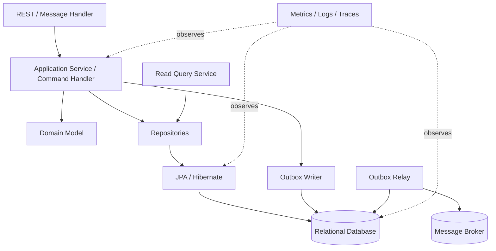
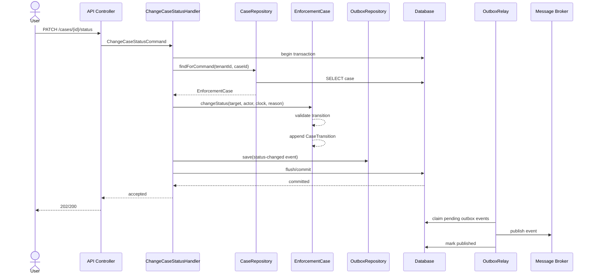

# Part 035 — Capstone: Production-Grade Persistence Module

This final part turns the previous 34 parts into one coherent production module.

The goal is not to show every possible annotation.

The goal is to prove that you can design, implement, test, diagnose, and review a persistence module that survives real production constraints:

- concurrent commands;
- schema evolution;
- business invariants;
- transactional side effects;
- read-model performance;
- tenant and authorization boundaries;
- operational observability;
- repeatable tests;
- controlled failure behavior.

A top-tier engineer does not treat persistence as CRUD.

A top-tier engineer treats persistence as a **consistency boundary**.

---

## 1. What This Capstone Builds

We will design a simplified but production-shaped **case enforcement persistence module**.

The domain is deliberately close to regulatory systems, workflow, and lifecycle modelling.

It contains:

- cases;
- assignments;
- status transitions;
- evidence records;
- notes;
- audit records;
- outbox events;
- read projections;
- optimistic locking;
- database constraints;
- migration-backed schema;
- test strategy;
- observability guardrails.

The module is small enough to understand, but rich enough to exercise the real JPA problems:

```text
Case lifecycle changes.
Assigned user changes.
Evidence is attached.
Status transition emits a domain event.
The event must not be lost.
Concurrent reviewers must not overwrite each other.
Read screens must not trigger N+1.
Soft-deleted records must not leak into active views.
Audit trail must be defensible.
Tests must use a real database.
```

This is the type of module where weak persistence design becomes visible.

---

## 2. Kaufman Frame: What We Are Practicing

Josh Kaufman's method is not about reading everything.

It is about identifying the smallest set of subskills that unlock real performance.

For Java persistence, the key subskills are:

| Subskill | Production Meaning |
|---|---|
| Entity modelling | Model lifecycle and identity without leaking API shape into persistence shape |
| Schema design | Encode invariants close to data and evolve schema safely |
| Transaction design | Know exactly what must commit atomically |
| Query design | Separate write model from read model and avoid accidental graph loading |
| Concurrency control | Prevent lost update, stale write, duplicate assignment, and invalid transitions |
| Outbox design | Avoid dual-write between database and message broker |
| Testing | Prove persisted state, not just object behavior |
| Observability | See SQL, latency, query count, locks, pool pressure, and cache behavior |
| Review discipline | Detect failure modes before production |

The capstone should be practiced like this:

```text
1. Implement the module once naïvely.
2. Observe what breaks.
3. Add constraints.
4. Add transaction boundaries.
5. Add query boundaries.
6. Add locking.
7. Add outbox.
8. Add tests that fail without those protections.
9. Add metrics and review checklists.
```

Skill comes from correction loops, not annotation memorization.

---

## 3. Target Architecture

The module follows a layered architecture, but the important point is not the layers themselves.

The important point is that each layer has a specific persistence responsibility.



The boundaries are:

| Boundary | Rule |
|---|---|
| API boundary | DTOs enter and leave; entities do not |
| Application boundary | Transaction starts and ends around one business command |
| Domain boundary | Business invariant is expressed in methods, not scattered setters |
| Repository boundary | Persistence operations are intention-revealing |
| Query boundary | Read screens use projections, not accidental entity graphs |
| Event boundary | Events are stored in the same transaction through outbox |
| Database boundary | Constraints defend against application bugs and races |
| Observability boundary | Performance and correctness signals are visible |

---

## 4. Module Package Structure

A production module should make illegal coupling inconvenient.

One useful package structure:

```text
com.example.enforcement.casepersistence
├── api
│   ├── CaseCommandController.java
│   └── CaseQueryController.java
├── application
│   ├── AssignCaseHandler.java
│   ├── ChangeCaseStatusHandler.java
│   ├── AddEvidenceHandler.java
│   └── CaseApplicationEvents.java
├── domain
│   ├── EnforcementCase.java
│   ├── CaseStatus.java
│   ├── CasePriority.java
│   ├── CaseAssignment.java
│   ├── Evidence.java
│   ├── EvidenceType.java
│   ├── CaseNote.java
│   ├── CaseTransition.java
│   └── DomainViolation.java
├── persistence
│   ├── CaseRepository.java
│   ├── CaseJpaRepository.java
│   ├── CaseReadRepository.java
│   ├── OutboxJpaRepository.java
│   └── mappings.md
├── outbox
│   ├── OutboxEvent.java
│   ├── OutboxEventRepository.java
│   ├── OutboxRelay.java
│   └── OutboxEventType.java
├── readmodel
│   ├── CaseSummaryView.java
│   ├── CaseDetailView.java
│   └── AssignedCaseRow.java
└── support
    ├── TenantContext.java
    ├── CurrentActor.java
    ├── PersistenceDiagnostics.java
    └── TransactionalGuards.java
```

The split is intentional:

- `domain` owns lifecycle rules;
- `application` owns use cases and transaction boundary;
- `persistence` owns JPA mechanics;
- `readmodel` owns query result shape;
- `outbox` owns reliable side-effect publication;
- `support` owns cross-cutting runtime context.

Avoid this structure:

```text
entity/
repository/
service/
controller/
```

That structure is not always wrong, but it often hides the real design question:

```text
What business boundary does this code protect?
```

---

## 5. Domain Requirements

The sample module has these requirements.

### Case lifecycle

A case can move through:

```text
DRAFT -> OPEN -> IN_REVIEW -> ESCALATED -> RESOLVED -> CLOSED
```

Rules:

- only `DRAFT` can be opened;
- only `OPEN` or `IN_REVIEW` can be escalated;
- only `IN_REVIEW` or `ESCALATED` can be resolved;
- only `RESOLVED` can be closed;
- closed cases cannot be modified;
- every status transition must be recorded;
- every status transition must emit an outbox event.

### Assignment

Rules:

- only active cases can be assigned;
- assigning the same actor twice is idempotent;
- assignment changes must be audited;
- concurrent assignments must not silently overwrite each other.

### Evidence

Rules:

- evidence belongs to exactly one case;
- evidence has immutable external reference;
- evidence can be soft-deleted from active views;
- deleted evidence remains available to audit history;
- duplicate external reference per case is not allowed.

### Read model

Requirements:

- assigned case list must be pageable;
- case detail must avoid N+1;
- status dashboard must be aggregated by status and priority;
- deleted evidence must not appear in normal reads;
- admin/audit read may include deleted evidence.

---

## 6. Database Schema First

A serious persistence module starts with explicit schema thinking.

JPA mapping should not invent your production schema accidentally.

Example migration:

```sql
CREATE TABLE enforcement_case (
    id                  UUID PRIMARY KEY,
    tenant_id           VARCHAR(64) NOT NULL,
    case_number         VARCHAR(64) NOT NULL,
    title               VARCHAR(300) NOT NULL,
    status              VARCHAR(32) NOT NULL,
    priority            VARCHAR(32) NOT NULL,
    assigned_actor_id   VARCHAR(128),
    opened_at           TIMESTAMPTZ,
    resolved_at         TIMESTAMPTZ,
    closed_at           TIMESTAMPTZ,
    created_at          TIMESTAMPTZ NOT NULL,
    created_by          VARCHAR(128) NOT NULL,
    updated_at          TIMESTAMPTZ NOT NULL,
    updated_by          VARCHAR(128) NOT NULL,
    version             BIGINT NOT NULL,
    CONSTRAINT uq_case_tenant_case_number UNIQUE (tenant_id, case_number),
    CONSTRAINT chk_case_status CHECK (status IN ('DRAFT', 'OPEN', 'IN_REVIEW', 'ESCALATED', 'RESOLVED', 'CLOSED')),
    CONSTRAINT chk_case_priority CHECK (priority IN ('LOW', 'MEDIUM', 'HIGH', 'CRITICAL'))
);

CREATE INDEX idx_case_tenant_status_priority
    ON enforcement_case (tenant_id, status, priority, updated_at DESC);

CREATE INDEX idx_case_tenant_assigned_status
    ON enforcement_case (tenant_id, assigned_actor_id, status, updated_at DESC);
```

Evidence:

```sql
CREATE TABLE case_evidence (
    id                  UUID PRIMARY KEY,
    tenant_id           VARCHAR(64) NOT NULL,
    case_id             UUID NOT NULL,
    evidence_type       VARCHAR(32) NOT NULL,
    external_reference  VARCHAR(256) NOT NULL,
    display_name        VARCHAR(300) NOT NULL,
    content_hash        VARCHAR(128),
    deleted             BOOLEAN NOT NULL DEFAULT FALSE,
    deleted_at          TIMESTAMPTZ,
    deleted_by          VARCHAR(128),
    created_at          TIMESTAMPTZ NOT NULL,
    created_by          VARCHAR(128) NOT NULL,
    version             BIGINT NOT NULL,
    CONSTRAINT fk_evidence_case FOREIGN KEY (case_id) REFERENCES enforcement_case(id),
    CONSTRAINT uq_evidence_case_ref UNIQUE (tenant_id, case_id, external_reference),
    CONSTRAINT chk_evidence_type CHECK (evidence_type IN ('DOCUMENT', 'IMAGE', 'VIDEO', 'SYSTEM_RECORD'))
);

CREATE INDEX idx_evidence_case_active
    ON case_evidence (tenant_id, case_id, deleted);
```

Transition history:

```sql
CREATE TABLE case_transition (
    id                  UUID PRIMARY KEY,
    tenant_id           VARCHAR(64) NOT NULL,
    case_id             UUID NOT NULL,
    from_status         VARCHAR(32),
    to_status           VARCHAR(32) NOT NULL,
    reason              VARCHAR(1000),
    actor_id            VARCHAR(128) NOT NULL,
    occurred_at         TIMESTAMPTZ NOT NULL,
    CONSTRAINT fk_transition_case FOREIGN KEY (case_id) REFERENCES enforcement_case(id)
);

CREATE INDEX idx_transition_case_time
    ON case_transition (tenant_id, case_id, occurred_at DESC);
```

Outbox:

```sql
CREATE TABLE outbox_event (
    id                  UUID PRIMARY KEY,
    tenant_id           VARCHAR(64) NOT NULL,
    aggregate_type      VARCHAR(100) NOT NULL,
    aggregate_id        UUID NOT NULL,
    event_type          VARCHAR(200) NOT NULL,
    event_version       INTEGER NOT NULL,
    payload_json        TEXT NOT NULL,
    idempotency_key     VARCHAR(200) NOT NULL,
    status              VARCHAR(32) NOT NULL,
    attempts            INTEGER NOT NULL,
    next_attempt_at     TIMESTAMPTZ NOT NULL,
    created_at          TIMESTAMPTZ NOT NULL,
    published_at        TIMESTAMPTZ,
    last_error          TEXT,
    CONSTRAINT uq_outbox_idempotency UNIQUE (tenant_id, idempotency_key),
    CONSTRAINT chk_outbox_status CHECK (status IN ('PENDING', 'PUBLISHING', 'PUBLISHED', 'FAILED'))
);

CREATE INDEX idx_outbox_pending
    ON outbox_event (status, next_attempt_at, created_at);
```

Schema design has three jobs:

1. support application behavior;
2. defend against invalid states;
3. make operational diagnosis possible.

---

## 7. Entity Modelling Strategy

The write model should represent lifecycle and invariants.

It should not be optimized for every read screen.

```java
@Entity
@Table(
    name = "enforcement_case",
    uniqueConstraints = @UniqueConstraint(
        name = "uq_case_tenant_case_number",
        columnNames = {"tenant_id", "case_number"}
    )
)
public class EnforcementCase {

    @Id
    private UUID id;

    @Column(name = "tenant_id", nullable = false, updatable = false, length = 64)
    private String tenantId;

    @Column(name = "case_number", nullable = false, updatable = false, length = 64)
    private String caseNumber;

    @Column(nullable = false, length = 300)
    private String title;

    @Enumerated(EnumType.STRING)
    @Column(nullable = false, length = 32)
    private CaseStatus status;

    @Enumerated(EnumType.STRING)
    @Column(nullable = false, length = 32)
    private CasePriority priority;

    @Column(name = "assigned_actor_id", length = 128)
    private String assignedActorId;

    @Column(name = "opened_at")
    private Instant openedAt;

    @Column(name = "resolved_at")
    private Instant resolvedAt;

    @Column(name = "closed_at")
    private Instant closedAt;

    @Embedded
    private AuditMetadata audit;

    @Version
    @Column(nullable = false)
    private long version;

    @OneToMany(mappedBy = "enforcementCase", cascade = CascadeType.PERSIST, orphanRemoval = false)
    private final List<CaseTransition> transitions = new ArrayList<>();

    @OneToMany(mappedBy = "enforcementCase", cascade = CascadeType.PERSIST, orphanRemoval = false)
    private final List<Evidence> evidence = new ArrayList<>();

    protected EnforcementCase() {
        // JPA
    }

    private EnforcementCase(
            UUID id,
            String tenantId,
            String caseNumber,
            String title,
            CasePriority priority,
            Actor actor,
            Clock clock
    ) {
        this.id = Objects.requireNonNull(id);
        this.tenantId = requireText(tenantId, "tenantId");
        this.caseNumber = requireText(caseNumber, "caseNumber");
        this.title = requireText(title, "title");
        this.priority = Objects.requireNonNull(priority);
        this.status = CaseStatus.DRAFT;
        this.audit = AuditMetadata.created(actor.id(), clock.instant());
    }

    public static EnforcementCase draft(
            String tenantId,
            String caseNumber,
            String title,
            CasePriority priority,
            Actor actor,
            Clock clock
    ) {
        return new EnforcementCase(UUID.randomUUID(), tenantId, caseNumber, title, priority, actor, clock);
    }
}
```

Notice the shape:

- no public setters;
- constructor protects required fields;
- `@Version` protects against lost update;
- collections are initialized;
- lifecycle methods will mutate controlled state;
- audit is embedded;
- IDs are explicit UUIDs for easier outbox/event correlation.

This is not the only valid style.

But the invariant is universal:

```text
The entity should not allow invalid business transitions through ordinary object mutation.
```

---

## 8. Entity Methods as Invariant Gates

The entity should expose verbs that match domain intent.

```java
public void open(Actor actor, Clock clock, String reason) {
    requireNotClosed();

    if (status != CaseStatus.DRAFT) {
        throw DomainViolation.invalidTransition(status, CaseStatus.OPEN);
    }

    CaseStatus previous = status;
    status = CaseStatus.OPEN;
    openedAt = clock.instant();
    audit = audit.updated(actor.id(), clock.instant());

    transitions.add(CaseTransition.record(
        tenantId,
        this,
        previous,
        status,
        actor,
        reason,
        clock
    ));
}

public void assignTo(Actor assignee, Actor actor, Clock clock) {
    requireActive();

    String newAssignee = requireText(assignee.id(), "assignee");
    if (Objects.equals(assignedActorId, newAssignee)) {
        return;
    }

    assignedActorId = newAssignee;
    audit = audit.updated(actor.id(), clock.instant());
}

public Evidence addEvidence(
        EvidenceType type,
        String externalReference,
        String displayName,
        String contentHash,
        Actor actor,
        Clock clock
) {
    requireActive();

    boolean duplicateInMemory = evidence.stream()
        .filter(e -> !e.isDeleted())
        .anyMatch(e -> e.sameExternalReference(externalReference));

    if (duplicateInMemory) {
        throw DomainViolation.duplicateEvidence(externalReference);
    }

    Evidence item = Evidence.attach(
        tenantId,
        this,
        type,
        externalReference,
        displayName,
        contentHash,
        actor,
        clock
    );

    evidence.add(item);
    audit = audit.updated(actor.id(), clock.instant());
    return item;
}

private void requireActive() {
    if (status == CaseStatus.CLOSED || status == CaseStatus.RESOLVED) {
        throw DomainViolation.caseNotActive(id, status);
    }
}

private void requireNotClosed() {
    if (status == CaseStatus.CLOSED) {
        throw DomainViolation.caseClosed(id);
    }
}
```

Important nuance:

The in-memory duplicate check is useful but not sufficient.

The database unique constraint still matters because two concurrent transactions can both pass the in-memory check.

```text
Domain method protects local object consistency.
Database constraint protects global concurrent consistency.
```

---

## 9. Value Objects and Embedded Audit

Audit metadata appears in many tables.

Use an embeddable value object when the columns are owned by the parent row.

```java
@Embeddable
public class AuditMetadata {

    @Column(name = "created_at", nullable = false, updatable = false)
    private Instant createdAt;

    @Column(name = "created_by", nullable = false, updatable = false, length = 128)
    private String createdBy;

    @Column(name = "updated_at", nullable = false)
    private Instant updatedAt;

    @Column(name = "updated_by", nullable = false, length = 128)
    private String updatedBy;

    protected AuditMetadata() {
    }

    private AuditMetadata(Instant createdAt, String createdBy, Instant updatedAt, String updatedBy) {
        this.createdAt = Objects.requireNonNull(createdAt);
        this.createdBy = requireText(createdBy, "createdBy");
        this.updatedAt = Objects.requireNonNull(updatedAt);
        this.updatedBy = requireText(updatedBy, "updatedBy");
    }

    public static AuditMetadata created(String actorId, Instant now) {
        return new AuditMetadata(now, actorId, now, actorId);
    }

    public AuditMetadata updated(String actorId, Instant now) {
        return new AuditMetadata(createdAt, createdBy, now, actorId);
    }
}
```

This style makes audit mutation explicit.

Alternative: use Spring Data auditing.

That is fine when the audit model is generic.

But when audit semantics are part of regulatory defensibility, explicit value objects are often easier to reason about.

---

## 10. Evidence as Child Entity

Evidence is not a value object here.

It has identity, lifecycle, soft delete, and audit significance.

```java
@Entity
@Table(
    name = "case_evidence",
    uniqueConstraints = @UniqueConstraint(
        name = "uq_evidence_case_ref",
        columnNames = {"tenant_id", "case_id", "external_reference"}
    )
)
public class Evidence {

    @Id
    private UUID id;

    @Column(name = "tenant_id", nullable = false, updatable = false, length = 64)
    private String tenantId;

    @ManyToOne(fetch = FetchType.LAZY, optional = false)
    @JoinColumn(name = "case_id", nullable = false, updatable = false)
    private EnforcementCase enforcementCase;

    @Enumerated(EnumType.STRING)
    @Column(name = "evidence_type", nullable = false, length = 32)
    private EvidenceType type;

    @Column(name = "external_reference", nullable = false, updatable = false, length = 256)
    private String externalReference;

    @Column(name = "display_name", nullable = false, length = 300)
    private String displayName;

    @Column(name = "content_hash", length = 128)
    private String contentHash;

    @Column(nullable = false)
    private boolean deleted;

    @Column(name = "deleted_at")
    private Instant deletedAt;

    @Column(name = "deleted_by", length = 128)
    private String deletedBy;

    @Embedded
    private AuditMetadata audit;

    @Version
    @Column(nullable = false)
    private long version;

    protected Evidence() {
    }

    static Evidence attach(
            String tenantId,
            EnforcementCase enforcementCase,
            EvidenceType type,
            String externalReference,
            String displayName,
            String contentHash,
            Actor actor,
            Clock clock
    ) {
        Evidence evidence = new Evidence();
        evidence.id = UUID.randomUUID();
        evidence.tenantId = requireText(tenantId, "tenantId");
        evidence.enforcementCase = Objects.requireNonNull(enforcementCase);
        evidence.type = Objects.requireNonNull(type);
        evidence.externalReference = requireText(externalReference, "externalReference");
        evidence.displayName = requireText(displayName, "displayName");
        evidence.contentHash = contentHash;
        evidence.deleted = false;
        evidence.audit = AuditMetadata.created(actor.id(), clock.instant());
        return evidence;
    }

    public void softDelete(Actor actor, Clock clock) {
        if (deleted) {
            return;
        }
        deleted = true;
        deletedAt = clock.instant();
        deletedBy = actor.id();
    }
}
```

Avoid `CascadeType.REMOVE` here unless the lifecycle truly means physical deletion.

For regulatory/evidence systems, deletion is usually a visibility transition, not row removal.

---

## 11. Transition History

Transition history is append-only.

```java
@Entity
@Table(name = "case_transition")
public class CaseTransition {

    @Id
    private UUID id;

    @Column(name = "tenant_id", nullable = false, updatable = false, length = 64)
    private String tenantId;

    @ManyToOne(fetch = FetchType.LAZY, optional = false)
    @JoinColumn(name = "case_id", nullable = false, updatable = false)
    private EnforcementCase enforcementCase;

    @Enumerated(EnumType.STRING)
    @Column(name = "from_status", length = 32)
    private CaseStatus fromStatus;

    @Enumerated(EnumType.STRING)
    @Column(name = "to_status", nullable = false, length = 32)
    private CaseStatus toStatus;

    @Column(length = 1000)
    private String reason;

    @Column(name = "actor_id", nullable = false, updatable = false, length = 128)
    private String actorId;

    @Column(name = "occurred_at", nullable = false, updatable = false)
    private Instant occurredAt;

    protected CaseTransition() {
    }

    static CaseTransition record(
            String tenantId,
            EnforcementCase enforcementCase,
            CaseStatus fromStatus,
            CaseStatus toStatus,
            Actor actor,
            String reason,
            Clock clock
    ) {
        CaseTransition transition = new CaseTransition();
        transition.id = UUID.randomUUID();
        transition.tenantId = tenantId;
        transition.enforcementCase = enforcementCase;
        transition.fromStatus = fromStatus;
        transition.toStatus = Objects.requireNonNull(toStatus);
        transition.reason = reason;
        transition.actorId = actor.id();
        transition.occurredAt = clock.instant();
        return transition;
    }
}
```

Append-only tables should be hard to update accidentally.

Options:

- no public mutation methods;
- database trigger preventing update/delete;
- application review rule;
- separate audit schema;
- immutable ORM mapping where practical.

---

## 12. Repository Boundary

Do not expose Spring Data repository methods directly to business code without intention.

A persistence boundary should read like business data access, not like generated CRUD.

```java
public interface CaseRepository {

    Optional<EnforcementCase> findForCommand(String tenantId, UUID caseId);

    Optional<EnforcementCase> findForUpdate(String tenantId, UUID caseId);

    boolean existsCaseNumber(String tenantId, String caseNumber);

    EnforcementCase save(EnforcementCase enforcementCase);
}
```

The adapter can use Spring Data JPA internally.

```java
@Repository
class JpaCaseRepositoryAdapter implements CaseRepository {

    private final CaseJpaRepository delegate;

    JpaCaseRepositoryAdapter(CaseJpaRepository delegate) {
        this.delegate = delegate;
    }

    @Override
    public Optional<EnforcementCase> findForCommand(String tenantId, UUID caseId) {
        return delegate.findByTenantIdAndId(tenantId, caseId);
    }

    @Override
    public Optional<EnforcementCase> findForUpdate(String tenantId, UUID caseId) {
        return delegate.findLockedByTenantIdAndId(tenantId, caseId);
    }

    @Override
    public boolean existsCaseNumber(String tenantId, String caseNumber) {
        return delegate.existsByTenantIdAndCaseNumber(tenantId, caseNumber);
    }

    @Override
    public EnforcementCase save(EnforcementCase enforcementCase) {
        return delegate.save(enforcementCase);
    }
}
```

The Spring Data repository remains low-level.

```java
interface CaseJpaRepository extends JpaRepository<EnforcementCase, UUID> {

    Optional<EnforcementCase> findByTenantIdAndId(String tenantId, UUID id);

    boolean existsByTenantIdAndCaseNumber(String tenantId, String caseNumber);

    @Lock(LockModeType.OPTIMISTIC_FORCE_INCREMENT)
    @Query("""
        select c
        from EnforcementCase c
        where c.tenantId = :tenantId
          and c.id = :id
        """)
    Optional<EnforcementCase> findLockedByTenantIdAndId(
        @Param("tenantId") String tenantId,
        @Param("id") UUID id
    );
}
```

Do not overuse pessimistic locking.

For many command paths, optimistic locking with retry or conflict response is healthier.

Use pessimistic locking when:

- the cost of conflict is high;
- a scarce resource is being allocated;
- you must protect a predicate/range;
- you cannot tolerate repeated optimistic failures;
- database isolation alone is insufficient for the invariant.

---

## 13. Command Handler as Transaction Boundary

The application service owns the transaction.

```java
@Service
public class ChangeCaseStatusHandler {

    private final CaseRepository cases;
    private final OutboxEventRepository outbox;
    private final CurrentActor currentActor;
    private final Clock clock;

    public ChangeCaseStatusHandler(
            CaseRepository cases,
            OutboxEventRepository outbox,
            CurrentActor currentActor,
            Clock clock
    ) {
        this.cases = cases;
        this.outbox = outbox;
        this.currentActor = currentActor;
        this.clock = clock;
    }

    @Transactional
    public ChangeCaseStatusResult handle(ChangeCaseStatusCommand command) {
        Actor actor = currentActor.required();

        EnforcementCase enforcementCase = cases.findForCommand(command.tenantId(), command.caseId())
            .orElseThrow(() -> CaseNotFoundException.forId(command.caseId()));

        CaseStatus previous = enforcementCase.status();
        enforcementCase.changeStatus(command.targetStatus(), actor, clock, command.reason());

        outbox.save(OutboxEvent.caseStatusChanged(
            command.tenantId(),
            enforcementCase.id(),
            previous,
            enforcementCase.status(),
            actor.id(),
            clock.instant()
        ));

        return ChangeCaseStatusResult.accepted(enforcementCase.id(), enforcementCase.status());
    }
}
```

This is the consistency envelope:

```text
Load case.
Validate lifecycle transition.
Mutate case.
Append transition history.
Store outbox event.
Commit all or none.
```

Do not call the broker directly inside this transaction.

Do not call remote authorization inside this transaction if the result can be checked before entering it.

Do not perform long file processing inside this transaction.

A transaction should be short, deterministic, and database-focused.

---

## 14. Status Transition Implementation

A clean lifecycle method uses an explicit transition table or switch.

```java
public void changeStatus(CaseStatus target, Actor actor, Clock clock, String reason) {
    requireNotClosedUnlessClosing(target);

    if (!status.canMoveTo(target)) {
        throw DomainViolation.invalidTransition(status, target);
    }

    CaseStatus previous = status;
    Instant now = clock.instant();

    status = target;

    switch (target) {
        case OPEN -> openedAt = firstNonNull(openedAt, now);
        case RESOLVED -> resolvedAt = now;
        case CLOSED -> closedAt = now;
        default -> {
            // no timestamp side effect
        }
    }

    transitions.add(CaseTransition.record(
        tenantId,
        this,
        previous,
        target,
        actor,
        reason,
        clock
    ));

    audit = audit.updated(actor.id(), now);
}
```

Status enum:

```java
public enum CaseStatus {
    DRAFT,
    OPEN,
    IN_REVIEW,
    ESCALATED,
    RESOLVED,
    CLOSED;

    public boolean canMoveTo(CaseStatus target) {
        return switch (this) {
            case DRAFT -> target == OPEN;
            case OPEN -> target == IN_REVIEW || target == ESCALATED;
            case IN_REVIEW -> target == ESCALATED || target == RESOLVED;
            case ESCALATED -> target == RESOLVED;
            case RESOLVED -> target == CLOSED;
            case CLOSED -> false;
        };
    }
}
```

For simple lifecycle, enum logic is fine.

For complex lifecycle with role, reason codes, SLA clocks, escalation policy, jurisdiction, or external review requirements, use a dedicated transition policy object.

```java
public interface CaseTransitionPolicy {
    TransitionDecision evaluate(EnforcementCase enforcementCase, CaseStatus target, Actor actor);
}
```

Keep the policy deterministic and testable.

---

## 15. Outbox Event Design

Outbox events are persisted as part of the same transaction.

```java
@Entity
@Table(
    name = "outbox_event",
    uniqueConstraints = @UniqueConstraint(
        name = "uq_outbox_idempotency",
        columnNames = {"tenant_id", "idempotency_key"}
    )
)
public class OutboxEvent {

    @Id
    private UUID id;

    @Column(name = "tenant_id", nullable = false, updatable = false, length = 64)
    private String tenantId;

    @Column(name = "aggregate_type", nullable = false, updatable = false, length = 100)
    private String aggregateType;

    @Column(name = "aggregate_id", nullable = false, updatable = false)
    private UUID aggregateId;

    @Column(name = "event_type", nullable = false, updatable = false, length = 200)
    private String eventType;

    @Column(name = "event_version", nullable = false, updatable = false)
    private int eventVersion;

    @Lob
    @Column(name = "payload_json", nullable = false, updatable = false)
    private String payloadJson;

    @Column(name = "idempotency_key", nullable = false, updatable = false, length = 200)
    private String idempotencyKey;

    @Enumerated(EnumType.STRING)
    @Column(nullable = false, length = 32)
    private OutboxStatus status;

    @Column(nullable = false)
    private int attempts;

    @Column(name = "next_attempt_at", nullable = false)
    private Instant nextAttemptAt;

    @Column(name = "created_at", nullable = false, updatable = false)
    private Instant createdAt;

    @Column(name = "published_at")
    private Instant publishedAt;

    @Column(name = "last_error")
    private String lastError;

    @Version
    private long version;

    protected OutboxEvent() {
    }
}
```

Factory:

```java
public static OutboxEvent caseStatusChanged(
        String tenantId,
        UUID caseId,
        CaseStatus from,
        CaseStatus to,
        String actorId,
        Instant occurredAt
) {
    String eventType = "case.status-changed";
    int eventVersion = 1;
    String idempotencyKey = "case:%s:status:%s:%s".formatted(caseId, from, to);

    String payload = """
        {
          "caseId": "%s",
          "fromStatus": "%s",
          "toStatus": "%s",
          "actorId": "%s",
          "occurredAt": "%s"
        }
        """.formatted(caseId, from, to, actorId, occurredAt);

    return new OutboxEvent(
        UUID.randomUUID(),
        tenantId,
        "EnforcementCase",
        caseId,
        eventType,
        eventVersion,
        payload,
        idempotencyKey,
        occurredAt
    );
}
```

The idempotency key must be designed around command semantics.

A bad idempotency key:

```text
random UUID generated per retry
```

A better idempotency key:

```text
tenant + aggregate + transition identity + command id
```

In real systems, include a command ID from the API/message request when possible.

---

## 16. Outbox Relay

The relay is a separate process or scheduled component.

It must not assume exactly-once publication.

It should assume:

- relay can crash after publishing but before marking published;
- broker can accept duplicate publish;
- database row can be locked by another relay worker;
- event consumer must be idempotent.

Pseudo-implementation:

```java
@Component
public class OutboxRelay {

    private final OutboxEventRepository events;
    private final EventPublisher publisher;
    private final Clock clock;

    @Scheduled(fixedDelayString = "${outbox.relay.delay-ms:1000}")
    public void publishBatch() {
        List<OutboxEvent> batch = events.claimPendingBatch(clock.instant(), 100);

        for (OutboxEvent event : batch) {
            publishOne(event.id());
        }
    }

    @Transactional(propagation = Propagation.REQUIRES_NEW)
    public void publishOne(UUID eventId) {
        OutboxEvent event = events.findByIdForUpdate(eventId)
            .orElseThrow();

        if (!event.isPublishable(clock.instant())) {
            return;
        }

        try {
            publisher.publish(event.topic(), event.key(), event.payloadJson());
            event.markPublished(clock.instant());
        } catch (Exception ex) {
            event.markFailed(ex, clock.instant());
        }
    }
}
```

In PostgreSQL, batch claiming often uses `FOR UPDATE SKIP LOCKED`.

With JPA, native query can be justified here because this is operational queue behavior, not domain querying.

```java
@Query(value = """
    select *
    from outbox_event
    where status in ('PENDING', 'FAILED')
      and next_attempt_at <= :now
    order by created_at
    limit :limit
    for update skip locked
    """, nativeQuery = true)
List<OutboxEvent> claimPendingBatch(@Param("now") Instant now, @Param("limit") int limit);
```

A provider abstraction is not worth losing correct database queue semantics.

---

## 17. Read Model Design

The write model is not the read model.

Use projections for list screens.

```java
public record AssignedCaseRow(
    UUID id,
    String caseNumber,
    String title,
    CaseStatus status,
    CasePriority priority,
    String assignedActorId,
    Instant updatedAt,
    long version
) {
}
```

Repository:

```java
public interface CaseReadRepository {

    Page<AssignedCaseRow> findAssignedCases(
        String tenantId,
        String actorId,
        Set<CaseStatus> statuses,
        Pageable pageable
    );

    CaseDetailView findCaseDetail(String tenantId, UUID caseId);

    List<CaseStatusCountRow> countByStatus(String tenantId);
}
```

Implementation:

```java
@Repository
class JpaCaseReadRepository implements CaseReadRepository {

    @PersistenceContext
    private EntityManager entityManager;

    @Override
    public Page<AssignedCaseRow> findAssignedCases(
            String tenantId,
            String actorId,
            Set<CaseStatus> statuses,
            Pageable pageable
    ) {
        List<AssignedCaseRow> rows = entityManager.createQuery("""
            select new com.example.enforcement.casepersistence.readmodel.AssignedCaseRow(
                c.id,
                c.caseNumber,
                c.title,
                c.status,
                c.priority,
                c.assignedActorId,
                c.audit.updatedAt,
                c.version
            )
            from EnforcementCase c
            where c.tenantId = :tenantId
              and c.assignedActorId = :actorId
              and c.status in :statuses
            order by c.audit.updatedAt desc, c.id desc
            """, AssignedCaseRow.class)
            .setParameter("tenantId", tenantId)
            .setParameter("actorId", actorId)
            .setParameter("statuses", statuses)
            .setFirstResult((int) pageable.getOffset())
            .setMaxResults(pageable.getPageSize())
            .getResultList();

        Long total = entityManager.createQuery("""
            select count(c)
            from EnforcementCase c
            where c.tenantId = :tenantId
              and c.assignedActorId = :actorId
              and c.status in :statuses
            """, Long.class)
            .setParameter("tenantId", tenantId)
            .setParameter("actorId", actorId)
            .setParameter("statuses", statuses)
            .getSingleResult();

        return new PageImpl<>(rows, pageable, total);
    }
}
```

This query does not load entities.

Therefore:

- no dirty checking overhead;
- no lazy loading surprise;
- no accidental serialization graph;
- easier query count reasoning;
- clear selected columns.

For large high-traffic screens, use keyset pagination instead of offset pagination.

---

## 18. Case Detail Fetch Strategy

Case detail may need:

- case header;
- active evidence;
- transition history;
- latest notes.

Do not solve this by marking everything eager.

Options:

### Option A — Projection per section

```java
CaseHeaderRow header = readRepository.findHeader(tenantId, caseId);
List<EvidenceRow> evidence = readRepository.findActiveEvidence(tenantId, caseId);
List<TransitionRow> transitions = readRepository.findTransitions(tenantId, caseId);
```

This is often the most predictable for complex screens.

### Option B — Entity graph for command preparation

```java
@EntityGraph(attributePaths = {"evidence"})
@Query("""
    select c
    from EnforcementCase c
    where c.tenantId = :tenantId
      and c.id = :id
    """)
Optional<EnforcementCase> findWithEvidence(String tenantId, UUID id);
```

Use this only when you need the entity graph for behavior.

### Option C — Fetch join for small bounded collections

```java
@Query("""
    select distinct c
    from EnforcementCase c
    left join fetch c.evidence e
    where c.tenantId = :tenantId
      and c.id = :id
      and (e.deleted = false or e is null)
    """)
Optional<EnforcementCase> findDetailAggregate(String tenantId, UUID id);
```

Be careful:

- multiple collection fetch joins can explode rows;
- pagination with collection fetch join is dangerous;
- filtering fetched collection can distort managed collection semantics;
- duplicate roots must be handled.

For read-only detail screens, projections are usually safer.

---

## 19. Tenant Boundary

Every repository method must include tenant boundary unless the method is explicitly global admin logic.

Bad:

```java
Optional<EnforcementCase> findById(UUID id);
```

Better:

```java
Optional<EnforcementCase> findByTenantIdAndId(String tenantId, UUID id);
```

For multi-tenant systems, a missing tenant predicate is not a performance bug.

It is a data exposure bug.

Tenant enforcement options:

| Option | Strength | Risk |
|---|---:|---|
| Manual tenant predicate | Simple | Easy to forget |
| Hibernate filter | Centralized | Must be enabled correctly |
| Database row-level security | Strong | Operational complexity |
| Schema/database per tenant | Strong isolation | Migration/routing complexity |
| Repository adapter discipline | Practical | Requires review/testing |

For high-sensitivity domains, combine controls.

```text
Application tenant predicate + database constraint + tenant-aware tests + observability.
```

Tenant leak test:

```java
@Test
void assignedCaseQueryDoesNotReturnOtherTenantRows() {
    String tenantA = "tenant-a";
    String tenantB = "tenant-b";

    UUID sameLookingCaseA = createCase(tenantA, "CASE-001", "actor-1");
    UUID sameLookingCaseB = createCase(tenantB, "CASE-001", "actor-1");

    Page<AssignedCaseRow> rows = readRepository.findAssignedCases(
        tenantA,
        "actor-1",
        Set.of(CaseStatus.OPEN),
        PageRequest.of(0, 20)
    );

    assertThat(rows.getContent())
        .extracting(AssignedCaseRow::id)
        .contains(sameLookingCaseA)
        .doesNotContain(sameLookingCaseB);
}
```

---

## 20. Authorization Boundary

Persistence is not authorization.

But persistence design can make authorization safer.

Rules:

- do not load a case by ID and then check tenant/permission later;
- include tenant and accessible scope in query predicates when possible;
- avoid returning entities to API layer where fields might be serialized accidentally;
- define read projections per role when field visibility differs;
- log denied access without leaking resource existence where necessary.

Example:

```java
@Query("""
    select new com.example.CaseHeaderRow(
        c.id, c.caseNumber, c.title, c.status, c.priority
    )
    from EnforcementCase c
    where c.tenantId = :tenantId
      and c.id = :caseId
      and (
          c.assignedActorId = :actorId
          or exists (
              select 1
              from CaseTeamMembership m
              where m.caseId = c.id
                and m.actorId = :actorId
          )
      )
    """)
Optional<CaseHeaderRow> findVisibleCaseHeader(String tenantId, UUID caseId, String actorId);
```

This prevents accidental over-fetching before permission filtering.

---

## 21. Error Taxonomy

Production persistence modules need clear error categories.

| Error | Example | API Meaning |
|---|---|---|
| Not found | Case ID absent in tenant | 404 or masked 404 |
| Conflict | Optimistic lock failure | 409 |
| Invalid transition | CLOSED -> OPEN | 422 or 409 depending API semantics |
| Duplicate | Unique constraint violation | 409 |
| Validation | Missing title | 400 |
| Authorization | Actor cannot access case | 403 or masked 404 |
| Transient database | Deadlock, timeout | retry or 503 |
| Non-transient database | Invalid SQL, missing column | incident |

Do not expose raw database exceptions directly.

Translate them near the application boundary.

```java
@RestControllerAdvice
class PersistenceExceptionHandler {

    @ExceptionHandler(ObjectOptimisticLockingFailureException.class)
    ResponseEntity<ApiError> optimisticLock(ObjectOptimisticLockingFailureException ex) {
        return ResponseEntity.status(HttpStatus.CONFLICT)
            .body(ApiError.conflict("The case was modified by another transaction."));
    }

    @ExceptionHandler(DataIntegrityViolationException.class)
    ResponseEntity<ApiError> integrity(DataIntegrityViolationException ex) {
        ConstraintKind kind = ConstraintClassifier.classify(ex);

        return switch (kind) {
            case DUPLICATE_CASE_NUMBER -> conflict("Case number already exists.");
            case DUPLICATE_EVIDENCE_REFERENCE -> conflict("Evidence reference already exists for this case.");
            default -> conflict("The requested change violates data constraints.");
        };
    }
}
```

Constraint classification should be explicit and database-aware.

Do not parse arbitrary error messages if your database/driver exposes constraint names.

---

## 22. Optimistic Locking Contract

`@Version` protects rows from lost update.

It does not automatically solve every concurrent invariant.

API should expose a version or ETag for command paths where user edits stale data.

Example command:

```java
public record ChangeCaseStatusCommand(
    String tenantId,
    UUID caseId,
    CaseStatus targetStatus,
    String reason,
    Long expectedVersion
) {
}
```

Handler:

```java
@Transactional
public ChangeCaseStatusResult handle(ChangeCaseStatusCommand command) {
    EnforcementCase enforcementCase = cases.findForCommand(command.tenantId(), command.caseId())
        .orElseThrow(() -> CaseNotFoundException.forId(command.caseId()));

    if (command.expectedVersion() != null && enforcementCase.version() != command.expectedVersion()) {
        throw new StaleCaseCommandException(enforcementCase.id(), enforcementCase.version());
    }

    enforcementCase.changeStatus(command.targetStatus(), currentActor.required(), clock, command.reason());
    outbox.save(OutboxEvent.caseStatusChanged(...));

    return ChangeCaseStatusResult.accepted(enforcementCase.id(), enforcementCase.status(), enforcementCase.version());
}
```

There are two layers of protection:

```text
Expected version check gives better user-facing conflict semantics.
@Version gives database-level lost-update protection at flush/commit.
```

Do not rely only on UI stale checks.

---

## 23. Transaction Design Checklist

For each command, write the transaction contract explicitly.

Example: `ChangeCaseStatus`

```text
Transaction boundary:
- starts in ChangeCaseStatusHandler.handle
- loads one EnforcementCase by tenant + id
- validates lifecycle transition
- mutates case status/timestamps/audit
- appends CaseTransition
- stores OutboxEvent
- commits

Inside transaction:
- database reads/writes only
- no broker publish
- no email send
- no remote file download
- no long CPU processing

Expected conflicts:
- stale version
- invalid transition
- duplicate outbox idempotency key
- database timeout/deadlock

Retry policy:
- optimistic conflict: no automatic retry for user-driven command
- deadlock/lock timeout: bounded retry if command idempotent
- duplicate command id: return previous accepted result if available
```

This should be visible in code comments, ADR, or module docs.

Transaction design is architecture, not decoration.

---

## 24. Migration Strategy

Production-grade persistence requires migration discipline.

Rules:

- schema changes are versioned;
- application startup validates schema but does not mutate production schema automatically;
- expand/contract changes are used for zero-downtime deployment;
- every new non-null column gets safe backfill path;
- every renamed column is treated as add-copy-read-switch-drop;
- indexes are created with operational awareness;
- migration rollback strategy is explicit.

Example expand/contract:

```text
Goal: replace assigned_actor_id with assignment table.

Release 1:
- create case_assignment table
- write both enforcement_case.assigned_actor_id and case_assignment
- read old column
- backfill case_assignment

Release 2:
- read case_assignment
- keep dual write
- verify metrics: old/new assignment consistency

Release 3:
- stop writing old column
- drop old column later after retention window
```

Do not compress this into one risky migration if the table is large and the system is live.

---

## 25. Testing Strategy Overview

A production persistence module needs several test layers.

| Test Type | Purpose | Database |
|---|---|---|
| Domain unit test | Lifecycle/invariant rules | None |
| Repository integration test | Mapping/query correctness | Real DB via Testcontainers |
| Transaction test | Flush/commit/concurrency behavior | Real DB |
| Migration test | Schema evolves cleanly | Real DB |
| Query budget test | Guard N+1/regression | Real DB |
| Outbox test | Atomic event persistence | Real DB |
| Relay test | Duplicate/retry behavior | Real or realistic fake broker |
| Tenant leak test | Data isolation | Real DB |

Do not rely only on mocked repositories.

Mocked repositories prove service branching.

They do not prove persistence correctness.

---

## 26. Domain Unit Tests

Domain tests are fast and do not need JPA.

```java
class EnforcementCaseTest {

    private final Clock clock = Clock.fixed(Instant.parse("2026-06-30T10:00:00Z"), ZoneOffset.UTC);
    private final Actor actor = new Actor("reviewer-1");

    @Test
    void draftCanBeOpened() {
        EnforcementCase c = EnforcementCase.draft(
            "tenant-a",
            "CASE-001",
            "Suspicious activity",
            CasePriority.HIGH,
            actor,
            clock
        );

        c.open(actor, clock, "Initial review started");

        assertThat(c.status()).isEqualTo(CaseStatus.OPEN);
        assertThat(c.transitions()).hasSize(1);
    }

    @Test
    void closedCaseCannotBeReopened() {
        EnforcementCase c = resolvedCase();
        c.close(actor, clock, "Complete");

        assertThatThrownBy(() -> c.open(actor, clock, "Reopen"))
            .isInstanceOf(DomainViolation.class);
    }
}
```

These tests protect the model.

They do not prove JPA mapping.

---

## 27. Repository Integration Tests

Use real database tests for mapping and query behavior.

```java
@DataJpaTest
@Testcontainers
class CaseRepositoryIT {

    @Container
    static PostgreSQLContainer<?> postgres = new PostgreSQLContainer<>("postgres:16-alpine");

    @Autowired
    CaseRepository cases;

    @Autowired
    EntityManager entityManager;

    @Test
    void persistsCaseWithTransitionHistory() {
        EnforcementCase c = EnforcementCase.draft(...);
        c.open(actor, clock, "Start");

        cases.save(c);
        entityManager.flush();
        entityManager.clear();

        EnforcementCase reloaded = cases.findForCommand("tenant-a", c.id()).orElseThrow();

        assertThat(reloaded.status()).isEqualTo(CaseStatus.OPEN);
        assertThat(reloaded.transitions()).hasSize(1);
    }
}
```

The critical pattern:

```text
save -> flush -> clear -> reload -> assert database state
```

Without flush/clear/reload, you may only be asserting in-memory object state.

---

## 28. Constraint Tests

Test database constraints intentionally.

```java
@Test
void duplicateCaseNumberInSameTenantIsRejected() {
    EnforcementCase first = EnforcementCase.draft("tenant-a", "CASE-001", "One", HIGH, actor, clock);
    EnforcementCase second = EnforcementCase.draft("tenant-a", "CASE-001", "Two", HIGH, actor, clock);

    cases.save(first);
    entityManager.flush();

    cases.save(second);

    assertThatThrownBy(() -> entityManager.flush())
        .isInstanceOf(PersistenceException.class);
}

@Test
void sameCaseNumberAcrossTenantsIsAllowed() {
    cases.save(EnforcementCase.draft("tenant-a", "CASE-001", "One", HIGH, actor, clock));
    cases.save(EnforcementCase.draft("tenant-b", "CASE-001", "Two", HIGH, actor, clock));

    entityManager.flush();
}
```

The test documents the business rule.

The constraint enforces it under concurrency.

---

## 29. Optimistic Lock Test

Concurrency tests should use separate transactions and separate persistence contexts.

```java
@Test
void concurrentStatusChangesCauseOptimisticConflict() {
    UUID caseId = transactionTemplate.execute(tx -> {
        EnforcementCase c = EnforcementCase.draft("tenant-a", "CASE-001", "Case", HIGH, actor, clock);
        c.open(actor, clock, "Start");
        cases.save(c);
        return c.id();
    });

    EnforcementCase tx1Case = loadInNewEntityManager(caseId);
    EnforcementCase tx2Case = loadInNewEntityManager(caseId);

    tx1Case.changeStatus(CaseStatus.IN_REVIEW, actor, clock, "Review");
    tx2Case.changeStatus(CaseStatus.ESCALATED, actor, clock, "Escalate");

    commit(tx1Case);

    assertThatThrownBy(() -> commit(tx2Case))
        .isInstanceOf(OptimisticLockException.class);
}
```

Be careful with `@Transactional` on the test method.

It can hide transaction boundary mistakes.

For concurrency tests, control transactions explicitly.

---

## 30. Outbox Atomicity Test

The outbox event must commit with business state.

```java
@Test
void statusChangePersistsCaseTransitionAndOutboxAtomically() {
    UUID caseId = givenOpenCase();

    handler.handle(new ChangeCaseStatusCommand(
        "tenant-a",
        caseId,
        CaseStatus.IN_REVIEW,
        "Begin review",
        null
    ));

    entityManager.flush();
    entityManager.clear();

    EnforcementCase reloaded = cases.findForCommand("tenant-a", caseId).orElseThrow();
    List<OutboxEvent> events = outbox.findByAggregateId(caseId);

    assertThat(reloaded.status()).isEqualTo(CaseStatus.IN_REVIEW);
    assertThat(reloaded.transitions()).hasSize(2); // OPEN plus IN_REVIEW
    assertThat(events)
        .extracting(OutboxEvent::eventType)
        .contains("case.status-changed");
}
```

Failure test:

```java
@Test
void invalidTransitionDoesNotPersistOutboxEvent() {
    UUID caseId = givenClosedCase();

    assertThatThrownBy(() -> handler.handle(new ChangeCaseStatusCommand(
        "tenant-a",
        caseId,
        CaseStatus.OPEN,
        "Invalid reopen",
        null
    ))).isInstanceOf(DomainViolation.class);

    assertThat(outbox.findByAggregateId(caseId)).isEmpty();
}
```

This proves atomicity.

---

## 31. Query Count Tests

N+1 bugs should be caught by tests.

One approach is to use a datasource proxy or Hibernate statistics.

Pseudo-test:

```java
@Test
void assignedCaseListUsesBoundedQueryCount() {
    givenCasesWithEvidenceAndTransitions(30);

    sqlCounter.reset();

    Page<AssignedCaseRow> page = readRepository.findAssignedCases(
        "tenant-a",
        "actor-1",
        Set.of(CaseStatus.OPEN, CaseStatus.IN_REVIEW),
        PageRequest.of(0, 20)
    );

    assertThat(page.getContent()).hasSize(20);
    assertThat(sqlCounter.selectCount()).isLessThanOrEqualTo(2);
}
```

For page query with count, two selects may be expected.

The important thing is to encode a budget.

```text
No query budget -> no regression guardrail.
```

---

## 32. Observability Guardrails

A production persistence module should expose these signals:

| Signal | Why It Matters |
|---|---|
| SQL latency | Detect slow query and lock wait symptoms |
| Query count per request | Detect N+1 and fetch regression |
| Rows returned/scanned where possible | Detect inefficient query plans |
| Connection pool active/pending | Detect transaction/pool pressure |
| Transaction duration | Detect long transaction and remote-call-in-transaction |
| Optimistic lock failures | Detect contention or stale UI commands |
| Deadlocks/lock timeouts | Detect concurrency design problems |
| Outbox pending age | Detect relay failure or broker outage |
| Outbox attempts/failures | Detect poison event and publication issue |
| Cache hit/miss/eviction | Detect stale cache or ineffective cache |
| Migration duration/failure | Detect deployment risk |

A useful local debug config:

```properties
spring.jpa.properties.hibernate.generate_statistics=true
logging.level.org.hibernate.SQL=DEBUG
logging.level.org.hibernate.orm.jdbc.bind=TRACE
logging.level.org.hibernate.stat=DEBUG
```

Do not enable verbose bind logging in production by default.

It may expose sensitive values and create enormous log volume.

Production logging should be sampled, redacted, and incident-controlled.

---

## 33. Performance Budget

Define budgets per use case.

Example:

| Use Case | Budget |
|---|---|
| Assigned case list | <= 2 SQL statements, p95 < 150 ms, page size <= 50 |
| Case detail | <= 4 SQL statements, p95 < 250 ms |
| Change status command | <= 5 SQL statements, p95 < 120 ms excluding lock wait |
| Add evidence | <= 4 SQL statements, no full collection load |
| Outbox relay batch | 100 events per batch, bounded transaction per event or small batch |
| Dashboard count | indexed aggregate or materialized read model when table grows |

A budget changes the conversation.

Without a budget:

```text
"It seems fine."
```

With a budget:

```text
"This endpoint regressed from 2 queries to 42 queries after adding evidence preview."
```

This is engineering control.

---

## 34. Performance Review Flow

When reviewing a query-heavy change:

```text
1. What endpoint/use case is affected?
2. Is it command or read-only path?
3. Does it load entities or projections?
4. How many SQL statements are expected?
5. Are collections fetched intentionally?
6. Does pagination interact with fetch joins?
7. Are predicates covered by indexes?
8. Is sort order deterministic?
9. Does tenant predicate appear?
10. Does test assert query count or result shape?
11. Does production metric expose latency/regression?
```

This is better than asking only:

```text
"Does the repository method work?"
```

A repository method can work functionally and still be a production problem.

---

## 35. Read/Write Split Inside the Same Service

You do not need full CQRS for every system.

But you should split command and read concerns.

```text
Command path:
- loads aggregate/entity
- enforces invariant
- uses transaction
- writes outbox
- cares about concurrency

Read path:
- uses projection
- may be read-only transaction
- cares about query plan
- cares about pagination and visibility
- should not mutate managed state
```

Same database, same module, different mental models.

This alone prevents many JPA mistakes.

---

## 36. Soft Delete Policy

Soft delete needs a policy, not only a boolean.

Policy dimensions:

| Dimension | Decision |
|---|---|
| Active reads | Exclude deleted evidence |
| Audit reads | Include deleted evidence |
| Uniqueness | Does deleted row still reserve external reference? |
| Restore | Is restore allowed? Who can restore? |
| Purge | When can physical deletion happen? |
| Legal hold | Can purge be blocked? |
| Cache | Are active and audit views cached separately? |
| Indexing | Are active reads indexed by deleted flag? |

Evidence example:

```java
public void deleteEvidence(UUID evidenceId, Actor actor, Clock clock) {
    requireActive();

    Evidence item = evidence.stream()
        .filter(e -> e.id().equals(evidenceId))
        .findFirst()
        .orElseThrow(() -> DomainViolation.evidenceNotFound(evidenceId));

    item.softDelete(actor, clock);
    audit = audit.updated(actor.id(), clock.instant());
}
```

For very large evidence collections, do not load the whole collection just to delete one item.

Use a targeted repository command with tenant/case boundary and optimistic/pessimistic policy as required.

---

## 37. Bulk Operation Policy

Bulk DML bypasses managed entity lifecycle.

Use it intentionally.

Example: close stale draft cases.

```java
@Modifying(clearAutomatically = true, flushAutomatically = true)
@Query("""
    update EnforcementCase c
    set c.status = 'CLOSED',
        c.closedAt = :now,
        c.audit.updatedAt = :now,
        c.audit.updatedBy = :actorId
    where c.tenantId = :tenantId
      and c.status = 'DRAFT'
      and c.audit.createdAt < :cutoff
    """)
int closeStaleDrafts(
    String tenantId,
    Instant cutoff,
    Instant now,
    String actorId
);
```

Questions before approving bulk DML:

- Does it bypass entity callbacks?
- Does it bypass transition history?
- Does it bypass outbox events?
- Does it bypass optimistic version increments?
- Does it leave managed entities stale?
- Does it require audit rows?
- Is the update idempotent?

For lifecycle-significant changes, prefer batch processing through aggregate methods unless volume requires bulk DML and compensating audit/event strategy.

---

## 38. Cache Policy

Default posture:

```text
Do not add second-level cache until query and transaction design are already correct.
```

Cache can help stable reference data.

Cache is dangerous for:

- frequently updated case records;
- tenant-sensitive data;
- role-sensitive projections;
- soft-deleted visibility;
- workflow state;
- data with external updates;
- query cache over mutable tables.

If caching a read model, define:

```text
Cache key = tenant + actor/role scope + query parameters + visibility mode + page cursor/version
```

Missing tenant or role in cache key can become a data leak.

---

## 39. Security and Privacy Review

Persistence code often leaks data accidentally.

Review for:

- entity returned to controller;
- lazy association serialized by JSON;
- error message includes internal ID or tenant existence;
- SQL bind logs expose sensitive values;
- audit payload stores too much PII;
- outbox payload includes fields unnecessary for consumers;
- soft-deleted evidence appears in active projection;
- admin query lacks tenant/jurisdiction constraint;
- cache key misses actor scope;
- test fixtures use production-like sensitive values.

Principle:

```text
Persist only what you need.
Publish only what consumers need.
Log only what operations need.
Expose only what actor is allowed to see.
```

---

## 40. Module Documentation

Every serious persistence module should have a short `mappings.md` or ADR.

Example:

```md
# Case Persistence Mapping Notes

## Aggregate

`EnforcementCase` is the lifecycle aggregate root.
`Evidence` has identity and audit significance, so it is a child entity, not an embeddable.
`CaseTransition` is append-only history.

## Transaction Boundary

Command handlers own transactions.
Repositories do not start independent transactions.
Outbox events are written in the same transaction as case updates.

## Concurrency

`EnforcementCase.version` protects lifecycle and assignment updates.
User-facing commands may include expected version.
Outbox relay uses row-level locking for claim/publish.

## Read Models

List and dashboard endpoints use DTO projections.
Entities are not returned by API.
Fetch joins are allowed only for bounded command preparation.

## Soft Delete

Evidence uses soft delete.
Active reads exclude deleted rows.
Audit reads include deleted rows.
Duplicate external reference remains reserved after deletion.

## Migration

Production uses Flyway/Liquibase migrations.
DDL auto-update is disabled outside local development.
```

This file prevents future maintainers from guessing.

---

## 41. Code Review Checklist

Use this for persistence PRs.

### Entity and mapping

```text
[ ] Entity identity is clear.
[ ] equals/hashCode does not break managed/detached behavior.
[ ] No public setters for invariant-sensitive fields.
[ ] Associations have correct owning side.
[ ] Cascades represent lifecycle ownership, not convenience.
[ ] Large collections are not loaded accidentally.
[ ] Enum mapping is stable and migration-aware.
[ ] Soft-delete semantics are explicit.
```

### Transaction

```text
[ ] Transaction boundary is at application service/command handler.
[ ] No remote calls inside transaction.
[ ] Rollback behavior is clear.
[ ] Side effects use outbox or after-commit strategy.
[ ] Locking strategy matches conflict model.
[ ] Retry policy is idempotency-aware.
```

### Query

```text
[ ] Read path uses projection when entity behavior is not needed.
[ ] Pagination is deterministic.
[ ] Fetch plan is explicit.
[ ] Query count is bounded.
[ ] Tenant/authorization predicates are included.
[ ] Index supports predicate and sort order.
[ ] Count query is correct and not accidentally expensive.
```

### Schema

```text
[ ] Migration is versioned.
[ ] Constraints encode important invariants.
[ ] New non-null columns have backfill strategy.
[ ] Index creation is operationally safe.
[ ] No production runtime schema mutation.
```

### Testing

```text
[ ] Repository test uses real database.
[ ] Tests flush/clear/reload before asserting persistence state.
[ ] Constraint tests cover duplicates and tenant boundary.
[ ] Query count or query shape is guarded.
[ ] Concurrency behavior is tested where relevant.
[ ] Outbox atomicity is tested.
```

### Operations

```text
[ ] SQL latency is observable.
[ ] Connection pool metrics are observable.
[ ] Outbox lag is observable.
[ ] Lock failures are observable.
[ ] Cache behavior is observable if cache is used.
[ ] Logs avoid sensitive values.
```

---

## 42. Failure Mode Table

| Failure | Likely Cause | Detection | Prevention |
|---|---|---|---|
| Lost update | No version column | Conflicting edits overwrite | `@Version`, expected version |
| N+1 | Lazy loading in loop/serialization | Query count spike | Projection, fetch plan tests |
| Tenant leak | Missing tenant predicate | Cross-tenant test, audit log | Tenant-aware repository methods |
| Duplicate evidence | Only in-memory check | Unique violation | DB unique constraint + error mapping |
| Missing event | Broker publish outside DB transaction | Consumer missing update | Transactional outbox |
| Duplicate event | Relay crash after publish | Consumer duplicate | Idempotent consumers |
| Stale read | Cache invalidation bug | User sees old status | Conservative cache policy |
| Deadlock | Inconsistent update order | DB deadlock logs | Stable ordering, shorter transactions |
| Pool exhaustion | Long transaction/remote call | Pool pending threads | Move remote calls out of transaction |
| Broken migration | Startup DDL mutation | Deploy failure | Versioned migrations, validation |
| Soft-delete leak | Query ignores deleted flag | Deleted row in UI | Read repository policy/tests |
| Audit gap | Bulk DML bypass | Missing history | Batch through domain or explicit audit |

A senior engineer asks this table before production asks it with an incident.

---

## 43. End-to-End Flow

Status change flow:



The key property:

```text
The user-visible state change and the outbox event are committed together.
```

---

## 44. The Final Practice Drill

To internalize this series, build the capstone in stages.

### Stage 1 — Mapping

Implement:

- `EnforcementCase`;
- `Evidence`;
- `CaseTransition`;
- `AuditMetadata`;
- migrations;
- repository save/reload test.

Completion criteria:

```text
flush -> clear -> reload passes.
Schema constraints exist.
No controller returns entity.
```

### Stage 2 — Lifecycle

Implement:

- status transition methods;
- transition history;
- invalid transition tests;
- optimistic version.

Completion criteria:

```text
Invalid transitions fail.
Concurrent updates conflict.
Transition history persists.
```

### Stage 3 — Read Model

Implement:

- assigned case projection;
- case detail projection;
- dashboard count;
- query count guard.

Completion criteria:

```text
List endpoint uses bounded query count.
No lazy loading happens during serialization.
Pagination is deterministic.
```

### Stage 4 — Outbox

Implement:

- outbox table;
- status changed event;
- relay claim/publish/mark;
- duplicate-safe consumer contract.

Completion criteria:

```text
Business update and event commit atomically.
Relay retry works.
Duplicate publish is tolerated.
Outbox lag metric exists.
```

### Stage 5 — Operational Hardening

Implement:

- metrics;
- SQL/query count diagnostics;
- pool metrics;
- slow query dashboard;
- migration validation;
- review checklist.

Completion criteria:

```text
You can answer: what SQL is slow, which endpoint caused it, how many connections are busy, whether outbox is delayed, and whether lock conflicts increased.
```

---

## 45. What “Top 1%” Looks Like Here

A top persistence engineer does not merely know JPA.

They can reason across layers.

```text
A field in Java becomes a column.
A column participates in constraints.
Constraints interact with concurrent transactions.
Transactions interact with locks.
Locks interact with latency.
Latency interacts with connection pool pressure.
Connection pressure interacts with system availability.
Entity graphs interact with query plans.
Query plans interact with indexes.
Indexes interact with migrations.
Migrations interact with deployment order.
Deployment order interacts with backward compatibility.
Outbox events interact with consumers and idempotency.
Idempotency interacts with business semantics.
```

That is the real skill.

Not annotation recall.

Cross-boundary reasoning.

---

## 46. Final Mental Model

Keep this model:

```text
Entity = lifecycle and invariant boundary.
Persistence context = identity map and unit-of-work boundary.
Transaction = atomic consistency boundary.
Repository = persistence intention boundary.
Projection = read shape boundary.
Migration = schema evolution boundary.
Constraint = database truth boundary.
Lock = concurrency boundary.
Outbox = side-effect reliability boundary.
Test = proof boundary.
Observability = production feedback boundary.
Review checklist = organizational memory boundary.
```

When a persistence design fails, one of these boundaries is usually missing, weak, or confused.

---

## 47. Final Anti-Checklist

If you see these, stop and redesign:

```text
Entity returned directly from REST API.
CascadeType.ALL everywhere.
@ManyToMany for business relationship with lifecycle metadata.
EAGER used as N+1 fix.
@Transactional on private methods or random repository calls.
Remote API call inside transaction.
Message broker publish before database commit.
Repository method missing tenant predicate.
Read endpoint loads aggregate graph for a simple table.
Bulk update bypasses audit/outbox without explicit compensation.
Soft delete without active/audit visibility policy.
No version column on high-contention aggregate.
No migration file for schema change.
No flush/clear/reload in persistence tests.
No query count guard for important endpoints.
No outbox lag metric.
No plan for duplicate event consumption.
```

These are not style issues.

They are risk signals.

---

## 48. Part Summary

You have completed the capstone.

The module integrated:

- schema-first design;
- entity lifecycle modelling;
- aggregate boundary discipline;
- embedded audit metadata;
- child entity modelling;
- repository adapters;
- application-level transaction boundaries;
- optimistic locking;
- read projections;
- tenant-aware queries;
- soft delete policy;
- outbox reliability;
- migration strategy;
- integration testing with real database behavior;
- query count guardrails;
- observability and performance budgets;
- production failure modelling;
- review checklists.

This is the end of the series.

You should now be able to look at a Java persistence module and ask better questions:

```text
What is the consistency boundary?
What is the lifecycle owner?
What does the database guarantee?
What does the transaction guarantee?
What does the test actually prove?
What does production telemetry reveal?
What can fail under concurrency?
What will break during schema evolution?
What data can leak across tenant, role, or visibility boundary?
```

That is the difference between using JPA and engineering persistence.

---

## 49. Series Completion

This is **Part 035**, the final part of **Learn Java Persistence, Database Integration, and JPA**.

The series is complete.

You can now bundle all 35 parts as a complete internal handbook.
