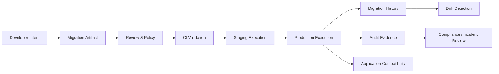
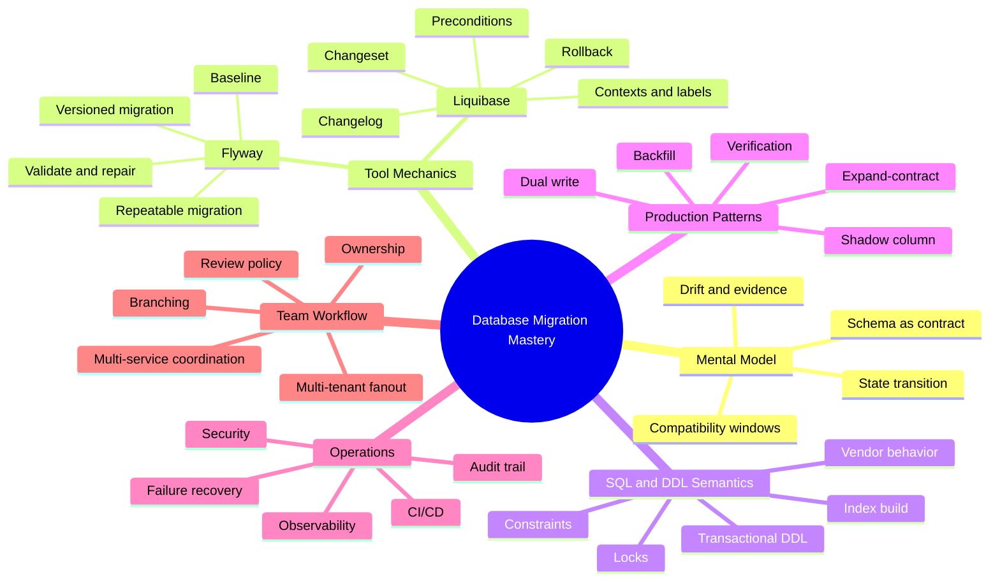
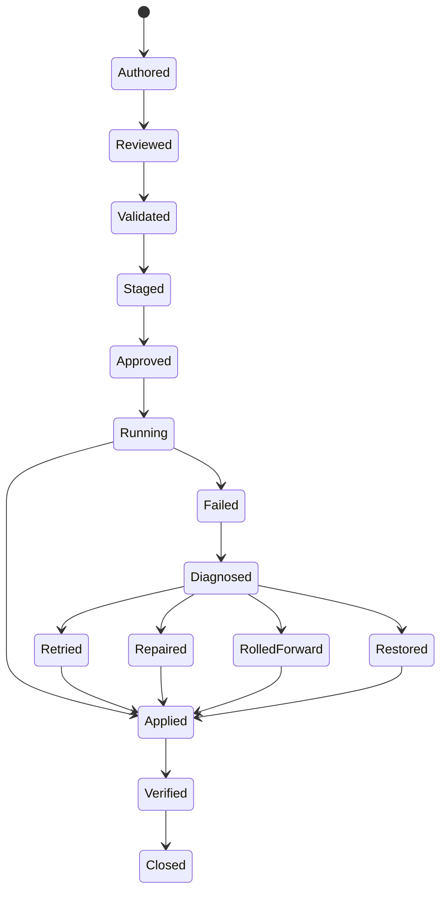
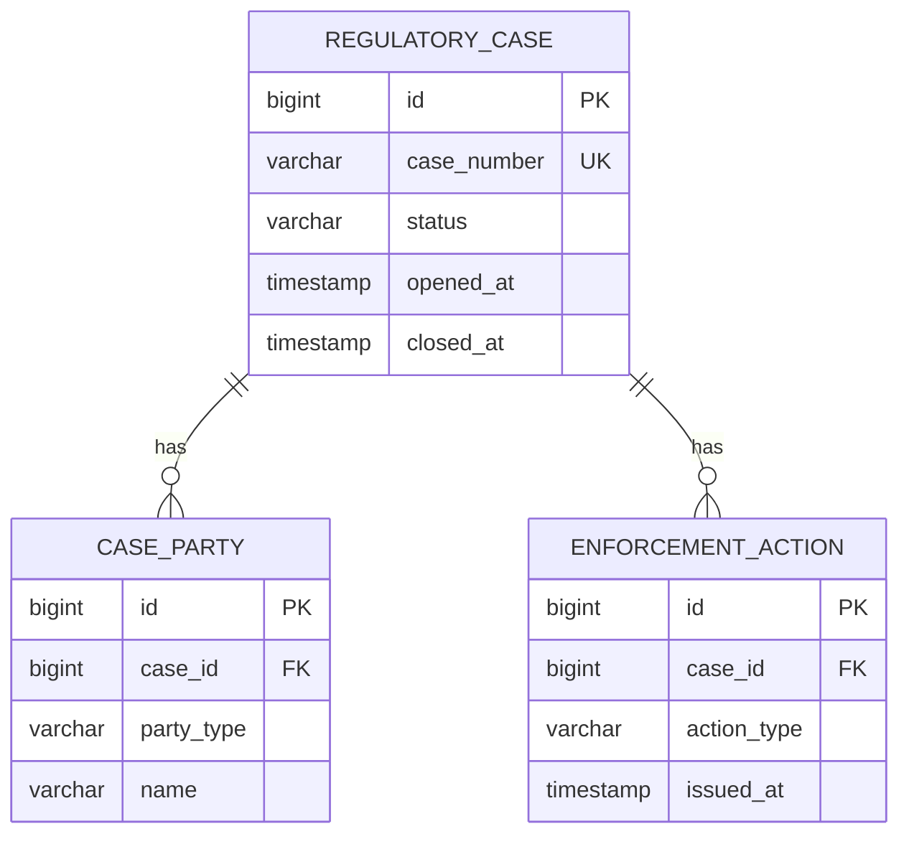

# Part 001 — Kaufman Skill Map: Database Migration sebagai Engineering Skill

Database migration sering terlihat seperti pekerjaan kecil: menambah kolom, membuat index, menjalankan file SQL, lalu deploy. Itu framing yang berbahaya. Dalam sistem production, database migration adalah **rekayasa perubahan state yang persistent, shared, irreversible secara praktis, dan sering berada di jalur kritis bisnis**.

Seri ini tidak akan memperlakukan Flyway dan Liquibase sebagai sekadar tool CLI. Kita akan memperlakukannya sebagai bagian dari sistem perubahan yang lebih besar:



Tujuan Part 001 adalah membuat peta belajar. Bukan sekadar daftar topik, tetapi **peta skill**: apa yang harus bisa Anda lakukan, mental model apa yang harus dibentuk, jebakan apa yang harus dihindari, dan latihan apa yang membuat kemampuan ini naik kelas.

---

## 1. Prinsip Kaufman yang Dipakai di Seri Ini

Framework Josh Kaufman dalam *The First 20 Hours* berguna karena ia memaksa kita memecah skill besar menjadi bagian kecil yang bisa dilatih. Untuk database migration, pendekatan ini lebih efektif daripada membaca dokumentasi tool secara linear.

Kita akan memakai empat langkah praktis:

1. **Deconstruct the skill** — pecah database migration menjadi sub-skill yang bisa diuji.
2. **Learn enough to self-correct** — pelajari cukup teori agar bisa mendeteksi kesalahan desain migration sendiri.
3. **Remove practice barriers** — siapkan environment latihan yang murah, cepat, dan aman.
4. **Practice deliberately** — latihan dengan skenario failure, bukan hanya happy path.

Database migration tidak bisa dikuasai hanya dengan menghafal command seperti `flyway migrate` atau `liquibase update`. Kemampuan utamanya adalah **membaca konsekuensi perubahan database sebelum perubahan itu menyentuh production**.

---

## 2. Skill yang Sebenarnya Dipelajari

Core question seri ini:

> Bagaimana merancang, mengeksekusi, mengaudit, dan memulihkan perubahan database secara aman dalam sistem Java production yang terus berkembang?

Yang dipelajari bukan hanya:

- cara membuat file `V001__init.sql`;
- cara menulis `changeset`;
- cara menjalankan migration saat startup Spring Boot;
- cara menambah kolom.

Yang benar-benar dipelajari adalah:

- bagaimana database berubah sebagai state machine;
- bagaimana schema menjadi contract antar versi aplikasi;
- bagaimana migration history menjadi ledger teknis dan audit;
- bagaimana menghindari drift antar environment;
- bagaimana mengubah schema tanpa downtime;
- bagaimana mengelola migration saat ada banyak branch, service, tenant, dan pipeline;
- bagaimana recovery saat migration gagal di tengah jalan;
- bagaimana membuat perubahan database dapat dipertanggungjawabkan.

---

## 3. Batasan terhadap Seri yang Sudah Selesai

Agar efisien, seri ini **tidak mengulang** materi yang sudah masuk di seri sebelumnya:

- SQL dasar dan JDBC lifecycle;
- connection pooling;
- transaction management dasar;
- ORM mapping dasar;
- JPA/Hibernate dirty checking;
- MyBatis mapper design;
- Java type system;
- generic design pattern;
- REST/JAX-RS/Jersey deployment;
- messaging/event streaming.

Namun seri ini akan menyentuh beberapa topik tersebut hanya dari sudut database migration, misalnya:

- bukan “apa itu transaction”, tetapi **apakah DDL migration ini benar-benar transactional di database target**;
- bukan “apa itu index”, tetapi **bagaimana membuat index pada tabel besar tanpa menghentikan writer**;
- bukan “apa itu JPA auto-ddl”, tetapi **kenapa `ddl-auto=update` bukan strategi migration production**;
- bukan “apa itu CI/CD”, tetapi **bagaimana pipeline memverifikasi migration sebelum production**.

---

## 4. One-Sentence Mental Model

Sebelum masuk detail tool, pegang kalimat ini:

> Database migration adalah proses mengubah persistent state dan contract data secara terurut, terlacak, dapat diverifikasi, kompatibel dengan aplikasi, dan aman terhadap kegagalan.

Kalimat ini sengaja padat. Kita pecah:

| Frasa | Makna Engineering |
|---|---|
| `persistent state` | Kesalahan tidak hilang ketika process restart. Data sudah berubah. |
| `contract data` | Aplikasi, report, batch job, BI, dan integrasi mungkin bergantung pada schema. |
| `terurut` | Perubahan harus punya ordering yang deterministic. |
| `terlacak` | Harus ada ledger: apa yang sudah dijalankan, kapan, oleh siapa/apa, dan hasilnya. |
| `dapat diverifikasi` | Harus bisa dibuktikan bahwa state database sesuai ekspektasi. |
| `kompatibel` | Deployment rolling harus aman terhadap versi aplikasi lama dan baru. |
| `aman terhadap kegagalan` | Harus ada recovery path: roll-forward, rollback terbatas, repair, restore, atau manual intervention. |

Top 1% engineer tidak melihat migration sebagai “file SQL”. Mereka melihatnya sebagai **state transition dengan blast radius**.

---

## 5. Skill Decomposition

Berikut dekomposisi skill database migration yang akan dipakai sepanjang seri.



Kita tidak mulai dari Flyway atau Liquibase karena tool hanya masuk akal setelah mental modelnya jelas. Tanpa mental model, tool justru memberi rasa aman palsu.

---

## 6. Target Kemampuan Akhir

Setelah seri selesai, Anda seharusnya mampu melakukan hal berikut.

### 6.1 Design Capability

Anda mampu membaca kebutuhan seperti:

> Tambahkan field `case_priority` ke sistem case management, isi dari rule lama, jadikan mandatory, dan pastikan service lama tidak rusak selama rolling deploy.

Lalu mengubahnya menjadi rencana migration:

1. tambah kolom nullable;
2. deploy app yang bisa membaca default jika null;
3. backfill data lama secara chunked;
4. tambahkan constraint setelah data valid;
5. deploy app yang menganggap field mandatory;
6. hapus fallback lama setelah compatibility window selesai.

### 6.2 Tooling Capability

Anda mampu memilih dan mengoperasikan:

- Flyway untuk SQL-first ordered migration;
- Liquibase untuk changeset-driven migration dengan metadata kaya;
- Java API/plugin Maven/Gradle/Spring Boot integration;
- CI validation terhadap database ephemeral;
- migration history inspection;
- checksum mismatch handling;
- baseline existing database;
- repair dengan guardrail.

### 6.3 Operational Capability

Anda mampu menjawab pertanyaan production seperti:

- Migration ini akan mengambil lock apa?
- Berapa lama lock bisa bertahan?
- Apakah aman saat aplikasi versi lama masih berjalan?
- Apa yang terjadi jika node app A sudah deploy tapi node app B belum?
- Apa evidence bahwa migration berhasil?
- Apa langkah jika migration gagal setelah membuat satu index tapi sebelum update metadata?
- Apakah rollback realistis atau harus roll-forward?

### 6.4 Governance Capability

Anda mampu membuat aturan organisasi:

- siapa boleh approve migration destructive;
- kapan DBA review wajib;
- bagaimana emergency hotfix dicatat;
- bagaimana schema drift dideteksi;
- bagaimana migration masuk release evidence;
- bagaimana production credential dibatasi;
- bagaimana audit menjawab “siapa mengubah apa dan kenapa”.

---

## 7. Invariant Dasar Database Migration

Invariant adalah aturan yang tidak boleh dilanggar. Ini lebih penting daripada template.

### Invariant 1 — Applied Migration Is Immutable

Jika migration sudah pernah diterapkan ke shared environment, jangan ubah file lama.

Alasannya:

- environment lain mungkin sudah menyimpan checksum lama;
- production history menjadi tidak cocok dengan source control;
- rollback/replay menjadi ambigu;
- audit trail kehilangan integritas.

Solusi normal: buat migration baru yang memperbaiki state.

```text
Salah:
V012__add_case_deadline.sql   # sudah applied, lalu diedit

Benar:
V013__fix_case_deadline_default.sql
```

### Invariant 2 — Database State Must Be Explainable from History

Database production harus bisa dijelaskan dari:

1. base schema;
2. urutan migration;
3. migration history table;
4. deployment evidence;
5. exceptional manual change log bila ada.

Jika ada objek database yang tidak bisa dijelaskan, itu drift.

### Invariant 3 — Migration Must Be Deterministic Enough

Migration harus menghasilkan state yang sama ketika dijalankan pada input state yang sama.

Contoh tidak deterministic:

```sql
INSERT INTO approval_policy(id, name, created_at)
VALUES (gen_random_uuid(), 'DEFAULT', now());
```

Ini mungkin sah untuk data business tertentu, tetapi buruk untuk reference data yang harus konsisten antar environment.

Lebih baik:

```sql
INSERT INTO approval_policy(id, code, name, created_at)
VALUES ('00000000-0000-0000-0000-000000000001', 'DEFAULT', 'Default Policy', TIMESTAMP '2026-01-01 00:00:00')
ON CONFLICT (code) DO NOTHING;
```

### Invariant 4 — Schema Change Must Respect Application Compatibility

Migration tidak boleh hanya benar terhadap database; migration harus benar terhadap **versi aplikasi yang sedang dan akan berjalan**.

Rolling deployment membuat kondisi seperti ini normal:

| Waktu | Database | App Node A | App Node B |
|---|---|---|---|
| T0 | schema v10 | app v10 | app v10 |
| T1 | schema v11 | app v10 | app v10 |
| T2 | schema v11 | app v11 | app v10 |
| T3 | schema v11 | app v11 | app v11 |

Migration yang langsung menghapus kolom yang masih dibaca app v10 akan gagal di T1/T2.

### Invariant 5 — Recovery Path Must Exist Before Production

Sebelum production, jawab satu pertanyaan:

> Jika migration gagal di tengah jalan, apa tindakan yang paling aman?

Pilihan recovery biasanya:

- retry;
- repair metadata;
- roll-forward dengan migration baru;
- rollback terbatas;
- restore backup;
- pause traffic;
- manual intervention dengan runbook.

Tidak semua migration bisa rollback. Banyak migration data justru lebih aman diselesaikan dengan roll-forward.

---

## 8. Database Migration sebagai State Machine

Migration dapat dipahami sebagai state machine.



Perhatikan bahwa `Failed` bukan akhir. Kualitas engineering terlihat dari transisi setelah failure.

Migration yang tidak punya state model biasanya berakhir dengan respons panik:

- edit file lama;
- hapus row dari history table;
- run SQL manual tanpa catatan;
- disable validation;
- restart aplikasi berulang-ulang;
- menyalahkan tool.

Seri ini akan melatih kebalikannya: failure dianggap normal, sehingga recovery path disiapkan sejak awal.

---

## 9. Flyway dan Liquibase dalam Skill Map

### 9.1 Flyway dalam Satu Kalimat

Flyway cocok dipahami sebagai tool migration **ordered, SQL-first, history-table-driven**. Unit utamanya adalah migration file, biasanya versioned migration yang dijalankan sekali, plus repeatable migration untuk objek yang definisinya dapat diganti ulang seperti view, function, procedure, atau reference data tertentu.

Contoh naming Flyway:

```text
V001__create_case_table.sql
V002__add_case_deadline.sql
V003__create_case_priority_index.sql
R__case_summary_view.sql
```

### 9.2 Liquibase dalam Satu Kalimat

Liquibase cocok dipahami sebagai tool migration **changelog-driven, changeset-oriented, metadata-rich**. Unit utamanya adalah `changeset`, yang punya identitas dari `id`, `author`, dan path changelog. Liquibase dapat memakai SQL, XML, YAML, atau JSON.

Contoh formatted SQL Liquibase:

```sql
--liquibase formatted sql

--changeset platform-team:001-create-case-table
CREATE TABLE regulatory_case (
    id BIGINT PRIMARY KEY,
    case_number VARCHAR(64) NOT NULL,
    status VARCHAR(32) NOT NULL
);
```

### 9.3 Tool Tidak Menghapus Tanggung Jawab Engineering

Flyway dan Liquibase membantu:

- tracking apa yang sudah jalan;
- ordering change;
- checksum validation;
- integrasi CI/CD;
- repeatability;
- baseline;
- audit metadata.

Namun tool tidak otomatis menjamin:

- migration tidak blocking;
- migration kompatibel dengan rolling deploy;
- data backfill aman;
- rollback realistis;
- script deterministic;
- branch strategy sehat;
- production credential aman.

Tool memberi mekanisme. Engineer memberi judgment.

---

## 10. 20-Hour Practice Plan versi Kaufman

Rencana ini bukan berarti Anda menjadi expert penuh dalam 20 jam. Artinya, setelah 20 jam latihan terarah, Anda cukup punya mental model dan feedback loop untuk berkembang cepat.

### Hour 0–2 — Build the Sandbox

Siapkan minimal:

- Java 21 atau Java LTS yang dipakai tim;
- Maven atau Gradle;
- Docker;
- PostgreSQL via Docker Compose;
- satu aplikasi Spring Boot kecil;
- Flyway dependency;
- Liquibase dependency di branch terpisah;
- Testcontainers untuk integration test.

Target latihan:

- migration bisa dijalankan dari fresh database;
- migration bisa dijalankan ulang tanpa pending change;
- migration history bisa dibaca;
- failure bisa direproduksi lokal.

### Hour 2–5 — Versioned Migration Basics

Latih:

- create table;
- add column;
- add index;
- insert reference data;
- lihat history table;
- ubah file lama untuk memicu checksum mismatch;
- perbaiki dengan migration baru, bukan edit lama.

Feedback loop:

```text
write migration -> run -> inspect database -> inspect history -> modify wrongly -> observe validation failure -> fix correctly
```

### Hour 5–8 — Compatibility and Expand/Contract

Latih perubahan yang membutuhkan dua versi aplikasi:

1. app v1 membaca `status`;
2. migration menambah `status_v2` nullable;
3. app v2 dual-write `status` dan `status_v2`;
4. backfill;
5. app v3 baca `status_v2`;
6. migration contract menghapus `status` setelah window selesai.

Ini latihan paling penting karena mirip production.

### Hour 8–11 — Failure and Recovery

Buat failure sengaja:

- syntax error di migration;
- duplicate object;
- long-running lock;
- checksum mismatch;
- migration partial pada database yang DDL-nya tidak transactional;
- migration berhasil di dev tapi gagal di staging karena data kotor.

Tujuannya bukan sekadar memperbaiki. Tujuannya membangun refleks diagnosis.

### Hour 11–14 — Data Migration

Latih backfill:

- 10 ribu row;
- 1 juta row sintetis;
- batch update;
- checkpoint table;
- resumable job;
- verification query;
- throttling.

Database migration yang sulit biasanya bukan DDL, tetapi DML pada data besar.

### Hour 14–17 — CI/CD and Review Gate

Bangun pipeline lokal:

- spin up database ephemeral;
- apply all migrations from scratch;
- run integration tests;
- generate migration report;
- reject changed applied migration;
- run simple SQL linting;
- run compatibility test.

### Hour 17–20 — Capstone Drill

Skenario:

> Sistem case management punya tabel `regulatory_case`. Anda perlu menambahkan SLA deadline, mengisi data dari policy lama, membuat kolom mandatory, membuat index untuk query overdue case, dan menjaga rolling deploy aman.

Deliverable:

- migration plan;
- Flyway implementation;
- Liquibase implementation;
- review checklist;
- failure playbook;
- verification query;
- rollback/roll-forward decision.

---

## 11. Practice Domain yang Dipakai di Seri Ini

Kita akan memakai domain kecil tapi realistis: **regulatory case management**.

Entitas awal:



Kenapa domain ini bagus untuk latihan?

- punya lifecycle;
- punya status;
- punya audit implication;
- punya reference data;
- punya SLA/deadline;
- punya relasi antar tabel;
- punya kebutuhan reporting;
- punya risiko regulatory defensibility.

Contoh masalah migration:

- menambah status baru;
- split status menjadi state dan substate;
- menambah deadline mandatory;
- rename field untuk compliance wording;
- memperbaiki data historis;
- membuat index untuk dashboard overdue;
- membuat view untuk audit report;
- menghapus kolom lama setelah rolling deploy.

---

## 12. Learning Loop: Cara Membaca Setiap Part

Setiap part selanjutnya akan mengikuti pola:

1. **Problem** — masalah nyata yang ingin diselesaikan.
2. **Mental model** — cara berpikir yang benar.
3. **Mechanics** — cara tool/database bekerja.
4. **Pattern** — bentuk solusi yang reusable.
5. **Anti-pattern** — jebakan umum.
6. **Failure mode** — apa yang rusak di production.
7. **Review checklist** — cara mengevaluasi desain.
8. **Exercise** — latihan kecil yang bisa dijalankan.

Ini sengaja dibuat seperti engineering handbook, bukan tutorial linear.

---

## 13. Anti-Pattern Awal yang Harus Dihentikan Sejak Part 001

### 13.1 Treating Migration as Startup Side Effect

Menjalankan migration otomatis saat aplikasi startup bisa praktis untuk sistem kecil. Namun pada sistem production besar, ini berisiko:

- banyak node mencoba migration bersamaan;
- startup readiness tergantung DDL lock;
- failure migration menjadi failure aplikasi;
- deployment rollback tidak otomatis rollback database;
- observability migration bercampur dengan observability app.

Bukan berarti startup migration selalu salah. Artinya, ia butuh boundary dan keputusan sadar.

### 13.2 ORM Auto-DDL in Production

`ddl-auto=update` terlihat nyaman karena schema mengikuti entity. Tetapi production schema evolution butuh:

- review;
- ordering;
- audit;
- compatibility;
- rollback/roll-forward decision;
- data migration;
- lock analysis.

ORM auto-DDL tidak dirancang sebagai governance-grade migration workflow.

### 13.3 Manual SQL Without Ledger

Manual SQL di production kadang tidak terhindarkan saat incident. Anti-pattern-nya bukan “manual SQL pernah terjadi”, tetapi **manual SQL tidak dicatat dan tidak direkonsiliasi ke source control**.

Aturan sehat:

```text
Every production database change must eventually become explainable from the migration ledger.
```

### 13.4 Giant Migration

Satu file yang melakukan semua ini sekaligus buruk:

- create table;
- migrate jutaan row;
- rename column;
- drop old column;
- create index;
- update reference data;
- cleanup;
- change constraints.

Giant migration sulit review, sulit retry, sulit isolate failure, dan sulit rollback.

### 13.5 Rollback Fantasy

Banyak tim menulis “rollback plan: run down migration”. Itu sering palsu.

Contoh: jika migration menghapus kolom dan data sudah hilang, rollback DDL tidak mengembalikan makna data. Untuk production, sering kali strategi yang lebih aman adalah **roll-forward**.

---

## 14. Migration Review Checklist Level 0

Sebelum menulis tool-specific checklist, gunakan checklist dasar ini.

### Intent

- Apa tujuan bisnis/teknis perubahan ini?
- Apakah perubahan ini schema-only, data-only, atau kombinasi?
- Apakah ada perubahan contract dengan aplikasi/report/job lain?

### Ordering

- Apakah migration ini bergantung pada migration sebelumnya?
- Apakah aman jika ada branch lain yang merge bersamaan?
- Apakah naming/versioning deterministic?

### Compatibility

- Apakah app versi lama masih bisa berjalan setelah migration?
- Apakah app versi baru bisa berjalan sebelum semua node upgrade?
- Apakah ada consumer eksternal yang membaca schema lama?

### Data

- Berapa row terdampak?
- Apakah data lama bersih?
- Apakah backfill perlu batch?
- Apakah ada verification query?

### Lock and Performance

- Apakah DDL mengambil lock blocking?
- Apakah index build online/concurrent?
- Apakah migration bisa melebihi deployment window?
- Apakah transaction log/WAL/binlog akan membengkak?

### Recovery

- Jika gagal sebelum mulai, apa tindakan?
- Jika gagal di tengah, apa tindakan?
- Jika berhasil tapi aplikasi error, apa tindakan?
- Apakah rollback realistis atau roll-forward lebih aman?

### Evidence

- Bagaimana membuktikan migration berhasil?
- Di mana migration history tersimpan?
- Apakah ada release note/audit note?
- Apakah manual exception dicatat?

---

## 15. Skill Rubric

Gunakan rubric berikut untuk menilai level Anda.

### Level 1 — Script Runner

Ciri:

- bisa menulis migration sederhana;
- tahu command dasar;
- belum paham checksum/drift;
- belum memikirkan rolling deploy;
- menganggap rollback selalu tersedia.

### Level 2 — Tool User

Ciri:

- paham versioned migration dan changeset;
- tahu history table;
- tahu kenapa file lama tidak boleh diedit;
- bisa setup Spring Boot integration;
- masih lemah di large table dan failure recovery.

### Level 3 — Production Practitioner

Ciri:

- bisa merancang expand/contract;
- bisa membuat migration backward-compatible;
- bisa test dari fresh database dan existing snapshot;
- bisa menangani checksum mismatch dengan benar;
- bisa membuat runbook failure.

### Level 4 — Platform Engineer

Ciri:

- membuat policy CI/CD migration;
- mendesain governance dan audit trail;
- mendukung multi-service dan multi-tenant migration;
- membuat tooling drift detection;
- membuat review standard untuk organisasi.

### Level 5 — Principal-Level Operator

Ciri:

- bisa membaca risiko migration dari business architecture;
- bisa menentukan kapan schema change harus dipecah menjadi release train;
- bisa mengarahkan incident recovery tanpa merusak auditability;
- bisa mendesain migration strategy lintas database, region, tenant, dan compliance regime.

Target seri ini: membawa Anda minimal ke Level 3 kuat, dengan fondasi Level 4.

---

## 16. Minimal Sandbox Structure

Struktur latihan yang akan kita pakai:

```text
learn-java-database-migrations/
  pom.xml
  docker-compose.yml
  src/
    main/
      java/
        com/example/migrationdemo/
          MigrationDemoApplication.java
          caseapp/
            RegulatoryCase.java
            RegulatoryCaseRepository.java
            RegulatoryCaseService.java
      resources/
        application.yml
        db/
          migration/
            V001__create_regulatory_case.sql
            V002__add_case_party.sql
            R__case_summary_view.sql
        db-liquibase/
          changelog-root.yaml
          changes/001-create-regulatory-case.sql
    test/
      java/
        com/example/migrationdemo/
          MigrationSmokeTest.java
```

Untuk seri ini, struktur tersebut hanya referensi. Kita akan mendalami bentuk finalnya di Part 010 dan Part 021.

---

## 17. Contoh Mini: Migration yang Benar Secara Syntax tapi Salah Secara Production

Misalnya ada requirement:

> Tambahkan `deadline_at` ke `regulatory_case`, wajib terisi.

Migration naïve:

```sql
ALTER TABLE regulatory_case
ADD COLUMN deadline_at TIMESTAMP NOT NULL;
```

Masalah:

- gagal jika tabel sudah punya row;
- app lama belum mengisi kolom baru;
- lock bisa blocking;
- tidak ada backfill rule;
- tidak ada compatibility window;
- tidak ada verification.

Versi production-aware:

```sql
-- Step 1: additive and backward-compatible
ALTER TABLE regulatory_case
ADD COLUMN deadline_at TIMESTAMP NULL;
```

Lalu:

```sql
-- Step 2: backfill using deterministic policy
UPDATE regulatory_case
SET deadline_at = opened_at + INTERVAL '30 days'
WHERE deadline_at IS NULL;
```

Lalu setelah app sudah menulis field baru dan data valid:

```sql
-- Step 3: tighten constraint
ALTER TABLE regulatory_case
ALTER COLUMN deadline_at SET NOT NULL;
```

Di production besar, Step 2 mungkin tidak boleh satu `UPDATE` besar; perlu batching. Poinnya: migration bukan hanya syntax, tetapi sequence aman.

---

## 18. Bagaimana Seri Ini Akan Mengajarkan Flyway vs Liquibase

Kita tidak akan fanatik tool. Kita akan memakai decision frame:

| Pertanyaan | Flyway Bias | Liquibase Bias |
|---|---|---|
| Tim nyaman review SQL mentah? | Kuat | Bisa, dengan formatted SQL |
| Butuh changelog declarative multi-format? | Lemah | Kuat |
| Butuh rollback metadata built-in? | Terbatas/edition-dependent | Lebih eksplisit |
| Butuh simple ordered migration? | Sangat kuat | Kuat tapi lebih banyak konsep |
| Butuh diff/snapshot workflow? | Bukan fokus utama | Lebih natural |
| DBA ingin SQL final jelas? | Sangat kuat | Tergantung format |
| Multi-vendor portability penting? | Manual via SQL/vendor folder | Lebih banyak abstraction, tetap perlu hati-hati |

Kesimpulan awal:

- Flyway unggul saat organisasi memilih **SQL sebagai contract utama**.
- Liquibase unggul saat organisasi butuh **metadata, conditional execution, rollback model, dan changelog abstraction**.
- Keduanya bisa gagal jika migration strategy buruk.

---

## 19. Latihan Part 001

### Exercise 1 — Write Your Migration Philosophy

Tulis satu halaman internal note:

```text
Database migration di tim kami harus memenuhi invariant berikut...
```

Minimal masukkan:

- immutable applied migration;
- backward compatibility;
- migration history as ledger;
- roll-forward preference;
- drift detection;
- approval rule untuk destructive changes.

### Exercise 2 — Identify Existing Anti-Patterns

Lihat project Java Anda saat ini. Cari:

- `schema.sql` dan `data.sql` yang masih dipakai di luar test;
- `hibernate.ddl-auto=update`;
- migration lama yang pernah diedit;
- manual SQL folder di luar migration tool;
- migration yang menggabungkan DDL dan backfill besar;
- migration tanpa verification query.

### Exercise 3 — Build a Failure Habit

Ambil satu migration sederhana. Sengaja rusakkan. Lihat:

- bagaimana tool menyimpan failure;
- apa isi history table;
- apa yang terjadi saat rerun;
- bagaimana memperbaiki tanpa menghapus evidence.

---

## 20. Summary

Database migration adalah skill engineering besar karena ia menyentuh state yang persistent, shared, dan sulit dikembalikan. Framework Kaufman membantu kita belajar cepat dengan memecah skill menjadi bagian yang bisa dilatih: mental model, tool mechanics, SQL semantics, compatibility, data migration, CI/CD, observability, governance, dan recovery.

Pegangan utama dari Part 001:

- migration adalah state transition, bukan file SQL;
- applied migration harus immutable;
- history table adalah ledger, bukan dekorasi;
- compatibility dengan versi aplikasi sama pentingnya dengan validitas schema;
- recovery path harus dirancang sebelum production;
- Flyway dan Liquibase memberi mekanisme, bukan judgment;
- latihan harus mencakup failure, bukan hanya happy path.

Di Part 002, kita akan membangun mental model lebih formal: **database sebagai kombinasi state, history, intent, dan evidence**.

---

## Official References

- [Redgate Flyway Documentation — Repeatable migrations](https://documentation.red-gate.com/fd/repeatable-migrations-273973335.html)
- [Liquibase Documentation — What is a Changeset?](https://docs.liquibase.com/secure/user-guide-5-1-1/what-is-a-changeset)
- [Liquibase Documentation — calculate-checksum](https://docs.liquibase.com/secure/reference-guide-5-1-1/database-inspection-change-tracking-and-utility-commands/calculate-checksum)
- [Spring Boot Documentation — Database Initialization](https://docs.spring.io/spring-boot/how-to/data-initialization.html)
