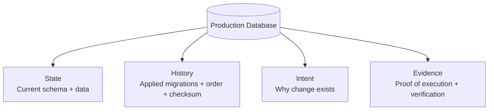
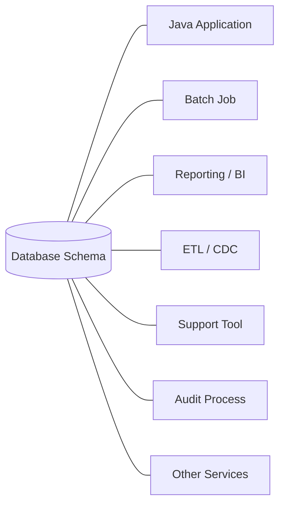
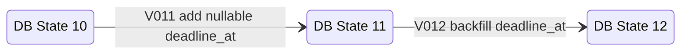
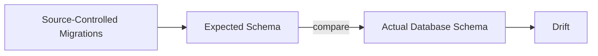
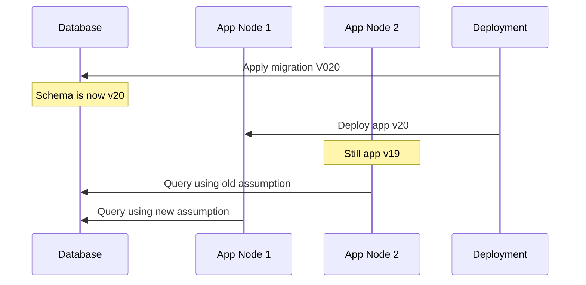
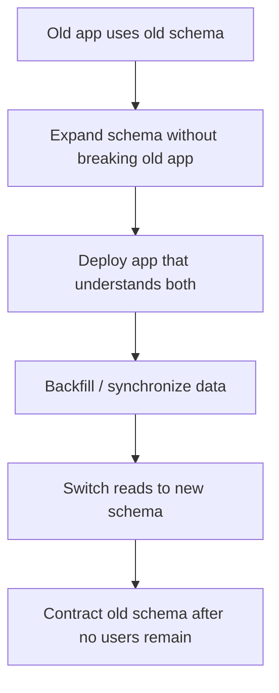
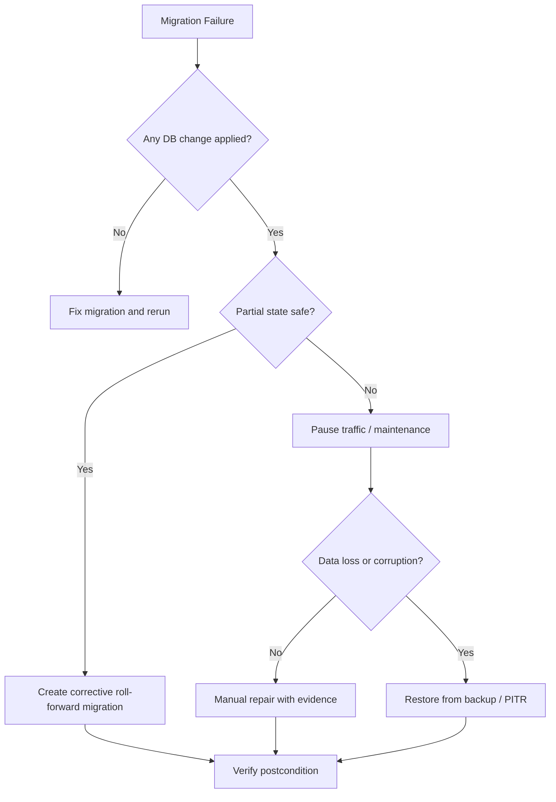
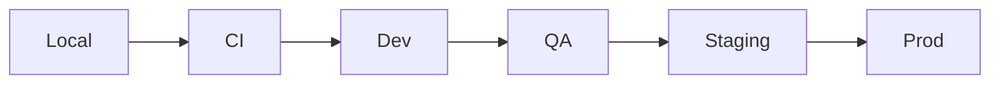
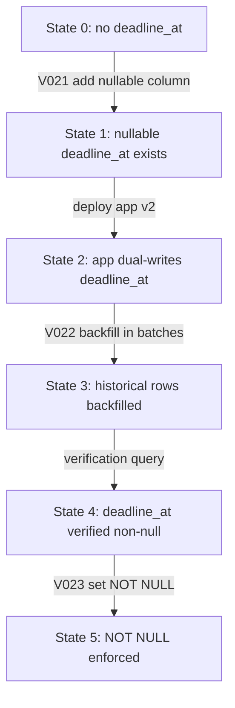

# Part 002 — Mental Model Evolusi Database: State, History, Intent, Evidence

Part 001 membuat peta skill. Part 002 membangun mental model utama: **database migration adalah state transition yang harus bisa dijelaskan dari history, intent, dan evidence**.

Tanpa mental model ini, migration mudah turun derajat menjadi sekadar file SQL. Dengan mental model ini, Anda bisa mengevaluasi migration dari sisi architecture, operations, audit, dan failure recovery.

---

## 1. Empat Dimensi Database Evolution

Database production tidak hanya berisi tabel dan data. Untuk keperluan engineering, database memiliki empat dimensi:



### 1.1 State

State adalah kondisi database saat ini:

- tabel;
- kolom;
- index;
- constraint;
- view;
- function;
- trigger;
- sequence;
- data;
- statistics;
- privileges;
- metadata.

State menjawab:

> Apa kondisi database sekarang?

### 1.2 History

History adalah urutan perubahan yang membawa database ke state saat ini:

- migration version;
- changeset identity;
- checksum;
- execution timestamp;
- executor;
- success/failure status;
- execution duration;
- metadata repair bila ada.

History menjawab:

> Bagaimana database sampai ke kondisi ini?

### 1.3 Intent

Intent adalah alasan perubahan:

- requirement bisnis;
- bug fix;
- incident remediation;
- compliance change;
- performance optimization;
- data correction;
- feature rollout;
- cleanup teknis.

Intent menjawab:

> Mengapa perubahan ini ada?

### 1.4 Evidence

Evidence adalah bukti bahwa perubahan benar-benar aman dan berhasil:

- CI result;
- migration dry run output;
- approval record;
- deployment log;
- query verification;
- row count reconciliation;
- dashboard metrics;
- incident/change ticket;
- audit note.

Evidence menjawab:

> Bagaimana kita membuktikan perubahan ini valid?

Top 1% engineer menjaga keempat dimensi ini tetap sinkron.

---

## 2. Database sebagai Stateful Contract

Aplikasi Java biasanya bisa di-deploy ulang, di-scale, atau di-rollback relatif cepat. Database berbeda. Database menyimpan state yang bertahan melewati deployment.

Schema database adalah contract antara banyak pihak:



Karena itu, perubahan schema bisa mematahkan pihak yang tidak terlihat dari repository aplikasi utama.

Contoh:

```sql
ALTER TABLE regulatory_case
DROP COLUMN legacy_status;
```

Secara lokal mungkin aman karena aplikasi baru tidak memakai `legacy_status`. Namun di production, kolom itu mungkin masih dipakai oleh:

- report bulanan;
- export compliance;
- ETL ke data warehouse;
- support dashboard;
- service lama dalam rolling deployment;
- stored procedure yang jarang dieksekusi.

Schema bukan implementation detail murni. Dalam sistem besar, schema adalah **shared operational contract**.

---

## 3. Migration sebagai State Transition

Migration mengubah database dari satu state ke state berikutnya.



Sebuah migration yang baik memiliki properti:

| Properti | Pertanyaan |
|---|---|
| Precondition | State apa yang harus benar sebelum migration jalan? |
| Transition | Perubahan apa yang dilakukan? |
| Postcondition | State apa yang harus benar setelah migration selesai? |
| Compatibility | Versi aplikasi mana yang kompatibel dengan state baru? |
| Evidence | Bagaimana membuktikan postcondition? |
| Recovery | Apa tindakan jika transition gagal? |

Contoh migration yang lebih formal:

```text
Migration: Add case deadline
Precondition:
  - regulatory_case table exists
  - opened_at is not null for all open cases
Transition:
  - add nullable deadline_at
  - later backfill deadline_at from opened_at + SLA policy
Postcondition:
  - column exists
  - new app can write deadline_at
Compatibility:
  - app v1 ignores column
  - app v2 writes column
Recovery:
  - if add column fails, fix DDL and rerun
  - if backfill partially succeeds, resume by WHERE deadline_at IS NULL
Evidence:
  - SELECT count(*) FROM regulatory_case WHERE deadline_at IS NULL AND status <> 'CLOSED'
```

Ini jauh lebih kuat daripada hanya menulis SQL.

---

## 4. State, History, Intent, Evidence dalam Tool

Flyway dan Liquibase menyimpan sebagian history secara otomatis, tetapi bukan semua intent dan evidence.

### 4.1 Flyway Mapping

Flyway biasanya melacak migration di `flyway_schema_history`. Untuk versioned migration, tool menyimpan urutan, versi, deskripsi, checksum, dan status eksekusi. Repeatable migration punya checksum dan dijalankan ulang ketika checksum berubah.

Mapping konseptual:

| Dimensi | Flyway Artifact |
|---|---|
| State | Database target |
| History | `flyway_schema_history` |
| Intent | nama file, SQL comment, PR, ticket |
| Evidence | CI log, deployment log, verification query |

Contoh:

```text
V014__add_case_deadline_column.sql
V015__backfill_case_deadline.sql
V016__enforce_case_deadline_not_null.sql
```

Nama file membantu intent, tetapi tidak cukup. Migration penting tetap perlu comment dan PR context.

### 4.2 Liquibase Mapping

Liquibase melacak changeset di `DATABASECHANGELOG`, menggunakan identitas `id`, `author`, dan file path. Metadata seperti checksum membantu mendeteksi perubahan pada changeset yang sudah diterapkan.

Mapping konseptual:

| Dimensi | Liquibase Artifact |
|---|---|
| State | Database target |
| History | `DATABASECHANGELOG`, `DATABASECHANGELOGLOCK` |
| Intent | changeset id, comment, changelog structure, PR, ticket |
| Evidence | update SQL, operation report, deployment log, verification query |

Contoh formatted SQL:

```sql
--liquibase formatted sql

--changeset case-platform:014-add-case-deadline-column
--comment: Add nullable deadline_at as expand phase for SLA enforcement.
ALTER TABLE regulatory_case ADD COLUMN deadline_at TIMESTAMP NULL;
```

---

## 5. The Ledger Principle

Migration history table harus diperlakukan seperti ledger.

Ledger principle:

> Setiap perubahan database production harus bisa direkonstruksi atau dijelaskan dari source-controlled migration, migration history, dan exception record.

Ledger bukan hanya kebutuhan tool. Ledger adalah kebutuhan debugging, audit, dan incident response.

### 5.1 Apa yang Terjadi Jika Ledger Rusak?

Jika migration history tidak cocok dengan database:

- CI mungkin lulus tetapi production gagal;
- environment staging tidak lagi representatif;
- restore lalu replay migration tidak menghasilkan state yang sama;
- checksum mismatch memblokir deploy;
- audit tidak bisa menjawab asal perubahan;
- engineer mulai melakukan hotfix manual yang makin memperparah drift.

### 5.2 Ledger Smell

Waspadai tanda berikut:

- ada row history yang dihapus manual;
- ada migration lama yang diedit setelah release;
- ada object database yang tidak ada di migration;
- ada migration yang hanya ada di production branch lokal;
- ada `repair` tanpa incident note;
- ada `clear-checksums` tanpa alasan tertulis;
- ada schema berbeda antar environment tanpa explanation.

---

## 6. Schema Drift

Schema drift adalah kondisi ketika database aktual berbeda dari schema yang diharapkan source control/history.



Drift bisa terjadi karena:

- SQL manual di production;
- migration file lama diedit;
- migration dijalankan di satu environment tapi tidak di environment lain;
- hotfix tidak direkonsiliasi;
- tool migration dinonaktifkan;
- branch lama deploy ulang;
- restore database dari backup yang tidak sinkron;
- perbedaan vendor database antara dev dan production.

### 6.1 Drift yang Aman vs Berbahaya

Tidak semua drift sama.

| Drift | Risiko |
|---|---|
| Extra index untuk emergency performance | Medium, perlu reconcile |
| Extra nullable column tidak dipakai | Medium, bisa jadi artifact |
| Missing constraint | High, data integrity lemah |
| Different column type | High, app behavior bisa beda |
| Missing migration history row | Critical, replay/validation rusak |
| Manual data correction tanpa record | Critical untuk audit/compliance |

### 6.2 Drift Handling Rule

Jangan langsung “memperbaiki” drift dengan menghapus bukti.

Urutan sehat:

1. identify drift;
2. classify impact;
3. freeze risky deploy jika perlu;
4. buat reconciliation migration atau exception note;
5. jalankan verification;
6. update audit trail;
7. perbaiki process agar tidak terulang.

---

## 7. Checksums sebagai Integrity Signal

Checksum bukan sekadar error yang mengganggu deploy. Checksum adalah sinyal bahwa artifact migration yang tersimpan sekarang tidak sama dengan artifact yang dulu diterapkan.

### 7.1 Mengapa Checksum Penting?

Misalnya file ini sudah applied:

```sql
-- V010__add_case_priority.sql
ALTER TABLE regulatory_case ADD COLUMN priority VARCHAR(16);
```

Lalu seseorang mengubah file lama:

```sql
-- V010__add_case_priority.sql
ALTER TABLE regulatory_case ADD COLUMN priority VARCHAR(32);
```

Database environment A mungkin sudah punya `VARCHAR(16)`, environment B mungkin fresh dan akan membuat `VARCHAR(32)`. Source control terlihat satu, tetapi state menjadi bercabang.

Checksum mencegah ilusi bahwa semua environment masih sama.

### 7.2 Respons Benar terhadap Checksum Mismatch

Jangan otomatis:

- clear checksum;
- repair;
- edit history table;
- delete migration row.

Respons sehat:

1. cari perubahan file;
2. cari environment mana yang sudah apply versi lama;
3. tentukan state aktual database;
4. jika perubahan belum pernah masuk shared env, mungkin bisa revert/edit;
5. jika sudah masuk shared env, buat migration baru;
6. gunakan repair hanya untuk metadata correction yang jelas dan terdokumentasi.

---

## 8. Application Version vs Database Version

Salah satu sumber kegagalan terbesar adalah asumsi bahwa app dan database berubah atomically. Di production, itu jarang benar.



Karena itu, schema migration harus kompatibel dengan window transisi.

### 8.1 Compatibility Matrix

Sebelum production, buat matrix:

| DB State | App v19 | App v20 | Aman? |
|---|---:|---:|---|
| DB v19 | yes | no/partial | hanya sebelum migration |
| DB v20 expand | yes | yes | ideal rolling window |
| DB v21 contract | no | yes | setelah semua app v19 mati |

Rule:

> Deployment aman jika setiap kombinasi yang mungkin terjadi selama rollout sudah dievaluasi.

### 8.2 Expand/Contract secara Mental Model

Expand/contract bukan pattern hafalan. Ia adalah cara menjaga compatibility matrix tetap valid.



Contoh rename column yang aman:

Jangan:

```sql
ALTER TABLE regulatory_case RENAME COLUMN status TO lifecycle_state;
```

Lebih aman:

1. add `lifecycle_state` nullable;
2. app dual-write `status` dan `lifecycle_state`;
3. backfill;
4. app read `lifecycle_state` with fallback;
5. enforce constraint;
6. remove old read;
7. drop `status` setelah compatibility window.

---

## 9. Migration Types by Risk

Tidak semua migration punya risiko sama.

### 9.1 Low-Risk Usually

Tetap perlu review, tetapi relatif lebih aman:

- add nullable column without default;
- create small lookup table;
- add non-used table;
- create view with no dependency change;
- insert deterministic reference data.

### 9.2 Medium-Risk

Perlu compatibility dan lock review:

- add column with default;
- add index on medium table;
- add foreign key;
- add check constraint;
- backfill moderate data;
- change stored procedure used by app.

### 9.3 High-Risk

Perlu rollout plan serius:

- drop column/table;
- rename column/table;
- change column type;
- add not-null constraint to existing data;
- backfill large table;
- rebuild index on large table;
- split/merge table;
- migrate primary key;
- change enum domain;
- change high-write table under traffic.

### 9.4 Critical-Risk

Biasanya butuh maintenance window, online migration strategy, or special tooling:

- billion-row table rewrite;
- tenant-wide fan-out migration;
- global schema change across many services;
- encryption/key rotation of stored data;
- partitioning rewrite;
- cross-region database migration;
- hotfix during incident.

---

## 10. DDL, DML, and Semantic Change

Migration bisa dibagi menjadi tiga lapisan.

### 10.1 DDL Change

Mengubah struktur:

```sql
ALTER TABLE regulatory_case ADD COLUMN risk_score INTEGER;
```

Risiko utama:

- lock;
- table rewrite;
- compatibility;
- vendor behavior;
- transactional semantics.

### 10.2 DML Change

Mengubah data:

```sql
UPDATE regulatory_case
SET risk_score = 0
WHERE risk_score IS NULL;
```

Risiko utama:

- row lock;
- long transaction;
- WAL/binlog growth;
- replication lag;
- wrong business logic;
- non-resumability.

### 10.3 Semantic Change

Mengubah makna data:

```text
status = 'OPEN' dulu berarti case aktif.
status = 'OPEN' sekarang berarti case aktif dan belum assigned.
```

Risiko utama:

- report salah;
- business rule berubah diam-diam;
- historical interpretation rusak;
- audit defensibility lemah.

Semantic change sering lebih berbahaya daripada DDL.

---

## 11. Intent Encoding

Intent harus terlihat dalam artifact. Nama seperti ini lemah:

```text
V034__update_table.sql
V035__fix.sql
V036__change_column.sql
```

Lebih baik:

```text
V034__add_nullable_deadline_at_to_regulatory_case.sql
V035__backfill_deadline_at_from_sla_policy.sql
V036__enforce_deadline_at_not_null.sql
```

Untuk Liquibase:

```sql
--changeset case-platform:036-enforce-deadline-at-not-null
--comment: Contract phase after app v4.7 writes deadline_at and backfill verification passed.
ALTER TABLE regulatory_case ALTER COLUMN deadline_at SET NOT NULL;
```

Intent bukan hanya dokumentasi. Intent membantu reviewer melihat apakah SQL sesuai tujuan.

---

## 12. Evidence-Driven Migration

Migration yang baik tidak selesai saat command return success. Migration selesai saat postcondition terbukti.

### 12.1 Verification Query

Contoh untuk backfill:

```sql
SELECT COUNT(*) AS missing_deadline
FROM regulatory_case
WHERE status IN ('OPEN', 'UNDER_REVIEW')
  AND deadline_at IS NULL;
```

Expected result:

```text
missing_deadline = 0
```

Contoh untuk duplicate prevention sebelum unique constraint:

```sql
SELECT case_number, COUNT(*)
FROM regulatory_case
GROUP BY case_number
HAVING COUNT(*) > 1;
```

Expected result:

```text
0 rows
```

### 12.2 Evidence Artifact

Untuk perubahan besar, simpan evidence:

```text
Migration: V036__enforce_deadline_at_not_null.sql
Environment: production
Executed at: 2026-06-28T21:00:00+07:00
Verification:
  - missing_deadline = 0
  - app error rate normal
  - p95 case search unchanged
  - no blocked sessions above threshold
Decision:
  - migration closed
```

Ini terdengar formal, tetapi sangat berharga saat audit atau incident review.

---

## 13. Recovery Model

Recovery harus dipilih berdasarkan failure type.



### 13.1 Retry

Cocok jika:

- failure karena transient lock timeout;
- script idempotent/resumable;
- no partial destructive effect;
- tool state mendukung rerun.

### 13.2 Roll-Forward

Cocok jika:

- migration sudah mengubah state;
- mengembalikan state lama lebih berbahaya;
- data tidak hilang;
- corrective migration bisa membawa database ke state valid.

### 13.3 Rollback

Cocok jika:

- rollback sudah diuji;
- perubahan reversible;
- data loss tidak terjadi;
- app compatibility masih aman;
- rollback tidak membuat ledger makin kacau.

### 13.4 Restore

Cocok jika:

- data rusak luas;
- destructive change salah target;
- business tidak bisa menerima data correction manual;
- point-in-time recovery tersedia dan sudah diuji.

Restore adalah opsi mahal karena berdampak pada data yang berubah setelah backup point.

---

## 14. The Migration Object Model

Untuk berpikir lebih rapi, anggap migration sebagai object dengan field berikut:

```text
MigrationChange
  id
  title
  owner
  intent
  riskLevel
  preconditions
  operations
  postconditions
  compatibilityMatrix
  expectedLocks
  dataImpact
  rollbackPlan
  rollForwardPlan
  verificationQueries
  auditEvidence
```

Contoh instance:

```yaml
id: V036
title: Enforce deadline_at not null
owner: case-platform
intent: Make SLA deadline mandatory after backfill and app rollout
riskLevel: medium
preconditions:
  - regulatory_case.deadline_at exists
  - no open/under_review row has null deadline_at
  - app version >= 4.7 writes deadline_at
operations:
  - alter regulatory_case.deadline_at set not null
postconditions:
  - deadline_at is not nullable
compatibilityMatrix:
  app_v46: incompatible
  app_v47: compatible
expectedLocks:
  - table metadata lock during constraint validation
rollbackPlan:
  - alter column drop not null if needed
rollForwardPlan:
  - fix violating writer and re-apply constraint
verificationQueries:
  - count null deadline_at
  - inspect app error rate
auditEvidence:
  - PR link
  - release ticket
  - deployment log
```

Anda tidak harus menulis YAML ini untuk setiap migration kecil. Tetapi untuk migration high-risk, object model seperti ini membuat review jauh lebih matang.

---

## 15. Database Versioning Is Not Application Versioning

Application version biasanya artifact immutable:

```text
case-service:4.7.2
```

Database version lebih kompleks karena:

- database bisa punya manual hotfix;
- migration bisa partial;
- data content berubah terus;
- schema bisa sama tetapi data invariant berbeda;
- tenant bisa berada di versi berbeda;
- read replicas bisa lag;
- region bisa tidak sinkron.

Karena itu, “DB version” sebaiknya dipahami sebagai kombinasi:

```text
DB Version = Applied Migration Set + Actual Schema + Data Invariants + Operational Metadata
```

History table hanya salah satu komponen.

---

## 16. Multi-Environment Reality

Migration harus berjalan di banyak environment:



Namun tiap environment bisa berbeda:

| Environment | Problem Umum |
|---|---|
| Local | sering reset, data kecil |
| CI | ephemeral, fresh database |
| Dev | banyak eksperimen manual |
| QA | data sintetis tidak realistis |
| Staging | mendekati prod tapi tidak selalu punya volume sama |
| Prod | data nyata, traffic nyata, audit nyata |

Migration yang lulus di CI fresh database belum tentu aman di production existing database.

### 16.1 Fresh-Database Test vs Existing-Database Test

Fresh database test menjawab:

> Apakah semua migration dari nol bisa membangun schema valid?

Existing database test menjawab:

> Apakah migration baru aman diterapkan ke state yang mirip production?

Keduanya penting.

---

## 17. Migration and Deployment Coupling

Ada tiga strategi umum.

### 17.1 Migration Before App Deploy

```text
migrate DB -> deploy app
```

Cocok untuk expand phase.

Risiko:

- app lama harus kompatibel dengan DB baru;
- migration failure menghentikan deploy;
- perubahan destructive tidak aman.

### 17.2 Migration During App Startup

```text
start app -> app runs migration -> app ready
```

Cocok untuk sistem kecil atau internal tool dengan satu instance.

Risiko:

- multi-node race;
- startup blocked by lock;
- migration failure menjadi app outage;
- deployment platform mungkin restart loop.

### 17.3 Migration as Separate Pipeline Step

```text
build -> validate migration -> run migration job -> deploy app -> verify
```

Cocok untuk sistem production besar.

Kelebihan:

- observability terpisah;
- permission bisa dipisah;
- approval gate lebih jelas;
- failure handling lebih terkendali.

Kekurangan:

- pipeline lebih kompleks;
- perlu koordinasi release;
- butuh discipline compatibility.

---

## 18. Failure Modes yang Harus Ada di Kepala

### 18.1 Syntax Failure

Script gagal parse.

Biasanya aman jika belum ada perubahan. Namun jika database melakukan implicit commit pada DDL sebelumnya, state bisa partial.

### 18.2 Semantic Failure

Script jalan, tetapi makna salah.

Contoh:

```sql
UPDATE regulatory_case
SET deadline_at = opened_at + INTERVAL '30 days';
```

Ternyata beberapa case punya SLA 7 hari berdasarkan risk level. Migration sukses secara teknis tetapi salah secara bisnis.

### 18.3 Lock Failure

Migration menunggu lock terlalu lama atau memblokir traffic.

Dampak:

- request timeout;
- deadlock;
- queue buildup;
- deployment timeout;
- connection pool exhausted.

### 18.4 Data Volume Failure

Migration aman di 1.000 row, gagal di 500 juta row.

Gejala:

- transaction log membesar;
- replication lag;
- disk pressure;
- autovacuum/vacuum pressure;
- long-running transaction;
- lock duration panjang.

### 18.5 Compatibility Failure

DB berubah lebih cepat daripada app.

Contoh:

- kolom dihapus saat app lama masih query;
- NOT NULL ditambahkan saat app lama belum mengisi;
- enum value baru membuat parser lama error;
- constraint baru menolak write dari old code path.

### 18.6 Ledger Failure

Tool history tidak cocok dengan actual state.

Gejala:

- checksum mismatch;
- migration missing;
- row history diedit manual;
- branch deploy membuat ordering aneh;
- staging dan prod punya applied set berbeda.

---

## 19. Review Heuristic: Ask What Can Be False

Saat review migration, jangan hanya tanya “apakah SQL valid?”. Tanya:

- bagaimana jika tabel sudah punya data buruk?
- bagaimana jika migration jalan dua kali?
- bagaimana jika app lama masih running?
- bagaimana jika ada long transaction saat DDL?
- bagaimana jika backfill berhenti di tengah?
- bagaimana jika tenant ke-217 gagal?
- bagaimana jika report lama masih memakai kolom ini?
- bagaimana jika checksum mismatch di staging?
- bagaimana jika restore dari backup minggu lalu lalu migration replay?

Pertanyaan “what can be false?” adalah skill inti.

---

## 20. Worked Example: SLA Deadline Evolution

Requirement:

> Semua open regulatory case harus punya `deadline_at`. Deadline dihitung dari `opened_at` + SLA berdasarkan priority. Ke depan, aplikasi wajib mengisi deadline saat case dibuat.

### 20.1 Naïve Migration

```sql
ALTER TABLE regulatory_case
ADD COLUMN deadline_at TIMESTAMP NOT NULL;
```

Ini buruk karena:

- existing rows melanggar NOT NULL;
- app lama belum menulis field;
- tidak ada data derivation rule;
- tidak ada verification;
- tidak aman untuk rolling deployment.

### 20.2 State Transition Plan



### 20.3 Flyway Sketch

```text
V021__add_nullable_deadline_at_to_regulatory_case.sql
V022__backfill_deadline_at_from_priority_sla.sql
V023__enforce_deadline_at_not_null.sql
```

### 20.4 Liquibase Sketch

```sql
--liquibase formatted sql

--changeset case-platform:021-add-nullable-deadline-at
ALTER TABLE regulatory_case ADD COLUMN deadline_at TIMESTAMP NULL;

--changeset case-platform:022-backfill-deadline-at
UPDATE regulatory_case
SET deadline_at = CASE
    WHEN priority = 'HIGH' THEN opened_at + INTERVAL '7 days'
    WHEN priority = 'MEDIUM' THEN opened_at + INTERVAL '14 days'
    ELSE opened_at + INTERVAL '30 days'
END
WHERE deadline_at IS NULL;

--changeset case-platform:023-enforce-deadline-at-not-null
ALTER TABLE regulatory_case ALTER COLUMN deadline_at SET NOT NULL;
```

Catatan: untuk tabel besar, `022` sebaiknya bukan single huge update. Kita akan bahas batch/resumable backfill di Part 023.

### 20.5 Verification

```sql
SELECT COUNT(*) AS missing_deadline
FROM regulatory_case
WHERE status IN ('OPEN', 'UNDER_REVIEW')
  AND deadline_at IS NULL;
```

Expected:

```text
missing_deadline = 0
```

### 20.6 Compatibility Matrix

| Phase | App lama | App baru | DB |
|---|---:|---:|---|
| Before expand | yes | no | no `deadline_at` |
| After add nullable | yes | yes | nullable `deadline_at` |
| During backfill | yes | yes | partial data |
| After app writes | no longer needed | yes | populated `deadline_at` |
| After NOT NULL | no if old app omits field | yes | mandatory `deadline_at` |

Kesimpulan: contract phase (`NOT NULL`) baru aman setelah old app tidak lagi menulis row tanpa `deadline_at`.

---

## 21. Mental Shift untuk Engineer Senior

### 21.1 Dari “Apply SQL” ke “Manage State Transition”

SQL hanya operation. Migration adalah transition.

### 21.2 Dari “Rollback” ke “Recovery Strategy”

Rollback hanya satu opsi. Banyak kasus lebih aman roll-forward.

### 21.3 Dari “Schema Benar” ke “Schema Compatible”

Schema baru bisa benar secara desain tetapi salah secara rollout.

### 21.4 Dari “Tool History” ke “Audit Evidence”

History table penting, tetapi belum cukup untuk menjelaskan intent dan verification.

### 21.5 Dari “Dev Database Works” ke “Production Data Is Adversarial”

Production data punya legacy, null aneh, duplicate, volume besar, lock, report, dan integrasi yang tidak muncul di local.

---

## 22. Part 002 Checklist

Sebelum meloloskan migration, minimal jawab:

```text
State:
  - State sebelum migration apa?
  - State sesudah migration apa?

History:
  - Bagaimana migration ini dilacak?
  - Apakah file/changeset immutable setelah applied?

Intent:
  - Kenapa perubahan ini dibuat?
  - Apakah nama migration menjelaskan tujuan?

Evidence:
  - Query apa yang membuktikan success?
  - Log/approval apa yang harus disimpan?

Compatibility:
  - App versi lama masih aman?
  - App versi baru bisa deploy bertahap?

Failure:
  - Jika gagal sebelum apply, apa tindakan?
  - Jika gagal partial, apa tindakan?
  - Jika sukses tapi app error, apa tindakan?
```

---

## 23. Exercise Part 002

### Exercise 1 — Draw a State Transition

Ambil satu perubahan schema dari project Anda. Gambar:

```text
DB State N -> Migration -> DB State N+1
```

Isi:

- precondition;
- operation;
- postcondition;
- compatibility;
- recovery;
- evidence.

### Exercise 2 — Find Hidden Consumers

Pilih satu tabel penting. Daftar semua consumer:

- aplikasi utama;
- batch job;
- report;
- ETL;
- data warehouse;
- support query;
- dashboard;
- audit process;
- service lain.

Lalu jawab: kolom mana yang tidak boleh di-drop tanpa contract phase?

### Exercise 3 — Simulate Drift

Di local database:

1. jalankan migration normal;
2. ubah schema manual di luar migration;
3. bandingkan expected schema vs actual schema;
4. tulis reconciliation plan.

Jangan langsung “bersihkan”. Latih diagnosis.

---

## 24. Summary

Mental model database evolution terdiri dari empat dimensi:

- **State** — kondisi database sekarang;
- **History** — bagaimana state itu terbentuk;
- **Intent** — mengapa perubahan dibuat;
- **Evidence** — bagaimana keberhasilan dan keamanan dibuktikan.

Database schema adalah contract, bukan sekadar storage detail. Migration adalah state transition, bukan file SQL. Tool seperti Flyway dan Liquibase membantu membuat ledger, tetapi engineer tetap harus merancang compatibility, verification, dan recovery.

Pegangan utama Part 002:

- history table harus diperlakukan seperti ledger;
- checksum mismatch adalah integrity signal;
- schema drift harus direkonsiliasi, bukan disembunyikan;
- app version dan DB version tidak berubah atomically;
- expand/contract menjaga compatibility window;
- migration selesai saat postcondition terbukti, bukan saat command sukses.

Di Part 003, kita akan membahas taxonomy migration: SQL-first, model-first, forward-only, rollback-capable, declarative, imperative, data migration, reference-data migration, hotfix migration, dan drift reconciliation.

---

## Official References

- [Redgate Flyway Documentation — Repeatable migrations](https://documentation.red-gate.com/fd/repeatable-migrations-273973335.html)
- [Liquibase Documentation — What is a Changeset?](https://docs.liquibase.com/secure/user-guide-5-1-1/what-is-a-changeset)
- [Liquibase Documentation — What is a Changeset checksum?](https://docs.liquibase.com/secure/user-guide-5-1-1/what-is-a-changeset-checksum)
- [Liquibase Documentation — calculate-checksum](https://docs.liquibase.com/secure/reference-guide-5-1-1/database-inspection-change-tracking-and-utility-commands/calculate-checksum)
- [Spring Boot Documentation — Database Initialization](https://docs.spring.io/spring-boot/how-to/data-initialization.html)
