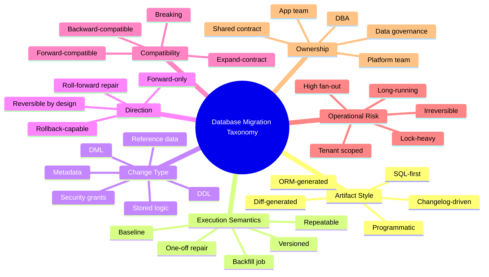
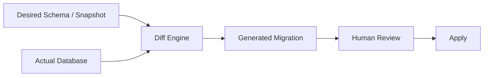
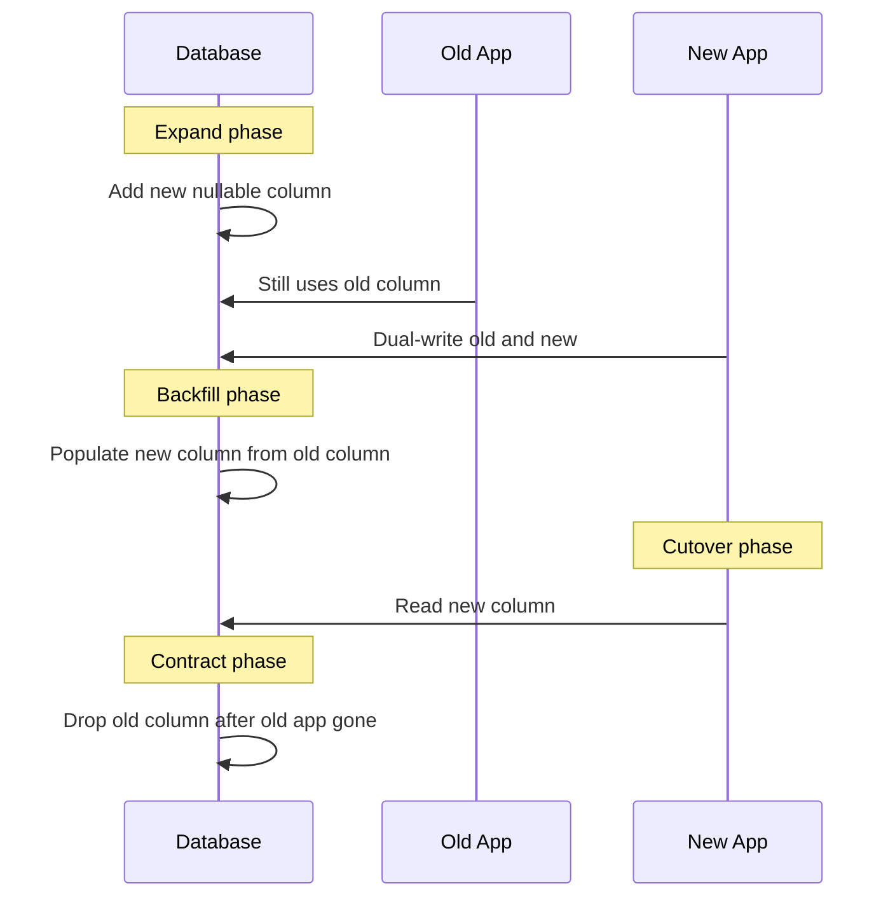
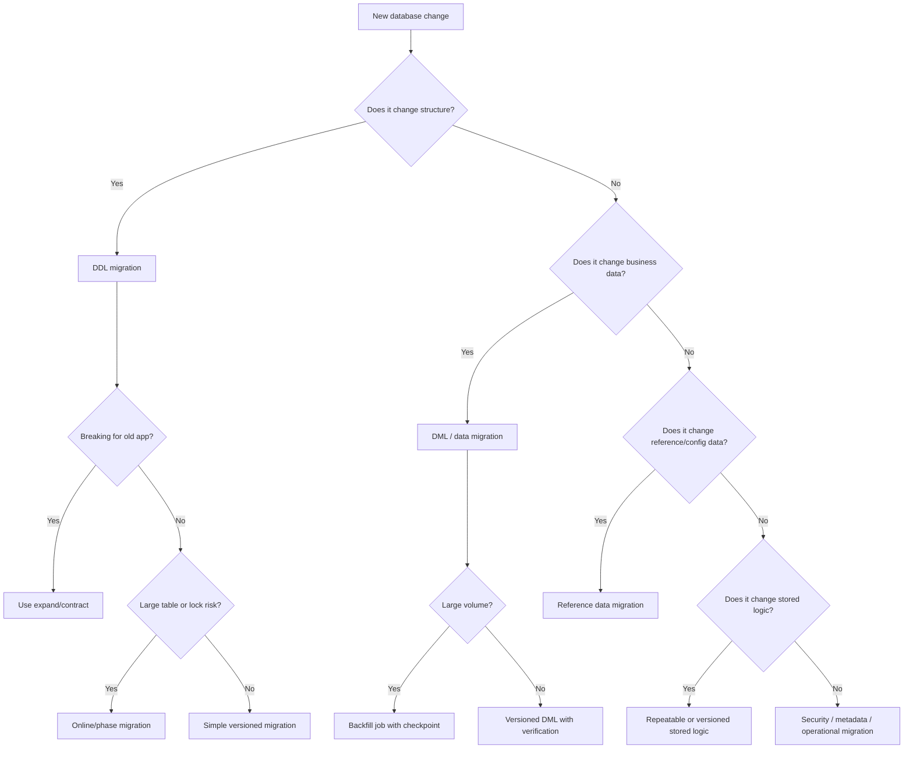

# Part 003 — Taxonomy: SQL-first, Model-first, Forward-only, Rollback-capable, Declarative vs Imperative

Part 001 membangun skill map. Part 002 membangun mental model bahwa database adalah **stateful shared artifact** dan migration adalah **transition yang meninggalkan evidence**. Part 003 mengubah mental model itu menjadi peta klasifikasi.

Tujuan bagian ini sederhana tetapi penting:

> Anda harus bisa melihat sebuah perubahan database dan langsung mengklasifikasikannya: jenisnya apa, risikonya di mana, siapa owner-nya, bagaimana cara validasinya, bagaimana cara recover-nya, dan apakah tool seperti Flyway atau Liquibase cocok untuk bentuk perubahan tersebut.

Tanpa taxonomy, tim biasanya jatuh ke dua ekstrem:

1. semua perubahan dianggap cuma SQL script;
2. semua perubahan dianggap bisa diselesaikan oleh migration tool.

Keduanya salah. Migration tool adalah **execution ledger + ordering mechanism + validation mechanism**. Ia tidak otomatis membuat perubahan Anda aman secara operasional.

---

## 1. Core Taxonomy Map

Kita akan memakai beberapa axis klasifikasi. Satu migration bisa berada di banyak axis sekaligus.



Taxonomy ini tidak dibuat untuk dokumentasi akademik. Fungsinya adalah mempercepat judgment saat review migration.

Pertanyaan review yang baik bukan:

> “Apakah script-nya valid?”

Pertanyaan review yang lebih kuat:

> “Migration ini masuk kelas apa, invariant apa yang harus dijaga, dan failure mode apa yang harus disiapkan?”

---

## 2. Axis 1 — Artifact Style

Artifact style adalah bentuk utama perubahan disimpan di repository.

### 2.1 SQL-first Migration

SQL-first berarti source of truth migration adalah file SQL eksplisit.

Contoh:

```txt
src/main/resources/db/migration/
  V202606280901__create_case_table.sql
  V202606281015__add_case_status_index.sql
  R__case_read_model_view.sql
```

Contoh SQL:

```sql
CREATE TABLE enforcement_case (
    id BIGINT GENERATED BY DEFAULT AS IDENTITY PRIMARY KEY,
    case_number VARCHAR(64) NOT NULL,
    status VARCHAR(40) NOT NULL,
    created_at TIMESTAMP NOT NULL
);

CREATE UNIQUE INDEX uk_enforcement_case_case_number
    ON enforcement_case (case_number);
```

SQL-first cocok ketika:

- tim ingin perubahan mudah dibaca DBA;
- vendor database spesifik dan fitur vendor ingin dimanfaatkan;
- review perubahan DDL harus eksplisit;
- migration harus sama persis dengan SQL yang akan dieksekusi;
- sistem punya performance-sensitive schema design.

Kelebihan:

- sangat transparan;
- mudah di-review oleh engineer database;
- tidak menyembunyikan detail vendor;
- cocok untuk index, constraint, partition, online DDL, function, view, dan stored procedure.

Kelemahan:

- portability rendah antar vendor;
- rollback tidak otomatis;
- developer harus memahami SQL dialect;
- perubahan kompleks lintas vendor bisa menjadi verbose;
- conditional execution perlu disiplin ekstra.

Mental model:

> SQL-first adalah “source code database” yang dieksekusi secara terurut.

Flyway sering diasosiasikan dengan pendekatan ini karena model utamanya sangat natural untuk SQL migration: versioned migration, repeatable migration, baseline migration, dan schema history.

### 2.2 Changelog-driven Migration

Changelog-driven berarti source of truth adalah changelog yang berisi unit perubahan terstruktur. Liquibase menggunakan konsep ini.

Contoh YAML:

```yaml
 databaseChangeLog:
  - changeSet:
      id: 20260628-0901-create-case-table
      author: platform-team
      changes:
        - createTable:
            tableName: enforcement_case
            columns:
              - column:
                  name: id
                  type: bigint
                  constraints:
                    primaryKey: true
                    nullable: false
              - column:
                  name: case_number
                  type: varchar(64)
                  constraints:
                    nullable: false
              - column:
                  name: status
                  type: varchar(40)
                  constraints:
                    nullable: false
```

Changelog-driven cocok ketika:

- tim membutuhkan metadata perubahan yang kaya;
- ada kebutuhan rollback yang lebih eksplisit;
- ada multi-database support;
- ada policy berbasis label/context;
- ada governance yang meminta changelog terstruktur;
- tim ingin precondition dan declarative change types.

Kelebihan:

- metadata per changeset jelas;
- bisa memakai contexts, labels, preconditions;
- rollback dapat didefinisikan dalam artifact yang sama;
- lebih mudah dianalisis tooling;
- bisa lebih portable untuk perubahan generik.

Kelemahan:

- verbose;
- abstraction dapat menyembunyikan SQL final;
- vendor-specific optimization tetap sering butuh SQL mentah;
- generated changelog bisa kurang manusiawi;
- merge conflict pada changelog besar perlu strategi struktur.

Mental model:

> Changelog-driven migration adalah ledger perubahan deklaratif dengan metadata policy.

### 2.3 ORM-generated Schema Migration

ORM-generated berarti schema dihasilkan dari model object, misalnya JPA/Hibernate auto DDL.

Contoh konfigurasi yang berbahaya untuk production:

```properties
spring.jpa.hibernate.ddl-auto=update
```

Untuk development lokal, auto-DDL bisa membantu eksplorasi. Untuk production, auto-DDL biasanya tidak cukup karena:

- perubahan tidak selalu reviewable sebagai artifact eksplisit;
- DDL yang dihasilkan ORM bisa vendor-dependent dan tidak optimal;
- ordering, locking, dan data migration tidak terkontrol;
- schema history tidak menjadi ledger perubahan yang memadai;
- rollback/recovery tidak jelas;
- perubahan destructive dapat muncul dari refactor entity.

ORM-generated migration adalah contoh penting dari prinsip:

> Model aplikasi bukan satu-satunya contract. Database juga punya contract operasional, historis, audit, dan performance.

ORM boleh membantu mapping. Migration production sebaiknya tetap eksplisit.

### 2.4 Diff-generated Migration

Diff-generated berarti migration dihasilkan dengan membandingkan dua state schema: misalnya model vs database, database A vs database B, snapshot vs current.

Contoh alur:



Diff-generated cocok untuk:

- initial onboarding legacy schema;
- dokumentasi perbedaan environment;
- drift detection;
- membuat draft migration awal;
- audit comparison.

Tetapi diff-generated migration berbahaya jika langsung dipakai tanpa review, karena diff tool tidak selalu memahami:

- intent bisnis;
- compatibility window;
- lock risk;
- data preservation;
- rename vs drop/create;
- expand/contract phase;
- deployment ordering;
- tenant-specific variance.

Contoh jebakan:

```txt
Developer intent:
  Rename column customer_name -> legal_name

Diff interpretation:
  Drop customer_name
  Add legal_name

Production consequence:
  Data loss unless explicit copy/backfill exists
```

Diff adalah alat inspeksi dan draft, bukan pengganti engineering judgment.

### 2.5 Programmatic / Imperative Migration

Programmatic migration adalah perubahan yang ditulis dengan Java/Kotlin/Groovy/script code, bukan SQL murni atau changelog deklaratif.

Contoh pseudo Java migration:

```java
public final class V20260628_1200__normalize_case_reference {
    public void migrate(Connection connection) throws SQLException {
        try (PreparedStatement read = connection.prepareStatement(
                "select id, raw_reference from enforcement_case where normalized_reference is null");
             PreparedStatement write = connection.prepareStatement(
                "update enforcement_case set normalized_reference = ? where id = ?")) {
            // read rows, normalize, update in chunks
        }
    }
}
```

Programmatic migration cocok ketika:

- transformasi data butuh logic kompleks;
- normalisasi tidak bisa diekspresikan nyaman dalam SQL;
- perlu integrasi dengan parser domain;
- perlu chunking/resume logic;
- perlu validasi custom.

Tetapi risiko meningkat:

- logic bisa non-deterministic;
- dependency application code berubah;
- migration lama bisa tidak compile setelah refactor;
- performance lebih sulit diprediksi;
- transaction boundary bisa kabur;
- observability harus dibuat sendiri.

Rule praktis:

> Pakai SQL untuk perubahan set-based. Pakai programmatic migration hanya saat transformasi memang memerlukan logic yang tidak layak ditulis sebagai SQL, dan buat migration itu self-contained.

---

## 3. Axis 2 — Execution Semantics

Execution semantics menjawab: kapan migration dijalankan, berapa kali, dan bagaimana tool tahu statusnya.

### 3.1 Versioned Migration

Versioned migration adalah perubahan yang dieksekusi sekali berdasarkan versi.

Contoh:

```txt
V20260628_0901__create_enforcement_case.sql
V20260628_0915__add_case_priority.sql
V20260628_0930__create_case_assignment.sql
```

Versioned migration cocok untuk:

- create table;
- add/drop column;
- add/drop constraint;
- create index;
- structural schema evolution;
- irreversible business state transition;
- one-time data transform.

Invariant:

- setelah applied, artifact tidak diedit;
- perubahan berikutnya harus migration baru;
- ordering harus stabil;
- checksum mismatch harus dianggap signal serius;
- version number adalah bagian dari public history.

Anti-pattern:

```txt
V003__add_status_column.sql  # sudah applied di staging/prod
# lalu developer mengedit isi file ini agar “lebih benar”
```

Yang benar:

```txt
V004__fix_status_column_default.sql
```

### 3.2 Repeatable Migration

Repeatable migration dieksekusi ulang ketika kontennya berubah. Cocok untuk artifact yang secara natural dapat direcreate.

Contoh:

```txt
R__case_summary_view.sql
R__case_search_function.sql
R__reference_status_seed.sql
```

Cocok untuk:

- view;
- function;
- stored procedure;
- package;
- derived read model;
- reference data tertentu yang aman di-upsert.

Tidak cocok untuk:

- create table utama;
- destructive DDL;
- one-time data correction;
- migration yang harus preserving previous state;
- perubahan yang tidak aman dijalankan ulang.

Pattern repeatable yang baik:

```sql
CREATE OR REPLACE VIEW case_summary AS
SELECT
    c.id,
    c.case_number,
    c.status,
    c.created_at
FROM enforcement_case c;
```

Pattern repeatable yang buruk:

```sql
DELETE FROM case_status;

INSERT INTO case_status(code, label)
VALUES
  ('OPEN', 'Open'),
  ('CLOSED', 'Closed');
```

Script kedua terlihat sederhana, tetapi berisiko jika table punya FK, audit, atau label sudah diubah oleh governance team. Untuk reference data, gunakan ownership dan semantics yang jelas.

### 3.3 Baseline Migration

Baseline migration adalah cara membawa database baru ke state tertentu tanpa mengeksekusi seluruh migration historis satu per satu.

Konteks umum:

```txt
V001__create_initial_tables.sql
V002__add_indexes.sql
...
V180__legacy_corrections.sql
B200__baseline_after_legacy_cleanup.sql
V201__new_feature.sql
```

Baseline cocok untuk:

- proyek lama dengan ratusan migration historis;
- mempercepat bootstrap environment baru;
- mengkonsolidasikan schema setelah periode panjang;
- onboarding Flyway/Liquibase ke legacy database;
- mengurangi noise migration lama yang tidak lagi relevan untuk install baru.

Risiko:

- baseline bisa menyembunyikan sejarah penting;
- baseline salah bisa membuat environment baru berbeda dari production;
- data migration historis mungkin tidak terwakili;
- repeatable artifact tetap perlu dikelola;
- compliance mungkin tetap butuh history lama.

Rule:

> Baseline bukan penghapus sejarah. Baseline adalah snapshot operasional yang harus bisa dibuktikan ekuivalen dengan hasil migration historis.

### 3.4 One-off Repair Migration

Repair migration adalah perubahan khusus untuk memperbaiki state yang salah.

Contoh:

```txt
V20260628_1400__repair_null_case_priority_after_failed_backfill.sql
```

Ciri-ciri:

- dibuat karena ada defect atau incident;
- harus sangat spesifik;
- harus punya evidence sebelum/sesudah;
- harus menyertakan verification query;
- tidak boleh mengandalkan asumsi umum.

Contoh struktur:

```sql
-- Problem:
-- Some rows created between 2026-06-20 and 2026-06-21 have null priority
-- due to failed backfill job.

UPDATE enforcement_case
SET priority = 'NORMAL'
WHERE priority IS NULL
  AND created_at >= TIMESTAMP '2026-06-20 00:00:00'
  AND created_at <  TIMESTAMP '2026-06-22 00:00:00';
```

Jangan menamai repair migration dengan nama generik seperti:

```txt
V999__fix.sql
V999__hotfix.sql
V999__data_patch.sql
```

Nama generik menghancurkan audit readability.

### 3.5 Backfill Job

Backfill adalah migrasi data yang biasanya berjalan terpisah dari DDL migration, terutama untuk volume besar.

Contoh perubahan:

```sql
ALTER TABLE enforcement_case
ADD COLUMN normalized_reference VARCHAR(128);
```

Lalu backfill:

```txt
batch job:
  read rows where normalized_reference is null
  compute normalized value
  update in chunks
  checkpoint progress
  verify count
```

Backfill sebaiknya diklasifikasikan terpisah karena karakteristiknya berbeda:

- bisa long-running;
- perlu throttling;
- perlu checkpoint;
- bisa perlu resume;
- bisa mempengaruhi replication lag;
- bisa membuat write amplification;
- sering tidak cocok dijalankan sebagai single migration transaction.

---

## 4. Axis 3 — Change Type

### 4.1 DDL Migration

DDL migration mengubah struktur database.

Contoh:

- create/drop/alter table;
- add/drop/alter column;
- create/drop index;
- add/drop constraint;
- create sequence;
- create partition;
- alter type;
- grant/revoke.

Risiko utama DDL:

- locking;
- implicit commit;
- table rewrite;
- metadata lock;
- invalid existing data;
- application compatibility;
- replication impact;
- rollback difficulty.

Checklist review DDL:

```txt
[ ] Apakah perubahan backward-compatible?
[ ] Apakah table besar?
[ ] Apakah operasi menyebabkan full table rewrite?
[ ] Apakah operasi mengambil exclusive lock?
[ ] Apakah ada long-running transaction yang bisa memblokir?
[ ] Apakah index dibuat online/concurrently bila diperlukan?
[ ] Apakah constraint divalidasi langsung atau bertahap?
[ ] Apakah aplikasi versi lama masih berjalan?
```

### 4.2 DML Migration

DML migration mengubah data.

Contoh:

```sql
UPDATE enforcement_case
SET status = 'UNDER_REVIEW'
WHERE status = 'REVIEW';
```

DML migration terlihat lebih aman daripada DDL, tetapi sering lebih berbahaya karena data adalah business fact.

Risiko DML:

- salah predicate;
- update terlalu luas;
- non-idempotent correction;
- audit trail hilang;
- trigger side effect;
- replication lag;
- row lock besar;
- tidak ada rollback log;
- business semantics berubah.

Prinsip:

> Setiap DML migration harus punya predicate yang dapat dijelaskan secara bisnis, bukan hanya teknis.

Buruk:

```sql
UPDATE cases SET status = 'CLOSED' WHERE status IS NULL;
```

Lebih baik:

```sql
UPDATE enforcement_case
SET status = 'DRAFT'
WHERE status IS NULL
  AND submitted_at IS NULL
  AND created_at < TIMESTAMP '2026-06-01 00:00:00';
```

Masih perlu verification query dan sample check.

### 4.3 Reference Data Migration

Reference data adalah data yang dipakai sebagai domain vocabulary atau konfigurasi bisnis yang relatif stabil.

Contoh:

```sql
INSERT INTO case_status(code, label, terminal)
VALUES ('ESCALATED', 'Escalated', false);
```

Pertanyaan ownership:

- Apakah data ini milik aplikasi?
- Apakah data ini milik business/admin user?
- Apakah data ini boleh berbeda antar environment?
- Apakah label boleh diubah dari UI?
- Apakah deletion aman?
- Apakah ada audit requirement?

Reference data sering menjadi sumber konflik karena developer menganggapnya “seed data”, sementara bisnis menganggapnya “master data”.

Rule:

> Jangan menghapus atau overwrite reference data tanpa model ownership yang jelas.

### 4.4 Stored Logic Migration

Stored logic meliputi:

- view;
- function;
- stored procedure;
- trigger;
- package;
- materialized view definition.

Stored logic punya dua sisi:

- ia adalah code;
- ia berada di database runtime.

Risiko:

- dependency antar object;
- privilege execution;
- invalid object;
- plan cache;
- vendor-specific syntax;
- sulit diuji seperti application code;
- coupling dengan aplikasi.

Repeatable migration sering cocok untuk stored logic, tetapi tetap perlu versioning ketika perubahan stored logic mempengaruhi compatibility aplikasi.

### 4.5 Security / Grant Migration

Grant migration mengatur privilege.

Contoh:

```sql
GRANT SELECT, INSERT, UPDATE ON enforcement_case TO app_enforcement_user;
REVOKE DELETE ON enforcement_case FROM app_enforcement_user;
```

Jangan anggap grant sebagai detail kecil. Permission adalah bagian dari security boundary.

Checklist:

```txt
[ ] Apakah migration user berbeda dari application user?
[ ] Apakah app user punya DDL privilege? Seharusnya tidak.
[ ] Apakah grant terlalu luas?
[ ] Apakah role berlaku lintas schema?
[ ] Apakah privilege berubah sejalan dengan deployment aplikasi?
[ ] Apakah revoke bisa memutus versi lama aplikasi?
```

---

## 5. Axis 4 — Direction: Forward-only vs Rollback-capable

### 5.1 Forward-only Migration

Forward-only berarti strategi utama recovery adalah membuat migration baru untuk memperbaiki state, bukan mengembalikan database ke versi lama.

Ini umum di production karena:

- data baru mungkin sudah masuk setelah migration;
- rollback DDL bisa destructive;
- rollback aplikasi dan rollback database tidak selalu simetris;
- audit trail harus mempertahankan sejarah;
- distributed systems membuat “time travel” sulit.

Contoh:

```txt
V101 add nullable column risk_score
V102 backfill risk_score
V103 app starts reading risk_score
V104 enforce not null
```

Jika V103 bermasalah, rollback aplikasi bisa dilakukan, tetapi database tetap boleh berada di V103/V104 jika schema backward-compatible. Jika schema tidak backward-compatible, masalahnya ada di desain migration.

### 5.2 Rollback-capable Migration

Rollback-capable berarti migration punya cara eksplisit untuk membatalkan perubahan.

Contoh rollback sederhana:

```sql
-- forward
ALTER TABLE enforcement_case ADD COLUMN reviewer_note VARCHAR(500);

-- rollback
ALTER TABLE enforcement_case DROP COLUMN reviewer_note;
```

Tetapi rollback ini hanya aman jika belum ada data penting di `reviewer_note`. Jika data sudah digunakan, rollback menjadi data loss.

Rollback lebih realistis untuk:

- object yang bisa direcreate;
- view/function;
- additive schema sebelum dipakai;
- failed pre-production migration;
- short-lived staging environment;
- test database.

Rollback sering tidak realistis untuk:

- data transformation;
- destructive schema change;
- column drop;
- table split setelah write berjalan;
- enum contraction;
- business state correction.

### 5.3 Roll-forward Repair

Roll-forward repair adalah membuat migration baru untuk memperbaiki masalah.

Contoh:

```txt
V120__add_case_priority.sql
V121__backfill_case_priority.sql
V122__fix_case_priority_for_legacy_draft_cases.sql
```

Ini sering lebih defensible karena:

- history tetap append-only;
- audit jelas;
- state tidak dipaksa mundur;
- bisa menyertakan targeted predicate;
- lebih cocok dengan production reality.

Rule:

> Untuk production system yang menerima traffic, desainlah migration agar rollback aplikasi mungkin, tetapi database recovery utamanya roll-forward.

---

## 6. Axis 5 — Declarative vs Imperative

### 6.1 Declarative Migration

Declarative migration menyatakan apa yang diinginkan.

Contoh Liquibase-style:

```yaml
- addColumn:
    tableName: enforcement_case
    columns:
      - column:
          name: priority
          type: varchar(20)
```

Kelebihan:

- tooling bisa menganalisis;
- lebih portable;
- rollback tertentu bisa dibuat otomatis;
- cocok untuk policy scanning;
- mudah diberi metadata.

Kelemahan:

- SQL final bisa kurang eksplisit;
- vendor-specific capability bisa sulit diekspresikan;
- abstraction leak pada edge case;
- performance semantics tidak selalu jelas.

### 6.2 Imperative Migration

Imperative migration menyatakan langkah eksekusi.

Contoh SQL imperative:

```sql
ALTER TABLE enforcement_case ADD COLUMN priority VARCHAR(20);

UPDATE enforcement_case
SET priority = 'NORMAL'
WHERE priority IS NULL;

ALTER TABLE enforcement_case ALTER COLUMN priority SET NOT NULL;
```

Kelebihan:

- eksplisit;
- reviewable sebagai langkah konkret;
- mudah mengontrol vendor feature;
- cocok untuk performance-sensitive operation.

Kelemahan:

- lebih sulit dianalisis otomatis;
- portable rendah;
- rollback manual;
- mudah membuat script non-idempotent.

Tidak ada pemenang universal. Pilihan harus berdasarkan constraint.

---

## 7. Axis 6 — Compatibility Class

Compatibility class menjawab: apakah schema baru bisa bekerja dengan aplikasi lama dan aplikasi baru?

### 7.1 Backward-compatible Change

Aplikasi lama masih bisa berjalan setelah schema berubah.

Contoh:

```sql
ALTER TABLE enforcement_case
ADD COLUMN risk_score INTEGER;
```

Jika nullable dan tidak dibaca aplikasi lama, ini backward-compatible.

### 7.2 Forward-compatible Change

Aplikasi baru bisa berjalan terhadap schema lama.

Ini lebih sulit. Contoh aplikasi baru mencoba membaca column baru, tetapi fallback jika column belum ada biasanya tidak natural di SQL/JPA. Karena itu deployment umumnya menjalankan additive migration sebelum aplikasi baru.

### 7.3 Breaking Change

Breaking change membuat aplikasi lama gagal.

Contoh:

```sql
ALTER TABLE enforcement_case DROP COLUMN status;
```

Jika versi lama aplikasi masih membaca `status`, deployment akan gagal.

### 7.4 Expand/Contract Change

Expand/contract adalah cara membuat breaking change menjadi rangkaian perubahan compatible.



Compatibility class adalah salah satu taxonomy paling penting untuk production.

Review question:

> Versi aplikasi mana yang masih harus hidup saat migration ini sudah applied?

---

## 8. Axis 7 — Operational Risk Class

### 8.1 Lock-heavy Migration

Contoh:

- alter column type;
- add not-null with validation;
- create index non-concurrently on large table;
- add foreign key with immediate validation;
- table rewrite operation.

Risk signal:

```txt
small table dev: 50 rows, instant
production table: 700M rows, blocks writes for minutes/hours
```

Migration review wajib mempertimbangkan production cardinality, bukan local DB.

### 8.2 Long-running Migration

Long-running migration punya risiko:

- deployment timeout;
- connection loss;
- lock duration;
- transaction log growth;
- replication lag;
- partial completion;
- operator uncertainty.

Jangan masukkan backfill besar ke startup migration aplikasi.

### 8.3 Irreversible Migration

Contoh:

```sql
ALTER TABLE enforcement_case DROP COLUMN legacy_payload;
```

Irreversible bukan berarti dilarang. Artinya butuh:

- backup/retention plan;
- compatibility proof;
- data archival decision;
- explicit approval;
- staged rollout;
- evidence bahwa tidak ada consumer aktif.

### 8.4 High Fan-out Migration

High fan-out terjadi saat satu migration harus dieksekusi di banyak database/schema/tenant.

Risiko:

- sebagian tenant sukses, sebagian gagal;
- version skew;
- lock storm;
- connection pool exhaustion;
- noisy neighbor;
- observability sulit.

Solusi biasanya bukan “loop semua tenant dalam satu transaksi”. Solusinya adalah orchestration, checkpoint, retry, dan tenant-level status.

---

## 9. Axis 8 — Ownership Class

### 9.1 Application-owned Schema

Schema dimiliki oleh satu aplikasi/service.

Ini paling sehat untuk migration karena ownership jelas:

- repository aplikasi menyimpan migration;
- pipeline aplikasi menjalankan migration;
- service team bertanggung jawab;
- schema contract sesuai service boundary.

### 9.2 Shared Database

Beberapa aplikasi memakai schema/table yang sama.

Risiko:

- tidak jelas siapa boleh mengubah;
- migration satu service memutus service lain;
- deployment ordering rumit;
- rollback hampir mustahil;
- audit ownership lemah.

Shared database bukan selalu bisa dihindari, terutama di legacy enterprise. Tetapi migration harus memakai contract governance.

### 9.3 Platform-owned Schema

Schema tertentu dimiliki platform team, misalnya identity, audit, workflow, event outbox.

Migration harus punya:

- change request formal;
- consumer impact analysis;
- compatibility matrix;
- release note;
- versioned contract.

### 9.4 Governance-owned Data

Reference/master data kadang dimiliki business governance, bukan engineering.

Contoh:

- regulatory code;
- jurisdiction list;
- violation type;
- enforcement action category;
- risk classification.

Engineering boleh membuat schema, tetapi tidak boleh sembarang mengubah data domain tanpa approval.

---

## 10. Migration Classification Template

Gunakan template ini saat membuat atau review migration.

```md
## Migration Classification

### Summary
- Intent:
- Business reason:
- Related application change:

### Artifact
- Tool: Flyway / Liquibase / Manual / Job
- Artifact style: SQL-first / Changelog / Programmatic / Diff-generated
- Execution semantics: Versioned / Repeatable / Baseline / Backfill / Repair

### Change Type
- DDL:
- DML:
- Reference data:
- Stored logic:
- Security grants:

### Compatibility
- Backward-compatible: yes/no
- Forward-compatible: yes/no
- Requires expand/contract: yes/no
- Old app version supported until:
- New app dependency:

### Risk
- Table size:
- Lock risk:
- Long-running risk:
- Irreversibility:
- Tenant fan-out:
- Replication impact:

### Validation
- Pre-check query:
- Post-check query:
- Expected row count:
- Invariants:

### Recovery
- Rollback possible: yes/no/limited
- Roll-forward repair plan:
- Backup/snapshot needed:
- Operator notes:
```

This template looks heavy. For production systems, it is cheaper than guessing during incident response.

---

## 11. Classification Examples

### 11.1 Add Nullable Column

```sql
ALTER TABLE enforcement_case
ADD COLUMN risk_score INTEGER;
```

Classification:

```txt
Artifact style: SQL-first
Execution: Versioned
Change type: DDL
Direction: Forward-only acceptable
Compatibility: Backward-compatible
Risk: Usually low, but table rewrite depends on database/vendor/default
Recovery: Roll-forward or drop if unused
```

Review focus:

- table size;
- default expression;
- nullable vs not null;
- app version reading behavior.

### 11.2 Add Not-null Column with Default

```sql
ALTER TABLE enforcement_case
ADD COLUMN priority VARCHAR(20) NOT NULL DEFAULT 'NORMAL';
```

Classification:

```txt
Artifact style: SQL-first
Execution: Versioned
Change type: DDL + implicit data population
Compatibility: Often backward-compatible, but operationally risky
Risk: May rewrite table or lock depending on vendor/version
Recovery: More complex than nullable column
```

Safer expand/contract approach:

```sql
ALTER TABLE enforcement_case ADD COLUMN priority VARCHAR(20);
-- backfill in chunks
-- then enforce NOT NULL after verification
```

### 11.3 Rename Column

Naive:

```sql
ALTER TABLE enforcement_case RENAME COLUMN status TO lifecycle_status;
```

Classification:

```txt
Change type: DDL
Compatibility: Breaking for old app
Risk: High if app versions overlap
Recommended: Expand/contract
```

Safer:

```txt
V1 add lifecycle_status nullable
V2 dual-write status and lifecycle_status
V3 backfill lifecycle_status
V4 switch reads
V5 stop writing status
V6 drop status
```

### 11.4 Reference Data Upsert

```sql
INSERT INTO case_status(code, label, terminal)
VALUES ('ESCALATED', 'Escalated', false)
ON CONFLICT (code) DO UPDATE
SET label = EXCLUDED.label,
    terminal = EXCLUDED.terminal;
```

Classification:

```txt
Change type: Reference data
Execution: Versioned or repeatable depending ownership
Risk: Business semantics overwrite
Recovery: Requires previous value evidence
```

Review focus:

- who owns label;
- whether update is allowed;
- whether old label may have been customized;
- whether code is referenced by existing rows.

### 11.5 View Definition

```sql
CREATE OR REPLACE VIEW case_summary AS
SELECT id, case_number, status
FROM enforcement_case;
```

Classification:

```txt
Change type: Stored logic / read model
Execution: Repeatable often suitable
Compatibility: Depends on columns exposed
Risk: Consumer breakage
Recovery: Restore previous definition
```

---

## 12. Tool Fit Matrix

| Situation | Flyway Fit | Liquibase Fit | Notes |
|---|---:|---:|---|
| SQL-first application schema | Very strong | Strong | Flyway is simpler when SQL is the main artifact. |
| Changelog with metadata and rollback | Medium | Very strong | Liquibase shines with structured changesets. |
| Multi-vendor generic DDL | Medium | Strong | Liquibase change types can help, but vendor SQL still matters. |
| Stored procedures/functions | Strong | Strong | SQL-first or formatted SQL often better than abstract change types. |
| Large backfill | Limited | Limited | Use migration for setup/checkpoint table; execute backfill as controlled job. |
| Reference data | Strong with discipline | Strong with discipline | Ownership semantics matter more than tool. |
| Drift detection | Medium | Strong | Liquibase diff/snapshot can help; still require review. |
| Simple Spring Boot service | Very strong | Strong | Keep one migration mechanism. |
| Heavy audit/governance | Strong | Very strong | Liquibase metadata can be useful; Flyway can still be governed with process. |
| Emergency repair | Strong | Strong | Append-only repair migration preferred. |

The matrix is not a universal ranking. It is a fit assessment. The wrong tool with strong discipline can outperform the right tool with weak process.

---

## 13. Anti-Taxonomy: Misleading Labels

Avoid vague labels that hide risk.

### 13.1 “Just a Migration”

No migration is “just” a migration until classified.

Ask:

- Does it lock?
- Does it rewrite?
- Does it break old app?
- Does it modify business data?
- Does it require backfill?
- Does it need rollback?
- Does it affect tenant fan-out?

### 13.2 “Seed Data”

Seed data can mean:

- test fixture;
- bootstrap admin user;
- reference data;
- master data;
- configuration;
- environment-specific data;
- demo data.

These are not equivalent.

### 13.3 “Rollback Script Exists”

A rollback script existing does not mean rollback is safe.

Rollback safety depends on:

- whether new data exists;
- whether old app can use restored schema;
- whether side effects happened;
- whether downstream systems observed new state;
- whether the rollback preserves audit facts.

### 13.4 “Generated by Tool”

Generated SQL is still production SQL.

It must be reviewed like handwritten SQL.

### 13.5 “Only Metadata”

Metadata changes can be high impact:

- index metadata affects query plan;
- constraints affect writes;
- grants affect access;
- comments may feed documentation generators;
- schema ownership affects permission chain.

---

## 14. Decision Tree: How to Classify a New Change



---

## 15. Practice: Classify These Migrations

### Scenario A

You need to add `closed_at` to `enforcement_case`. The old app ignores it. The new app writes it when status becomes `CLOSED`.

Classification:

```txt
DDL, versioned, additive, backward-compatible, low-to-medium risk depending table size.
```

Recommended:

```sql
ALTER TABLE enforcement_case ADD COLUMN closed_at TIMESTAMP;
```

Do not make it `NOT NULL` yet.

### Scenario B

You need to replace `status = 'REVIEW'` with `status = 'UNDER_REVIEW'` for all existing rows.

Classification:

```txt
DML, business data migration, versioned, possible compatibility issue.
```

Questions:

- Does old app know `UNDER_REVIEW`?
- Are reports expecting `REVIEW`?
- Is status exposed to external systems?
- Do audit logs need correction?

### Scenario C

You need to redefine `case_summary_view` every time query shape changes.

Classification:

```txt
Stored logic, repeatable candidate, compatibility depends on consumers.
```

Recommended:

- use repeatable migration;
- avoid dropping columns consumed externally without versioning the view contract.

### Scenario D

You need to split `person.full_name` into `first_name`, `middle_name`, `last_name` for 300 million rows.

Classification:

```txt
DDL + data migration + application compatibility + large backfill.
```

Recommended:

- expand columns;
- dual-write;
- backfill with checkpoint;
- verify samples;
- cut over reads;
- contract old column later.

This is not a single migration. It is a migration program.

---

## 16. Engineering Heuristics

Use these heuristics in design review.

### 16.1 If It Changes Data Meaning, Treat It as Product Logic

A schema change can be technical. A data correction often changes business truth.

### 16.2 If It Needs More Than Seconds, Separate It from App Startup

Startup migration is attractive for simple services. It is dangerous for long-running DDL/backfill, especially in horizontally scaled applications.

### 16.3 If Old and New Apps Can Coexist, Deployment Is Easier

Compatibility buys operational freedom.

### 16.4 If You Cannot Explain Recovery, You Have Not Finished the Design

Recovery is part of migration design, not incident-time improvisation.

### 16.5 If You Cannot Verify It, You Should Not Apply It

Every non-trivial migration needs pre-check and post-check queries.

---

## 17. Minimal Review Rubric

For every migration PR, require answers to these questions:

```txt
1. What class of migration is this?
2. Is it backward-compatible with the currently deployed app?
3. Does it require app deployment ordering?
4. Does it touch large tables?
5. Does it acquire locks that matter?
6. Does it modify business data?
7. Does it need a backfill job?
8. What is the verification query?
9. What is the recovery plan?
10. Is the artifact immutable after apply?
```

The taxonomy lets reviewers avoid subjective debates and converge on risk.

---

## 18. Common Pitfalls by Taxonomy Class

| Class | Pitfall | Better Approach |
|---|---|---|
| Versioned DDL | Editing applied migration | Add new corrective migration |
| Repeatable | Using repeatable for destructive data mutation | Limit to recreateable objects or safe upsert |
| DML | Predicate too broad | Pre-check row count + narrow business predicate |
| Backfill | Single huge transaction | Chunk, checkpoint, throttle, verify |
| Diff-generated | Applying generated SQL blindly | Treat as draft, review intent |
| ORM-generated | Production auto-DDL | Explicit migration artifacts |
| Reference data | Overwriting business-owned labels | Define ownership and update policy |
| Rename | Direct rename while old app live | Expand/contract |
| Rollback | Assuming rollback script means safe rollback | Prove data and app compatibility |
| Baseline | Using baseline to erase bad history | Prove equivalence and preserve audit history |

---

## 19. How This Part Connects to the Rest of the Series

This taxonomy becomes the language for the following parts:

- Part 004 uses it to design lifecycle.
- Part 005 uses it to reason about versioning and history.
- Part 006 uses it to separate idempotency from repeatability.
- Part 008 uses it to formalize expand/contract.
- Parts 009–015 map the taxonomy onto Flyway.
- Parts 016–021 map the taxonomy onto Liquibase.
- Parts 022–027 apply it to production patterns.
- Parts 028–032 turn it into CI/CD, testing, observability, and recovery.

Once you can classify changes quickly, you can reason about them before they become incidents.

---

## 20. Self-Check

You understand Part 003 if you can answer these without looking back:

1. Why is SQL-first not the same as “manual and unsafe”?
2. Why is changelog-driven not automatically safer than SQL-first?
3. Why is ORM auto-DDL usually inappropriate for production migration?
4. Why is diff-generated migration useful but dangerous?
5. What is the difference between versioned and repeatable migration?
6. Why should large backfill often be separated from migration tool execution?
7. Why is rollback-capable not the same as rollback-safe?
8. Why does compatibility class matter more than syntax?
9. Why is reference data not always seed data?
10. Why should every migration PR include classification?

---

## 21. References

- Redgate Flyway documentation: migrations, versioned migrations, repeatable migrations, baseline migrations, and schema history table.
- Liquibase documentation: changelog, changeset, checksum, contexts, labels, preconditions, rollback.
- Spring Boot documentation: database initialization and integration with Flyway/Liquibase.
