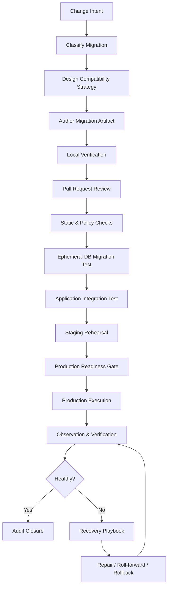
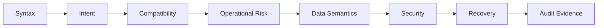
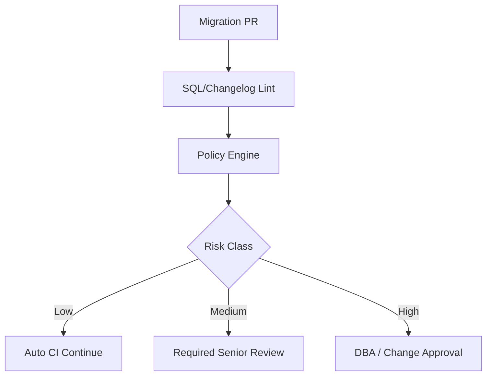
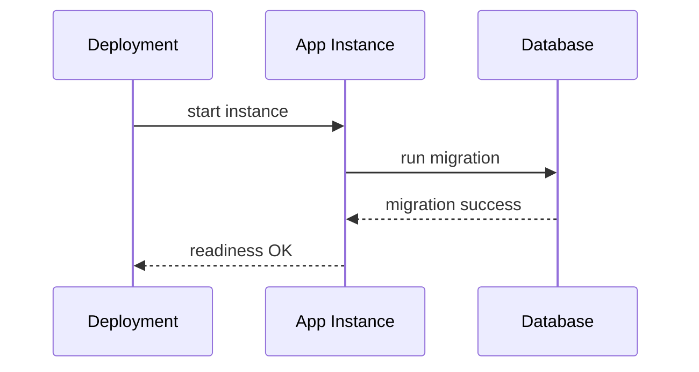
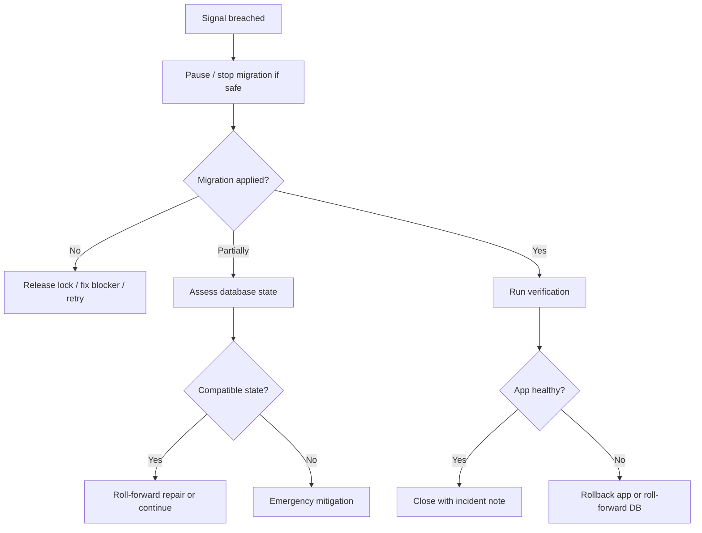
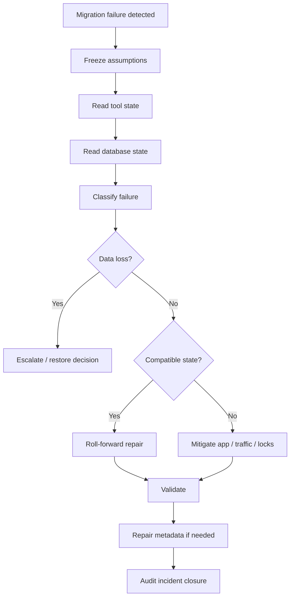

# Part 004 — Lifecycle Migration: Author, Review, Validate, Apply, Observe, Repair

Part 003 memberi taxonomy. Part 004 menjawab pertanyaan berikutnya:

> Setelah kita tahu kelas sebuah migration, bagaimana lifecycle yang benar dari ide perubahan sampai production evidence dan recovery closure?

Database migration yang matang bukan file SQL yang kebetulan ada di repository. Ia adalah **controlled change lifecycle**.

Lifecycle yang buruk:

```txt
write SQL -> run locally -> merge -> deploy -> hope
```

Lifecycle production-grade:

```txt
intent -> design -> classification -> author -> review -> static validation
-> ephemeral execution -> integration validation -> staging rehearsal
-> production execution -> observation -> evidence -> recovery readiness -> closure
```

Bagian ini akan membahas lifecycle secara operasional, tetapi tetap tool-neutral. Flyway dan Liquibase akan masuk sebagai mekanisme implementasi, bukan sebagai pengganti proses engineering.

---

## 1. Migration Lifecycle Overview



The lifecycle has three big goals:

1. **Prevent bad changes from reaching production.**
2. **Make production execution predictable.**
3. **Make recovery fast and evidence-based when prediction fails.**

---

## 2. Stage 1 — Change Intent

Every migration starts with intent, not syntax.

Bad intent statement:

```txt
Add column priority.
```

Better intent statement:

```txt
Support priority-based routing for enforcement cases by introducing a nullable
priority column, backfilling existing open cases to NORMAL, and allowing the new
application version to start writing explicit priority values.
```

Why this matters:

- intent reveals compatibility needs;
- intent separates schema mechanics from business meaning;
- intent helps reviewers detect missing data migration;
- intent becomes audit context;
- intent helps recovery decisions.

A migration without intent is hard to review. During an incident, it becomes even harder to defend.

### 2.1 Intent Template

```md
## Migration Intent

- Business capability:
- Schema/data object affected:
- Application version dependency:
- Expected production effect:
- User-visible effect:
- Risk class:
- Recovery direction:
```

Example:

```md
## Migration Intent

- Business capability: route high-risk enforcement cases to specialized reviewers.
- Schema/data object affected: enforcement_case.priority.
- Application version dependency: app >= 2026.06.28 writes priority.
- Expected production effect: existing rows remain nullable until backfill completes.
- User-visible effect: none during expand phase.
- Risk class: additive DDL + later backfill.
- Recovery direction: roll-forward; old app ignores new column.
```

---

## 3. Stage 2 — Classification

Use Part 003 taxonomy.

```txt
Artifact style: SQL-first
Execution semantics: Versioned
Change type: DDL
Compatibility: Backward-compatible expand phase
Operational risk: Low DDL, medium if table is huge
Ownership: Enforcement case service
```

Classification determines lifecycle strictness.

A tiny nullable column on a small table may need normal PR review. A `NOT NULL` enforcement on a 700M-row table requires rehearsal, lock analysis, and a production window.

### 3.1 Lifecycle Strictness Matrix

| Migration Class | Required Lifecycle Depth |
|---|---|
| Small additive DDL | PR review + CI migration test + staging apply |
| Breaking DDL | Expand/contract design + compatibility matrix + staged release |
| Large table DDL | Lock analysis + rehearsal + production guardrail |
| DML correction | Pre/post row count + business approval + sample validation |
| Large backfill | Separate job lifecycle + checkpoint + monitoring |
| Reference data | Ownership review + environment semantics |
| Stored logic | Consumer compatibility + repeatable validation |
| Security grant | Security review + least privilege validation |
| Baseline | Equivalence proof + historical audit decision |
| Repair migration | Incident link + targeted predicate + closure evidence |

---

## 4. Stage 3 — Compatibility Design

Compatibility must be designed before artifact writing.

Question:

> What versions of the application may run against what versions of the database?

### 4.1 Compatibility Matrix

Example for adding `priority` safely:

| DB State | Old App | New App | Safe? | Notes |
|---|---:|---:|---:|---|
| No priority column | Works | Fails if new app requires column | No for new app | Migration must run before new app. |
| Nullable priority column | Works | Works | Yes | Expand phase. |
| Backfilled priority | Works | Works | Yes | Still compatible. |
| Priority NOT NULL | Usually works | Works | Usually yes | Old app insert behavior must be checked. |
| Old status column dropped | Fails if old app reads it | Works | No with old app | Contract only after old app gone. |

This matrix prevents one of the most common mistakes: assuming migration and app deployment are atomic. In distributed deployments, they rarely are.

### 4.2 Deployment Ordering

Three common orderings:

#### Migration before application

```txt
1. Apply additive migration.
2. Deploy app that uses new schema.
```

Good for:

- new nullable column;
- new table;
- new index;
- new view used by next app.

#### Application before migration

Sometimes possible if app is defensive:

```txt
1. Deploy app that can handle old and new schema.
2. Apply migration.
```

Less common in Java/JPA because missing columns often fail at startup or query time.

#### Phased deployment

```txt
1. Expand schema.
2. Deploy app dual-writing.
3. Backfill data.
4. Switch reads.
5. Contract old schema.
```

Required for breaking schema evolution.

---

## 5. Stage 4 — Author Migration Artifact

Authoring is where intent becomes executable artifact.

### 5.1 Naming

Names must be readable months later.

Good:

```txt
V20260628_0901__add_priority_to_enforcement_case.sql
V20260628_1000__backfill_priority_for_open_cases.sql
V20260628_1100__enforce_priority_not_null.sql
```

Bad:

```txt
V12__update.sql
V13__fix.sql
V14__changes.sql
```

For Liquibase:

```yaml
- changeSet:
    id: 20260628-0901-add-priority-to-enforcement-case
    author: enforcement-platform
```

The name should encode intent, not implementation detail only.

### 5.2 One Intent per Migration

Prefer:

```txt
V101__add_case_priority_column.sql
V102__backfill_case_priority.sql
V103__add_case_priority_not_null_constraint.sql
```

Avoid:

```txt
V101__case_changes.sql
  - add priority
  - create assignment table
  - update reference data
  - drop legacy column
  - add grants
```

One intent per migration improves:

- review;
- failure isolation;
- rollback/repair;
- audit;
- blame accuracy;
- environment diff readability.

There are exceptions, but bundling should be intentional.

### 5.3 Include Verification SQL Nearby

For non-trivial migrations, include verification queries in comments or companion docs.

Example:

```sql
-- Pre-check:
-- SELECT count(*) FROM enforcement_case WHERE priority IS NULL;

UPDATE enforcement_case
SET priority = 'NORMAL'
WHERE priority IS NULL
  AND status IN ('DRAFT', 'OPEN', 'UNDER_REVIEW');

-- Post-check:
-- SELECT count(*) FROM enforcement_case
-- WHERE priority IS NULL
--   AND status IN ('DRAFT', 'OPEN', 'UNDER_REVIEW');
```

Verification query is not decoration. It is part of operational readiness.

### 5.4 Avoid Environment Logic in Migration

Bad:

```sql
-- pseudo anti-pattern
IF current_database() = 'prod' THEN
  INSERT INTO config VALUES ('external_url', 'https://prod.example.com');
ELSE
  INSERT INTO config VALUES ('external_url', 'https://dev.example.com');
END IF;
```

Better:

- separate environment configuration from schema migration;
- use controlled placeholders only for infrastructure-level names;
- keep migration deterministic;
- avoid business differences per environment unless explicitly classified.

---

## 6. Stage 5 — Local Verification

Local verification is not proof of production safety, but it catches syntax, ordering, and basic semantic issues.

Minimum local loop:

```txt
1. Start clean database.
2. Apply all migrations from scratch.
3. Run application startup.
4. Run focused integration tests.
5. Run migration against previous schema snapshot if available.
```

For Java projects, Testcontainers is often useful, but the principle is more important than the tool:

> Test against the same database engine family as production whenever possible.

H2 is useful for fast tests but poor as proof for vendor-specific DDL, lock behavior, SQL syntax, index semantics, JSON types, sequences, identity columns, and transaction behavior.

### 6.1 Local Smoke Checklist

```txt
[ ] Migration applies from empty DB.
[ ] Migration applies from previous release DB.
[ ] Application starts after migration.
[ ] Repository/DAO tests pass.
[ ] Roll-forward repair path is understood.
[ ] No applied migration was edited.
```

---

## 7. Stage 6 — Pull Request Review

Migration PR review should not be the same as application code review. SQL syntax correctness is only one layer.

### 7.1 Review Layers



### 7.2 Reviewer Questions

```txt
1. Is the intent clear?
2. Is the migration class correct?
3. Is it safe with old and new app versions?
4. Does it touch production-large tables?
5. Can it block writes or reads?
6. Does it mutate business data?
7. Are predicates narrow and explainable?
8. Are pre/post checks included?
9. Is recovery realistic?
10. Is the migration artifact immutable after apply?
```

### 7.3 DBA Review vs App Team Review

A mature process distinguishes concerns:

| Concern | App Team | DBA / Data Platform | Security / Governance |
|---|---:|---:|---:|
| Business intent | Strong | Medium | Medium |
| App compatibility | Strong | Medium | Low |
| SQL correctness | Medium | Strong | Low |
| Lock/performance risk | Medium | Strong | Low |
| Data ownership | Medium | Medium | Strong |
| Privilege model | Medium | Strong | Strong |
| Audit evidence | Medium | Medium | Strong |

In small teams, one person may wear multiple hats. The concerns still exist.

---

## 8. Stage 7 — Static and Policy Checks

Static checks are automated guardrails before executing migration.

Examples:

```txt
[ ] File name follows convention.
[ ] Version is unique.
[ ] No applied migration modified.
[ ] No forbidden command: DROP TABLE, TRUNCATE, DELETE without WHERE.
[ ] No production `clean` command in pipeline.
[ ] No `spring.jpa.hibernate.ddl-auto=update` in production config.
[ ] No large table NOT NULL without staged plan.
[ ] No environment-specific literal secrets.
[ ] No grant to application user beyond allowed role.
```

Static checks do not replace review. They catch classes of mistakes quickly.

### 8.1 Example Simple Lint Rules

```txt
Rule: DELETE must have WHERE.
Rule: UPDATE must have WHERE unless explicitly annotated.
Rule: DROP COLUMN requires approval label.
Rule: CREATE INDEX on known large table must use approved online/concurrent form where supported.
Rule: Migration file under db/migration cannot be changed after merge to main.
Rule: DML migration must include post-check comment.
```

### 8.2 Policy as Code

For high-control environments, migration policy can be encoded in CI.



Policy should reduce surprise, not create bureaucracy for its own sake.

---

## 9. Stage 8 — Ephemeral Database Migration Test

An ephemeral DB test creates a temporary database and applies migrations.

Two modes matter.

### 9.1 From Scratch Test

```txt
empty DB -> apply all migrations -> run schema checks
```

Catches:

- missing dependency;
- bad order;
- syntax error;
- repeatable migration failure;
- baseline inconsistency for new environment.

### 9.2 From Previous Release Test

```txt
previous release DB snapshot -> apply new migrations -> run app tests
```

Catches:

- migration assumes clean DB;
- missing legacy data handling;
- invalid existing rows;
- constraint failure;
- data migration defect.

For production-like assurance, previous-release test is more valuable than from-scratch test.

### 9.3 Golden Schema Comparison

After applying all migrations, compare resulting schema with expected schema.

But be careful: schema comparison detects structural difference, not necessarily business correctness.

---

## 10. Stage 9 — Application Integration Validation

Migration and application must be validated together.

Minimum checks:

```txt
[ ] Application starts with migrated schema.
[ ] Health check passes.
[ ] Core repository queries pass.
[ ] Writes with old nullable/default behavior pass.
[ ] New feature path works.
[ ] Old feature path still works during compatibility window.
```

For JPA/Hibernate applications, also check:

- entity mapping aligns with actual schema;
- column nullability mismatch;
- enum string/value mismatch;
- sequence allocation size;
- lazy-loaded relation assumptions;
- generated SQL after schema change;
- index support for new query pattern.

This series will not repeat JPA/Hibernate fundamentals from the persistence series. Here the point is narrower: **migration validity includes application behavior validity**.

---

## 11. Stage 10 — Staging Rehearsal

Staging is not just “deploy to another environment”. For migration, staging should answer:

```txt
Will the production procedure work when executed by the production-like pipeline, against production-like data shape, with production-like permissions?
```

### 11.1 What Staging Should Rehearse

```txt
[ ] Same migration runner path as production.
[ ] Same database engine major version if possible.
[ ] Similar role/permission model.
[ ] Similar schema size distribution for risky tables.
[ ] Same config style: placeholders, schemas, changelog path.
[ ] Same app deployment ordering.
[ ] Same observability dashboards.
[ ] Same rollback/repair decision process.
```

### 11.2 What Staging Often Fails to Rehearse

```txt
[ ] Production table cardinality.
[ ] Long-running transactions.
[ ] Replication lag.
[ ] Lock contention.
[ ] Tenant count.
[ ] Real data anomalies.
[ ] Production permission restrictions.
[ ] External consumers.
```

Do not overtrust staging. Use it as rehearsal, not proof.

---

## 12. Stage 11 — Production Readiness Gate

Before production, classify readiness.

### 12.1 Low-risk Gate

For simple additive migrations:

```txt
[ ] CI passed.
[ ] Staging migration passed.
[ ] App compatibility confirmed.
[ ] Monitoring available.
```

### 12.2 Medium-risk Gate

For DML/backfill/moderate DDL:

```txt
[ ] Pre/post queries approved.
[ ] Expected row count known.
[ ] Lock risk assessed.
[ ] Recovery path documented.
[ ] Roll-forward script or plan ready.
[ ] Deployment order confirmed.
```

### 12.3 High-risk Gate

For destructive, large, or shared schema changes:

```txt
[ ] Change window approved if needed.
[ ] Backup/snapshot strategy confirmed.
[ ] Kill/stop criteria defined.
[ ] Owner online during execution.
[ ] DBA/platform support available.
[ ] Communication plan ready.
[ ] Downstream consumers notified.
[ ] Contract phase completed.
[ ] Evidence package prepared.
```

High-risk migration should not rely on heroic improvisation.

---

## 13. Stage 12 — Production Execution Models

There are several ways to execute production migration.

### 13.1 Application Startup Migration

The application starts and migration runs before the app becomes ready.



Good for:

- small service;
- simple additive migration;
- low lock risk;
- single instance or controlled startup;
- early-stage systems.

Dangerous for:

- many app replicas racing migration;
- long-running migration;
- large table DDL;
- backfill;
- uncertain lock behavior;
- strict startup SLO;
- multi-tenant fan-out.

Guardrails:

- ensure tool lock works;
- one migration runner if possible;
- readiness waits for migration result;
- disable startup migration for risky changes;
- never run destructive migration implicitly without gate.

### 13.2 Pipeline Migration Before App Deploy

CI/CD pipeline applies migration first, then deploys app.

```txt
pipeline:
  migrate database
  verify schema
  deploy application
  run smoke tests
```

Good for:

- controlled production execution;
- audit visibility;
- separation of app startup from schema change;
- approval gates.

Risk:

- if migration breaks old app, production can fail before new app deploys;
- pipeline needs DB access;
- requires secrets management;
- rollback plan must consider deployment stage.

### 13.3 Dedicated Migration Job

A Kubernetes Job, ECS task, Jenkins job, or manual controlled runner executes migration.

Good for:

- explicit operator control;
- one-off high-risk migration;
- multi-step runbook;
- multi-tenant migration orchestration;
- separation from app deployment.

### 13.4 DBA-operated Migration

DBA applies reviewed SQL manually or through database deployment tooling.

Good for:

- regulated environments;
- high-risk database operations;
- strict segregation of duties;
- legacy enterprise.

Risk:

- app repository and DB state can diverge;
- manual execution can bypass schema history tool;
- evidence must be linked back to repository artifact;
- human copy/paste risk.

If DBA applies migration manually, the migration ledger must still be reconciled.

---

## 14. Stage 13 — Observation During Execution

Migration is not complete when command returns. During execution, observe the system.

### 14.1 Database Signals

```txt
[ ] Active locks.
[ ] Blocked sessions.
[ ] Long-running transactions.
[ ] CPU and IO pressure.
[ ] Transaction log / WAL growth.
[ ] Replication lag.
[ ] Deadlocks.
[ ] Query latency.
[ ] Connection saturation.
```

### 14.2 Application Signals

```txt
[ ] Error rate.
[ ] Startup failures.
[ ] Health checks.
[ ] Request latency.
[ ] DB connection pool wait.
[ ] Failed writes.
[ ] ORM mapping exceptions.
[ ] Feature-specific errors.
```

### 14.3 Migration Tool Signals

```txt
[ ] Current migration version.
[ ] Migration duration.
[ ] Failed migration entry.
[ ] Checksum mismatch.
[ ] Lock wait.
[ ] Changelog lock state.
[ ] Out-of-order/skipped/pending migration.
```

Observation must be mapped to action. A dashboard without stop criteria is passive decoration.

---

## 15. Stop Criteria

Define stop criteria before production.

Examples:

```txt
Stop if migration waits for lock > 60 seconds.
Stop if replication lag exceeds 5 minutes.
Stop if application error rate exceeds 2% for 5 minutes.
Stop if blocked session count exceeds threshold.
Stop if DML affected row count differs from expected range.
Stop if migration duration exceeds rehearsal by 5x.
```

Stop does not always mean rollback. It means pause and choose recovery path.



---

## 16. Stage 14 — Post-Migration Verification

Post-migration verification should be explicit.

### 16.1 Structural Verification

```sql
-- Example: column exists
SELECT column_name, data_type, is_nullable
FROM information_schema.columns
WHERE table_name = 'enforcement_case'
  AND column_name = 'priority';
```

### 16.2 Data Verification

```sql
SELECT count(*) AS missing_priority
FROM enforcement_case
WHERE priority IS NULL
  AND status IN ('DRAFT', 'OPEN', 'UNDER_REVIEW');
```

### 16.3 Application Verification

```txt
[ ] Application starts.
[ ] New write path works.
[ ] Old read path still works if needed.
[ ] No unexpected DB errors.
[ ] New metrics visible.
```

### 16.4 Ledger Verification

For a migration tool, verify history/changelog state:

```txt
[ ] Migration recorded as successful.
[ ] Checksum matches artifact.
[ ] No pending unexpected migration.
[ ] No failed lock left behind.
[ ] Version aligns with release record.
```

The ledger is important because it determines future migrations. A migration can succeed structurally but leave the tool metadata in a broken state if execution was interrupted improperly.

---

## 17. Stage 15 — Evidence and Audit Closure

Evidence answers:

```txt
What changed?
Who approved it?
When was it applied?
By what mechanism?
What was the result?
How was it verified?
What should future maintainers know?
```

### 17.1 Evidence Package

For normal migrations:

```txt
- PR link
- migration artifact path
- CI run
- staging execution result
- production execution timestamp
- migration tool history row/version
- post-check query result
- release version
```

For high-risk migrations:

```txt
- risk classification
- approval record
- lock analysis
- backout/roll-forward plan
- backup/snapshot confirmation
- communication record
- operator timeline
- incident/change ticket link
```

Regulated systems care about this because database changes can affect legal/business records. But even non-regulated systems benefit: evidence shortens future incident analysis.

---

## 18. Recovery Lifecycle

Recovery is not a single action. It is a lifecycle inside the lifecycle.



### 18.1 First Rule: Do Not Blindly Re-run

A failed migration may have partially applied changes depending on database transaction semantics.

Before rerun, check:

```txt
[ ] Did the DDL commit partially?
[ ] Did DML update some rows?
[ ] Did the tool record failure?
[ ] Is there a lock row/table left?
[ ] Is the migration transaction still open?
[ ] Are application instances retrying?
```

### 18.2 Failure Classes

| Failure | Meaning | First Action |
|---|---|---|
| Syntax error | Artifact invalid for target DB | Fix with new artifact if already applied anywhere; otherwise correct before release |
| Permission error | Migration user lacks rights | Decide if privilege or artifact is wrong |
| Lock timeout | Operation blocked | Identify blocker; do not blindly increase timeout |
| Constraint violation | Existing data violates assumption | Inspect data; create repair/backfill path |
| Checksum mismatch | Applied artifact changed or metadata mismatch | Stop and reconcile history |
| Partial DDL | Database committed part of operation | Inspect actual schema before repair |
| Changelog lock stuck | Tool believes migration in progress | Confirm no active runner before unlocking |
| App fails after migration | Compatibility defect | Rollback app if schema compatible; otherwise roll-forward DB |

---

## 19. Repair vs Rollback vs Roll-forward

### 19.1 Repair

Repair means fixing migration metadata or small state inconsistency so the tool and database agree.

Use repair carefully. It should not be used to hide unauthorized artifact changes.

Valid repair cases may include:

- failed migration entry after manual cleanup;
- checksum recalculation after approved metadata-only correction;
- schema history alignment after controlled recovery.

Dangerous repair:

```txt
Migration failed validation because someone edited an applied script.
Run repair to make error disappear.
```

That destroys the signal. The correct first question is why the applied artifact changed.

### 19.2 Rollback

Rollback means reversing a migration.

It may be safe when:

- migration has not been used by live app;
- object is recreateable;
- data loss is impossible or accepted;
- operation is pre-production;
- rollback script was tested.

It is often unsafe when:

- new writes already occurred;
- downstream systems consumed changed data;
- destructive transformation happened;
- old and new apps overlap;
- audit facts would be erased.

### 19.3 Roll-forward

Roll-forward means apply a new corrective change.

Often best for production because:

- it preserves append-only history;
- it can be targeted;
- it is auditable;
- it avoids pretending time can be reversed;
- it keeps future migration ordering consistent.

Example:

```txt
V20260628_0901__add_case_priority.sql
V20260628_1000__backfill_case_priority.sql
V20260628_1030__repair_case_priority_for_legacy_draft_rows.sql
```

---

## 20. Lifecycle Patterns by Change Type

### 20.1 Additive Schema Change Lifecycle

```txt
1. State intent.
2. Classify as additive DDL.
3. Confirm old app ignores new object.
4. Add versioned migration.
5. Test from previous release DB.
6. Deploy migration.
7. Deploy app.
8. Verify writes/reads.
```

### 20.2 Breaking Schema Change Lifecycle

```txt
1. Define target model.
2. Design expand/contract path.
3. Add new schema without removing old schema.
4. Deploy app that can write/read both as needed.
5. Backfill.
6. Switch reads.
7. Verify no old consumers.
8. Remove old schema in later release.
```

### 20.3 Data Correction Lifecycle

```txt
1. Define business defect.
2. Create pre-check query.
3. Sample affected rows.
4. Get business/data owner approval if needed.
5. Apply narrow DML migration or controlled job.
6. Verify row count and samples.
7. Record evidence.
```

### 20.4 Large Backfill Lifecycle

```txt
1. Add nullable target schema.
2. Deploy compatible app if needed.
3. Create backfill job with checkpoint.
4. Run in chunks.
5. Monitor lag/locks/error rate.
6. Verify completeness.
7. Enforce constraints later.
```

### 20.5 Reference Data Lifecycle

```txt
1. Classify data ownership.
2. Decide versioned vs repeatable.
3. Use stable keys.
4. Avoid destructive overwrite unless approved.
5. Verify consumers.
6. Preserve audit trail.
```

---

## 21. Java/Spring Boot Lifecycle Considerations

Spring Boot makes migration integration easy, but easy does not mean always appropriate.

Key decisions:

```txt
[ ] Should migration run at app startup?
[ ] Should migration run in CI/CD before app deploy?
[ ] Should migration be a separate job?
[ ] Should production disable automatic migration?
[ ] How are multiple datasources handled?
[ ] How does migration ordering interact with JPA initialization?
[ ] Is schema.sql/data.sql disabled when using migration tool?
```

Practical guidance:

- use Flyway/Liquibase for schema evolution;
- avoid mixing basic SQL initialization with migration tools in production;
- avoid Hibernate auto-update for production schema management;
- keep migration credentials separate from app runtime credentials when possible;
- ensure readiness/liveness behavior does not hide migration failure;
- in multi-replica deployment, avoid every instance competing to run heavy migration.

---

## 22. Pull Request Template for Migration Lifecycle

```md
# Database Migration PR

## Intent
- Business capability:
- Technical change:
- Related app PR/release:

## Classification
- Tool:
- Artifact style:
- Execution semantics:
- Change type:
- Compatibility class:
- Risk class:

## Compatibility
- Old app works after migration? yes/no
- New app works before migration? yes/no
- Deployment order:
- Expand/contract phase:

## Operational Risk
- Tables touched:
- Approx row count:
- Lock risk:
- Long-running risk:
- Replication impact:
- Tenant impact:

## Validation
- Local DB tested? yes/no
- Previous release DB tested? yes/no
- Staging tested? yes/no
- Pre-check query:
- Post-check query:

## Recovery
- Rollback possible? yes/no/limited
- Roll-forward plan:
- Stop criteria:
- Backup/snapshot required? yes/no

## Evidence
- Ticket:
- Approval:
- Notes for release:
```

This template is intentionally heavier than a normal code PR. Use risk-based enforcement: require full detail only when migration risk justifies it.

---

## 23. Example Lifecycle Walkthrough: Add Priority Safely

### 23.1 Intent

```txt
Enable priority-based routing for enforcement cases.
```

### 23.2 Migration Plan

```txt
V101 add nullable priority column
V102 insert reference priority codes
Deploy app writes priority for new/updated cases
Backfill existing open cases in chunks
V103 enforce allowed priority values
V104 enforce NOT NULL after verification
```

### 23.3 Initial Migration

```sql
ALTER TABLE enforcement_case
ADD COLUMN priority VARCHAR(20);
```

### 23.4 Reference Data

```sql
INSERT INTO case_priority(code, label, sort_order)
VALUES
  ('LOW', 'Low', 10),
  ('NORMAL', 'Normal', 20),
  ('HIGH', 'High', 30)
ON CONFLICT (code) DO NOTHING;
```

### 23.5 Backfill

For small table:

```sql
UPDATE enforcement_case
SET priority = 'NORMAL'
WHERE priority IS NULL
  AND status IN ('DRAFT', 'OPEN', 'UNDER_REVIEW');
```

For large table, do not run this as one unbounded update. Use chunked job.

### 23.6 Verification

```sql
SELECT count(*) AS missing_priority
FROM enforcement_case
WHERE priority IS NULL
  AND status IN ('DRAFT', 'OPEN', 'UNDER_REVIEW');
```

### 23.7 Contract

Only after app behavior and data completeness are proven:

```sql
ALTER TABLE enforcement_case
ALTER COLUMN priority SET NOT NULL;
```

But exact syntax and lock behavior depend on database vendor.

---

## 24. Example Lifecycle Walkthrough: Failed Constraint Migration

### 24.1 Scenario

A migration adds a unique constraint:

```sql
ALTER TABLE enforcement_case
ADD CONSTRAINT uk_case_external_ref UNIQUE (external_reference);
```

It fails in staging because existing rows contain duplicates.

### 24.2 Bad Response

```txt
Delete duplicate rows manually and rerun.
```

This is dangerous. Duplicate rows may represent real business cases.

### 24.3 Better Response

```txt
1. Inspect duplicates.
2. Classify whether duplicates are data defect or valid domain case.
3. Decide business rule.
4. Create data correction migration if needed.
5. Add constraint after correction.
6. Add app-level validation to prevent future duplicates.
```

### 24.4 Diagnostic Query

```sql
SELECT external_reference, count(*)
FROM enforcement_case
WHERE external_reference IS NOT NULL
GROUP BY external_reference
HAVING count(*) > 1;
```

### 24.5 Lifecycle Lesson

Constraint migration is not just DDL. It encodes a business invariant. If existing data violates it, the system has either a data quality problem or a wrong assumption.

---

## 25. Example Lifecycle Walkthrough: Startup Migration Race

### 25.1 Scenario

A Spring Boot service runs migration at startup. Deployment scales from 4 replicas to 20 replicas. On release, all instances start and attempt migration.

### 25.2 Expected Protection

Migration tools typically use locking/metadata to avoid concurrent application of the same migration. But the operational symptoms can still be bad:

- many instances wait;
- startup time increases;
- readiness probes fail;
- deployment controller restarts pods;
- migration lock stays longer than expected;
- logs look like application failure.

### 25.3 Better Model

For non-trivial migrations:

```txt
1. Run migration as dedicated job.
2. Verify migration success.
3. Deploy application replicas.
```

Startup migration remains useful for simple cases, but do not treat it as universally safe.

---

## 26. Lifecycle Anti-Patterns

### 26.1 Migration Without Intent

```txt
V45__update_tables.sql
```

No reviewer can infer business semantics.

### 26.2 Review Only on Local Database

Local DB has 100 rows. Production has 800 million. The migration class changes because cardinality changes.

### 26.3 Mixing Schema Initialization Mechanisms

Example anti-pattern:

```txt
Flyway migrations + schema.sql + Hibernate ddl-auto update
```

This creates multiple sources of schema truth.

### 26.4 Repair as Default Fix

Repair should reconcile metadata after understanding state. It should not silence validation failure.

### 26.5 One Giant Migration

A migration that adds columns, backfills data, updates reference data, creates constraints, and drops old schema in one file is hard to recover.

### 26.6 No Post-check

If you cannot prove the migration did what you intended, production success is only a guess.

### 26.7 Manual Production Hotfix Not Captured in Repo

Manual fixes create drift. If a hotfix is unavoidable, reconcile it into version control and migration history.

---

## 27. Lifecycle Invariants

These invariants should hold across the lifecycle.

### 27.1 Source of Truth Invariant

There must be one authoritative migration history for each schema.

### 27.2 Immutability Invariant

Applied migration artifacts are immutable. Corrections are append-only.

### 27.3 Compatibility Invariant

During deployment overlap, supported application versions must be compatible with the database state.

### 27.4 Evidence Invariant

A production migration must leave enough evidence to reconstruct what happened.

### 27.5 Recovery Invariant

Every non-trivial migration must have a recovery direction before execution.

### 27.6 Verification Invariant

Migration success must be verified by state, not only by command exit code.

---

## 28. Minimal Lifecycle for Small Teams

If your team is small, do not overbuild. Start with a minimum viable lifecycle:

```txt
1. Use one migration tool.
2. Store migrations in version control.
3. Never edit applied migrations.
4. Run migrations in CI against ephemeral DB.
5. Run app integration tests after migration.
6. Include pre/post checks for DML.
7. Use expand/contract for breaking changes.
8. Keep production migration evidence.
```

This already prevents many serious failures.

---

## 29. Mature Lifecycle for Regulated / Large Systems

For regulated, financial, public-sector, healthcare, or enforcement systems:

```txt
1. Risk-classify every migration.
2. Require approval by risk class.
3. Maintain migration evidence package.
4. Separate app user and migration user.
5. Use controlled production runner.
6. Test from production-like snapshot.
7. Record post-check results.
8. Link migration to release/change ticket.
9. Define stop criteria.
10. Run incident-style review for failed migration.
```

This is not bureaucracy if the database contains legally or financially meaningful state. It is defensibility.

---

## 30. Self-Check

You understand Part 004 if you can answer these:

1. Why does migration lifecycle start with intent instead of SQL?
2. Why does classification determine lifecycle strictness?
3. Why is compatibility design required before authoring?
4. Why is local verification not enough?
5. Why should migration PR review include operational risk?
6. Why is from-previous-release testing more valuable than from-scratch testing?
7. Why can application startup migration be dangerous in large deployments?
8. Why is command success not enough as post-migration verification?
9. Why is repair not the default answer to validation failure?
10. Why should recovery direction exist before production execution?

---

## 31. What Comes Next

Part 005 will go deeper into versioning, ordering, history table, checksum, drift, out-of-order migration, deleted migration, modified migration, and why migration history should be treated as an append-only ledger.

Part 006 will separate idempotency, repeatability, determinism, safe rerun, and environment-dependent scripts.

Together, Part 003 and Part 004 give us the operating language and lifecycle. The next parts turn that language into concrete invariants.

---

## 32. References

- Redgate Flyway documentation: migrations, schema history table, validation, repair, baseline, repeatable migration.
- Liquibase documentation: changelog, changeset, checksum, preconditions, contexts, labels, rollback, DATABASECHANGELOG.
- Spring Boot documentation: database initialization with Flyway and Liquibase.
