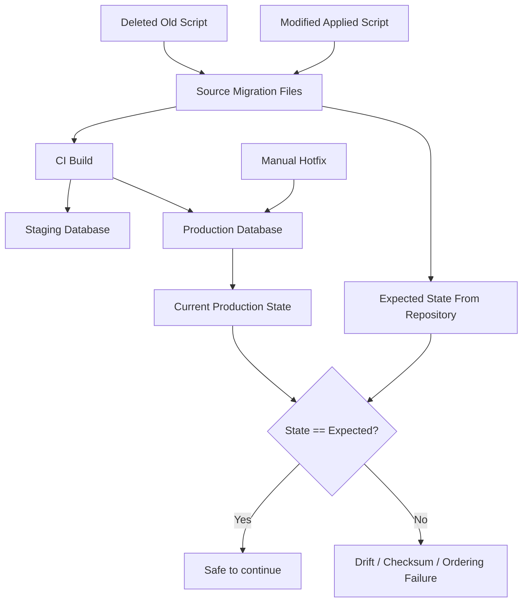
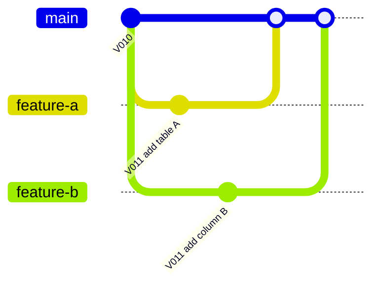
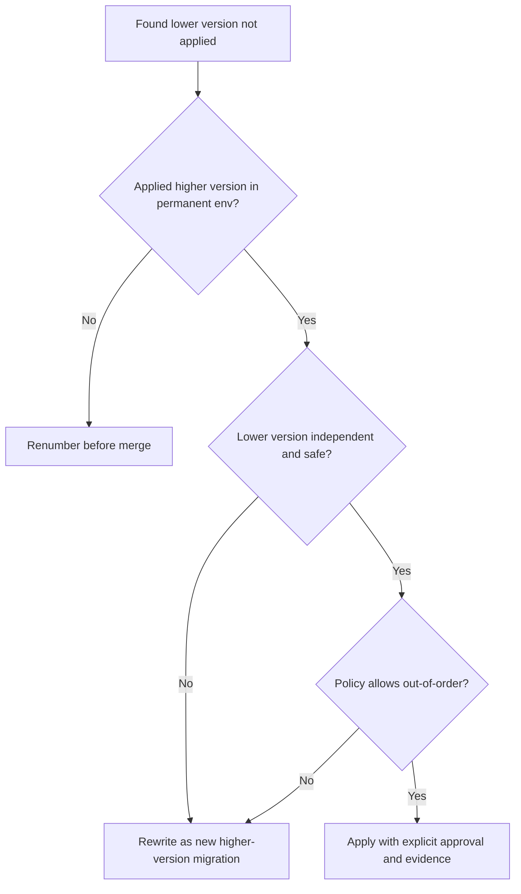
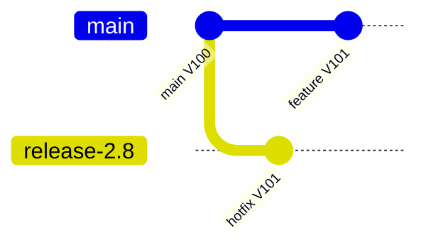
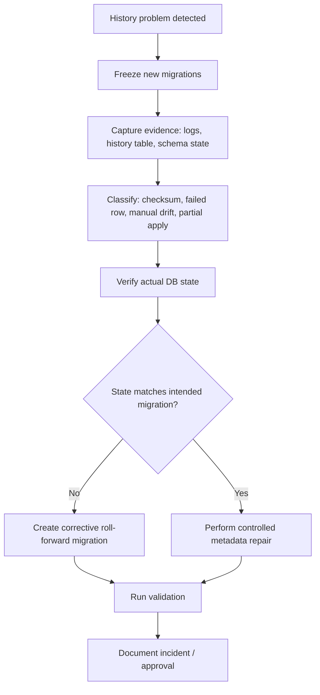
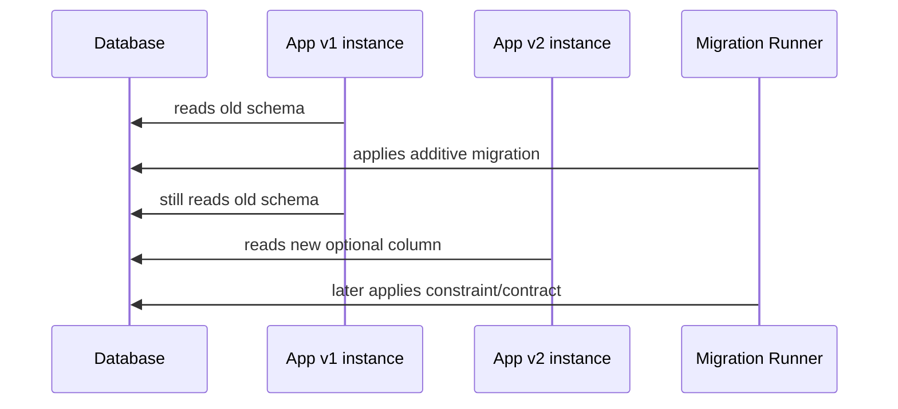
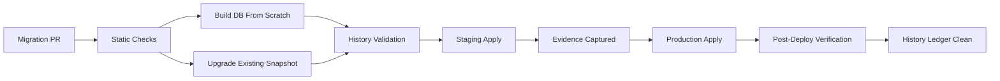

# Part 005 — Versioning, Ordering, History Table, Checksum, dan Drift

Database migration terlihat sederhana ketika hanya ada satu developer dan satu database lokal. Kompleksitas sebenarnya muncul ketika ada banyak branch, banyak environment, banyak service, banyak pipeline, dan database production yang tidak boleh diperlakukan seperti file sementara.

Part ini membahas satu fondasi yang menentukan apakah migration system Anda akan tetap waras setelah berbulan-bulan berjalan:

> Migration harus punya urutan, identitas, bukti eksekusi, dan mekanisme deteksi perubahan yang tidak bergantung pada ingatan manusia.

Flyway dan Liquibase menyelesaikan masalah ini dengan model berbeda, tetapi problem dasarnya sama:

- perubahan harus dieksekusi dalam urutan yang bisa diprediksi;
- perubahan yang sudah diterapkan tidak boleh diam-diam berubah;
- database harus bisa menjawab: “saya sudah menerima perubahan apa saja?”;
- pipeline harus bisa mendeteksi drift sebelum aplikasi gagal;
- engineer harus bisa membedakan migration yang benar-benar baru dari mutation terhadap history lama.

Kita tidak akan mengulang dasar SQL/JDBC. Fokusnya adalah **versioning discipline** sebagai bagian dari engineering control.

---

## 1. Masalah Inti: Database Tidak Punya Git Checkout

Source code bisa di-reset, branch bisa dihapus, build artifact bisa dibuat ulang. Database production berbeda. Ia menyimpan state bisnis yang sudah terjadi.

Masalahnya bukan hanya “bagaimana menjalankan script SQL”. Masalahnya adalah:



Tanpa mekanisme history, tim hanya bisa menebak:

- script mana yang sudah pernah dijalankan;
- script mana yang gagal sebagian;
- apakah file migration lama pernah diedit;
- apakah staging dan production benar-benar sejalan;
- apakah database berubah lewat jalur manual;
- apakah urutan migration sama di semua environment.

Migration tool yang baik tidak hanya mengeksekusi SQL. Ia membuat **ledger perubahan database**.

---

## 2. Empat Identitas dalam Migration

Untuk memahami versioning, pisahkan empat jenis identitas.

| Identitas | Pertanyaan | Contoh |
|---|---|---|
| Logical intent | Perubahan apa yang diinginkan? | “Tambah kolom `case_status`.” |
| Artifact identity | File/changeset mana yang merepresentasikan perubahan? | `V012__add_case_status.sql` atau `id=012-add-case-status` |
| Execution identity | Kapan, oleh siapa, dan di database mana perubahan diterapkan? | row di history table/changelog table |
| Content identity | Apakah isi artifact sama dengan saat diterapkan? | checksum/hash |

Banyak anti-pattern lahir karena empat identitas ini dicampur.

Contoh:

```txt
Developer mengubah file V012__add_case_status.sql setelah staging sudah menjalankannya.
```

Secara logical intent mungkin terlihat “hanya memperbaiki typo”. Tetapi artifact identity sama, content identity berubah, dan execution identity di staging sudah terlanjur mencatat versi lama. Akibatnya staging dan repository tidak lagi punya hubungan deterministik.

Aturan praktis:

> Setelah migration masuk environment permanen, treat migration tersebut sebagai immutable historical record.

Environment permanen berarti minimal: shared dev, integration, staging, UAT, pre-prod, production, atau environment yang menjadi basis keputusan tim lain. Local database pribadi boleh di-reset. Permanent downstream environment tidak boleh dianggap disposable.

---

## 3. Versioning Bukan Sekadar Nomor File

Versioning migration punya tiga tujuan:

1. **Ordering** — menentukan urutan perubahan.
2. **Identity** — membedakan satu perubahan dari perubahan lain.
3. **Traceability** — menghubungkan perubahan ke ticket, PR, release, incident, atau audit evidence.

Naming convention yang buruk membuat sistem sulit dioperasikan walaupun tool-nya benar.

### 3.1 Bad Naming

```txt
V1__init.sql
V2__update.sql
V3__fix.sql
V4__new_changes.sql
V5__final.sql
V6__final2.sql
```

Masalah:

- tidak menjelaskan domain perubahan;
- tidak mudah direview;
- sulit dikaitkan ke user story;
- sulit dicari saat incident;
- membuat PR review hanya membaca diff tanpa konteks.

### 3.2 Better Naming

```txt
V20260628_0915__case_add_status_column.sql
V20260628_1040__case_backfill_status_from_legacy_state.sql
V20260629_1430__case_add_status_not_null_constraint.sql
```

Atau untuk sequential release train:

```txt
V0421__case_add_status_column.sql
V0422__case_backfill_status_from_legacy_state.sql
V0423__case_add_status_not_null_constraint.sql
```

Aturan yang baik:

- nama menyebut aggregate/domain/table yang berubah;
- nama menyebut aksi utama;
- nama cukup stabil untuk audit;
- nama tidak terlalu generik;
- nama tidak berisi “fix”, “temp”, “final”, “new”, tanpa konteks;
- penamaan bisa disort secara deterministik.

---

## 4. Ordering: Linear History vs Real Branching

Migration tool ingin history terlihat linear. Development workflow sering tidak linear.



Dua branch bisa membuat versi migration yang sama. Konflik ini tidak selalu terlihat sebagai merge conflict jika file berbeda nama tapi versi sama, tergantung tool dan naming.

### 4.1 Sequential Numbering

Contoh:

```txt
V011__add_case_priority.sql
V012__create_case_assignment.sql
```

Kelebihan:

- mudah dibaca;
- urutan rapi;
- bagus untuk release train kecil;
- cocok saat migration dikelola ketat oleh satu pipeline.

Kekurangan:

- sering konflik saat banyak branch paralel;
- developer perlu renumber sebelum merge;
- PR lama bisa stale;
- membutuhkan discipline review tinggi.

### 4.2 Timestamp-Based Versioning

Contoh:

```txt
V20260628104500__add_case_priority.sql
V20260628111230__create_case_assignment.sql
```

Kelebihan:

- mengurangi tabrakan versi;
- cocok untuk trunk-based development;
- mudah mengurutkan secara global;
- baik untuk tim besar.

Kekurangan:

- urutan teknis bisa tidak sama dengan urutan intent bisnis;
- timestamp lokal bisa salah jika dibuat manual;
- nama lebih panjang;
- masih perlu review dependency antar migration.

### 4.3 Semantic Release Versioning

Contoh:

```txt
V2_14_0_001__add_case_priority.sql
V2_14_0_002__create_case_assignment.sql
```

Kelebihan:

- terkait ke release;
- membantu audit release package;
- cocok untuk enterprise deployment batch.

Kekurangan:

- kurang cocok untuk continuous deployment;
- migration harus sering dipindah saat release berubah;
- raw database evolution menjadi terlalu terikat calendar release.

### 4.4 Recommendation

Untuk tim modern dengan CI/CD aktif:

| Kondisi | Strategi yang biasanya sehat |
|---|---|
| Tim kecil, release jarang | sequential numbering cukup |
| Banyak branch paralel | timestamp-based versioning lebih aman |
| Enterprise release train ketat | release-scoped numbering bisa masuk akal |
| Multi-service shared migration repo | timestamp + domain prefix lebih scalable |
| Regulated environment | timestamp + ticket/reference + approval evidence |

Yang paling penting bukan formatnya. Yang paling penting adalah **format tersebut membuat ordering deterministic dan conflict visible**.

---

## 5. Flyway Model: Versioned Migration dan Schema History

Flyway memandang migration sebagai script yang disimpan di version control dan dijalankan ke environment lain secara konsisten. Untuk **versioned migration**, Flyway menerapkan migration dalam urutan versi dan hanya sekali. Status eksekusi dilacak di schema history table.

Contoh Flyway versioned migration:

```txt
src/main/resources/db/migration/
  V20260628090000__case_create_case_table.sql
  V20260628100000__case_add_status_column.sql
  V20260628103000__case_backfill_status.sql
```

Contoh isi:

```sql
ALTER TABLE enforcement_case
ADD COLUMN status VARCHAR(32);
```

Flyway akan mencatat metadata eksekusi di table history, umumnya bernama `flyway_schema_history` kecuali dikonfigurasi lain.

Secara konseptual:

| Kolom konseptual | Makna |
|---|---|
| version | versi migration |
| description | deskripsi dari nama file |
| type | SQL, Java, baseline, repeatable, dll. |
| script | nama artifact |
| checksum | fingerprint isi migration |
| installed_by | identity runner |
| installed_on | waktu eksekusi |
| execution_time | durasi |
| success | status berhasil/gagal |

Jangan terlalu bergantung pada daftar kolom persis di aplikasi Anda. Tool/version bisa berubah. Yang penting adalah fungsi history table:

> History table adalah ledger yang mengikat artifact repository dengan state aktual database.

---

## 6. Liquibase Model: Changeset dan DATABASECHANGELOG

Liquibase memandang perubahan sebagai `changeset` di dalam changelog. Identity changeset umumnya ditentukan oleh kombinasi:

- `id`;
- `author`;
- path/file changelog.

Contoh formatted SQL Liquibase:

```sql
--liquibase formatted sql

--changeset reg-eng:20260628-001-add-case-status
ALTER TABLE enforcement_case
ADD COLUMN status VARCHAR(32);
```

Contoh YAML:

```yaml
 databaseChangeLog:
   - changeSet:
       id: 20260628-001-add-case-status
       author: reg-eng
       changes:
         - addColumn:
             tableName: enforcement_case
             columns:
               - column:
                   name: status
                   type: varchar(32)
```

Liquibase mencatat eksekusi changeset di `DATABASECHANGELOG`. Untuk lock eksekusi, Liquibase juga memakai `DATABASECHANGELOGLOCK`.

Secara konseptual, `DATABASECHANGELOG` menyimpan:

| Kolom konseptual | Makna |
|---|---|
| id | id changeset |
| author | author changeset |
| filename | lokasi changelog |
| dateexecuted | waktu eksekusi |
| orderexecuted | urutan eksekusi |
| exectype | EXECUTED, RERAN, MARK_RAN, dll. |
| md5sum | checksum changeset |
| description | ringkasan change |
| comments | komentar |
| tag | tag database |
| liquibase | versi Liquibase |
| deployment_id | deployment run |

Perhatikan perbedaan penting:

- Flyway biasanya mengikat urutan ke versi file migration.
- Liquibase mengikat eksekusi ke identity changeset.
- Liquibase memungkinkan model conditional/contextual lebih kaya, tetapi konsekuensinya governance harus lebih ketat.

---

## 7. Checksum: Penjaga Immutability

Checksum bukan mekanisme keamanan kriptografis untuk mencegah penyerang. Dalam konteks migration, checksum adalah **detektor perubahan artifact**.

Tujuan checksum:

1. mendeteksi migration lama yang diedit;
2. mendeteksi file yang berbeda antar branch/environment;
3. mencegah database mengaku berada pada versi yang sama padahal script berbeda;
4. mendukung reproducibility;
5. memperkuat audit trail.

### 7.1 Contoh Masalah

Awalnya migration:

```sql
-- V010__add_case_status.sql
ALTER TABLE enforcement_case ADD COLUMN status VARCHAR(20);
```

Sudah diterapkan di staging.

Kemudian developer mengubah file yang sama:

```sql
-- V010__add_case_status.sql
ALTER TABLE enforcement_case ADD COLUMN status VARCHAR(32) DEFAULT 'OPEN';
```

Dari sudut pandang manusia, “masih add status”. Dari sudut migration system, ini perubahan berbeda.

Risiko:

- staging punya `VARCHAR(20)` tanpa default;
- production nanti menjalankan `VARCHAR(32) DEFAULT 'OPEN'`;
- repository hanya menyimpan versi baru;
- hasil forensic sulit karena artifact lama hilang;
- integration test dari scratch tidak merepresentasikan staging.

Checksum membuat perbedaan ini terlihat.

---

## 8. Immutable Applied Migration Rule

Aturan utama:

> Jangan mengedit migration yang sudah diterapkan ke environment permanen. Buat migration baru untuk memperbaiki state.

### 8.1 Salah

```txt
V010__add_case_status.sql      <-- already applied
```

Lalu diedit untuk menambah default:

```sql
ALTER TABLE enforcement_case ADD COLUMN status VARCHAR(32) DEFAULT 'OPEN';
```

### 8.2 Benar

Biarkan migration lama:

```sql
-- V010__add_case_status.sql
ALTER TABLE enforcement_case ADD COLUMN status VARCHAR(32);
```

Tambahkan migration baru:

```sql
-- V011__case_set_status_default.sql
ALTER TABLE enforcement_case
ALTER COLUMN status SET DEFAULT 'OPEN';
```

Jika perlu backfill:

```sql
-- V012__case_backfill_status_open.sql
UPDATE enforcement_case
SET status = 'OPEN'
WHERE status IS NULL;
```

Jika perlu constraint:

```sql
-- V013__case_set_status_not_null.sql
ALTER TABLE enforcement_case
ALTER COLUMN status SET NOT NULL;
```

Dengan model ini, history tetap jujur.

---

## 9. Apakah Tidak Boleh Mengedit Migration Lama Sama Sekali?

Ada nuance.

| Kondisi | Boleh edit? | Catatan |
|---|---:|---|
| Belum pernah diterapkan di mana pun | Ya | Masih draft lokal |
| Hanya diterapkan di local database pribadi | Biasanya ya | Reset local DB jika perlu |
| Sudah masuk shared dev | Hindari | Bisa merusak rekan tim |
| Sudah masuk CI integration DB | Hindari keras | Pipeline history sudah terbentuk |
| Sudah masuk staging/UAT | Tidak | Treat sebagai permanent history |
| Sudah masuk production | Tidak | Buat migration baru |
| Perubahan hanya komentar/format | Tetap hati-hati | Tool tertentu bisa tetap mempengaruhi checksum atau review evidence |

Prinsipnya:

> Semakin jauh downstream migration berjalan, semakin mahal mengubah artifact-nya.

Untuk regulated systems, bahkan perubahan komentar pada artifact yang sudah disetujui bisa menjadi isu audit karena approval evidence mengacu pada artifact lama.

---

## 10. Ordering Failure dan Out-of-Order Migration

Out-of-order terjadi ketika database sudah menerima versi lebih tinggi, lalu tool menemukan versi lebih rendah yang belum diterapkan.

Contoh:

```txt
Production applied:
  V001
  V002
  V004

Repository now contains:
  V001
  V002
  V003
  V004
```

Mengapa bisa terjadi?

- branch lama merge terlambat;
- hotfix dibuat dengan versi lebih tinggi;
- release branch dan main branch berjalan paralel;
- manual cherry-pick migration;
- timestamp salah;
- migration dari service lain masuk belakangan.

### 10.1 Opsi Respons

| Respons | Cocok untuk | Risiko |
|---|---|---|
| Block deploy | default aman | butuh renumber/rework |
| Renumber migration baru | jika belum applied permanen | mengubah artifact sebelum downstream |
| Create new higher version | paling sering aman | history tetap linear |
| Enable out-of-order | kasus khusus | bisa menyembunyikan dependency issue |
| Manual patch | emergency only | tinggi audit risk |

### 10.2 Decision Rule

Gunakan rule ini:



Out-of-order bukan dosa mutlak. Tetapi ia harus menjadi **explicit exception**, bukan default habit.

---

## 11. Branching Strategy untuk Migration

### 11.1 Feature Branch Migration

Feature branch membuat migration bersama code:

```txt
feature/case-status
  src/main/java/...
  src/main/resources/db/migration/V20260628090000__case_add_status.sql
```

Bagus karena schema dan code berevolusi bersama. Risiko muncul saat branch lama.

Checklist sebelum merge:

- apakah versi migration bertabrakan?;
- apakah ada migration baru di main yang harus dijalankan dulu?;
- apakah migration bergantung pada table/column dari branch lain?;
- apakah migration backward-compatible dengan aplikasi versi lama?;
- apakah migration harus dipisah menjadi expand/backfill/contract?;
- apakah integration test dari clean database dan migrated database sama-sama pass?

### 11.2 Trunk-Based Development

Trunk-based cocok untuk migration kecil dan sering. Tetapi ia menuntut:

- migration additive;
- feature flag;
- backward compatibility;
- small batch;
- automated migration test;
- branch lifetime pendek.

### 11.3 Release Branch

Release branch sering menciptakan divergence:



Jika release branch dan main sama-sama membuat `V101`, conflict muncul. Strategy:

- reserve version range per release branch;
- gunakan timestamp;
- selalu cherry-pick migration dengan review;
- jangan menyalin isi migration tanpa mempertahankan identity decision;
- catat hotfix sebagai migration baru di main jika production sudah menerimanya.

---

## 12. Drift: Ketika Database Tidak Lagi Sama dengan Repository

Drift adalah perbedaan antara expected database state dari repository migration dan actual database state di environment.

Jenis drift:

| Drift | Contoh | Dampak |
|---|---|---|
| Schema drift | column manual ditambah di production | migration berikutnya gagal atau silently inconsistent |
| History drift | row history table diedit/dihapus | tool tidak bisa percaya ledger |
| Checksum drift | applied migration file berubah | validation failure |
| Data drift | reference data beda antar env | behavior aplikasi beda |
| Permission drift | grants manual beda | deploy sukses di staging, gagal production |
| Config drift | placeholder/env var beda | migration hasilkan schema berbeda |

### 12.1 Drift Detection Levels

| Level | Deteksi | Kekuatan |
|---|---|---|
| Migration history validation | validate checksum/history | cepat dan wajib |
| Schema introspection | compare actual schema | menemukan manual DDL |
| Data invariant check | count/checksum/domain rules | penting untuk DML/backfill |
| Application compatibility test | app lama/baru terhadap schema | validasi contract |
| Audit reconciliation | compare PR/deploy/ticket/history | regulatory evidence |

Tool migration biasanya kuat di history validation. Tetapi drift manual yang tidak tercatat bisa membutuhkan diff/snapshot/introspection tambahan.

---

## 13. Versioning untuk Reference Data

Reference data sering dianggap kecil, lalu menjadi sumber bug besar.

Contoh:

```sql
INSERT INTO case_status(code, label)
VALUES ('OPEN', 'Open');
```

Pertanyaan penting:

- apakah row ini immutable?;
- apakah boleh diubah oleh admin UI?;
- apakah environment dev/staging/prod harus sama?;
- apakah delete berarti hard delete atau deactivate?;
- apakah order/id digunakan oleh aplikasi?;
- apakah natural key stabil?;
- apakah migration rerunnable?;
- apakah perubahan label punya dampak report/audit?

### 13.1 Natural Key over Surrogate ID

Buruk:

```sql
INSERT INTO case_status(id, label)
VALUES (1, 'Open');
```

Lebih baik:

```sql
INSERT INTO case_status(code, label, is_active)
VALUES ('OPEN', 'Open', TRUE);
```

Jika database mendukung upsert:

```sql
INSERT INTO case_status(code, label, is_active)
VALUES ('OPEN', 'Open', TRUE)
ON CONFLICT (code)
DO UPDATE SET
    label = EXCLUDED.label,
    is_active = EXCLUDED.is_active;
```

Namun hati-hati: upsert membuat migration lebih rerunnable, tetapi bisa menyembunyikan data drift jika production sudah diubah manual. Untuk regulated data, perubahan reference data mungkin harus **append-only** atau punya audit table.

---

## 14. History Table Bukan Tempat untuk Diutak-atik

History table menggoda untuk diperbaiki manual ketika migration gagal.

Contoh anti-pattern:

```sql
DELETE FROM flyway_schema_history WHERE version = '12';
```

Atau:

```sql
UPDATE DATABASECHANGELOG
SET MD5SUM = NULL
WHERE ID = '20260628-001-add-case-status';
```

Masalah:

- Anda mengubah ledger, bukan menyelesaikan root cause;
- audit trail menjadi tidak jujur;
- migration berikutnya mungkin salah asumsi;
- forensic incident makin sulit;
- tool behavior bisa berbeda dari yang Anda kira.

### 14.1 Kapan History Repair Masuk Akal?

Repair bisa masuk akal saat:

- migration gagal sebelum state penting berubah;
- checksum mismatch disebabkan perubahan yang sudah disetujui dan dipahami;
- ada manual hotfix yang harus diselaraskan secara eksplisit;
- tool metadata rusak tetapi schema aktual sudah diverifikasi;
- ada approval operasional dan evidence.

Repair harus mengikuti playbook:



Rule:

> Jangan memperbaiki history sebelum memverifikasi state aktual database.

---

## 15. Multi-Environment Version Skew

Dalam organisasi nyata, environment tidak selalu sejajar.

```txt
local:      V001 V002 V003 V004 V005
CI:         V001 V002 V003 V004 V005
staging:    V001 V002 V003 V004
production: V001 V002 V003
hotfix:     V001 V002 V003 V006
```

Version skew bukan selalu error. Bisa terjadi karena release sedang berjalan. Yang berbahaya adalah skew tanpa policy.

### 15.1 Allowed Skew

Skew yang biasanya valid:

- staging satu release lebih maju dari production;
- preview environment memakai branch-specific migration;
- tenant tertentu belum di-upgrade karena rollout bertahap;
- production hotfix sementara sudah dicatat dan akan direconcile.

### 15.2 Dangerous Skew

Skew yang berbahaya:

- production punya migration yang tidak ada di repository main;
- staging punya perubahan manual;
- CI hanya migrate from scratch, tidak test upgrade dari versi lama;
- branch deploy menimpa migration dari branch lain;
- tenant A dan B beda schema tanpa version compatibility handling.

### 15.3 Environment Matrix

Untuk sistem serius, simpan matrix seperti ini:

| Environment | Expected version | Actual version | Drift status | Owner | Last validated |
|---|---:|---:|---|---|---|
| dev-shared | latest main | latest main | clean | platform | CI |
| staging | release candidate | release candidate | clean | release eng | pre-prod gate |
| production | approved release | approved release | clean | ops/db | deploy window |
| tenant-42 | rollout batch 3 | rollout batch 2 | allowed skew | tenant ops | rollout dashboard |

Matrix ini bukan birokrasi. Ini membuat migration menjadi observable.

---

## 16. Dependency Antar Migration

Urutan version tidak otomatis berarti dependency benar.

Contoh:

```txt
V010__create_case_table.sql
V011__add_case_status.sql
V012__backfill_case_status.sql
V013__add_case_status_not_null.sql
```

Dependency-nya jelas.

Tetapi dalam banyak branch:

```txt
V020__create_assignment_table.sql
V021__add_case_owner_column.sql
V022__add_assignment_fk_to_case.sql
```

`V022` bergantung pada `V020` dan `V021`. Jika out-of-order atau cherry-pick terjadi, migration bisa gagal.

### 16.1 Encode Dependency dengan Naming dan Review

```txt
V20260628110000__assignment_create_table.sql
V20260628113000__case_add_owner_column.sql
V20260628120000__assignment_add_fk_to_case_owner.sql
```

Better than generic names, tetapi belum cukup. PR description harus menyebut dependency:

```md
Migration dependency:
- requires enforcement_case table existing
- requires assignment table from V20260628110000
- must run before application version 2.18 enables assignment routing
```

### 16.2 Avoid Cross-Domain Hidden Dependency

Buruk:

```sql
ALTER TABLE payment_event
ADD CONSTRAINT fk_payment_case
FOREIGN KEY (case_id) REFERENCES enforcement_case(id);
```

Jika payment dan enforcement dimiliki service/tim berbeda, migration ini bukan sekadar DDL. Ia adalah contract coupling.

Pertanyaan review:

- siapa owner referenced table?;
- apakah lifecycle delete/update compatible?;
- apakah FK akan menciptakan lock/write amplification?;
- apakah batch import bisa gagal?;
- apakah service boundary dilanggar?;
- apakah reporting membutuhkan FK fisik atau cukup logical reference?

---

## 17. Compatibility Window

Versioning migration harus selalu dikaitkan dengan versi aplikasi.

Kesalahan umum:

```txt
Deploy migration and app as if both switch atomically.
```

Dalam distributed deployment, ini jarang benar.

Saat rolling deploy:



Rule:

> Migration version N harus kompatibel dengan aplikasi sebelum dan sesudah deploy selama compatibility window.

Contoh aman:

1. Add nullable column.
2. Deploy app yang mulai menulis column baru.
3. Backfill old rows.
4. Verify no null.
5. Add not null constraint.
6. Remove old code path.

Contoh tidak aman:

```sql
ALTER TABLE enforcement_case RENAME COLUMN old_status TO status;
```

Jika app lama masih berjalan, ia gagal karena `old_status` hilang.

---

## 18. Review Checklist untuk Versioning dan History

Gunakan checklist ini di PR migration.

### 18.1 Identity and Naming

- [ ] Nama migration menjelaskan domain dan aksi.
- [ ] Version unik dan sorting deterministic.
- [ ] Tidak ada duplicate version/changeset id.
- [ ] Tidak ada perubahan pada migration yang sudah applied downstream.
- [ ] Ticket/PR/reason bisa dilacak.

### 18.2 Ordering and Dependency

- [ ] Migration tidak bergantung pada artifact yang belum merged.
- [ ] Urutan DDL/DML/constraint benar.
- [ ] Backfill terjadi sebelum constraint tightening.
- [ ] FK/index tidak menciptakan dependency lintas ownership tanpa approval.
- [ ] Out-of-order tidak diperlukan, atau dicatat sebagai exception.

### 18.3 History and Checksum

- [ ] `validate`/equivalent check dijalankan di CI.
- [ ] Checksum mismatch diperlakukan sebagai failure, bukan diabaikan.
- [ ] Tidak ada manual edit history table.
- [ ] Repair hanya via playbook.
- [ ] Evidence migration tersimpan.

### 18.4 Compatibility

- [ ] Migration kompatibel dengan app versi lama dan baru selama rolling deploy.
- [ ] Destructive change dipisah ke fase contract.
- [ ] Data migration punya verification query.
- [ ] Roll-forward plan ada.

---

## 19. Common Anti-Patterns

### 19.1 Edit Applied Migration

Paling sering dan paling merusak.

Gejala:

- checksum mismatch;
- staging dan production beda;
- developer berkata “cuma ubah sedikit”; 
- CI dari scratch pass, upgrade path fail.

Solusi:

- restore artifact lama;
- buat migration baru;
- jika sudah terlanjur, lakukan forensic dan repair sesuai playbook.

### 19.2 Delete Old Migration to Clean Repository

Buruk:

```txt
Remove V001..V200 because database is already at V200.
```

Risiko:

- environment baru tidak bisa dibangun from scratch;
- audit trail hilang;
- disaster recovery lebih sulit;
- migration validation gagal;
- developer baru tidak bisa reproduce schema.

Alternatif:

- gunakan baseline/squash hanya dengan policy jelas;
- simpan archive immutable;
- pastikan clean bootstrap tetap bisa dilakukan;
- dokumentasikan cutoff version.

### 19.3 One Giant Migration Per Release

```txt
V20260628__release_2_18.sql
```

Berisi 2.000 baris DDL/DML.

Masalah:

- review sulit;
- failure sulit diisolasi;
- lock duration panjang;
- rollback tidak jelas;
- dependency tersembunyi.

Lebih baik pecah berdasarkan intent:

```txt
V20260628090000__case_add_status_column.sql
V20260628093000__case_backfill_status.sql
V20260628100000__case_add_status_constraint.sql
```

### 19.4 Manual Production Patch without Migration

Kadang emergency memaksa manual SQL. Masalahnya bukan hanya manual SQL. Masalahnya adalah jika patch tidak direconcile ke repository.

Rule:

> Manual production patch harus diikuti migration artifact yang merepresentasikan final state atau corrective path.

Jika tidak, environment berikutnya akan drift.

### 19.5 Environment-Specific Version History

Buruk:

```txt
V010__prod_only_fix.sql
V010__staging_only_fix.sql
```

Atau SQL:

```sql
-- pseudo anti-pattern
IF current_database() = 'prod' THEN
  ALTER TABLE ...
END IF;
```

Migration boleh memakai placeholder/config, tetapi identity dan intent tidak boleh bercabang liar.

---

## 20. Practical Exercise

Latihan ini dirancang untuk membentuk intuisi, bukan hanya menghafal command.

### 20.1 Exercise A — Checksum Failure

1. Buat database lokal.
2. Jalankan migration `V001__create_case.sql`.
3. Edit file migration lama.
4. Jalankan validate/migrate lagi.
5. Catat error.
6. Restore file lama.
7. Buat migration baru `V002__alter_case.sql`.
8. Jalankan ulang.

Pertanyaan refleksi:

- Apa yang berubah di database?
- Apa yang berubah di history table?
- Mengapa tool tidak bisa “percaya” pada file yang diedit?
- Apa bedanya local disposable environment dan staging?

### 20.2 Exercise B — Branch Conflict

Simulasikan dua branch:

```txt
branch A: V002__add_case_priority.sql
branch B: V002__add_case_owner.sql
```

Merge keduanya. Pecahkan konflik dengan:

- renumber salah satu;
- timestamp version;
- create new migration;
- out-of-order.

Bandingkan trade-off.

### 20.3 Exercise C — Manual Drift

1. Jalankan migration normal.
2. Tambahkan column manual via SQL client.
3. Buat migration yang menambah column yang sama.
4. Jalankan pipeline.
5. Analisis failure.

Pertanyaan:

- Apakah history table tahu manual change terjadi?
- Apakah schema diff diperlukan?
- Bagaimana menulis corrective migration?

---

## 21. Engineering Heuristics

Simpan heuristik ini.

1. **Migration file is historical evidence, not editable configuration.**
2. **History table is a ledger, not a scratchpad.**
3. **Checksum mismatch is a symptom, not the root cause.**
4. **Out-of-order migration is an exception policy, not a merge strategy.**
5. **Clean database success is necessary but not sufficient; upgrade path matters more.**
6. **Reference data is code when application behavior depends on it.**
7. **Every destructive change needs a compatibility window.**
8. **Manual hotfix must be reconciled into version control.**
9. **Versioning strategy must match branching strategy.**
10. **Auditability is easier when designed before incident.**

---

## 22. Mini Decision Table

| Situation | Better Action |
|---|---|
| Migration already applied in staging, needs change | Add a new migration |
| Migration only applied locally | Reset local DB and edit if needed |
| Duplicate version from branch merge | Renumber before downstream apply |
| Production has hotfix not in repo | Add reconciliation migration and evidence |
| Checksum mismatch | Stop, inspect artifact/history/state, do not blindly repair |
| Need late migration with lower version | Prefer new higher version; out-of-order only by policy |
| Need to compress old migrations | Use controlled baseline/squash policy |
| Need environment-specific behavior | Prefer config/contexts with strict governance, not hidden SQL branches |

---

## 23. What Good Looks Like

Sistem migration yang sehat punya ciri berikut:



Ciri-ciri maturity:

- setiap migration punya reason;
- file lama immutable;
- checksum mismatch diperlakukan serius;
- branch conflict diselesaikan sebelum downstream;
- CI test clean build dan upgrade path;
- production migration punya logs dan approval;
- drift punya detection mechanism;
- repair punya playbook;
- history table tidak diedit manual tanpa evidence.

---

## 24. Part Summary

Versioning dan history bukan detail administratif. Ini adalah mekanisme yang membuat database evolution bisa dipercaya.

Inti Part 005:

- database production membutuhkan ledger perubahan;
- migration punya identity, ordering, execution evidence, dan content fingerprint;
- checksum mencegah mutation terhadap applied artifact;
- applied migration harus immutable;
- out-of-order harus exception, bukan kebiasaan;
- drift bisa terjadi di schema, history, data, permission, dan config;
- versioning strategy harus selaras dengan branching dan release strategy;
- history repair harus berbasis forensic state, bukan panic edit.

Di Part 006, kita masuk ke fondasi berikutnya: **idempotency, repeatability, determinism, dan rerunnable migration design**. Ini penting karena banyak engineer mengira “pakai `IF EXISTS` berarti aman”, padahal tidak sesederhana itu.

---

## References

- Flyway Documentation — Migrations: https://documentation.red-gate.com/fd/migrations-271585107.html
- Flyway Documentation — Versioned Migrations: https://documentation.red-gate.com/fd/versioned-migrations-273973333.html
- Flyway Documentation — Schema History Table: https://documentation.red-gate.com/fd/flyway-schema-history-table-273973417.html
- Flyway Documentation — Out Of Order Setting: https://documentation.red-gate.com/fd/flyway-out-of-order-setting-277579015.html
- Flyway Documentation — Validate: https://documentation.red-gate.com/fd/validate-277578898.html
- Liquibase Documentation — What is a Changeset: https://docs.liquibase.com/concepts/changelogs/changeset.html
- Liquibase Documentation — What is a Changeset Checksum: https://docs.liquibase.com/secure/user-guide-5-1-1/what-is-a-changeset-checksum
