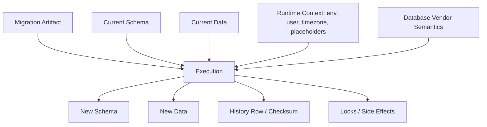
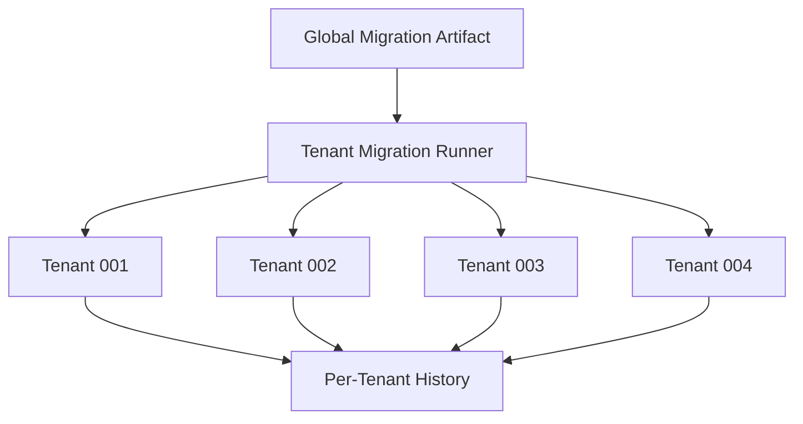

# Part 006 — Idempotency, Repeatability, dan Determinism

Banyak engineer memakai kata “idempotent” terlalu longgar dalam migration review. Biasanya maksudnya: “script ini aman dijalankan ulang.” Tetapi dalam database migration production, kalimat itu terlalu kabur.

Script bisa:

- aman dijalankan ulang tetapi menghasilkan data salah;
- gagal saat dijalankan ulang tetapi justru lebih aman;
- idempotent secara DDL tetapi tidak deterministic secara data;
- repeatable di Flyway/Liquibase tetapi tidak idempotent secara SQL;
- deterministic di satu database vendor tetapi tidak di vendor lain;
- terlihat aman karena `IF EXISTS`, tetapi menyembunyikan drift.

Part ini membangun mental model yang lebih presisi.

> Idempotency menjawab “apakah efek akhirnya sama jika dijalankan lebih dari sekali?” Repeatability menjawab “apakah tool memang akan menjalankannya ulang?” Determinism menjawab “apakah input yang sama menghasilkan output yang sama?” Ketiganya berbeda.

---

## 1. Tiga Konsep yang Sering Tertukar

| Konsep | Pertanyaan Utama | Contoh |
|---|---|---|
| Idempotency | Jika dijalankan ulang, apakah final state tetap sama? | `CREATE TABLE IF NOT EXISTS ...` |
| Repeatability | Apakah migration framework akan menjalankan ulang artifact ini? | Flyway `R__view.sql`, Liquibase `runOnChange` |
| Determinism | Apakah hasilnya sama untuk input/state yang sama? | Avoid `NOW()` untuk historical backfill tanpa fixed timestamp |

Ketiganya bisa berkombinasi.

| Case | Idempotent | Repeatable | Deterministic | Risiko |
|---|---:|---:|---:|---|
| `CREATE TABLE IF NOT EXISTS` | Ya | Tidak selalu | Ya | Bisa menyembunyikan schema drift |
| Flyway repeatable view `CREATE OR REPLACE VIEW` | Biasanya | Ya | Ya jika definisi stabil | Dependency/order |
| `INSERT INTO audit_run VALUES (NOW())` | Tidak | Bisa | Tidak | Data berubah tiap run |
| Backfill `UPDATE ... WHERE target IS NULL` | Biasanya | Tidak selalu | Tergantung rule | Bisa salah jika source berubah |
| `DELETE FROM table; INSERT ...` | Bisa final-state idempotent | Bisa | Ya/Tidak | Destructive, lock, audit loss |

---

## 2. Mental Model: Migration sebagai State Transition

Pikirkan migration sebagai fungsi:

```txt
migration(current_database_state, artifact_content, runtime_context) -> new_database_state
```

Agar aman, kita ingin:

```txt
same input state + same artifact + same context -> same output state
```

Namun database migration jarang semurni itu karena ada:

- data production yang terus berubah;
- concurrent application writes;
- database vendor semantics;
- clock/timezone;
- sequence/identity/autoincrement;
- random UUID;
- environment-specific placeholders;
- locks dan timeout;
- privileges;
- partially applied previous migration;
- manually drifted schema.

Diagram:



Idempotency hanya satu bagian dari fungsi ini. Determinism menuntut kita mengontrol input yang sering tidak terlihat.

---

## 3. Idempotency: Definisi yang Berguna

Dalam migration, idempotent berarti:

> Menjalankan operasi yang sama lebih dari sekali tidak mengubah final state setelah eksekusi pertama berhasil.

Contoh sederhana:

```sql
CREATE TABLE IF NOT EXISTS case_tag (
    id BIGINT PRIMARY KEY,
    code VARCHAR(64) NOT NULL
);
```

Jika table belum ada, table dibuat. Jika sudah ada, perintah tidak gagal.

Namun ini baru idempotent di level keberadaan table. Ia belum menjamin table yang sudah ada punya struktur yang benar.

Masalah:

```sql
CREATE TABLE IF NOT EXISTS case_tag (
    id BIGINT PRIMARY KEY,
    code VARCHAR(64) NOT NULL
);
```

Jika production sudah punya table manual:

```sql
CREATE TABLE case_tag (
    id BIGINT PRIMARY KEY,
    label VARCHAR(255)
);
```

`IF NOT EXISTS` bisa membuat migration “sukses” padahal schema salah.

### 3.1 Idempotency Can Hide Drift

Ini jebakan besar:

```txt
No error != correct schema.
```

Kadang failure lebih baik daripada silent success. Migration yang gagal karena object sudah ada bisa memaksa engineer memeriksa drift. Migration idempotent yang terlalu permisif bisa melewati masalah.

---

## 4. Safety Spectrum

Tidak semua migration harus idempotent. Yang penting adalah memilih safety semantics yang tepat.

| Style | Behavior | Cocok untuk | Risiko |
|---|---|---|---|
| Fail-fast | gagal jika object sudah ada/beda | versioned schema change | cepat mendeteksi drift |
| Idempotent guarded | skip jika sudah ada | bootstrap/dev/test, optional object | bisa menyembunyikan drift |
| Assertive idempotent | check state, lalu apply/skip | regulated production | lebih verbose |
| Repeatable replace | recreate/replace object | view/procedure/function | dependency dan invalid object |
| Reconciliatory | force final state | reference data/config | bisa overwrite manual change |

### 4.1 Fail-Fast Example

```sql
ALTER TABLE enforcement_case
ADD COLUMN escalation_level INTEGER;
```

Jika column sudah ada, migration gagal. Untuk production, ini bisa benar karena column yang sudah ada mungkin berarti:

- migration pernah dijalankan manual;
- branch lain membuat column sama;
- schema drift;
- naming collision;
- partial deployment.

### 4.2 Assertive Idempotent Example

Pola ini lebih aman daripada blind `IF NOT EXISTS`:

```sql
-- pseudo pattern; syntax differs by database
-- 1. Check whether column exists.
-- 2. If exists, verify type/nullability/default.
-- 3. If exact expected state, skip.
-- 4. If different, fail loudly.
-- 5. If absent, apply change.
```

Untuk PostgreSQL, pendekatan bisa memakai `DO $$` block dan query `information_schema`/catalog. Namun jangan mengubah semua migration menjadi procedural block kompleks. Gunakan saat ada kebutuhan nyata: multi-tenant rerun, repair script, bootstrap idempotent, atau deployment environment yang tidak selalu homogen.

---

## 5. Repeatability: Tool-Level Re-Execution

Repeatability bukan properti SQL saja. Ini juga property framework.

### 5.1 Flyway Repeatable Migration

Flyway repeatable migration biasanya diberi prefix `R__`:

```txt
db/migration/
  V001__create_case_table.sql
  V002__add_case_status.sql
  R__case_summary_view.sql
```

Contoh:

```sql
CREATE OR REPLACE VIEW case_summary AS
SELECT
    c.id,
    c.case_number,
    c.status,
    c.created_at
FROM enforcement_case c;
```

Repeatable migration dijalankan setelah versioned migration dan akan dijalankan ulang saat checksum-nya berubah.

Cocok untuk:

- view;
- stored procedure;
- function;
- package;
- materialized view definition;
- controlled bulk reference data reinserts.

Tidak cocok untuk:

- additive table evolution biasa;
- destructive DDL;
- one-time data backfill;
- migration dengan side effect akumulatif;
- audit row insertion;
- expensive operation yang tidak boleh sering rerun.

### 5.2 Liquibase runOnChange

Liquibase `runOnChange` menjalankan changeset pertama kali dan menjalankannya ulang saat changeset berubah.

Contoh formatted SQL:

```sql
--liquibase formatted sql

--changeset reg-eng:case-summary-view runOnChange:true
CREATE OR REPLACE VIEW case_summary AS
SELECT
    c.id,
    c.case_number,
    c.status,
    c.created_at
FROM enforcement_case c;
```

Cocok untuk object definition yang memang diganti sebagai satu kesatuan.

### 5.3 Liquibase runAlways

`runAlways` menjalankan changeset setiap deployment. Ini lebih kuat dan lebih berbahaya.

Contoh penggunaan yang masuk akal:

```sql
--liquibase formatted sql

--changeset reg-eng:update-deployment-marker runAlways:true
UPDATE deployment_marker
SET last_database_deploy_at = CURRENT_TIMESTAMP;
```

Tetapi untuk schema change biasa, `runAlways` hampir selalu salah.

Risiko:

- deployment makin lambat;
- side effect terjadi berulang;
- audit row bertambah terus;
- lock terjadi tiap release;
- sulit reason tentang final state;
- developer menggunakannya untuk “memaksa script jalan” tanpa memahami history.

Rule:

> Gunakan `runOnChange` untuk object definition yang berubah. Gunakan `runAlways` hanya untuk operasi yang memang secara bisnis/operasional harus terjadi setiap deployment.

---

## 6. Determinism: Masalah yang Lebih Halus

Migration deterministic jika input yang sama menghasilkan output yang sama.

Contoh deterministic:

```sql
UPDATE enforcement_case
SET status = 'OPEN'
WHERE status IS NULL;
```

Contoh non-deterministic:

```sql
UPDATE enforcement_case
SET migrated_at = CURRENT_TIMESTAMP
WHERE migrated_at IS NULL;
```

Tidak selalu salah. Tetapi harus disadari.

### 6.1 Time Dependency

Buruk untuk historical business field:

```sql
UPDATE enforcement_case
SET submitted_at = CURRENT_TIMESTAMP
WHERE submitted_at IS NULL;
```

Jika `submitted_at` mewakili waktu submission aktual, ini menciptakan data palsu.

Lebih baik:

```sql
UPDATE enforcement_case
SET submitted_at = created_at
WHERE submitted_at IS NULL
  AND lifecycle_state IN ('SUBMITTED', 'UNDER_REVIEW', 'CLOSED');
```

Atau jika memang waktu migration yang dicatat:

```sql
UPDATE enforcement_case
SET migration_batch_id = 'MIG-20260628-CASE-SUBMITTED-AT'
WHERE submitted_at IS NULL;
```

Lalu simpan metadata batch di table terpisah.

### 6.2 Randomness

```sql
UPDATE user_account
SET public_id = gen_random_uuid()
WHERE public_id IS NULL;
```

Ini mungkin benar jika public_id memang baru dibuat. Tetapi untuk rerun/resume, pastikan `WHERE public_id IS NULL` mencegah nilai berubah.

### 6.3 Ordering Without ORDER BY

Batch migration sering non-deterministic jika tidak punya ordering stabil.

Buruk:

```sql
SELECT id
FROM enforcement_case
WHERE migrated = false
LIMIT 1000;
```

Lebih baik:

```sql
SELECT id
FROM enforcement_case
WHERE migrated = false
ORDER BY id
LIMIT 1000;
```

Untuk data migration besar, ordering stabil penting untuk checkpoint dan resume.

---

## 7. Rerunnable vs Resumable

Rerunnable dan resumable juga berbeda.

| Konsep | Makna |
|---|---|
| Rerunnable | script bisa dijalankan lagi dari awal tanpa merusak final state |
| Resumable | script bisa melanjutkan dari titik terakhir setelah partial failure |
| Restartable | job bisa restart setelah process crash |
| Reversible | perubahan bisa dikembalikan |
| Roll-forwardable | failure bisa diperbaiki dengan migration baru |

Backfill besar biasanya harus **resumable**, bukan sekadar idempotent.

### 7.1 Naive Backfill

```sql
UPDATE enforcement_case
SET normalized_case_number = UPPER(case_number)
WHERE normalized_case_number IS NULL;
```

Ini idempotent-ish dan cukup untuk tabel kecil. Untuk tabel besar, masalahnya:

- lock besar;
- transaction log besar;
- replica lag;
- timeout;
- sulit progress tracking;
- sulit stop/restart.

### 7.2 Resumable Backfill Pattern

Gunakan checkpoint:

```sql
CREATE TABLE migration_checkpoint (
    migration_name VARCHAR(128) PRIMARY KEY,
    last_processed_id BIGINT NOT NULL,
    updated_at TIMESTAMP NOT NULL
);
```

Pseudo-flow:

```txt
while true:
  last_id = checkpoint.last_processed_id
  rows = select id from table where id > last_id order by id limit batch_size
  if rows empty: done
  update rows
  checkpoint = max(rows.id)
  commit
```

Ini lebih cocok dikerjakan oleh controlled Java migration job atau separate migration worker, bukan selalu satu SQL file besar.

---

## 8. DDL Idempotency Patterns

### 8.1 Create Table

Basic:

```sql
CREATE TABLE case_label (
    id BIGINT PRIMARY KEY,
    code VARCHAR(64) NOT NULL
);
```

Idempotent-ish:

```sql
CREATE TABLE IF NOT EXISTS case_label (
    id BIGINT PRIMARY KEY,
    code VARCHAR(64) NOT NULL
);
```

Assertive pattern:

```txt
if table absent:
  create table
else:
  assert columns, types, constraints match expected shape
```

Untuk production versioned migration, fail-fast sering lebih baik. Untuk bootstrap script atau multi-tenant onboarding, assertive idempotent lebih baik daripada blind `IF NOT EXISTS`.

### 8.2 Add Column

Basic:

```sql
ALTER TABLE enforcement_case
ADD COLUMN priority VARCHAR(16);
```

Idempotent-ish:

```sql
ALTER TABLE enforcement_case
ADD COLUMN IF NOT EXISTS priority VARCHAR(16);
```

Risiko:

- column sudah ada dengan type berbeda;
- column ada dengan default berbeda;
- column ada nullable padahal expected not null;
- column dibuat manual untuk tujuan lain.

Assertive review questions:

- apakah skip aman jika column already exists?;
- apakah type harus diverifikasi?;
- apakah nullability/default constraint harus diverifikasi?;
- apakah migration berikutnya bergantung pada column exact shape?

### 8.3 Add Index

```sql
CREATE INDEX idx_case_status
ON enforcement_case(status);
```

Idempotent-ish:

```sql
CREATE INDEX IF NOT EXISTS idx_case_status
ON enforcement_case(status);
```

Masalah: index name sama belum tentu definisi sama.

Index drift bisa terjadi:

```sql
-- Expected
CREATE INDEX idx_case_status ON enforcement_case(status);

-- Actual manual
CREATE INDEX idx_case_status ON enforcement_case(status, created_at);
```

`IF NOT EXISTS` bisa skip padahal query plan tidak sesuai expectation.

### 8.4 Add Constraint

Constraint idempotency lebih sulit.

```sql
ALTER TABLE enforcement_case
ADD CONSTRAINT chk_case_status
CHECK (status IN ('OPEN', 'CLOSED'));
```

Pertanyaan:

- apakah existing data valid?;
- apakah constraint akan lock table?;
- apakah database mendukung `NOT VALID` lalu `VALIDATE`?;
- apakah constraint name collision berarti same logic?;
- apakah enum/status akan bertambah di masa depan?

---

## 9. DML Idempotency Patterns

DML migration lebih berbahaya karena menyentuh data bisnis.

### 9.1 Insert Reference Data

Buruk:

```sql
INSERT INTO case_status(code, label)
VALUES ('OPEN', 'Open');
```

Rerun gagal karena duplicate key, atau lebih buruk: duplicate row jika tidak ada unique constraint.

Lebih baik:

```sql
INSERT INTO case_status(code, label)
VALUES ('OPEN', 'Open')
ON CONFLICT (code) DO NOTHING;
```

Tetapi jika label berubah?

```sql
INSERT INTO case_status(code, label)
VALUES ('OPEN', 'Open')
ON CONFLICT (code)
DO UPDATE SET label = EXCLUDED.label;
```

Trade-off:

| Pattern | Benefit | Risiko |
|---|---|---|
| insert only | fail-fast jika sudah ada | tidak rerunnable |
| insert do nothing | rerunnable | tidak memperbaiki drift |
| upsert update | reconcile final state | overwrite manual/business change |
| append new version | audit-friendly | butuh application logic untuk active version |

### 9.2 Backfill Derived Field

```sql
UPDATE enforcement_case
SET severity_bucket = CASE
    WHEN risk_score >= 80 THEN 'HIGH'
    WHEN risk_score >= 50 THEN 'MEDIUM'
    ELSE 'LOW'
END
WHERE severity_bucket IS NULL;
```

Ini idempotent selama:

- rule derivasi stabil;
- `risk_score` tidak berubah selama migration;
- `severity_bucket IS NULL` adalah marker benar;
- application tidak menulis field yang sama secara concurrent dengan logic berbeda.

Jika `risk_score` bisa berubah, perlu cutover design:

1. add new column;
2. deploy dual-write atau compute-on-write;
3. backfill historical rows;
4. verify mismatch;
5. switch read path;
6. enforce constraint.

---

## 10. Repeatable Object Definition Patterns

View/procedure/function sering lebih cocok sebagai repeatable artifact.

### 10.1 View

```sql
CREATE OR REPLACE VIEW case_summary AS
SELECT
    c.id,
    c.case_number,
    c.status,
    c.priority,
    c.created_at
FROM enforcement_case c
WHERE c.deleted_at IS NULL;
```

Keuntungan:

- file merepresentasikan final definition;
- review mudah;
- perubahan kecil tidak perlu version number baru;
- tool rerun saat checksum berubah.

Risiko:

- view bisa bergantung pada column yang belum ada;
- `CREATE OR REPLACE` tidak selalu preserve permission/dependency sama di semua DB;
- materialized view butuh refresh policy;
- procedure replacement bisa mempengaruhi running transactions;
- grants mungkin perlu diulang.

### 10.2 Stored Procedure / Function

Repeatable cocok jika definisi full replacement.

```sql
CREATE OR REPLACE FUNCTION normalize_case_number(input TEXT)
RETURNS TEXT AS $$
BEGIN
    RETURN upper(trim(input));
END;
$$ LANGUAGE plpgsql;
```

Checklist:

- apakah signature berubah?;
- apakah dependent object perlu recompile?;
- apakah permission tetap?;
- apakah behavior backward-compatible?;
- apakah function dipakai aplikasi versi lama dan baru?;
- apakah deterministic/stable/volatile classification benar untuk DB target?

---

## 11. When Not to Use Repeatable Migration

Repeatable migration menggoda karena “selalu update ke versi terbaru”. Tetapi ini salah untuk banyak kasus.

### 11.1 One-Time Backfill

Jangan:

```txt
R__backfill_case_status.sql
```

Berisi:

```sql
UPDATE enforcement_case
SET status = 'OPEN'
WHERE status IS NULL;
```

Jika file berubah, tool bisa menjalankan ulang. Ini mungkin aman, mungkin tidak. Backfill historis sebaiknya versioned agar evidence jelas.

### 11.2 Destructive Change

Jangan:

```sql
DROP TABLE old_case_archive;
```

sebagai repeatable migration.

Destructive change harus explicit, versioned, reviewed, dan punya compatibility/backup/recovery plan.

### 11.3 Expensive Refresh

```sql
REFRESH MATERIALIZED VIEW case_dashboard_mv;
```

Sebagai repeatable migration, ini bisa memperpanjang deploy dan menciptakan lock. Lebih baik jadikan controlled operational job jika datanya besar.

---

## 12. Idempotency vs Validation

Migration aman bukan berarti semua command diberi `IF EXISTS`/`IF NOT EXISTS`.

Kadang better pattern:

```txt
1. Validate expected pre-state.
2. Fail if pre-state unexpected.
3. Apply exact change.
4. Validate post-state.
```

Contoh pre-state validation:

```sql
-- pseudo SQL
assert column old_status exists;
assert column status does not exist;
assert no rows violate mapping rule;
```

Lalu apply:

```sql
ALTER TABLE enforcement_case
ADD COLUMN status VARCHAR(32);
```

Lalu post-state validation:

```sql
SELECT COUNT(*)
FROM enforcement_case
WHERE status IS NULL
  AND lifecycle_state IN ('SUBMITTED', 'CLOSED');
```

Untuk tool SQL-only, assertion bisa berupa query yang sengaja gagal jika invariant dilanggar, atau dipindahkan ke CI/precheck job.

---

## 13. Java-Based Migration: Kapan Masuk Akal?

Flyway mendukung Java migration; Liquibase juga bisa diintegrasikan dengan Java API/custom change. Namun Java migration bukan default replacement untuk SQL.

Gunakan Java migration saat:

- butuh batching/resume/checkpoint kompleks;
- butuh transformasi data yang sulit ditulis di SQL secara maintainable;
- butuh call ke library domain pure function;
- butuh observability/progress logging granular;
- butuh rate limiting;
- butuh migration per tenant dengan control flow;
- butuh retry per batch.

Hindari Java migration saat:

- perubahan DDL sederhana;
- SQL jelas dan portable;
- logic tergantung service runtime yang berubah;
- migration membutuhkan external API call;
- migration tidak deterministic karena membaca state aplikasi luar;
- class lama bisa hilang saat artifact build baru.

### 13.1 Java Migration Anti-Pattern

```java
public class V20260628120000__BackfillCaseStatus implements JavaMigration {
    public void migrate(Context context) throws Exception {
        // Calls current application service, which depends on latest business rules
        caseStatusService.recalculateAllCases();
    }
}
```

Masalah:

- migration historical memakai business logic versi terbaru, bukan versi saat migration dibuat;
- rerun di masa depan bisa menghasilkan hasil berbeda;
- dependency injection mungkin tidak tersedia;
- service bisa memanggil external system;
- audit sulit.

Lebih baik:

- migration logic self-contained;
- rule eksplisit dan versioned;
- pure transformation sebisa mungkin;
- checkpoint table;
- no external side effect;
- logging structured.

---

## 14. Idempotency in Multi-Tenant Migration

Multi-tenant membuat idempotency lebih penting.

Contoh:

```txt
tenant_001: migration applied
tenant_002: migration failed midway
tenant_003: migration not started
tenant_004: manual patch exists
```

Satu global migration version tidak cukup jika tiap tenant punya schema/database sendiri.

Pola:



Checklist:

- history per tenant atau global?;
- apakah tenant migration bisa retry individual?;
- apakah failure tenant A menghentikan tenant B?;
- apakah script assertive terhadap drift tenant?;
- apakah ada tenant schema custom?;
- apakah tenant version skew supported oleh aplikasi?;
- apakah progress observable?

Untuk multi-tenant, blind fail-fast bisa membuat rollout rapuh, tetapi blind idempotency bisa menyembunyikan tenant drift. Pola terbaik biasanya **assertive idempotent with per-tenant evidence**.

---

## 15. Repeatability and Ordering

Repeatable migration harus tetap punya ordering discipline.

Flyway menjalankan repeatable migration setelah versioned migration. Namun antar repeatable, ordering biasanya berdasarkan description/name. Maka nama tetap penting.

Buruk:

```txt
R__view.sql
R__function.sql
R__grant.sql
```

Lebih baik:

```txt
R__001_function_normalize_case_number.sql
R__010_view_case_summary.sql
R__020_grant_case_summary.sql
```

Atau group by object:

```txt
R__function_normalize_case_number.sql
R__view_case_summary.sql
R__grant_reporting_case_summary.sql
```

Jika view bergantung pada function, urutan harus jelas.

Liquibase changelog juga perlu include ordering yang eksplisit:

```yaml
 databaseChangeLog:
   - include:
       file: changelog/functions/normalize-case-number.sql
   - include:
       file: changelog/views/case-summary.sql
   - include:
       file: changelog/grants/reporting-grants.sql
```

---

## 16. Environment Context and Determinism

Migration sering memakai placeholder:

```sql
CREATE USER ${reporting_user};
GRANT SELECT ON case_summary TO ${reporting_user};
```

Placeholder bukan salah. Yang berbahaya adalah membuat schema berbeda tanpa disadari.

### 16.1 Safe Placeholder Use

Cocok untuk:

- username/role per environment;
- tablespace/storage parameter;
- schema name jika memang environment-specific;
- feature toggle migration yang dikontrol ketat;
- tenant identifier.

### 16.2 Dangerous Placeholder Use

Berbahaya:

```sql
ALTER TABLE enforcement_case
ADD COLUMN ${env_specific_column_name} VARCHAR(64);
```

Atau:

```sql
${prod_only_drop_statement}
```

Jika artifact yang sama menghasilkan schema berbeda antar environment, reproducibility turun.

Rule:

> Runtime context boleh mengisi detail operasional, bukan mengubah intent schema secara tersembunyi.

---

## 17. Designing Rerunnable Reference Data

Reference data butuh policy eksplisit.

### 17.1 Append-Only Reference Data

Cocok untuk regulated status/reason code.

```sql
INSERT INTO case_closure_reason(code, label, effective_from, effective_to)
VALUES ('NO_VIOLATION', 'No violation found', DATE '2026-06-28', NULL);
```

Jika label berubah:

```sql
UPDATE case_closure_reason
SET effective_to = DATE '2026-06-28'
WHERE code = 'NO_VIOLATION'
  AND effective_to IS NULL;

INSERT INTO case_closure_reason(code, label, effective_from, effective_to)
VALUES ('NO_VIOLATION', 'No breach identified', DATE '2026-06-28', NULL);
```

Ini menjaga history bisnis.

### 17.2 Current-State Reference Data

Cocok untuk UI label/config non-audit-critical.

```sql
INSERT INTO ui_option(code, label, sort_order)
VALUES ('CASE_OPEN', 'Open', 10)
ON CONFLICT (code)
DO UPDATE SET
    label = EXCLUDED.label,
    sort_order = EXCLUDED.sort_order;
```

Ini membuat final state konsisten, tetapi overwrite perubahan manual.

### 17.3 Deactivation over Delete

Lebih aman:

```sql
UPDATE case_status
SET is_active = FALSE
WHERE code = 'LEGACY_REVIEW';
```

Daripada:

```sql
DELETE FROM case_status
WHERE code = 'LEGACY_REVIEW';
```

Karena historical rows mungkin masih mereferensikan code lama.

---

## 18. Guarded DML with Verification

Untuk DML penting, jangan hanya update. Tambahkan verification query.

Migration:

```sql
UPDATE enforcement_case
SET status = CASE
    WHEN legacy_state = 'N' THEN 'NEW'
    WHEN legacy_state = 'R' THEN 'UNDER_REVIEW'
    WHEN legacy_state = 'C' THEN 'CLOSED'
END
WHERE status IS NULL;
```

Verification:

```sql
SELECT legacy_state, COUNT(*)
FROM enforcement_case
WHERE status IS NULL
GROUP BY legacy_state;
```

Expected: zero rows.

Jika tool/pipeline mendukung assertion, jadikan gate. Jika tidak, simpan sebagai post-migration check runbook.

Untuk high-risk migration, simpan reconciliation:

```sql
SELECT
    COUNT(*) AS total_cases,
    COUNT(status) AS cases_with_status,
    COUNT(*) - COUNT(status) AS missing_status
FROM enforcement_case;
```

---

## 19. Lock and Idempotency

Script idempotent bisa tetap berbahaya jika lock-nya berat.

```sql
ALTER TABLE big_case_event
ADD COLUMN processed_at TIMESTAMP;
```

Di beberapa database/version, add column bisa cepat. Di kondisi lain, default/not null bisa rewrite table atau lock writer.

Idempotency menjawab rerun. Lock safety menjawab operational impact.

Checklist:

- apakah DDL mengambil exclusive lock?;
- apakah `IF NOT EXISTS` tetap mengambil metadata lock?;
- apakah index build blocking?;
- apakah constraint validation scan table?;
- apakah retry akan memperpanjang lock contention?;
- apakah migration runner punya timeout?;
- apakah ada long transaction yang bisa block DDL?

Part khusus transaction/DDL semantics akan membahas ini lebih dalam. Untuk sekarang, ingat:

> Rerunnable tidak berarti operationally safe.

---

## 20. Review Checklist: Idempotency and Repeatability

### 20.1 SQL Semantics

- [ ] Apakah script harus fail-fast atau idempotent?
- [ ] Jika memakai `IF EXISTS`/`IF NOT EXISTS`, apakah drift bisa tersembunyi?
- [ ] Apakah object yang sudah ada diverifikasi bentuknya?
- [ ] Apakah DML punya `WHERE` guard yang benar?
- [ ] Apakah rerun mengubah row yang sudah benar?
- [ ] Apakah delete/insert ulang merusak audit/history?

### 20.2 Tool Semantics

- [ ] Apakah artifact versioned atau repeatable?
- [ ] Jika repeatable, apakah memang aman rerun saat checksum berubah?
- [ ] Jika Liquibase `runOnChange`, apakah object definition full replacement?
- [ ] Jika Liquibase `runAlways`, apakah operasi memang harus terjadi setiap deploy?
- [ ] Apakah ordering repeatable artifact jelas?
- [ ] Apakah checksum behavior dipahami?

### 20.3 Determinism

- [ ] Apakah script memakai current timestamp?
- [ ] Apakah script memakai random UUID?
- [ ] Apakah result bergantung pada timezone/session setting?
- [ ] Apakah batch query punya ordering stabil?
- [ ] Apakah source data bisa berubah selama migration?
- [ ] Apakah business rule historical sudah difreeze?

### 20.4 Resumability

- [ ] Apakah migration besar bisa resume?
- [ ] Apakah ada checkpoint?
- [ ] Apakah batch size controlled?
- [ ] Apakah partial failure bisa diverifikasi?
- [ ] Apakah retry bisa double-apply?
- [ ] Apakah progress observable?

---

## 21. Common Anti-Patterns

### 21.1 Blanket IF NOT EXISTS

```sql
CREATE TABLE IF NOT EXISTS ...
ALTER TABLE ... ADD COLUMN IF NOT EXISTS ...
CREATE INDEX IF NOT EXISTS ...
```

Tanpa verification, ini bisa menyembunyikan drift.

### 21.2 Repeatable Backfill

```txt
R__backfill_everything.sql
```

Backfill historis seharusnya punya explicit version dan evidence. Jika butuh resume, gunakan checkpoint/job.

### 21.3 runAlways as Hammer

```sql
--changeset team:fix-stuff runAlways:true
UPDATE important_table SET ...;
```

Ini biasanya tanda engineer belum memahami changelog history.

### 21.4 Non-Deterministic Historical Data

```sql
UPDATE case_event
SET event_time = CURRENT_TIMESTAMP
WHERE event_time IS NULL;
```

Jika field bermakna historical event time, ini menciptakan data misleading.

### 21.5 Delete and Reinsert Reference Data

```sql
DELETE FROM case_status;
INSERT INTO case_status ...;
```

Risiko:

- FK gagal;
- audit hilang;
- IDs berubah;
- concurrent readers melihat gap;
- grants/triggers/replication side effects;
- report historical berubah.

---

## 22. Practical Exercise

### 22.1 Exercise A — Hidden Drift via IF NOT EXISTS

1. Buat table manual dengan struktur salah.
2. Jalankan migration `CREATE TABLE IF NOT EXISTS` dengan struktur expected.
3. Amati migration sukses.
4. Jalankan aplikasi/test yang mengharapkan column tertentu.
5. Tulis versi assertive yang mendeteksi mismatch.

Pertanyaan:

- Mana lebih baik: sukses diam-diam atau gagal cepat?
- Di environment mana `IF NOT EXISTS` acceptable?
- Bagaimana CI mendeteksi drift ini?

### 22.2 Exercise B — Repeatable View

1. Buat `R__case_summary_view.sql`.
2. Jalankan migration.
3. Ubah definisi view.
4. Jalankan ulang.
5. Periksa history/checksum.

Pertanyaan:

- Apa yang membuat view cocok sebagai repeatable?
- Apa yang terjadi jika view bergantung pada column yang belum dibuat?
- Bagaimana menamai repeatable agar ordering jelas?

### 22.3 Exercise C — Non-Deterministic Backfill

Bandingkan:

```sql
UPDATE enforcement_case
SET migrated_at = CURRENT_TIMESTAMP
WHERE migrated_at IS NULL;
```

Dengan:

```sql
UPDATE enforcement_case
SET migration_batch_id = 'MIG-20260628-001'
WHERE migration_batch_id IS NULL;
```

Pertanyaan:

- Mana yang lebih mudah diaudit?
- Mana yang lebih mudah rerun?
- Apa makna field `migrated_at` bagi bisnis?

---

## 23. Engineering Heuristics

1. **Do not confuse no-op with correct state.**
2. **Fail-fast is often safer than permissive idempotency.**
3. **Repeatable migration is for replaceable definitions, not historical events.**
4. **runOnChange is not a substitute for versioning.**
5. **runAlways should be rare and explicitly justified.**
6. **DML idempotency requires a business key and a stable rule.**
7. **Rerunnable is not the same as resumable.**
8. **Determinism requires controlling time, randomness, ordering, and context.**
9. **Reference data needs ownership and mutation policy.**
10. **Operational safety is separate from SQL rerun safety.**

---

## 24. Part Summary

Inti Part 006:

- idempotency, repeatability, dan determinism adalah konsep berbeda;
- `IF EXISTS`/`IF NOT EXISTS` bisa menyembunyikan drift;
- Flyway repeatable migration dan Liquibase `runOnChange` cocok untuk object definition seperti view/function/procedure;
- Liquibase `runAlways` harus sangat jarang dan punya alasan eksplisit;
- DML migration membutuhkan natural key, stable rule, dan verification;
- backfill besar harus resumable, bukan sekadar rerunnable;
- Java-based migration berguna untuk batching/checkpoint kompleks, tetapi harus self-contained dan deterministic;
- repeatable bukan tempat untuk destructive change atau one-time historical backfill.

Di Part 007, kita masuk ke dimensi yang sering merusak asumsi migration: **transaction boundaries, DDL semantics, lock, autocommit, dan perbedaan vendor database**.

---

## References

- Flyway Documentation — Repeatable Migrations: https://documentation.red-gate.com/fd/repeatable-migrations-273973335.html
- Flyway Documentation — Tutorial: Repeatable Migrations: https://documentation.red-gate.com/fd/tutorial-repeatable-migrations-277579352.html
- Flyway Documentation — Versioned Migrations: https://documentation.red-gate.com/fd/versioned-migrations-273973333.html
- Liquibase Documentation — runOnChange: https://docs.liquibase.com/reference-guide/changelog-attributes/runonchange
- Liquibase Documentation — runAlways: https://docs.liquibase.com/reference-guide/changelog-attributes/runalways
- Liquibase Documentation — What is a Changeset: https://docs.liquibase.com/concepts/changelogs/changeset.html
- Liquibase Documentation — What is a Changeset Checksum: https://docs.liquibase.com/secure/user-guide-5-1-1/what-is-a-changeset-checksum
