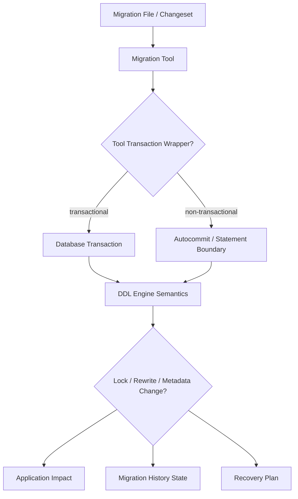
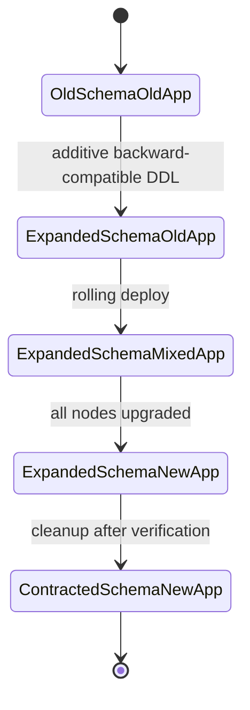
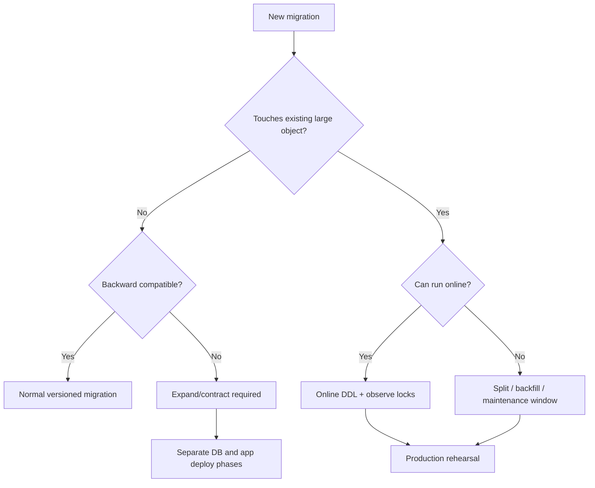
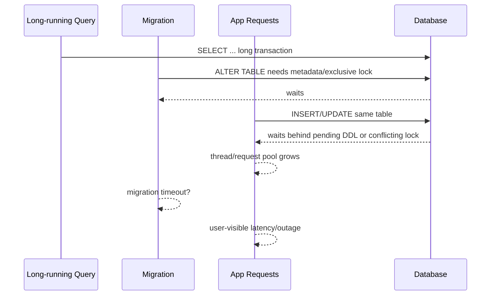
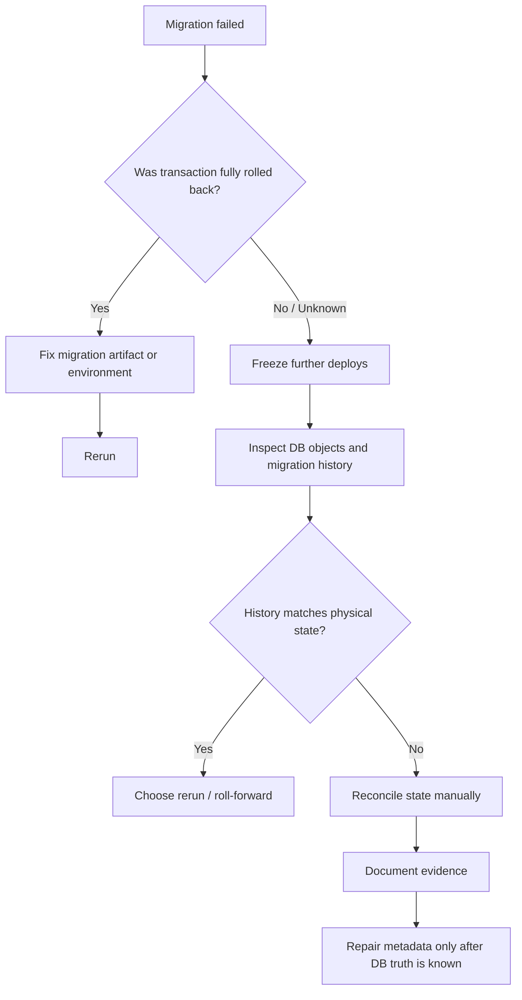

# Part 007 — Transaction Boundaries: DDL, Locks, Autocommit, dan Vendor Semantics

Banyak migration gagal bukan karena SQL-nya salah, tetapi karena engineer salah membaca **boundary transaksi**. Mereka menganggap semua database memperlakukan DDL seperti DML: bisa dibungkus `BEGIN`, bisa di-rollback, bisa diulang dengan aman, dan kalau gagal maka state kembali seperti semula. Dalam production, asumsi itu sering keliru.

Database migration harus dilihat sebagai interaksi tiga lapis:

1. **Database engine semantics** — apakah DDL transactional, menyebabkan implicit commit, memegang lock, melakukan table rewrite, atau berjalan online.
2. **Migration tool semantics** — apakah Flyway/Liquibase membungkus migration dalam transaction, mengunci metadata table, mencatat history sebelum/ sesudah, dan bagaimana ia menandai failure.
3. **Operational semantics** — bagaimana pipeline, aplikasi, retry, timeout, connection pool, load balancer, dan observability bereaksi saat migration berjalan.



Target part ini adalah membuat Anda bisa menjawab pertanyaan berikut sebelum sebuah migration masuk production:

> Jika statement ke-3 dari 7 statement gagal, apa tepatnya yang sudah berubah, apa yang tercatat di migration history, lock apa yang mungkin masih aktif, dan bagaimana langkah recovery yang paling aman?

---

## 1. Transaction Boundary Bukan Detail Implementasi

Dalam application code, transaction sering dibingkai sebagai unit bisnis: debit-kredit, create order-payment, update case-assignment, dan sebagainya. Dalam migration, transaction boundary berbeda. Ia adalah boundary antara:

- perubahan metadata database;
- perubahan data existing;
- perubahan object database seperti index, constraint, view, procedure;
- catatan migration tool;
- compatibility antara versi aplikasi lama dan baru.

Satu migration file bisa berisi banyak statement, tetapi database engine belum tentu melihatnya sebagai satu unit atomic.

Contoh migration yang tampak sederhana:

```sql
ALTER TABLE enforcement_case ADD COLUMN risk_level VARCHAR(20);
UPDATE enforcement_case SET risk_level = 'MEDIUM' WHERE risk_level IS NULL;
ALTER TABLE enforcement_case ALTER COLUMN risk_level SET NOT NULL;
CREATE INDEX idx_case_risk_level ON enforcement_case(risk_level);
```

Pertanyaan production-nya bukan hanya “apakah SQL ini valid?”. Pertanyaan yang lebih penting:

- Apakah semua statement bisa berada dalam satu transaction?
- Apakah `ALTER TABLE` menyebabkan table rewrite?
- Apakah `UPDATE` akan mengunci banyak row?
- Apakah `SET NOT NULL` melakukan full table scan?
- Apakah index build memblokir write?
- Jika index gagal, apakah column dan data update tetap ada?
- Jika migration tool mencatat failure, apakah rerun aman?
- Apakah aplikasi lama tetap kompatibel setelah column ditambah?

Top 1% engineer tidak melihat migration sebagai script. Mereka melihatnya sebagai **state transition dengan failure surface**.

---

## 2. Tiga Jenis Atomicity yang Sering Tercampur

Saat membahas migration, kata “atomic” sering dipakai sembarangan. Kita perlu memisahkannya.

| Jenis atomicity | Artinya | Contoh | Risiko jika disalahpahami |
|---|---|---|---|
| **Statement atomicity** | Satu statement sukses penuh atau gagal penuh | `CREATE TABLE`, `ALTER TABLE` tertentu | Mengira seluruh file atomic |
| **Migration atomicity** | Satu migration file/changeset sukses penuh atau rollback penuh | Flyway migration transactional, Liquibase changeset transactional | Tidak berlaku jika ada implicit commit/non-transactional DDL |
| **Release atomicity** | Aplikasi + schema + data berubah sebagai satu unit | Blue/green + migration + feature flag | Sangat jarang benar-benar atomic pada shared DB |

Dalam production, release database biasanya tidak atomic. Yang dicari bukan atomicity sempurna, melainkan **compatibility window** yang aman.



Kalau migration Anda hanya aman ketika aplikasi lama langsung mati dan aplikasi baru langsung hidup di seluruh fleet, migration itu tidak cocok untuk deployment modern.

---

## 3. DDL Semantics: Jangan Generalisasi Antar Database

Setiap database punya aturan sendiri untuk DDL transactionality, lock, metadata visibility, dan implicit commit. Bahkan dalam database yang sama, subcommand berbeda bisa memiliki lock level berbeda.

### 3.1 PostgreSQL

PostgreSQL terkenal mendukung banyak DDL dalam transaksi. Banyak `CREATE TABLE`, `ALTER TABLE`, `DROP TABLE`, dan perubahan schema bisa di-rollback jika berada dalam transaction block. Tetapi ini bukan berarti semua DDL bisa berada dalam transaction.

Contoh penting:

```sql
CREATE INDEX CONCURRENTLY idx_case_ref ON enforcement_case(case_ref);
```

`CREATE INDEX CONCURRENTLY` di PostgreSQL tidak bisa dijalankan di dalam transaction block. Ini penting karena migration tool sering default membungkus migration dalam transaksi. Untuk statement seperti ini, Anda perlu mengatur migration agar tidak dieksekusi dalam transaction.

PostgreSQL juga memiliki lock level berbeda untuk subcommand `ALTER TABLE`. Menambah column nullable tanpa default mahal berbeda dengan mengubah tipe column, menambahkan constraint tertentu, atau validasi constraint. Jadi rule yang aman:

> Pada PostgreSQL, tanyakan: “Apakah statement ini transactional?” lalu tanyakan lagi: “Lock level apa yang diambil dan berapa lama?”

### 3.2 MySQL / MariaDB

Pada MySQL, banyak DDL menyebabkan implicit commit. Artinya, jika Anda sedang berada dalam transaction lalu menjalankan DDL, database dapat melakukan commit sebelum DDL. DDL sering tidak bisa diperlakukan seperti DML biasa.

MySQL modern memiliki konsep atomic DDL untuk InnoDB, tetapi ini tidak sama dengan “DDL dapat di-rollback oleh application transaction”. Atomic DDL berarti engine berusaha membuat statement DDL selesai sebagai unit internal yang crash-safe, bukan berarti Anda bebas membungkus beberapa DDL dan DML dalam satu user transaction lalu rollback semuanya.

Selain itu, MySQL memiliki metadata lock. Migration seperti `ALTER TABLE` dapat menunggu long-running query, dan saat menunggu ia bisa menahan antrian operasi lain. Kegagalan paling berbahaya bukan selalu CPU tinggi; sering kali bentuknya adalah request aplikasi tiba-tiba menggantung karena operasi membaca/menulis table terblokir.

### 3.3 Oracle

Oracle melakukan implicit commit sebelum DDL valid secara sintaksis dan setelah DDL berhasil. Ini memiliki implikasi besar: jangan campur DML bisnis atau backfill besar dengan DDL dalam asumsi satu transaction.

Contoh anti-pattern:

```sql
UPDATE enforcement_case SET status = 'OPEN' WHERE status IS NULL;
CREATE TABLE migration_marker(id NUMBER PRIMARY KEY);
-- berharap UPDATE bisa rollback jika CREATE TABLE bermasalah
```

Pada Oracle, pendekatan seperti ini harus dipandang berisiko karena DDL memutus boundary transaction.

### 3.4 SQL Server

SQL Server mendukung banyak operasi DDL dalam explicit transaction, tetapi tetap ada variasi per statement, edition, option, dan operasi online/offline. Fokus production-nya bukan sekadar “bisa rollback”, tetapi:

- lock apa yang diambil;
- apakah schema modification lock memblokir query;
- apakah online index tersedia untuk edition/configuration yang dipakai;
- apakah operasi besar akan memenuhi transaction log;
- apakah rollback DDL besar justru lebih lama daripada operasi awal.

### 3.5 H2, SQLite, dan Test Database Trap

Test database sering memberi ilusi keamanan. H2/SQLite bisa menerima syntax yang mirip tetapi memiliki lock, concurrency, dan DDL semantics yang berbeda dari database production.

Rule penting:

> H2 boleh dipakai untuk fast feedback, tetapi migration production harus diuji minimal sekali pada engine yang sama dengan production, idealnya versi mayor/minor yang sama.

---

## 4. Matriks DDL Risk Class

Tidak semua DDL sama. Klasifikasikan migration berdasarkan risiko operasional, bukan hanya jenis SQL.

| Risk class | Contoh | Dampak utama | Default strategy |
|---|---|---|---|
| **Metadata-only additive** | Add nullable column tanpa default berat | Biasanya cepat, tetap butuh lock metadata | Bisa versioned migration biasa |
| **Validation-heavy** | Add `NOT NULL`, validate FK/check | Full scan / validation lock | Split: add unvalidated, backfill, validate later |
| **Rewrite-heavy** | Change column type, add stored generated column tertentu | Table rewrite, log pressure | Expand/contract atau shadow column |
| **Index build** | Create index pada large table | IO tinggi, lock/write impact | Online/concurrent index jika tersedia |
| **Destructive** | Drop column/table, rename used object | Break compatibility | Contract phase setelah verification |
| **Data movement** | Backfill millions/billions rows | Row locks, bloat, replication lag | Batch, checkpoint, throttle |
| **Stored object replacement** | View/function/procedure | Dependency invalidation | Repeatable migration + dependency check |
| **Security/privilege** | Grant/revoke/owner change | Access outage | Least privilege + smoke test |

Diagram keputusan awal:



---

## 5. Migration Tool Transaction Semantics

### 5.1 Flyway

Flyway dapat mengeksekusi SQL migration dalam transaction jika database dan statement mendukungnya. Secara konfigurasi, `executeInTransaction` mengontrol apakah SQL dijalankan dalam transaction. Default-nya `true`, tetapi beberapa statement database memang tidak boleh dijalankan dalam transaction.

Contoh Flyway script config untuk PostgreSQL concurrent index:

```properties
# V042__create_case_search_index.sql.conf
executeInTransaction=false
```

```sql
-- V042__create_case_search_index.sql
CREATE INDEX CONCURRENTLY idx_case_search_created_at
ON enforcement_case(created_at);
```

Flyway juga memiliki konsep `mixed`, yaitu memperbolehkan campuran statement transactional dan non-transactional dalam migration tertentu. Ini bukan fitur yang sebaiknya dipakai sebagai default. Jika satu migration memerlukan non-transactional execution, lebih aman pecah migration sehingga unit failure-nya jelas.

Bad:

```sql
-- Terlalu banyak hal dalam satu migration non-transactional
ALTER TABLE enforcement_case ADD COLUMN search_key TEXT;
UPDATE enforcement_case SET search_key = lower(case_ref);
CREATE INDEX CONCURRENTLY idx_case_search_key ON enforcement_case(search_key);
ALTER TABLE enforcement_case ALTER COLUMN search_key SET NOT NULL;
```

Better:

```txt
V042__add_search_key_column.sql
V043__backfill_search_key_in_batches.sql / Java migration
V044__create_search_key_index_concurrently.sql
V045__enforce_search_key_not_null.sql
```

Setiap migration punya recovery story sendiri.

### 5.2 Liquibase

Liquibase changeset memiliki atribut `runInTransaction`. Default-nya `true` jika database mendukung. Untuk statement yang tidak bisa berjalan dalam transaction, seperti beberapa online/concurrent operation, `runInTransaction:false` bisa dipakai.

Contoh formatted SQL:

```sql
--liquibase formatted sql

--changeset platform:042-create-case-search-index runInTransaction:false
CREATE INDEX CONCURRENTLY idx_case_search_created_at
ON enforcement_case(created_at);
```

Namun jangan menaruh banyak statement dalam changeset `runInTransaction:false`. Jika error terjadi di tengah, sebagian statement bisa sudah berlaku tetapi `DATABASECHANGELOG` belum mencatat changeset sebagai sukses. Ini menciptakan kondisi rerun yang rapuh.

Better:

```sql
--liquibase formatted sql

--changeset platform:042-add-search-key
ALTER TABLE enforcement_case ADD COLUMN search_key TEXT;

--changeset platform:043-create-search-key-index runInTransaction:false
CREATE INDEX CONCURRENTLY idx_case_search_key ON enforcement_case(search_key);
```

Rule praktis:

> `runInTransaction:false` harus menjadi exception kecil, bukan mode default untuk seluruh changelog.

---

## 6. Lock Modelling: Pertanyaan yang Harus Selalu Ditanyakan

Lock adalah sumber outage migration paling umum. Migration tidak perlu “lama” untuk berbahaya; cukup mengambil lock eksklusif selama beberapa detik pada table paling panas, lalu request menumpuk.

Checklist lock modelling:

1. **Object apa yang dikunci?** Table, index, row, metadata, schema, database?
2. **Mode lock apa?** Shared, exclusive, schema modification, metadata lock, row exclusive?
3. **Lock diambil kapan?** Awal statement, saat validation, saat commit, saat metadata swap?
4. **Lock ditahan berapa lama?** Sepanjang transaction, sepanjang statement, atau fase tertentu?
5. **Siapa yang bisa memblokir migration?** Long-running transaction, reporting query, idle-in-transaction session, batch job?
6. **Siapa yang akan diblokir oleh migration?** Write path, read path, DDL lain, replication apply?
7. **Apa timeout-nya?** Lock timeout, statement timeout, pipeline timeout, JDBC socket timeout?
8. **Apa observability-nya?** Database wait event, lock table, slow query, app latency, pool exhaustion?



The dangerous pattern is **lock queue amplification**: migration waits behind one old transaction, while new application traffic queues behind the migration.

---

## 7. Autocommit dan JDBC: Jangan Salah Menempatkan Tanggung Jawab

Dalam Java, kita terbiasa mengontrol transaction lewat JDBC, Spring `@Transactional`, JTA, atau connection pool. Migration tool juga memakai JDBC connection, tetapi database tetap memiliki aturan final.

Contoh false assumption:

> “Karena Flyway/Liquibase memakai JDBC dan autocommit false, semua statement pasti rollback kalau gagal.”

Yang benar:

- JDBC transaction hanya bekerja sejauh database mendukung transaction untuk statement tersebut.
- DDL tertentu bisa menyebabkan implicit commit di engine.
- Tool setting seperti `executeInTransaction=false` atau `runInTransaction:false` mengubah boundary eksekusi.
- Beberapa operation tidak boleh berada dalam transaction block.
- Connection pool timeout dan socket timeout bisa terjadi sementara database operation tetap berjalan atau sudah commit.

Untuk production, migration runner sebaiknya memakai datasource khusus, bukan connection pool aplikasi yang sama, terutama untuk migration berat. Alasannya:

- migration bisa memakan connection lama;
- migration membutuhkan privilege berbeda;
- migration timeout berbeda dari request aplikasi;
- migration observability perlu dipisahkan;
- migration tidak boleh terpengaruh pool exhaustion dari traffic aplikasi.

---

## 8. Statement Timeout, Lock Timeout, dan Kill Strategy

Setiap migration production yang menyentuh object penting perlu batas waktu eksplisit. Tetapi timeout harus dipahami sebagai **control**, bukan recovery plan lengkap.

| Timeout | Mengendalikan | Risiko |
|---|---|---|
| Lock timeout | Berapa lama menunggu lock | Aman untuk fail fast, tetapi perlu rerun plan |
| Statement timeout | Berapa lama statement berjalan | Bisa membatalkan statement besar; rollback bisa tetap mahal |
| Socket timeout | Berapa lama client menunggu response | Client bisa putus saat DB masih memproses |
| Pipeline timeout | Berapa lama job deploy menunggu | Job gagal belum tentu DB state bersih |
| App readiness timeout | Berapa lama app boleh start | Startup migration bisa membuat rollout gagal massal |

Contoh PostgreSQL preamble untuk migration sensitif:

```sql
SET lock_timeout = '5s';
SET statement_timeout = '10min';

ALTER TABLE enforcement_case
ADD COLUMN escalation_bucket VARCHAR(40);
```

Contoh prinsip:

- `lock_timeout` pendek untuk mencegah blocking production.
- `statement_timeout` disesuaikan dengan operasi yang memang butuh waktu.
- Untuk DML backfill, gunakan batching dan checkpoint daripada satu transaction raksasa.
- Untuk online index, monitor progress dan IO, bukan hanya menunggu selesai.

Jangan membuat migration yang hanya bisa dihentikan dengan membunuh database session tanpa tahu state yang tertinggal.

---

## 9. Failure State Matrix

Ketika migration gagal, hal pertama yang harus dilakukan bukan langsung `repair`, bukan langsung edit script, dan bukan langsung rerun. Pertama, klasifikasikan state.

| Situation | Database state | Tool history state | First action |
|---|---|---|---|
| Transactional migration gagal dan rollback sukses | Tidak ada perubahan | Failed/not applied | Fix script lalu rerun |
| Non-transactional DDL statement gagal sebelum apply | Tidak ada perubahan object target | Not applied/failed | Verify object absence lalu rerun |
| Non-transactional migration gagal setelah sebagian statement apply | Partial schema/data | Not applied/failed | Manual reconcile sebelum rerun |
| Tool mencatat applied tetapi object drift | History says success, DB differs | Applied | Investigate out-of-band change |
| Client timeout saat DB masih running | Unknown | Unknown until checked | Inspect DB session/history first |
| Lock timeout sebelum perubahan | Tidak berubah | Failed/not applied | Rerun during safer window |
| Backfill interrupted | Partial data changed | Depends checkpoint/tool | Resume from checkpoint |

State recovery diagram:



Core invariant:

> Migration history must describe reality. Never mutate history first and inspect database later.

---

## 10. Designing Transaction Boundaries in Migration Files

A practical migration file should have a single transaction story. Avoid mixing operations with different rollback semantics.

### 10.1 Good Boundary Examples

Good: one additive DDL.

```sql
ALTER TABLE enforcement_case
ADD COLUMN risk_level VARCHAR(20);
```

Good: one repeatable view replacement.

```sql
CREATE OR REPLACE VIEW v_open_case_summary AS
SELECT case_id, status, assigned_team
FROM enforcement_case
WHERE status IN ('OPEN', 'ESCALATED');
```

Good: one online index requiring non-transactional execution.

```sql
CREATE INDEX CONCURRENTLY idx_case_assigned_team
ON enforcement_case(assigned_team);
```

Good: bounded batch migration with checkpoint outside normal SQL migration if dataset is large.

```java
// Java migration pseudo-structure
while (true) {
    List<Long> ids = loadNextBatchAfterCheckpoint(1000);
    if (ids.isEmpty()) break;
    updateBatch(ids);
    saveCheckpoint(ids.get(ids.size() - 1));
    commit();
}
```

### 10.2 Bad Boundary Examples

Bad: one migration does DDL, DML, index, constraint, and cleanup.

```sql
ALTER TABLE enforcement_case ADD COLUMN risk_score INT;
UPDATE enforcement_case SET risk_score = 0 WHERE risk_score IS NULL;
ALTER TABLE enforcement_case ALTER COLUMN risk_score SET NOT NULL;
CREATE INDEX idx_case_risk_score ON enforcement_case(risk_score);
ALTER TABLE enforcement_case DROP COLUMN legacy_risk;
```

Why bad:

- unclear rollback semantics;
- possible long locks;
- backfill is not resumable;
- destructive cleanup breaks old app;
- one failure creates complex partial state.

Better split by compatibility and failure domain:

```txt
V120__add_risk_score_nullable.sql
V121__backfill_risk_score_checkpointed.java
V122__create_risk_score_index_online.sql
V123__validate_risk_score_not_null.sql
V140__drop_legacy_risk_after_contract.sql
```

---

## 11. Production Review Checklist

Gunakan checklist ini saat review PR migration.

### 11.1 Transaction Semantics

- Apakah statement ini transactional pada database production?
- Apakah migration tool membungkusnya dalam transaction?
- Apakah ada statement yang tidak boleh berada dalam transaction?
- Apakah ada implicit commit?
- Jika gagal di tengah, state apa yang tertinggal?

### 11.2 Lock and Runtime

- Table mana yang paling panas?
- Apakah ada full table scan, rewrite, index build, validation?
- Apakah migration bisa menunggu long-running transaction?
- Apakah lock timeout diset?
- Apakah statement timeout diset?
- Apakah ada maintenance window atau progressive rollout?

### 11.3 Data and Compatibility

- Apakah old app masih bisa berjalan setelah migration?
- Apakah new app bisa berjalan sebelum migration?
- Apakah migration mengubah default/nullability/constraint yang mempengaruhi write path?
- Apakah backfill chunked dan resumable?
- Apakah reference data update deterministic?

### 11.4 Recovery

- Apa command untuk inspect state?
- Apa indikator migration berhasil selain tool history?
- Apa indikator harus stop?
- Apa roll-forward path?
- Apakah rollback benar-benar aman atau hanya formalitas?
- Apakah repair metadata diperlukan, dan kapan?

---

## 12. Vendor-Specific Mini Playbooks

### 12.1 PostgreSQL: Concurrent Index

Problem:

```sql
CREATE INDEX CONCURRENTLY idx_case_ref ON enforcement_case(case_ref);
```

Risk:

- tidak bisa dalam transaction block;
- dapat memakan waktu lama;
- gagal bisa meninggalkan invalid index yang perlu dibersihkan;
- lebih lambat daripada normal index build tetapi mengurangi blocking write.

Pattern:

```txt
1. Separate migration file/changeset.
2. Disable transaction for this migration only.
3. Set appropriate lock/statement timeout carefully.
4. Monitor progress and invalid index state.
5. Add follow-up verification migration or operational check.
```

### 12.2 MySQL: ALTER TABLE pada Large Table

Problem:

```sql
ALTER TABLE enforcement_case ADD COLUMN risk_level VARCHAR(20) NOT NULL DEFAULT 'MEDIUM';
```

Risk:

- implicit commit;
- algorithm berbeda tergantung version/storage engine/operation;
- metadata lock;
- table copy/rebuild pada kasus tertentu;
- replication lag.

Pattern:

```txt
1. Prefer additive nullable column first.
2. Backfill in batches.
3. Add default after write path is updated.
4. Enforce NOT NULL later if safe.
5. Verify online DDL algorithm in staging with production-like table size.
```

### 12.3 Oracle: DDL + DML Separation

Problem:

```sql
UPDATE case_assignment SET active = 1 WHERE active IS NULL;
ALTER TABLE case_assignment MODIFY active NOT NULL;
```

Risk:

- DDL implicit commit;
- DML and DDL cannot be treated as one rollback unit;
- partial data changes may become durable earlier than expected.

Pattern:

```txt
1. Separate DML backfill from DDL enforcement.
2. Make backfill resumable and auditable.
3. Run constraint enforcement only after data invariant is verified.
4. Treat rollback as roll-forward correction, not magic undo.
```

### 12.4 SQL Server: Log and Schema Locks

Problem:

```sql
ALTER TABLE enforcement_case ALTER COLUMN external_ref NVARCHAR(128) NOT NULL;
```

Risk:

- schema modification lock;
- transaction log growth;
- blocking readers/writers depending isolation/options;
- rollback can be expensive.

Pattern:

```txt
1. Measure table size and null count first.
2. Backfill in batches.
3. Use shorter explicit transaction only where useful.
4. Validate during low traffic.
5. Monitor blocking sessions and log growth.
```

---

## 13. Anti-Patterns

### 13.1 “Wrap Everything in One Big Transaction”

Ini terdengar aman tetapi bisa berbahaya:

- lock ditahan lebih lama;
- transaction log membesar;
- rollback besar bisa mahal;
- beberapa DDL tidak mendukung transaction;
- implicit commit dapat mematahkan asumsi.

### 13.2 “Disable Transactions Globally”

Mengatur semua migration non-transactional agar statement tertentu berhasil adalah keputusan buruk. Non-transactional execution harus isolated pada migration yang memerlukannya saja.

### 13.3 “Tested on H2, Therefore Safe”

H2 tidak mewakili lock behavior PostgreSQL/MySQL/Oracle/SQL Server. Ia berguna untuk syntax smoke test, bukan production migration proof.

### 13.4 “Migration Failed, Just Repair”

`repair` atau metadata update bukan recovery. Itu hanya menyelaraskan catatan tool setelah database truth diketahui. Jika dipakai sebelum inspect state, ia dapat menyembunyikan drift.

### 13.5 “Online DDL Means No Impact”

Online tidak berarti gratis. Online DDL tetap bisa memakai CPU, IO, log, replication bandwidth, metadata lock singkat, dan mempengaruhi latency.

---

## 14. Practice Lab

Gunakan PostgreSQL dan MySQL/MariaDB lokal via Docker/Testcontainers. Tujuannya bukan menghafal syntax, tetapi melihat behavior.

### Lab A — Transactional DDL

1. Buat table.
2. Mulai transaction.
3. Tambah column.
4. Rollback.
5. Cek apakah column masih ada.
6. Ulangi pada database berbeda.

### Lab B — Non-Transactional / Implicit Commit

1. Mulai transaction.
2. Insert row.
3. Jalankan DDL yang menyebabkan implicit commit pada database target.
4. Rollback.
5. Cek apakah row tetap ada.

### Lab C — Lock Queue

1. Session A membuka transaction dan membaca table.
2. Session B menjalankan `ALTER TABLE`.
3. Session C menjalankan insert/update.
4. Amati blocking chain.

### Lab D — Tool Boundary

1. Buat Flyway migration yang menjalankan `CREATE INDEX CONCURRENTLY` dalam default transaction.
2. Amati failure.
3. Tambahkan script config `executeInTransaction=false`.
4. Ulangi.
5. Dokumentasikan perubahan behavior.

---

## 15. Summary

Part ini memberi Anda mental model transaction boundary untuk migration:

- DDL semantics berbeda antar database dan antar statement.
- Transactional DDL, implicit commit, online DDL, lock, dan metadata history adalah hal berbeda.
- Flyway dan Liquibase memberi knob transaction, tetapi knob itu tidak menghapus aturan database engine.
- Migration file harus dipotong berdasarkan failure domain, bukan berdasarkan convenience.
- Recovery harus dimulai dari database truth, baru metadata tool.

Prinsip inti:

> Jangan pernah menjalankan migration production sebelum bisa menjelaskan state database jika migration berhenti di setiap titik penting.

---

## References

- PostgreSQL Documentation — `CREATE INDEX`, including `CREATE INDEX CONCURRENTLY` transaction restriction: https://www.postgresql.org/docs/current/sql-createindex.html
- PostgreSQL Documentation — `ALTER TABLE` and lock-level notes: https://www.postgresql.org/docs/current/sql-altertable.html
- MySQL Documentation — Statements That Cause an Implicit Commit: https://dev.mysql.com/doc/en/implicit-commit.html
- MySQL Documentation — Atomic Data Definition Statement Support: https://dev.mysql.com/doc/refman/en/atomic-ddl.html
- Oracle Database SQL Reference — `COMMIT` and implicit commits around DDL: https://docs.oracle.com/en/database/oracle/oracle-database/18/sqlrf/COMMIT.html
- Microsoft SQL Server Documentation — `ALTER TABLE`: https://learn.microsoft.com/en-us/sql/t-sql/statements/alter-table-transact-sql
- Microsoft SQL Server Documentation — Transaction Locking and Row Versioning Guide: https://learn.microsoft.com/en-us/sql/relational-databases/sql-server-transaction-locking-and-row-versioning-guide
- Redgate Flyway Documentation — `executeInTransaction`: https://documentation.red-gate.com/fd/flyway-execute-in-transaction-setting-277578997.html
- Redgate Flyway Documentation — `mixed`: https://documentation.red-gate.com/fd/flyway-mixed-setting-277579012.html
- Redgate Flyway Documentation — Migration transaction handling: https://documentation.red-gate.com/fd/migration-transaction-handling-273973399.html
- Liquibase Documentation — `runInTransaction`: https://docs.liquibase.com/secure/reference-guide-5-2/changelog-attributes/runintransaction
