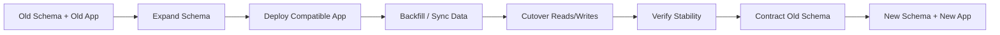
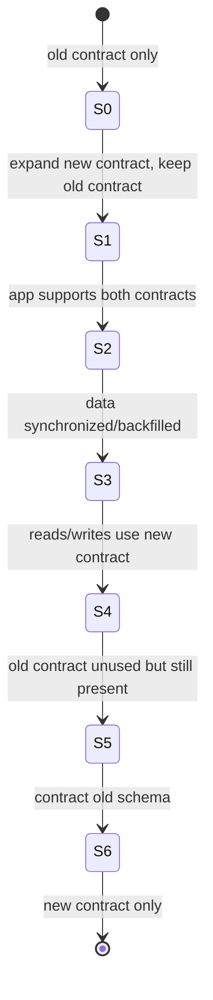
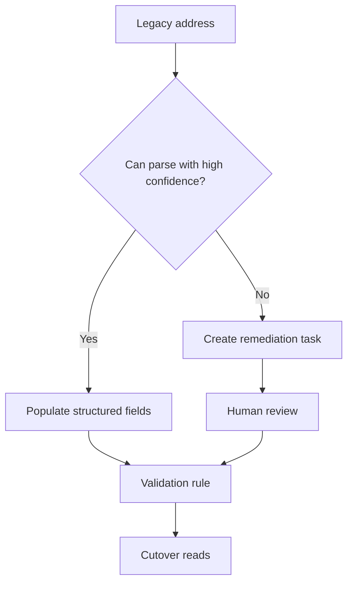
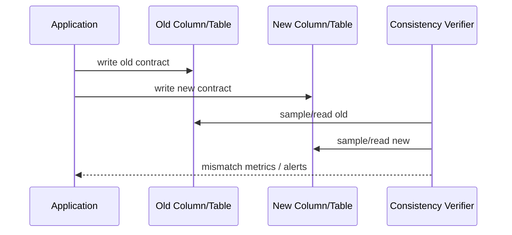
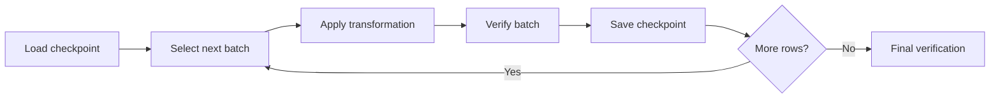

# Part 008 — Expand/Contract Pattern untuk Zero-Downtime Schema Evolution

Zero-downtime database migration bukan berarti migration selalu berjalan tanpa lock, tanpa risiko, atau tanpa perubahan perilaku. Artinya adalah perubahan schema, data, dan aplikasi dirancang agar **setiap versi yang mungkin hidup bersamaan tetap kompatibel selama periode transisi**.

Pola paling penting untuk itu adalah **expand/contract**.



Dalam sistem Java modern, terutama Spring Boot, Jakarta EE, Quarkus, Micronaut, modular monolith, atau microservices, deployment jarang benar-benar serentak. Rolling deployment, blue/green, canary, autoscaling, retry, queue consumer, scheduled job, dan long-running transaction membuat versi lama dan baru dapat hidup bersamaan.

Karena itu, database migration yang aman harus menjawab:

> Apakah old application bisa berjalan pada new schema, dan apakah new application bisa berjalan saat sebagian data masih dalam bentuk lama?

Jika jawabannya tidak, migration tersebut bukan zero-downtime; ia membutuhkan maintenance window atau redesign.

---

## 1. Mental Model: Schema sebagai Contract Antar Versi Aplikasi

Database bukan hanya storage. Dalam sistem production, database schema adalah **contract** antara banyak aktor:

- aplikasi versi lama;
- aplikasi versi baru;
- background worker;
- batch job;
- reporting job;
- stored procedure;
- external integration;
- data warehouse extractor;
- DBA script;
- support tooling;
- regulatory audit query.

Jika migration mengubah contract secara breaking, semua consumer harus berubah pada saat yang sama. Itu hampir tidak pernah realistis.

Expand/contract memecah perubahan breaking menjadi beberapa perubahan non-breaking.



Kunci utamanya:

> Jangan menghapus kemampuan lama sebelum semua producer dan consumer berhenti memakainya.

---

## 2. Tiga Fase Utama

### 2.1 Expand

Expand berarti menambahkan struktur baru tanpa merusak struktur lama.

Contoh:

- tambah column nullable;
- tambah table baru;
- tambah index baru;
- tambah view baru;
- tambah enum value baru jika aman;
- tambah foreign key belum divalidasi;
- tambah procedure baru;
- tambah lookup table baru;
- tambah shadow column;
- tambah compatibility view.

Expand harus backward compatible.

Old app tetap jalan:

```txt
Old app expects column A.
New schema contains column A and B.
Old app ignores B.
```

### 2.2 Transition

Transition adalah fase paling panjang dan paling sering gagal. Di sini aplikasi, data, dan operasi runtime bergerak dari contract lama ke contract baru.

Teknik umum:

- dual-write;
- dual-read;
- read fallback;
- backfill;
- shadow validation;
- feature flag;
- canary cutover;
- reconciliation job;
- consistency monitor;
- write freeze sementara untuk subset data tertentu;
- CDC-assisted sync untuk migration besar.

### 2.3 Contract

Contract berarti menghapus struktur lama setelah terbukti tidak dipakai.

Contoh:

- drop old column;
- drop old index;
- drop old table;
- remove compatibility view;
- remove fallback code;
- remove dual-write;
- enforce stricter constraint;
- remove old enum usage;
- revoke old privilege.

Contract adalah fase yang paling sering diremehkan. Banyak sistem memiliki “kolom zombie” bertahun-tahun karena tidak ada owner yang berani menghapus. Namun contract yang terlalu cepat jauh lebih berbahaya daripada contract yang terlambat.

---

## 3. Compatibility Matrix

Setiap migration harus dievaluasi dengan matrix compatibility.

| State | Old app | New app | Safe? | Notes |
|---|---:|---:|---:|---|
| Old schema | ✅ | ❌/partial | Usually before deployment | New app belum boleh require column baru |
| Expanded schema | ✅ | ✅ | Required | Target minimum for rolling deployment |
| Backfill in progress | ✅ | ✅ with fallback | Required | New app tidak boleh assume all rows migrated |
| Cutover | ✅ if old contract retained | ✅ | Required | Feature flag helps |
| Contracted schema | ❌ | ✅ | Safe only after old app gone | Must verify no old consumer |

Rule:

> Setiap intermediate state yang bisa terjadi di production harus menjadi state yang valid.

Bukan hanya final state yang harus benar.

---

## 4. Example 1 — Rename Column Tanpa Downtime

Rename column tampak kecil, tetapi secara contract ia breaking.

Bad migration:

```sql
ALTER TABLE enforcement_case RENAME COLUMN case_ref TO external_reference;
```

Masalah:

- old app masih membaca `case_ref`;
- new app membaca `external_reference`;
- rolling deployment akan gagal untuk salah satu versi;
- rollback aplikasi sulit karena schema sudah berubah;
- reporting query bisa rusak.

### 4.1 Expand

```sql
ALTER TABLE enforcement_case
ADD COLUMN external_reference VARCHAR(64);
```

Schema sekarang mendukung old dan new field.

### 4.2 Deploy Dual-Write

Java domain model sementara:

```java
public final class CaseReferenceMapper {
    public void bindForInsert(PreparedStatement ps, String reference) throws SQLException {
        ps.setString(1, reference); // case_ref
        ps.setString(2, reference); // external_reference
    }
}
```

Dengan JPA/Hibernate, jangan mengandalkan `ddl-auto` untuk ini. Mapping sementara bisa seperti:

```java
@Entity
@Table(name = "enforcement_case")
public class EnforcementCaseEntity {

    @Column(name = "case_ref")
    private String caseRef;

    @Column(name = "external_reference")
    private String externalReference;

    public void setReference(String reference) {
        this.caseRef = reference;
        this.externalReference = reference;
    }

    public String effectiveReference() {
        return externalReference != null ? externalReference : caseRef;
    }
}
```

Ini bukan model final yang indah. Ini model transisi. Jangan terobsesi membuat fase transisi terlihat bersih; yang penting aman, eksplisit, dan sementara.

### 4.3 Backfill

Untuk table kecil:

```sql
UPDATE enforcement_case
SET external_reference = case_ref
WHERE external_reference IS NULL;
```

Untuk table besar, jangan satu update besar. Gunakan batching.

Pseudo Java migration/job:

```java
while (true) {
    List<Long> ids = jdbcTemplate.queryForList("""
        SELECT id
        FROM enforcement_case
        WHERE external_reference IS NULL
        ORDER BY id
        LIMIT ?
        """, Long.class, batchSize);

    if (ids.isEmpty()) {
        break;
    }

    jdbcTemplate.update("""
        UPDATE enforcement_case
        SET external_reference = case_ref
        WHERE id = ANY (?)
        """, ids.toArray(new Long[0]));

    checkpointStore.save("case-reference-backfill", ids.get(ids.size() - 1));
}
```

### 4.4 Verify

```sql
SELECT COUNT(*) AS missing_external_reference
FROM enforcement_case
WHERE external_reference IS NULL
  AND case_ref IS NOT NULL;
```

Verify dual-write drift:

```sql
SELECT COUNT(*) AS mismatch_count
FROM enforcement_case
WHERE case_ref IS DISTINCT FROM external_reference;
```

Untuk MySQL, gunakan null-safe comparison:

```sql
SELECT COUNT(*) AS mismatch_count
FROM enforcement_case
WHERE NOT (case_ref <=> external_reference);
```

### 4.5 Cutover Reads

Ubah aplikasi agar membaca `external_reference` sebagai source of truth, tetapi fallback masih ada untuk safety window:

```java
public String effectiveReference() {
    if (externalReference != null && !externalReference.isBlank()) {
        return externalReference;
    }
    return caseRef;
}
```

Setelah semua node versi lama hilang dan verification stabil, hapus fallback di release berikutnya.

### 4.6 Contract

```sql
ALTER TABLE enforcement_case
DROP COLUMN case_ref;
```

Contract hanya aman setelah:

- semua app lama tidak berjalan;
- semua worker lama tidak berjalan;
- semua reporting query diperbarui;
- log akses menunjukkan old column tidak dipakai;
- backup/restore compatibility dipahami;
- rollback plan bukan lagi bergantung pada old column.

---

## 5. Example 2 — Menambah NOT NULL Column

Bad:

```sql
ALTER TABLE enforcement_case
ADD COLUMN priority VARCHAR(20) NOT NULL DEFAULT 'NORMAL';
```

Pada beberapa database/version, operasi seperti ini bisa cepat; pada lainnya bisa memicu rewrite atau lock yang tidak diharapkan. Di luar performa, ada masalah semantic: apakah semua existing row memang priority `NORMAL`?

### 5.1 Expand

```sql
ALTER TABLE enforcement_case
ADD COLUMN priority VARCHAR(20);
```

### 5.2 Deploy App Write Path

Aplikasi baru wajib mengisi `priority` untuk write baru.

```java
public EnforcementCase createCase(CreateCaseCommand command) {
    EnforcementCase entity = new EnforcementCase();
    entity.setPriority(command.priorityOrDefault("NORMAL"));
    return repository.save(entity);
}
```

### 5.3 Backfill Existing Rows

```sql
UPDATE enforcement_case
SET priority = 'NORMAL'
WHERE priority IS NULL;
```

Untuk large table, batching.

### 5.4 Verify Invariant

```sql
SELECT COUNT(*)
FROM enforcement_case
WHERE priority IS NULL;
```

### 5.5 Enforce Constraint

PostgreSQL example:

```sql
ALTER TABLE enforcement_case
ALTER COLUMN priority SET NOT NULL;
```

Untuk database dan table besar, pertimbangkan pattern constraint validation bertahap jika tersedia.

### 5.6 Contract App Assumption

Baru setelah constraint enforced, application code boleh menghapus null fallback.

---

## 6. Example 3 — Split Column Menjadi Structured Fields

Old schema:

```sql
customer_address TEXT
```

New schema:

```sql
address_line1 VARCHAR(255),
address_city VARCHAR(100),
address_postal_code VARCHAR(30),
address_country_code CHAR(2)
```

Ini bukan sekadar rename. Ini transformasi data, dan transformasinya bisa lossy.

### 6.1 Expand

```sql
ALTER TABLE regulated_party
ADD COLUMN address_line1 VARCHAR(255),
ADD COLUMN address_city VARCHAR(100),
ADD COLUMN address_postal_code VARCHAR(30),
ADD COLUMN address_country_code CHAR(2);
```

### 6.2 Transition Strategy

Ada beberapa opsi:

| Strategy | Cocok untuk | Risiko |
|---|---|---|
| Parse legacy address otomatis | Format lama cukup konsisten | Parsing error, data quality issue |
| User re-entry on next update | Tidak perlu migrate semua data sekarang | Long tail legacy data |
| Manual remediation queue | Data regulatory/high-value | Mahal tapi defensible |
| Hybrid parse + exception queue | Volume besar, quality penting | Butuh workflow tambahan |

Untuk domain regulatory/case management, jangan diam-diam parse data ambigu lalu menganggap benar. Buat exception queue.



### 6.3 Verification

Jangan hanya cek `NULL`. Cek semantic quality.

```sql
SELECT COUNT(*)
FROM regulated_party
WHERE address_country_code IS NOT NULL
  AND address_country_code !~ '^[A-Z]{2}$';
```

Untuk MySQL:

```sql
SELECT COUNT(*)
FROM regulated_party
WHERE address_country_code IS NOT NULL
  AND address_country_code NOT REGEXP '^[A-Z]{2}$';
```

---

## 7. Example 4 — Table Split

Old:

```txt
enforcement_case
- id
- case_ref
- status
- assigned_officer_id
- respondent_name
- respondent_tax_id
- respondent_address
```

New:

```txt
enforcement_case
- id
- case_ref
- status
- assigned_officer_id

case_respondent
- case_id
- name
- tax_id
- address
```

### 7.1 Expand

```sql
CREATE TABLE case_respondent (
    case_id BIGINT PRIMARY KEY,
    name VARCHAR(255),
    tax_id VARCHAR(64),
    address TEXT
);
```

Do not immediately drop columns from `enforcement_case`.

### 7.2 Dual-Write

When case respondent data changes, write both old columns and new table.

Pseudo service code:

```java
@Transactional
public void updateRespondent(long caseId, RespondentUpdate update) {
    enforcementCaseRepository.updateRespondentColumns(caseId, update);
    caseRespondentRepository.upsert(caseId, update);
}
```

For strict consistency, both writes should be in the same database transaction if they are in the same database. If they are across databases/services, this becomes distributed consistency and should be treated as a separate migration class.

### 7.3 Backfill

```sql
INSERT INTO case_respondent(case_id, name, tax_id, address)
SELECT id, respondent_name, respondent_tax_id, respondent_address
FROM enforcement_case ec
WHERE NOT EXISTS (
    SELECT 1
    FROM case_respondent cr
    WHERE cr.case_id = ec.id
);
```

For huge tables, use batches.

### 7.4 Consistency Verification

```sql
SELECT COUNT(*) AS missing_respondent_rows
FROM enforcement_case ec
WHERE NOT EXISTS (
    SELECT 1 FROM case_respondent cr WHERE cr.case_id = ec.id
);
```

Mismatch check:

```sql
SELECT COUNT(*) AS mismatch_count
FROM enforcement_case ec
JOIN case_respondent cr ON cr.case_id = ec.id
WHERE ec.respondent_name IS DISTINCT FROM cr.name
   OR ec.respondent_tax_id IS DISTINCT FROM cr.tax_id
   OR ec.respondent_address IS DISTINCT FROM cr.address;
```

### 7.5 Cutover

Move reads to `case_respondent`, keep fallback for a while:

```java
public RespondentView loadRespondent(long caseId) {
    return caseRespondentRepository.findByCaseId(caseId)
        .orElseGet(() -> enforcementCaseRepository.loadLegacyRespondent(caseId));
}
```

### 7.6 Contract

After old code and fallback are gone:

```sql
ALTER TABLE enforcement_case DROP COLUMN respondent_name;
ALTER TABLE enforcement_case DROP COLUMN respondent_tax_id;
ALTER TABLE enforcement_case DROP COLUMN respondent_address;
```

---

## 8. Dual-Write: Powerful, Dangerous, and Often Misused

Dual-write is a transition tool, not a lifestyle. It creates two sources that must remain consistent.

### 8.1 When Dual-Write Is Acceptable

Dual-write is acceptable when:

- both targets are in the same database transaction;
- one target is clearly temporary;
- verification exists;
- mismatch repair exists;
- duration is bounded;
- cutover criteria are explicit.

### 8.2 When Dual-Write Is Dangerous

Dual-write becomes risky when:

- writes go to two different databases without transaction boundary;
- one write can succeed and the other fail;
- retry is not idempotent;
- order matters;
- consumers observe both stores;
- no reconciliation job exists;
- the transition lasts indefinitely.



### 8.3 Dual-Write Guardrails

- Make writes idempotent.
- Use deterministic transformation.
- Record version/source if transformation can change.
- Emit metrics for old-only, new-only, mismatch.
- Keep repair script ready.
- Use feature flag for read cutover.
- Define maximum transition duration.

---

## 9. Backfill Design

Backfill is where many expand/contract migrations fail. A backfill is not just an `UPDATE`. It is an operational workload.

### 9.1 Small Table Backfill

For small tables:

```sql
UPDATE case_status
SET normalized_code = upper(code)
WHERE normalized_code IS NULL;
```

This can be a normal migration if the table is small, low traffic, and bounded.

### 9.2 Large Table Backfill

For large/hot tables, use chunking.

```sql
UPDATE enforcement_case
SET normalized_case_ref = lower(case_ref)
WHERE id >= ?
  AND id < ?
  AND normalized_case_ref IS NULL;
```

Better properties:

- bounded lock time;
- resumable;
- throttled;
- observable;
- easier to stop.

### 9.3 Checkpoint Table

```sql
CREATE TABLE migration_checkpoint (
    migration_key VARCHAR(128) PRIMARY KEY,
    last_processed_id BIGINT,
    updated_at TIMESTAMP NOT NULL
);
```

Checkpoint update should be part of the same transaction as the batch if possible.



### 9.4 Backfill Stop Criteria

Stop backfill when:

- database latency crosses threshold;
- replication lag crosses threshold;
- lock wait increases;
- deadlocks appear;
- write error rate increases;
- batch verification fails;
- business window ends.

Do not run backfill as an invisible side effect of application startup for a large table.

---

## 10. Feature Flags and Cutover

Feature flags help separate deploy from behavior change.

Migration timeline:

```txt
T1: DB expand migration deployed
T2: App version supporting both old and new deployed
T3: Backfill completes
T4: Verification passes
T5: Feature flag routes reads to new schema
T6: Observe metrics
T7: Disable old write/fallback
T8: Contract migration
```

Feature flags should not hide broken migration design. They are useful only if both paths are compatible.

Bad flag:

```java
if (flags.useNewSchema()) {
    return repository.findFromNewRequiredColumn(id); // fails if not backfilled
}
return repository.findFromOldColumn(id);
```

Better:

```java
if (flags.preferNewSchema()) {
    return repository.findFromNewColumn(id)
        .orElseGet(() -> repository.findFromOldColumn(id));
}
return repository.findFromOldColumn(id);
```

Even after cutover, keep fallback for a defined observation window unless there is a strong reason to remove it immediately.

---

## 11. Constraint Evolution

Constraints are contract enforcement. Adding them too early can break writes; adding them too late allows bad data.

### 11.1 Foreign Key Rollout

Bad:

```sql
ALTER TABLE enforcement_action
ADD CONSTRAINT fk_action_case
FOREIGN KEY (case_id) REFERENCES enforcement_case(id);
```

If existing data violates the FK, this fails. If table is huge, validation may be expensive.

Safer sequence where supported:

```txt
1. Add FK as not validated / disabled validation mode if database supports it.
2. Fix orphan rows.
3. Validate constraint later.
4. Monitor new violations.
```

PostgreSQL example:

```sql
ALTER TABLE enforcement_action
ADD CONSTRAINT fk_action_case
FOREIGN KEY (case_id)
REFERENCES enforcement_case(id)
NOT VALID;
```

Then:

```sql
ALTER TABLE enforcement_action
VALIDATE CONSTRAINT fk_action_case;
```

### 11.2 Check Constraint Rollout

```sql
ALTER TABLE enforcement_case
ADD CONSTRAINT chk_case_priority
CHECK (priority IN ('LOW', 'NORMAL', 'HIGH', 'CRITICAL'));
```

Before adding, verify existing data:

```sql
SELECT priority, COUNT(*)
FROM enforcement_case
GROUP BY priority
ORDER BY COUNT(*) DESC;
```

### 11.3 NOT NULL Rollout

Use staged enforcement:

```txt
1. Add nullable column.
2. Application writes non-null for new rows.
3. Backfill existing rows.
4. Verify no null.
5. Add NOT NULL.
6. Remove app fallback.
```

---

## 12. Index Evolution

Indexes are often additive, but not risk-free.

### 12.1 Add Index

Adding an index is usually backward compatible but can be operationally expensive:

- CPU;
- IO;
- storage;
- transaction log / WAL;
- replication lag;
- locks;
- planner changes.

### 12.2 Drop Index

Dropping an index is contract-like because query performance may depend on it. Treat it like contract:

```txt
1. Confirm index unused or redundant.
2. Observe query plans.
3. Drop in low-risk window.
4. Monitor latency and slow queries.
5. Keep recreate script ready.
```

### 12.3 Unique Index

Adding uniqueness is data contract enforcement. Do not add blindly.

```sql
SELECT external_reference, COUNT(*)
FROM enforcement_case
GROUP BY external_reference
HAVING COUNT(*) > 1;
```

Only after duplicates are resolved should a unique index/constraint be added.

---

## 13. Enum and Lookup Evolution

Enum migration is deceptively risky.

### 13.1 Database Enum

Database-native enum can be convenient but may be hard to contract or reorder depending database. Adding enum value is often easier than removing or renaming.

Safer in many enterprise systems:

- lookup table;
- status registry;
- application enum mapped to string;
- compatibility layer for unknown status.

### 13.2 Application Enum Compatibility

Old Java code may fail when it reads a new enum value.

Bad:

```java
CaseStatus status = CaseStatus.valueOf(dbValue);
```

Better during expansion:

```java
public static CaseStatus fromDatabase(String value) {
    try {
        return CaseStatus.valueOf(value);
    } catch (IllegalArgumentException ex) {
        return CaseStatus.UNKNOWN;
    }
}
```

Do not introduce new DB enum values until all deployed application versions can tolerate them.

---

## 14. Expand/Contract with Flyway

Flyway works well for expand/contract because each phase can be represented as a versioned migration.

Example plan:

```txt
V120__expand_add_external_reference.sql
V121__backfill_external_reference.sql
V122__add_external_reference_index.sql
V123__verify_external_reference_not_null.sql
V150__contract_drop_case_ref.sql
```

The gap between `V123` and `V150` is intentional. Contract should not happen immediately unless the deployment model guarantees no old code remains.

Flyway repeatable migrations can help with compatibility views/functions:

```txt
R__case_summary_view.sql
```

But repeatable migrations should be deterministic and reviewed carefully. They rerun when content changes.

---

## 15. Expand/Contract with Liquibase

Liquibase can model phases as changesets, using contexts/labels where appropriate.

Example formatted SQL:

```sql
--liquibase formatted sql

--changeset platform:120-expand-add-external-reference labels:expand
ALTER TABLE enforcement_case ADD COLUMN external_reference VARCHAR(64);

--changeset platform:121-backfill-external-reference labels:transition
UPDATE enforcement_case
SET external_reference = case_ref
WHERE external_reference IS NULL;

--changeset platform:150-contract-drop-case-ref labels:contract
ALTER TABLE enforcement_case DROP COLUMN case_ref;
```

Use labels/contexts carefully. They should express deployment phase, not create uncontrolled environment drift.

A dangerous pattern:

```sql
--changeset platform:999 labels:prod-only
ALTER TABLE enforcement_case DROP COLUMN case_ref;
```

If staging never runs the contract step, staging no longer proves production behavior.

Better:

- all environments run the same logical sequence;
- labels select phase intentionally;
- production promotion records which phase is active;
- lower environments rehearse contract before production.

---

## 16. Rollback in Expand/Contract

Expand/contract improves rollback because early phases are backward compatible.

| Phase | Application rollback? | Database rollback? | Preferred response |
|---|---:|---:|---|
| After expand | Usually easy | Usually unnecessary | Roll back app if needed |
| During dual-write | Possible if old contract intact | Avoid destructive rollback | Disable new path |
| During backfill | Usually possible | Resume/repair data | Fix forward |
| After cutover | Possible if fallback retained | Usually unnecessary | Flip flag back |
| After contract | Hard | Hard/destructive | Restore/recreate if needed |

The safest rollback is often not database rollback. It is **behavior rollback**:

- turn off feature flag;
- route reads to old column;
- keep dual-write;
- pause backfill;
- roll forward repair.

Once contract runs, rollback becomes materially harder. That is why contract must be delayed until confidence is high.

---

## 17. Observability for Expand/Contract

Zero-downtime migration needs observability specific to the transition.

Metrics:

- count of rows missing new column;
- mismatch count old vs new;
- backfill rows/sec;
- backfill lag;
- dual-write failure count;
- fallback read count;
- new-path read count;
- old-path read count;
- constraint violation count;
- migration lock wait;
- replication lag;
- slow queries after new index/plan.

Example application metric points:

```java
if (externalReference == null && caseRef != null) {
    meterRegistry.counter("case.reference.fallback.old_column").increment();
}

if (!Objects.equals(caseRef, externalReference)) {
    meterRegistry.counter("case.reference.mismatch").increment();
}
```

SQL verification should be automated in pipeline or runbook:

```sql
SELECT
    COUNT(*) FILTER (WHERE external_reference IS NULL) AS missing_new_value,
    COUNT(*) FILTER (WHERE case_ref IS DISTINCT FROM external_reference) AS mismatch_count
FROM enforcement_case;
```

For databases without `FILTER`, use `SUM(CASE WHEN ... THEN 1 ELSE 0 END)`.

---

## 18. Review Template for Expand/Contract Migration

Every PR that claims zero-downtime should answer this template.

```md
## Migration Compatibility Review

### Change Intent
What user/business/domain capability requires this schema change?

### Expand Phase
What additive schema objects are introduced?
Why are they backward compatible?

### Application Transition
Which app versions can run against old schema?
Which app versions can run against expanded schema?
Is there dual-read/write? Is it idempotent?

### Data Transition
Is backfill needed?
How is it chunked, throttled, checkpointed, and verified?

### Cutover
What flips the source of truth?
Can the flip be rolled back by config/flag?

### Contract Phase
What old objects will be removed?
What evidence proves no old consumer uses them?

### Observability
What metrics/queries show progress and correctness?

### Recovery
What happens if each phase fails?
```

---

## 19. Anti-Patterns

### 19.1 Rename In Place

`RENAME COLUMN` on a live shared database is breaking unless every consumer is upgraded atomically. Use shadow column instead.

### 19.2 Add NOT NULL Too Early

Adding required fields before application write path and backfill are ready causes write failures or table scans under pressure.

### 19.3 Drop Immediately After Deploy

Rolling deployment means old code may still be alive. Contract must wait until old code is gone and observed.

### 19.4 Dual-Write Forever

Dual-write is transition debt. If it stays forever, you now own consistency between two sources indefinitely.

### 19.5 No Verification Query

A migration without verification is hope. Every transition must have measurable correctness.

### 19.6 Environment-Only Contract

Running contract only in production or skipping it in staging destroys rehearsal value.

### 19.7 Backfill in App Startup

Large backfills during startup can cause fleet-wide rollout failure. Use explicit jobs or controlled migration runners.

---

## 20. Practice Lab

### Lab A — Column Rename via Expand/Contract

1. Create table with `case_ref`.
2. Add `external_reference`.
3. Implement dual-write in Java.
4. Backfill existing rows.
5. Switch reads to new column with fallback.
6. Verify mismatch count.
7. Drop old column only after removing fallback.

### Lab B — Large Backfill with Checkpoint

1. Generate 1 million rows.
2. Add nullable normalized column.
3. Write Java batch backfill with checkpoint table.
4. Kill the process mid-way.
5. Resume.
6. Verify final count and mismatch.

### Lab C — Contract Failure Simulation

1. Keep an old code path reading old column.
2. Drop old column in local environment.
3. Run integration test.
4. Observe failure.
5. Add compatibility test to prevent early contract.

### Lab D — Feature Flag Cutover

1. Implement old read path and new read path.
2. Add flag to prefer new path.
3. Emit fallback metric.
4. Flip flag gradually.
5. Roll flag back.

---

## 21. Summary

Expand/contract is the core production pattern for safe schema evolution.

The important lessons:

- Treat schema as a contract across multiple application versions.
- Convert breaking changes into additive, compatible phases.
- Keep old and new contracts during transition.
- Use dual-read/write only with bounded duration and verification.
- Backfill large data as an operational workload, not a single blind update.
- Delay contract until old consumers are gone and evidence exists.
- Prefer behavior rollback during transition; database rollback after contract is hard.

Final invariant:

> A migration is zero-downtime only if every intermediate state that can exist in production is compatible, observable, and recoverable.

---

## References

- AWS Whitepaper — Blue/Green Deployments, schema changes should be decoupled and backward compatible: https://docs.aws.amazon.com/whitepapers/latest/blue-green-deployments/best-practices-for-managing-data-synchronization-and-schema-changes.html
- Prisma Data Guide — Expand and Contract Pattern: https://www.prisma.io/dataguide/types/relational/expand-and-contract-pattern
- Liquibase Blog — Blue-green deployments and backward-compatible database changes: https://www.liquibase.com/blog/blue-green-deployments-liquibase
- PostgreSQL Documentation — `CREATE INDEX` and concurrent index notes: https://www.postgresql.org/docs/current/sql-createindex.html
- Redgate Flyway Documentation — Migrations: https://documentation.red-gate.com/fd/migrations-271585107.html
- Liquibase Documentation — What is a Changeset: https://docs.liquibase.com/secure/user-guide-5-2/what-is-a-changeset
