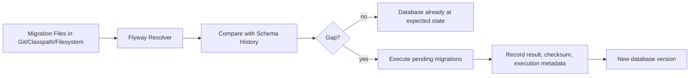
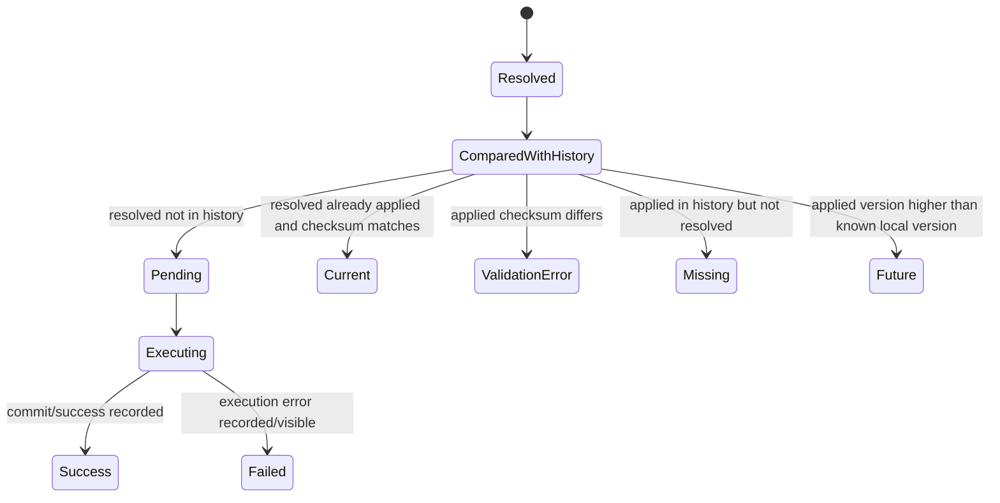
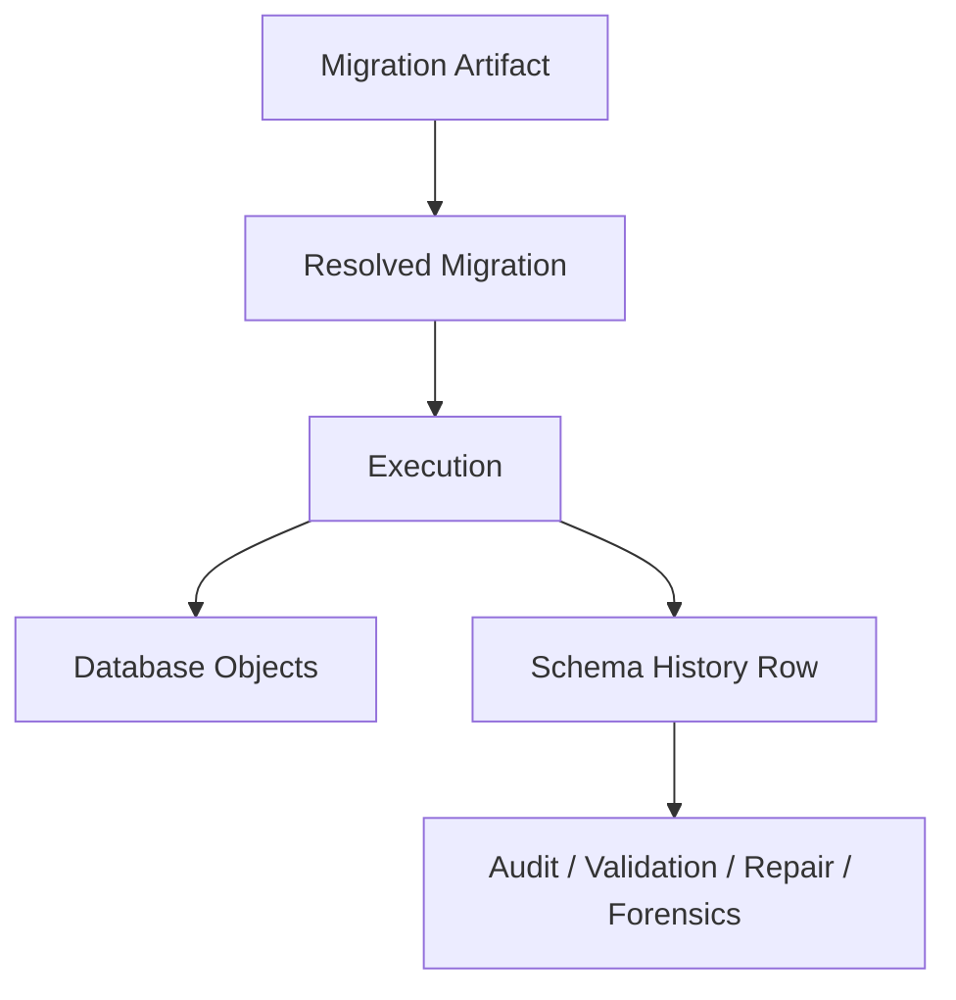
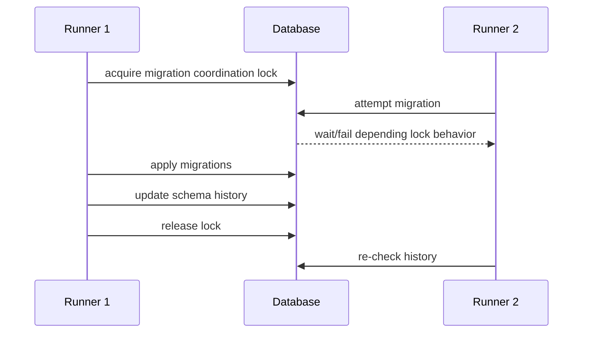

# Part 009 — Flyway Core Model: Versioned, Repeatable, Baseline, Callback, Java Migration

Flyway adalah migration tool yang sengaja dibuat dengan model mental sederhana: **database saat ini dibandingkan dengan kumpulan migration artifact yang tersedia, lalu Flyway menjalankan perubahan yang belum diterapkan untuk menutup gap**.

Model ini terlihat sederhana, tetapi implikasinya sangat besar di production. Flyway bukan ORM schema generator, bukan schema diff engine utama, dan bukan framework business logic. Flyway adalah **state transition coordinator** untuk database.



Bagian ini membahas Flyway dari core model, bukan dari tutorial command-line. Tujuannya adalah membuat kita mampu menjawab pertanyaan production seperti:

- apakah migration ini aman dijalankan di cluster aplikasi yang rolling deploy?
- apakah file migration boleh diedit setelah staging?
- mengapa checksum mismatch terjadi?
- kapan baseline membantu dan kapan baseline menyembunyikan masalah?
- kapan repeatable migration tepat, dan kapan ia menimbulkan nondeterminism?
- mengapa menjalankan migration di startup aplikasi sering berbahaya di large fleet?
- bagaimana membatasi privilege Flyway tanpa merusak operability?

---

## 1. Skill Target

Setelah bagian ini, target kemampuan bukan hanya “bisa pakai Flyway”, tetapi:

1. memahami state machine Flyway;
2. memilih jenis migration yang tepat;
3. mendesain migration history yang immutable;
4. membaca schema history sebagai forensic evidence;
5. mendesain baseline untuk database existing;
6. menggunakan placeholder dan callback tanpa menciptakan environment drift;
7. memahami kapan Java migration dibutuhkan;
8. menentukan apakah Flyway dijalankan oleh aplikasi, CI/CD pipeline, atau migration runner terpisah.

Dalam framework Kaufman, kita mengurangi skill besar menjadi sub-skill kecil yang bisa dilatih:

| Sub-skill | Latihan minimal | Failure signal |
|---|---:|---|
| Membaca `info`/history | Jalankan migration dari kosong dan dari DB existing | Tidak bisa menjelaskan pending/success/missing/future |
| Authoring versioned migration | Buat 5 perubahan DDL/DML incremental | Migration diedit setelah applied |
| Authoring repeatable migration | Buat view/procedure rerunnable | Repeatable script menghapus data tak sengaja |
| Baseline | Baseline DB legacy dengan versi awal | Migration lama ikut dijalankan ke DB existing |
| Recovery | Simulasikan checksum mismatch dan failed migration | Menggunakan `repair` tanpa root-cause |
| Java migration | Backfill chunked dengan checkpoint | Migration tidak resumable |

---

## 2. Flyway sebagai State Machine

Flyway selalu bekerja terhadap dua sumber kebenaran:

1. **resolved migrations**: migration yang ditemukan dari filesystem/classpath/location;
2. **applied migrations**: migration yang tercatat di schema history table.

Saat `migrate`, Flyway membandingkan keduanya.



Secara engineering, Flyway menjawab pertanyaan:

> Berdasarkan daftar migration yang saya punya, apa perubahan minimal yang harus dijalankan agar database ini mencapai state yang diharapkan?

Ini berarti kualitas Flyway bergantung pada kualitas artifact migration. Jika migration artifact buruk, nondeterministic, environment-specific, atau diam-diam diubah, Flyway tidak bisa menyelamatkan desainnya.

---

## 3. Core Artifact: Migration File

Flyway migration biasanya berupa SQL script, tetapi bisa juga Java migration. SQL script adalah default yang paling reviewable dan paling dekat dengan database engine.

Migration file memuat:

- **identity**: version atau repeatable name;
- **description**: maksud manusiawi dari perubahan;
- **content**: SQL/Java logic;
- **checksum**: fingerprint untuk mendeteksi perubahan content;
- **location**: classpath/filesystem path tempat artifact ditemukan.

Contoh versioned migration:

```sql
-- V202606280901__create_case_event_table.sql
CREATE TABLE case_event (
    id BIGINT GENERATED ALWAYS AS IDENTITY PRIMARY KEY,
    case_id BIGINT NOT NULL,
    event_type VARCHAR(80) NOT NULL,
    occurred_at TIMESTAMP NOT NULL,
    payload_json TEXT NOT NULL
);

CREATE INDEX idx_case_event_case_occurred
    ON case_event (case_id, occurred_at);
```

Contoh repeatable migration:

```sql
-- R__case_event_projection_view.sql
CREATE OR REPLACE VIEW v_case_event_projection AS
SELECT
    case_id,
    event_type,
    occurred_at
FROM case_event;
```

Versioned migration membangun sejarah. Repeatable migration merepresentasikan artifact yang wajar didefinisikan ulang.

---

## 4. Versioned Migration

Versioned migration adalah migration yang dijalankan **sekali saja** dalam urutan versi.

Gunakan versioned migration untuk:

- membuat table;
- mengubah column;
- menambah index;
- menambah constraint;
- memindahkan data satu kali;
- memperbaiki data historis;
- menambah reference data dengan aturan eksplisit;
- membuat struktur awal schema.

Contoh:

```txt
V001__create_case_table.sql
V002__add_case_status.sql
V003__create_case_event_table.sql
V004__backfill_case_status.sql
V005__add_case_status_not_null_constraint.sql
```

Aturan production:

> Setelah versioned migration diterapkan ke environment permanen, jangan edit file tersebut. Buat migration baru untuk koreksi.

Alasannya bukan dogma. Alasannya adalah reproducibility.

Jika `V003` sudah diterapkan ke staging dan production, lalu file `V003` diedit di Git, maka ada dua realitas:

- database lama pernah menjalankan `V003` versi A;
- database baru dari scratch menjalankan `V003` versi B.

Keduanya mungkin memiliki version number sama tetapi schema berbeda. Ini drift yang buruk karena history tampak sama, tetapi state berbeda.

---

## 5. Version Naming Strategy

Flyway mengizinkan versi dengan dotted atau underscore notation. Secara praktik, ada tiga strategi umum.

### 5.1 Sequential Integer

```txt
V001__init.sql
V002__add_customer_email.sql
V003__create_payment_table.sql
```

Kelebihan:

- mudah dibaca;
- urutan jelas;
- bagus untuk tim kecil atau single stream.

Kekurangan:

- rawan conflict saat banyak branch membuat migration bersamaan;
- perlu renumber saat merge;
- butuh disiplin tinggi di trunk-based development.

### 5.2 Timestamp Version

```txt
V202606280930__add_case_priority.sql
V202606281015__create_case_assignment.sql
```

Kelebihan:

- mengurangi conflict;
- cocok untuk tim besar;
- urutan historis lebih terlihat.

Kekurangan:

- versi panjang;
- timestamp bukan jaminan dependency order;
- developer bisa membuat timestamp yang salah.

### 5.3 Release-Scoped Version

```txt
V2026.06.28.001__add_case_priority.sql
V2026.06.28.002__create_case_assignment.sql
```

Kelebihan:

- cocok untuk release train;
- mudah dikaitkan dengan release note;
- enak untuk audit.

Kekurangan:

- butuh policy release yang jelas;
- merge antar-release dapat rumit.

### 5.4 Rule of Thumb

| Context | Strategy yang masuk akal |
|---|---|
| Tim kecil, repo sederhana | sequential padded integer |
| Tim besar, trunk-based | timestamp |
| Regulated release train | release-scoped + timestamp detail |
| Multi-service shared platform | timestamp + domain prefix di description |
| Legacy modernization | baseline version + forward timestamp |

Yang penting bukan formatnya, tetapi invariant-nya:

1. version unique;
2. ordering deterministic;
3. migration immutable setelah applied;
4. naming memuat intent yang cukup;
5. conflict diselesaikan sebelum merge, bukan saat production deploy.

---

## 6. Schema History Table

Flyway membuat schema history table untuk melacak migration yang sudah diterapkan. Secara default sering dikenal sebagai `flyway_schema_history`, meskipun nama dan lokasi dapat dikonfigurasi.

History table adalah **ledger**, bukan sekadar cache.

Ia menyimpan informasi seperti:

- installed rank;
- version;
- description;
- type;
- script;
- checksum;
- installed by;
- installed on;
- execution time;
- success/failure.



Cara membaca schema history:

| Signal | Arti |
|---|---|
| migration success | perubahan pernah berhasil dijalankan |
| migration failed | DB mungkin berada pada state parsial, tergantung DDL transaction semantics |
| checksum mismatch | applied artifact berbeda dari file saat ini |
| missing | migration tercatat di DB tapi file tidak ditemukan |
| future | DB punya migration dari branch/release yang lebih baru daripada code lokal |
| out of order | migration versi lama diterapkan setelah versi yang lebih tinggi |

History table bukan bukti bahwa schema saat ini benar. Ia bukti bahwa tool pernah mencatat eksekusi tertentu. Untuk correctness, tetap perlu verification query, integration test, dan drift detection.

---

## 7. Checksum: Integrity, Bukan Security

Checksum Flyway mendeteksi apakah migration file yang resolved sekarang berbeda dari yang dulu diterapkan.

Checksum menjawab:

> Apakah content migration yang sekarang saya lihat sama dengan content yang dulu diterapkan?

Checksum tidak menjawab:

- apakah SQL tersebut benar secara domain;
- apakah migration aman secara lock;
- apakah data migration lengkap;
- apakah user yang menjalankan legitimate;
- apakah file sempat dimanipulasi sebelum masuk Git.

Karena itu, checksum harus dipahami sebagai **integrity control**, bukan security control penuh.

Anti-pattern:

```txt
1. Migration diterapkan ke staging.
2. Developer menemukan typo.
3. Developer edit file lama.
4. Validate gagal karena checksum mismatch.
5. Developer menjalankan repair agar checksum baru diterima.
6. Production dan staging sekarang punya history yang sulit dipercaya.
```

Pattern:

```txt
1. Migration diterapkan ke staging.
2. Developer menemukan typo.
3. Developer membuat migration baru untuk koreksi.
4. History tetap immutable.
5. Audit trail tetap bisa dijelaskan.
```

`repair` bukan penghapus dosa. `repair` adalah alat rekonsiliasi history setelah root-cause dipahami.

---

## 8. Repeatable Migration

Repeatable migration tidak punya version. Ia punya description dan checksum. Flyway menjalankannya saat belum ada di history atau saat checksum berubah.

Biasanya cocok untuk artifact yang secara natural didefinisikan ulang:

- view;
- stored procedure;
- function;
- trigger definition;
- package body;
- derived projection;
- read-only reference projection.

Contoh:

```sql
-- R__v_case_summary.sql
CREATE OR REPLACE VIEW v_case_summary AS
SELECT
    c.id,
    c.case_number,
    c.status,
    COUNT(e.id) AS event_count
FROM cases c
LEFT JOIN case_event e ON e.case_id = c.id
GROUP BY c.id, c.case_number, c.status;
```

Repeatable migration harus memenuhi prinsip:

1. rerunnable;
2. deterministic;
3. tidak bergantung pada urutan file yang tidak jelas;
4. tidak melakukan destructive DML tersembunyi;
5. output setelah rerun dapat diprediksi.

Bad repeatable migration:

```sql
-- R__seed_status.sql
DELETE FROM case_status;
INSERT INTO case_status(code, label) VALUES ('OPEN', 'Open');
INSERT INTO case_status(code, label) VALUES ('CLOSED', 'Closed');
```

Masalah:

- menghapus data yang mungkin sudah dipakai FK;
- tidak membedakan reference data dan runtime data;
- rerun karena komentar berubah pun bisa berdampak besar;
- dapat merusak audit.

Better:

```sql
-- R__case_status_reference_data.sql
INSERT INTO case_status(code, label, active)
VALUES ('OPEN', 'Open', true)
ON CONFLICT (code) DO UPDATE
SET label = EXCLUDED.label,
    active = EXCLUDED.active;

INSERT INTO case_status(code, label, active)
VALUES ('CLOSED', 'Closed', true)
ON CONFLICT (code) DO UPDATE
SET label = EXCLUDED.label,
    active = EXCLUDED.active;
```

Tetap perlu policy: apakah reference data boleh berubah lewat repeatable migration atau harus lewat versioned migration agar setiap perubahan historis terlihat jelas?

Untuk regulated system, biasanya perubahan reference data penting lebih cocok versioned.

---

## 9. Baseline Migration dan Baseline Command

Baseline adalah konsep untuk database yang sudah ada sebelum Flyway dipakai.

Masalah legacy umum:

```txt
Database production sudah punya 800 table.
Aplikasi ingin mulai memakai Flyway.
Tidak mungkin menjalankan V001__create_all_tables.sql ke production karena object sudah ada.
```

Ada beberapa pendekatan.

### 9.1 Baseline Existing Database

Kita menandai database existing sebagai berada pada versi baseline tertentu. Setelah itu, Flyway hanya menjalankan migration di atas baseline version.

```txt
baselineVersion = 1000

V1001__add_case_priority.sql
V1002__create_case_assignment.sql
```

Ini cocok saat:

- database sudah production;
- schema lama dikelola manual/legacy;
- kita ingin mulai forward migration dari titik tertentu.

Risikonya:

- baseline tidak membuktikan schema benar;
- baseline hanya membuat ledger awal;
- perlu snapshot schema untuk forensic reference.

Checklist baseline:

```txt
[ ] Ambil schema dump dari production.
[ ] Simpan sebagai artifact read-only.
[ ] Dokumentasikan baseline version.
[ ] Validasi semua environment punya schema compatible.
[ ] Jalankan baseline hanya sekali dengan approval.
[ ] Setelah baseline, semua perubahan wajib lewat Flyway.
```

### 9.2 Baseline Migration Script

Flyway juga mengenal baseline migration sebagai script yang merepresentasikan state awal untuk database baru, agar tidak perlu menjalankan ratusan migration historis dari awal.

Modelnya:

```txt
B1000__baseline_schema.sql
V1001__add_case_priority.sql
V1002__create_case_assignment.sql
```

Gunakan dengan hati-hati. Baseline script adalah snapshot, bukan pengganti seluruh history audit.

### 9.3 Anti-Pattern Baseline

Anti-pattern paling umum:

```txt
baselineOnMigrate=true di semua environment, termasuk production, tanpa guardrail.
```

Risiko:

- database yang salah target bisa otomatis dianggap baseline;
- migration penting di bawah baseline ter-skip;
- pipeline tampak sukses padahal schema tidak sesuai;
- kesalahan koneksi DB menjadi lebih berbahaya.

Baseline harus eksplisit, bukan default refleks.

---

## 10. Callbacks

Callback adalah hook pada lifecycle Flyway. Ia dapat berupa SQL callback atau Java callback.

Gunakan callback untuk behavior lintas-migration yang benar-benar teknis/operasional, misalnya:

- set session parameter;
- set lock timeout;
- set application name;
- capture audit metadata;
- run lightweight verification;
- enforce environment guard;
- clear temporary session state.

Contoh callback SQL konseptual PostgreSQL:

```sql
-- beforeMigrate.sql
SET lock_timeout = '5s';
SET statement_timeout = '10min';
```

Callback bukan tempat untuk business data migration kompleks. Kalau logic-nya adalah perubahan domain, jadikan migration eksplisit.

Anti-pattern callback:

```txt
beforeMigrate.sql diam-diam membuat schema, grant, seed data, dan memperbaiki row production.
```

Masalahnya:

- intent tidak terlihat dalam versioned history sebagai migration biasa;
- urutan dan dampaknya sulit diaudit;
- developer lain tidak sadar ada perubahan tersembunyi;
- recovery lebih sulit.

Rule:

> Callback boleh mengatur execution envelope. Callback tidak boleh menyembunyikan domain change.

---

## 11. Placeholders

Placeholder memungkinkan SQL migration memakai variable yang diganti saat execution.

Contoh:

```sql
CREATE SCHEMA IF NOT EXISTS ${app_schema};

CREATE TABLE ${app_schema}.case_event (
    id BIGINT GENERATED ALWAYS AS IDENTITY PRIMARY KEY,
    case_id BIGINT NOT NULL,
    event_type VARCHAR(80) NOT NULL
);
```

Placeholder berguna untuk:

- schema name per environment;
- tablespace name;
- role name;
- safe constant yang memang environment-specific;
- avoiding duplicated scripts untuk tenant/sandbox tertentu.

Tetapi placeholder juga mudah merusak determinism.

Bad:

```sql
ALTER TABLE case_event
ADD COLUMN debug_owner VARCHAR(100) DEFAULT '${developer_name}';
```

Masalah:

- schema/data menjadi environment-specific;
- migration yang sama menghasilkan state berbeda;
- forensic sulit;
- CI tidak mewakili production.

Policy placeholder:

| Placeholder type | Aman? | Catatan |
|---|---:|---|
| schema name | Ya, jika dikontrol | Umum untuk multi-schema |
| role/grant name | Ya, jika dikontrol | Pastikan privilege policy jelas |
| tablespace | Ya, vendor-specific | Infrastruktur bukan domain |
| feature behavior | Biasanya tidak | Lebih baik feature flag aplikasi |
| data value domain | Hati-hati | Bisa menciptakan drift |
| secret | Tidak | Jangan letakkan secret di migration script |

---

## 12. Java Migration

Flyway Java migration memungkinkan migration ditulis dalam Java. Ini berguna ketika SQL saja tidak cukup atau ketika kita butuh kontrol programatik.

Gunakan Java migration untuk:

- large data backfill dengan batching;
- checkpoint/resume;
- transformasi JSON/BLOB/CLOB kompleks;
- migrasi yang butuh parsing format lama;
- validasi cross-table yang lebih mudah diekspresikan di Java;
- migration yang harus throttle atau sleep terkontrol;
- multi-step data correction dengan observability.

Contoh skeleton konseptual:

```java
package db.migration;

import org.flywaydb.core.api.migration.BaseJavaMigration;
import org.flywaydb.core.api.migration.Context;

import java.sql.Connection;
import java.sql.PreparedStatement;
import java.sql.ResultSet;

public class V202606281030__backfill_case_priority extends BaseJavaMigration {

    @Override
    public void migrate(Context context) throws Exception {
        Connection connection = context.getConnection();

        long lastId = 0L;
        int batchSize = 1000;

        while (true) {
            long maxId = fetchNextMaxId(connection, lastId, batchSize);
            if (maxId == lastId) {
                break;
            }

            try (PreparedStatement ps = connection.prepareStatement("""
                UPDATE cases
                SET priority = CASE
                    WHEN risk_score >= 80 THEN 'HIGH'
                    WHEN risk_score >= 40 THEN 'MEDIUM'
                    ELSE 'LOW'
                END
                WHERE id > ? AND id <= ? AND priority IS NULL
                """)) {
                ps.setLong(1, lastId);
                ps.setLong(2, maxId);
                ps.executeUpdate();
            }

            lastId = maxId;
        }
    }

    private long fetchNextMaxId(Connection connection, long lastId, int batchSize) throws Exception {
        try (PreparedStatement ps = connection.prepareStatement("""
            SELECT COALESCE(MAX(id), ?) AS max_id
            FROM (
                SELECT id
                FROM cases
                WHERE id > ?
                ORDER BY id
                LIMIT ?
            ) s
            """)) {
            ps.setLong(1, lastId);
            ps.setLong(2, lastId);
            ps.setInt(3, batchSize);
            try (ResultSet rs = ps.executeQuery()) {
                rs.next();
                return rs.getLong("max_id");
            }
        }
    }
}
```

Catatan penting:

- contoh ini tidak otomatis ideal untuk semua DB;
- transaction boundary harus disesuaikan;
- long-running Java migration di satu transaction dapat berbahaya;
- retry/resume harus dipikirkan;
- observability perlu ditambahkan untuk production.

Java migration bukan alasan untuk membawa business service layer ke migration. Migration harus kecil, deterministic, dan fokus.

---

## 13. Commands sebagai Operational Interface

Flyway command bukan sekadar utility. Setiap command punya makna operasional.

| Command | Fungsi | Production posture |
|---|---|---|
| `info` | melihat status migration | aman dan wajib sebelum deploy |
| `validate` | membandingkan applied history dengan resolved migrations | wajib di CI/CD |
| `migrate` | menjalankan pending migration | gated, observable |
| `baseline` | menandai DB existing sebagai baseline | approval eksplisit |
| `repair` | memperbaiki schema history metadata | forensic dulu, baru repair |
| `clean` | drop object di configured schema | disable di production |
| `undo` | undo versioned migration di edition tertentu | jangan dianggap rollback universal |

Production pipeline minimal:

```mermaid
flowchart LR
    A[Checkout Git SHA] --> B[Build Migration Artifact]
    B --> C[Spin Up Ephemeral DB]
    C --> D[flyway migrate from empty]
    D --> E[flyway validate]
    E --> F[Integration Tests]
    F --> G[Staging migrate]
    G --> H[Production info + validate]
    H --> I[Production migrate]
    I --> J[Post-migration verification]
```



---

## 14. Execution Location: Startup vs Pipeline vs Dedicated Runner

Ada tiga model umum.

### 14.1 Application Startup Migration

Aplikasi menjalankan Flyway saat startup.

Kelebihan:

- sederhana;
- mudah untuk service kecil;
- tidak butuh runner terpisah;
- cocok untuk local/dev/test.

Risiko:

- banyak instance bisa berebut lock;
- aplikasi gagal start jika migration lambat/gagal;
- deployment dan database change terlalu coupled;
- sulit memberi approval gate;
- sulit mengatur maintenance window;
- autoscaling bisa memicu migration attempt saat tidak diinginkan.

Cocok untuk:

- internal small service;
- local development;
- integration test;
- non-critical system.

Kurang cocok untuk:

- large fleet;
- multi-tenant fan-out;
- regulated production;
- migration besar;
- zero-downtime rollout kompleks.

### 14.2 CI/CD Pipeline Migration

Pipeline menjalankan Flyway sebelum/bersama deploy aplikasi.

Kelebihan:

- audit lebih jelas;
- approval gate mudah;
- migration bisa diobservasi terpisah;
- app startup lebih bersih.

Risiko:

- perlu secret management matang;
- perlu rollback/roll-forward playbook;
- perlu ordering dengan app deployment;
- pipeline failure bisa meninggalkan DB dalam state transisi.

### 14.3 Dedicated Migration Runner

Runner terpisah, misalnya Kubernetes Job, ECS Task, Jenkins step, GitHub Actions self-hosted runner, atau internal deploy orchestrator.

Kelebihan:

- isolation jelas;
- bisa memakai identity/role khusus;
- log dan evidence terpisah;
- cocok untuk approval dan SOD.

Risiko:

- complexity lebih tinggi;
- harus memastikan artifact dan application version sinkron;
- runner harus punya network path ke DB.

Rule praktis:

> Semakin besar blast radius migration, semakin migration harus dipisahkan dari startup aplikasi.

---

## 15. Flyway dengan Spring Boot

Spring Boot memiliki auto-configuration untuk Flyway. Dalam aplikasi sederhana, cukup dependency dan migration di classpath.

Struktur umum:

```txt
src/main/resources/db/migration/
  V001__init.sql
  V002__add_case_status.sql
  R__v_case_summary.sql
```

Konfigurasi konseptual:

```yaml
spring:
  flyway:
    enabled: true
    locations: classpath:db/migration
    baseline-on-migrate: false
    clean-disabled: true
```

Untuk production mature, sering lebih baik:

```yaml
spring:
  flyway:
    enabled: false
```

Lalu migration dijalankan oleh pipeline/runner.

Keputusan bukan soal benar/salah. Keputusan bergantung pada risk profile.

| Faktor | Startup migration | Pipeline/runner migration |
|---|---:|---:|
| Local dev simplicity | Tinggi | Sedang |
| Production audit | Sedang | Tinggi |
| Large migration control | Rendah | Tinggi |
| Multi-instance safety | Bergantung lock | Lebih mudah dikontrol |
| Approval gate | Lemah | Kuat |
| Failure isolation | Lemah | Kuat |

---

## 16. Multi-Schema Model

Flyway dapat mengelola satu atau beberapa schema. Hal yang harus dipahami:

- schema history table berada di default schema;
- default schema dapat dikonfigurasi;
- `schemas` menentukan schema yang dikelola;
- `createSchemas` menentukan apakah Flyway mencoba membuat schema;
- `clean` berdampak pada configured schemas, karena itu harus sangat dibatasi.

Production pattern:

```properties
flyway.defaultSchema=app_history
flyway.schemas=app_history,case_management,case_reporting
flyway.createSchemas=false
flyway.cleanDisabled=true
```

Lalu pembuatan schema bisnis dilakukan eksplisit oleh migration:

```sql
CREATE SCHEMA IF NOT EXISTS case_management;
CREATE SCHEMA IF NOT EXISTS case_reporting;
```

Mengapa memisahkan history schema?

- history table tidak tercampur dengan object domain;
- lifecycle schema domain lebih eksplisit;
- clean/drop guardrail lebih mudah;
- audit ownership lebih jelas.

Tetapi jangan memaksakan ini jika database/vendor/organization convention berbeda. Yang penting adalah policy-nya jelas.

---

## 17. Locking Flyway

Flyway perlu mencegah dua migration berjalan bersamaan pada schema yang sama. Detail mekanismenya bergantung pada database dan implementasi, tetapi mental model-nya:



Jangan mengandalkan lock tool sebagai satu-satunya safety.

Tambahkan guardrail:

- hanya satu deploy job per environment;
- migration runner concurrency = 1;
- explicit environment lock di CI/CD;
- timeout yang masuk akal;
- alert saat migration menunggu lock terlalu lama;
- manual approval untuk destructive/high-risk migration.

---

## 18. Flyway dan Immutable Artifact

Dalam sistem mature, migration artifact harus diperlakukan seperti binary release artifact.

Bad:

```txt
Pipeline production membaca migration langsung dari branch mutable.
```

Better:

```txt
1. Commit Git SHA tertentu dibuild.
2. Migration artifact dipaketkan bersama release artifact.
3. Artifact diberi checksum/signature.
4. Staging dan production memakai artifact yang sama.
5. Deployment evidence mencatat Git SHA + artifact version + Flyway history.
```

Ingat: Flyway menjaga database history. Ia tidak otomatis menjaga supply chain artifact. Itu tanggung jawab engineering platform.

---

## 19. Flyway Failure Model

Kegagalan Flyway harus dibaca dalam tiga layer:

1. **tool layer**: command gagal, config salah, driver hilang;
2. **database layer**: SQL error, lock timeout, deadlock, implicit commit;
3. **domain layer**: data invariant rusak, backfill salah, app tidak compatible.

Failure matrix:

| Failure | Kemungkinan state DB | Respons |
|---|---|---|
| SQL syntax error sebelum statement jalan | tidak berubah | fix migration baru jika belum applied; kalau local boleh edit |
| DDL gagal dalam transactional DB | rollback statement/transaction | cek history, rerun setelah fix |
| DDL implicit commit lalu statement berikutnya gagal | partial schema | manual analysis, roll-forward/repair |
| checksum mismatch | DB mungkin benar, artifact berubah | forensic, jangan langsung repair |
| missing migration | file hilang atau branch salah | restore file atau rekonsiliasi branch |
| future migration | DB lebih maju dari code | jangan downgrade buta; pakai code/release yang sesuai |
| repeatable outdated | artifact berubah | review dampak rerun |

---

## 20. Production Guardrails

Minimum guardrail untuk Flyway production:

```txt
[ ] clean disabled.
[ ] baselineOnMigrate disabled by default.
[ ] migration artifact immutable after release.
[ ] validate runs before migrate.
[ ] info captured before and after migrate.
[ ] schema history exported/logged as evidence.
[ ] lock timeout configured at DB/session level.
[ ] migration user separated from app user.
[ ] destructive migration requires explicit approval.
[ ] rollback plan is written as roll-forward decision tree.
[ ] startup migration disabled for high-risk production systems.
```

---

## 21. Common Anti-Patterns

### 21.1 Editing Applied Versioned Migration

Ini merusak reproducibility. Buat migration baru.

### 21.2 Blind Repair

`repair` tanpa forensic membuat history tampak bersih tetapi kebenaran operasional hilang.

### 21.3 Baseline-On-Migrate Everywhere

Nyaman di awal, berbahaya di production. Baseline harus eksplisit.

### 21.4 Repeatable Migration untuk Semua Reference Data

Repeatable bukan audit log perubahan data. Untuk data penting, versioned migration sering lebih defensible.

### 21.5 Startup Migration di Large Fleet

Saat 100 pod start bersamaan, database migration menjadi bagian dari startup storm.

### 21.6 Placeholder untuk Behavior Domain

Placeholder harus mengontrol deployment envelope, bukan membuat domain logic berbeda per environment.

### 21.7 Java Migration sebagai Mini Application

Jika migration butuh seluruh service layer, kemungkinan desain migration terlalu besar atau salah boundary.

---

## 22. Review Checklist untuk Flyway Migration

Gunakan checklist ini saat PR review:

```txt
Identity:
[ ] Version/name unique.
[ ] Description jelas dan domain-specific.
[ ] Tidak mengubah migration lama yang sudah applied.

Compatibility:
[ ] Aman untuk old app dan new app selama rollout.
[ ] Tidak menghapus/rename object yang masih dipakai.
[ ] Jika breaking, ada expand/contract plan.

Transaction and lock:
[ ] DDL semantics vendor dipahami.
[ ] Lock risk dianalisis.
[ ] Timeout strategy tersedia.
[ ] Migration besar tidak berjalan dalam transaction raksasa.

Data:
[ ] DML deterministic.
[ ] Backfill resumable jika besar.
[ ] Verification query tersedia.
[ ] Reference data ownership jelas.

Operations:
[ ] validate/info akan dijalankan.
[ ] rollback/roll-forward plan tertulis.
[ ] Tidak bergantung pada environment-specific hidden behavior.
[ ] clean/baseline/repair tidak digunakan tanpa approval.
```

---

## 23. Deliberate Practice

Latihan 1 — Basic state machine:

```txt
1. Buat DB kosong.
2. Jalankan V001, V002.
3. Jalankan info.
4. Edit V001.
5. Jalankan validate.
6. Jelaskan error tanpa menjalankan repair.
```

Latihan 2 — Repeatable:

```txt
1. Buat table.
2. Buat R__view.sql.
3. Jalankan migrate.
4. Ubah view.
5. Jalankan migrate lagi.
6. Amati schema history.
```

Latihan 3 — Baseline:

```txt
1. Buat DB manual dengan satu table.
2. Baseline di version 100.
3. Tambahkan V101.
4. Jalankan migrate.
5. Buktikan V001-V100 tidak dijalankan.
```

Latihan 4 — Failure recovery:

```txt
1. Buat migration yang gagal di tengah.
2. Amati state DB dan schema history.
3. Tentukan apakah fix-nya edit local, repair, atau roll-forward.
4. Tulis incident note.
```

---

## 24. Ringkasan

Flyway efektif karena modelnya sederhana dan tegas:

- migration disimpan sebagai artifact;
- history dicatat di database;
- versioned migration dijalankan sekali secara berurutan;
- repeatable migration dijalankan ulang saat berubah;
- checksum menjaga integritas artifact;
- baseline menandai titik awal database existing;
- callback dan placeholder mengatur execution envelope;
- Java migration dipakai untuk transformasi yang membutuhkan kontrol programatik.

Kekuatan Flyway juga batasannya. Flyway tidak menggantikan desain compatibility, lock analysis, audit governance, atau data verification. Engineer top-tier memakai Flyway sebagai bagian dari release system, bukan sebagai tombol ajaib.

---

## 25. Referensi Faktual

- Redgate Flyway Documentation — Migrations.
- Redgate Flyway Documentation — Versioned migrations.
- Redgate Flyway Documentation — Repeatable migrations.
- Redgate Flyway Documentation — Flyway schema history table.
- Redgate Flyway Documentation — Default schema setting.
- Redgate Flyway Documentation — Create schemas setting.
- Redgate Flyway Documentation — Gradle task.
- Spring Boot Reference Documentation — Database initialization and Flyway integration.
