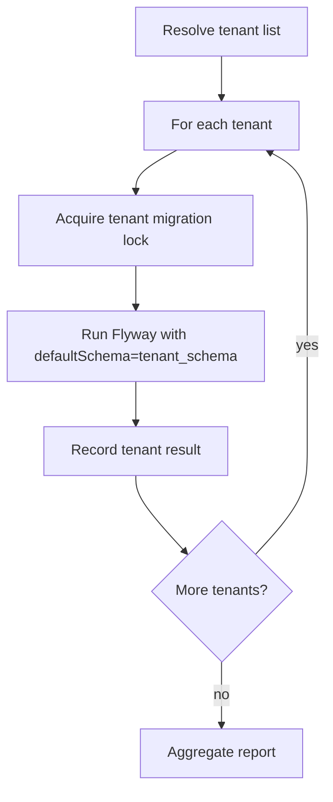

# Part 010 — Flyway Project Structure untuk Java, Maven, Gradle, Spring Boot, dan Multi-Module Repo

Struktur project Flyway adalah desain arsitektur kecil yang efeknya besar. Folder migration yang tampak rapi di bulan pertama bisa berubah menjadi bottleneck setelah:

- tim bertambah;
- branch paralel meningkat;
- service dipecah;
- modul domain bertambah;
- tenant bertambah;
- schema ownership berubah;
- CI/CD menjadi regulated;
- database perlu baseline, repair, dan audit.

Bagian ini membahas bagaimana menyusun migration dalam project Java agar tetap dapat direview, diuji, dirilis, dan diaudit.

Targetnya bukan satu template universal. Targetnya adalah mental model untuk memilih struktur yang sesuai dengan topology sistem.

---

## 1. Prinsip Desain Struktur Flyway

Struktur migration harus memenuhi enam prinsip:

| Prinsip | Makna |
|---|---|
| Ownership jelas | Setiap migration punya domain/service owner |
| Ordering deterministic | Urutan eksekusi tidak ambigu |
| Artifact reproducible | Staging dan production memakai artifact yang sama |
| Reviewable | PR reviewer bisa memahami blast radius |
| Testable | Migration bisa dijalankan dari kosong dan dari snapshot |
| Auditable | Mapping ke release, ticket, approval, dan schema history jelas |

Jika struktur folder membuat engineer sulit menjawab “migration ini milik siapa dan dijalankan kapan?”, struktur itu belum production-grade.

---

## 2. Default Layout Spring Boot

Layout paling umum:

```txt
my-service/
  src/
    main/
      java/
      resources/
        db/
          migration/
            V001__init.sql
            V002__add_case_status.sql
            R__v_case_summary.sql
```

Kelebihan:

- sesuai convention Spring Boot;
- sederhana untuk local development;
- migration ikut terpaket di application artifact;
- mudah untuk integration test.

Kekurangan:

- application startup dan migration cenderung coupled;
- multi-schema dan multi-tenant cepat rumit;
- sulit memisahkan approval database dari approval code;
- migration artifact berubah bersama application artifact walau release database perlu dikontrol terpisah.

Gunakan layout ini untuk:

- service kecil;
- single schema;
- satu tim owner;
- low-risk deployment;
- dev/test/integration environment.

Untuk production regulated atau large fleet, layout ini masih bisa dipakai, tetapi migration execution sebaiknya dipertimbangkan via pipeline/runner.

---

## 3. Maven Layout: Application-Coupled Migration

Contoh Maven sederhana:

```txt
case-service/
  pom.xml
  src/main/java/com/example/caseapp/
  src/main/resources/db/migration/
    V202606280901__create_case_table.sql
    V202606280902__create_case_event_table.sql
    R__v_case_summary.sql
```

Dependency konseptual:

```xml
<dependency>
    <groupId>org.flywaydb</groupId>
    <artifactId>flyway-core</artifactId>
</dependency>
```

Spring Boot bisa menjalankan Flyway otomatis jika dependency dan konfigurasi aktif.

Namun, untuk pipeline migration, kita dapat tetap menyimpan migration di `src/main/resources` tetapi menjalankan Flyway lewat Maven/CLI/runner terhadap artifact hasil build.

Pattern:

```txt
Build application JAR
  -> contains db/migration/*.sql
Pipeline extracts/uses classpath migration
  -> flyway validate
  -> flyway migrate
Deploy app
```

Kelebihan:

- migration dan code compatible berada dalam release artifact yang sama;
- mudah trace Git SHA;
- testing dari classpath sama seperti production.

Risiko:

- jika pipeline menggunakan source checkout sementara production memakai JAR berbeda, artifact mismatch bisa terjadi;
- perlu disiplin agar migration tidak diedit setelah release artifact dibuat.

---

## 4. Gradle Layout: Single Module

Layout Gradle sama secara konsep:

```txt
case-service/
  build.gradle
  src/main/java/com/example/caseapp/
  src/main/resources/db/migration/
    V202606280901__create_case_table.sql
    V202606280902__add_case_priority.sql
```

Konfigurasi konseptual:

```groovy
plugins {
    id 'java'
    id 'org.flywaydb.flyway' version '<managed-version>'
}

flyway {
    url = System.getenv('DB_URL')
    user = System.getenv('DB_MIGRATION_USER')
    password = System.getenv('DB_MIGRATION_PASSWORD')
    locations = ['classpath:db/migration']
    cleanDisabled = true
}
```

Catatan: plugin Flyway Gradle modern memiliki requirement Gradle/Java versi tertentu. Jangan hardcode asumsi versi dari tutorial lama; lock versi plugin di platform build dan cek dokumentasi resmi saat upgrade.

---

## 5. App Repo vs Migration Repo

Ada dua model besar.

### 5.1 Migration di Application Repo

```txt
case-service/
  src/main/resources/db/migration/
```

Kelebihan:

- code dan DB contract dekat;
- PR bisa mereview perubahan code dan schema bersama;
- cocok untuk service-owned database;
- mudah untuk local dev.

Kekurangan:

- DBA governance kadang sulit;
- cross-service database change sulit;
- app release dan DB release bisa terlalu coupled.

### 5.2 Dedicated Database Migration Repo

```txt
case-database/
  migrations/
    case_management/
    case_reporting/
  pipelines/
  docs/
```

Kelebihan:

- database release bisa independen;
- audit dan approval lebih sentral;
- cocok untuk shared platform/regulated database;
- dapat mengakomodasi DBA workflow.

Kekurangan:

- risiko code/schema contract drift lebih tinggi;
- developer experience lebih berat;
- perlu dependency/link ke application release;
- testing end-to-end harus dirancang lebih serius.

Decision rule:

| Database ownership | Struktur yang biasanya cocok |
|---|---|
| Service-owned private DB | migration di app repo |
| Modular monolith satu DB | migration module terpisah dalam mono-repo |
| Shared regulated DB | dedicated DB repo atau database module |
| Platform schema dipakai banyak service | dedicated migration repo + contract tests |
| Tenant schema generated per service | app repo + tenant runner |

---

## 6. Multi-Module Maven/Gradle: Modular Monolith

Modular monolith sering punya satu database tetapi banyak domain module.

Contoh domain:

```txt
case-platform/
  case-core/
  case-assignment/
  case-enforcement/
  case-reporting/
  app/
```

Pilihan struktur migration:

### 6.1 Centralized Migration Folder

```txt
case-platform/
  app/src/main/resources/db/migration/
    V202606280901__case_core_create_case.sql
    V202606280902__assignment_create_assignment.sql
    V202606280903__enforcement_create_action.sql
```

Kelebihan:

- urutan global jelas;
- satu Flyway location;
- mudah dijalankan.

Kekurangan:

- folder cepat besar;
- ownership domain kurang kuat;
- conflict antar tim lebih sering.

### 6.2 Domain-Separated Source, Assembled Artifact

```txt
case-platform/
  case-core/src/main/resources/db/migration/case-core/
    V202606280901__create_case.sql
  case-assignment/src/main/resources/db/migration/case-assignment/
    V202606280902__create_assignment.sql
  app/src/main/resources/db/migration/
```

Build process mengumpulkan migration ke artifact final atau Flyway diberi multiple locations.

Kelebihan:

- ownership domain jelas;
- reviewer domain lebih mudah;
- module boundary terlihat.

Kekurangan:

- ordering global harus tetap dijaga;
- duplicate version antar-module bisa terjadi;
- build configuration lebih kompleks.

### 6.3 Hybrid: Central Manifest + Domain Folders

```txt
case-platform/
  db/
    migration/
      manifest.md
      case-core/
        V202606280901__case_core_create_case.sql
      case-assignment/
        V202606280902__assignment_create_assignment.sql
```

Manifest mendokumentasikan urutan, ownership, dan dependency.

```md
# Migration Manifest

| Version | Domain | File | Depends on | Ticket |
|---|---|---|---|---|
| 202606280901 | case-core | case-core/V... | none | CASE-100 |
| 202606280902 | assignment | assignment/V... | case-core | CASE-140 |
```

Ini berguna di organisasi yang membutuhkan audit kuat.

---

## 7. Multiple Flyway Locations

Flyway dapat membaca migration dari lebih dari satu location. Ini berguna, tetapi harus hati-hati.

Contoh konseptual:

```properties
flyway.locations=classpath:db/migration/common,classpath:db/migration/postgresql
```

Gunakan multiple locations untuk:

- common migrations + vendor-specific migrations;
- domain separation yang tetap memiliki global version ordering;
- test-only migrations di test profile;
- baseline + forward migrations terpisah.

Hindari multiple locations jika:

- tiap module bebas membuat version tanpa koordinasi;
- urutan antar-folder tidak dipahami;
- environment berbeda mendapat location berbeda tanpa alasan kuat;
- location digunakan sebagai feature flag tersembunyi.

Pattern aman:

```txt
All production environments use the same production locations.
Differences are expressed through config envelope, not hidden migration set.
```

Bad:

```properties
# dev
flyway.locations=classpath:db/migration,classpath:db/dev-only

# production
flyway.locations=classpath:db/migration
```

Jika `dev-only` menciptakan object yang membuat app lulus test tapi tidak ada di production, CI memberi sinyal palsu.

Lebih baik:

- test fixture dipisah dari schema migration;
- dev seed data jelas sebagai local profile;
- production migration set tetap sama.

---

## 8. Naming Convention yang Reviewable

Naming yang buruk:

```txt
V12__update.sql
V13__fix.sql
V14__changes.sql
```

Naming yang baik:

```txt
V202606280901__case_core_create_case_table.sql
V202606280915__case_assignment_add_assignee_user_id.sql
V202606281000__case_event_backfill_occurred_at.sql
V202606281030__case_status_add_closed_reason_lookup.sql
```

Format yang direkomendasikan untuk tim besar:

```txt
V<timestamp>__<domain>_<verb>_<object>[_<qualifier>].sql
```

Contoh verb:

- `create`
- `add`
- `alter`
- `drop`
- `backfill`
- `rename`
- `split`
- `merge`
- `seed`
- `grant`
- `validate`
- `contract`

Contoh domain:

- `case_core`
- `case_event`
- `assignment`
- `enforcement`
- `reporting`
- `audit`
- `identity`

Review heuristic:

> Dari nama file saja, reviewer harus bisa memperkirakan domain, action, object, dan risiko awal.

---

## 9. Folder by Domain vs Folder by Release

### 9.1 Folder by Domain

```txt
db/migration/
  case-core/
  assignment/
  reporting/
```

Kelebihan:

- ownership jelas;
- domain review mudah;
- cocok untuk modular monolith.

Kekurangan:

- ordering global harus dikoordinasikan;
- Flyway tetap melihat satu stream version.

### 9.2 Folder by Release

```txt
db/migration/
  2026-06-release/
  2026-07-release/
```

Kelebihan:

- audit release mudah;
- cocok untuk regulated release train;
- deployment package jelas.

Kekurangan:

- domain history tersebar;
- hotfix antar-release bisa rumit;
- folder lama menjadi arsip besar.

### 9.3 Hybrid

```txt
db/migration/
  V202606280901__case_core_create_case_table.sql
  V202606280915__assignment_create_assignment_table.sql

docs/releases/2026-06-28.md
```

Migration tetap flat/global untuk Flyway, sedangkan release mapping ada di docs/manifest.

Ini sering paling sederhana dan robust.

---

## 10. Multi-Schema Structure

Misalnya satu service memiliki schema:

```txt
case_management
case_reporting
audit_log
```

Ada dua pendekatan.

### 10.1 Single Migration Stream untuk Semua Schema

```txt
db/migration/
  V202606280901__case_management_create_case.sql
  V202606280902__audit_log_create_event_log.sql
  V202606280903__case_reporting_create_summary_view.sql
```

Kelebihan:

- dependency antar-schema mudah dikontrol;
- satu history table;
- satu deploy flow.

Kekurangan:

- ownership schema kurang terisolasi;
- migration reporting bisa menunggu schema utama.

### 10.2 Separate Streams per Schema

```txt
db/migration/case-management/
  V202606280901__create_case.sql

db/migration/audit-log/
  V202606280901__create_event_log.sql

db/migration/reporting/
  V202606280901__create_summary_view.sql
```

Masing-masing stream bisa memiliki Flyway instance/config sendiri.

Kelebihan:

- schema lifecycle terpisah;
- privilege bisa dipisah;
- cocok untuk domain ownership kuat.

Kekurangan:

- dependency ordering lintas-stream harus diatur pipeline;
- partial failure lebih kompleks;
- observability harus menggabungkan beberapa history.

Decision rule:

| Kondisi | Pilihan |
|---|---|
| Schema saling bergantung erat | single stream |
| Schema domain independen | separate stream |
| Privilege/owner berbeda | separate stream |
| Reporting view bergantung table utama | primary stream dulu, reporting setelahnya |
| Audit schema harus selalu ada | bootstrap stream terpisah bisa masuk akal |

---

## 11. Multi-Tenant Structure

Topology tenant mempengaruhi struktur migration.

### 11.1 Shared Schema Tenancy

Semua tenant dalam table yang sama, biasanya dengan `tenant_id`.

```txt
db/migration/
  V202606280901__create_case_table_with_tenant_id.sql
```

Flyway berjalan sekali per database/schema.

Fokus risiko:

- data migration harus tenant-safe;
- index harus mempertimbangkan tenant_id;
- backfill tidak boleh scan seluruh database tanpa throttle.

### 11.2 Schema per Tenant

Setiap tenant punya schema sendiri.

```txt
tenant_a.case
tenant_b.case
tenant_c.case
```

Flyway harus berjalan per tenant schema atau melalui loop runner.

Struktur migration bisa sama:

```txt
db/migration/tenant-schema/
  V202606280901__create_case_table.sql
  V202606280902__add_case_priority.sql
```

Runner yang melakukan fan-out:



Pertanyaan penting:

- apakah semua tenant wajib versi sama?
- bagaimana jika tenant ke-57 gagal?
- apakah tenant baru dibuat dari baseline terbaru?
- apakah schema history ada per tenant atau centralized?
- bagaimana migrasi tenant besar yang butuh waktu lebih lama?

### 11.3 Database per Tenant

Setiap tenant punya database sendiri.

Risiko bertambah:

- koneksi banyak;
- credential banyak;
- partial failure banyak;
- observability wajib terpusat;
- migration version skew hampir pasti terjadi.

Pattern:

```txt
TenantMigrationRun
  run_id
  artifact_version
  tenant_id
  db_identifier
  start_time
  end_time
  status
  from_version
  to_version
  error_summary
```

Flyway schema history tetap ada di tiap database, tetapi platform perlu aggregate control table untuk melihat fleet state.

---

## 12. Java Migration Class Placement

Jika memakai Java migration, class harus berada di package yang bisa ditemukan Flyway.

Contoh:

```txt
src/main/java/db/migration/
  V202606281100__backfill_case_priority.java
```

Atau package lain dengan konfigurasi resolver/location yang sesuai.

Hal yang sering terlupakan:

- Java migration harus sudah di-compile sebelum Flyway Gradle/Maven task berjalan;
- classpath runner harus memuat compiled classes;
- dependency yang dipakai migration harus tersedia;
- jangan bergantung pada Spring bean kecuali sengaja mengintegrasikan lifecycle Spring;
- Java migration harus stabil lintas waktu.

Anti-pattern:

```java
public class V202606281100__backfill_case_priority extends BaseJavaMigration {
    @Autowired
    private CaseService caseService;
}
```

Masalah:

- migration bergantung pada service layer versi saat ini;
- service layer berubah, migration lama bisa berubah perilaku;
- sulit dijalankan dari CLI;
- sulit direproduksi.

Better:

```java
public class V202606281100__backfill_case_priority extends BaseJavaMigration {
    @Override
    public void migrate(Context context) throws Exception {
        // Use JDBC directly.
        // Keep logic minimal, deterministic, and self-contained.
    }
}
```

---

## 13. Callback Placement

SQL callback biasanya diletakkan bersama migration location atau location khusus.

```txt
src/main/resources/db/migration/
  beforeMigrate.sql
  afterMigrate.sql
  V202606280901__create_case_table.sql
```

Untuk tim besar, lebih baik callback operasional dipisah:

```txt
src/main/resources/db/flyway-callbacks/
  beforeMigrate.sql
  afterMigrate.sql

src/main/resources/db/migration/
  V202606280901__create_case_table.sql
```

Konfigurasi locations harus eksplisit.

Callback policy:

```txt
[ ] Callback tidak membuat domain object tersembunyi.
[ ] Callback tidak melakukan data correction domain.
[ ] Callback hanya mengatur session/execution envelope atau verification ringan.
[ ] Callback direview seperti migration biasa.
[ ] Callback punya test di CI.
```

---

## 14. Configuration Structure

Pisahkan konfigurasi menjadi:

1. **static config**: locations, table name, clean disabled;
2. **environment config**: URL, schema, role, tablespace;
3. **secret config**: password/token;
4. **runtime config**: target, dry-run/reporting option, placeholder tertentu.

Contoh property file konseptual:

```properties
# flyway-common.conf
flyway.locations=classpath:db/migration
flyway.table=flyway_schema_history
flyway.cleanDisabled=true
flyway.validateOnMigrate=true
flyway.baselineOnMigrate=false
```

Environment-specific:

```properties
# flyway-prod.conf
flyway.url=${DB_URL}
flyway.user=${DB_MIGRATION_USER}
flyway.defaultSchema=case_management
flyway.schemas=case_management,case_reporting
flyway.placeholders.app_schema=case_management
```

Secrets jangan masuk Git:

```txt
DB_MIGRATION_PASSWORD from secret manager / vault / CI secret store
```

Ordering override config harus dipahami. Jangan biarkan local `~/.flyway.conf` diam-diam mengubah behavior CI.

---

## 15. Artifact Design: Source vs Built Artifact

Ada dua cara menjalankan migration:

### 15.1 Dari Source Checkout

```txt
git checkout release-sha
flyway -locations=filesystem:src/main/resources/db/migration migrate
```

Kelebihan:

- mudah;
- tidak perlu packaging khusus.

Risiko:

- source checkout bisa tidak sama dengan artifact aplikasi;
- branch/tag salah bisa fatal;
- supply chain evidence lebih lemah.

### 15.2 Dari Built Artifact

```txt
java -jar migration-runner.jar
# or flyway with classpath pointing to release artifact
```

Kelebihan:

- artifact immutable;
- sama dengan yang dites di CI;
- lebih baik untuk audit;
- cocok untuk regulated production.

Risiko:

- perlu build/release management lebih matang;
- classpath dan plugin setup lebih kompleks.

Untuk sistem serius, prefer built artifact.

---

## 16. Migration Runner Module

Dalam mono-repo, kita bisa membuat module khusus:

```txt
case-platform/
  app/
  domain-case/
  domain-assignment/
  migration-runner/
    src/main/resources/db/migration/
    src/main/java/com/example/migrationrunner/
```

`migration-runner` dapat:

- memuat Flyway dependency;
- membaca config dari environment;
- menjalankan `info`, `validate`, `migrate`;
- menghasilkan report JSON;
- mengirim metric/log;
- fail fast pada guardrail violation.

Contoh main class konseptual:

```java
public final class MigrationRunner {
    public static void main(String[] args) {
        String url = requiredEnv("DB_URL");
        String user = requiredEnv("DB_MIGRATION_USER");
        String password = requiredEnv("DB_MIGRATION_PASSWORD");

        Flyway flyway = Flyway.configure()
            .dataSource(url, user, password)
            .locations("classpath:db/migration")
            .cleanDisabled(true)
            .baselineOnMigrate(false)
            .validateOnMigrate(true)
            .load();

        flyway.info();
        flyway.validate();
        flyway.migrate();
    }

    private static String requiredEnv(String name) {
        String value = System.getenv(name);
        if (value == null || value.isBlank()) {
            throw new IllegalStateException("Missing env var: " + name);
        }
        return value;
    }
}
```

Untuk production, tambahkan:

- structured logging;
- command mode `info|validate|migrate`;
- dry-run/reporting jika edition/tooling mendukung;
- OpenTelemetry span;
- lock wait metric;
- schema history export;
- safe target validation.

---

## 17. Test Structure

Migration harus dites sebagai artifact sendiri.

Struktur test:

```txt
src/test/java/
  MigrationFromEmptyTest.java
  MigrationRepeatableTest.java
  MigrationCompatibilityTest.java

src/test/resources/
  db/test-fixtures/
```

Test minimal:

```java
@Test
void migrationsApplyFromEmptyDatabase() {
    Flyway flyway = Flyway.configure()
        .dataSource(postgres.getJdbcUrl(), postgres.getUsername(), postgres.getPassword())
        .locations("classpath:db/migration")
        .cleanDisabled(false)
        .load();

    flyway.migrate();

    assertThat(tableExists("case_event")).isTrue();
}
```

Test yang lebih production-grade:

```txt
[ ] migrate from empty DB;
[ ] migrate from previous release snapshot;
[ ] validate after migrate;
[ ] run app integration tests after migrate;
[ ] old app compatibility test on expanded schema;
[ ] new app compatibility test before/after backfill;
[ ] repeatable migration rerun test;
[ ] destructive migration guard test;
[ ] migration naming convention test;
[ ] forbidden SQL static check.
```

---

## 18. Static Checks untuk Folder Migration

Tambahkan check otomatis:

```txt
[ ] Filename matches convention.
[ ] Version unique globally.
[ ] No applied migration modified compared with main/release branch.
[ ] No DROP/TRUNCATE/ALTER DROP without approved marker.
[ ] No CREATE INDEX without online/concurrent strategy for large table.
[ ] No NOT NULL added without staged backfill for existing table.
[ ] No environment-specific schema hardcoded.
[ ] No secrets in SQL.
[ ] No huge data update without WHERE/batch strategy.
```

Contoh simple script policy:

```bash
#!/usr/bin/env bash
set -euo pipefail

for f in src/main/resources/db/migration/V*.sql; do
  base=$(basename "$f")
  if [[ ! "$base" =~ ^V[0-9]{12}__[a-z0-9_]+\.sql$ ]]; then
    echo "Invalid migration name: $base"
    exit 1
  fi

  if grep -Eiq "DROP TABLE|TRUNCATE TABLE" "$f"; then
    if ! grep -Eiq "APPROVED_DESTRUCTIVE_CHANGE" "$f"; then
      echo "Destructive SQL without approval marker: $base"
      exit 1
    fi
  fi
done
```

Ini bukan pengganti review, tetapi menurunkan noise.

---

## 19. Branching dan Merge Conflict

Masalah umum:

```txt
Branch A membuat V010__add_priority.sql
Branch B membuat V010__add_assignment.sql
```

Saat merge, salah satu harus renumber.

Dengan timestamp:

```txt
Branch A membuat V202606280930__add_priority.sql
Branch B membuat V202606280932__add_assignment.sql
```

Conflict lebih kecil, tetapi dependency tetap harus dicek.

Jika migration B bergantung pada A, timestamp B harus setelah A atau logic harus dipisah.

Policy PR:

```txt
[ ] Rebase/merge latest main sebelum merge.
[ ] Jalankan migration dari kosong setelah merge.
[ ] Jalankan migration dari previous release snapshot.
[ ] Pastikan no duplicate version.
[ ] Pastikan dependency ordering benar.
```

---

## 20. Hotfix Structure

Hotfix migration sering muncul saat production butuh koreksi cepat.

Bad:

```txt
Manual ALTER di production, nanti migration menyusul kapan-kapan.
```

Better:

```txt
1. Buat hotfix migration di branch hotfix.
2. Jalankan pipeline minimal validate + staging/prod-like test.
3. Deploy ke production.
4. Merge hotfix balik ke main/release branch.
5. Pastikan semua environment mengejar history yang sama.
```

Nama file:

```txt
V202606281430__hotfix_case_event_add_missing_index.sql
```

Hotfix harus tetap masuk Flyway history. Manual SQL emergency boleh terjadi dalam kondisi incident, tetapi harus direkonsiliasi eksplisit.

---

## 21. Vendor-Specific Structure

Jika mendukung banyak database vendor, ada beberapa pilihan.

### 21.1 Separate Locations per Vendor

```txt
db/migration/common/
db/migration/postgresql/
db/migration/oracle/
db/migration/sqlserver/
```

Konfigurasi:

```properties
flyway.locations=classpath:db/migration/common,classpath:db/migration/postgresql
```

Kelebihan:

- SQL vendor-specific tetap jelas;
- tidak memaksakan lowest common denominator.

Kekurangan:

- migration stream bercabang;
- test matrix membesar;
- feature parity sulit.

### 21.2 One Vendor per Service

Untuk kebanyakan sistem internal, pilih satu database vendor per service/domain. Ini mengurangi kompleksitas besar.

Decision rule:

> Portability yang tidak benar-benar dibutuhkan sering lebih mahal daripada vendor-specific migration yang jelas dan dites.

---

## 22. Reference Data Structure

Pisahkan schema migration dan reference data bila perlu.

```txt
db/migration/
  V202606280901__create_case_status_table.sql
  V202606280902__seed_case_status_initial.sql

db/repeatable/
  R__v_case_status_active.sql
```

Atau tetap dalam satu folder dengan naming jelas:

```txt
V202606280902__reference_data_insert_case_status_initial.sql
V202606290915__reference_data_deactivate_legacy_status.sql
```

Rule:

- reference data penting harus auditable;
- jangan campur test fixture dengan production reference data;
- deletion/deactivation harus eksplisit;
- upsert harus mempertahankan invariant domain;
- environment-specific data bukan migration production kecuali dikontrol.

---

## 23. Documentation Beside Migration

Setiap high-risk migration sebaiknya punya companion note.

```txt
db/migration/
  V202606281500__case_event_split_payload_table.sql

db/migration-notes/
  V202606281500__case_event_split_payload_table.md
```

Isi note:

```md
# Migration Note

## Intent
Split large payload from case_event into case_event_payload.

## Compatibility
Old app reads case_event.payload_json.
New app dual-writes case_event_payload.

## Risk
Large table: 400M rows. Backfill not included in this DDL migration.

## Execution
DDL only. Backfill handled by application job CASE-1234.

## Verification
- row count on new table after backfill
- random checksum sample
- app read path metric

## Roll-forward
Disable new read path flag, fix writer, resume backfill.
```

Jangan semua migration diberi dokumen panjang. Gunakan untuk migration high-risk agar reviewer tidak mencari context di chat/meeting.

---

## 24. Production-Ready Example Layouts

### 24.1 Small Spring Boot Service

```txt
case-service/
  src/main/resources/db/migration/
    V202606280901__create_case_table.sql
    V202606280902__create_case_event_table.sql
    R__v_case_summary.sql
  src/test/java/.../MigrationTest.java
```

Execution:

```txt
Local/dev: app startup Flyway enabled
Production: pipeline or app startup depending risk
```

### 24.2 Regulated Modular Monolith

```txt
case-platform/
  db/
    migration/
      V202606280901__case_core_create_case_table.sql
      V202606280902__assignment_create_assignment_table.sql
      V202606280903__audit_create_case_audit_table.sql
    migration-notes/
      V202606280903__audit_create_case_audit_table.md
    policy/
      forbidden-sql.yml
  migration-runner/
    src/main/java/.../MigrationRunner.java
  app/
```

Execution:

```txt
CI validates migration artifact.
Staging migration runs before app deployment.
Production migration runs via approved runner.
Schema history exported as deployment evidence.
```

### 24.3 Multi-Tenant SaaS

```txt
tenant-platform/
  migration-runner/
    src/main/resources/db/migration/tenant/
      V202606280901__create_case_table.sql
      V202606280902__add_case_priority.sql
    src/main/java/.../TenantMigrationRunner.java
  tenant-registry/
  app/
```

Execution:

```txt
Runner resolves tenant list.
Runs migration per tenant with concurrency cap.
Records aggregate status.
Supports resume from failed tenant.
```

---

## 25. Project Structure Decision Framework

Gunakan pertanyaan berikut:

```txt
1. Siapa owner schema?
2. Apakah database private untuk satu service?
3. Apakah schema dipakai banyak service?
4. Apakah deployment app dan DB harus dipisah?
5. Apakah regulatory audit membutuhkan evidence terpisah?
6. Apakah ada multi-tenant fan-out?
7. Apakah ada multi-schema dependency?
8. Apakah migration besar butuh runner khusus?
9. Apakah Java migration dipakai?
10. Apakah CI bisa menjalankan migration dari artifact yang sama dengan production?
```

Mapping:

| Jawaban dominan | Struktur yang cocok |
|---|---|
| Private DB, service kecil | `src/main/resources/db/migration` |
| Private DB, high-risk production | app repo + pipeline runner |
| Modular monolith | central `db/migration` + domain naming |
| Regulated shared DB | dedicated db module/repo + approval workflow |
| Multi-tenant schema/db per tenant | migration runner module + tenant registry |
| Multi-vendor product | vendor-specific locations + test matrix |

---

## 26. Anti-Patterns Struktur

### 26.1 Semua Migration Bernama `update.sql`

Membuat review dan audit buruk.

### 26.2 Folder per Developer

```txt
db/migration/alice/
db/migration/bob/
```

Ownership harus domain/release, bukan personal.

### 26.3 Environment-Specific Production Migration Set

Jika dev/staging/prod menjalankan set migration berbeda, test signal melemah.

### 26.4 Migration di Wiki atau Shared Drive

Migration harus ada di version control dan masuk release artifact.

### 26.5 Java Migration Bergantung pada Service Layer

Migration lama menjadi tidak reproducible saat service layer berubah.

### 26.6 Multi-Module Tanpa Global Version Policy

Duplicate version dan dependency order akan muncul cepat.

### 26.7 Test Fixture dalam Production Migration

Data demo/test tidak boleh ikut production schema evolution.

---

## 27. Review Checklist Struktur Project

```txt
Repository:
[ ] Migration location jelas.
[ ] Owner domain jelas.
[ ] Naming convention terdokumentasi.
[ ] Version uniqueness dicek otomatis.

Build:
[ ] Migration masuk artifact release.
[ ] Artifact yang dites sama dengan artifact yang dideploy.
[ ] Java migration dicompile sebelum execution.
[ ] Driver dependency tersedia di runner.

Config:
[ ] cleanDisabled=true untuk production.
[ ] baselineOnMigrate=false by default.
[ ] Secret tidak masuk Git.
[ ] Placeholder terbatas pada deployment envelope.

CI/CD:
[ ] Migrate from empty DB.
[ ] Migrate from previous snapshot.
[ ] Validate before migrate.
[ ] Static SQL policy check.
[ ] Report/history disimpan sebagai evidence.

Operations:
[ ] Runner concurrency jelas.
[ ] Multi-tenant partial failure bisa diresume.
[ ] Multi-schema dependency order jelas.
[ ] Hotfix merge-back policy jelas.
```

---

## 28. Deliberate Practice

Latihan 1 — Refactor layout:

```txt
Ambil project Spring Boot sederhana dengan db/migration flat.
Tambahkan 10 migration lintas 3 domain.
Buat naming convention dan manifest ringkas.
Jalankan test dari empty DB.
```

Latihan 2 — Multi-module ordering:

```txt
Buat 3 module: case-core, assignment, reporting.
Masing-masing menyumbang migration.
Simulasikan duplicate version.
Buat check untuk mendeteksi conflict.
```

Latihan 3 — Migration runner:

```txt
Buat Java main kecil yang menjalankan Flyway validate dan migrate.
Matikan Spring Boot auto-migration.
Jalankan runner di CI terhadap Testcontainers.
```

Latihan 4 — Tenant fan-out:

```txt
Buat 5 schema tenant lokal.
Jalankan migration per schema.
Paksa tenant ke-3 gagal.
Desain mekanisme resume tanpa mengulang tenant sukses secara destruktif.
```

---

## 29. Ringkasan

Struktur Flyway yang baik bukan tentang folder cantik. Ia adalah desain operasional untuk menjaga:

- ownership;
- ordering;
- reproducibility;
- reviewability;
- testability;
- auditability;
- recoverability.

Untuk project kecil, default `src/main/resources/db/migration` cukup. Untuk sistem besar, regulated, multi-module, atau multi-tenant, kita perlu memikirkan runner, artifact, naming, manifest, static checks, tenant fan-out, dan evidence.

Prinsip utamanya:

> Struktur migration harus membuat perubahan database mudah dipahami sebelum dijalankan dan mudah dibuktikan setelah dijalankan.

---

## 30. Referensi Faktual

- Redgate Flyway Documentation — Migrations.
- Redgate Flyway Documentation — Versioned migrations.
- Redgate Flyway Documentation — Schema history table.
- Redgate Flyway Documentation — Default schema setting.
- Redgate Flyway Documentation — Create schemas setting.
- Redgate Flyway Documentation — Gradle task and configuration.
- Spring Boot Reference Documentation — Database initialization and Flyway.
