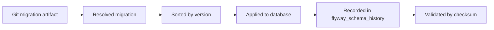
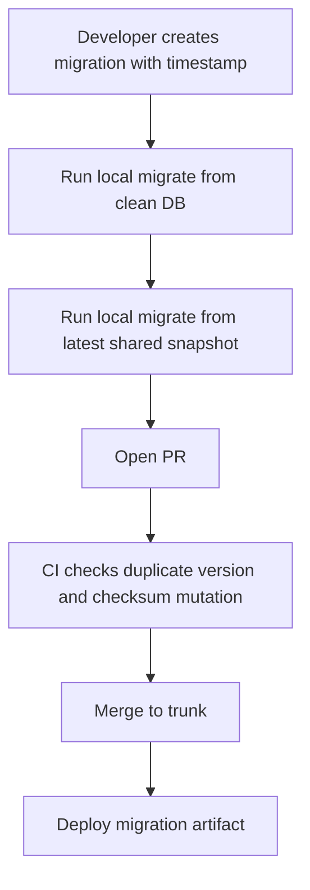
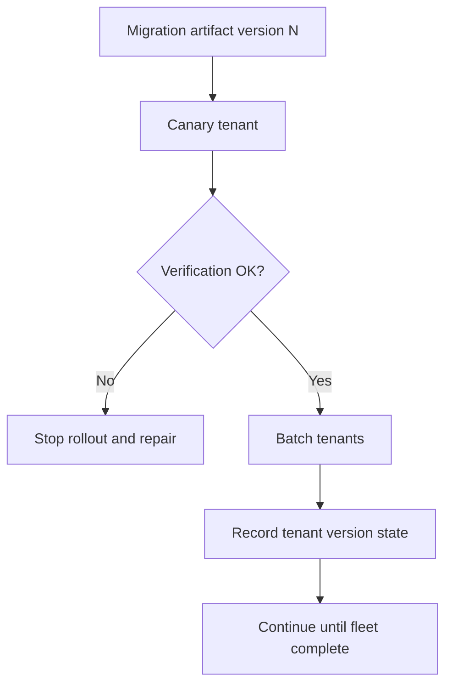
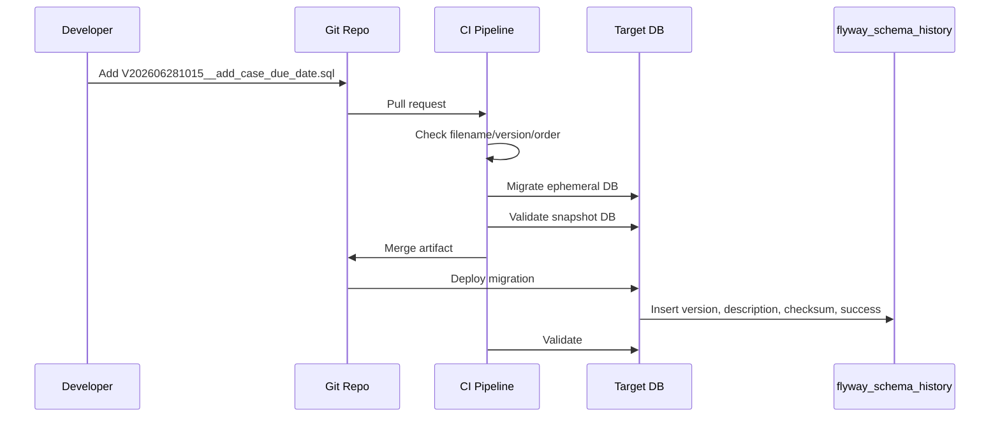

# Part 011 — Flyway Versioning Strategy: Numbering, Timestamp, Branching, Merge Conflict

Flyway versioning strategy adalah keputusan kecil yang menentukan apakah migration akan tetap mudah dikelola setelah sistem memiliki banyak engineer, banyak branch, banyak release line, hotfix production, tenant fleet, dan compliance gate.

Pada skala kecil, versioning terlihat seperti penamaan file:

```txt
V001__create_user_table.sql
V002__add_status_column.sql
```

Pada skala production, versioning adalah **release coordination protocol**.

Ia menjawab pertanyaan:

- perubahan mana yang sudah masuk database ini;
- urutan perubahan mana yang aman;
- apakah script berubah setelah diterapkan;
- migration mana yang menjadi bagian dari release tertentu;
- bagaimana menangani hotfix di tengah release paralel;
- bagaimana environment yang tertinggal bisa mengejar;
- bagaimana auditor membuktikan perubahan database sesuai approval.

Flyway sendiri memberi model dasar yang sederhana: migration versioned dijalankan berurutan dan hanya sekali; history table menyimpan migration yang sudah diterapkan beserta checksum. Strategi tim berada di atas model itu.

---

## 1. Outcome Pembelajaran

Setelah bagian ini, kamu harus mampu:

1. memilih strategi versioning Flyway untuk single service, modular monolith, dan multi-service environment;
2. mendesain naming convention yang tahan merge conflict;
3. menjelaskan trade-off sequential number, timestamp, semantic version, dan release-scoped version;
4. menangani hotfix dan branch parallel tanpa merusak ordering;
5. menentukan kapan `outOfOrder` boleh dipakai dan kapan harus dilarang;
6. mendesain CI check untuk mencegah duplicate version, missing description, dan mutation applied migration;
7. menghubungkan migration version dengan release evidence.

---

## 2. Core Mental Model: Version = Position dalam Ledger

Di Flyway, version bukan dekorasi. Version adalah posisi dalam ledger perubahan schema.



Satu migration versioned memiliki empat identitas:

| Identitas | Contoh | Fungsi |
|---|---:|---|
| Version | `202606281030` | Menentukan ordering |
| Description | `add_case_due_date` | Membantu review dan audit |
| Script path | `db/migration/V202606281030__add_case_due_date.sql` | Lokasi artifact |
| Checksum | angka checksum | Deteksi mutasi script |

Kesalahan umum adalah menganggap version hanya angka berikutnya. Dalam sistem production, version adalah **kontrak ordering**.

---

## 3. Naming Grammar Flyway

Default naming versioned migration Flyway:

```txt
V<version>__<description>.sql
```

Contoh:

```txt
V001__create_case_table.sql
V002__add_case_status.sql
V003__create_case_status_index.sql
```

Repeatable migration memakai prefix `R`:

```txt
R__case_summary_view.sql
R__normalize_case_search_function.sql
```

Baseline migration memakai prefix `B` pada model baseline migration:

```txt
B2026.06.0__baseline_schema.sql
```

Konvensi production-grade sebaiknya mengatur:

| Elemen | Rule |
|---|---|
| Prefix | `V`, `R`, atau `B`; jangan custom kecuali ada alasan kuat |
| Version | deterministic, sortable, tidak reuse |
| Separator | gunakan `__`, bukan satu underscore |
| Description | lowercase snake_case, intent-oriented |
| Suffix | `.sql` untuk SQL migration; Java migration mengikuti class naming |
| Ticket reference | opsional di description atau metadata PR, jangan membuat nama terlalu panjang |

Contoh yang baik:

```txt
V202606281015__add_enforcement_case_due_date.sql
V202606281030__backfill_case_due_date_from_sla_policy.sql
V202606281045__add_case_due_date_not_null_constraint.sql
```

Contoh yang buruk:

```txt
V12__fix.sql
V13__update.sql
V14__new_changes.sql
V14__another_change.sql
V15__final_final.sql
```

Nama migration harus membantu reviewer memahami blast radius sebelum membuka file.

---

## 4. Strategi Version Numbering

Tidak ada satu strategi universal. Pilihan tergantung topology tim, branching model, release cadence, dan compliance.

### 4.1 Sequential Integer

```txt
V001__create_case_table.sql
V002__add_case_status.sql
V003__add_case_owner.sql
```

Kelebihan:

- sederhana;
- mudah dibaca;
- bagus untuk single team kecil;
- mudah melihat urutan historis.

Kelemahan:

- rawan merge conflict pada branch paralel;
- dua engineer bisa membuat `V042` bersamaan;
- hotfix di release branch sulit disisipkan;
- membutuhkan koordinasi manual.

Cocok untuk:

- service kecil;
- trunk-based development ketat;
- satu tim dengan migration volume rendah.

Tidak cocok untuk:

- banyak squad;
- long-lived feature branch;
- regulated release branch;
- banyak hotfix production.

---

### 4.2 Timestamp Version

```txt
V202606281015__add_case_due_date.sql
V202606281030__backfill_case_due_date.sql
V202606281045__add_case_due_date_not_null.sql
```

Kelebihan:

- mengurangi merge conflict;
- version globally sortable;
- cocok untuk trunk-based dan banyak engineer;
- mudah dikaitkan dengan waktu authoring.

Kelemahan:

- timestamp bukan dependency model;
- dua migration yang dependent tetap harus direview ordering-nya;
- timezone dan clock discipline harus konsisten;
- angka panjang kurang nyaman dibaca.

Rule yang disarankan:

```txt
VyyyyMMddHHmmss__description.sql
```

Contoh:

```txt
V20260628101432__create_case_escalation_table.sql
```

Gunakan satu timezone untuk generation, misalnya UTC, atau tool generator yang konsisten.

---

### 4.3 Release-Scoped Version

```txt
V2026.06.0.001__create_case_review_table.sql
V2026.06.0.002__add_case_review_status.sql
V2026.07.0.001__add_case_review_due_date.sql
```

Kelebihan:

- mudah dipetakan ke release;
- bagus untuk regulated release train;
- memudahkan audit evidence;
- release branch lebih eksplisit.

Kelemahan:

- rawan conflict di dalam release yang sama;
- release rescheduling dapat membuat nama menyesatkan;
- membutuhkan governance lebih kuat;
- tidak natural untuk continuous deployment.

Cocok untuk:

- enterprise release train;
- compliance-heavy system;
- release approval formal;
- database deploy tidak selalu bersamaan dengan app deploy.

---

### 4.4 Semantic Application Version

```txt
V4.12.0.001__add_regulatory_decision_reason.sql
V4.12.0.002__backfill_decision_reason.sql
V4.12.1.001__hotfix_decision_reason_index.sql
```

Kelebihan:

- jelas hubungannya dengan app version;
- memudahkan release note;
- mudah untuk maintenance branch.

Kelemahan:

- database evolution sering tidak sama dengan app semantic version;
- microservice dependency bisa membuat versioning semu;
- sulit untuk continuous migration.

Gunakan hanya jika organisasi memang memakai app release version sebagai unit deployment resmi.

---

### 4.5 Hybrid Timestamp + Ticket

```txt
V202606281015__REG-4821_add_case_due_date.sql
V202606281030__REG-4821_backfill_case_due_date.sql
```

Kelebihan:

- timestamp mengurangi conflict;
- ticket memudahkan audit;
- description tetap intent-oriented.

Kelemahan:

- nama bisa panjang;
- ticket ID bukan pengganti deskripsi;
- migration rename setelah review dapat memengaruhi history jika sudah applied.

Rule sehat:

```txt
V<UTC timestamp>__<ticket>_<verb>_<object>_<intent>.sql
```

Contoh:

```txt
V20260628101500__REG4821_add_case_due_date_column.sql
```

---

## 5. Decision Matrix

| Context | Recommended strategy | Reason |
|---|---|---|
| Solo/small service | Sequential integer | Simplicity wins |
| Banyak engineer, trunk-based | Timestamp | Minimizes version collision |
| Regulated release train | Release-scoped | Better evidence mapping |
| SaaS tenant fleet | Timestamp or release-scoped | Needs deterministic promotion |
| Long-lived maintenance branches | Semantic/release-scoped | Easier backport reasoning |
| Platform migration repo | Timestamp + domain prefix | Cross-domain conflict avoidance |
| High-frequency continuous deployment | Timestamp | Low coordination overhead |

Prinsipnya:

> Optimalkan versioning untuk mengurangi koordinasi manual tanpa menghilangkan kemampuan audit.

---

## 6. Ordering Bukan Dependency Graph

Flyway mengurutkan berdasarkan version. Ia tidak memahami dependency bisnis antar migration.

Misalnya:

```txt
V202606281100__add_case_due_date_not_null.sql
V202606281105__backfill_case_due_date.sql
```

Urutan timestamp benar, tetapi dependency salah. Constraint `NOT NULL` seharusnya setelah backfill.

Migration yang benar:

```txt
V202606281100__add_nullable_case_due_date.sql
V202606281105__backfill_case_due_date.sql
V202606281110__validate_case_due_date_backfill.sql
V202606281115__add_case_due_date_not_null.sql
```

Flyway memberi ordering mekanis. Engineer harus memberi ordering semantik.

---

## 7. Versioning untuk Expand/Contract

Untuk zero-downtime schema evolution, versioning harus merepresentasikan fase perubahan.

Contoh rename column `status` menjadi `case_status`:

```txt
V202606281000__expand_add_case_status_column.sql
V202606281010__expand_backfill_case_status_from_status.sql
V202606281020__expand_add_case_status_sync_trigger.sql
V202606281030__contract_drop_status_column.sql
```

Namun lebih baik contract phase dipisah release:

```txt
V202606281000__expand_add_case_status_column.sql
V202606281010__expand_backfill_case_status_from_status.sql
V202606281020__expand_add_case_status_sync_trigger.sql

# later release, after all apps stop reading old column
V202607151000__contract_drop_legacy_status_column.sql
```

Kenapa?

- old app mungkin masih membaca column lama;
- rollback app ke versi lama masih mungkin;
- backfill perlu diverifikasi;
- dual-write window butuh observability;
- contract phase adalah destructive change.

Versioning harus membuat compatibility window terlihat.

---

## 8. Branching Model dan Migration Conflict

### 8.1 Feature Branch Conflict

Dua branch paralel:

```txt
branch-a:
  V042__add_case_priority.sql

branch-b:
  V042__add_case_owner.sql
```

Saat merge, duplicate version muncul.

Resolution salah:

```txt
# rename after already merged to staging where original applied
V043__add_case_owner.sql
```

Jika `V042__add_case_owner.sql` sudah applied di shared staging, rename menjadi `V043` membuat staging dan repo divergen.

Resolution sehat:

- jika belum applied ke shared environment: rename aman;
- jika sudah applied: jangan rename diam-diam; buat migration baru atau repair dengan prosedur formal;
- gunakan CI untuk mendeteksi duplicate version sebelum merge;
- gunakan timestamp untuk mengurangi conflict.

---

### 8.2 Trunk-Based Development

Trunk-based cocok dengan timestamp version.

Flow:



Key rule:

- migration harus kecil;
- branch pendek;
- conflict diselesaikan sebelum merge;
- PR reviewer melihat dependency antar migration;
- migration artifact immutable setelah masuk shared environment.

---

### 8.3 Release Branch

Release branch umum di enterprise.

Masalah muncul ketika trunk sudah punya migration lebih tinggi, lalu release branch butuh hotfix.

Contoh:

```txt
main:
  V202606281000__add_case_due_date.sql
  V202606281100__add_case_escalation_rule.sql

release/2026.06:
  V202606201000__release_baseline.sql
```

Hotfix di release branch:

```txt
V202606291200__hotfix_add_missing_case_status_index.sql
```

Ketika branch kembali ke main, migration hotfix harus ikut masuk ke main agar future environment tidak kehilangan perubahan.

Rule:

1. semua hotfix database harus forward-merged ke trunk;
2. jangan membuat migration berbeda dengan intent sama di branch berbeda;
3. jika perubahan sudah ada di trunk dengan version lain, buat reconciliation note;
4. CI harus membandingkan migration set antar release line.

---

## 9. Hotfix Strategy

Hotfix database adalah operasi berisiko karena sering dilakukan di bawah tekanan.

### 9.1 Hotfix yang Aman

Hotfix aman biasanya additive atau performance-oriented:

```txt
V202606281830__hotfix_add_index_case_status_created_at.sql
```

Contoh:

```sql
CREATE INDEX CONCURRENTLY IF NOT EXISTS idx_case_status_created_at
ON enforcement_case(status, created_at);
```

Namun `IF NOT EXISTS` bukan excuse untuk melewati review. Tetap perlu memeriksa:

- lock behavior;
- index build cost;
- query plan impact;
- write amplification;
- rollback/roll-forward decision;
- production timeout.

### 9.2 Hotfix yang Berbahaya

```txt
V202606281830__hotfix_drop_bad_column.sql
V202606281835__hotfix_recreate_table.sql
V202606281840__hotfix_change_type.sql
```

Destructive hotfix jarang boleh dilakukan langsung. Pilihan lebih aman:

- disable feature;
- add compatibility column;
- create corrective view;
- add index;
- backfill small set;
- roll-forward with additive change;
- postpone contract step.

### 9.3 Hotfix Naming

Gunakan nama yang eksplisit:

```txt
V202606281830__HOTFIX_REG4821_add_case_lookup_index.sql
```

Atau jika tim menghindari ticket di filename:

```txt
V202606281830__hotfix_add_case_lookup_index.sql
```

Audit mapping bisa disimpan di release metadata atau PR template.

---

## 10. Out-of-Order Migration

`outOfOrder` memungkinkan Flyway menerapkan migration dengan version lebih rendah daripada version tertinggi yang sudah applied, selama migration itu belum applied.

Contoh:

Database sudah punya:

```txt
V100 applied
V101 applied
V103 applied
```

Repo sekarang punya:

```txt
V102__missing_hotfix.sql
```

Dengan out-of-order, `V102` dapat diterapkan setelah `V103`.

### 10.1 Kapan Bisa Dipertimbangkan

- hotfix dari release branch perlu diterapkan ke environment yang sudah lebih maju;
- migration benar-benar independent;
- tidak ada dependency terhadap state sebelum `V103`;
- sudah diuji pada snapshot environment target;
- ada approval formal.

### 10.2 Kapan Harus Dilarang

- migration mengubah object yang sama dengan migration setelahnya;
- migration destructive;
- migration data backfill yang asumsi datanya sudah berubah;
- migration constraint tightening;
- tidak ada staging rehearsal;
- dipakai untuk menutupi branching discipline yang buruk.

### 10.3 Decision Rule

```txt
Allow out-of-order only when the migration is semantically commutative
with all already-applied higher-version migrations.
```

Commutative berarti hasil akhirnya sama walaupun urutan ditukar.

Contoh relatif aman:

```txt
V100__create_case_table.sql
V103__add_case_owner_column.sql
V102__add_case_priority_column.sql
```

Jika dua column independen, urutan mungkin commutative.

Contoh tidak aman:

```txt
V100__create_case_table.sql
V103__rename_status_to_case_status.sql
V102__backfill_status_value.sql
```

`V102` mengacu column lama yang mungkin sudah berubah.

---

## 11. Cherry-Pick Strategy

Dalam workflow tertentu, tim ingin menjalankan subset migration tertentu, bukan semua pending migration. Ini sering muncul pada:

- release branch;
- emergency patch;
- tenant subset rollout;
- staged feature rollout;
- database fleet partial deployment.

Cherry-pick bukan pengganti release discipline. Ia harus diperlakukan seperti surgical deploy.

Rule:

1. cherry-picked migration harus independent;
2. dependency eksplisit harus ikut dipilih;
3. hasil `info` sebelum dan sesudah harus disimpan;
4. staging rehearsal wajib;
5. jangan cherry-pick destructive contract migration tanpa expand phase lengkap.

Contoh dependency chain:

```txt
V202606281000__add_case_due_date_column.sql
V202606281010__backfill_case_due_date.sql
V202606281020__add_case_due_date_not_null.sql
```

Tidak boleh cherry-pick hanya:

```txt
V202606281020__add_case_due_date_not_null.sql
```

karena precondition semantiknya belum terpenuhi.

---

## 12. Repeatable Migration Versioning

Repeatable migration tidak punya version. Ia dieksekusi setelah versioned migration dan dijalankan ulang jika checksum berubah.

Contoh:

```txt
R__v_case_summary.sql
R__fn_normalize_case_number.sql
R__sp_refresh_case_projection.sql
```

Masalah repeatable migration:

- ordering antar repeatable migration berdasarkan description;
- dependency antar view/function bisa rapuh;
- perubahan kecil memicu re-run;
- review diff harus ketat;
- object replacement bisa lock atau invalidate dependency.

### 12.1 Naming Repeatable dengan Dependency Order

Jika ada dependency:

```txt
R__001_type_case_status.sql
R__010_fn_case_status_label.sql
R__020_v_case_summary.sql
```

Angka di description membantu ordering repeatable.

Namun jangan menyalahgunakan repeatable untuk semua object. Gunakan repeatable terutama untuk:

- view definition;
- stored procedure/function;
- package body;
- generated projection definition;
- static reference data yang memang ingin disinkronkan.

### 12.2 Repeatable vs Versioned

| Change | Prefer |
|---|---|
| Create table | Versioned |
| Add column | Versioned |
| Backfill data | Versioned atau Java migration |
| Create/replace view | Repeatable |
| Create/replace function | Repeatable |
| Reference data small and stable | Repeatable with discipline |
| Reference data historical/audited | Versioned |
| Permission grant | Depends; often repeatable but audited carefully |

---

## 13. Baseline dan Versioning

Baseline digunakan saat memperkenalkan Flyway ke database yang sudah ada, atau saat membuat baseline migration cumulative untuk mempercepat bootstrap environment baru.

Ada dua konsep yang sering tertukar:

| Konsep | Makna |
|---|---|
| `baseline` command | Menandai existing database sebagai sudah berada pada version tertentu |
| Baseline migration `B...` | Script cumulative yang merepresentasikan state sampai version tertentu untuk bootstrap baru |

### 13.1 Baseline Command

Contoh:

```bash
flyway baseline -baselineVersion=100 -baselineDescription="existing production baseline"
```

Maknanya:

- database existing dianggap sudah mengandung perubahan sampai version `100`;
- migration dengan version <= `100` tidak akan dijalankan;
- migration > `100` tetap bisa dijalankan.

Risk:

- salah baseline version dapat melewatkan migration penting;
- baseline tanpa schema inspection bisa menyembunyikan drift;
- baselineOnMigrate dapat berbahaya bila aktif tanpa kontrol.

### 13.2 Baseline Migration

Contoh:

```txt
B2026.06.0__baseline_schema.sql
V2026.06.1__add_case_due_date.sql
```

Baseline migration membantu environment baru bootstrap dari snapshot cumulative, sementara deployment lama masih bisa memakai migration historis jika diperlukan.

Gunakan baseline migration untuk:

- mengurangi waktu bootstrap test database;
- mengurangi ratusan/ribuan migration lama;
- membuat clean install lebih cepat;
- mengarsipkan history lama tanpa kehilangan upgrade path.

Jangan gunakan baseline migration untuk:

- menghapus audit history production;
- menghindari memperbaiki migration lama yang rusak;
- membuat environment existing “lupa” perubahan masa lalu.

---

## 14. Versioning untuk Multi-Schema

Jika satu service memiliki banyak schema:

```txt
src/main/resources/db/migration/
  common/
    V202606281000__create_audit_schema.sql
  enforcement/
    V202606281010__create_case_table.sql
  reporting/
    V202606281020__create_case_projection.sql
```

Ada dua strategi:

### 14.1 Single Global Version Sequence

Semua schema berbagi satu urutan version.

Kelebihan:

- ordering global jelas;
- satu history table;
- mudah audit.

Kelemahan:

- migration independent tetap saling antre;
- cross-team conflict lebih banyak;
- folder banyak tapi version namespace tunggal.

### 14.2 Schema-Scoped Version Sequence

Setiap schema punya Flyway instance/config sendiri.

Kelebihan:

- ownership lebih jelas;
- version conflict berkurang;
- cocok untuk bounded context kuat.

Kelemahan:

- cross-schema dependency sulit;
- lebih banyak config;
- audit harus menggabungkan beberapa history table.

Rule:

```txt
Gunakan global version jika schema memiliki lifecycle release yang sama.
Gunakan schema-scoped version jika schema benar-benar punya ownership dan lifecycle berbeda.
```

---

## 15. Versioning untuk Multi-Tenant

Pada tenant-per-schema atau tenant-per-database, versioning migration sama, tapi execution target banyak.

Masalah utama:

- tenant version skew;
- partial failure;
- tenant onboarding;
- retry/resume;
- tenant-specific drift;
- rollout window.

Strategi:



Versioning rule:

- jangan membuat tenant-specific version file;
- gunakan migration artifact yang sama;
- tenant condition harus berada di execution metadata, bukan file name;
- jika tenant perlu pengecualian, catat sebagai drift/deviation.

Buruk:

```txt
V202606281000__add_case_due_date_tenant_a.sql
V202606281001__add_case_due_date_tenant_b.sql
```

Lebih sehat:

```txt
V202606281000__add_case_due_date.sql
```

dengan rollout metadata per tenant.

---

## 16. Versioning dan Java-Based Migration

Java migration cocok untuk logic yang sulit atau berisiko bila ditulis sebagai SQL besar:

- batching;
- checkpoint;
- external validation;
- complex transformation;
- vendor-specific JDBC behavior;
- resumable backfill.

Naming class Java migration tetap harus mengikuti version.

Contoh:

```java
public class V202606281030__Backfill_case_due_date extends BaseJavaMigration {
    @Override
    public void migrate(Context context) throws Exception {
        // checkpointed batch backfill
    }
}
```

Prinsip versioning sama:

- version immutable;
- class tidak boleh diedit setelah applied;
- behavior harus deterministic;
- external dependency harus dihindari;
- runtime config harus terbatas dan auditable.

Anti-pattern:

```java
if (System.getenv("ENV").equals("prod")) {
    // different logic
}
```

Migration artifact harus sama. Perbedaan environment harus dikendalikan oleh deployment config yang eksplisit, bukan branch liar di code migration.

---

## 17. Migration Version dan Release Evidence

Dalam sistem regulated, migration version harus bisa ditelusuri ke:

| Evidence | Contoh |
|---|---|
| Requirement/ticket | `REG-4821` |
| Pull request | PR link |
| Approval | DBA/security/release approval |
| Build artifact | JAR/container digest |
| Migration artifact | `V202606281015__...sql` |
| Execution record | `flyway_schema_history` row |
| Production log | deployment run ID |
| Verification | post-deploy check result |

Jangan mengandalkan filename sebagai satu-satunya evidence. Filename membantu, tapi evidence harus ada di release system.

---

## 18. CI Guardrails untuk Versioning

Minimal CI checks:

1. duplicate version check;
2. invalid filename check;
3. missing description check;
4. forbidden keyword check untuk destructive DDL;
5. migration applied mutation check;
6. clean database migrate test;
7. latest snapshot migrate test;
8. Flyway validate;
9. ordering/dependency lint;
10. release note generation.

### 18.1 Duplicate Version Check

Pseudo script:

```bash
find src/main/resources/db/migration -name 'V*.sql' \
  | sed -E 's|.*/V([^_]+)__.*|\1|' \
  | sort \
  | uniq -d
```

Jika output tidak kosong, fail build.

### 18.2 Filename Regex

Contoh policy timestamp:

```regex
^V[0-9]{14}__[a-z0-9]+(_[a-z0-9]+)*\.sql$
```

Untuk hotfix:

```regex
^V[0-9]{14}__(hotfix_)?[a-z0-9]+(_[a-z0-9]+)*\.sql$
```

### 18.3 Destructive Keyword Gate

Cari keyword:

```txt
DROP TABLE
DROP COLUMN
TRUNCATE
ALTER TABLE .* DROP
DELETE FROM
UPDATE .* SET .* without WHERE
```

Jangan otomatis fail semua destructive operation; gunakan manual approval gate.

---

## 19. PR Review Checklist

Reviewer migration harus bertanya:

- apakah version unik;
- apakah ordering benar secara semantik;
- apakah description menjelaskan intent;
- apakah migration kecil dan atomic secara rilis;
- apakah migration backward-compatible;
- apakah ada destructive change;
- apakah ada lock risk;
- apakah migration bisa dijalankan dari clean DB;
- apakah migration bisa dijalankan dari snapshot production-like;
- apakah ada rollback/roll-forward plan;
- apakah evidence ticket/release jelas.

Untuk timestamp strategy, reviewer juga harus memeriksa apakah timestamp ordering sesuai dependency. Timestamp yang lebih awal tidak otomatis berarti migration harus lebih dulu.

---

## 20. Pattern: One Logical Step per Migration

Buruk:

```txt
V202606281000__case_changes.sql
```

Isi:

```sql
ALTER TABLE enforcement_case ADD COLUMN due_date timestamp;
UPDATE enforcement_case SET due_date = created_at + interval '7 days';
ALTER TABLE enforcement_case ALTER COLUMN due_date SET NOT NULL;
CREATE INDEX idx_case_due_date ON enforcement_case(due_date);
DROP COLUMN old_due_date;
```

Masalah:

- sulit melihat blast radius;
- backfill dan constraint bercampur;
- rollback sulit;
- lock risk gabungan;
- failure state sulit diperbaiki.

Lebih baik:

```txt
V202606281000__add_nullable_case_due_date.sql
V202606281010__backfill_case_due_date.sql
V202606281020__add_case_due_date_index.sql
V202606281030__validate_case_due_date_not_null.sql
V202606281040__set_case_due_date_not_null.sql
V202607151000__drop_legacy_due_date.sql
```

Versioning yang baik membuat operasi dapat diamati dan dihentikan dengan aman.

---

## 21. Pattern: Version Gap is Acceptable

Jangan takut pada gap.

```txt
V202606281000__add_case_due_date.sql
V202606281030__backfill_case_due_date.sql
V202606281100__add_case_due_date_index.sql
```

Gap tidak masalah. Yang penting version unik dan ordering benar.

Untuk sequential strategy:

```txt
V001__init.sql
V002__add_case_table.sql
V005__add_case_index.sql
```

Gap juga bisa diterima jika `V003` dan `V004` pernah dibuat lalu dibatalkan sebelum applied. Namun jika gap membingungkan audit, catat di PR/release note.

---

## 22. Pattern: Pending Migration Review by Environment

Sebelum deploy, jalankan `info` dan review:

```txt
+-----------+---------+-------------------------------+------+---------+
| Category  | Version | Description                   | Type | State   |
+-----------+---------+-------------------------------+------+---------+
| Versioned | 202606281000 | add case due date        | SQL  | Pending |
| Versioned | 202606281010 | backfill case due date   | SQL  | Pending |
| Versioned | 202606281020 | set due date not null    | SQL  | Pending |
+-----------+---------+-------------------------------+------+---------+
```

Pertanyaan review:

- apakah semua pending migration memang bagian release ini;
- apakah urutan aman;
- apakah ada pending migration dari feature yang belum siap;
- apakah repeatable migration ikut berubah;
- apakah environment tertinggal jauh.

---

## 23. Anti-Pattern: Renumber Applied Migration

Misalnya migration sudah applied di staging:

```txt
V202606281000__add_case_due_date.sql
```

Lalu engineer rename menjadi:

```txt
V202606281005__add_case_due_date.sql
```

Efek:

- Flyway melihat version lama applied tapi script tidak resolved;
- Flyway melihat version baru pending;
- staging dan repo divergen;
- production deployment bisa gagal validate;
- repair menjadi perlu.

Rule:

```txt
Migration yang sudah masuk shared persistent environment harus dianggap immutable.
```

Shared persistent environment termasuk:

- integration DB;
- staging;
- UAT;
- pre-production;
- production;
- tenant DB;
- long-lived QA DB.

---

## 24. Anti-Pattern: One Migration per Sprint

```txt
V202606280000__sprint_42_changes.sql
```

Ini buruk karena:

- terlalu besar;
- banyak domain bercampur;
- sulit rollback/roll-forward;
- review tidak fokus;
- lock risk tidak terlihat;
- ownership kabur;
- conflict hidden.

Lebih baik migration mengikuti unit perubahan schema, bukan unit kalender sprint.

---

## 25. Anti-Pattern: Version as Business Priority

Buruk:

```txt
V001__critical_hotfix.sql
V002__less_important.sql
```

Version bukan severity. Version adalah order.

Severity/priority harus berada di ticket, release note, incident record, atau deployment approval.

---

## 26. Anti-Pattern: Environment-Specific Version

Buruk:

```txt
V202606281000__prod_add_index.sql
V202606281001__staging_add_index.sql
```

Masalah:

- environment tidak lagi convergent;
- audit sulit;
- drift dilegitimasi;
- production tidak bisa direplikasi.

Jika environment butuh variasi, tanya dulu:

1. apakah variasi itu legitimate;
2. apakah seharusnya config, bukan schema;
3. apakah production-like environment tidak cukup mirip;
4. apakah ini drift yang harus diperbaiki.

---

## 27. Migration Ledger Diagram



Ledger integrity bergantung pada dua hal:

- Git artifact tidak berubah setelah applied;
- database history table tidak dimanipulasi tanpa prosedur.

---

## 28. Recommended Default untuk Tim Java Modern

Untuk kebanyakan tim Java dengan Spring Boot, CI/CD, dan beberapa engineer paralel, default yang baik:

```txt
VyyyyMMddHHmmss__verb_domain_object_intent.sql
R__nnn_object_name.sql
B<release_or_timestamp>__baseline_schema.sql
```

Contoh:

```txt
V20260628101500__add_case_due_date_column.sql
V20260628103000__backfill_case_due_date_from_sla_policy.sql
V20260628104500__add_case_due_date_index.sql
V20260628110000__set_case_due_date_not_null.sql
R__010_v_case_summary.sql
R__020_fn_case_age_bucket.sql
```

PR rule:

- migration file immutable after shared apply;
- one logical step per migration;
- no destructive operation without expand/contract evidence;
- no environment-specific branch;
- timestamp generated in UTC;
- duplicate version fails CI;
- Flyway validate required before release.

---

## 29. Team Policy Template

```md
# Flyway Migration Versioning Policy

## Version format
Use `VyyyyMMddHHmmss__description.sql` for versioned migrations.
Use UTC timestamp.
Use lowercase snake_case description.

## Immutability
Once a migration has been applied to any shared persistent environment,
it must not be edited, renamed, reordered, or deleted.
Fix forward using a new migration.

## Repeatable migration
Use `R__nnn_description.sql` only for views, functions, stored procedures,
and controlled reference data.

## Destructive changes
DROP, TRUNCATE, destructive UPDATE/DELETE, type narrowing, and NOT NULL tightening
require explicit review and expand/contract plan.

## Branching
Resolve duplicate versions before merge.
Forward-merge release branch hotfix migrations to trunk.

## Out-of-order
Disabled by default.
May be enabled only for approved independent hotfix migration after staging rehearsal.

## Baseline
Baseline command requires DBA/release approval and schema inspection evidence.
Baseline migration requires generated-schema review and clean bootstrap test.
```

---

## 30. Practice: Choose Strategy

### Scenario A

Satu service kecil, dua developer, deploy mingguan.

Pilihan:

```txt
V001__...
V002__...
```

Masih cukup.

### Scenario B

Lima squad mengubah modular monolith yang sama, deploy harian.

Pilihan:

```txt
VyyyyMMddHHmmss__domain_action_object.sql
```

Tambahkan CI duplicate check dan domain ownership review.

### Scenario C

Regulated bank system, quarterly release train, formal approval.

Pilihan:

```txt
V2026.3.0.001__...
```

atau timestamp dengan release manifest terpisah.

Release manifest sering lebih baik daripada memaksa release version ke filename:

```yaml
release: 2026.3.0
migrations:
  - V20260628101500__add_case_due_date_column.sql
  - V20260628103000__backfill_case_due_date.sql
```

### Scenario D

SaaS tenant-per-database, ribuan tenant, rollout bertahap.

Pilihan:

```txt
VyyyyMMddHHmmss__...
```

Dengan tenant rollout ledger terpisah.

---

## 31. Skill Drill

Buat migration sequence untuk perubahan berikut:

> `case.status` akan diganti menjadi `case.lifecycle_state`, ada old app dan new app berjalan bersamaan selama 2 minggu, tabel berisi 200 juta row, dan reporting view membaca status lama.

Jawaban yang diharapkan:

```txt
V20260628100000__expand_add_lifecycle_state_column.sql
V20260628101000__expand_backfill_lifecycle_state_checkpoint_table.sql
V20260628102000__expand_backfill_lifecycle_state_batch_001.sql
V20260628103000__expand_add_lifecycle_state_index.sql
V20260628104000__expand_add_status_lifecycle_sync_trigger.sql
R__010_v_case_summary.sql
V20260715100000__contract_drop_status_lifecycle_sync_trigger.sql
V20260715101000__contract_drop_legacy_status_column.sql
```

Diskusi:

- backfill besar mungkin lebih cocok Java migration/checkpoint worker;
- reporting view repeatable migration harus kompatibel selama transition;
- contract phase harus menunggu observability membuktikan old readers hilang;
- index/constraint rollout harus mempertimbangkan lock behavior vendor.

---

## 32. Mastery Checklist

Kamu sudah memahami Part 011 jika bisa menjawab:

- kenapa version adalah posisi dalam ledger, bukan sekadar angka;
- kapan sequential version cukup;
- kapan timestamp version lebih aman;
- kenapa timestamp tidak menyelesaikan dependency semantik;
- bagaimana menyelesaikan duplicate version conflict;
- kenapa applied migration tidak boleh direname;
- kapan out-of-order aman secara commutativity;
- bagaimana versioning mendukung expand/contract;
- bagaimana hotfix database harus forward-merged ke trunk;
- bagaimana migration version terhubung ke audit evidence.

---

## 33. Kesimpulan

Flyway versioning strategy yang baik membuat migration:

- mudah diurutkan;
- sulit bentrok;
- mudah direview;
- kompatibel dengan branching model;
- aman untuk hotfix;
- cocok dengan CI/CD;
- bisa diaudit;
- tidak bergantung pada ingatan engineer.

Strategi yang buruk biasanya tetap terlihat baik di bulan pertama, lalu pecah ketika ada branch paralel, staging drift, hotfix production, atau audit. Karena itu, versioning harus diputuskan sebagai bagian dari release architecture, bukan sekadar naming preference.

---

## Referensi

- Redgate Flyway Documentation — Versioned Migrations: https://documentation.red-gate.com/fd/versioned-migrations-273973333.html
- Redgate Flyway Documentation — Migrations: https://documentation.red-gate.com/fd/migrations-271585107.html
- Redgate Flyway Documentation — Flyway Schema History Table: https://documentation.red-gate.com/fd/flyway-schema-history-table-273973417.html
- Redgate Flyway Documentation — Baseline Migrations: https://documentation.red-gate.com/fd/baseline-migrations-273973336.html
- Redgate Flyway Documentation — Baseline Migration Prefix: https://documentation.red-gate.com/fd/flyway-baseline-migration-prefix-setting-277578973.html
- Redgate Flyway Documentation — Tutorial Tweaking Version Numbering: https://documentation.red-gate.com/fd/tutorial-tweaking-version-numbering-162103499.html
