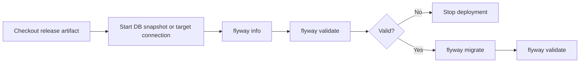
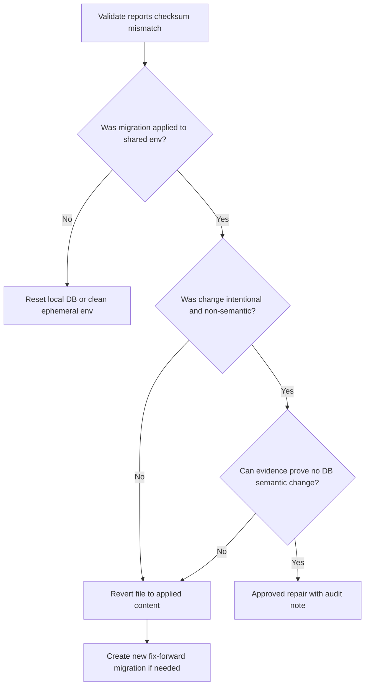
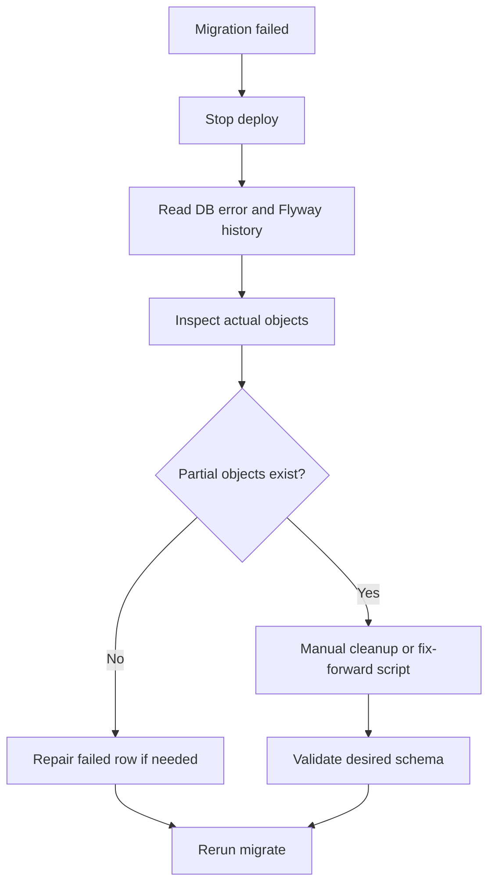
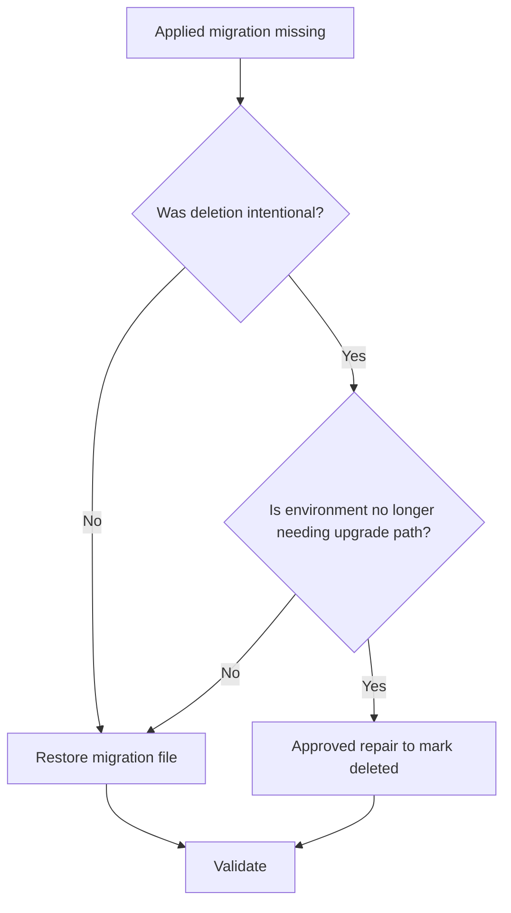

# Part 012 — Flyway Validate, Repair, Baseline, Clean: Kapan Aman, Kapan Berbahaya

Flyway command seperti `validate`, `repair`, `baseline`, dan `clean` sering dipahami sebagai command administratif. Di production, command-command ini adalah **control surface** untuk integritas database migration.

Kesalahan membaca command dapat berakibat:

- migration history rusak;
- production schema drift tersembunyi;
- migration penting terlewat;
- checksum mismatch “dihapus” tanpa investigasi;
- clean dijalankan pada database yang salah;
- audit trail kehilangan makna.

Bagian ini membahas command sensitif Flyway sebagai bagian dari reliability engineering, bukan sebagai cheat sheet CLI.

---

## 1. Outcome Pembelajaran

Setelah bagian ini, kamu harus mampu:

1. menjelaskan peran `validate` sebagai integrity gate;
2. membedakan masalah yang boleh diperbaiki dengan `repair` dan yang harus diperbaiki manual;
3. memakai `baseline` untuk onboarding existing database tanpa menyembunyikan drift;
4. membedakan `baseline` command dan baseline migration `B...`;
5. mendesain policy `clean` yang aman;
6. menangani checksum mismatch, failed migration, missing migration, dan non-empty schema tanpa history table;
7. membuat recovery playbook yang audit-ready.

---

## 2. Command Map

```mermaid
flowchart TD
    A[Migration artifact in Git] --> B[Flyway resolves migrations]
    B --> C[validate]
    C -->|OK| D[migrate]
    C -->|Mismatch| E[Investigate]
    E --> F{Cause?}
    F -->|Failed migration| G[Manual cleanup + repair]
    F -->|Intentional metadata correction| H[Approved repair]
    F -->|Script mutation| I[Revert or fix-forward]
    F -->|Existing DB onboarding| J[baseline]
    D --> K[flyway_schema_history]
    L[clean] --> M[Drop managed objects]
```



| Command | Mental model | Production posture |
|---|---|---|
| `validate` | Integrity check | Always safe and recommended |
| `repair` | History table reconciliation | Dangerous without investigation |
| `baseline` | Adopt existing DB state | Safe only with schema evidence |
| `clean` | Drop managed objects | Disable in production |
| `info` | Read current/pending state | Safe and useful |
| `migrate` | Apply pending transitions | Requires release control |

---

## 3. Flyway Schema History as Control Point

Flyway maintains a schema history table that records applied migrations. Conceptually:

```txt
installed_rank | version | description | type | script | checksum | installed_by | installed_on | execution_time | success
```

This table is not just internal metadata. In production it functions as:

- deployment ledger;
- checksum evidence;
- migration ordering record;
- troubleshooting source;
- audit artifact.

Never treat schema history as disposable.

Rule:

```txt
Do not manually edit flyway_schema_history except through an approved emergency procedure.
Prefer Flyway command + documented evidence.
```

Even `repair`, which modifies history, should be treated as controlled mutation.

---

## 4. Validate

`validate` checks whether resolved migrations in the configured locations are consistent with what has already been applied.

It protects against:

- applied versioned migration file changed;
- applied repeatable migration missing;
- applied migration deleted or renamed;
- checksum mismatch;
- failed migration state;
- migration type/description mismatch;
- local repo not matching target database history.

### 4.1 Validate as Pre-Deploy Gate

Minimum pipeline:



Pre-migrate validate catches history mismatch. Post-migrate validate catches unexpected result after execution.

### 4.2 Validate Failure Is a Signal, Not an Annoyance

A validate error means one of these:

| Symptom | Likely cause | Correct response |
|---|---|---|
| Checksum mismatch | Applied script edited | Investigate; usually revert or fix-forward |
| Applied migration not resolved | File deleted/renamed/location changed | Restore file or approved repair |
| Failed versioned migration | Previous migration failed | Clean up DB objects manually; then repair |
| Pending migration unexpected | Wrong artifact or branch leakage | Stop deploy; verify release manifest |
| Non-empty schema without history | Existing DB not baselined | Inspect schema; run controlled baseline |

Do not jump to `repair` just because validate fails.

---

## 5. Checksum Mismatch Playbook

Checksum mismatch happens when migration content in repository no longer matches checksum recorded when it was applied.

### 5.1 Root Causes

- engineer edited applied migration;
- formatter changed whitespace in applied migration;
- line endings changed;
- placeholder behavior changed;
- referenced script changed in vendor-specific setup;
- file restored incorrectly from branch.

### 5.2 Decision Tree



Default answer:

```txt
Revert the applied migration file and create a new migration.
```

Use `repair` for checksum realignment only when you can prove the change is intentional and safe.

### 5.3 Bad Response

```bash
flyway repair
flyway migrate
```

without investigation.

Why bad?

- it destroys evidence of mutation;
- it may align history to a script that was not actually executed;
- it can hide production drift;
- it trains team to treat checksum as inconvenience.

---

## 6. Repair

`repair` repairs the schema history table. According to Flyway documentation, repair can remove failed migrations from the history table, realign checksums/descriptions/types of applied migrations with available migrations, and mark missing migrations as deleted. User objects left behind by failed migrations still need manual cleanup.

That means `repair` changes evidence.

### 6.1 What Repair Does Not Do

`repair` does **not**:

- rollback database objects;
- drop partially created tables;
- undo DML;
- validate business correctness;
- prove schema matches desired state;
- fix bad SQL;
- recover lost data.

It only reconciles Flyway metadata.

### 6.2 Safe Repair Cases

| Case | Repair posture |
|---|---|
| Failed migration left failed row after manual cleanup | Usually valid |
| Migration file description changed before any production impact but after dev apply | Maybe valid in non-prod |
| Applied repeatable migration intentionally removed | Valid with approval |
| Metadata drift due to controlled rebaselining | Valid with evidence |

### 6.3 Dangerous Repair Cases

| Case | Why dangerous |
|---|---|
| Applied SQL content changed semantically | History will lie about what ran |
| Failed DDL left unknown partial objects | Repair does not clean objects |
| Missing migration due to accidental deletion | Repair may mark as deleted and hide loss |
| Wrong locations passed to repair | Missing migrations may be marked deleted incorrectly |
| Production repair without release ticket | Audit gap |

### 6.4 Repair Procedure

Production repair should require:

1. capture `flyway info` output;
2. capture `flyway validate` error;
3. identify exact mismatch;
4. compare Git history;
5. inspect database objects affected;
6. decide manual cleanup or revert/fix-forward;
7. approve repair;
8. run repair with same `locations` as migrate;
9. run validate again;
10. attach evidence to incident/change record.

### 6.5 Repair Command Example

```bash
flyway \
  -url=jdbc:postgresql://db.example.com/app \
  -user=flyway_runner \
  -locations=filesystem:src/main/resources/db/migration \
  repair
```

Run with exactly the same relevant locations as normal migration. Different locations can cause Flyway to think applied migrations are missing.

---

## 7. Failed Migration Playbook

Failure modes differ by database vendor because DDL transaction semantics differ.

### 7.1 Transactional DDL Case

If database supports transactional DDL for the statement and Flyway ran migration in a transaction:

- migration fails;
- transaction rolls back;
- object changes may not persist;
- history may record failure depending on behavior;
- repair may remove failed row after investigation.

### 7.2 Non-Transactional DDL Case

If DDL autocommits or partially succeeds:

- table/index/constraint may exist;
- history says failure;
- rerun may fail because object already exists;
- repair alone is insufficient.

Procedure:



### 7.3 Example

Migration:

```sql
CREATE TABLE case_note (
    id bigint primary key,
    case_id bigint not null
);

CREATE INDEX idx_case_note_case_id ON case_note(case_id);

ALTER TABLE case_note
ADD CONSTRAINT fk_case_note_case
FOREIGN KEY (case_id) REFERENCES enforcement_case(id);
```

If index succeeds but FK fails, rerun may fail at table creation or index creation. Options:

- drop partial objects manually, then repair and rerun;
- write a new fix-forward migration if history records success for part of release;
- never simply mark success manually.

---

## 8. Baseline Command

`baseline` marks an existing non-empty database as already migrated up to a configured baseline version. It is used when adopting Flyway for an existing schema.

Example:

```bash
flyway baseline -baselineVersion=100 -baselineDescription="existing production schema adopted"
```

After this:

- migrations with version <= `100` are ignored for that DB;
- migrations > `100` can be applied;
- history table now has a baseline marker.

### 8.1 When Baseline Is Appropriate

- existing production database predates Flyway;
- legacy schema is being brought under migration control;
- environment already has desired schema up to a known state;
- manual schema inspection confirms baseline state;
- old migration files would not safely recreate exact legacy state.

### 8.2 When Baseline Is Dangerous

- used to skip failing migrations;
- used because team does not know current schema state;
- used differently per environment;
- baseline version chosen arbitrarily;
- no schema snapshot/diff evidence;
- baselineOnMigrate enabled broadly.

### 8.3 Baseline Evidence Checklist

Before baseline:

- export schema definition;
- compare with intended baseline schema;
- record row counts for important tables;
- identify manually created objects;
- identify grants, indexes, triggers, sequences;
- verify application version compatible with baseline;
- store baseline command and output;
- require DBA/release approval.

Baseline should be a controlled adoption event.

---

## 9. baselineOnMigrate

`baselineOnMigrate` automatically calls baseline when `migrate` runs against a non-empty schema without a schema history table.

This is convenient. It is also dangerous.

### 9.1 Why Dangerous

Imagine production is misconfigured:

- wrong database URL;
- non-empty schema;
- no Flyway history table;
- `baselineOnMigrate=true`.

Flyway may baseline that schema automatically, masking the fact that deployment targeted the wrong DB or wrong schema.

### 9.2 Recommended Policy

| Environment | baselineOnMigrate |
|---|---|
| Local throwaway DB | Sometimes acceptable |
| Ephemeral CI DB | Usually false; clean migrate instead |
| Shared dev | False unless onboarding controlled |
| Staging | False |
| Production | False |

Preferred:

```txt
Run explicit baseline as a one-time controlled operation.
Do not allow automatic baseline in production deployment path.
```

---

## 10. Baseline Migration `B...`

Baseline migration is different from `baseline` command.

A baseline migration is a cumulative script representing schema state at a certain version.

Example:

```txt
B2026.06.0__baseline_schema.sql
V2026.06.1__add_case_due_date.sql
```

Use cases:

- speed up new environment bootstrap;
- reduce long historical migration replay;
- simplify onboarding after hundreds of migrations;
- keep older versioned migrations for existing upgrade paths.

### 10.1 Baseline Migration Review

A baseline migration is dangerous if generated blindly.

Review:

- object definitions;
- indexes;
- constraints;
- sequences/identity columns;
- default values;
- comments;
- grants;
- views/functions;
- vendor-specific options;
- reference data;
- ordering and dependency.

### 10.2 Baseline Migration Test

Minimum tests:

```txt
Test A: clean database -> baseline migration -> latest migrations -> app integration tests
Test B: old database -> old historical migrations -> latest migrations -> compare schema with Test A
```

The output schemas should be equivalent for application-relevant objects.

---

## 11. Clean

`clean` drops objects managed by Flyway in configured schemas. It is useful for local and ephemeral test databases. It is catastrophic if run against production.

Flyway's `cleanDisabled` setting exists to disable clean; current documentation states the default is `true`, with explicit enablement needed to allow clean.

### 11.1 Safe Uses

| Environment | Use clean? | Note |
|---|---|---|
| Local disposable DB | Yes | Useful for fast reset |
| Testcontainers DB | Yes | Often implicit by container lifecycle |
| CI ephemeral DB | Yes | If DB is guaranteed disposable |
| Shared dev DB | Rarely | Requires coordination |
| Staging | Almost never | Only rebuild environment with approval |
| Production | No | Disable permanently |

### 11.2 Guardrails

- `cleanDisabled=true` in production config;
- production runner identity lacks drop privilege if possible;
- no `clean` in deploy scripts;
- separate profile for local clean;
- require environment allowlist;
- print database URL and schema before destructive command;
- use network/security boundary, not only config.

### 11.3 Bad Script

```bash
flyway clean
flyway migrate
```

inside generic deployment pipeline.

Why bad?

- environment mistakes become data loss;
- clean is not a rollback;
- production data is not recreateable from migrations;
- audit failure is severe.

---

## 12. Info

`info` is safe and underrated. It shows current, pending, failed, missing, ignored, and future migrations depending on state.

Use `info`:

- before migration;
- after migration;
- before repair;
- after repair;
- during incident response;
- in release evidence.

Example release evidence:

```txt
Before deploy:
  Current version: 202606281000
  Pending: 202606281010, 202606281020

After deploy:
  Current version: 202606281020
  Failed: none
  Pending: none
```

---

## 13. Validate + Migrate + Validate Pattern

Recommended release command sequence:

```bash
flyway info
flyway validate
flyway migrate
flyway validate
flyway info
```

For production, wrap with:

- connection verification;
- lock timeout config;
- dry-run/rehearsal evidence where available;
- backup/snapshot policy if required;
- post-migration business checks;
- application compatibility checks.

---

## 14. Command Policy by Environment

| Command | Local | CI ephemeral | Shared dev | Staging | Production |
|---|---:|---:|---:|---:|---:|
| `info` | Allow | Allow | Allow | Allow | Allow |
| `validate` | Allow | Required | Required | Required | Required |
| `migrate` | Allow | Allow | Controlled | Controlled | Controlled |
| `repair` | Allow with caution | Rare | Approved | Approved | Emergency approved |
| `baseline` | Rare | Rare | Approved | Approved | One-time approved |
| `clean` | Allow | Allow | Restricted | Disabled | Disabled |

---

## 15. Production Runner Privilege Model

Command safety is not only config. Use privilege separation.

| Identity | Privilege |
|---|---|
| Application user | DML needed by app only |
| Migration runner | DDL/DML needed for migrations |
| DBA/admin | Emergency/drop/baseline/repair if needed |
| Read-only observer | `info`/metadata read if supported |

For production, consider:

- app user cannot run DDL;
- migration runner cannot drop unrelated schemas;
- clean command disabled;
- secrets separated per environment;
- deployment system logs runner identity.

---

## 16. Onboarding Existing Database Playbook

Scenario: application has production DB manually managed for years. Team wants Flyway.

### Step 1 — Freeze Manual DDL

Declare change freeze for schema while baseline is prepared.

### Step 2 — Extract Schema Snapshot

Export:

- tables;
- indexes;
- constraints;
- sequences;
- views;
- functions;
- triggers;
- grants;
- reference data if needed.

### Step 3 — Decide Baseline Version

Example:

```txt
baselineVersion=2026.06.0
```

or:

```txt
baselineVersion=1000
```

Do not pick version that collides with future strategy.

### Step 4 — Create Migration Boundary

New migrations start above baseline:

```txt
V202606281000__add_case_due_date.sql
```

### Step 5 — Run Baseline in Non-Prod Copy

```bash
flyway baseline -baselineVersion=2026.06.0
flyway validate
flyway migrate
```

### Step 6 — Rehearse Production

Use production-like clone.

### Step 7 — Execute Production Baseline

Capture evidence.

### Step 8 — Prohibit Manual DDL

All future changes go through migration.

---

## 17. Missing Migration Playbook

Validate reports applied migration not resolved.

Possible causes:

- file deleted;
- file renamed;
- location config changed;
- branch artifact incomplete;
- module packaging missed migration resource;
- migration intentionally retired.

Decision:



Default: restore the file.

Repair is acceptable only when deletion is deliberate and documented.

---

## 18. Deleted Migration vs Archived Migration

Do not delete applied migrations casually.

Better options:

### 18.1 Keep Historical Files

Pros:

- full replay possible;
- audit simple;
- low tool complexity.

Cons:

- slow bootstrap over time;
- many files.

### 18.2 Baseline Migration + Archive

Pros:

- faster bootstrap;
- cleaner active migration folder.

Cons:

- requires equivalence testing;
- historical upgrade path may need old files;
- governance needed.

Policy:

```txt
Archive historical migrations only after creating a verified baseline migration
and documenting which environments still depend on old migration path.
```

---

## 19. Non-Empty Schema Without History Table

Flyway may refuse migration when schema is non-empty but no history table exists.

This protects you from accidentally applying migrations to an existing unmanaged schema.

Correct response:

1. verify target database URL;
2. inspect schema;
3. determine whether this DB should be empty;
4. if should be empty, recreate/clean only if disposable;
5. if existing managed legacy DB, run explicit baseline;
6. if wrong target, stop deployment.

Bad response:

```txt
Set baselineOnMigrate=true everywhere.
```

---

## 20. Repair vs Fix-Forward

| Situation | Prefer |
|---|---|
| Failed migration row after manual cleanup | Repair |
| Applied script edited semantically | Revert + fix-forward |
| Missing applied migration file accidental | Restore file |
| Missing applied migration intentional archive | Repair with evidence |
| Wrong SQL applied successfully | New corrective migration |
| Partial non-transactional DDL | Manual cleanup or fix-forward, then repair if needed |
| Baseline version wrong | Incident procedure; do not casually repair |

Fix-forward is usually safer because it preserves history.

---

## 21. Example: Wrong Column Type Applied

Migration:

```sql
ALTER TABLE enforcement_case
ADD COLUMN risk_score varchar(20);
```

But it should be numeric.

Bad fix:

```sql
-- edit old migration
ALTER TABLE enforcement_case
ADD COLUMN risk_score numeric(10,2);
```

Then run:

```bash
flyway repair
```

This makes history lie.

Good fix:

```txt
V202606281000__add_risk_score_varchar.sql     # already applied, keep it
V202606281030__convert_risk_score_to_numeric.sql
```

New migration:

```sql
ALTER TABLE enforcement_case
ADD COLUMN risk_score_numeric numeric(10,2);

UPDATE enforcement_case
SET risk_score_numeric = NULLIF(risk_score, '')::numeric;

-- later release after app switch:
-- DROP old column and rename, or keep explicit new column
```

Depending on database and data volume, this may require expand/contract and batched backfill.

---

## 22. Example: Failed Non-Transactional DDL

Migration:

```sql
CREATE TABLE case_export_job (
    id bigint primary key,
    requested_by varchar(100) not null
);

CREATE INDEX idx_case_export_job_requested_by
ON case_export_job(requested_by);

ALTER TABLE case_export_job
ADD COLUMN status varchar(20) not null;
```

If database autocommits `CREATE TABLE` and `CREATE INDEX`, then fails on adding `NOT NULL` column because table has rows or vendor syntax issue, objects may remain.

Recovery:

```txt
1. Stop deploy.
2. Inspect actual table/index existence.
3. Decide cleanup:
   a. drop table/index if safe and table unused;
   b. create fix-forward if data exists;
   c. manually align schema if approved.
4. Run repair only to remove failed history row.
5. Rerun corrected migration or new migration.
6. Validate.
```

---

## 23. Example: Clean Accident Prevention

Production config:

```toml
[flyway]
cleanDisabled = true
```

Deployment script should not include clean at all.

Local profile:

```bash
flyway -configFiles=flyway-local.toml clean migrate
```

Production profile:

```bash
flyway -configFiles=flyway-prod.toml validate migrate validate
```

Also enforce:

- production DB user cannot drop schema;
- production network path separate;
- deployment job requires environment approval;
- command arguments logged.

---

## 24. Spring Boot Integration Risk

Spring Boot can run Flyway automatically during application startup. This is convenient, but dangerous in large production fleets.

Risk:

- many app instances start simultaneously;
- migration lock contention;
- app readiness delayed;
- failed migration prevents service startup;
- migration execution identity tied to app identity;
- rollback of app does not rollback DB;
- command control weaker than dedicated pipeline.

Recommended for production-critical systems:

```txt
Run Flyway from CI/CD or a dedicated migration job before app rollout.
Disable app-startup migration in production if release process requires explicit control.
```

Startup migration may still be acceptable for small services if:

- only one instance migrates;
- migration small;
- lock timeout controlled;
- app user/runner privilege model acceptable;
- observability is strong.

---

## 25. CI/CD Pipeline Template

```yaml
stages:
  - migration-static-check
  - migration-clean-db-test
  - migration-snapshot-test
  - package
  - staging-validate
  - staging-migrate
  - staging-post-validate
  - production-approval
  - production-info
  - production-validate
  - production-migrate
  - production-post-validate
  - production-post-checks
```

Key rules:

- `repair` is not part of normal pipeline;
- `baseline` is not part of normal pipeline;
- `clean` is only local/ephemeral;
- `validate` is mandatory;
- `info` output is evidence;
- destructive migration triggers approval.

---

## 26. Operational Runbook: Validate Fails Before Production Deploy

```txt
1. Stop deployment.
2. Save validate output.
3. Save flyway info output.
4. Identify exact migration state.
5. Compare release artifact with Git tag.
6. Determine class:
   - checksum mismatch
   - missing migration
   - failed migration
   - future migration
   - non-empty schema without history
7. Choose response:
   - restore artifact
   - revert applied mutation
   - fix-forward
   - manual cleanup + repair
   - baseline adoption
8. Re-run validate.
9. Continue only after evidence is attached.
```

---

## 27. Operational Runbook: Production Migration Fails Mid-Deploy

```txt
1. Freeze app rollout.
2. Determine whether app version already deployed depends on migration.
3. Capture Flyway output and DB error.
4. Inspect flyway_schema_history.
5. Inspect actual database objects.
6. Determine transactionality:
   - fully rolled back
   - partial objects exist
   - data partially modified
7. Decide:
   - rerun after repair
   - manual cleanup then rerun
   - fix-forward migration
   - rollback app only if DB remains compatible
8. Communicate blast radius.
9. Validate after recovery.
10. Write post-incident migration note.
```

---

## 28. Audit-Ready Repair Record Template

```md
# Flyway Repair Record

Date:
Environment:
Database:
Schema:
Application release:
Flyway version:
Operator:
Approver:

## Trigger
Paste validate/info error.

## Affected migrations
- Version:
- Description:
- Script:
- Previous checksum:
- Current checksum:

## Root cause
Explain why history mismatch occurred.

## Database inspection
Summarize object/data state.

## Decision
- Restore file
- Fix-forward
- Manual cleanup
- Repair
- Baseline

## Command executed
Paste exact command, redacting secrets.

## Post-check
- flyway validate result
- flyway info result
- application smoke test
- business invariant check
```

---

## 29. Anti-Patterns

### 29.1 Repair as First Response

```txt
validate failed -> repair -> migrate
```

This is operational negligence.

### 29.2 baselineOnMigrate Everywhere

Convenient but risky. It can hide wrong-target deployments.

### 29.3 Clean in Shared Environment

Even if staging has no “real” users, it may contain test evidence, performance data, or release validation state.

### 29.4 Manual Edit of History Table

Manual update to `flyway_schema_history` destroys trust unless done under emergency procedure with evidence.

### 29.5 Delete Old Migration to Reduce Clutter

Deleting applied migrations creates missing migration state and breaks audit unless replaced by verified baseline/archive policy.

### 29.6 Baseline to Skip Bad Migration

Baseline is for adoption/rebaselining, not for escaping a broken migration chain.

---

## 30. Safe Defaults

For serious Java production systems:

```txt
validate: required before and after migrate
repair: disabled in normal deploy; emergency-only
baseline: one-time controlled operation
baselineOnMigrate: false outside controlled local cases
clean: disabled outside local/ephemeral CI
info: captured as release evidence
migrate: run by dedicated migration job where possible
```

Config posture:

```properties
flyway.cleanDisabled=true
flyway.baselineOnMigrate=false
```

Spring Boot production posture:

```properties
spring.flyway.enabled=false
```

if migration is executed by a dedicated pipeline before app rollout.

If startup migration is used:

```properties
spring.flyway.clean-disabled=true
spring.flyway.baseline-on-migrate=false
```

and ensure only acceptable migration profile is active.

---

## 31. Practice Scenario

You deploy to staging and get validate failure:

```txt
Migration checksum mismatch for migration version 202606281000
-> Applied to database : 123456789
-> Resolved locally    : 987654321
```

Investigation finds a developer reformatted SQL and changed `varchar(20)` to `varchar(30)` in the same applied migration file.

Correct answer:

1. revert applied migration file to original content;
2. create new migration:

```txt
V202606281130__widen_case_status_column_to_30.sql
```

3. run validate;
4. run migrate;
5. add team note: applied migrations immutable.

Do not use repair to align checksum with edited migration.

---

## 32. Practice Scenario: Legacy Production Adoption

You have production schema created manually. You want Flyway from now on.

Correct sequence:

1. extract schema;
2. compare with expected model;
3. choose baseline version;
4. run baseline on staging clone;
5. run future migration;
6. validate app;
7. run explicit production baseline;
8. disable manual DDL;
9. require all new changes via Flyway.

Do not set `baselineOnMigrate=true` and hope deployment handles it.

---

## 33. Practice Scenario: Failed Migration on MySQL

Migration failed after creating a table because later DDL syntax was invalid.

Correct reasoning:

- MySQL DDL may cause implicit commits depending on statement;
- partial objects may exist;
- repair does not remove those objects;
- inspect and clean up manually or write fix-forward;
- then repair failed history row if appropriate;
- rerun corrected migration.

---

## 34. Mastery Checklist

Kamu sudah memahami Part 012 jika bisa menjawab:

- apa yang divalidasi oleh `validate`;
- kenapa validate failure harus menghentikan deploy;
- apa yang sebenarnya dilakukan `repair`;
- kenapa repair tidak memperbaiki database object;
- kapan baseline command dipakai;
- kenapa baselineOnMigrate berbahaya di production;
- perbedaan baseline command dan baseline migration;
- kapan `clean` aman;
- kenapa `cleanDisabled=true` harus menjadi default production;
- bagaimana menangani checksum mismatch;
- bagaimana menangani failed migration non-transactional;
- evidence apa yang harus disimpan untuk audit.

---

## 35. Kesimpulan

`validate`, `repair`, `baseline`, dan `clean` bukan command netral. Mereka membentuk boundary antara database state, migration artifact, dan audit evidence.

Production-grade Flyway discipline adalah:

- validate selalu;
- repair jarang dan dengan bukti;
- baseline eksplisit dan terkontrol;
- clean hanya untuk disposable database;
- fix-forward lebih disukai daripada rewriting history;
- schema history table diperlakukan sebagai ledger.

Tim yang kuat bukan tim yang tidak pernah mengalami migration failure. Tim yang kuat adalah tim yang ketika failure terjadi, bisa menjelaskan state, menghentikan kerusakan, memilih recovery path, dan meninggalkan evidence yang defensible.

---

## Referensi

- Redgate Flyway Documentation — Commands: https://documentation.red-gate.com/flyway/reference/commands
- Redgate Flyway Documentation — Validate Error Codes: https://documentation.red-gate.com/flyway/reference/exit-codes-and-error-codes/validate-error-codes
- Redgate Flyway Documentation — Repair: https://documentation.red-gate.com/fd/repair-277578892.html
- Redgate Flyway Documentation — Baseline: https://documentation.red-gate.com/fd/baseline-277578867.html
- Redgate Flyway Documentation — Baseline On Migrate Setting: https://documentation.red-gate.com/fd/flyway-baseline-on-migrate-setting-277578974.html
- Redgate Flyway Documentation — Baseline Migrations: https://documentation.red-gate.com/fd/baseline-migrations-273973336.html
- Redgate Flyway Documentation — Clean Disabled Setting: https://documentation.red-gate.com/fd/flyway-clean-disabled-setting-277578981.html
- Redgate Flyway Documentation — Error Codes: https://documentation.red-gate.com/fd/error-codes-277579361.html
