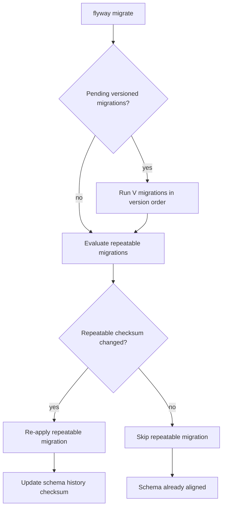
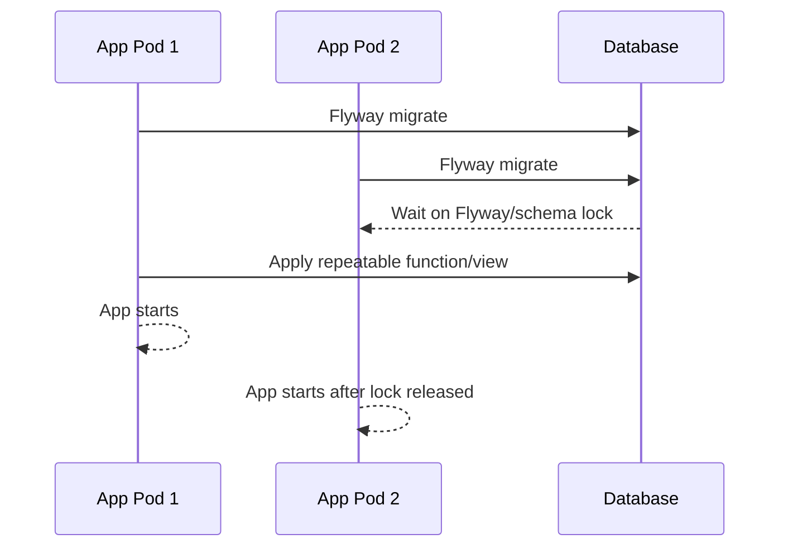
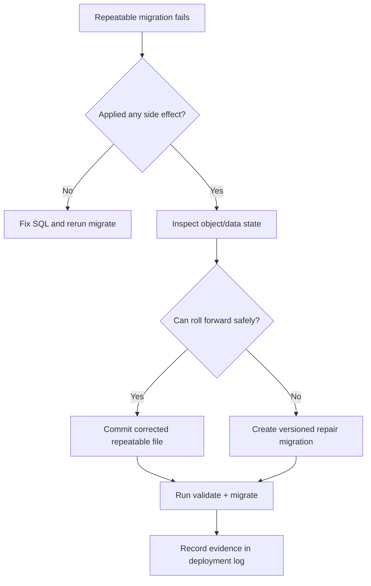

# Part 013 — Flyway Repeatable Migrations: View, Function, Procedure, Reference Data

> Target bagian ini: kita tidak hanya tahu bahwa file `R__something.sql` akan dijalankan ulang saat berubah. Kita ingin tahu **kapan repeatable migration adalah desain yang benar**, kapan ia berbahaya, bagaimana ia berinteraksi dengan versioned migration, dan bagaimana membuatnya aman untuk sistem production.

Flyway repeatable migration adalah mekanisme untuk objek database yang lebih cocok diperlakukan sebagai **current definition** daripada **historical event**.

Contoh objek seperti ini:

- `VIEW`
- `FUNCTION`
- `PROCEDURE`
- `PACKAGE`
- `TRIGGER`
- beberapa jenis `MATERIALIZED VIEW`
- bulk reference data yang memang dikelola sebagai definisi utuh

Namun repeatable migration sering disalahgunakan. Kesalahan paling umum adalah memakai repeatable migration untuk menggantikan versioned migration. Itu kelihatan praktis di awal, tetapi merusak audit trail, menyembunyikan perubahan historis, dan membuat database evolution tidak bisa direkonstruksi.

---

## 1. Mental Model: Event History vs Current Definition

Database migration memiliki dua jenis perubahan besar.

Pertama, **event history**. Ini adalah perubahan yang harus terjadi satu kali dalam urutan tertentu.

Contoh:

```sql
ALTER TABLE customer ADD COLUMN risk_score numeric(5,2);
ALTER TABLE customer ADD CONSTRAINT customer_risk_score_range CHECK (risk_score BETWEEN 0 AND 100);
```

Perubahan seperti ini adalah event. Setelah event terjadi, kita tidak ingin Flyway menjalankannya lagi hanya karena file diedit. Untuk ini gunakan **versioned migration**.

Kedua, **current definition**. Ini adalah objek yang definisinya bisa dinyatakan sebagai bentuk final saat ini.

Contoh:

```sql
CREATE OR REPLACE VIEW customer_risk_summary AS
SELECT
    c.id,
    c.name,
    c.risk_score,
    CASE
        WHEN c.risk_score >= 80 THEN 'HIGH'
        WHEN c.risk_score >= 50 THEN 'MEDIUM'
        ELSE 'LOW'
    END AS risk_bucket
FROM customer c;
```

Definisi view di atas tidak perlu diketahui sebagai seluruh event historis kecil. Yang lebih penting adalah: **database pada akhir migration harus memiliki definisi view yang sama dengan source control**.

Itulah ruang repeatable migration.

---

## 2. Cara Flyway Melihat Repeatable Migration

Konvensi umum Flyway:

```txt
R__<description>.sql
```

Contoh:

```txt
R__010_view_customer_risk_summary.sql
R__020_function_calculate_penalty.sql
R__030_reference_enforcement_status.sql
```

Repeatable migration memiliki beberapa karakteristik penting:

| Aspek | Makna |
|---|---|
| Tidak memiliki version number | Identitasnya bukan `V013`, tetapi deskripsi/nama file |
| Dijalankan setelah pending versioned migration | Dalam satu run, versioned migration naik dulu, repeatable belakangan |
| Diurutkan berdasarkan description | Karena itu prefix numerik pada description sangat berguna |
| Dijalankan ulang ketika checksum berubah | Perubahan isi file menandakan definisi harus disinkronkan ulang |
| Harus aman untuk dijalankan lebih dari sekali | Gunakan `CREATE OR REPLACE`, `MERGE`, `UPSERT`, atau strategi drop/create yang terkendali |

Diagram mentalnya:



The practical rule:

> Versioned migration answers: **what happened and when?**
>
> Repeatable migration answers: **what should this replaceable object look like now?**

---

## 3. Decision Rule: Kapan Memakai Repeatable Migration

Gunakan repeatable migration ketika semua syarat ini terpenuhi:

1. Objek bisa direpresentasikan sebagai **complete replacement definition**.
2. Menjalankan ulang script tidak merusak data bisnis.
3. Perubahan tidak memerlukan ordering historis yang detail.
4. Review code cukup melihat final definition.
5. Roll-forward cukup dilakukan dengan memperbaiki definisi dan menjalankan migrate lagi.

Jangan gunakan repeatable migration ketika:

1. Script mengubah struktur tabel inti secara irreversible.
2. Script melakukan data migration mahal yang tidak resumable.
3. Script membutuhkan urutan historis antar-release.
4. Script menghapus data bisnis.
5. Script mengubah constraint/index besar yang bisa memblokir production.
6. Script dipakai sebagai cara untuk “selalu menjalankan sesuatu” setiap deployment.

Tabel ringkas:

| Perubahan | Repeatable? | Alasan |
|---|---:|---|
| `CREATE OR REPLACE VIEW` | Ya | View adalah replaceable object |
| `CREATE OR REPLACE FUNCTION` | Ya, dengan guardrail | Aman jika signature/dependency dikelola |
| Add column | Tidak | Ini event historis |
| Backfill 100 juta row | Tidak | Harus versioned + resumable/batch |
| Seed lookup enum kecil | Bisa | Jika dikelola sebagai reference definition |
| Insert audit event | Tidak | Event harus sekali dan historis |
| Rebuild index besar | Tidak biasanya | Risiko lock/IO harus eksplisit di versioned migration |
| Grant privilege | Bisa, hati-hati | Bergantung governance dan environment boundary |

---

## 4. Naming Strategy untuk Repeatable Migration

Karena repeatable migration diurutkan secara alfabetis berdasarkan description, nama file harus membawa ordering intent.

Pola yang disarankan:

```txt
R__010_types.sql
R__020_functions_core.sql
R__030_functions_reporting.sql
R__040_views_core.sql
R__050_views_reporting.sql
R__060_reference_status.sql
R__070_permissions_read_model.sql
```

Untuk sistem yang besar, lebih baik granular:

```txt
R__040_view_case_summary.sql
R__041_view_case_escalation_summary.sql
R__042_view_case_assignment_queue.sql
R__050_function_calculate_case_due_date.sql
R__051_function_calculate_penalty_amount.sql
```

Hindari nama seperti ini:

```txt
R__views.sql
R__functions.sql
R__misc.sql
R__data.sql
R__all_reference_data.sql
```

Nama terlalu luas membuat review sulit, checksum berubah terlalu sering, dan blast radius tidak jelas.

---

## 5. Pattern: Replaceable View

View adalah use case paling sehat untuk repeatable migration.

Contoh:

```sql title="R__040_view_case_summary.sql"
CREATE OR REPLACE VIEW app_read.case_summary AS
SELECT
    c.id AS case_id,
    c.reference_number,
    c.status,
    c.priority,
    c.created_at,
    c.updated_at,
    a.assigned_to,
    a.assigned_at,
    CASE
        WHEN c.status IN ('CLOSED', 'CANCELLED') THEN false
        WHEN c.due_at < now() THEN true
        ELSE false
    END AS is_overdue
FROM app.case c
LEFT JOIN app.case_assignment a
    ON a.case_id = c.id
   AND a.active = true;
```

Review checklist:

- Apakah view menggunakan schema-qualified table name?
- Apakah column name eksplisit dan stabil?
- Apakah ada `SELECT *`? Jika ada, biasanya salah.
- Apakah backward compatibility dengan aplikasi lama masih aman?
- Apakah dependency table/column sudah dibuat oleh versioned migration sebelumnya?
- Apakah privilege/grant view dikelola terpisah?
- Apakah view dipakai oleh external consumer/reporting?

Anti-pattern:

```sql
CREATE OR REPLACE VIEW app_read.case_summary AS
SELECT * FROM app.case;
```

Masalah:

1. `SELECT *` membuat contract view berubah diam-diam saat table berubah.
2. Consumer bisa menerima kolom baru tanpa review.
3. Column order bisa menjadi dependency buruk untuk beberapa tool.
4. Audit tidak bisa membedakan perubahan intentional dan incidental.

---

## 6. Pattern: Replaceable Function

Function/procedure lebih berisiko daripada view karena biasanya membawa behavior.

Contoh PostgreSQL:

```sql title="R__050_function_calculate_case_due_date.sql"
CREATE OR REPLACE FUNCTION app.calculate_case_due_date(
    p_created_at timestamptz,
    p_priority text
)
RETURNS timestamptz
LANGUAGE plpgsql
AS $$
BEGIN
    IF p_priority = 'CRITICAL' THEN
        RETURN p_created_at + interval '1 day';
    ELSIF p_priority = 'HIGH' THEN
        RETURN p_created_at + interval '3 days';
    ELSE
        RETURN p_created_at + interval '10 days';
    END IF;
END;
$$;
```

Checklist tambahan untuk function:

- Signature function stabil?
- Return type berubah?
- Apakah `CREATE OR REPLACE` cukup, atau perubahan signature membutuhkan `DROP FUNCTION`?
- Apakah function dipakai di constraint, index expression, trigger, view, atau application query?
- Apakah ada security context seperti `SECURITY DEFINER`?
- Apakah `search_path` dikunci?
- Apakah behavior change butuh release note/audit approval?

Untuk function yang memakai `SECURITY DEFINER`, jangan bergantung pada `search_path` default:

```sql
CREATE OR REPLACE FUNCTION app.secure_case_lookup(p_case_id bigint)
RETURNS TABLE(case_id bigint, reference_number text)
LANGUAGE sql
SECURITY DEFINER
SET search_path = app, pg_temp
AS $$
    SELECT c.id, c.reference_number
    FROM app.case c
    WHERE c.id = p_case_id;
$$;
```

Mengapa ini penting? Karena function dengan elevated privilege dan search path tidak terkendali bisa menjadi vulnerability boundary.

---

## 7. Pattern: Trigger Function + Trigger Binding

Untuk trigger, pisahkan antara **function definition** dan **trigger binding**.

Function definition cocok sebagai repeatable:

```sql title="R__055_function_case_audit_trigger.sql"
CREATE OR REPLACE FUNCTION app.case_audit_trigger_fn()
RETURNS trigger
LANGUAGE plpgsql
AS $$
BEGIN
    INSERT INTO app.case_audit_log (
        case_id,
        action,
        changed_at,
        changed_by
    ) VALUES (
        NEW.id,
        TG_OP,
        now(),
        current_user
    );

    RETURN NEW;
END;
$$;
```

Trigger binding biasanya lebih baik versioned:

```sql title="V202606280901__attach_case_audit_trigger.sql"
CREATE TRIGGER trg_case_audit
AFTER INSERT OR UPDATE ON app.case
FOR EACH ROW
EXECUTE FUNCTION app.case_audit_trigger_fn();
```

Alasannya:

- Function body bisa berevolusi sebagai current definition.
- Attaching/detaching trigger adalah event struktural yang perlu audit historis.
- Mengubah trigger timing/event bisa berdampak besar dan harus eksplisit.

---

## 8. Pattern: Reference Data sebagai Definition

Reference data bisa dikelola dengan repeatable migration jika datanya adalah bagian dari **domain definition**, bukan business transaction.

Contoh domain definition:

```sql title="R__060_reference_enforcement_status.sql"
MERGE INTO ref.enforcement_status AS target
USING (
    VALUES
        ('DRAFT', 'Draft', true, 10),
        ('SUBMITTED', 'Submitted', true, 20),
        ('UNDER_REVIEW', 'Under Review', true, 30),
        ('ESCALATED', 'Escalated', true, 40),
        ('CLOSED', 'Closed', true, 90),
        ('CANCELLED', 'Cancelled', false, 99)
) AS source(code, label, active, sort_order)
ON target.code = source.code
WHEN MATCHED THEN UPDATE SET
    label = source.label,
    active = source.active,
    sort_order = source.sort_order,
    updated_at = now()
WHEN NOT MATCHED THEN INSERT (
    code,
    label,
    active,
    sort_order,
    created_at,
    updated_at
) VALUES (
    source.code,
    source.label,
    source.active,
    source.sort_order,
    now(),
    now()
);
```

Tetapi jangan otomatis menghapus row yang tidak ada di source list:

```sql
-- Dangerous unless you explicitly own the full dataset and have reviewed impact.
DELETE FROM ref.enforcement_status
WHERE code NOT IN ('DRAFT', 'SUBMITTED', 'UNDER_REVIEW', 'ESCALATED', 'CLOSED', 'CANCELLED');
```

Deletion semantics untuk reference data harus eksplisit:

- soft delete via `active = false`
- deprecation state
- effective date
- migration-specific deletion dengan approval
- foreign key impact analysis

Untuk sistem regulasi/enforcement, status lama sering masih dibutuhkan untuk historical record. Menghapus reference row bisa merusak pembuktian historis.

---

## 9. Pattern: Repeatable Migration untuk Grants

Grants bisa dikelola sebagai repeatable jika organisasi memilih database privilege sebagai source-controlled object.

Contoh:

```sql title="R__070_grants_read_model.sql"
GRANT USAGE ON SCHEMA app_read TO reporting_reader;
GRANT SELECT ON ALL TABLES IN SCHEMA app_read TO reporting_reader;
ALTER DEFAULT PRIVILEGES IN SCHEMA app_read
GRANT SELECT ON TABLES TO reporting_reader;
```

Namun ada trade-off:

| Benefit | Risiko |
|---|---|
| Privilege terdokumentasi | Role berbeda antar-environment |
| Bisa dipulihkan konsisten | Placeholder/conditional logic bisa liar |
| Mudah diaudit | Bisa bertabrakan dengan DBA-managed privileges |

Jika role berbeda antar-environment, jangan menaruh nama role production langsung di SQL tanpa boundary yang jelas. Gunakan placeholder yang terbatas, atau pisahkan privilege migration ke location yang dikelola oleh platform team.

---

## 10. Repeatable Migration dan Dependency Ordering

Repeatable migration dijalankan setelah versioned migration. Ini berarti dependency struktural harus dibuat oleh versioned migration lebih dulu.

Contoh alur benar:

```txt
V202606280900__create_case_table.sql
V202606280910__add_case_due_at.sql
R__040_view_case_summary.sql
R__050_function_calculate_case_due_date.sql
```

Alur salah:

```txt
R__040_view_case_summary.sql
V202606280910__add_case_due_at.sql
```

Jika view menggunakan `case.due_at`, column itu harus sudah ada sebelum repeatable dievaluasi.

Untuk dependency antar-repeatable, gunakan prefix numerik:

```txt
R__010_type_case_priority.sql
R__020_function_priority_weight.sql
R__030_view_case_priority_summary.sql
```

Jika `view_case_priority_summary` memanggil `function_priority_weight`, function harus datang lebih dulu.

---

## 11. Repeatable Migration dan Compatibility Window

Repeatable migration tetap harus mengikuti expand/contract.

Skenario: aplikasi lama membaca view `case_summary` dengan kolom `status`, aplikasi baru ingin kolom `status_label`.

Jangan langsung mengganti contract:

```sql
-- Bad: removes old column too early
CREATE OR REPLACE VIEW app_read.case_summary AS
SELECT
    c.id,
    s.label AS status_label
FROM app.case c
JOIN ref.status s ON s.code = c.status;
```

Gunakan fase expand:

```sql
-- Good: old and new consumers remain compatible
CREATE OR REPLACE VIEW app_read.case_summary AS
SELECT
    c.id,
    c.status,
    s.label AS status_label
FROM app.case c
JOIN ref.status s ON s.code = c.status;
```

Setelah semua consumer pindah ke `status_label`, lakukan contract pada release berikutnya:

```sql
CREATE OR REPLACE VIEW app_read.case_summary AS
SELECT
    c.id,
    s.label AS status_label
FROM app.case c
JOIN ref.status s ON s.code = c.status;
```

Repeatable migration tidak membebaskan kita dari compatibility discipline. Ia hanya membuat replacement object lebih mudah disinkronkan.

---

## 12. Repeatable Migration dan Checksum Hygiene

Karena repeatable migration dipicu oleh perubahan checksum, jaga agar file tidak berubah karena hal non-semantik yang tidak perlu.

Praktik baik:

- Hindari generated timestamp di file.
- Hindari formatting churn dari tool yang tidak stabil.
- Hindari menaruh komentar release yang berubah setiap deploy.
- Pecah file besar menjadi objek kecil agar perubahan checksum memiliki blast radius kecil.
- Review perubahan repeatable sebagai perubahan behavior, bukan sekadar “refresh”.

Anti-pattern:

```sql
-- R__040_view_case_summary.sql
-- Generated at: 2026-06-28 10:01:22
CREATE OR REPLACE VIEW ...
```

Jika timestamp berubah setiap build, repeatable migration akan terlihat berubah walaupun definisi sebenarnya sama.

---

## 13. Repeatable Migration untuk Materialized View

Materialized view lebih kompleks karena ada dua concern:

1. definisi materialized view
2. refresh/population strategy

Untuk PostgreSQL, contoh pattern:

```sql title="R__080_materialized_view_case_dashboard.sql"
CREATE MATERIALIZED VIEW IF NOT EXISTS app_read.case_dashboard_mv AS
SELECT
    c.status,
    count(*) AS total_cases,
    max(c.updated_at) AS last_case_update
FROM app.case c
GROUP BY c.status
WITH NO DATA;
```

Tetapi `CREATE OR REPLACE MATERIALIZED VIEW` tidak selalu tersedia seperti regular view. Kadang perubahan definisi membutuhkan drop/create, yang berbahaya jika object besar atau punya dependency.

Pilihan desain:

| Strategy | Cocok untuk | Risiko |
|---|---|---|
| Versioned drop/create | Perubahan definisi besar | Downtime/dependency break |
| New MV name + swap | Production large MV | Lebih kompleks |
| Repeatable refresh callback | Refresh kecil/non-critical | Bisa memperpanjang deployment |
| External refresh job | Dashboard/reporting besar | Butuh orchestration tambahan |

Jangan menaruh refresh besar di repeatable migration tanpa batas waktu dan observability.

---

## 14. Java Migration vs Repeatable SQL

Flyway Java migration cocok ketika perubahan perlu logika imperative. Namun repeatable Java migration harus diperlakukan sangat hati-hati.

Gunakan Java migration untuk:

- batching data migration
- checkpoint/resume
- external validation
- transformasi data kompleks
- multi-tenant fan-out dengan kontrol error

Gunakan repeatable SQL untuk:

- replaceable database object
- small deterministic reference data
- grants yang jelas

Rule of thumb:

> Jika perubahan perlu loop, retry, checkpoint, throttling, atau observability granular, jangan memaksanya menjadi repeatable SQL.

---

## 15. Spring Boot Integration Posture

Dalam aplikasi Spring Boot, repeatable migration sering tampak nyaman karena berjalan saat application startup. Untuk production, hati-hati.

Masalah startup migration:



Untuk repeatable migration kecil seperti view/function, startup migration masih bisa diterima di banyak sistem. Namun untuk repeatable yang berat, lebih aman menjalankannya di pipeline atau dedicated migration job.

Decision matrix:

| Migration type | Startup app | Dedicated job/pipeline |
|---|---:|---:|
| Small view/function replacement | Bisa | Bisa |
| Large reference data upsert | Hati-hati | Lebih baik |
| Materialized view refresh | Tidak ideal | Lebih baik |
| Backfill besar | Tidak | Wajib dedicated |
| Privilege/grant | Tergantung policy | Lebih baik untuk audit |

---

## 16. Review Checklist untuk Repeatable Migration

Gunakan checklist ini saat PR review.

### Object identity

- Apakah nama object schema-qualified?
- Apakah file hanya mengelola satu object atau satu domain kecil?
- Apakah description file jelas dan terurut?

### Rerun safety

- Apakah script aman dijalankan ulang?
- Apakah ada destructive statement?
- Jika ada `DROP`, apakah dependency dan downtime dianalisis?
- Jika ada DML, apakah upsert deterministik?

### Compatibility

- Apakah aplikasi lama masih bisa berjalan?
- Apakah external consumer/reporting terkena dampak?
- Apakah column/function signature berubah?

### Operational risk

- Apakah script bisa lock lama?
- Apakah script bisa scan table besar?
- Apakah script bisa memperpanjang deployment?
- Apakah ada timeout/observability?

### Audit

- Apakah perubahan behavior dijelaskan di PR?
- Apakah ada evidence mengapa repeatable lebih tepat daripada versioned?
- Apakah ada rollback/roll-forward plan?

---

## 17. Anti-Pattern Catalog

### Anti-pattern 1: Repeatable Migration sebagai Tempat Semua SQL

```txt
R__all.sql
```

Masalah:

- checksum berubah untuk semua hal
- review tidak granular
- ordering tidak eksplisit
- failure sulit dilokalisir
- audit trail kehilangan makna

Perbaikan: pecah per object/domain.

---

### Anti-pattern 2: Repeatable Migration untuk Table Evolution

```sql
-- R__customer_schema.sql
ALTER TABLE customer ADD COLUMN risk_score numeric(5,2);
```

Masalah: saat dijalankan ulang, script gagal atau membutuhkan `IF NOT EXISTS` yang menutupi history.

Perbaikan: gunakan versioned migration.

---

### Anti-pattern 3: Drop/Create View Tanpa Dependency Analysis

```sql
DROP VIEW app_read.case_summary;
CREATE VIEW app_read.case_summary AS ...;
```

Masalah:

- dependent views bisa rusak
- privilege bisa hilang
- consumer bisa gagal selama window pendek
- transaction behavior berbeda antar-database

Perbaikan: gunakan `CREATE OR REPLACE` jika tersedia dan aman. Jika tidak, rancang versioned transition.

---

### Anti-pattern 4: Repeatable Data Delete

```sql
DELETE FROM ref.status;
INSERT INTO ref.status ...;
```

Masalah:

- foreign key bisa gagal
- audit/historical relation bisa rusak
- row metadata berubah
- trigger bisa menghasilkan noise

Perbaikan: gunakan deterministic upsert dan explicit deprecation.

---

### Anti-pattern 5: Placeholder yang Mengubah Semantik Per Environment

```sql
CREATE OR REPLACE VIEW app_read.case_summary AS
SELECT *
FROM ${source_schema}.case;
```

Jika `${source_schema}` berbeda antar-environment tanpa kontrol, maka objek yang “sama” di source control bisa memiliki arti berbeda.

Perbaikan:

- batasi placeholder untuk nama schema/role yang memang environment-owned
- jangan gunakan placeholder untuk business logic
- dokumentasikan placeholder contract

---

## 18. Failure Model

Repeatable migration bisa gagal karena:

1. dependency object belum ada
2. object lama punya dependency yang mencegah replacement
3. function signature berubah tidak kompatibel
4. privilege kurang
5. syntax vendor-specific salah
6. data reference melanggar constraint
7. statement lock terlalu lama
8. checksum berubah tanpa perubahan bermakna

Playbook:



Jangan langsung menjalankan `repair` hanya karena repeatable gagal. `repair` adalah metadata reconciliation, bukan pembersih object database.

---

## 19. Mini Capstone Exercise

Desain repeatable migration untuk domain enforcement case.

Kondisi:

- Ada table `app.case`.
- Ada table `app.case_assignment`.
- Ada table `ref.enforcement_status`.
- Aplikasi lama membaca `app_read.case_summary.status`.
- Aplikasi baru butuh `status_label`, `is_overdue`, dan `assigned_to`.

Tugas:

1. Buat `R__040_view_case_summary.sql` yang backward-compatible.
2. Buat `R__060_reference_enforcement_status.sql` dengan upsert.
3. Jelaskan kenapa add column/table dependency harus versioned.
4. Buat PR checklist untuk perubahan view.
5. Buat roll-forward plan jika view gagal compile di staging.

Kriteria benar:

- tidak ada `SELECT *`
- semua object schema-qualified
- view mempertahankan kolom lama selama compatibility window
- reference data tidak menghapus row historis tanpa approval
- perubahan object terpisah per file

---

## 20. Ringkasan

Repeatable migration adalah tool yang kuat untuk objek database yang bersifat **replaceable**. Ia cocok untuk menyamakan current definition antara source control dan database. Tetapi ia bukan pengganti versioned migration.

Pegangan utama:

- Gunakan versioned migration untuk event historis.
- Gunakan repeatable migration untuk current definition.
- Jaga file kecil, deterministik, dan rerunnable.
- Hindari destructive DDL/DML tanpa desain eksplisit.
- Gunakan ordering prefix untuk dependency antar-repeatable.
- Review repeatable migration sebagai perubahan contract dan behavior.

Jika kita disiplin, repeatable migration menjadi mekanisme elegan untuk view/function/procedure/reference data. Jika tidak disiplin, ia menjadi tempat tersembunyi untuk perubahan database yang tidak bisa diaudit.

---

## Referensi Operasional

- Redgate Flyway Documentation — Repeatable Migrations
- Redgate Flyway Documentation — Tutorial: Repeatable Migrations
- Redgate Flyway Documentation — Flyway Schema History Table
- Redgate Flyway Documentation — Validate Error Codes
