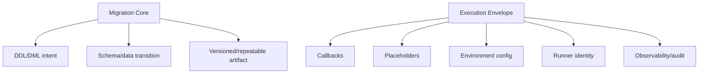
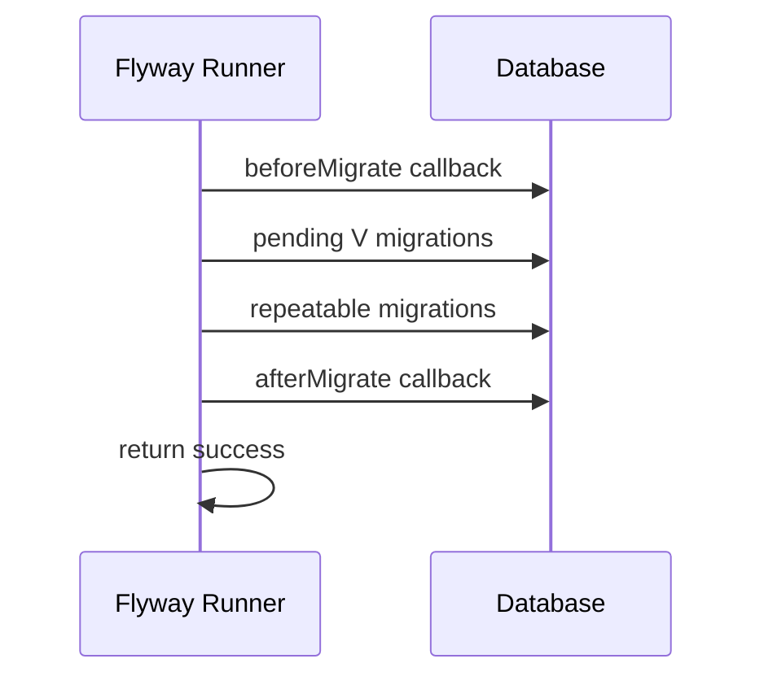
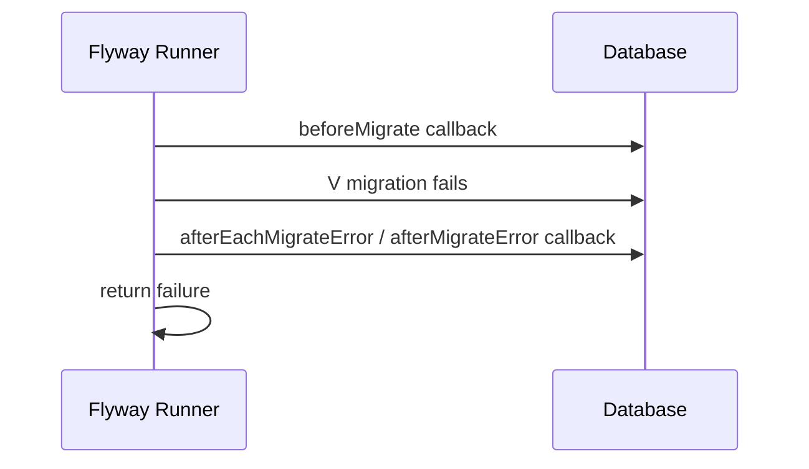
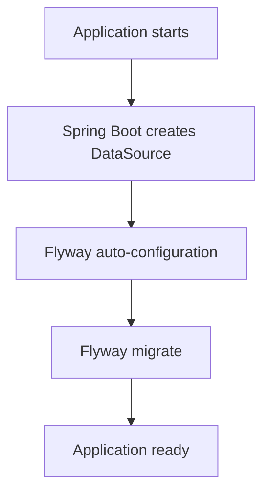
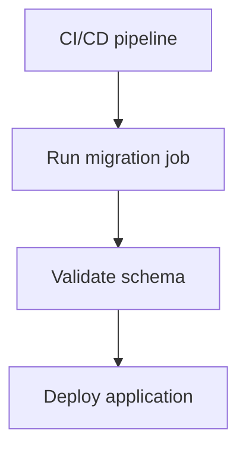
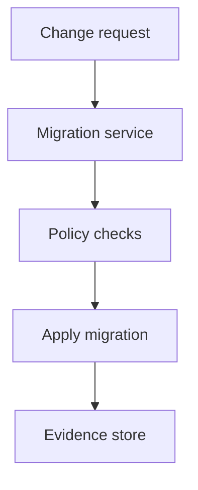
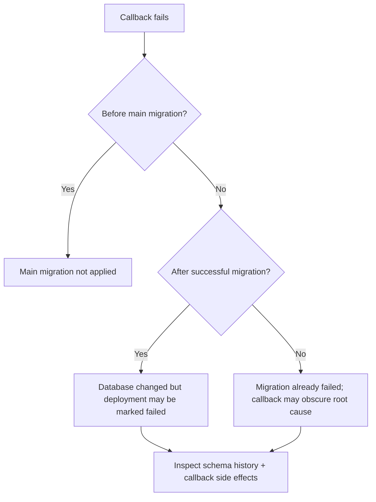

# Part 014 — Flyway Callbacks, Placeholders, dan Environment-Specific Configuration

> Target bagian ini: kita ingin bisa memakai callback dan placeholder tanpa mengubah migration menjadi kumpulan script ajaib yang perilakunya berbeda-beda di setiap environment. Callback dan placeholder harus menjadi **control surface**, bukan sumber nondeterminism.

Flyway memiliki dua mekanisme yang sering terlihat sederhana tetapi sangat berpengaruh pada governance migration:

1. **Callbacks** — hook yang berjalan pada lifecycle Flyway, misalnya sebelum/after migrate, validate, repair, clean, atau event tertentu.
2. **Placeholders** — token dalam SQL/script migration yang diganti dengan nilai konfigurasi saat eksekusi.

Keduanya berguna. Keduanya juga bisa berbahaya.

Callback bisa membuat migration lebih observable, aman, dan terintegrasi dengan pipeline. Tetapi callback juga bisa menyembunyikan side effect yang tidak terlihat di file migration utama.

Placeholder bisa membuat script reusable antar-environment. Tetapi placeholder juga bisa membuat “file yang sama” menghasilkan database yang berbeda secara semantik.

---

## 1. Mental Model: Migration Core vs Execution Envelope

Pisahkan dua lapisan:



**Migration core** adalah perubahan database yang ingin kita lakukan.

**Execution envelope** adalah konteks operasional saat perubahan itu dijalankan.

Callback dan placeholder berada di execution envelope. Mereka boleh membantu eksekusi, tetapi jangan sampai mengubah migration core menjadi tidak jelas.

Rule utama:

> Migration file harus tetap bisa direview sebagai intent utama. Callback dan placeholder tidak boleh menyembunyikan perubahan bisnis atau struktur penting.

---

## 2. Flyway Callback: Apa yang Sebenarnya Terjadi

Callback adalah script atau Java code yang dijalankan Flyway ketika event lifecycle tertentu terjadi.

Contoh callback SQL:

```txt
beforeMigrate.sql
afterMigrate.sql
afterMigrateError.sql
beforeRepair__capture_history.sql
afterValidate__write_audit_marker.sql
```

Flyway juga mendukung nama callback dengan deskripsi:

```txt
beforeMigrate__assert_no_long_running_transactions.sql
afterMigrate__refresh_small_materialized_views.sql
afterMigrateError__capture_failure_context.sql
```

Model eksekusinya:



Jika migration gagal:



Callback bukan migration versioned. Jangan menggunakannya untuk perubahan schema utama.

---

## 3. Callback Event yang Paling Sering Dipakai

Event Flyway cukup banyak. Untuk production engineering, yang paling sering relevan:

| Event | Use case sehat | Risiko |
|---|---|---|
| `beforeMigrate` | preflight check, lock timeout, audit marker | menolak deployment karena check terlalu rapuh |
| `afterMigrate` | post-migration verification ringan, refresh kecil | side effect tersembunyi |
| `afterMigrateError` | capture failure context | callback ikut gagal dan menutupi root cause |
| `beforeValidate` | setup validation context | membuat validate tidak murni |
| `afterValidate` | emit validation evidence | write side effect tidak perlu |
| `beforeRepair` | capture schema history sebelum repair | repair flow makin kompleks |
| `afterRepair` | audit repair metadata | memberi ilusi database sudah diperbaiki |
| `beforeClean` | backup/dev safety hook | tidak boleh dijadikan production safety utama |
| `afterClean` | reset dev fixtures | sangat berbahaya jika production bisa clean |

Untuk command `info`, hindari callback yang menulis data. `info` bisa dipanggil oleh tool atau pipeline hanya untuk membaca status. Jika `info` punya side effect, observability berubah menjadi mutation.

---

## 4. SQL Callback vs Java Callback vs Script Callback

Flyway callback bisa dibuat dalam beberapa bentuk.

| Bentuk | Cocok untuk | Hindari untuk |
|---|---|---|
| SQL callback | check database state, audit marker kecil, session setting | external orchestration kompleks |
| Java callback | logic multi-event, structured logging, integration internal | DDL/DML utama yang harus diaudit sebagai migration |
| Script callback | external tool, file handling, shell integration | logic bisnis/database yang sulit direview |

Pilih bentuk paling sederhana.

Jika bisa SQL, gunakan SQL. Jika butuh stateful logic atau structured integration, gunakan Java. Jika butuh OS/tooling, gunakan script callback, tetapi batasi privilege dan dokumentasikan.

---

## 5. Pattern: Preflight Callback

Preflight callback membantu mencegah migration berjalan dalam kondisi database yang tidak aman.

Contoh PostgreSQL: fail jika ada transaksi terlalu lama.

```sql title="beforeMigrate__assert_no_long_transactions.sql"
DO $$
DECLARE
    v_count int;
BEGIN
    SELECT count(*)
    INTO v_count
    FROM pg_stat_activity
    WHERE state IN ('active', 'idle in transaction')
      AND now() - xact_start > interval '10 minutes'
      AND pid <> pg_backend_pid();

    IF v_count > 0 THEN
        RAISE EXCEPTION 'Unsafe to migrate: % long running transaction(s) detected', v_count;
    END IF;
END;
$$;
```

Kapan cocok:

- migration berpotensi lock table
- database sering punya transaksi panjang
- production window ketat

Kapan tidak cocok:

- check terlalu environment-specific
- query introspection berat
- policy tidak disepakati dengan DBA/platform team

---

## 6. Pattern: Session Safety Callback

Beberapa database mengizinkan session-level timeout.

PostgreSQL contoh:

```sql title="beforeMigrate__set_session_timeouts.sql"
SET lock_timeout = '5s';
SET statement_timeout = '10min';
SET idle_in_transaction_session_timeout = '1min';
```

Ini berguna untuk menghindari migration menggantung karena lock.

Namun ada nuance:

- timeout terlalu pendek bisa membuat migration valid sering gagal
- timeout terlalu panjang bisa membahayakan traffic production
- behavior session setting bergantung database/vendor
- callback transaction/session boundary harus dipahami

Untuk migration tertentu yang butuh timeout berbeda, lebih baik gunakan script configuration atau statement eksplisit dalam migration tersebut, bukan global callback yang memukul semua migration.

---

## 7. Pattern: Audit Marker Callback

Callback bisa menulis audit marker ringan, tetapi jangan menggantikan schema history.

Contoh:

```sql title="beforeMigrate__record_deployment_start.sql"
INSERT INTO ops.db_deployment_audit (
    deployment_id,
    event_type,
    flyway_user,
    started_at
) VALUES (
    '${deployment_id}',
    'MIGRATE_STARTED',
    '${flyway:user}',
    now()
);
```

```sql title="afterMigrate__record_deployment_success.sql"
INSERT INTO ops.db_deployment_audit (
    deployment_id,
    event_type,
    flyway_user,
    completed_at
) VALUES (
    '${deployment_id}',
    'MIGRATE_SUCCEEDED',
    '${flyway:user}',
    now()
);
```

Audit marker harus:

- additive
- tidak mempengaruhi business schema
- failure-tolerant secara desain
- tidak menjadi satu-satunya evidence
- mencatat deployment id/build id yang berasal dari pipeline

Jika audit callback gagal setelah migration sukses, situasinya ambigu. Karena itu audit callback harus dirancang sederhana dan diuji.

---

## 8. Anti-Pattern: Callback sebagai Hidden Migration

Contoh buruk:

```sql title="afterMigrate__alter_customer_table.sql"
ALTER TABLE customer ADD COLUMN hidden_flag boolean;
```

Masalah:

- perubahan schema tidak muncul sebagai versioned migration
- audit trail historis tidak jelas
- ordering dengan migration utama sulit dipahami
- review mungkin melewatkan callback
- repair/replay menjadi kacau

Perbaikan:

```txt
V202606281030__add_customer_hidden_flag.sql
```

Callback boleh membantu lifecycle. Callback tidak boleh menjadi tempat perubahan domain utama.

---

## 9. Flyway Placeholder: Apa yang Diganti

Placeholder adalah token yang diganti Flyway saat menjalankan SQL/script migration.

Contoh default syntax:

```sql
CREATE SCHEMA IF NOT EXISTS ${app_schema};
```

Konfigurasi:

```properties
flyway.placeholders.app_schema=app
flyway.placeholders.read_schema=app_read
flyway.placeholders.deployment_id=release-2026-06-28-001
```

Contoh Spring Boot:

```yaml title="application-prod.yml"
spring:
  flyway:
    placeholders:
      app_schema: app
      read_schema: app_read
      deployment_id: ${DEPLOYMENT_ID}
```

Contoh Java API:

```java
Map<String, String> placeholders = new HashMap<>();
placeholders.put("app_schema", "app");
placeholders.put("read_schema", "app_read");
placeholders.put("deployment_id", System.getenv("DEPLOYMENT_ID"));

Flyway flyway = Flyway.configure()
    .dataSource(dataSource)
    .locations("classpath:db/migration")
    .placeholders(placeholders)
    .load();

flyway.migrate();
```

Placeholder matching Flyway bersifat case-insensitive untuk nama placeholder. Secara default, prefix placeholder adalah `${` dan suffix adalah `}`.

---

## 10. Placeholder yang Aman vs Berbahaya

Placeholder aman biasanya merepresentasikan deployment envelope, bukan business semantics.

| Placeholder | Aman? | Catatan |
|---|---:|---|
| `${app_schema}` | Ya, jika schema boundary jelas | Banyak organisasi memakai schema berbeda per env |
| `${read_schema}` | Ya | Cocok untuk view/read model |
| `${deployment_id}` | Ya | Audit marker |
| `${flyway:user}` | Ya untuk audit | Default placeholder |
| `${role_reader}` | Hati-hati | Role bisa environment-owned |
| `${retention_days}` | Hati-hati | Bisa mengubah data deletion behavior |
| `${case_status_logic}` | Tidak | Business logic tidak boleh via placeholder |
| `${enable_fk}` | Tidak biasanya | Membuat schema contract beda antar-env |

Rule:

> Placeholder boleh mengganti **nama lingkungan**. Placeholder tidak boleh mengganti **aturan domain**.

---

## 11. Anti-Pattern: Environment-Specific Business Logic

Contoh buruk:

```sql
CREATE OR REPLACE VIEW app_read.case_summary AS
SELECT
    c.id,
    CASE
        WHEN '${environment}' = 'prod' THEN c.official_status
        ELSE c.test_status
    END AS status
FROM app.case c;
```

Masalah:

- staging tidak merepresentasikan production
- bug production tidak bisa direproduksi
- checksum file sama, behavior beda
- audit menjadi lemah

Perbaikan:

- schema dan data test harus dibuat mendekati production
- business behavior harus sama antar-environment
- perbedaan environment ditempatkan di data/config yang diaudit, bukan di migration branching liar

---

## 12. Placeholder dan Repeatable Migration

Placeholder dalam repeatable migration perlu ekstra hati-hati karena checksum dan replacement bisa membingungkan.

Pertanyaan review:

1. Apakah perubahan nilai placeholder menyebabkan object definition berbeda?
2. Apakah perbedaan itu memang diinginkan?
3. Apakah perubahan placeholder akan memicu re-apply yang kita harapkan?
4. Apakah schema history cukup menjelaskan perbedaan antar-environment?

Contoh cukup sehat:

```sql title="R__040_view_case_summary.sql"
CREATE OR REPLACE VIEW ${read_schema}.case_summary AS
SELECT
    c.id,
    c.reference_number,
    c.status
FROM ${app_schema}.case c;
```

Ini masih sehat jika `${app_schema}` dan `${read_schema}` hanya nama schema fisik, bukan behavior domain.

Contoh berbahaya:

```sql
CREATE OR REPLACE VIEW ${read_schema}.case_summary AS
SELECT *
FROM ${source_table};
```

`source_table` terlalu bebas. Ia bisa membuat view yang sama menunjuk ke table berbeda antar-environment.

---

## 13. Environment Configuration Model

Untuk Java/Spring ecosystem, ada tiga model utama.

### Model A — App Startup Migration



Cocok untuk:

- service kecil
- migration cepat
- satu database ownership jelas
- deployment tidak massive parallel

Risiko:

- banyak pod mencoba migrate bersamaan
- startup readiness tergantung database DDL
- rollback aplikasi tidak otomatis rollback database
- credential aplikasi mungkin terlalu privileged

### Model B — Dedicated Migration Job



Cocok untuk:

- production regulated system
- migration perlu approval evidence
- app runtime user tidak boleh punya DDL privilege
- migration besar/perlu observability

### Model C — Platform Migration Service



Cocok untuk organisasi besar dengan banyak service, compliance, dan separation of duties.

---

## 14. Configuration Layering untuk Spring Boot

Contoh baseline konfigurasi:

```yaml title="application.yml"
spring:
  flyway:
    enabled: true
    locations: classpath:db/migration
    default-schema: app
    schemas:
      - app
      - app_read
    placeholders:
      app_schema: app
      read_schema: app_read
```

Production override:

```yaml title="application-prod.yml"
spring:
  flyway:
    clean-disabled: true
    placeholders:
      deployment_id: ${DEPLOYMENT_ID}
```

Namun untuk sistem production yang ketat, lebih baik migration tidak otomatis berjalan saat app startup:

```yaml title="application-prod.yml"
spring:
  flyway:
    enabled: false
```

Lalu pipeline menjalankan Flyway CLI/Gradle/Maven/container job dengan credential migration khusus.

---

## 15. Placeholder Source of Truth

Jangan biarkan placeholder tersebar tanpa pemilik.

Sumber placeholder bisa berasal dari:

- config file Flyway
- environment variable
- Spring Boot properties
- Maven/Gradle config
- Java API
- CI/CD secret/config store

Prioritas desain:

1. **Production value harus traceable.**
2. **Secret jangan masuk source control.**
3. **Business semantics jangan menjadi placeholder.**
4. **Placeholder wajib punya schema/meaning yang terdokumentasi.**
5. **Pipeline harus bisa mencetak resolved non-secret config untuk audit.**

Contoh dokumentasi placeholder:

| Placeholder | Owner | Secret? | Env-specific? | Meaning |
|---|---|---:|---:|---|
| `app_schema` | platform/db | No | Sometimes | Schema utama aplikasi |
| `read_schema` | platform/db | No | Sometimes | Schema read model |
| `deployment_id` | CI/CD | No | Yes | Build/release identifier |
| `role_reader` | DBA/platform | No | Yes | Role read-only |
| `admin_password` | N/A | Yes | Yes | Jangan dipakai dalam SQL migration |

---

## 16. Multi-Environment Boundary

Environment boleh berbeda pada hal fisik:

- hostname
- database name
- schema name tertentu
- role name
- tablespace/storage class
- deployment id
- observability endpoint

Environment tidak boleh berbeda pada hal logical contract:

- table/column existence
- constraint wajib
- business status semantics
- core view output contract
- function behavior domain
- retention/delete policy tanpa approval

Pola sehat:

```sql
CREATE TABLE ${app_schema}.case_note (
    id bigint GENERATED ALWAYS AS IDENTITY PRIMARY KEY,
    case_id bigint NOT NULL,
    note_text text NOT NULL,
    created_at timestamptz NOT NULL DEFAULT now()
);
```

Pola berbahaya:

```sql
CREATE TABLE ${app_schema}.case_note (
    id bigint GENERATED ALWAYS AS IDENTITY PRIMARY KEY,
    case_id bigint NOT NULL,
    note_text text NOT NULL,
    created_at timestamptz NOT NULL DEFAULT now(),
    ${extra_prod_columns}
);
```

DDL contract tidak boleh dirakit dari placeholder bebas seperti string template application code.

---

## 17. Callback Location dan Repo Structure

Pisahkan callback dari migration utama agar reviewer sadar bahwa ada execution envelope.

Contoh struktur:

```txt
src/main/resources/
  db/
    migration/
      V202606280900__create_case_table.sql
      V202606280910__add_case_due_at.sql
      R__040_view_case_summary.sql
    callback/
      beforeMigrate__set_session_timeouts.sql
      beforeMigrate__assert_no_long_transactions.sql
      afterMigrate__record_deployment_success.sql
```

Konfigurasi:

```properties
flyway.locations=classpath:db/migration
flyway.callbackLocations=classpath:db/callback
```

Policy review:

- perubahan di `db/migration` direview sebagai schema/data transition
- perubahan di `db/callback` direview sebagai operational lifecycle behavior
- callback baru harus punya rationale
- callback write harus punya failure model

---

## 18. Java Callback Example

SQL callback cukup untuk banyak kasus. Java callback berguna jika butuh structured logging, event filtering, atau integrasi internal.

Contoh sederhana:

```java
package com.example.migration;

import org.flywaydb.core.api.callback.Callback;
import org.flywaydb.core.api.callback.Context;
import org.flywaydb.core.api.callback.Event;

public final class MigrationAuditCallback implements Callback {

    @Override
    public boolean supports(Event event, Context context) {
        return event == Event.AFTER_MIGRATE || event == Event.AFTER_MIGRATE_ERROR;
    }

    @Override
    public boolean canHandleInTransaction(Event event, Context context) {
        return true;
    }

    @Override
    public void handle(Event event, Context context) {
        // Keep this small. Avoid business logic here.
        System.out.printf(
            "Flyway event=%s database=%s%n",
            event.getId(),
            context.getConfiguration().getUrl()
        );
    }

    @Override
    public String getCallbackName() {
        return "migration-audit-callback";
    }
}
```

Guardrail:

- jangan membuat callback Java yang melakukan DDL utama
- jangan bergantung pada network call yang bisa membuat migration gagal acak
- jangan menulis secret ke log
- jangan membuat callback yang hanya berjalan di local/dev

---

## 19. Callback Failure Model

Callback failure harus dipikirkan seperti migration failure.



Callback yang berjalan setelah migration sukses tetapi gagal sendiri dapat membuat pipeline gagal walaupun database sudah berubah. Ini bukan bug kecil; ini state ambiguity.

Karena itu:

- callback after-success harus sangat reliable
- audit callback harus sederhana
- external calls sebaiknya asynchronous/out-of-band
- failure callback harus best-effort dan tidak menutupi root cause

---

## 20. Security Boundary

Callback dan placeholder sering menyentuh credential, role, dan environment config.

Security checklist:

- Migration runner punya credential sendiri, bukan app runtime user.
- Placeholder secret tidak dicetak ke log.
- Callback script tidak mengambil secret dari file lokal sembarang.
- Script callback shell tidak bisa diinjeksi dari placeholder bebas.
- Role/grant migration disetujui oleh owner security/platform.
- `clean` tetap disabled di production.
- Callback `beforeClean` bukan pengganti policy yang melarang clean production.

Contoh berbahaya:

```sql
-- Avoid this pattern
CREATE USER app_admin PASSWORD '${admin_password}';
```

Masalah:

- secret masuk SQL execution path
- bisa bocor di log/history/tooling
- password rotation tidak cocok dengan migration history

Credential lifecycle sebaiknya dikelola oleh secret management/IAM/platform, bukan schema migration biasa.

---

## 21. Observability Contract

Migration yang baik tidak hanya “berjalan sukses”; ia meninggalkan evidence.

Evidence minimum:

- Flyway command result
- schema history status
- migration checksum
- deployment id
- actor/runner identity
- start/end timestamp
- failed statement atau error class jika gagal
- affected object list
- approval link/change request link

Callback bisa membantu mengisi evidence, tetapi jangan membuat evidence hanya ada di database target. Untuk regulated system, evidence juga perlu ada di CI/CD log, release record, atau deployment audit store.

---

## 22. Practical Policy: Callback dan Placeholder Review Rules

Gunakan aturan ini di engineering handbook.

### Callback rules

1. Callback tidak boleh melakukan schema/domain migration utama.
2. Callback write harus punya alasan dan failure model.
3. Callback untuk `info` tidak boleh write.
4. Callback external call harus dihindari dalam critical path.
5. Callback harus deterministic dan cepat.
6. Callback harus diuji bersama migration pipeline.
7. Callback location harus eksplisit.

### Placeholder rules

1. Placeholder tidak boleh mengubah business logic.
2. Placeholder harus terdokumentasi.
3. Placeholder secret tidak boleh masuk migration SQL kecuali benar-benar disetujui security.
4. Placeholder environment-specific harus terbatas pada physical naming/deployment envelope.
5. Resolved non-secret placeholder harus bisa diaudit.
6. Placeholder tidak boleh digunakan untuk merakit SQL bebas.

---

## 23. Example: Production-Ready Flyway Configuration

Contoh file konfigurasi dedicated runner:

```toml title="flyway.prod.toml"
[flyway]
locations = ["filesystem:db/migration"]
callbackLocations = ["filesystem:db/callback"]
defaultSchema = "app"
schemas = ["app", "app_read", "ref", "ops"]
cleanDisabled = true
validateOnMigrate = true
placeholderReplacement = true

[flyway.placeholders]
app_schema = "app"
read_schema = "app_read"
ref_schema = "ref"
ops_schema = "ops"
deployment_id = "${DEPLOYMENT_ID}"
```

Preflight:

```bash
flyway -configFiles=flyway.prod.toml info
flyway -configFiles=flyway.prod.toml validate
flyway -configFiles=flyway.prod.toml migrate
flyway -configFiles=flyway.prod.toml info
```

Dalam pipeline, jangan hanya melihat exit code. Simpan output sebagai deployment evidence.

---

## 24. Mini Capstone Exercise

Desain execution envelope untuk service `case-management`.

Kebutuhan:

- migration dijalankan oleh dedicated job, bukan app startup
- schema utama: `case_app`
- schema read model: `case_read`
- ada audit table `ops.db_deployment_audit`
- harus fail jika ada transaksi lebih dari 15 menit
- harus mencatat deployment id saat migrate sukses/gagal
- tidak boleh ada business branching per environment

Tugas:

1. Buat struktur folder `db/migration` dan `db/callback`.
2. Buat placeholder table.
3. Buat `beforeMigrate__assert_no_long_transactions.sql`.
4. Buat `afterMigrate__record_success.sql`.
5. Buat `afterMigrateError__record_failure.sql`.
6. Jelaskan callback mana yang boleh gagal dan dampaknya.
7. Jelaskan kenapa placeholder tidak boleh dipakai untuk business rule.

Kriteria benar:

- migration core dan callback terpisah
- placeholder hanya untuk schema/deployment envelope
- callback tidak menambahkan table/column domain
- audit callback sederhana
- failure model eksplisit

---

## 25. Ringkasan

Callback dan placeholder adalah mekanisme yang memperluas Flyway dari sekadar migration runner menjadi bagian dari deployment system. Tetapi semakin besar kekuatan execution envelope, semakin besar risiko nondeterminism.

Pegangan utama:

- Callback adalah lifecycle hook, bukan tempat hidden migration.
- Placeholder adalah parameterisasi terbatas, bukan template engine untuk business logic.
- Environment boleh berbeda secara fisik, bukan secara logical contract.
- Callback write harus sederhana dan punya failure model.
- Secret dan credential lifecycle bukan tanggung jawab migration SQL biasa.
- Untuk production serius, callback dan placeholder harus direview seperti code.

Jika digunakan disiplin, callback dan placeholder meningkatkan safety, auditability, dan operational control. Jika digunakan sembarangan, mereka membuat migration sulit direproduksi, sulit diaudit, dan sulit dipulihkan.

---

## Referensi Operasional

- Redgate Flyway Documentation — Callbacks
- Redgate Flyway Documentation — Callback Events
- Redgate Flyway Documentation — Executing scripts before or after deployment via callbacks
- Redgate Flyway Documentation — Flyway Placeholders Namespace
- Redgate Flyway Documentation — Placeholder Replacement Setting
- Spring Boot Documentation — Flyway database initialization configuration
