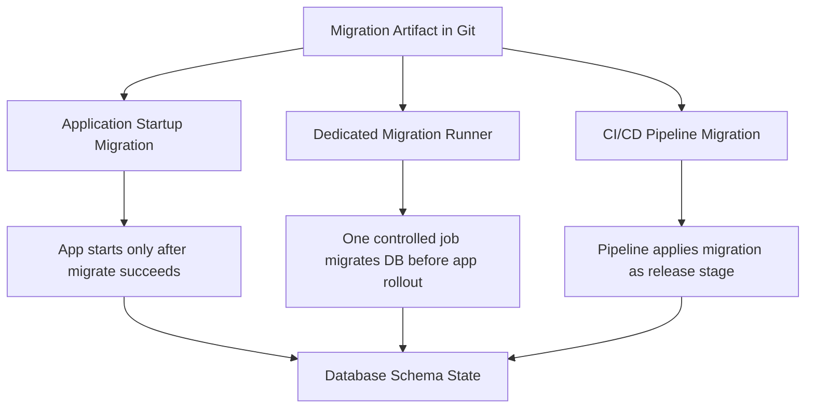
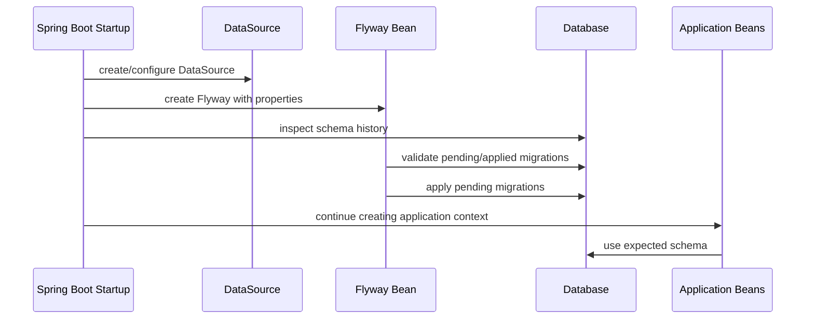
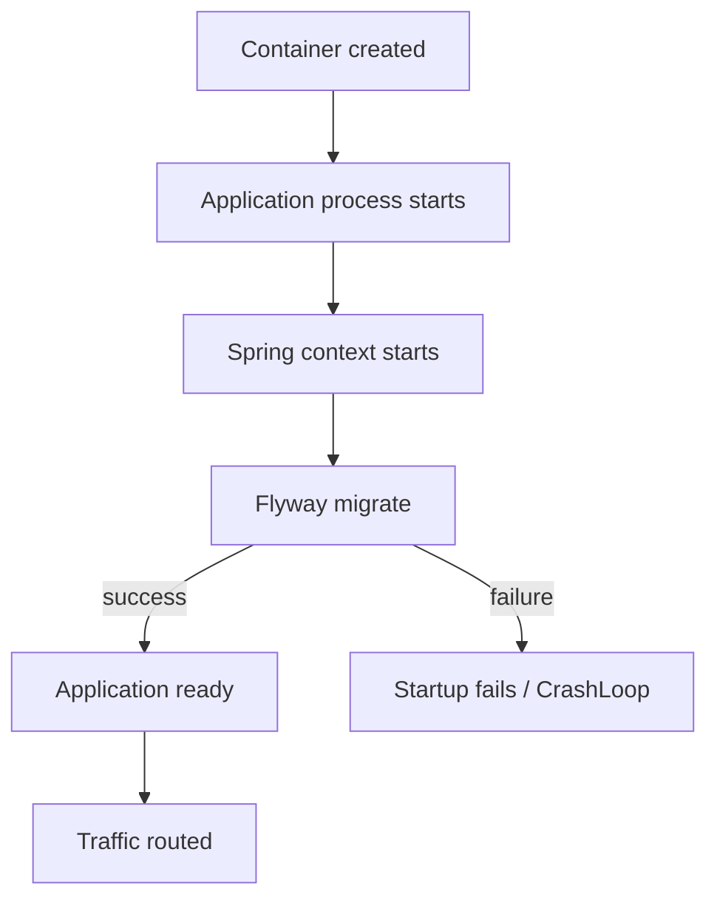
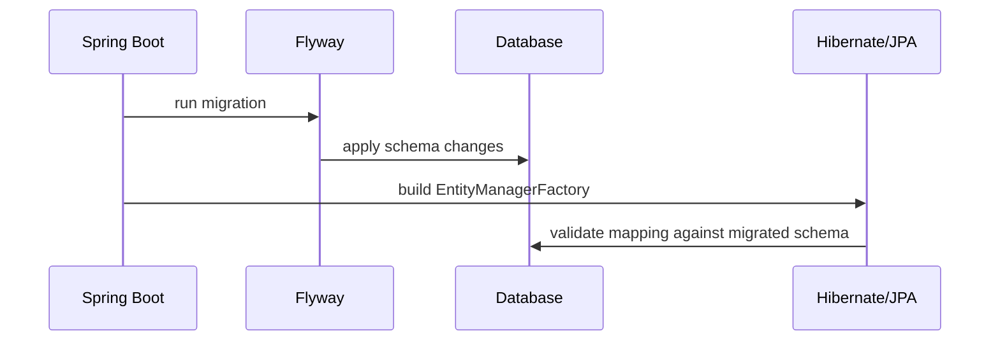
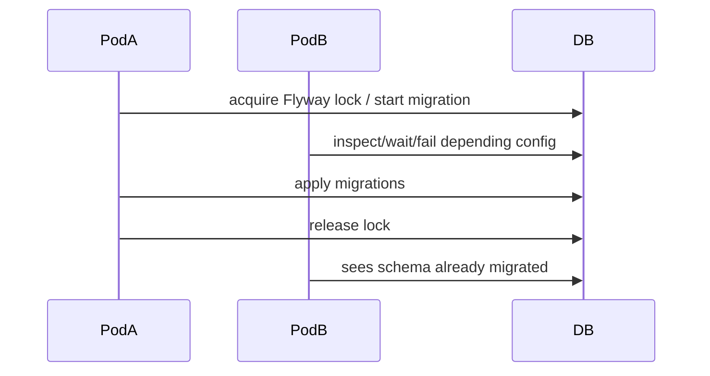
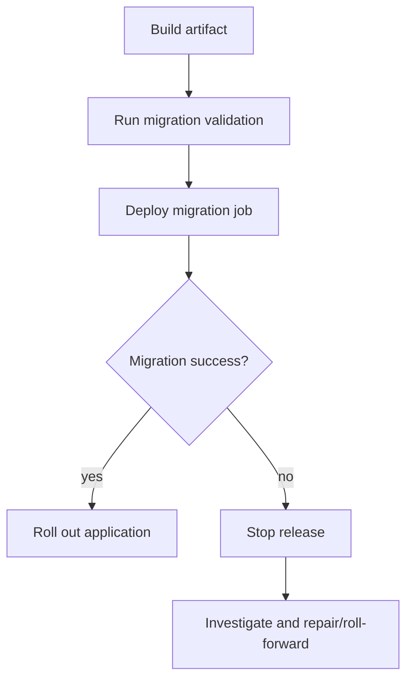
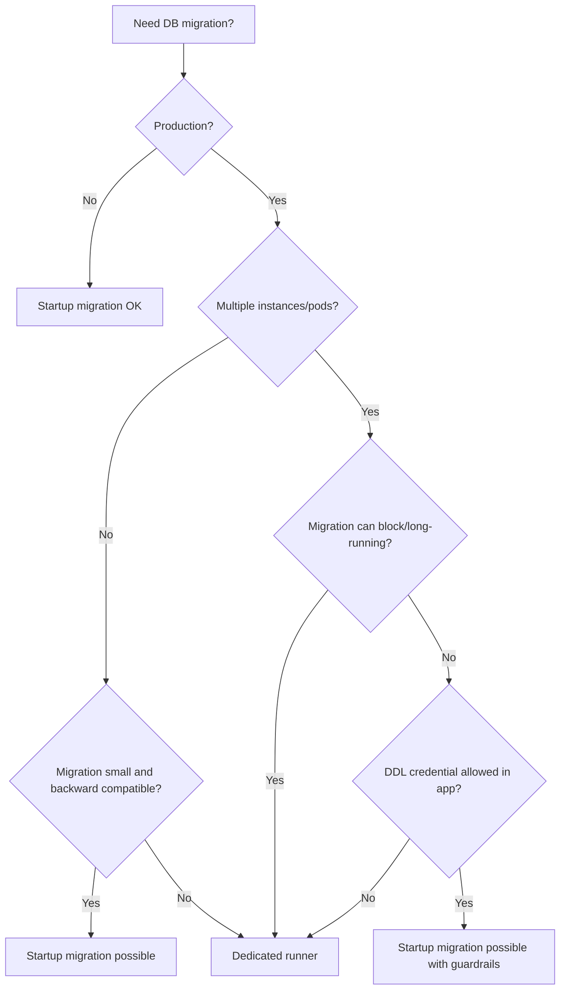

------
title: Learn Java Database Migrations, Flyway, Liquibase - Part 015
description: Flyway Java API dan Spring Boot integration secara production-grade, termasuk startup migration, dedicated runner, Java-based migration, multi-datasource, multi-tenant, readiness, dan failure modelling.
series: learn-java-database-migrations
seriesTitle: Learn Java Database Migrations, Flyway, Liquibase
order: 15
partTitle: Flyway Java API and Spring Boot Integration
tags:
  - java
  - database-migration
  - flyway
  - spring-boot
  - ci-cd
  - production
  - series
date: 2026-06-28
---

# Part 015 — Flyway Java API and Spring Boot Integration

## Tujuan Bagian Ini

Bagian ini membahas **bagaimana Flyway hidup di dalam ekosistem Java dan Spring Boot**.

Di level dasar, integrasi Flyway terlihat sederhana: tambahkan dependency, taruh file `V001__init.sql`, lalu aplikasi menjalankan migration saat startup. Tetapi di production, pertanyaan yang lebih penting adalah:

- apakah migration boleh berjalan di dalam lifecycle startup aplikasi?
- siapa yang memegang credential DDL?
- apa yang terjadi ketika 20 pod aplikasi naik bersamaan?
- bagaimana ordering migration dijaga terhadap JPA/Hibernate?
- bagaimana menangani multi-datasource, multi-schema, dan tenant migration?
- kapan Java-based migration masuk akal, dan kapan ia menjadi anti-pattern?
- bagaimana migration failure mempengaruhi readiness, rollback, dan deployment orchestration?

Flyway API resmi memungkinkan migration dipanggil dari Java code. Dokumentasi Flyway menempatkan integrasi API sebagai cara untuk memastikan database dimigrasikan sebelum application code yang bergantung pada schema baru berjalan. Spring Boot juga menyediakan integrasi otomatis jika Flyway tersedia di classpath. Tetapi kemampuan ini bukan berarti semua production migration harus selalu dijalankan saat aplikasi start.

Bagian ini membangun mental model agar kita dapat memilih execution model yang benar.

---

## Kaufman Deconstruction

Dalam kerangka Josh Kaufman, skill ini kita pecah menjadi beberapa sub-skill kecil yang bisa dilatih secara sengaja.

| Sub-skill | Yang Harus Dikuasai | Latihan Minimum |
|---|---|---|
| Execution model selection | Memilih startup migration, pipeline migration, atau dedicated runner | Buat decision table untuk 5 skenario release |
| Spring Boot integration | Memahami auto-configuration, properties, ordering, dan failure effect | Jalankan app dengan Flyway enabled/disabled/profile berbeda |
| Java API usage | Mengkonfigurasi dan menjalankan Flyway dari Java code | Buat command-line runner migration kecil |
| Java-based migration | Menulis migration imperative yang deterministic dan resumable | Buat migration backfill batch kecil dengan checkpoint |
| Multi-datasource | Memisahkan migration per database/schema | Simulasikan primary DB + audit DB |
| Cluster safety | Memahami lock, concurrent startup, dan readiness | Jalankan 3 instance app ke DB sama |
| Operational guardrail | Mencegah `clean`, credential misuse, dan accidental prod migration | Buat profile config prod-safe |
| Failure modelling | Menentukan apa yang terjadi saat migration gagal | Simulasikan SQL error di tengah deployment |

Target setelah part ini bukan hanya “bisa memakai Flyway dengan Spring Boot”, tetapi bisa menjawab:

> “Di sistem ini, migration harus dijalankan di mana, oleh siapa, kapan, dengan credential apa, dan dengan failure contract seperti apa?”

---

## 1. Tiga Execution Model Flyway di Sistem Java

Secara arsitektural, Flyway dapat dijalankan dengan tiga model utama.



### 1.1 Application Startup Migration

Migration dijalankan saat aplikasi Spring Boot start.

Cocok untuk:

- single instance application;
- internal service kecil;
- local development;
- test environment;
- migration ringan dan cepat;
- early-stage product;
- schema change yang selalu backward-compatible.

Risiko:

- setiap instance mencoba memulai migration;
- startup time menjadi tidak predictable;
- gagal migration berarti aplikasi tidak ready;
- DDL credential berada di runtime aplikasi;
- rolling deployment bisa terganggu jika migration lama atau blocking;
- observability migration sering tercampur dengan observability aplikasi.

### 1.2 Dedicated Migration Runner

Migration dijalankan oleh proses/job terpisah, misalnya Kubernetes Job, ECS task, Jenkins step, GitHub Actions job, atau internal deployment runner.

Cocok untuk:

- production workload;
- multi-instance application;
- regulated environment;
- migration yang membutuhkan approval;
- migration yang memakai credential berbeda dari application user;
- migration yang butuh observability dan timeout khusus;
- deployment yang harus memisahkan schema rollout dari app rollout.

Risiko:

- pipeline lebih kompleks;
- butuh orchestration dependency;
- perlu memastikan app tidak rollout sebelum migration sukses;
- perlu desain rollback/roll-forward yang eksplisit.

### 1.3 CI/CD Pipeline Migration

Migration dijalankan langsung sebagai stage pipeline menggunakan CLI, Maven/Gradle plugin, Docker image, atau Java API wrapper.

Cocok untuk:

- organisasi dengan release governance matang;
- audit-heavy environment;
- approval gate sebelum production;
- dry-run, report, dan promotion workflow;
- database deployment diperlakukan sebagai release artifact.

Risiko:

- pipeline credential perlu diamankan;
- network access pipeline ke database harus dikontrol;
- migration harus robust terhadap pipeline retry;
- perlu clean separation antara build validation dan production apply.

### Rule of Thumb

| Kondisi | Model Yang Lebih Aman |
|---|---|
| Local/dev/test | Startup migration |
| Single small app | Startup migration boleh |
| Production multi-pod | Dedicated runner atau pipeline |
| Regulated system | Dedicated runner/pipeline dengan audit trail |
| Migration DDL cepat dan additive | Startup masih mungkin |
| Migration besar/backfill | Dedicated runner |
| Tenant fan-out | Dedicated runner |
| Butuh approval DBA | Pipeline/dedicated runner |
| App user tidak boleh punya DDL | Dedicated runner/pipeline |

---

## 2. Spring Boot Auto-Configuration: Mental Model

Spring Boot mendukung Flyway sebagai high-level migration tool. Ketika Flyway dependency tersedia dan konfigurasi datasource lengkap, Boot dapat membuat bean Flyway dan menjalankan migration saat startup.

Mental model-nya:



Konsekuensi penting:

1. Migration menjadi bagian dari startup path.
2. Jika migration gagal, application context dapat gagal start.
3. Schema harus kompatibel dengan code yang akan dijalankan setelahnya.
4. Ordering dengan Hibernate/JPA harus dikontrol.
5. Observability startup harus bisa membedakan “app bug” vs “migration failure”.

Spring Boot juga menyarankan tidak mencampur schema initialization sederhana (`schema.sql`/`data.sql`) dengan migration tool seperti Flyway atau Liquibase untuk mengelola schema. Dalam sistem serius, satu mekanisme harus menjadi source of truth schema evolution.

---

## 3. Dependency dan Modul Database

Contoh Maven umum:

```xml
<dependencies>
    <dependency>
        <groupId>org.springframework.boot</groupId>
        <artifactId>spring-boot-starter-jdbc</artifactId>
    </dependency>

    <dependency>
        <groupId>org.flywaydb</groupId>
        <artifactId>flyway-core</artifactId>
    </dependency>

    <!-- Contoh PostgreSQL support module jika dibutuhkan oleh versi Flyway/Spring Boot yang dipakai -->
    <dependency>
        <groupId>org.flywaydb</groupId>
        <artifactId>flyway-database-postgresql</artifactId>
    </dependency>

    <dependency>
        <groupId>org.postgresql</groupId>
        <artifactId>postgresql</artifactId>
        <scope>runtime</scope>
    </dependency>
</dependencies>
```

Contoh Gradle:

```kotlin
dependencies {
    implementation("org.springframework.boot:spring-boot-starter-jdbc")
    implementation("org.flywaydb:flyway-core")
    implementation("org.flywaydb:flyway-database-postgresql")
    runtimeOnly("org.postgresql:postgresql")
}
```

Catatan desain:

- jangan menganggap `flyway-core` otomatis cukup untuk semua database di semua versi tool;
- ikuti kompatibilitas Spring Boot BOM dan Flyway version;
- jangan override versi Flyway sembarangan tanpa membaca release notes;
- treat migration tool upgrade sebagai infrastructure change, bukan dependency bump biasa.

---

## 4. Konfigurasi Spring Boot yang Production-Friendly

Contoh dasar:

```yaml
spring:
  datasource:
    url: jdbc:postgresql://localhost:5432/orders
    username: app_user
    password: app_password

  flyway:
    enabled: true
    locations: classpath:db/migration
    default-schema: public
    schemas: public
    table: flyway_schema_history
    baseline-on-migrate: false
    clean-disabled: true
    validate-on-migrate: true
```

Untuk production, ada satu isu besar: **application datasource credential sering tidak seharusnya sama dengan migration credential**.

Contoh pemisahan:

```yaml
spring:
  datasource:
    url: jdbc:postgresql://prod-db:5432/orders
    username: orders_app_user
    password: ${APP_DB_PASSWORD}

  flyway:
    enabled: true
    url: jdbc:postgresql://prod-db:5432/orders
    user: orders_migration_user
    password: ${MIGRATION_DB_PASSWORD}
    locations: classpath:db/migration
    clean-disabled: true
    validate-on-migrate: true
```

Pemisahan credential memberi boundary:

| Principal | Privilege |
|---|---|
| `orders_app_user` | DML terbatas sesuai kebutuhan aplikasi |
| `orders_migration_user` | DDL/DCL terbatas untuk migration |
| DBA/admin | emergency only, audited |

Anti-pattern:

```yaml
spring:
  datasource:
    username: postgres
    password: ${SUPERUSER_PASSWORD}
```

Jika aplikasi production berjalan sebagai superuser database, maka bug aplikasi, SQL injection, atau salah konfigurasi dapat memiliki blast radius penuh.

---

## 5. Startup Migration vs Readiness

Dalam Kubernetes atau platform orchestration modern, aplikasi biasanya memiliki lifecycle:



Jika Flyway berjalan saat startup:

- readiness probe tidak boleh hijau sebelum migration selesai;
- liveness probe tidak boleh membunuh proses terlalu cepat ketika migration valid tetapi lama;
- startup probe perlu timeout realistis;
- deployment controller harus menangani failure tanpa memperparah lock contention.

Contoh failure buruk:

1. Pod A mulai migration dan memegang lock.
2. Pod B, C, D ikut start dan menunggu/menekan database.
3. Liveness probe terlalu agresif membunuh Pod A.
4. Lock/transaction berada dalam state tidak jelas tergantung database/tool behavior.
5. Deployment masuk CrashLoop dan database tetap dalam kondisi partially changed.

Production rule:

> Untuk migration yang bisa memakan waktu lama, jangan jalankan sebagai side effect startup semua pod aplikasi.

Gunakan dedicated migration job sebelum rollout aplikasi.

---

## 6. Java API Dasar

Flyway Java API dapat dipakai untuk membuat runner sendiri.

Contoh minimal:

```java
import org.flywaydb.core.Flyway;

public class MigrationRunner {
    public static void main(String[] args) {
        Flyway flyway = Flyway.configure()
            .dataSource(
                System.getenv("DB_URL"),
                System.getenv("DB_USER"),
                System.getenv("DB_PASSWORD")
            )
            .locations("classpath:db/migration")
            .cleanDisabled(true)
            .validateOnMigrate(true)
            .load();

        flyway.migrate();
    }
}
```

Ini sederhana, tetapi untuk production runner perlu ditambah:

- explicit environment name;
- logging structured;
- timeout;
- `info()` sebelum `migrate()`;
- validation gate;
- metric/event output;
- safe exit code;
- restricted command mode;
- no `clean()` exposed;
- no `repair()` otomatis.

Contoh runner lebih eksplisit:

```java
import org.flywaydb.core.Flyway;
import org.flywaydb.core.api.MigrationInfo;
import org.flywaydb.core.api.output.MigrateResult;

public final class SafeFlywayRunner {

    public static void main(String[] args) {
        String environment = requiredEnv("ENVIRONMENT");
        String dbUrl = requiredEnv("DB_URL");
        String dbUser = requiredEnv("DB_USER");
        String dbPassword = requiredEnv("DB_PASSWORD");

        if ("production".equals(environment) && dbUser.equalsIgnoreCase("postgres")) {
            throw new IllegalStateException("Refusing to run production migration as superuser");
        }

        Flyway flyway = Flyway.configure()
            .dataSource(dbUrl, dbUser, dbPassword)
            .locations("classpath:db/migration")
            .table("flyway_schema_history")
            .cleanDisabled(true)
            .validateOnMigrate(true)
            .baselineOnMigrate(false)
            .load();

        System.out.println("Validating migration set...");
        flyway.validate();

        for (MigrationInfo info : flyway.info().pending()) {
            System.out.printf(
                "Pending migration: version=%s description=%s type=%s%n",
                info.getVersion(),
                info.getDescription(),
                info.getType()
            );
        }

        MigrateResult result = flyway.migrate();

        System.out.printf(
            "Migration complete: migrationsExecuted=%d targetSchemaVersion=%s%n",
            result.migrationsExecuted,
            result.targetSchemaVersion
        );
    }

    private static String requiredEnv(String key) {
        String value = System.getenv(key);
        if (value == null || value.isBlank()) {
            throw new IllegalArgumentException("Missing required env var: " + key);
        }
        return value;
    }
}
```

### Kenapa Runner Sendiri Berguna?

Runner sendiri berguna ketika organisasi butuh:

- policy guardrail;
- custom logging;
- deployment metadata;
- audit evidence;
- integration dengan approval system;
- consistent behavior across service;
- fail-fast safety check sebelum migration;
- command restriction di production.

Namun runner sendiri juga menjadi software yang harus dipelihara. Jangan membuat abstraction terlalu besar sampai menutupi model Flyway asli.

---

## 7. Java-Based Migration

Flyway mendukung Java-based migration. Java migration harus mengimplementasikan `JavaMigration`, dan secara umum lebih nyaman extend `BaseJavaMigration` agar mengikuti naming convention Flyway.

Contoh:

```java
package db.migration;

import org.flywaydb.core.api.migration.BaseJavaMigration;
import org.flywaydb.core.api.migration.Context;

import java.sql.PreparedStatement;
import java.sql.ResultSet;

public class V202606280930__Backfill_customer_risk_level extends BaseJavaMigration {

    private static final int BATCH_SIZE = 500;

    @Override
    public void migrate(Context context) throws Exception {
        try (PreparedStatement select = context.getConnection().prepareStatement("""
                select id
                from customer
                where risk_level is null
                order by id
                limit ?
                """);
             PreparedStatement update = context.getConnection().prepareStatement("""
                update customer
                set risk_level = 'STANDARD'
                where id = ?
                """)) {

            while (true) {
                select.setInt(1, BATCH_SIZE);

                int count = 0;
                try (ResultSet rs = select.executeQuery()) {
                    while (rs.next()) {
                        update.setLong(1, rs.getLong("id"));
                        update.addBatch();
                        count++;
                    }
                }

                if (count == 0) {
                    return;
                }

                update.executeBatch();
            }
        }
    }
}
```

### Kapan Java Migration Masuk Akal?

Gunakan Java migration ketika migration butuh:

- procedural logic yang sulit diekspresikan aman di SQL;
- batch processing dengan checkpoint;
- transformasi data yang memakai library Java;
- akses ke format data kompleks;
- kontrol retry/resume lebih eksplisit;
- validasi domain yang sudah tersedia di Java library stabil.

Jangan gunakan Java migration untuk:

- DDL sederhana;
- `CREATE TABLE`, `ALTER TABLE`, `CREATE INDEX` biasa;
- logic yang bisa jelas direview sebagai SQL;
- memanggil service eksternal;
- side effect non-database;
- dependency injection besar-besaran;
- migration yang berubah mengikuti business service code terbaru.

### Risiko Java Migration

Java migration punya coupling ke:

- classpath;
- dependency version;
- Java runtime;
- compiled artifact;
- package naming;
- build reproducibility.

SQL migration lebih mudah diaudit sebagai artifact statis. Java migration harus diperlakukan sebagai **program production sekali pakai** yang tetap butuh test, review, observability, dan rollback/roll-forward strategy.

---

## 8. Java Migration dan Spring Beans

Dalam Spring, kadang kita ingin migration class memakai bean seperti `JdbcTemplate`, mapper ringan, atau utility yang sudah tersedia. Flyway API menyediakan mekanisme untuk melewatkan Java migration yang sudah diinstansiasi.

Namun hati-hati: semakin banyak dependency Spring yang masuk ke migration, semakin besar risiko migration tidak lagi menjadi artifact stabil.

Contoh konfigurasi konseptual:

```java
import org.flywaydb.core.Flyway;
import org.flywaydb.core.api.migration.JavaMigration;
import org.springframework.boot.autoconfigure.flyway.FlywayMigrationStrategy;
import org.springframework.context.annotation.Bean;
import org.springframework.context.annotation.Configuration;

import javax.sql.DataSource;
import java.util.List;

@Configuration
class FlywayConfiguration {

    @Bean
    FlywayMigrationStrategy migrationStrategy(List<JavaMigration> javaMigrations) {
        return flyway -> {
            // Example only: in real systems, avoid changing core behavior casually.
            flyway.validate();
            flyway.migrate();
        };
    }

    @Bean
    Flyway customFlyway(DataSource dataSource, List<JavaMigration> javaMigrations) {
        return Flyway.configure()
            .dataSource(dataSource)
            .locations("classpath:db/migration")
            .javaMigrations(javaMigrations.toArray(JavaMigration[]::new))
            .cleanDisabled(true)
            .load();
    }
}
```

Catatan:

- Jangan membuat migration bergantung pada repository JPA.
- Jangan memakai transactional service layer untuk migration schema.
- Jangan memanggil business service yang berubah dari release ke release.
- Gunakan `JdbcTemplate` atau JDBC low-level jika butuh bantuan Spring.
- Pertahankan migration logic dekat dengan database operation, bukan business workflow.

Anti-pattern:

```java
@Component
public class V42__Backfill_order_status extends BaseJavaMigration {

    private final OrderService orderService;

    public V42__Backfill_order_status(OrderService orderService) {
        this.orderService = orderService;
    }

    @Override
    public void migrate(Context context) {
        orderService.recalculateAllOrders();
    }
}
```

Masalah:

- `OrderService` mungkin memakai schema baru yang belum siap;
- service method bisa berubah di masa depan;
- side effect bisa luas;
- test migration menjadi tidak stabil;
- migration history bergantung pada runtime behavior yang tidak eksplisit.

---

## 9. Ordering dengan JPA/Hibernate

Jika aplikasi memakai JPA/Hibernate, prinsipnya:

> Migration tool adalah pemilik schema evolution. Hibernate tidak boleh menjadi pemilik DDL production.

Konfigurasi production yang aman:

```yaml
spring:
  jpa:
    hibernate:
      ddl-auto: validate
```

Atau:

```yaml
spring:
  jpa:
    hibernate:
      ddl-auto: none
```

`ddl-auto=update` di production adalah anti-pattern karena:

- perubahan schema dihasilkan dari model runtime, bukan migration artifact;
- sulit direview;
- sulit diaudit;
- tidak mendokumentasikan intent;
- dapat berbeda antar-environment;
- tidak memaksa expand/contract discipline;
- tidak punya rollback/roll-forward story yang jelas.

### Boot Order

Idealnya:



Jika Hibernate mencoba membuat/ubah schema sebelum Flyway, source of truth menjadi kabur.

---

## 10. Multi-Datasource Integration

Tidak semua aplikasi hanya punya satu database. Contoh:

- primary transactional DB;
- audit DB;
- reporting DB;
- workflow DB;
- tenant DB;
- legacy DB.

Spring Boot auto-configuration biasanya menangani satu primary Flyway configuration dengan mudah. Untuk multi-datasource, kita sering perlu membuat bean Flyway eksplisit.

Contoh konseptual:

```java
@Configuration
class MultiDatabaseFlywayConfig {

    @Bean(initMethod = "migrate")
    Flyway ordersFlyway(@Qualifier("ordersDataSource") DataSource dataSource) {
        return Flyway.configure()
            .dataSource(dataSource)
            .locations("classpath:db/migration/orders")
            .table("flyway_schema_history")
            .cleanDisabled(true)
            .load();
    }

    @Bean(initMethod = "migrate")
    Flyway auditFlyway(@Qualifier("auditDataSource") DataSource dataSource) {
        return Flyway.configure()
            .dataSource(dataSource)
            .locations("classpath:db/migration/audit")
            .table("flyway_schema_history")
            .cleanDisabled(true)
            .load();
    }
}
```

Pertanyaan desain:

| Pertanyaan | Dampak |
|---|---|
| Apakah DB harus dimigrasikan dalam satu release stage? | Release ordering |
| Apakah failure audit DB harus menggagalkan app? | Availability vs consistency |
| Apakah history table per DB atau shared? | Traceability |
| Apakah credential berbeda? | Security boundary |
| Apakah migration saling bergantung? | Coupling risk |

Rule:

> Jika dua database membutuhkan migration yang saling tergantung secara atomik, desain sistemnya perlu ditinjau ulang. Cross-database schema migration jarang benar-benar atomic.

---

## 11. Multi-Schema

Flyway dapat dikonfigurasi dengan `schemas`, `defaultSchema`, dan `table`. Namun multi-schema bukan hanya konfigurasi. Ini adalah ownership model.

Contoh:

```yaml
spring:
  flyway:
    default-schema: app_core
    schemas:
      - app_core
      - app_audit
    table: flyway_schema_history
    locations:
      - classpath:db/migration/core
      - classpath:db/migration/audit
```

Decision point:

- satu history table untuk beberapa schema;
- history table per schema;
- satu migration stream untuk semua schema;
- migration stream terpisah per bounded context.

### Satu History Table

Kelebihan:

- ordering global jelas;
- satu ledger deployment;
- lebih sederhana untuk satu aplikasi.

Kekurangan:

- coupling antar-schema;
- sulit partial migration;
- konflik jika schema dimiliki tim berbeda.

### History Table Per Schema

Kelebihan:

- ownership lebih jelas;
- independent release;
- cocok untuk modular monolith besar.

Kekurangan:

- orchestration lebih kompleks;
- dependency antar-schema harus eksplisit;
- visibility global berkurang.

---

## 12. Multi-Tenant Migration

Multi-tenant adalah salah satu area paling sering gagal karena migration yang aman untuk satu schema belum tentu aman untuk ribuan tenant.

Model umum:

| Model Tenant | Migration Challenge |
|---|---|
| Shared schema | Migration tunggal, data isolation logical |
| Schema per tenant | Fan-out migration, partial failure |
| Database per tenant | Credential, network, version skew |
| Hybrid | Semua masalah di atas |

Contoh runner fan-out konseptual:

```java
public final class TenantMigrationRunner {

    public void migrateAllTenants(List<Tenant> tenants) {
        for (Tenant tenant : tenants) {
            try {
                migrateTenant(tenant);
                markTenantSuccess(tenant);
            } catch (Exception ex) {
                markTenantFailed(tenant, ex);
                // Do not hide partial failure.
                // Decide whether to continue based on release policy.
            }
        }
    }

    private void migrateTenant(Tenant tenant) {
        Flyway flyway = Flyway.configure()
            .dataSource(tenant.jdbcUrl(), tenant.migrationUser(), tenant.migrationPassword())
            .locations("classpath:db/migration/tenant")
            .table("flyway_schema_history")
            .cleanDisabled(true)
            .load();

        flyway.validate();
        flyway.migrate();
    }
}
```

Production tenant migration membutuhkan:

- tenant migration status table;
- per-tenant timeout;
- retry policy;
- version skew handling;
- tenant allowlist/canary;
- stop threshold;
- resumability;
- reporting;
- per-tenant audit evidence.

Anti-pattern:

```java
for (Tenant tenant : tenants) {
    flywayFor(tenant).migrate();
}
System.out.println("All good");
```

Tanpa tracking, partial failure akan hilang sebagai log noise.

---

## 13. Concurrency dan Locking saat Startup Banyak Instance

Flyway memiliki mekanisme untuk mencegah dua migration berjalan merusak satu sama lain pada database yang sama. Namun lock bukan alasan untuk membiarkan semua pod melakukan startup migration tanpa desain.



Risiko yang tetap ada:

- semua pod menambah connection pressure;
- startup timeout;
- log noise;
- crash loop;
- migration yang lama memblokir rollout;
- lock wait tidak sama dengan deployment coordination;
- failure recovery menjadi lebih sulit.

Guideline:

| Deployment Shape | Saran |
|---|---|
| 1 instance | Startup migration OK |
| 2-3 instance internal | Startup migration dengan timeout cukup mungkin |
| 10+ pod production | Dedicated migration job lebih aman |
| auto-scaling agresif | Jangan startup migration untuk DDL besar |
| multi-region active-active | Perlu migration orchestration eksplisit |

---

## 14. Application Startup Migration Strategy di Spring Boot

Spring Boot menyediakan hook seperti `FlywayMigrationStrategy` untuk mengubah perilaku migration.

Contoh: skip migration di runtime app karena migration dijalankan pipeline.

```yaml
spring:
  flyway:
    enabled: false
```

Lalu migration dijalankan oleh job terpisah.

Contoh: custom strategy untuk logging:

```java
@Configuration
class FlywayStrategyConfig {

    @Bean
    FlywayMigrationStrategy flywayMigrationStrategy() {
        return flyway -> {
            System.out.println("Starting Flyway validation");
            flyway.validate();

            System.out.println("Starting Flyway migration");
            flyway.migrate();

            System.out.println("Flyway migration completed");
        };
    }
}
```

Jangan gunakan strategy untuk:

- otomatis `repair()` saat validation error;
- otomatis `clean()`;
- suppress exception agar app tetap start pada schema tidak cocok;
- menjalankan business backfill besar tanpa observability.

Anti-pattern:

```java
@Bean
FlywayMigrationStrategy dangerousStrategy() {
    return flyway -> {
        try {
            flyway.migrate();
        } catch (Exception ignored) {
            // Let app start anyway
        }
    };
}
```

Ini merusak invariant terpenting:

> Aplikasi hanya boleh menerima traffic jika schema compatible dengan code yang berjalan.

---

## 15. Actuator dan Observability

Spring Boot Actuator menyediakan endpoint Flyway yang dapat menampilkan informasi migration yang sudah dilakukan jika actuator dan endpoint terkait diaktifkan.

Namun di production, hati-hati expose detail migration:

- migration name bisa mengandung domain sensitif;
- version bisa mengungkap release cadence;
- error detail bisa mengungkap struktur database;
- endpoint harus diamankan.

Observability yang berguna:

| Signal | Makna |
|---|---|
| migration start time | kapan perubahan schema dimulai |
| migration duration | risiko lock/slow DDL |
| migration count executed | apakah ada pending change |
| target version | versi schema setelah migration |
| failed migration | release blocker |
| validation error | artifact/history mismatch |
| lock wait time | concurrency/deployment issue |
| DB lock/blocking sessions | production risk |

Structured event contoh:

```json
{
  "event": "database_migration_completed",
  "service": "orders-service",
  "environment": "production",
  "tool": "flyway",
  "schema": "public",
  "migrationsExecuted": 2,
  "targetVersion": "202606280930",
  "durationMs": 8421,
  "deploymentId": "deploy-2026-06-28-001"
}
```

---

## 16. Failure Model Spring Boot + Flyway

| Failure | Startup Migration Effect | Dedicated Runner Effect | Recovery |
|---|---|---|---|
| SQL syntax error | App fails start | Job fails before rollout | Fix new migration, rerun |
| Checksum mismatch | App fails validation | Job fails validation | Investigate artifact/history; repair only with evidence |
| Lock timeout | App may fail start | Job fails controlled | Find blocker, rerun |
| Long migration | App not ready | Job long-running | Prefer runner with timeout/reporting |
| Partial DDL | App may crash loop | Job fails controlled | Manual inspect, roll-forward/repair |
| Credential failure | App fails start | Job fails before rollout | Fix secret/privilege |
| Wrong location | App may think no pending migration | Job same | Validate expected pending version in CI |
| Hibernate mismatch | App fails after migration | App rollout fails | Fix entity/schema compatibility |

Key lesson:

> Migration failure should stop an unsafe deployment, but it should fail in the most observable and recoverable place.

Untuk production besar, tempat paling recoverable biasanya bukan startup path aplikasi utama.

---

## 17. Production Deployment Patterns

### Pattern A — Local/Dev Startup Migration

```yaml
spring:
  flyway:
    enabled: true
```

Cocok untuk developer feedback cepat.

### Pattern B — Testcontainers Integration Test

```java
@Testcontainers
@SpringBootTest
class MigrationIntegrationTest {
    // Start fresh database
    // Boot app
    // Assert Flyway migrates from empty schema
    // Assert JPA mappings validate
}
```

Validasi:

- migration from scratch;
- mapping compatibility;
- repeatable scripts;
- seed/reference data.

### Pattern C — Production Dedicated Job



Spring Boot app production:

```yaml
spring:
  flyway:
    enabled: false
```

Migration job uses same artifact or dedicated migration image.

### Pattern D — Startup Validation Only

Kadang production app tidak menjalankan migration, tetapi tetap melakukan schema validation. Flyway sendiri umumnya menjalankan validate dalam migration flow, tetapi application-level schema compatibility juga bisa divalidasi lewat Hibernate `ddl-auto=validate` atau explicit startup check.

Tujuannya:

- app tidak mengubah schema;
- app menolak start jika schema belum compatible.

---

## 18. Designing a Dedicated Migration Module

Dalam multi-module Java project:

```text
orders-platform/
  orders-app/
    src/main/java/...
  orders-domain/
    src/main/java/...
  orders-migration-runner/
    src/main/java/com/acme/orders/migration/SafeFlywayRunner.java
    src/main/resources/db/migration/
      V202606280900__create_order_table.sql
      V202606280930__add_order_status.sql
```

Kelebihan:

- migration artifact dapat dijalankan tanpa start seluruh aplikasi;
- dependency runtime lebih kecil;
- credential bisa dipisah;
- pipeline jelas;
- observability migration terpisah.

Runner module sebaiknya tidak bergantung pada:

- web layer;
- messaging consumer;
- scheduler;
- business service;
- JPA entity model yang volatile;
- external service clients.

---

## 19. Migration Artifact Compatibility dengan Release

Satu masalah klasik:

- artifact app versi baru membawa migration baru;
- migration dijalankan dari artifact yang sama;
- app baru belum boleh menerima traffic sebelum migration selesai;
- old app masih berjalan saat migration diterapkan.

Maka migration harus mengikuti expand/contract.

Contoh:

| Release | Migration | App Behavior |
|---|---|---|
| R1 | Add nullable `risk_level` | Old app ignores column |
| R2 | New app writes `risk_level` | New app compatible with nullable existing data |
| R3 | Backfill all rows | Both app versions OK |
| R4 | Add NOT NULL constraint | Only after all app versions write column |
| R5 | Remove legacy fallback | Contract phase |

Flyway/Spring integration tidak menggantikan compatibility design.

---

## 20. Checklist: Flyway Spring Boot Production Readiness

### Configuration

- [ ] `cleanDisabled=true` in all non-local environments.
- [ ] `baselineOnMigrate=false` unless onboarding existing DB intentionally.
- [ ] Migration locations explicit.
- [ ] History table name/schema explicit.
- [ ] DDL credential separated from application credential when possible.
- [ ] Hibernate `ddl-auto` not set to `update` in production.
- [ ] `schema.sql`/`data.sql` not mixed as schema source of truth.

### Execution

- [ ] Production execution model chosen explicitly.
- [ ] Long-running migration not executed by every app pod.
- [ ] Startup/readiness/liveness timeout considered.
- [ ] Migration job logs structured event.
- [ ] Pipeline stops on validation failure.
- [ ] Pending migration visible before apply.

### Code

- [ ] Java migration used only when SQL is insufficient.
- [ ] Java migration deterministic and testable.
- [ ] No business service call inside migration.
- [ ] No external API call inside migration.
- [ ] Batch migration has checkpoint/resume if large.

### Recovery

- [ ] Failed migration playbook exists.
- [ ] `repair` is manual and audited.
- [ ] Partial DDL inspection steps documented.
- [ ] Roll-forward migration strategy preferred.
- [ ] Production access boundary clear.

---

## 21. Decision Framework

Gunakan pertanyaan berikut sebelum memilih integrasi:



Dalam regulated atau high-availability system, default yang lebih aman:

> Build artifact membawa migration, pipeline/dedicated runner menerapkan migration, aplikasi melakukan compatibility validation, dan runtime app tidak memegang destructive DDL capability.

---

## 22. Exercises

### Exercise 1 — Startup vs Dedicated Runner

Ambil satu service yang memiliki 5 pod production. Ada migration:

```sql
alter table orders add column fraud_score numeric(5,2);
```

Jawab:

1. Apakah aman dijalankan saat startup semua pod?
2. Apakah old app compatible?
3. Apakah new app membutuhkan column ini wajib ada?
4. Apakah column nullable?
5. Apa failure mode jika migration gagal?

### Exercise 2 — Java Migration Review

Review pseudo-code ini:

```java
public void migrate(Context context) {
    List<Order> orders = orderRepository.findAll();
    for (Order order : orders) {
        pricingService.recalculate(order);
        orderRepository.save(order);
    }
}
```

Cari minimal 8 masalah.

Expected findings:

- memakai repository JPA;
- memakai service bisnis;
- mungkin load seluruh table ke memory;
- tidak resumable;
- side effect pricing tidak eksplisit;
- tergantung schema/entity terbaru;
- transaction boundary tidak jelas;
- tidak ada batching;
- tidak ada checkpoint;
- tidak ada observability;
- tidak deterministic jika pricing rule berubah.

### Exercise 3 — Multi-Tenant Failure Policy

Ada 2.000 tenant schema. Migration tenant ke-351 gagal karena constraint lama. Tentukan:

- continue atau stop?
- bagaimana menandai tenant failed?
- apakah tenant 1-350 boleh menerima traffic versi baru?
- bagaimana app menangani tenant version skew?
- bagaimana retry dilakukan?

---

## 23. Common Anti-Patterns

| Anti-pattern | Mengapa Berbahaya | Alternatif |
|---|---|---|
| Flyway startup migration di semua pod production tanpa analisis | Lock, timeout, crash loop | Dedicated migration job |
| App memakai superuser DB | Blast radius besar | Separate migration user |
| `ddl-auto=update` bersama Flyway | Dua source of truth | `validate`/`none` |
| Java migration memanggil service bisnis | Coupling dan non-determinism | JDBC-focused migration |
| Auto repair saat startup | Menutupi corruption/drift | Manual audited repair |
| Suppress migration exception | App menerima traffic dengan schema salah | Fail fast |
| Environment-specific migration branching liar | State tidak reproducible | Config explicit, artifact sama |
| Long backfill dalam satu transaction startup | Lock/log pressure | Batch/resumable runner |
| Multi-tenant migration tanpa status table | Partial failure tidak terlihat | Tenant migration ledger |

---

## 24. Ringkasan

Flyway Java API dan Spring Boot integration sangat kuat karena membuat database evolution menjadi bagian dari lifecycle Java application. Tetapi kekuatan ini harus dikendalikan.

Mental model utama:

1. Flyway bukan sekadar library startup; ia adalah coordinator state transition database.
2. Spring Boot auto-run cocok untuk feedback cepat, tetapi production besar sering membutuhkan runner terpisah.
3. Java migration berguna untuk transformasi imperative, tetapi harus deterministic, minimal dependency, dan observable.
4. Migration credential sebaiknya dipisahkan dari application credential.
5. Hibernate tidak boleh menjadi schema migration engine production jika Flyway adalah source of truth.
6. Multi-datasource, multi-schema, dan multi-tenant migration adalah orchestration problem, bukan hanya property configuration.
7. Failure migration harus menghentikan unsafe release di tempat yang paling mudah diamati dan dipulihkan.

Di part berikutnya, kita mulai masuk ke **Liquibase Core Model**: changelog, changeset, change type, tracking table, lock table, checksum, dan cara Liquibase memodelkan database change secara berbeda dari Flyway.

---

## References

- Redgate Flyway Documentation — Java API: https://documentation.red-gate.com/fd/api-java-277579358.html
- Redgate Flyway Documentation — API Hooks: https://documentation.red-gate.com/fd/api-hooks-277579366.html
- Redgate Flyway Documentation — Java-based Migrations: https://documentation.red-gate.com/fd/java-based-migrations-273973387.html
- Spring Boot Documentation — Database Initialization: https://docs.spring.io/spring-boot/how-to/data-initialization.html
- Spring Boot Actuator API — Flyway Endpoint: https://docs.spring.io/spring-boot/api/rest/actuator/flyway.html
