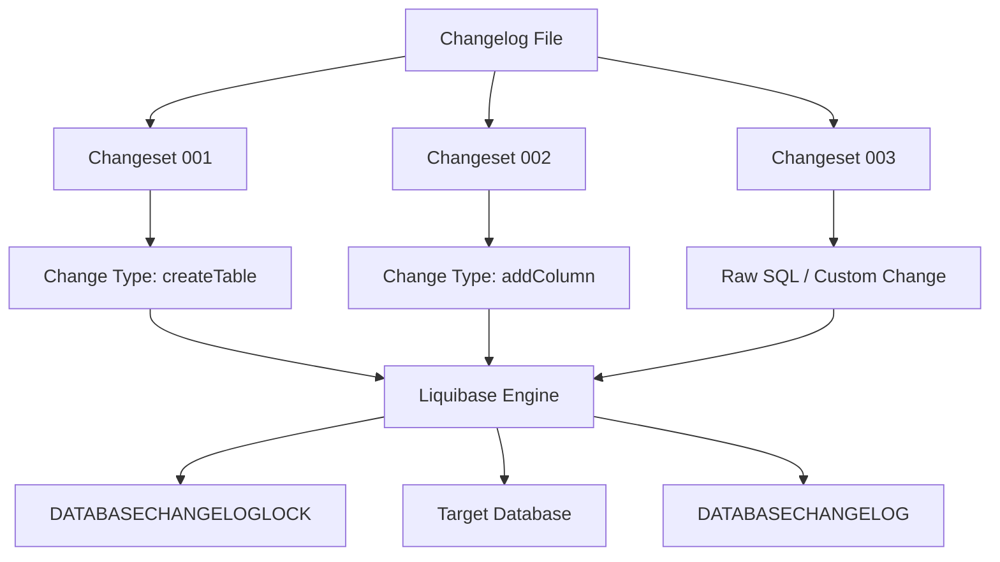
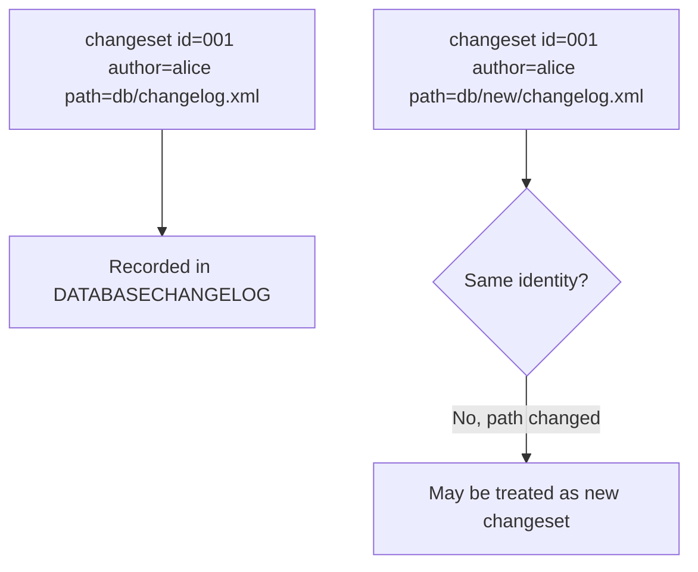
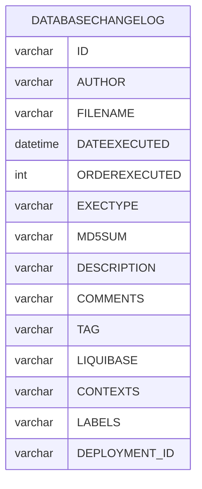
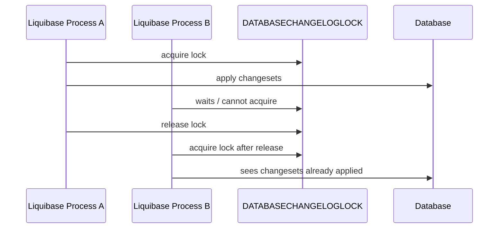
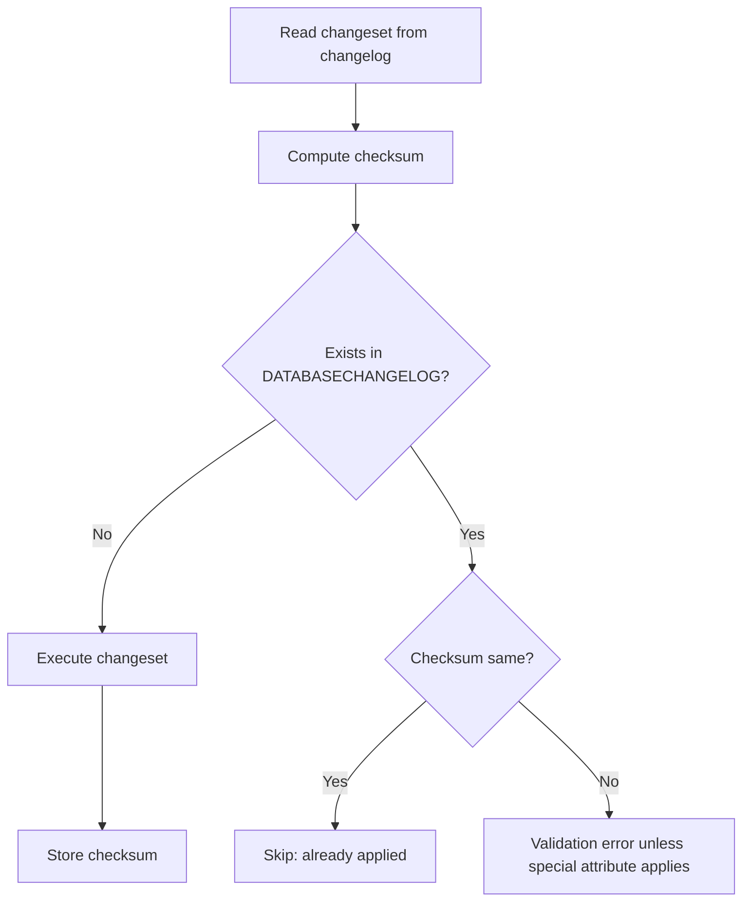
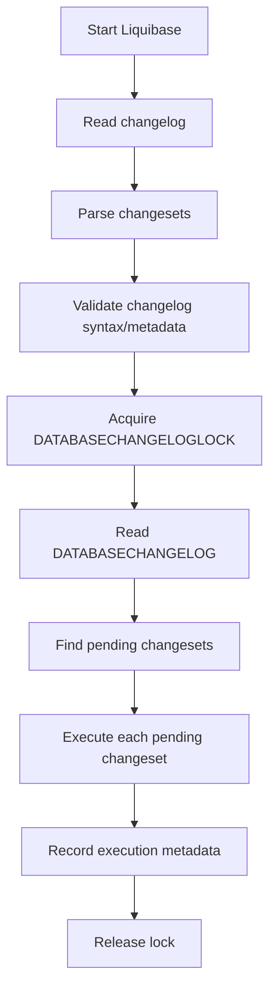
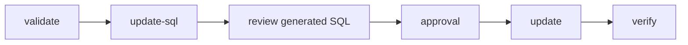

------
title: Learn Java Database Migrations, Flyway, Liquibase - Part 016
description: Liquibase core model secara mendalam, termasuk changelog, changeset identity, change type, checksum, DATABASECHANGELOG, DATABASECHANGELOGLOCK, execution flow, dan mental model berbeda dari Flyway.
series: learn-java-database-migrations
seriesTitle: Learn Java Database Migrations, Flyway, Liquibase
order: 16
partTitle: Liquibase Core Model
tags:
  - java
  - database-migration
  - liquibase
  - changelog
  - changeset
  - production
  - series
date: 2026-06-28
---

# Part 016 — Liquibase Core Model: Changelog, Changeset, Change Type, DATABASECHANGELOG

## Tujuan Bagian Ini

Bagian ini membuka fase Liquibase.

Jika Flyway sering dipahami sebagai **versioned SQL migration runner**, Liquibase lebih tepat dipahami sebagai **database change management engine** berbasis changelog dan changeset.

Liquibase tidak hanya bertanya:

> “SQL file mana yang belum dijalankan?”

Ia bertanya:

> “Changeset mana, dengan identity tertentu, dari changelog tertentu, yang belum tercatat di target database, dan bagaimana change itu harus dieksekusi, dilacak, divalidasi, dikunci, dan mungkin di-rollback?”

Perbedaan mental model ini penting. Banyak engineer gagal menggunakan Liquibase dengan baik karena memperlakukannya seperti Flyway dengan XML/YAML. Akibatnya mereka mendapat kompleksitas Liquibase tanpa mendapat manfaatnya.

Bagian ini membahas:

- changelog;
- changeset;
- change type;
- changeset identity;
- checksum;
- `DATABASECHANGELOG`;
- `DATABASECHANGELOGLOCK`;
- execution flow;
- SQL vs XML/YAML/JSON/formatted SQL;
- core invariant;
- anti-pattern awal.

Detail contexts, labels, preconditions, rollback, diff, dan Spring Boot integration akan diperdalam di part berikutnya.

---

## Kaufman Deconstruction

Dalam kerangka Kaufman, Liquibase core model bisa dipecah menjadi sub-skill berikut.

| Sub-skill | Yang Harus Dikuasai | Latihan Minimum |
|---|---|---|
| Changelog modelling | Menyusun file changelog sebagai source of truth | Buat master changelog + include per domain |
| Changeset identity | Memahami `id`, `author`, dan filepath sebagai identity | Ubah path file dan prediksi efeknya |
| Change type selection | Memilih declarative change atau raw SQL | Tulis `createTable` dan versi SQL-nya |
| Tracking table reasoning | Membaca `DATABASECHANGELOG` | Jelaskan kenapa changeset dianggap sudah jalan |
| Lock reasoning | Memahami `DATABASECHANGELOGLOCK` | Simulasikan proses Liquibase kedua menunggu lock |
| Checksum reasoning | Menentukan apakah perubahan changeset aman | Ubah comment, SQL, attribute, lalu prediksi checksum |
| Execution flow | Memahami validate/update/update-sql | Buat dry-run SQL sebelum apply |
| Immutability discipline | Menjaga applied changeset tidak diedit sembarangan | Buat migration korektif baru |

Target part ini:

> Bisa membaca changelog Liquibase dan tracking table lalu menjelaskan dengan tepat kenapa sebuah change akan dijalankan, dilewati, ditolak, atau dianggap bermasalah.

---

## 1. Mental Model Liquibase

Liquibase memodelkan database evolution sebagai kumpulan **changeset** di dalam **changelog**.



Core idea:

1. Changelog mendeskripsikan perubahan yang diinginkan.
2. Liquibase membaca changeset secara berurutan.
3. Liquibase mengecek `DATABASECHANGELOG` untuk melihat mana yang sudah dijalankan.
4. Liquibase memakai `DATABASECHANGELOGLOCK` untuk mencegah dua instance update bersamaan.
5. Changeset baru dijalankan.
6. Metadata eksekusi disimpan.
7. Checksum dipakai untuk mendeteksi perubahan tak terduga pada changeset yang sudah dijalankan.

---

## 2. Changelog

Changelog adalah file yang berisi daftar changeset. Formatnya bisa:

- XML;
- YAML;
- JSON;
- formatted SQL;
- kombinasi via include/includeAll.

Contoh XML:

```xml
<?xml version="1.0" encoding="UTF-8"?>
<databaseChangeLog
    xmlns="http://www.liquibase.org/xml/ns/dbchangelog"
    xmlns:xsi="http://www.w3.org/2001/XMLSchema-instance"
    xsi:schemaLocation="
        http://www.liquibase.org/xml/ns/dbchangelog
        http://www.liquibase.org/xml/ns/dbchangelog/dbchangelog-latest.xsd">

    <changeSet id="20260628-0900-create-customer" author="platform-team">
        <createTable tableName="customer">
            <column name="id" type="BIGINT">
                <constraints primaryKey="true" nullable="false"/>
            </column>
            <column name="email" type="VARCHAR(320)">
                <constraints nullable="false" unique="true"/>
            </column>
            <column name="created_at" type="TIMESTAMP">
                <constraints nullable="false"/>
            </column>
        </createTable>
    </changeSet>

</databaseChangeLog>
```

Contoh YAML:

```yaml
databaseChangeLog:
  - changeSet:
      id: 20260628-0900-create-customer
      author: platform-team
      changes:
        - createTable:
            tableName: customer
            columns:
              - column:
                  name: id
                  type: BIGINT
                  constraints:
                    primaryKey: true
                    nullable: false
              - column:
                  name: email
                  type: VARCHAR(320)
                  constraints:
                    nullable: false
                    unique: true
              - column:
                  name: created_at
                  type: TIMESTAMP
                  constraints:
                    nullable: false
```

Contoh formatted SQL:

```sql
--liquibase formatted sql

--changeset platform-team:20260628-0900-create-customer
create table customer (
    id bigint primary key,
    email varchar(320) not null unique,
    created_at timestamp not null
);
```

### Changelog sebagai Source of Truth

Changelog harus diperlakukan sebagai:

- artifact version-controlled;
- evidence perubahan schema;
- deployment input;
- review target;
- audit trail source;
- contract evolution history.

Changelog bukan:

- catatan informal;
- output generated yang boleh diedit sembarangan;
- tempat menyembunyikan environment logic;
- pengganti desain compatibility;
- dump schema production tanpa ownership.

---

## 3. Changeset

Changeset adalah unit dasar perubahan di Liquibase.

Sebuah changeset biasanya memiliki:

- `id`;
- `author`;
- path/file changelog;
- satu atau lebih change;
- optional comment;
- optional precondition;
- optional rollback;
- optional context/label;
- optional attributes seperti `runOnChange` atau `runAlways`.

Contoh:

```xml
<changeSet id="20260628-0930-add-customer-status" author="platform-team">
    <addColumn tableName="customer">
        <column name="status" type="VARCHAR(32)" defaultValue="ACTIVE">
            <constraints nullable="false"/>
        </column>
    </addColumn>
</changeSet>
```

### Changeset Identity

Identity changeset bukan hanya `id`.

Secara praktis, Liquibase membandingkan combination:

```text
id + author + changelog file path
```

Ini sangat penting.

Jika Anda mengubah `id`, `author`, atau path file, Liquibase bisa menganggap changeset tersebut sebagai changeset berbeda.



Implikasi:

- rename/move changelog file bukan perubahan netral;
- generated changelog path perlu stabil;
- refactor folder changelog harus direncanakan;
- jangan menyalin changeset applied ke file lain tanpa memahami identity;
- include/includeAll ordering dan path harus konsisten.

---

## 4. Change Type

Change type adalah representasi perubahan database.

Contoh change type:

- `createTable`;
- `dropTable`;
- `addColumn`;
- `dropColumn`;
- `renameColumn`;
- `createIndex`;
- `addForeignKeyConstraint`;
- `addNotNullConstraint`;
- `insert`;
- `update`;
- `delete`;
- `sql`;
- `sqlFile`;
- custom change.

### Declarative Change Type

Contoh:

```xml
<changeSet id="20260628-1000-add-index" author="platform-team">
    <createIndex tableName="customer" indexName="idx_customer_email">
        <column name="email"/>
    </createIndex>
</changeSet>
```

Kelebihan:

- lebih portable antar database;
- Liquibase bisa memahami intent;
- beberapa change type mendukung rollback otomatis;
- lebih mudah untuk diff/snapshot tooling;
- metadata lebih kaya.

Kekurangan:

- tidak selalu menangkap vendor-specific DDL;
- review engineer SQL-heavy mungkin lebih lambat;
- generated SQL perlu dilihat sebelum production;
- abstraction bisa menyembunyikan detail lock/DDL semantics.

### Raw SQL

Contoh:

```xml
<changeSet id="20260628-1010-postgres-index-concurrently" author="platform-team" runInTransaction="false">
    <sql>
        create index concurrently idx_order_created_at
        on orders (created_at);
    </sql>
</changeSet>
```

Kelebihan:

- eksplisit;
- mudah direview DBA;
- mendukung vendor-specific feature;
- cocok untuk performance-sensitive DDL.

Kekurangan:

- portability rendah;
- rollback perlu manual;
- Liquibase tidak selalu memahami detail semantic SQL;
- syntax correctness tetap tanggung jawab database.

### Decision Rule

| Kebutuhan | Pilihan Awal |
|---|---|
| Portable schema sederhana | Declarative change type |
| Vendor-specific online DDL | Raw SQL |
| Stored procedure/function | SQL file/formatted SQL |
| Reference data kecil | Declarative insert/update atau SQL jelas |
| Large backfill | External runner/custom process lebih aman |
| DBA review heavy | SQL or generated SQL review |
| Need rollback metadata | Declarative + explicit rollback |

---

## 5. DATABASECHANGELOG

`DATABASECHANGELOG` adalah tracking table utama Liquibase. Liquibase menggunakannya untuk mencatat changeset yang sudah dijalankan.

Secara mental, tabel ini adalah ledger:



Kolom detail dapat berbeda antar versi/database, tetapi konsep utamanya stabil:

| Kolom | Makna |
|---|---|
| `ID` | id changeset |
| `AUTHOR` | author changeset |
| `FILENAME` | path changelog |
| `DATEEXECUTED` | waktu execution |
| `ORDEREXECUTED` | urutan execution |
| `EXECTYPE` | status eksekusi seperti executed/ran/marked-ran tergantung kasus |
| `MD5SUM` | checksum changeset |
| `DESCRIPTION` | deskripsi auto dari change |
| `COMMENTS` | comment changeset |
| `TAG` | tag jika ada |
| `LIQUIBASE` | versi Liquibase |
| `CONTEXTS` | context yang berlaku |
| `LABELS` | label yang berlaku |
| `DEPLOYMENT_ID` | identitas deployment |

### Membaca DATABASECHANGELOG

Query inspeksi:

```sql
select
    id,
    author,
    filename,
    dateexecuted,
    orderexecuted,
    exectype,
    md5sum,
    description
from databasechangelog
order by orderexecuted;
```

Pertanyaan yang bisa dijawab:

- changeset mana yang sudah dijalankan?
- dari file mana ia berasal?
- kapan dijalankan?
- dalam urutan ke berapa?
- checksum saat dijalankan apa?
- apakah changeset sekarang masih sama?
- versi Liquibase apa yang menjalankan?

`DATABASECHANGELOG` bukan pengganti Git history, tetapi menjadi evidence bahwa target database menerima changeset tertentu.

---

## 6. DATABASECHANGELOGLOCK

Liquibase memakai `DATABASECHANGELOGLOCK` untuk memastikan hanya satu instance Liquibase yang melakukan update database pada satu waktu.

Mental model:



Lock table penting untuk:

- mencegah dua deploy bersamaan;
- mencegah race condition di `DATABASECHANGELOG`;
- menjaga ordering;
- menghindari double-apply.

Namun lock table tidak menyelesaikan semua masalah:

- tidak membuat destructive DDL aman;
- tidak menjamin migration cepat;
- tidak menggantikan deployment orchestration;
- tidak menyelesaikan lock database dari DDL itu sendiri;
- tidak otomatis memulihkan partial failure di semua database.

### Lock Stuck

Jika proses Liquibase mati saat memegang lock, lock bisa terlihat stuck. Perlu prosedur manual untuk memastikan tidak ada proses Liquibase aktif sebelum melepas lock.

Anti-pattern:

```sql
update databasechangeloglock
set locked = false;
```

Dijalankan tanpa investigasi.

Procedure yang lebih aman:

1. Pastikan tidak ada process Liquibase aktif.
2. Pastikan database tidak sedang menjalankan DDL terkait.
3. Cek `DATABASECHANGELOG` entry terakhir.
4. Cek object database yang mungkin sudah dibuat/diubah.
5. Baru release lock dengan command/tooling resmi atau prosedur DBA.
6. Catat evidence.

---

## 7. Checksum

Liquibase menghitung checksum changeset saat eksekusi dan menyimpannya di `MD5SUM` dalam `DATABASECHANGELOG`. Saat run berikutnya, Liquibase dapat membandingkan checksum saat ini dengan checksum yang tercatat untuk mendeteksi perubahan.



### Apa Artinya Checksum Mismatch?

Checksum mismatch biasanya berarti:

- applied changeset diedit;
- file path/content berubah;
- line ending/format tertentu berubah tergantung kasus;
- generated changelog berubah;
- include structure berubah;
- parameter expansion mempengaruhi result;
- tool version behavior berubah dalam edge case.

Rule produksi:

> Applied changeset immutable. Jika perlu koreksi, buat changeset baru.

### Special Cases

Liquibase memiliki attribute seperti `runOnChange` dan `runAlways`. Ini berguna untuk object seperti view/procedure atau changeset yang memang dirancang untuk dijalankan ulang. Detailnya akan dibahas di part berikutnya.

Jangan memakai special attribute untuk menutupi kebiasaan mengedit migration lama.

---

## 8. Execution Flow: Validate, Update, Update-SQL

Simplified flow:



### `validate`

`validate` mengecek changelog untuk masalah Liquibase syntax dan behavior yang bisa menyebabkan `update` gagal. Namun validate tidak menjamin SQL vendor-specific benar atau aman dari lock.

### `update-sql`

`update-sql` menghasilkan SQL yang akan dijalankan tanpa langsung menerapkannya. Ini sangat penting untuk review:

- DBA review;
- pipeline dry-run;
- vendor-specific SQL inspection;
- approval gate;
- evidence sebelum production;
- comparing generated SQL antar database.

### `update`

`update` menerapkan pending changesets ke database.

Production pipeline yang lebih sehat:



---

## 9. XML vs YAML vs JSON vs Formatted SQL

| Format | Strength | Weakness | Cocok Untuk |
|---|---|---|---|
| XML | Mature, schema validation kuat, banyak contoh | Verbose | Enterprise/governed changelog |
| YAML | Lebih ringkas | Indentation-sensitive | Team yang nyaman YAML |
| JSON | Machine-friendly | Kurang enak ditulis manual | Generated/automation |
| Formatted SQL | DBA-friendly, eksplisit | Portability/metadata lebih terbatas | SQL-first team, vendor-specific DDL |

Tidak ada format universal terbaik. Yang penting:

- reviewable;
- stable;
- consistent;
- compatible dengan team skill;
- cocok dengan audit/compliance requirement;
- tidak mencampur semua gaya tanpa alasan.

### Hybrid Pattern

Pattern umum:

```text
src/main/resources/db/changelog/
  db.changelog-master.yaml
  releases/
    2026-06/
      20260628-0900-customer.yaml
      20260628-1000-orders.sql
  objects/
    views/
      customer_summary.sql
```

Master changelog:

```yaml
databaseChangeLog:
  - include:
      file: db/changelog/releases/2026-06/20260628-0900-customer.yaml
  - include:
      file: db/changelog/releases/2026-06/20260628-1000-orders.sql
```

Hybrid bisa baik jika ada aturan jelas:

- DDL portable memakai YAML/XML;
- vendor-specific DDL memakai SQL;
- stored logic memakai SQL file;
- release ordering eksplisit;
- path stabil.

---

## 10. Changeset Granularity

Granularity yang buruk menciptakan masalah review, rollback, dan recovery.

### Terlalu Besar

```xml
<changeSet id="20260628-big-release" author="team">
    <createTable tableName="customer">...</createTable>
    <createTable tableName="orders">...</createTable>
    <addColumn tableName="invoice">...</addColumn>
    <dropColumn tableName="legacy_payment" columnName="old_status"/>
    <insert tableName="config">...</insert>
</changeSet>
```

Masalah:

- failure di tengah sulit dianalisis;
- rollback terlalu kasar;
- review tidak fokus;
- audit intent tercampur;
- dependency tidak jelas.

### Terlalu Kecil

```xml
<changeSet id="001" author="team">
    <createTable tableName="customer"/>
</changeSet>
<changeSet id="002" author="team">
    <addColumn tableName="customer" columnName="id"/>
</changeSet>
<changeSet id="003" author="team">
    <addColumn tableName="customer" columnName="email"/>
</changeSet>
```

Masalah:

- noise tinggi;
- ordering terlalu granular;
- review lambat;
- object definition tersebar berlebihan.

### Good Granularity

Satu changeset idealnya merepresentasikan **satu intent operasional**.

Contoh:

- create one table with its core columns;
- add one compatible column;
- add one index;
- add one constraint validation phase;
- insert one bounded reference data set;
- create or replace one view/procedure;
- mark one rollout phase.

Rule:

> Jika Anda tidak bisa memberi nama changeset dengan jelas, changeset mungkin terlalu besar atau terlalu kabur.

---

## 11. Changelog Organization

### Master Changelog

```yaml
databaseChangeLog:
  - include:
      file: db/changelog/releases/2026-06/001-customer.yaml
  - include:
      file: db/changelog/releases/2026-06/002-orders.yaml
  - include:
      file: db/changelog/releases/2026-07/001-invoice.yaml
```

Kelebihan:

- ordering eksplisit;
- review mudah;
- path stabil;
- release history terbaca.

### IncludeAll

```yaml
databaseChangeLog:
  - includeAll:
      path: db/changelog/releases/2026-06
```

`includeAll` bisa nyaman, tetapi membutuhkan disiplin naming dan pemahaman ordering. Dalam environment regulated, explicit include sering lebih disukai karena ordering tampak jelas di review.

### Domain-Based Organization

```text
db/changelog/
  master.yaml
  customer/
    customer-master.yaml
    20260628-0900-create-customer.yaml
  orders/
    orders-master.yaml
    20260628-1000-create-orders.yaml
```

Cocok untuk modular monolith atau service dengan bounded context jelas.

Risiko:

- dependency antar-domain bisa tersembunyi;
- ordering global perlu dirancang;
- refactor path dapat mempengaruhi changeset identity.

---

## 12. Liquibase vs Flyway Core Model

| Dimensi | Flyway | Liquibase |
|---|---|---|
| Unit utama | Migration file | Changeset |
| Identity utama | Version/description/checksum/file | `id` + `author` + filepath + checksum |
| Style default | SQL-first | Changelog-driven |
| Tracking table | Schema history table | `DATABASECHANGELOG` |
| Lock table | Tool-specific locking/history behavior | `DATABASECHANGELOGLOCK` |
| Declarative abstraction | Minimal | Strong |
| Rollback metadata | Manual/custom discipline | First-class feature, but still must be designed |
| Diff/snapshot | Not core community mental model | Stronger Liquibase model |
| Portability | SQL depends on author | Change types can abstract vendors |
| Review culture | SQL review | Changelog + generated SQL review |

Liquibase lebih kuat ketika organisasi membutuhkan:

- structured changelog;
- multi-format migration;
- rollback metadata;
- database diff/snapshot workflow;
- contexts/labels;
- vendor abstraction;
- audit/reporting yang kaya.

Flyway lebih kuat ketika organisasi membutuhkan:

- plain SQL simplicity;
- low abstraction;
- predictable file-based migration;
- easy DBA review;
- minimal conceptual overhead.

Tidak ada pemenang universal. Ada fit terhadap team, risk, governance, dan database complexity.

---

## 13. Core Invariants Liquibase

### Invariant 1 — Changeset Identity Stabil

Setelah changeset diterapkan, jangan ubah `id`, `author`, atau path tanpa memahami efeknya.

### Invariant 2 — Applied Changeset Immutable

Jika production sudah menjalankan changeset, jangan edit changeset itu untuk mengubah hasil. Buat changeset baru.

### Invariant 3 — Changelog Path adalah Bagian dari State

Folder organization bukan purely cosmetic.

### Invariant 4 — Lock Bukan Deployment Orchestrator

`DATABASECHANGELOGLOCK` mencegah concurrent Liquibase update, tetapi tidak menggantikan release coordination.

### Invariant 5 — Generated SQL Harus Direview untuk Production

Declarative change type bukan jaminan DDL aman. Vendor semantics tetap berlaku.

### Invariant 6 — Rollback Harus Didesain, Bukan Diasumsikan

Walau Liquibase punya rollback feature, rollback destructive DDL/data tetap bisa berbahaya.

### Invariant 7 — Context/Label Bukan Alasan Membuat Environment Drift

Conditional execution harus menjaga reproducibility.

---

## 14. Example: From Empty DB to Tracked DB

Changelog:

```yaml
databaseChangeLog:
  - changeSet:
      id: 20260628-0900-create-product
      author: catalog-team
      changes:
        - createTable:
            tableName: product
            columns:
              - column:
                  name: id
                  type: BIGINT
                  constraints:
                    primaryKey: true
                    nullable: false
              - column:
                  name: sku
                  type: VARCHAR(64)
                  constraints:
                    nullable: false
                    unique: true
              - column:
                  name: name
                  type: VARCHAR(255)
                  constraints:
                    nullable: false
```

First run:

```text
Liquibase reads changelog
Liquibase sees DATABASECHANGELOG missing
Liquibase creates DATABASECHANGELOG
Liquibase creates/uses DATABASECHANGELOGLOCK
Liquibase acquires lock
Liquibase sees changeset not recorded
Liquibase executes createTable
Liquibase inserts row into DATABASECHANGELOG
Liquibase releases lock
```

Second run:

```text
Liquibase reads same changelog
Liquibase computes checksum
Liquibase finds id+author+filename in DATABASECHANGELOG
Liquibase compares checksum
Checksum same
Liquibase skips changeset
```

If changeset content is edited after first run:

```text
Liquibase reads changelog
Liquibase computes different checksum
Liquibase finds row in DATABASECHANGELOG
Checksum mismatch
Liquibase fails validation/update unless special behavior is configured
```

---

## 15. Anti-Patterns Awal

| Anti-pattern | Mengapa Buruk | Alternatif |
|---|---|---|
| Mengedit applied changeset | Checksum mismatch, audit broken | Buat changeset korektif baru |
| Rename/move changelog sembarangan | Identity berubah | Stabilkan path, rencanakan refactor |
| Satu changeset untuk seluruh release | Recovery dan review sulit | Pecah per intent |
| Terlalu banyak changeset trivial | Noise dan ordering rumit | Satu intent operasional per changeset |
| Memakai `includeAll` tanpa naming discipline | Ordering tidak jelas di review | Explicit include atau naming ketat |
| Mengandalkan rollback otomatis tanpa review | False sense of safety | Tulis rollback eksplisit dan test |
| Tidak mereview generated SQL | Vendor DDL risk | `update-sql` review gate |
| Clear checksum untuk menutupi perubahan lama | Integrity control dilemahkan | Investigasi, evidence, changeset baru |
| Manual DB change tanpa changelog | Drift | Backfill changelog/repair with audit |
| Menyamakan Liquibase dengan ORM auto-DDL | Intent dan lifecycle berbeda | Treat changelog as release artifact |

---

## 16. Production Review Checklist

Sebelum merge changelog Liquibase:

- [ ] Changeset punya id meaningful dan unique.
- [ ] Author konsisten dengan team/automation identity.
- [ ] File path stabil.
- [ ] Granularity sesuai satu intent operasional.
- [ ] DDL backward-compatible jika rolling deployment.
- [ ] Generated SQL direview jika production-sensitive.
- [ ] Rollback eksplisit jika memang dibutuhkan.
- [ ] Preconditions tidak menciptakan drift diam-diam.
- [ ] Context/label tidak membuat environment berbeda tanpa governance.
- [ ] Destructive change mengikuti expand/contract.
- [ ] Reference data punya ownership jelas.
- [ ] Large data change tidak dimasukkan sebagai huge unbounded changeset.
- [ ] Lock/time impact dipahami.
- [ ] Test migration from scratch dan from previous version.

---

## 17. Exercises

### Exercise 1 — Predict Changeset Identity

Diberikan changeset:

```yaml
id: 20260628-001
author: alice
file: db/changelog/customer.yaml
```

Sudah diterapkan di production.

Apa yang terjadi jika:

1. `id` diubah menjadi `20260628-001-v2`?
2. `author` diubah menjadi `platform-team`?
3. file dipindah ke `db/changelog/customer/customer.yaml`?
4. isi SQL diubah tapi id/author/path sama?
5. comment ditambah?

Jawaban harus menjelaskan efek ke identity dan checksum.

### Exercise 2 — Choose Change Type

Untuk setiap kebutuhan, pilih declarative change atau raw SQL:

1. Add nullable column biasa.
2. Create PostgreSQL index concurrently.
3. Create Oracle package body.
4. Insert 5 rows reference data.
5. Backfill 500 juta rows.
6. Rename column pada zero-downtime release.

### Exercise 3 — Read DATABASECHANGELOG

Query `DATABASECHANGELOG` dan jawab:

- version mana yang terakhir?
- changeset mana yang dijalankan oleh release terakhir?
- apakah ada `EXECTYPE` selain normal executed?
- apakah ada checksum null/aneh?
- apakah file path konsisten?

---

## 18. Ringkasan

Liquibase core model berpusat pada changelog dan changeset.

Hal paling penting:

1. Changelog adalah source of truth perubahan database.
2. Changeset adalah unit perubahan dan audit.
3. Identity changeset adalah kombinasi `id`, `author`, dan filepath.
4. `DATABASECHANGELOG` mencatat changeset yang sudah diterapkan.
5. `DATABASECHANGELOGLOCK` mencegah concurrent update oleh lebih dari satu proses Liquibase.
6. Checksum melindungi integrity applied changeset.
7. Declarative change type memberi portability dan metadata, tetapi generated SQL tetap harus direview.
8. Applied changeset harus immutable.
9. Liquibase lebih dari sekadar “migration SQL runner”; ia adalah database change management framework.

Part berikutnya akan membahas **Liquibase Changelog Design**: bagaimana memilih XML/YAML/JSON/formatted SQL, menyusun master changelog, mengelola include/includeAll, membuat struktur repo yang scalable, dan menjaga changelog tetap reviewable untuk tim besar.

---

## References

- Liquibase Documentation — What is a Changeset: https://docs.liquibase.com/secure/user-guide-5-2/what-is-a-changeset
- Liquibase Documentation — What is the DATABASECHANGELOG table: https://docs.liquibase.com/secure/user-guide-5-2/what-is-the-databasechangelog-table
- Liquibase Documentation — What is the DATABASECHANGELOGLOCK table: https://docs.liquibase.com/secure/user-guide-5-2/what-is-the-database-changelog-lock-table
- Liquibase Documentation — Introduction to Liquibase: https://docs.liquibase.com/secure/implementation-guide-5-2/intro-to-liquibase
- Liquibase Documentation — Update command: https://docs.liquibase.com/secure/reference-guide-5-1-1/init-update-and-rollback-commands/update
- Liquibase Documentation — Validate changelogs before deployment: https://docs.liquibase.com/secure/user-guide-5-2/validate-changelogs-before-deployment
- Liquibase Documentation — Generate SQL to update database schemas: https://docs.liquibase.com/secure/user-guide-5-2/generate-sql-to-update-database-schemas
