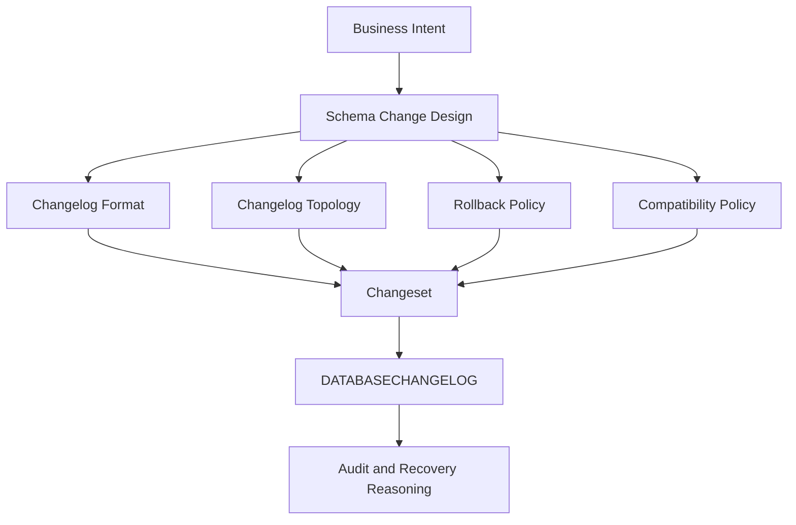

------
title: Learn Java Database Migrations, Flyway, Liquibase - Part 017
description: Liquibase changelog design secara mendalam, termasuk pilihan SQL/XML/YAML/JSON, hybrid topology, include strategy, deterministic ordering, portability, rollback, reviewability, dan struktur project production-grade.
series: learn-java-database-migrations
seriesTitle: Learn Java Database Migrations, Flyway, Liquibase
order: 17
partTitle: Liquibase Changelog Design
tags:
  - java
  - database-migration
  - liquibase
  - changelog
  - changeset
  - sql
  - production
  - series
date: 2026-06-28
---

# Part 017 — Liquibase Changelog Design: SQL vs XML/YAML/JSON vs Hybrid

## Tujuan Bagian Ini

Bagian sebelumnya membahas **core model Liquibase**: changelog, changeset, identity, tracking table, lock table, checksum, dan execution flow.

Bagian ini menjawab pertanyaan yang lebih arsitektural:

> Bagaimana kita mendesain struktur changelog Liquibase agar tetap mudah di-review, deterministik, aman untuk CI/CD, cocok untuk Java team, dan tahan dipakai bertahun-tahun?

Liquibase memberi banyak kebebasan:

- changelog bisa ditulis dalam SQL, XML, YAML, atau JSON;
- changelog bisa dipecah dengan `include` atau `includeAll`;
- changeset bisa memakai declarative change type atau raw SQL;
- file bisa disusun per release, per domain, per feature, per module, atau per database vendor;
- changeset bisa diberi rollback, precondition, context, label, `dbms`, dan atribut lain.

Kebebasan ini berguna, tetapi juga berbahaya. Tanpa desain, changelog berubah menjadi campuran file acak, dependency implisit, rollback fiktif, environment branching, dan konflik identity.

Target part ini:

> Mampu memilih format dan struktur Liquibase changelog berdasarkan trade-off nyata: reviewability, portability, auditability, operational safety, team workflow, vendor-specific capability, rollback expectation, dan long-term maintainability.

---

## Kaufman Deconstruction

Dalam kerangka Kaufman, skill ini dipecah menjadi sub-skill yang bisa dilatih cepat.

| Sub-skill | Pertanyaan Utama | Latihan Minimum |
|---|---|---|
| Format selection | SQL, XML, YAML, JSON, atau hybrid? | Tulis 1 perubahan yang sama dalam 3 format |
| Changelog topology | Root changelog, include, per-domain, per-release | Buat struktur changelog untuk 3 bounded context |
| Ordering discipline | Bagaimana urutan execution dijamin? | Simulasikan dependency antar-file |
| Identity stability | Apa efek rename/move file? | Uji perubahan path terhadap changeset identity |
| Reviewability | Format mana paling mudah diaudit di PR? | Review DDL constraint/index dalam SQL vs YAML |
| Portability | Kapan vendor-neutral layak? | Buat `createTable` yang jalan di PostgreSQL dan Oracle |
| Rollback design | Rollback ditulis, generated, atau tidak ada? | Tambahkan rollback untuk safe change dan destructive change |
| Environment boundary | Apa yang boleh dibedakan per environment? | Pisahkan test data dari schema evolution |
| Governance | Apa yang wajib distandarkan di tim? | Buat checklist PR changelog |

Skill akhir:

> Bisa melihat struktur Liquibase project lalu memprediksi apakah project tersebut akan mudah diskalakan oleh 20+ engineer tanpa drift, konflik, dan deployment surprise.

---

## 1. Changelog Design Bukan Sekadar Format File

Banyak diskusi Liquibase berhenti di level:

> “Lebih baik XML, YAML, JSON, atau SQL?”

Pertanyaan itu terlalu dangkal.

Pertanyaan yang lebih benar:

> “Format dan struktur mana yang membuat database evolution kita paling aman untuk konteks ownership, vendor, delivery model, audit, rollback, dan review?”

Format hanyalah satu dimensi.

Changelog design mencakup:

1. **file format**;
2. **file topology**;
3. **changeset identity strategy**;
4. **include ordering**;
5. **domain/module ownership**;
6. **rollback policy**;
7. **vendor-specific escape hatch**;
8. **environment/test-data boundary**;
9. **CI/CD validation model**;
10. **review rules**.

Diagram mental model:



Jika format bagus tetapi topology buruk, project tetap rusak.
Jika topology bagus tetapi identity tidak stabil, project tetap berisiko.
Jika identity stabil tetapi rollback policy fiktif, incident recovery tetap kacau.

---

## 2. Dua Model Besar Liquibase

Liquibase secara praktis menyediakan dua model authoring.

### 2.1 SQL Model

Dalam SQL model, perubahan ditulis sebagai formatted SQL changelog.

Contoh:

```sql
--liquibase formatted sql

--changeset alice:20260628-001-create-case-table labels:case-management
CREATE TABLE enforcement_case (
    id BIGINT GENERATED BY DEFAULT AS IDENTITY PRIMARY KEY,
    case_number VARCHAR(64) NOT NULL,
    status VARCHAR(32) NOT NULL,
    created_at TIMESTAMP NOT NULL
);

--rollback DROP TABLE enforcement_case;
```

Karakteristik:

- engineer dan DBA membaca SQL langsung;
- sangat cocok untuk vendor-specific DDL;
- review lebih dekat dengan apa yang benar-benar dieksekusi;
- portable lintas database lebih rendah;
- automatic rollback lebih terbatas;
- perubahan kompleks lebih eksplisit.

SQL model cocok ketika:

- organisasi memakai satu database utama;
- schema design perlu memanfaatkan fitur vendor;
- DBA review berpusat pada SQL aktual;
- performa dan lock semantics penting;
- tim tidak ingin Liquibase menyembunyikan SQL generation.

Untuk engineer senior, SQL model sering lebih mudah dipertanggungjawabkan karena tidak ada gap besar antara intent dan statement eksekusi.

### 2.2 Platform-Agnostic Model

Dalam model ini, changelog ditulis dalam XML, YAML, atau JSON memakai Liquibase change type.

Contoh YAML:

```yaml
databaseChangeLog:
  - changeSet:
      id: 20260628-001-create-case-table
      author: alice
      labels: case-management
      changes:
        - createTable:
            tableName: enforcement_case
            columns:
              - column:
                  name: id
                  type: BIGINT
                  constraints:
                    primaryKey: true
                    nullable: false
              - column:
                  name: case_number
                  type: VARCHAR(64)
                  constraints:
                    nullable: false
              - column:
                  name: status
                  type: VARCHAR(32)
                  constraints:
                    nullable: false
              - column:
                  name: created_at
                  type: TIMESTAMP
                  constraints:
                    nullable: false
      rollback:
        - dropTable:
            tableName: enforcement_case
```

Karakteristik:

- Liquibase menghasilkan SQL sesuai database target;
- lebih portable lintas vendor;
- beberapa change type bisa punya automatic rollback;
- struktur mudah diproses tooling;
- verbose, terutama XML;
- generated SQL tetap harus di-review untuk production;
- vendor-specific behavior kadang perlu raw SQL escape hatch.

Model ini cocok ketika:

- produk harus mendukung beberapa database vendor;
- tim ingin metadata migration lebih kaya;
- governance tooling membaca changelog secara terstruktur;
- rollback declaration penting;
- perubahan relatif standar dan tidak terlalu vendor-specific.

---

## 3. Format Trade-Off Matrix

| Format | Strength | Weakness | Cocok Untuk | Risiko Utama |
|---|---|---|---|---|
| Formatted SQL | Paling eksplisit, mudah DBA review, vendor-specific kuat | Portability rendah, metadata terbatas, rollback manual | PostgreSQL-only, Oracle-only, SQL Server-heavy systems | SQL terlihat benar tetapi tidak reusable lintas vendor |
| XML | Paling lengkap dan eksplisit untuk Liquibase ecosystem | Verbose, PR diff noisy | Enterprise governance, tool integration, multi-vendor | Developer fatigue dan copy-paste error |
| YAML | Lebih ringkas dari XML, cukup readable | Indentation-sensitive, nested structure mudah salah | Java/Spring teams, balanced readability | Silent readability trap pada struktur kompleks |
| JSON | Machine-friendly, konsisten untuk tooling | Kurang nyaman untuk manusia | Generated changelog, automation | Tidak enak untuk manual authoring |
| Hybrid | Menggabungkan root structured + leaf SQL | Butuh convention kuat | Production Java teams dengan DBA review | Tanpa convention berubah jadi campuran liar |

Rekomendasi praktis untuk banyak Java production team:

> Gunakan **hybrid model**: root changelog dalam YAML/XML untuk orchestration, include eksplisit, metadata, contexts/labels/preconditions; perubahan vendor-specific dan stored logic ditulis sebagai formatted SQL leaf changelog.

Namun ini bukan aturan universal. Sistem multi-vendor serius bisa lebih baik dengan YAML/XML sebagai format utama.

---

## 4. Hybrid Model yang Waras

Hybrid model yang sehat bukan berarti semua format dicampur bebas.

Model yang waras:

```txt
src/main/resources/db/changelog/
  db.changelog-master.yaml
  2026/
    06/
      2026-06-28-case-schema.sql
      2026-06-29-case-indexes.sql
  reference-data/
    case-status.yaml
  stored-logic/
    case-number-generator.sql
```

Root changelog:

```yaml
databaseChangeLog:
  - include:
      file: db/changelog/2026/06/2026-06-28-case-schema.sql
  - include:
      file: db/changelog/2026/06/2026-06-29-case-indexes.sql
  - include:
      file: db/changelog/reference-data/case-status.yaml
  - include:
      file: db/changelog/stored-logic/case-number-generator.sql
```

Leaf SQL:

```sql
--liquibase formatted sql

--changeset alice:20260628-001-create-case-table labels:case-management
CREATE TABLE enforcement_case (
    id BIGINT GENERATED BY DEFAULT AS IDENTITY PRIMARY KEY,
    case_number VARCHAR(64) NOT NULL,
    status VARCHAR(32) NOT NULL,
    created_at TIMESTAMP NOT NULL
);

--rollback DROP TABLE enforcement_case;
```

Keuntungannya:

- root changelog menjadi manifest deployment;
- order eksplisit;
- SQL tetap mudah di-review;
- reference data bisa memakai YAML jika lebih jelas;
- stored logic bisa disimpan sebagai SQL;
- CI bisa memvalidasi root changelog sebagai entry point tunggal.

Anti-pattern hybrid:

```txt
src/main/resources/db/changelog/
  master.yaml
  random.sql
  fix.sql
  tmp.yaml
  prod-only.xml
  after-release.sql
  old/
  new/
  backup/
```

Masalahnya bukan jumlah file, tetapi tidak adanya grammar.

---

## 5. Root Changelog sebagai Deployment Manifest

Dalam production-grade Liquibase project, root changelog sebaiknya diperlakukan sebagai **deployment manifest**, bukan sekadar file default.

Root changelog harus menjawab:

1. file mana yang menjadi bagian database history;
2. urutan file dieksekusi;
3. boundary domain/release;
4. context atau label global jika memang diperlukan;
5. logical path jika ada strategi rename/move;
6. single source of truth untuk CI/CD.

Contoh root changelog yang baik:

```yaml
databaseChangeLog:
  - include:
      file: db/changelog/0000-baseline.yaml

  - include:
      file: db/changelog/case/2026-06-28-case-core.sql
  - include:
      file: db/changelog/case/2026-06-28-case-indexes.sql

  - include:
      file: db/changelog/enforcement/2026-06-29-enforcement-action.sql

  - include:
      file: db/changelog/reference-data/case-status.yaml
```

Perhatikan beberapa hal:

- include eksplisit;
- dependency terlihat dari urutan;
- nama file meaningful;
- tidak bergantung pada filesystem ordering;
- tidak ada file sementara;
- root changelog bisa dibaca reviewer sebagai “apa yang akan dijalankan”.

---

## 6. `include` vs `includeAll`

Liquibase menyediakan `include` dan `includeAll`. Keduanya berguna, tetapi risiko governance-nya berbeda.

### 6.1 `include`

`include` berarti kita menyebut file satu per satu.

```yaml
databaseChangeLog:
  - include:
      file: db/changelog/case/2026-06-28-create-case.sql
  - include:
      file: db/changelog/case/2026-06-29-add-case-index.sql
```

Keuntungan:

- urutan eksplisit;
- PR reviewer melihat file baru masuk manifest;
- dependency lebih mudah diperiksa;
- cocok untuk regulated system;
- mudah membuat audit trail release.

Kekurangan:

- perlu update root file setiap ada changelog baru;
- merge conflict mungkin terjadi di root changelog.

Untuk sistem production penting, trade-off ini biasanya layak.

### 6.2 `includeAll`

`includeAll` memasukkan semua file dari folder.

```yaml
databaseChangeLog:
  - includeAll:
      path: db/changelog/case
```

Keuntungan:

- lebih sedikit update manifest;
- nyaman untuk banyak file;
- cocok untuk prototyping atau folder yang benar-benar independen.

Risiko:

- ordering bergantung pada aturan path/file sorting;
- file accidental bisa ikut;
- reviewer mungkin melewatkan efek penambahan file;
- dependency antar-file menjadi implisit;
- sulit dipakai dalam release governance ketat.

Rule praktis:

> Gunakan `include` untuk schema evolution production. Gunakan `includeAll` hanya jika folder memiliki naming convention ketat, CI guardrail, dan tidak ada dependency tersembunyi antar-file.

Untuk regulated engineering, default saya: **explicit include**.

---

## 7. Struktur Berdasarkan Release vs Domain

Ada dua struktur populer.

### 7.1 Release-Based Structure

```txt
db/changelog/
  db.changelog-master.yaml
  releases/
    2026.06.1/
      001-create-case.sql
      002-add-index.sql
    2026.06.2/
      001-add-appeal-table.sql
```

Kelebihan:

- mudah melihat isi release;
- cocok untuk release train;
- audit release lebih sederhana;
- approval per release lebih jelas.

Kekurangan:

- domain ownership tersebar;
- file domain yang sama tersebar di banyak folder;
- refactor jangka panjang kurang enak.

Cocok untuk:

- organisasi dengan batch release;
- change advisory board;
- database team sentral;
- aplikasi enterprise monolith.

### 7.2 Domain-Based Structure

```txt
db/changelog/
  db.changelog-master.yaml
  case/
    2026-06-28-create-case.sql
    2026-07-02-add-case-sla.sql
  enforcement/
    2026-06-29-create-action.sql
  party/
    2026-07-01-create-party.sql
```

Kelebihan:

- ownership domain jelas;
- reviewer domain mudah menemukan history;
- cocok untuk modular monolith;
- cocok untuk bounded context.

Kekurangan:

- release composition harus dibaca dari root changelog;
- cross-domain dependency perlu disiplin;
- bisa terjadi conflict jika domain saling bergantung.

Cocok untuk:

- modular monolith;
- domain-driven Java system;
- regulatory case management;
- team dengan ownership per domain.

### 7.3 Hybrid Release + Domain

```txt
db/changelog/
  db.changelog-master.yaml
  case/
    2026/
      06/
        2026-06-28-001-create-case.sql
  enforcement/
    2026/
      06/
        2026-06-29-001-create-action.sql
```

Ini sering menjadi kompromi terbaik:

- domain ownership tetap jelas;
- file tetap kronologis;
- naming mudah di-sort;
- root changelog tetap menjadi manifest urutan final.

---

## 8. Changeset Identity dan File Movement

Liquibase changeset identity bukan hanya `id`. Identity praktis mencakup:

```txt
id + author + changelog filepath
```

Konsekuensinya serius:

> Memindahkan atau mengganti path changelog dapat membuat Liquibase menganggap changeset sebagai changeset baru, kecuali identity path dikelola dengan benar.

Contoh risiko:

```txt
before:
  db/changelog/case/create-case.sql

after:
  db/changelog/case/2026/06/create-case.sql
```

Jika changeset yang sudah applied dipindah tanpa strategi, target database dapat melihat identity berbeda.

### 8.1 Rule

- Jangan memindahkan file changelog yang sudah applied di environment mana pun tanpa alasan kuat.
- Jika perlu reorganisasi, rancang dengan `logicalFilePath` atau strategi transisi yang jelas.
- Jangan melakukan “cleanup folder” sebagai refactor biasa setelah production apply.
- Changelog bukan source code biasa; changelog adalah bagian dari ledger database.

### 8.2 Naming ID yang Stabil

Buruk:

```sql
--changeset alice:1
```

Lebih baik:

```sql
--changeset alice:20260628-001-create-enforcement-case
```

Lebih baik untuk enterprise:

```sql
--changeset enforcement-team:ECM-1842-20260628-001-create-enforcement-case
```

ID tidak harus integer. Yang penting:

- unik di file/path/author context;
- meaningful;
- traceable ke ticket/intent;
- tidak berubah setelah applied.

---

## 9. SQL-First Changelog Design

SQL-first sangat kuat untuk production, tetapi harus punya convention.

### 9.1 File Header

```sql
--liquibase formatted sql

-- =====================================================================
-- Domain      : case-management
-- Intent      : Create core enforcement case table
-- Ticket      : ECM-1842
-- Risk        : Low - additive DDL
-- Rollback    : Drop table; safe only before data is written
-- Review      : DBA + service owner
-- =====================================================================
```

Header bukan wajib Liquibase, tetapi berguna untuk review dan audit.

### 9.2 Changeset Grammar

```sql
--changeset enforcement-team:ECM-1842-20260628-001-create-enforcement-case labels:case-management,release-2026-06
CREATE TABLE enforcement_case (
    id BIGINT GENERATED BY DEFAULT AS IDENTITY PRIMARY KEY,
    case_number VARCHAR(64) NOT NULL,
    status VARCHAR(32) NOT NULL,
    created_at TIMESTAMP NOT NULL,
    updated_at TIMESTAMP NOT NULL
);

--rollback DROP TABLE enforcement_case;
```

Convention:

- satu intent per changeset;
- SQL statements terkait boleh satu changeset jika atomic secara intent;
- destructive change wajib rollback/roll-forward note;
- constraint/index name eksplisit;
- table/column naming mengikuti database standard;
- jangan gabungkan schema, data backfill besar, dan cleanup dalam satu changeset.

### 9.3 Constraint Name Harus Eksplisit

Buruk:

```sql
CREATE TABLE enforcement_case (
    case_number VARCHAR(64) UNIQUE
);
```

Lebih baik:

```sql
CREATE TABLE enforcement_case (
    case_number VARCHAR(64) NOT NULL,
    CONSTRAINT uk_enforcement_case_case_number UNIQUE (case_number)
);
```

Kenapa?

- generated constraint name berbeda antar database;
- rollback/drop constraint butuh nama;
- incident recovery lebih mudah;
- audit diff lebih jelas.

---

## 10. YAML/XML Changelog Design

Jika memakai YAML/XML, jangan sekadar translasi dari SQL. Gunakan manfaat strukturalnya.

Contoh YAML yang rapi:

```yaml
databaseChangeLog:
  - changeSet:
      id: ECM-1842-20260628-001-create-enforcement-case
      author: enforcement-team
      labels: case-management,release-2026-06
      comments: Create core enforcement case table
      changes:
        - createTable:
            tableName: enforcement_case
            remarks: Core regulatory enforcement case aggregate root
            columns:
              - column:
                  name: id
                  type: BIGINT
                  constraints:
                    primaryKey: true
                    primaryKeyName: pk_enforcement_case
                    nullable: false
              - column:
                  name: case_number
                  type: VARCHAR(64)
                  constraints:
                    nullable: false
              - column:
                  name: status
                  type: VARCHAR(32)
                  constraints:
                    nullable: false
        - addUniqueConstraint:
            tableName: enforcement_case
            columnNames: case_number
            constraintName: uk_enforcement_case_case_number
      rollback:
        - dropTable:
            tableName: enforcement_case
```

Hal yang perlu dijaga:

- jangan biarkan constraint name auto-generated;
- jalankan `update-sql` dan review SQL hasil generate;
- pahami apakah generated SQL cocok dengan lock/transaction semantics target database;
- jangan berasumsi declarative change type selalu menghasilkan online-safe DDL;
- tetap tulis raw SQL untuk operasi yang butuh kontrol vendor-specific.

---

## 11. Vendor-Specific Strategy

Ada tiga pendekatan.

### 11.1 Separate Changelog per Vendor

```txt
db/changelog/
  master-postgresql.yaml
  master-oracle.yaml
  postgresql/
    case-schema.sql
  oracle/
    case-schema.sql
```

Cocok jika vendor divergence tinggi.

Kelemahan:

- duplikasi intent;
- test matrix besar;
- risk drift antar vendor.

### 11.2 Single Changelog dengan `dbms`

```yaml
databaseChangeLog:
  - changeSet:
      id: ECM-2001-001-create-index-postgres
      author: enforcement-team
      dbms: postgresql
      changes:
        - sql:
            sql: CREATE INDEX CONCURRENTLY idx_case_status ON enforcement_case(status);

  - changeSet:
      id: ECM-2001-001-create-index-oracle
      author: enforcement-team
      dbms: oracle
      changes:
        - sql:
            sql: CREATE INDEX idx_case_status ON enforcement_case(status) ONLINE;
```

Cocok jika divergence terbatas dan ingin satu root changelog.

### 11.3 Declarative First, SQL Escape Hatch

```yaml
databaseChangeLog:
  - changeSet:
      id: ECM-2001-001-add-basic-index
      author: enforcement-team
      changes:
        - createIndex:
            tableName: enforcement_case
            indexName: idx_case_status
            columns:
              - column:
                  name: status
```

Lalu gunakan raw SQL hanya untuk case yang butuh kontrol khusus.

Rule:

> Jangan memakai context seperti `context=postgres` untuk membedakan database vendor. Gunakan atribut `dbms` atau pisahkan changelog vendor.

Context seharusnya mewakili deployment context, bukan database product.

---

## 12. Reference Data Changelog

Reference data sering membuat changelog kotor karena dicampur dengan schema DDL.

Pisahkan:

```txt
db/changelog/
  db.changelog-master.yaml
  schema/
  reference-data/
    case-status.yaml
    enforcement-action-type.yaml
  test-data/
    integration-test-case-data.yaml
```

Contoh reference data:

```yaml
databaseChangeLog:
  - changeSet:
      id: ECM-REF-20260628-001-case-status
      author: enforcement-team
      labels: reference-data,case-management
      changes:
        - insert:
            tableName: ref_case_status
            columns:
              - column:
                  name: code
                  value: OPEN
              - column:
                  name: description
                  value: Open
        - insert:
            tableName: ref_case_status
            columns:
              - column:
                  name: code
                  value: CLOSED
              - column:
                  name: description
                  value: Closed
      rollback:
        - delete:
            tableName: ref_case_status
            where: code in ('OPEN', 'CLOSED')
```

Untuk reference data yang bisa berubah, hati-hati dengan `update` dan `delete`. Treat it as contract:

- apakah code sudah dipakai foreign key?
- apakah enum aplikasi bergantung pada code?
- apakah perubahan description audit-sensitive?
- apakah deletion legal atau harus deprecate?

Reference data akan dibahas lebih dalam di part khusus, tetapi changelog design-nya harus sejak awal dipisahkan dari test fixture.

---

## 13. Test Data Jangan Bocor ke Production

Test data boleh dikelola Liquibase, tetapi harus jelas boundary-nya.

Contoh:

```yaml
databaseChangeLog:
  - include:
      file: db/changelog/schema/case-schema.sql

  - include:
      file: db/changelog/test-data/integration-test-cases.yaml
      contextFilter: test
```

Atau changeset:

```yaml
databaseChangeLog:
  - changeSet:
      id: TEST-20260628-001-seed-case
      author: test-team
      context: test
      changes:
        - insert:
            tableName: enforcement_case
            columns:
              - column:
                  name: case_number
                  value: TEST-CASE-001
              - column:
                  name: status
                  value: OPEN
```

Critical warning:

> Jika runtime tidak mengirim context filter, changeset ber-context tetap bisa ikut dieksekusi sesuai aturan Liquibase. Karena itu production command harus eksplisit dan CI harus mencegah test context masuk production pipeline.

Rule production:

```bash
liquibase update --context-filter="prod" --label-filter="release-2026-06"
```

Tetapi jangan membuat semua production schema changeset diberi context `prod` tanpa alasan. Banyak tim justru membuat schema changeset tanpa context dan test-data changeset dengan context `test`. Yang penting adalah policy-nya konsisten.

---

## 14. Rollback Design dalam Changelog

Rollback di Liquibase lebih mudah diekspresikan daripada di banyak tool lain, tetapi tetap harus realistis.

### 14.1 Safe Rollback

```yaml
databaseChangeLog:
  - changeSet:
      id: ECM-1842-001-add-note-column
      author: enforcement-team
      changes:
        - addColumn:
            tableName: enforcement_case
            columns:
              - column:
                  name: internal_note
                  type: VARCHAR(1000)
      rollback:
        - dropColumn:
            tableName: enforcement_case
            columnName: internal_note
```

Ini hanya safe jika column belum dipakai atau data loss dapat diterima.

### 14.2 Unsafe Rollback

```yaml
rollback:
  - dropColumn:
      tableName: enforcement_case
      columnName: decision_reason
```

Jika column sudah berisi regulatory decision reason, rollback ini bisa menghapus evidence.

Lebih jujur:

```yaml
rollback:
  - sql:
      sql: |
        -- Deliberately no automatic rollback.
        -- Roll forward with ECM-1901 corrective migration.
        SELECT 1;
```

Atau gunakan policy komentar:

```sql
--rollback SELECT raise_exception('No automatic rollback; use roll-forward playbook ECM-1901');
```

Tergantung database dan tooling, jangan memasukkan SQL palsu yang memberi ilusi rollback sukses. Lebih baik pipeline mengetahui bahwa rollback butuh playbook manual.

---

## 15. Changelog untuk Expand/Contract

Expand/contract harus muncul di changelog structure.

Buruk:

```txt
2026-06-28-rename-customer-to-party.sql
```

Satu file langsung rename. Risiko old app break.

Lebih baik:

```txt
2026-06-28-001-expand-add-party-id.sql
2026-06-28-002-backfill-party-id.sql
2026-07-05-001-contract-drop-customer-id.sql
```

Root changelog:

```yaml
databaseChangeLog:
  - include:
      file: db/changelog/case/2026-06-28-001-expand-add-party-id.sql
  - include:
      file: db/changelog/case/2026-06-28-002-backfill-party-id.sql
  # contract migration intentionally delayed until all app versions stop reading customer_id
  - include:
      file: db/changelog/case/2026-07-05-001-contract-drop-customer-id.sql
```

Contract migration harus punya evidence:

- app version minimum sudah rollout;
- metric read/write old column nol;
- downstream consumers sudah migrasi;
- rollback plan tersedia;
- data retention/legal impact checked.

---

## 16. Reviewability: Apa yang Reviewer Harus Lihat?

PR untuk changelog harus membuat reviewer mudah menjawab:

1. apa intent bisnis/teknis change ini?
2. object database apa yang berubah?
3. apakah change backward-compatible?
4. apakah ada lock risk?
5. apakah ada data loss?
6. apakah rollback realistis?
7. apakah changeset identity stabil?
8. apakah file masuk root changelog dengan urutan benar?
9. apakah generated SQL sudah di-review jika memakai YAML/XML?
10. apakah test data/reference data tidak bercampur?

Template PR description:

```md
## Database Migration Review

Intent:
- Add enforcement case SLA tracking column.

Compatibility:
- Backward-compatible additive nullable column.
- App writes column only after feature flag enabled.

Risk:
- Low DDL risk; no table rewrite expected on target DB.
- No destructive change.

Rollback:
- Drop column before app starts writing production data.
- After write begins, roll-forward only.

Validation:
- liquibase validate passed.
- liquibase update-sql reviewed.
- integration tests passed on ephemeral PostgreSQL.
```

---

## 17. CI/CD Guardrails untuk Changelog Design

Minimal checks:

```txt
1. root changelog parses
2. liquibase validate passes
3. update-sql generated successfully
4. migration applies to empty database
5. migration applies to previous release schema
6. no duplicate changeset identity
7. no forbidden context/label for production
8. no destructive SQL without explicit approval tag
9. no schema.sql/data.sql mixed with Liquibase init
10. no applied changelog file modified after merge to main/release
```

Advanced checks:

```txt
1. detect DROP/TRUNCATE/ALTER TYPE risk
2. detect add NOT NULL without default/backfill strategy
3. detect CREATE INDEX without online/concurrent strategy for large table
4. detect missing constraint names
5. detect unbounded UPDATE/DELETE
6. detect missing rollback policy
7. detect includeAll usage in restricted paths
8. detect changeset author/id naming convention
9. detect reference/test data boundary violation
10. generate lock-risk annotation in PR
```

---

## 18. Anti-Patterns

### 18.1 One Giant Changelog Forever

```txt
db.changelog-master.yaml with 20,000 lines
```

Masalah:

- PR conflict tinggi;
- review lambat;
- context hilang;
- sulit menemukan history;
- merge risk besar.

Solusi:

- root changelog sebagai manifest;
- split per domain/release;
- explicit include.

### 18.2 Folder Dump dengan `includeAll`

```txt
includeAll: db/changelog/all
```

Masalah:

- file accidental bisa deploy;
- dependency tidak terlihat;
- review manifest hilang.

Solusi:

- explicit include untuk production;
- atau strict naming + CI allowlist.

### 18.3 XML/YAML untuk Semua Hal Walau Butuh SQL Spesifik

Masalah:

- generated SQL tidak sesuai online DDL requirement;
- engineer tidak sadar lock behavior;
- vendor feature tidak terpakai.

Solusi:

- raw SQL untuk high-risk DDL;
- selalu review `update-sql`.

### 18.4 SQL untuk Semua Hal Tanpa Metadata

Masalah:

- rollback lemah;
- context/label/precondition tidak dipakai;
- governance sulit.

Solusi:

- formatted SQL dengan labels, contexts, rollback, comments;
- root changelog structured.

### 18.5 Environment Branching dalam Changelog

```yaml
context: dev
context: qa
context: prod
```

Jika dipakai untuk schema berbeda, ini anti-pattern.

Schema production-like harus sama. Context boleh untuk:

- test data;
- optional demo data;
- data masking/dev-only helper;
- controlled rollout label.

Bukan untuk:

- column hanya ada di QA;
- table hanya ada di production;
- constraint berbeda per environment tanpa alasan vendor/legal yang jelas.

---

## 19. Recommended Default untuk Java Production Team

Untuk banyak Java/Spring production system dengan satu database vendor utama:

```txt
Use:
- YAML root changelog
- explicit include
- formatted SQL for schema DDL
- YAML for stable reference data if readable
- context only for test/demo data
- labels for release/feature tracking
- dbms for vendor-specific changes
- update-sql in CI
- validate in CI and pre-prod
- no app-level schema.sql/data.sql initialization
```

Struktur:

```txt
src/main/resources/db/changelog/
  db.changelog-master.yaml
  baseline/
    0000-baseline.yaml
  case/
    2026/
      06/
        ECM-1842-20260628-001-create-case.sql
        ECM-1843-20260629-001-add-case-sla.sql
  enforcement/
    2026/
      06/
        ECM-1900-20260630-001-create-action.sql
  reference-data/
    case-status.yaml
  test-data/
    integration-test-data.yaml
```

Root:

```yaml
databaseChangeLog:
  - include:
      file: db/changelog/baseline/0000-baseline.yaml
  - include:
      file: db/changelog/case/2026/06/ECM-1842-20260628-001-create-case.sql
  - include:
      file: db/changelog/case/2026/06/ECM-1843-20260629-001-add-case-sla.sql
  - include:
      file: db/changelog/enforcement/2026/06/ECM-1900-20260630-001-create-action.sql
  - include:
      file: db/changelog/reference-data/case-status.yaml
  - include:
      file: db/changelog/test-data/integration-test-data.yaml
      contextFilter: test
```

---

## 20. Decision Framework

Gunakan pertanyaan ini sebelum memilih format/topology.

### 20.1 Apakah Sistem Multi-Vendor?

Jika ya:

- mulai dari XML/YAML declarative;
- gunakan `dbms` untuk divergence;
- generate SQL per vendor di CI;
- test semua vendor target.

Jika tidak:

- formatted SQL sering lebih sederhana dan transparan;
- tetap gunakan YAML/XML root.

### 20.2 Apakah DBA Review Wajib?

Jika ya:

- SQL leaf changelog sangat membantu;
- generated SQL dari XML/YAML harus dilampirkan di PR;
- hindari deklarasi terlalu abstrak untuk high-risk DDL.

### 20.3 Apakah Audit dan Governance Berat?

Jika ya:

- explicit include;
- stable id convention;
- ticket in changeset id/label;
- no includeAll tanpa guardrail;
- rollback policy wajib;
- destructive changes require approval label.

### 20.4 Apakah Tim Sering Mengalami Merge Conflict?

Jika ya:

- split per domain;
- gunakan timestamp/ticket id;
- root manifest conflict diselesaikan dengan urutan sadar, bukan auto-merge buta.

### 20.5 Apakah Change Sering Vendor-Specific?

Jika ya:

- jangan memaksakan declarative format;
- raw SQL is acceptable;
- dokumentasikan lock semantics.

---

## 21. Practical Exercise

Buat struktur Liquibase untuk sistem regulatory case management dengan domain:

- `case`;
- `party`;
- `enforcement-action`;
- `appeal`;
- `reference-data`;
- `test-data`.

Buat:

1. root changelog;
2. satu SQL changeset create table;
3. satu YAML reference data changeset;
4. satu test data changeset ber-context `test`;
5. satu vendor-specific changeset memakai `dbms`;
6. satu rollback manual note untuk destructive change.

Checklist jawaban:

- explicit include;
- no accidental production test data;
- changeset id meaningful;
- rollback policy realistis;
- constraint names explicit;
- generated SQL bisa di-review.

---

## Ringkasan

Liquibase changelog design adalah keputusan arsitektur, bukan preferensi sintaks.

Prinsip utama:

1. root changelog adalah deployment manifest;
2. explicit ordering lebih aman daripada implicit ordering;
3. SQL-first cocok untuk vendor-specific production DDL;
4. XML/YAML/JSON cocok untuk structured, portable, metadata-rich migration;
5. hybrid model sering paling pragmatis untuk Java production teams;
6. applied changelog file harus diperlakukan sebagai ledger, bukan source code biasa;
7. context bukan cara membuat schema berbeda antar-environment;
8. rollback harus jujur, bukan dekoratif;
9. generated SQL tetap harus direview;
10. changelog topology harus mencerminkan ownership dan release model.

Bagian berikutnya membahas fitur yang membuat Liquibase kuat sekaligus rawan disalahgunakan: **preconditions, contexts, dan labels**.
