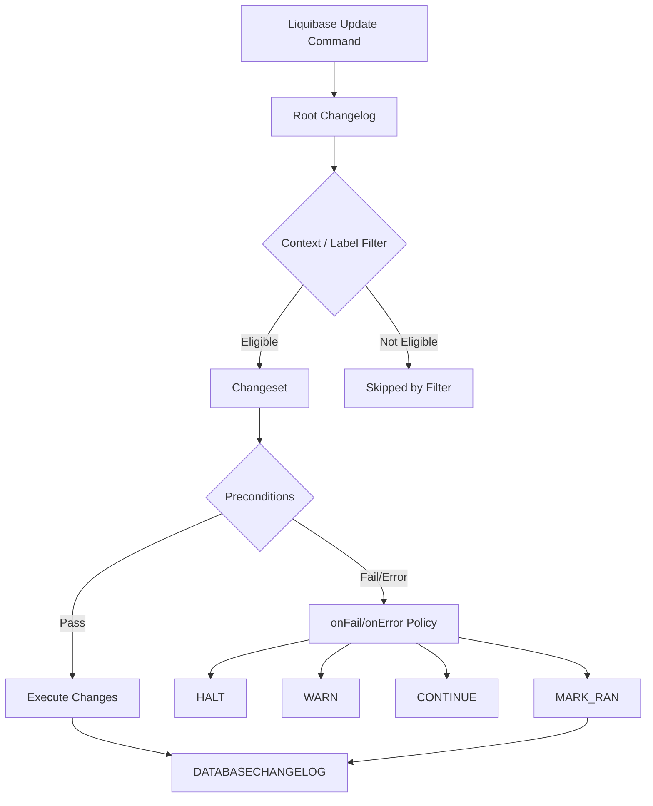

------
title: Learn Java Database Migrations, Flyway, Liquibase - Part 018
description: Liquibase preconditions, contexts, dan labels secara mendalam, termasuk mental model conditional execution, environment filtering, feature/release selection, failure handling, anti-pattern, dan governance guardrails.
series: learn-java-database-migrations
seriesTitle: Learn Java Database Migrations, Flyway, Liquibase
order: 18
partTitle: Liquibase Preconditions, Contexts, Labels
tags:
  - java
  - database-migration
  - liquibase
  - preconditions
  - contexts
  - labels
  - production
  - series
date: 2026-06-28
---

# Part 018 — Preconditions, Contexts, Labels: Conditional Execution tanpa Merusak Determinism

## Tujuan Bagian Ini

Liquibase kuat karena bisa mengontrol kapan changeset dijalankan.

Tiga mekanisme utama:

1. **preconditions** — mengecek state database sebelum menjalankan changelog/changeset;
2. **contexts** — memberi tag execution context, sering dipakai untuk environment/test data;
3. **labels** — memberi tag feature, release, ticket, capability, atau deployment grouping.

Masalahnya: mekanisme ini sering disalahgunakan untuk membuat database schema bercabang liar.

Contoh buruk:

```yaml
- changeSet:
    id: 001-create-field-only-in-qa
    author: team
    context: qa
```

Hasilnya:

- QA punya column;
- production tidak punya column;
- integration test tidak representatif;
- app behavior berbeda;
- incident sulit direproduksi;
- audit trail membingungkan.

Target part ini:

> Mampu memakai preconditions, contexts, dan labels untuk meningkatkan safety dan kontrol deployment tanpa mengorbankan determinism, environment parity, dan auditability.

---

## Kaufman Deconstruction

| Sub-skill | Pertanyaan Utama | Latihan Minimum |
|---|---|---|
| Preconditions | Reality apa yang harus benar sebelum change jalan? | Buat precondition untuk table/column/index existence |
| Failure handling | `HALT`, `WARN`, `CONTINUE`, atau `MARK_RAN`? | Simulasikan precondition fail di local DB |
| Context design | Context mewakili apa? | Pisahkan test data dari schema migration |
| Label design | Label mewakili feature/release apa? | Deploy subset changeset via label-filter |
| Determinism reasoning | Apakah semua environment menuju schema yang sama? | Bandingkan dev/QA/prod schema setelah filtered update |
| `dbms` vs context | Apakah ini vendor difference atau environment difference? | Ganti context vendor menjadi `dbms` |
| Dry-run safety | Apa efek `update-sql` terhadap precondition? | Generate SQL dan cek precondition behavior |
| CI guardrail | Bagaimana mencegah context/label salah? | Buat rule untuk prod command |

Skill akhir:

> Bisa membaca changeset conditional dan menjelaskan secara presisi apakah changeset akan dijalankan, dilewati, ditandai ran, gagal, atau muncul lagi di update berikutnya.

---

## 1. Mental Model: Tiga Mekanisme, Tiga Maksud

Jangan campur makna ketiganya.

| Mechanism | Pertanyaan | Contoh | Jangan Dipakai Untuk |
|---|---|---|---|
| Preconditions | “Apakah database state memenuhi asumsi?” | table exists, column missing, DBMS is PostgreSQL | Feature selection biasa |
| Contexts | “Run ini berada di context apa?” | test, dev-data, integration-test | Membuat schema production berbeda dari QA |
| Labels | “Changeset ini milik kelompok intent apa?” | release-2026-06, feature-appeal, ticket-ECM-1842 | Mengganti dependency management |
| `dbms` | “Database vendor apa targetnya?” | postgresql, oracle | Jangan diganti dengan context `postgres` |

Diagram:



Context/label menjawab eligibility.
Precondition menjawab safety.

---

## 2. Preconditions: Assertion terhadap Database Reality

Precondition adalah guard sebelum update. Ia bisa diletakkan di level changelog atau changeset.

Gunakan precondition untuk menyatakan:

- database vendor harus tertentu;
- table harus ada/tidak ada;
- column harus ada/tidak ada;
- index harus ada/tidak ada;
- row count harus sesuai;
- custom SQL check harus bernilai tertentu;
- changeset lain harus sudah pernah dieksekusi;
- property tertentu harus didefinisikan.

Precondition bukan pengganti testing. Ia adalah **last-mile guardrail**.

### 2.1 Changelog-Level Preconditions

Contoh YAML:

```yaml
databaseChangeLog:
  - preConditions:
      - onFail: HALT
      - dbms:
          type: postgresql
      - runningAs:
          username: migration_user

  - include:
      file: db/changelog/case/2026/06/ECM-1842-create-case.sql
```

Makna:

- seluruh changelog hanya boleh dijalankan pada PostgreSQL;
- user harus `migration_user`;
- jika tidak, update berhenti.

Changelog-level precondition cocok untuk:

- target database vendor;
- minimum privilege identity;
- expected deployment mode;
- global safety assumptions.

Jangan gunakan changelog-level precondition untuk skip sebagian schema biasa. Jika global assumption gagal, biasanya lebih aman `HALT`.

### 2.2 Changeset-Level Preconditions

Contoh XML-style concept dalam YAML:

```yaml
databaseChangeLog:
  - changeSet:
      id: ECM-1842-001-add-sla-column
      author: enforcement-team
      preConditions:
        - onFail: HALT
        - not:
            - columnExists:
                tableName: enforcement_case
                columnName: sla_due_at
      changes:
        - addColumn:
            tableName: enforcement_case
            columns:
              - column:
                  name: sla_due_at
                  type: TIMESTAMP
```

Makna:

- sebelum add column, pastikan column belum ada;
- jika column sudah ada, berhenti karena state tidak sesuai ekspektasi.

Mengapa bukan `MARK_RAN`?

Karena column yang sudah ada belum tentu sama definisinya. Mungkin type berbeda, nullable berbeda, atau dibuat manual di production. `HALT` memaksa manusia memeriksa drift.

---

## 3. Precondition Failure vs Error

Ada dua jenis masalah:

| Jenis | Arti | Contoh |
|---|---|---|
| Failure | Check berhasil dievaluasi tetapi hasilnya false | `columnExists` false |
| Error | Check gagal dievaluasi karena exception/masalah teknis | permission error, syntax error, metadata query failed |

Liquibase membedakan behavior melalui:

```txt
onFail
onError
```

Contoh:

```yaml
preConditions:
  - onFail: HALT
  - onError: HALT
  - tableExists:
      tableName: enforcement_case
```

Untuk production, default aman biasanya:

```txt
onFail = HALT
onError = HALT
```

Karena baik false assumption maupun error evaluasi sama-sama berarti kita tidak punya kepastian.

---

## 4. `HALT`, `WARN`, `CONTINUE`, `MARK_RAN`

### 4.1 `HALT`

`HALT` menghentikan changelog.

Gunakan untuk:

- destructive change;
- drift suspicion;
- prerequisite missing;
- privilege mismatch;
- database vendor mismatch;
- state yang tidak boleh diabaikan.

Contoh:

```yaml
preConditions:
  - onFail: HALT
  - sqlCheck:
      expectedResult: 0
      sql: |
        SELECT COUNT(*)
        FROM enforcement_case
        WHERE status IS NULL
```

Jika ada status null, jangan lanjut menambahkan NOT NULL constraint.

### 4.2 `WARN`

`WARN` memberi warning tetapi tetap menjalankan changeset.

Gunakan sangat jarang.

Cocok untuk:

- non-critical observability marker;
- diagnostic precheck;
- early rollout non-blocking warning.

Tidak cocok untuk:

- destructive DDL;
- data loss risk;
- migration dependency.

### 4.3 `CONTINUE`

`CONTINUE` melewati changeset dan mencoba lagi pada update berikutnya.

Ini berbahaya jika dipakai tanpa sadar.

Contoh legitimate:

```yaml
preConditions:
  - onFail: CONTINUE
  - tableExists:
      tableName: optional_extension_table
```

Makna:

- jika prerequisite belum ada, skip dulu;
- nanti update berikutnya akan mencoba lagi.

Masalah:

- changeset tetap pending;
- pipeline berikutnya bisa tiba-tiba menjalankannya;
- state eligibility berubah tanpa perubahan kode.

Rule:

> Jangan gunakan `CONTINUE` untuk core schema dependency. Gunakan hanya untuk optional, well-documented, low-risk changeset.

### 4.4 `MARK_RAN`

`MARK_RAN` melewati changeset tetapi mencatatnya sebagai executed.

Ini paling berbahaya karena history mengatakan “done” walau change tidak dieksekusi.

Legitimate case:

- existing database sudah punya object equivalent karena baseline/manual import;
- changeset hanya formalizes existing state;
- ada verification kuat bahwa object sama;
- keputusan didokumentasikan.

Contoh:

```yaml
preConditions:
  - onFail: MARK_RAN
  - not:
      - tableExists:
          tableName: legacy_audit_log
```

Jika table sudah ada, changeset create table tidak dijalankan tetapi ditandai ran.

Ini hanya aman jika table existing benar-benar sama.

Anti-pattern:

```yaml
preConditions:
  - onFail: MARK_RAN
  - not:
      - columnExists:
          tableName: enforcement_case
          columnName: risk_score
```

Jika column ada tapi type salah, changeset tetap ditandai selesai. Drift tersembunyi.

---

## 5. Precondition Performance Risk

Tidak semua precondition murah.

Contoh precondition yang bisa mahal:

- `indexExists`;
- `foreignKeyConstraintExists`;
- metadata snapshot pada database besar;
- `sqlCheck` tanpa index;
- row count pada table besar;
- cross-schema metadata query.

Buruk:

```yaml
sqlCheck:
  expectedResult: 0
  sql: SELECT COUNT(*) FROM huge_transaction_table WHERE processed = false
```

Pada table besar, ini bisa scan besar dan memperlambat migration.

Lebih baik:

```yaml
sqlCheck:
  expectedResult: 0
  sql: |
    SELECT CASE WHEN EXISTS (
      SELECT 1
      FROM huge_transaction_table
      WHERE processed = false
      LIMIT 1
    ) THEN 1 ELSE 0 END
```

Atau lakukan verification di pipeline/observability sebelum migration, lalu migration precondition hanya mengecek marker/checkpoint.

Rule:

> Precondition production harus bounded, indexed, dan predictable.

---

## 6. Preconditions untuk Expand/Contract

### 6.1 Add NOT NULL Constraint

Sebelum menambahkan NOT NULL:

```yaml
databaseChangeLog:
  - changeSet:
      id: ECM-1842-003-enforce-case-status-not-null
      author: enforcement-team
      preConditions:
        - onFail: HALT
        - sqlCheck:
            expectedResult: 0
            sql: |
              SELECT COUNT(*)
              FROM enforcement_case
              WHERE status IS NULL
      changes:
        - addNotNullConstraint:
            tableName: enforcement_case
            columnName: status
            columnDataType: VARCHAR(32)
```

Better untuk table besar:

```sql
SELECT CASE WHEN EXISTS (
  SELECT 1 FROM enforcement_case WHERE status IS NULL LIMIT 1
) THEN 1 ELSE 0 END
```

### 6.2 Contract Drop Column

Sebelum drop old column:

```yaml
preConditions:
  - onFail: HALT
  - sqlCheck:
      expectedResult: 0
      sql: |
        SELECT COUNT(*)
        FROM app_runtime_dependency
        WHERE dependency_name = 'enforcement_case.old_status'
          AND active = true
```

Ini contoh marker table. Prinsipnya: jangan contract hanya karena code sudah di-merge. Contract butuh evidence bahwa runtime lama tidak lagi bergantung.

### 6.3 Backfill Completion

```yaml
preConditions:
  - onFail: HALT
  - sqlCheck:
      expectedResult: 0
      sql: |
        SELECT COUNT(*)
        FROM enforcement_case
        WHERE new_party_id IS NULL
          AND legacy_party_id IS NOT NULL
```

Jika masih ada row belum termigrasi, jangan lanjut constraint/cutover.

---

## 7. Contexts: Deployment Context, Bukan Schema Fork

Context adalah tag pada changeset yang difilter saat runtime.

Contoh:

```sql
--liquibase formatted sql

--changeset test-team:TEST-20260628-001-seed-case context:test
INSERT INTO enforcement_case (case_number, status, created_at, updated_at)
VALUES ('TEST-CASE-001', 'OPEN', CURRENT_TIMESTAMP, CURRENT_TIMESTAMP);

--rollback DELETE FROM enforcement_case WHERE case_number = 'TEST-CASE-001';
```

Run:

```bash
liquibase update --context-filter="test"
```

Gunakan context untuk:

- test data;
- integration-test dataset;
- demo data;
- local developer convenience;
- optional non-production fixture;
- controlled one-off context yang tidak membuat schema production berbeda.

Jangan gunakan context untuk:

- membuat column hanya ada di QA;
- menjalankan constraint hanya di production;
- membedakan vendor database;
- mengelola release dependency utama;
- menghindari migration yang gagal di environment tertentu.

---

## 8. Context Semantics yang Sering Menjebak

Hal penting:

> Jika update dijalankan tanpa context filter, changeset yang memiliki context dapat tetap eligible untuk dijalankan.

Konsekuensi:

- memberi `context:test` pada test data tidak cukup;
- production pipeline harus selalu mengirim context/label policy yang benar;
- CI harus memastikan production command tidak kosong jika ada context-sensitive changeset.

Command yang berbahaya:

```bash
liquibase update
```

Jika changelog berisi test data dengan context dan tidak ada filter, hasil bisa tidak sesuai ekspektasi tim.

Lebih aman:

```bash
liquibase update --context-filter="prod"
```

Tetapi ada dua policy valid:

### Policy A — Schema tanpa context, test data dengan context

```txt
Schema changeset: no context
Test data: context=test
Production command: liquibase update --context-filter="prod"
```

Pastikan behavior diuji. Changeset tanpa context dapat tetap dijalankan.

### Policy B — Semua changeset diberi context eksplisit

```txt
Schema changeset: context=prod,qa,dev
Test data: context=test
Production command: --context-filter=prod
```

Kelemahannya:

- metadata noisy;
- risiko lupa context;
- environment list bisa melebar.

Untuk banyak tim, Policy A lebih sederhana: schema migration normal tidak diberi context; test/demo data diberi context; pipeline production selalu eksplisit dan diuji.

---

## 9. Context Expressions

Context mendukung ekspresi logis.

Contoh:

```yaml
context: test or integration-test
```

```yaml
context: '!prod'
```

```yaml
context: qa and main
```

Gunakan dengan hati-hati. Ekspresi kompleks menurunkan readability.

Buruk:

```yaml
context: "(qa and !blue) or (staging and canary) or (!prod and !perf)"
```

Lebih baik pecah intent:

```yaml
context: integration-test
```

Atau pindahkan ke pipeline composition.

Rule:

> Context expression dalam changelog harus lebih sederhana daripada deployment pipeline. Jika expression mulai menyerupai policy engine, desainnya salah.

---

## 10. Labels: Feature, Release, Ticket, Capability

Labels juga tag, tetapi mental model-nya berbeda dari context.

Context biasanya menjelaskan **where/how this run is executed**.
Label menjelaskan **what this changeset belongs to**.

Contoh:

```sql
--liquibase formatted sql

--changeset enforcement-team:ECM-1842-001-create-appeal labels:feature-appeal,release-2026-07,ticket-ECM-1842
CREATE TABLE appeal (
    id BIGINT GENERATED BY DEFAULT AS IDENTITY PRIMARY KEY,
    case_id BIGINT NOT NULL,
    submitted_at TIMESTAMP NOT NULL,
    CONSTRAINT fk_appeal_case FOREIGN KEY (case_id) REFERENCES enforcement_case(id)
);

--rollback DROP TABLE appeal;
```

Run subset:

```bash
liquibase update --label-filter="release-2026-07"
```

Atau:

```bash
liquibase update --label-filter="feature-appeal and !experimental"
```

Gunakan labels untuk:

- release train;
- feature grouping;
- regulatory ticket/change request;
- hotfix;
- module/domain;
- operational risk category;
- approval class.

Jangan gunakan labels untuk:

- menyembunyikan migration yang belum siap tetapi sudah di main;
- membuat dependency graph rumit;
- menggantikan branching discipline;
- memilih vendor database.

---

## 11. Label Filter Trap

Jika changeset tidak punya label, ia bisa tetap dijalankan tergantung filter semantics.

Karena itu, jika organisasi memilih label-based release deployment, buat policy:

```txt
Every production changeset must have at least one release label.
Every production command must use a label-filter.
CI must fail if a changeset lacks release label.
```

Contoh strict policy:

```yaml
labels: release-2026-07,domain-case,ticket-ECM-1842
```

Command:

```bash
liquibase update \
  --context-filter="prod" \
  --label-filter="@release-2026-07"
```

Pemakaian operator strict seperti `@` perlu distandarkan dan diuji di pipeline. Jangan hanya mengandalkan developer ingat behavior default.

---

## 12. Context vs Label: Decision Table

| Scenario | Mechanism | Reason |
|---|---|---|
| Insert integration-test fixture | Context `integration-test` | Tergantung run environment |
| Mark changeset as part of feature appeal | Label `feature-appeal` | Menggambarkan intent/feature |
| Run only July release changes | Label `release-2026-07` | Release grouping |
| PostgreSQL-only SQL | `dbms: postgresql` | Vendor-specific, bukan context |
| Check table exists before alter | Precondition | State assertion |
| Skip change if optional extension missing | Precondition `CONTINUE` | Conditional on DB state |
| Ensure migration user is correct | Changelog precondition | Security assumption |
| Avoid destructive change if rows exist | Precondition `HALT` | Safety guard |
| Demo data for sales environment | Context `demo` | Environment fixture |
| Hotfix selection | Label `hotfix-ECM-1999` | Deployment grouping |

---

## 13. Combining Preconditions, Contexts, and Labels

Contoh realistic:

```yaml
databaseChangeLog:
  - changeSet:
      id: ECM-1842-20260628-001-add-risk-score
      author: enforcement-team
      labels: feature-risk-scoring,release-2026-07,ticket-ECM-1842
      preConditions:
        - onFail: HALT
        - tableExists:
            tableName: enforcement_case
        - not:
            - columnExists:
                tableName: enforcement_case
                columnName: risk_score
      changes:
        - addColumn:
            tableName: enforcement_case
            columns:
              - column:
                  name: risk_score
                  type: NUMERIC(5,2)
      rollback:
        - dropColumn:
            tableName: enforcement_case
            columnName: risk_score
```

Test data:

```yaml
  - changeSet:
      id: TEST-20260628-001-risk-score-fixture
      author: test-team
      context: integration-test
      labels: feature-risk-scoring
      preConditions:
        - onFail: HALT
        - columnExists:
            tableName: enforcement_case
            columnName: risk_score
      changes:
        - update:
            tableName: enforcement_case
            columns:
              - column:
                  name: risk_score
                  valueNumeric: 87.50
            where: case_number = 'TEST-CASE-001'
```

Makna:

- schema change milik release/feature;
- fixture hanya jalan di integration-test;
- fixture memastikan column ada sebelum update;
- schema tidak bercabang per environment.

---

## 14. Pattern: Guarded Destructive Change

Misal ingin drop column `legacy_status`.

```yaml
databaseChangeLog:
  - changeSet:
      id: ECM-2001-20260710-001-drop-legacy-status
      author: enforcement-team
      labels: contract,release-2026-07,ticket-ECM-2001
      preConditions:
        - onFail: HALT
        - columnExists:
            tableName: enforcement_case
            columnName: legacy_status
        - sqlCheck:
            expectedResult: 0
            sql: |
              SELECT CASE WHEN EXISTS (
                SELECT 1
                FROM runtime_column_dependency
                WHERE table_name = 'enforcement_case'
                  AND column_name = 'legacy_status'
                  AND active = true
              ) THEN 1 ELSE 0 END
      changes:
        - dropColumn:
            tableName: enforcement_case
            columnName: legacy_status
      rollback:
        - addColumn:
            tableName: enforcement_case
            columns:
              - column:
                  name: legacy_status
                  type: VARCHAR(32)
```

Rollback di atas hanya mengembalikan column structure, bukan data. Karena itu PR harus menyatakan:

```txt
Rollback recreates column only. Data rollback is not available. If production issue occurs after drop, use restore/backfill playbook ECM-2001-R.
```

---

## 15. Pattern: Existing Database Adoption

Saat mengadopsi Liquibase pada existing database, tim sering tergoda memakai banyak `MARK_RAN`.

Better strategy:

1. baseline existing schema;
2. generate or author baseline changelog;
3. mark baseline state intentionally;
4. mulai forward migration baru setelah baseline;
5. gunakan `MARK_RAN` hanya untuk exception kecil.

Contoh exception:

```yaml
preConditions:
  - onFail: MARK_RAN
  - not:
      - tableExists:
          tableName: legacy_import_marker
```

Sebelum menerima ini, reviewer harus melihat evidence:

- table existing definition sama;
- constraint/index sama;
- owner/schema benar;
- data compatible;
- tracking note dibuat.

---

## 16. Pattern: Optional Extension

Kadang schema extension hanya berlaku jika extension module diaktifkan.

```yaml
- changeSet:
    id: ECM-EXT-20260628-001-add-risk-extension
    author: enforcement-team
    labels: extension-risk
    preConditions:
      - onFail: CONTINUE
      - tableExists:
          tableName: risk_extension_config
    changes:
      - addColumn:
          tableName: enforcement_case
          columns:
            - column:
                name: external_risk_ref
                type: VARCHAR(128)
```

Ini bisa valid jika:

- extension benar-benar optional;
- changeset pending behavior dipahami;
- pipeline status memonitor pending changes;
- tidak ada core app dependency terhadap column tersebut.

Jika core app membutuhkan column, jangan gunakan `CONTINUE`.

---

## 17. Anti-Patterns

### 17.1 Context sebagai Environment Fork

```yaml
context: qa
```

Untuk schema yang hanya ada di QA.

Masalah:

- QA bukan representasi production;
- migration bug tersembunyi;
- app conditionals bertambah;
- audit susah.

Solusi:

- schema changeset umum tanpa context;
- environment-specific data/config saja yang memakai context.

### 17.2 `MARK_RAN` untuk Menyembunyikan Drift

```yaml
onFail: MARK_RAN
```

Tanpa verifikasi object equivalence.

Masalah:

- tracking table berkata done;
- database object mungkin salah;
- future migration gagal lebih jauh.

Solusi:

- default `HALT`;
- repair state secara eksplisit;
- baru mark jika equivalent terbukti.

### 17.3 `WARN` pada Safety-Critical Check

```yaml
onFail: WARN
```

Untuk data loss precheck.

Masalah:

- migration tetap jalan walau precondition gagal;
- warning mudah hilang di log.

Solusi:

- safety-critical = `HALT`.

### 17.4 Label Filter sebagai Branching Substitute

```txt
main contains unfinished changesets; production excludes via label-filter
```

Masalah:

- incomplete migration hidup di main;
- filter salah = production deploy surprise;
- dependency sulit dibaca.

Solusi:

- feature branch atau guarded expand migration;
- labels untuk grouping, bukan hiding broken work.

### 17.5 Context untuk Vendor

```yaml
context: postgres
```

Masalah:

- deployment operator harus ingat vendor context;
- database product bukan runtime context;
- error-prone.

Solusi:

```yaml
dbms: postgresql
```

---

## 18. Governance Rules

Untuk tim production-grade:

```txt
1. Default onFail/onError for production preconditions is HALT.
2. MARK_RAN requires evidence and reviewer approval.
3. CONTINUE requires optional-change justification.
4. WARN is forbidden for destructive or data-safety checks.
5. Context is allowed for test/demo/non-prod data, not core schema fork.
6. Labels must follow naming convention: release-YYYY-MM, feature-*, ticket-*.
7. Vendor-specific changes use dbms, not context.
8. Production pipeline must pass explicit context/label filters according to policy.
9. CI must fail unknown contexts/labels.
10. CI must generate status/update-sql using same filters as production.
```

Example allowed contexts:

```txt
test
integration-test
demo
local-dev-data
perf-test-data
```

Example forbidden contexts:

```txt
prod-only-schema
qa-schema
postgres
oracle
skip-broken
```

Example labels:

```txt
release-2026-07
feature-appeal
domain-case
ticket-ECM-1842
risk-destructive
hotfix-ECM-1999
```

---

## 19. CI/CD Validation Strategy

For each PR:

```bash
liquibase validate \
  --changelog-file=db/changelog/db.changelog-master.yaml
```

Generate SQL for production-like filters:

```bash
liquibase update-sql \
  --changelog-file=db/changelog/db.changelog-master.yaml \
  --context-filter="prod" \
  --label-filter="release-2026-07"
```

Generate SQL for integration-test filters:

```bash
liquibase update-sql \
  --changelog-file=db/changelog/db.changelog-master.yaml \
  --context-filter="integration-test" \
  --label-filter="release-2026-07"
```

Check status:

```bash
liquibase status \
  --changelog-file=db/changelog/db.changelog-master.yaml \
  --context-filter="prod" \
  --label-filter="release-2026-07"
```

CI should compare:

- production eligible changesets;
- test eligible changesets;
- unlabeled changesets;
- context-only changesets;
- destructive labels;
- forbidden context names.

---

## 20. Operational Playbook

### 20.1 Precondition Fails in Production

Do not immediately change `HALT` to `MARK_RAN`.

Steps:

1. capture exact failure;
2. inspect target DB state;
3. compare expected vs actual object;
4. determine if drift, partial migration, manual hotfix, or wrong environment;
5. decide corrective migration, repair, baseline, or safe mark-ran;
6. document evidence;
7. rerun with same artifact.

### 20.2 Context Filter Wrong

If test data entered production:

1. stop further migration;
2. identify changesets by context/test label;
3. inspect `DATABASECHANGELOG`;
4. rollback if safe or create cleanup migration;
5. add CI guardrail so empty/wrong context cannot pass;
6. audit incident.

### 20.3 Label Filter Missed a Changeset

If expected changeset did not run:

1. run `status` with same label-filter;
2. check changeset labels;
3. check unlabeled changeset behavior;
4. fix label in unapplied changeset if safe;
5. if already applied elsewhere, treat as identity/history change and assess checksum/path impact.

---

## 21. Practical Exercise

Create three changesets:

1. schema change: add nullable `risk_score` column;
2. data contract change: enforce non-null only if no null remains;
3. integration-test fixture: populate risk score for test cases.

Requirements:

- schema changeset label: `feature-risk-scoring`, `release-2026-07`, `ticket-ECM-1842`;
- fixture context: `integration-test`;
- non-null constraint has `sqlCheck` precondition with `HALT`;
- no vendor context;
- rollback is honest;
- production command uses explicit label/context policy.

Expected reasoning:

```txt
The schema changeset is eligible by release label.
The fixture is only eligible in integration-test context.
The non-null constraint cannot run until data is backfilled.
If the data precondition fails, Liquibase halts instead of marking success.
All environments converge to the same production schema after the release.
```

---

## Ringkasan

Preconditions, contexts, dan labels bukan fitur dekoratif. Mereka adalah control plane untuk database migration.

Gunakan mental model ini:

```txt
Preconditions = assert database reality
Contexts      = select runtime/deployment context
Labels        = select feature/release/intent group
dbms          = select database vendor
```

Prinsip utama:

1. default production precondition adalah `HALT`;
2. `MARK_RAN` adalah audit-sensitive exception, bukan shortcut;
3. `CONTINUE` membuat changeset tetap pending dan harus dipakai hati-hati;
4. context tidak boleh membuat schema fork antar-environment;
5. labels membantu release/feature selection, tetapi bukan pengganti dependency discipline;
6. vendor-specific change gunakan `dbms`, bukan context;
7. production pipeline harus eksplisit dengan filter policy;
8. CI harus menguji filter yang sama dengan production;
9. precondition harus bounded dan tidak mahal;
10. conditional execution harus meningkatkan safety, bukan menyembunyikan ketidakpastian.

Bagian berikutnya masuk ke salah satu topik Liquibase yang sering dibesar-besarkan sekaligus sering disalahpahami: **rollback model**.
