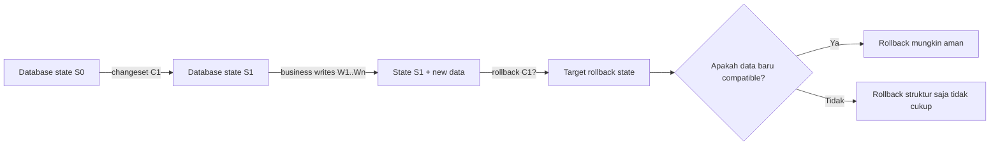
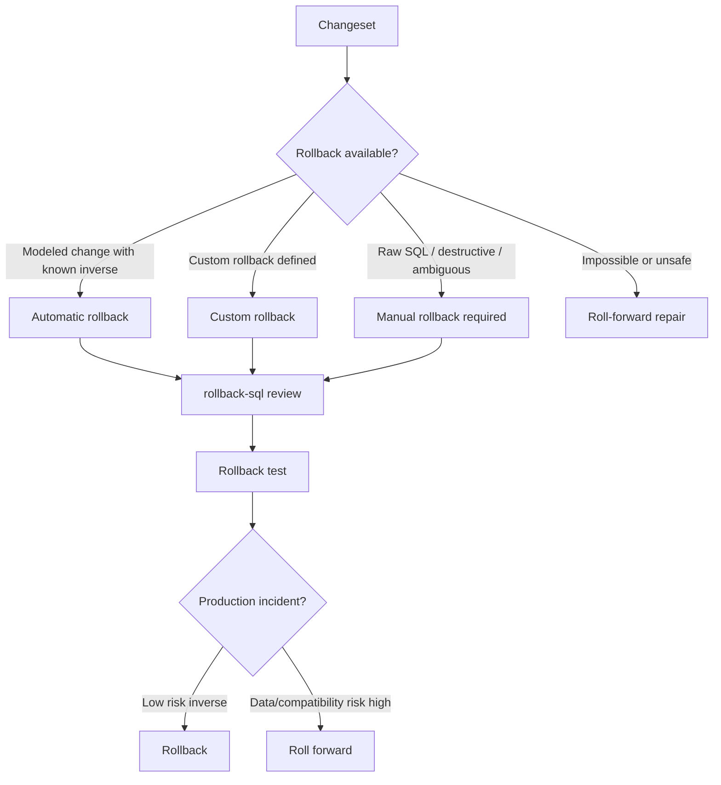
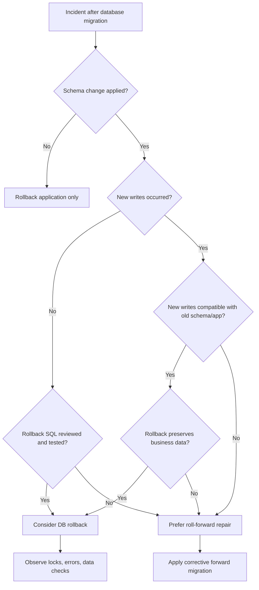
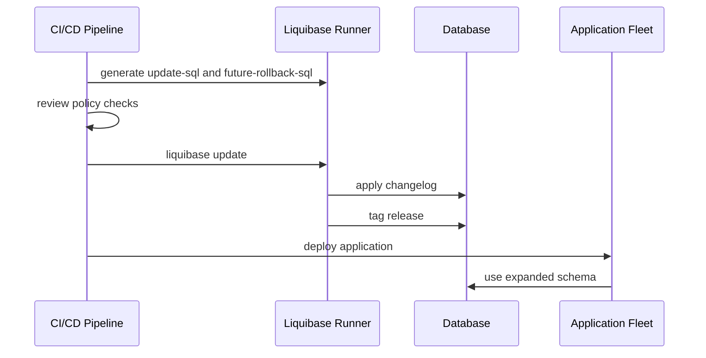

# Part 019 — Liquibase Rollback Model: Automatic Rollback, Custom Rollback, Tag, RollbackSQL

Rollback adalah salah satu area database migration yang paling sering dipahami secara terlalu sederhana.

Di aplikasi stateless, rollback sering berarti menjalankan versi artifact sebelumnya. Di database, rollback berarti mencoba membawa kembali **stateful shared system** ke keadaan sebelumnya. Itu jauh lebih berat karena database menyimpan data bisnis, constraint, index, metadata, sequence, lock state, audit trail, dan sering menjadi contract antara beberapa versi aplikasi.

Bagian ini membahas rollback Liquibase bukan sebagai fitur CLI semata, tetapi sebagai **operational safety model**.

Targetnya: setelah membaca part ini, kita tidak sekadar tahu command `rollback`, tetapi mampu menjawab pertanyaan arsitektural seperti:

- Apakah perubahan ini benar-benar bisa di-rollback?
- Apakah rollback lebih aman daripada roll-forward?
- Apakah rollback mengembalikan data atau hanya struktur?
- Apakah rollback sudah diuji terhadap database production-like?
- Apakah rollback bisa dijalankan tanpa melanggar compatibility window?
- Apakah rollback menghasilkan evidence yang cukup untuk audit dan incident review?

---

## 1. Kaufman Deconstruction

Mengikuti pendekatan Josh Kaufman, kita pecah skill “Liquibase rollback” menjadi sub-skill yang bisa dilatih.

| Sub-skill | Pertanyaan inti | Output yang diharapkan |
|---|---|---|
| Rollback modelling | Apa inverse dari perubahan ini? | Rollback class: automatic, custom, impossible, roll-forward |
| Tagging discipline | Titik mana yang bisa menjadi checkpoint? | Release tag, deployment tag, audit marker |
| Rollback SQL inspection | SQL apa yang benar-benar akan dijalankan? | Reviewed rollback artifact |
| Destructive change analysis | Data apa yang hilang jika rollback? | Data preservation plan |
| Compatibility reasoning | Apakah old app masih compatible setelah rollback? | Deployment matrix |
| Transaction/lock analysis | Apakah rollback bisa blocking production? | Lock and timeout plan |
| Testing rollback | Apakah rollback bisa diterapkan dan update ulang? | Tested recovery confidence |
| Operational decision | Rollback atau roll-forward? | Incident-safe decision tree |

Skill yang ingin dibentuk bukan “hafal syntax Liquibase”, tetapi **kemampuan memodelkan inverse state transition**.

---

## 2. Mental Model: Rollback Bukan Mesin Waktu

Rollback sering diasumsikan sebagai:

> “Kalau migration gagal, tinggal rollback.”

Asumsi ini lemah.

Rollback database tidak otomatis mengembalikan realitas bisnis yang sudah berubah setelah deployment. Jika aplikasi baru sudah menulis data dalam bentuk schema baru, rollback schema dapat membuat data tersebut tidak terbaca oleh aplikasi lama.

Model yang lebih tepat:



Rollback harus dibaca sebagai **inverse migration operation**, bukan undo penuh terhadap seluruh akibat deployment.

Ada minimal tiga layer yang perlu dibedakan:

| Layer | Contoh | Apakah rollback Liquibase menyelesaikan? |
|---|---|---|
| Schema structure | table, column, index, constraint | Kadang, tergantung change type/rollback logic |
| Data state | rows inserted/updated/deleted | Hanya jika rollback DML eksplisit dan data masih tersedia |
| Application semantics | app menulis format baru | Tidak otomatis |

Karena itu, rollback harus selalu dianalisis bersama deployment strategy aplikasi.

---

## 3. Liquibase Rollback Building Blocks

Liquibase menyediakan beberapa konsep penting untuk rollback:

1. **Rollback command**: membalik perubahan sampai tag tertentu.
2. **Rollback count/date**: membalik sejumlah changeset atau sampai waktu tertentu.
3. **Tag**: checkpoint rollback.
4. **Rollback SQL preview**: menghasilkan SQL rollback tanpa menjalankannya.
5. **Automatic rollback**: Liquibase dapat membuat inverse untuk beberapa change type di modeled changelog.
6. **Custom rollback**: rollback logic yang kita definisikan sendiri.
7. **Future rollback SQL**: melihat SQL rollback untuk changeset yang belum diterapkan.
8. **Update testing rollback**: menjalankan update, rollback, lalu update lagi untuk menguji reversibility.

Model konseptualnya:



---

## 4. Rollback Command Families

Liquibase rollback commands tidak semuanya sama. Setiap command merepresentasikan cara memilih target state.

| Command family | Target rollback | Cocok untuk | Risiko utama |
|---|---|---|---|
| `rollback --tag=<tag>` | Kembali sampai tag | Release checkpoint | Tag salah/hilang; rollback terlalu banyak |
| `rollback-count --count=N` | Membalik N changeset terakhir | Local/dev, tactical fix | Count salah, dependency antar changeset |
| `rollback-to-date` | Membalik sampai waktu tertentu | Emergency window | Timestamp ambiguity, timezone, deployment overlap |
| `rollback-one-changeset` | Membalik satu changeset tertentu | Targeted Secure workflow | Bisa melanggar dependency urutan |
| `rollback-one-update` | Membalik satu deployment/update | Deployment scoped rollback | Butuh deployment identity yang jelas |
| `rollback-sql` | Generate SQL rollback | Review sebelum eksekusi | SQL bisa valid tapi semantically unsafe |
| `future-rollback-sql` | Generate rollback SQL untuk pending changes | PR/pipeline review | Tidak menjamin data runtime aman |

Untuk production, `rollback-sql` atau `future-rollback-sql` sebaiknya diperlakukan sebagai **review artifact**, bukan sekadar debug output.

---

## 5. Tag sebagai Checkpoint, Bukan Dekorasi

Rollback by tag hanya masuk akal jika tag dikelola sebagai bagian dari release protocol.

Ada dua pendekatan umum:

### 5.1 CLI Tag

Tag diterapkan setelah update berhasil.

```bash
liquibase update
liquibase tag --tag=release-2026-06-28.1
```

Kelebihan:

- Cocok untuk release pipeline.
- Tag merepresentasikan database setelah migration sukses.
- Tidak menambah changeset di changelog.

Risiko:

- Jika pipeline gagal membuat tag, rollback checkpoint tidak ada.
- Jika tag dibuat manual, evidence bisa lemah.

### 5.2 `tagDatabase` Changeset

Tag disimpan sebagai bagian dari changelog.

```yaml
- changeSet:
    id: release-2026-06-28-1-tag
    author: platform-db
    changes:
      - tagDatabase:
          tag: release-2026-06-28.1
```

Kelebihan:

- Tag menjadi bagian dari version-controlled migration history.
- Reviewable di pull request.
- Cocok untuk regulated release train.

Risiko:

- Bisa bercampur dengan business schema changes.
- Jika terlalu banyak tag changeset, changelog menjadi noisy.

### Rule of Thumb

Gunakan tag sebagai **release checkpoint** jika ada kemungkinan rollback by release.

Jangan pakai tag sebagai dekorasi setiap perubahan kecil tanpa operational meaning.

---

## 6. Automatic Rollback

Liquibase dapat menghasilkan rollback otomatis untuk beberapa modeled change types seperti `createTable`, `addColumn`, atau `renameColumn` karena inverse-nya cukup jelas.

Contoh:

```yaml
- changeSet:
    id: 019-001-create-case-note
    author: case-platform
    changes:
      - createTable:
          tableName: case_note
          columns:
            - column:
                name: id
                type: bigint
                constraints:
                  primaryKey: true
                  nullable: false
            - column:
                name: case_id
                type: bigint
                constraints:
                  nullable: false
            - column:
                name: body
                type: text
```

Inverse yang bisa dihasilkan Liquibase secara konseptual adalah `DROP TABLE case_note`.

Namun “automatic” tidak berarti “safe”.

Jika table sudah menerima data production, rollback otomatis `DROP TABLE` dapat menghapus data. Secara struktur itu inverse, tetapi secara operasional bisa bencana.

### Automatic Rollback Safety Matrix

| Change type | Automatic inverse mungkin? | Production safety |
|---|---:|---|
| `createTable` | Ya | Aman hanya jika table belum dipakai atau data disposable |
| `addColumn` | Ya | Aman jika column belum berisi data penting |
| `renameColumn` | Ya | Risiko compatibility app lama/baru |
| `createIndex` | Ya | Biasanya aman, tapi bisa lock/beban IO |
| `addNotNullConstraint` | Ya | Rollback bisa melemahkan invariant data |
| `dropTable` | Tidak reliable | Sangat berisiko |
| `delete`/`insert` | Sering butuh custom | Data semantic risk tinggi |

Kesalahan umum: menyamakan “Liquibase bisa membuat SQL rollback” dengan “rollback aman dilakukan”.

---

## 7. Custom Rollback

Custom rollback diperlukan saat inverse tidak bisa ditebak, tidak cukup, atau perlu dikendalikan.

### 7.1 YAML Example

```yaml
- changeSet:
    id: 019-002-add-status-column
    author: enforcement-team
    changes:
      - addColumn:
          tableName: enforcement_case
          columns:
            - column:
                name: lifecycle_status
                type: varchar(40)
                defaultValue: OPEN
                constraints:
                  nullable: false
    rollback:
      - dropColumn:
          tableName: enforcement_case
          columnName: lifecycle_status
```

Ini terlihat aman, tetapi belum tentu benar. Jika aplikasi baru sudah memakai `lifecycle_status` untuk state machine, rollback column akan menghapus state yang mungkin tidak bisa direkonstruksi.

### 7.2 Formatted SQL Example

Dalam formatted SQL, rollback harus ditulis manual.

```sql
--liquibase formatted sql

--changeset enforcement-team:019-003-add-case-priority
ALTER TABLE enforcement_case
ADD COLUMN priority VARCHAR(20) DEFAULT 'NORMAL' NOT NULL;

--rollback ALTER TABLE enforcement_case DROP COLUMN priority;
```

Untuk raw SQL, biasakan setiap changeset memiliki rollback block atau explicit declaration bahwa rollback bukan strategi recovery.

### 7.3 Multi-step Rollback

Rollback tidak selalu satu statement.

```yaml
- changeSet:
    id: 019-004-migrate-case-type
    author: case-platform
    changes:
      - addColumn:
          tableName: enforcement_case
          columns:
            - column:
                name: case_type_v2
                type: varchar(50)
      - sql:
          sql: |
            UPDATE enforcement_case
            SET case_type_v2 = CASE
              WHEN case_type = 'A' THEN 'ADMINISTRATIVE'
              WHEN case_type = 'C' THEN 'CRIMINAL'
              ELSE 'UNKNOWN'
            END;
    rollback:
      - sql:
          sql: |
            UPDATE enforcement_case
            SET case_type_v2 = NULL;
      - dropColumn:
          tableName: enforcement_case
          columnName: case_type_v2
```

Perhatikan: rollback ini tidak mengembalikan `case_type` dari `case_type_v2`. Ia hanya menghapus hasil transisi. Jika aplikasi sudah menulis data baru hanya ke `case_type_v2`, rollback ini kehilangan informasi.

---

## 8. Rollback Capability Classes

Setiap changeset perlu diklasifikasi berdasarkan kemampuan rollback.

| Class | Nama | Karakteristik | Strategi |
|---|---|---|---|
| R0 | No-op rollback | Tidak mengubah state atau rollback tidak diperlukan | Mark explicitly |
| R1 | Structural reversible | DDL bisa dibalik tanpa data loss penting | Automatic/custom rollback |
| R2 | Reversible with data preservation | Butuh shadow copy/audit/backup | Custom rollback + validation |
| R3 | Semantically irreversible | Data lama tidak bisa direkonstruksi penuh | Roll-forward preferred |
| R4 | Destructive irreversible | Drop/truncate/delete tanpa backup | Block or require exceptional approval |

Contoh penerapan:

| Changeset | Class | Catatan |
|---|---|---|
| Add nullable column unused by app | R1 | Drop column mungkin cukup |
| Add index | R1 | Perhatikan lock dan IO |
| Insert lookup row | R2 | Rollback delete hanya aman jika belum dipakai FK |
| Split table with live writes | R2/R3 | Butuh dual-write/backfill verification |
| Drop column after contract phase | R3 | Roll-forward sering lebih aman |
| Truncate business table | R4 | Harus dicegah kecuali controlled maintenance |

---

## 9. Rollback vs Roll-forward Decision

Di production, rollback sering kalah aman dibanding roll-forward.

Gunakan decision tree berikut:



Rollback layak dipilih jika:

- perubahan belum digunakan oleh aplikasi baru,
- data baru belum ditulis atau masih compatible,
- rollback SQL sudah direview,
- rollback sudah diuji di database production-like,
- lock risk acceptable,
- rollback membawa sistem ke state yang lebih aman.

Roll-forward lebih baik jika:

- data sudah berubah secara irreversible,
- app old/new compatibility tidak jelas,
- rollback akan menghapus data,
- rollback command akan mengeksekusi destructive DDL,
- incident bisa diselesaikan dengan patch kecil,
- regulatory/audit risk rollback lebih tinggi.

---

## 10. Preview Rollback SQL

Jangan menjalankan rollback production tanpa tahu SQL yang akan dieksekusi.

Contoh pipeline artifact:

```bash
liquibase \
  --changelog-file=db/changelog/db.changelog-master.yaml \
  --url="$JDBC_URL" \
  rollback-sql \
  --tag=release-2026-06-28.1 \
  --output-file=build/liquibase/rollback-release-2026-06-28.1.sql
```

Untuk pending changesets:

```bash
liquibase \
  --changelog-file=db/changelog/db.changelog-master.yaml \
  --url="$JDBC_URL" \
  future-rollback-sql \
  --output-file=build/liquibase/future-rollback.sql
```

Review rollback SQL dengan pertanyaan:

- Apakah ada `DROP`, `TRUNCATE`, `DELETE` tanpa predicate?
- Apakah rollback menghapus column yang sudah bisa berisi data baru?
- Apakah rollback menghapus lookup row yang mungkin sudah direferensikan?
- Apakah rollback mengubah constraint sehingga data invalid bisa masuk?
- Apakah rollback statement bisa lock table besar?
- Apakah rollback berurutan secara dependency-safe?

---

## 11. Testing Rollback

Rollback yang tidak pernah diuji adalah dokumentasi optimistis.

Minimum test pipeline:

```mermaid
flowchart LR
    A[Start ephemeral DB] --> B[Apply previous release changelog]
    B --> C[Load representative data]
    C --> D[Apply pending migration]
    D --> E[Run app compatibility tests]
    E --> F[Generate rollback SQL]
    F --> G[Run rollback]
    G --> H[Verify schema/data invariants]
    H --> I[Run update again]
    I --> J[Verify idempotent release path]
```



Liquibase memiliki pola `updateTestingRollback` yang secara konsep menjalankan update, rollback, lalu update lagi untuk pending changesets. Namun untuk production-grade confidence, jangan berhenti di situ. Tambahkan representative data, application compatibility test, dan invariant checks.

### Invariant Check Example

```sql
-- no orphan case notes after rollback
SELECT COUNT(*) AS orphan_notes
FROM case_note n
LEFT JOIN enforcement_case c ON c.id = n.case_id
WHERE c.id IS NULL;
```

```sql
-- all lifecycle statuses still mapped after rollback/roll-forward
SELECT lifecycle_status, COUNT(*)
FROM enforcement_case
GROUP BY lifecycle_status
ORDER BY lifecycle_status;
```

---

## 12. Rollback untuk Reference Data

Reference data rollback sering lebih tricky daripada DDL.

Contoh buruk:

```yaml
- changeSet:
    id: 019-005-insert-status
    author: compliance-team
    changes:
      - insert:
          tableName: case_status
          columns:
            - column:
                name: code
                value: ESCALATED
            - column:
                name: label
                value: Escalated
    rollback:
      - delete:
          tableName: case_status
          where: code = 'ESCALATED'
```

Masalah: jika status `ESCALATED` sudah dipakai oleh `enforcement_case`, rollback delete akan gagal karena FK atau lebih buruk, menghapus referensi yang dibutuhkan.

Pattern lebih aman:

```yaml
- changeSet:
    id: 019-006-insert-status-safe
    author: compliance-team
    changes:
      - insert:
          tableName: case_status
          columns:
            - column:
                name: code
                value: ESCALATED
            - column:
                name: label
                value: Escalated
            - column:
                name: active
                valueBoolean: true
    rollback:
      - update:
          tableName: case_status
          columns:
            - column:
                name: active
                valueBoolean: false
          where: code = 'ESCALATED'
```

Soft-disable sering lebih aman daripada delete.

---

## 13. Rollback untuk Destructive Changes

Destructive changes harus dianggap irreversible sampai terbukti sebaliknya.

Contoh destructive operations:

- `dropTable`
- `dropColumn`
- `truncate`
- `delete` massal
- data type narrowing
- lossy transformation
- dropping enum/lookup value yang sudah digunakan
- dropping index yang diperlukan untuk latency SLA

Untuk destructive changes, gunakan playbook:

1. Expand/contract dulu.
2. Pastikan object tidak dipakai app versi mana pun.
3. Ambil backup/snapshot jika data penting.
4. Jalankan precondition untuk memastikan tidak ada dependency aktif.
5. Buat custom rollback hanya jika realistis.
6. Jika rollback tidak realistis, tulis `rollback impossible; use roll-forward` sebagai explicit decision.

Contoh guarded destructive change:

```yaml
- changeSet:
    id: 019-007-drop-legacy-column
    author: platform-db
    preConditions:
      onFail: HALT
      onError: HALT
      - sqlCheck:
          expectedResult: 0
          sql: |
            SELECT COUNT(*)
            FROM app_feature_flag
            WHERE flag_name = 'read_legacy_case_type'
              AND enabled = true
    changes:
      - dropColumn:
          tableName: enforcement_case
          columnName: legacy_case_type
    rollback:
      - sql:
          sql: |
            -- Roll-forward preferred. Recreating this column does not restore data.
            ALTER TABLE enforcement_case ADD COLUMN legacy_case_type VARCHAR(20);
```

Perhatikan: rollback ini tidak memulihkan data. Komentar eksplisit penting agar reviewer tidak salah percaya.

---

## 14. Rollback dan Compatibility Window

Rollback database harus compatible dengan aplikasi yang sedang berjalan.

Matrix sederhana:

| DB state | App old | App new | Aman? |
|---|---:|---:|---|
| S0 old schema | ✅ | ❌ | Sebelum deploy app baru |
| S1 expanded schema | ✅ | ✅ | Ideal compatibility window |
| S2 new writes | ❓ | ✅ | Tergantung dual-write/dual-read |
| S3 contracted schema | ❌ | ✅ | Tidak aman untuk rollback app old |

Rollback dari S3 ke S0 sering tidak realistis jika data sudah masuk melalui app new.

Karena itu, rollback strategy harus ditentukan sebelum migration:

- **Application rollback only**: DB tetap expanded, app kembali ke versi lama.
- **Database rollback**: DB dikembalikan ke checkpoint tertentu.
- **Roll-forward patch**: DB/app diperbaiki maju.
- **Operational mitigation**: disable feature flag, pause writer, route traffic.

Dalam zero-downtime system, skenario paling sehat biasanya:

1. DB expand.
2. App deploy new but backward-compatible.
3. Jika app bermasalah, rollback app saja.
4. DB tetap expanded sampai yakin aman contract.

---

## 15. Java/Spring Boot Operational Integration

Jika Liquibase berjalan otomatis saat Spring Boot startup, rollback menjadi lebih rumit.

Masalah yang sering muncul:

- beberapa pod mencoba migration bersamaan,
- startup gagal karena migration gagal,
- liveness/readiness tidak membedakan migration failure vs app failure,
- rollback aplikasi tidak rollback database,
- migration lock tertinggal membuat instance berikutnya gagal start.

Untuk production critical system, lebih aman menjalankan migration sebagai dedicated step sebelum rollout aplikasi.



Spring Boot auto-run Liquibase masih berguna untuk:

- local development,
- integration test,
- small internal tools,
- ephemeral environment,
- controlled single-instance service.

Untuk fleet besar, gunakan dedicated migration job.

---

## 16. Rollback Evidence untuk Audit

Rollback di regulated environment harus meninggalkan evidence.

Minimal evidence bundle:

```txt
rollback-evidence/
  release-id.txt
  incident-id.txt
  changelog-commit-sha.txt
  database-target.txt
  liquibase-status-before.txt
  liquibase-history-before.csv
  rollback-sql-reviewed.sql
  approval-record.md
  execution-log.txt
  liquibase-status-after.txt
  invariant-checks.sql
  invariant-results.csv
  post-rollback-observation.md
```

Evidence bukan birokrasi. Ia membantu menjawab:

- siapa menyetujui rollback,
- SQL apa yang dijalankan,
- database mana yang terkena,
- changeset mana yang dibalik,
- apakah data invariant masih valid,
- apakah follow-up remediation diperlukan.

---

## 17. Common Anti-Patterns

### 17.1 Rollback Fantasy

Menganggap setiap migration bisa di-rollback hanya karena tool mendukung rollback command.

Perbaikan: klasifikasi rollback capability per changeset.

### 17.2 Editing Changeset sebelum Rollback

Jika changeset sudah diterapkan lalu diedit, checksum mismatch dapat menghalangi operasi normal. Untuk rollback karena error, rollback dulu, baru buat perubahan baru.

Perbaikan: immutable applied changeset.

### 17.3 Rollback DDL tanpa Data Plan

Menulis rollback `DROP COLUMN` untuk column yang sudah berisi data business-critical.

Perbaikan: data preservation strategy atau roll-forward.

### 17.4 Tag Tidak Konsisten

Tag dibuat manual, tidak ada di semua environment, atau tidak sesuai release artifact.

Perbaikan: tag sebagai pipeline-controlled release checkpoint.

### 17.5 Rollback Count di Production

Menggunakan `rollback-count 1` tanpa memahami dependency dan urutan deployment.

Perbaikan: rollback by release tag atau reviewed rollback SQL.

### 17.6 Raw SQL tanpa Rollback Block

Formatted SQL changeset tanpa `--rollback`.

Perbaikan: enforce rollback policy untuk high-risk changeset.

### 17.7 Rollback Test tanpa Data

Rollback diuji di empty database, lalu dianggap aman untuk production.

Perbaikan: production-like snapshot or fixture with edge cases.

---

## 18. Production Rollback Checklist

Gunakan checklist ini sebelum menyetujui rollback database:

```txt
[ ] Release/changelog commit SHA diketahui
[ ] Target database dan schema jelas
[ ] Tag rollback tersedia dan diverifikasi
[ ] Liquibase status/history sebelum rollback diambil
[ ] rollback-sql sudah dihasilkan
[ ] rollback-sql sudah direview engineer + DBA/platform owner
[ ] Destructive SQL diidentifikasi
[ ] Data preservation plan tersedia jika perlu
[ ] App compatibility matrix jelas
[ ] New writes setelah deployment dianalisis
[ ] Lock/timeout risk dianalisis
[ ] Backup/snapshot tersedia untuk high-risk change
[ ] Rollback sudah diuji di staging/production-like DB
[ ] Invariant checks siap dijalankan
[ ] Observability dashboard siap
[ ] Stop criteria jelas
[ ] Roll-forward alternative tersedia
[ ] Approval evidence tersimpan
```

---

## 19. Practice Drills

### Drill 1 — Automatic Rollback Trap

Buat changeset `createTable audit_event`. Terapkan migration, insert 10 row, lalu generate rollback SQL. Jelaskan kenapa SQL rollback benar secara struktur tapi mungkin salah secara bisnis.

### Drill 2 — Reference Data Rollback

Tambahkan lookup value baru yang sudah mungkin dipakai FK. Desain rollback yang tidak menghapus row secara fisik.

### Drill 3 — Rollback vs Roll-forward Decision

Simulasikan deployment gagal setelah app baru menulis data ke column baru. Buat decision memo: rollback DB, rollback app only, atau roll-forward.

### Drill 4 — Tag Discipline

Desain naming convention release tag untuk multi-service platform:

```txt
<domain>-<service>-<release-date>-<sequence>-<git-sha-short>
```

Jelaskan trade-off verbosity vs audit clarity.

---

## 20. Summary

Rollback Liquibase adalah framework untuk membalik changeset, bukan jaminan bahwa sistem bisa kembali ke masa lalu.

Mental model yang benar:

- rollback adalah inverse state transition,
- automatic rollback tidak sama dengan safe rollback,
- destructive changes sering lebih cocok dengan roll-forward,
- tag adalah release checkpoint,
- rollback SQL harus direview sebelum production,
- rollback harus diuji dengan data representative,
- compatibility app/schema lebih penting daripada command syntax,
- audit evidence adalah bagian dari operational correctness.

Skill top-tier bukan sekadar tahu `liquibase rollback`, tetapi tahu kapan **tidak** menjalankannya.

---

## References

- Liquibase Docs — rollback command: https://docs.liquibase.com/secure/reference-guide-5-1-1/init-update-and-rollback-commands/rollback
- Liquibase Docs — automatic rollback support: https://docs.liquibase.com/secure/user-guide-5-1-1/what-automatic-rollbacks-does-liquibase-support
- Liquibase Docs — future-rollback-sql: https://docs.liquibase.com/secure/reference-guide-5-1-1/init-update-and-rollback-commands/future-rollback-sql
- Liquibase Docs — rollback-count: https://docs.liquibase.com/secure/reference-guide-5-1-1/init-update-and-rollback-commands/rollback-count
- Spring Boot Docs — Database Initialization: https://docs.spring.io/spring-boot/how-to/data-initialization.html
