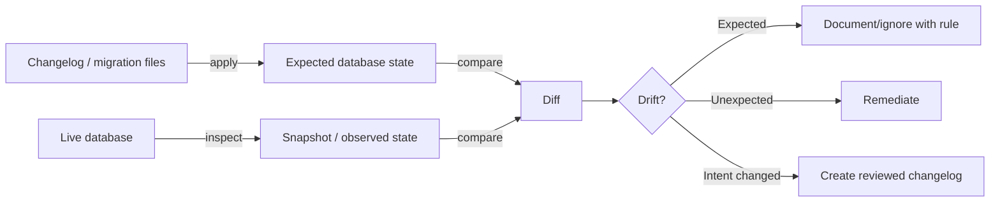
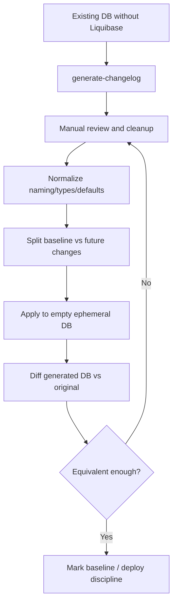
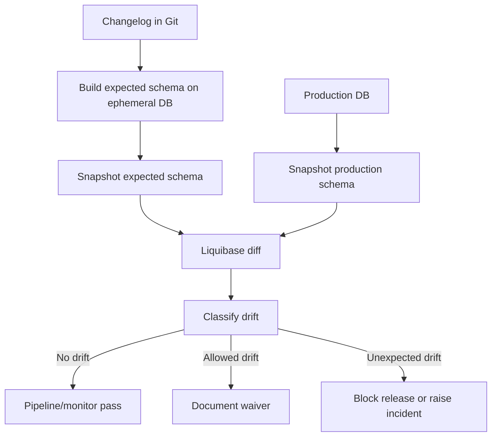

# Part 020 — Liquibase Diff, Snapshot, Generate Changelog, dan Drift Detection

Liquibase tidak hanya menjalankan migration. Ia juga bisa membantu kita **menginspeksi database**, membandingkan database, membuat snapshot, menghasilkan changelog dari state database, dan mendeteksi drift.

Namun fitur-fitur ini sering disalahgunakan.

Kesalahan paling berbahaya:

> “Production adalah kebenaran. Generate changelog dari production, commit, selesai.”

Itu bisa mengubah migration discipline menjadi reverse-engineering kacau. Production memang realitas, tetapi belum tentu **intended design**. Manual hotfix, eksperimen DBA, emergency patch, atau perubahan legacy bisa ada di production tanpa pernah menjadi contract yang disetujui.

Mental model bagian ini:

> Diff dan snapshot adalah sensor. Changelog tetap source of intent.

---

## 1. Kaufman Deconstruction

Skill “diff/snapshot/drift” kita pecah menjadi komponen kecil.

| Sub-skill | Pertanyaan inti | Output |
|---|---|---|
| Snapshot thinking | State apa yang sedang difoto? | Snapshot artifact |
| Diff direction | Mana reference, mana target? | Correct comparison semantics |
| Drift classification | Perbedaan ini missing, unexpected, changed, atau metadata-only? | Drift report triage |
| Changelog generation | Kapan generate changelog sah digunakan? | Bootstrap/adoption changelog |
| Reconciliation | Apakah drift harus dihapus, diadopsi, atau dibuat migration baru? | Remediation plan |
| CI integration | Kapan diff dijalankan otomatis? | Pipeline guardrail |
| Audit evidence | Bagaimana membuktikan schema sesuai intent? | Drift evidence bundle |

Tujuan latihan bukan membuat banyak generated SQL, tetapi membangun **schema truth management**.

---

## 2. Core Mental Model: Intent vs Reality

Dalam migration system ada tiga objek konseptual:



- **Changelog** adalah intent historis.
- **Expected state** adalah hasil jika changelog diterapkan bersih.
- **Live database** adalah realitas saat ini.
- **Snapshot** adalah representasi state yang diamati.
- **Diff** adalah perbedaan antara dua state.
- **Drift** adalah perbedaan yang tidak dijelaskan oleh intent resmi.

Diff tidak memberi tahu mana yang benar. Diff hanya memberi tahu bahwa state berbeda.

---

## 3. Liquibase Inspection Command Families

Beberapa command penting:

| Command | Fungsi utama | Kapan dipakai |
|---|---|---|
| `snapshot` | Menghasilkan representasi state database | Audit, offline compare, baseline evidence |
| `diff` | Membandingkan dua database/snapshot | Drift detection, environment comparison |
| `diff-changelog` | Membuat changelog untuk menyinkronkan perbedaan | Adoption, controlled reconciliation |
| `generate-changelog` | Membuat changelog dari state database saat ini | Existing database onboarding |
| `status` | Melihat changeset pending | Pipeline readiness |
| `history` | Melihat executed changeset | Audit/execution review |
| `update-sql` | Preview SQL update | Deployment review |
| `future-rollback-sql` | Preview SQL rollback untuk pending changes | Rollback readiness |

Pada sistem besar, inspection command sebaiknya menghasilkan artifact yang disimpan, bukan output ephemeral di terminal.

---

## 4. Snapshot

Snapshot adalah foto metadata database pada waktu tertentu.

Contoh conceptual command:

```bash
liquibase \
  --url="$JDBC_URL" \
  --snapshot-format=json \
  snapshot \
  --output-file=build/liquibase/snapshots/staging-2026-06-28.json
```

Snapshot berguna untuk:

- membandingkan database tanpa koneksi langsung ke reference DB,
- menyimpan evidence state sebelum/after migration,
- drift detection periodik,
- onboarding existing database,
- investigasi incident,
- audit trail schema.

Namun snapshot bukan source of truth jangka panjang. Snapshot adalah observation.

### Snapshot Artifact Policy

| Artifact | Simpan? | Alasan |
|---|---:|---|
| Pre-production snapshot | Ya untuk high-risk release | Evidence sebelum perubahan |
| Post-production snapshot | Ya untuk regulated system | Evidence hasil perubahan |
| Dev local snapshot | Tidak wajib | Noise tinggi |
| Golden schema snapshot | Ya | Reference untuk diff |
| Emergency incident snapshot | Ya | Forensic analysis |

---

## 5. Diff Direction: Reference vs Target

Diff direction adalah sumber bug yang sering terjadi.

Dalam Liquibase, comparison umumnya memakai:

- `reference-url`: sumber/reference/basis perbandingan,
- `url`: target database yang dibandingkan terhadap reference.

Mental model:

```txt
reference-url = expected or source of truth
url           = observed or target to evaluate
```

Contoh:

```bash
liquibase diff \
  --reference-url="offline:postgresql?snapshot=golden-schema.json" \
  --url="$PROD_JDBC_URL"
```

Makna: “Bandingkan production terhadap golden schema.”

Jika dibalik, interpretasi missing/unexpected bisa terbalik.

### Direction Example

| Object | Golden | Production | Jika golden reference | Jika production reference |
|---|---:|---:|---|---|
| `case_audit` table | Ada | Tidak ada | Missing in prod | Unexpected in golden |
| `manual_patch_col` | Tidak ada | Ada | Unexpected in prod | Missing in golden |

Kesalahan direction bisa membuat remediation salah total.

---

## 6. `generate-changelog`

`generate-changelog` menciptakan changelog yang menggambarkan current state database.

Penggunaan sehat:

- onboarding existing database yang belum pernah dikelola Liquibase,
- membuat baseline changelog awal,
- reverse-engineering legacy schema untuk mulai migration discipline,
- menghasilkan dokumentasi awal yang kemudian direview/manual cleanup.

Penggunaan tidak sehat:

- menggantikan proses authoring migration,
- menjadikan production state sebagai design tanpa review,
- meng-commit generated changelog besar tanpa memahami dependency,
- menjalankan generated changelog ke environment lain tanpa verifikasi,
- menggunakan generated changelog berulang setiap release.

### Existing Database Adoption Flow



Generated changelog harus diperlakukan sebagai draft, bukan kebenaran final.

---

## 7. `diff-changelog`

`diff-changelog` membandingkan dua database atau snapshot lalu menghasilkan deployable changesets untuk menyinkronkan sebagian besar perbedaan.

Ini berguna untuk:

- membuat candidate remediation changelog,
- memahami drift secara structured,
- menyinkronkan environment controlled,
- onboarding multi-environment legacy system.

Tetapi output `diff-changelog` harus direview.

Contoh warning mental:

```txt
Generated changelog tells you how to make A look like B.
It does not tell you whether B is the correct design.
```

### Example Use

```bash
liquibase diff-changelog \
  --changelog-file=build/liquibase/generated/drift-candidate.yaml \
  --reference-url="offline:postgresql?snapshot=golden-schema.json" \
  --url="$STAGING_JDBC_URL"
```

Kemudian engineer harus menjawab:

- Apakah perubahan ini expected?
- Apakah object missing karena migration belum jalan?
- Apakah object unexpected karena manual hotfix?
- Apakah perubahan harus dihapus dari target atau diadopsi ke changelog?
- Apakah generated order aman?
- Apakah dependency object lengkap?

---

## 8. Drift

Drift adalah perbedaan antara expected database state dan actual database state yang tidak dijelaskan oleh migration intent resmi.

Drift biasanya muncul dari:

- manual SQL di production,
- hotfix yang tidak dikembalikan ke changelog,
- DBA emergency operation,
- failed/partial migration,
- environment-specific script,
- privilege/grant manual,
- ORM auto-DDL aktif di satu environment,
- test data atau seed data bercampur dengan reference data,
- generated objects yang tidak dimodelkan dengan baik,
- platform upgrade yang mengubah metadata.

### Drift Classification

| Drift type | Contoh | Severity |
|---|---|---:|
| Missing object | table expected tidak ada | High |
| Unexpected object | manual table ada di prod | Medium/High |
| Changed object | column type/default berbeda | High |
| Constraint drift | FK/index/unique berbeda | High |
| Permission drift | grant berbeda | Medium/High |
| Stored logic drift | function/procedure berbeda | High |
| Sequence drift | increment/cache berbeda | Medium |
| Metadata drift | comment berbeda | Low/Medium |
| Environment drift | tablespace/storage berbeda | Depends |

Jangan semua drift diperlakukan sama. Severity harus dikaitkan dengan runtime behavior, data correctness, security, dan audit impact.

---

## 9. Drift Detection Architecture

Di organisasi mature, drift detection adalah kontrol rutin.



Ada dua mode utama:

### 9.1 Pre-release Drift Check

Sebelum deploy migration baru, cek apakah target environment berada di expected baseline.

Jika target sudah drift, migration baru bisa gagal atau menghasilkan state yang tidak diprediksi.

### 9.2 Periodic Drift Audit

Jalankan harian/mingguan untuk regulated atau high-criticality database.

Tujuan bukan hanya teknis, tetapi governance:

- mendeteksi manual change,
- menjaga release evidence,
- mengurangi unknown unknowns,
- mempercepat incident diagnosis.

---

## 10. Golden Schema Strategy

Golden schema adalah expected schema yang dihasilkan dari changelog resmi.

Cara membuatnya:

1. Start empty database dengan engine/version yang sama.
2. Jalankan seluruh changelog resmi.
3. Ambil snapshot.
4. Gunakan snapshot sebagai reference untuk diff terhadap environment lain.

```bash
# 1. Create ephemeral DB
# 2. Apply changelog
liquibase \
  --url="$EPHEMERAL_JDBC_URL" \
  --changelog-file=db/changelog/db.changelog-master.yaml \
  update

# 3. Snapshot expected state
liquibase \
  --url="$EPHEMERAL_JDBC_URL" \
  snapshot \
  --snapshot-format=json \
  --output-file=build/liquibase/golden-schema.json

# 4. Compare prod
liquibase diff \
  --reference-url="offline:postgresql?snapshot=build/liquibase/golden-schema.json" \
  --url="$PROD_JDBC_URL"
```

Golden schema perlu dibuat ulang dari source setiap pipeline. Jangan treat golden snapshot lama sebagai source of truth yang menggantikan changelog.

---

## 11. Baseline vs Drift

Baseline dan drift sering tercampur.

| Situation | Makna | Strategy |
|---|---|---|
| Existing DB belum pakai Liquibase | Bukan drift; belum ada tracking | Generate baseline, review, adopt |
| DB punya manual hotfix setelah Liquibase aktif | Drift | Reconcile via changelog atau revert |
| Staging belum menerima release terbaru | Version skew | Apply pending migration, bukan drift incident |
| Production punya index tambahan manual | Drift atau approved exception | Adopt as migration atau document waiver |
| Dev DB berbeda karena eksperimen lokal | Local noise | Reset/recreate dev DB |

Drift baru bermakna jika ada expected state yang jelas.

---

## 12. Reconciliation Patterns

Saat diff menemukan perbedaan, ada beberapa pilihan.

### 12.1 Revert Drift

Jika perubahan manual tidak sah dan tidak dipakai, hapus dari target.

```yaml
- changeSet:
    id: 020-001-remove-manual-debug-table
    author: platform-db
    preConditions:
      onFail: HALT
      - tableExists:
          tableName: debug_case_export
    changes:
      - dropTable:
          tableName: debug_case_export
    rollback:
      - sql:
          sql: |
            -- Not recoverable. Table was manual/debug-only and approved for removal.
```

### 12.2 Adopt Drift

Jika perubahan manual ternyata benar dan dibutuhkan, jangan biarkan tetap manual. Jadikan migration resmi.

```yaml
- changeSet:
    id: 020-002-adopt-prod-index-case-status
    author: platform-db
    preConditions:
      onFail: MARK_RAN
      - not:
          - indexExists:
              indexName: idx_case_status_created_at
              tableName: enforcement_case
    changes:
      - createIndex:
          tableName: enforcement_case
          indexName: idx_case_status_created_at
          columns:
            - column:
                name: status
            - column:
                name: created_at
    rollback:
      - dropIndex:
          tableName: enforcement_case
          indexName: idx_case_status_created_at
```

`MARK_RAN` di sini harus dipakai hati-hati. Tujuannya: jika index sudah ada karena manual hotfix yang disetujui, Liquibase menandai changeset sebagai applied agar environment lain bisa converge. Jangan gunakan `MARK_RAN` untuk menyembunyikan state yang tidak dipahami.

### 12.3 Waive Drift

Beberapa drift boleh ada karena environment-specific physical concern:

- tablespace,
- storage parameter,
- index fillfactor,
- partition placement,
- replication-specific object,
- monitoring extension.

Waiver harus eksplisit:

```yaml
allowedDrift:
  - object: index.enforcement_case.idx_case_status_created_at
    field: tablespace
    environment: production
    reason: DBA-managed storage placement
    approvedBy: database-platform-owner
    expires: 2026-12-31
```

Allowed drift tanpa expiry berubah menjadi hidden debt.

---

## 13. What Diff May Miss or Misrepresent

Diff tooling kuat, tetapi tidak sempurna.

Hal yang perlu diwaspadai:

- type alias antar database,
- default expression formatting,
- computed/generated column syntax,
- function body formatting,
- object dependency order,
- extension-owned objects,
- privileges/grants support berbeda,
- collation/charset nuance,
- index method/vendor-specific option,
- partitioning detail,
- trigger/function coupling,
- data type length/detail tertentu tergantung database support,
- semantic equivalence yang tidak tampak dari metadata.

Karena itu output diff harus direview oleh engineer yang paham domain dan database engine.

---

## 14. Diff in CI/CD

Minimal pipeline untuk Liquibase drift-aware delivery:

```mermaid
flowchart LR
    PR[Pull Request] --> TEST[Apply changelog to ephemeral DB]
    TEST --> SNAP[Generate expected snapshot]
    SNAP --> SQL[Generate update-sql]
    SQL --> RB[Generate future-rollback-sql]
    RB --> POLICY[Policy checks]
    POLICY --> MERGE[Merge]
    MERGE --> PRE[Pre-release target status/diff]
    PRE --> DEPLOY[Liquibase update]
    DEPLOY --> POST[Post-deploy snapshot/diff]
```



### CI Checks

| Check | Purpose |
|---|---|
| Apply from scratch | Changelog complete |
| Apply from previous release snapshot | Upgrade path valid |
| `status` | Pending changes known |
| `update-sql` | SQL review artifact |
| `future-rollback-sql` | Rollback review artifact |
| Snapshot expected schema | Golden reference |
| Diff target before deploy | Detect target drift |
| Diff target after deploy | Verify convergence |

---

## 15. Environment Comparison Patterns

### 15.1 Dev vs Changelog

Purpose: catch local accidental changes.

Action: usually reset dev DB.

### 15.2 Staging vs Golden

Purpose: ensure staging is production rehearsal.

Action: block release if staging drift unexplained.

### 15.3 Production vs Golden

Purpose: governance and safety.

Action: raise drift ticket/incident depending severity.

### 15.4 Production vs Production Replica

Purpose: ensure replicated/region-specific database is aligned.

Action: investigate replication/deployment inconsistency.

### 15.5 Tenant A vs Tenant B

Purpose: multi-tenant schema convergence.

Action: tenant-level repair/migration fan-out.

---

## 16. Multi-Tenant Drift

Dalam tenant-per-schema atau tenant-per-database model, drift bisa terjadi sebagian.

Contoh:

| Tenant | Version | Drift | Action |
|---|---|---|---|
| tenant_a | 2026.06.28.1 | none | OK |
| tenant_b | 2026.06.28.1 | missing index | Repair targeted |
| tenant_c | 2026.06.27.2 | version skew | Apply pending migration |
| tenant_d | unknown | manual object | Investigate |

Untuk multi-tenant, jangan hanya punya satu status global. Simpan tenant migration state:

```sql
CREATE TABLE tenant_schema_state (
    tenant_id        varchar(100) primary key,
    schema_name      varchar(100) not null,
    target_version   varchar(100) not null,
    current_version  varchar(100),
    drift_status     varchar(30) not null,
    last_checked_at  timestamp not null,
    last_error       text
);
```

Diff semua tenant setiap deploy mungkin mahal. Gunakan sampling + targeted check + periodic full audit.

---

## 17. Drift Severity Model

Severity harus praktis.

| Severity | Meaning | Example | Response |
|---:|---|---|---|
| 0 | No drift | None | Continue |
| 1 | Cosmetic metadata | Comment differs | Record/ignore |
| 2 | Non-runtime physical diff | Tablespace differs | Waiver/review |
| 3 | Performance-impacting | Missing index | Fix before high traffic |
| 4 | Correctness/security risk | Missing FK/grant drift | Block release |
| 5 | Active production danger | Wrong column type, missing table | Incident response |

Severity bukan hanya “berapa banyak object berbeda”. Satu missing constraint bisa lebih berbahaya daripada 100 comment differences.

---

## 18. Audit Evidence Bundle

Untuk regulated systems, simpan evidence berikut:

```txt
drift-evidence/
  changelog-commit-sha.txt
  liquibase-version.txt
  jdbc-driver-version.txt
  expected-schema-snapshot.json
  target-schema-snapshot.json
  diff-output.txt
  diff-changelog-candidate.yaml
  classification.md
  allowed-drift-waivers.yaml
  remediation-plan.md
  approval.md
  post-remediation-diff.txt
```

Evidence ini menjawab:

- schema expected berasal dari commit mana,
- target database state pada waktu apa,
- perbedaan apa yang ditemukan,
- siapa mengklasifikasi drift,
- apakah perbedaan dihapus, diadopsi, atau di-waive,
- apakah remediation berhasil.

---

## 19. Anti-Patterns

### 19.1 Production-as-Source-of-Truth

Generate changelog dari production lalu menganggapnya benar.

Perbaikan: production adalah observation, changelog adalah intent.

### 19.2 Blind Diff-Changelog Deploy

Menjalankan output `diff-changelog` langsung ke production.

Perbaikan: treat output sebagai draft candidate, review dependency dan semantics.

### 19.3 Wrong Diff Direction

Reference dan target tertukar sehingga missing/unexpected dibaca terbalik.

Perbaikan: tulis eksplisit di pipeline: expected -> actual.

### 19.4 Ignoring Manual Hotfix

Manual hotfix dilakukan di production tetapi tidak diadopsi ke changelog.

Perbaikan: every manual DB change must end as official migration or documented rollback.

### 19.5 Drift Report tanpa Owner

Pipeline menghasilkan report tetapi tidak ada yang bertanggung jawab.

Perbaikan: assign drift severity owner and SLA.

### 19.6 Treating All Drift as Equal

Comment drift dan missing FK diperlakukan sama.

Perbaikan: severity classification.

### 19.7 Generated Baseline Tanpa Cleanup

Generated changelog dari legacy schema langsung dipakai.

Perbaikan: normalize, split, review, test from scratch, diff back to original.

---

## 20. Practice Drills

### Drill 1 — Existing Database Onboarding

Ambil database legacy kecil, jalankan `generate-changelog`, lalu review output. Tandai minimal 10 hal yang perlu cleanup sebelum changelog dianggap production-grade.

### Drill 2 — Diff Direction

Buat dua database:

- DB A punya table `case_note`,
- DB B tidak punya table tersebut.

Jalankan diff dua arah. Jelaskan bagaimana interpretasi missing/unexpected berubah.

### Drill 3 — Manual Hotfix Adoption

Tambahkan index manual di staging. Jalankan diff terhadap golden schema. Buat remediation changeset yang mengadopsi index secara resmi tanpa gagal di staging yang sudah punya index.

### Drill 4 — Drift Severity

Buat daftar 20 drift dari sistem imajiner regulatory case management. Klasifikasikan severity 0-5 dan tulis response playbook.

### Drill 5 — Golden Schema Pipeline

Bangun pipeline lokal:

1. start PostgreSQL Testcontainers,
2. apply Liquibase changelog,
3. snapshot expected schema,
4. mutate database manual,
5. run diff,
6. fail build jika drift severity tinggi.

---

## 21. Summary

Liquibase diff, snapshot, generate-changelog, dan drift detection adalah alat untuk menjaga alignment antara migration intent dan live database reality.

Prinsip utamanya:

- changelog adalah source of intent,
- live DB adalah observed reality,
- snapshot adalah evidence,
- diff adalah sensor,
- drift adalah unexplained divergence,
- generated changelog adalah draft,
- production state tidak otomatis benar,
- reconciliation harus dipilih: revert, adopt, waive, atau investigate,
- drift detection tanpa owner hanya noise,
- CI/CD harus membandingkan expected vs actual sebelum dan sesudah deploy.

Engineer yang matang tidak hanya menjalankan migration. Ia menjaga agar database tetap dapat dijelaskan.

---

## References

- Liquibase Docs — generate-changelog: https://docs.liquibase.com/secure/reference-guide-5-1-1/database-inspection-change-tracking-and-utility-commands/generate-changelog
- Liquibase Docs — diff-changelog: https://docs.liquibase.com/secure/reference-guide-5-1-1/database-inspection-change-tracking-and-utility-commands/diff-changelog
- Liquibase Docs — drift report: https://docs.liquibase.com/secure/user-guide-5-1-1/what-is-the-drift-report
- Liquibase Docs — DATABASECHANGELOG table: https://docs.liquibase.com/secure/user-guide-5-2/what-is-the-databasechangelog-table
- Liquibase Docs — update-sql: https://docs.liquibase.com/secure/reference-guide-5-1-1/init-update-and-rollback-commands/update-sql
