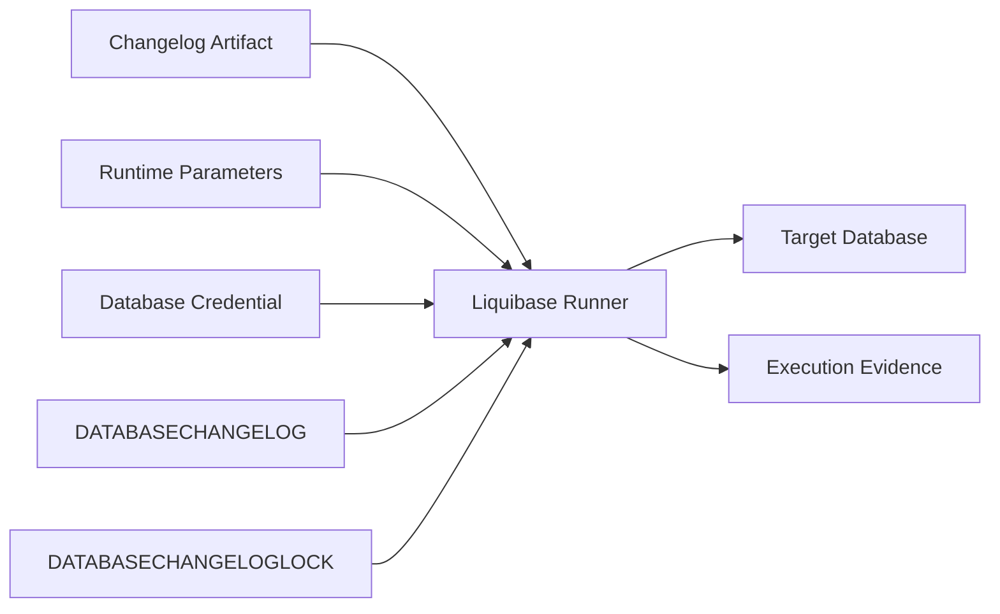
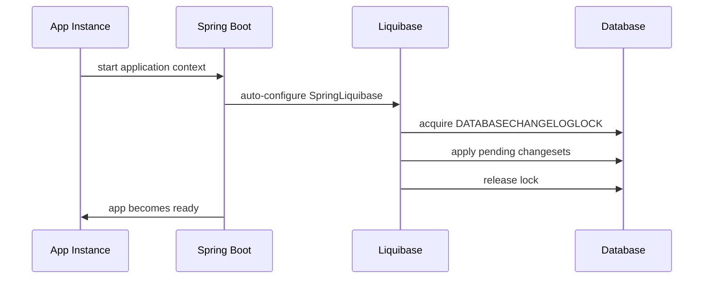
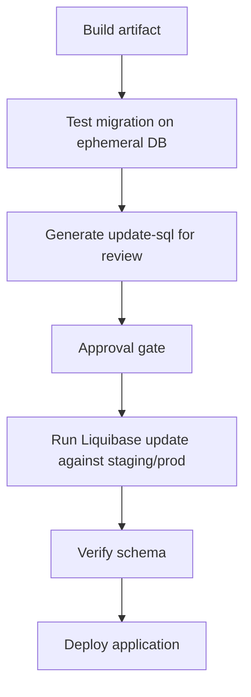
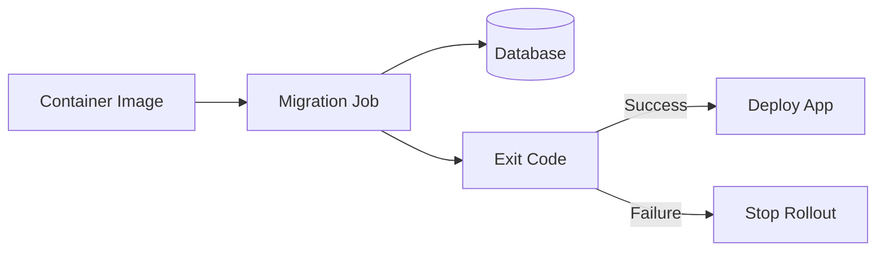
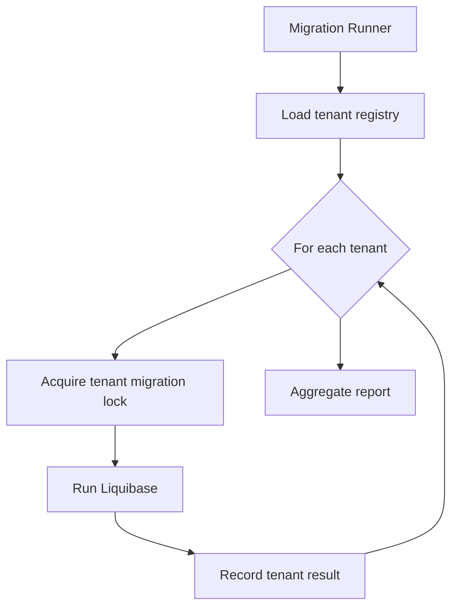
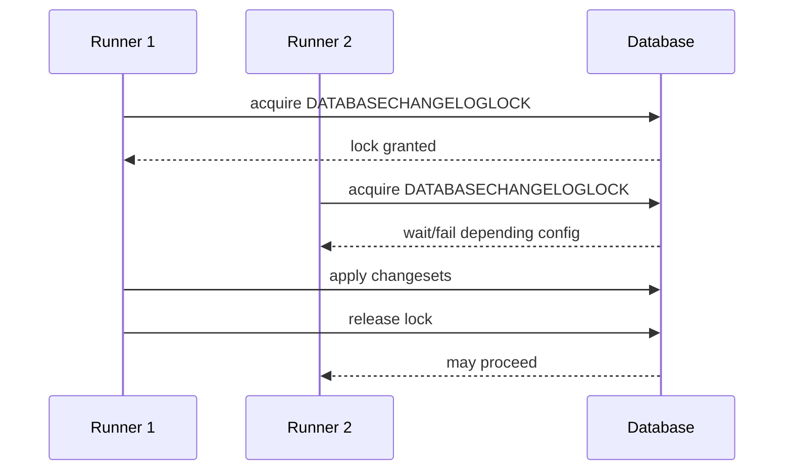
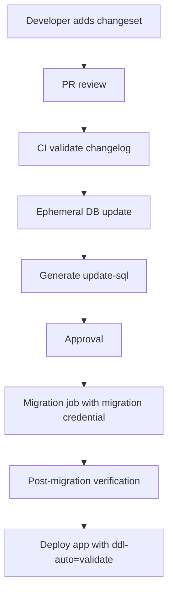

# Part 021 — Liquibase Java API dan Spring Boot Integration

Bagian ini membahas Liquibase dari sisi **runtime integration** di aplikasi Java, terutama Spring Boot.

Namun fokus kita bukan “cara menambahkan dependency Liquibase”. Itu terlalu dangkal. Fokus engineering yang benar adalah:

> Siapa yang berhak mengubah database, kapan perubahan dijalankan, dengan credential apa, dengan evidence apa, dan bagaimana failure-nya dikendalikan?

Liquibase bisa dijalankan dari CLI, Maven/Gradle plugin, Java API, Spring Boot startup, Kubernetes Job, atau dedicated migration service. Semua pilihan itu valid dalam konteks yang berbeda. Kesalahan utama bukan memilih tool yang salah, melainkan **menjalankan migration di lifecycle yang salah**.

---

## 1. Kaufman Deconstruction

Skill “Liquibase integration” kita pecah menjadi sub-skill kecil.

| Sub-skill | Pertanyaan inti | Output engineering |
|---|---|---|
| Runtime placement | Migration dijalankan oleh aplikasi, pipeline, job, atau operator? | Execution model |
| Lifecycle ordering | Migration berjalan sebelum app readiness, saat deploy, atau manual gate? | Deployment contract |
| Lock awareness | Apa yang terjadi jika dua instance menjalankan Liquibase? | Lock/retry/failure model |
| Credential boundary | Apakah app user boleh DDL? | Privilege model |
| Changelog resolution | Dari mana changelog dibaca? classpath, filesystem, artifact? | Artifact strategy |
| Context/label control | Filter apa yang digunakan untuk environment/release? | Deterministic execution scope |
| Observability | Bagaimana tahu migration mulai, selesai, gagal, atau stuck? | Logs, metrics, audit evidence |
| Recovery | Apa tindakan saat lock tertinggal, checksum mismatch, atau failed changeset? | Runbook |

Target part ini:

1. Bisa memilih execution model Liquibase yang tepat.
2. Bisa mengintegrasikan Liquibase dengan Spring Boot tanpa mengorbankan availability.
3. Bisa membedakan convenience integration dan production integration.
4. Bisa mendesain migration runner yang aman untuk CI/CD dan regulated environment.

---

## 2. Mental Model: Liquibase Runner sebagai State Transition Agent

Liquibase runner adalah agen yang mengubah database dari state `S(n)` menjadi `S(n+1)` berdasarkan changelog.



Runner tidak boleh dianggap sekadar library. Runner membawa otoritas:

- membaca changelog,
- mengambil lock,
- mengeksekusi DDL/DML,
- menulis tracking table,
- menghasilkan failure state,
- dan meninggalkan evidence.

Karena itu, desain integration harus menjawab:

> Apakah perubahan database adalah bagian dari startup aplikasi, bagian dari deployment pipeline, atau bagian dari operasi database terkontrol?

---

## 3. Execution Model Options

### 3.1 Spring Boot Startup Migration

Model ini menjalankan Liquibase ketika aplikasi Spring Boot start.



Cocok untuk:

- aplikasi kecil,
- single instance,
- dev/test environment,
- internal service dengan low availability requirement,
- schema kecil dan migration cepat.

Berisiko untuk:

- horizontal scaling,
- Kubernetes rolling deployment,
- large table migration,
- migration yang butuh approval manual,
- regulated production,
- multi-tenant fan-out,
- DDL dengan lock tinggi,
- startup timeout-sensitive environment.

Masalah utama:

> App readiness menjadi tergantung pada keberhasilan schema mutation.

Jika migration gagal, aplikasi gagal start. Itu bisa benar untuk safety, tetapi buruk jika gagal karena lock, timeout, atau migration berat yang seharusnya dijalankan terpisah.

---

### 3.2 Pipeline Migration

Model ini menjalankan Liquibase sebagai step CI/CD sebelum aplikasi versi baru dipromosikan.



Cocok untuk:

- production environment,
- audit-heavy organization,
- database team review,
- separation of duties,
- migration yang perlu preflight,
- zero-downtime expand/contract.

Kelemahan:

- pipeline lebih kompleks,
- perlu credential management,
- perlu artifact discipline,
- perlu rollback/roll-forward playbook eksplisit.

Ini biasanya model terbaik untuk sistem serius.

---

### 3.3 Dedicated Migration Job

Model ini umum di Kubernetes: jalankan Liquibase sebagai `Job` atau release hook sebelum deployment aplikasi.



Cocok untuk:

- containerized deployment,
- infrastructure-as-code,
- deployment orchestration,
- credential isolation,
- one-shot migration runner.

Keunggulan dibanding startup migration:

- aplikasi tidak membawa DDL privilege,
- migration bisa diobservasi sebagai job terpisah,
- failure tidak membuat semua app replica bersaing lock,
- retry policy dapat dikontrol.

---

### 3.4 Operator/DBA-Controlled Migration

Model ini membuat Liquibase menghasilkan SQL, tetapi eksekusi dilakukan DBA/operator.

Cocok untuk:

- regulated production,
- bank/insurance/government,
- database dengan strict change window,
- environment di mana DDL harus disetujui dan dieksekusi oleh role tertentu.

Mode ini sering memakai:

- `update-sql`,
- `rollback-sql`,
- review package,
- signed artifact,
- manual approval,
- post-execution reconciliation.

Trade-off-nya: lebih lambat, tetapi evidence lebih kuat.

---

## 4. Spring Boot Liquibase Auto-Configuration

Spring Boot menyediakan auto-configuration untuk Liquibase ketika dependency Liquibase tersedia dan properti dikonfigurasi. Secara praktis, aplikasi akan membuat `SpringLiquibase` bean yang menjalankan changelog pada startup.

Contoh minimal:

```yaml
spring:
  liquibase:
    enabled: true
    change-log: classpath:/db/changelog/db.changelog-master.yaml
```

Contoh dengan contexts dan labels:

```yaml
spring:
  liquibase:
    change-log: classpath:/db/changelog/db.changelog-master.yaml
    contexts: prod
    label-filter: release-2026-06
```

Catatan penting:

- `contexts` dan `label-filter` harus dianggap bagian dari deployment contract.
- Jangan biarkan nilainya berubah secara manual antar-instance dalam satu release.
- Jangan menjalankan test data changeset di production hanya karena context salah.

Anti-pattern:

```yaml
spring:
  liquibase:
    contexts: ${ENVIRONMENT}
```

Ini belum tentu salah, tetapi berbahaya bila `ENVIRONMENT` tidak dikontrol ketat. Untuk production, context/filter harus muncul di deployment evidence.

---

## 5. Spring Boot Startup Ordering dengan JPA/Hibernate

Jika aplikasi juga memakai JPA/Hibernate, migration tool harus menjadi pemilik schema evolution.

Aturan production:

> Hibernate boleh membaca metadata, tetapi tidak boleh mengubah schema production secara otomatis.

Konfigurasi umum:

```yaml
spring:
  jpa:
    hibernate:
      ddl-auto: validate
  liquibase:
    enabled: true
```

Makna:

- Liquibase menerapkan schema change.
- Hibernate memvalidasi mapping terhadap schema.
- Jika entity tidak kompatibel dengan schema, aplikasi gagal start lebih awal.

Anti-pattern:

```yaml
spring:
  jpa:
    hibernate:
      ddl-auto: update
  liquibase:
    enabled: true
```

Masalahnya:

- dua mekanisme mencoba menjadi schema owner,
- perubahan Hibernate tidak selalu audit-friendly,
- schema bisa drift dari changelog,
- production failure menjadi sulit dijelaskan.

---

## 6. Java API: Kapan Perlu?

Gunakan Liquibase Java API ketika CLI/Spring Boot auto-run tidak cukup.

Use case valid:

1. Custom migration runner internal.
2. Multi-tenant migration fan-out.
3. Migration dengan observability khusus.
4. Migration yang butuh dynamic changelog resolution.
5. Integration test harness.
6. Tooling internal untuk `update-sql`, `status`, `validate`, atau drift check.

Jangan gunakan Java API untuk menyembunyikan logic migration yang seharusnya eksplisit di changelog.

---

## 7. Java Runner Minimal

Contoh konseptual runner sederhana:

```java
package com.example.migration;

import liquibase.Contexts;
import liquibase.LabelExpression;
import liquibase.Liquibase;
import liquibase.database.Database;
import liquibase.database.DatabaseFactory;
import liquibase.database.jvm.JdbcConnection;
import liquibase.resource.ClassLoaderResourceAccessor;

import java.sql.Connection;
import java.sql.DriverManager;

public final class LiquibaseMigrationRunner {

    public static void main(String[] args) throws Exception {
        String url = requiredEnv("DB_URL");
        String username = requiredEnv("DB_MIGRATION_USER");
        String password = requiredEnv("DB_MIGRATION_PASSWORD");
        String changelog = envOrDefault(
            "LIQUIBASE_CHANGELOG",
            "db/changelog/db.changelog-master.yaml"
        );
        String contexts = envOrDefault("LIQUIBASE_CONTEXTS", "prod");
        String labels = envOrDefault("LIQUIBASE_LABELS", "");

        try (Connection connection = DriverManager.getConnection(url, username, password)) {
            Database database = DatabaseFactory.getInstance()
                .findCorrectDatabaseImplementation(new JdbcConnection(connection));

            try (Liquibase liquibase = new Liquibase(
                changelog,
                new ClassLoaderResourceAccessor(),
                database
            )) {
                liquibase.validate();
                liquibase.update(new Contexts(contexts), new LabelExpression(labels));
            }
        }
    }

    private static String requiredEnv(String name) {
        String value = System.getenv(name);
        if (value == null || value.isBlank()) {
            throw new IllegalArgumentException("Missing env var: " + name);
        }
        return value;
    }

    private static String envOrDefault(String name, String fallback) {
        String value = System.getenv(name);
        return value == null || value.isBlank() ? fallback : value;
    }
}
```

Design notes:

- memakai credential migration user, bukan app user,
- menjalankan `validate()` sebelum `update()`,
- changelog berasal dari artifact/classpath,
- contexts/labels eksplisit,
- exit code proses menjadi signal pipeline.

Untuk Liquibase versi baru, command framework seperti `CommandScope` juga tersedia untuk menjalankan command secara programmatic. Pilih style API yang sesuai versi library dan standard tim, tetapi jangan biarkan API style mengubah governance model.

---

## 8. CommandScope-Oriented Runner

Contoh konseptual dengan command API:

```java
import liquibase.command.CommandScope;

public final class LiquibaseCommandRunner {

    public static void main(String[] args) throws Exception {
        String url = requiredEnv("DB_URL");
        String username = requiredEnv("DB_MIGRATION_USER");
        String password = requiredEnv("DB_MIGRATION_PASSWORD");
        String changelog = requiredEnv("LIQUIBASE_CHANGELOG");

        new CommandScope("update")
            .addArgumentValue("url", url)
            .addArgumentValue("username", username)
            .addArgumentValue("password", password)
            .addArgumentValue("changeLogFile", changelog)
            .execute();
    }

    private static String requiredEnv(String name) {
        String value = System.getenv(name);
        if (value == null || value.isBlank()) {
            throw new IllegalArgumentException("Missing env var: " + name);
        }
        return value;
    }
}
```

Kelebihan command-style API:

- lebih dekat dengan Liquibase command model,
- cocok untuk internal CLI wrapper,
- bisa membungkus `update`, `update-sql`, `status`, `validate`, `rollback-sql`, dan command lain dengan pola seragam.

Risiko:

- argument name bisa berubah mengikuti versi,
- error handling harus diuji,
- perlu standardisasi versi Liquibase.

---

## 9. Multi-Datasource Spring Boot

Dalam aplikasi enterprise, sering ada lebih dari satu datasource:

- primary OLTP database,
- reporting database,
- audit database,
- workflow database,
- tenant-specific database.

Jangan berharap auto-configuration default selalu cukup.

Pattern:

```java
@Configuration
public class LiquibaseConfig {

    @Bean
    SpringLiquibase primaryLiquibase(
            @Qualifier("primaryDataSource") DataSource dataSource) {
        SpringLiquibase liquibase = new SpringLiquibase();
        liquibase.setDataSource(dataSource);
        liquibase.setChangeLog("classpath:/db/changelog/primary/master.yaml");
        liquibase.setContexts("prod");
        return liquibase;
    }

    @Bean
    SpringLiquibase auditLiquibase(
            @Qualifier("auditDataSource") DataSource dataSource) {
        SpringLiquibase liquibase = new SpringLiquibase();
        liquibase.setDataSource(dataSource);
        liquibase.setChangeLog("classpath:/db/changelog/audit/master.yaml");
        liquibase.setContexts("prod");
        return liquibase;
    }
}
```

Rules:

1. Setiap datasource punya changelog root eksplisit.
2. Jangan campur schema audit dan OLTP dalam changelog yang sama kecuali memang satu ownership boundary.
3. Urutan antar-database harus didesain jika ada dependency.
4. Partial failure harus punya recovery plan.

---

## 10. Multi-Tenant Liquibase Execution

Untuk tenant-per-schema atau tenant-per-database, migration bukan satu operasi. Ia adalah fan-out.



Masalah utama:

- tenant version skew,
- partial success,
- retry per tenant,
- long-running migration window,
- noisy neighbor,
- lock contention,
- tenant-specific drift.

Pattern minimal:

- buat `tenant_migration_execution` table di control database,
- simpan tenant id, target version, start time, finish time, status, error,
- migration harus resumable,
- jangan memblokir semua tenant karena satu tenant gagal kecuali perubahan global memang atomic.

Contoh pseudo-flow:

```java
for (Tenant tenant : tenantRegistry.activeTenants()) {
    if (executionLog.alreadySucceeded(tenant, releaseId)) {
        continue;
    }

    try {
        executionLog.markRunning(tenant, releaseId);
        runLiquibaseForTenant(tenant);
        executionLog.markSucceeded(tenant, releaseId);
    } catch (Exception ex) {
        executionLog.markFailed(tenant, releaseId, ex);
        if (policy.failFast()) {
            throw ex;
        }
    }
}
```

---

## 11. Lock Handling

Liquibase memakai lock table untuk mencegah dua runner mengubah database yang sama secara bersamaan.

Mental model:



Failure cases:

| Failure | Symptom | Correct response |
|---|---|---|
| Runner killed while lock held | Liquibase says database is locked | Verify no active runner, then release lock with evidence |
| Two app replicas start together | One gets lock, others wait/fail | Prefer migration job or disable auto-run in replicas |
| Long migration exceeds platform timeout | Pod/job killed | Move heavy work out of startup, make operation resumable |
| Network partition | Unknown execution status | Inspect `DATABASECHANGELOG`, database objects, logs |

Anti-pattern:

> Automatically clearing Liquibase lock on every startup.

This is dangerous. A lock may indicate active migration, not stale state.

---

## 12. Credential and Privilege Model

Do not use the same database user for app runtime and migration.

| Role | Privilege | Used by |
|---|---|---|
| App user | DML on owned tables, limited read/write | Application runtime |
| Migration user | DDL/DML needed for schema change | Liquibase runner |
| Readonly user | SELECT only | reporting/debug |
| DBA/admin | emergency/admin only | controlled operations |

Production rule:

> Application runtime should not need DDL privilege.

Benefits:

- compromised app cannot mutate schema,
- accidental Hibernate DDL update fails,
- audit can distinguish runtime writes vs schema changes,
- migration evidence can identify actor.

---

## 13. Changelog Artifact Strategy

Changelog should be deployed as immutable artifact.

Options:

### 13.1 Classpath Changelog

Stored inside application or migration runner jar:

```txt
src/main/resources/db/changelog/db.changelog-master.yaml
```

Pros:

- versioned with code,
- reproducible artifact,
- easy for Spring Boot.

Cons:

- app artifact and migration artifact may be coupled,
- hard for DBA manual review if SQL is generated at runtime only.

### 13.2 Filesystem Changelog

Mounted into job/container:

```txt
/liquibase/changelog/db.changelog-master.yaml
```

Pros:

- flexible for pipeline,
- can separate runner image and changelog artifact.

Cons:

- path drift risk,
- artifact integrity must be controlled.

### 13.3 Generated SQL Artifact

Pipeline generates SQL and stores it for review/execution.

Pros:

- DBA-friendly,
- audit-friendly,
- deterministic review.

Cons:

- SQL is database-specific,
- must ensure reviewed SQL equals executed SQL.

---

## 14. Observability

A migration runner should emit events:

- migration start,
- changelog path,
- Liquibase version,
- database target,
- contexts/labels,
- pending changeset count,
- changeset start/end,
- execution duration,
- lock acquisition duration,
- failure class,
- final status.

Minimum structured log:

```json
{
  "event": "database_migration_completed",
  "tool": "liquibase",
  "service": "case-management",
  "release": "2026.06.28",
  "database": "case_prod",
  "changelog": "db/changelog/db.changelog-master.yaml",
  "contexts": "prod",
  "labels": "release-2026-06",
  "status": "SUCCESS",
  "durationMs": 18342
}
```

For regulated systems, store evidence:

- artifact digest,
- generated SQL,
- reviewer approval,
- execution logs,
- DATABASECHANGELOG export,
- post-deploy verification result,
- incident link if failed.

---

## 15. Startup Migration Decision Matrix

| Situation | Startup Liquibase? | Better option |
|---|---:|---|
| Local dev | Yes | Spring Boot auto-run |
| Integration test | Yes | Testcontainers + auto-run |
| Small internal tool | Maybe | Startup if migration is fast |
| Horizontally scaled production service | Usually no | Migration Job / pipeline |
| Large table DDL | No | Dedicated migration plan |
| Multi-tenant fan-out | No | Dedicated tenant migration runner |
| Strict audit environment | No | Generated SQL + approval + controlled execution |
| Serverless cold start | No | Pipeline migration |

---

## 16. Recommended Production Pattern

Untuk kebanyakan sistem production Java modern:



Application config:

```yaml
spring:
  liquibase:
    enabled: false
  jpa:
    hibernate:
      ddl-auto: validate
```

Migration job config:

```yaml
liquibase:
  command: update
  changelog: classpath:/db/changelog/db.changelog-master.yaml
  contexts: prod
  labels: release-2026-06
```

This separates:

- app runtime,
- schema mutation,
- deployment orchestration,
- audit evidence.

---

## 17. Testing Liquibase Integration

### 17.1 From-Scratch Test

Run full changelog against empty database.

Detects:

- syntax error,
- missing include,
- invalid change type,
- unsupported database object,
- broken ordering.

### 17.2 Upgrade Test

Start from prior release schema, run new changesets.

Detects:

- backward compatibility bug,
- missing backfill,
- unexpected lock,
- checksum mismatch.

### 17.3 App Compatibility Test

Test matrix:

| App version | Schema version | Expected |
|---|---|---|
| Old app | Old schema | pass |
| Old app | Expanded schema | pass |
| New app | Expanded schema | pass |
| New app | Contracted schema | pass |
| Old app | Contracted schema | fail only after cutover window |

---

## 18. Anti-Patterns

### 18.1 Liquibase Runs in Every App Replica

If ten pods start and all try Liquibase, lock table prevents concurrent execution but the design is still noisy.

Better:

- run one migration job,
- disable startup migration in app,
- deploy app after migration success.

### 18.2 App User Has DDL Permission

Convenient, but unsafe.

Better:

- migration user owns DDL,
- app user has runtime privileges only.

### 18.3 Contexts Used as Schema Forks

Bad:

```yaml
contexts: prod-mysql-region-a-special-case
```

Better:

- keep changelog deterministic,
- isolate vendor difference with `dbms`,
- isolate deployment test data with contexts,
- avoid environment-specific schema reality.

### 18.4 Migration Logic Hidden in Spring Bean

Bad:

```java
@Bean
CommandLineRunner patchData(JdbcTemplate jdbc) {
    return args -> jdbc.update("UPDATE account SET status = 'ACTIVE' WHERE status IS NULL");
}
```

This bypasses changelog, checksum, audit, rollback planning, and migration ordering.

Better:

- put it in Liquibase changeset,
- or dedicated migration job with evidence.

---

## 19. Production Runbook

Before execution:

- confirm target database,
- confirm changelog artifact digest,
- confirm contexts/labels,
- run `validate`,
- generate `update-sql`,
- review lock/DDL risk,
- confirm backup/restore posture,
- define stop criteria.

During execution:

- monitor lock acquisition,
- monitor blocking sessions,
- monitor execution duration,
- capture logs,
- avoid manual intervention unless playbook says so.

After execution:

- query `DATABASECHANGELOG`,
- verify expected objects,
- run application compatibility checks,
- store evidence bundle,
- only then deploy dependent app behavior.

---

## 20. Deliberate Practice

### Exercise 1 — Spring Boot Startup vs Job

Take an existing Spring Boot service and produce two configs:

1. local/dev config with startup Liquibase enabled,
2. production config with startup Liquibase disabled and migration job enabled.

Explain why each setting exists.

### Exercise 2 — Multi-Datasource Runner

Create two changelog roots:

```txt
db/changelog/core/master.yaml
db/changelog/audit/master.yaml
```

Write explicit `SpringLiquibase` beans for each. Then describe failure behavior if core succeeds and audit fails.

### Exercise 3 — Evidence Bundle

For one changeset, produce:

- changelog file,
- generated SQL,
- review checklist,
- execution log template,
- post-deploy verification query,
- rollback/roll-forward note.

---

## 21. Key Takeaways

- Liquibase integration is an operational design problem, not just a dependency problem.
- Spring Boot startup migration is convenient but not always production-safe.
- Dedicated migration jobs or pipeline execution usually provide better isolation and evidence.
- App runtime should not need DDL privilege.
- Contexts and labels are deployment filters; they must be deterministic and auditable.
- Multi-tenant migration requires fan-out tracking and resumability.
- Lock handling must be explicit; never blindly clear locks.
- Changelog artifact, runtime parameters, database target, and execution result must be part of the evidence trail.

---

## References

- Liquibase Documentation — Update command: https://docs.liquibase.com/commands/update/update.html
- Liquibase JavaDoc — CommandScope: https://javadocs.liquibase.com/liquibase-core/liquibase/command/CommandScope.html
- Spring Boot Documentation — Database Initialization: https://docs.spring.io/spring-boot/how-to/data-initialization.html
- Spring Boot API — LiquibaseAutoConfiguration: https://docs.spring.io/spring-boot/api/java/org/springframework/boot/liquibase/autoconfigure/LiquibaseAutoConfiguration.html
- Spring Boot API — LiquibaseProperties: https://docs.spring.io/spring-boot/api/java/org/springframework/boot/liquibase/autoconfigure/LiquibaseProperties.html
