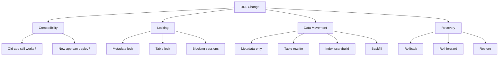
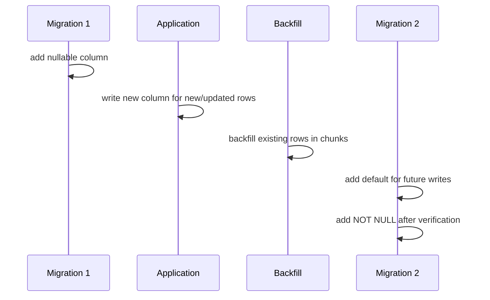
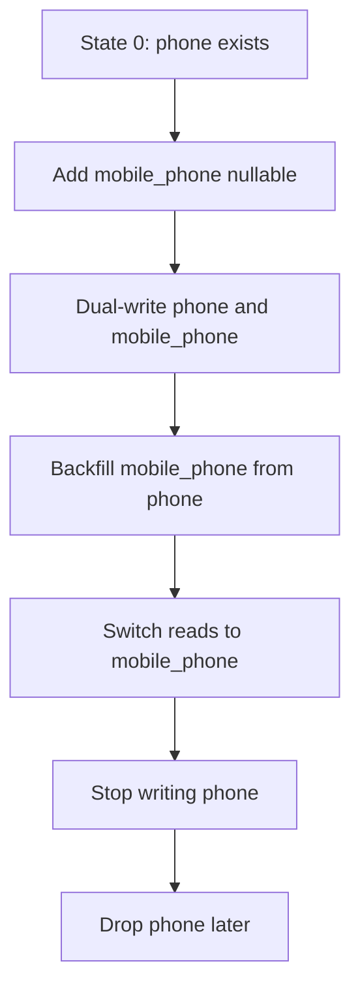
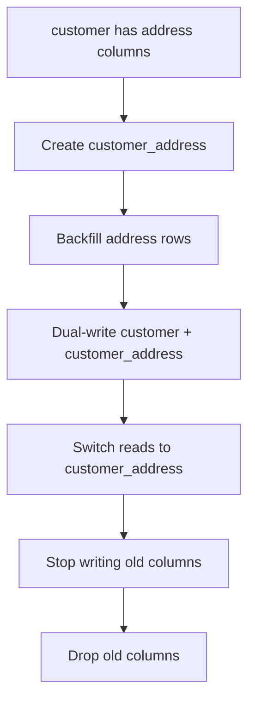
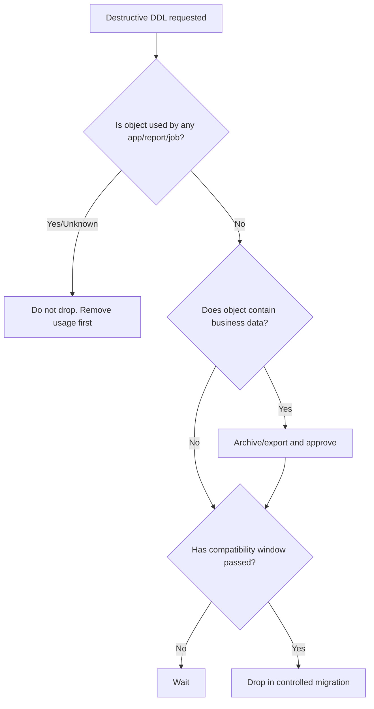

# Part 022 — Safe DDL Patterns: Column, Table, Constraint, Index, FK, Enum

DDL terlihat sederhana:

```sql
ALTER TABLE customer ADD COLUMN risk_score INT;
```

Namun di production, DDL adalah operasi stateful yang bisa:

- mengambil lock,
- memblokir write,
- memicu table rewrite,
- membangun index berjam-jam,
- mengubah query plan,
- merusak backward compatibility,
- menggagalkan rolling deployment,
- dan membuat rollback menjadi tidak realistis.

Bagian ini adalah katalog pola DDL aman. Fokusnya bukan hafalan syntax, melainkan **cara berpikir terhadap perubahan schema sebagai operasi produksi**.

---

## 1. Kaufman Deconstruction

Skill “safe DDL” kita pecah menjadi beberapa sub-skill.

| Sub-skill | Pertanyaan inti | Output |
|---|---|---|
| Compatibility analysis | Apakah old app dan new app bisa hidup bersama? | Compatibility matrix |
| Lock analysis | Lock apa yang akan diambil dan berapa lama? | Lock risk class |
| Data volume analysis | Apakah operasi menyentuh semua row? | Table-size risk estimate |
| Constraint rollout | Apakah constraint divalidasi langsung atau bertahap? | Validation strategy |
| Index rollout | Apakah index dibuat online/concurrently? | Index build plan |
| Rename strategy | Apakah rename aman untuk rolling deploy? | Expand/contract sequence |
| Destructive change control | Apakah drop/truncate/delete bisa dibalik? | Approval + recovery plan |
| Tool encoding | Bagaimana pattern ditulis di Flyway/Liquibase? | Migration artifact |

Aturan awal:

> DDL yang benar secara syntax belum tentu aman secara operasional.

---

## 2. Safe DDL Mental Model

Setiap DDL harus dievaluasi dari empat dimensi:



DDL risk bukan hanya jenis perintah. Risiko bergantung pada:

- database vendor,
- versi database,
- ukuran tabel,
- active workload,
- index existing,
- transaction isolation,
- deployment model,
- replication topology,
- dan kemampuan recovery.

---

## 3. Risk Classes

Gunakan klasifikasi ini dalam review.

| Class | Meaning | Example | Review level |
|---|---|---|---|
| DDL-0 | Metadata-only, backward compatible | Add nullable column tanpa default berat | Normal review |
| DDL-1 | Compatible but may lock briefly | Add simple index on small table | Normal + timing |
| DDL-2 | Compatible but heavy | Online index on large table | DBA/perf review |
| DDL-3 | Compatibility-sensitive | Rename column via expand/contract | Release choreography |
| DDL-4 | Destructive | Drop column/table, tighten constraint | Approval + evidence |
| DDL-5 | Emergency/high uncertainty | Repair drift manually | Incident/change board |

Rule:

> Anything DDL-3 or above needs a deployment sequence, not just a migration file.

---

## 4. Add Nullable Column

### Pattern

Adding a nullable column is usually the safest schema expansion.

```sql
ALTER TABLE customer
ADD COLUMN risk_score INTEGER;
```

Why safe:

- old app ignores the column,
- new app can start writing it,
- no existing row must be immediately populated,
- no constraint validation is required.

### Flyway

```sql
-- V20260628_1010__add_customer_risk_score.sql
ALTER TABLE customer
ADD COLUMN risk_score INTEGER;
```

### Liquibase Formatted SQL

```sql
--liquibase formatted sql

--changeset risk:20260628-1010-add-customer-risk-score
ALTER TABLE customer ADD COLUMN risk_score INTEGER;

--rollback ALTER TABLE customer DROP COLUMN risk_score;
```

### Review Checklist

- Is the column nullable?
- Does old app ignore unknown column?
- Does ORM mapping tolerate the column?
- Is there any trigger/default causing table rewrite?
- Is rollback actually safe after new app writes values?

Important nuance:

Rollback `DROP COLUMN` is only safe before the application depends on the column. After real production writes, dropping it is data loss.

---

## 5. Add Column with Default

This is vendor-sensitive.

Unsafe naive pattern:

```sql
ALTER TABLE account
ADD COLUMN status VARCHAR(32) NOT NULL DEFAULT 'ACTIVE';
```

It may be fine on some database/version combinations, but on others it can rewrite or lock a large table.

Safer generic pattern:



SQL sequence:

```sql
ALTER TABLE account ADD COLUMN status VARCHAR(32);

-- application writes status for new rows
-- backfill old rows in batches

ALTER TABLE account ALTER COLUMN status SET DEFAULT 'ACTIVE';

-- after verification
ALTER TABLE account ALTER COLUMN status SET NOT NULL;
```

For MySQL syntax differs:

```sql
ALTER TABLE account ADD COLUMN status VARCHAR(32) NULL;
```

Then:

```sql
ALTER TABLE account MODIFY status VARCHAR(32) NOT NULL DEFAULT 'ACTIVE';
```

Review question:

> Does this operation touch metadata only, or does it rewrite/scan existing data?

Never answer this generically. Check the database vendor/version and table size.

---

## 6. Add NOT NULL Safely

Directly setting `NOT NULL` can scan table and take locks.

Bad generic approach:

```sql
ALTER TABLE payment
ALTER COLUMN external_id SET NOT NULL;
```

Safe pattern:

1. Add nullable column.
2. Deploy app that writes it.
3. Backfill missing values.
4. Verify no nulls remain.
5. Add constraint.

Verification:

```sql
SELECT COUNT(*)
FROM payment
WHERE external_id IS NULL;
```

For PostgreSQL, a common pattern is to use a check constraint with `NOT VALID`, validate later, then convert if desired depending on version and operational tolerance:

```sql
ALTER TABLE payment
ADD CONSTRAINT payment_external_id_nn
CHECK (external_id IS NOT NULL) NOT VALID;

ALTER TABLE payment
VALIDATE CONSTRAINT payment_external_id_nn;
```

Then later:

```sql
ALTER TABLE payment
ALTER COLUMN external_id SET NOT NULL;
```

This pattern separates:

- constraint creation,
- data validation,
- metadata enforcement.

Caution:

- Exact lock behavior differs by PostgreSQL version.
- `NOT VALID` constraints still apply to new/updated rows depending on constraint type semantics.
- Always test against production-like volume.

---

## 7. Rename Column Safely

Direct rename is not safe for rolling deployments.

Bad:

```sql
ALTER TABLE customer RENAME COLUMN phone TO mobile_phone;
```

Why bad:

- old app expects `phone`,
- new app expects `mobile_phone`,
- during rolling deploy both versions may run.

Safe expand/contract:



Migrations:

```sql
-- expand
ALTER TABLE customer ADD COLUMN mobile_phone VARCHAR(50);
```

Backfill:

```sql
UPDATE customer
SET mobile_phone = phone
WHERE mobile_phone IS NULL
  AND phone IS NOT NULL;
```

Contract later:

```sql
ALTER TABLE customer DROP COLUMN phone;
```

Rule:

> Rename is logically a copy + dual-write + cutover + drop, not a single DDL statement.

---

## 8. Drop Column Safely

Dropping a column is destructive.

Safe sequence:

1. Stop reads from column.
2. Stop writes to column.
3. Verify no code references it.
4. Verify no report/job references it.
5. Wait through compatibility window.
6. Archive/export if needed.
7. Drop column.

Pre-drop detection:

- search code repository,
- search SQL dashboards/reports,
- check database views/functions/triggers,
- inspect query logs if available,
- check BI tools and ETL jobs.

Migration:

```sql
ALTER TABLE customer DROP COLUMN legacy_segment;
```

Rollback is not simple. Re-adding the column does not restore data.

Better rollback note:

```sql
--rollback ALTER TABLE customer ADD COLUMN legacy_segment VARCHAR(64);
--rollback -- Data restoration requires archive table/customer_legacy_segment_backup.
```

If data matters, create archive first:

```sql
CREATE TABLE customer_legacy_segment_archive AS
SELECT id, legacy_segment, now() AS archived_at
FROM customer
WHERE legacy_segment IS NOT NULL;
```

---

## 9. Add Index Safely

Indexes improve read paths but cost:

- build time,
- disk space,
- write amplification,
- lock risk,
- replication lag,
- changed query plan.

### PostgreSQL

Use concurrent index creation for large/high-traffic tables:

```sql
CREATE INDEX CONCURRENTLY idx_payment_created_at
ON payment (created_at);
```

Important: PostgreSQL does not allow `CREATE INDEX CONCURRENTLY` inside a transaction block. This impacts Flyway/Liquibase configuration.

Flyway example:

```sql
-- V20260628_1200__create_payment_created_at_index.sql
CREATE INDEX CONCURRENTLY idx_payment_created_at
ON payment (created_at);
```

Flyway script config may need transaction disabled depending on setup:

```properties
executeInTransaction=false
```

Liquibase formatted SQL:

```sql
--liquibase formatted sql

--changeset risk:20260628-1200-create-payment-created-at-index runInTransaction:false
CREATE INDEX CONCURRENTLY idx_payment_created_at ON payment (created_at);

--rollback DROP INDEX CONCURRENTLY idx_payment_created_at;
```

### MySQL/InnoDB

Online DDL capabilities depend on version and operation. MySQL supports algorithms such as `INSTANT`, `INPLACE`, and `COPY` for InnoDB DDL operations.

Example:

```sql
ALTER TABLE payment
ADD INDEX idx_payment_created_at (created_at),
ALGORITHM=INPLACE,
LOCK=NONE;
```

Do not blindly assume `LOCK=NONE` is supported for every alteration.

Review checklist:

- Is index needed by a verified query plan?
- Is it covering or selective enough?
- How large will the index be?
- Will it impact writes?
- Can it be built online/concurrently?
- Does migration tool run it outside transaction if required?
- Is there a rollback/drop plan?

---

## 10. Add Unique Constraint Safely

Unique constraints are dangerous because existing data may violate them.

Naive:

```sql
ALTER TABLE users ADD CONSTRAINT users_email_uk UNIQUE (email);
```

Safe sequence:

1. Detect duplicates.
2. Resolve duplicates.
3. Add unique index/constraint with online strategy if possible.
4. Deploy app validation.
5. Add database enforcement.

Duplicate detection:

```sql
SELECT email, COUNT(*)
FROM users
WHERE email IS NOT NULL
GROUP BY email
HAVING COUNT(*) > 1;
```

PostgreSQL pattern:

```sql
CREATE UNIQUE INDEX CONCURRENTLY users_email_uk_idx
ON users (email)
WHERE email IS NOT NULL;

ALTER TABLE users
ADD CONSTRAINT users_email_uk
UNIQUE USING INDEX users_email_uk_idx;
```

This separates index build from constraint attachment.

Caution:

- Partial unique index is PostgreSQL-specific.
- `UNIQUE` semantics around `NULL` differ across vendors.
- Case-insensitive uniqueness requires explicit strategy.

---

## 11. Add Foreign Key Safely

Foreign keys can validate existing rows and lock tables.

Naive:

```sql
ALTER TABLE orders
ADD CONSTRAINT orders_customer_fk
FOREIGN KEY (customer_id) REFERENCES customer(id);
```

Safe sequence:

1. Ensure child column indexed.
2. Detect orphan rows.
3. Clean/fix orphans.
4. Add FK with deferred validation if vendor supports.
5. Validate later.

Orphan detection:

```sql
SELECT o.customer_id, COUNT(*)
FROM orders o
LEFT JOIN customer c ON c.id = o.customer_id
WHERE o.customer_id IS NOT NULL
  AND c.id IS NULL
GROUP BY o.customer_id;
```

PostgreSQL:

```sql
ALTER TABLE orders
ADD CONSTRAINT orders_customer_fk
FOREIGN KEY (customer_id)
REFERENCES customer(id)
NOT VALID;

ALTER TABLE orders
VALIDATE CONSTRAINT orders_customer_fk;
```

Review checklist:

- Is child column indexed?
- What happens to deletes/updates on parent?
- Are cascade rules intentional?
- Is validation separated from creation?
- Is there orphan cleanup evidence?

Avoid casual cascade:

```sql
ON DELETE CASCADE
```

Cascade is not a convenience. It is business behavior.

---

## 12. Add Check Constraint Safely

Check constraints encode invariants.

Example:

```sql
ALTER TABLE invoice
ADD CONSTRAINT invoice_amount_non_negative
CHECK (amount >= 0);
```

Safe sequence:

1. Query violations.
2. Fix data.
3. Add constraint with deferred validation if possible.
4. Validate.

PostgreSQL:

```sql
ALTER TABLE invoice
ADD CONSTRAINT invoice_amount_non_negative
CHECK (amount >= 0) NOT VALID;

ALTER TABLE invoice
VALIDATE CONSTRAINT invoice_amount_non_negative;
```

This is valuable in regulated systems because the invariant is no longer only application logic.

---

## 13. Enum Evolution

Enums are deceptively hard.

Three common models:

| Model | Pros | Cons |
|---|---|---|
| Database enum type | Strong constraint | Harder evolution, vendor-specific |
| VARCHAR + CHECK | Flexible and explicit | Constraint update needed |
| Lookup table | Extensible, metadata-friendly | Requires FK/join and ownership |

### Additive enum change

Usually safe:

```sql
-- PostgreSQL enum example
ALTER TYPE case_status ADD VALUE 'ESCALATED';
```

But application compatibility must be checked:

- old app may not understand new value,
- deserialization may fail,
- switch statements may lack default handling,
- reporting may classify unknown status incorrectly.

Safer approach for complex domains:

```sql
CREATE TABLE case_status_ref (
    code VARCHAR(40) PRIMARY KEY,
    display_name VARCHAR(100) NOT NULL,
    active BOOLEAN NOT NULL DEFAULT TRUE
);
```

Reference data migration:

```sql
INSERT INTO case_status_ref (code, display_name)
VALUES ('ESCALATED', 'Escalated')
ON CONFLICT (code) DO NOTHING;
```

For MySQL, use vendor-appropriate upsert:

```sql
INSERT INTO case_status_ref (code, display_name)
VALUES ('ESCALATED', 'Escalated')
ON DUPLICATE KEY UPDATE display_name = VALUES(display_name);
```

Rule:

> In business-critical workflow systems, lookup tables often age better than database enum types.

---

## 14. Table Split Pattern

Splitting a table is a multi-release operation.

Example: move customer address fields from `customer` to `customer_address`.



Migration 1:

```sql
CREATE TABLE customer_address (
    customer_id BIGINT PRIMARY KEY,
    line1 VARCHAR(255),
    city VARCHAR(100),
    postal_code VARCHAR(40),
    created_at TIMESTAMP NOT NULL,
    updated_at TIMESTAMP NOT NULL
);
```

Backfill:

```sql
INSERT INTO customer_address (
    customer_id, line1, city, postal_code, created_at, updated_at
)
SELECT id, address_line1, city, postal_code, now(), now()
FROM customer
WHERE address_line1 IS NOT NULL
   OR city IS NOT NULL
   OR postal_code IS NOT NULL;
```

Contract later:

```sql
ALTER TABLE customer DROP COLUMN address_line1;
ALTER TABLE customer DROP COLUMN city;
ALTER TABLE customer DROP COLUMN postal_code;
```

Never combine create, backfill, application switch, and drop into one deploy.

---

## 15. Table Merge Pattern

Merging tables is often more dangerous than splitting because identity and cardinality rules may change.

Questions:

- Is the relationship 1:1, 1:N, or N:M?
- Which table owns lifecycle?
- Are there duplicate keys?
- What happens to foreign keys?
- Are audit/history tables affected?

Safe approach:

1. Add target columns/table.
2. Backfill from source.
3. Add synchronization if needed.
4. Switch reads.
5. Switch writes.
6. Verify reconciliation.
7. Remove old structure later.

---

## 16. Widen Column

Usually safer than narrowing.

Example:

```sql
ALTER TABLE document
ALTER COLUMN external_ref TYPE VARCHAR(128);
```

Vendor syntax differs. Risk depends on whether the database rewrites table.

Checklist:

- Is widening metadata-only on this vendor/version?
- Are indexes affected?
- Are foreign keys affected?
- Are app validators updated?
- Are downstream systems expecting old length?

---

## 17. Narrow Column

Narrowing is data-destructive unless proven otherwise.

Bad:

```sql
ALTER TABLE document
ALTER COLUMN external_ref TYPE VARCHAR(64);
```

Safe sequence:

1. Detect violations.
2. Fix or reject long values at app level.
3. Monitor no violations for compatibility window.
4. Apply narrowing in controlled window.

Detection:

```sql
SELECT id, external_ref, LENGTH(external_ref)
FROM document
WHERE LENGTH(external_ref) > 64;
```

---

## 18. Change Column Type

Type changes are risky because they may rewrite data and affect application mapping.

Example: `VARCHAR` to `UUID`.

Safe pattern:

1. Add new column `external_id_uuid`.
2. Backfill castable values.
3. Reject invalid values.
4. Dual-write.
5. Switch reads.
6. Drop old column later.

```sql
ALTER TABLE integration_event
ADD COLUMN external_id_uuid UUID;

UPDATE integration_event
SET external_id_uuid = external_id::uuid
WHERE external_id_uuid IS NULL
  AND external_id ~* '^[0-9a-f-]{36}$';
```

This is safer than direct type alteration because invalid rows can be handled explicitly.

---

## 19. Safe Destructive Change Decision Tree



Destructive means:

- `DROP TABLE`,
- `DROP COLUMN`,
- `TRUNCATE`,
- narrowing type,
- tightening constraint,
- deleting reference data,
- removing enum value,
- dropping index that may be used by critical queries.

---

## 20. Tool Encoding: Flyway vs Liquibase

### Flyway

Flyway is SQL-first, so safe DDL is encoded directly as reviewed SQL.

Pros:

- reviewers see exact SQL,
- vendor-specific online DDL is explicit,
- easier DBA collaboration.

Pattern:

```txt
V20260628_1300__expand_customer_address.sql
V20260628_1310__backfill_customer_address.sql
V20260705_0900__contract_customer_address_columns.sql
```

### Liquibase

Liquibase can encode DDL as structured change types or raw SQL.

Use structured change types when:

- portability matters,
- rollback generation is useful,
- schema objects are simple.

Use raw SQL when:

- operation is vendor-specific,
- online/concurrent syntax matters,
- exact SQL review is required.

Example raw SQL for PostgreSQL concurrent index:

```sql
--changeset risk:20260628-1300-create-index runInTransaction:false dbms:postgresql
CREATE INDEX CONCURRENTLY idx_payment_created_at ON payment(created_at);
```

---

## 21. DDL Review Checklist

Every DDL PR should answer:

1. What is the business intent?
2. Is the change additive, transformative, or destructive?
3. Is it backward-compatible with old app version?
4. Is it forward-compatible with new app version?
5. What lock does it take?
6. Does it scan/rewrite large table?
7. What is the largest affected table row count?
8. Is an online/concurrent option available?
9. Does migration tool run it inside or outside a transaction?
10. What is the rollback or roll-forward plan?
11. How is success verified?
12. What evidence is stored?

---

## 22. Common Anti-Patterns

### 22.1 One Giant Migration

Bad:

```txt
V20260628_0001__refactor_customer_everything.sql
```

Contains:

- add columns,
- backfill millions of rows,
- create indexes,
- drop old columns,
- change constraints.

Better:

- split into expand,
- backfill,
- validate,
- switch,
- contract.

### 22.2 Rename as Single DDL

Bad in rolling deployment:

```sql
ALTER TABLE case_file RENAME COLUMN state TO status;
```

Better: add new column, dual-write, backfill, switch, drop later.

### 22.3 Constraint Tightening Without Data Scan

Bad:

```sql
ALTER TABLE invoice ALTER COLUMN amount SET NOT NULL;
```

without verifying nulls and lock impact.

Better: verify, backfill, deferred validation where available.

### 22.4 Index Without Query Evidence

Bad:

> “This column might be queried later, add index now.”

Indexes cost writes and storage. Add them based on access pattern evidence.

### 22.5 Rollback Fantasy

Bad rollback:

```sql
--rollback ALTER TABLE customer ADD COLUMN deleted_column VARCHAR(255);
```

This restores schema shape, not deleted data.

---

## 23. Deliberate Practice

### Exercise 1 — Safe Rename

Given:

```sql
customer.phone
```

Target:

```sql
customer.mobile_phone
```

Write a 4-release expand/contract plan including:

- migrations,
- application behavior,
- verification queries,
- contract migration.

### Exercise 2 — Add FK to Dirty Data

Given `orders.customer_id` has orphan rows. Design:

- orphan detection query,
- remediation options,
- FK creation migration,
- validation migration,
- rollback note.

### Exercise 3 — Large Index

Given a 700M-row `payment` table and a query on `merchant_id, created_at`, design:

- index definition,
- online build strategy,
- transaction setting for Flyway/Liquibase,
- monitoring plan,
- abort criteria.

---

## 24. Key Takeaways

- Safe DDL is about compatibility, lock behavior, data movement, and recovery.
- Additive nullable changes are usually safest.
- Rename is not a rename in production; it is expand/contract.
- Destructive changes require proof of non-use, archive decision, approval, and recovery plan.
- Constraints should often be introduced in phases: detect, clean, add, validate.
- Index creation must consider build method, transaction boundary, write overhead, and query evidence.
- Vendor/version behavior matters; never rely on generic DDL intuition.
- Flyway is strong for explicit SQL review; Liquibase is strong for structured change governance, but raw SQL is often best for vendor-specific safe DDL.

---

## References

- PostgreSQL Documentation — CREATE INDEX: https://www.postgresql.org/docs/current/sql-createindex.html
- PostgreSQL Documentation — ALTER TABLE: https://www.postgresql.org/docs/current/sql-altertable.html
- MySQL Documentation — InnoDB Online DDL Operations: https://dev.mysql.com/doc/refman/8.1/en/innodb-online-ddl-operations.html
- Oracle MySQL Blog — InnoDB Instant Schema Changes: https://blogs.oracle.com/mysql/mysql-innodbs-instant-schema-changes-what-dbas-should-know
- Liquibase Documentation — Rollback: https://docs.liquibase.com/secure/reference-guide-5-1-1/init-update-and-rollback-commands/rollback
- Redgate Flyway Documentation — Migrations: https://documentation.red-gate.com/fd/migrations-271585107.html
