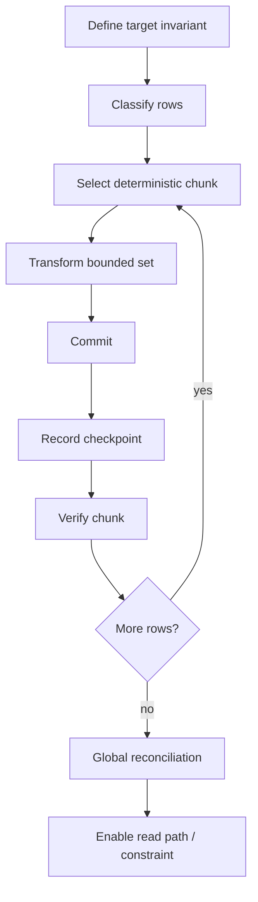
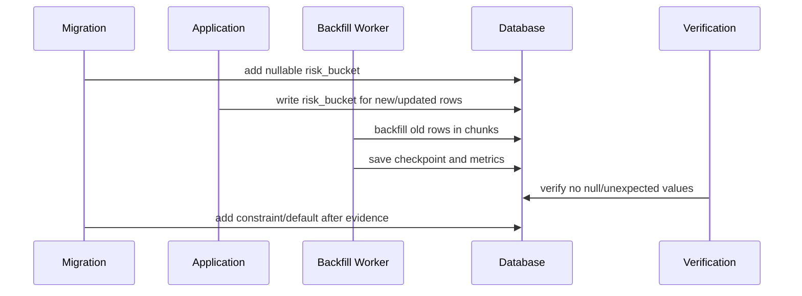

# Part 023 — Data Migration Patterns: Backfill, Batch, Chunk, Resume, Verify

DDL migration mengubah **shape** database. Data migration mengubah **meaning** database.

Itu membuat data migration lebih berbahaya daripada kelihatannya. Menambah kolom mungkin hanya metadata operation. Mengisi kolom untuk 700 juta row adalah operasi produksi yang menyentuh storage, lock, WAL/binlog/redo log, replication lag, cache pressure, query plan, dan invariant bisnis.

Bagian ini membahas data migration sebagai **stateful production workflow**, bukan sekadar `UPDATE table SET ...`.

---

## 1. Kaufman Deconstruction

Skill “data migration” kita pecah menjadi sub-skill kecil.

| Sub-skill | Pertanyaan inti | Output engineering |
|---|---|---|
| Classification | Apakah ini reference data, backfill, correction, reshape, archival, atau derived data? | Risk class |
| Compatibility | Apakah old app dan new app bisa membaca data selama transisi? | Compatibility matrix |
| Chunking | Bagaimana membatasi jumlah row per transaksi? | Batch plan |
| Ordering | Row mana dulu? Apakah urutan penting? | Cursor strategy |
| Resumability | Kalau job mati di tengah, lanjut dari mana? | Checkpoint model |
| Idempotency | Kalau batch dijalankan ulang, apakah hasil tetap benar? | Safe rerun rule |
| Verification | Bagaimana membuktikan data benar? | Reconciliation query |
| Throttling | Bagaimana mencegah database overload? | Rate limit + pause control |
| Observability | Bagaimana melihat progress, lag, error, dan ETA? | Metrics + logs |
| Recovery | Bagaimana berhenti, rollback, atau roll-forward? | Runbook |

Target part ini:

1. Bisa membedakan data migration yang cocok ditulis sebagai SQL migration dan yang harus menjadi job terpisah.
2. Bisa mendesain backfill yang aman, resumeable, observable, dan auditable.
3. Bisa menulis migration dengan checkpoint, chunk, verification, dan failure boundary.
4. Bisa memutuskan kapan memakai Flyway/Liquibase, kapan memakai Spring Batch/custom worker, dan kapan perlu online migration architecture.

---

## 2. Mental Model: Data Migration sebagai Workflow, Bukan Script

Naive model:

```sql
UPDATE customer SET normalized_email = lower(email);
```

Production model:



Data migration is safe only when every step has a bounded failure domain.

The central invariant:

> A data migration must be correct when it runs once, when it runs slowly, when it is interrupted, and when it is retried.

---

## 3. Data Migration Taxonomy

Not all data migrations deserve the same pattern.

| Type | Example | Primary risk | Preferred execution model |
|---|---|---|---|
| Small static reference data | Add fraud reason codes | Wrong semantics, accidental delete | Flyway repeatable / Liquibase changeset |
| Small deterministic correction | Fix typo in config row | Over-update | Versioned SQL with exact predicate |
| Backfill derived column | Fill `normalized_email` | Load, retry, stale data | Batch job or Java migration |
| Reshape data | Split `address` into address table | Referential integrity | Expand/contract + worker |
| Historical recalculation | Recompute account balances | Business correctness | Dedicated audited job |
| Tenant migration | Move tenant to new schema/db | Partial failure | Tenant-aware orchestrator |
| Archival/purge | Delete old events | Data loss, audit | Policy-driven job with evidence |
| Emergency repair | Correct corrupted data | Uncertainty | Incident runbook + snapshot |

Rule:

> The larger the data volume and the richer the business meaning, the less it should look like a single migration script.

---

## 4. When SQL Migration Is Enough

A SQL migration is acceptable when all of these are true:

1. Row count is small or bounded.
2. Predicate is exact and reviewable.
3. Operation finishes comfortably inside deployment window.
4. The change is deterministic.
5. Re-running would not corrupt data.
6. Roll-forward correction is straightforward.
7. Verification query is simple.

Example: inserting a new reference value.

```sql
-- Flyway: V20260628_1300__insert_case_status_closed_by_system.sql
INSERT INTO case_status (code, label, terminal, created_by)
VALUES ('CLOSED_BY_SYSTEM', 'Closed by System', true, 'migration')
ON CONFLICT (code) DO UPDATE
SET label = EXCLUDED.label,
    terminal = EXCLUDED.terminal;
```

Liquibase formatted SQL:

```sql
--liquibase formatted sql

--changeset case:20260628-1300-insert-case-status-closed-by-system
INSERT INTO case_status (code, label, terminal, created_by)
VALUES ('CLOSED_BY_SYSTEM', 'Closed by System', true, 'migration')
ON CONFLICT (code) DO UPDATE
SET label = EXCLUDED.label,
    terminal = EXCLUDED.terminal;

--rollback DELETE FROM case_status WHERE code = 'CLOSED_BY_SYSTEM';
```

But even this needs a review question:

> Is this really seed/reference data, or is it production business data owned by users or another service?

If it is business data, avoid casually mutating it in schema migration.

---

## 5. When SQL Migration Is Not Enough

Do not put a huge backfill inside one versioned migration when it has any of these properties:

- millions or billions of rows,
- joins against hot tables,
- requires external service call,
- needs retry at row/batch level,
- may run longer than deploy timeout,
- can create replication lag,
- must be paused or throttled,
- needs progress visibility,
- needs per-tenant isolation,
- uses business logic that may evolve,
- or requires human monitoring.

Bad pattern:

```sql
UPDATE payment
SET risk_bucket = CASE
    WHEN amount >= 10000000 THEN 'HIGH'
    WHEN amount >= 1000000 THEN 'MEDIUM'
    ELSE 'LOW'
END
WHERE risk_bucket IS NULL;
```

This is syntactically attractive but operationally dangerous. It creates one large transaction, one large undo/redo/log footprint, one ambiguous failure point, and one painful rollback story.

Better pattern:



---

## 6. Backfill Pattern

Backfill is the common pattern for deriving new data from existing data.

### Use Case

You add a new column:

```sql
ALTER TABLE customer ADD COLUMN normalized_email TEXT;
```

You deploy application code that writes it for new rows:

```java
customer.setEmail(rawEmail);
customer.setNormalizedEmail(normalizeEmail(rawEmail));
```

Then you backfill old rows.

### Safe Backfill Invariant

For every row `r`:

```txt
normalized_email(r) = normalize(email(r))
```

But in production, `email(r)` may change while the backfill runs. Therefore, one of these must be true:

1. The application writes both `email` and `normalized_email` on every update.
2. The backfill only updates rows where `normalized_email IS NULL` and the app keeps it correct afterwards.
3. A trigger keeps derived data synchronized during the transition.
4. A reconciliation job detects and fixes stale rows.

Preferred simple pattern:

```sql
UPDATE customer
SET normalized_email = lower(trim(email))
WHERE id > :last_id
  AND id <= :upper_id
  AND normalized_email IS NULL;
```

The predicate `normalized_email IS NULL` makes the operation rerunnable, but only if application code writes the new column for all future mutations.

---

## 7. Chunking Strategies

Chunking prevents one migration from becoming one giant transaction.

### 7.1 Primary Key Range Chunking

Best when primary key is monotonic and indexed.

```sql
UPDATE customer
SET normalized_email = lower(trim(email))
WHERE id > :last_id
  AND id <= :last_id + :chunk_size
  AND normalized_email IS NULL;
```

Pros:

- simple,
- deterministic,
- easy checkpoint,
- index-friendly.

Cons:

- gaps in IDs can produce uneven batches,
- UUID primary keys are not range-friendly,
- hot ranges may cause contention.

### 7.2 Keyset Pagination

Use when you need stable ordering.

```sql
SELECT id
FROM customer
WHERE normalized_email IS NULL
  AND id > :last_seen_id
ORDER BY id
LIMIT :limit;
```

Then update selected IDs.

```sql
UPDATE customer
SET normalized_email = lower(trim(email))
WHERE id = ANY(:ids)
  AND normalized_email IS NULL;
```

This avoids offset pagination.

Bad pattern:

```sql
SELECT id
FROM customer
WHERE normalized_email IS NULL
ORDER BY id
LIMIT 1000 OFFSET 5000000;
```

`OFFSET` grows more expensive as progress increases and can behave poorly under concurrent changes.

### 7.3 Time Window Chunking

Good for append-only event tables.

```sql
UPDATE case_event
SET normalized_actor = lower(actor)
WHERE created_at >= :from
  AND created_at < :to
  AND normalized_actor IS NULL;
```

Risk:

- late-arriving events,
- clock skew,
- uneven traffic periods,
- missing index on `created_at`.

### 7.4 Tenant Chunking

For multi-tenant systems:

```sql
UPDATE invoice
SET amount_minor = amount_decimal * 100
WHERE tenant_id = :tenant_id
  AND id > :last_id
  AND id <= :upper_id
  AND amount_minor IS NULL;
```

This gives a strong failure boundary:

> One tenant can fail without blocking all tenants.

But it requires tenant-level progress and tenant-level verification.

---

## 8. Checkpoint Table Pattern

Checkpoint must be durable and auditable.

Example table:

```sql
CREATE TABLE migration_job_checkpoint (
    job_name           VARCHAR(128) NOT NULL,
    partition_key      VARCHAR(128) NOT NULL,
    last_processed_id  BIGINT,
    status             VARCHAR(32) NOT NULL,
    rows_attempted     BIGINT NOT NULL DEFAULT 0,
    rows_updated       BIGINT NOT NULL DEFAULT 0,
    last_error         TEXT,
    started_at         TIMESTAMP NOT NULL DEFAULT CURRENT_TIMESTAMP,
    updated_at         TIMESTAMP NOT NULL DEFAULT CURRENT_TIMESTAMP,
    PRIMARY KEY (job_name, partition_key)
);
```

For a single table migration, `partition_key` can be `'global'`. For tenant migration, use tenant id. For time-window migration, use window key.

Checkpoint update:

```sql
UPDATE migration_job_checkpoint
SET last_processed_id = :last_id,
    rows_attempted = rows_attempted + :attempted,
    rows_updated = rows_updated + :updated,
    status = :status,
    updated_at = CURRENT_TIMESTAMP
WHERE job_name = :job_name
  AND partition_key = :partition_key;
```

Important rule:

> Record checkpoint only after the batch commit succeeds.

Otherwise the checkpoint can move beyond unprocessed rows.

---

## 9. Java Backfill Worker Skeleton

For large data migration, prefer a dedicated worker or Spring Batch job over a Flyway/Liquibase startup migration.

```java
public final class CustomerEmailBackfillJob {

    private final DataSource dataSource;
    private final int batchSize;

    public CustomerEmailBackfillJob(DataSource dataSource, int batchSize) {
        this.dataSource = dataSource;
        this.batchSize = batchSize;
    }

    public void run() throws SQLException, InterruptedException {
        long lastId = loadCheckpoint("customer-email-backfill", "global");

        while (true) {
            List<Long> ids = selectNextIds(lastId, batchSize);
            if (ids.isEmpty()) {
                markCompleted("customer-email-backfill", "global");
                return;
            }

            BatchResult result = updateBatch(ids);
            long newLastId = ids.get(ids.size() - 1);
            saveCheckpoint("customer-email-backfill", "global", newLastId, result);

            lastId = newLastId;
            Thread.sleep(100); // crude throttle; make this configurable in real systems
        }
    }

    private List<Long> selectNextIds(long lastId, int limit) throws SQLException {
        String sql = """
            SELECT id
            FROM customer
            WHERE id > ?
              AND normalized_email IS NULL
            ORDER BY id
            LIMIT ?
            """;

        try (Connection connection = dataSource.getConnection();
             PreparedStatement ps = connection.prepareStatement(sql)) {
            ps.setLong(1, lastId);
            ps.setInt(2, limit);
            try (ResultSet rs = ps.executeQuery()) {
                List<Long> ids = new ArrayList<>();
                while (rs.next()) {
                    ids.add(rs.getLong(1));
                }
                return ids;
            }
        }
    }

    private BatchResult updateBatch(List<Long> ids) throws SQLException {
        String sql = """
            UPDATE customer
            SET normalized_email = lower(trim(email))
            WHERE id = ?
              AND normalized_email IS NULL
            """;

        try (Connection connection = dataSource.getConnection()) {
            connection.setAutoCommit(false);
            int updated = 0;

            try (PreparedStatement ps = connection.prepareStatement(sql)) {
                for (Long id : ids) {
                    ps.setLong(1, id);
                    ps.addBatch();
                }

                int[] counts = ps.executeBatch();
                for (int count : counts) {
                    if (count > 0) {
                        updated += count;
                    }
                }
            }

            connection.commit();
            return new BatchResult(ids.size(), updated);
        }
    }

    private record BatchResult(int attempted, int updated) {}
}
```

The skeleton intentionally separates:

- selection,
- update,
- commit,
- checkpoint,
- throttle.

In production you would add:

- lock ownership,
- graceful shutdown,
- retry budget,
- metrics,
- structured logging,
- tenant partitioning,
- rate limiter,
- pause/resume control,
- and invariant verification.

---

## 10. Flyway Java Migration: Use Carefully

Flyway Java migration can be useful for bounded deterministic transformation.

```java
public final class V20260628_1400__backfill_customer_normalized_email
        extends org.flywaydb.core.api.migration.BaseJavaMigration {

    @Override
    public void migrate(org.flywaydb.core.api.migration.Context context) throws Exception {
        try (PreparedStatement ps = context.getConnection().prepareStatement("""
            UPDATE customer
            SET normalized_email = lower(trim(email))
            WHERE normalized_email IS NULL
              AND id BETWEEN ? AND ?
            """)) {
            ps.setLong(1, 1L);
            ps.setLong(2, 10_000L);
            ps.executeUpdate();
        }
    }
}
```

This is acceptable only if the range is bounded and intentionally small.

Do not hide a multi-hour backfill inside a Flyway migration that runs during application startup. A migration artifact is not automatically a safe workload manager.

Use Flyway/Liquibase to create the schema structures needed by the backfill:

```sql
CREATE TABLE migration_job_checkpoint (...);
ALTER TABLE customer ADD COLUMN normalized_email TEXT;
```

Then run the backfill as a separate operational job.

---

## 11. Liquibase Changeset for Data Migration

Liquibase can run data changes, but the same boundary applies.

Good small data change:

```xml
<changeSet id="20260628-1410-add-reference-code" author="platform">
    <insert tableName="risk_bucket">
        <column name="code" value="HIGH"/>
        <column name="label" value="High Risk"/>
    </insert>
    <rollback>
        <delete tableName="risk_bucket">
            <where>code = 'HIGH'</where>
        </delete>
    </rollback>
</changeSet>
```

For larger migration, use Liquibase to install job metadata and let the worker run independently:

```xml
<changeSet id="20260628-1420-create-backfill-checkpoint" author="platform">
    <createTable tableName="migration_job_checkpoint">
        <column name="job_name" type="varchar(128)">
            <constraints nullable="false"/>
        </column>
        <column name="partition_key" type="varchar(128)">
            <constraints nullable="false"/>
        </column>
        <column name="last_processed_id" type="bigint"/>
        <column name="status" type="varchar(32)">
            <constraints nullable="false"/>
        </column>
    </createTable>
</changeSet>
```

---

## 12. Idempotent DML Patterns

### 12.1 Insert-if-missing

PostgreSQL:

```sql
INSERT INTO permission (code, description)
VALUES ('CASE_EXPORT', 'Export cases')
ON CONFLICT (code) DO NOTHING;
```

MySQL:

```sql
INSERT INTO permission (code, description)
VALUES ('CASE_EXPORT', 'Export cases')
ON DUPLICATE KEY UPDATE description = VALUES(description);
```

### 12.2 Update-only-if-stale

```sql
UPDATE customer
SET normalized_email = lower(trim(email))
WHERE normalized_email IS DISTINCT FROM lower(trim(email));
```

If `IS DISTINCT FROM` is unavailable, handle `NULL` carefully.

### 12.3 Monotonic state transition

```sql
UPDATE migration_job_checkpoint
SET status = 'COMPLETED'
WHERE job_name = 'customer-email-backfill'
  AND status IN ('RUNNING', 'VERIFYING');
```

Avoid allowing state to move backwards accidentally.

### 12.4 Guarded correction

```sql
UPDATE enforcement_case
SET severity = 'HIGH'
WHERE severity = 'MEDIUM'
  AND violation_code = 'SYSTEMIC_RISK'
  AND created_at >= TIMESTAMP '2026-01-01'
  AND created_at <  TIMESTAMP '2026-02-01';
```

A safe correction has a narrow predicate and an expected row count.

Review requirement:

```sql
SELECT COUNT(*)
FROM enforcement_case
WHERE severity = 'MEDIUM'
  AND violation_code = 'SYSTEMIC_RISK'
  AND created_at >= TIMESTAMP '2026-01-01'
  AND created_at <  TIMESTAMP '2026-02-01';
```

The review should include expected count and why that count is correct.

---

## 13. Verification Patterns

Data migration without verification is just hope.

### 13.1 Count Verification

```sql
SELECT COUNT(*) AS remaining
FROM customer
WHERE normalized_email IS NULL
  AND email IS NOT NULL;
```

### 13.2 Equality Verification

```sql
SELECT COUNT(*) AS mismatched
FROM customer
WHERE normalized_email IS DISTINCT FROM lower(trim(email));
```

### 13.3 Sample Verification

```sql
SELECT id, email, normalized_email
FROM customer
WHERE normalized_email IS DISTINCT FROM lower(trim(email))
ORDER BY id
LIMIT 100;
```

### 13.4 Aggregate Checksum

Use carefully. Database-specific aggregate checksum functions differ.

Conceptual query:

```sql
SELECT
    COUNT(*) AS row_count,
    SUM(length(coalesce(normalized_email, ''))) AS total_length
FROM customer;
```

For critical migrations, store pre/post evidence:

```sql
CREATE TABLE migration_verification_evidence (
    job_name        VARCHAR(128) NOT NULL,
    evidence_key    VARCHAR(128) NOT NULL,
    evidence_value  TEXT NOT NULL,
    captured_at     TIMESTAMP NOT NULL DEFAULT CURRENT_TIMESTAMP,
    PRIMARY KEY (job_name, evidence_key)
);
```

### 13.5 Dual-Read Verification

During transition, application can compute both old and new logic and compare.

```java
String oldValue = customer.email().trim().toLowerCase(Locale.ROOT);
String newValue = customer.normalizedEmail();

if (!Objects.equals(oldValue, newValue)) {
    metrics.counter("customer.normalized_email.mismatch").increment();
}
```

Do not run heavy verification on every request forever. Use sampling or temporary verification windows.

---

## 14. Dual-Write and Dual-Read Patterns

Some migrations require old and new representations to coexist.

Example: moving from `customer.address_text` to normalized `customer_address` table.

### Stage 1 — Expand

```sql
CREATE TABLE customer_address (
    customer_id BIGINT PRIMARY KEY,
    line1       TEXT NOT NULL,
    city        TEXT NOT NULL,
    postal_code TEXT,
    updated_at  TIMESTAMP NOT NULL
);
```

### Stage 2 — Dual-write

Application writes both:

```java
transactionTemplate.executeWithoutResult(tx -> {
    customerRepository.updateAddressText(customerId, request.addressText());
    customerAddressRepository.upsert(customerId, parseAddress(request.addressText()));
});
```

### Stage 3 — Backfill

```sql
-- conceptual only; parsing address text usually belongs in application/job logic
```

### Stage 4 — Dual-read or shadow-read

Application reads old path but also validates new path in background:

```java
Address oldAddress = legacyAddressReader.read(customerId);
Address newAddress = normalizedAddressReader.read(customerId);

if (!oldAddress.equals(newAddress)) {
    mismatchPublisher.publish(customerId, oldAddress, newAddress);
}
```

### Stage 5 — Cutover

Switch read path to new table behind feature flag.

### Stage 6 — Contract

After sufficient evidence, stop writing old column and later drop it.

---

## 15. Throttling and Load Control

Backfill competes with production traffic.

Control knobs:

| Knob | Purpose |
|---|---|
| Batch size | Limits transaction size |
| Sleep between batches | Reduces sustained pressure |
| Max rows/sec | Keeps write amplification bounded |
| Max DB CPU | Pause when database is stressed |
| Max replication lag | Protects replicas |
| Lock timeout | Avoids waiting behind long blockers |
| Statement timeout | Bounds bad query duration |
| Maintenance window | Runs heavier work when load is lower |

Simple adaptive policy:

```txt
if replication_lag > threshold:
    pause
else if db_cpu > threshold:
    reduce batch size
else if error_rate > threshold:
    stop and page operator
else:
    continue
```

Production systems should treat throttling as part of the migration design, not an afterthought.

---

## 16. Failure Model

| Failure | Symptom | Safe response |
|---|---|---|
| Worker crash | No progress, checkpoint stale | Restart from checkpoint |
| Bad row | Batch repeatedly fails | Quarantine row, continue if policy allows |
| Lock timeout | Batch fails quickly | Reduce batch size or run later |
| Replication lag | Replica delay increases | Pause job |
| Stale data | Verification mismatch | Re-run idempotent correction |
| Wrong transform | Many mismatches | Stop, preserve evidence, roll-forward correction |
| Partial tenant failure | Some tenants complete, others not | Resume per tenant |
| Checkpoint bug | Skipped rows | Reconciliation query and repair job |

The worst failure pattern is silent success: the job completes but data is semantically wrong. That is why verification is not optional.

---

## 17. Audit Evidence Bundle

For production-grade migration, keep these records:

1. Migration intent.
2. Source and target invariant.
3. Row selection predicate.
4. Expected row count.
5. Batch size and throttle configuration.
6. Start/end timestamp.
7. Operator or job identity.
8. Checkpoint progress.
9. Error/quarantine records.
10. Pre/post verification queries.
11. Final reconciliation result.
12. Decision record for cutover/contract.

This is especially important in enforcement, finance, healthcare, and regulated domains where data correction must be defensible months later.

---

## 18. Anti-Patterns

### 18.1 Giant UPDATE in a Versioned Migration

```sql
UPDATE transaction SET normalized_reference = lower(reference);
```

Problem:

- unbounded transaction,
- huge logs,
- long locks,
- unclear progress,
- difficult recovery.

### 18.2 Business Logic Hidden in SQL Forever

```sql
UPDATE account
SET risk_score = amount * 0.72 + age_days * 1.3;
```

If the scoring algorithm belongs to application/domain logic, duplicating it in ad-hoc SQL invites divergence.

### 18.3 No Expected Row Count

A data correction without expected row count is under-specified.

### 18.4 Checkpoint Before Commit

This creates skipped data on crash.

### 18.5 Offset Pagination

Expensive and unstable for large mutable datasets.

### 18.6 Backfill Without New-Write Path

If the application does not write the new column for new/updated rows, the backfill will never converge.

### 18.7 Treating Rollback as Delete

If new data has been read or written by users, “rollback” may become data loss.

---

## 19. Decision Framework

Use this decision table.

| Question | If yes | Recommended model |
|---|---|---|
| Fewer than a few thousand rows and deterministic? | Yes | Versioned SQL migration |
| Static reference data? | Yes | Repeatable/versioned migration with upsert |
| Millions of rows? | Yes | Dedicated backfill job |
| Needs business code? | Yes | Java worker/Spring Batch |
| Needs external service? | Yes | Asynchronous job with retry/quarantine |
| Needs per-tenant isolation? | Yes | Tenant-aware orchestrator |
| Needs pause/resume? | Yes | Checkpointed worker |
| Needs audit evidence? | Yes | Evidence table + runbook |
| Can old/new app coexist? | No | Redesign using expand/contract |

---

## 20. Practice: 90-Minute Drill

Scenario:

You added `case_party.normalized_identifier` derived from `identifier_type` and `identifier_value`.

Design:

1. DDL migration to add nullable column.
2. Application rule for all new writes.
3. Backfill worker with chunking.
4. Checkpoint table.
5. Verification query.
6. Cutover condition.
7. Final constraint migration.

Minimum answer should include:

- chunk predicate,
- expected progress metric,
- retry behavior,
- stale-data strategy,
- verification query,
- rollback/roll-forward decision.

---

## 21. Summary

Data migration is not just DML. It is a controlled production workflow.

Strong engineers ask:

- What invariant are we establishing?
- Is the transformation deterministic?
- Can it be interrupted and resumed?
- How do we avoid overloading production?
- How do we prove the final state is correct?
- What is the failure boundary?
- What evidence will exist after the migration?

Flyway and Liquibase are excellent for tracking migration intent and schema history, but large data migration often needs a separate operational job. The best pattern is usually:

```txt
Schema expand → application compatibility → checkpointed backfill → verification → cutover → contract
```

That is the difference between “a script that worked on staging” and a migration system you can trust in production.
