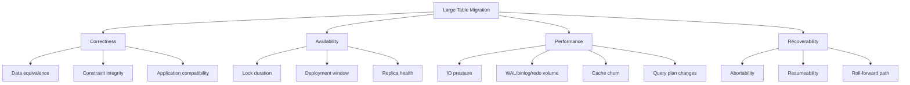
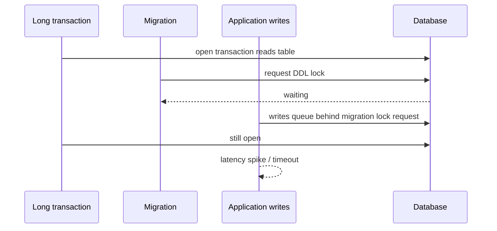
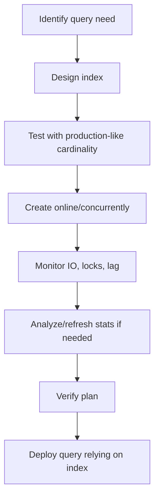
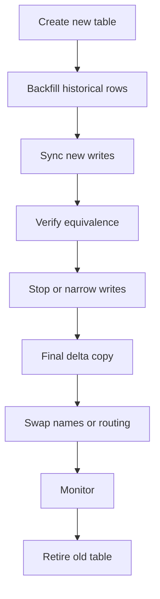
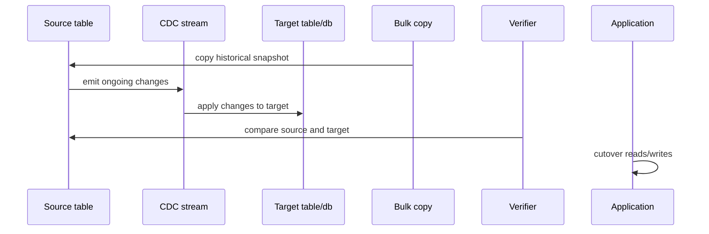

# Part 024 — Large Table Migration: Billion Rows, Locks, Index Build, Online Change

A migration that is safe on 50 thousand rows can be dangerous on 500 million rows.

Large table migration is not a bigger version of normal migration. It is a different class of engineering problem. The limiting factor is no longer only correctness. It is also lock duration, replication lag, WAL/binlog/redo growth, cache churn, vacuum/undo pressure, index build strategy, cutover timing, and rollback feasibility.

This part gives a practical framework for migrating large tables without treating production as a test environment.

---

## 1. Kaufman Deconstruction

Skill “large table migration” consists of these sub-skills:

| Sub-skill | Question | Output |
|---|---|---|
| Table profiling | How large, how hot, how indexed, how replicated? | Table risk profile |
| Lock modelling | What lock is taken and for how long? | Lock risk class |
| Rewrite detection | Does the operation rewrite table data? | Rewrite yes/no/unknown |
| Index strategy | Can the index be built online/concurrently? | Index rollout plan |
| Backfill strategy | How are rows copied or transformed? | Chunk + checkpoint model |
| Sync strategy | How do new writes stay consistent during migration? | Dual-write/trigger/CDC model |
| Cutover strategy | How do we switch safely? | Cutover runbook |
| Verification | How do we prove equivalence? | Reconciliation evidence |
| Recovery | What if we fail midway? | Stop/rollback/roll-forward plan |

Target part ini:

1. Bisa mengklasifikasikan risiko large table change sebelum menulis migration.
2. Bisa memilih antara in-place migration, online DDL, shadow table, copy-and-swap, atau CDC-assisted migration.
3. Bisa mendesain cutover dan verification untuk tabel besar.
4. Bisa menjelaskan trade-off secara defensible kepada reviewer, DBA, SRE, dan product owner.

---

## 2. Mental Model: Large Table = Shared Hot State

Large table has four competing forces:



For large tables, the primary question changes from:

> Will this SQL statement work?

To:

> What resource will this statement monopolize, for how long, and what happens if it stops halfway?

---

## 3. Large Table Risk Profile

Before writing migration, collect a table profile.

| Dimension | Example query/evidence | Why it matters |
|---|---|---|
| Row count | `SELECT COUNT(*)` or catalog estimate | Runtime and batch sizing |
| Table size | physical size on disk | IO and rewrite cost |
| Index size | index relation size | index build cost |
| Write rate | rows/sec, tx/sec | dual-write/sync pressure |
| Read QPS | top queries | query plan blast radius |
| FK dependencies | referencing/referenced tables | constraint/cutover complexity |
| Long transactions | active sessions | DDL blocked by old transactions |
| Replication topology | replicas, lag tolerance | backfill impact |
| Maintenance window | low-traffic window | heavy phases timing |
| Restore time | backup/restore RTO | destructive risk |

PostgreSQL profiling examples:

```sql
SELECT reltuples::bigint AS estimated_rows
FROM pg_class
WHERE oid = 'public.case_event'::regclass;
```

```sql
SELECT pg_size_pretty(pg_total_relation_size('public.case_event')) AS total_size;
```

```sql
SELECT pid, state, now() - xact_start AS xact_age, query
FROM pg_stat_activity
WHERE xact_start IS NOT NULL
ORDER BY xact_age DESC;
```

MySQL profiling examples:

```sql
SELECT table_rows, data_length, index_length
FROM information_schema.tables
WHERE table_schema = DATABASE()
  AND table_name = 'case_event';
```

```sql
SHOW PROCESSLIST;
```

Estimates are often good enough for risk classification, but do not confuse estimates with evidence for final verification.

---

## 4. Risk Classes for Large Table Change

| Class | Description | Example | Strategy |
|---|---|---|---|
| LT-0 | Metadata-only and compatible | Add nullable column on supported DB/version | Normal migration + lock timeout |
| LT-1 | Short lock, no rewrite | Rename small metadata object | Schedule + verify blockers |
| LT-2 | Long scan/build but online-ish | Concurrent index build | Dedicated operation + monitoring |
| LT-3 | Chunked data movement | Backfill derived column | Worker + checkpoint |
| LT-4 | Structural reshape | Split huge table | Shadow table + sync + cutover |
| LT-5 | Destructive/high uncertainty | Drop/retype key column | Multi-phase project + rollback evidence |

Rule:

> LT-2 and above are operational changes, not just migration files.

---

## 5. Lock Modelling

Lock impact has two parts:

1. Lock mode.
2. Lock duration.

A strong lock held for milliseconds may be acceptable. A weaker lock held for hours may still cause problems. The danger is often the combination of lock acquisition and blockers.

Example sequence:



The migration may not hold the lock yet, but its waiting lock request can still create a queue depending on database behavior.

Practical guardrails:

- Set lock timeout.
- Set statement timeout.
- Check long-running transactions before DDL.
- Kill/coordinate blockers only through approved runbook.
- Avoid surprise DDL during peak workload.

PostgreSQL example:

```sql
SET lock_timeout = '5s';
SET statement_timeout = '30min';

ALTER TABLE case_event ADD COLUMN source_system TEXT;
```

MySQL example:

```sql
SET SESSION lock_wait_timeout = 5;
```

---

## 6. Online DDL Is Not Magic

Vendors provide online or concurrent DDL capabilities, but they are not universal guarantees.

### PostgreSQL

Common safer tools:

- `CREATE INDEX CONCURRENTLY` for index creation with reduced write blocking.
- `ALTER TABLE ... ADD CONSTRAINT ... NOT VALID` followed by `VALIDATE CONSTRAINT` for staged validation.
- Adding nullable columns is often cheap, but exact behavior depends on operation and version.

Example:

```sql
CREATE INDEX CONCURRENTLY idx_case_event_case_id_created_at
ON case_event (case_id, created_at);
```

Important: `CREATE INDEX CONCURRENTLY` cannot run inside a normal transaction block.

Flyway pattern:

```sql
-- V20260628_1500__create_case_event_index_concurrently.sql
-- flyway:executeInTransaction=false
CREATE INDEX CONCURRENTLY idx_case_event_case_id_created_at
ON case_event (case_id, created_at);
```

Liquibase formatted SQL:

```sql
--liquibase formatted sql

--changeset case:20260628-1500-create-case-event-index runInTransaction:false
CREATE INDEX CONCURRENTLY idx_case_event_case_id_created_at
ON case_event (case_id, created_at);

--rollback DROP INDEX CONCURRENTLY IF EXISTS idx_case_event_case_id_created_at;
```

### MySQL/InnoDB

MySQL online DDL supports algorithms such as `INSTANT`, `INPLACE`, and `COPY`, with capabilities depending on operation and version.

Example:

```sql
ALTER TABLE case_event
ADD COLUMN source_system VARCHAR(64),
ALGORITHM=INSTANT;
```

For more invasive operations, MySQL may require table copy or stronger locking.

Do not assume:

```txt
MySQL online DDL = no impact
```

Instead require:

```txt
operation + table + version + algorithm + lock behavior + fallback plan
```

---

## 7. Pattern A: In-Place Metadata Expansion

Use when the change is additive and metadata-only or near metadata-only.

Example:

```sql
ALTER TABLE case_event ADD COLUMN ingestion_id UUID;
```

Checklist:

- Is column nullable?
- Is there a volatile default?
- Does vendor/version avoid full table rewrite?
- Is old application compatible?
- Is lock timeout configured?
- Is there a rollback story before data is written?

This is the cheapest pattern, but only for true expansion.

---

## 8. Pattern B: Online Index Rollout

Large index creation can be expensive even if it does not block normal writes for the whole duration.

Risks:

- IO pressure,
- CPU pressure,
- WAL/binlog growth,
- replica lag,
- invalid/failed partial index artifact,
- query plan change after index appears,
- lock at beginning/end of operation.

PostgreSQL example:

```sql
CREATE INDEX CONCURRENTLY idx_payment_tenant_created_id
ON payment (tenant_id, created_at, id);
```

After creation, verify usage intentionally. Do not assume the optimizer will choose it.

```sql
EXPLAIN (ANALYZE, BUFFERS)
SELECT *
FROM payment
WHERE tenant_id = 't-001'
  AND created_at >= now() - interval '7 days'
ORDER BY created_at DESC
LIMIT 50;
```

Rollout sequence:



Never create large indexes blindly as part of application startup migration.

---

## 9. Pattern C: Chunked In-Place Backfill

Use when adding derived column or fixing rows in place.

DDL:

```sql
ALTER TABLE customer ADD COLUMN normalized_email TEXT;
```

Worker:

```sql
UPDATE customer
SET normalized_email = lower(trim(email))
WHERE id > :last_id
  AND id <= :upper_id
  AND normalized_email IS NULL;
```

Cutover:

```sql
SELECT COUNT(*)
FROM customer
WHERE email IS NOT NULL
  AND normalized_email IS NULL;
```

Then constraint:

```sql
ALTER TABLE customer
ADD CONSTRAINT customer_normalized_email_present
CHECK (email IS NULL OR normalized_email IS NOT NULL) NOT VALID;

ALTER TABLE customer
VALIDATE CONSTRAINT customer_normalized_email_present;
```

Operational controls:

- dynamic batch size,
- pause on replication lag,
- max runtime window,
- checkpoint table,
- per-tenant partition,
- verification every N batches.

---

## 10. Pattern D: Shadow Table + Dual Write

Use when reshaping a huge table is too risky in place.

Example: split huge `case_event` into `case_event` + `case_event_payload`.

### Stage 1 — Create Shadow Table

```sql
CREATE TABLE case_event_payload (
    event_id BIGINT PRIMARY KEY,
    payload_json JSONB NOT NULL,
    created_at TIMESTAMP NOT NULL,
    CONSTRAINT fk_case_event_payload_event
        FOREIGN KEY (event_id)
        REFERENCES case_event(id)
);
```

### Stage 2 — Dual Write

Application writes payload into both old and new representation, or writes old representation plus new shadow table.

```java
transactionTemplate.executeWithoutResult(tx -> {
    caseEventRepository.insert(event);
    caseEventPayloadRepository.insert(event.id(), event.payloadJson(), event.createdAt());
});
```

### Stage 3 — Backfill Existing Rows

```sql
INSERT INTO case_event_payload (event_id, payload_json, created_at)
SELECT id, payload_json, created_at
FROM case_event
WHERE id > :last_id
  AND id <= :upper_id
ON CONFLICT (event_id) DO NOTHING;
```

### Stage 4 — Verification

```sql
SELECT COUNT(*)
FROM case_event e
LEFT JOIN case_event_payload p ON p.event_id = e.id
WHERE p.event_id IS NULL;
```

### Stage 5 — Read Cutover

Switch reads to new table.

### Stage 6 — Contract

After evidence and retention window:

```sql
ALTER TABLE case_event DROP COLUMN payload_json;
```

This pattern minimizes in-place rewrite risk but increases application complexity during the transition.

---

## 11. Pattern E: Copy-and-Swap

Use when changing physical layout, partitioning, type, or primary key structure cannot be safely done in place.

Conceptual flow:



Example:

```sql
CREATE TABLE case_event_v2 (
    id BIGINT NOT NULL,
    tenant_id VARCHAR(64) NOT NULL,
    case_id BIGINT NOT NULL,
    event_type VARCHAR(64) NOT NULL,
    created_at TIMESTAMP NOT NULL,
    payload_ref BIGINT,
    PRIMARY KEY (tenant_id, id)
);
```

Backfill:

```sql
INSERT INTO case_event_v2 (id, tenant_id, case_id, event_type, created_at, payload_ref)
SELECT id, tenant_id, case_id, event_type, created_at, payload_id
FROM case_event
WHERE id > :last_id
  AND id <= :upper_id;
```

Cutover options:

| Cutover method | Pros | Cons |
|---|---|---|
| Rename tables | Simple for one DB | Strong lock, app assumptions |
| Switch view | Can hide table name | View limitations/perf |
| Switch app routing | Explicit and safer | Requires app deployment |
| Logical replication cutover | Lower downtime | More moving parts |

For critical systems, prefer application routing cutover over magical table rename, because it is observable, reversible, and can be staged.

---

## 12. Pattern F: Trigger-Based Sync

Triggers can keep shadow table synchronized while historical rows are copied.

PostgreSQL conceptual example:

```sql
CREATE OR REPLACE FUNCTION sync_case_event_payload()
RETURNS trigger AS $$
BEGIN
    INSERT INTO case_event_payload (event_id, payload_json, created_at)
    VALUES (NEW.id, NEW.payload_json, NEW.created_at)
    ON CONFLICT (event_id) DO UPDATE
    SET payload_json = EXCLUDED.payload_json,
        created_at = EXCLUDED.created_at;

    RETURN NEW;
END;
$$ LANGUAGE plpgsql;

CREATE TRIGGER trg_sync_case_event_payload
AFTER INSERT OR UPDATE OF payload_json ON case_event
FOR EACH ROW
EXECUTE FUNCTION sync_case_event_payload();
```

Pros:

- captures writes even if not all app paths are updated,
- keeps sync close to database,
- useful during transitional migration.

Cons:

- hidden write amplification,
- harder to test through application code,
- can create unexpected latency,
- trigger bugs affect production writes,
- rollback/cutover complexity.

Rule:

> Use triggers as temporary synchronization scaffolding, not as a permanent substitute for ownership clarity.

---

## 13. Pattern G: CDC / Logical Replication Assisted Migration

For very large or cross-database changes, use change data capture.

Flow:



Use cases:

- moving table to another database,
- sharding by tenant,
- changing storage engine,
- re-partitioning huge data,
- decomposing shared database into service-owned database.

Risks:

- ordering guarantees,
- exactly-once illusion,
- schema evolution during replication,
- backfill snapshot consistency,
- cutover delta window,
- operational complexity.

CDC migration should be treated as a project, not a migration file.

---

## 14. Partitioning Migration

Partitioning a huge table is a classic large table migration. The hardest part is rarely creating partitions; it is moving traffic safely.

Common motivations:

- retention/purge by time,
- tenant isolation,
- query pruning,
- index size management,
- maintenance operations.

Possible approach:

1. Create partitioned target table.
2. Dual-write new events to old and partitioned target.
3. Backfill historical events by time range.
4. Verify per partition.
5. Switch reads by feature flag.
6. Stop old writes.
7. Retain old table until confidence window ends.

Do not partition only because a table is large. Partition when access patterns and maintenance operations benefit from partition boundaries.

---

## 15. Query Plan Risk

Large table migrations often change query plans.

Examples:

- new index changes optimizer choice,
- backfilled column has skewed distribution,
- table split introduces join,
- partitioning changes pruning behavior,
- stale statistics cause wrong estimates.

Checklist:

- Capture top queries before migration.
- Test representative query plans on production-like data.
- Analyze/refresh stats after large data movement.
- Monitor latency and buffer/IO metrics after cutover.
- Have a rollback or plan override strategy if needed.

PostgreSQL example:

```sql
ANALYZE case_event;
```

MySQL example:

```sql
ANALYZE TABLE case_event;
```

Do not treat migration success as complete just because DDL finished. Query behavior is part of the migration outcome.

---

## 16. Replication and Log Pressure

Large changes generate logs:

- PostgreSQL WAL,
- MySQL binlog/redo/undo,
- Oracle redo/undo,
- SQL Server transaction log.

Consequences:

- replica lag,
- storage growth,
- backup pressure,
- point-in-time recovery window impact,
- failover risk.

Backfill throttling must include replication health.

Example operational policy:

```txt
Continue if:
  primary CPU < 65%
  replica lag < 30s
  disk free > 25%
  error rate = 0

Reduce batch size if:
  replica lag between 30s and 120s

Pause if:
  replica lag > 120s
  disk free < 15%
  lock timeout rate > threshold
```

A migration that overloads replicas can break read traffic even if the primary database looks healthy.

---

## 17. Cutover Design

Cutover is the moment of highest risk.

Cutover options:

| Option | Use when | Main risk |
|---|---|---|
| Feature flag read switch | App can route old/new | Application complexity |
| DB view switch | Consumers read stable view | View performance/limitations |
| Table rename | Simple schema assumptions | Strong lock and hidden dependencies |
| DNS/connection switch | Moving database | Cache/stale connections |
| Service endpoint switch | Service-owned DB | Distributed rollback |

Good cutover has:

- pre-cutover verification,
- freeze or delta strategy,
- exact command list,
- stop criteria,
- monitoring window,
- rollback/roll-forward decision,
- communication channel,
- evidence capture.

Example cutover checklist:

```txt
[ ] Backfill completed
[ ] Dual-write healthy for N hours/days
[ ] Mismatch count = 0 or accepted waiver
[ ] Replica lag normal
[ ] Top query plans verified
[ ] Roll-forward fix ready
[ ] Feature flag owner present
[ ] On-call DBA/SRE available
[ ] Contract migration not scheduled in same release
```

---

## 18. Verification for Large Table Migration

Full row-by-row comparison can be expensive. Use layered verification.

### 18.1 Count Reconciliation

```sql
SELECT COUNT(*) FROM case_event;
SELECT COUNT(*) FROM case_event_v2;
```

### 18.2 Partition/Tenant Counts

```sql
SELECT tenant_id, COUNT(*)
FROM case_event
GROUP BY tenant_id
ORDER BY tenant_id;
```

Compare against target.

### 18.3 Windowed Checksums

Conceptual:

```sql
SELECT
    tenant_id,
    date_trunc('day', created_at) AS day,
    COUNT(*) AS row_count,
    SUM(id) AS id_sum
FROM case_event
GROUP BY tenant_id, date_trunc('day', created_at);
```

This is not cryptographic proof, but it is a useful low-cost detector.

### 18.4 Critical Sample Comparison

Sample high-value or recent records.

```sql
SELECT e.id, e.payload_json, p.payload_json
FROM case_event e
JOIN case_event_payload p ON p.event_id = e.id
WHERE e.created_at >= now() - interval '1 day'
  AND e.payload_json IS DISTINCT FROM p.payload_json
LIMIT 100;
```

### 18.5 Application-Level Shadow Read

During transition, compare old/new read paths for sampled requests.

```java
CaseEvent oldEvent = oldReader.read(eventId);
CaseEvent newEvent = newReader.read(eventId);

if (!Objects.equals(oldEvent, newEvent)) {
    metrics.counter("case_event.shadow_read_mismatch").increment();
    mismatchStore.record(eventId, oldEvent, newEvent);
}
```

---

## 19. Recovery Strategy

Large migration recovery is usually roll-forward, not rollback.

| Failure stage | Example | Safer response |
|---|---|---|
| Before backfill | New column/table created | Drop if unused or leave inert |
| During backfill | Worker fails | Fix and resume from checkpoint |
| During dual-write | Mismatches appear | Stop cutover, repair target, continue dual-write |
| During cutover | New path errors | Switch feature flag back if old path still maintained |
| After contract | Old data dropped | Restore/rebuild from backup or compensation job |

The contract phase should be delayed until confidence is high. Premature cleanup destroys rollback options.

---

## 20. Flyway and Liquibase Encoding Strategy

For large table migration, Flyway/Liquibase usually encode **control-plane changes**, not the entire data-plane workload.

Use migration tool for:

- adding nullable columns,
- creating shadow tables,
- creating checkpoint/evidence tables,
- creating indexes with explicit transaction settings,
- adding staged constraints,
- installing temporary triggers/functions,
- final contract cleanup.

Use external worker/job for:

- billion-row copy,
- long backfill,
- throttled transformation,
- cross-service calls,
- tenant fan-out,
- CDC orchestration.

Example Flyway sequence:

```txt
V20260628_1500__create_case_event_payload_table.sql
V20260628_1510__create_case_event_payload_sync_trigger.sql
V20260628_1520__create_case_event_payload_indexes.sql

# external backfill job runs here

V20260629_0900__validate_case_event_payload_constraints.sql
V20260705_0900__drop_case_event_payload_json_column.sql
```

Example Liquibase sequence:

```xml
<databaseChangeLog>
    <include file="db/changelog/2026/06/28-create-shadow-table.xml"/>
    <include file="db/changelog/2026/06/28-create-sync-trigger.xml"/>
    <include file="db/changelog/2026/06/28-create-indexes.xml"/>
    <!-- external backfill evidence required before following include is enabled -->
    <include file="db/changelog/2026/07/05-contract-old-column.xml"/>
</databaseChangeLog>
```

The migration history should show the structural transitions. The job evidence should show the data movement.

---

## 21. Anti-Patterns

### 21.1 “It Passed on Staging” Without Production-Scale Data

Staging with 1 million rows does not prove safety for production with 2 billion rows and 30x write load.

### 21.2 Running Large Backfill on App Startup

A Kubernetes rollout with 20 pods all trying to start while one migration holds locks is not a controlled operation.

### 21.3 Creating Indexes Without Understanding Query Shape

An index that is not used is pure write overhead.

### 21.4 Contract in Same Release as Expand

Dropping old column/table before proving new path is stable removes recovery options.

### 21.5 Table Rename as Default Cutover

Rename can be valid, but it is often overused. Hidden dependencies, privileges, views, triggers, replication, and ORM mappings can break.

### 21.6 No Replica Lag Budget

Primary success with replica failure is still production failure.

### 21.7 No Stop Criteria

A migration without stop criteria becomes an incident when it behaves badly.

---

## 22. Large Table Migration Review Template

Use this for design review.

```txt
Migration name:
Owner:
Database/table:
Estimated rows:
Estimated size:
Write rate:
Read criticality:
Replication topology:

Change type:
Risk class:
Expected lock modes:
Expected rewrite/scans:
Expected log volume:

Execution model:
Batch size:
Throttle policy:
Checkpoint model:
Sync strategy:
Cutover strategy:
Verification queries:
Rollback/roll-forward plan:
Stop criteria:
Monitoring dashboard:
Approval evidence:
```

A reviewer should be able to answer:

> What exactly will happen if this migration is interrupted after 10%, 50%, and 99% completion?

If the answer is unclear, the plan is not ready.

---

## 23. Practice: Design a Billion-Row Migration

Scenario:

`case_event` has 1.8 billion rows. The `payload_json` column makes the table too large and slows common case timeline queries. You need to move payload into `case_event_payload` while preserving availability.

Design:

1. Shadow table schema.
2. Write synchronization strategy.
3. Historical copy strategy.
4. Checkpoint model.
5. Index rollout.
6. Query plan validation.
7. Cutover plan.
8. Verification plan.
9. Contract cleanup timing.
10. Failure playbook.

Good solution should avoid a single massive transaction, avoid same-release drop, include replica lag throttling, and provide evidence before cutover.

---

## 24. Summary

Large table migration is a production engineering discipline.

The core principles:

- Profile before changing.
- Prefer additive expansion.
- Know lock behavior per vendor/version.
- Avoid unbounded transactions.
- Use online/concurrent DDL carefully.
- Move data in chunks with checkpoint.
- Keep source and target synchronized during transition.
- Verify before cutover.
- Delay destructive cleanup.
- Treat migration history and job evidence as separate but connected records.

A top-tier engineer does not ask only, “Can we run this SQL?”

They ask:

> Can this migration be stopped, resumed, verified, explained, audited, and recovered while production traffic continues?

That question is the difference between database migration as a script and database migration as a reliable system change.
