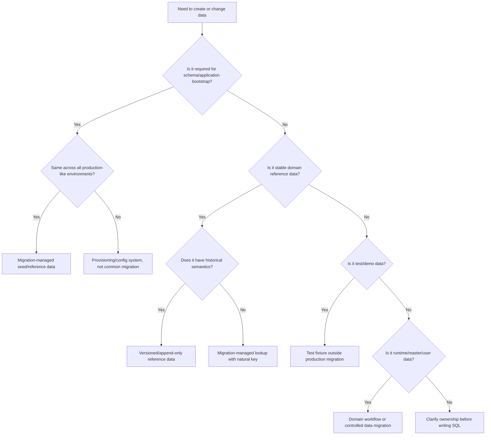
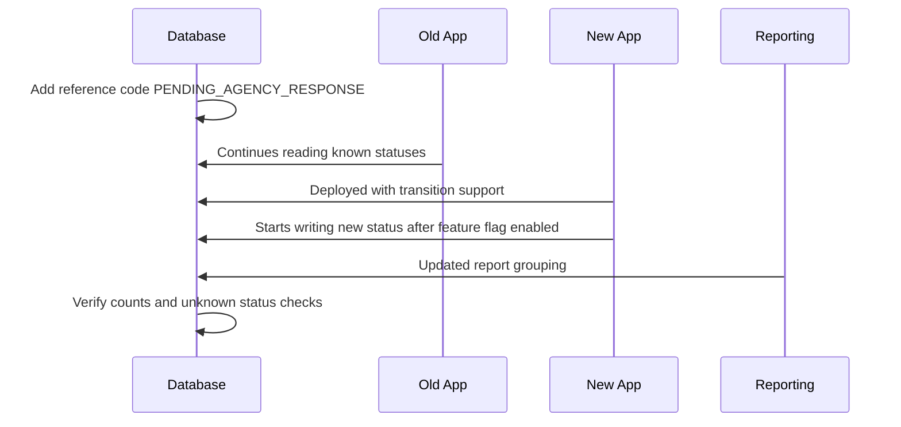

------
title: Learn Java Database Migrations, Flyway, Liquibase - Part 025
description: Reference data, seed data, lookup tables, configuration data, and environment data as production-grade database migration artifacts.
series: learn-java-database-migrations
seriesTitle: Learn Java Database Migrations, Flyway, Liquibase
order: 25
partTitle: Reference Data, Seed Data, Lookup Tables, and Configuration Data
tags:
  - java
  - database
  - migration
  - flyway
  - liquibase
  - reference-data
  - seed-data
  - production-engineering
date: 2026-06-28
---

# Part 025 — Reference Data, Seed Data, Lookup Tables, and Configuration Data

> **Goal:** setelah bagian ini, kamu tidak lagi memperlakukan `INSERT INTO lookup_table ...` sebagai script kecil yang tidak perlu desain. Kamu akan bisa membedakan reference data, seed data, fixture, master data, configuration data, operational data, dan user data; memilih strategi Flyway/Liquibase yang tepat; serta membuat perubahan data kecil tetap auditable, deterministic, reversible, dan aman untuk production.

Database migration biasanya diasosiasikan dengan DDL: `CREATE TABLE`, `ALTER TABLE`, `CREATE INDEX`, `DROP COLUMN`.

Namun banyak production incident justru berasal dari data kecil:

- status baru ditambahkan tetapi aplikasi lama tidak mengenalnya;
- lookup code berubah dan merusak historical reporting;
- config threshold diubah lewat SQL manual tanpa audit;
- seed data test ikut masuk production;
- reference data dihapus padahal masih direferensikan oleh historical rows;
- repeatable migration menghapus dan mengisi ulang table, lalu merusak foreign key;
- `INSERT` manual di satu environment membuat staging dan production drift.

Part ini membahas **data yang dikendalikan oleh engineering** sebagai bagian dari migration system.

---

## 1. Kaufman Deconstruction: Skill yang Sebenarnya Dipelajari

Dalam kerangka Josh Kaufman, skill ini harus dipecah menjadi sub-skill kecil yang bisa dilatih:

| Sub-skill | Pertanyaan Praktis |
|---|---|
| Classification | Data ini reference, seed, fixture, config, master, atau user data? |
| Ownership | Siapa pemilik perubahan data ini: aplikasi, domain team, ops, compliance, product, atau user? |
| Mutability | Apakah nilainya immutable, append-only, mutable, atau environment-specific? |
| Identity | Apakah identity-nya surrogate key, natural key, code, composite key, atau versioned key? |
| Deployment | Apakah data ini harus ikut schema migration, application deployment, feature flag, atau admin workflow? |
| Compatibility | Apakah aplikasi lama bisa hidup bersama data baru? |
| Auditability | Apakah perubahan dapat dijelaskan: siapa, kapan, mengapa, dari ticket mana? |
| Recovery | Jika salah value, apakah diperbaiki dengan update, rollback, compensation, atau new version? |

Targetnya bukan hafal template SQL. Targetnya adalah bisa menjawab:

> “Data ini harus hidup di migration, aplikasi, admin UI, config service, atau domain workflow?”

---

## 2. Taxonomy: Jangan Semua Disebut Seed Data

Istilah “seed data” sering dipakai terlalu longgar. Ini berbahaya karena setiap jenis data punya aturan berbeda.

### 2.1 Reference Data

**Reference data** adalah data relatif stabil yang digunakan untuk mengklasifikasikan, memvalidasi, atau memberi makna pada transaksi.

Contoh:

- country code;
- currency code;
- document type;
- case status;
- enforcement action type;
- risk category;
- permission role;
- workflow transition reason;
- regulatory violation type.

Karakteristik:

- sering dipakai oleh foreign key atau business rule;
- perubahan kecil bisa berdampak besar;
- harus auditable;
- sering lebih aman append-only daripada update/delete;
- historical meaning harus dijaga.

### 2.2 Seed Data

**Seed data** adalah data awal yang diperlukan agar aplikasi bisa berjalan.

Contoh:

- default admin role;
- root organization;
- default system tenant;
- initial workflow definition;
- default system settings.

Karakteristik:

- biasanya dibutuhkan saat bootstrap environment;
- tidak selalu sama antar-environment;
- dapat berubah setelah sistem hidup;
- sering menjadi transisi dari migration-managed ke application-managed data.

### 2.3 Test Fixture Data

**Test fixture data** adalah data untuk automated test, local development, demo, atau sandbox.

Contoh:

- fake users;
- fake cases;
- demo organizations;
- test invoices;
- sample regulatory events.

Karakteristik:

- tidak boleh masuk production;
- boleh reset ulang;
- boleh tidak audit-grade;
- harus dipisahkan dari production migration.

### 2.4 Master Data

**Master data** adalah domain entity yang memiliki lifecycle bisnis.

Contoh:

- customer;
- regulated entity;
- institution;
- license holder;
- product catalog;
- employee;
- vendor.

Karakteristik:

- biasanya bukan tanggung jawab migration;
- dibuat/diubah lewat domain workflow;
- punya ownership dan audit sendiri;
- sering butuh approval, effective date, dan versioning.

### 2.5 Configuration Data

**Configuration data** mengendalikan behavior sistem.

Contoh:

- SLA threshold;
- escalation delay;
- feature toggle default;
- risk score weight;
- notification template binding;
- retry/backoff setting;
- case assignment policy.

Karakteristik:

- perubahan bisa mengubah behavior tanpa code deploy;
- sering environment-specific;
- harus punya change governance;
- kadang lebih tepat di config service daripada database migration.

### 2.6 Operational Data

**Operational data** adalah data runtime yang dihasilkan sistem.

Contoh:

- job execution state;
- outbox event;
- inbox deduplication record;
- lock row;
- scheduler heartbeat;
- batch checkpoint.

Karakteristik:

- bukan migration-managed;
- boleh dibersihkan dengan retention policy;
- sering volatile;
- perubahan manual rawan menyebabkan duplicate processing atau stuck job.

### 2.7 User Data

**User data** adalah data yang dibuat atau dimiliki pengguna/domain runtime.

Contoh:

- case;
- transaction;
- comment;
- uploaded document;
- audit note;
- application form.

Karakteristik:

- tidak boleh disisipkan sembarangan oleh migration kecuali untuk data migration yang terkontrol;
- recovery-nya harus mengikuti domain policy;
- perubahan massal butuh evidence dan verification.

---

## 3. Classification Matrix

Gunakan matrix ini sebelum menulis SQL data migration.

| Data Type | Dikelola Migration? | Mutable? | Environment-Specific? | Production Risk |
|---|---:|---:|---:|---|
| Reference data | Ya, dengan disiplin | Rendah/sedang | Jarang | Semantic break |
| Seed data | Kadang | Sedang | Kadang | Bootstrap drift |
| Test fixture | Tidak untuk production | Tinggi | Ya | Data leakage |
| Master data | Umumnya tidak | Tinggi | Ya | Domain corruption |
| Configuration data | Tergantung | Tinggi | Sering | Behavior drift |
| Operational data | Tidak | Tinggi | Ya | Runtime corruption |
| User data | Tidak, kecuali data migration | Tinggi | Ya | Data loss/legal risk |

Rule of thumb:

> Semakin data punya lifecycle bisnis sendiri, semakin tidak cocok dikelola sebagai migration statis.

---

## 4. Mental Model: Reference Data Adalah Contract

Reference data sering tampak seperti “baris di table”. Pada sistem production, reference data adalah **contract** antara:

- database;
- application code;
- API payload;
- UI label;
- reporting;
- workflow engine;
- audit rules;
- downstream consumers;
- analytics pipeline;
- external regulator/partner.

Contoh table:

```sql
CREATE TABLE case_status (
    code        varchar(64) PRIMARY KEY,
    label       varchar(255) NOT NULL,
    terminal    boolean NOT NULL DEFAULT false,
    active      boolean NOT NULL DEFAULT true,
    sort_order  integer NOT NULL,
    created_at  timestamp NOT NULL DEFAULT current_timestamp
);
```

Sekilas aman. Namun `code = 'CLOSED'` mungkin dipakai di:

```java
if (caseStatus.equals("CLOSED")) {
    preventFurtherAction();
}
```

```sql
SELECT count(*) FROM regulatory_case WHERE status_code = 'CLOSED';
```

```json
{
  "status": "CLOSED"
}
```

Jika `CLOSED` diganti menjadi `RESOLVED`, kamu bukan hanya mengubah data. Kamu mengubah contract.

---

## 5. Identity Strategy untuk Reference Data

Kesalahan klasik: memakai auto-increment integer sebagai identity utama reference data, lalu hardcode ID di aplikasi.

### 5.1 Bad Pattern: Hardcoded Surrogate ID

```sql
INSERT INTO case_status (id, code, label)
VALUES (1, 'OPEN', 'Open');
```

```java
if (statusId == 1L) {
    // open case
}
```

Problem:

- ID bisa berbeda antar-environment;
- migration rerun sulit;
- data import/export rawan collision;
- review tidak langsung memahami makna `1`;
- branching/merge lebih rentan.

### 5.2 Better Pattern: Stable Natural Code

```sql
INSERT INTO case_status (code, label, terminal, active, sort_order)
VALUES ('OPEN', 'Open', false, true, 10);
```

```java
public enum CaseStatusCode {
    OPEN,
    UNDER_REVIEW,
    CLOSED
}
```

Gunakan `code` sebagai external stable identity. Surrogate ID boleh tetap ada untuk join performance atau ORM convenience, tetapi jangan menjadi semantic identity.

### 5.3 Stronger Pattern: Code + Effective Version

Untuk reference data yang maknanya bisa berubah sepanjang waktu:

```sql
CREATE TABLE violation_type (
    code             varchar(64) NOT NULL,
    version          integer NOT NULL,
    label            varchar(255) NOT NULL,
    effective_from   date NOT NULL,
    effective_to     date,
    active           boolean NOT NULL,
    PRIMARY KEY (code, version)
);
```

Pattern ini cocok untuk domain regulasi:

- rule berubah per tahun;
- reporting historis harus memakai definisi pada waktu kejadian;
- perubahan tidak boleh overwrite makna lama.

---

## 6. Mutability Model

Sebelum membuat migration data, klasifikasikan mutability-nya.

### 6.1 Immutable

Data tidak boleh berubah setelah dipakai.

Contoh:

- historical legal basis code;
- archived status meaning;
- canonical currency code.

Operation allowed:

- insert new code;
- mark inactive;
- add successor code.

Operation disallowed:

- rename code;
- delete row;
- update semantic meaning.

### 6.2 Append-Only

Data boleh bertambah, tetapi row lama tidak diubah.

Contoh:

- workflow transition reason;
- violation category;
- regulatory classification.

Operation allowed:

- insert new row;
- set `active=false` via explicit deprecation migration;
- add `replaced_by_code`.

### 6.3 Mutable with Audit

Data boleh berubah, tetapi harus ada audit.

Contoh:

- display label;
- sort order;
- UI grouping;
- non-semantic description.

Operation allowed:

- update label;
- update description;
- update sort order.

Requirement:

- audit evidence;
- change ticket;
- deterministic update by natural key.

### 6.4 Environment-Specific Mutable

Data berbeda antar-environment.

Contoh:

- SMTP endpoint;
- callback URL;
- external sandbox partner ID;
- tenant-specific config.

Biasanya jangan dimasukkan ke common migration. Gunakan:

- config service;
- environment variable;
- secret manager;
- admin provisioning flow;
- Liquibase contexts hanya jika benar-benar perlu;
- Flyway placeholder hanya untuk non-secret deterministic value.

---

## 7. Decision Tree: Haruskah Data Ini Masuk Migration?



---

## 8. Flyway Strategy for Reference Data

Flyway punya dua mekanisme utama untuk data kecil:

1. **Versioned migration** untuk perubahan historis yang harus terjadi sekali.
2. **Repeatable migration** untuk definisi data yang ingin direkonsiliasi ulang saat file berubah.

Flyway repeatable migration memang cocok untuk bulk reference data reinserts, tetapi harus hati-hati karena rerun dipicu oleh checksum change.

### 8.1 Versioned Insert: Untuk Event Historis

```sql
-- V20260628_1010__add_case_status_under_review.sql
INSERT INTO case_status (code, label, terminal, active, sort_order)
VALUES ('UNDER_REVIEW', 'Under Review', false, true, 20);
```

Kelebihan:

- jelas sebagai event historis;
- hanya jalan sekali;
- mudah diaudit;
- tidak mengubah row lain tanpa eksplisit.

Kekurangan:

- file bertambah banyak;
- perubahan label berikutnya butuh migration baru;
- full desired state tidak terlihat dalam satu file.

Cocok untuk:

- status baru;
- reason baru;
- permission baru;
- reference code yang ditambahkan per release.

### 8.2 Versioned Upsert: Untuk Rerun Safety Terbatas

PostgreSQL:

```sql
-- V20260628_1020__upsert_case_statuses.sql
INSERT INTO case_status (code, label, terminal, active, sort_order)
VALUES
    ('OPEN', 'Open', false, true, 10),
    ('UNDER_REVIEW', 'Under Review', false, true, 20),
    ('CLOSED', 'Closed', true, true, 90)
ON CONFLICT (code) DO UPDATE SET
    label = EXCLUDED.label,
    terminal = EXCLUDED.terminal,
    active = EXCLUDED.active,
    sort_order = EXCLUDED.sort_order;
```

Kelebihan:

- safe jika script tidak sengaja rerun manual;
- environment adoption lebih mudah;
- bagus untuk initial import.

Risiko:

- update semantic meaning bisa terjadi diam-diam;
- historical semantics bisa berubah;
- perlu review ketat.

Gunakan hanya jika update behavior memang disengaja.

### 8.3 Repeatable Reference Data Reconciliation

```sql
-- R__reference_data_case_status.sql
INSERT INTO case_status (code, label, terminal, active, sort_order)
VALUES
    ('OPEN', 'Open', false, true, 10),
    ('UNDER_REVIEW', 'Under Review', false, true, 20),
    ('CLOSED', 'Closed', true, true, 90)
ON CONFLICT (code) DO UPDATE SET
    label = EXCLUDED.label,
    terminal = EXCLUDED.terminal,
    active = EXCLUDED.active,
    sort_order = EXCLUDED.sort_order;
```

Pattern ini membuat file repeatable sebagai **desired state** untuk reference data.

Cocok jika:

- table kecil;
- row tidak punya foreign key destructive reload;
- semantic update memang boleh;
- data dikelola penuh oleh repository;
- semua perubahan harus tercermin dalam file yang sama.

Tidak cocok jika:

- row historis tidak boleh berubah;
- delete/reinsert mengganggu FK;
- table dipakai oleh user/admin runtime;
- ada environment-specific override.

### 8.4 Avoid: Delete All + Reinsert

```sql
DELETE FROM case_status;

INSERT INTO case_status (...)
VALUES (...);
```

Ini buruk untuk production karena:

- bisa melanggar FK;
- bisa memutus audit/history;
- bisa mengubah surrogate ID;
- bisa membuat gap saat migration berjalan;
- bisa menghapus runtime customization.

Jika harus reconcile, gunakan upsert natural key dan explicit deactivation.

### 8.5 Explicit Deactivation

```sql
UPDATE case_status
SET active = false,
    deactivated_at = current_timestamp,
    replaced_by_code = 'RESOLVED'
WHERE code = 'CLOSED_LEGACY'
  AND active = true;
```

Lebih aman daripada delete karena historical row tetap punya makna.

---

## 9. Liquibase Strategy for Reference Data

Liquibase menyediakan beberapa change type untuk data:

- `insert`;
- `update`;
- `delete`;
- `loadData`;
- `loadUpdateData`;
- raw SQL;
- rollback block.

### 9.1 Simple Insert Changeset

```yaml
- changeSet:
    id: 20260628-1010-add-under-review-status
    author: platform-team
    changes:
      - insert:
          tableName: case_status
          columns:
            - column:
                name: code
                value: UNDER_REVIEW
            - column:
                name: label
                value: Under Review
            - column:
                name: terminal
                valueBoolean: false
            - column:
                name: active
                valueBoolean: true
            - column:
                name: sort_order
                valueNumeric: 20
    rollback:
      - delete:
          tableName: case_status
          where: code = 'UNDER_REVIEW'
```

Kelebihan:

- explicit;
- auditable;
- rollback bisa didefinisikan;
- cocok untuk data kecil.

Risiko:

- YAML/XML verbosity;
- raw SQL sering lebih mudah direview untuk batch data.

### 9.2 Raw SQL Changeset

```yaml
- changeSet:
    id: 20260628-1020-upsert-case-status
    author: platform-team
    changes:
      - sql:
          dbms: postgresql
          sql: |
            INSERT INTO case_status (code, label, terminal, active, sort_order)
            VALUES ('UNDER_REVIEW', 'Under Review', false, true, 20)
            ON CONFLICT (code) DO UPDATE SET
                label = EXCLUDED.label,
                terminal = EXCLUDED.terminal,
                active = EXCLUDED.active,
                sort_order = EXCLUDED.sort_order;
    rollback:
      - sql:
          sql: |
            UPDATE case_status
            SET active = false
            WHERE code = 'UNDER_REVIEW';
```

Raw SQL sering paling reviewable untuk SQL-first team.

### 9.3 `loadData`

`loadData` memuat data dari CSV ke table.

Example:

```yaml
- changeSet:
    id: 20260628-1030-load-case-status
    author: platform-team
    changes:
      - loadData:
          tableName: case_status
          file: db/reference/case_status.csv
          separator: ","
          columns:
            - column:
                name: code
                type: string
            - column:
                name: label
                type: string
            - column:
                name: terminal
                type: boolean
            - column:
                name: active
                type: boolean
            - column:
                name: sort_order
                type: numeric
```

CSV:

```csv
code,label,terminal,active,sort_order
OPEN,Open,false,true,10
UNDER_REVIEW,Under Review,false,true,20
CLOSED,Closed,true,true,90
```

Cocok untuk:

- initial data load;
- table kecil sampai sedang;
- data yang lebih nyaman dibaca sebagai CSV;
- onboarding existing reference data.

Risiko:

- perubahan CSV setelah changeset applied memicu checksum issue;
- CSV kurang ekspresif untuk conditional update;
- rollback perlu dipikirkan;
- review diff CSV bisa kurang jelas untuk semantic change besar.

### 9.4 `loadUpdateData`

`loadUpdateData` memuat atau memperbarui data berdasarkan primary key. Ini lebih cocok untuk reference data yang ingin direkonsiliasi.

```yaml
- changeSet:
    id: 20260628-1040-load-update-case-status
    author: platform-team
    changes:
      - loadUpdateData:
          tableName: case_status
          file: db/reference/case_status.csv
          primaryKey: code
          separator: ","
```

Gunakan jika:

- natural key jelas;
- update behavior diinginkan;
- table kecil;
- repository memang source of truth.

Jangan gunakan jika:

- row bisa dimodifikasi oleh user/admin runtime;
- historical meaning harus immutable;
- environment-specific override ada;
- kamu tidak ingin update otomatis.

---

## 10. Reference Data Design Patterns

### 10.1 Stable Code Pattern

Gunakan stable code sebagai semantic key.

```sql
CREATE TABLE case_priority (
    code varchar(64) PRIMARY KEY,
    label varchar(255) NOT NULL,
    severity integer NOT NULL,
    active boolean NOT NULL DEFAULT true
);
```

Jangan expose surrogate ID ke API.

```json
{
  "priority": "HIGH"
}
```

Bukan:

```json
{
  "priorityId": 3
}
```

### 10.2 Append-Only Deprecation Pattern

```sql
ALTER TABLE case_status
ADD COLUMN active boolean NOT NULL DEFAULT true,
ADD COLUMN deactivated_at timestamp,
ADD COLUMN replaced_by_code varchar(64),
ADD CONSTRAINT fk_case_status_replaced_by
    FOREIGN KEY (replaced_by_code) REFERENCES case_status(code);
```

Deprecate:

```sql
UPDATE case_status
SET active = false,
    deactivated_at = current_timestamp,
    replaced_by_code = 'RESOLVED'
WHERE code = 'CLOSED_LEGACY';
```

Application rule:

- new transaction cannot use inactive code;
- historical transaction can still reference inactive code;
- reporting can map legacy to successor if needed.

### 10.3 Effective Dating Pattern

```sql
CREATE TABLE risk_weight_config (
    code varchar(64) NOT NULL,
    version integer NOT NULL,
    weight numeric(10,4) NOT NULL,
    effective_from timestamp NOT NULL,
    effective_to timestamp,
    created_by varchar(128) NOT NULL,
    change_ticket varchar(128) NOT NULL,
    PRIMARY KEY (code, version),
    CHECK (effective_to IS NULL OR effective_to > effective_from)
);
```

Cocok untuk regulated system:

- policy berubah tetapi historical decision harus explainable;
- audit butuh “rule at time of decision”;
- rollback bukan overwrite, tetapi new version.

### 10.4 Dictionary Table Pattern

Untuk UI label multi-language:

```sql
CREATE TABLE reference_label (
    ref_type varchar(64) NOT NULL,
    ref_code varchar(64) NOT NULL,
    locale varchar(16) NOT NULL,
    label varchar(255) NOT NULL,
    PRIMARY KEY (ref_type, ref_code, locale)
);
```

Jangan campur semantic code dengan display label.

### 10.5 Permission/Role Seed Pattern

Permission sering terlihat seperti reference data, tetapi berdampak security.

```sql
CREATE TABLE permission (
    code varchar(128) PRIMARY KEY,
    description varchar(512) NOT NULL,
    active boolean NOT NULL DEFAULT true
);

CREATE TABLE role_permission (
    role_code varchar(128) NOT NULL,
    permission_code varchar(128) NOT NULL,
    PRIMARY KEY (role_code, permission_code)
);
```

Safe migration:

```sql
INSERT INTO permission (code, description)
VALUES ('CASE:APPROVE_CLOSURE', 'Approve case closure')
ON CONFLICT (code) DO NOTHING;

INSERT INTO role_permission (role_code, permission_code)
VALUES ('SUPERVISOR', 'CASE:APPROVE_CLOSURE')
ON CONFLICT DO NOTHING;
```

Security rule:

- adding permission is usually safe;
- granting permission to role is high-risk;
- removing permission is compatibility-risk;
- renaming permission is contract-breaking.

---

## 11. Seed Data Bootstrap Pattern

Seed data harus menjawab: “apa minimum data agar sistem bisa start?”

Example:

```sql
CREATE TABLE system_tenant (
    tenant_id uuid PRIMARY KEY,
    tenant_code varchar(64) NOT NULL UNIQUE,
    name varchar(255) NOT NULL,
    created_at timestamp NOT NULL DEFAULT current_timestamp
);
```

Bootstrap:

```sql
INSERT INTO system_tenant (tenant_id, tenant_code, name)
VALUES ('00000000-0000-0000-0000-000000000001', 'SYSTEM', 'System Tenant')
ON CONFLICT (tenant_code) DO NOTHING;
```

Guidelines:

- use deterministic ID for system-owned singleton;
- do not use random UUID in migration if downstream rows need it;
- avoid environment-specific data in common migration;
- separate bootstrap data from demo data;
- document whether row is migration-owned forever or only initial seed.

---

## 12. Environment Data Boundary

A common production failure:

```sql
INSERT INTO notification_endpoint (type, url)
VALUES ('CASE_CLOSED_WEBHOOK', 'https://staging.partner.example/webhook');
```

This accidentally ships staging endpoint to production.

### 12.1 Bad Pattern: Environment Branch in SQL

```sql
-- Pseudo-pattern: don't do this
IF '${env}' = 'prod' THEN
    INSERT INTO config(key, value) VALUES ('callback.url', 'https://prod.example');
ELSE
    INSERT INTO config(key, value) VALUES ('callback.url', 'https://dev.example');
END IF;
```

Problem:

- migration result depends on runtime config;
- hard to reproduce;
- audit evidence becomes ambiguous;
- one artifact no longer has one meaning.

### 12.2 Better Pattern: Migration Creates Shape, Provisioning Sets Value

Migration:

```sql
CREATE TABLE external_endpoint_config (
    key varchar(128) PRIMARY KEY,
    value text NOT NULL,
    updated_at timestamp NOT NULL,
    updated_by varchar(128) NOT NULL
);
```

Provisioning/admin/config management sets values per environment.

### 12.3 Liquibase Contexts with Strict Boundary

Contexts can be used for test/demo data:

```yaml
- changeSet:
    id: 20260628-1100-load-demo-users
    author: platform-team
    context: dev,test
    changes:
      - loadData:
          tableName: app_user
          file: db/demo/users.csv
```

Rule:

- contexts are acceptable for non-production fixtures;
- production reference data should not rely on context unless there is a strong governance reason;
- security and endpoint secrets should not live in changelog.

---

## 13. Configuration Data: Migration or Runtime Config?

Configuration data sits at an awkward boundary.

### 13.1 Use Migration When

Use migration when config is:

- structural;
- global;
- required by schema/application startup;
- same across all environments;
- versioned with code;
- safe to deploy with application.

Example:

```sql
INSERT INTO rule_type (code, label, active)
VALUES ('ESCALATION_SLA', 'Escalation SLA Rule', true)
ON CONFLICT (code) DO NOTHING;
```

### 13.2 Use Config Service/Admin Workflow When

Use config service/admin workflow when config is:

- environment-specific;
- tenant-specific;
- frequently changed;
- controlled by operations/product;
- needs runtime activation/deactivation;
- secret-bearing;
- subject to approval workflow.

Example:

- `maxLoginAttempts` might be runtime config;
- `LOGIN_ATTEMPT_LIMIT` rule type might be reference data.

### 13.3 Regulated Configuration Pattern

For regulatory systems, config changes often require evidence.

```sql
CREATE TABLE policy_config_version (
    config_key varchar(128) NOT NULL,
    version integer NOT NULL,
    config_value jsonb NOT NULL,
    effective_from timestamp NOT NULL,
    effective_to timestamp,
    approved_by varchar(128) NOT NULL,
    approval_ticket varchar(128) NOT NULL,
    created_at timestamp NOT NULL DEFAULT current_timestamp,
    PRIMARY KEY (config_key, version)
);
```

Do not overwrite config value if it affects historical decisions. Insert a new version.

---

## 14. Java Enum vs Database Reference Table

### 14.1 Enum-only

```java
public enum CaseStatus {
    OPEN,
    UNDER_REVIEW,
    CLOSED
}
```

Good for:

- simple internal state;
- code-owned finite set;
- no admin management;
- no reporting label complexity.

Problem:

- DB can contain invalid value unless constrained;
- adding enum requires code deploy;
- historical deprecation is awkward;
- external integration may need data-level metadata.

### 14.2 Reference Table-only

Good for:

- runtime/admin-managed values;
- UI-driven metadata;
- multi-locale labels;
- domain-owned classifications.

Problem:

- application loses compile-time safety;
- business logic may become stringly-typed;
- unknown code behavior must be handled.

### 14.3 Hybrid Pattern

Use enum for application-critical states and reference table for metadata.

```java
public enum CaseStatusCode {
    OPEN,
    UNDER_REVIEW,
    CLOSED;
}
```

```sql
CREATE TABLE case_status_metadata (
    code varchar(64) PRIMARY KEY,
    label varchar(255) NOT NULL,
    terminal boolean NOT NULL,
    active boolean NOT NULL
);
```

Validation:

```java
public boolean isKnownStatus(String code) {
    return Arrays.stream(CaseStatusCode.values())
        .anyMatch(v -> v.name().equals(code));
}
```

Migration must update DB metadata before code uses new enum in production, or deploy code that tolerates DB code before data appears.

---

## 15. Pattern: Safe Reference Data Rollout

Scenario: add new case status `PENDING_EXTERNAL_RESPONSE`.

### Phase 1: Add Reference Data

```sql
INSERT INTO case_status (code, label, terminal, active, sort_order)
VALUES ('PENDING_EXTERNAL_RESPONSE', 'Pending External Response', false, true, 30)
ON CONFLICT (code) DO NOTHING;
```

### Phase 2: Deploy App That Can Emit New Status

Application now can transition to new status.

### Phase 3: Update Reporting/Analytics

Downstream dashboards and reports include new status.

### Phase 4: Contract Confirmation

Verify:

```sql
SELECT status_code, count(*)
FROM regulatory_case
GROUP BY status_code
ORDER BY status_code;
```

This is safer than deploying code and data blindly in one opaque release.

---

## 16. Pattern: Safe Reference Data Rename

Do not rename code in place.

### Bad

```sql
UPDATE case_status
SET code = 'RESOLVED'
WHERE code = 'CLOSED';
```

This breaks FK/API/reporting/app logic.

### Better

```sql
INSERT INTO case_status (code, label, terminal, active, sort_order)
VALUES ('RESOLVED', 'Resolved', true, true, 90)
ON CONFLICT (code) DO NOTHING;

UPDATE case_status
SET active = false,
    replaced_by_code = 'RESOLVED'
WHERE code = 'CLOSED';
```

Then migrate new writes to `RESOLVED`, while old rows can remain `CLOSED` or be backfilled by a separate audited data migration if policy allows.

---

## 17. Pattern: Reference Data Removal

Usually do not delete. Deactivate.

```sql
UPDATE violation_type
SET active = false,
    deactivated_at = current_timestamp,
    deactivation_reason = 'No longer valid under 2026 policy update'
WHERE code = 'LEGACY_REPORTING_FAILURE'
  AND active = true;
```

Only delete if:

- row has never been referenced;
- environment is disposable;
- migration is before production release;
- legal/audit policy permits.

Verification before delete:

```sql
SELECT count(*)
FROM enforcement_action
WHERE violation_type_code = 'LEGACY_REPORTING_FAILURE';
```

---

## 18. Pattern: Permission Data Rollout

Permission changes require special caution.

### Additive Permission

```sql
INSERT INTO permission (code, description, active)
VALUES ('CASE:EXPORT', 'Export case data', true)
ON CONFLICT (code) DO NOTHING;
```

This is usually safe because no one has it yet.

### Grant to Role

```sql
INSERT INTO role_permission (role_code, permission_code)
VALUES ('CASE_MANAGER', 'CASE:EXPORT')
ON CONFLICT DO NOTHING;
```

This changes authorization behavior. It needs:

- product/security approval;
- audit ticket;
- least privilege review;
- verification query.

### Remove Permission

Do not hard delete if used by audit trail.

```sql
UPDATE permission
SET active = false
WHERE code = 'CASE:LEGACY_EXPORT';
```

---

## 19. Rollback Strategy for Reference Data

Rollback is not always delete.

| Change | Naive Rollback | Safer Recovery |
|---|---|---|
| Add unused reference code | Delete code | Delete only if unreferenced |
| Add used reference code | Delete code | Deactivate or roll forward app behavior |
| Update label | Revert label | New update with audit reason |
| Update semantic field | Revert field | Investigate impacted rows, compensate |
| Grant permission | Delete role_permission | Remove grant and audit access window |
| Change config threshold | Revert value | New config version with effective date |

Example guarded rollback:

```sql
DO $$
BEGIN
    IF EXISTS (
        SELECT 1 FROM regulatory_case
        WHERE status_code = 'PENDING_EXTERNAL_RESPONSE'
    ) THEN
        RAISE EXCEPTION 'Cannot delete status because it is already referenced';
    END IF;

    DELETE FROM case_status
    WHERE code = 'PENDING_EXTERNAL_RESPONSE';
END $$;
```

Often better:

```sql
UPDATE case_status
SET active = false
WHERE code = 'PENDING_EXTERNAL_RESPONSE';
```

---

## 20. Observability for Reference Data Migration

Reference data migration should produce evidence.

### 20.1 Verification Queries

```sql
SELECT code, label, active
FROM case_status
WHERE code IN ('OPEN', 'UNDER_REVIEW', 'CLOSED')
ORDER BY code;
```

```sql
SELECT permission_code, count(*) AS role_count
FROM role_permission
GROUP BY permission_code
ORDER BY permission_code;
```

### 20.2 Invariant Checks

```sql
-- No active case references unknown status.
SELECT c.status_code, count(*)
FROM regulatory_case c
LEFT JOIN case_status s ON s.code = c.status_code
WHERE s.code IS NULL
GROUP BY c.status_code;
```

```sql
-- No duplicate display order among active statuses.
SELECT sort_order, count(*)
FROM case_status
WHERE active = true
GROUP BY sort_order
HAVING count(*) > 1;
```

### 20.3 Evidence Bundle

For important reference data change, capture:

- migration file name;
- change ticket;
- approval record;
- before snapshot;
- after snapshot;
- verification query output;
- rollback/roll-forward plan;
- downstream consumer sign-off if needed.

---

## 21. Testing Strategy

### 21.1 Migration from Scratch

Run all migrations against empty database.

Verify:

- reference tables are populated;
- FK constraints pass;
- application starts;
- enum/reference metadata align.

### 21.2 Migration from Production-like Snapshot

Run migration against snapshot with realistic historical rows.

Verify:

- no FK violation;
- no accidental overwrite;
- inactive codes still resolve;
- reports still run.

### 21.3 Contract Test

Example JUnit style:

```java
@Test
void allCaseStatusEnumValuesExistInDatabase() {
    Set<String> dbCodes = jdbcTemplate.queryForList(
        "select code from case_status where active = true",
        String.class
    ).stream().collect(Collectors.toSet());

    for (CaseStatusCode code : CaseStatusCode.values()) {
        assertThat(dbCodes).contains(code.name());
    }
}
```

Also test opposite direction if DB must not contain active unknown code:

```java
@Test
void databaseDoesNotExposeUnknownActiveCaseStatus() {
    Set<String> enumCodes = Arrays.stream(CaseStatusCode.values())
        .map(Enum::name)
        .collect(Collectors.toSet());

    List<String> dbCodes = jdbcTemplate.queryForList(
        "select code from case_status where active = true",
        String.class
    );

    assertThat(dbCodes).allMatch(enumCodes::contains);
}
```

---

## 22. CI/CD Guardrails

Add checks:

1. No test/demo fixture in production migration path.
2. No `DELETE FROM reference_table` without guarded verification.
3. No hardcoded surrogate ID in application enum mapping.
4. No environment URL/secret in changelog.
5. No changeset using `loadData` with modified CSV after applied migration unless new changeset is created.
6. No `DELETE + INSERT` reload for FK-backed lookup table.
7. Permission grant requires security review label.
8. Config threshold change requires owner approval.
9. Reference data code rename must use deprecation/successor pattern.
10. Migration should include verification query for high-impact data.

---

## 23. Anti-Patterns

### 23.1 “It’s Just Lookup Data”

Lookup data often drives workflow, reporting, security, and audit. Treat it as contract.

### 23.2 Mixing Production Seed and Test Fixture

Bad:

```txt
src/main/resources/db/migration/V001__schema.sql
src/main/resources/db/migration/V002__demo_users.sql
```

Better:

```txt
src/main/resources/db/migration/V001__schema.sql
src/test/resources/db/fixture/T001__demo_users.sql
```

Or use Liquibase contexts for non-prod only.

### 23.3 Deleting and Reinserting Reference Table

Breaks FK, IDs, audit, and runtime stability.

### 23.4 Environment-Specific Values in Common Migration

Common migration should produce common state.

### 23.5 Mutable CSV as Hidden Source of Truth

Changing CSV behind an already-applied Liquibase changeset causes checksum mismatch and confuses audit history. Prefer new changeset or repeatable-like design with explicit intent.

### 23.6 Hardcoding Labels in Business Logic

Business logic should use code, not display label.

### 23.7 Permission Grant Without Security Review

Adding permission row is schema-ish. Granting permission to role is security change.

### 23.8 Runtime-Editable Table Managed by Repeatable Migration

If admin UI can edit the table, repeatable migration can overwrite admin changes.

---

## 24. Review Checklist

Before merging reference/seed/config data migration, ask:

- What type of data is this?
- Who owns it?
- Is it global, tenant-specific, or environment-specific?
- Is identity stable and human-readable?
- Does application code hardcode this value?
- Does API expose this value?
- Does reporting depend on this value?
- Can old app version tolerate this value?
- Can new app version tolerate absence of this value?
- Is update semantic or display-only?
- Is delete safe or should it be deactivate?
- Is rollback realistic?
- Is there a verification query?
- Is there approval evidence?
- Is production fixture leakage impossible?

---

## 25. Worked Example: Regulatory Case Status Rollout

### Requirement

Add status `PENDING_AGENCY_RESPONSE`. This status means the case is waiting for response from another agency. It is not terminal. New cases can enter this state only after new workflow code is deployed.

### Safe Plan



### Migration

```sql
-- V20260628_1200__add_pending_agency_response_status.sql
INSERT INTO case_status (code, label, terminal, active, sort_order)
VALUES (
    'PENDING_AGENCY_RESPONSE',
    'Pending Agency Response',
    false,
    true,
    35
)
ON CONFLICT (code) DO NOTHING;
```

### Compatibility Requirements

Old app must:

- not crash if reading unknown status;
- display fallback label if metadata exists;
- avoid invalid transition if it does not know the new state.

New app must:

- not emit new status until DB metadata exists;
- gate transition with feature flag if rollout is staged;
- publish event schema compatible with consumers.

### Verification

```sql
SELECT code, label, terminal, active
FROM case_status
WHERE code = 'PENDING_AGENCY_RESPONSE';
```

```sql
SELECT status_code, count(*)
FROM regulatory_case
GROUP BY status_code
ORDER BY status_code;
```

### Rollback

If no case uses the status:

```sql
DELETE FROM case_status
WHERE code = 'PENDING_AGENCY_RESPONSE'
  AND NOT EXISTS (
      SELECT 1 FROM regulatory_case
      WHERE status_code = 'PENDING_AGENCY_RESPONSE'
  );
```

If already used:

```sql
UPDATE case_status
SET active = false
WHERE code = 'PENDING_AGENCY_RESPONSE';
```

Then handle affected cases through domain workflow.

---

## 26. Top 1% Mental Model

A strong engineer treats data changes as **semantic contract changes**.

Weak model:

> “Reference data is just insert statements.”

Strong model:

> “Reference data is versioned domain vocabulary. It binds application logic, database constraints, workflow state, reporting, audit evidence, and external contracts.”

The practical difference:

- weak engineers insert/delete rows;
- strong engineers classify data, define ownership, preserve historical meaning, protect compatibility windows, and leave auditable evidence.

---

## 27. Practice Tasks

### Task 1 — Classify Data

Given these rows, classify each as reference, seed, fixture, master, config, operational, or user data:

- `case_status = CLOSED`;
- `default_system_tenant = SYSTEM`;
- `demo_user = alice@example.test`;
- `regulated_entity = Bank ABC`;
- `sla_threshold_hours = 72`;
- `batch_checkpoint = 2026-06-28T12:00:00Z`;
- `case_comment = "Need further review"`.

### Task 2 — Rewrite Dangerous Script

Rewrite this script safely:

```sql
DELETE FROM case_status;
INSERT INTO case_status (id, name) VALUES (1, 'Open'), (2, 'Closed');
```

Expected direction:

- stable `code`;
- no full delete;
- upsert/deactivate;
- explicit migration evidence.

### Task 3 — Design Rollback

Design rollback for adding a permission that may already have been granted to roles and used by users.

Expected direction:

- do not assume delete is safe;
- query usage;
- remove grants first;
- deactivate permission;
- audit access window.

---

## 28. Summary

Reference/seed/config data is not a minor detail. It is often the smallest artifact with the largest semantic blast radius.

Key takeaways:

- do not call all data “seed data”;
- classify data before deciding migration strategy;
- use stable natural codes for reference data;
- prefer deactivation over deletion;
- avoid environment-specific values in common migration;
- do not let repeatable migration overwrite runtime-owned tables;
- treat permission grants and policy thresholds as high-impact changes;
- test reference data as application/database contract;
- capture audit evidence for semantic data changes.

Next, we move from data ownership inside one service to **database ownership across services**.
